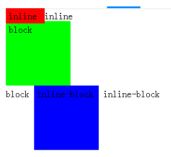
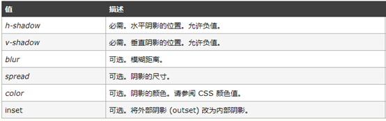
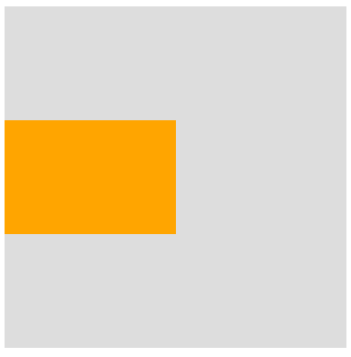
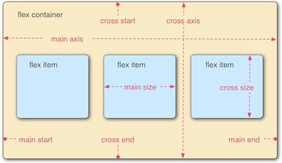
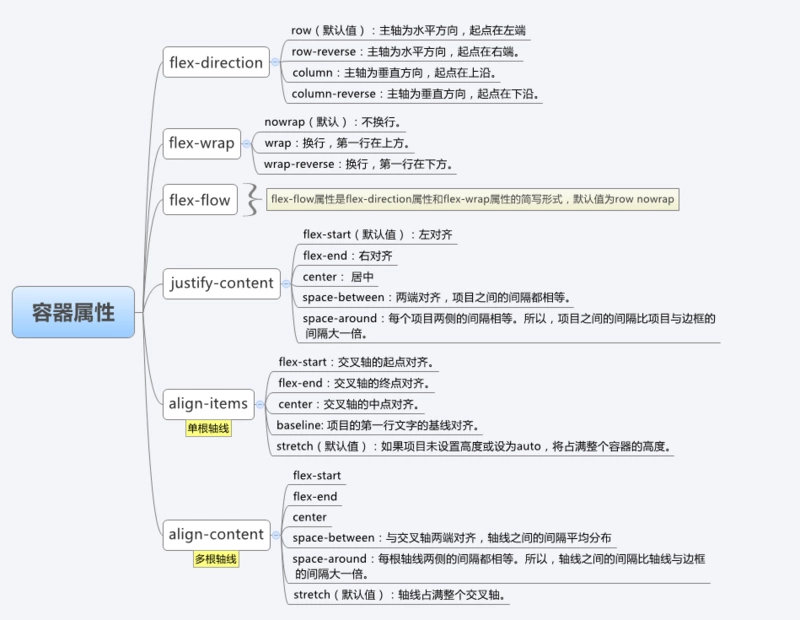
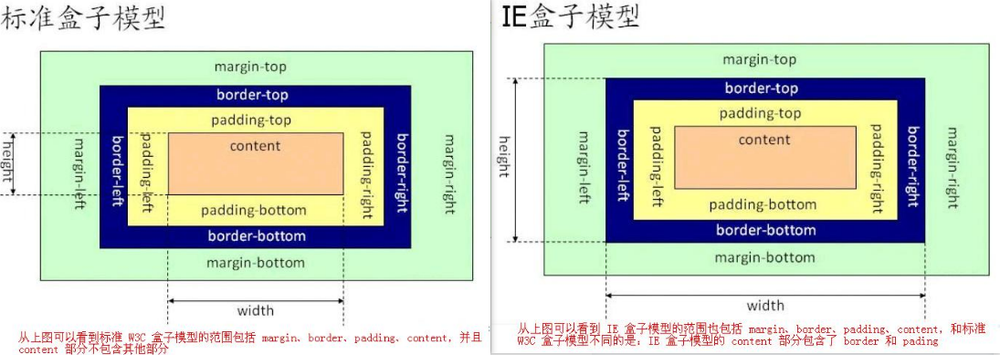
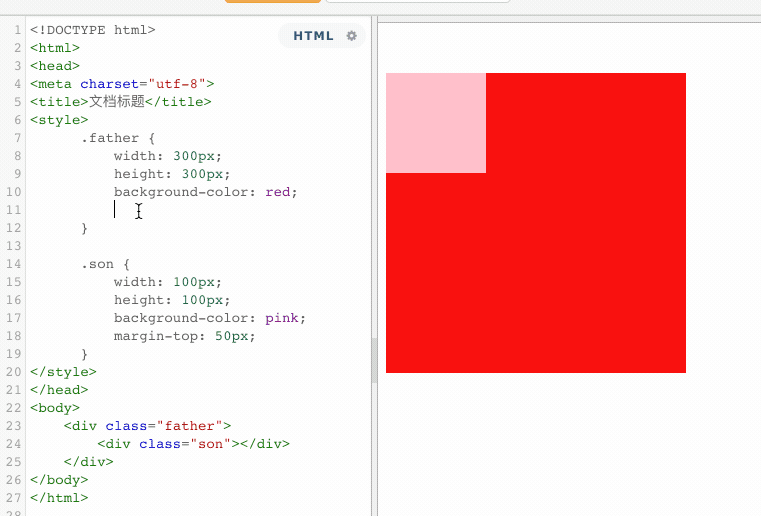
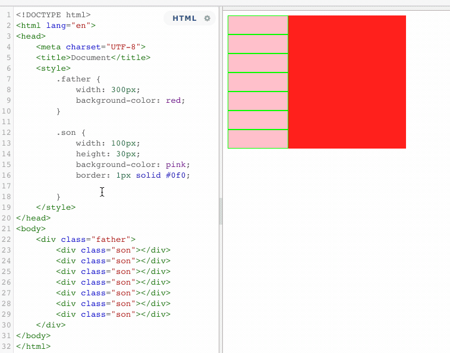
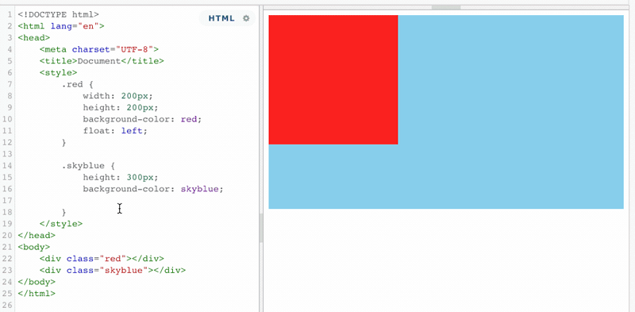
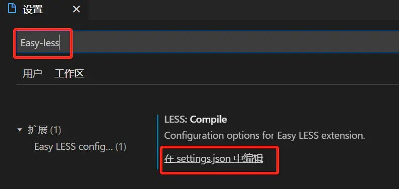

## CSS

### CSS通用

> ```bash
> ## css
> css指的是层叠样式表，也称级联样式表
>
>
> ### css 引入方式
> 1. 行内式
> 2. 嵌入式
> 2. 链接式
>
> ### 层叠样式表优先级
> - 行内 > 内部 > 外部
> - ID选择器 > 类选择器 > 标签选择器
>
>
> ### 初始化css样式原因
> 因为浏览器的兼容问题，不同浏览器对有些标签的默认值不同，如果不初始化css，会导致不同浏览器页面间的显示差异。
>
>
> ### 重置（resetting）CSS 和 标准化（normalizing）CSS 的区别是什么？
> - 重置（Resetting）：重置意味着除去所有的浏览器默认样式。对于页面所有的元素，像 margin、padding、font-size 这些样式全部设置成一样，你将必须重新定义各种元素的样式。
> - 标准化（Normalizing）：标准化没有去掉所有的默认样式，而是保留了有用的一部分，同时还纠正了一些常见错误。
> 当需要实现非常个性化的网页设计时，我会选择重置的方式，因为我要写很多自定义的样式以满足设计需求，这时候就不再需要标准化的默认样式了。
>
>
>
> ### 如何为功能受限的浏览器提供页面？ 使用什么样的技术和流程？
> - 优雅的降级：为现代浏览器构建应用，同时确保它在旧版浏览器中正常运行。
> - 渐进式增强：构建基于用户体验的应用，但在浏览器支持时添加新增功能。
> - 利用 [caniuse.com](https://caniuse.com/) 检查特性支持。
> - 使用 `autoprefixer` 自动生成 CSS 属性前缀。
> - 使用 [Modernizr](https://modernizr.com/)进行特性检测。
>
>
>
> ### 有什么不同的方式可以隐藏内容（使其仅适用于屏幕阅读器）？
>     - `width: 0; height: 0`：使元素不占用屏幕上的任何空间，导致不显示它。
>     - `position: absolute; left: -99999px`： 将它置于屏幕之外。
>     - `text-indent: -9999px`：这只适用于`block`元素中的文本。
>     - Metadata： 例如通过使用 Schema.org，RDF 和 JSON-LD。
>     - WAI-ARIA：如何增加网页可访问性的 W3C 技术规范。
> 即使 WAI-ARIA 是理想的解决方案，我也会采用绝对定位方法，因为它具有最少的注意事项，适用于大多数元素，而且使用起来非常简单。
>
>
> ### 编写高效的 CSS 应该注意什么？
> 首先，浏览器从最右边的选择器，即关键选择器（key selector），向左依次匹配。根据关键选择器，浏览器从 DOM 中筛选出元素，然后向上遍历被选元素的父元素，判断是否匹配。选择器匹配语句链越短，浏览器的匹配速度越快。避免使用标签和通用选择器作为关键选择器，因为它们会匹配大量的元素，浏览器必须要进行大量的工作，去判断这些元素的父元素们是否匹配。
>
> BEM (Block Element Modifier)原则上建议为独立的 CSS 类命名，并且在需要层级关系时，将关系也体现在命名中，这自然会使选择器高效且易于覆盖。
>
> 搞清楚哪些 CSS 属性会触发重新布局（reflow）、重绘（repaint）和合成（compositing）。在写样式时，避免触发重新布局的可能。
> ```
>

#### 通用类名

> ```css
> 头部：					header
> 内容：					content/container
> 页脚/尾部：		 footer
> 导航：					nav
> 侧栏：					sidebar
> 栏目：					column
> 滚动：					scroll
> 登录条：			  loginbar
> 标志：					logo
> 广告：					banner
> 页面主体：			 main
> 热点：					hot
> 新闻：					news
> 下载：					download
> 子导航：			 subnav
> 菜单：					menu
> 子菜单：			 submenu
> 搜索：				  search
> 友情链接：      friendlink
> 版权：		      copyright
> ```

#### 各大浏览器的最小字体

> - 五大浏览器默认字体大小均为16px。
> - 将html的font-size大小设成小于浏览器最小字体时，在页面内使用rem时浏览器还是会默认为浏览器的最小字体大小。
> - 所以为了防止出现浏览器兼容性问题，将html的font-size设为>=12px是一个很好的选择。
>
> | 五大浏览器   | Chrome（87.0） | Firefox（83.0） | IE（5 7 8 9 10 11） | Edge（87.0） | Opera （72.0） | Safari （5.1.7） |
> | ------------ | -------------- | --------------- | ------------------- | ------------ | -------------- | ---------------- |
> | 最小字体大小 | 6px            | 0               | 0                   | 0            | 12px           | 0                |
> | 其他浏览器   | 搜狗浏览器     | 360浏览器       | QQ浏览器            | UC浏览器     | 水狐浏览器     | 星愿浏览器       |
> | 最小字体大小 | 12px           | 12px            | 12px                | 12px         | 0              | 12px             |


### css引入方式

> ```bash
> ## CSS 样式的四种引入方式
>     1. 行内样式（`inline-style`）
>     在标签内使用 style 属性来定义样式。
>         <div style="width: 200px;"></div>
>
>
>     2. 内联样式
>     在 `<style>` 标签内声明样式
>         <style type="text/css">
>           p { padding: 10px; }
>         </style>
>
>
>     3. 链接样式
>     通过 `<link>` 标签加载外部样式
>         <link type="text/css" rel="stylesheet" href="style.css">
>
>
>     4. 导入样式
>     在 `<style>` 标签内利用 `@import` 来引入外部样式
>         <style type="text/css">
>           @import url(style.css);
>         </style>
>
>
>
> ### css引入的两种方式：link 和 @import 的区别
> 1. 遵循规范不同
>    link 是 XHTML 标签，除了加载 CSS 外，还可以定义 RSS 等其它事务；
>    @import 属于 CSS 范畴，只能加载 CSS。
>
> 2. 加载方式不同
>    link 引入 CSS 时，在页面载入时同时加载；
>    @import 需要页面完全载入后才加载。
>
> 3. 兼容性不同
>    link 是 XHTML 标签，无兼容问题；
>    @import 是在 CSS2.1 中提出的，低版本的浏览器不支持。
>
> 4. 动态加载性不同
>    link 支持使用 JS 控制 DOM 去改变样式；
>    @import 不支持这样的操作。
>    （JS 可以获取 link 标签元素，但获取不到 @import，因为 @import 只是一种 CSS 语法）
> ```

### css选择器

> ```bash
> ## CSS 选择器类型
>   1. ID选择器　　				     #myid
>   2. 类选择器　　					    .myclass
>   3. 元素（标签）选择器　       div, h1, p
>   4. 属性选择器　　	          a[rel="external"], input[type="text"]
>   5. 伪类　　	 	 					    a:hover, li:nth-child
>   6. 伪元素　　					     ::first-line, div::before, div::after
>   7. 通配符选择器（派生）		    *
>   8. 子选择器(关系选择器)	 		 div > a
>   9. 相邻同胞选择器(关系选择器)	 div + p
>   10.后代选择器(关系选择器)	     li a
>
>
> ## CSS 样式优先级
> - `!important > 行内样式 > ID选择器 > 类/属性/伪类选择器 > 标签/伪元素选择器 > 通配符/关系 > 继承样式 > 默认`
> - 当样式中包含多种选择器时，需要将多种选择器的优先级相加然后再进行比较。
> - 但注意，选择器的优先级计算不会超过它的最大数量级，如果选择器的优先级一样，前面定义的样式会被后面的样式覆盖
> - 伪类的顺序：`:link  、 :visited 、 :hover 、 :active`
>
>
> ## CSS 样式权重计算规则
>   - 内联样式的权重：1000
>   - ID选择器的权重：0100
>   - 类选择器、伪类选择器和属性选择器的权重： 0010
>   - 标签选择器和伪元素选择器的权重：0001
>   - 通配符选择器、关系选择器（子、相邻、后代）的权重：0000
>   - 继承的样式没有权值
>   - !important 的作用是提升优先级，加了这句的样式的优先级是最高的等级
>   注意：在同权重情况下，前面的样式会被后面的样式覆盖。
> 	### 选择器比较规则
>       如：1,0,0,0 > 0,99,99,99，也就是说从左往右逐个等级比较，前一等级相等才往后比
>       		1，   0 ，   0，   0
>       		0,   99 ，  99 ，  99
> ```

#### 属性选择器(css3新增)

> ```bash
> # 属性选择器（CSS3新增）：属性选择器可以根据元素的特定属性来选择元素，这样就可以不用借助类或者id选择器
>   - E[attr]：该选择器定位具有属性attr的任何元素E：
>   - E[attr=val]：该选择器定位具有属性attr且属性值为val的任何元素E：
>   - E[attr|=avl]：该选择器定位具有属性attr且属性值为val或以val-开始的任何元素E：
>   - E[attr~=val]：该选择器定位具有属性attr且属性值为完整单词 val 的任何元素E：
>   - E[attr^=val]：该选择器定位具有属性attr且属性值以val开头的任何元素E：
>   - E[attr$=val]：该选择器与E[attr^=val]正好相反，定位具有属性attr且属性值以val结尾的任何元素E：
>   - E[attr*=val]：该选择器与E[attr~=val]相似，但更进一步，定位具有属性attr且属性值任意位置包含val的元素E，val可以是一个完整的单词，也可以是一个单词中的一部分
>  >>> 注意：标签和[]中间不能加空格
> ```
>
> ````css
> /* 属性选择器可以根据元素的特定属性来选择元素，这样就可以不用借助类或者id选择器 */
> /* 注意：标签和[]中间不能加空格 */
> 1、td[title="a"]
> 	-->title属性值为a的td元素会被选择
>
> 2、td[title~="c"]
> 	-->title属性值包含“c，且c前后只能有空格”的td元素会被选择
>
> 3、td[title|="h"]
> 	-->title属性值为“h开头，且h只能为独立单词，后面可跟连字符”的td元素会被选择
>
> 4、td[title^="icon"]
> 	-->title属性值为“icon开头”的td元素会被选择
>
> 5、td[title$="con"]
> 	-->title属性值为“con结尾”的td元素会被选择
>
> 6、td[title*="xxx"]
> 	-->title属性值“包含xxx”的td元素会被选择
> ````

#### 选择器分类

> ```bash
> ## 选择器分类
> 1、CSS并集选择器
>
> 2、CSS交集选择器
>
> 3、CSS派生选择器
> 		子代：p>em {}
> 		兄弟：p+em {}
> 		后代：p em {}
> 		元素1~元素2：
>
> 4、CSS伪类选择器
> 	-->必须按顺序写：a:link，	a:visited，	a:hover，	a:active
> 		link:链接被访问前选中;		visited:链接被访问之后选中
> 		hover:鼠标悬停在链接上;		active:链接被按下后
> 	还有其他伪类：li:first-child       input:focus
>
> 5、伪元素选择器
> 	-->h1::before，h2::after， p::first-line
>
> 6、兄弟选择器：
> -->元素1~元素2：第1 个元素之后所有的元素2 都会被选择，且这些元素和第一个元素拥有同一个父元素（两个元素之间不一定要相邻）
> ```

#### 结构伪类选择器

> ````bash
> ## 结构伪类选择器
> 结构伪类选择器主要根据 文档结构 来选择元素，常用于根据父级选择器里面的子元素
>
> ## 选择符
> 	E:first-child			匹配父元素中的第一个子元素 E
> E:liast-child			匹配父元素中最后一个子元素 E
> E:nth-child(n)		匹配父元素中的第 n 个子元素 E
> E:first-of-type		指定类型 E 的第一个
> E:last-of-type		指定类型 E 的最后一个
> E:nth-of-type(n)	指定类型 E 的第 n 个
>
>
> ## nth-child(n) 选择某个父元素的一个或多个特定子元素
> - n 如果是数字，就是选择第 n 个子元素，里面数字从 1 开始
> - n 如果是关键字：even 偶数、odd 奇数
> - n 如果是公式：常见的公式如下（如果 n 是公式，则从 0 开始计算，但是第 0 个元素或者超出了元素的个数会被忽略）
> ````

#### 伪元素

> ```bash
> ### 伪元素
> CSS 伪元素是添加到选择器的关键字，去选择元素的特定部分。它们可以用于装饰（:first-line，:first-letter）或将元素添加到标记中（与 content:...组合），而不必修改标记（:before，:after）。
>   - :first-line和:first-letter可以用来修饰文字。
>   - 上面提到的.clearfix方法中，使用clear: both来添加不占空间的元素。
>   - 使用:before和after展示提示中的三角箭头。鼓励关注点分离，因为三角被视为样式的一部分，而不是真正的 DOM。如果不使用额外的 HTML 元素，只用 CSS 样式绘制三角形是不太可能的。
> ```

### 颜色的表示方式

> ```bash
> ## 颜色的表示方式
> 1. 预定义颜色名称：英文单词表达颜色
> 2. HEX：十六进制表示颜色：`＃RRGGBB,其中RR（红色），GG（绿色）和BB（蓝色）`
> 3. RGB表示颜色：`rgb(red Number, green Number, blue Number)，其中每个颜色数值取值范围为 0~255 `
> 4. HSL表示颜色：`hsl(色相, 饱和度, 亮度)`
> 		- 其中色相是在色轮上的程度（从0到360）：-0（或360）是红色的，120是绿色的，240是蓝色的。
> 		- 饱和度是一个百分比值，0％意味着灰色和100％的阴影，是全彩。
> 		- 亮度也是一个百分比，0％是黑色的，100％是白色的
> ```
>
> ```css
> .color1 { background-color: orange; }
>
> .color2 { background-color: #FFFF00; }
>
> .color3 { background: rgb(0,255,0); }
>
> .color4 { background-color: hsl(360,50%,50%); }
> ```

### **图片背景background**

> ```bash
> 1. 背景平铺
> background-repeat:repeat|no-repeat|repeat-x|repeat-y;
>
> 2. 背景图片位置	方位名词有：top|center|bottom|left|right
> background-position:x y;
>
> 3. 背景图像固定
> background-attachment:scroll|fixed;
>
> /4. 背景复合写法background:背景颜色 背景图片地址 背景平铺 背景图像滚动 背景图片位置
> background:transprent url('img.jpg') repeat-y fixed top;	//背景透明，图像固定，图片在位置上方，向y轴平铺
> ```

### 边框 border

> ```bash
> ## 边框 border
> - border: border-width | border-style | border-color;
> - border-collapse控制浏览器绘制表格边框方式。border-collapse:collapse;//表示香菱边框合并一起。
> - 边框会额外增加盒子的实际大小。解决方案：①测量盒子时不量边框；②如果测量时包含边框，则需width/height减去边框宽度。
> ```
>
> #### 绘制三角形
>
>
> ```css
> // CSS绘制三角形
> .triangle {
>   width:0;
>   height:0;
>   border-right:100px solid transparent;
>   border-left:100px solid transparent;
>   border-bottom:100px solid #3f6a6a;
> }
> ```

### 内边距padding

```bash
## 内边距 padding
内边距是设置边框与内容之间的距离。

问题：当给盒子指定 padding 值后，内容和边框有了距离，再添加内边距，容器宽高变大（padding 影响了盒子实际大小）
解决方案：如果想保证盒子与效果图大小保持一致，则让 width/height 减去多出的内边距大小。
```


### 外边距margin

```bash
## 外边距 margin
外边距为控制盒子和盒子之间的距离。


## 外边距让块级盒子水平居中的条件
1. 盒子必须设置宽度 width
2. 盒子的左右外边距都设置值为 auto


## 使用 margin 属性定义块元素的垂直边距时，可能会出现外边距的合并
造成这种现象主要是两种情况
1. 情况一：相邻元素垂直外边距的合并（尽量不给上下相邻盒子都设置外边距）
2. 情况二：嵌套块元素垂直外边距的塌陷
		- 可为父元素定义上边框
		- 可为父元素定义上内边距
		- 可为父元素添加 `overflow: hidden`


## 清除内外边距
`padding: 0; margin: 0;`

## 事先定义盒模型的尺寸解析方式box-sizing
- box-sizing:content-box | border-box | inherit
- content-box：默认值，实际的宽度和高度=border+padding+设置内容的宽高;
- border-box:设置的内容宽度=实际的宽度和高度；
- inherit：此值使元素继承父元素的盒模型模式
```


### object-fit

> **`object-fit`** [CSS](https://developer.mozilla.org/zh-CN/docs/Web/CSS) 属性指定[可替换元素](https://developer.mozilla.org/zh-CN/docs/Web/CSS/Replaced_element)（例如：[``](https://developer.mozilla.org/zh-CN/docs/Web/HTML/Element/img) 或 [``](https://developer.mozilla.org/zh-CN/docs/Web/HTML/Element/video)）的内容应该如何适应到其使用高度和宽度确定的框。
>
> 您可以通过使用属性来切换被替换元素的内容对象在元素框内的对齐方式
>
> - [`object-fit`](https://developer.mozilla.org/zh-CN/docs/Web/CSS/object-fit)属性指定可替换元素（例如`img、video`）的内容应该如何适应到其使用高度和宽度确定的框。
> - 可通过使用 [`object-position`](https://developer.mozilla.org/zh-CN/docs/Web/CSS/object-position) 属性来切换被替换元素的内容对象在元素框内的对齐方式。
>
> ```css
> - contain：被替换的内容将被缩放，以在填充元素的内容框时保持其宽高比。整个对象在填充盒子的同时保留其长宽比，因此如果宽高比与框的宽高比不匹配，该对象将被添加“黑边”。
> - cover：被替换的内容在保持其宽高比的同时填充元素的整个内容框。如果对象的宽高比与内容框不相匹配，该对象将被剪裁以适应内容框。
> - fill：被替换的内容正好填充元素的内容框。整个对象将完全填充此框。如果对象的宽高比与内容框不相匹配，那么该对象将被拉伸以适应内容框。
> - none：被替换的内容将保持其原有的尺寸。
> - scale-down：内容的尺寸与 none 或 contain 中的一个相同，取决于它们两个之间谁得到的对象尺寸会更小一些。
> ```

### 鼠标`cursor`

> - `auto`：默认值。浏览器根据当前情况自动确定鼠标光标类型。
> - `pointer`：IE6.0，竖起一只手指的手形光标。就像通常用户将光标移到超链接上时那样。
> - `hand`：和`pointer`的作用一样：竖起一只手指的手形光标。就像通常用户将光标移到超链接上时那样。
>
> ```css
> - all-scroll      :　 IE6.0  有上下左右四个箭头，中间有一个圆点的光标。用于标示页面可以向上下左右任何方向滚动。
> - col-resize      :　 IE6.0  有左右两个箭头，中间由竖线分隔开的光标。用于标示项目或标题栏可以被水平改变尺寸。
> - crosshair       :　  简单的十字线光标。
> - default         :　  客户端平台的默认光标。通常是一个箭头。
> - hand            :　  竖起一只手指的手形光标。就像通常用户将光标移到超链接上时那样。
> - move            :　  十字箭头光标。用于标示对象可被移动。
> - help            :　  带有问号标记的箭头。用于标示有帮助信息存在。
> - no-drop         :　 IE6.0  带有一个被斜线贯穿的圆圈的手形光标。用于标示被拖起的对象不允许在光标的当前位置被放下。
> - not-allowed     :　 IE6.0  禁止标记(一个被斜线贯穿的圆圈)光标。用于标示请求的操作不允许被执行。
> - progress        :　 IE6.0  带有沙漏标记的箭头光标。用于标示一个进程正在后台运行。
> - row-resize      :　 IE6.0  有上下两个箭头，中间由横线分隔开的光标。用于标示项目或标题栏可以被垂直改变尺寸。
> - text            :　  用于标示可编辑的水平文本的光标。通常是大写字母 I 的形状。
> - vertical-text   :　 IE6.0  用于标示可编辑的垂直文本的光标。通常是大写字母 I 旋转90度的形状。
> - wait            :　  用于标示程序忙用户需要等待的光标。通常是沙漏或手表的形状。
> - *-resize        :　  用于标示对象可被改变尺寸方向的箭头光标。
> - 	 w-resize | s-resize | n-resize | e-resize | ne-resize | sw-resize | se-resize | nw-resize
> - url ( url )     :　 IE6.0  用户自定义光标。使用绝对或相对 url 地址指定光标文件(后缀为 .cur 或者 .ani )。
> ```

### 模式转换 display

> ```bash
> ## 模式 display
> display 的属性值有：
>     - none
>     - block
>     - inline
>     - inline-block
>     - table
>     - table-row
>     - table-cell
>     - list-item
> ```
>
> 
>
> | -                               | `block`                                                     | `inline-block`                             | `inline`                                                     |
> | ------------------------------- | ----------------------------------------------------------- | ------------------------------------------ | ------------------------------------------------------------ |
> | 大小                            | 填充其父容器的宽度。                                        | 取决于内容。                               | 取决于内容。                                                 |
> | 定位                            | 从新的一行开始，并且不允许旁边有 HTML 元素（除非是`float`） | 与其他内容一起流动，并允许旁边有其他元素。 | 与其他内容一起流动，并允许旁边有其他元素。                   |
> | 能否设置`width`和`height`       | 能                                                          | 能                                         | 不能。 设置会被忽略。                                        |
> | 可以使用`vertical-align`对齐    | 不可以                                                      | 可以                                       | 可以                                                         |
> | 边距（margin）和填充（padding） | 各个方向都存在                                              | 各个方向都存在                             | 只有水平方向存在。垂直方向会被忽略。 尽管`border`和`padding`在`content`周围，但垂直方向上的空间取决于`'line-height'` |
> | 浮动（float）                   | -                                                           | -                                          | 就像一个`block`元素，可以设置垂直边距和填充。                |


### 字体属性 font

> ```bash
> ## font顺序 :
> font: font-style | font-variant | font-weight | font-size | line-height | font-family
> 	翻译为样式、异体、粗细、大小/行高（一般设置为size+10px）、字体系列
>
> 注意1：
> 简写时，font-size和line-height只能通过斜杠/组成一个值，不能分开写。
> 其中不需要设置的属性可省略（取默认值为normal），但必须保留font-size和font-family属性，否则font属性将不起作用。
>
> 注意2：
> 当 `600 <= font-weight <= 900` 时，字体会自动加粗
>
> 示例：
> `p {font: italic bold 20px/24px "微软雅黑";}`
> ```

### 文本属性text

> ```css
> 1、字间距：letter-spacing和word-spacing
> 	-->letter-spacing为每个字符之间的空白距离，word-spacing为单词之间的空白距离
>
> 2、行高：line-height（一般设置为size+10px）
>
> 3、文本书写方向：direction：规定文本的方向 / 书写方向。
> 	-->ltr 默认。文本方向从左到右。      rtl 文本方向从右到左
>
> 4、文本轮廓：text-shadow:2px 2px 2px #fff
> 		-->X轴，Y轴，模糊程度(不可是负值)，阴影颜色 ；4个参数中，X和Y是必须的
>
> 5、添加到文本的修饰：text-decoration（下划线、上划线、删除线等）
> text-decoration: underline/overline/line-through
>
> 5、文本排列：text-align:left/center/right
>
> 7、段落首行缩进：text-indent
>
> 8、控制文本大小写：text-transform
>
> 9、指定元素内的空白怎样处理：white-space: pre/nowrap
> ```
>
> ```bash
> ## 文字排列顺序 writing-mode
>   - 默认水平排列：`writing-mode:horizontal-tb`。
>   - 所有属性如下：
>       - horizontal-tb：水平方向自上而下的书写方式。即 left-right-top-bottom
>       - vertical-rl：垂直方向自右而左的书写方式。即 top-bottom-right-left
>       - vertical-lr：垂直方向内内容从上到下，水平方向从左到右
>       - sideways-rl：内容垂直方向从上到下排列
>       - sideways-lr：内容垂直方向从下到上排列
> ```

#### 内容超出以后显示省略点

> ```css
> // 单行溢出显示省略号
> display: block;
> white-space:nowrap;	// 文本不换行，只显示一行文字
> overflow:hidden;	// 超出内容框的隐藏
> text-overflow:ellipsis;	// 用省略号显示超出的部分
>
>
> //两行超出隐藏
> overflow: hidden;	// 超出的隐藏显示
> text-overflow:ellipsis;	// 省略号显示溢出部分
> display:-webkit-box;	// 弹性伸缩盒子模型显示
> -webkit-line-clamp:2;	// 限制在一个块元素显示的文本行数
> -webkit-box-orient:vertical;	// 设置或检索伸缩盒对象的子元素的排列顺序
> word-wrap: break-word;	//换行（若不设置会不换行，从而导致只显示一行）
> line-height: 30rpx;
> height: 60rpx;	// 一般来说，应设定高度=行高*显示的行数,防止超出的文字露出
> ```
>
> **注意**
>
> 1. **内容超出显示的，通过省略号来显示，需要制定高度和行高，防止超出的文字露出（**应设定 高度 = 行高*显示的行数）
> 2. 给p::after添加渐变背景可避免文字只显示一半。
> 3. 由于ie6-7不显示content内容，所以要添加标签兼容ie6-7（如：`<span>…<span/>`）；兼容ie8需要将::after替换成:after

#### **单行文字垂直居中**

> - 如故宫行高小于盒子高度，文字会偏上，如果行高大于盒子高度，则文字偏下。

#### 内容超出换行显示

> 当内容过多时如果是英文不会造成换行，如果希望内容换行，在标签的样式中加入`word-wrap:break-word;`
> 如果是中文会造成换行，如果不希望内容换行，在标签的样式中加入`white-space:nowrap;`
>
> ```css
> word-break:normal;
> display:block;
> word-wrap:break-word;
> overflow: hidden;
> ```

#### 文本显示空格、换行

> - 使用 css 属性 ：**white-space:pre-wrap**
>
> - 注意：设置space和decode属性必须在`<text>`标签中使用
>
> ```html
> <view style="white-space:pre-wrap">
> 	文本保留空格和回车
> </view>
>
> 2.连续空格  注意：必须在<text>标签中使用
> <text space="ensp">你好 啊      哈哈哈（空格是中文字符一半大小）</text>
> <text space="emsp">你好 啊      哈哈哈（空格是中文字符大小）</text>
> <text space="nbsp">你好 啊      哈哈哈（空格根据字体设置）</text>
> <text decode="{{true}}">&ensp;（空格是中文字符一半大小）\n&emsp;（空格是中文字符大小）\n&nbsp;（空格根据字体设置）</text>
> ```

#### 内容可编辑 contenteditable

> - contenteditable 属性指定元素内容是否可编辑(默认继承父元素)
> - `<element contenteditable="true|false">`
> - **注意：** 当元素中没有设置 contenteditable 属性时，元素将从父元素继承。
>
> ```html
> <p contenteditable="true">这是一个可编辑段落。</p>
> ```

### 盒子阴影`box-shadow`

> div盒子添加 box-shadow 属性，多边阴影需要用逗号隔开
>
> ```css
> 语法：box-shadow: h-shadow v-shadow blur spread color inset;
> ```
>
> 
>
> ```css
> //添加阴影最常见写法：
> div{ box-shadow: 10px 5px #888888; }
>
> // 例1、三边阴影
> div{ box-shadow: 0 0 0 gray,
>      		5px 5px 5px gray,
>      		0 5px 5px gray,
>      		-5px 5px 5px gray; }
>
> // 例2、内阴影：塌陷
> div{ box-shadow: 0 0 15px black inset; }
> ```

### 浮动 float

> ```bash
> ## 浮动 float
> 浮动（float）是 CSS 定位属性。浮动元素从网页的正常流动中移出，但是保持了部分的流动性，会影响其他元素的定位（比如文字会围绕着浮动元素）。这一点与绝对定位不同，绝对定位的元素完全从文档流中脱离。
>
> CSS 的clear属性通过使用left、right、both，让该元素向下移动（清除浮动）到浮动元素下面。
>
>
> ### 浮动产生的影响：高度塌陷
> 由于浮动元素会脱离文档流，所以导致不占据页面空间，所以会对父元素高度带来一定影响。
> 如果一个父元素只包含浮动元素，那么该父元素的高度将塌缩为 0。（高度塌陷）
> 我们可以通过清除（clear）从浮动元素后到父元素关闭前之间的浮动来修复这个问题。
>
>
>
> ### 清除浮动的方法
> 有一种 hack 的方法，是自定义一个.clearfix类，利用伪元素选择器::after清除浮动。另外还有一些方法，比如添加空的<div></div>和设置浮动元素父元素的overflow属性。与这些方法不同的是，clearfix方法，只需要给父元素添加一个类。
> 值得一提的是，把父元素属性设置为overflow: auto或overflow: hidden，会使其内部的子元素形成块格式化上下文（Block Formatting Context），并且父元素会扩张自己，使其能够包围它的子元素。
> ```

#### 清除浮动方式

> ```bash
> ## 浮动 float
> - 浮动的作用：当父元素不给高度时，内部元素如果不浮动则不会撑开；而浮动时，父元素会变成一条线。
> - 使用clear清除浮动的原理：元素盒子的变不能和前面的浮动元素相邻，对元素设置 clear 属性时为了避免浮动元素对该元素的影响，而不是直接清除掉浮动。
> - `clear:both`：本质是闭合浮动，即是让父盒子闭合出口和入口，不让子盒子出来。
>
>
> ### 清除浮动的方式
> 1. 额外标签法：在最后一个浮动标签后新加一个标签并设置属性`clear：both;`
> 2. 父元素添加`overflow:hidden/auto`，通过触发BFC方式，实现清除浮动
> 3. 在父元素中使用after伪元素清除浮动，在:after中添加设置模式为块元素，并通过`clear:both`清除浮动
> 4. 在父元素中使用before和after双伪元素清除浮动，设置模式为table元素，并在after中清除浮动
>
> 注意：即使清除浮动，当超出父元素的内容还是会溢出，所以建议在父元素中定义`overflow:hidden/auto`；且在定义浮动后，若子盒子宽度超出父盒子宽度，超出部分的子盒子会换行显示（是超出部分的整个子盒子，而不是子盒子的内容）
> ```
>
> ```css
> //1.额外标签法
> <div style="clear:both"></div>
>
> //2.父级添加overflow属性；(会无法显示溢出部分)
> overflow:hidden/scroll/auto;
>
> //3.父级添加before和after双伪元素
> .clearfix:before,.clearfix:after{
>   content:'';
>   display:table;
> }
> .clearfix:after{
>   clear:both;
> }
> .clearfix{
>   *zoom:1; /*ie6清除浮动的方式 *号只有IE6-IE7执行，其他浏览器不执行*/
> }
>
> //4.父级添加伪元素after
> .clearfix:after{
>   content:'';
>   display:block;
>   height:0;
>   cleat:both;
>   visibility:hidden;
> }
> .clearfix{
>   *zoom: 1; /* ie6清除浮动的方式 *号只有IE6-IE7执行，其他浏览器不执行*/
> }
> ```

#### margin负值应用

>- 主要是去除浮动后，两个盒子的margin叠在一起显得边距为两倍
>- 让每个盒子margin往左移动-1px正好压住相邻盒子边框
>- 鼠标经过某个盒子时，提高当前盒子的层级(如果没有定位，则设置相对定位(保留当前位置)；如果有定位，则加z-index)
>
>```css
>ui li {
> float: left;
> list-style: none;
> width: 50px;
> height: 100px;
> border: 1px solid red;
> margin-left: -1px;	// 根据元素大小改变(需调节)
>}
>// 鼠标移动到该区域，该区域的边框颜色改变(根据margin-left为负值后，会被后一个盒子的边框颜色覆盖，导致无法改变边框颜色)
>ul li:hover {
> position: relative;	/* 没有定位时使用 */
> border: 1px solid blue;
> /* z-index: 1; */  /* 有定位时使用 */
>}
>```

### 定位 position

> ```bash
> ## 定位 position
> - 作用：通过定位可以移动元素位置
> - 使用场景：当页面中出现盒子压盒子的效果时，推荐使用定位
> - 特点：定位体现的是元素之间的层级关系
> - 定位分类：
> 			1. 静态定位`static`
> 			2. 绝对定位`absolute`
> 			3. 相对定位`relative`
> 			4. 固定定位`fixed`
> 			5. 粘性定位`sticky`
> - 定位问题：要设置坐标，必须先脱离文档流(即设置定位)
> - 定位叠放次序：z-index：（数值越大，盒子越靠上），只有定位的盒子才能发挥作用
> - 清除定位的方法：给设置定位的标签的样式中设置`position: static`
>
>
> ### 静态(默认)定位 static
> - 在该定位下会忽略以下属性：left、right、top、bottom、z-index
> - 静态定位的元素就是标准流的显示方式，且不能移动元素的位置
> - 清除定位的方法就是给设置定位的标签设置静态定位`position: static`
>
>
> ### 固定定位 fixed
> - 固定定位的元素始终以浏览器窗口（body标签）的可视区域为参照设置定位（在可见区域内滑动滚动条，还是固定在当前位置）
> - 固定定位的元素脱标不占位，可以实现模式转换
>
>
> ### 相对定位 relative
> - 生成相对定位的元素，相对于其正常位置进行定位，定位的元素仍然占据文档的空间，元素的宽高不变，设置偏移量也不会影响其他元素的位置。
> - 最外层容器设置为relative定位，在没有设置宽度的情况下，宽度是整个浏览器的宽度。
> - 不能实现模式转换，一般设置为父相子绝。
> - 注意：当给元素添加`transform`属性，则该元素具备`relative`的特性。
>
>
> ### 绝对定位 absolute
> - 相对于离自己最近且定义了非静态定位的父元素的位置进行定位，若全部父元素没有定位属性，则相对于浏览器窗口(body标签)左上角进行定位。
> - 绝对定位的元素会脱标，不再占据文档的空间。
> - 绝对定位可以实现模式转换。
>
>
> ### 粘性定位 sticky
> - 元素先按照普通文档流定位，然后相对于该元素在流中的 flow root(BFC) 和 containing block(最近的块级组件元素)定位。而后，元素定位表现为在跨域特定阈值之前为相对定位，之后为固定定位。
> - 以浏览器的可视窗口为参照点移动元素，且元素会占据原先位置，必须添加 `left、right、top、bottom、z-index` 其中一个属性才有效。
> 粘性定位的特点：
> 	- 以浏览器的可视窗口为参照点移动元素（固定定位特点）
> 	- 粘性定位占有原先位置（相对定位特点）
> 	- 必须添加 top、left、right、bottom 其中一个属性才有效
> ```

#### 层叠上下文 z-index

> ```bash
> ### z-index
> - CSS 中的z-index属性控制重叠元素的垂直叠加顺序。
> - 定位元素的特点：只有定位的元素（除静态定位外）有层级关系，可通过`z-index`属性改变层级关系。
> - 层级特点：
>     - 层级越高的显示在越上层。
>     - 设置定位的元素默认层级`z-index`的值是`auto(0)`。
>     - 当 z-index 的值相同，则最后设置定位的元素层级要高于前面定位的元素【后来居上原则】。
>     - 当 z-index 值不同，则 z-index 值越大，该元素的层级越高。
>     - 如果元素的父元素设置 z-index 值，则父元素的 z-index 值越大，那么该元素的层级越高。
>
>
>
> ### z-index属性如何形成层叠上下文（stacking context）
> 没有定义z-index的值时，元素按照它们出现在 DOM 中的顺序堆叠（层级越低，出现位置越靠上）。非静态定位的元素（及其子元素）将始终覆盖静态定位（static）的元素，而不管 HTML 层次结构如何。
>
> 层叠上下文是包含一组图层的元素。 在一组层叠上下文中，其子元素的z-index值是相对于该父元素而不是 document root 设置的。每个层叠上下文完全独立于它的兄弟元素。如果元素 B 位于元素 A 之上，则即使元素 A 的子元素 C 具有比元素 B 更高的z-index值，元素 C 也永远不会在元素 B 之上.
>
> 每个层叠上下文是自包含的：当元素的内容发生层叠后，整个该元素将会在父层叠上下文中按顺序进行层叠。少数 CSS 属性会触发一个新的层叠上下文，例如opacity小于 1，filter不是none，transform不是none。
> ```

#### 哪些情况下会使 z-index 的行为发生变化

> ```bash
> ### 哪些情况下会使 z-index 的行为发生变化
> 正常情况下，元素的层叠规则遵循 “值越大位置越靠前，谁在后谁靠上”。
> 但在一些特殊情况下，层叠规则会有些不同。有如下情况：
>    * 元素为flex布局元素（父元素display：flex|inline-flex），同时z-index不为auto
>    * 元素的opacity值不是1
>    * 元素的transform不是none
>    * 元素mix-blend-mode知不是normal
>    * 元素的filter值不是none
>    * 元素的isolation值是isolate
>    * 元素的will-change属性值为上面2~6的任意一个（如will-change:opacity will-change:transform等）
>    * 元素的-webkit-overflow-scrolling设为touch
> ```

#### translate和相对定位

> ```bash
> ## 什么情况下，用translate()而不用相对定位？什么时候，情况相反。
> translate() 是 transform 的一个值。
>
> 改变 transform 或 opacity 不会触发浏览器重新布局（reflow）或重绘（repaint），只会触发复合（compositions）。而改变绝对定位会触发重新布局，进而触发重绘和复合。
>
> transform 使浏览器为元素创建一个 GPU 图层，但改变绝对定位会使用到 CPU。 因此 translate() 更高效，可以缩短平滑动画的绘制时间。
>
> 当使用 translate() 时，元素仍然占据其原始空间（有点像position：relative），这与改变绝对定位不同。
> ```

### 垂直方式 vertical-align

```bash
## 垂直方式 vertical-align
- 只针对 display 为 inline / inline-block / table-cell 的元素。

- `vertical-align` 解决图片底部默认空白缝隙问题(图片底侧会有一个空白缝隙，原因是行内块元素会合文字的基线对齐)
  - 解决方案1：给图片添加 `vertical-align:middle | top | bottom`(强制给图片一个默认高度)
  - 解决方案2：把图片转换为块级元素 `display:block`，使得 `vertical-align` 属性失效。

语法：`vertical-align: baseline | top | bottom | middle | text-top | text-bottom | sub | super | length units`
vertical-align 的关键字
  - `baseline` — 默认值。将元素与父元素的基线对齐。
  - `top` — 将元素与一行中最高元素的顶部对齐。
  - `bottom` — 将元素与底部对齐。
  - `middle` — 将元素与其父元素的中心对齐。
  - `text-top` — 使用其父元素行中最高字体的顶部对齐元素。
  - `text-bottom` — 使用其父元素行中最高字体的底部对齐元素。
  - `sub` — 将元素对齐到其父元素的基线下标。它的行为更像 `<sub>` 标签。
  - `super` — 将元素与父元素的基线上标对齐。它的行为更像 `<sup>` 标签

```


### 元素的可见性`overflow`

```bash
## 网页布局规避脱标流
1. 网页布局优先考虑标准流
2. 然后考虑使用浮动
3. 最后使用定位
4. 元素模式转换必须使用display


## 元素的可见性`overflow`
- `visible`：默认值。多余的内容不剪切也不添加滚动条，会全部显示出来。
- `hidden`：不显示超过对象尺寸的内容。
- `auto`：如果内容不超出，则不显示滚动条；如果内容超出，则显示滚动条。
- `scroll`：Windows 平台下，无论内容是否超出，总是显示滚动条。
```

```css
// 把元素隐藏起来
overflow:hidden;	//将溢出的部分隐藏
visibility:hidden;	//元素隐藏（隐藏的内容占位置一般用于)

display:none;		//元素隐藏（隐藏的内容不占位置一般用于导航栏部分内容的隐藏)
display:block;		//显示元素
```


## CSS架构-CSS的分层抽象

```bash
## CSS 架构
CSS 分层抽象是一种将 CSS 代码组织得更模块化、可维护和可扩展的技术。通过分层抽象，可以提升开发效率，减少代码重复，并且让样式的管理更加清晰。


### 为什么需要CSS架构？
在日常开发项目CSS，需要组件化时，组件内部的class样式类管理就非常的杂乱。 大部分公司的命名规则还是只有大小驼峰、使用英文等这些基础的命名规则。但经常会自己都忘记自己命名的css是啥，使用设计模式就能很好的解决该问题。

CSS 架构也能让 html 与 css 更好的解耦，能更好的抽取样式中可复用的部分，使 html 代码更具语义，也符合了 HTML5 中想让日常开发更具有语义化的理念。了解这些设计模式无疑会使 css 代码更具模块化，块样式不依赖于页面上的其他元素，因此也较好的避免了遇到级联问题。多人协作时也能高效避免命名重复问题。
```


#### BEM设计模式

```bash
## CSS架构之 BEM 设计模式
### 传统的命名规范 & BEM命名方法
传统的命名规范：该写法从 DOM 结构和类命名上可以了解每个元素的意义，但无法明确其真实的层级关系。在 css 定义时，也必须依靠层级选择器来限定约束作用域，以避免跨组件的样式污染。

BEM 的优点在于所产生的 CSS 类名都只使用一个类别选择器，模块层级关系简单清晰，可以避免传统做法中由于多个类别选择器嵌套带来的复杂的属性级联问题。
	- 模块化：块样式从不依赖于页面上的其他元素，因此您将永远不会遇到级联带来的问题。
	- 可重用性：以不同的方式构成独立的块，并以智能方式对其进行重用，从而减少了必须维护的 CSS 代码量。
	- 结构：BEM 方法为您的 CSS 代码提供了坚实的结构，使结构保持简单易懂。


什么时候推荐使用：当需要明确关联性的模块关系时，才推荐使用 BEM 格式。若只是一条公共的单独的样式（`.hide{display: none;}`），就没有使用 BEM 格式的意义。
缺点：BEM 的缺点是命名方式长而难看，但利用 LESS/SASS 等预处理器语言来编写 CSS，利用其语言特性可以优化这缺点。
注意：在深层次嵌套的 DOM 结构下，应避免过长的样式名称定义（如 `.block__el1__el2`）。


### 在流行框架的组件中使用 BEM 格式
在当前流行的 Vue.js / React / Angular 等前端框架中，都有 CSS 组件级作用域的编译实现，其基本原理均为利用 CSS 属性选择器特性，为不同的组件生成不同的属性选择器。
当选择这种局部作用域的写法时，在较小的组件中，BEM 格式可能显得没那么重要。但对于公共的、全局性的模块样式定义，还是推荐使用 BEM 格式。
另外，对于对外发布的公共组件来说，一般为了风格的可定制性，都不会使用这种局部作用域方式来定义组件样式。此时使用 BEM 格式也会大显其彩。
```

#### BEM 规范

```bash
### BEM 规范
BEM（Block Element Modifier）是CSS类的命名约定，旨在通过定义命名空间来解决范围问题来使 CSS 更具可维护性。
通过 Block、Element、Modifier 来描述页面，通过 `_` 与 `--` 连接。
BEM 原则上建议为独立的 CSS 类命名，并且在需要层级关系时，将关系也体现在命名中，这自然会使选择器高效且易于覆盖。

- block（块）是一个独立的组件，可在项目中重复使用，并充当子组件（元素）的 "命名空间"。
- 当 block（块）或 element（元素）处于特定状态或结构或样式不同时，将 modifier（修饰符）用作标志。


#### BEM 架构的定义
- B 代表模块：
    - Block(块)，独立实体块，有独立的意义，每个页面都可看做是多个 Block 组成。
    - 没有前缀，多个单词用 `-` 连接，是对一个组件名抽象。
    - `block {}`，block 代表了更高级别的抽象或组件。

- E 代表元素：
		- Element(元素)，block的一部分，没有独立意义，是组件下的一个元素，多个元素形成一个组件。
		- 元素在模块之后，可以有多个层级，以 `__` 连接。element 也不是死板的，是根据具体的需求演变的，中间也可以使用 `-` 来演变。
		- `block__element {}`，代表 `.block` 的后代，用于形成一个完整的 `.block` 的整体。

- M 代表修饰符：
		- Modifier(修饰符)，block或element上的标记，是描述Block或Element的属性或状态，同一个Block或Element可以有多个Modifier。
		- 某元素、或者某模块特别的状态，必须有一个状态名和状态值，使用 `--` 链接。
		- 主要针对的是 Block 本身，是对于Block做修饰。例如有：颜色、大小、用途。
		- `block--modifirer {}`，代表 `.block` 的不同状态或不同版本。

- 注意：
		- 使用两个连字符和下划线而不是一个是为了让你自己的块可以用单个连字符来界定。如：
				- `sub-block__element {}`
				- `sub-block--modifier {}`
```

```vue
<template>
<ul class="menu">
  <li class="menu__item menu__item--selected">Item 1</li>
  <li class="menu__item">Item 2</li>
  <li class="menu__item">Item 3</li>
</ul>
</template>

<style lang="scss" scoped>
// `.menu` 封装一个独立的实体，它本身是有意义的。虽然块可以嵌套并相互交互，但在语义上它们是相等的；没有优先级或等级制度
.menu {
  list-style: none;

  // `.menu__item` 块的一部分，没有独立的意义。任何元素在语义上都与其块相关联
  &__item {
    font-weight: bold;

    // `.menu__item--selected` 块或元素上的修饰符。使用它们来改变外观、行为或状态
    &--selected {
      color: plum;
    }
  }
}
</style>
```


#### 其他 CSS 架构

```bash
### 其他 CSS 架构
- [bem naming cheat sheet by 9elements](https://9elements.com/bem-cheat-sheet/#form-blocks)
- [OOCSS](http://oocss.org/)
- [SMACSS](https://smacss.com/)


### OOCSS
OOCSS（Object Oriented CSS：面向对象 CSS）是一种把面向对象方法学应用到 CSS 代码组织和管理中的实践。
OOCSS 有两个重要的原则：
	1. 把结构和外观分开。
	2. 把容器和内容分开。


### SMACSS
SMACSS（Scalable and Modular Architecture for CSS：可扩展和模块化 CSS）
SMACSS 把 CSS 样式规则分成若干个不同的类别：
	- 基础：该类别中包含的是默认的 CSS 样式。作为其他样式的基础。
	- 布局：该类别中包含与页面布局相关的 CSS 样式，用来进行模块的排列。
	- 模块：该类别中包含的是可复用的模块的 CSS 样式。
	- 状态：该类别中的 CSS 样式用来描述布局和模块在不同状态下的外观。比如在不同的屏幕尺寸下，布局会发生变化。标签式模块的每个标签页可以有显示或隐藏的状态。
	- 主题：该类别和状态类似，只不过是用来改变布局和模块的视觉效果。

```


## 常用CSS 方法

### 垂直居中方式

> ```bash
> ## 垂直居中的方式
>     1. 使用 flex布局或 grid 布局
>     2. 使用绝对定位和 transform
>     3. 使用绝对定位和 margin:auto（被居中的元素要自带宽高）
>     4. 使用绝对定位和负外边距对块级元素进行垂直居中（需要知道被居中块级元素的尺寸）
>     5. 使用 padding 实现子元素的垂直居中（使用对等内边距把子元素居中）
>     6. 使用 line-height 对文本进行垂直居中（line-height的值设置为父元素高度）
>     7. 使用 line-height 和 vertical-align 对图片进行垂直居中
>     8. 使用 display:table 和 vertical-align:middle 对容器的文字居中
> ```

#### 使用绝对定位和负外边距对块级元素进行垂直居中

> - 这个方法兼容性不错，但是有一个小缺点：必须提前知道被居中块级元素的尺寸，否则无法准确实现垂直居中。
> - 注意：`margin` 的取值也可以是百分比，这时这个值规定了该元素基于父元素尺寸的百分比，可以根据实际的使用场景来决定是用具体的数值还是用百分比。
>
> ```html
> <style>
>   #box {
>     width: 300px;
>     height: 300px;
>     background: #ddd;
>     position: relative;
>   }
>   #child {
>     width: 150px; /* width: 50%; */
>     height: 100px; /* height: 30%; */
>     background: orange;
>     position: absolute;
>     top: 50%;
>     margin: -50px 0 0 0; /* margin: -15% 0 0 0; */
>   }
> </style>
>
> <div id="box">
>   <div id="child"></div>
> </div>
> ```
>
> 

#### 使用绝对定位和transform

> - 这种方法的好处是不必提前知道被居中元素的尺寸，因为 `transform` 中 `translate` 偏移的百分比就是相对于元素自身的尺寸而言的。
>
> ```html
> <style>
>   #box {
>     width: 300px;
>     height: 300px;
>     background: #ddd;
>     position: relative;
>   }
>   #child {
>     background: orange;
>     position: absolute;
>     top: 50%;
>     transform: translate(0, -50%);
>   }
> </style>
>
> <div id="box">
>   <div id="child">test vertical align</div>
> </div>
> ```

#### 绝对定位结合 margin: auto

> - 这种方式实现的核心是：把要垂直居中的元素相对于父元素绝对定位，top 和 bottom 设为相等的值（不管设为什么值，只要两者相等就行）。然后再将要居中的元素的 margin 属性值设为 auto 就可以实现垂直居中。
> - 说明：被居中元素的宽高可以不设置（但其自身要存在尺寸，如图片这种自身就包含尺寸的元素），否则无法实现。
>
> ```html
> <style>
>   #box {
>     width: 300px;
>     height: 300px;
>     background: #ddd;
>     position: relative;
>   }
>   #child {
>     width: 200px;
>     height: 100px;
>     background: orange;
>     position: absolute;
>     top: 0;
>     bottom: 0;
>     margin: auto;
>     line-height: 100px;
>   }
> </style>
>
> <div id="box">
>   <div id="child">test vertical align</div>
> </div>
> ```

#### 使用padding实现子元素的垂直居中

> - 实现要求：给父元素设置相等的上下内边距，子元素自然是垂直居中的，当然此时父元素是不能设置高度的，要让它自动被填充，除非设置一个刚好等于 上内边距+子元素高度+下内边距的值，否则无法精确垂直居中。
>
> ```html
> <style>
>   #box {
>     width: 300px;
>     background: #ddd;
>     padding: 100px 0;
>   }
>   #child {
>     width: 200px;
>     height: 100px;
>     background: orange;
>   }
> </style>
>
> <div id="box">
>   <div id="child">test vertical align</div>
> </div>
> ```

#### 使用 `line-height` 对单行文本进行垂直居中

> - 注意：`line-height` 的值不能设为 `100%`，（line-height 取值为百分比时是基于当前字体尺寸的百分比行间距）。即这里的百分比并不是相对于容器元素尺寸而言的，而是相对于字体尺寸。
>
> ```html
> <style>
>   #box{
>     width: 300px;
>     height: 300px;
>     background: #ddd;
>     line-height: 300px;
>   }
> </style>
>
> <div id="box">test vertical align</div>
> ```

#### 使用 `line-height` 和 `vertical-align` 对图片进行垂直居中

> ```html
> <style>
> #box{
>  width: 300px;
>  height: 300px;
>  background: #ddd;
>  line-height: 300px;
> }
> #box img {
>  width: 200px;
>  height: 200px;
>  vertical-align: middle;
> }
> </style>
>
> <div id="box">
> 
> </div>
> ```

#### 使用 `display: table` 和 `vertical-align: middle` 对容器里的文字进行垂直居中

> `vertical-align` 属性只对拥有 `valign` 特性的 html 元素起作用，例如表格元素中的 `<td> <th>` 等等，而像 `<div> <span>` 这样的元素是不行的。
>
> `valign` 属性规定单元格中内容的垂直排列方式，语法：`<td valign="value">`，value的可能取值有以下四种：
>
> - top：对内容进行上对齐
> - middle：对内容进行居中对齐
> - bottom：对内容进行下对齐
> - baseline：基线对齐
>
> 关于 `baseline`：基线是一条虚构的线，在一行文本中，大多数字母以基线为基准。`baseline` 值设置行中的所有表格数据都分享相同的基线。该值的效果在文本的字号各不相同时效果会更好。
>
> ```html
> <style>
>   #box {
>     width: 300px;
>     height: 300px;
>     background: #ddd;
>     display: table;
>   }
>   #child {
>     display: table-cell;
>     vertical-align: middle;
>   }
> </style>
>
> <div id="box">
>   <div id="child">test vertical align</div>
> </div>
> ```

### 水平垂直居中方式

> ```bash
> ## 水平垂直居中方式
> ### 水平居中
> - 对于行内元素：text-align: center 。
>
> - 对于确定宽度的块级元素：
>     1. width 和 margin 实现：margin: 0 auto。
>     2. 绝对定位和 margin-left:-width/2，前提是父元素 position:relative。
>
> - 对于宽度位置的块级元素：
> 		1. table 标签配合 margin:auto 实现水平居中。使用table标签(或display:table)，再通过给该标签添加 margin:auto。
> 		2. inline-block 实现水平居中方法：display:inline-block 和 text-align:center 实现水平居中。
> 		3. 绝对定位 + transform：translateX 可以移动本身元素的 50%。
> 		4. flex 布局使用 justify-content:center。
>
>
> ### 垂直居中
>     1. 利用 line-height 实现居中，这种方法适合纯文字类。
>     2. 通过设置定位父相子绝，标签通过 margin 实现自适应居中。
>     3. 弹性布局：父级设置display:flex，子级设置 margin:atuo 实现自适应居中。
>     4. 父级设置相对定位，子级设置绝对定位，并且通过位移 transform 实现。
>     5. 网格布局：设置display:grid;align-self:center
>     6. flex布局：设置display:flex和align-item:center;
>     7. 设置绝对定位和margin:auto；	当宽度和高度未知时使用
>     8. table布局，父级通过转换模式为 table-cell 与 vertical-align，然后子级设置 inline-block  实现。
>         （注意：vertical-align:middle 使用的前提条件是内联元素以及 display 值为 table-cell 的元素）
>
>
> ### 水平垂直居中
> 1. 父元素设置弹性布局或网格布局：`display:flex/grid;justify-content:center;align-items:center;`
> 2. 父元素设置flex或grid布局+margin:auto：`display:flex/gird;margin:auto;`
> 3. 子元素通过margin和transform配合：`margin:50% auto;transform:translateY(-50%);`
> 4. 使用table-cell：父元素设置`display:table-cell;vertical-align:middle;text-align:center;`，子元素设置`display:inline-block;`
> 5. 设置定位和transform：父元素设置相对定位，子元素设置`position:absolute;left:50%;right:50%; transform: translate(-50%, -50%)`
> 6. 设置定位和margin:auto：`position:absolute; left:50%; top:50%; margin:auto;`
> 7. 设置定位和负margin：`width:100px;height:100px; position:absolute; left:50%; top: 50%; margin-left:-50px; margin-right: -50px;`
> 8. 文本水平居中和行高占满容器(只适用纯文字类)：`'width:100px;height:100px; text-align:center; line-height:100px;`
> 9. 使用伪元素，在父级最后增加一个空的文本元素，将文本元素的行高设置成父元素content的高度，当这个父元素的空的文本元素与其直接子元素的font-size一样高时，由于基线对齐，实现了垂直居中 `.father{width: 50px;height: 50px;text-align: center;} .father::after{content:"";line-height:50px;} .son{display:inline-block;}`
>
>
>
> #### 居中为什么要使用transform (为什么不适用 margin:Left/Top)
> - transform： 属于合成属性，不会引起整个页面的回流重绘，节省性能，但是占用内存会大些；
> - top/left：属于布局属性，会引起页面layout回流和repaint重绘。
> ```
>
> ```css
> <div class="wrap">
> 	<div class="box"></div>
> </div>
>
> // 1. 给父元素设置文本居中和设置行高为自身高度；给子元素设置行内块模式，使得vertical-align可以生效
> .wrap {
>   height: 300px;
>   width: 300px;
>   background-color: #7fffd4;
>   text-align: center; /* 设置居中 */
>   line-height: 300px; /* 设置行高为自身高度 */
>
> }
> .box {
>   width: 100px;
>   height: 100px;
>   background-color: burlywood;
>   display: inline-block;  /* 当定义为行内块时，vertical-align属性才能生效 */
>   vertical-align: middle;
> }
>
> // flex布局：设置父元素为flex布局，并设置内容水平居中跟垂直居中
> .wrap {
>   height: 300px;
>   width: 300px;
>   background-color: #7fffd4;
>   display: flex;
>   justify-content: center;
>   align-items: center;
> }
> .box {
>   width: 100px;
>   height: 100px;
>   background-color: burlywood;
> }
>
> // table-cell模式，设置父元素为table-cell，并设置垂直居中和内容居中，设置子元素为行内块元素
> .wrap {
>   height: 300px;
>   width: 300px;
>   background-color: #7fffd4;
>   display: table-cell;
>   text-align: center;
>   vertical-align: middle;
> }
> .box {
>   width: 100px;
>   height: 100px;
>   background-color: burlywood;
>   display: inline-block;
> }
> ```

### 元素的隐藏方式

> ```bash
> ## 隐藏元素的方式
> 1. display: none
> 	- DOM结构：浏览器不会渲染 display 属性为 none 的元素，元素从文档流中消失，不会影响布局，不显示对应的元素，在文档布局中不再分配空间。
> 	- 事件监听：无法进行 DOM 的事件监听。
> 	- 性能：动态改变此属性，显示出原来页面不存在的结构，会影响页面布局，会引起重排，性能开销较大。
> 	- 继承：不会被子元素继承，子类也不会渲染。
> 	- transition:  transition 不支持 display。
>
> 2. visibility: hidden
> 	- DOM结构：会被渲染，且仍占据空间，但内容不可见；不会导致页面结构发生变化，不会撑开。
> 	- 事件监听：无法进行 DOM 事件监听。
> 	- 性能：动态改变此属性会触发重绘，比重排的性能高。
> 	- 继承：会被子元素继承，子元素通过 `visibility:visible` 来取消隐藏。
> 	- transition: visibility 会立即显示，隐藏时会延时。
>
> 3. opacity: 0
> 	- DOM结构：将元素透明度设置为0，元素肉眼不可见，但仍占据空间。
> 	- 事件监听：可以进行 DOM 事件监听。
> 	- 性能：提升为合成层（重建图层），不会触发重绘，性能较高。
> 	- 继承：会被子元素继承，且子元素并不能通过 `opacity:1` 来取消隐藏。
> 	- transition: opacity 可以延时显示和隐藏。
>
> 4. overflow: hidden
> 	- DOM结构：只隐藏元素溢出的部分，占据空间且不可交互。
>
> 4. z-index: -9999
> 	- DOM结构：将层级放到底部，这样就会被其他元素覆盖，占据空间不一定能交互（没有被覆盖的部分能交互）
>
> 5. transform: scale(0, 0)
> 	- DOM结构：平面变化，将元素缩放为0，占据空间且不可交互。
>
>
>
> ## 区别
> - display:none 会让元素从渲染树中消失，渲染时不占据任何空间；
> - visibility:hidden 不会让元素从渲染树中消失，渲染时仍然占据空间，只是内容不可见。
>
> - display:none 是非继承属性，子孙节点消失是由于元素从渲染树中消失造成，通过修改子孙节点的属性无法显示；
> - visibility:hidden 是继承属性，子孙节点消失是由于继承了 hidden，通过设置 visibility:visible 可以让子孙节点显示。
> - css3的`transition`支持`visibility`属性，但并不支持display，由于transition可以延迟执行，因此可以配合visibility使用纯css实现hover延时显示效果。
>
> - 读屏器不会读取 display:none 的元素内容，而会读取 visibility:hidden 的元素内容。
> - `visibility:hidden`不会影响计数器的计数：虽然让一个元素不见了，但是其计数器仍在运行，而`display:none`则不是。
> ```

## CSS布局

### 计量单位

```bash
### css 计量单位
1. px：绝对单位。像素的大小是固定的，页面按照精准样式展示。
2. em：相对单位。基准点为父节点字体的大小，值不固定，会继承父级元素的字体大小，代表倍数；
    em = 希望得到的像素大小 / 父元素字体像素大小
    浏览器的默认字体高都是 16px，未经调整的浏览器显示1em=16px。
3. ex：相对长度单位。相对于字符**“x”的高度。通常为字体高度的一半**。
4. rem：相对单位，值并不是固定的，始终是基于根元素 <html> 的，也代表倍数。
5. vw：viewpoint width，视窗宽度，1vw等于视窗宽度的1%。
6. vh：viewpoint height，视窗高度，1vh等于视窗高度的1%。
7. %:百分比


### 字体尺寸
1. xx-small最小
2. x-small较小
3. small小
4. medium中等
5. large大
6. x-large较大
7. xx-large最大


### CSS 计量单位
- `px`（Pixel）：绝对长度单位，绝对像素值，它取决于显示器的分辨率。一旦分辨率确定，设置为 `px` 的尺寸就成为固定尺寸，不会自动缩放。（1px = 1/96 英寸）

- `em`：相对长度单位，相对于父元素的 `font-size`。如父元素未设置 `font-size`，则相对于浏览器的默认字体尺寸（`1em = 16px`，**注意**：浏览器的默认字体大小可以更改）。通常的做法是将默认的正文字体大小设置为 62.5％（等于 10px）。
- `rem`（root em）：CSS3 新增的一个相对单位。相对于根元素的 `font-size`，其元素的大小都与根元素换算（默认浏览器的大小 `16px`）。

- `%`：相对于父元素。例如：`font-size: 100%` 和 `font-size: 1em` 一样，它们都表示字体大小是默认（继承自父元素）字体大小的 2 倍；`line-height: 200%` 表示行高是自己字体大小的 2 倍。

- `vw`：相对于视口的宽度，`1vw = 1% * viewport width`（视口宽度）
- `vh`：相对于视口的高度，`1vh = 1% * viewport height`（视口高度）

- `vmin`：相对于视口的较小尺寸（`vw` 和 `vh` 中的最小值），`1vmin = min`（`1vh`，`1vw`）
- `vmax`：相对于视口的较大尺寸（`vw` 和 `vh` 中的最大值），`1vmax = max`（`1vh`，`1vw`）

- `ch`：相对于元素字体的字形 `0` 的宽度，也就是 `1ch = 0`（一个 0 的宽度），`3ch = 000`（三个 0 的宽度）。允许完美的元素 + 文本缩放。

- `in`（英寸）：`1in` = `2.54cm`=`96px`
- `pc`（`Picas`，皮卡）：`1pc = 1in / 6 = 16px`，也就是大约 `6pt`，`1/6` 英寸，也就是 `1pc = 12pt = 1/6in`。
- `pt`（`Point`，点）：`1pt = 1in / 72 = 1.333px`（大约），它是物理长度单位，相当于 `1/72` 英寸。通常在印刷中使用。（`1pt = 1/72in`）

- `cm`（厘米）： `1cm = 96px / 2.54 = 37.8px`（大约）
- `mm`（毫米）：`1mm = 1cm / 10 = 3.78px`（大约）


#### 注意
- `px` 和 `em` 都是长度单位，区别是 `px` 的值是固定的，计算比较容易。`em` 的值不是固定的，并且 `em` 会继承父级元素的字体大小。
- 浏览器的默认字体大小都是 `16px`。所以未经调整的浏览器都符合: `1em = 16px`。那么 `12px = 0.75em`，`10px = 0.625em`。通常，我们会将浏览器的默认字体设置为 `62.5%`，此时 `1rem = 16px * 62.5% = 10px`（所以 `12px = 1.2rem`）；（1:10 的比例更好换算）
- `%` 与 `em` 一样，都是级联的，意思是父元素的的字体大小会影响到子元素。
- `em` 和 `rem` 单位可用于创建完美的可扩展布局，兼容多设备的不二之选！
- 相对长度：`em`、`rem`、`vw`、`vh`、`vmin`、`vmax`、`%`、`ch`。其相对于另一个长度属性，在不同设备之间缩放表现得更好。
- 绝对长度：`px`、`cm`、`mm`、`pt`、`p
```


#### Rem 布局

> ```bash
> ### Rem 布局
> - rem 是相对于根（html）的 font-size 大小来计算的。
> - 简单来说，它就是一个相对单例，如在根定义 `font-size: 10px`，那么 `1rem = 10px`。
> - rem 布局的本质是等比缩放，一般是基于宽度。
>
> - 优点：可以快速使用移动端布局、字体、图片高度。
> - 缺点：
>     1. 目前 IE 不支持，对 PC页面来说使用次数不多。
>     2. 数据量大：所有的图片、盒子都需要我们给一个准确的值，才能保证不同机型的适配。
>     3. 在响应式布局中，必须通过 js 来动态控制根元素 font-size 的大小。
>     		也就说明css样式与js代码有一定的耦合性。且必须将改变 font-size 的代码放在 css 样式之前。
> ```

#### 使用 rem 或 viewport 进行移动端适配

> ```bash
> ### 如果使用 rem 或 viewport 进行移动端适配
> 1. rem 适配
>   - rem 适配原理：改变一个元素在不同设备上占据的 css 像素的个数。
>   - rem 适配的优点：没有破坏完美视口。
>   - rem 适配的缺点：px  值转换 rem 过于复杂。
>
> 2. viewport 适配
>   - viewport 适配原理：viewport适配方案中，每一个元素在不同设备上占据的 css 像素的个数是一样的。但是 css 像素和物理像素的比例是不一样的，是等比的。
>   - viewport 适配的优点：在我们设计图上所量取的大小即为我们可以设置的像素大小，即所量为所设置。
>   - viewport 适配的缺点：破坏完美视口。
> ```

#### 百分比布局

> ```bash
> ### 百分比布局
> 通过百分比单位 '%' 来实现响应式效果。百分比单位可以使得浏览器中的组件的宽和高随着浏览器窗口的大小变化而变化，从而实现响应式效果。
> 子元素的百分比完全相对于直接父元素，height 百分比相对于 height，width 的百分比相对于 width。padding/border/margin 等不论是垂直方向还是水平方向，都相对于直接父元素的 width。除了 border-radius 外，还有 translate/background-size 等都相对于自身的。
> 缺点：
>     1. 计算困难。
>     2. 各个属性中如果使用百分比，相对父元素的属性并不是唯一的。造成我们使用百分比单位容易使布局问题复杂化。
> ```


### 弹性布局 `flex`

> ```bash
> ## 弹性布局 Flex
> - 布局的传统方案基于盒状模型，依赖 display属性 +position属性+float属性。它对于那些特殊布局十分不便（如垂直居中）。
> - Flex 是 Flexible Box 的缩写，意为'弹性布局'，用来为盒状模型提供最大的灵活性。指定容器 display:flex 即可。
>
> - flex 布局的子元素不会脱离文档流。
> - 作用：重新排列元素的显示顺序；可在不同方向排列元素；更改元素的对齐方式；动态地将元素装入容器。
> - 弹性布局默认不改变项目的宽度，但它默认改变项目的高度。如果项目没有指定高度，就将占据容器的所有高度。
> - 当给子元素定义 `flex: 1` 时，自适应容器其弹性容器的可用空间。
>
>
> ### 容器属性
> 1. `flex-direction`：决定主轴的方向(即子item的排列方法)
> 			flex-direction: row | row-reverse | column | column-reverse
> 2. `flex-wrap`：决定换行规则
> 			flex-wrap: nowrap | wrap | wrap-reverse
> 3. `flex-flow`：flex-direction和flex-wrap的复合属性。
> 			flex-flow: flex-direction flex-wrap
> 4. `justify-content`：水平主轴对齐方式
> 			justify-content: flex-start|flex-end|center|space-between|space-around|initial|inherit;
> 5. `align-items`：垂直轴对齐方式
> 			align-items: stretch|center|flex-start|flex-end|baseline|initial|inherit;
> 6. `align-content`：垂直轴所有可用的空间时对齐容器内的各项
> 			align-content: stretch|center|flex-start|flex-end|space-between|space-around|initial|inherit;
>
>
> ### 项目的属性（元素的属性）
> - order：定义项目的排列顺序，顺序越小，排列越靠前，默认为0。
> - flex-grow：定义项目的放大比例，即使存在空间，也不会放大。
> - flex-shrink：定义项目的缩小比例，当空间不足的情况下会等比例缩小，如果定义个item的flow-shrink为0，则不缩小。
> - flex-basis：定义了在分配多余的空间，项目占据的空间。
> - flex：是flex-gorw、flex-shrink、flex-basis 的简写，默认值为 `0 1 auto`
> - align-slef：允许单个项目与其它项目不一样的对齐方式，可以覆盖。
> - align-items：默认属性为 auto，表示继承父元素的 align-items。比如用flex实现圣杯布局。
> ```
>
> 
>
> 

### 网格布局`grid`

> ```bash
> ## 网格布局 grid
>
> ```

### 盒子模型 box-sizing

> ```bash
> ## 盒子模型 box-sizing
> CSS 盒模型描述了以文档树中的元素而生成的矩形框，并根据排版模式进行布局。每个盒子都有一个内容区域（例如文本，图像等）以及周围可选的padding、border和margin区域。
>
> CSS 盒模型负责计算：
>     1. 块级元素占用多少空间。
>     2. 边框是否重叠，边距是否合并。
>     3. 盒子的尺寸。
>
> 盒模型有以下规则：
>     - 块级元素的大小由`width`、`height`、`padding`、`border`和`margin`决定。
>     - 如果没有指定`height`，则块级元素的高度等于其包含子元素的内容高度加上`padding`（除非有浮动元素）。
>     - 如果没有指定`width`，则非浮动块级元素的宽度等于其父元素的宽度减去父元素的`padding`。
>     - 元素的`height`是由内容的`height`来计算的。
>     - 元素的`width`是由内容的`width`来计算的。
>     - 默认情况下，`padding`和`border`不是元素`width`和`height`的组成部分。
>
>
>
> ### 盒子模型类型
> - CSS 的盒子模型有两种：标准W3C盒子模型、IE盒子模型（怪异盒模型）：本质是盒子，封装周围的HTML元素。
> - '盒模型的大小 = 内容(content) + 填充(padding) + 边框(border) + 边界(margin)'
>  			注意：IE盒子模型的 content 部分包含了 border 和 padding
> - 两种盒子模型的样式兼容性问题：建议不要给元素添加具有指定宽度的内边距，而是内边距或外边距添加到元素的父元素和子元素。
>
> 标准盒模型：content 为 width 和 height
> 怪异盒模型：content 为 width 和 height、border 及 padding
>
> 标准盒模型：一个块的总宽度 = width + margin(左右) + padding(左右) + border(左右)
> 怪异盒模型：一个块的总宽度 = width + margin(左右)	（即是 width 已经包含了 paddin 和 border 的值）
>
>
> - box-sizing 规定两个并排的带边框的框，语法为 `box-sizing: content-box / border-box / inherit`。
> 		- 【`content-box`】标准盒子模型：
> 					宽度和高度分别应用到元素的内容框，在宽度和高度之外绘制元素的内边距和边框。
> 		- 【`border-box`】IE盒子模型（怪异盒子模型）：
> 					为元素设定的宽度和高度决定了元素的边框盒。
> 					即为元素指定的任何内边距和边框都将在已设定的宽度和高度内进行绘制，
> 					通过从已设定的宽度和高度分别减去边框和内边距才能得到内容的宽度和高度。
> 		- 【`inherit`】：
> 					继承父元素的 box-sizing 值。
> ```
>
> 

### 格式化上下文

#### BFC（Block formatting contexts）：块级格式上下文

> ```bash
> ## BFC（Block Formatting Contexts）块级格式上下文
> BFC 是一个独立隔离的渲染区域，只有'块元素'参与，它规定内部的块元素如何布局，并且与这个区域外部互不影响。
> - 块级元素才会产生 BFC，且 BFC 仍属于文档中的普通流。
>
> 注意：
> 	- 每一个 BFC 区域只包括其子元素，不包括其子元素的子元素。
> 	- 每一个 BFC 区域都是独立个体，互不影响。可利用这一特性让不同 BFC 区域之间的布局不产生影响。
>
>
>
> ### BFC 特性
> - BFC 在 Web 页面上是一个独立的容器，容器内外的元素互不影响
> - 和标准文档流一样，BFC 内的两个相邻块级元素垂直方向的边距会发生重叠
> - BFC 不会与浮动元素的盒子重叠
> - BFC 在计算高度时会把浮动元素计算进去
>
>
> ### 形成 BFC 的条件（一般是让盒子脱离标准文档流）
> 只要元素满足下面任一条件即可触发 BFC 特性：
>   - 根元素 (html/body 标签)
>   - 浮动元素 (float 值不为 none)
>   - 绝对定位元素 (position 为 absolute、fixed)
>   - display 为 inline-block、flex、inline-flex、table-cell、table-caption
>   		- 弹性布局 flex
>   		- 表格单元格 table-cell、table-caption、
>   		- 行内块显示模式 inline-block/inline-flex
>   - overflow 值不为 visible （hidden、auto、scroll）
>
>
> ### BFC 的原理
>   1. 内部的 Box 会在垂直方向，一个接一个地放置。
>   2. Box 垂直方向的距离由 margin 决定。属于同一个 BFC 的两个相邻 Box 的 margin 会发生重叠。
>   3. 每个元素的 margin box 的左边，与包含 border box 的左边接触（对于从左往右的格式化，否则相反）
>       即使存在浮动也是如此。
>   4. BFC 的区域不会与 float box 重叠。
>   5. BFC 就是页面上的一个隔离的独立容器，容器里面的子元素不会影响到外面的元素。反之也如此。
>   6. 计算 BFC 的高度时，浮动元素也参与计算。
>
>
> ### BFC 的作用
> 1. 解决外边距重叠（垂直坍塌）
>     - 当父元素和子元素发生 margin 重叠时，解决办法：给子元素或父元素创建 BFC。
>     - BFC 导致属于同一个 BFC 的子元素的 margin 重叠。
>       （Box 垂直方向的距离由 margin 决定，属于同一个 BFC 的两个相邻 Box 的 margin 会发生重叠）
>       解决：可在 div 外包裹一层容器，并触发该容器生成一个 BFC。则两个 div 便不属于同一个 BFC，也就不会产生 margin 重叠。
>
> 2. 清除浮动的影响
> 		- 当父元素没有设置高度，且子元素为浮动元素的情况下，父元素会发生高度坍塌，上下边界重合，即浮动元素无法撑开父元素。
> 		- 原因：子元素触发触动后，均开启 BFC，父元素不会被子元素撑开。
> 		- 解决方法：
> 			由第六条原理得，计算 BFC 的高度时，浮动元素也参与计算。
> 			所以只要将父容器设置为 BFC 就可以把子元素包含进去：
> 				这个容器将包含浮动的子元素，它的高度将扩展到可以包含它的子元素。
> 				在这个 BFC 中，这些元素将会回到页面的常规文档流。
>
> 3. 解决高度坍塌问题
> 	- 当父子管理的盒子，给子元素添加 `margin-top`，有可能会把父元素一起带跑。
>
> 4. 防止文字环绕
>
>
>
> ### 关于div外边距重叠的发生条件
> 情况一：两个div垂直边界相邻，margin 会等于二者中 margin 较大的值
>     解决方案  1. position：absolute
>     				2. float：left
>
> 情况二：子元素在父元素内，子元素的 margin-top 会与父元素的 margin-top 重叠，值等于二者中较大的；如果只有子元素设置 margin-top，则显示为父元素的 margin-top。
>     解决方案 1. 给父元素设置border（给子元素设置边框没有用）
>             2. 给父元素设置padding值
>             3. 给父元素或子元素添加float：left
>             4. 给父元素或子元素添加position：absolute
>             5. 给父元素添加overflow：hidden
>             6. 给子元素添加display：inline-block
>
> 情况三：一个空白元素自身的margin-top和margin-bottom会重叠，值为而这种较大的
>      解决方案 1. 设置透明border
> ```
>
> #### 解决外边距的塌陷问题(垂直塌陷)
>
> 
>
> #### 解决包含塌陷(父子margin的塌陷)
>
> 当父子关系的盒子，给子元素添加margin-top，有可能会把父元素一起带跑。
> 预期的正确显示方式，应该是粉色盒子与红色盒子的顶部距离为50px，但是由于margin的塌陷问题，导致盒子内部的布局影响到了外部。这个时候，就可以触发BFC，将父盒子变成一个独立的区域，这样在BFC区域内部的任何操作，都不会影响到外部。
>
> 
>
> #### 清除浮动带来的影响
>
> 当所有的子元素都浮动了，这个时候，父盒子失去了原有的高度，这就是浮动的影响。这个时候，同样也可用BFC的机制，来清除浮动带来的影响。使用BFC，将所有的浮动元素包裹起来。
>
> 
>
> #### 阻止标准流元素被浮动元素覆盖
>
> 

#### IFC（Inline formatting contexts）：内联格式上下文

> IFC的line box（线框）高度由其包含行内元素中最高的实际高度计算而来（不受到竖直方向的padding/margin影响)IFC中的line box一般左右都贴紧整个IFC，但是会因为float元素而扰乱。float元素会位于IFC与与line box之间，使得line box宽度缩短。 同个ifc下的多个line box高度会不同
> IFC中时不可能有块级元素的，当插入块级元素时（如p中插入div）会产生两个匿名块与div分隔开，即产生两个IFC，每个IFC对外表现为块级元素，与div垂直排列。
> 那么IFC作用：
> 水平居中：当一个块要在环境中水平居中时，设置其为inline-block则会在外层产生IFC，通过text-align则可以使其水平居中。
> 垂直居中：创建一个IFC，用其中一个元素撑开父元素的高度，然后设置其vertical-align:middle，其他行内元素则可以在此父元素下垂直居中。

#### GFC（GrideLayout formatting contexts）：网格布局格式化上下文

> 当为一个元素设置display值为grid时，此元素将会获得一个独立的渲染区域，可以通过在网格容器（grid container）上定义网格定义行（grid definition rows）和网格定义列（grid definition columns）属性各在网格项目（grid item）上定义网格行（grid row）和网格列（grid columns）为每一个网格项目（grid item）定义位置和空间。GFC作用：相对于表格，GridLayout会有更加丰富的属性来控制行列，控制对齐以及更为精细的渲染语义和控制。

#### FFC（Flex formatting contexts）:自适应格式上下文

> display值为flex或者inline-flex的元素将会生成自适应容器（flex container），但此属性只有谷歌和火狐支持。Flex Box 由伸缩容器和伸缩项目组成。通过设置元素的 display 属性为 flex 或 inline-flex 可以得到一个伸缩容器。设置为 flex 的容器被渲染为一个块级元素，而设置为 inline-flex 的容器则渲染为一个行内元素。伸缩容器中的每一个子元素都是一个伸缩项目。伸缩项目可以是任意数量的。伸缩容器外和伸缩项目内的一切元素都不受影响。即Flexbox 定义了伸缩容器内伸缩项目该如何布局。
>
> - **FFC与GFC**
>     flex布局是面对父元素，对子元素整体的布局，是粗略位置的布局
>     网格布局是精确到某个具体的位置的。
>     flex布局若要精确布局，需要使用margin、padding等属性才能设置成想网格布局一样

### 单页面应用SPA

> - single-page application是一种特殊的Web应用，它将所有的活动局限于一个Web页面中(只存在一个页面)，仅在该Web页面初始化时加载相应的HTML、JavaScript、CSS。一旦页面加载完成，SPA不会因为用户的操作而进行页面的重新加载或跳转，而是利用JavaScript动态的变换HTML（采用的是div切换显示和隐藏，利用a标签的描点来跳转），从而实现UI与用户的交互。
> - SPA的实现：处理#后面的字符串->局部刷新->iframe
>
> 1. 处理 # 后面的字符串
>
>     - 通过location对象的hash属性可以获取 # 后面变化的值 `let hash = location.hash;`
>
> 2. 局部刷新(Ajax)
>
>     - ```js
>         window.addEventListener('haschange', function () {
>           var hash = document.location.hash;
>           switch (hash) {
>             case '#node1':
>               $.ajax({
>                 url: './json/node1.json',
>                 success: function () {
>                   document.write("node1标签渲染的内容")
>                 }
>               });
>               break;
>
>             case '#node2':
>               $.ajax({
>                 url: './json/node2.json',
>                 success: function () {
>                   document.write("node2标签渲染的内容")
>                 }
>               });
>               break;
>           }
>         })
>         ```
>
> 3. iframe局部显示数据
>
>     - 目前的浏览器都已经对iframe url发生修改产生历史记录。
>
>     - 兼容性较好，也是一些新技术在低版本浏览器上不可用时的替代解决方案(如contentEditable)；但响应式问题的兼容性不好(也正因此iframe很不适合用在移动端)
>
>         其三，iframe与父文档相对独立，可以不受父文档的影响，想必这也是目前一些网站（网易云音乐，QQ空间，各大邮箱）继续使用iframe的主要原因。
>
> 


## CSS3

> ```bash
> ## CSS3
> - CSS3 边框如border-radius，box-shadow等；
> - CSS3 背景如background-size，background-origin等；
> - CSS3 2D，3D 转换如transform 等；
> - CSS3 动画如animation 等。
> ```


### 过渡transition

> ```bash
>
> ```

### 转换transform

> ```bash
> ## 旋转、缩放、移动、倾斜、矩阵、3D<=>2D互换
> 1. 旋转：
> 		rotate(<angle>)
> 		angle为旋转角度，用deg作单位，如为负数，则表示逆时针旋转
>
> 2. 缩放：
> 		scale(x,y)、 scaleX(x)、 scaleY(y)
> 		x,y为缩放倍数，值>1为放大，值<1为缩小
>
> 3. 移动：
> 		translate(x,y)、 translateX(x)、 translate(y)
> 		x,y为x轴y轴移动的距离
>
> 4. 扭曲（倾斜）：
> 		skew(x,y)、 skewX(x)、 skewY(y)
> 		x,y为数值，以deg作单位，水平/垂直
>
> 5. 矩阵：
> 		matrix(n,n,n,n,n,n)、 matrix3d(n,n,n,n,n,n,n,n,n,n,n,n,n,n,n,n)
> 		2d为6值，3d为16值
>
> 6. 3D ：
> 		让某个元素呈3D显示：给其父元素添加属性->  transform-style: preserve-3d;//增加一个3d效果
> 		translate3d(x,y,z)、 scale3d(x,y,z)、 rotate3d(x,y,z,angle)
>
> 7. 定义3D元素距离视图的距离（使用3D效果必须使用，否则会还是2D效果）
> 		perspective(n)：为3D 转换元素定义透视视图
> 		例：perspective: 500px;
> ```
>
> ```css
> .box {
>   /* 解决transform的兼容性问题    transform多个属性可以并写且不区分前后 */
> 	transform:rotate(7deg) scale(2,2) translate(100px,100px);
> 	-ms-transform:rotate(7deg) scale(2,2) translate(100px,100px); /* IE 9 */
> 	-moz-transform:rotate(7deg) scale(2,2) translate(100px,100px); /* Firefox */
> 	-webkit-transform:rotate(7deg) scale(2,2) translate(100px,100px); /* Safari and Chrome */
> 	-o-transform:rotate(7deg) scale(2,2) translate(100px,100px); /* Opera */
> }
> ```

### 动画animtion

> ```bash
> ## @keyframes关键帧动画
>
> ```

#### ease、ease-in、ease-in-out、ease-out效果区别

> | 值                             | 描述                                                         |
> | ------------------------------ | ------------------------------------------------------------ |
> | **linear**                     | 匀速。规定以相同熟读开始至结束的过渡效果。等同`cubic-bezier(0,0,1,1)` |
> | **ease**                       | 相对匀速，中间快两头慢。规定慢速开始，然后加快，然后慢速结束的过渡效果。等同 `cubic-bezier(0.25,0.1,0.25,1)` |
> | **ease-in**                    | 相对匀速，开始慢，之后快。规定以慢速开始的过渡效果。等同`cubic-bezier(0.42, 0, 1, 1)` |
> | **ease-out**                   | 相对匀速，开始时快，结束时慢。规定以慢速结束的过渡效果。等同`cubic-bezier(0, 0, 0.58, 1)` |
> | **ease-in-out**                | 相对匀速，开始和结束都慢。规定以慢速开始和结束的过渡效果。等同`cubic-bezier(0.42, 0, 0.58, 1)` |
> | **`cubic-bezier(n, n, n, n)`** | 在 `cubic-bezier`函数中定义自己的值。可能的值是 0 至 1 之间的数值。 |

### 滤镜 filter

```bash
## 滤镜 filter

```

| Filter                                             | 描述                                                         |
| :------------------------------------------------- | :----------------------------------------------------------- |
| none                                               | 默认值，没有效果。                                           |
| blur(*px*)                                         | 给图像设置高斯模糊。值越大越模糊；  如果没有设定值，则默认是0；这个参数可设置css长度值，但不接受百分比值。 |
| brightness(*%*)                                    | 给图片应用一种线性乘法，使其看起来更亮或更暗。如果值是0%，图像会全黑。值是100%，则图像无变化。其他的值对应线性乘数效果。值超过100%图像会比原来更亮。如果没有设定值，默认是1。 |
| contrast(*%*)                                      | 调整图像的对比度。值是0%则图像会全黑。值是100%，图像不变。值超过100%则会运用更低的对比。若没有设置值，默认是1。 |
| drop-shadow(*h-shadow v-shadow blur spread color*) | 给图像设置一个阴影效果。阴影是合成在图像下面，可以有模糊度的，可以以特定颜色画出的遮罩图的偏移版本。 |
| grayscale(*%*)                                     | 将图像转换为灰度图像。值定义转换的比例。值为100%则完全转为灰度图像，值为0%图像无变化。值在0%到100%之间，则是效果的线性乘子。若未设置，值默认是0； |
| hue-rotate(*deg*)                                  | 给图像应用色相旋转。"angle"一值设定图像会被调整的色环角度值。值为0deg，则图像无变化。若值未设置，默认值是0deg。该值虽然没有最大值，超过360deg的值相当于又绕一圈。 |
| invert(*%*)                                        | 反转输入图像。值定义转换的比例。100%的价值是完全反转。值为0%则图像无变化。值在0%和100%之间，则是效果的线性乘子。 若值未设置，值默认是0。 |
| opacity(*%*)                                       | 转化图像的透明程度。值定义转换的比例。值为0%则是完全透明，值为100%则图像无变化。值在0%和100%之间，则是效果的线性乘子，也相当于图像样本乘以数量。 若值未设置，值默认是1。该函数与已有的opacity属性很相似，不同之处在于通过filter，一些浏览器为了提升性能会提供硬件加速。 |
| saturate(*%*)                                      | 转换图像饱和度。值定义转换的比例。值为0%则是完全不饱和，值为100%则图像无变化。其他值，则是效果的线性乘子。超过100%的值是允许的，则有更高的饱和度。 若值未设置，值默认是1。 |
| sepia(*%*)                                         | 将图像转换为深褐色。值定义转换的比例。值为100%则完全是深褐色的，值为0%图像无变化。值在0%到100%之间，则是效果的线性乘子。若未设置，值默认是0； |
| url()                                              | URL函数接受一个XML文件，该文件设置了 一个SVG滤镜，且可以包含一个锚点来指定一个具体的滤镜元素。例如：`filter: url(svg-url#element-id)` |


### 功能支持 @supports

```bash
### @suppports
@supports 是 CSS3 引入的一个功能查询（Feature Queries）规则，它允许开发者根据浏览器是否支持特定的 CSS 属性或属性值来应用不同的样式。@supports 可以帮助你编写具有更好兼容性的 CSS 代码，在现代浏览器中广泛支持。

`@supports` 允许开发人员以多种不同的方式检查样式支持

- not 关键字：`@supports` 可以与 `not` 关键字一起使用，以检查是否不支持
- 多重检查和条件：可以通过 `or` 和 `and` 链接进行多个 CSS 属性检查
- `@supports` 结构的条件模式与 `@media` 的条件模式匹配
```

```css
@supports (display: flex) {
  div {
    display: flex;
  }
}

/* not */
@supports not (display: flex) {
  div {
    float: left;
  }
}

/* or */
@supports (display: -webkit-flex) or (display: -moz-flex) or (display: flex) {
  /* use styles here */
}

/* and */
@supports (display: flex) and (-webkit-appearance: caret) {
  /* something crazy here */
}

/* and 和 or */
@supports ((display: -webkit-flex) or (display: -moz-flex) or (display: flex))
  and (-webkit-appearance: caret) {
  /* use styles here */
}
```

**JavaScript 中的 `CSS.supports`**

```js
// 检查是否支持该方法
const supportsCSS = !!(
  (window.CSS && window.CSS.supports) ||
  window.supportsCSS ||
  false
)

// 第一种使用方法包括提供两个参数：一个用于属性，另一个用于值
const supportsFlex = CSS.supports('display', 'flex')


// 第二种用法包括简单地提供要分析的整个字符串
const supportsFlexAndAppearance = CSS.supports(
  '(display: flex) and (-webkit-appearance: caret)'
)
```

**@support 的使用**

```css
section {
  float: left;
}

@supports (display: -webkit-flex) or (display: -moz-flex) or (display: flex) {
  section {
    display: -webkit-flex;
    display: -moz-flex;
    display: flex;
    float: none;
  }
}
```


## CSS 优化

### will-change 属性 - 优化渲染性能

```bash
### will-change 属性 - 优化渲染性能
- `will-change` 属性可以开启 GPU 硬件加速以提升/优化网站动画渲染性能。
- 语法：`will-change: <animateable-feature> = scroll-position | contents | <custom-ident>`

`will-change` 属性的取值：
  - `auto` — 应用标准浏览器优化。
  - `scroll-position` — 表示元素的滚动位置将在不久的将来某个时候设置动画，以便浏览器准备在元素的滚动窗口中看不到的内容。
  - `contents` — 表示希望在不久后改变元素内容中的某些东西，或者使它们产生动画。
  - `<custom>` — 任何用户定义的属性，比如 `transform` 或 `opacity`，表示希望在不久后改变指定的属性名或者使之产生动画
  注意：不要将 `will-change` 应用到太多元素上，如果过度使用的话，可能导致页面响应缓慢或消耗大量资源。
```

```js
const el = document.getElementById("element");

// 当鼠标移动到该元素上时给该元素设置 will-change 属性
el.addEventListener("mouseenter", hintBrowser);
el.addEventListener("animationEnd", removeHint);

function hintBrowser() {
  // 将在动画关键帧块中发生变化的可优化属性
  this.style.willChange = "transform, opacity";
}

function removeHint() {
  this.style.willChange = "auto";
}
```


## CSS 预处理

```bash
## CSS 预处理


### 使用 CSS 预处理的优缺点分别是什么？
优点：
    - 提高 CSS 可维护性。
    - 易于编写嵌套选择器。
    - 引入变量，增添主题功能。可以在不同的项目中共享主题文件。
    - 通过混合（Mixins）生成重复的 CSS。
    - 将代码分割成多个文件。不进行预处理的 CSS，虽然也可以分割成多个文件，但需要建立多个 HTTP 请求加载这些文件。
缺点：
		- 需要预处理工具。
		- 重新编译的时间可能会很慢。


### less 预编译
[参考](https://blog.csdn.net/weixin_43883485/article/details/104738333)

```


## less预编译

### `less`安装/引入

```
#node端安装
npm install less -g		/* 全局安装 */
npm i less --save-dev	/* 项目文件夹安装 */
```

```html
//导入less.js文件，js必须在less后引用
<script src="less.js" type="text/javascript"></script>

//html文件引用less文件，需将rel设置为stylesheet/less
<link rel="stylesheet/less" type="text/css" href="css/style.less" />
```

- less是预处理语言，最终解析成css样式
- 变量/混合/嵌套/运算/转义/函数/映射/作用域/注释/导入

#### 在vue项目中使用less

```cmd
#在项目中安装 less-loader 依赖
#需要注意webpack版本与less-loader版本，可能会产生不兼容现象
npm install --save less less-loader
```

### `less`编译成`wxss`文件

1. 在`VScode`安装`Easy-less`插件

2. 打开vscode安装目录所在的位置`C:\用户\用户名\ .vscode\extensions找到mrcrowl.easy-less-1.6.3`复制到微信开发者工具扩展工具的目录下

3. 打开微信开发者工具，top 栏，设置>扩展设置>扩展>自定义扩展点击开启`easy-less`插件的使用

4. 配置`VScode`的`setting-json`
   

5. ```setting.json
   // 添加配置，使less输出wxss的文件（默认输出是css）
   "less.compile": {
       "outExt": ".wxss"
   }
   ```

### 变量`Variables`

使用`@`符号定义变量。格式为：`@变量名:变量值;`

````less
@width: 10px;
@height: @width + 10px;

#header {
	width: @width;
	height: @height;
}
````

编译为：

```css
#header {
    width: 10px;
    height: 20px;
}
```

### 混合`Mixins`

混合是将一组`CSS`属性，允许将一个类的属性用于另一个类，并且包含类名作为其属性。

```less
#p1 { color: yellow; }
.p2 { background: blue; }
.p3 {
    font-size: 2px;
    #p1();
    .p2();
}
```

编译为：

```css
#p1 {
  color: yellow;
}
.p2 {
  background: blue;
}
.p3 {
  font-size: 2px;
  color: yellow;
  background: blue;
}
```

### 嵌套`Nesting`

通过嵌套来代替层叠或与层叠结合的使用的能力。
还可将 伪选择器 与 混合 一同使用。
**& 表示当前选择器的父级**

```less
#header {
    color: yellow;
    .nav {
        font-size: 12px;
    }
    .log {
        width: 200px;
    }
    &:after {
        content: '111';
    }
}
```

编译成：

```css
#header {
  color: yellow;
}
#header .nav {
  font-size: 12px;
}
#header .log {
  width: 200px;
}
#header:after {
  content: '111';
}
```

### @规则嵌套和冒泡

@规则（如`@media 或 @supports`）可以与选择器以相同的方式进行嵌套。
@规则会被放在前面，同一规则集中的其它元素的相对顺序保持不变——这叫冒泡。
**如果在里面，则是 and ，外面的参数如果跟里面参数一致，则里面的慧覆盖外面的参数值。**

```less
.component {
    width: 300px;
    @media (min-width: 768px) {
        width: 600px;
        @media (min-resolution: 192dpi) {
            background: green;
        }
    }
    @media (min-width: 1280px) {
        width: 800px;
    }
}
```

编译成：

```css
.component {
  width: 300px;
}
@media (min-width: 768px) {
  .component {
    width: 600px;
  }
}
@media (min-width: 768px) and (min-resolution: 192dpi) {
  .component {
    background: green;
  }
}
@media (min-width: 1280px) {
  .component {
    width: 800px;
  }
}
```

### 运算`Operations`

算术运算符（+`、`-`、`*`、`/ ）可以对任何数字、颜色或变量进行运算。
算数运算符在加减或比较之前会进行单位换算，乘法和除法不作转换。
计算的结果以最左侧操作数的单位类型为准。
如果单位换算无效或失去意义，则忽略单位。（如px 到 rad 到 % 的转换是无效的）

```less
@con1: 5cm + 9mm; // 5.9cm
@con2: 2 - 3cm -5mm; // -1cm -5mm
@con3: 2 + 5px - 3cm; // -106.38582677px
@base: 2cm *3mm; // 6cm
p1{ width:@con1; }
p2{ width:@con2; }
p3{ width:@con3; }
p3{ width:@base; }
```

### `calc()`特例

`calc()`函数用于动态计算长度值（注意：运算符前后都需要保留一个空格）
`less`中的`calc()`函数并不对数学表达式进行计算，但在嵌套函数中会计算变量和数学公式的值。

> 变量一定要用`@{}`包裹起来；

```less
div {
	@diff : 30px;
  @containerHeight: 500px;
	@inputHeight: 50px;
	width : calc(~"100% - @{diff}");
    top: ~"calc(@{containerHeight}/2 - @{inputHeight}/2 + 10px)";
}
```

```css
div {
  width: calc(100% - 30px);
  top: calc(500px/2 - 50px/2 + 10px);
}
```

### 转义`Escaping`

允许你使用任意字符串作为属性变量值。任何`~"anything"`或`~'anything'`形式的内容都将原样输出，除非`interpolation`。
在`less 3.5+，许多引号转义都不需要了`

```less
@min768: ~"(min-width: 768px)";
.element {
    @media @min768 {
        color: red;
    }
}
```

```css
@media (min-width: 768px) {
  .element {
    color: red;
  }
}
```

### 函数`Functions`

```less
.xkd() {
  @w: 10px;
  @h: 20px;
}
.p1 {
  .xkd();
  @w: 100px;
  width: @w;
  height: @h;
}
```

```css
.p1 {
  width: 100px;
  height: 20px;
}
```

### 映射`Maps`

相当于js中的对象属性。

```less
#colors() {
  primary: blue;
  secondary: green;
}
.button {
  color: #colors[primary];
  border: 1px solid #colors[secondary];
}
```

```css
.button {
  color: blue;
  border: 1px solid green;
}
```

### 作用域`Scope`

Less的作用域与CSS中的作用域类似。先在本地查找变量和混合，如果找不到，则从"父"级作用域继承。

```less
@var: red;
#page {
  #header {
    color: @var; // white
  }
  @var: white;
}
```

### 导入`importing`

如果导入一个`.less`文件，此文件中的所有变量就可以全部使用了。如果导入的文件是`.less`扩展名，则可将扩展名省略掉：

```less
@import "library"; // library.less
@import "type.css";
```

## SCSS预处理器

- CSS预处理器作用
  - 通过工具编译成 CSS：开发后，这些特定文件被编译成任何浏览器都可以理解的常规 CSS。
  - 能提升 CSS 文件的组织方式：预处理程序有助于在 CSS 中编写可重用，易于维护和可扩展的代码。
  - 基于 CSS 的另一种语言：CSS 预处理器定义了一种新的语言，其基本思想是，用一种专门的编程语言，为 CSS 增加了一些编程的特性，将 CSS 作为目标生成文件，然后开发者就只要使用这种语言进行编码工作
  - 扩展 CSS：CSS 预处理器为 CSS 增加一些编程的特性，无需考虑浏览器的兼容性问题，例如你可以在 CSS 中使用变量、简单的逻辑程序、函数、插值、mixin 等等在编程语言中的一些基本特性，可以让你的 CSS 更加简洁、适应性更强、可读性更佳，更易于代码的维护等。
- [SCSS官网](https://www.sass.hk/docs/)
- less的函数名为&，scss的函数名为$
- 安装：`npm i -S node-sass sass-loader`
- sass 与 scss 区别
  - 文件扩展：SASS 的后缀扩展名为 `.sass`，而 SCSS 的 后缀为扩展名为 `.scss`
  - 语法书写：SASS 是以严格的缩进式语法规则来书写，不带大括号 `{}` 和分号 `;`，而 SCSS 书写方式更像 CSS

### scss常用指令

```bash
1. 混合样式: @mixin
	@mixin 名字(参数1，参数2...){...}

2. 取用混合样式：@include
	@include 名字（@mixin的名字）

3. 继承样式：@extend
	@extend 需要继承的类、ID名、自定义的混合样式等的名字

4. 导入scss样式：@import
	@import "scss文件名"

5. 条件控制指令：@if
	@if 条件{...}

6. 循环控制指令：@for
	@for $var from <开始值> through <结束值> -----------包括结束值
	@for $var from <开始值> to <结束值> ------------不包括结束值

7. 循环List项目的控制指令：@each
	@each $var in $List{}

8. 条件判断循环：@while
	@while 条件{...}

9. 用户自定义的函数：@function
	@function 名称(参数1，参数2...){...}

10. 警告和错误的提示： @warn 与 @error
	@warn "..."------------------------在终端输出警告
	@error "..."----------------在.css文件和终端输出错误

```


### scss常用函数

```bash
# 数字函数 ：
- $theNumber:4.5;
- percentage($theNumber)：将一个不带单位的数转换成百分比值；  //450%
- round($theNumber)：将数值四舍五入，转换成一个最接近的整数；  //5
- ceil($theNumber)：将大于自己的小数转换成下一位整数；   //5
- floor($theNumber)：将一个数去除他的小数部分；  //4
- abs($theNumber)：返回一个数的绝对值；//4.5
- min($numbers…)：找出几个数值之间的最小值； //min(1,2,3) =1
- max($numbers…)：找出几个数值之间的最大值； //max(1,2,3)=3
- random(): 获取随机数   //随机数

# 字符串函数：
- $theString:"Hello World";
- to-upper-case($theString)：输出$theString的大写                 //HELLO WORLD
- to-lower-case($theString)：输出$theString的小写                 //hello world
- str-length($theString):输出$theString的长度                     //11
- str-index($theString,"Hello"):输出$theString第二个参数的开始索引          //1
- str-insert($theString,".com",12):在索引为12的地方为$theString插入".com" //"Hello World.com"


# 颜色函数
## 调整色相h的值
- $base-color-hsl:hsl(0,100,50%);  //	red
- $base-color:#ff0000;  //red
- adjust-hue($base-color-hsl,137deg);        //#00ff48
- adjust-hue($base-color,137deg);          //#00ff48

## 调整亮度l的值
- $base-color:hsl(222,100%,50%);             //#004cff
- $light-color:lighten($base-color,30%);        //#99b8ff（变亮）
- $dark-color:darken($base-color,20%);         //#002e99（变暗）

## 调整饱和度s的值
- $base-color:hsl(221,50%,50%);            //#4068bf
- $saturate-color:saturate($color:$base-color,$amount:50%);          //#0051ff  (更饱和)
- $desaturate-color:desatudate($color:$base-color,$amount:30%);        //667699 (更不饱和)

## 调整透明度a的值
- $base-color:hsla(222,100%,50%,0.5);  //rgba(0, 77, 255, 0.5)
- $fade-in-color:opacify($color: $primary-color, $amount: 0.3);  //rgba(0, 77, 255, 0.8)
- $fase-out-color:transparentize($color: $primary-color, $amount: 0.2);  //rgba(0, 77, 255, 0.3)

# 列表函数（1px solid black：这样称为一个列表有三个项）
- length(5px 10px)：列表长度     //2
- length(5px 10px 0px 2px)  列表长度      //4
- nth(5px 10px,1)：列表第一项   //5px
- nth(5px 10px,2)：列表第二项   //10px
- index(1px solid red,solid)：列表solid的项目索引  //2
- append(5px 10px,5px)：列表中插入项目  //5px 10px 5px
- join(5px 10px,5px 10px):列表之间连接   //5px 10px 5px 10px
- join(5px 10px,5px 10px,参数)：列表之间条件连接  //参数为comma=5px,10px,5px,10px ---------参数为space=5px 10px 5px 10px

# Map函数(Map为带有键值对的列表)
- $colors:(light:#ffffff,dark:#000000);   //定义map
- length($colors)：map的长度  //2
- map-get($colors,dark):取得键值为dark的值     //#000000
- map-keys($colors)：取得所有键      //("light","dark")
- map-values($colors) ：取得所有值      //(#ffffff,#000000)
- map-has-key($colors,light)：map是否有light键       //true
- map-merge($colors,(color-red:#ff0000)) ：插入键值对到map   //(light:#ffffff,dark:#000000,color-red:#ff0000)
- map-remove($colors,light,dark) :从map删除键值对      //(color-red:#ff0000)

```


### sass循环随机数

> ```scss
> @for $i from 1 through 18 {
>   .dot-posi#{$i} {
>     animation:change 2s ease-in-out (random(5) + 1) + s infinite alternate;
>   }
>  }
> ```
>
> ### scss版本
>
> ```scss
>@keyframes movetotop {
>   90% {
>     opacity: 1;
>     }
>
>     100% {
>     opacity: 0.1;
>       transform: translate(-50%, -180px);
>      }
>    }
>
> @for $i from 0 through 15 {
>   li:nth-child(#{$i}) {
>     $width: 15 + math.random(15) + px;
>       top: 50%;
>        left: 15 + math.random(70) + px;
>        width: $width;
>        height: $width;
>        transform: translate(-50%, -50%);
>        animation: movetotop (math.round((math.random(6) + 3)) + s)  ease-in-out (-(math.random(5000)/1000) + s) infinite;
>          }
>    }
> ```
>
> ### less版本
>
> ```less
>@keyframes movetotop {
>   90% {
>     opacity: 1;
>     }
>
>     100% {
>     opacity: 0.1;
>       transform: translate(-50%, -180px);
>      }
>    }
>
> .generate-columns(15);
> .generate-columns(@n, @i: 0) when (@i =< @n) {
>   .generate-columns(@n, (@i + 1));
>   .column-@{i} {
>       width: (@i * 100% / @n);
>     }
>      li:nth-child(@{i}) {
>       @width: unit(~`Math.round(15 + Math.random() * 15) `, px);
>
>        top: 50%;
>     left: unit(~`Math.round(Math.random() * 70) `, px);
>        width: @width;
>        height: @width;
>        transform: translate(-50%, -50%);
>        animation: moveToTop unit(~`(Math.round(Math.random() * 6) + 3) `, s) ease-in-out
>          unit(~`-(Math.random() * 5000 / 1000) `, s) infinite;
>      }
>    }
>   ```

### mixin函数

> ```scss
> @mixin foo($a, $b, $c) {
>   // 我可以在这里使用 $a、$b 和 $c，但它们可能为空
> }
> @mixin foo1($a: 1, $b: 2, $c: 3) {
> }
>
> .el {
>   @include foo(1, 2, 3);
>   // 如果我们试着使用 `@include foo`，不传任何参数，这是有效的语法
>   // 但会从 Sass 那里得到 Error: Missing argument $a
>
>   @include foo1;
>   @include foo1('three', 'little', 'pigs');
> }
> ```
>
> ### mixin默认参数
>
> **注意**：指定空字符串或 `null` 无法将不起作用。必须使用命名参数方法
>
> ````scss
> // 样式滚动条
> @mixin scrollbar(
>   $size: 10px,
>   $foreground-color: #eee,
>   $background-color: #333
>   ) {
>     // 仅支持 WebKit 内核的浏览器
>     &::-webkit-scrollbar {
>        width: $size;
>        height: $size;
>     }
>     &::-webkit-scrollbar-thumb {
>        background: $foreground-color;
>     }
>     &::-webkit-scrollbar-track {
>        background: $background-color;
>     }
>
>     // 标准版本（目前仅限 Firefox）
>     scrollbar-color: $foreground-color $background-color;
> }
> ````
>
> **css调用**
>
> ```css
> .scrollable {
>   @include scrollbar;
> }
>
> .thick-but-otherwise-default-scrollable {
>   // 我可以跳过 $b 和 $c，因为它们是第二和第三
>   @include scrollbar(30px);
> }
>
> .custom-colors-scrollable {
>   // 如果所有其他参数都已命名，我可以跳过第一个参数。
>   @include scrollbar($foreground-color: orange, $background-color: black);
> }
>
> .totally-custom-scrollable {
>   @include scrollbar(20px, red, black);
> }
> ```


### vue使用

### vue中使用scss公共变量

> #### 把需要导出的scss变量通过:export导出
>
> ```scss
> $menuText:#bfcbd9;
> $menuActiveText:#409EFF;
> $subMenuActiveText:#f4f4f5;
> $sideBarWidth: 210px;
>
> :export {
>   menuText: $menuText;
>   menuActiveText: $menuActiveText;
>   subMenuActiveText: $subMenuActiveText;
>   sideBarWidth: $sideBarWidth;
> }
> ```
>
> #### 引用
>
> ```vue
> <!-- vue文件中引用 -->
> <template>
> <div :style="{background:publicStyles.menuBg}"></div>
> </template>
>
> <script>
>   import publicStyles from '@/styles/publicStyles.scss'
>   export default {
>     name: "Home",
>     computed: {
>       publicStyles() { return publicStyles },
>       },
>      };
>  </script>
>
> <style lang="scss">
>   .menu{
>     background:$menuBg;
>     color:$menuText
>   }
> </style>
> ```

### vue3 配置使用scss全局变量

> 只要在 vue.config.js 配置一下就可以了，配置的环境是 vue3，但是 vue2 也应该适用
>
> ```js
> /* vue.config.js */
> module.exports = {
>   css: {
>      loaderOptions: {
>          sass: {
>            // 具体路径根据你们项目来
>            additionalData: `@import "@/assets/theme.scss";`
>          },
>          scss: {
>            additionalData: `@import "@/assets/theme.scss";`
>          }
>      }
>   }
> }
> ```

### 使用

#### 变量

- `SASS` 变量：可以为以 `$` 开头的名称分配一个值，然后可以引用该名称而不是值本身。
- 变量可以减少重复，进行复杂的数学运算，配置库等。
- CSS 变量与 SASS 变量的区别
  - `SASS` 变量都是由 `SASS` 编译出来的。CSS 变量包含在 CSS 中输出。
  - CSS 变量对于不同的元素可以有不同的值，但是 `SASS` 变量一次只有一个值。
  - `SASS` 变量是必需的，这意味着如果您使用一个变量然后更改它的值，那么前面的使用将保持不变。CSS 变量是声明性的，这意味着如果您更改该值，它将影响前面使用和后面使用的。

```scss
$red: #833;

body {
  color: $red;
}
```


#### 嵌套

`SASS` 允许开发人员以嵌套的方式使用 CSS。

```scss
.markdown-body {
  a {
    color: blue;
    &:hover {
      color: red;
    }
  }
}
```

##### 引用父级选择器 `&`

`SASS` 允许在嵌套的代码块内，使用 `&` 引用父元素

```scss
a {
  font-size: 14px;
  font-weight: bold;
  text-decoration: none;
  &:hover {
    text-decoration: underline;
    font-size: 20px;
  }
}
```

##### 嵌套属性

CSS 许多属性都位于相同的命名空间，例如 `text-align`、`text-decoration`、`text-transform` 都位于 font 命名空间下，`SASS` 当中只需要编写命名空间一次，后续嵌套的子属性都将会位于该命名空间之下。

```scss
text: {
  align: center; // 将编译为 text-align: center
  decoration: underline; // 将编译为 text-decoration: underline
  transform: uppercase; // 将编译为 text-transform: uppercase
}
```

注意，`text` 后面必须加上冒号。

#### 注释

```scss
// 单行注释，该注释方式只保留在 SASS 源文件中，编译后被省略。此注释不会包含在 CSS 中。

/* 多行注释，该注释方式会保留到编译后的文件。但压缩模式下，仍会被删除 */
/* 多行注释可以使用插值表达式 #{1 + 1} */

/*! 即使在压缩模式下也会包含此注释。*/
```

#### 继承

`@extend` 指令用于继承另一个选择器的样式。相同样式直接继承，不会造成代码冗余；

```scss
.button {
  font-size: 14px;
  color: plum;
}

.push-button {
  @extend .button;
}
```

#### 混合

混合（`Mixin`）允许您定义可以在整个样式表中重用的样式。

**语法**

```scss
@mixin  { ... }

// 带参数
@mixin name(<arguments...>) { ... }
```

**示例**

```scss
@mixin heading-font {
  font-family: sans-serif;
  font-weight: bold;
}

h1 {
  @include heading-font;
}
```

`Mixin` 特性在添加浏览器兼容性前缀的时候非常有用。

```scss
@mixin border-radius($radius) {
  border-radius: $radius;
  -ms-border-radius: $radius;
  -moz-border-radius: $radius;
  -webkit-border-radius: $radius;
}

.card {
  @include border-radius(8px);
}
```

##### 参数

你可以向 `Mixin` 传递变量参数来让代码更加灵活。

```scss
@mixin font-size($n) {
  font-size: $n * 1.2em;
}

body {
  @include font-size(2);
}
```

##### 具有默认值

```scss
@mixin pad($n: 10px) {
  padding: $n;
}

body {
  @include pad(15px);
}
```

##### 具有默认变量

```scss
// 设置默认值
$default-padding: 10px;
@mixin pad($n: $default-padding) {
  padding: $n;
}

body {
  @include pad(15px);
}
```

#### 引入 SCSS 模块

`SASS` 能够将代码分割为多个片段，并以下划线作为其命名前缀。`SASS` 会通过这些下划线来辨别哪些文件是 `SASS` 片段，并且不让片段内容直接生成为 CSS 文件，只在使用 `@import` 指令的位置被导入。

```scss
// _variables.scss
$gray-1: #eee;

// index.scss
@import './_variables';
```

`.scss` 或 `.sass` 扩展名是可选的。

#### 函数 - 颜色功能

##### **颜色设置**

SASS 提供了一些内置的颜色函数，以便生成系列颜色。

```scss
// RGBA
rgb(100, 120, 140)
rgba(100, 120, 140, .5)
rgba($color, .5)

// 修改 HSLA
complement($color)    // 像 adjust-hue(_, 180deg)
invert($color)
grayscale($color)
hsla(hue, saturation, lightness, alpha)
```

##### **颜色操作**

```scss
// 混合
mix($a, $b, 10%)   // 10% a, 90% b

// 修改 HSLA
darken($color, 5%)
lighten($color, 5%)
saturate($color, 5%)
desaturate($color, 5%)
adjust-hue($color, 15deg)
fade-in($color, .5)   // 又名 opacify()
fade-out($color, .5)  // aka transparentize() - 将不透明度减半
rgba($color, .5)      // 将 alpha 设置为 .5

// 调整
// 按固定数量变动
adjust-color($color, $blue: 5)
adjust-color($color, $lightness: -30%)   // 像 darken(_, 30%)
adjust-color($color, $alpha: -0.4)       // 像 fade-out(_, .4)
adjust-color($color, $hue: 30deg)        // 像 adjust-hue(_, 15deg)

// 通过百分比更改
scale-color($color, $lightness: 50%)

// 完全更改一个属性
change-color($color, $hue: 180deg)
change-color($color, $blue: 250)
```

支持：`$red`、`$green`、`$blue`、`$hue`、`$saturation`、`$lightness`、`$alpha`

##### **颜色获取**

```scss
// HSLA
hue($color)         // 0deg-360deg 返回颜色在 HSL 色值中的角度值 (0deg - 255deg)。
saturation($color)  // 0%-100%
lightness($color)   // 0%-100%
alpha($color)       // 0-1 (类似 opacity())

// RGB
red($color)   // 从一个颜色中获取其中红色值（0-255）
green($color)
blue($color)
```

#### 函数 - 其他功能

**字符串**

```scss
unquote('hello')
quote(hello)
to-upper-case(hello)
to-lower-case(hello)
str-length(hello world)
str-slice(hello, 2, 5)      // "ello" - it's 1-based, not 0-based
str-insert("abcd", "X", 1)  // "Xabcd"
```

**单位**

```scss
unit(3em)        // 'em'
unitless(100px)  // false
```

**数字**

```scss
floor(3.5)
ceil(3.5)
round(3.5)
abs(3.5)
min(1, 2, 3)
max(1, 2, 3)
percentage(.5)   // 50%
random(3)        // 0..3
```

**选择器**

```scss
selector-append('.menu', 'li', 'a')   // .menu li a
selector-nest('.menu', '&:hover li')  // .menu:hover li
selector-extend(...)
selector-parse(...)
selector-replace(...)
selector-unify(...)
```

**其他**

```scss
variable-exists(red)    // 判断变量是否在当前的作用域下。
mixin-exists(red-text)  // 检测指定混入 (mixinname) 是否存在。
function-exists(redify) // 检测指定的函数是否存在
global-variable-exists(red) // 检测某个全局变量是否定义。
```

#### 循环语句

SASS 提供了以下循环：

**for 循环**

```scss
@for $i from 1 through 4 {
  .item-#{$i} {
    left: 20px * $i;
  }
}
```

**each 循环（简单）**

```scss
$menu-items: home about services contact;

@each $item in $menu-items {
  .photo-#{$item} {
    background: url('images/#{$item}.jpg');
  }
}
```

**each 循环（嵌套）**

```scss
$backgrounds: (home, 'home.jpg'), (about, 'about.jpg');

@each $id, $image in $backgrounds {
  .photo-#{$id} {
    background: url($image);
  }
}
```

**while 循环**

```scss
$i: 6;
@while $i > 0 {
  .item-#{$i} {
    width: 2em * $i;
  }
  $i: $i - 2;
}
```

#### 条件语句

```scss
@if $position == 'left' {
  position: absolute;
  left: 0;
} @else if $position == 'right' {
  position: absolute;
  right: 0;
} @else {
  position: static;
}
```

#### 插值语句

通过 `#{}` 插值语句（interpolation）以在选择器或属性名中使用变量：

```scss
$name: card;
$attr: border;

.#{$class} {
  #{$attr}-color: plum;
}

@media #{$tablet}

font: #{$size}/#{$line-height}
url("#{$background}.jpg");
```

#### 列表

> SASS 列表（List）函数用于处理列表，可以访问列表中的值，向列表添加元素，合并列表等。
>
> SASS 列表是不可变的，因此在处理列表时，返回的是一个新的列表，而不是在原有的列表上进行修改。
>
> 列表的起始索引值为 1，记住不是 0。

```scss
$list: (a b c);

nth($list, 1)  // 从 1 开始
length($list)  // 返回列表的长度

// 其他属性
nth // 函数可以直接访问数组中的某一项
join // 函数可以将多个数组连接在一起
list-separator(list) // 返回一列表的分隔符类型。可以是空格或逗号。
append(list, value, [separator]) // 将单个值 value 添加到列表尾部。separator 是分隔符，默认会自动侦测，或者指定为逗号或空格
is-bracketed(list) // 判断列表中是否有中括号
index(list, value) // 返回元素 value 在列表中的索引位置。
zip($list)  	// 将多个列表按照以相同索引值为一组，重新组成一个新的多维度列表。
set-nth(list, n, value) // 设置列表第 n 项的值为 value。

// 遍历列表中的每一项
@each $item in $list { ... }
```

#### Map

> SASS Map（映射）对象是以一对或多对的 `key/value` 来表示。
>
> SASS Map 是不可变的，因此在处理 Map 对象时，返回的是一个新的 Map 对象，而不是在原有的 Map 对象上进行修改。

```scss
$map: (key1: value1, key2: value2, key3: value3);

map-get($map, key1)       // 返回 Map 中 key 所对应的 value(值)。如没有对应的 key，则返回 null 值。
map-has-key($map, key1)	  // 判断 map 是否有对应的 key，存在返回 true，否则返回 false。
map-keys($map)			  // 返回 map 中所有的 key 组成的队列。
map-merge($map1, $map2)	  // 合并两个 map 形成一个新的 map 类型，即将 map2 添加到 map1的尾部
map-remove($map, keys...) // 移除 map 中的 keys，多个 key 使用逗号隔开。
map-values($map)		  // 返回 map 中所有的 value 并生成一个队列。
```


## stylus预编译

> - [stylus官网](https://www.stylus-lang.cn/docs/bifs.html)
