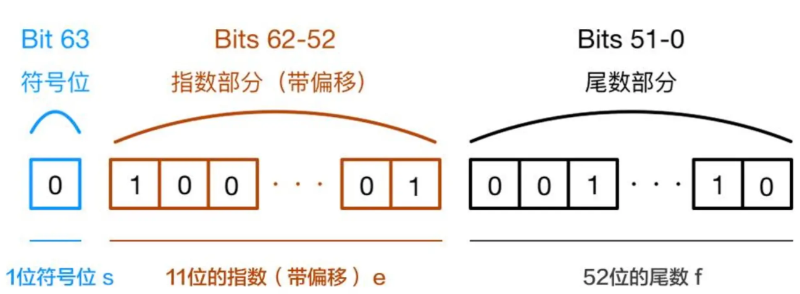
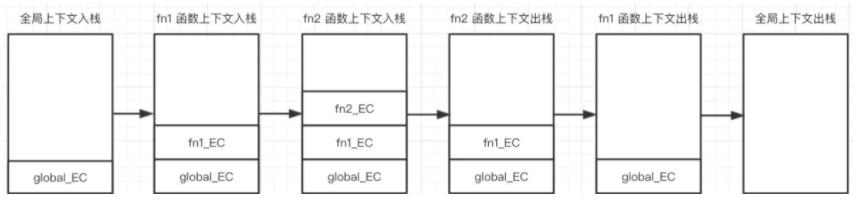
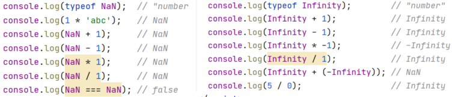
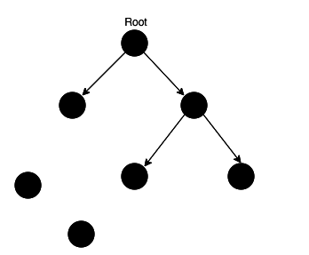
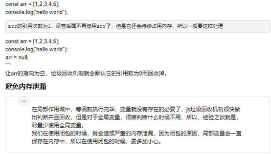
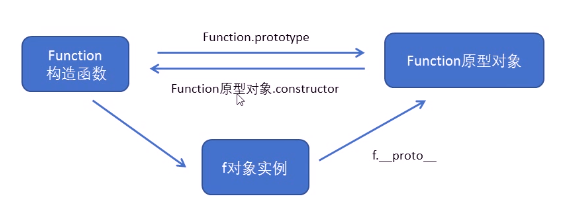
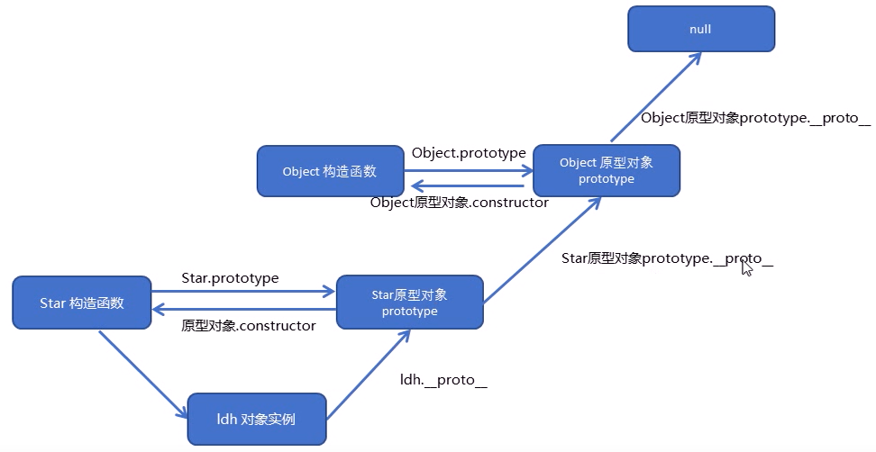
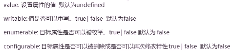

## ES6

## 基础

### Babel转码器

> ```bash
> ## 安装Babel
> npm install --save-dev @babel/core
>
> ## 初始化Babel-cli
> npm init -y
>
> ## 在项目中安装Babel-cli
> npm i -g babel-cli
>
>
>
> # presets字段设定转码规则集（按需安装）
> ## 最新转码规则
> npm install --save-dev @babel/preset-env
> ## react 转码规则
> npm install --save-dev @babel/preset-react
> ## 本地安装 babel-preset-es2015 和 babel-cli
> npm install --save-dev babel-preset-es2015 babel-cli
> ## 安装babel-none，提供一个支持ES6的RERL环境，支持node， 运用：npx babel-node es6.js
> npm install --save-dev @babel/node
>
>
> # Babel-cli
> ## 转码结果输出到标准输出
> npx babel example.js
>
> ## 转码结果ES6转换为ES5文件（--out-file 或 -o 参数指定输出文件） 或 npx babel src/example.js -o dist/compiled.js
> npx babel src/example.js --out-file dist/compiled.js
>
> ## 整个目录转码（--out-dir 或 -d 参数指定输出目录）  或 npx babel src -d lib
> npx babel src --out-dir lib
>
> # -s 参数生成source map文件
> npx babel src -d lib -s
> ```
>
> ```.babelrc
> /* 在根目录下新建`.babelrc`文件 */
> {
>   "presets": [ // 设置转码规则
>      "es2015",
>      "@babel/env",
>      "@babel/preset-react",
>   ],
>   "plugins": [] // 设置插件
> }
> ```

### 严格模式

> - 严格模式的作用：消除Javascript语法的一些不合理、不严谨之处，减少一些怪异行为；需要放在首行
> - 可分`为脚本开启严格模式`和`为函数开启严格模式`两种情况。
> - 为脚本开启严格模式：为整个脚本开启严格模式，需要在所有语句之前放一个特定语句**"use strict";**。
> - 严格模式的变化：
>   - 在全局作用域函数中的`this`指向`window`-->`在全局作用域函数中的this`为`undefined`。
>   - 构造函数不加`new`也可以调用，当普通函数，`this`指向全局对象-->如果构造函数不加`new`调用`this`会报错。
>   - `new`实例化的构造函数指向创建的对象实例。
>   - 定时器中的`this`指向`window`。
>   - 事件、对象还是指向调用者。
> - 函数变化
>   - 函数不能有重名的参数。
>   - 函数必须声明在顶层，不允许在非函数的代码块内声明函数。
>
> ```js
> 'use strict';
> // 1、变量必须先声明再使用
> let num = 19;
>
> // 2、不可随意删除已经声明的变量
> // delete num;  //报错
>
> // 3、全局作用域函数下的this是undefined
> function fn() {
>     console.log(this); //undefined
> }
> fn();
>
> // 4、构造函数不加new调用，this会报错
> function fun() {
>     console.log(this); //fun{}
>     this.sex = '男';
> }
> let willy = new fun();
> console.log(willy.sex);
>
> // 5、定时器的this还是指向window
> setTimeout(function(){
>     console.log(this);  //window
> },1000);
>
> //函数里面的参数不允许有重名
> /* function fna(a,a){console.log(a+a);}  //函数重名，ERROR
> fna(1,2); */
> ```

#### ES6 函数的严格模式

> 从 ES5 开始，函数内部可以设定为严格模式。
>
> ```js
> function doSomething(a, b) {
>     'use strict';
>     // code
> }
> ```
>
> ES2016 做了一点修改，规定只要函数参数使用了默认值、解构赋值、或者扩展运算符，那么函数内部就不能显式设定为严格模式，否则会报错。
>
> ```js
> // 报错
> function doSomething(a, b = a) {
>   'use strict';
>   // code
> }
>
> // 报错
> const doSomething = function ({a, b}) {
>   'use strict';
>   // code
> };
>
> // 报错
> const doSomething = (...a) => {
>   'use strict';
>   // code
> };
>
> const obj = {
>   // 报错
>   doSomething({a, b}) {
>     'use strict';
>     // code
>   }
> };
> ```
>
> 这样规定的原因是，函数内部的严格模式，同时适用于函数体和函数参数。但是，函数执行的时候，先执行函数参数，然后再执行函数体。这样就有一个不合理的地方，只有从函数体之中，才能知道参数是否应该以严格模式执行，但是参数却应该先于函数体执行。
>
> ```js
> // 报错
> function doSomething(value = 070) {
>   'use strict';
>   return value;
> }
> ```
>
> 上面代码中，参数`value`的默认值是八进制数`070`，但是严格模式下不能用前缀`0`表示八进制，所以应该报错。但是实际上，JavaScript 引擎会先成功执行`value = 070`，然后进入函数体内部，发现需要用严格模式执行，这时才会报错。
>
> 虽然可以先解析函数体代码，再执行参数代码，但是这样无疑就增加了复杂性。因此，标准索性禁止了这种用法，只要参数使用了默认值、解构赋值、或者扩展运算符，就不能显式指定严格模式。
>
> 两种方法可以规避这种限制。第一种是设定全局性的严格模式，这是合法的。
>
> ```js
> 'use strict';
> function doSomething(a, b = a) {
>   // code
> }
> ```
>
> 第二种是把函数包在一个无参数的立即执行函数里面。
>
> ```js
> const doSomething = (function () {
>   'use strict';
>   return function(value = 42) {
>     return value;
>   };
> }());
> ```

### 数据类型

> ```bash
> ## 数据类型
> 1. JS 中的 8 种数据类型及区别
> - JS数据类型有8种：`Number、String、Boolean、Null、undefined、object、symbol、bigInt`
> - 基本类型(值类型)：`Undefined、Null、Boolean、Number、String、Symbol、BigInt`（除了object）
> - 引用类型(复杂数据类型)：`Object`（Object 包含 Function、Array、Date、RegExp、特殊的基本包装类型(String、Number、Boolean) 以及单体内置对象(Global、Math)等）。
>
>
> 2. 存储空间
> - 栈：存储基本数据类型的值和执行代码的环境。
> - 堆：堆内存存储的是引用类型值的空间（对象的变量标识符以及对象在内存中的存储地址）。
>
> - 基本数据类型：
> 		- 在内存中占据固定大小，保存在栈内存中。其存储的是值。
> 		- 可以直接操作保存在变量中的实际值（基本数据类型的实际值）。
>
> - 引用数据类型：
> 		- 复杂数据类型的值存储在堆内存中(每个空间大小都不一样，会根据情况进行特定的配置)，地址(指向堆中的值)存储在栈内存。
> 		- 当我们把对象赋值给另外一个变量时，复制的是地址，指向同一块内存空间，当其中一个对象改变时，另一个对象也会变化。
> ```

#### 数据类型检测方案

> ```bash
> ## 数据类型检测方案
> ### 1. typeof：
>   - 主要用作基础数据类型的判定，返回值有如下：`string、boolean、number、function、object、undefined、bigInt`。
>       其中在判定 `null、array、object` 以及函数实例（new+函数）时，都返回`object`。
>       但 `function` 还是会判断出为 `function` 类型
>       - 优点：能够快速区分基本数据类型
>       - 缺点：不能将Object、Array和Null区分，都返回object
>
> ### 2. instanceof：
>   - 只能正确判定引用数据类型，而不能判断基本数据类型，其内部运行机制是判断一个对象在其原型链中依次向下查询栏能否找到该类型的原型(构造函数的prototype属性)。
>       如obj2的原型属性存在obj1的原型链上，即当obj1是obj2的实例，则`obj1 instanceof obj2`的值为true。
>       - 优点：能够区分Array、Object 和 Function，适合用于判断自定义的类实例对象
> 			- 缺点：Number、Boolean、String 基本数据类型不能判断
>
> ### 3. constructor：
>   - 一是判断数据类型，二是对象实例通过`constructor`对象访问它的构造函数。
>         注意：如果创建一个对象来改变它的原型，constructor 就不能用来判断数据类型。
>
> ### 4. Object.prototype.toString.call()
>   - 使用 Object 对象的原型方法 `toString` 来判断数据类型。
>
>
>
> ### 判断数组的类型
> - 通过Object.prototype.toString.call()：`Object.prototype.toString.call(obj).slice(8,-1) === 'Array'`
> - 通过constructor判断：`obj.constructor === Array`
> - 通过instanceof做判断：`obj instanceof Array`
> - 通过ES6的Array.isArray()判断：`Array.isArrray(obj)`
> - 通过原型链判断：`obj.__proto__ === Array.prototype`
> - 通过Array.prototype.isPrototypeOf：`Array.prototype.isPrototypeOf(obj)`
>
> ```
>
> ```js
> /** typeof */
> typeof "willy" === "string"
> typeof 2 === 'number'
> typeof NaN === 'number'
> typeof false === 'boolean'
> typeof undefined === 'undefined'
> typeof null === 'object'
> typeof [] === 'object'
> typeof {} === 'object'
> typeof new Date() === 'object'
> typeof function(){} === 'function'
>
>
> /** instanceof */
> 2 instanceof Number     	// false
> true instanceof Boolean 	// false
> 'str' instanceof String	  // false
> [] instanceof Array				// true
> [] instanceof Object			// true
> {} instanceof Object			// true
> function(){} instanceof Function	// true
> Function instanceof Object	// true
> Object instanceof Function	// true
>
> // 原型链
> function obj1(){}
> const obj2 = new obj1()
> obj2 instanceof obj1	// true
>
>
> /**  constructor 给对象修改原型 */
> function Fn() {}
> Fn.prototype = new Array()
> const f = new Fn()
> console.log(f.constructor === Fn) // false
> console.log(f.constructor === Array) // true
>
>
> /** Object.prototype.toString.call() */
> const a = Object.prototype.toString;
> console.log(a.call(2)); 					// [object Number]
> console.log(a.call(true));  			// [object Boolean]
> console.log(a.call('str')); 			// [object String]
> console.log(a.call([]));  				// [object Array]
> console.log(a.call(function(){})); // [object Function]
> console.log(a.call({}));  				// [object Object]
> console.log(a.call(undefined)); 	 // [object Undefined]
> console.log(a.call(null));  			 // [object Null]
> console.log(a.call(new Map()));  	 // [object Map]
>
>
> /** 获取数据类型的方法封装 */
> const getType = (value) => Object.prototype.toString.call(value).slice(8, -1)
> console.log(getType(new Map()))
> ```

#### 【instanceof 运算符】实现

> ```bash
> ## 【instanceof 运算符】实现
> instanceof 运算符用于检测构造函数的 prototype 属性是否出现在某个实例对象的原型链上。
>
> 只能正确判定引用数据类型，而不能判断基本数据类型，其内部运行机制是判断一个对象在其原型链中依次向下查询栏能否找到该类型的原型(构造函数的prototype属性)。
>       如obj2的原型属性存在obj1的原型链上，即当obj1是obj2的实例，则`obj1 instanceof obj2`的值为true。
>       - 优点：能够区分Array、Object 和 Function，适合用于判断自定义的类实例对象
> 			- 缺点：Number、Boolean、String 基本数据类型不能判断
> ```
>
> ```js
> /**
>   * @description 判断对象是否属于某个构造函数
>   * @prams left: 实例对象  right: 构造函数
>   * @return boolean
> */
> const myInstanceof = function (left, right) {
>   // 获取构造函数的显示原型
>   const rightPrototype = right.prototype
>   // 获取实例对象的隐式原型
>   let leftProto = left.__proto__
>
>   // 循环执行，直到找到对应的原型 or 到达原型链顶层
>   while (true) {
>     // 当到达原型链顶层，还未找到，则返回 false
>     if (leftProto === null) return false
>
>     // 隐式原型与显式原型相等
>     if (leftProto === rightPrototype) return true
>
>     // 获取隐式原型的隐式原型，重新赋值给 leftProto，继续向上一层原型链中查找
>     leftProto = leftProto.__proto__
>   }
> }
> myInstanceof(function(){}, Function)	// true
> ```

### 数值运算

#### `==` 与 `===` 的区别

> ```bash
> ## `==` 与 `===` 的区别
> - `===` 表示恒等（类型和值都要相等）。不需要进行类型转换，只有类型相同并且值相等时，才返回 true。
>
> - `==` 表示相等 （值相等）。如果两者类型不同，会先做类型转换，再判断值是否相等。
>     1. 首先判断两者类型是否相等，如果相等，判断值是否相等。
>     2. 如果类型不同，进行类型转换。
>     3. 判断比较的是否是 null 或者是 undefined，如果是，则返回 true。
>     4. 判断两者类型是否为 string 和 number，如果是，将字符串转换成 number。
> 		5. 判断其中一方是否为 boolean，如果是，将 boolean 转为 number 再进行判断。
> 		6. 判断其中一方是否为 object 且另一方为 string、number 或 symbol，如果是，将 object 转为原始类型再进行比较。
>
>
>
> ### [] == ![] 为什么为 true ？
> 1. 首先 `!` 的优先级是高于 `==` 的。
> 2. `![]` 引用类型转换成布尔值都是 true，因此 `![]` 的是 false。
> 3. 根据上面的步骤中的第五条，其中一方是 boolean，将 boolean 转为 number 再进行判断。
> 		而 false 转换成 number 对应的值是 0 。
> 4. 根据上面的步骤中的第六条，有一方是 number，那么将 object 也转换为 Number。[] 转换成数字对应的值为 0。
> 		(空数组转成数字对应的值是 0，如果数组中只有一个数字，那么转成 number 就是和这个数字，其他情况均为 NaN)
> 5. 0 == 0 得到结果为 true。
> ```
>
> ```js
> let person1 = {
>   age: 25
> }
> let person2 = person1;
> person2.gae = 20;
> console.log(person1 === person2); //true，注意复杂数据类型，比较的是引用地址
> ```

#### undefined 与 null

> ```bash
> ## undefined 与 null
> - null 和 undefined 的共同点：都是基本数据类型，数据保存在栈中，且在 if 判断语句中值都为 false。
>
> - `null` 表示'无'的对象，即空对象。
>       1. 作为函数的参数，表示该函数的参数是正常或意料之中的值空缺。
>       2. 作为对象原型链的终点。
>       3. null 转为数值时为`0`。
>       4. 解除对象引用，便于对象垃圾回收。
>       		- 垃圾回收机制：当一个对象不再被任何变量引用时，会被释放
>       		- 即 null 是主动释放一个变量引用的对象，表示一个变量不再指向任何对象地址，null会被内存收集器回收。
>
>
> - `undefined`表示'无'的原始值，即变量声明但未赋值。
>       1. 作判断变量是否声明（变量被声明但没有赋值时，就等于undefined）。
>       2. 调用函数时，应该提供的参数没有提供，该参数值为undefined。
>       3. 对象中没有赋值的属性的值为undefined。
>       4. 函数没有返回值时，默认返回undefined。
>       5. undefined 转为数值时为`NaN`。
>
> ```

#### 0.1 + 0.2 != 0.3

> ```bash
> ## 为什么 0.1 + 0.2 != 0.3
> 0.1 + 0.2 != 0.3 是因为在进制转换和进阶运算的过程中出现精度损失。
>
> 计算机无法直接对十进制的数字进行运算, 需要先对照 IEEE 754 规范转换成二进制，然后对阶运算。
>
> 1.进制转换
>  0.1和0.2转换成二进制后会无限循环
>      0.1 -> 0.0001100110011001...(无限循环)
>      0.2 -> 0.0011001100110011...(无限循环)
>  但是由于IEEE 754尾数位数限制，需要将后面多余的位截掉，这样在进制之间的转换中精度已经损失。
>
> 2.对阶运算
>  由于指数位数不相同，运算时需要对阶运算 这部分也可能产生精度损失。
>  按照上面两步运算（包括两步的精度损失），最后的结果是
>      0.0100110011001100110011001100110011001100110011001100
>  结果转换成十进制之后就是 0.30000000000000004。
> ```
>
> 


#### void 和 undefined 的区别

```bash
### void 和 undefined 的区别
- 因为不可能重写 `void` 操作符。因此，`void` 被用作 `undefined` 值的替换，以安全的方式获取 `undefined` 值。
- 而且在 ES5 中，不可能重写 `undefined`，因为它被 `Writeable` 设置为 `false`。

- `void`是一个操作符，而不是一个函数。因此不需要将表达式括在括号中。`void 0` 相当于 `void(0)`。
- 有些缩微器使用 `void 0` 来缩短 `undefined` 的长度。
- 如果使用立即调用的函数表达式（称为 IIFE），则可以使用 `void` 将 `function` 关键字视为表达式，而不是声明。


#### 在落后 ES 引擎中的对比
1. 在 ES5 浏览器中，直接使用 void 的运算符和 undedfined 的值没有区别。
    void 0 === undefined // true
    void 1 === undefined // true
    void 'Foo' === undefined // true


2. 在运行 ES3 引擎的旧浏览器中，undefined 是一个全部变量，是可以更改的。
    // 在 ES3 中
    console.log(undefined) // undefined
    var undefined = 'foo'
    console.log(undefined) // 'foo'


#### void 在箭头函数中的作用
- 当与箭头函数一起使用时，可以使用 `void` 来避免副作用。
	- 产生副作用原因：ES6 箭头函数允许通过省略函数体中的大括号来使用函数的返回值。

案例：
  如在某些情况下，我们不打算使用函数的返回值，因为它可能会导致不同的行为产生。
    `button.onClick = () => doSomething()`
    其在返回 false 的情况下，将跳过 click 事件的默认行为，这可能是您不希望看到的。
  而将结果传递给 void 将确保无论执行函数的结果如何，它都不会改变箭头函数的行为：
    `button.onClick = () => void doSomething()`

现实场景：
  如在 React、Svelte 等库中可以看到使用 void 和箭头函数的优势。
  这些库允许我们在将组件装入 DOM 之后立即执行函数。例如，React 提供 `useEffect`，Svelte 具有 `onMount`。
  React：
    `useEffect(() => doSomething())`
    它可以在运行时产生 Bug，为了避免这种情况，我们可以使用 void：
    `useEffect(() => void doSomething())`
    或者使用大括号的方式：
    `useEffect(() => { doSomething() })`


#### javascript URI 中的 void
在以 `javascript:` 为前缀的 URL 中使用了 `void` 运算符。
默认情况下，浏览器将在遵循 `javascript:` URI 时计算代码，然后用返回值替换页面内容。

为了防止出现默认行为，代码必须返回 `undefined`。这就是我们看到以下代码的原因：
	`<a href="javascript: void(0);" onclick="doSomething"> ... </a>`

现在，不推荐使用 `javascript:` 协议。由于用户可以将未初始化的输入放入事件处理程序中，因此可能会产生安全问题：
	`<a href="javascript: alert('unsanitized input')">...</a>`

从 v16.9.0 开始，React 还反对使用 `javascript:` URL。

```


#### `===` 和  Object.is() 的区别

```bash
### `===` 和 Object.is() 的区别
`Object.is()` 的行为与 `===`（严格相等操作符）相同，除了 `NaN`、`+0` 和 `-0`。

```

```js
+0 === -0 // true
Object.is(+0, -0) // false

NaN === NaN // false
Object.is(NaN, NaN) // true

Number.NaN === Number.NaN // false
Object.is(Number.NaN, Number.NaN) // true

NaN === Number.NaN // false
Object.is(NaN, Number.NaN) // true

```


#### variable === undefined 与 typeof variable === undefined 的区别

```bash
### variable === undefined 与 typeof variable === undefined 的区别
检测变量是否为 undefined 有两种方法
	1. `variable === undefined`
	2. `typeof variable === 'undefined'`

两者区别：
在 es3 旧版浏览器中，undefined 是一个全局变量名，其原始值未定义，但是可以更改该值。
	typeof undeclaredVar === 'undefined' // true
	undeclaredVar === undefined // 引发 ReferenceError 异常
在新版浏览器中，因为 undefined 的 writable 属性设置为 false，所以无法更改 undefined，因而没有这种问题。

```


#### 虚值与布尔值

```bash
## 虚值与布尔值
- 虚值是在转换为布尔值时变为 false 的值。
- 使用 `Boolean()` 方法或 `!!` 运算符，可将 `truthy` 或 `falsy` 值转换为布尔值。
	- Falsy：false、null、undefined、NaN、0、+0、-0、空字符串
	- Truthy：其他都为 false。
```

```js
!!false // false
!!undefined // false
!!null // false
!!NaN // false
!!0 // false
!!'' // false

!!'hello' // true
!!1 // true
!!{} // true
!![] // true

// or
Boolean(false) // false
Boolean(undefined) // false
Boolean(null) // false
Boolean(NaN) // false
Boolean(0) // false
Boolean('') // false
```


## 作用域 SCope

### var

> ```bash
> ## var
> ### 有 var 和没有 var 的区别
> - 添加 var 为局部变量(在方法内)，不添加 var 为全局变量(当方法使用后才生效)
> - 在定义全局变量时加或不加 var 关键字没影响；但在定义局部变量(函数内)时如果不加var，JS会将其解释为全局变量。
> - var 或 window 添加的属性不能被 delete 删除。
>         var a = 1
>         function aFn(){ b = 2 }
>         console.log(a)	// 1
>         // console.log(b) // b is not defined
>         aFn()
>         console.log(b)	// 2
>         console.log(delete a) // false
>
>
> ### 函数与变量提升
> - 变量声明、函数声明都会被提升到作用域顶处。
> - 当出现相同名称时，优先级为：'变量/函数赋值 > 函数声明 > 变量声明'
> ```
>
> ```js
> /** js编译器处理过程 */
> var foo;	// foo#1
> var num;
> function foo(x, y) { return x + y; }	// foo#2
> var foo = function(x, y) { return x - y }	// foo#3
> num = foo(1, 2)	// foo#4
>
> /* ---------------------- */
> var foo = function(x, y) { return x - y }	// 函数赋值不会提升
> function foo(x, y) { return x + y; }	// 函数声明会提升
> var num = foo(1, 2)
> ```

### var、let、const的区别

> ```bash
> ## var、let、const 的区别
> 1. var定义的变量，其作用域为该语句所在的函数内，会挂在window，且存在变量提升现象。
> 			没有块的概念，可以跨块访问，不能跨函数访问。
> 	let定义的变量，其作用域为该语句所在的代码块内，不存在变量提升。
> 			不能跨块、跨函数访问。
> 	const用来定义常量，声明时必须赋值，声明后值不可修改，只能在块作用域访问，不存在变量提升。
> 			 const声明常量，即一旦声明必须赋值,不能使用null占位；声明后值不能再修改。
> 			 常量的含义是指向的对象不能修改，但是可以改变对象内部的属性-->即保存的只是内存的地址，而不是保存内容。
> 			 栈有地址的指向，堆存放数据。
>
> 2. var 可以先使用，后声明，因为存在变量提升；let 必须先声明后使用。
>
> 3. var 允许在相同作用域内重复声明同一个变量，而let与const不允许这一现象。
>
> 4. 在全局上下文中，基于 let 声明的全局变量和全局对象 GO(window) 没有任何关系，var 声明的变量会和 GO 有映射关系。
>
> 5. 会产生暂时性死区：
> 		暂时性死区：检测一个未被声明的变量类型时，不会返回undefined，会报错。
>           console.log(typeof a) // undefined
>           console.log(typeof b)	// 未被声明之前不能使用
>           var a
>           let b
>
> 6. let/const/function 会把当前所在的大括号(除函数之外)作为一个全新的块级上下文。
> 	应用这个机制，在遇到循环事件绑定等类似的需求，无需再自己构建闭包来存储，只要基于let的块作用域特征即可解决。
> ```
>
> ```js
> var a = 100;
> let b = 10;
>
> // 1. var声明的变量会挂载在window上，而let和const声明的变量不会
> console.log(a, window.a, b, window.b);    // 100 100 10 undefined
>
> // 2. var声明变量存在变量提升，let和const不存在变量提升
> (function() {
>   console.log(a); // undefined  ===>  a已声明还没赋值，默认得到undefined值
>   var a = 100;
>   console.log(b); // 报错：b is not defined  ===> 找不到b这个变量
>   let b = 10;
> })()
>
> // 3. let和const声明形成块作用域
> if(1){ var a = 100; let b = 10; const c = 1; }
> console.log(a); // 100
> console.log(b)  // b is not defined
>
> // 4. 同一作用域下let和const不能声明同名变量，而var可以
> (function() {
>   var a = 100;
>   var a = 10;
>   let a = 100;
>   let a = 10; // 报错：识符a已经被声明
> })
>
> // 5. let/const有暂存性死区
> var a = 100;
> if(1){
>   a = 10;	// Error:a is not defined，当前块作用域存在a量在此语句调用之后声明
>   let a = 1;
> }
> ```
>

### 块级作用域

> 1. 外部的为全局变量(公有作用域)，内部的为局部变量(私有作用域)
> 2. 块作用域由`{}`包括，if语句和for语句里面的`{}`语句块也属于块作用域。
>    - 在`if`执行的`{ }`语句块中，使用`const、let`，他们会有块级作用域
> 3. JS中使用var来声明一个变量时，变量的作用域主要是和函数的定义有关
> 4. 针对于其他块定义来说是没有作用域的，如:`if、for`等（只有函数有作用域，if是没有作用域的）
>
> ```js
> // IIFE 写法
> (function () {
>   var tmp = ...;
>   ...
> }());
>
> // 块级作用域写法
> {
>   let tmp = ...;
>   ...
> }
>
> {{{{
>   {let insane = 'Hello World'}
>   console.log(insane); // 报错
> }}}};
> ```

### 作用域链

```bash
### 作用域链
当该作用域内本身不存在该变量，就会**逐级向上寻找**，直至找到全局作用域还是没找到，就宣布放弃。这种逐级查找过程形成的链条就叫做作用域链。

1. 每当编译器遇到变量或对象时，它都会遍历当前执行上下文的整个作用域链（Scope chain），以查找它。
2. 如果没有在那里找到它，它遍历原型链（prototype chain），如果它也没有找到，它会抛出未定义的错误。
3. 编译器通过查看函数在代码中的位置来创建函数的作用域。
4. 编译器创建称为作用域链（Scope chain） 的等级层次结构，全局作用域（Global Scope） 位于此层次结构的顶部。
5. 当代码中使用变量时，编译器会向后查看作用域链，如果找不到，则抛出未定义的错误。

```

```js
var a = 100
function F1() {
  var b = 200
  function F2() {
    var c = 300
    console.log(a) // 自由变量，顺作用域链向父作用域找
    console.log(b) // 自由变量，顺作用域链向父作用域找
    console.log(c) // 本作用域的变量
  }
  F2()
}
F1()
```


### 预解释

> 1. 解释变量和函数（函数解释时只将其当作字符串来解释，调用时才开始翻译）
>
> 2. 预解释值发生在当前的作用域下，开始只对 window 下的进行预解释，函数只在执行时才会对函数中的进行预解释
>
> 3. 对于带var和function关键字的预解释作用是不一样的
>
>    1）var->在预解释时只是提前声明
>
>    2）function->在预解释时提前的声明和定义都完成了
>
> ```js
> console.log(num);	//-->undefined
> var num = 12;
> console.log(num);	//-->12
>
> var obj = {name: "myName", age: 7};
> fn(100,200);
> function fn(num1,num2){
>     var total = num1 + num2;
>     console.log(total);
> }
> ```

### gloabalThis对象

> JavaScript 语言存在一个顶层对象，它提供全局环境（即全局作用域），所有代码都是在这个环境中运行。但是，顶层对象在各种实现里面是不统一的。
>
> - 在 Web 浏览器顶层对象可以是 `window`，`self`，`frames` 或 `this`。
> - 对于 Web Worker 来说，它是 `self`。
> - 在 Node.js 中，顶层对象是 `global`，但其他环境都不支持。
>
> 同一段代码为了能够在各种环境，都能取到顶层对象，现在一般是使用`this`关键字，但是有局限性。
>
> - 全局环境中，`this`会返回顶层对象。但是，Node.js 模块中`this`返回的是当前模块，ES6 模块中`this`返回的是`undefined`。
> - 函数里面的`this`，如果函数不是作为对象的方法运行，而是单纯作为函数运行，`this`会指向顶层对象。但是，严格模式下，这时`this`会返回`undefined`。
> - 不管是严格模式，还是普通模式，`new Function('return this')()`，总是会返回全局对象。但是，如果浏览器用了 CSP（Content Security Policy，内容安全策略），那么`eval`、`new Function`这些方法都可能无法使用。
>
> 综上所述，很难找到一种方法，可以在所有情况下，都取到顶层对象。下面是两种勉强可以使用的方法。
>
> ```js
> // 方法一
> (typeof window !== 'undefined'
>  ? window
>  : (typeof process === 'object' &&
>     typeof require === 'function' &&
>     typeof global === 'object')
>  ? global
>  : this);
>
> // 方法二
> var getGlobal = function () {
>   if (typeof self !== 'undefined') { return self; }
>   if (typeof window !== 'undefined') { return window; }
>   if (typeof global !== 'undefined') { return global; }
>   throw new Error('unable to locate global object');
> };
> ```
>
> [`globalThis`](https://developer.mozilla.org/en-US/docs/Web/JavaScript/Reference/Global_Objects/globalThis) 为所有 JavaScript 环境中的全局对象提供了单一语法。
>
> ```js
> // node 环境
> console.log(globalThis)
>
> /**
> <ref *1> Object [global] {
>  global: [Circular *1],
>   clearInterval: [Function: clearInterval],
>  clearTimeout: [Function: clearTimeout],
>   setInterval: [Function: setInterval],
>  setTimeout: [Function: setTimeout] {
>     [Symbol(nodejs.util.promisify.custom)]: [Function (anonymous)]
>  },
>   queueMicrotask: [Function: queueMicrotask],
>   clearImmediate: [Function: clearImmediate],
>   setImmediate: [Function: setImmediate] {
>     [Symbol(nodejs.util.promisify.custom)]: [Function (anonymous)]
>   }
> }
> */
>
> // 浏览器
> console.log(globalThis) // Window {0: global, 1: global, window: Window, self: Window, ...}
> ```
>
> > **注意**：`globalThis` 并不总是直接指向全局对象。详细可查阅 [In browsers, globalThis does not point directly to the global object](https://exploringjs.com/deep-js/ch_global-scope.html#window-proxy)。
>
> 但 `globalThis` 会对性能产生负面影响，也可能会产生一些不到的错误，建议使用 ES6 的一些特性避免全局对象，例如：
>
> - 声明在 `const`、`let` 和 `class` 全局作用域内，使用时不会创建全局对象属性。
> - 每个 ES 模块都有自己的局部作用域。（默认开启严格模式）

### 执行上下文

- 执行上下文是以栈（一种 LIFO 的数据结构）的方式被存放起来的，我们称之为**执行上下文栈（Execution Context Stack）**

- **在 JavaScript 代码开始执行时，首先进入全局环境，此时全局上下文被创建并入栈，之后当调用函数时则进入相应的函数环境，此时相应函数上下文被创建并入栈，当处于栈顶的执行上下文代码执行完毕后，则会将其出栈**

  - 在全局代码执行前, JS引擎就会创建一个栈来存储管理所有的执行上下文对象

  - 在全局执行上下文(window)确定后, 将其添加到栈中(压栈)

  - 在函数执行上下文创建后, 将其添加到栈中(压栈)

  - 在当前函数执行完后,将栈顶的对象移除(出栈)

  - 当所有的代码执行完后, 栈中只剩下window

  - > 所以在执行上下文栈中，栈底永远是全局上下文，而栈顶则是当前正在执行的函数上下文

- 

- 在一个执行上下文中，最重要的三个属性分别是**变量对象（Variable Object）**、**作用域链（Scope Chain）**和 **this 指向**

- 一个执行上下文的生命周期分为**创建**和**执行**阶段。创建阶段主要工作是**生成变量对象**、**建立作用域链**和**确定 this 指向**。而执行阶段主要工作是变量赋值以及执行其它代码等

**1.  全局执行上下文**

- 在执行全局代码前将window确定为全局执行上下文。
- 对全局数据进行预处理（并没有赋值）
  - var定义的全局变量==>undefined, 添加为window的属性
  - function声明的全局函数==>赋值(fun), 添加为window的方法
  - this==>赋值(window)
- 开始执行全局代码

### 作用域与执行上下文

> ```bash
> ## 作用域与执行上下文
> JS 的执行分为解释阶段和执行阶段：
>   - 解释阶段
>       - 词法分析
>       - 语法分析
>       - 作用域规则确定
>   - 执行阶段
>       - 创建执行上下文(生成 this 指向)
>       - 执行函数代码
>       - 垃圾回收(清除该函数和变量)
>
>
>
> ### JS 执行上下文栈
> 执行上下文就是当前 JavaScript 代码被解析和执行时所在环境，JS 执行上下文栈可以认为是一个存储函数调用的栈结构，遵循先进后出的原则。
> 		- JavaScript 执行在单线程上，所有的代码都是排队执行。
> 		- 一开始浏览器执行全局的代码时，首先创建全局的执行上下文，压入执行栈的顶部。
> 		- 每当进入一个函数的执行就会创建函数的执行上下文，并且把它压入执行栈的顶部。当前函数执行完成后，当前函数的执行上下文出栈，并等待垃圾回收。
> 		- 浏览器的 JS 执行引擎总是访问栈顶的执行上下文。
> 		- 全局上下文只有唯一的一个，它在浏览器关闭时出栈。
>
>
>
> ### 作用域链
> 无论是 LHS 还是 RHS 查询，都会在当前的作用域开始查找，如果没有找到，就会向上级作用域继续查找目标标识符，每次上升一个作用域，一直到全局作用域为止。
>
>
>
> ### 作用域和执行上下文的最大区别：
> 1. 执行上下文在调用函数是已确认，函数调用结束就会自动释放，可随时改变；
> 	作用域在定义时确认就一直存在，并且不会被改变。
>
> 2. 一个作用域可能包含若干个上下文环境。有可能没有上下文(函数从未被调用)；有可能有过(函数已调用完毕，上下文环境已被销毁)；有可能同时存在一个或多个(闭包)。
>
> 3. 同一个作用域下，不同的调用会产生不同的执行上下文环境，继而产生不同的变量的值。
>
>
>
> ### 词法作用域和 this 的区别
> - 此法作用域是由你在写代码时将变量和块作用域写在哪里来决定的。
> - this 是在调用时被绑定的，this 指向什么，完全取决于函数的调用位置。
> ```

### this

```bash
## this
this 关键字是指当前代码正在运行时所在的环境对象。

```


### this 的指向

```bash
## this 的指向
this 的绑定规则有四种：默认绑定、隐式绑定、显式绑定、new绑定
1. 函数是否在 new 中调用(new 绑定)，如果是，则 this 绑定的是 new 中新创建的对象。
2. 函数是否通过 call、apply 调用，或使用 bind (即硬绑定)，如果是，则 this 绑定的是指定的对象。
3. 函数是否在某个上下文对象中调用(隐式绑定)，如果是，则 this 绑定的是那个上下文对象。一般是如 `obj.foo()`
4. 如果以上都不是，那么使用默认绑定。如果在严格模式下，则绑定到 undefined，否则绑定到全局对象。
5. 如果把 null 或 undefined 作为 this 的绑定对象传入 call、apply 或 bind，这些值在调用时会被忽略，实际应用的是默认绑定规则。
6. 箭头函数没有自身的 this，它的 this 继承于上一层代码块的 this。


### 常规 this 指向
- 普通函数、定时器函数、立即执行函数的this指向window
- 以对象方法调用时this指向对象本身
- 构造函数的this指向实例对象
- 绑定事件函数的this指向函数的调用者
- 还可通过call、bind、apply改变this的指向，区别是传参方式或执行时间不同

```

> ````js
> //1、普通函数 this指向window
> function fn() {
>   console.log("普通函数this：" + this);
> }
> window.fn();
>
> //2、对象的方法 this指向是对象本身
> let obj = {
>   say: function () {
>     console.log("对象的方法的this：" + this);
>   }
> }
> obj.say();
> let fun = obj.say;
> fun();	// 此时指向window
>
> //3、构造函数  this指向的是willy实例对象，原型对象里面的this指向的也是willY实例对象
> function Star() { console.log('this指向Start',this) }
>Star.prototype.sing = function () { console.log('this指向Star',this) }
> let willy = new Star();
>
> //4、绑定事件函数  this指向是函数的调用者 btn按钮对象
> let btn = document.querySelector("button");
> btn.onclick = function () {
>   console.log("绑定事件函数的this：" + this);
> }
>
> //5、定时器函数 this指向window
> setTimeout(function () {
>   console.log('定时器函数的this：' + this);
> }, 1000);
>
> //6、立即执行函数 this指向window
> (function () {
>   console.log("立即执行函数的this：" + this);
> }())
> ````
>
> #### 【典例】this的指向
>
> ```js
> var uname = "window";
> var object = {
>   uname: "object",
>   fun:function() {
>     console.log(this.uname);
>     return function() {
>       console.log(this.uname);
>     }
>   }
> }
> object.fun()();	// 输出 object window
> // 因为第一个函数是由object对象调用，this指向object对象；第二个是普通函数调用，指向window
> ```

### 改变函数内部`this`指向

> ````bash
> # 改变函数内部`this`指向
>     1. 借用构造函数继承父类型属性、方法-->`call()`
>         - ES6之前并没有`extends`继承，我们可以通过构造函数+原型对象模拟实现继承，被称为组合继承。
>         - 核心原理：通过`call()`把父类型的`this`指向子类型的`this`，这样就可实现子类型继承父类型的属性。
>
>     2. ES6后通过`extends、super()`来实现继承。
> ````
>
> ````js
> function Father(name, age){
>   //this指向父构造函数的对象实例
>   this.name = name;
>   this.age = age;
> }
> Father.prototype.money = function(){
>   console.log(1000);
> }
> function Son(name, age){
>   //this 指向子构造函数的对象实例
>   Father.call(this, name, age);
> }
> // 继承父构造函数的方法->直接赋值：（通过让父子共用相同地址来实现），如果修改子原型对象，父原型对象会跟着改变
> //Son.prototype = Father.prototype;
>
> //继承父构造函数的方法->new：不会共用相同地址，修改子原型对象，父原型对象不会改变
> Son.prototype = new Father();
> Son.prototype.constructor = Son;    //利用对象形式修改原型对象，需利用constructor指回原来的构造函数
>
> Son.prototype.exam = function() {
>   //子构造函数专门的方法
>   console.log('儿子要考试~');
> }
>
> let son = new Son('willy',11);
> console.log(son);
> console.log(Father.prototype);
> console.log(Son.prototype.constructor);
> ````

### call、bind、apply 改变 this 指向

> ```bash
> # call、bind、apply ：改变函数内部的`this`指向
> - call() ：立即调用函数，并可改变函数的this指向，主要作用是实现继承
> - apply()：立即调用函数，并可改变函数的this指向， 但apply()的参数必须是数组（伪数组），主要用作数学内置对象运用
> - bind()：不会立即调用函数，但能改变函数内部this指向
> 		- 传入一个对象，返回一个 this 绑定了传入对象的新函数，这个函数的 this 指向除了使用 new 时会被改变，其它情况下都不会改变。
> 		- 若传值为空，则 this 默认是指向全局对象 window。
> 		- 如果有的函数我们不需要立即调用，但又想改变这个函数内部的this指向，则用bind。
>
>
> # call、bind、apply 的区别
>     1. 相同点：
>         - 所有的函数都是`Function`的实例==>`call、apply和bind`都是`Function`原型`Function.prototype`中的方法
>         - 都可改变函数执行上下文（改变函数内部的`this`指向）
>         - `call、apply、bind`必须通过函数来调用，第一个参数为对象，若第一个参数为null或者undefined，则指向window
>
>     2. 区别点：
>         - call和bind方法接收参数列表；apply方法只能接收2个参数，且第二个参数为数组或伪数组`[arg]`
>         - call和apply方法返回undefined，bind方法返回一个原函数的拷贝，并具有指定的 this 值和初始参数
>         - call和apply方法是立即调用；bind方法是稍后调用，传参形式与call()相同
>
>     3. 主要应用场景：
>         - `call`主要用做继承
>         - `apply`主要用跟数组有关的操作，如借助数学对象实现最大值最小值。
>         - `bind`不调用函数，但会改变`this`指向，如改变定时器内部的`this`指向。
> ```
>
> ```js
> //1、call() 可调用函数，改变函数的this指向，call()主要作用是实现继承
> function Father(name, age, sex) {
>   this.name = name;
>   this.age = age;
>   this.sex = sex;
>   console.log(this);  //this通过call()方法调用后指向son
> }
> function Son(name, age, sex) {
>   Father.call(this, name, age, sex);
> }
> let son = new Son('willy', 22, '男');
>
>
> /* 2、apply() 可调用函数，可改变函数的this指向，
> 但是apply()的参数必须是数组（伪数组）
> apply()主要应用 借助于数学内置对象求最大最小值 */
> let obj = {
>   name: 'willy'
> }
> function fn(arr) {
>   console.log(this);
>   console.log(arr);
> }
> fn.apply(obj, ['red']);
>
> let arr = [1, 55, 33, 22, 66];
> let max = Math.max.apply(null, arr);
> let min = Math.min.apply(null, arr);
> console.log(max, min);
>
>
> /* 3、bind() 不会调用函数，但能改变函数内部this指向
> 返回的是原函数改变this之后产生的新函数
> 如果有的函数我们不需要立即调用，但又想改变这个函数内部的this指向，则用bind，如定时器函数
> fun.bind(thisArg, arg1, arg2, ...)
> thisArg:在fun函数运行时指定的this值，argn传递的其他函数，返回值由指定的this值和初始参数改造的原函数拷贝*/
> let o = {
>   name: 'andy'
> }
> let f = fn.bind(obj, o);
> f();
> btn.onclick = function() {
>   this.disabled = true;
>   setTimeout(function() {
>     this.disabled = false;
>   }.bind(this),3000);
> }
> ```
>

### 【call】实现

> ```bash
> ## 模拟实现 call()
> - call() 主要是会改变this指向，第一个参数为所改变的this指向，第二个之后的参数列表为传递的值
>
> ## 实现原理
> 1. 将函数设为传入参数的属性，如果不传入参数则默认指向为 window/global
> 2. 判断当前 this 是否为函数，防止 `Function.prototype.myCall()` 直接调用
> 3. context 为可选参数，如果不传的话默认上下文为 window
> 4. 为 context 创建一个 Symbol 属性来保证不会重名，将当前函数复制给这个属性
> 5. 处理参数，传入的第一个参数后的其余参数
> 6. 调用函数后立即删除该 Symbol 属性
> ```
>
> ```js
> /**
>  * @context 上下文
>  *    1. 传入的是 null 或 undefined 时，this 指向 window/global
>  *    2. 传入的不是 null 或 undefined 时，必须为一个对象
>  */
> Function.prototype.myCall = function (context = window, ...args) {
>   // 用于防止 Function.prototype.myCall() 直接调用
>   if (this === Function.prototype) return undefined
>
> 	// context为null或者是undefined，指向到 window/global
>   if (!context) {
>     context = typeof window === 'undefined' ? global : window
>   }
>
>   // this指向的是当前的函数(Function的实例)
>   const fn = Symbol()
>   context[fn] = this
>
>   // 隐式绑定, 当前函数的this指向了context.
>   const result = context[fn](...args)
>   delete context[fn]
>   return result
> }
>
>
> // 测试代码
> const foo = {
>   name: 'Selina'
> }
> const name = 'Chirs';
> function bar (job, age) {
>   console.log(this.name);
>   console.log(job, age);
> }
> bar.myCall(foo, 'programmer', 20);
> // Selina programmer 20
> bar.myCall(null, 'teacher', 25);
> // 浏览器环境: Chirs teacher 25; node 环境: undefined teacher 25
> ```
>

### 【apply】实现

> ```js
> /**
>  * @context 上下文
>  *    1. 传入的是 null 或 undefined 时，this 指向 window/global
>  *    2. 传入的不是 null 或 undefined 时，必须为一个对象
>  */
> Function.prototype.myApply = function (context = window, args = []) {
>   // 用于防止 Function.prototype.myApply() 直接调用
>   if (this === Function.prototype) return undefined
>
> 	// context为null或者是undefined，指向到 window/global
>   if (!context) {
>     context = typeof window === 'undefined' ? global : window
>   }
>
>   // this指向的是当前的函数(Function的实例)
>   const fn = Symbol()
>   context[fn] = this
>   let result
>   if (Array.isArray(args)) {
>     result = context[fn](...args)
>   } else {
>     result = context[fn]()
>   }
>   delete context[fn]
>   return result
> }
>
>
> // 测试代码
> const foo = {
>   name: 'Selina'
> }
> const name = 'Chirs';
> function bar (job, age) {
>   console.log(this.name);
>   console.log(job, age);
> }
> bar.myApply(foo, ['programmer', 20]);
> // Selina programmer 20
> bar.myApply(null, ['teacher', 25]);
> // 浏览器环境: Chirs programmer 20; node 环境: undefined teacher 25
> ```

### 【bind】实现

> ```bash
> ## 模拟 bind 实现
> 1. 处理参数，返回一个闭包
> 2. 判断是否为构造函数调用，如果是则使用 `new` 调用当前函数
> 3. 如果不是，使用 `apply`，将 `context` 和处理好的参数传入
> ```
>
> ```js
> Function.prototype.myBind = function (context = window, ...args1) {
>   // 用于防止 Function.prototype.myBind() 直接调用
>   if (this === Function.prototype) {
>     throw new TypeError('Error')
>   }
>
>   // context为null或者是undefined，指向到 window/global
>   if (!context) {
>     context = typeof window === 'undefined' ? global : window
>   }
>
>   const self = this
>   return function F (...args2) {
>     // 判断是否用于构造函数
>     if (this instanceof F) {
>       return new self(...args1, ...args2)
>     }
>
>     return self.apply(context, args1.concat(args2))
>   }
> }
>
> // 测试
> let name = 'Jack'
> function person(age, job, gender) {
>   console.log(this.name , age, job, gender);
> }
> let Yve = {name : 'Yvette'}
> let result = person.bind(Yve, 22, 'enginner')('female')
> ```
>

## 运算符扩展

### 解构赋值

> - 数组解构按照一一对应的关系从数组中提取值，然后将值赋值给变量
> - 解构赋值的规则是，只要等号右边的值不是对象或数组，就先将其转为对象。由于`undefined`和`null`无法转为对象，所以对它们进行解构赋值，都会报错。
> - 作用：交换变量值、从函数返回多值、函数参数定义、提取JSON数据、函数默认值、遍历Map结构、暴露模块指定方法
>
> ```js
> /* 数组 */
> let arr = [1, 2, 3];
> let [a, b, c, d] = arr; // a=1, b=2, c=3, d=undefined
> let [ , , third] = arr; // third为3
> let [head, ...tail] = arr; // tail为 2,3
>
> /* 对象 */
> let person = {name: 'willy', age: 20};
> let { name, age } = person;
> let {name: myName, age: myAge} = person;    //赋别名
> console.log(name, myName, age, myAge);  // willy willy 20 20
>
> /* Set结构 */
> let [x, y, z] = new Set([1, 2, 3]); // x为1
>
> /* Iterator接口数据 */
> function* fibs() {
>   let a = 0, b = 1;
>   while (true) {
>     yield a;
>     [a, b] = [b, a + b];
>   }
> }
> let [first, second, third, fourth, fifth, sixth] = fibs(); // sixth为5
>
> /* 字符串 */
> const [a, b, c, d, e] = 'hello';  // c="l"
>
> /* 数值和布尔值：数值和布尔值的包装对象都有toString对象，因此都能取值 */
> let {toString: s} = 123;
> s === Number.prototype.toString // true
> let {toString: s} = true;
> s === Boolean.prototype.toString // true
>
> let { prop: x } = undefined; // TypeError
> let { prop: y } = null; // TypeError
> ```
>
> #### 使用解构删除不必要属性
>
> - 通过定义新的变量来接收那些不必要的属性，可使得不必要属性不存在剩余参数中（即所想取的值都在剩余参数中）
>
> ```js
> // 通过定义 _internal, tooBig 接收此两个属性的值，这样使得剩余参数中不存在此两个属性
> let { _internal, tooBig, ...cleanObject } = {
>   el1: '1',
>   _internal: "secret",
>   tooBig: {},
>   el2: '2',
>   el3: '3'
> };
> console.log(cleanObject);  // {el1: '1', el2: '2', el3: '3'}
> ```
>
> #### 函数参数中解构嵌套对象
>
> ```js
> var car = {
>   model: 'bmw 2018',
>   engine: {
>     v6: true,
>     vin: 12345
>   }
> }
> // 通过结构只获取 car 中 model 属性和 engine 的 vin 属性
> const modelAndVIN = ({ model, engine: { vin } }) => {
>   console.log(`model: ${model} vin: ${vin}`);
> }
> modelAndVIN(car);  // => model: bmw 2018  vin: 12345
> ```
>
> #### 连续解构赋值
>
> ````js
> let obj = {
>   p: [
>     'Hello',
>     { y: 'World' }
>   ]
> };
> let { p, p: [x, { y }] } = obj;
> x // "Hello"
> y // "World"
> p // ["Hello", {y: "World"}]
> ````
>
> ### 值互换
>
> ```js
> var x = 1;
> var y = 2;
> [x,y] = [y,x];
> ```
>
> ### 函数和属性增强写法
>
> ```js
> const name = 'Kobe', age = 17;
> //ES5
> const obj1 = {
>   name: name, age: age,
>   run: function(){}, eat: function(){}
> }
>
> //ES6
> const obj2 = { name, age, run(){}, eat(){} }
> ```

### 可变参数 arguments

- 虽然arguments对象并不是一个数组而是一个伪数组，但是访问单个参数的方式与访问数组元素的方式相同.

- 在js中无需明确指出参数名，就能访问它们；存放所有的参数

- 引用属性 arguments.length检测函数的参数个数

- 用 arguments 对象判断传递给函数的参数个数，即可模拟函数重载

- > 注意：箭头函数无法调用arguments

```js
function doAdd() {
  if (arguments.length == 1) {
    console.log(arguments[0] + 5);
  } else if (arguments.length == 2) {
    console.log(arguments[0] + arguments[1]);
  }
}
doAdd(10);	//输出 "15"
doAdd(40, 20);	//输出 "60"

function doConcat() {
  let s = "";
  for (let i = 0; i < arguments.length; i++) {
    s += arguments[i] + " ";
  }
  console.log(s);
  return s;
}
doConcat("name", "age");	//输出name age
```

### 剩余(`rest`)参数

剩余参数语法允许将一个不定数量的参数表示为一个数组。

> 注意：剩余参数之后不能再有其他参数（即只能是最后一个参数），否则会报错。

```js
//剩余参数（不定长可变参）
function sum(a, b, ...num) {//可以给多个参数到sum函数里面
  console.log(num);	// 2, 3, 4, 5, 6, 7, 8, 9
}
sum(0, 1, 2, 3, 4, 5, 6, 7, 8, 9);
```

#### 剩余参数和 `arguments`对象的区别

- 剩余参数只包含那些没有对应形参的实参，而 arguments 对象包含了传给函数的所有实参。
- `arguments`对象不是一个真正的数组，而剩余参数是真正的` Array`实例，也就是说你能够在它上面直接使用所有的数组方法，比如 `sort、map、forEach或pop`。
- `arguments`对象还有一些附加的属性 （如callee属性：返回当前函数的引用(匿名函数可以使用该属性实现递归调用)）。

#### 剩余参数与解构配合

```js
let arr1 = ['a', 'b', 'c'];
let [s1, ...s2] = arr1;
console.log(s2);  //[ 'b', 'c' ]
```

### 扩展运算符`...`

> ```bash
> ## 扩展运算符 ...
> 用于取出参数对象中的所有可遍历属性，拷贝到当前对象之中
>     1. 复制数组 `const a2 = [...a1]`
>     2. 合并数组 `[...arr1, ...arr2, ...arr3]`
>     3. 与解构赋值结合`const [first, ...rest] = [1, 2, 3, 4, 5]; //...rest:2,3,4,5`
>
> 注意0：如果将扩展运算符用于数组赋值，只能放在参数的最后一位，否则会报错
> 注意1：任何定义了遍历器(Iterator)接口的对象，都可以用扩展运算符转为真正的数组。
> 注意2: 扩展运算符取出的数据只是浅拷贝，当其属性值为复杂数据类型时，被扩展对象与扩展对象两者共用内存空间。
> ```
>
> ```js
> //1. 合并、复制数组
> let ary1 = [1, 2, 3],ary2 = [4, 5, 6];
> let ary3 = [...ary1, ...ary2];	//等价于 let ary3 = ary1.push(...ary2);
> let ary4 = [...ary1];
> console.log(ary3, ary4);
>
> //2. 遍历、拷贝数组
> let bar = { a: 1, b: 2 };
> let baz = { ...bar }; // 等价于 az = Object.assign({}, bar);
>
> //将数组转换为参数数列
> function Add(x, y){
>   return x + y;
> }
> console.log(Add(...[4, 38])) // 42
>
> //将伪数组(字符串)转为真正的数组
> let a = 'hello';
> console.log(a, '=>', ...a);
>
>
> /* 将元素组织成对象 */
> const obj = {a: 1, b: 2, c: 3};
> const {a, ...rest} = obj;
> console.log(rest, rest.b);    // {b: 2, c: 3}  2
> (function({a, ...obj}) {
>   console.log(obj);    // 输出 {b: 2, c: 3}
> }({a: 1, b: 2, c: 3}));
>
> /* 将对象扩展为元素 */
> const obj1 = {a: 1, b: 2, c: 3};
> const newObj ={...obj1, d: 4};
> console.log(newObj);  // {a: 1, b: 2, c: 3, d: 4}
> ```

### 模板字符串

> ````js
> //模板字符串解析变量
> let name = `willy`;
> let obj = { //模板字符串换行
> name: 'willy',
> age: 22,
> sex: '男'
> }
> const sayHello = () => `hello, my name is ${name}`; //在模板字符串调用函数
> let str = `${name}-->name:${obj.name},age:${obj.age},sex:${obj.sex},${sayHello()}`
> console.log(str);
>
> let start = str.startsWith('willy');	//头部是否为willy
> let end = str.endsWith('willy');	//尾部是否为willy
> let strCpoy = str.repeat(1);	//重复一次
> console.log(start, end, strCpoy);    //true true
> ````

### 空值合并运算符`??`

> ```bash
> ## 空值合并运算符 ??
> - 在读取对象属性时，若某个属性值为`null 或 undefined`，有时需要为它们指定默认值。常见做法是通过`||`运算符指定默认值。
>
> - `||`运算符不仅在属性值为`undefined`和`null`时生效，在属性值为空字符串或`false`或`0`时也会生效。
>
> - Null判断运算符`??`只有运算符左侧值为`null`或`undefined`时才会返回右侧的值（即只关心左侧的值是否为 `null` 或 `undefined`，而不在乎是否为虚值）
> ```
>
> ```js
> const response = { settings: { headerText: 0 } }
> const headerText = response.settings.headerText || 'default Text'
> const headerText1 = response.settings.headerText ?? "default Text1"
>
>
> const data = {
>   nullValue: null,
>   height: 400,
>   animationDuration: 0,
>   headerText: '',
>   showSplashScreen: false,
> }
> console.log(data.undefinedValue ?? 'some other default') // 'some other default'
> console.log(data.nullValue ?? 'some other default') // 'some other default'
> console.log(data.headerText ?? 'Hello, world!') // ''
> console.log(data.animationDuration ?? 300) // 0
> console.log(data.showSplashScreen ?? true) // false
> ```

### 可选链判断运算符`?.`

> ```bash
> ## 可选链判断运算符 ?.
> - 当需要读取对象的深层次属性时，往往需要判断属性的上一层对象是否存在
> - 可选链操作符` ?.` 允许读取位于连接对象链深处的属性的值，而不必明确验证链中的每个引用是否有效。
> - `?.`与`.`的区别在于，在引用为null 或 undefined 的情况下不会引起错误，而是使得该表达式短路并返回`undefined`
>
>
> ### 可选链 ?. 用法
> a?.x		// 等同于 	a == null ? undefined : a.x
> a?.[x]	// 等同于	a == null ? undefined : a[x]
> a?.b()	// 等同于	a == null ? undefined : a.b()
> a?.()		// 等同于	a == null ? undefined : a()
>
>
> ### 可选链的替代方案：&&
> - 缺点：
> 		- 语法冗长
> 		- 如果失败，`&&` 返回其左侧，而 `?.` 始终返回 undefined
> 		- `&&` 对所有的虚值的左侧都失败，而 `?.` 只对 undefined 和 null 失败。
> - 案例：`user && user.address && user.address.street // undefined`
>
>
>
> ### 可选链的替代方案：解构赋值
> - 缺点：使用解构来处理链式属性的访问，这会不美观。
>     const { address: { street = undefined } = {} } = user
>     street // undefined
> ```
>
> ```javascript
> // 错误的写法（如果body属性 或 user属性不存在，则会报错）
> const  firstName = message.body.user.firstName || 'default';
>
> // 正确的写法（可选链的替代方案 &&）
> const firstName = (
>   message
>   && message.body
>   && message.body.user
>   && message.body.user.firstName
> ) || 'default';
>
>
> /* 引入可选链 ?. 的优化写法 */
> const  firstName = message.body.user.firstName || 'default';
> ```

### 逻辑赋值运算符

> - 这三个二元运算符`||=`、`&&=`、`??=`相当于先进行逻辑运算，然后根据运算结果，再视情况进行赋值运算。
> - 它们的一个用途是，为变量或属性设置默认值。
>
> | 赋值运算符 | 相当于         | 仅当 a 是 |                                                              |
> | ---------- | -------------- | --------- | ------------------------------------------------------------ |
> | `a ||= b`  | `a || (a = b)` | `false`   | 如果左侧为`false`，则评估右侧表达式并将其分配给左侧变量      |
> | `a &&= b`  | `a && (a = b)` | `true`    | 如果左侧为`true`，则评估右侧表达式并将其分配给左侧的变量     |
> | `a ??= b`  | `a ?? (a = b)` | `null`    | 如果左侧值为 `null` 或 `undefined`，则评估右侧表达式并将其分配给左侧的变量 |
>
> ```js
> /** 或赋值运算符 */
> x ||= y		// 等同于	x || (x = y)
> user.id ||= 1	// 等同于 user.id = user.id || 1
>
>
> /** 与赋值运算符 */
> x &&= y		// 等同于	x && (x = y)
>
>
> /** Null 赋值运算符 */
> x ??= y		// 等同于	x ?? (x = y)
> opts.foo ??= 'bar'	// 等同于 opts.foo = opts.foo ?? 'bar'; 或 opts.foo ?? (opts.foo = 'bar')
> ```

### 代码复用`Object[key]`

> - 把`Object.key`写成`Object[key]`，这种做法构成了编写可重用代码的基础，如element UI的表单验证。可用作封装通用的表单验证函数。
>
> ```js
> // object validation rules
> const schema = {
>   first: {
>     required: true
>   },
>   last: {
>     required: true
>   }
> };
> // universal validation function
> const validate = (schema, values) => {
>   for (field in schema) {
>     if (schema[field].required) {
>       if (!values[field]) {
>         return false;
>       }
>     }
>   }
>   return true;
> }
> console.log(validate(schema, { first: 'Bruce' }));  // false
> console.log(validate(schema, { first: 'Bruce', last: 'Wayne' }));  // true
> ```

### 幂运算符（`**` 和 `**=`）

> - ES7 中引入了**幂运算符（Exponentiation operator）`**`**`，`**` 具有与 `Math.pow(..)` 等效的计算结果。例如：`a ** b` 是 `Math.pow(a, b)` 的简写，`a **= b` 是 `a = a ** b` 的简写
> - 幂赋值运算符使一个变量为底数、以右值为指数的指数运算（乘方）结果赋给该变量。
> - 幂运算符`**`的特点是右结合，多个指数运算符连用时，是从最右边开始计算的
>
> ```js
> 2 ** 3	// 8
> Math.pow(2, 3)	// 8
>
> 4 ** 3 ** 2 // 相当于 4 ** (3 ** 2) = 262144
>
> let b = 4;
> b **= 3	// 等同 b = b * b * b;
> ```

## 数值 Number

```bash
## 数值 Number
数字（Number）有两种类型：
	1. 常规的数字以 64 位的格式 `IEEE-754` 存储，又称 "双精度浮点数"。
	2. BigInt 用于表示任意长度的整数。因为常规Number类型的整数只能安全地表示在 `-(2^53 - 1) ~ (2^53 - 1)` 的范围内，超出这个范围的整数值可能丢失精度。使用BigInt，可以安全地处理更大或更小的整数，而不用担心精度问题。这对于需要高精度整数运算的应用程序，如加密、高精度计时器、处理大量数据等场景非常有用。


### 数值展示扩展
- 二进制需要添加前缀`0b`，八进制需要添加前缀`0o`
- 数值可使用下划线`_`作为分隔符：`1_0000_00_000 === 10**12;   0.000_001 === 1e10_000`（数值分隔符没有指定间隔位数，小数点及指数e前后不能有分隔符，两个分隔符不能相连）


### 实例方法
- ES6 将全局方法 `parseInt()` 和 `parseFloat()`移植到Number 对象上，如`Number.parseInt(12.34)`
- `Number.isFinite(Num)`：检查数字是否为有限的，即不是`Infinity`则为`true`（若参数类型不是数值则一律为false）
- `Number.isNaN(Num)`：检查一个值是否为`NaN`，非`NaN`则为false
- `Numer.isInteger(Num)`：判断一个数值是否为整数
- `Number.MAX_SAFE_INTEGER` 和 `Number.MIN_SAFE_INTEGER` 表示安全整数的上下限，JS能准确表达整数范围在 `-2^53` 到 `2^53` 之间的数
- `Number.isSafeInteger(Num)` 则是用来判断一个整数是否落在安全整数范围之内

```


### 安全数

> - `2^53`是js内置的最大整数值(不安全)，`2^53+1`是会被摄入成`2^53`
> - **Number.MAX_SAFE_INTEGER**是js里整数的安全的最大值，由于js用的IEEE 754双精度浮点，可以安全地表示`[-2^53+1, 2^53-1]`这个范围，比这更大的表示 **Infinity**，与之相对的是 **Number.MIN_VALUE**
>
> ```js
> Math.pow(2, 53) === Math.pow(2, 53) + 1 // true
> ```


### 大整数 BigInt

> - `BigInt` 一种用于大整数运算的新原始数据类型，表示大于 2⁵³ 的数字。后缀为 `n`。
> - `BigInt(value)` 只用来表示整数，没有位数的限制，任何位数的整数都可以精确表示。
> - BigInt 和 Number 不是严格相等的，但是宽松相等。
> - 可以通过typeof操作符来判断变量是否为BigInt类型（返回字符串"bigint"）
> - 可以通过`Object.prototype.toString`方法来判断变量是否为BigInt类型（返回字符串"[object BigInt]"）
>
> ```js
> /* BigInt类型 */
> let max1 = Number.MAX_SAFE_INTEGER;    // 最大安全整数
> let max11 = max1 + 1, max12 = max1 + 2
> max11 === max12   // true
>
> let max2 = BigInt(Number.MAX_SAFE_INTEGER);
> let max21 = max2 + 1n, max22 = max2 + 2n
> max21 === max22   // false
>
>
> // 判断是否为 BigInt 类型
> typeof 1n === 'bigint'; // true
> typeof BigInt('1') === 'bigint'; // true
> Object.prototype.toString.call(1n) === '[object BigInt]'; // true
>
> // BigInt 与 Number 类型的对比
> 10n === 10 // false
> 10n == 10  // true
> ```
>
> 


### 进制转换：toString(base)

```bash
### 进制转换 toString(base)
`Number.prototype.toString(base)` 返回在给定 base 进制数字系统中 num 的字符串表示形式。
	- base 的范围可以从 2 到 36。默认情况下是 10。
	- `base=16` 常用于十六进制颜色，字符编码等，数字可以是 0..9 或 A..F。
	- `base=2` 主要用于调试按位操作，数字可以是 0 或 1。
	- `base=36` 是最大进制，数字可以是 0..9 或 A..Z。所有拉丁字母都被用于了表示数字。对于 36 进制来说，一个有趣且有用的例子是，当我们需要将一个较长的数字标识符转换成较短的时候，例如做一个短的 URL。可以简单地使用基数为 36 的数字系统表示：`123456..toString(36) // 2n9c`

#### 使用两个点调用一个方法（如 `123456..toString(36)`）
- 如果我们想直接在一个数字上调用一个方法，比如上面例子中的 toString，那么我们需要在它后面放置两个点 ..。
- 如果我们放置一个点：123456.toString(36)，那么就会出现一个 error，因为 JavaScript 语法隐含了第一个点之后的部分为小数部分。如果我们再放一个点，那么 JavaScript 就知道小数部分为空，现在使用该方法。
- 也可以写成 (123456).toString(36)。

```

```js
const num = 255
console.log(num.toString(16)) // ff
console.log(num.toString(2)) // 11111111
console.log((123456).toString(36)) // 2n9c

```


### 特殊的数字类型

```bash
### 特殊的数字类型
- 包括浮点数和整数。特殊的数字类型有：`NaN、Infinity、-Infinity`

1. NaN
    - NaN（Not a Number），表示不是数字，但它本质是一个特殊数字。
    - 当运算操作符错误时，一般会得到 NaN
    - NaN 具有传染性，即 NaN 参与任何运算，结果都为 NaN
    - NaN 与任何值都不相等

2. Infinity
    - 表示数据超出 JS 可表示的范围，是一个特殊的数字
    - 与其他数据类型进行操作运算时，结果还是 Infinity
    - 任何数字除以 0 得到 Infinity
```


#### 数值判定：isFinite 与 isNaN

```bash
### 数值判定：isFinite 和 isNaN
`NaN、Infinity、-Infinity` 属于 number 类型，但不是“普通”数字，因此，`isFinite()` 和 `isNaN()` 用于检查它们的特殊函数：

1. Number.isNaN(value)
用来检查一个值是否为 NaN。如果参数类型不是 NaN，`Number.isNaN` 一律返回 false。

2. Number.isFinite(value)
用来检查一个数值是否为有限的（finite），即不是`Infinity`。
如果参数是一个数值则返回 true，否则返回 false（如：NaN、null、undefined、正无穷大、负无穷大或字符串，则会返回false）

- 它们与传统的全局方法 `isFinite()`和`isNaN()`的区别在于，传统方法先调用`Number()`将非数值的值转为数值，再进行判断，而这两个新方法只对数值有效，`Number.isFinite()`对于非数值一律返回`false`, `Number.isNaN()`只有对于`NaN`才返回`true`，非`NaN`一律返回`false`。

注意：在所有数字函数中，包括 isFinite，空字符串或仅有空格的字符串均被视为 0。


#### 与 Object.is 进行比较
有一个特殊的内建方法 Object.is，它类似于 `===` 一样对值进行比较，但它对于两种边缘情况更可靠：
	1. 它适用于 NaN：`Object.is(NaN, NaN) === true`，这是件好事。
	2. 值 0 和 -0 是不同的：`Object.is(0, -0) === false`，从技术上讲这是对的，因为在内部，数字的符号位可能会不同，即使其他所有位均为零。
在所有其他情况下，`Object.is(a, b)` 与 `a === b` 相同。

这种比较方式经常被用在 JavaScript 规范中。当内部算法需要比较两个值是否完全相同时，它使用 Object.is（内部称为 SameValue）。
```

```js
Number.isFinite(15); // true
Number.isFinite(0.8); // true
Number.isFinite(NaN); // false
Number.isFinite(Infinity); // false
Number.isFinite(-Infinity); // false
Number.isFinite('foo'); // false
Number.isFinite('15'); // false
Number.isFinite(true); // false


// 判断一个数是否为 NaN 的唯一方式
Number.isNaN(NaN) // true
Number.isNaN(15) // false
Number.isNaN('15') // false
Number.isNaN(true) // false
Number.isNaN(9/NaN) // true
Number.isNaN('true' / 0) // true
Number.isNaN('true' / 'true') // true


/** 与 ES5 的方法对比 */
isFinite(25) // true
isFinite("25") // true
Number.isFinite(25) // true
Number.isFinite("25") // false
isNaN(NaN) // true
isNaN("NaN") // true
Number.isNaN(NaN) // true
Number.isNaN("NaN") // false
Number.isNaN(1) // false
```


### 数字分隔符

> - 为了增加更大数字的可读性，从 ES2021 开始，我们可以在数字中使用下划线（`_`）作为分隔符。
> - 数字分隔符可以在数字之间创建可视化分隔符，通过 _ 下划线来分割数字，使数字更具可读性，可以放在数字内的任何地方
> - 该新特性也支持在八进制中使用
>
> ```js
> const money = 1_000_000_00_0		// => 等价于 const money = 1000000000
> const num = 0o123_456		// => 等价于 const num = 0o123456
> ```
>
> 数字组之间的视觉分离：
>
> ```js
> console.log(1_234_456_789.01) // 1234456789.01
> console.log(1_000_000_000) // 1000000000
>
> const fileSystemPermission = 0b111_111_000 // 504
> const bytes = 0b1111_10101011_11110000_00001101 // 262926349
> const words = 0xa0_b0_c0 // 10531008
> ```
>
> 我们还可以在分数和指数中使用分隔符：
>
> ```js
> 0.000_001 // 0.000001
> 1e10_000 // Infinity
>
> const massOfElectronInKg = 9.109_383_56e-31 // 9.10938356e-31
> const trillionInShortScale = 1e1_2 // 1000000000000
> ```
>
> 分隔符的位置有两种限制：
>
> - 我们只能在两位数之间加下划线。因此，以下所有数字都是非法的：
>
> ```js
> 3_.141
> 3._141
>
> 1_e12
> 1e_12
>
> _1464301
> 1464301_
>
> 0_b111111000
> 0b_111111000
> ```
>
> - 我们不能连续使用多个下划线：
>
> ```js
> 123__456 // 不允许
> ```
>
> 这些限制背后的动机是保持解析简单并避免奇怪的边缘情况。
>
> 以下解析数字的函数不支持分隔符：
>
> - `Number()`
> - `parseInt()`
> - `parseFloat()`
>
> ```js
> console.log(Number('123_456')) // NaN
> console.log(parseInt('123_456')) // 123
> console.log(parseFloat('123_456.123')) // 123
> ```
>
> 理由是数字分隔符用于代码。其他类型的输入应该以不同的方式处理。
>
> #### 下划线（`_`）作为 `bigint` 文本中的分隔符
>
> `Bigint` 通常用于代表金融技术领域的货币。我们可以在 `bigint` 类型中使用下划线（`_`）作为分隔符：
>
> ```js
> const massOfEarthInKg = 1_000_00n // 100000n
> ```
>
> 与数字一样，有两个限制：
>
> - 我们只能在两位数之间加一个下划线。
> - 我们最多可以连续使用一个下划线。


### 位运算符/计算

```bash
## 位运算
1. 按位与 `&`
`&` 以特定的方式组合操作二进制中对应的位，如果对应的位都为1，则结果为1，如果任意一个位是 0 则结果就是 0。


2. 按位或 `|`
`|` 运算符跟 `&` 的区别在于如果对应的位中任一操作数位1，则结果就是 1。

3. 按位异或 `^`
`^` 如果对应两个操作位有且仅有一个 1 时结果为 1，其他都是 0。


4. 按位非 `~`
`~` 运算符是对位取反，1 变 0，0 变 1。即是求二进制的反码。


5. 左移 `<<`
`<<` 运算符使指定值的二进制数所有位都左移指定次数，其移动规则：转化位二进制后，丢弃高位，低位补零。


6. 右移 `>>`
`>>` 操作符会将指定操作数的二进制位向右移动指定位数。向右被移出的位被丢弃，拷贝最左侧的位以填充左侧。由于新的最左侧的位总是和以前相同，符号位没有被改变。所以被称作“符号传播”。


7. 无符号右移 `>>>`
>>>该操作符会将第一个操作数向右移动指定的位数。向右被移出的位被丢弃，左侧用0填充。因为符号位变成了 0，所以结果总是非负的。（即便右移 0 个比特，结果也是非负的。）
对于非负数，有符号右移和无符号右移总是返回相同的结果。例如， 9 >>> 2 得到 2 和 9 >> 2 相同。
```

```js
// 1的二进制表示为: 00000000 00000000 00000000 00000001
// 2的二进制表示为: 00000000 00000000 00000000 00000010
// 3的二进制表示为: 00000000 00000000 00000000 00000011

console.log(1 & 3)     // 1

console.log(1 | 3)     // 3

console.log(1 ^ 3)		// 2

console.log(~ 1)			// -2

console.log(1 << 2)		// 4

console.log(1 >> 1)		// 0

console.log(9 >>> 2)	// 2
```

#### 判断奇偶性

> - 由于偶数的最低位为 0，奇数为 1，所以取模运算可以用位操作来代替。
> - 0是一个特殊的偶数。对一个数字`num & 1`可以判断奇偶数，负数同样使用
> - 位运算：`偶数 & 1 = 0，奇数 & 1 = 1`
>
> ```js
> if (value % 2) {
>   // 奇数
> } else {
>   // 偶数
> }
>
>
>
> // 位操作
> if (value & 1) {
>   // 奇数
> } else {
>   // 偶数
> }
> console.log(3 & 1);  // 1
> console.log(4 & 1);  // 0
> ```

#### 取整

> ```js
> ~~10.12 // 10
> ~~10 // 10
> ~~'1.5' // 1
> ~~undefined // 0
> ~~null // 0
>
>
> 6.83 >> 0		// 6
> 6.83 << 0		// 6
> 6.83 | 0		// 6
> -6.83 >>> 0	// 6
> ~~6.83 			// 6
> ```
>
> - **对一个数字`num | 0`可以取整，负数同样使用**
>
> ```js
> console.log(1.3 | 0);  // 1
> console.log(-1.9 | 0);  // -1
> ```

#### 值替换

> ```js
> /** 使用解构来完成值替换 */
> let arr = [12, -2]
> [arr[0], arr[1]] = [arr[1], arr[0]];
> console.log(arr); // [-2,12]
>
>
> /** 使用 ^ 来完成值替换 */
> var a = 5
> var b = 8
> a ^= b
> b ^= a
> a ^= b
> console.log(a)   // 8
> console.log(b)   // 5
> ```

#### 位掩码

> ```js
> const a = 1
> const b = 2
> const c = 4
> const options = a | b | c
> // 选项 b 是否在选项中
> if (b & options) {
> 	...
> }
> ```

#### 指数操作符

> ```js
> Math.pow(2, 10));  // 1024
> 2**10;           // 1024
> ```

#### 计算精度问题

> - 浮点数精度问题：浮点数值最高精度是17位小数，但进行算数计算时其精确度远不如整数。
> - 所以可通过截取小数点前面的位数来当做真正的数字（`toFixed()`方法）
>
> ```js
> const result = 0.1 + 0.2；	//结果为0.30000000000000004
> const mul = 0.07*100;		//结果为7.000000000000001
>
> // 解决方案
> console.log((0.1 + 0.2).toFixed(12) == 0.3)
> ```
>
> #### 不同进制表示法
>
> ```js
> 29  // 10进制
> 035  // 8进制29      原来的方式
> 0o35  // 8进制29      ES6的方式
> 0x1d  // 16进制29
> 0b11101  // 2进制29
> ```
>
> #### 精确到指定位数的小数
>
> ```js
> const round = (n, decimals = 0) => Number(`${Math.round(`${n}e${decimals}`)}e-${decimals}`)
> round(1.345, 2)  // 1.35
> round(1.345, 1)  // 1.3
>
> 1.345.toFixed(2) // 1.35
> 1.345.toFixed(1) // 1.3
> ```

#### rgb值和16进制颜色值互转

> ```js
> /**
>  * @hexoToRGB 16进制颜色值转 RGB
>  * @param {String} hex 16进制颜色字符串
>  * @return {String} RGB颜色字符
>  */
> export function hexoToRGB (hex) {
>   const tranHex = hex.replace('#', '0x')
>   const r = tranHex >> 16
>   const g = tranHex >> 8 & 0xff
>   const b = tranHex & 0xff
>   return `rgb(${r}, ${g}, ${b})`
> }
>
> /**
>  * @RGBToHex 16进制颜色值转 RGB
>  * @param {String} rgb RGB颜色字符串
>  * @return {String} 16进制颜色字符串
>  */
> export function RGBToHex (rgb) {
>   const rgbArr = rgb.split(/[^\d]+/)
>   const color = rgbArr[1] << 16 | rgbArr[2] << 8 | rgbArr[3]
>   return `#${color.toString(16)}`
> }
>
> ```


### Math 对象

```bash
### Math 对象
- Math对象不是构造函数，它具有数学常数和函数的属性和方法。跟数学相关的运算（求绝对值、取整、最大值等）可使用。
- Math.PI()：圆周率
- Math.abs(值)：绝对值
- Math.floor(值)：向下取整
- Math.ceil(值)：向上取整
- Math.round(值)：四舍五入，注意负数的取值，如：-3.5 结果为-3
- Math.max(值)：最大值
- Math.min(值)：最小值
- Math.random()：返回的是取值范围为`0 ~ 1` 的一个随机数
- `Math.trunc(Num)`：用于去除一个数的小数部分后返回整数部分，对于控制和无法截取整数的值返回 `NaN`（IE 浏览器不支持这个方法）
- `Math.sign` 方法用来判断一个数到底是正数、负数、还是零。对于非数值会先将其转换为数值，可返回`+1、-1、0、-0、NaN`

```

| 原来数值 | `Math.floor` | `Math.ceil` | `Math.round` | `Math.trunc` |
| :------- | :----------- | :---------- | :----------- | ------------ |
| `3.1`    | `3`          | `4`         | `3`          | `3`          |
| `3.6`    | `3`          | `4`         | `4`          | `3`          |
| `-1.1`   | `-2`         | `-1`        | `-1`         | `-1`         |
| `-1.6`   | `-2`         | `-1`        | `-2`         | `-1`         |


#### 获取选定区间的随机数

```js
/**
 * @function random 获取选定区间的随机数
 * @param {number} min 最小值
 * @param {number} max 最大值
 * @returns {number}
 * @desc 注意：此随机方法包括下限，但不包括上限。
 * @eaample random(10, 12) 将随机 10 或 11，但从不随机 12
 */
const random = (min, max) => Math.floor(Math.random() * (max - min)) + min

```


## 字符串 String

### 特殊字符

| 字符                                    | 描述                                                         |
| :-------------------------------------- | :----------------------------------------------------------- |
| `\n`                                    | 换行                                                         |
| `\r`                                    | 在 Windows 文本文件中，两个字符 `\r\n` 的组合代表一个换行。而在非 Windows 操作系统上，它就是 `\n`。这是历史原因造成的，大多数的 Windows 软件也理解 `\n`。 |
| `\'`, `\"`                              | 引号                                                         |
| `\\`                                    | 反斜线                                                       |
| `\t`                                    | 制表符                                                       |
| `\b`, `\f`, `\v`                        | 退格，换页，垂直标签 —— 为了兼容性，现在已经不使用了。       |
| `\xXX`                                  | 具有给定十六进制 Unicode `XX` 的 Unicode 字符，例如：`'\x7A'` 和 `'z'` 相同。 |
| `\uXXXX`                                | 以 UTF-16 编码的十六进制代码 `XXXX` 的 Unicode 字符，例如 `\u00A9` —— 是版权符号 `©` 的 Unicode。它必须正好是 4 个十六进制数字。 |
| `\u{X…XXXXXX}`（1 到 6 个十六进制字符） | 具有给定 UTF-32 编码的 Unicode 符号。一些罕见的字符用两个 Unicode 符号编码，占用 4 个字节。这样我们就可以插入长代码了。 |


### 查找字符串

> #### 查找某子字符串的下标
>
> - `indexOf(searchValue, startIndex?)`：返回某个子字符串值在字符串中首次出现的下标位置，若检索的子字符串值不存在则返回 -1
> - `lastIndex(子字符串)`： 返回字符串当中子字符串最后一次出现的下标位置；若没有则返回-1
>
> #### 查找是否包含某子字符串
>
> - `startsWith(value,start)`：检测字符串中是否以value开头，从start位置开始但不包括start，返回布尔值
> - `endsWith(value,start)`：检测字符串中是否以value结尾，从start位置开始但不包括start，返回布尔值
> - `includes(value,start) `：检测字符串中是否有value，从start位置但不包括start开始找，返回布尔值
>
> #### 查找指定下标所在位置
>
> - `at(index)`：返回参数指定位置的字符，若参数位置超出字符串范围则返回undefined
>
> #### 正则检索字符串
>
> - `search() `：用于检索字符串中指定的子字符串，或检索与正则表达式相匹配的子字符串；若没有找到任何匹配的子串，则返回 -1
> - `match() `：可在字符串内检索指定的值，或找到一个或多个正则表达式的匹配
> - `matchAll()`：返回一个正则表达式在当前字符串的所有匹配

### 字符串补全长度 pad

> - `padStart(n, str)`用于头部补全，并以新字符串返回
> - `padEnd(n, str)`用于尾部补全，并以新字符串返回
> - （第一个参数是字符串补全生效的最大长度，第二个参数是用来补全的字符串）
> - 用途：常用于数值补全指定位数、提示字符串格式
>
> ````js
> // 限定长度数字，当数字位数不足时在前面用0补齐
> '12'.padStart(10, '0') // "0000000012"
> '123456'.padStart(10, '0') // "0000123456"
>
> // 提示字符串格式
> '12'.padStart(10, 'YYYY-MM-DD') // "YYYY-MM-12"
> '09-12'.padStart(10, 'YYYY-MM-DD') // "YYYY-09-12"
> ````

### 重复复制字符串：repeat

> `String.repeat(n)`：将原字符串重复n次（n若为小数会向下取整），并作为一个新字符串返回。

### 消除字符串空格：trim

> - `trim()`：两侧去空格，返回新字符串
> - `trimStart()、trimLeft()`消除字符串头部的空格，返回新字符串
> - `trimEnd()、trimRight()`消除尾部的空格，返回新字符串
> - 注意：消除的是空格键、tab键、换行符等不可见的空白符号
>
> ```js
> const str = '  an dy   ';
> str.trim()			// "an dy"
> str.trimStart()	// "an dy  "
> str.trimEnd()		// "  an dy"
> ```

### 字符串替换：replace

> - `replace(旧字符串，新字符串)`： 用新字符串替换旧字符串
>     - replce(/旧字符串/ig,新字符串)：`i`表示不区分大小写，`g`表示全文搜索
> - `replaceAll(searchValue, replacement)`：全文所有符合规则的字符都会被替换，替换规则可以是字符串或正则表达式，返回一个新字符串
>     - 如果`searchValue`是一个不带有`g`修饰符的正则表达式，`replaceAll()`会报错，而`replace()`不会
>     - replacement可使用一些特殊字符串
>         - `$&`：匹配的字符串
>         - `$` `：匹配结果前面的文本
>         - `$'`：匹配结果后面的文本
>         - `$n`：匹配成功的第`n`组内容，`n`是从1开始的自然数。这个参数生效的前提是，第一个参数必须是正则表达式
>         - `$$`：指代美元符号`$`
>
> ```js
> const str = 'aabbcc'
> str.replace(/b/, 'd');	// 不报错，aaddcc
> str.replaceAll(/b/, 'd');	// 报错
>
>
> /* replacement特殊字符串含义 */
> // $& 表示匹配的字符串，即`b`本身
> // 所以返回结果与原字符串一致
> 'abbc'.replaceAll('b', '$&')
> // 'abbc'
>
> // $` 表示匹配结果之前的字符串
> // 对于第一个`b`，$` 指代`a`
> // 对于第二个`b`，$` 指代`ab`
> 'abbc'.replaceAll('b', '$`')
> // 'aaabc'
>
> // $' 表示匹配结果之后的字符串
> // 对于第一个`b`，$' 指代`bc`
> // 对于第二个`b`，$' 指代`c`
> 'abbc'.replaceAll('b', `$'`)
> // 'abccc'
>
> // $1 表示正则表达式的第一个组匹配，指代`ab`
> // $2 表示正则表达式的第二个组匹配，指代`bc`
> 'abbc'.replaceAll(/(ab)(bc)/g, '$2$1')
> // 'bcab'
>
> // $$ 指代 $
> 'abc'.replaceAll('b', '$$')
> // 'a$c'
> ```

### 截取字符串 substring

> - `substr(start,length)`：将字符串从star位置开始截取到start位置，截取length个字符
> - `substring(start,end) `： 将字符串从start位置开始截取到end位置，但不包括end；end可以省略，表示一直截取到结束
> - `split(“分隔符”) `：将字符串转成数组，返回为一个新数组
> - `slice(start, end?)`： 将字符串从start位置开始截取到end位置，但不包括end；
>
> #### `substr`与`substring`的区别
>
> ```js
> /**
> 	* `substr` 第二个参数是子字符串的长度
> 	* `substring` 第二个参数是子字符串的结束位置
> 	*/
> 'hello world'.substr(1, 3) // 'ell'
> 'hello world'.substring(1, 3) // 'el'
>
>
> /**
> 	* `substr` 允许使用负数作为起始位置参数
> 	* `substring`会将子字符串将使负开始位置变为 0（零）
> 	*/
> 'hello world'.substr(-2, 4) // 'ld'
> 'hello world'.substring(-2, 5) // 'hello'
> 'hello world'.substring(0, 5) // 'hello'
>
>
> // `slice` 是获取子字符串的另一个方法。它没有被弃用为 `substr`，并且支持负索引
> 'hello world'.slice(2, 4) // 'll'
> 'hello world'.slice(-10, 5) // 'ello'
> 'hello world'.slice(-5) // 'world'
> ```

### 子串字符访问 chatAt(index)  或 string[index]

> 有两种方法可以访问字符串的单个字符：
>
> - 使用 `charAt[index]` 方法
> - 使用括号表示法，如 `'hello'[1]`
>
> 在这两种情况下，`'hello'[1]` 和 `'hello'.charAt(1)` 都将返回第二个字符 `e`。
>
> #### charAt(i) 与 string[i] 的区别
>
> - 第二种方式是 ECMA5 的标准，在现代浏览器中受支持。在非常旧的浏览器（如 IE6、7）中不支持它。（我不认为我们仍然需要支持这些版本的 IE）。
>
>
> | 方法                   | 索引的范围为 `0` 和 `string.length - 1` | 其他情况下  |
> | ---------------------- | --------------------------------------- | ----------- |
> | `string.charAt(index)` | 第一个和最后一个                        | `''`        |
> | `string[index]`        | 第一个和最后一个                        | `undefined` |
>
> 如果不传递适当的索引（不是整数或超出范围），在某些边缘情况下我们将得到不同的结果。
>
> ```js
> 'hello'[NaN] // undefined
> 'hello'.charAt(NaN) // 'h'
>
> 'hello'[undefined] // undefined
> 'hello'.charAt(undefined) // 'h'
>
> 'hello'[true] // undefined
> 'hello'.charAt(true) // 'e'
>
> 'hello'['00'] // undefined
> 'hello'.charAt('00') // 返回 h，因为它将首先尝试将 00 转换为数字
>
> 'hello'[1.5] // undefined
> 'hello'.charAt(1.23) // 返回 e，因为它将 1.23 四舍五入到数字 1
> ```
>
> 如果索引超出可选范围：
>
> ```js
> 'hello'[100] // undefined
> 'hello'.charAt(100) // ''
> ```
>
> #### 为什么 `'hello'.charAt(true)` 返回 `e`？
>
> `charAt(index)` 方法首先尝试将索引转换为数字。由于 `Number(true) == 1`，`charAt(true)` 将返回一个索引位置的字符，即第二个字符。

### 转编码：encodeURIComponent()

> - encodeURIComponent() 函数可把字符串作为 URI 组件进行编码。
> - 该方法不会对 ASCII 字母和数字进行编码，也不会对这些 ASCII 标点符号进行编码： - _ . ! ~ * ' ( ) 。
> - 其他字符（比如 ：;/?:@&=+$,# 这些用于分隔 URI 组件的标点符号），都是由一个或多个十六进制的转义序列替换的。
>
> ```js
> let url = "http://w3cschool.cc/my test.php?name=ståle&car=saab";
> let a = encodeURIComponent(url);
> console.log(a);	// http%3A%2F%2Fw3cschool.cc%2Fmy%20test.php%3Fname%3Dst%C3%A5le%26car%3Dsaab
> ```

###  斜杠转义：String.raw()

> - `Sting.raw()`返回一个斜杠都被转义的字符串（即在斜杠前再加一个斜杠），常用于模板字符串的处理方法
> - `String.raw()`本质上是一个正常的函数，只是专用于模板字符串的标签函数。若写成正常函数形式，其第一个参数为具有`raw`属性的对象，且`raw`属性值为数组；`raw`属性等同于模板字符串解析后得到的数组
>
> ```js
> `Hi\n${1+2}`	// 换行输出3
> String.raw`Hi\n${1+2}`	// 输出Hi\n3
> String.raw`Hi\\n` === "Hi\\\\n"	// true
>
>
> /* 正常函数写法 */
> String.raw({raw: ['foo', "bar"]}, 1 + 2) === `foo${1 + 2}bar`	// true
>
>
> /* String.raw()实现原理 */
> String.raw = function (str, ...values) {
>   let output = "";
>   let index;
>   for (index = 0; index < values.length; index++) {
>     output += str.raw[index] + values[index];
>   }
>   output += str.raw[index];
>   return output;
> }
> ```


## 垃圾回收(GC)机制

> ```bash
> ## 垃圾回收（GC）机制
>
> ### 内存存储
> - 当对象被需要的时候就会为其分配内存空间，如声明变量时。
> - 在对象已经分配了内存的对象时再做对内存的读取操作。
> - 对象销毁是指在这个对象不再被需要时，就会释放这个对象的内存，对象就会被销毁。
> - 全局变量：浏览器关闭的时候就会被销毁。
>
>
> ### 数据的存储原理
> - 基础数据类型：number，String，boolean，Symbol，Bigint，unll，undefined
>   	基本类型在传递过程中传递的是内容
> - 引用数据类型：Object(),function(){}
> 		引用类型在传递的时候传递过程中的是地址
> - 可通过`console.dir(function(){})`去查看函数（函数也是属于基本数据类型）
>
>
> ### 栈内存和堆内存
> - 栈内存：用来提供一个供JS代码执行的环境 -> 作用域（全局作用域/私有作用域）
> 			栈：小而快
> - 堆内存：用来存储引用数据类型的值 -> 对象存储的是属性名和属性值，函数存储的是代码字符串
> 			（JS所有的数据都是存放在堆内存中）
>
>
> ### 浏览器垃圾回收机制
> 1. 项目中如果存在大量不被释放的内存（堆、栈、上下文），页面性能会变得很慢。
> 		当某些代码操作不被合理释放，就会造成内存泄露。
> 		我们尽可能减少使用闭包，因为它会消耗内存。
>
> 2. 浏览器垃圾回收机制/内存回收机制：
> 浏览器的Javascript具有自动垃圾回收机制(GC:Garbage Collecation)，垃圾收集器会定期（周期性）找出那些不在继续使用的变量，然后释放其内存。
>
> 3. 垃圾回收的方法
> 标记清除法：当变量进入执行环境时，被标记为 "进入环境"，当变量离开执行环境时，会被标记为 "离开环境"，垃圾回收器会销毁那些带标记的值并回收它们所占用的内存空间。
> 引用计数法：当前内存内占用一次，计数累加一次，移除占用就减1，减到0时，浏览器就会回收它。
>
>
>
> ### 优化手段
> 虽然浏览器可以进行垃圾自动回收，但是当代码比较复杂时，垃圾回收所带来的代价比较大，所以应该尽量减少垃圾回收。
> - 优化手段：内存优化；手动释放：取消内存的占用即可。
>     - 对数组进行优化：在清空一个数组时，最简单的方法是给其赋值 `[]`，但是与此同时会创建一个新的空对象；可以将数组的长度设置为0，以此来达到清空数组的目的。
>     - 对 Object 进行优化：对象尽量复用，对于不再使用的对象，将其设置为 null，垃圾回收机制会自动回收该变量。
>     - 对函数进行优化：在循环中的函数表达式，如果可以复用，尽量放在函数外部。
> - 堆内存：fn = null
> - 栈内存：把上下文中，被外部占用的堆的占用取消即可。
> ```

### 内存泄露

> ````bash
> ## 内存泄露（垃圾回收机制BUG）
> 在 JS 中，常见的内存泄露主要有 4 中，全局变量、闭包、DOM元素的引用、定时器。
>
> 1. 意外创建的全局变量：由于使用未声明的变量，而意外的创建了一个全局变量，而使得这个变量一直留在内存中而无法被回收。
> 2. 被遗忘的计时器或回调函数：设置了 `setInterval` 定时器，而忘记销毁它；如果循环函数有对外部变量引用，那么这个变量会被一直保留在内存中而无法被回收。
> 3. 脱离 DOM 的引用：获取一个 DOM 元素的引用，而后这个元素被删除，由于一直保留了这个元素的引用，所以它也无法被回收。
> 4. 闭包：不合理的使用闭包，从而导致某些变量一直被保留在内存中。
> ````
>
> #### 【闭包的使用不当】
>
> ```html
> <!-- 闭包的使用不当 -->
> <button onclick="myClick()">执行fn1函数</button>
> <script>
>   function fn1 () {
>     let a = new Array(10000)  // 这里设置了一个很大的数组对象
>     let b = 3
>     function fn2() {
>       let c = [1, 2, 3]
>     }
>     fn2()
>     return a
>   }
>
>   let res = []
>   function myClick() {
>     res.push(fn1())
>   }
> </script>
> ```
>
> #### 【意外地使用全局变量】
>
> ```js
> /** 全局变量 */
> function fn1() {
>   // 此处变量name未被声明
>   name = new Array(99999999)
> }
> fn1()
>
>
> /** 纠正式写法 */
> function fn1() {
>   'use strict';
>   name = new Array(99999999)
> }
> fn1()
> ```
>
> #### 【分离的DOM节点】
>
> ```html
> <div id="root">
>   <div class="child">我是子元素</div>
>   <button>移除</button>
> </div>
> <script>
>   let btn = document.querySelector('button')
>   let child = document.querySelector('.child')
>   let root = document.querySelector('#root')
>   btn.addEventListener('click', function() {
>     root.removeChild(child)
>   })
> </script>
>
>
> <!-- 改进式写法 -->
> <script>
>   let btn = document.querySelector('button')
>   btn.addEventListener('click', function() {
>     let child = document.querySelector('.child')
>     let root = document.querySelector('#root')
>     root.removeChild(child)
>   })
> </script>
> ```
>
> #### 【控制台的打印】
>
> ```html
> <button>按钮</button>
> <script>
>   document.querySelector('button').addEventListener('click', function() {
>     let obj = new Array(1000000)
>     console.log(obj);
>   })
> </script>
>
>
> <!-- 改进式写法 -->
> <script>
>   document.querySelector('button').addEventListener('click', function() {
>     let obj = new Array(1000000)
>     console.log(obj)
>     obj = null
>   })
> </script>
> ```
>
> #### 【被遗忘的定时器】
>
> ```js
> function fn1() {
>   let largeObj = new Array(100000)
>   setInterval(() => {
>     let myObj = largeObj
>     }, 1000)
> }
> document.querySelector('button').addEventListener('click', function() {
>   fn1()
> })
>
>
> /** 写法改进 */
> function fn1() {
>   let largeObj = new Array(100000)
>   let index = 0
>
>   let timer = setInterval(() => {
>     if(index === 3) clearInterval(timer);
>     let myObj = largeObj
>     index ++
>   }, 1000)
> }
> document.querySelector('button').addEventListener('click', function() {
>   fn1()
> })
> ```

### 垃圾回收的方法

> JS中存在垃圾回收机制，其原理是：使用引用计数法，就是语言引擎有一张“引用表”，保存了内存里面所有的资源的引用次数，如下：
>
> 
>
> 但是如果一个值不在需要了，引用数却不为零，垃圾回收机制是无法释放这块内存，从而导致了“内存泄露”，如：
>
> 
>
> #### 垃圾回收算法
>
> - 如果堆内存中的对象，没有任何变量引用它，则这个堆内存里的对象就会成为垃圾；
>   如果不再使用该变量，将该变量设置为null，浏览器会自动回收销毁该变量。
> - 现在各大浏览器通常用采用的垃圾回收有两种方法：标记清除、引用计数(接近淘汰)。
>
> ##### 引用计数
>
> - 用法：当声明了一个变量并将一个引用类型赋值给该变量时，则这个值的引用次数就是1。相反，如果包含对这个值引用的变量又取得了另外一个值，则这个值的引用次数就减1。当这个引用次数变成0时，则说明没有办法再访问这个值了，因而就可以将其所占的内存空间给收回来。当垃圾收集器下次再运行时，它就会释放那些引用次数为0的值所占的内存。即是看一个对象是否有指向它的引用，如果没有其他对象指向它，则说明该对象已经不再需要，可被视为垃圾回收。
> - 定义：引用计数的含义是跟踪记录每个值被引用的次数。
> - 基本原理：就是变量的引用次数，被引用一次则加1，当这个引用计数为0时，被视为准备回收的对象。
>
> ```js
> // 创建一个对象person，他有两个指向属性age和name的引用
> var person = {
>   age: 12,
>   name: 'aaaa'
> };
> person.name = null; // 虽然name设置为null，但因为person对象还有指向name的引用，因此name不会回收
> var p = person;
> person = 1;         //原来的person对象被赋值为1，但因为有新引用p指向原person对象，因此它不会被回收
> p = null;           //原person对象已经没有引用，很快会被回收
>
>
> console.log("---------------分割线------------------")
> // objA、objB两个对象是互相引用的，也就是说他们的引用次数永远为2，如果不进行其他操作的话，这样的互相引用如果大量使用的话，就会造成内存泄漏问题。
> function bigBug(){
>   var objA = new Object();
>   var objB = new Object();
>   objA.bug1 = objB;
>   objB.bug2 = objA;
> }
> objA.bug1 = null;
> objB.bug2 = null;
> ```
>
> ##### 标记清除法
>
> - 标记清除法："查找引用"，浏览器不定时去查找当前内存的引用，如果没有被占用，浏览器会回收它；如果被占用，就不能回收。
> - 定义：标记清除算法将“不再使用的对象”定义为“无法到达的对象”。即从根部（在JS中就是全局对象）出发，定时扫描内存中的对象，凡是能从根部到达的对象，则会保留。那些从根部出发无法触及到的对象被标记为不再使用，稍后进行回收。
> - 用法：每一个变量都有自己的使用环境，当变量进入环境时，垃圾回收机制将变量标记"进入环境"；当变量离开环境时，标记为"离开环境"。某一个时刻，垃圾回收器会过滤掉环境中的变量，以及被环境变量引用的变量，剩下的就是被视为准备回收的变量。
> - 普及性：到目前为止，IE、Firefox、Opera、Chrome、Safari的js实现使用的都是标记清除的垃圾回收策略或类似的策略，只不过垃圾收集的时间间隔互不相同。
>
> #### 模拟用户使用期间所耗内存
>
> - 打开开发者工具，选择 Memory
> - 在右侧的Select profiling type字段里面勾选 timeline
> - 点击左上角的录制按钮。
> - 在页面上进行各种操作，模拟用户的使用情况。
> - 一段时间后，点击左上角的 stop 按钮，面板上就会显示这段时间的内存占用情况。

### 闭包

> ```bash
> ## 闭包
> 在 JS 中变量的作用域属于函数作用域。在函数执行完后，作用域就会被清理，内存也会随之被回收。
> 但是由于闭包函数时建立在函数内部的子函数，由于其可访问上级作用域，即使上级函数执行完，作用域也不会随之销毁，这时的子函数（也就是闭包）便拥有了访问上级作用域中变量的权限，即使上级函数执行完后作用域内的值也不会被销毁。
>
> 函数执行时形成的私有上下文EC（FN）的作用是：
>     - 保护：划分一个独立的代码执行区域，在这个区域中有自己私有变量存储的空间，保护自己的私有变量不受外界干扰（操作自己的私有变量和外界没有关系）。
>     - 保存：如果当前上下文不被释放（只要上下文中的某个东西被外部占用即可），则存储的这些私有变量也不会被释放，可以供其下级上下文中调取使用，相当于把一些值保存起来。
>     我们把函数执行形成私有上下文来保护和保存私有变量的机制称为 '闭包'。
>
> - 闭包产生的条件：内部函数使用外部变量 + 外部函数被调用。
> - 闭包的优化：及时释放引用（将所引用闭包设定为 null）
>
>
>
> ### 闭包的特征：
> 1. 内部函数可以访问定义它们外部函数的参数和变量（作用域链的向上查找，把外围的作用域中的变量值存储在内存中而不是在函数调用完毕后销毁）。注意要设计私有的方法和变量，避免全局变量的污染。
> 2. 闭包是密闭的容器，类似 Set/Map容器，存储数据的。
> 3. 本质是函数嵌套函数，内部函数引用外部函数的局部变量，延长外部函数的变量生命周期。
>
>
> ### 闭包作用：
> - 延长了局部变量的作用范围与生命周期：执行完所有调用的函数才销毁函数里面的变量，保存函数中变量的值始终保持在内存中。
> - 模仿块级作用域
> - 封装私有化变量
> - 创建模块
>
>
> ### 闭包缺点：
> - 函数执行完后，函数内的局部变量始终保持在内存中没有释放，占用内存时间会变长，容易导致 '内存泄露'。
> - 在父函数外部改变复函数内部的值。
> - this 的指向问题。
>
>
> ### 闭包的应用
> 		- 函数柯里化
> 		- 立即执行函数 IIFE：`(function() {})()`
> 		- 实现函数的防抖节流
> 		- 在 for 循环中(var 定义循环下标i)中使用定时器
>           for(var i = 0; i < 10; i++) {
>             (function(j) {
>               setTimeout(function() {
>                 console.log(j);
>               },1000)
>             })(i)
>           }
>
>
>
> ### 闭包的生命周期：
> 		- 产生：在嵌套内部函数定义执行完时就产生（此时不是指调用）
> 		- 死亡：在嵌套的内部函数称为垃圾时（即没有函数/变量指向它，该情况一般是设置为 null）
>         function fn() {
>           let num = 10;
>           function fun() {
>             console.log(num);
>           }
>           fun();
>         }
>         let f = fn();
>         f();   //延伸变量作用范围，当f()执行完，才会销毁num变量；fun函数可以访问fn函数的作用域，所以fun函数是闭包
>         //等价： let f = function fun() { console.log(num); }
> ```
>
> #### 【典例】点击li，显示对应的li
>
> ```html
> <h1></h1>
> <ul>
>   <li>消息1</li>
>   <li>消息2</li>
> </ul>
> <script>
>     let lis = document.querySelectorAll('li');
>     //1. 利用动态添加属性的方式
>     /* for(let i=0;i<lis.length;i++) {
>         lis[i].index = i;
>         lis[i].onclick = function() {
>             console.log(this.index);
>         }
>     } */
>
>     //2. 利用闭包获得当前li的索引号
>     for(let i = 0; i < lis.length; i++) {
>         // 利用for循环创建4个立即执行函数，立即执行函数也成为小闭包
>         (function(i) {
>             lis[i].onclick =  function() {
>                 console.log(i);
>             }
>         })(i);
>     }
> </script>
> ```
>

##  面向对象 Class

- 面向对象编程
  - 特性：封装性、继承性、多态性
  - 优点：易维护、易复用、易扩展，由于面向对象有封装、继承、多态的特性，可以设计出低耦合的系统，使系统更加灵活、易于维护。
- 面向过程
  - 优点：性能比面向对象高，适合跟硬件联系很紧密的东西，如单片机。
  - 缺点：没有面向对象易维护、易复用、易扩展

### `constructor`构造函数

- `constructor()`方法是类的构造函数(默认方法)，用于传递参数，返回实例对象，通过`new`命令生成对象实例时自动调用该方法。如果没显示，类内部会自动创建一个。
- 注意：不可通过构造函数访问实例成员；静态成员只能怪通过构造函数访问
- 构造函数也是一个普通函数，但是内部使用了this变量。对构造函数使用new运算符，就能生成实例，并且this变量会绑定在实例对象上。

### 创建、调用类

1. 通过`class`关键字创建类
2. 类中有`constructor函数`(构造函数)，可接受传递来的参数同时返回实例对象；
3. `constructor函数`只要`new`生成实例时，就会自动调用这个函数，如果不写这个函数，类也会自动生成这个函数；
4. 生成实例`new`不能省略；

> 注意：在JS并不存在类，class只是语法糖，本质还是函数

**注意：类中的方法默认开启局部严格模式`'user strict'`，所以在实例中用this调用其方法会是undefined**

### 类的继承与`super`

- `super`必须在子类`this`之前调用（一般放在首部）

- `super`作为函数调用时，代表父类的构造函数。

- > ES6要求，子类的构造函数必须执行一次`super`函数。
  >
  > 注意：`super()`作为函数时，`super()`只能在子类的构造函数之中，用在其他地方就会报错

```js
class Father{
  constructor(name, age) {
    console.log(this)  //constructor里面的 this 指向的是创建的实例对象
    this.name = name;
    this.age = age;
    this.btn = document.querySelector('button');
    //这个this指向的是 btn 这个按钮，因为该按钮调用了sing函数
    this.btn.onclick = this.sing('小星星2号');
  }
  sing(song) {
    console.log(this.name + '唱：' + song);
  }
}
class Son extends Father {
  constructor(x, y, study) {
    super(x,y);
    this.x = x;
    this.y = y;
    this.study = study;
    this.btn = document.querySelector('button');
    //这个this指向的是 btn 这个按钮，因为该按钮调用了sing函数
    this.btn.onclick = this.sing('大星星');
  }
  sing(song) {
    console.log(this.x + '唱：' + song + "学：" + this.study);
  }
}
let willy = new Father('willy', 23);
willy.sing('小星星1号');
let son = new Son('son', 22, "es6");
```

### Extends

- `extends`关键字用来创建一个普通类或者内建对象的子类；继承的`.prototype`必须是一个`Object`或者 `null`。
- 语法：`class ChildClass extends ParentClass { ... }`
- 扩展null：可以像普通类一样扩展`null`，但是新对象的原型将不会继承`Object.prototype`

```js
/* 继承时间对象Date */
class MyDate extends Date {
  constructor() {
    super();
  }
  getFormattedDate() {
    var months = ['Jan', 'Feb', 'Mar', 'Apr', 'May', 'Jun', 'Jul', 'Aug', 'Sep', 'Oct', 'Nov', 'Dec'];
    return this.getDate() + "-" + months[this.getMonth()] + "-" + this.getFullYear();
  }
}
var aDate = new MyDate();
console.log(aDate.getTime());
console.log(aDate.getFormattedDate());


/* 扩展 null */
class nullExtends extends null {
  constructor() { }
}
Object.getPrototypeOf(nullExtends); // Function.prototype
Object.getPrototypeOf(nullExtends.prototype) // null
// new nullExtends();   // 报错ReferenceError: this is not defined
```

### static

- 类（class）通过 **static** 关键字定义静态方法。不能在类的实例上调用静态方法，而应该通过类本身调用。
- 这些通常是实用程序方法，例如创建或克隆对象的功能。


### 类检查 instanceof

instanceof 操作符用于检查一个对象是否属于某个特定的 class。同时它还考虑了继承。
在许多情况下，可能都需要进行此类检查。例如，它可以被用来构建一个 多态性（polymorphic） 的函数，该函数根据参数的类型对参数进行不同的处理。


#### instanceof 操作符

语法: `obj instanceof Class`

```js
class Rabbit {}
let rabbit = new Rabbit();
rabbit instanceof Rabbit // true


// 这里是构造函数，而不是 class
function Rabbit() {}
new Rabbit() instanceof Rabbit // true


let arr = [1, 2, 3];
arr instanceof Array // true
arr instanceof Object // true
```


#### instanceof 实现

通常，instanceof 在检查中会将原型链考虑在内。此外还可以在静态方法 Symbol.hasInstance 中设置自定义逻辑。

1. 如果有静态方法 Symbol.hasInstance，那就直接调用这个方法
```js
// 设置 instanceOf 检查
// 并假设具有 canEat 属性的都是 animal
class Animal {
  static [Symbol.hasInstance](obj) {
    if (obj.canEat) return true;
  }
}

let obj = { canEat: true };

obj instanceof Animal // true：Animal[Symbol.hasInstance](obj) 被调用
```

2. 大多数 class 没有 Symbol.hasInstance。在这种情况下，标准的逻辑是：使用 obj instanceOf Class 检查 Class.prototype 是否等于 obj 的原型链中的原型之一。
```js
obj.__proto__ === Class.prototype?
obj.__proto__.__proto__ === Class.prototype?
obj.__proto__.__proto__.__proto__ === Class.prototype?
...
// 如果任意一个的答案为 true，则返回 true
// 否则，如果我们已经检查到了原型链的尾端，则返回 false
```

3. 在上面那个例子中，rabbit.__proto__ === Rabbit.prototype，所以立即就给出了结果。
```js
class Animal {}
class Rabbit extends Animal {}

let rabbit = new Rabbit();
alert(rabbit instanceof Animal); // true

// rabbit.__proto__ === Animal.prototype（无匹配）
// rabbit.__proto__.__proto__ === Animal.prototype（匹配！）
```

注意: 修改原型没有正确获取类型
如果 objA 处在 objB 的原型链中，则返回 true。所以，可以将 obj instanceof Class 检查改为 Class.prototype.isPrototypeOf(obj)
但是 Class 的 constructor 自身是不参与检查，检查过程只和原型链以及 Class.prototype 有关。
```js
function Rabbit() {}
let rabbit = new Rabbit();

// 修改了 prototype
Rabbit.prototype = {};

// ...再也不是 rabbit 了！
alert( rabbit instanceof Rabbit ); // false
```


### 封装

#### 函数的原始封装

- 缺点：各个实例对象没有内在联系，不能反映是同一个原型对象的实例

```js
function Cat(name, color) {
  return {
    name: name,
    color: color
  }
}
// 生成实例对象
let cat1 = Cat('小黄', 'yellow');
let cat2 = Cat('小黑', 'red');
```

#### 构造函数模式

- 实例对象会自动含有一个`constructor`属性，指向它们的构造函数。
- js提供`instanceof`运算符，验证原型对象与实例对象之间的关系
- 缺点：当构造函数内的属性/方法为不变时，就会存在浪费内存问题（因为每一次生成实例对象，都会存在如type此种不变，多次生成就会产生重复内容的现象）

```js
function Cat(name, color) {
  this.name = name;
  this.color = color;
  this.type = "猫科动物"
}
// 生成实例对象
let cat1 = new Cat('小黄', 'yellow');
let cat2 = new Cat('小黑', 'red');
console.log(cat1.name == cat2.name);  // false
console.log(cat1.constructor == Cat, cat2.constructor == Cat); // true, true
console.log(cat1 instanceof Cat)	// true
console.log(cat1.type == cat2.type);  // true   type属性因为不变，所以会产生重复的现象，造成内存浪费
```

#### prototype模式

- isPrototypeOf()：判断某个`prototype`对象和某个实例对象之间的关系
- hasOwnProperty()：每个实例对象都有一个`hasOwnProperty()`方法，用来判断某一个属性是本地属性还是集成自`prototype`对象的属性
- in运算符：判断某个实例是否包含某个属性（还可用来遍历某个对象的所有属性）

```js
function Cat(name, color) {
  this.name = name;
  this.color = color;
}
Cat.prototype.type = "猫科动物"
Cat.prototype.eat = function() {
  console.log("吃猫粮")
}
let cat1 = new Cat('小黄', 'yellow');
console.log(Cat.prototype.isPrototypeOf(cat1), cat1.hasOwnProperty('type'), "name" in cat1)  // true false true
```

## 函数式编程 Function

```bash
## 函数式编程 Function
- 参数（parameter）是函数声明中括号内列出的变量（它是函数声明时的术语）。
- 参数（argument）是调用函数时传递给函数的值（它是函数调用时的术语）。

- 如果一个函数被调用，但有参数（argument）未被提供，那么相应的值就会变成 undefined。


```


### 函数的定义

> ```bash
> ## 函数的定义
> - 所有函数都是Function构造函数的实例对象。
>
> - 函数的长度获取的函数形参的个数 Function.length
> ```
>
>
>
> 

### name 属性

> ```bash
> ## name 属性
> - 函数的name属性，返回该函数的函数名。
> - Function构造函数返回的函数实例，name属性的值为anonymous。
> - bind返回的函数，name属性值会加上bound前缀。
>
> - 注意：如果将一个匿名函数赋值给一个变量，ES5 的name属性，会返回空字符串；而 ES6 的name属性会返回实际的函数名。
> - 如果将一个具名函数赋值给一个变量，则 ES5 和 ES6 的name属性都返回这个具名函数原本的名字
> ```
>
> ```js
> function foo() {}
> foo.name // "foo"
>
>
> // 构造函数
> (new Function).name // "anonymous"
>
>
> // 匿名函数
> var f = function () {}; // 变量f等于一个匿名函数
> // ES5
> f.name // ""
> // ES6
> f.name // "f"
>
>
> // 具名函数
> const bar = function baz() {};
> // ES5
> bar.name // "baz"
> // ES6
> bar.name // "baz"
>
>
> // bind 返回的函数
> function foo() {};
> foo.bind({}).name // "bound foo"
> (function(){}).bind({}).name // "bound "
> ```


### 构造器和 `new`操作符

- 构造函数在技术上是常规函数，但有两个约定：
    1. 它们的命名以大写字母开头。
    2. 它们只能由 `new` 操作符来执行。
- 当一个函数被使用 `new` 操作符执行时，它会按照以下步骤：
    1. 一个新的空对象被创建并分配给 this。
    2. 函数体执行，通常它会修改 this，为其添加新的属性。
    3. 返回 this 的值。
- 如果需要多次创建，相对于字面量创建对象要简短得多，且更易于阅读。

```js
function User(name) {
  // this = {} //（隐式创建）
  this.name = name
  this.isAdmin = false
  // return this //（隐式返回）
}
const user = new User('Willy')
console.log(user.name, user.isAdmin) // Willy, false


/** 等同于下面的对象写法 */
const user2 = {
  name: 'Willy',
  isAdmin: false,
}

```


#### `new function() { ... }`

- 任何函数（除了箭头函数没有自身的 this）都可以用作构造器，即可以通过 `new` 来运行。
- 如果有许多用于创建单个复杂对象的逻辑，则可以将它们封装在一个立即执行的构造函数中（这个构造函数不能被再次调用，因为它不保存在任何地方，只是被创建和调用，因此这个实现旨在封装构建单个对象的代码，而无需将来复用）

```js
//  创建一个立即执行函数，并使用 new 调用它
const user = new function() {
  this.name = 'Willy'
  this.isAdmin = false
  // ...用于用户创建的其他代码
  // 也许是复杂的逻辑和语句
  // 局部变量等
}
```


#### 是否通过 `new` 来创建：`new.target`

- 在一个函数内部可以使用 `new.target` 属性来检查它是否被使用 `new` 进行调用。
    - `new.target`的值：对于常规调用，它为 `undefined`；对于使用 `new` 的调用则等于该函数。
    - `new.target` 可用在函数内部来判断该函数是被通过 new 调用的 ‘构造器模式’，还是没被通过 new 调用的 ‘常规模式’。

```js
function Test() {
  console.log(new.target)
}
Test() // undefined
new Test() // function Test(){ ... }


function User(name) {
  // 如果没有通过 new 运行，则会添加 new
  if (!new.target) return new User(name)
  this.name = name
}
const user1 = User('Willy') // 将调用重定向到新用户
console.log(user1.name) // Willy

```


#### 构造函数的 Return

- 只有在 return 的值为复杂数据类型的对象，才会不返回自身的 this。
    - 如果构造函数没有 return 语句，则返回自身的 this。
    - 如果 return 返回一个对象，则返回这个对象，而不是 this。
    - 如果 return 返回的是一个原始数据类型，则返回自身的 this。

```js
function User1(name) {
  return { name }
}
function User2(name) {
  this.name = name
  return 1 // 会返回 this
}
function User2(name) {
  this.name = name
}
const user1 = new User1('user1') // {name:'user1'}
const user2 = new User2('user2') // User2 {name: 'user2'}
const user3 = new User2('user3') // User2 {name: 'user3'}
console.log(user1, user2, user3)

```


### 纯函数

```bash
## 纯函数
- 纯函数：相同的输入，总是会得到相同的输出，并且在执行的过程中没有任何副作用。

- 判断是否为纯函数的两个指标：函数不受外部影响，同时也不影响外部环境。
    1. 函数的返回结果只依赖于它的参数(不依赖外部的参数/函数，形成闭环)
    2. 不改变函数体外部数据、函数运行过程不影响运行环境(即无副作用，如触发事件、发起http请求、打印/log等)
- 注意：如果函数没有返回值，则表明它可能存在副作用。


- 函数在执行的过程中产生的副作用是啥？
副作用是指函数在执行的过程中产生了对外部可观察变化。
    1. 发起 HTTP 请求
    2. 操作 DOM
    3. 修改外部数据
    4. console.log() 打印数据
    5. 调用 Date.now() 或者 Math.random()


- 纯函数的好处
		1. 更容易进行测试，结果只依赖输入，测试时可以确保输出稳定（单元测试框架提供的方法）。
		2. 更容易维护和重构，我们可以写出质量更高的代码(封装通用逻辑)。
		3. 更容易调用，我们不用担心函数会有什么副作用。
		4. 结果可以缓存，因为相同的输入总是会得到相同的输出(缓存数据，如react的cache/memo)。


- 纯函数的优点
		- 无副作用，我们不用担心副作用带来的一些难以捕获的问题。
		- 语法更简洁，可读性好，代码量相对较小，易复用。
		- 占用内存小，无生命周期和状态管理，提高了性能。
- 纯函数的缺点
		- 没有生命周期。


- 纯函数的实际应用
		1. 数组的很多基本方法，如 map、forEach、filter、reduce 等。
		2. React 的纯函数组件、Vue 的 computed 计算属性。
		3. Lodash 工具库的方法。
```

```js
// 非纯函数(改变了外部变量的值)
let a = 1;
function func() {
  a = 'b';
};
func();
console.log(a); // b


// 非纯函数(调用了外部函数，产生额外输出)
function hello() {
  console.log('Hello World!')
}


// 纯函数
function func2() {
  let a = 1;
  a = 'a';
  return a
};
func(); // a


// 纯函数
const validate = (user) => user.password.length > 4
const isValid = validate({ password: '123456' })

```


### 回调函数

> - 当回调函数是一个this对象的方法时，我们必须改变执行回调函数的方法(call/apply方法)来保证this对象的上下文。否则如果回调函数被传递给一个全局函数，this对象要么指向全局window对象（在浏览器中）。要么指向包含方法的对象。
>
> ```js
> var clientData = {
>   id: 094545,
>   fullName: "Not Set",
>   setUserName: function (firstName, lastName) {
>     this.fullName = firstName + " " + lastName
>   }
> }
>
> function getUserInput(firstName, lastName, callback) {
>   callback(firstName, lastName);
> }
> function getUserName(firstName, lastName, callback, callbackObj) {
>   callback.apply(callbackObj, [firstName, lastName]);
> }
>
> getUserInput("Barack", "Obama", clientData.setUserName);
> console.log(clientData, fullName);  //Not Set
> //fullName属性将在window对象中被初始化
> console.log(window.fullName);  //Barack Obama
>
> // 改正做法
> //将clientData.setUserName方法和clientData对象作为参数，clientData对象会被Apply方法使用来设置this对象
> getUserName("Barack", "Obama", clientData.setUserName, clientData);
> //clientData中的fullName属性被正确的设置
> console.log(clientUser.fullName); //Barack Obama
> ```

### 组合函数

- 组合函数：函数中嵌套函数(形如`fn3(fn2(fn1(fn0(x))))`)

```js
function sleep() {
  return new Promise((resolve) => {
    setTimeout(() => {
      resolve();
    }, 2000);
  })
}
async function fn1(next) {
  console.log('fn1');
  setTimeout(() => {
    console.log('fn1 settimeout');
  }, 1000);
  await next();
  console.log('end fn1');
}
async function fn2(next) {
  console.log('fn2');
  await sleep();
  await next();
  console.log('end fn2');
}
async function fn3(next) {
  console.log('end fn3');
}

function compose(mids) {
  return function () {//最终组合结果函数
    //执行第0个
    return dispatch(0);
    //需要返回Promise
    function dispatch(i) {
      let fn = mids[i];
      if (!fn) {
        //执行任务结束
        return Promise.resolve();
      }
      return Promise.resolve(fn(function next() {
        return dispatch(i + 1);
      }));
    }
  }
}

compose([fn1, fn2, fn3])().then(() => console.log("任务执行结束"));
/* fn1
fn2
fn1 settimeout
end fn3
end fn2
end fn1
任务执行结束 */
```

### 缓存函数

> - 缓存函数`memorizition`定义：将上次的计算结果缓存起来，当下次调用时，如果遇到相同的参数，就直接返回缓存中的数据。
> - 应用场景：需要大量重复计算并且依赖之前的结果
>
> ```js
> let add = (a,b) => a + b;
> let calc = memoize(add);
> calc(10,20); // 30
> calc(10,20); // 30 缓存
> ```
>
> 如果要实现以上功能，主要依靠 闭包 、柯里化、高阶函数
> 实现原理：把参数和对应的结果数据存在一个对象中，调用时判断参数对应的数据是否存在，存在就返回对应的结果数据，否则就返回计算结果。
>
> ```js
> let memoize = function (func, content) {
>   let cache = Object.create(null)
>   content = content || this
>   return (...key) => {
>     if (!cache[key]) {
>       cache[key] = func.apply(content, key)
>     }
>     return cache[key]
>   }
> }
> ```
>
> - 过程分析
>   - 在当前函数作用域定义了一个空对象，用于缓存运行结果
>   - 运用柯里化返回一个函数，返回的函数因为作用域链的原因，可以访问到`cache`
>   - 然后判断输入参数是不是在`cache`的中。如果已经存在，直接返回`cache`的内容，如果没有存在，使用函数`func`对输入参数求值，然后把结果存储在`cache`中。
>
> ```js
> // 例：把字符串开头转成大写
> let cached = fn => {
>   let cache = Object.create(null);
>   return str => cache[str] || (cache[str] = fn(str))
> }
> let func = (str) => str.charAt(0).toUpperCase() + str.slice(1)
> let capitalize = cached(func)('willy');
> console.log(capitalize)
> ```
>

### 惰性函数

> - 惰性函数是针对优化频繁使用的函数(当再次调用相同的函数，不再执行某些判断条件)；常用于函数库的编写、单例模式中。
>
> ```js
> let test = function () {
>   let t = new Date().getUTCFullYear();
>   test1 = function () {    //第一次调用之后，改变test函数，使得可以直接返回t
>     return t;
>   }
>   return test1();
> }
> let a = test()
> let b = test()
> console.log(a, b)
> ```
>
> ```js
> // 例：添加绑定事件（原版）
> function addEvent(dom, type, handle) {
>   if (dom.addEventListener) {
>     dom.addEventListener(type, handler, false);
>   } else {
>     dom.attachEvent('on' + type, handler);
>   }
> }
>
> // 使用惰性函数优化
> function addEvent(dom, type, handle) {
>   if (dom.addEventListener) {
>     dom.addEventListener(type, handler, false);
>     addEvent = function (dom, type, handler) {   //第一次判断后，之后就不再判断
>       dom.addEventListener(type, handler, false);
>     }
>   } else {
>     dom.attachEvent('on' + type, handler);
>     addEvent = function (dom, type, handler) {
>       dom.attachEvent('on' + type, handler);
>     }
>   }
>   return addEvent;
> }
> ```
>

### 立即执行函数`IIFE`

> ```js
> let a = 2;	// 在立即表达函数前面添加分号，否则会报错(a is not a function)
> // 调用匿名函数
> (function() {
>   console.log(document, window, a)
> }(document, window, a))
>
> // 调用匿名对象
> ({
>   name: 'willy',
>   show: function () {
>     console.log(this.name)
>   }
> }).show();
>
> console.log({ a: 1 }.a);
>
> console.log({ a: function() { console.log("匿名函数") }}.a());
> ```

### 函数防抖与节流

> ```bash
> ## 函数防抖与节流
> - 在进行窗口的resize、scroll，输入框内容校验等操作时，如果事件处理函数调用的频率无限制，会加重浏览器的负担，导致用户体验非常糟糕。此时我们可以采用debounce（防抖）和throttle（节流）的方式来限制函数调用的频度，弱化事件函数运行带来的影响，同时又不影响实际效果。（ 高频触发优化方式）
>
>
> ### 函数节流(事件降频)
> 当持续触发事件时，每隔一段时间后调用一次事件处理函数，即降低频率，将高频操作优化成低频操作。
>
>
> ### 函数防抖
> 当某事件频繁触发时，一定时间段内没有再触发事件，事件处理函数才会执行一次；如果设定的时间到来之前又一次触发了事件，就重新开始延时。
>   - 将多次高频操作优化为只在最后一次执行
>   - 即当某事件在设定时间内持续触发时，事件处理函数只会执行一次（有效的降低了事件的使用频率，以及降低了浏览器的负担）
> ```
>
> #### 防抖函数封装
>
> ```js
> /**
>    * @desc 函数防抖
>    * @param func 目标函数
>    * @param wait 延迟执行毫秒数
>    */
> function debounce(func, wait = 50) {
>   if (typeof func !== 'function') {
>     throw new TypeError('need a function arguments')
>   }
>   let timer = null;
>   return function () {
>     const context = this, args = arguments;
>     if (timer) clearTimeout(timer) // 清除未执行的代码，重置回初始化状态
>     timer = setTimeout(() => {
>       console.log("延迟执行事件");
>       func.apply(context, args);
>     }, wait)
>   }
> };
>
>
> // 创建监听器
> var i = 0;
> var updateLayout = debounce(function (e) {
>   console.log(i++);
> }, 500, true);
>
> if (window.addEventListener) {
>   window.addEventListener("resize", updateLayout, false);
> } else {
>   window.attachEvent("onresize", updateLayout);
> }
> ```
>
> #### 节流函数封装
>
> ````js
> const throttle = function (fn, wait = 500) {
>   let timer = null;
>   return function () {
>     const context = this, args = arguments;
>     // 判断是否已空闲，如果在执行中，则直接return
>     if (!timer) {
>       timer = setTimeout(() => {
>         fn.apply(context, args)
>         timer = null
>         console.log("延迟执行")
>       }, wait)
>     }
>   }
> }
>
> function handle() {
>   console.log(Math.random());
> }
> window.addEventListener('resize', throttle(handle));
> ````
>

### 箭头函数

> - 箭头函数表达式的语法比函数表达式更简洁，且自身没有`this、arguments、super、new.target`。箭头函数表达式适用于本来需要匿名函数的地方，并且它不能用作构造函数(即不能使用new)。
> - 箭头函数没有自己的`this`对象，箭头函数内部的`this`指向是固定为定义时上层作用域中的`this`，而普通函数内部的`this`指向函数运行时所在对象(普通函数this可变)。
> - 不可当做构造函数，即不可对箭头函数使用`new`命令，否则会抛出错误
> - 不可使用`arguments`对象，该对象在函数体内不存在，但可使用rest参数来替代`arguments`
> - 不可使用`yield`命令，因此箭头函数不能用作`Generator`函数
> - 因为箭头函数没有自身`this`，因此不能用`call()、apply()、bind()`来改变this的指向
>
> ```js
> //1、函数代码块中只有返回值：(param1) =>{ return expression; }
> const mul = (num1, num2) => num1 * num2
> mul(20, 30)
>
> // 2、当只有一个参数时，圆括号可省略：(singleParam) => { statements }
> singleParam => { statements }
>
> // 3、没有参数的函数应该写成一对圆括号。
> () => { statements }
>
> //高级语法
> // 1、加括号的函数体返回对象字面量表达式：
> params => ({foo: bar})
>
> // 2、支持剩余参数和默认参数
> (param1 = defaultVal1, param2 = defaultVal2, ...rest) => { statements }
>
> //3、同样支持参数列表解构
> let f = ([a, b] = [1, 2], {x: c} = {x: a + b}) => a + b + c;
> f();  // 6
> ```
>
> **箭头函数中的this**
>
> - 箭头函数中的`this`引用的是函数定义位置的上下文this（最近作用域中的 this）。
> - 箭头函数中的 this 查找方式是：向外层作用域中，一层层查找this，查到this的定义
> - 只要上级或自己是function，this则为匿名函数的window对象；上级和自己都是箭头函数，this则为自定义对象obj
>
> ```js
> /*  第二个是在第一个里面，所以找的是第一个里面的this
> 第四个是在a函数里面所以找的是obj对象的this   */
> const obj = {
>   a() {
>     setTimeout(function () {
>       setTimeout(function () {
>         console.log(this);  //window
>       })
>       setTimeout(() => {
>         console.log(this);  //window
>       })
>     })
>     setTimeout(() => {
>       setTimeout(function () {
>         console.log(this);  //window
>       })
>       setTimeout(() => {
>         console.log(this);  //obj.a()
>       })
>     })
>   }
> }
> obj.a();
> ```

### 尾调用

> - 尾调用`Tail Call`是指某个函数最后一步通过`return`来调用另一个函数
>
> ```js
> /* ---------以下三种情况都不属于尾调用--------------- */
> // 情况一：函数调用后还有赋值操作，所以不属于未调用
> function f(x){
>   let y = g(x);
>   return y;
> }
>
> // 情况二：函数调用后还有操作，所以不属于未调用
> function f(x){
>   return g(x) + 1;
> }
>
> // 情况三：等同return undefined，所以不属于未调用
> function f(x){
>   g(x);
> }
>
> // 正确的尾调用
> function f(x) {
>   if (x > 0) {
>     return m(x)
>   }
>   return n(x);
> }
> ```
>
> - 函数调用会在内存形成一个调用记录（又称“调用帧”`call frame`），保存调用位置和内部变量等信息，如果在函数内部调用函数，还会形成该函数的调用帧；这些所有的调用帧就会形成一个“调用栈”`call stack`。
> - 尾部调用犹豫是函数最后一步操作，所以不需要保留外层函数的调用帧，因为调用位置、内部变量等都不会用到，只要直接用内层函数的调用帧取代外层函数调用帧即可。

### 递归

> ```js
> /* 递归遍历多层`json`数据 */
> let data = [{
>   id: 1,
>   name: '家电',
>   goods: [{
>     id: 11,
>     gname: '冰箱',
>     goods: [
>       { id: 111, gname: '海尔' },
>       { id: 112, gname: '美的'}
>     ]
>   },{
>     id: 12,
>     gname: '洗衣机'
>   }]
> },{
>   id: 2,
>   name: '服饰'
> }]
>
> //输入id号，返回数据对象
> function getID(json, id) {
>   let o = {};
>   json.forEach(function(item) {
>     if(item.id == id) {
>       o = item;
>     } else if (item.goods && item.goods.length > 0) {
>       o = getID(item.goods, id);
>     }
>   });
>   return o;
> }
> getID(data, 2);
> getID(data, 11);
> getID(data, 112);
> ```

### 尾递归

> - 函数调用自身称为递归，若尾调用自身，则称为尾递归。
> - 递归非常耗内存，因为需要同事保存成千上百个调用帧，就容易发生“栈溢出”错误。但对于尾递归来说，由于只存在一个调用帧，所以永远不会发生“栈溢出”错误，相对节省内存。
>
> ```js
> /* 阶乘函数，最多需要保存 n 个调用记录，复杂度O(n)    结果保存在内存中 */
> function factorial(n) {
>   if (n === 1) return n
>   return n * factorial(n - 1)
> }
>
> /* 改成尾递归，只保留一个调用记录，复杂度O(1)   结果保存在参数中*/
> function factorial(n, total = 1) {
>   if (n === 1) return total
>   return factorial(n - 1, n * total)
> }
> factorial(5);
>
> /* ---------------斐波那契数列实现-------------- */
> function Fibonacci (n) {
>   if ( n <= 1 ) {return 1};
>   return Fibonacci(n - 1) + Fibonacci(n - 2);
> }
> Fibonacci(10) // 89
> Fibonacci(100) // 超时
> Fibonacci(500) // 超时
>
> /* 尾递归优化斐波那契数列 */
> function Fibonacci2 (n , ac1 = 1 , ac2 = 1) {
>   if( n <= 1 ) {return ac2};
>   return Fibonacci2 (n - 1, ac2, ac1 + ac2);
> }
> Fibonacci2(100) // 573147844013817200000
> Fibonacci2(1000) // 7.0330367711422765e+208
> Fibonacci2(10000) // Infinity
> ```

### 函数柯里化

```bash
## 函数柯里化
柯里化(currying)是一个函数，它一次接受一个参数，并返回一个新函数，该函数期待下一个参数。它是一种函数转换，将 `f(a,b,c)` 转换为可以被以 `f(a)(b)(c)` 的形式进行调用。
即柯里化是计算具有多个参数的函数，并将它们分解为具有单个参数的函数序列。

使用柯里化的原因
	- 柯里化是一种检查方法，确保你在继续之前得到了所需的一切(结果缓存)
	- 它可以避免多次传递同一个变量(参数服用)
	- 它将函数划分为多个较小的功能，可以处理一项职责。这使你的函数更纯粹，降低出错及产生副作用的概率。(函数颗粒化)
	- 在函数编程中，可用于创建高阶函数。


柯里化的缺点
	- 柯里化基于闭包实现，可能会导致内存泄漏
	- 使用递归执行会降低性能，递归过多时会发生栈溢出，需要进行递归优化。
	- arguments 是类数组，使用 `Array.prototype.slice.call` 转换为数组时效率低。

```

```js
// 非柯里化
const add = (a, b, c) => {
  return a + b + c
}
add(1, 2, 3) // 6


// 柯里化
const addCurrying = (a) => {
  return (b) => {
    return (c) => {
      return a + b + c
    }
  }
}
addCurrying(1)(2)(3) // 6


// 箭头函数简化
const addCurry = (a) => (b) => (c) => a + b + c
addCurry(1)(2)(3) // 6
```

#### 高级柯里化

```js
function curry (fn, args = []) {
  return function () {
    const rest = [...args, ...arguments]
    if (rest.length < fn.length) {
      return curry.call(this, fn, rest)
    } else {
      return fn.apply(this, rest)
    }
  }
}

// test
function sum (a, b, c) { return a + b + c }
const sumFn = curry(sum)
console.log(curry(sum)(1)(2)(3)) // 6
console.log(sumFn(1)(2, 3)) // 6


/** 箭头函数的写法 */
cons currys = (fn, ...args) => {
  return args.length >= fn.length
  	? fn(...args)
  	: (...args2) => curry(fn, ...args, ...args2)
}
const fn = (a, b, c) => { return a + b + c }
console.log(curry(fn)(1)(2)(3))
```

#### 函数复用

```js
// 函数封装后
function check(reg, txt) { return reg.test(txt); }
check(/\d+/g, 'test')       //false
check(/[a-z]+/g, 'test')    //true

// Currying后
function curryingCheck(reg) {
  return function (txt) {
    return reg.test(txt)
  }
}
var hasNumber = curryingCheck(/\d+/g)
var hasLetter = curryingCheck(/[a-z]+/g)
hasNumber('test1')      // true
hasNumber('testtest')   // false
hasLetter('21212')      // false
```


> #### 参数不定长的柯里化
>
> - valueOf()：返回最适合该对象类型的原始值
> - toString(): 将该对象的原始值以字符串形式返回
> - 这两个方法一般是交由JS去隐式调用，以满足不同的运算情况。
>   在数值运算里，会优先调用valueOf()，如a + b
>   在字符串运算里，会优先调用toString()，如alert(c)。
>
> ```js
> function curry(fn) {
>   // 保存预置参数
>   const presetArgs = [].slice.call(arguments, 1)
>
>   // 返回一个新函数
>   function curried() {
>     // 新函数调用时会继续传参
>     const restArgs = [].slice.call(arguments)
>     // 下面这个相当于 return curry(fn, ...[...presetArgs, ...restArgs])
>     return curry.call(null, fn, ...[...presetArgs, ...restArgs])
>   }
>
>   // 重写toString
>   curried.toString = function () {
>     return fn.apply(null, presetArgs) // return fn.call(null, ...presetArgs)
>   }
>   return curried;
> }
>
> function fn() {
>   return [...arguments].reduce((prev, curr) => {
>     return prev + curr
>   }, 0)
> }
> let add = curry(fn);
> console.log(add(1)(2)(3)(4)) // 10
> console.log(add(1, 2)(3, 4)(5, 6)) // 21
> ```

#### 柯里化加法

```js
function add() {
  let args = [].slice.call(arguments);
  let fn = function () {
    let fn_args = [].slice.call(arguments)
    return add.call(null, ...args.concat(fn_args))
  }
  fn.toString = function () {
    return args.reduce((a, b) => a + b)
  }
  return fn
}

let a = add(1); 			// 1
let b = add(1)(2);  	// 3
let c = add(1)(2)(3) // 6
let d = add(1)(2, 3); // 6
let f = add(1, 2)(3); // 6
let e = add(1, 2, 3); // 6
console.log(a, b, c, d, e, f);	// ƒ 1 ƒ 3 ƒ 6 ƒ 6 ƒ 6 ƒ 6
console.log(
  String(a),
  b.toString(),
  c.toString(),
  d.toString(),
  e.toString(),
  String(e),
) // ƒ 1 ƒ 3 ƒ 6 ƒ 6 ƒ 6 ƒ 6
```


### 偏函数

```bash
## 偏函数
- 柯里化：将一个多参数函数转换成多个单参数的函数，即将一个 n 元函数转换为 n 个一元函数。
- 偏函数：固定一个函数的一个或多个参数(即设置默认值)，返回一个新函数，在新函数中继续接收剩余参数，即将一个 n 元函数转换成一个 n-x 元函数。

- 柯里化：一个接受多个参数的函数。它将把这个函数转换成一系列函数，其中每个小函数将接受一个参数，直到所有参数都完成。
- 偏函数：当给定的参数少于预期的参数时，函数将转化为偏函数，并返回一个期望剩余参数的新函数。

偏函数的使用场景
    - 动态生成函数
    - 减少参数
    - 延迟计算
```

```js
// 乘法
let multi = (x, y) => x * y;

// 构造一个对数值乘以2的函数
let double = multi.bind(null, 2);
console.log(double(3)); // 6
console.log(double(5)); // 10

const addPartial = (x, y, z) => x + y + z
const partialFunc = addPartial.bind(this, 2, 3)
partialFunc(5) // 10

```

### 链式调用

```bash
### 链式调用
在构造函数中创建方法时，`return this` 返回当前调用方法的对象，可以实现链式调用方法。

```

```js
function Person(name) {
  this.name = name

  this.sayHi = function() {
    console.log(this.name)
    return this
  }

  this.modifyName = function(name) {
    this.name = name
    return this
  }
}

const person = new Person('IU')

person
  .sayHi()
  .modifyName('UI')
  .sayHi()
// IU
// UI
// Person { name: 'UI', sayHi: f, modifyName: f }
```


## 原型链 prototype

### __proto__、prototype、constructor

> ```bash
> ## `__proto__、prototype、constructor`
> ### 原型对象 `prototype`
> - prototype 是构造函数的属性。
> - prototype属性在函数创建时已经生成，它是函数实例化的对象。即是当前函数new出来的对象指向当前函数的prototype。
> - 作用：
> 		1. 共享方法。
> 		2. 解决构造函数多命名，防止冲突问题。
> - 原型对象的 constructor 属性：为了让对象/实例找到创建该对象的构造函数(指回构造函数本身)
> - 注意：当重新设置构造函数的prototype，一定要重新设置constructor属性指向自身：`fn.constructor = fn`。
>
>
> ### 对象原型 `__proto__`
> - `__proto__`读作`dunder proto`，由`__proto__`属性来连接对象，直到null。
> - 当对象查找一个属性时，如果没有在自身找到，则会通过`__proto__`属性逐级向上查找自身的原型，直到找到 Object.prototype 原型为 null 时查找停止，再往上找就相当于在null上取值，会报错。这种通过`__proto__`属性逐级向上查找原型链称为原型链。
> - 对象的`__proto__`链接到最后两个节点应是`前面N层 -> Object.protype -> null`，即`Object.prototype.__proto__ === null`
> - 对象都有一个属性 `_-proto__` 指向构造函数的 prototype 原型对象，之所有可使用构造函数 prototype 原型对象的属性和方法，就是因为对象有 `__proto__` 原型存在。
> - 通过new出来的实例对象的`__proto__ `等于对象的prototype，`实例对象.__proto__ = 实例对象.constructor.prototype`
> - 对象原型`__proto_-` 的存在意义是为对象的查找提供一个路线，但它是非标准属性，因此实际开发不推荐使用该属性，它只是内部指向原型对象 `prototype`。
>
>
> ### constructor
> - 只有 prototype 对象才会拥有constructor属性，constructor属性指向对象的构造函数，`fn.prototype.constructor === fn`
> - 如果一个对象没有prototype的话，那么就会寻找它的`__proto__`。
>
>
> ### 总结
> - 对象包含：`__proto__、constructor`
> - 函数包含：`__proto__、constructor、prototype`
> - `__proto__和constructor`属性是对象独有的，`prototype`属性是函数所独有的，因为函数也是一种对象，所以函数也拥有`__proto__和constructor`
> ```

### 原型链解决的是什么问题

> ```bash
> ## 原型链
> - 通过new出来的实例对象的`__proto__ `等于对象的prototype，`实例对象.__proto__ = 实例对象.constructor.prototype`。
> - 使用后`hasOwnProperty()`方法来判断属性是否属于原型链的属性
> - `__proto__`属性的作用：当对象查找一个属性时，如果没有在自身找到，则会通过`__proto__`属性逐级向上查找自身的原型，直到找到 Object.prototype 原型为 null 时查找停止，再往上找就相当于在null上取值，会报错。这种通过`__proto__`属性逐级向上查找原型链称为原型链。
> - prototype属性的作用：让该函数所实例化的对象们都可以找到公用的属性和方法，即`f1.__proto__ === Foo.prototype`
> - constructor属性的含义：指向该对象的构造函数，所有函数（此时看成对象）最终的构造函数都指向Function
> - 原型继承：一个对象可以使用另一个对象的属性或者方法称为继承。具体是通过将这个对象的原型设置为另外一个对象，这样根据原型链的规则，如果查找一个对象属性且在自身不存在时，就会查找另外一个对象，相当于一个对象可以使用另外一个对象的属性和方法了。
>
>
>
> ### 对原型的理解
> 在 JavaScript 中，每当定义一个对象（函数也是对象）时候，对象中都会包含一些预定义的属性。其中每个函数对象都有一个prototype 属性，这个属性指向函数的原型对象。
> 使用原型对象的好处是所有对象实例共享它所包含的属性和方法。
>
>
>
> ### 原型链解决什么问题？
> 原型链解决的主要是继承问题。
> 每个对象拥有一个原型对象，通过 `__proto__` (读音: dunder proto) 指针指向其原型对象，并从中继承方法和属性，同时原型对象也可能拥有原型，这样一层一层，最终指向 null (Object.prototype.__proto__ 指向的是 null)，这种关系被称为原型链(prototype chain)。
> 通过原型链，一个对象可以拥有定义在其他对象中的属性和方法。
>
>
>
> ### 原型链和作用域链的区别
> 1. 原型链
> 当访问一个对象的某个属性时，会先在这个对象本身的属性上找；
> 如果没有找到，会去这个属性的__proto__属性上找，即这个构造函数的prototype；
> 如果还没找到，就会继续在__proto__上查找，直到最顶层，找不到即为undefined。
> 这样一层一层往上找，彷佛是一条链子串起来，所以叫做原型链。
>
> 2. 作用域链
> 变量取值会到创建这个变量的函数的作用域中取值；
> 如果找不到，就会向上级作用域去查，直到查到全局作用域。
> 这么一个查找过程形成的链条就叫做作用域链。
>
> 3. 区别
> 作用域是对变量而言，原型链是对于对象的属性而言
> 作用域链的顶层是window，原型链的顶层是Object
> ```
>
> ```js
> function Star(name, age){
>   this.name = name;
>   this.age = age;
> }
> //很多情况下，需手动的利用constructor这个属性只会原来的构造函数
> Star.prototype.sing = function() {
>   console.log(this.name+ 'sing');
> }
> Star.prototype = {
>   //如果修改了原来的原型对象，给原型对象赋值的是一个对象，则必须手动利用construtor指回原来的构造函数
>   constructor: Star,
>   song: function() { console.log('song') },
> }
> let ldh = new Star('willy', 22);
> console.log(ldh.sing);	// undefined (被覆盖了)
> console.log(ldh.__proto__ === Star.prototype);  //true
> console.log(Star.prototype, ldh.__proto__);    //{constructor: [Function: Star], song: [Function: song]}
>
> console.log(Star.prototype.constructor);    //[Function: Star]
> console.log(ldh.__proto__.constructor);
>
> console.log(Star.prototype.__proto__ === Object.prototype)  //ture
> console.log(Object.prototype.__proto__) //null
> ```
>
> 

### 扩展内置对象

> - 可以通过原型对象，给原来的内置对象进行扩展自定义的方法。如给数组增加自定义求和的功能。
>
> - 注意：数组和字符串内置对象不能给原型对象覆盖操作 `Array.prototype = {}`，只能是`Array.protype.xxx = function(){}`的方式。
>
> ```js
> //给数组添加求和方法
> //Array.prototype = {sum: function(){}}//这是错误的书写方式
> Array.prototype.sum = function() {
>     let sum = 0;
>     for(let i = 0; i < this.length; i++){
>         sum += this[i];
>     }
>     return sum;
> }
> let arr = [1, 2, 3];
> console.log(arr.sum());
>
> let arr1 = new Array[11, 22, 33];
> console.log(arr1.sum());	//66
> ```

### 构造函数

> ```bash
> ## 构造函数
> - 构造函数是通过 new 关键字来生成对象实例，生成对象实例的过程也是通过构造函数给实例绑定this的过程，而箭头函数没有自己的this。
> - 创建对象过程，new首先会创建一个空对象，并将这个空对象的`___propto__`指向构造函数的prototype，从而继承原型上的方法。
> - 注意：箭头函数没有prototype。因此不能使用箭头函数作为构造函数，也就不能通过new操作符来调用箭头函数。
> ```

### new生成一个对象的过程

> ```bash
> ### 构造函数的new做了什么
> var obj = new Base()
> 所做的过程是 ==>  var obj = {}; obj.__proto__ = Base.prototype; Base.call(obj);
>
> 创建过程：
>     1. JS内部首先会创建一个空对象 `{}`；
>     2. 为步骤1新创建的对象添加属性 `__proto__`，将该属性连接至构造函数的原型对象（将构造函数的原型链赋给实例对象）；
>     3. 将步骤1新创建的对象作为 this 的上下文（使用 call 改变构造函数 this 指向，指向到实例对象 obj）；
>     4. 如果该函数没有返回对象，则返回 this。
>
> 注意：
> 		- 在构造函数中是不用写 return 语句，因为它会默认返回新创建的对象。
> 		- 但如果在构造函数中写了 return 语句，且 return 的是一个对象，那么函数就会覆盖新创建的对象并返回。
> 	 	- 如果 return 的是基本类型，如字符串、数字、布尔值等，那么函数会忽略掉 return 语句，还是返回新创建的对象。
>
>
>
> ### 字面量创建对象
> 字面量创建对象，不会调用 Object构造函数, 简洁且性能更好;
> new Object() 方式创建对象本质上是方法调用，涉及到在proto链中遍历该方法，当找到该方法后，又会生产方法调用必须的 堆栈信息，方法调用结束后，还要释放该堆栈，性能不如字面量的方式。
> 通过对象字面量定义对象时，不会调用Object构造函数。
> ```
>
> #### new生成一个对象的实现
>
> ```js
> function new (func) {
>   let target = {}
>   let [constructor, ...args] = [...argument]
>   target.__proto__ = constructor.prototype
>   let res = func.apply(target, args)
>   // 如果函数没有返回其他对象，那么返回创建的这个新对象，否则返回构造函数的执行结果。
>   if ((res && typeof res === 'object') || (typeofres === 'function')) {
>     return res
>   }
>   return target
> }
> ```

### 原型继承（继承模式）

> ```bash
> ## 原型继承（继承模式）
> 1. 原型链继承：
>   - 在子函数中通过`this.constructor=子函数本身`来改变子函数的构造函数（为了防止构造函数指向父函数），然后把子函数原型指向父函数`子函数.prototype=new 父函数()`
>   - 缺点：无法向父构造函数传参，因为prototype的原型共享会使得所有的子函数实例都会共享父函数实例的属性
>
> 2. 构造函数继承：
>   -  在子函数中使用call()或apply()调用父函数的构造函数`父函数.call(this)`，使得父构造函数的this指向子函数并在子函数中自执行
>   -  缺点：只能继承父构造函数的属性，无法实现构造函数复用，每个实例都有父构造函数的副本
>
> 3. 原型链+构造函数组合继承：
>   - 在子函数中通过`子函数.prototype=new 父函数()`把子函数原型指向父函数，然后在子函数中使用`父函数.call(this)`
> ```

#### 原型链继承（constructor + prototype）

> ```bash
> ### 原型链继承
> - 实现：
>     1. 子类原型必须设置指向自身：`Sub.constructor = Sub`。
>     2. 通过原型继承：`Sub.prototype = new Supper()`。
>
> - 关键：子类的原型必须为父类的一个实例对象
> - 特点：可实现继承的属性：实例的构造函数的属性、父类构造函数的属性、父类原型的属性
> 		（注意：子类实例不会继承父类实例的属性）
> - 缺点：
>     1. 子类实例无法向父类构造函数传参
>     2. 继承单一
>     3. 所有的子类实例都会共享父类实例的属性
>       （原型上的属性是共享的，一个实例修改了原型属性，另一个实例的原型属性也会被改变）
> ```
>
> ```js
> function Supper (name) {
> 	this.name = name || '父类'
> 	this.showName = function () {
> 		console.log(this.name)
> 	}
> }
> Supper.prototype.age = 10;  // 给构造函数添加原型属性
>
> function Sub(name) {
>   // 如果子类原型的constructor不设置指向子类自身,其构造函数找的 new Supper() 时从顶层Object继承来的构造函数,会导致指向 Supper()
>   this.constructor = Sub;
>   this.name = name || '子类';
> }
>
>
> Sub.prototype = new Supper('父')  // 关键
> let sub = new Sub('子')
> sub.showName();
> console.log(sub instanceof Supper)  // true,实现继承
> ```

#### 构造函数继承（call）

> ```bash
> ## 借用构造函数继承 (没有真正实现继承)
> - 关键：在子类构造函数中通过`call()或apply()`调用父类构造函数
> 			（把父类的构造函数的this指向子类，在子类函数中做了父类函数的自执行(复制)）
> - 特点
>   - 只继承父类构造函数的属性，没有继承父类原型的属性
>   - 解决了原型链继承的缺点
>   - 可以继承多个构造函数属性(call多个父类)
>   - 在子实例中可向父实例传参
> - 缺点
>   1. 只能继承父类构造函数的属性
>   2. 无法实现构造函数的复用(每次都需要重新调用)
>   3. 每个新实例都有父类构造函数的副本(臃肿)
> ```
>
> ```js
> function Person(name, age) {
>   this.name = name || '父类';
>   this.age = age
> }
>
> function Student(name, age, price) {
>   Person.call(this, name, age)  // 相当于: this.Person(name, age)
>   this.price = price
> }
>
> let s = new Student('Tom', 20, 14000)
> console.log(s instanceof Person)	// false
> ```

#### 组合继承（call + prototype）

> ```bash
> ## 组合继承(原型链继承+借用构造函数继承)
> - 关键
>   1. 子类型的原型必须为父类型的一个实例对象
>   2. 在子类构造函数中通过`call()或apply()`调用父类构造函数
>
> - 特点
>   - 结合了两种模式的优点：可以继承父类原型上的属性，可以传参和复用
>   - 每个新实例引入的构造函数属性是私有的
>
> - 缺点：调用了两次父类构造函数(耗内存)，子类的构造函数会代替原型上的父类构造函数。
> ```
>
> ```js
> function Supper(name) {
>   this.name = name || '父类';
>   this.getName = function () {
>     console.log("get", this.name)
>   }
> }
> Supper.prototype.age = 10;  // 给构造函数添加原型属性
>
> function Sub(name) {
>   Supper.call(this, name);
> }
> Sub.prototype = new Supper('父')  // 关键
>
> let sub = new Sub('子')
> console.log(sub, sub instanceof Supper)
> sub.getName()
> ```

#### 原型式继承（函数包装 + prototype）

> ```bash
> ## 原型式继承
> - 重点：用一个函数包装一个对象，然后返回这个函数的调用，这个函数就变成了个可以随意增添属性的实例或对象。object.create()就是这个原理。
> - 特点：类似于复制一个对象，用函数来包装
> - 缺点：
> 	1、所有实例都会继承原型上的属性；
> 	2、无法实现复用（新实例属性都是后面添加的）
> ```
>
> ```js
> function Supper(name) {
>   this.name = name || '默认名字';
>   this.getName = function () {
>     console.log("get", this.name)
>   }
> }
> Supper.prototype.age = 10;  // 给构造函数添加原型属性
>
> function content(obj) {
>   function F() {}
>   F.prototype = obj; // 继承传入的参数
>   return new F(); // 返回函数对象
> }
>
> let sup = new Supper('willy');
> let sup1 = content(sup);
> console.log(sup1)
> ```

#### 寄生式继承（包装原型式）

> ```bash
> ## 寄生式继承
> - 重点：就是给原型式继承外面套了个壳子。
> - 优点：没有创建自定义类型，因为只是套了个壳子返回对象（这个），这个函数顺理成章就成了创建的新对象
> - 缺点：没用到原型，无法复用。
> ```
>
> ```js
> function Supper(name) {
>   this.name = name || '默认名字';
>   this.getName = function () {
>     console.log("get", this.name)
>   }
> }
> Supper.prototype.age = 10;  // 给构造函数添加原型属性
>
> function content(obj) {
>   function F() {}
>   F.prototype = obj; // 继承传入的参数
>   return new F(); // 返回函数对象
> }
>
> // 在'原型式继承'的基础上套一个函数
> function subObject(obj) {
>   let sub = content(obj);
>   sub.name = '子类';
>   return sub;
> }
>
> let sup = new Supper('willy');
> let sup2 = subObject(sup);
> console.log(typeof subObject, typeof sup2)  // function object
> console.log(sup2)
> ```

#### 寄生组合式继承（函数包装 + 原型链 + call）

> ```bash
> ## 寄生组合式继承
> - 重点：修复了组合继承的问题
> - 寄生：在函数内返回对象然后调用
> - 组合：
> 	1、函数的原型等于另一个实例。
> 	2、在函数中用apply或者call引入另一个构造函数，可传参
> ```
>
> ```js
> function Supper(name) {
>   this.name = name || '默认名字';
>   this.getName = function () {
>     console.log("get", this.name)
>   }
> }
> Supper.prototype.age = 10;  // 给构造函数添加原型属性
>
> function content(obj) {
>   function F() {}
>   F.prototype = obj; // 继承传入的参数
>   return new F(); // 返回函数对象
> }
> let con = content(Supper.prototype)
>
> function Sub(name) {
>   Supper.call(this, name);
> }
> Sub.prototype = con;  // 继承 con 实例
> con.constructor = Sub; // 一定要修复实例
>
> let sub1 = new Sub('子');
> console.log(sub1)
> ```

#### 圣杯模式（临时函数 + 原型链）

> ```bash
> ## 圣杯模式
> - 主要思想是利用一个临时函数作为中间层，以及在临时函数中使用原型链的方式实现继承。
> ```
>
> ```js
> const grailMode = (function () {
>   return function (Origin, Target) {
>     const Temp = function () {};	// 临时构造函数
>     Temp.prototype = Origin.prototype;
>     Target.prototype = new Temp();  // 加个临时构造函数
>     Target.prototype.constructor = Target; // 目标构造函数原型属性constructor指向 目标构造函数
>     Target.prototype.ancestor = Origin; // target 的父
>   }
> })();
>
> const Person = function () {}
> Person.prototype.sayHello = function () {
>   console.log('hello');
> };
> Person.prototype.spell = function () {
>   console.log('i can spell!');
> };
> const personA = new Person();
> const personB = new Person();
>
> // 定制构造函数
> const ChinaPerson = function () {}
> grailMode(Person, ChinaPerson);	// 解决方法/函数复用覆盖父类方法问题
> ChinaPerson.prototype.sayHello = function () {
>   console.log('你好');
> }
> const ChinaPersonA = new ChinaPerson();
> ChinaPersonA.sayHello();
> ChinaPersonA.spell();
> personA.sayHello();
> personA.spell();
> ```

## 数组 Array

### 数组调用方法

```bash
## 数组内置方法
1. push()：向数组的末尾添加一个或多个元素，并返回数组的新长度。
2. pop()：删除数组的最后一个元素并返回该元素。
3. unshift()：向数组的开头添加一个或多个元素，并返回数组的新长度。
4. shift()：删除数组开头的第一个元素，并返回该元素。
5. sort()：对数组元素进行排序，并返回数组。
6. join()：把数组的所有元素拼接成一个字符串并返回。
7. a.concat(b)：把b数组添加到a数组最后面。
8. slice(start, end)：截取起始位置到结束位置的部分数据(返回新数组)

9. splice()：会直接改变原来的数组
    - 在指定位置添加元素：结果变量 = 数组变量.splice(制定位置,0,新增元素..)`var b = a.splice(1,0,"ABC");`
    - 在指定位置删除元素：结果变量 = 数组变量.splice(指定位置,删除个数)`var b = a.splice(1, 2)`
    - 在指定位置替换元素：结果变量 = 数组变量.splice(指定位置,删除个数,新增元素)`var b = a.splice(1,2,'A','D)`


### 数组内置方法的区别
- 不改变原数组的方法：`concat、join、slice、map、forEach、filter、every、reduce、entries、find、JSON.parse(JSON.stringify(arr))`
- 改变原数组的方法：`pop()、push()、reverse()、unshift()、shift()、sort()、splice()、fill()`

```


### 数组错误的使用

> 数组是一种特殊的对象，因此其行为也像一个对象。使用方括号来访问属性 arr[0] 实际上是来自于对象的语法。它其实与 obj[key] 相同，其中 arr 是对象，而数字用作键（key）。
>
> 数组扩展了对象，提供了特殊的方法来处理有序的数据集合以及 length 属性。但本质上数组仍然是一个对象。
>
> 例如，它是通过引用来复制的：
>
> ```js
> /** 通过引用来复制 */
> const fruits = ['Apple', 'Orange']
> const arr = fruits // 通过引用复制
> console.log(fruits === arr) // true
> arr.push('Pear')
> console.log(fruits, fruits === arr) // ['Apple', 'Orange', 'Pear'] true
>
> ```
>
> 但数组真正的特殊是它们的内部实现，JS引擎把这些元素一个接一个存储在连续的内存区域，并且做了一些其他优化，使得数组的运行非常快。
>
> 但如果我们不像“有序集合”那样使用数组，而是像常规对象那样使用数组，则会导致数组内置的优化无法生效。
>
> 因为数组是基于对象的，我们可以给它添加任何属性。例如，从技术上可以如此做：
>
> ```js
> const fruits = ['Apple']
> fruits[9999] = 5 // 分配索引远大于数组长度的属性
> fruits.age = 25 // 创建一个具有任意名称的属性
> console.log(fruits) // (10000) ['Apple', empty × 9998, 5, age: 25]
>
> ```
>
> 当 JS引擎发现我们在使用常规对象一样使用数组，则针对数组的优化不再适用，导致对应的优化被关闭，这些优化给数组带来的优势也就荡然无存。
>
> 数组误用几种方式：
>
> - 添加一个非数字的属性，比如 `arr.test = 5`。
> - 制造空洞，比如：添加 `arr[0]`，然后添加 `arr[1000]` (它们中间什么都没有)。
> - 以倒序填充数组，比如 `arr[1000]`，`arr[999]` 等等。
>
> 请将数组视为作用于 **有序数据** 的特殊结构。它们为此提供了特殊的方法。数组在 JavaScript 引擎内部是经过特殊调整的，使得更好地作用于连续的有序数据，所以请以正确的方式使用数组。如果你需要任意键值，那很有可能实际上你需要的是常规对象 `{}`。


### 类数组对象

```bash
## 类数组对象
类数组特点
	1. 拥有 length 属性，其它属性(索引)为非负整数（对象中的索引会被当做字符串来处理）
	2. 类数组对象可以通过索引访问对象，但没有数组的内置方法，如 `push、forEach、indexOf` 等。

类数组是一个普通对象，而真实的数组是 Array 类型。
常见的类数组有：函数的参数 arguments、DOM 对象列表(比如通过 document.querySelectorAll 得到的列表)


类数组转换为数组的方法：
    1. `Array.prototype.slice.call(arrayLike, start)`
    2. `[...arrayLike]`
    3. `Array.from(arrayLike)`

```

```js
// 类数组
let arrLike = {
  "0": 'willy',
  "1": 'cilly',
  "2": 'jance',
  "length": 3
}

// 同款数组
let arr = ['willy', 'cilly', 'jance'];
```


### 转换

#### 类数组转为数组 Array.from

```bash
## 类数组转换为数组 Array.from()
Array.from 方法用于将两类对象转为真正的数组(生成浅拷贝的数组实例)：
	1. 类似数组的对象（array-like object）
	2. 可遍历（iterable）的对象。


- `Array.from(arrayLike[, mapFn[, thisArg]])`
    - `arrayLike`：想要转换成数组的伪数组对象或可迭代对象。
    - `mapFn`(可选)：如果指定了该参数，新数组中的每个元素会执行该回调函数。
    - `thisArg`(可选)：可选参数，执行回调函数 `mapFn` 时 `this` 对象。

```

```js
const array1 = {
  "0": "1",
  "1": "2",
  "2": "4",
  "length": 3,
}
let array11 = Array.from(array1) // [ '1', '2', '4' ]

// 方法还可以接收第二个参数，作用类似于数组的map方法，用来对每个元素进行处理，将处理后的值放入返回的数组
let array12 = Array.from(array1, item => item * 2)	// [ 2, 4, 8 ]

// 类数组对象转换为数组
Array.from({ length: 5 }, (v, i) => i); // [0, 1, 2, 3, 4]

// 对数组的修改
Array.from([1, 2, 3], x => x + x); // [2, 4, 6]

// 字符串转换为数组
console.log(Array.from('foo'));	// ["f", "o", "o"]

```


#### 字符串与数组转换 split / join

- `split()`方法是将一个字符串按照某一分隔符进行拆分为数组，而`join()`则正好相反。
- `join()`方法用于把数组中的所有元素放入一个字符串，元素是通过指定的分隔符进行分隔的。
- 使用`concat`函数,在字符串后面追加一个或多个字符

```js
// 数组转换为字符串
let arr = [1, 2, 3];
let res = arr.join(",");	// 1,2,3

// 字符串转换为数组
let strs = "1,2,3"
let resultArr = strs.split(','); // [ '1', '2', '3' ]

// 字符串拼接
let str = "13"
let strAdd = str.concat("4", "-6")	// 134-6

// 数组拼接
let arr = [1, 2, 3]
const res = arr.concat(3, 4) // [1, 2, 3, 3, 4]
```


#### 数组类型转换 map(Number)

- 将string数组转换为number数组：`strArr.map(Number);`
- 将number数组转换为string数组：`numArr.map(String);`

```js
let arr = ['1', '2', 3]
let numArr = arr.map(Number)
let strArr = numArr.map(String)
console.log(arr, numArr, strArr); // [ '1', '2', 3 ] [ 1, 2, 3 ] [ '1', '2', '3' ]
```


#### 数组转换为键值对列表 entries

- `array.entries()`方法返回一个数组的迭代对象(`Iterator`)，该对象包含数组的键值对(key/value)

```js
var fruits = ["Banana", "Orange", "Apple", "Mango"];
let iteraotrs = fruits.entries();
for(let [key, value] of iteraotrs) {
  console.log(key, value)
}

// 等价于 array.next()
let result = fruits.entries()
console.log(result.next().value[0], result.next().value[1])  // 0, Orange
console.log(result.next().value, result.next().value)  // [ 2, 'Apple' ] [3, 'Mango']
```


#### 多数值转数组 Array.of

- `Array.of()`用于将一组数值转换为数组，该方法主要目的是弥补数组构造函数`Array()`的不足，因为参数个数不同，会导致`Array()`的行为有差异。
- `Array.of()`可用替代`Array() 或 new Array()`，并且不存在由于参数不同而导致的重载，它的行为非常统一。

```js
Array.of() // []
Array.of(undefined) // [undefined]
Array.of(1) // [1]
Array.of(1, 2) // [1, 2]
```


### 查找

#### 查找数据  find / findIndex / includes / indexOf

- **`find(val, index, arr)`**：用于找出第一个符合条件的数组成员，如果没有找到返回undefined
- **`findIndex()`**：用于找出第一个符合条件的数组成员的位置，如果没什么找到返回-1
    - (fromIndex：可选，从定义的索引位置开始查找目标值，如果为负值，则按array.length+fromIndex位置开始查找，默认为0)

```js
/** find */
const aryString1 = [{ id: 1, name: '张三' }, { id: 2, name: '李四' }];
let target = aryString1.find((item,index) => item.id == 1);
console.log(target)   //{id: 1,name: '张三'}


/** findIndex */
let index = [10, 20, 50].findIndex((item,inedx) => item > 15)
console.log(index)	// 1


/** includes */
let result1 = [1, 2, 3, 4, 5].includes(5)	// true
let result2 = [1, 2, 3, 4, 5].includes(3, 2)	// true
console.log(result1, result2)  // true true

```


#### includes 与 indexOf 、Object.is 的区别

> `includes` 类似于 `indexOf`：
>
> ```js
> arr.includes(x)
> arr.indexOf(x) >= 0
> ```
>
> 主要区别在于 `includes()` 查找 `NaN`，而 `indexOf()` 没有：
>
> ```js
> [NaN].includes(NaN) // true
> [NaN].indexOf(NaN) // -1
> ```
>
> `includes` 不区分 `+0` 和 `-0`，几乎所有 JavaScript 都是这样工作的（除了 `Object.is`）：
>
> ```js
> [-0].includes(+0) //true
> Object.is(+0, -0) // false
> ```
>
> 类型化数组也将有一个方法 `includes()`：
>
> ```js
> let tarr = Uint8Array.of(12, 5, 3)
> console.log(tarr.includes(5)) // true
> ```
>


#### 获取相应索引的元素 at

```bash
### 获取相应索引的元素：Array.prototype.at(i)
- `arr.at(i)`：
	- 如果 i >= 0，则与 arr[i] 完全相同。
	- 如果 i 为负数，则从数组的尾部向前开始计算。

```

```js
const fruits = ['Apple', 'Orange', 'Plum']

// 常规获取数组最后一个元素
const lastItem = fruits[fruits.length - 1] // Plum

// 使用 at 获取最后一个元素
const lastItem2 = fruits.at(-1) // Plum

```


### 队列与栈

```bash
## 队列与栈
栈遵循后进先出法则 LIFO（Last-In-First-Out），队列遵循先进先出 FIFO（First-In-First-Out）。

  队列（queue）的方法
    - push：在末端添加一个元素
    - shift：取出队列首端的一个元素，整个队列往前移，使得原先排第二的元素排在第一个。

  栈的方法：
    - push：在末端添加一个元素
    - pop：从末端取出一个元素


### 性能
push/pop 方法运行的比较快，而 shift/unshift 比较慢。

1. shift / unshift
只获取并移除索引 0 对应的元素是不够的。其它元素也需要被重新编号。
		1. 移除索引为 0 的元素。
		2. 把所有的元素向左移动，把索引 1 改成 0，2 改成 1 以此类推，对其重新编号。
		3. 更新 length 属性。
数组里的元素越多，移动它们就要花越多的时间，也就意味着越多的内存操作。
unshift 也是一样：为了在数组的首端添加元素，我们首先需要将现有的元素向右移动，增加它们的索引值。


2. pop / push
pop 方法不需要移动任何东西，因为其它元素都保留了各自的索引。这就是为什么 pop 会特别快。
push 方法也是一样的。
```

```js
const fruits = ['Apple', 'Orange', 'Pear']

console.log(fruits.push('Banana')) // 添加 "Banana" 并返回数组长度
console.log(fruits.pop()) // 移除 "Pear" 并返回

console.log(fruits.shift()) // 移除 "Apple" 并返回
console.log(fruits.unshift('Cherry', 'Grape')) // 添加 "Cherry" 和 "Grape" 并返回数组长度

```


### 迭代遍历的方法

> ```bash
> ## 遍历数组的方法
> ### 1. forEach()
> 	- 说明：迭代数组，对数组的每个元素执行一次提供的函数
> 	- 语法：`array.forEach(function(数组当前项的内容currentValue, 索引index, 数组本身arr))`
> 			- currentValue：遍历的数据
> 			- index: 遍历数据的序号/索引(可选)
> 			- arr: 当前遍历的数组本身(可选)
>
> 	- forEach 允许callback 更改原数组的元素，但不会返回数据。
> 	- forEach 可使用 return 语句跳出本次循环，执行下一次循环。
> 	- 通过 break 语句不能终止循环，但可通过抛出异常的方式来替代实现终止循环。
> 	- 使用 return 语句不能返回到外层函数。
>
>
>
> ### 2. map()
> 	- 说明：数组映射，分配内存空间存储新数组并返回。
>   - 语法：`array.map((currentValue,index,arr) => { 语句;有return返回 })`
>
>   - map() 方法按照原始数组元素顺序依次处理元素；返回一个新数组，数组中的元素为原始数组元素调用函数处理后的值。
> 	- 注意：map() 是原数组的映射；所以不会对空数组进行检测，不会改变原始数组
> 	- 不能中断遍历。
> 	- 注意：当数组项是复杂数据类型时，修改数组项的某个值，会让原数组改变
>
>
> ### 3. filter()
> 	- 说明：数组过滤，筛选符合条件的所有元素并返回。
>   - `array.filter(function(currentValue, index, arr))`
>   - `filter()`会创建一个新的数组，新数组中的元素时通过检查指定符合条件的所有元素(返回一个新数组)
>   - `filter()`方法`return`值只有`true、false`；如果返回`true`，则保留这个数据；如果返回`false`则删除这个数据。
>
>
>
> ### 4. some()、every()
> 	- 说明：检测数组，查找数组中是否有满足条件的元素，返回的都是一个布尔值
>   - `array.some(function(currentValue, index, arr))`
>   - some()方法，遍历数组的每一项，若其中一项为 true，则返回true；
>   - every()方法，遍历数组每一项，若全部为true，则返回true.
>
>
> ### 5. entries(), keys(), values()：遍历数组
>   - `keys()`是键名的遍历
>   - `values()`是键值的遍历
>   - `entries()`是键值对的遍历
>
>
> ### 6. find
> 	- `find()` 查找数组中符合条件的第一个元素，如果没有符合条件的元素，则返回undefined
> 	- `findIndex()` 方法返回传入一个测试条件（函数）符合条件的数组第一个元素位置
> 			- find()、findIndex() 对于空数组，函数是不会执行的。
>  			- find()、findIndex() 并没有改变数组的原始值。
> ```
>
> ```js
> let arr = [12, 1, 30, 22];
> for(let i=0; i<arr.length; i++){
>     console.log("for:"+arr[i]);
> }
>
> /* arr.forEach() */
> let sum = 0;
> arr.forEach(function(value, index, array){
>     array[index] == value;	//true
>     sum += value;
> })
>
> /* arr.map() */
> let newNum = arr.map((ele, index) => {
>   return ele + 3
> })
> console.log(newNum);  // 15, 4, 33, 25
>
> /* arr.filter() */
> let newArr = arr.filter(function(value, index){
>     return value >= 20;
> })
> console.log(newArr);
>
> /* some */
> let arr2 = ['a', 'b', 'c'];
> let flag = arr2.some(function(value){
>     return value == 'a';
> })
> console.log(flag);
>
> /* entries(), keys(), values() */
> var fruits = ["Banana", "Orange", "Apple", "Mango"];
> for(let key of fruits.keys()) { console.log(key); }
> for(let [key, value] of fruits.entries()) { console.log(key, value); }
> for(let value of fruits.values()) { console.log(value); }
> // 等价于 array.next()
> let result = fruits.entries();
> console.log(result.next().value[0], result.next().value[1], result.next(), result.next().value)  // 0, Orange  { value: [ 2, 'Apple' ], done: false } [3, 'Mango']
>
>
> /** find()、findIndex() */
> [1, 2, 3, 1].find(item => item > 1) // 2
> [1, 2, 3, 1].findIndex(item => item > 1) // 1
> ```

#### for..of  与 for…in

> ```bash
> ## for…in（ES3）和 for…of（ES6）
> - `for...in`遍历获取的是对象的键名(索引)，`for...of`遍历获取的是迭代器对象的成员(属性值)
> 	- `for...in` 遍历数组时获取的是索引值且有可能不按照实际数组内部顺序遍历，还会遍历数组所有的可枚举属性（包括原型链上可枚举的属性，如原型方法method和name属性）
>   		即是 for...in 会遍历对象的整个原型链，性能非常差不推荐使用
>   - `for...of` 只遍历数组内的元素，而不包括数组的原型属性method和索引name
>
> ### for...in
> - 遍历对象键名通常使用 `for...in`，可在循环内部使用 `hasOwnProperty` 判断某属性是否是该对象的实例属性来控制是否遍历原型。
> - 还可通过ES5的 `Object.keys(obj)` 获取对象的实例属性组成的数组(不包括原型方法和属性)
>
>
> ### fro...of
> - `for...of` 可遍历 '数组、类数组对象，字符串、Set 和 Map 结构 以及 Generator 对象' 等拥有迭代器接口的集合。
> - 因对象不存在迭代器对象所以无法遍历，若想迭代一个对象的属性，可用 `for..in` 或内建 `Object.keys()` 方法转化为数组再进行遍历，或添加一个迭代器(Symbol.iterator)接口到对象中。
>
>
> ### 其他遍历对象的方法
> - `Reflect.ownKeys(obj)`遍历对象：返回一个数组,包含对象自身的所有属性,不管属性名是Symbol或字符串,也不管是否可枚举。
>
> - `Object.getOwnPropertyNames(obj)`遍历对象：返回一个数组,包含对象自身的所有属性(不含Symbol属性,但是包括不可枚举属性)。
> ```
>
> ```js
> /* ---------for...of 与 for...in 遍历数组的区别---------- */
> Array.prototype.method = function () { console.log(this.length); }
> let arr = [1, 2, 3, 4, 5, 6, 7, 8, 9], arrInMethdod = [], arrOfMethod = []
> arr.name = "数组"
> for (let index in arr) {
>   arrInMethdod.push(arr[index])
> }
> console.log(arrInMethdod) // [1, 2, 3, 4, 5, 6, 7, 8, 9, "数组", [Function] ]
>
> for (let val of arr) {
>   arrOfMethod.push(val)
> }
> console.log(arrOfMethod) // [1, 2, 3, 4, 5, 6, 7, 8, 9]
>
>
> /* --------------for...of遍历对象----------------- */
> Object.prototype.method = function () { console.log(this) }
> let obj = { a: 1, b: 2 }, objHasPro = ["遍历原型"], objUnPro = ["不遍历原型"]
> for (let key in obj) {
>   objHasPro.push(key)
>   obj.hasOwnProperty(key) ? objUnPro.push(key) : ""
> }
> console.log(objHasPro, objUnPro)
> // [ '遍历原型', 'a', 'b', 'method' ] [ '不遍历原型', 'a', 'b' ]
>
>
> /* ------- Object.keys()+for-in 遍历对象---------- */
> for (let key of Object.keys(obj)) {
>   console.log(key + ":" + obj[key]) // a:1, b:2
> }
>
>
> /* ---- Object.getOwnPropertyNames(obj) 遍历对象--- */
> Object.getOwnPropertyNames(obj).forEach(key => {
>   console.log(key, obj[key])   // a:1, b:2
> })
>
> /* ---- Reflect.ownKeys(obj) 遍历对象------- */
> Reflect.ownKeys(obj).forEach(key => {
>   console.log(key, obj[key])   // a:1, b:2
> })
> ```

#### 迭代方法对比

> ```bash
> ### for...of、for...in、forEach、map 区别
> for...of循环：具有 iterator 接口，就可以用for...of循环遍历它的成员(属性值)。for...of循环可以使用的范围包括数组、Set 和 Map 结构、某些类似数组的对象、Generator 对象，以及字符串。for...of循环调用遍历器接口，数组的遍历器接口只返回具有数字索引的属性。对于普通的对象，for...of结构不能直接使用，会报错，必须部署了 Iterator 接口后才能使用。可以中断循环。
>
> for...in循环：遍历对象自身的和继承的可枚举的属性, 不能直接获取属性值。可以中断循环。
>
> forEach: 只能遍历数组，不能中断，没有返回值(或认为返回值是undefined)。
>
> map: 只能遍历数组，不能中断，返回值是修改后的数组。
> ```


#### `reduce`方法同时实现map和filter

- 假设有一个数列，希望更新它的每一项(map的功能)，然后筛选出一部分(filter的功能)。
  如果先使用map然后使用filter的话，则需遍历这个数组两遍。

```js
// 1. 对原数组加倍，并选出大于50的数
let arr = [110, 130, 20, 60, 20, 40, 70, 90];
let result = arr.reduce((item, next) => {
  next *= 2;
  if(next > 50) {
    item.push(next)
  }
  return item
}, [])
console.log(result);  // [ 220, 260, 120, 80, 140, 180 ]
```


### 创建数组并赋值 fill / map

> ```bash
> ## 创建数组并赋值 fill() 或 map()
>
> ### 1. new Array.fill()
> - fill() 默认填充的是 undefined
>     let a = new Array(3).fill()	// [undefined, undefined, undefined]
>     let b = new Array(3).fill(0)	// [0, 0, 0]
>
>
>
> ### 2. Array.from({ length: num }).map()
> 		let c = Array.from({ length: 3 })	// [undefined, undefined, undefined]
> 		let d = Array.from({ length: 3 }).map(_ => 0)	// [0, 0, 0]
> ```


### 拷贝数组元素到指定位置 copyWith()

> ```bash
> ## copyWithin()
> - `copyWithin()`方法在当前数组内部，将指定位置的成员复制到其他位置（会覆盖原有成员），然后返回当前数组（会修改当前数组）
>
> 注意：使用这个方法，会修改当前的数组
>
> - `array.copyWithIn(复制到的位置下标, 开始复制的下标, 结束复制的下标)`
> - `Array.prototype.copyWithin(target, start = 0, end = this.length)`
>       target	必需。复制到指定目标索引位置。
>       start	可选。元素复制的起始位置。
>       end	可选。停止复制的索引位置 (默认为 array.length)。如果为负值，表示倒数。
> ```
>
> ```js
> let arr = [0,1,2,3,4,5,6,7,8,9];
> arr.copyWithin(0,3,10);
> console.log(arr)    // [ 3, 4, 5, 6, 7, 8, 9, 7, 8, 9 ]
> ```


### 排序sort()

- 比较函数的参数 a 和 b 代表数组里的两个元素`arr.sort((a,b) => a<b?-1:(a==b?0:1))`，
  如果 a 小于 b，排序后的数组 a 在 b 前面，此时返回一个负数 （即上面的 return -1）
  如果 a 等于 b，排序后两者位置不变，此时返回 0 （ return 0）
  如果 a 大于 b，排序后 a 在 b 后面， 返回一个正数 （即上面的 return 1）

  > 此为升序，如果降序则把1和-1位置调换

```js
// 1. 数组排序
var arr1 = [3, 5, 2, 1];
// 从小到大排序
arr1.sort(function (a, b) {
  return a > b ? 1 : -1;	// 得到的结果：[1, 2, 3, 5]
});


// 2. 数组对象的排序
var arr2 = [
    { a : 2, b : 3.2},
    { a : 3, b : 1.2},
    { a : 4, b : 2.2},
    { a : 6, b : 1.2},
]
arr2.sort(function(x, y){ // 从小到大按属性b排序
    return x.b > y.b ? 1:-1;
});

// 3. 数组对象根据多个属性排序
// 需求是：先按b属性从小到大排序，如果最小中有重复则再按a属性排序
// 解决理念：在排序时先按b属性排序，如果x.b的大于y.b则将x移到y的右边，如果x.b等于y.b则再通过x.a和y.a进行比较（return 1则调换位置，return -1或0则不变）
arr2.sort(function (x, y) {
  if (x.b > y.b) {
    return 1;
  } else if (x.b === y.b) {
    return x.a > y.a ? 1 : -1;
  } else if (x.b < y.b) {
    return -1;
  }
})
```


### 平铺数组 flat

> - `Array.prototype.flat()`用于将嵌套的数组“拉平”，变成一维数组。该方法返回一个新数组，对原数据没有影响
>
> - 可以传参数，平铺几维数组；如果不知道是多少层 可以传`Infinity`
>
> - 如果原数组有空位，flat()方法会跳过空位,但是不过滤`undefined`、`null`、以及空字符串
>
> - `flatMap()`方法对原数组的每个成员执行一个函数，相当于执行`Array.prototype.map()`,然后对返回值组成的数组执行`flat()`方法。该方法返回一个新数组，不改变原数组
>
>   **flatMap()只能展开一层数组**
>
> > 注意：**flat和flatMap方法为ES2019(ES10)方法，目前还未在所有浏览器完全兼容；需要升级浏览器到V71后才可使用**
>
> ```js
> const a = [1, 2, ['a', 'b', 'c'], [2, ['e', 'r']], [undefined, null, '']];
>
> /** flat */
> const b = a.flat(); //[1, 2, "a", "b", "c", 2,['e','r'], undefined, null, ""]
>
> const c = a.flat(3); // [1, 2, "a", "b", "c", 2, "e", "r", undefined, null, ""]
>
> const d = a.flat(Infinity); // [1, 2, "a", "b", "c", 2, "e", "r", undefined, null, ""]
>
> /** flatMap */
> const e = a.flatMap((x) => [x, x * 2, x + 2])
> // [1, 2, 3, 2, 4, 4, Array(3), NaN, "a,b,c2", Array(2), NaN, "2,e,r2", Array(3), NaN, ",,2"]
>
> const f = a.flatMap((x) => [x, x * 2, x + 2])
> // [[1, 2, 3],[2, 4, 4],[Array(3), NaN, 'a,b,c2'],[Array(2), NaN, '2,e,r2'],[Array(3), NaN, ',,2']]
> ```
>


### 数组去重

```bash
### 数组去重
1. Set（只能对基础数据类型的数据去重）
可以给数组创建一个 Set 以丢弃重复的值，然后使用扩展运算符 `...` 将其转化回数组。
注意：如果数组的数值中存储的是对象，即使是属性值与数值都相同，但因为它们引用的是不同的内存地址，Set 会认为每个对象都是唯一的，从而无法实现去重效果。


2. Map
- 方案1：把数组中每个 item 存储在 Map 中，再通过 filter 来过滤出 Map 中已经存储的值。
- 方案2：把数组中每个 item 存储在 Map 中，再取出 Map 中存储的所有值（取出的值已经去重）。

```

```js
/** --------- 简单数据类型去重 ---------- */
const arr = [1, 2, 2, '1', null, '', undefined, NaN, NaN, true, false]

/**
 * 使用 Set 去重
 */
const unique1 = [...new Set(arr)]
console.log('Set: ', unique1) // [1, 2, "1", null, "", undefined, NaN, true, false]

// Set 无法给 复杂数据类型 去重
const unique2 = [...new Set([{ a: 1 }, { a: 1 }])] // [{a: 1}, {a: 1}]
console.log('Set给复杂数据类型去重的缺陷: ', unique2)

// Set 和 Array.from() 组合使用
const unique22 = Array.from(new Set(arr))
console.log('Set + Array.from(): ', unique22)

/**
 * 使用 filter
 * 注意：该方法直接把 `NaN` 全局过滤掉
 */
const unique3 = arr.filter((item, index) => arr.indexOf(item) === index)
console.log('filter: ', unique3)

/**
 * 使用 includes
 */
const unique4 = []
arr.forEach((item) => !unique4.includes(item) && unique4.push(item))
console.log('includes: ', unique4)

/**
 * 使用 indexOf
 * 注意：该方法无法判断数组中是否含有 `NaN`
 */
const unique5 = []
arr.forEach((item) => !unique5.indexOf(item) === -1 && unique5.push(item))
console.log('indexOf: ', unique5)

/**
 * 使用 reduce
 */
const unique6 = arr.reduce(
  (unique, item) => (unique.includes(item) ? unique : [...unique, item]),
  [],
)
console.log(unique6)

/**
 * Object.hasOwnProperty()
 * 注意：必须要加上 typeof item，这是为了防止如同 字符串1 与 数字1
 */
const obj = {}
const unique7 = arr.filter((item) => {
  const curItem = typeof item + item
  return Object.hasOwnProperty(curItem) ? false : (obj[curItem] = true)
})
console.log(unique7)

/** --------- 复杂数据类型去重 ---------- */
/**
 * 使用 Map 存储值来判断
 */
const map = new Map()
const unique33 = arr.filter((item) => !map.has(item) && map.set(item, true))
console.log(unique33) // [1, 2, "1", null, "", undefined, NaN, true, false]

const map2 = new Map()
arr.forEach((item) => {
  !map2.has(item) && map2.set(item, true)
})
const unique44 = Array.from(map2.keys())
console.log(unique44)

```


## 对象 Object

> #### 对象操作
>
> - 对象由属性和方法组成；可通过对象直接法、关键字 new 和 Object.create() 函数来创建对象。
>
> - 删除对象中的某个属性
>
>   - 方法1：`delete obj.name`，但比`object[key] = undefined`效率慢（使用`delete`关键字是删除对象属性可真正实现删除）
>
>   - 方法2：`obj.name=undfined;`但其属性还在，只是内容为空
>
>   ```js
>   let obj = {
>     name: "willy",
>     age: "age",
>   }
>   obj.name = undefined; // { name: undefined, age: 'age' }
>   delete obj.age; // { name: undefined }
>   ```
>
> - 在数组中使用`delete`，null会在数组中留下空缺，而且长度不变。
>
>   ```js
>   let array = [1,2,3];
>   delete array[2];
>   ```
>
>
> #### 广义对象
>
> - 狭义对象：` {} `这种字面量形式定义的对象，它是一组属性的无序集合(只包含属性和值)
> - 广义对象：广义对象也是对象，但是它除了一组属性还有别的东西(如函数包含函数体，数组包含一组值)
>   	即只要**能够添加属性**，即是广义对象（万物皆对象）
> - 对象和json的区别：
>   -  json一定是对象 但对象不一定是json
>   -  json的属性名必须要加双引号`""`
>   -  普通对象可以不用加双引号
>
> **规律**
>
> 1. 函数直接圆括号调用，函数上下文就是window对象
> 2. 函数当做对象的方法被对象打点语法调用时，函数上下文就是该对象
> 3. 函数是事件处理函数，函数上下文就是触发这个事件的对象
> 4. 定时器调用函数，上下文是window对象
> 5. 数组中存放的函数，被数组索引之后加圆括号调用，函数上下文this代表这个数组
>
> ```js
> let obj = {
>   age: 1,
>   2021: 2,
>   'true': 3,
>   name: 'willy',
>   sayHello: function () {
>     console.log("我是" + this.name + ",今年" + this.age + "岁");
>   }
> }
> let age = 2020 + 1;
> console.log(obj.age); // 1
> console.log(obj['age']);  // 1
> console.log(obj[age]);  // 2  js能够把变量进行隐式转换成字符串
>
> console.log('····-------分割线--------····');
> let name = 5 > 3;
> console.log(obj.name); // willy
> console.log(obj['name']);  // willy
> console.log(obj[name]);  // 3 js能够把变量进行隐式转换成字符串
>
> console.log('····-------分割线--------····');
> obj.sayHello(); // 函数的上下文(this) 指向 obj 对象
> ```

### 对象三大特征

> - 每一个对象（实例）都有与之相关联的三个特性：原型、类和可扩展性。
>
> ##### 原型属性
>
> - 每个对象都有一个原型属性`prototype`，它是一个内部属性，在浏览器实现中表现为`_proto_`属性。它是一个指针，指向原型对象。
> - 所有字面量创建的对象有一个相同的原型对象`Object.prototype`
> - 使用new关键字创建的对象，原型为构造函数prototype属性的值（比如，数组的原型对象为Array.prototype）同时也继承Object.prototype。
>
> ##### 类属性
>
> - 对象的类属性(class)是一个字符串，用以表明该对象为何种类型（该属性为只读属性）
> - 默认的toString方法（继承自Object.prototype），将返回[object class]，即[object 类属性]
> - 如果想获得对象的类，可以调用对象的toString()，然后提取已返回字符串的第8个到倒数第二个位置之间的字符串（[object class]）。不过，由于很多对象的toString()方法重写了，为了调用正确的toString()版本，必须间接调用Function.call()方法。
> - `Object.prototype.toString.call(obj).slice(8, -1)`
>
> #### 可扩展属性
>
> - 对象的可扩展性，用以表示该对象是否可以新添属性。
> - 所有内置对象和自定义对象都是显式可扩展的，宿主对象的可扩展性是由JavaScript引擎定义的。
> - 通过方法object.isExtensible(),来判断对象是否可扩展。（查询）
> - 通过方法object.preventExtensions(),将对象转换为不可扩展的。注意：一旦将对象转换为不可扩展，就无法将转换为可扩展的。（设置）
> - object.seal()和object.preventExtensions()，除了能将对象设置为不可扩展外，还可以将对象的自身属性设置为不可配置的。（设置）

### 可枚举性

> - 对象每个属性都有一个描述对象（Descriptor）用来控制该属性的行为，`Object.getOwnPropertyDescriptor(obj, 属性名)`方法可获取该属性的描述对象。
> - 描述对象的`enumerable`属性称为“可枚举性”，若该属性为false则表示某些操作会忽略当前属性。目前有四个操作会忽略`enumerable`为false的属性
>   1. `for...in循环`：只遍历对象自身和继承的可枚举属性
>   2. `Object.keys()`：返回对象自身所有可枚举属性的键值
>   3. `JSON.stringify()`：只串行化对象自身的可枚举属性
>   4. `Object.assign`：忽略enumerable为false的属性，只拷贝对象自身的可枚举属性
> - 注意：因为操作中引入集成属性会让问题复杂化，大多数时候我们只关心对象自身的属性。所以尽量不要用`for...in`循环，而用`Object.keys()`代替。


### 对象的原始值转换

```bash
## 对象的原始值转换
JS 不允许自定义运算符对对象的处理方式，无法实现特殊对象的处理方法来处理加法（或其他运算）。
在此类运算的情况下，对象会被转换为原始值，然后对这些原始值进行运算，并得到运算结果（也是原始值）
重要的限制：`obj1 + obj2`（或者其他数学运算）的结果不能是另一个对象。

例如，无法使用对象来表示向量或矩阵，把它们相加并期望得到一个'总和'向量作为结果。
因此，由于从技术上无法实现此类运算，所以在实际项目中不存在对对象的数学运算。


### 对象到原始值的转换规则
1. 如果 `obj[Symbol.toPrimitive](hint)` 这个方法存在，则调用。
2. 如果对象没有 `Symbol.toPrimitive` 方法，JavaScript 引擎会退回到旧的转换方法，尝试 valueOf 和 toString。
	2-1. 如果 hint 是 `number` 或 `default`：尝试调用 `obj.valueOf()`，如果不存在则调用 `obj.toString()`
	2-2. 如果 hint 是 `string`：尝试调用 `obj.toString()`，如果不存在则调用 `obj.valueOf()`

注意：所有这些方法都必须返回一个原始值才能工作（如果已定义）。
在实际使用中，通常只实现 obj.toString() 作为字符串转换的“全能”方法就足够了，该方法应该返回对象的“人类可读”表示，用于日志记录或调试。


```

#### Symbol.toPrimitive

```bash
### Symbol.toPrimitive
在JavaScript中，当对象需要转换为原始值时，Symbol.toPrimitive 方法会被调用，并接受一个名为 "hint" 的参数。这个 "hint" 参数指示了预期转换的目标类型，它有三种可能的值："number"、"string" 和 "default"。这些hints指导了Symbol.toPrimitive方法如何将对象转换为相应的原始值。

1. "number"：当 JavaScript 期望得到一个数字时，会使用这个 hint。这种情况出现在进行数字运算时，或者在使用一些数学和数字相关的方法时，比如比较运算符（除了严格相等和不等运算符）。

2. "string"：当操作的上下文期望一个字符串时，比如在对象用作属性名时，或者在与字符串相关联的操作（如alert 或字符串拼接）中，JavaScript 会使用这个 hint。

3. "default"：当运算符不确定预期类型时，会使用 'default' hint。最常见的是加法运算，因为加法既可以应用于数字也可以应用于字符串。此外，等于运算符（`==`）也会触发 'default' hint，因为它进行宽松比较，允许类型转换。

```

```js
const obj = {
  [Symbol.toPrimitive](hint) {
    console.log('hint', hint)

    switch (hint) {
      case 'number':
        return 24
      case 'string':
        return 'Hi~Willy'
      case 'default':
        return 'This is default value'
      default:
        return null
    }
  },
}

console.log(+obj) // "number" hint，结果为 24
console.log(`${obj}`) // "string" hint，结果为"Hi~Willy"
console.log(obj == 'This is default value') // "default" hint，结果为true

```


### 属性的遍历

> ```bash
> ## 对象的遍历
> 1. `for...in`：循环遍历对象自身和继承的可枚举属性（不含Symbol属性）
> 2. `Object.getOwnPropertyNames(obj)`：返回一个数组，包含对象自身的所有Symbol属性的键名
> 3. `Object.getOwnPropertySymbols(obj)`：返回一个数组，包含对象自身所有的Symbol属性的键名
> 4. `Reflect.ownKeys(obj)`：返回一个数组，包含对象自身的（不含继承的）所有键名，不管键名是Symbol或字符串，也不管是否可枚举
> 5. `Object.keys(obj)`：返回一个数组，包括对象自身的（不含继承的）所有可枚举属性（不含Symbol属性）的键名
> 6. `Object.values(obj)`：返回一个数组，成员是参数对象自身的（不含继承的）所有可遍历（enumerable）属性的键值
>
> 注意：通过`Object.create()`添加的对象，如果不显示声明，默认是不可遍历的，因为其属性描述对象的enumerable默认是false
>
>
>
> ### 对象的遍历顺序
> 以下方法遍历对象键名都遵守属性遍历次序规则：
> `key()、ownKeys()、getOwnPropertyNames()、getOwnPropertySymbols()`
> 		1. 首先遍历所有数值键，按照数值升序排列
> 		2. 其次遍历所有字符串键，按照加入时间升序排列
> 		3. 最后遍历所有 Symbol 键，按照加入时间顺序排列
> ```
>
> ```js
> Reflect.ownKeys({ [Symbol()]:0, b:0, 10:0, 2:0, a:0 })
> // ['2', '10', 'b', 'a', Symbol()]
>
>
> /* Object.values() */
> const obj2 = Object.create({}, {
>   a: { value: 'a', enumerable: true },
>   b: { value: "b", },
>   [Symbol()]: { value: 'symbol', enumerable: true },
> })
> Object.values(obj2) // [ 'a' ]
> const obj3 = {
>   a: 1,
>   b: 2,
>   [Symbol()]: 123
> }
> Object.values(obj3) // [1, 2]
>
>
> /* keys、values、entries 与 for...of 配套使用 */
> let obj = { a: 1, b: 2, c: 3 };
> Object.keys(obj)	// ['a', 'b', 'c']
> for (let key of Object.keys(obj)) {
>   console.log(key); // 'a', 'b', 'c'
> }
> for (let value of Object.values(obj)) {
>   console.log(value); // 1, 2, 3
> }
> for (let [key, value] of Object.entries(obj)) {
>   console.log([key, value]); // ['a', 1], ['b', 2], ['c', 3]
> }
> ```

### 对象转换为数组 entires

> `Object.entries(obj)`
>
> - 接收一个对象(可枚举)作为参数
> - 返回一个数组，成员是参数对象自身的（不含继承的）所有可遍历（enumerable）属性的键值对数组
>
> ```js
> /* Object.entires() */
> Object.entries({ [Symbol()]: 123, foo: 'abc' });	// [ [ 'foo', 'abc' ] ]
>
> // 1. 遍历对象属性
> let obj = { one: 1, two: 2 };
> for (let [k, v] of Object.entries(obj)) {
>   console.log(`${k}: ${v}`);
> }
> // "one": 1
> // "two": 2
>
>
> // 2. 将对象转为真正的Map结构
> const obj = { foo: 'bar', baz: 42 }
> const map = new Map(Object.entries(obj))
> console.log(map) // Map { foo: "bar", baz: 42 }
> console.log(JSON.stringify([...map])) // [["foo","bar"],["baz",42]]
>
>
> //  Object.entries 的实现
> // Generator函数的版本
> function* entries(obj) {
>   for (let key of Object.keys(obj)) {
>     yield [key, obj[key]];
>   }
> }
>
> // 非Generator函数的版本
> function entries(obj) {
>   let arr = [];
>   for (let key of Object.keys(obj)) {
>     arr.push([key, obj[key]]);
>   }
>   return arr;
> }
> ```
>
> #### 【典例】午餐订单商品的数量排序
>
> 假如您有一个午餐订单对象，以及订购的每件商品的数量。您想从订购最多到订购最少的顺序订购这些。
>
> 此时可以使用 `entries` 方法将对象转为数组，保留 `key/value` 关系，再使用 `sort` 排序
>
> ```js
> /** 一份午餐订单的商品以及记录的数量 */
> const lunch = {
>   soup: 2,
>   bread: 1,
>   sandwich: 3,
>   lemonade: 7,
>   tea: 2,
>   pastaSalad: 4
> }
>
> /** 对午餐订单商品排序 */
> const sorted = Object.entires(lunch).sort((a, b) => {
>   if (a[1] > b[1]) return -1
>   return 1
> })
>
> console.log(sorted)
> /*
>     // 输出
>     [
>       ['lemonade', 7],
>       ['pastaSalad', 4]
>       ['sandwich', 3],
>       ['soup', 2],
>       ['tea', 2],
>       ['bread', 1]
>     ]
> */
> ```

### 键值对列表转换为对象  fromEntries

> `Object.fromEntries(iterable)`
>
> - 是`Object.entries`的逆操作，用于将一个键值对列表转换为一个对象
> - 接受迭代对象参数(如Array/Map)，返回一个新对象
>
> ```js
> /* 将键值对的数据结构还原为对象，适用于将Map结构转为对象 */
> const entries = new Map([
>   ['foo', 'bar'],
>   ['baz', 42]
> ])
> entries.set('bab', false)
> const obj1 = Object.fromEntries(entries)
> console.log(obj1) // Object { foo: "bar", baz: 42, bab: false }
>
>
> /* 将数组转换为对象 */
> const arr = [
>   ['0', 'a'],
>   ['1', 'b'],
>   ['2', 'c']
> ]
> const obj2 = Object.fromEntries(arr)
> console.log(obj2) // { 0: "a", 1: "b", 2: "c" }
>
>
> /* 对象转换 */
> const object1 = { a: 1, b: 2, c: 3 }
> const object2 = Object.fromEntries(
>   Object.entries(object1).map(([ key, val ]) => [ key, val * 2 ])
> )
> console.log(object2) // { a: 2, b: 4, c: 6 }
>
>
> /* 配合 URLSearchParams 对象，将查询字符串转为对象 */
> const params = 'type=Get_the Value&geekno=34&paid=10'
> const searchParams = new URLSearchParams(params)
> console.log(Object.fromEntries(searchParams)) // {type: "Get_the Value", geekno: "34", paid: "10"}
> ```
>

### 对象属性的访问方式

```bash
### 对象属性的访问方式
- 有两种方法访问对象属性：点符号（`.`）和括号符号（`[]`）。
- 一般情况下使用点符号，当想使用变量访问属性时使用括号符号。
- 当您尝试访问不存在的属性时，它将返回 `undefined`，而不会抛出错误。


#### object.property 和 object['property'] 的区别
使用点符号的一个主要限制是它只适用于有效的标识符。
标识符是代码中表示变量、函数或属性的字符序列。标识符具有以下规则：
	- 首字母必须是字母、下划线（`_`）或美元符号（`$`），不能是数字。
	- 除首字母外，其他字符可以是字母、数字、下划线或美元符号（`$`）
	- 普通标识符（用作变量名、函数名和循环语句中用于跳转的标记）不能是保留字符
	- 在严格模式下，`arguments` 和 `eval` 不能用作变量名，函数名或者参数名
  - 注意：上面所说的字母，不只是 ASCII 字母，还包括 Unicode 中的一些字符。但便于移植，字母通常是使用 ASCII 中的字母。

```

```js
const obj = {
  123: 'digit',
  123name: 'start with digit',
  name123: 'does not start with digit',
  $name: '$ sign',
  name-123: 'hyphen',
  NAME: 'upper case',
  name: 'lower case'
}


/** 点符号 */
obj.123      // ❌ SyntaxError
obj.123name  // ❌ SyntaxError
obj.name123  // ✅ 'does not start with digit'
obj.$name    // ✅  '$ sign'
obj.name-123  // ❌ SyntaxError
obj.'name-123'// ❌ SyntaxError
obj.NAME // ✅ 'upper case'
obj.name // ✅ 'lower case'


/** 括号符号 */
obj['123'] // ✅ 'digit'
obj['123name'] // ✅ 'start with digit'
obj['name123'] // ✅ 'does not start with digit'
obj['$name'] // ✅ '$ sign'
obj['name-123'] // ✅ 'does not start with digit'
obj['NAME'] // ✅ 'upper case'
obj['name'] // ✅ 'lower case'

```

**特殊的访问**

```js
/** 如果属性名是数字文字，则可能需要使用不同的键来访问属性值 */
const obj1 = { 12e34: 'hello' }
obj1['1.2e34'] // undefined
obj1['1.2e+35'] // 'hello'


/** 用引号括住属性将有助于我们避免问题 */
const obj2 = { '12e34': 'hello' }
obj2['12e34'] // 'hello'


/* 如果属性是保留关键字之一，则必须使用引号来访问属性值 */
const styles = { class: 'foo' }
styles[class] // 将引发异常，因为类是保留关键字
styles['class'] // 返回 'foo'

```


### super关键字

> - `this`关键字总是指向函数所在的当前对象，`super`关键字指向当前对象的原型对象
> - `JavaScript`引擎内部，`super.foo`等同于`Object.getPrototypeOf(this).foo`（属性）或`Object.getPrototypeOf(this).call(this)`（方法）
> - 注意：`super`关键字表示原型对象时，只能用在对象方法中，用在其他地方都会报错
>
> ```js
> const proto = {
>   foo: 'hello',
>   bar() {
>     console.log(this.foo);
>   }
> }
> const obj = {
>   foo: "world",
>   find() {
>     return super.foo;
>   }
>   bar() {
>     super.bar();
>   }
> }
>
> Object.setPrototypeOf(obj, proto)
> obj.find()	// "hello"
> obj.bar()		// "world"
> ```

### Object.assign()

> - `Object.assign()`方法用于对象的合并，将源对象`source`的所有可枚举属性复制到目标对象`target`
>   - 如果对象有同名属性，则后面的属性会覆盖前面的属性
>   - 如果该参数不是对象，则会先转成对象再返回
>   - `undefined 和 null`无法转成对象，所以会报错
>   - Object.assign()会把数组当成对象
>   - Object.assign() 只能对值进行复制，如果复制的是一个取值函数，则将求值后再复制
>
> ```js
> const target = { a: 1 }
> const source1 = { b: 2 }
> const source2 = { c: 3 }
> Object.assign(target, source1, source2)
> // target： {a: 1, b: 2, c: 3}
>
>
> /* Object.assign()会把数组当成对象 */
> Object.assign([1, 2, 3], [4, 5])	// [4, 5, 3]
>
>
> /* Object.assign() 只能对值进行复制，如果复制的是一个取值函数，则将求值后再复制 */
> const source = {
>   get foo() { return 1 }
> }
> Object.assign({}, source)	// { foo: 1 }
> ```
>
> ```js
> /* 1. 为对象添加属性 */
> class Point {
>   constructor(x, y) {
>     Object.assign(this, {x, y});
>   }
> }
>
>
> /* 2. 为对象添加方法 */
> Object.assign(SomeClass.prototype, {
>   someMethod(arg1, arg2){ /* ... */ },
>   anotherMethod(){ /* ... */ }
> })
> SomeClass.prototype.someMethod = function(arg1, arg2) { /* ... */ }
> SomeClass.prototype.anotherMethod = function() { /* ... */ }
>
>
> /* 3. 克隆对象 */
> const clone = Object.assign({}, {a:1}, {b:2})
>
>
> /* 4. 合并多个对象 */
> const merge = (target, ...sources) => Object.assign(target, ...sources);
>
>
> /* 为属性指定默认值 */
> const DEFAULT = {
>   level: 5,
>   star: 5,
> }
> processContent(options) {
>   options = Object.assign({}, DEFAULT, otions);
> }
> ```

### 创建新对象 create()

> ```bash
> ## 创建新对象 Object.create()
> - Object.create(proto, [propertiesObject])：以指定对象为原型，创建新对象。
> 		- proto: 新创建对象的原型对象
> 		- propertiesObject：可选参数。要添加新对象的可枚举属性（新添加的属性是自身的属性，而不是其原型链上的属性）
>
>
> ### Object.create(null)
> 新创建的对象除了自身属性外，原型链上没有任何属性，即不继承 Object 上的任何对象，如果此时 调用如 Object.toString() 则会报错。
> 当需要一个非常干净且高度可定制的对象当做数据字典时，可使用 Object.create(null) 来创建空对象。
> ```
>
> ```js
> const obj = Object.create({}, {
>   "a": { value: 1, configurable: false, enumerable: true, writable: true },
>   "b": { value: 2, configurable: false, enumerable: true, writable: true },
>   "c": { value: 3, configurable: false, enumerable: true, writable: true }
> });
> console.log(obj.a, obj.b, obj.c)// 1, 2, 3
> ```

### 增改原有属性 defineProperty

> - `Object.defineProperty()`定义对象中新属性或修改原有的属性(为指定对象定义扩展多个属性)。
> - `Object.defineProperty(obj目标对象, prop需定义或修改的属性名字, descriptor目标属性所拥有的特性)`
>
> 
>
> ```js
> const obj = {
>   id: 1,
>   name: 'mi',
>   price: 22
> }
> Object.defineProperty(obj, 'num', {
>   value: 1000,
>   configurable: true
> });
> Object.defineProperty(obj,'price',{
>   value: 222
> })
> delete obj.id;
> console.log(Object.keys(obj))	// ['name', 'price']
> console.log(obj)	// {name: 'mi', price: 222, num: 1000}
> ```
>
> **注意：当重复定义一个属性时，会出现报错**
>
> ```js
> /* Reflect.defineProperty 相对于 Object.defineProperty 更具优势，因为不会出现报错信息，只是把相同的覆盖，返回false */
> let obj = {}
> // Object.defineProperty
> try {
>   Object.defineProperty(obj, 'c', {
>     get() { return 3 }
>   })
>   Object.defineProperty(obj, 'c', {
>     get() { return 4 }
>   })
> } catch (err) {
>   console.log("Object DefineProperty error", err)
> }
>
> // Reflect.defineProperty
> const x1 = Reflect.defineProperty(obj, 'c', {
>   get() { return 3 }
> })
> const x2 = Reflect.defineProperty(obj, 'c', {
>   get() { return 4 }
> })
> if (x2) {
>   console.log('x2操作成功了')
> } else {
>   console.log('x2操作失败了');
> }
> ```
>

### 属性判断

> ```bash
> ## 属性判断
> 1. 'isPrototypeOf()'：判断某个 prototype 对象和某个实例对象之间的关系。
>
> 2. 'Object.hasOwnProperty()'：每个实例对象都有一个`hasOwnProperty()`方法，用来判断某一个属性是本地属性还是集成自`prototype`对象的属性。
>
> 3. 'in' 运算符：判断某个实例是否包含某个属性（还可用来遍历某个对象的所有属性）
> ```
>
> ````js
> function Cat(name) {
>   this.name = name
> }
> Cat.prototype.type = "猫科动物"
>
> let cat1 = new Cat('小黄')
> console.log(Cat.prototype.isPrototypeOf(cat1))  // true
> console.log(cat1.hasOwnProperty('name'), cat1.hasOwnProperty('type'))  // true false
> console.log("name" in cat1, "type" in cat1)  // true true
> ````
>

### 防止对象被修改 freeze /seal

> ```bash
> ## 防止对象属性被修改
>     1. `Object.freeze('被冻结的对象')`：可进行读取，不可增删改。
>     2. `Object.seal('被密封的对象')`：可进行读取和更改，不可添加和删除。
> 注意：这两种方法都对对象执行'浅'冻结/密封。这意味着'嵌套对象和数组不会被冻结或密封'，可以进行修改。为了防止这种情况发生，您可以像本文所述的那样对对象进行深度冻结。
>
>
> ### 1. Object.freeze('被冻结的对象')
> Object.freeze() 方法可以冻结一个对象，即该对象不可修改或添加属性，且对象的原型也不能被修改。该方法返回被冻结的对象。
> 			const obj1 = { name: 'willy' }
>       const freeze = Object.freeze(obj1)	// 使用了Object.freeze() 方法，不可以操作原来的obj
>       obj1.name = 'cilly'
>       freeze.name = 'cilly' // 属性只读
>       delete freeze.name  // 不可操作属性
>       freeze.age = 22
>       console.log(obj1, freeze) // { name: 'willy' }
>
>
> ### 2. Object.seal()
> Object.seal() 只将现有的 configurable 属性标记为不可配置，这意味着只要它们是可写的，就可更改它们的值。
>       const obj2 = { name: 'willy' }
>       const seal = Object.seal(obj2)
>       seal.name = 'cilly'
>       delete seal.name  // 不可删除
>       seal.age = 44
>       console.log(obj2, seal) // { name: 'cilly' }
>
> ```

### AggregateError错误对象

> - 为了配置`Promise.any()`方法，引入一个错误对象`AggergateError`，在一个错误对象内可封装多个错误。如果某个单一操作同时引发多个错误，需要同时抛出这些错误，则可以抛出一个AggregateError错误对象，把各种错误都放在这个对象里。
> - AggregateError本身是一个构造函数，用来生成AggregateError实例对象
>- AggregateError(errors[, message])
>     - errors：数组，它的每个成员都是一个错误对象，必输项
>     - message：字符串，表示AggregateError抛出时的提示信息，可选
>
> ````js
> try {
>   throw new AggregateError([
>     new Error('ERROR_11112'),
>     new TypeError('First name must be a string'),
>     new RangeError('Transaction value must be at least 1'),
>     new URIError('User profile link must be https'),
>   ], 'Transaction cannot be processed')
> } catch (err) {
>   console.log(err instanceof AggregateError); // true
>   console.log(err.message); // Transaction cannot be processed
>   console.log(err.name);  // AggregateError
>   console.log(err.errors);  // 输出的错误信息
> }
> ````

### 获取自身属性 Object.getOwnPropertyDescriptors()

> - `Object.getOwnPropertyDescriptor(obj, proName)`方法返回某个对象属性的描述对象
> - `Object.getOwnPropertyDescriptors(obj)`方法返回指定对象所有自身属性（非集成属性）的描述对象；如果没有，则返回空对象。
>
> ```js
> const obj = {
>   name: 'UI',
>   get age() { return 18 }
>   [Symbol('foo')]: 123
> }
>
> console.log(JSON.stringify(Object.getOwnPropertyDescriptors(obj), null, 2))
>
> /* {
>     "name": {
>      "value": "UI",
>      "writable": true,
>      "enumerable": true,
>      "configurable": true
>     },
>     "age": {
>      "enumerable": true,
>      "configurable": true
>     }
>   } */
>
>
> /* defineProperties + getOwnPropertyDescriptors 实现正确拷贝 */
> const source = {
>   set foo(value) { console.log(value) }
> }
> const target = {}
> const shallowMerge = (target, source) => Object.defineProperties(
>   target,
>   Object.getOwnPropertyDescriptors(source)
> );
> shallowMerge({}, source)  // { foo: [Setter] }
>
>
> /* create + getOwnPropertyDescriptors 实现浅拷贝 */
> const cloneObj = Object.create(
>   prot,
>   Object.getOwnPropertyDescriptors({
>     foo: 123,
>   })
> );
>
>
> /* Object.getOwnPropertyDescriptors()也可以用来实现 Mixin（混入）模式 */
> let mix = (object) => ({
>   with: (...mixins) => mixins.reduce(
>     (c, mixin) => Object.create(
>       c, Object.getOwnPropertyDescriptors(mixin)
>     ), object)
> });
>
> // multiple mixins example
> let a = { a: 'a' };
> let b = { b: 'b' };
> let c = { c: 'c' };
> let d = mix(c).with(a, b);	// 代表了对象a和b被混入了对象c的操作，然后返回新对象d
> d.c // "c"
> d.b // "b"
> d.a // "a"
> ```

### `__proto__`属性

> - `__proto__`属性用来读取或设置当前对象的原型对象`prototype`，但不推荐使用该属性
> - 可使用如下来替代`__proto__`属性：`Object.setPrototypeOf()`写操作，`Object.getPrototypeOF()`读操作，`Object.create()`生成操作
>
> ```js
> /**
> 	* __proto__ 调用Object.prototype.__proto__ 具体实现
> 	* 若一个对象本身部署__proto__属性，该属性的值就是对象的原型
> 	*/
> Object.defineProperty(Object.prototype, '__proto__', {
>   get() {
>     let _thisObj = Object(this);
>     return Object.getPrototypeOf(_thisObj);
>   },
>   set(proto) {
>     if (this === undefined || this === null) {
>       throw new TypeError();
>     }
>     if (!isObject(this)) {
>       return undefined;
>     }
>     if (!isObject(proto)) {
>       return undefined;
>     }
>     let status = Reflect.setPrototypeOf(this, proto);
>     if (!status) {
>       throw new TypeError();
>     }
>   },
> });
>
> function isObject(value) {
>   return Object(value) === value;
> }
> ```
>
> **Object.setPrototypeOf()**
>
> - `Object.setPrototypeOf(object, prototype)`：用来设置一个对象原型对象，返回参数对象本身。
> - 如果第一个参数不是对象，会自动转为对象，但是由于返回的还是第一个参数，所以这个操作不会产生任何效果
> - 注意：由于undefined 或 null无法转为对象，所以如果其为第一个参数就会报错
>
> ```js
> /* setPrototypeOf 实现原理 */
> function setPrototypeOf(obj, proto) {
>   obj.__proto__ = proto;
>   return obj;
> }
>
> const obj = Object.setPrototypeOf({}, null);
> ```
>
> **Object.getPrototypeOf()**
>
> - `Object.getPrototypeOf(obj)`：与`Object.setPrototypeOf()`配套，用于读取一个对象的原型对象
>
> ```js
> function Rectangle() { /* ... */ }
> const rec = new Rectangle();
> Object.getPrototypeOf(rec) === Rectangle.prototype	// true
> Object.setPrototypeOf(rec, Object.prototype);
> Object.getPrototypeOf(rec) === Rectangle.prototype	// false
>
> /* 如果参数不是对象，会自动转为对象 */
> // 等同于 Object.getPrototypeOf(Number(1))
> Object.getPrototypeOf(1)	// Number {[[PrimitiveValue]]: 0}
> Object.getPrototypeOf('foo')	// String {length: 0, [[PrimitiveValue]]: ""}
> Object.getPrototypeOf(true)	// Boolean {[[PrimitiveValue]]: true}
> Object.getPrototypeOf(1) === Number.prototype // true
> Object.getPrototypeOf('foo') === String.prototype // true
> Object.getPrototypeOf(true) === Boolean.prototype // true
>
> /* undefined 或 null 无法转为对象，则会报错 */
> Object.getPrototypeOf(null)	// TypeError: Cannot convert undefined or null to object
> Object.getPrototypeOf(undefined)	// TypeError: Cannot convert undefined or null to object
> ```


## Date 对象

> - Date对象是构造函数，需实例化后才能使用，Date实例用来处理日期和时间
>
> ```bash
> ## 获取时间戳的三种方式
> new Date().getTime()
> +new Date
> Date.now()
>
> ```

#### Date.prototype.toLocaleString() 获取月份名称

> ```js
> console.log(new Date()) // Wed May 05 2021 15:31:36 GMT+0800 (中国标准时间)
>
> // 使用 `Date` 对象的内置 getMonth 方法获取当前月份作为值
> let moonLanding = new Date().getMonth()
> console.log(moonLanding) // 4
>
>
> // Date.prototype.toLocaleString()  返回该日期对象的字符串，该字符串格式因不同语言而不同
> const today = new Date()
> console.log(today.toLocaleString('default', { month: 'long' })) // "五月"
> console.log(today.toLocaleString('en-GB', { month: 'long' })) // "May"
> console.log(today.toLocaleString('ko-KR', { month: 'long' })) // "5월"
>
>
> /* 自定义 Options */
> let date = new Date(Date.UTC(2012, 11, 20, 3, 0, 0));
> // 请求参数 (options) 中包含参数星期 (weekday)，并且该参数的值为长类型 (long)
> let options = {
>   weekday: "long",
>   year: "numeric",
>   month: "long",
>   day: "numeric",
>   hour12: false,
> };
> alert(date.toLocaleString("de-DE", options));	// "Donnerstag, 20. Dezember 2012"
> ```
>
> **自定义方法**
>
> ```js
> const getMonthName = (val) => {
>   const month = [
>     'January',
>     'February',
>     'March',
>     'April',
>     'May',
>     'June',
>     'July',
>     'August',
>     'September',
>     'October',
>     'November',
>     'December'
>   ]
>   return month[val]
> }
>
> let moonLanding = new Date().getMonth()
> console.log(getMonthName(moonLanding)) // "September"
> ```


## JSON 对象

```bash
## JSON 对象
- JSON 是指 JavaScript 对象表示法（JavaScript Object Notation）
- JSON 是轻量级的文本数据交互格式，并不是编程语言，独立于语言存在；具有自我描述性。
- JSON 可以将 JavaScript 对象中表示的一组数据转换为字符串，然后就可以在函数之间轻松地传递这个字符串，或者在异步应用中将字符串从 Web 客户端传递给服务端。


### 对象结构和数组结构
JSON 简单来说就是 JavaScript 中的对象和数组。
  - 对象表示为键值对，数据由 ',' 分割，属性值的类型可以是 '数字、字符串、数组、对象'。
  - 花括号保存对象：`{ key: value, key: value, ... }`。
  - 方括号保存数组：`['a', 'b', 'c']`。


### JSON 与对象的区别
JSON 使用文本表示一个 JS 对象的信息，本质是一个字符串；但 JSON 的 key 值必须用引号`""`，对象的 key 值可以不用引号。
    `const obj = { a: 'Hello', b: 'World' }`，表示一个对象，注意键名也可以用引号包裹。
    `const json = '{"a": "Hello", "b": "World"}'`，表示是一个 JSON 字符串，本质是一个字符串。


### JSON 和 JavaScript 对象的互转
- 从 JSON 字符串转换为 JS 对象，使用 `JSON.parse()` 方法。
- 从 JS 对象转换为 JSON 字符串，使用 `JSON.stringify()` 方法。
		const obj = JSON.parse('{"a": "Hello", "b": "World"}')
			// 结果是 {a: 'Hello', b: 'World'}
		const json = JSON.stringify({a: 'Hello', b: 'World'})
			// 结果是 '{"a": "Hello", "b": "World"}'


### JSON.parse(JSON.string(obj)) 深拷贝的缺陷
1. 无法获得值为 undefined 的 key
2. NaN、无穷大、无穷小 都会转变为 null
3. 无法获取原型上的方法、属性（如定义了函数的属性），只能获取 Object 原型上的内容
4. Date 对象转变为 Date 字符串
5.` Symbol()` （循环引用）会丢失

```

#### 使用 JSON.stringify 会产生异常的情况

```bash
### 使用 JSON.stringify 会产生异常的情况
1. 循环引用
当对象存在循环引用时，JSON.stringify() 无法将其转换为 JSON 字符串，并报错异常。
    const obj = {}
    obj.prop = obj
    JSON.stringify(obj) // 报错：Converting circular structure to JSON


2. 不支持的数据类型
JSON.stringify() 只能处理 JavaScript 支持的数据类型，如字符串、数字、布尔值、数组、对象和 null。
如果对象包含函数、RegExp、Date、undefined 或 Symbol 等不支持的数据类型，则会丢失该部分数据。


3. 大型对象的嵌套深度过大
如果要序列化的对象存在很大的嵌套深度，超出 JSON.stringify() 的默认堆栈大小限制，可能会导致堆栈溢出错误。
    const obj = {}
    let currentObj = obj
    for (let i = 0; i < 100000; i++) {
      currentObj.prop = {}
      currentObj = currentObj.prop
    }
    JSON.stringify(obj) // RangeError: Maximum call stack size exceeded
```


#### 对象的测试

```js
const obj = {
  name: Symbol('willy'),	// Symbol() 丢失
  age: 18,
  hobbit: ['dance', 'sing', {type: 'sports', value: 'run'}],
  schoolData: {
    grades: 'A',
  },
  date: new Date(), // 转化为 Date 字符串
  run: function() {},	// 函数丢失
  walk: undefined,	// 值为 undefined 导致丢失
  fly: NaN, // 转化为 null
  cy: null,
}
const jsonStr = JSON.stringify(obj)
const cloneObj = JSON.parse(jsonStr)
console.log(cloneObj)

/**
{
  age: 18,
  cy: null,
  date: "2023-03-22T12:10:31.020Z",
  fly: null,
  hobbit: (3) ['dance', 'sing', {…}],
  schoolData: {grades: 'A'},
} */

```


#### 自定义对象测试

```js
const Ken = function () { this.name = 'Ken' }
Ken.prototype.walk = function () { console.log('walk') }
const KenNaNa = function () {
  Ken.call(this, arguments)
  this.name = 'KenNaNa'
}
const tempFunc = function () {}
tempFunc.prototype = Ken.prototype
KenNaNa.prototype = new tempFunc()
KenNaNa.prototype.age = '18'
Object.defineProperty(KenNaNa.prototype, 'constructor', {
  value: KenNaNa,
  enumerable: false,
})
const kenNaNa = new KenNaNa()
const copyKenNaNa = JSON.parse(JSON.stringify(kenNaNa))

/**
	Ken {age: "18", run: ƒ, contructor: ƒ}
 * */
console.log(copyKenNaNa.constructor); // ƒ Object() { [native code]}
console.log(copyKenNaNa.age) // undefined
console.log(copyKenNaNa.run()) // is not function
console.log(copyKenNaNa.walk()) // is not function
console.log(copyKenNaNa.toString()) // "[object Object]"
```


## 深拷贝与浅拷贝

### 变量赋值与原始对象可变性

> ```bash
> # 变量赋值与原始对象可变性
>
> ## JavaScript 数据类型
>     JavaScript 数据类型分为基本数据类型（值/原始类型），引用（对象）数据类型
>         - JavaScript 存在七种基本数据类型：String、Number、Boolean、Null、Undefined、BigInt、Symbol
>         - JavaScript 存在一种对象数据类型：Object。（Object 包括了 Array、Math、Function 等）
>
>
> 以下面定义变量为例说明：
>
>
> ## 变量赋值
> 		- 赋值可看作是创建变量名并使该变量引用数据（无论是原始还是引用数据类型）的过程
> 		- 例子：let name = "willy"
> 				- 说明：
> 						0. 解析器会从右到左分析该表达式
> 						1. 先创建字符串 "willy"
> 						2. 再创建变量 name
> 						3. 为变量 name 指定一个对先前创建的字符串的引用
>
>
>
> ## 重新赋值
> 		- 例子：let name = "willy"; name = "william";
> 				- 说明：
> 						0. 解析器会从右到左分析该表达式
> 						1. 先创建字符串 "willy"
> 						2. 再创建变量 name
> 						3. 为变量 name 指定一个对先前创建的字符串的引用
>              4. 创建字符串 "william"
>              5. 重新赋值 变量 name 对字符串 "willy" 的引用
>
>
> ## 突变（Mutation）
> 		- 突变是改变数据的行为
> 		1. 原始值突变（无法改变基本数据类型）
> 				- 原始值不能突变（它们是不可改变的），无法改变任何数据
> 				- 例子：let name = "willy";  name[0] = "wl"; // Error，name仍为"willy"
>
> 		2. 对象突变
> 				- 对于对象来说，可以简单的改变值
> 				- 例子：let user = {name: "willy"}; user.name = "wl";	// { name: "wl" }
> 						- 在此，我们从未重新赋值过 "user" 变量，但是确实改变了它所指向的对象
>
> 				- 示例一：原始值
>         		let name = "willy"
>         		let name2 = name
>         		name2 = "wl"
>         		console.log(name, name2)	// "willy" "wl"
> 							-解析说明：
> 								1. 先创建了字符串 "willy"
> 								2. 再创建变量 name 并给它赋一个引用字符串 "willy"
> 								3. 创建了变量 name2 并给字符串 "willy" 赋了一个引用
> 								4. 创建了字符串 "wl"，并重新赋值 name2 来引用该字符串
> 								5. 当进行 console.logg 打印 name 和 name2时，name 仍为 "willy"，name2 为 "wl"
>
> 				- 示例二：对象 / 数组
>         		let user = { name: "willy" }
>         		let user2 = user
>         		user2 = { name: "wl" }
>         		console.log(user, user2)	// { name: "wl" }  { name: "wl" }
> 							-解析说明：
> 								1. 先创建了对象 { name: "willy" }
> 								2. 再创建变量 user ，并将其引用赋给已创建的对象
> 								3. 创建了变量 user2，并将它设置为 user，它引用之前创建的对象。
> 										(**注意**：user2 现在引用的是 user 所引用的同一个对象！)
> 								4. 创建了字符串 "wl"，并通过重新分配 `name` 属性来引用 "wl" 来改变对象。
> 								5. 当进行 console.logg 打印 user 和 user2 时，内存中两个变量所引用的对象已经发生了变化
>
>
> ##  `原始值突变`和`对象突变`的区别：可变性
>   1. 基本数据类型是不可变的。
>       这意味着我们不必担心两个变量是否指向内存中的同一个原始值：哪个原始值不会改变。
>       充其量，我们可以**重新分配**一个变量来指向其他数据，但这不会影响其他变量。
>
>   2. 对象是可变的。
>       因此，我们必须记住，多个变量可能指向内存中的同一个对象。
>       **突变**这些变量中的一个是错误的行为，你正在突变它所引用的对象，这将反映在引用同一对象的任何其他变量中。
>
>   - 防止对象的可变性
>     	- 在许多情况下，您不希望两个变量引用同一个对象。防止这种情况的最好方法是在赋值时**创建对象的一个副本**。
>     	- 创建对象副本的方法：Object.assign() 方法和扩展运算符`...`。（注意：只会对对象第一层的数据进行拷贝，深层仍然是引用）
>
>
> ## 深拷贝与浅拷贝
> ```

### 浅拷贝

> ````bash
> - 深拷贝和浅拷贝是 只针对 `Object` 和 `Array` 这样的引用数据类型
>
> # 浅拷贝
> - 拷贝出来的目标对象有着与原对象相同的属性值。如果我们的对象/数组中嵌套了对象，那么像 `object.assign` 和扩展运算符（`...`）这样的浅层复制机制将只创建根级对象的副本，但深层次对象级别的只拷贝引用，仍将被共享
> - （只复制指向某个对象的指针，而不是复制本身，新旧对象共享同一块内存）
> 	- es6新增方法浅拷贝：`Object.assign(目标对象, 源对象1, 源对象2...)`
> 	- **注意**：当拷贝对象只有一层时为深拷贝，当拷贝对象为多层时是浅拷贝。
>
> # 深拷贝
> - 深拷贝拷贝多层，每一级别的数据都会拷贝
> 	（会另外创造一个相同的对象，新对象跟原对象不共享内存，修改新对象不会改变原来对象的值）
> ````
>
> ```js
> let obj = {
>     id: 1,
>     name: 'willy',
>     msg: { age: 17, address: '广州' }
> };
> let o = {};
> /* console.log('-----浅拷贝------------------');
> for(let key in obj) {
>     o[key] = obj[key];
> }
> o.msg.age = 20;
> console.log(o, '\n', obj); */
>
> /* console.log('-----es6 浅拷贝 语法糖---------');
> Object.assign(o, obj);
> o.msg.age = 12;
> console.log(o, '\n', obj); */
>
> let obj1 = {'a': 1}, obj2 = {'a': 1}, obj3 = {'b': 2};
> let copy1 = Object.assign(obj1, obj3);  // { a: 1, b: 2 } { a: 1, b: 2 }  obj1会改变
> let copy2 = Object.assign({}, obj2, obj3); // { a: 1 } { a: 1, b: 2 } obj2不会改变
> ```

#### Object.assign()

> - Object.assign()方法可以把任意多个的原对象自身的可枚举属性拷贝给目标对象，然后返回目标对象。
> - 但Object.assign()进行的是浅拷贝，拷贝的是对象的属性的引用，而不是对象本身（浅拷贝只对深层数据其作用）
>
> ```js
> let obj = {a: {a: 'willy', b: 22}};
> let initalObj = Object.assign({}, obj);
> initalObj.a.a = 'aice';
> console.log(obj.a.a);	// aice
> ```

#### Array.prototype.conxcat()

> - `concat` 方法用于连接两个或多个数组。该方法不会改变现有的数组，而仅仅会返回被连接数组的一个副本
>
> ```js
> let arr = [1, 2, {a: 'willy'}];
> let arr2 = arr.concat();
> arr2[2].a = 'ice';
> console.log(arr[2].a);	//修改新对象会修改到原对象
> ```

#### Array.prototype.slice()

> ```js
> let arr = [1,3, {a: 'willy'}];
> let arr2 = arr.slice();
> arr2.a = 'a';
> console.log(arr.a);
> ```
>
> > `Array`的`slice`和`concat`方法不修改原数组，只会返回一个浅复制了原数组中的元素的一个新数组。

#### es6的`...`扩展运算符

> ```js
> var obj = {
>     a: { a1: 'a1s', a2: 'a2s' },
>     b: 'bs'
> }
> var copyObj = {...obj}
> copyObj.a.a1 = '霜林醉';
> console.log(obj.a.a1, copyObj.a.a1); // 霜林醉 霜林醉
> copyObj.b = 'willy'
> console.log(obj.b, copyObj.b)   // bs, willy
> ```
>

### 深拷贝

> ```BASH
> ## 深拷贝
> - 拷贝出来的目标对象有着与原始对象相同的属性值，且嵌套的对象更改也不会影响到原始对象的改变，也就是它们之间有着相同的数据，但数据存储在不同的内存地址中
> ```

#### JSON.parse(JSON.stringjfy())

> - 原理：用JSON.stringify将对象转成JSON字符串，再用JSON.parse()把字符串解析成对象，由此新的对象产生了，而且对象会开辟新的栈，实现深拷贝。
> - 只能实现数组或对象深拷贝，如果对象有任何不能用 JSON 字符串表示的数据（例如函数会使得数据丢失）
> - 会忽略 `undefined` 和 `symbol` 类型
> - 不能解决循环引用的对象
>
> ```js
> let arr = [1,3, {a: 'willy'}];
> let arr4 = JSON.parse(JSON.stringify(arr));
> arr4[2].a = 'ice';
> console.log(arr[2].a, arr4[2].a);
> ```
>

#### 递归调用浅拷贝

> - 递归方法实现深度克隆原理：遍历对象、数组直到里面都是基本数据类型，然后再赋值
>
> ```js
> let obj = {
>   id: 1,
>   name: 'willy',
>   msg: { age: 17, address: '广州' }
> };
> let o = {};
> function deepCopy(newobj, oldobj) { //封装函数
>   for(let i in oldobj) {
>     let item = oldobj[i];   // 获取属性值
>     if(item instanceof Array) { // 判断此值是否为数组
>       newobj[i] = [];
>       deepCopy(newobj[i], item);
>     } else if (item instanceof Object) {// 判断此值是否为对象
>       newobj[i] = {};
>       deepCopy(newobj[i], item);
>     } else {    //属于简单数据类型
>       newobj[i] = item;
>     }
>   }
> }
> deepCopy(o, obj);
> o.msg.age = 12;
> console.log(o, '\n', obj);
> ```
>
> **封装拷贝函数**
>
> ```js
> // 目前没发现bug的深拷贝函数
> let deepClone = function (obj) {
>   if (obj === null) return null
>   if (typeof obj !== 'object') return obj;
>   if (obj.constructor === Date) return new Date(obj);
>   if (obj.constructor === RegExp) return new RegExp(obj);
>   let newObj = new obj.constructor();  //保持继承链
>   for (let key in obj) {
>     if (obj.hasOwnProperty(key)) {  //不遍历其原型链上的属性
>       newObj[key] = typeof obj[key] === 'object' ? arguments.callee(val) : obj[key]; // 使用arguments.callee解除与函数名的耦合
>     }
>   }
>   return newObj;
> };
> ```
>

#### 函数库lodash

> 函数库lodash有提供`.cloneDeep`用来作DeepCopy（需要`npm i lodash`安装lodash库）
>
> ```js
> let _ = require('lodash');
> let obj1 = {
>     a: 1,
>     b: {f: {g: 1}},
>     c: [1, 2, 3]
> };
> let obj2 = _.cloneDeep(obj1);
> console.log(obj1.b.f === obj2.b.f);
> ```
>

