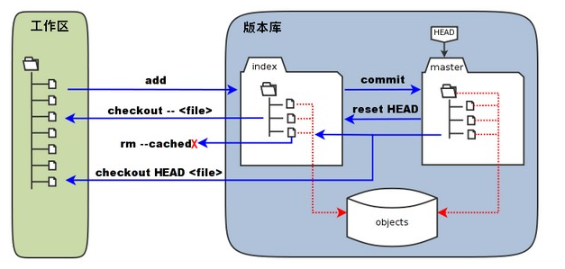

### Git概念

> - **工作区：**就是你在电脑里能看到的目录。
> - **暂存区：**英文叫 stage 或 index。一般存放在 **.git** 目录下的 index 文件（.git/index）中，所以我们把暂存区有时也叫作索引（index）。
> - **版本库：**工作区有一个隐藏目录 **.git**，这个不算工作区，而是 Git 的版本库。
>
> 

### 安装配置git

```bash
# 安装 Git
yum install git -y


# 配置邮箱、用户名（注意：邮箱格式必须要正确）
git config --global user.name willysliang	# 设置用户名
git config --global user.email willysliang@qq.com	#设置用户邮箱
git config user.name	#查看用户名
git config user.email	#查看邮箱
git show 	#显示所有信息


#适当的地显示颜色
git config --global color.ui ture


# 创建仓库
mkdir demo	#创建仓库
git init	#进行初始化，需要在版本库目录中
touch file	#创建文件
```

#### git init 和 git init --bare 的区别

```bash
### git init 和 git init --bare 的区别
- `git init` 创建非裸存储库
- `git init --bare` 创建裸存储库

裸存储库是没有工作副本的 git 存储库，因此 .git 的内容是该目录的顶级内容。
使用非裸存储库在本地工作，并使用裸存储库作为中央服务器与其他人共享您的更改。例如，当您在 `github.com` 上创建存储库时，它被创建为一个裸存储库。
注意：`--bare` 用于远程存储库，而非本地存储库。


#### 案例
1. 在您的计算机中：
$ git init
$ touch README
$ git add README
$ git commit -m "initial commit"

2. 在服务器上：
$ cd /www/project
$ git init --bare

3. 在客户端，你推送：
$ git push username@server:/www/project main

然后，您可以通过将其添加为远程来保存键入内容。
服务器端的存储库将通过拉取和推送的方式获得提交，而不是通过您编辑文件然后在服务器中提交文件，因此它是一个裸存储库。

```

#### Git hooks

```bash
## Git hooks
Git hooks 是每次 Git 存储库中发生特定事件时自动运行的脚本。它们允许您定制 Git 的内部行为，并在开发生命周期的关键点触发可定制的操作。

Git hooks 的常见用例包括鼓励提交策略、根据存储库的状态改变项目环境，以及实现连续集成工作流。但是，由于脚本是无限可定制的，您可以使用 Git hooks 来自动化或优化开发工作流的几乎任何方面。但如果添加的 Hook 脚本未正常运行，则 Git 操作将不会通过。


```

Hook 脚本置于目录 `~/.git/hooks` 中，以可执行文件的形式存在。

```bash
$ ls -lah .git/hooks
applypatch-msg.sample     pre-push.sample
commit-msg.sample         pre-rebase.sample
fsmonitor-watchman.sample pre-receive.sample
post-update.sample        prepare-commit-msg.sample
pre-applypatch.sample     update.sample
pre-commit.sample         push-to-checkout.sample
pre-merge-commit.sample
```

以上常用 hooks 有：

- `pre-commit`
- `pre-push`
- `commit-msg`

另外 git hooks 可使用 `core.hooksPath` 自定义脚本位置。

```bash
# 可通过命令行配置 core.hooksPath
$ git config 'core.hooksPath' .husky

# 也可通过写入文件配置 core.hooksPath
$ cat .git/config
[core]
  hooksPath = .husky
```

在前端工程化中，husky 即通过自定义 [`core.hooksPath`](https://git-scm.com/docs/git-config#Documentation/git-config.txt-corehooksPath) 并将 `npm scripts` 写入其中的方式来实现此功能。

[Husky](https://github.com/typicode/husky) 允许您安装钩子，包括用 JavaScript 编写的钩子。

`~/.husky` 目录下手动创建 hook 脚本。

```bash
# 手动创建 pre-commit hook
$ vim .husky/pre-commit
```

在 `pre-commit` 中进行代码风格校验：

```bash
#!/bin/sh

npm run lint
```


#### Git Diff

```bash
## Git Diff
当执行 `git fetch` 拉取远程最新代码到本地，但想要在 `git merge` 合并之前查看一些文件的变动时，可以使用 `git diff` 命令。
注意：如果是少量代码的改动，`git diff` 还是挺方便的，但如果代码量较大，建议使用 GUI 工具。

```

##### 查看变化中的差异

`git diff` 显示暂存区和工作区的差异

```bash
git diff
git diff [file] # 具体某个文件
```

##### 显示暂存区与上次 commit 的差异

`--cached` 和 `--staged` 都可以用于显示暂存区与上次 commit 的差异：

```git
git diff --cached [file]
git diff --staged [file]
```

##### 查看两个分支之间的差异

使用 `git diff <branch>...<other-branch>` 查看 `<branch>` 和 `<other-branch>` 之间的差异 。

- `git diff <branch>...<other-branch>` 比较两个分支。
- `git diff 76ce3e6...e251d8d` 比较两个特定的提交。

```bash
$ git diff <branch>...<other-branch>
$ git diff patch-1...patch-2
# 显示分支 patch-1 和 patch-2 之间的差异
```

##### 统计数据

`--stat` 生成差异统计。

```bash
$ git diff --stat

# app/a.txt    | 2 +-
# app/b.txt    | 8 ++----
# 2 files changed, 10 insertions(+), 84 deletions(-)
```

`--shortstat` 是 `--stat` 选项的简化版本，它不显示具体的文件名及一些图形部分，只输出最后一行统计数据。

显示今天写了多少行代码：

```bash
git diff --shortstat "@{0 day ago}"
# 10 files changed, 62 insertions(+), 15 deletions(-)
```

##### 仅显示修改过的文件名

```bash
git diff --summary
```


### 文件保存 add 、commit

> ```bash
> # 文件添加到暂存区
> git add ./abc.md	#将abc.md文件存放到暂存区
> git add ./			#添加当前目录下的所有文件到暂存区
>
>
> # 暂存区文件存放到仓库
> git commit -m "上传说明描述内容"	#把代码放到仓库
> git commit -a -m "message"		#-a参数可将所有已跟踪文件中的执行修改或删除操作的文件都提交到本地仓库，即使它们没有经过git add添加到暂存区（一般不使用）
>
>
> # 修改提交信息（修改上次提交的信息，值message）
> git commit --amend -m "所修改的提交信息"
> ```

### 查看信息 `status / log`

> ```bash
> # 查看状态
> git status	#仓库内文件的状态变化信息
> git status --short	#或git status -s对status简洁输出
> $ git status --porcelain # 跟上述一致，也是为对 status 简洁输出
>
>
> # 查看提交记录
> git log				# 显示当前分支的提交日志
> git log --oneline	# 简写说明，简洁版的日志 或 git log --pretty=oneline --abbrev-commit
> git log --stat		# 显示 commit 历史，以及每次 commit 发生变更的文件
> git log --oneline -number	# 查看最近的 number 个提交数
>
>
> # 获取漂亮的日志信息
> git log --pretty=format:"%h - %an, %ar : %s"		# 以给定格式有序的打印提交日志的内容、
> git log --pretty=format:"%Cred(%h)%Creset - %Cgreen(%an, %ar)%Creset : %Cblue%s" # 为输出日志设置颜色
>
>
> # 显示提交历史图表
> ## （`--graph` 选项可以以**图形**方式展示日志）
> git log --graph
> git log --pretty=format:"%h %s" --graph
>
>
> # 基于时间的日志记录
> ## 可以在特定时间范围内记录条目。非常适合检查每日项目的提交记录
> git log --since="yesterday" --oneline
> git log --since="last month" --oneline
> ## 如果需要找到给定日期范围之间的提交。可以使用 `--after` 和 `--before` 选项
> git log --after="2022-9-28" --before="2022-9-29" --oneline
> ```

### 版本回退 reset

> - `HEAD`指向的版本就是当前版本，因此Git允许我们在版本的历史之间穿梭，使用命令`git reset --hard commit_id`
> - 穿梭前，用`git log`可以查看提交历史，以便确定要回退到哪个版本。
> - 要重返未来，用`git reflog`查看命令历史，以便确定要回到未来的哪个版本。
> - 即使执行 `git reset` 命令之后，也可以使用 `git reflog` 命令找回那些丢弃掉的提交
>
> ```bash
> git reset --hard Head~0		#获取最近的版本并覆盖，0为最新的一个
> git reset --hard HEAD^		#回退上个版本
> $ git reset --hard HEAD^^	#回退到上上个版本
> git reset --hard 版本号	#回退到指定版本（版本号可不写全）
>
> git reflog					#查看隐藏的版本号(即在版本回退前存在，回退后不存在的版本)
> ```

### 撤销修改 checkout

```bash
## 撤销修改 checkout
- `git checkout -- readme.txt`：把 readme.txt 文件在工作区的修改全部撤销。
- `git checkout -- file`：撤销整个文件的修改。命令中若是没有`--`，就会变成'切换到另一分支'的命令。
    - 场景1：当你该乱了工作区某个文件的内容，想直接丢弃工作区的修改时，使用命令`git checkout -- file`。
    - 场景2：当你不但该乱工作区某个文件的内容，还添加到暂存区时，想丢弃修改，则需要分两步：
        1. `git reset HEAD <file>` 回退到场景1；
        2. `git checkout -- file` 丢弃所选文件的修改。
    - 场景3：已经提交了不合适的修改到版本库时，想要撤销本次修改，参考版本回退，但前提是没有推送到远程库。
- 注意：使用 checkout 需要你本来就已经存在文件于版本库中，否则会显示找不到该文件。


$ git reset HEAD readme.txt
$ git checkout -- readme.txt

```


### 拉取代码 fetch/pull

```bash
## 拉取代码
注意：在默认模式下，`git pull` 等价于 `git fetch && git merge FETCH_HEAD`。

- 使用 `git pull` 时，Git 会尝试自动合并。它是上下文敏感的，因此 Git 会将任何拉入的提交合并到您当前工作的分支中。`pull` 会直接自动合并提交，而不让您先查看它们。如果你不小心管理你的分支，你可能会经常遇到冲突。

- 使用 `git fetch` 时，Git 从目标分支收集当前分支中不存在的任何提交，并将其存储在本地存储库中。但是，它不会将它们与当前分支合并。如果您需要使存储库保持最新状态，但正在处理更新文件可能会导致冲突时，这一点尤其有用。要将提交集成到当前分支中，必须在之后使用 `merge`。

当你 `fetch` 时，你可以先使用 `diff` 查看更新后的差异之后，再选择 `merge`。


### 清理不存在于远程的本地跟踪分支
过时的远程跟踪分支（即那些已经在远程仓库中被删除，但在本地仍然存在的分支）可以通过添加 --prune 选项来清理
`$ git fetch origin --prune`
或 `$ git fetch -p`

```


### 远程仓库配置相关

#### SSH生成

> ```bash
> mkdir ~/.ssh
> cd ~/.ssh
> git config --global user.name 'willy'
> git config --global user.email 'willysliang@qq.com'
>
> # 生成公钥和私钥
> ssh-keygen -t rsa -C "willysliang@qq.com" -f "github_id_rsa"
>
> 连续按三次回车
>
> # 在用户主目录的`.ssh`目录里有`id_rsa`和`id_rsa.pub`两个文件，这两个是SSH Key的秘钥对，`id_rsa`是私钥，`id_rsa.pub`是公钥
>
>
> # GitHub设置公钥，打开“Account settings”，“SSH Keys”页面：然后，点“Add SSH Key”，填上任意Title，在Key文本框里粘贴`id_rsa.pub`文件的内容.
>
>
> #绑定好github上的ssh后，关联本地仓库（origin为远程库名，且关联必须放公钥到github账号列表上，否则推送不了数据）
> git remote add origin git@github.com:willy-liang/willy.git
>
>
> #把本地库的内容推送到github上
> git push -u origin master
> 或 git push ssh地址 master
> ```

#### 同机关联多个远程仓库(并行)

> **1、创建ssh key**
>
> ```bash
> # 进入用户目录下的 .ssh 文件夹下，路径会因你使用的操作系统不同而略有差异
> cd ~/.ssh
>
> # 生成 key
> ssh-keygen -t rsa -C "willysliang@qq.com" -f "gitee_id_rsa"
> ssh-keygen -t rsa -C "willysliang@qq.com" -f "github_id_rsa"
>
> # 最终生成四个key文件
> 在用户主目录的.ssh目录里有id_rsa和id_rsa.pub两个文件，这两个是SSH Key的秘钥对，id_rsa是私钥，id_rsa.pub是公钥
> ```
>
> **2、创建配置文件**（在.ssh文件夹中创建config文件）
>
> ```
> # gitee
> Host gitee.com
> HostName gitee.com
> PreferredAuthentications publickey
> IdentityFile ~/.ssh/gitee_id_rsa
>
> # github
> Host github.com
> HostName github.com
> PreferredAuthentications publickey
> IdentityFile ~/.ssh/github_id_rsa
> ```
>
> **3、绑定ssh**
>
> ```sh
> #绑定好github上的ssh后，关联本地仓库（origin为远程库名，且关联必须放公钥到github账号列表上，否则推送不了数据）
> git remote add origin git@github.com:willy-liang/willy.git
> git remote add gitee git@gitee.com:liangwilly/willy.git
> git remote -v	#查看远程信息表
> git remote -rm gitee	#删除远程库
>
> #把本地库的内容推送到github与gitee上
> git push origin master
> git push gitee master
> ```

#### GitLab无需每次输入账号密码

> ```bash
> ## GitLab无需每次输入账号密码
> 1. 添加SSH到本地，然后把SHH放入GitLab上
> 2. 若再次拉取代码和提取代码应无需再输密码，若还需输入密码
>    1. 在命令行中输入：`$ git config --global credential.helper store`
>    2. 然后操作 pull/push 会让输入用户名密码，第一次输入进去。
>    3. 下次再操作pull/push时就不需要输入用户名密码了
> ```

#### 同时推送两个存储库并保持同步

> ```bash
> git remote set-url --add --push origin git@github.com:lio-zero/blog.git
> git remote set-url --add --push origin git@github.com:lio-zero/news.git
>
> # 使用 --push 可以操作推送 Url，而不是获取 Url
> # 使用 --add 将添加新的Url，而不是更改现有的 Url
>
> # 执行 git push 将更改发送到两个存储库
> ```

#### 删除 git 缓存中的账号密码

> ```bash
> ## 删除 git 缓存中的账号密码
> git credential-manager uninstall
>
> ## 缓存输入的用户名和密码
> git config --global credential.helper wincred
> ```

#### ssh连接校验异常

```bash
## ssh 连接校验错误

### 1. 连接异常
在连接github时，执行”ssh -T git@github.com” 命令时，出现
ssh: connect to host github.com port 22: Connection timed out
fatal: Could not read from remote repository.


### 解决方案
#### 1. 打开存放 ssh 的目录
$ cd ~/.ssh


#### 2. 新建 config 文件
Host github.com
User 注册github的邮箱
Hostname ssh.github.com
PreferredAuthentications publickey
IdentityFile ~/.ssh/id_rsa # github 配置的私钥
Port 443

Host gitlab.com
Hostname altssh.gitlab.com
User 注册gitlab的邮箱
Port 443
PreferredAuthentications publickey
IdentityFile ~/.ssh/id_rsa # gitlab 配置的私钥


#### 3. 删除 config 中的权限
找到C:\用户\用户名\.ssh\config文件
属性 —> 安全 —> 高级 —> 禁用继承 —>删除所有继承项 —> 确定.


#### 4. 执行连接操作
$ ssh -T git@github.com

如果出现提示则输入：yes 回车

```

#### 上传代码报403错误

```bash
## 上传代码到远程仓库报403错误
### 报错信息描述
Connection reset by 20.205.243.160 port 443
fatal: Could not read from remote repository.
Please make sure you have the correct access rights
and the repository exists.


### 原因分析
出现这错误一般是以下两种原因：
	- 客户端与服务端未生成 ssh key
	- 客户端与服务端的ssh key不匹配
为解决以上问题，我们需要重新生成一次ssh key ，并重新配置一下GitHub账户即可。


### 解决
1. 生成新的SSH key
如果是客户端与服务端未生成ssh key，直接生成新的 rsa 密匙即可。
$ ssh-keygen -t rsa -C "youremail@example.com"
如果是客户端与服务端的ssh key 不匹配，此时需要先将本地生成的 id_rsa以及id_rsa.pub这两个文件【一般在用户名下的.ssh文件夹下】删除掉，然后再使用上述指令生成新的rsa密钥。

#### 补充说明
ssh-keygen -t rsa -b 4096 -C "邮箱"：这条命令的目的是为了让本地机器ssh登录远程机器上的GitHub账户无需输入密码。
ssh-keygen（基于密匙的安全验证）：需要依靠密钥进行安全验证，必须为自己创建一对密钥，并把公用密钥放在需要访问的服务器上。
	-t 即指定密钥的类型。密钥的类型有两种，一种是RSA，一种是DSA。
	-b 指定密钥长度。对于RSA密钥，最小要求768位，默认是2048位。命令中的4096指的是RSA密钥长度为4096位。DSA密钥必须恰好是1024位(FIPS 186-2 标准的要求)。
	-C 表示要提供一个新注释，用于识别这个密钥。“邮箱”里面不一定非要填邮箱，可以是任何内容，邮箱仅仅是识别用的key


2. 将SSH key 添加到 ssh-agent
使用 `ssh-add ~/.ssh/id_rsa` 将产生的新ssh key添加到ssh-agent中：
补充： 如果出现“Could not open a connection to your authentication agent.”的错误
		- $ eval "$(ssh-agent -s)"
		- $ eval `ssh-agent`
		- 然后再次执行 ssh-add ~/.ssh/id_rsa 指令。

3. 将SSH key 添加到你的GitHub账户

4. 验证 key
使用 `ssh -T git@github.com` 对ssh key 进行验证

```

### 远程仓库操纵

```bash
## 克隆GitHub项目到本地
- `$ git clone 仓库地址`
- git支持多种协议，包括https（速度慢、每次推送必须输入口令），但ssh协议速度最快。
- 在自己的账号下clone仓库才能有权限推送修改；别人的仓库会因无权限而没法修改。


## 提交代码到GitHub
- 将房间master分支里的代码上传到Github仓库中：`$ git push 服务器地址 master`
- 从Github仓库里的master分支拿到本地：`$ git pull 服务器地址 master`
		（本地要初始化一个克隆仓库，此方法为合并数据）
- 把所有的内容拿到本地：`$ git clone 服务器地址`
		（此方法会覆盖本地的内容数据）


## 拉取远程仓库的代码
`$ git pull`：从远程仓库获取最新版本并 merge 到本地
`$ git fetch`：从远程仓库获取最新版本到本地，不会自动 merge


## 删除远程仓库的绑定（GitHub库）
- 查看远程库信息：`$ git remote -v`
- 删除命名为origin的远程库：`$ git remote rm origin`
- 关联远程库：`$ git remote add origin git@server-name:path/repo-name.git`
- 推送master分支的所有内容：`$ git push -u origin master`
		注意：加上 `-u`，git会把当前分支与远程分支进行关联（此方法只在当前目录下有效）


## 删除远程仓库的文件
1. 先把github上的文件拉取下来：`$ git pull origin master`
2. 删除磁盘上的文件：`$ git rm -r --cached test.md`
3. 重新提交：`$ git add . && git commit -m '删除了test.md文件'`
4. 上传到远程仓库更新：`git push -u origin master`
```


#### 从一个git仓库拷贝到另一个git仓库

```bash
## 从一个git仓库拷贝到另一个git仓库
1、从原地址克隆一份裸版本库
$ git clone --bare http://....(原始仓库地址)


2、以镜像推送的方式上传代码到新的仓库地址
（目标仓库可以自己新建一个，如果用自己曾经用过的仓库里面的文件会被覆盖）
$ git push --mirror http：//...(目标仓库地址)

```


#### 将本地代码提交远程仓库时新建一个分支

```bash
## 将本地代码提交远程仓库时新建一个分支
  1. 设置本地文件夹为一个Git仓库：`$ git init`
  2. 建立远程连接: `$ git remote add origin 远程仓库地址`
  3. 可能还需要这一步：`$ git pull --rebase origin master`
  4. 创建本地新分支：`$ git branch 新建的分支名称`
  5. 查看分支：`$ git branch -a`
  6. 切换到本地新分支：`$ git checkout 所要切换的分支名称`
  7. 此时修改了本地代码
  8. 提交本地代码至暂缓区、历史提交区：`$ git add . && git commit -m "new branch first commit"`
  9. 提交到远程新分支：`git push origin 所推送到远程仓库的分支名`
  10. 去Gitlab查看，已经创建了一个新的分支并且代码正确提交。

```


#### Git 迁移项目到新仓库，并保留历史记录

```bash
## Git 迁移项目到新仓库，并保留历史记录
1. 新建文件夹，将项目从旧远程仓库地址克隆到本地
git clone git@github.com:willysliang/blog.git

2. 删除需求迁移的本地项目所管理的远程仓库地址
git remote remove origin

3. 将该项目关联新仓库的地址
git remote add origin git@github.com:willysliang/core.git

4. 将项目推送到新的远程仓库
git push -u origin master

5. 进到旧项目的 .git 目录，再执行 git push --mirror
git push --mirror git@github.com:willysliang/core.git

```


#### 重写历史记录信息

```bash
 更改所有提交者信息到自己的名称和邮箱在 Git 中被称为重写历史，这在一些情况下是有用的，例如，如果一个贡献者错误地使用了一个不正确的邮箱进行了提交，或者出于隐私保护的目的需要修改提交信息

 注意：重写已公开的提交历史是有风险的，因为它会影响所有已有的克隆和分支。如果其他人基于这些提交进行了工作，他们将不得不手动解决冲突。在团队项目中，这通常需要团队内部的协调。
```

```shell
git filter-branch --env-filter '
GIT_COMMITTER_NAME="新名字";
GIT_AUTHOR_NAME="新名字";
GIT_COMMITTER_EMAIL="新邮箱";
GIT_AUTHOR_EMAIL="新邮箱";
' --tag-name-filter cat -- --branches --tags
```

**更换某个特定用户的名字跟邮箱地址**

```bash
git filter-branch --env-filter '
OLD_EMAIL="旧的邮箱地址"
NEW_NAME="新名字"
NEW_EMAIL="新邮箱"

if [ "$GIT_COMMITTER_EMAIL" = "$OLD_EMAIL" ]
then
    export GIT_COMMITTER_NAME="$NEW_NAME"
    export GIT_COMMITTER_EMAIL="$NEW_EMAIL"
fi
if [ "$GIT_AUTHOR_EMAIL" = "$OLD_EMAIL" ]
then
    export GIT_AUTHOR_NAME="$NEW_NAME"
    export GIT_AUTHOR_EMAIL="$NEW_EMAIL"
fi
' --tag-name-filter cat -- --branches --tags
```


#### 多人协作

> ```cmd
> - git remote			#查看远程库的信息
> - git remote -v			#显示更详细的信息
> - git push origin master	#推送marster分支到远程库
> - git checkout -b branch-name origin/branch-name	#建立本地分支和远程分支的关联
> ```
>
> - `master`分支是主分支，因此要时刻与远程同步；
> - `dev`分支是开发分支，团队所有成员都需要在上面工作，所以也需要与远程同步；
> - bug分支只用于在本地修复bug，就没必要推到远程了，除非老板要看看你每周到底修复了几个bug；
> - feature分支是否推到远程，取决于你是否和你的小伙伴合作在上面开发。
>
> > 注意：在本地提交之前，先 pull 再 push，不然会有冲突


### 拉取子模块 submodule

#### 添加git子模块

- 先克隆想要添加子模块的仓库`git clone 仓库地址`，克隆的是主目录
- 进入仓库(主目录下)，添加子模块：`git submodule add 子模块地址`
- ls查看会有`.gitmodules`和子模块的项目名，将生成的文件和目录Push到主仓库中。

#### 克隆有子模块的仓库

- 添加过子模块的仓库，如果想重新克隆，在克隆仓库后需要在仓库目录下执行`git submodule init`和`git submodule update`，如果不执行，子模块中会没有文件
  1. `git clone 仓库地址`
  2. `cd 克隆的仓库文件夹名`
  3. `git submodule init`
  4. `git submodule update`

#### 更改子模块的分支

- 切换到子模块目录，默认子模块是master分支，`git submodule foreach git checkout dev`
- 然后使用`git submodule foreach git pull`切换分支

#### submodule可进行tag和merge

- `git submodule foreach`可以分别对子模块进行操作，所以对所有子模块进行tag和merge操作，就相当于对总项目进行相应的操作

```bash
# 1. 首次克隆仓库及其子模块
git clone --recursive 仓库地址

# 2. 仓库首次拉取子模块
git submodule update --init --recursive

# 3. 更新子模块
git submodule update --recursive 							// (git1.7.3版本以上)
git submodule update --recursive --remote    // (git1.8.2版本以上)
git pull --recurse-submodules								 // 合并写法
```

### 分支管理 branch

#### 创建与切换分支

```bash
## 分支管理
- 主分支master：要执行的代码。
- 子分支：还未写完的代码存放的分支。
- `HEAD`严格来说不是指向提交，而是指向`master`，`master`才是指向提交的，所以，`HEAD`指向的就是当前分支。


## 创建与合并分支 switch
- 创建并切换到 dev 分支：`$ git switch -c dev`
- 直接切换到已有的 master 分支：`$ git switch master`


- 在不切换分支的情况下查看不同分支的文件：`$ git show [branch_name分支名]:[file_path文件绝对路径]`


### 保留主分支，删除其他所有本地分支
- `$ git branch | grep -v "master" | xargs git branch -D`
    - `$ git branch` 列出所有本地分支。
    - `$ grep -v "master"` 过滤掉名为master的分支，如果你的主分支有不同的名称，请替换master。
    - `$ xargs git branch -D` 对于通过管道传递的每个分支名称，都执行 `git branch -D` 命令强制删除分支。

```

```bash
git branch dev		#创建dev分支
git branch			#查看分支
git checkout dev	#切换dev分支
git checkout -b dev	#创建并切换到dev分支
git checkout -u dev	#切换分支并进入子分支
git merge dev		#在主分支合并分支，把当前分支与指定的分支进行合并
git branch -d dev	#删除dev分支
```

#### 合并分支

> ```bash
> ## 合并分支
> ### 合并分支概念
> 每次提交，Git都把它们串成一条时间线，这条时间线就是一个分支。截止到目前，只有一条时间线，在Git里，这个分支叫主分支（一般命名为`master`分支）。随着不断提交，主分支的线也会越来越长。
> 当我们创建新的分支（如dev），Git新建了一个指针叫`dev`，指向`master`相同的提交，再把`HEAD`指向`dev`，就表示当前在`dev`分支上。
> Git创建分支，除了增加一个`dev`指针，改改`HEAD`的指向，工作区的文件都没有任何改变。
> 当完成在`dev`上的工作后，就可以把`dev`合并到`master`上，就是直接把`master`指向`dev`的当前提交，就完成合并了。
> 合并完分支后，甚至可以删除`dev`分支。删除`dev`分支就是把`dev`指针给删掉，删掉后，就剩下一条`master`分支。
>
>
> ### 解决合并分支内容的冲突
> - 在多个分支中修改同一个文件，合并可能会产生冲突（Git用`<<<<<<<`，`=======`，`>>>>>>>`标记出不同分支的内容）
> - 冲突解决办法：合并分支后，手动修改冲突文件的内容。
> - 查看分支的合并情况：`git log --graph --pretty=oneline --abbrev-commit`
> - 用`git log --graph`命令可以看到分支合并图
>
>
> ### 合并分支命令
> - `$ git merge 需要被合并的分支名称` 命令用于合并指定分支到当前分支。
> ```

#### 分支管理策略

> - 通常合并分支时，如果可能，Git会用`Fast forward`模式，但这种模式下，删除分支后，会丢掉分支信息。
> - 如果要强制禁用`Fast forward`模式，Git就会在merge时生成一个新的commit，这样，从分支历史上就可以看出分支信息。
>
> ```bash
> #--no-ff参数，表示禁用Fast forward
> git merge --no-ff -m "merge with no-ff" dev
>
> #查看分支历史
> git log --graph --pretty=oneline --abbrev-commit
> ```

#### Bug分支 stash

```bash
### Bug 分支
- `git stash`：把当前工作现场"储藏"，等以后恢复现场后继续工作。
- `git stash list`：查看储藏的`stash`。
- `git stash apply`：恢复`stash`的内容(恢复`stash`后，`stash`内容并不删除，所以需要删除)
- `git stash drop`：删除`stash`内容
- `git stash pop`：恢复的同时把`stash`内容也删了
- `git stash apply stash@{0}`：恢复指定的stash（有多次stash时使用）
- `git cherry-pick 4c80e2 `：复制一个特定的提交到当前分支（`3c80e2`为其他分支的提交号）

```

#### cherry-pick

```bash
### cherry-pick
Git 中的 cherry-pick 作用是从一个分支中选择一个提交，并将其应用到另一个分支上。
这与其他方式形成了对比，例如 `merge` 和 `rebase`，它们通常将许多提交应用于另一个分支。

`git cherry-pick <commit-hash>` 会将指定的提交 `commit-hash` 应用于当前分支。这会在当前分支产生一个新的提交，当然它们的哈希值会不一样。

假设您有 `master` 和 `develop` 分支，现在需要将 `develop` 分支的某一个提交，如 `x` 应用到 `master` 分支：
$ git checkout master # 切换到对应分支（这里是 `master`）
$ git cherry-pick x # chergit cherry-pick <HashA> <HashB>ry-pick对应的提交（这里是 `x`）


应用 `develop` 分支的最近一次提交，可以直接使用分支名：`git cherry-pick develop`

转移多个提交：`git cherry-pick <HashA> <HashB>`

从公共分支中挑选：`git cherry-pick -x <commit-hash>`
这将生成一个标准化的提交消息。这样以后仍然可以跟踪提交的来源，并且可以避免将来发生合并冲突。

如果在提交中附加了注释，则它们不会遵循 `cherry-pick`。要将它们也带过来，则必须使用：
`git notes copy <from> <to>`


### 在 cherry-pick 中遇到冲突
使用 `git cherry-pick --about` 来取消这次 cherry-pick 操作，并尝试回到执行 cherry-pick 之前的状态。

```


### 工作流 git flow

```bash
## 工作流
1. master 分支：主分支，用于发布稳定版本。
2. develop 分支：开发分支，用于集成所有功能的开发，并进行构建、测试和部署等操作。
3. feature 分支：功能分支，用于开发某个具体的功能，从 develop 分支分离出来，完成后合并回 develop 分支。
4. release 分支：发布分支，用于准备发布一个新版本，从 develop 分支分离出来，进行构建、测试和修复等操作，并最终合并回 develop 分支和 master 分支。
5. hotfix 分支：热修复分支，用于修复 master 分支上的严重问题，从 master 分支分离出来，完成后合并回 develop 分支和 master 分支。


### 使用
1. 初始化工作流（直接 enter 即可）
	$ git flow init
2. 建立 feature 分支
	$ git flow feature start 设定的feature分支名
3. 完成 feature 分支（会合并代码到 develop 分支中，并会删除该 feature 分支）
	$ git flow feature finish 要完成的feature分支名


### Feature 分支
添加一个功能时，不希望因为一些实验性质的代码把主分支搞乱，所以每添加一个功能需要先新建一个 feature 分支在上面开发，完成后合并代码到 develop 分支上。
`	$ git flow feature finish 要完成的feature分支名` 会把该 feature 分支合并后删除。
由于 feature 分支上存在有未提交的操作，而 git 为了防止修改丢失，所以不允许删除，但可进行强制删除分支：`$ git branch -D featureName`


### 代码提交规范
    1. 新功能（feat）：表示添加新功能或特性。
    2. 修复（fix）：表示修复 bug 或错误。
    3. 代码重构（refactor）：表示重构代码，但没有添加新功能或修复 bug。
    4. 样式调整（style）：表示对代码的样式或格式进行调整，如缩进、空格等。
    5. 文档（docs）：表示修改文档，如 README 文件、注释等。
    6. 测试（test）：表示添加或修改测试代码。
    7. 构建或辅助工具（chore）：表示修改构建或辅助工具的配置或代码。
此外，还有一些可选的消息类型，如：
    1. 优化（perf）：表示优化代码性能。
    2. 国际化（i18n）：表示国际化相关的修改。
    3. 版本或标签（version/tag）：表示版本或标签相关的修改。

```

### Rebase

`git rebase`操作的特点：把分叉的提交历史"整理"成一条直线，看上去更直观。缺点是本地的分叉提交已经被修改过了。

- rebase操作可以把本地未push的分叉提交历史整理成直线；
- rebase的目的是使得我们在查看历史提交的变化时更容易，因为分叉的提交需要三方对比。

### 标签管理 tag

```bash
## 标签管理
- 打标签的目的是记录该版本的发表。


1. 创建标签
- 创建轻量标签：`git tag <tag_name>`
- 创建带注释标签：`git tag -a <tag_name> -m "custom message"`


2. 查看标签
- 查看显示本地所有标签：`git tag`
- 显示特定标签的标签数据：`git show <tag_name>`
- 查看远程所有标签：`git ls-remote --tags`


3. 推送标签
- 推送一个本地标签：`git push origin <tagname>`
- 将所有标签推送到远程仓库：`git push --tags`


4. 删除标签
- 删除本地特定标签：`git tag -d <tag_name>`
- 删除远程特定标签：`git push -d origin :refs/tags/<tag_name>`


5. 检查标签
- 检查标签是否仅在本地可用：`git push --tags --dry-run`
		- `--dry-run` 选项总结了下一次提交中将包含的内容。
		- 如果上述命令的输出状态为 ‘Everything up-to-date’，则表示没有可推送的标签
		-
```

```bash
#当次提交的标签
git add .
git commit -m “fixed some bugs”
git tag -a v0.1.3 -m “version 0.1.3″		#a指定标签名，m说明文字


#可查看历史提交的commit id
git log --pretty=oneline --abbrev-commit


#新建一个标签（默认为HEAD，也可指定一个commit id）
git tag v0.9 f52c633


#分享提交标签到远程服务器上
git push origin master
git push origin --tags
git push origin v0.9


#切换到已有Tag
git tag --list  // 查看已有tag列表
git show v0.9	//查看说明文件:git show tagname
git checkout [tag/branch/commit]  //切换到指定tag/branch/commit都是此命令


#删除本地标签
git tag -d v0.1.3


#删除远端服务器的标签（需先从本地删除才能远程删除）
git push origin :refs/tags/v0.1.3

```

### 忽略特殊文件 gitignore

````bash
## 忽略特殊文件/目录
再 Git 工作区的根目录下创建一个 `.gitignore` 文件，然后把需要忽略的文件名/文件夹目录填入，Git 提交就会自动忽略这些文件。

忽略文件的原则是：
  1. 忽略操作系统自动生成的文件；如缩略图等。
  2. 忽略编译生成的中间文件、可执行文件等。如果一个文件是自动生成的，则该自动生成的文件就没必要放进版本库，如Java编译产生的`.class`文件。
  3. 忽略带有敏感信息的配置文件。如存放口令的配置文件。


- 当被`.gitignore`忽略,强制添加到Git：`git add -f App.class`
- `.gitignore`规则写错检查：`git check-ignore -v App.class`

````

#### 通用的 `.gitignore` 文件配置

```.gitignore
# Windows:Windows会自动在有图片的目录下生成隐藏的缩略图文件，如果有自定义目录，目录下就会有Desktop.ini文件，因此你需要忽略Windows自动生成的垃圾文件：
Thumbs.db
ehthumbs.db
Desktop.ini

# Python，忽略Python编译产生的.pyc、.pyo、dist等文件或目录
*.py[cod]
*.so
*.egg
*.egg-info
dist
build

# My configurations:自定义
db.ini
deploy_key_rsa

# 排除所有.开头的隐藏文件:
.*
# 排除所有.class文件:
*.class

# 不排除.gitignore和App.class:
!.gitignore
!App.class

```

#### git clean 删除未跟踪的文件或目录

删除未跟踪的文件或目录，是指未写在 `.gitignore` 文件中，并且未使用 `git add` 将变更的文件从工作区添加到暂存区的文件。

要删除未跟踪的文件和目录，您可以执行：

```git
# 删除未跟踪的文件。
# f
$ git clean -f

# 删除未跟踪的文件和目录。
# d
$ git clean -fd
```

如果您还想删除被 `.gitignore` 隐藏的文件，可以使用以下命令：

```git
# 忽略的文件、未被跟踪的文件和文件夹
# x
$ git clean -xfd
```

如果想要先查看哪些文件可能会被删除，而不执行删除动作，可以执行以下命令：

```git
# n
$ git clean -xfdn
```


### 配置别名

- `--global`参数是全局参数，也就是这些命令在这台电脑的所有Git仓库下都有用,
- `git config --global alias.别名 原名`
- 让其显示最后一次提交信息：`git last`

```bash
git config --global alias.st status		#git status-->git st
git config --global alias.co checkout
git config --global alias.ci commit
git config --global alias.br branch

##撤销修改：git unstage test.py-->gitreset HEAD test.py
git config --global alias.unstage 'reset HEAD'

#lg配置别名 git lg
 git config --global alias.lg "log --color --graph --pretty=format:'%Cred%h%Creset -%C(yellow)%d%Creset %s %Cgreen(%cr) %C(bold blue)<%an>%Creset' --abbrev-commit"
```

**配置文件**

- 配置Git的时候，加上`--global`是针对当前用户起作用的，如果不加，那只针对当前的仓库起作用。
- 每个仓库的Git配置文件都放在`.git/config`文件中。
- 别名就在`.git/config`文件中的`[alias]`后面，要删除别名，直接把对应的行删掉即可。

### 搭建Git服务器

- 搭建Git服务器需要准备一台运行Linux的机器，还需要有`sudo`权限的用户账号。

1. 安装git：`sudo apt-get install git`
2. 创建一个git用户，用来运行git服务：`sudo adduser git`
3. 创建证书登录：收集所有需要登录的用户的公钥，就是他们自己的id_rsa.pub文件，把所有公钥导入到/home/git/.ssh/authorized_keys文件里，一行一个。
4. 初始化Git仓库：
   1. 先选定一个目录作为Git仓库，假定是`/srv/sample.git`，在`/srv`目录下输入命令：`sudo git init --bare sample.git`
   2. Git就会创建一个裸仓库，裸仓库没有工作区，因为服务器上的Git仓库纯粹是为了共享，所以不让用户直接登录到服务器上去改工作区，并且服务器上的Git仓库通常都以`.git`结尾。然后，把owner改为`git`：`sudo chown -R git:git sample.git`
5. 禁用shell登录：
   1. 出于安全考虑，第二步创建的git用户不允许登录shell，这可以通过编辑`/etc/passwd`文件完成。找到类似下面的一行：`git:x:1001:1001:,,,:/home/git:/bin/bash`
   2. 改为：`git:x:1001:1001:,,,:/home/git:/usr/bin/git-shell`
   3. 这样，`git`用户可以正常通过ssh使用git，但无法登录shell，因为我们为`git`用户指定的`git-shell`每次一登录就自动退出。
6. 克隆远程仓库：`git clone git@server:/srv/sample.git`
7. 管理公钥：把每个人的公钥收集起来放到服务器的`/home/git/.ssh/authorized_keys`文件里。或用[Gitosis](https://github.com/res0nat0r/gitosis)来管理公钥
8. 管理权限：会在版本控制系统里设置一套完善的权限控制，每个人是否有读写权限会精确到每个分支甚至每个目录下。因为Git是为Linux源代码托管而开发的，所以Git也继承了开源社区的精神，不支持权限控制。不过，因为Git支持钩子（hook），所以，可以在服务器端编写一系列脚本来控制提交等操作，达到权限控制的目的。[Gitolite](https://github.com/sitaramc/gitolite)就是这个工具。

## Git 项目提交信息处理

### Husky 工程化

```bash
## Husky 工程化
在前端工程化时，husky 是必不可少的工具，它可以方便地处理 git hooks 并执行特定的脚本。
钩子都被存储在 .git 目录下的 hooks 目录。


###  安装
1. 在项目中安装
$ pnpm install husky

2. 在项目中添加 srcipts 命令
$ npm pkg set scripts.prepare="husky install"
（等价于在 package.json 文件 scripts 属性下添加 `prepare: "husky install"`）


### 使用
首次安装完毕需执行，这时会在你项目中创建了一个 .husky 文件夹
$ pnpm run prepare


### 常用 Git Hooks
- `applypatch-msg` : 应用补丁，通过 `git am` 触发。
- `pre-applypatch` : 提交补丁前，运行 `git am` 期间触发。
- `post-applypatch` : 提交产生后，运行 `git am` 期间最后触发。
- `pre-commit` : 用于检查即将提交的快照，`git commit` 触发（可通过 `--no-verify` 绕过）。
- `commit-msg` : 用来在提交通过前验证项目状态或提交信息，`git commit` 和 `git merge` 触发（可通过 `--no-verify` 绕过）。
- `post-commit` : 主要用于通知，`git commit` 触发，但不会影响结果。
- `post-receive` : 推送完成后执行，可以用来更新其他系统服务或者通知用户。


```

### lint-staged

```bash
## lint-staged
lint-staged 是一个在git暂存区上运行linters的工具。它将根据package.json依赖项中的代码质量工具来安装和配置 husky 和 lint-staged ，因此请确保在此之前安装lint-staged，并配置所有代码质量工具，比如Prettier和ESlint。


### 安装
pnpm i -D lint-staged


### 参数
执行 npx lint-staged --help 命令可以看到相关的所有参数如下：
用法: lint-staged [options]

Options:
  -V, --version                      输出版本号
  --allow-empty                      当任务撤消所有分阶段的更改时允许空提交（默认值：false）默认情况下，当LITER任务撤消所有阶段性的更改时，LITET阶段将抛出一个错误，并中止提交。
  -c, --config [path]                配置文件的路径
  -d, --debug                        打印其他调试信息（默认值：false）
  -p, --concurrent <parallel tasks>  要同时运行的任务数，或者为false则要连续运行任务（默认值：true）
  -q, --quiet                        自己的控制台输出（默认值：false）
  -r, --relative                     将相对文件路径传递给任务（默认值：false）
  -x, --shell                        跳过任务解析以更好地支持shell（默认值：false）
  -h, --help                         输出用法信息

```

### commitlint

```bash
## commitlint
提交时，进行提交信息验证，是否符合规范。 这里使用到一个 commitlint 的包

@commitlint/cli : commit 消息校验工具。
@commitlint/config-angular : Angular提交信息规范。
@commitlint/config-conventional : 传统规范。


### 安装
$ pnpm i @commitlint/cli @commitlint/config-conventional -D


### 生成配置文件
$ echo "module.exports = {extends: ['@commitlint/config-conventional']}" > commitlint.config.cjs

```

### 添加 hooks

#### .husky/pre-commit

```sh
#!/bin/sh
. "$(dirname "$0")/_/husky.sh"

npx lint-staged --allow-empty "$1"

```

#### .husky/commit-msg

```sh
#!/bin/sh
. "$(dirname "$0")/_/husky.sh"

npx --no -- commitlint --config commitlint.config.cjs --edit $1

```

```bash
### 添加命令
把 `.husky/pre-commit` 文件添加到git中。
$ git add .husky/pre-commit


### 自检代码
$ npx lint-staged --allow-empty "$1"

$ npx --no -- commitlint --config commitlint.config.cjs --edit $1

```

## GitHub Actions

### 在 GitHub Actions 工作流程中部署 GitHub Pages 时出现 403 错误

```bash
### 在 GitHub Actions 工作流程中部署 GitHub Pages 时出现 403 错误，可能是由于以下原因之一：
1. 没有正确配置仓库的访问权限。如果你没有正确配置仓库的访问权限，可能会导致 403 错误。你需要确保你有足够的权限来访问该仓库，并进行部署操作。你可以在仓库的设置页面中配置访问权限。


2. 没有正确配置 Action 的输入参数。如果你没有正确配置 crazy-max/ghaction-github-pages Action 的输入参数，可能会导致 403 错误。你需要确保你已经正确配置了 repo、target_branch 和 build_dir 等参数，以便 Action 可以正确地部署 GitHub Pages。


3. 没有正确配置 Personal Access Token（PAT）。
在使用 crazy-max/ghaction-github-pages Action 部署 GitHub Pages 时，需要提供一个有效的 PAT，用于进行身份验证和授权。如果你没有正确配置 PAT，可能会导致 403 错误。你可以在 GitHub 的设置页面中创建一个新的 PAT，并将其保存在仓库的 Secrets 中。然后，在 GitHub Actions 工作流程中，你可以使用 ${{ secrets.PAT }} 引用该 PAT。

在 GitHub 上创建 Personal Access Token（PAT）并将其保存在仓库的 Secrets 中的具体流程：
    登录 GitHub，进入你的个人资料页面。
    点击右上角的头像，选择 Settings。
    在左侧菜单中选择 Developer settings，然后选择 Personal access tokens。
    点击 Generate new token 按钮。
    在 Token description 中输入一个描述性的名称，以便于识别该令牌的用途。
    在 Select scopes 中选择需要授权的权限。如果只需要访问公共仓库，可以选择 public_repo。如果你需要访问私有仓库，可以选择 repo，并勾选其中的子权限。
    点击 Generate token 按钮。
    复制生成的 PAT，并将其保存在一个安全的地方，以便后续使用。
    进入你的 GitHub 仓库，点击 Settings。
    在左侧菜单中选择 Secrets，然后点击 New repository secret 按钮。
    在 Name 中输入一个名称，例如 PAT。
    在 Value 中粘贴刚才复制的 PAT。
    点击 Add secret 按钮，保存该令牌。
现在，你已经成功创建了一个 PAT，并将其保存在仓库的 Secrets 中。在 GitHub Actions 工作流程中，你可以使用 ${{ secrets.PAT }} 引用该 PAT，以进行身份验证和授权。

在 Github Actions 中使用
在你的 GitHub 仓库中，创建一个新的 Secrets，例如 PAT。
将你的 PAT 复制到该 Secrets 的 Value 中，并保存该 Secrets。
在你的 GitHub Actions 工作流程中，使用 ${{ secrets.PAT }} 引用该 Secrets。例如：
- name: Deploy to GitHub Pages
  uses: crazy-max/ghaction-github-pages@v2.2.4
  with:
    target_branch: gh-pages
    build_dir: ./public
  env:
    GITHUB_TOKEN: ${{ secrets.PAT }}
```

## SVN

```bash
## SVN


### Git 和 SVN 的区别
Git 和 SVN 最大的区别在于 Git 是分布式的，而 SVN 是集中式的。因此不能再离线的情况下使用 SVN。如果服务器出现问题，就没有办法使用 SVN 来提交代码。

SVN 中的分支是整个版本库的复制的一份完整目录，而 Git 的分支是指针指向某次提交，因此 Git 的分支创建更加开销更小 并且分支上的变化不会影响到其他人。SVN 的分支变化会影响到所有的人。

SVN 的概念指令相对于 Git 来说要简单一些，比 Git 更容易上手。
```

