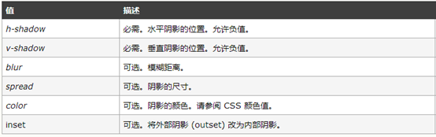
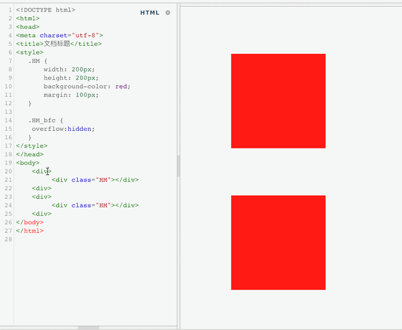

## HTML

## 标签

### DOCTYPE

> ```bash
> ## DOCTYPE
> 
> ### HTML 混乱模式
> - 网站设置 `<!DOCTYPE html>` 是为了防止浏览器在渲染文档时，使用一个不符合规范的渲染模式。
> - 在严格模式下，浏览器根据 W3C 标准进行解析并渲染，而在混杂模式下浏览器会用自己的渲染方式解析并渲染。
> - 混杂模式的存在是为了在没有 W3C 标准时间段写的旧网页可以顺利地加载出来。
> ```
>

### h1标签

> `<h1>`标签通常在页面顶部，以表明页面内容的总体目的。它在SEO中扮演着重要角色，因为搜索引擎比其他因素更重视它。它也可用于显示在搜索结果中。
>
> 在HTML的旧版本，特别是HTML4中，只允许每个页面有一个`<h1>`标签。但HTML5允许多个`<h1>`标签，用于每个`session`
>
> 这意味着使用多个`<h1>`标签在HTML语法方面是有效的，但它不被认为是最佳实践
>
> **注意：**我们应该避免每个页面使用多个 h1 标签
>
> ```html
> <!-- 👎 不建议这样做 -->
> <h1>Main heading</h1>
> <section>
>   <h1>A section heading</h1>
> </section>
> <section>
>   <h1>Another section heading</h1>
> </section>
> 
> 
> <!-- 👍 推荐这样做 -->
> <h1>Main heading</h1>
> <section>
>   <h2>A section heading</h2>
> </section>
> <section>
>   <h2>Another section heading</h2>
> </section>
> ```

### html 防止浏览器要求翻译

> ```bash
> ## html 防止浏览器要求翻译
> 如果一个网站的内容是用一种特定的语言编写，那么访问者在使用某些浏览器时可能会被提示将其翻译成另一种语言(如谷歌浏览器)。
> 此时可通过为整个文档设置 `translate` 属性来防止这种情况发生。
> 		`<html translate="no"></html>`
> 
> translate 属性对某些翻译工具(如 Google translate) 有影响。
> 此外，它是一个全局属性，意味着我们可以对任何元素使用它。
> 如果我们不想翻译一个特定的标题，即使页面已翻译，它也非常有用。
> 	`<h1 translate="no">Title</h1>`
> ```

### meta

> 语法：`<meta charset="utf-8"> `防止页面乱码           charset:字符集    utf-8:编码格式
>
> 作用：是HTML语言头部的一个辅助性标签，我们可以定义页面编码语言、搜索引擎优化、自动刷新并指向新的页面、控制页面缓冲、响应式视窗等
>
> 注意：该标签中的关键字不是给用户看的

### 外链link

> 1. 链接外部文件，比如css文件
> 2. 设置网页图标

### 列表 ul、ol、il

> ```bash
> ## 列表类型
> - 有序列表：ol > li      
> - 无序列表：ul > li      
> - 自定义列表：dl > dt > dd   (dt中只能包含行内元素span/a)
> 
> 
> ## 列表属性
> - 列表项的标志类型：list-style-type: decimal;
> - 列表标志位置：list-style-position: inside;//包含向右缩进到文本内部
> - 列表项图像：list-style-image: url(arr.gif);
> 
> 
> ## 创造编号项目的降序列表
>   默认情况下，有序列表元素（`ol` 标签）将按升序显示每个项目的编号。第一项显示为数字 1。第二项是数字 2，依此类推
>   有些情况下，我们希望颠倒数字的顺序，但保留实际项目。如前 5 部电影、前 10 首歌曲等是该用例的最佳示例。
>   为此只需添加 reversed 属性
>   还可使用 start 属性来指示开始编号
> 
>   <ol reversed start="5">
>     <li>........</li>
>     <li>........</li>
>     <li>........</li>
>     <li>........</li>
>   </ol>
> ```

### 图片 img

> ```bash
> ## img 标签的 width、height 属性
> 在 web 早期，开发者会给  标签加上 `width 和 height` 属性，以确保浏览器开始获取图片之前分配好空间，这样可以减少 `reflow 和 re-layout`
> 
> 这两个属性没有带单位，但这些像素尺寸会确保保留 360*360 的区域，图片最终会平铺在这个区域，不管原始尺寸是否一致。
> 
> 
> ## 响应式css样式图片
> 当响应式设计来临时，开发者开始忽略 `width 和 height`，开始使用 css 来调整图片大小
> `img { width: 100%; height: auto }`
> 但这种方法的缺陷是，只有图片下载时，浏览器才知道图片的宽高并且分配好空间。图片下载完后，每张图片出现在屏幕上时，页面都会 `reflow` 一次，会导致页面频繁的往下弹，这对于用户来说非常不友好。
> 
> 
> ## aspect-ratio 的衍生
> 因为上述响应式实现的缺陷，因而诞生了图片的宽高比 `aspect-ratio`。
> 比如 x:y 的宽高比，指的是宽度 x 单位，高度 y 单位。
> 这也以为这我们只要知道宽度或高度的其中之一，就能计算出另一个属性。如对于一个 16:9 的宽高比而言：
> - 如果图片有 360px 的高度，则宽度为 `360 * (16 / 9) = 640px`
> - 如果图片有 640px 的宽度，则高度为 `640 * (9 / 16) = 360px`
> 
> 
> ## 现代浏览器的最佳体验
> 现代浏览器可以基于 `width 和 height` 属性设定默认宽高比，这样就能避免布局偏移。
>   
>   img { aspect-ratio: attr(width) / attr(height) }
> 这样一来，图片加载之前，浏览器就可以根据宽高属性分配好空间。图片加载之后，就可以根据宽度或高度属性，按照宽高比来分配实际空间。
> 如果图片位于容器内，可以设置宽度为容器宽度，高度为 auto，避免高度被固定为 360px
> 	img { height: auto; width: 100%; }
> 	
> 	
> ## 响应式图片 srcset
> 在使用响应式图片时，`srcset`定义了图片可以供浏览器选择的尺寸，为了确保图片 `width 和 height`可以被设置，每张图片的宽高比必须一致。
>        width="1000" 
>     height="1000"
>     src="puppy-1000.jpg"
>     srcset="
>       puppy-1000.jpg 1000w,
>       puppy-2000.jpg 2000w,
>       puppy-3000.jpg 3000w,
>     "
>     alt="Puppy with balloons"
>   />
> 有时我们希望展示图片的剪切部分，比如长图的中间正方形区域，为了视觉好看。
>   <picture>
>     <source media="(max-width: 799px)" srcset="puppy-4800w-cropped.jpg">
>     <source media="(min-width: 800px)" srcset="puppy-800w-cropped.jpg">
>     
>   </picture>
> 这样一来图片宽高比就不一致了，浏览器可能更需要针对每一个资源设置特定宽高比。但目前还没有好的解决方案，`re-layout`依然存在。
> ```

#### app内嵌H5，禁止图片长按保存

```bash
### app 内嵌 H5 禁止图片长按保存

1. css 禁止点击图片事件
img {  pointer-events:none; }
缺点：会禁止图片的点击事件。所以当图片有点击事件时，给有点击事件的图片设置 `pointer-events:auto;`，那么则合格图片又可以长按保存。
使用该方法的建议：如果需要给图片添加点击事件，可以在外层套一层 div，在 div 上绑定事件。


2. 禁用了默认的callout展示， callout 是指当触摸并按住一个元素的时候出现的提示。
img {
	user-select: none;
  -webkit-touch-callout: none;
  -webkit-user-select: none;
 	-moz-user-select: none;
	-ms-user-select: none;
}
缺点：安卓机上可能不生效。且该特性是非标准属性，不建议使用。
主要用于禁止长按菜单。当然针对webkit内核的浏览器。


3. img 使用背景图替代
改用背景图方式，原来使用img标签的改为背景图的方式实现，可以避免长按保存图片操作。


4. img 上添加遮罩层
在 img 图片层（与图片同一层级，可使用 absolute 定位来遮盖住图片）增加遮罩，设置透明度为0，这样图片不会被点击，也不会出现长按保存图片操作
```


#### alt 和 title 的区别

```bash
### ait 和 title 的区别
- `alt` 属性是当元素不能正常呈现时用作元素内容的替代文本。img 标签是使用 `alt` 属性的最常用标签。当无法加载图像时，浏览器将在其位置显示 `alt` 文本，以便用户了解包含图像的含义。
- `title` 属性是将鼠标悬停在元素上时看到的工具提示文本，是对图片的描述和进一步的说明。

注意：浏览器并非总是会显示图像。当有下列情况时，`alt` 属性可以为图像提供替代的信息：
	- 非可视化浏览器（Non-visual browsers）（比如有视力障碍的人使用的音频浏览器）
	- 用户选择不显示图像（比如为了节省带宽，或出于隐私等考虑不加载包括图片在内的第三方资源文件）
	- 图像文件无效，或是使用了[不支持的格式](https://developer.mozilla.org/zh-CN/docs/Web/HTML/Element/img#Supported_image_formats)
	- 浏览器禁用图像等

推荐做法: 始终为 `` 标签使用 `alt` 属性，以提供一些有用的信息。
谷歌和其他搜索引擎无法读取图像，但可以看到 `alt` 文本。设置 `alt` 属性是 SEO（搜索引擎优化）的一个良好实践。
通常不会为 `` 设置 `title` 属性，除非它确实提供了有关图像的更多信息。


#### 确保在 `img` 标签上始终包含 `alt` 属性
使用 CSS 为任何缺少或空白 `alt` 属性的 `img` 提供红色轮廓：
img:not([alt]), img[alt=''] { outline: 8px solid red; }

```


### 表格table

> - cellspacing 设置td与td之间的距离
>
> - cellpadding 设置内容与td左侧的距离
>
> - caption:表格标题
>
> - 合并边框border-collaspe:collapse;
>
> - 文本对齐： text-align 属性设置水平对齐方式 ；vertical-align 属性设置垂直对齐方式
> - 给tr或者td设置align属性，可以让其内容居中
> - 合并单元格： ☞ 横向合并：colspan         ☞ 纵向合并：rowspan
>
> > 注意：   给table标签设置align属性，只能让整个标签居中，内容不会居中；
>
> ```html
> 表格结构：<thead></thead>		<tbody></tbody>		<tfoot></tfoot>
> ```
>
> 

### 表单form

> - 作用：收集用户数据
>
> - 组成：提示信息 | 表单控件    | 表单域
>
> **1、表单域：<form></form>**
>
> - action : 设置后台处理数据的后台程序    
> - method：提交数据给后台程序的方式
> - get提交数据： 会将数据显示在地址栏中
> - post提交数据： 会通过后台提交数据（安全性）
>
> 2、**表单控件**
>
> 
>
> 分组控件和标题如下：
>
> 
>

### 内联框架 iframe

```bash
## 内联框架 iframe
iframe 标签允许我们将来自其他来源（其他网站）的内容嵌入到我们的网页中。
从技术上讲，iframe 创建了一个新的嵌套浏览上下文。这意味着 iframe 中的任何内容都不会干扰父页面，反之亦然。JavaScript 和 CSS 不会泄漏到 iframe 或从 iframe 中泄漏。

注意：HTML5 不再支持使用 frame, iframe 只有 src 属性。

iframe 的优点：
	1. 程序调入静态页面比较方便。
	2. 页面和程序分离。

iframe 的缺点：
	1. 样式/脚本需要额外链入，会增加请求（加载JS会具备安全隐患）。
	2. 搜索引擎对 iframe 不友好，如果是动态网页可使用 include，但必须去除它的 `<html><head><title><body>` 标签。
	3. iframe 的框架结构可能会导致页面混杂（如产生滚动条）
	4.  iframe 会阻塞主页面加载
    	window 的 onload 事件需要在所有 iframe 加载完毕后(包含里面的元素)才会触发。
    	但在 Safari 和 Chrome 中可通过 JS 动态设置的 iframe 的 `src` 属性上所绑定的链接来避免这种阻塞情况。
	5. iframe 和主页面共享连接池
    	浏览器只能开少量的连接到 web 服务器（http只能同时发送6个请求），但因为主页面和其中的 iframe 是共享这些连接的。
    	这意味着 iframe 在加载资源时可能用光所有的可用连接，从而阻塞了主页面资源的加载。
    	但可通过在主页面上的重要的元素加载完毕后，在动态设置 iframe 的 src 属性上所绑定的链接来优化这个问题。


### sandbox 属性允许限制 iframe 中允许的操作
  - `allow-forms` 允许提交表单
  - `allow-modals` 允许打开模态窗口，包括在 JavaScript 调用 `alert()`
  - `allow-orientation-lock` 允许锁定屏幕方向
  - `allow-popups` 允许弹出窗口、使用 `window.open()` 和 `target="_blank"` 链接
  - `allow-same-origin` 将正在加载的资源视为同一来源
  - `allow-scripts` 让加载的 iframe 运行脚本（但不创建弹出窗口）。
  - `allow-top-navigation` 允许访问 iframe 以访问顶级浏览上下文


### 微前端上的 iframe 的缺点
1. url 不同步。浏览器刷新，iframe 的 url 状态丢失、后退前进按钮无法使用。
2. DOM 结构不共享。想象以下屏幕右下角 1/4 的 iframe 里有一个带遮罩层的弹框，同时我们要求和这个弹框要浏览器居中显示，还要浏览器 resize 时自动居中...（但该功能难以实现）
3. 全局上下文完全隔离，内存变量不共享。iframe 内外系统的通信、数据同步等需求，主应用的 cookie 要透传到根据域名到不同的子应用中实现免登效果。
4. 慢。每次子应用进入都是一次浏览器上下文重建、资源重新加载的过程。

```

```html
<iframe src="page.html" />

<iframe src="https://example.com/page.html" />

<iframe src="page.html" width="800" height="400" />

<iframe srcdoc="<p>Hello iframe!</p>" />


```


### 盒子 `div`

> ```bash
> ## 盒子边框问题
> 原本两个盒子都占有边距，如果相邻，则需要把右盒子的 margin 定义为负值（负值边框宽度）
> 
> 
> ## 盒子大小计算问题
> 原本盒子大小是盒子内容(width 和 height) + 盒子边框大小(盒子边框border)
> 如果想改变盒子计算方式，让其总大小为盒子内容大小，则需定义 `box-sizing:border-box;`
> 
> 
> ## 计算盒子宽度
> 使用 `calc()` 函数
> ```

### 输入框`input`

#### 清除输入框历史记录

> `autocomplete='off'`禁用自动完成功能，清除input框输入存留历史值，防止下拉历史值显示。
>
> ```html
> <input type="text" autocomplete="off"/>
> ```

#### 使input文本框不可编辑的3种方法

> 1. disabled 属性规定应该禁用 input 元素，被禁用的 input 元素，不可编辑，不可复制，不可选择，不能接收焦点,后台也不会接收到传值。设置后文字的颜色会变成灰色。disabled 属性无法与 `<input type="hidden"> `一起使用。
>
>    ```vue
>    <input type="text" disabled="disabled" />
>    ```
>
> 2. readonly 属性规定输入字段为只读可复制，但是，用户可以使用Tab键切换到该字段，可选择,可以接收焦点，还可以选中或拷贝其文本。后台会接收到传值. readonly 属性可以防止用户对值进行修改。
>
>    readonly 属性可与 `<input type="text"> `或` <input type="password">` 配合使用。
>
>    ```vue
>    <input type="text" readonly="readonly">
>    ```
>
> 3. readonly unselectable="on" 该属性跟disable类似，input 元素，不可编辑，不可复制，不可选择，不能接收焦点，设置后文字的颜色也会变成灰色，但是后台可以接收到传值。
>
>    ```vue
>    <input type="text"  readonly  unselectable="on" >
>    ```
>

#### 过滤文件输入的文件类型

> 默认情况下，单击文件输入（`<input type="file"/>`）时，浏览器将列出目标文件夹中的所有文件。
>
> 文件输入提供的`accept` 属性提示浏览器列出特定的文件类型。属性值可以是一个或多个文件扩展名、`MIME` 类型，用逗号分隔。
>
> 例如，要求用户选择的图像类型如下所示：
>
> ```html
> <input type="file" accept=".png, .jpg, .jpeg" />
> <!-- 或 -->
> <input type="file" accept="image/png, image/jpeg" />
> 
> 
> <input type="file" multiple  accept="image/*,audio/*,video/*" />
> ```
>
> `accept` 属性不阻止用户选择类型不在列表中的文件。不要使用它来验证所选文件

### 按钮 button

> ```bash
> ## button 与 <input type="button"/> 的区别
> 1. `<button>` 可以包含 HTML。`<input type="button">` 是空元素(如 `br、hr、image`)，因此不能包含内容。
> 2. `<button>` 支持伪元素，例如 `::after、::before`，这对于设置按钮样式非常有用，而 `<input type="button">` 没有。
> 3. 默认情况下 `<button>` 具有默认属性 `type="submit"`。这意味着如果没有指定 type 属性，单击该按钮将提交其封闭表单。
> 
> 如果希望 input 作为提交按钮，必须将 type 属性更改为 submit。
> 
> 
> ### 建议
> - button 元素比 button 类型的 input 更具语义。如果要创建可单击的按钮，建议使用 button 元素。
> - 始终指定 button 元素的 type 属性。可能值：
> 			1. submit：按钮将表单数据提交到服务器
> 			2. reset：将表单输入重置为初始化
> 			3. button：默认情况下，按下时不执行任何操作
> ```

### 转义字符

> ```bash
> &nbsp;		空格 （non-breaking spacing，不断打空格）
> &lt;			小于号（less than）
> &gt;			大于号（greater than）
> &amp;			符号&
> &quot;		双引号
> &apos;		单引号
> &copy;		版权©
> &trade;		商标™
> &#32464;	文字绐。#32464是汉字绐的unicode编码
> &sup2;		平方（上标2）
> &sup3;		立方（上标3）
> ```

### 超链接 a

```bash
## 锚链接 a
- 给超链接起一个名字，作用是 在本页面或者其他页面的的不同位置进行跳转。
- 比如说，在网页底部有一个向上箭头，点击箭头后回到顶部，这个就可以利用锚链接。


### 属性说明
- `href`：目标URL
- `title`：悬停文本。
- `name`：主要用于设置一个锚点的名称。
- `target`：告诉浏览器用什么方式来打开目标页面。
    - `_self`：在同一个网页中显示（默认值）
    - `_blank`：**在新的窗口中打开**。
    - `_parent`：在父窗口中显示
    - `_top`：在顶级窗口中显示


### 返回页面顶部示例
首先我们要创建一个锚点 ，即是使用`name`属性或者`id`属性给那个特定的位置起个名字。
`<a href="a.html#name1">回到顶部</a>`

```


#### 所有链接都在新标签打开

```bash
### 所有链接都在新标签打开
将 `target="_blank"` 属性设置为单个链接将在新选项卡中打开它。
在一个真实的用例中，您希望在一个新选项卡中打开页面上的所有链接，这是很少见的。一个只收集外部资源链接的网站可能就是一个例子。
在这种情况下，您只需将其设置为 `base` 标签，而不是将属性添加到所有链接：
注意:就像我们说的那样，链接会在新窗口中打开，即使链接中没有 `target="_blank"` 属性。这是因为 `base` 元素的 `target` 属性已经被设置为 `"_blank"` 了。
你还可以为所有 `a` 标签上 `href` 属性为空的链接添加一个 URL 指向。

```

```html
<head>
  <base href="https://www.baidu.com" />
  <base target="_blank" />
</head>
<body>
  <a href="https://www.baidu.com">百度一下，你就知道</a>
</body>
```


#### 使用 a 标签下载文件，浏览器会直接打开的解决方案

```bash
## 使用 a 标签下载文件，浏览器会直接打开的解决方案
- 问题描述：使用 a 标签打开一个如 excel 的文件地址，浏览器会下载文件，但如图片的链接就不会下载。
- 在使用 a 标签进行下载文件时，chrome 浏览器是会打开支持预览的文件（如 txt、json 等），而不是下载文件到本地。


### 1. 使用a标签 + download属性
如 `<a href="/user/test/xxx.txt">点击下载</a>` 把文件路径给 a 标签的 href 属性，这样当用户点开链接时就会直接下载文件。
但如 txt、png、jpg 等这些浏览器支持直接打开的文件是不会执行下载任务的，而是会直接打开文件，这时就需要给 a 标签添加一个 download 属性，如 `<a href="/user/test/xxx.txt" download="文件名.txt">点击下载</a>`。


### 2. 即使使用a标签的download属性，浏览器仍然会打开文件
原因：服务器端返回的response中，content-type为text/plain，即数据以纯文本形式(text/json/xml/html)进行编码，其中不含任何控件或格式字符。chrome浏览器直接打开了该文本，并没有下载。
解决方案：浏览器对 txt、json 等文件直接打开是因为浏览器对这些类型的文件支持阅览，可以设置 `Content-type:application/octet-stream` 来告知浏览器这是一个字节流，浏览器处理字节流的默认方式就是下载。
		- Content-Type设置为application/octet-stream是二进制的下载流，导致强制下载。
如果是公共读类型的文件也可以直接在链接后面加上，比如：`window.open('https://xxx.json?response-content-type=application%2Foctet-stream')`。

```


## 通用属性

### 省略的HTML布尔属性的值

> 有一些 HTML 布尔属性，如 `checked`、`disabled`、`readonly`、`required`、`selected` 等。
>
> 根据 HTML 规范，布尔属性有三种可能的声明。所有这些都具有相同的效果：
>
> ```html
> <input readonly />
> <input readonly="" />
> <input readonly="readonly" />
> ```
>
> `true` 和 `false` 是无效值：
>
> ```html
> <!-- 不允许 -->
> <button disabled="true">...</button>
> <button disabled="false">...</button>
> ```
>
> 表示 `false` 值的唯一方法是删除该属性。因此，为了避免错误和误导性用法，建议不为布尔属性赋值：
>
> ```html
> <input readonly />
> ```


### 语言属性 lang

```bash
## 语言属性 lang
HTML 文档的内容可以是多种不同的语言。为了指定文档的主要语言，我们可以在根元素上使用 `lang` 属性。
我们还可以在页面中使用 `lang` 属性来划分与文档主语言不同语言的特定元素或部分。
对于特定于语言的样式，在 lang 属性选择器上使用 lang 伪类。

注意: `lang` 属性不能应用于以下元素（不包含不推荐使用的标签）：`br、iframe、script、base、param`


### 设置lang属性的好处
- 根据 `lang` 属性来设定不同语言的 `css` 样式，或者字体
- 告诉搜索引擎做精确的识别
- 让语法检查程序做语言识别
- 帮助翻译工具做识别
- 帮助网页阅读程序做识别等等
```

```html
<html lang="zh">
  <head>
    <style>
      [lang='en'] p {
        font-size: 1.2em;
        color: plum;
      }
    </style>
  </head>
  <body>
    <p lang="en">为 p 元素设置了 `lang` 属性，并设置了 `en`（英语）语言，如果我们想要给它设置样式，我们可以使用 `[lang]` 属性选择器来选择具有特定语言属性的所有元素或元素的子元素。</p>
  </body>
</html>
```


#### :lang 伪类

```bash
### `[lang]` 属性选择器不知道该元素的语言
使用基于 `[lang]` 属性选择器的特定于语言的样式的问题在于，选择器实际上并不知道元素的语言。它就像任何其他属性选择器一样。
如果一个文档包含多个不同语言的嵌套元素，这可能会成为一个问题。
    <section lang="zh">
      <p>注意：xxx</p>
      <blockquote lang="en">
        <p>I am Superman</p>
      </blockquote>
    </section>
    <style>
    [lang='en'] p {
      padding: 10px;
      border: 1px solid;
      border-left: 5px solid rebeccapurple;
      color: rebeccapurple;
      border-radius: 5px;
    }

    [lang='zh'] p {
      padding: 10px;
      border: 1px solid;
      border-left: 5px solid plum;
      color: plum;
      border-radius: 5px;
    }
    </style>

因为 CSS 没有优先考虑更接近的父级的概念。因此，无论哪个 `lang` 属性谁更接近谁，都会根据我们声明的 CSS 样式的顺序设置样式。所以这里的样式设置为了 `zh`，但我们本想区分两者。


### `:lang` 伪类
- `:lang` 是一个语言选择器，会根据 `html` 设置的语言应用对应的样式。可以有两种方式设置 `lang` 属性的样式：
		- 它使用所选元素的实际语言
		- 它可以应用于任何元素，而不是直接基于 `lang` 属性
- `:lang` 伪类用于根据元素的内容语言选择元素。元素的内容语言由以下三个因素决定：
		- 任何 `lang` 属性
		- 元标签，例如 `<meta http-equiv="content-language" content="en">`
		- HTTP 头，例如 `Content-language: en`
这意味着 `:lang` 伪类即使在没有指定 `lang` 属性的情况下也可以使用。


### `:lang` 和嵌套
作为一个伪类，`:lang` 最好用于特定的元素，而不是子元素。
使用与上面相同的示例，我们可以切换到使用 `:lang()` 属性来选择 `p` 元素。但是，我们不必选择指定语言的子 `p` 元素，而是可以选择本身属于指定语言的 `p` 元素。
    p:lang(zh) { color: rebeccapurple; }
    p:lang(en) { color: plum; }
即使 `p` 元素本身没有 `lang` 属性，我们仍然可以使用伪类，因为 `p` 元素的内容语言是从其父级继承的。

```


### data 标签

```bash
## data 标签
`data` 元素表示其内容，以及值属性中这些内容的机器可读形式。Edge、Firefox 和 Safari 都支持 `<data>` 元素。
`value` 属性是必需的，其值必须以机器可读的格式表示元素的内容。

元素可以与页面中的脚本一起使用，当脚本有一个文本值与一个人类可读的值一起存储时。（用法近似于 `data-*`）

```

```html
<!doctype html>
<html lang="en">
  <head>
    <style>
      data:hover::after {
        content: ' (ID ' attr(value) ')';
        font-size: 0.7em;
      }
    </style>
  </head>
  <body>
    <ul>
      <li><data value="398">Mini Ketchup</data></li>
      <li><data value="399">Jumbo Ketchup</data></li>
      <li><data value="400">Mega Jumbo Ketchup</data></li>
    </ul>
  </body>
</html>

```


## Emmet(缩写)语法

### 元素

> Emmet使用类似于CSS选择器的语法描述元素在生成的文档树中的位置及其属性。
>
> 可以用元素名（如div或p）来生成HTML标签。Emmet没有预定义的元素名的集合，可以把任何单词当做标签来生成和使用。如：`div→<div></div>，foo→<foo></foo>`等。

### HTML模板

> 从 HTML 模板开始，在空的 html 文件中输入 `!` 会触发 Emmet 的建议：
>
> ```html
> !
> ```
>
> 它将生成一个 HTML5 基本模板

### 后代节点：`>`

> 可以使用`>`运算符指定嵌套元素在另一个元素内部：``
>
> ```html
> div>ul>li
> ```
>
> ```html
> <div>
> 	<ul>
> 		<li></li>
> 	</ul>
> </div>
> ```

### 兄弟节点：`+`

> 使用`+`运算符将相邻的其他元素处理为同级：
>
> ```html
> div+p+bq
> ```
>
> ```html
> <div></div>
> <p></p>
> <blockquote></blockquote>
> ```

### 节点上升：`^`

> 使用>运算符将会降低所有后续元素在生成树中的级别，每一级的兄弟也被解析成相同深度的元素：
>
> ```html
> div+div>p>span+em
> ```
>
> ````html
> <div></div>
> <div>
> 	<p><span></span><em></em></p>
> </div>
> ````
>
> 使用`^`运算符，能够提升元素在生成树中的一个级别，并同时影响其后的元素：`div+div>p>span+em^bq`
>
> ```
> <div></div>
> <div>
> 	<p><span></span><em></em></p>
> 	<blockquote></blockquote>
> </div>
> ```
>
> 可以连续使用多个运算符，没此提高一个级别：`div+div>p>span+em^^^bq`
>
> ````
> <div></div>
> <div>
> 	<p><span></span><em></em></p>
> </div>
> <blockquote></blockquote>
> ````

### 节点重复：`*`

> 使用`*`运算符可以定义一组元素：`ul>li*3`
>
> ```
> <ul>
> 	<li></li>
> 	<li></li>
> 	<li></li>
> </ul>
> ```

### 节点分组：`()`

> 括号用于在复杂的Emmet缩写中处理一组子树：
>
> ```html
> div>(header>ul>li*2>a)+footer>p
> ```
>
> ````html
> <div>
> 	<header>
> 		<ul>
> 			<li><a href=""></a></li>
> 			<li><a href=""></a></li>
> 		</ul>
> 	</header>
> 	<footer>
> 		<p></p>
> 	</footer>
> </div>
> ````

#### 与`*`嵌套使用

> 如果想与浏览器DOM协同工作，可能想要对文档片段分组：每个分组包含一个子树，所有的后续元素都插入到与组中第一个元素相同的级别中。能够在组中嵌套组并且使用`*`运算符绑定它们：
>
> ```html
> (div>dl>(dt+dd)*3)+footer+p
> ```
>
> ````html
> <div>
> 	<dl>
> 		<dt></dt>
> 		<dd></dd>
> 		<dt></dt>
> 		<dd></dd>
> 		<dt></dt>
> 		<dd></dd>
> 	</dl>
> </div>
> <footer></footer>
> <p></p>
> ````
>
> 使用分组，可以使用单个缩写逐个写出整页的标签，但不推荐此做法。

### 属性运算符

> 属性运算符用于编辑所生成的元素的属性，在HTML和XML中可以快速地生成元素添加class属性。

#### ID和class：`#`和`.`

> 在CSS中，可以使用elem#id和elem.class注解来达到元素指定id或class属性的目的。在Emmet中，可以使用几乎相同的语法来指定的元素添加这些属性：
>
> ```html
> div#header+div.page+div#footer.class1.class2.class3
> ```
>
> ```html
> <div id="header"></div>
> <div class="page"></div>
> <div id="footer" class="class1 class2 class3"></div>
> ```

#### 自定义属性：`[attr]`

> 可以使用`[attr]`注解来为元素添加自定义属性：
>
> ```html
> td[title="hello world!" colspan=3]
> ```
>
> ```html
> <td title="hello world!" colspan="3"></td>
> ```
>
> - 能够在方括号中放置多个属性，
> - 可以不为属性指定值：`td[colspan title]`，
> - 属性可以用单引号或双引号为定界符。
> - 如果属性不包含空格，不需要用定界符括住它：`td[title=hello colspan=3]`是正确的。

### 属性编号：`$`

> 使用*运算符可以重复生成元素，如果带`$`就可为它们编号。把`$`放在元素那个、属性名或属性值中，将为每个元素生成正确的编号：
>
> ```html
> ul>li.item$*5
> 
> 生成结果：
> <ul>
> 	<li class="item1"></li>
> 	<li class="item2"></li>
> 	<li class="item3"></li>
> </ul>
> ```
>
> 使用多`$`可以填充前导的零：
>
> ```html
> ul>li.item$$$*3
> 
> 生成结果：
> <ul>
> 	<li class="item001"></li>
> 	<li class="item002"></li>
> 	<li class="item003"></li>
> </ul>
> ```

#### 改变编号的基数和方向：`@`

> 使用`@`，可以改变数字的走向（升序或降序）和基数（例如起始值）。
>
> ##### 在`$`后添加`@-`来改变数字的走向：
>
> ```
> ul>li.item$@-*3
> 生成结果：
> <ul>
> 	<li class="item3"></li>
> 	<li class="item2"></li>
> 	<li class="item1"></li>
> </ul>
> ```
>
> ##### 在`$`后添加`@N`改变编号的基数：
>
> ```
> ul>li.item$@7*5
> 生成结果：
> <ul>
> 	<li class="item7"></li>
> 	<li class="item8"></li>
> 	<li class="item9"></li>
> </ul>
> ```
>
> ##### 同时改变编号的基数和方向：
>
> ```
> ul>li.item$@-3*5
> 生成结果：
> <ul>
> 	<li class="item7"></li>
> 	<li class="item6"></li>
> 	<li class="item5"></li>
> 	<li class="item4"></li>
> 	<li class="item3"></li>
> </ul>
> ```

### 文本：`{}`

> 可以用花括号向元素中添加文本：
>
> ```html
> a{Click me}
> ```
>
> ````html
> <a href="">Click me</a>
> ````
>
> 注意：这个`{text}`是被当成独立元素解析的（类似于div，p），但是当期跟在其他元素后面则有所不同。例如，`a{click}`和`a>{click}`产生相同的输出，但是`a{click}+b{here}`和`a>{click}+b{here}`的输出是不同的：
>
> ````html
> <!-- a{click} 和 a>{click} -->
> <a href="">click</a>
> 
> <!-- a{click}+b{here} -->
> <a href="">click</a><b>here</b>
> 
> <!-- a>{click}+b{here} -->
> <a href="">click<b>here</b></a>
> 
> <!-- p>{Click }+a{here}+{ to continue}  -->
> <p>
> 	Click 
> 	<a href="">here</a>
> 	 to continue
> </p>
> ````
>
> 因为用`>`运算符明确地将`Click here to continue`下移一级别，放在`<p>`元素内，但对于a元素的内容就不需要了，因为`<a>`仅有here这一部分内容，它不改变父元素的上下文。

### 隐式标签：`default`

>隐式标签表示 Emmet 可以省略某些标签名。
>
>```html
>.container
>em>.default-inline
>ul>.default-list
>table>.default-table-row>.default-table-column
>select>.default-select
>```
>
>效果如下：
>
>```html
><div class="container"></div>
><em><span class="text"></span></em>
><ul>
><li class="list"></li>
></ul>
><table>
><tr class="table-row">
><td class="table-column"></td>
></tr>
></table>
><select name="" id="">
><option class="select"></option>
></select>
>```

### 缩写格式的注意事项

> 当熟悉了Emmet的缩写语法后，可能会想要使用一些格式来生成更可读的缩写。例如，在元素和运算符之间使用空格间隔：`~~(header > ul.nav > li*5) + footer~~`
>
> 但是这种写法写法是错误的，因为**空格是Emmet停止缩写解析的标识符**。

## CSS

### CSS通用

> ```bash
> ## css
> css指的是层叠样式表，也称级联样式表
> 
> 
> ### css 引入方式
> 1. 行内式
> 2. 嵌入式
> 2. 链接式
> 
> ### 层叠样式表优先级
> - 行内 > 内部 > 外部
> - ID选择器 > 类选择器 > 标签选择器
> 
> 
> ### 初始化css样式原因
> 因为浏览器的兼容问题，不同浏览器对有些标签的默认值不同，如果不初始化css，会导致不同浏览器页面间的显示差异。
> 
> 
> ### 重置（resetting）CSS 和 标准化（normalizing）CSS 的区别是什么？
> - 重置（Resetting）：重置意味着除去所有的浏览器默认样式。对于页面所有的元素，像 margin、padding、font-size 这些样式全部设置成一样，你将必须重新定义各种元素的样式。
> - 标准化（Normalizing）：标准化没有去掉所有的默认样式，而是保留了有用的一部分，同时还纠正了一些常见错误。
> 当需要实现非常个性化的网页设计时，我会选择重置的方式，因为我要写很多自定义的样式以满足设计需求，这时候就不再需要标准化的默认样式了。
> 
> 
> 
> ### 如何为功能受限的浏览器提供页面？ 使用什么样的技术和流程？
> - 优雅的降级：为现代浏览器构建应用，同时确保它在旧版浏览器中正常运行。
> - 渐进式增强：构建基于用户体验的应用，但在浏览器支持时添加新增功能。
> - 利用 [caniuse.com](https://caniuse.com/) 检查特性支持。
> - 使用 `autoprefixer` 自动生成 CSS 属性前缀。
> - 使用 [Modernizr](https://modernizr.com/)进行特性检测。
> 
> 
> 
> ### 有什么不同的方式可以隐藏内容（使其仅适用于屏幕阅读器）？
>     - `width: 0; height: 0`：使元素不占用屏幕上的任何空间，导致不显示它。
>     - `position: absolute; left: -99999px`： 将它置于屏幕之外。
>     - `text-indent: -9999px`：这只适用于`block`元素中的文本。
>     - Metadata： 例如通过使用 Schema.org，RDF 和 JSON-LD。
>     - WAI-ARIA：如何增加网页可访问性的 W3C 技术规范。
> 即使 WAI-ARIA 是理想的解决方案，我也会采用绝对定位方法，因为它具有最少的注意事项，适用于大多数元素，而且使用起来非常简单。
> 
> 
> ### 编写高效的 CSS 应该注意什么？
> 首先，浏览器从最右边的选择器，即关键选择器（key selector），向左依次匹配。根据关键选择器，浏览器从 DOM 中筛选出元素，然后向上遍历被选元素的父元素，判断是否匹配。选择器匹配语句链越短，浏览器的匹配速度越快。避免使用标签和通用选择器作为关键选择器，因为它们会匹配大量的元素，浏览器必须要进行大量的工作，去判断这些元素的父元素们是否匹配。
> 
> BEM (Block Element Modifier)原则上建议为独立的 CSS 类命名，并且在需要层级关系时，将关系也体现在命名中，这自然会使选择器高效且易于覆盖。
> 
> 搞清楚哪些 CSS 属性会触发重新布局（reflow）、重绘（repaint）和合成（compositing）。在写样式时，避免触发重新布局的可能。
> ```
>
> - 

#### 通用类名

> ```css
> 头部：					header
> 内容：					content/container
> 页脚/尾部：		 footer
> 导航：					nav
> 侧栏：					sidebar
> 栏目：					column
> 滚动：					scroll
> 登录条：			  loginbar
> 标志：					logo
> 广告：					banner
> 页面主体：			 main
> 热点：					hot
> 新闻：					news
> 下载：					download
> 子导航：			 subnav
> 菜单：					menu
> 子菜单：			 submenu
> 搜索：				  search
> 友情链接：      friendlink
> 版权：		      copyright
> ```

#### 各大浏览器的最小字体

> - 五大浏览器默认字体大小均为16px。
> - 将html的font-size大小设成小于浏览器最小字体时，在页面内使用rem时浏览器还是会默认为浏览器的最小字体大小。
> - 所以为了防止出现浏览器兼容性问题，将html的font-size设为>=12px是一个很好的选择。
>
> | 五大浏览器   | Chrome（87.0） | Firefox（83.0） | IE（5 7 8 9 10 11） | Edge（87.0） | Opera （72.0） | Safari （5.1.7） |
> | ------------ | -------------- | --------------- | ------------------- | ------------ | -------------- | ---------------- |
> | 最小字体大小 | 6px            | 0               | 0                   | 0            | 12px           | 0                |
> | 其他浏览器   | 搜狗浏览器     | 360浏览器       | QQ浏览器            | UC浏览器     | 水狐浏览器     | 星愿浏览器       |
> | 最小字体大小 | 12px           | 12px            | 12px                | 12px         | 0              | 12px             |


### css引入方式

> ```bash
> ## CSS 样式的四种引入方式
>     1. 行内样式（`inline-style`）
>     在标签内使用 style 属性来定义样式。
>         <div style="width: 200px;"></div>
> 
> 
>     2. 内联样式
>     在 `<style>` 标签内声明样式
>         <style type="text/css">
>           p { padding: 10px; }
>         </style>
> 
> 
>     3. 链接样式
>     通过 `<link>` 标签加载外部样式
>         <link type="text/css" rel="stylesheet" href="style.css">
> 
> 
>     4. 导入样式
>     在 `<style>` 标签内利用 `@import` 来引入外部样式
>         <style type="text/css">
>           @import url(style.css);
>         </style>
>     
> 
> 
> ### css引入的两种方式：link 和 @import 的区别
> 1. 遵循规范不同
>    link 是 XHTML 标签，除了加载 CSS 外，还可以定义 RSS 等其它事务；
>    @import 属于 CSS 范畴，只能加载 CSS。
> 
> 2. 加载方式不同
>    link 引入 CSS 时，在页面载入时同时加载；
>    @import 需要页面完全载入后才加载。
> 
> 3. 兼容性不同
>    link 是 XHTML 标签，无兼容问题；
>    @import 是在 CSS2.1 中提出的，低版本的浏览器不支持。
> 
> 4. 动态加载性不同
>    link 支持使用 JS 控制 DOM 去改变样式；
>    @import 不支持这样的操作。
>    （JS 可以获取 link 标签元素，但获取不到 @import，因为 @import 只是一种 CSS 语法）
> ```
>

### css选择器

> ```bash
> ## CSS 选择器类型
>   1. ID选择器　　				     #myid
>   2. 类选择器　　					    .myclass
>   3. 元素（标签）选择器　       div, h1, p
>   4. 属性选择器　　	          a[rel="external"], input[type="text"]
>   5. 伪类　　	 	 					    a:hover, li:nth-child
>   6. 伪元素　　					     ::first-line, div::before, div::after
>   7. 通配符选择器（派生）		    *
>   8. 子选择器(关系选择器)	 		 div > a
>   9. 相邻同胞选择器(关系选择器)	 div + p
>   10.后代选择器(关系选择器)	     li a
> 
> 
> ## CSS 样式优先级
> - `!important > 行内样式 > ID选择器 > 类/属性/伪类选择器 > 标签/伪元素选择器 > 通配符/关系 > 继承样式 > 默认`
> - 当样式中包含多种选择器时，需要将多种选择器的优先级相加然后再进行比较。
> - 但注意，选择器的优先级计算不会超过它的最大数量级，如果选择器的优先级一样，前面定义的样式会被后面的样式覆盖
> - 伪类的顺序：`:link  、 :visited 、 :hover 、 :active`
> 
> 
> ## CSS 样式权重计算规则
>   - 内联样式的权重：1000
>   - ID选择器的权重：0100
>   - 类选择器、伪类选择器和属性选择器的权重： 0010
>   - 标签选择器和伪元素选择器的权重：0001
>   - 通配符选择器、关系选择器（子、相邻、后代）的权重：0000
>   - 继承的样式没有权值
>   - !important 的作用是提升优先级，加了这句的样式的优先级是最高的等级
>   注意：在同权重情况下，前面的样式会被后面的样式覆盖。
> 	### 选择器比较规则
>       如：1,0,0,0 > 0,99,99,99，也就是说从左往右逐个等级比较，前一等级相等才往后比
>       		1，   0 ，   0，   0
>       		0,   99 ，  99 ，  99
> ```

#### 属性选择器(css3新增)

> ```bash
> # 属性选择器（CSS3新增）：属性选择器可以根据元素的特定属性来选择元素，这样就可以不用借助类或者id选择器
>   - E[attr]：该选择器定位具有属性attr的任何元素E：
>   - E[attr=val]：该选择器定位具有属性attr且属性值为val的任何元素E：
>   - E[attr|=avl]：该选择器定位具有属性attr且属性值为val或以val-开始的任何元素E：
>   - E[attr~=val]：该选择器定位具有属性attr且属性值为完整单词 val 的任何元素E：
>   - E[attr^=val]：该选择器定位具有属性attr且属性值以val开头的任何元素E：
>   - E[attr$=val]：该选择器与E[attr^=val]正好相反，定位具有属性attr且属性值以val结尾的任何元素E：
>   - E[attr*=val]：该选择器与E[attr~=val]相似，但更进一步，定位具有属性attr且属性值任意位置包含val的元素E，val可以是一个完整的单词，也可以是一个单词中的一部分
>  >>> 注意：标签和[]中间不能加空格
> ```
> 
> ````css
> /* 属性选择器可以根据元素的特定属性来选择元素，这样就可以不用借助类或者id选择器 */
> /* 注意：标签和[]中间不能加空格 */
> 1、td[title="a"]
> 	-->title属性值为a的td元素会被选择
> 
> 2、td[title~="c"]  
> 	-->title属性值包含“c，且c前后只能有空格”的td元素会被选择
> 
> 3、td[title|="h"]  
> 	-->title属性值为“h开头，且h只能为独立单词，后面可跟连字符”的td元素会被选择
> 
> 4、td[title^="icon"]
> 	-->title属性值为“icon开头”的td元素会被选择
> 
> 5、td[title$="con"]
> 	-->title属性值为“con结尾”的td元素会被选择
> 
> 6、td[title*="xxx"]
> 	-->title属性值“包含xxx”的td元素会被选择
> ````

#### 选择器分类

> ```bash
> ## 选择器分类
> 1、CSS并集选择器    
> 
> 2、CSS交集选择器 
> 
> 3、CSS派生选择器
> 		子代：p>em {}    
> 		兄弟：p+em {}   
> 		后代：p em {}      
> 		元素1~元素2：
> 
> 4、CSS伪类选择器    
> 	-->必须按顺序写：a:link，	a:visited，	a:hover，	a:active
> 		link:链接被访问前选中;		visited:链接被访问之后选中
> 		hover:鼠标悬停在链接上;		active:链接被按下后
> 	还有其他伪类：li:first-child       input:focus
> 
> 5、伪元素选择器
> 	-->h1::before，h2::after， p::first-line
> 
> 6、兄弟选择器：
> -->元素1~元素2：第1 个元素之后所有的元素2 都会被选择，且这些元素和第一个元素拥有同一个父元素（两个元素之间不一定要相邻）
> ```

#### 结构伪类选择器

> ````bash
> ## 结构伪类选择器
> 结构伪类选择器主要根据 文档结构 来选择元素，常用于根据父级选择器里面的子元素
> 
> ## 选择符
> 	E:first-child			匹配父元素中的第一个子元素 E
> E:liast-child			匹配父元素中最后一个子元素 E
> E:nth-child(n)		匹配父元素中的第 n 个子元素 E
> E:first-of-type		指定类型 E 的第一个
> E:last-of-type		指定类型 E 的最后一个
> E:nth-of-type(n)	指定类型 E 的第 n 个
> 
> 
> ## nth-child(n) 选择某个父元素的一个或多个特定子元素
> - n 如果是数字，就是选择第 n 个子元素，里面数字从 1 开始
> - n 如果是关键字：even 偶数、odd 奇数
> - n 如果是公式：常见的公式如下（如果 n 是公式，则从 0 开始计算，但是第 0 个元素或者超出了元素的个数会被忽略）
> ````

#### 伪元素

> ```bash
> ### 伪元素
> CSS 伪元素是添加到选择器的关键字，去选择元素的特定部分。它们可以用于装饰（:first-line，:first-letter）或将元素添加到标记中（与 content:...组合），而不必修改标记（:before，:after）。
>   - :first-line和:first-letter可以用来修饰文字。
>   - 上面提到的.clearfix方法中，使用clear: both来添加不占空间的元素。
>   - 使用:before和after展示提示中的三角箭头。鼓励关注点分离，因为三角被视为样式的一部分，而不是真正的 DOM。如果不使用额外的 HTML 元素，只用 CSS 样式绘制三角形是不太可能的。
> ```

### 颜色的表示方式

> ```bash
> ## 颜色的表示方式
> 1. 预定义颜色名称：英文单词表达颜色
> 2. HEX：十六进制表示颜色：`＃RRGGBB,其中RR（红色），GG（绿色）和BB（蓝色）`
> 3. RGB表示颜色：`rgb(red Number, green Number, blue Number)，其中每个颜色数值取值范围为 0~255 `
> 4. HSL表示颜色：`hsl(色相, 饱和度, 亮度)`
> 		- 其中色相是在色轮上的程度（从0到360）：-0（或360）是红色的，120是绿色的，240是蓝色的。
> 		- 饱和度是一个百分比值，0％意味着灰色和100％的阴影，是全彩。
> 		- 亮度也是一个百分比，0％是黑色的，100％是白色的
> ```
>
> ```css
> .color1 { background-color: orange; }
> 
> .color2 { background-color: #FFFF00; }
> 
> .color3 { background: rgb(0,255,0); }
> 
> .color4 { background-color: hsl(360,50%,50%); }
> ```

### **图片背景background**

> ```bash
> 1. 背景平铺
> background-repeat:repeat|no-repeat|repeat-x|repeat-y;
> 
> 2. 背景图片位置	方位名词有：top|center|bottom|left|right
> background-position:x y;
> 
> 3. 背景图像固定
> background-attachment:scroll|fixed;
> 
> /4. 背景复合写法background:背景颜色 背景图片地址 背景平铺 背景图像滚动 背景图片位置
> background:transprent url('img.jpg') repeat-y fixed top;	//背景透明，图像固定，图片在位置上方，向y轴平铺
> ```

### 边框 border

> ```bash
> ## 边框 border
> - border: border-width | border-style | border-color;
> - border-collapse控制浏览器绘制表格边框方式。border-collapse:collapse;//表示香菱边框合并一起。
> - 边框会额外增加盒子的实际大小。解决方案：①测量盒子时不量边框；②如果测量时包含边框，则需width/height减去边框宽度。
> ```
>
> #### 绘制三角形
>
>
> ```css
> // CSS绘制三角形
> .triangle {
>   width:0;
>   height:0;
>   border-right:100px solid transparent;
>   border-left:100px solid transparent;
>   border-bottom:100px solid #3f6a6a;
> }
> ```
>

### 内边距padding

```bash
## 内边距 padding
内边距是设置边框与内容之间的距离。

问题：当给盒子指定 padding 值后，内容和边框有了距离，再添加内边距，容器宽高变大（padding 影响了盒子实际大小）
解决方案：如果想保证盒子与效果图大小保持一致，则让 width/height 减去多出的内边距大小。
```


### 外边距margin

```bash
## 外边距 margin
外边距为控制盒子和盒子之间的距离。


## 外边距让块级盒子水平居中的条件
1. 盒子必须设置宽度 width
2. 盒子的左右外边距都设置值为 auto


## 使用 margin 属性定义块元素的垂直边距时，可能会出现外边距的合并
造成这种现象主要是两种情况
1. 情况一：相邻元素垂直外边距的合并（尽量不给上下相邻盒子都设置外边距）
2. 情况二：嵌套块元素垂直外边距的塌陷
		- 可为父元素定义上边框
		- 可为父元素定义上内边距
		- 可为父元素添加 `overflow: hidden`
		
		
## 清除内外边距
`padding: 0; margin: 0;`

## 事先定义盒模型的尺寸解析方式box-sizing
- box-sizing:content-box | border-box | inherit
- content-box：默认值，实际的宽度和高度=border+padding+设置内容的宽高;
- border-box:设置的内容宽度=实际的宽度和高度；
- inherit：此值使元素继承父元素的盒模型模式
```


### object-fit

> **`object-fit`** [CSS](https://developer.mozilla.org/zh-CN/docs/Web/CSS) 属性指定[可替换元素](https://developer.mozilla.org/zh-CN/docs/Web/CSS/Replaced_element)（例如：[``](https://developer.mozilla.org/zh-CN/docs/Web/HTML/Element/img) 或 [``](https://developer.mozilla.org/zh-CN/docs/Web/HTML/Element/video)）的内容应该如何适应到其使用高度和宽度确定的框。
>
> 您可以通过使用属性来切换被替换元素的内容对象在元素框内的对齐方式
>
> - [`object-fit`](https://developer.mozilla.org/zh-CN/docs/Web/CSS/object-fit)属性指定可替换元素（例如`img、video`）的内容应该如何适应到其使用高度和宽度确定的框。
> - 可通过使用 [`object-position`](https://developer.mozilla.org/zh-CN/docs/Web/CSS/object-position) 属性来切换被替换元素的内容对象在元素框内的对齐方式。
>
> ```css
> - contain：被替换的内容将被缩放，以在填充元素的内容框时保持其宽高比。整个对象在填充盒子的同时保留其长宽比，因此如果宽高比与框的宽高比不匹配，该对象将被添加“黑边”。
> - cover：被替换的内容在保持其宽高比的同时填充元素的整个内容框。如果对象的宽高比与内容框不相匹配，该对象将被剪裁以适应内容框。
> - fill：被替换的内容正好填充元素的内容框。整个对象将完全填充此框。如果对象的宽高比与内容框不相匹配，那么该对象将被拉伸以适应内容框。
> - none：被替换的内容将保持其原有的尺寸。
> - scale-down：内容的尺寸与 none 或 contain 中的一个相同，取决于它们两个之间谁得到的对象尺寸会更小一些。
> ```

### 鼠标`cursor`

> - `auto`：默认值。浏览器根据当前情况自动确定鼠标光标类型。
> - `pointer`：IE6.0，竖起一只手指的手形光标。就像通常用户将光标移到超链接上时那样。
> - `hand`：和`pointer`的作用一样：竖起一只手指的手形光标。就像通常用户将光标移到超链接上时那样。
>
> ```css
> - all-scroll      :　 IE6.0  有上下左右四个箭头，中间有一个圆点的光标。用于标示页面可以向上下左右任何方向滚动。
> - col-resize      :　 IE6.0  有左右两个箭头，中间由竖线分隔开的光标。用于标示项目或标题栏可以被水平改变尺寸。
> - crosshair       :　  简单的十字线光标。
> - default         :　  客户端平台的默认光标。通常是一个箭头。
> - hand            :　  竖起一只手指的手形光标。就像通常用户将光标移到超链接上时那样。
> - move            :　  十字箭头光标。用于标示对象可被移动。
> - help            :　  带有问号标记的箭头。用于标示有帮助信息存在。
> - no-drop         :　 IE6.0  带有一个被斜线贯穿的圆圈的手形光标。用于标示被拖起的对象不允许在光标的当前位置被放下。
> - not-allowed     :　 IE6.0  禁止标记(一个被斜线贯穿的圆圈)光标。用于标示请求的操作不允许被执行。
> - progress        :　 IE6.0  带有沙漏标记的箭头光标。用于标示一个进程正在后台运行。
> - row-resize      :　 IE6.0  有上下两个箭头，中间由横线分隔开的光标。用于标示项目或标题栏可以被垂直改变尺寸。
> - text            :　  用于标示可编辑的水平文本的光标。通常是大写字母 I 的形状。
> - vertical-text   :　 IE6.0  用于标示可编辑的垂直文本的光标。通常是大写字母 I 旋转90度的形状。
> - wait            :　  用于标示程序忙用户需要等待的光标。通常是沙漏或手表的形状。
> - *-resize        :　  用于标示对象可被改变尺寸方向的箭头光标。
> - 	 w-resize | s-resize | n-resize | e-resize | ne-resize | sw-resize | se-resize | nw-resize
> - url ( url )     :　 IE6.0  用户自定义光标。使用绝对或相对 url 地址指定光标文件(后缀为 .cur 或者 .ani )。
> ```
>

### 模式转换 display

> ```bash
> ## 模式 display
> display 的属性值有：
>     - none
>     - block
>     - inline
>     - inline-block
>     - table
>     - table-row
>     - table-cell
>     - list-item
> ```
>
> 
>
> | -                               | `block`                                                     | `inline-block`                             | `inline`                                                     |
> | ------------------------------- | ----------------------------------------------------------- | ------------------------------------------ | ------------------------------------------------------------ |
> | 大小                            | 填充其父容器的宽度。                                        | 取决于内容。                               | 取决于内容。                                                 |
> | 定位                            | 从新的一行开始，并且不允许旁边有 HTML 元素（除非是`float`） | 与其他内容一起流动，并允许旁边有其他元素。 | 与其他内容一起流动，并允许旁边有其他元素。                   |
> | 能否设置`width`和`height`       | 能                                                          | 能                                         | 不能。 设置会被忽略。                                        |
> | 可以使用`vertical-align`对齐    | 不可以                                                      | 可以                                       | 可以                                                         |
> | 边距（margin）和填充（padding） | 各个方向都存在                                              | 各个方向都存在                             | 只有水平方向存在。垂直方向会被忽略。 尽管`border`和`padding`在`content`周围，但垂直方向上的空间取决于`'line-height'` |
> | 浮动（float）                   | -                                                           | -                                          | 就像一个`block`元素，可以设置垂直边距和填充。                |


### 字体属性 font

> ```bash
> ## font顺序 : 
> font: font-style | font-variant | font-weight | font-size | line-height | font-family
> 	翻译为样式、异体、粗细、大小/行高（一般设置为size+10px）、字体系列
> 
> 注意1：
> 简写时，font-size和line-height只能通过斜杠/组成一个值，不能分开写。
> 其中不需要设置的属性可省略（取默认值为normal），但必须保留font-size和font-family属性，否则font属性将不起作用。
> 
> 注意2：
> 当 `600 <= font-weight <= 900` 时，字体会自动加粗
> 
> 示例：
> `p {font: italic bold 20px/24px "微软雅黑";}`
> ```

### 文本属性text

> ```css
> 1、字间距：letter-spacing和word-spacing
> 	-->letter-spacing为每个字符之间的空白距离，word-spacing为单词之间的空白距离
> 
> 2、行高：line-height（一般设置为size+10px）
> 
> 3、文本书写方向：direction：规定文本的方向 / 书写方向。
> 	-->ltr 默认。文本方向从左到右。      rtl 文本方向从右到左
> 
> 4、文本轮廓：text-shadow:2px 2px 2px #fff
> 		-->X轴，Y轴，模糊程度(不可是负值)，阴影颜色 ；4个参数中，X和Y是必须的
> 
> 5、添加到文本的修饰：text-decoration（下划线、上划线、删除线等）
> text-decoration: underline/overline/line-through
> 
> 5、文本排列：text-align:left/center/right
> 
> 7、段落首行缩进：text-indent
> 
> 8、控制文本大小写：text-transform
> 
> 9、指定元素内的空白怎样处理：white-space: pre/nowrap
> ```
>
> ```bash
> ## 文字排列顺序 writing-mode
>   - 默认水平排列：`writing-mode:horizontal-tb`。
>   - 所有属性如下：
>       - horizontal-tb：水平方向自上而下的书写方式。即 left-right-top-bottom
>       - vertical-rl：垂直方向自右而左的书写方式。即 top-bottom-right-left
>       - vertical-lr：垂直方向内内容从上到下，水平方向从左到右
>       - sideways-rl：内容垂直方向从上到下排列
>       - sideways-lr：内容垂直方向从下到上排列
> ```

#### 内容超出以后显示省略点

> ```css
> // 单行溢出显示省略号
> display: block;
> white-space:nowrap;	// 文本不换行，只显示一行文字
> overflow:hidden;	// 超出内容框的隐藏
> text-overflow:ellipsis;	// 用省略号显示超出的部分
> 
> 
> //两行超出隐藏
> overflow: hidden;	// 超出的隐藏显示
> text-overflow:ellipsis;	// 省略号显示溢出部分
> display:-webkit-box;	// 弹性伸缩盒子模型显示
> -webkit-line-clamp:2;	// 限制在一个块元素显示的文本行数
> -webkit-box-orient:vertical;	// 设置或检索伸缩盒对象的子元素的排列顺序
> word-wrap: break-word;	//换行（若不设置会不换行，从而导致只显示一行）
> line-height: 30rpx;
> height: 60rpx;	// 一般来说，应设定高度=行高*显示的行数,防止超出的文字露出
> ```
>
> **注意**
>
> 1. **内容超出显示的，通过省略号来显示，需要制定高度和行高，防止超出的文字露出（**应设定 高度 = 行高*显示的行数）
> 2. 给p::after添加渐变背景可避免文字只显示一半。
> 3. 由于ie6-7不显示content内容，所以要添加标签兼容ie6-7（如：`<span>…<span/>`）；兼容ie8需要将::after替换成:after

#### **单行文字垂直居中**

> - 如故宫行高小于盒子高度，文字会偏上，如果行高大于盒子高度，则文字偏下。

#### 内容超出换行显示

> 当内容过多时如果是英文不会造成换行，如果希望内容换行，在标签的样式中加入`word-wrap:break-word;`
> 如果是中文会造成换行，如果不希望内容换行，在标签的样式中加入`white-space:nowrap;`
>
> ```css
> word-break:normal;
> display:block;
> word-wrap:break-word;
> overflow: hidden;
> ```

#### 文本显示空格、换行

> - 使用 css 属性 ：**white-space:pre-wrap**
>
> - 注意：设置space和decode属性必须在`<text>`标签中使用
>
> ```html
> <view style="white-space:pre-wrap">
> 	文本保留空格和回车
> </view>
> 
> 2.连续空格  注意：必须在<text>标签中使用
> <text space="ensp">你好 啊      哈哈哈（空格是中文字符一半大小）</text>
> <text space="emsp">你好 啊      哈哈哈（空格是中文字符大小）</text>
> <text space="nbsp">你好 啊      哈哈哈（空格根据字体设置）</text>
> <text decode="{{true}}">&ensp;（空格是中文字符一半大小）\n&emsp;（空格是中文字符大小）\n&nbsp;（空格根据字体设置）</text>
> ```

#### 内容可编辑 contenteditable

> - contenteditable 属性指定元素内容是否可编辑(默认继承父元素)
> - `<element contenteditable="true|false">`
> - **注意：** 当元素中没有设置 contenteditable 属性时，元素将从父元素继承。
>
> ```html
> <p contenteditable="true">这是一个可编辑段落。</p>
> ```
>

### 盒子阴影`box-shadow`

> div盒子添加 box-shadow 属性，多边阴影需要用逗号隔开
>
> ```css
> 语法：box-shadow: h-shadow v-shadow blur spread color inset;
> ```
>
> 
>
> ```css
> //添加阴影最常见写法：
> div{ box-shadow: 10px 5px #888888; }
> 
> // 例1、三边阴影
> div{ box-shadow: 0 0 0 gray,
>         		5px 5px 5px gray,
>         		0 5px 5px gray,
>         		-5px 5px 5px gray; }	
> 
> // 例2、内阴影：塌陷
> div{ box-shadow: 0 0 15px black inset; }
> ```
>

### 浮动 float

> ```bash
> ## 浮动 float
> 浮动（float）是 CSS 定位属性。浮动元素从网页的正常流动中移出，但是保持了部分的流动性，会影响其他元素的定位（比如文字会围绕着浮动元素）。这一点与绝对定位不同，绝对定位的元素完全从文档流中脱离。
> 
> CSS 的clear属性通过使用left、right、both，让该元素向下移动（清除浮动）到浮动元素下面。
> 
> 
> ### 浮动产生的影响：高度塌陷
> 由于浮动元素会脱离文档流，所以导致不占据页面空间，所以会对父元素高度带来一定影响。
> 如果一个父元素只包含浮动元素，那么该父元素的高度将塌缩为 0。（高度塌陷）
> 我们可以通过清除（clear）从浮动元素后到父元素关闭前之间的浮动来修复这个问题。
> 
> 
> 
> ### 清除浮动的方法
> 有一种 hack 的方法，是自定义一个.clearfix类，利用伪元素选择器::after清除浮动。另外还有一些方法，比如添加空的<div></div>和设置浮动元素父元素的overflow属性。与这些方法不同的是，clearfix方法，只需要给父元素添加一个类。
> 值得一提的是，把父元素属性设置为overflow: auto或overflow: hidden，会使其内部的子元素形成块格式化上下文（Block Formatting Context），并且父元素会扩张自己，使其能够包围它的子元素。
> ```

#### 清除浮动方式

> ```bash
> ## 浮动 float
> - 浮动的作用：当父元素不给高度时，内部元素如果不浮动则不会撑开；而浮动时，父元素会变成一条线。
> - 使用clear清除浮动的原理：元素盒子的变不能和前面的浮动元素相邻，对元素设置 clear 属性时为了避免浮动元素对该元素的影响，而不是直接清除掉浮动。
> - `clear:both`：本质是闭合浮动，即是让父盒子闭合出口和入口，不让子盒子出来。
> 
> 
> ### 清除浮动的方式
> 1. 额外标签法：在最后一个浮动标签后新加一个标签并设置属性`clear：both;`
> 2. 父元素添加`overflow:hidden/auto`，通过触发BFC方式，实现清除浮动
> 3. 在父元素中使用after伪元素清除浮动，在:after中添加设置模式为块元素，并通过`clear:both`清除浮动
> 4. 在父元素中使用before和after双伪元素清除浮动，设置模式为table元素，并在after中清除浮动
> 
> 注意：即使清除浮动，当超出父元素的内容还是会溢出，所以建议在父元素中定义`overflow:hidden/auto`；且在定义浮动后，若子盒子宽度超出父盒子宽度，超出部分的子盒子会换行显示（是超出部分的整个子盒子，而不是子盒子的内容）
> ```
>
> ```css
> //1.额外标签法
> <div style="clear:both"></div>
> 
> //2.父级添加overflow属性；(会无法显示溢出部分)
> overflow:hidden/scroll/auto;
> 
> //3.父级添加before和after双伪元素
> .clearfix:before,.clearfix:after{
>   content:'';
>   display:table;
> }
> .clearfix:after{
>   clear:both;
> }
> .clearfix{
>   *zoom:1; /*ie6清除浮动的方式 *号只有IE6-IE7执行，其他浏览器不执行*/
> }
> 
> //4.父级添加伪元素after
> .clearfix:after{
>   content:'';
>   display:block;
>   height:0;
>   cleat:both;
>   visibility:hidden;
> }
> .clearfix{
>   *zoom: 1; /* ie6清除浮动的方式 *号只有IE6-IE7执行，其他浏览器不执行*/
> }
> ```

#### margin负值应用

>- 主要是去除浮动后，两个盒子的margin叠在一起显得边距为两倍
>- 让每个盒子margin往左移动-1px正好压住相邻盒子边框
>- 鼠标经过某个盒子时，提高当前盒子的层级(如果没有定位，则设置相对定位(保留当前位置)；如果有定位，则加z-index)
>
>```css
>ui li {
>  float: left;
>  list-style: none;
>  width: 50px;
>  height: 100px;
>  border: 1px solid red;
>  margin-left: -1px;	// 根据元素大小改变(需调节)
>}
>// 鼠标移动到该区域，该区域的边框颜色改变(根据margin-left为负值后，会被后一个盒子的边框颜色覆盖，导致无法改变边框颜色)
>ul li:hover {
>  position: relative;	/* 没有定位时使用 */
>  border: 1px solid blue;
>  /* z-index: 1; */  /* 有定位时使用 */
>}
>```

### 定位 position

> ```bash
> ## 定位 position
> - 作用：通过定位可以移动元素位置
> - 使用场景：当页面中出现盒子压盒子的效果时，推荐使用定位
> - 特点：定位体现的是元素之间的层级关系
> - 定位分类：
> 			1. 静态定位`static`		
> 			2. 绝对定位`absolute`		
> 			3. 相对定位`relative`		
> 			4. 固定定位`fixed`		
> 			5. 粘性定位`sticky`
> - 定位问题：要设置坐标，必须先脱离文档流(即设置定位)
> - 定位叠放次序：z-index：（数值越大，盒子越靠上），只有定位的盒子才能发挥作用
> - 清除定位的方法：给设置定位的标签的样式中设置`position: static`
> 
> 
> ### 静态(默认)定位 static
> - 在该定位下会忽略以下属性：left、right、top、bottom、z-index
> - 静态定位的元素就是标准流的显示方式，且不能移动元素的位置
> - 清除定位的方法就是给设置定位的标签设置静态定位`position: static`
> 
> 
> ### 固定定位 fixed
> - 固定定位的元素始终以浏览器窗口（body标签）的可视区域为参照设置定位（在可见区域内滑动滚动条，还是固定在当前位置）
> - 固定定位的元素脱标不占位，可以实现模式转换
> 
> 
> ### 相对定位 relative
> - 生成相对定位的元素，相对于其正常位置进行定位，定位的元素仍然占据文档的空间，元素的宽高不变，设置偏移量也不会影响其他元素的位置。
> - 最外层容器设置为relative定位，在没有设置宽度的情况下，宽度是整个浏览器的宽度。
> - 不能实现模式转换，一般设置为父相子绝。
> - 注意：当给元素添加`transform`属性，则该元素具备`relative`的特性。
> 
> 
> ### 绝对定位 absolute
> - 相对于离自己最近且定义了非静态定位的父元素的位置进行定位，若全部父元素没有定位属性，则相对于浏览器窗口(body标签)左上角进行定位。
> - 绝对定位的元素会脱标，不再占据文档的空间。
> - 绝对定位可以实现模式转换。
> 
> 
> ### 粘性定位 sticky
> - 元素先按照普通文档流定位，然后相对于该元素在流中的 flow root(BFC) 和 containing block(最近的块级组件元素)定位。而后，元素定位表现为在跨域特定阈值之前为相对定位，之后为固定定位。
> - 以浏览器的可视窗口为参照点移动元素，且元素会占据原先位置，必须添加 `left、right、top、bottom、z-index` 其中一个属性才有效。
> 粘性定位的特点：
> 	- 以浏览器的可视窗口为参照点移动元素（固定定位特点）
> 	- 粘性定位占有原先位置（相对定位特点）
> 	- 必须添加 top、left、right、bottom 其中一个属性才有效
> ```

#### 层叠上下文 z-index

> ```bash
> ### z-index
> - CSS 中的z-index属性控制重叠元素的垂直叠加顺序。
> - 定位元素的特点：只有定位的元素（除静态定位外）有层级关系，可通过`z-index`属性改变层级关系。
> - 层级特点：
>     - 层级越高的显示在越上层。
>     - 设置定位的元素默认层级`z-index`的值是`auto(0)`。
>     - 当 z-index 的值相同，则最后设置定位的元素层级要高于前面定位的元素【后来居上原则】。
>     - 当 z-index 值不同，则 z-index 值越大，该元素的层级越高。
>     - 如果元素的父元素设置 z-index 值，则父元素的 z-index 值越大，那么该元素的层级越高。
>     
> 
> 
> ### z-index属性如何形成层叠上下文（stacking context）
> 没有定义z-index的值时，元素按照它们出现在 DOM 中的顺序堆叠（层级越低，出现位置越靠上）。非静态定位的元素（及其子元素）将始终覆盖静态定位（static）的元素，而不管 HTML 层次结构如何。
> 
> 层叠上下文是包含一组图层的元素。 在一组层叠上下文中，其子元素的z-index值是相对于该父元素而不是 document root 设置的。每个层叠上下文完全独立于它的兄弟元素。如果元素 B 位于元素 A 之上，则即使元素 A 的子元素 C 具有比元素 B 更高的z-index值，元素 C 也永远不会在元素 B 之上.
> 
> 每个层叠上下文是自包含的：当元素的内容发生层叠后，整个该元素将会在父层叠上下文中按顺序进行层叠。少数 CSS 属性会触发一个新的层叠上下文，例如opacity小于 1，filter不是none，transform不是none。
> ```

#### 哪些情况下会使 z-index 的行为发生变化

> ```bash
> ### 哪些情况下会使 z-index 的行为发生变化
> 正常情况下，元素的层叠规则遵循 “值越大位置越靠前，谁在后谁靠上”。
> 但在一些特殊情况下，层叠规则会有些不同。有如下情况：
>    * 元素为flex布局元素（父元素display：flex|inline-flex），同时z-index不为auto
>    * 元素的opacity值不是1
>    * 元素的transform不是none
>    * 元素mix-blend-mode知不是normal
>    * 元素的filter值不是none
>    * 元素的isolation值是isolate
>    * 元素的will-change属性值为上面2~6的任意一个（如will-change:opacity will-change:transform等）
>    * 元素的-webkit-overflow-scrolling设为touch
> ```

#### translate和相对定位

> ```bash
> ## 什么情况下，用translate()而不用相对定位？什么时候，情况相反。
> translate() 是 transform 的一个值。
> 
> 改变 transform 或 opacity 不会触发浏览器重新布局（reflow）或重绘（repaint），只会触发复合（compositions）。而改变绝对定位会触发重新布局，进而触发重绘和复合。
> 
> transform 使浏览器为元素创建一个 GPU 图层，但改变绝对定位会使用到 CPU。 因此 translate() 更高效，可以缩短平滑动画的绘制时间。
> 
> 当使用 translate() 时，元素仍然占据其原始空间（有点像position：relative），这与改变绝对定位不同。
> ```

### 垂直方式 vertical-align

```bash
## 垂直方式 vertical-align
- 只针对 display 为 inline / inline-block / table-cell 的元素。

- `vertical-align` 解决图片底部默认空白缝隙问题(图片底侧会有一个空白缝隙，原因是行内块元素会合文字的基线对齐)
  - 解决方案1：给图片添加 `vertical-align:middle | top | bottom`(强制给图片一个默认高度)
  - 解决方案2：把图片转换为块级元素 `display:block`，使得 `vertical-align` 属性失效。

语法：`vertical-align: baseline | top | bottom | middle | text-top | text-bottom | sub | super | length units`
vertical-align 的关键字
  - `baseline` — 默认值。将元素与父元素的基线对齐。
  - `top` — 将元素与一行中最高元素的顶部对齐。
  - `bottom` — 将元素与底部对齐。
  - `middle` — 将元素与其父元素的中心对齐。
  - `text-top` — 使用其父元素行中最高字体的顶部对齐元素。
  - `text-bottom` — 使用其父元素行中最高字体的底部对齐元素。
  - `sub` — 将元素对齐到其父元素的基线下标。它的行为更像 `<sub>` 标签。
  - `super` — 将元素与父元素的基线上标对齐。它的行为更像 `<sup>` 标签

```


### 元素的可见性`overflow`

> ```bash
> ## 网页布局规避脱标流
> 1. 网页布局优先考虑标准流
> 2. 然后考虑使用浮动
> 3. 最后使用定位
> 4. 元素模式转换必须使用display
> 
> 
> ## 元素的可见性`overflow`
> - `visible`：默认值。多余的内容不剪切也不添加滚动条，会全部显示出来。
> - `hidden`：不显示超过对象尺寸的内容。
> - `auto`：如果内容不超出，则不显示滚动条；如果内容超出，则显示滚动条。
> - `scroll`：Windows 平台下，无论内容是否超出，总是显示滚动条。
> ```
>
> ````css
> // 把元素隐藏起来
> overflow:hidden;	//将溢出的部分隐藏
> visibility:hidden;	//元素隐藏（隐藏的内容占位置一般用于)
> 
> display:none;		//元素隐藏（隐藏的内容不占位置一般用于导航栏部分内容的隐藏)
> display:block;		//显示元素
> ````

## CSS架构

```bash
## CSS 架构
### 为什么需要CSS架构？
在日常开发项目CSS，需要组件化时，组件内部的class样式类管理就非常的杂乱。 大部分公司的命名规则还是只有大小驼峰、使用英文等这些基础的命名规则。但经常会自己都忘记自己命名的css是啥，使用设计模式就能很好的解决该问题。

CSS 架构也能让 html 与 css 更好的解耦，能更好的抽取样式中可复用的部分，使 html 代码更具语义，也符合了 HTML5 中想让日常开发更具有语义化的理念。了解这些设计模式无疑会使 css 代码更具模块化，块样式不依赖于页面上的其他元素，因此也较好的避免了遇到级联问题。多人协作时也能高效避免命名重复问题。

```


#### BEM设计模式

```bash
## CSS架构之 BEM 设计模式
### 传统的命名规范 & BEM命名方法
传统的命名规范：该写法从 DOM 结构和类命名上可以了解每个元素的意义，但无法明确其真实的层级关系。在 css 定义时，也必须依靠层级选择器来限定约束作用域，以避免跨组件的样式污染。

BEM 的优点在于所产生的 CSS 类名都只使用一个类别选择器，模块层级关系简单清晰，可以避免传统做法中由于多个类别选择器嵌套带来的复杂的属性级联问题。
	- 模块化：块样式从不依赖于页面上的其他元素，因此您将永远不会遇到级联带来的问题。
	- 可重用性：以不同的方式构成独立的块，并以智能方式对其进行重用，从而减少了必须维护的 CSS 代码量。
	- 结构：BEM 方法为您的 CSS 代码提供了坚实的结构，使结构保持简单易懂。


什么时候推荐使用：当需要明确关联性的模块关系时，才推荐使用 BEM 格式。若只是一条公共的单独的样式（`.hide{display: none;}`），就没有使用 BEM 格式的意义。
缺点：BEM 的缺点是命名方式长而难看，但利用 LESS/SASS 等预处理器语言来编写 CSS，利用其语言特性可以优化这缺点。
注意：在深层次嵌套的 DOM 结构下，应避免过长的样式名称定义（如 `.block__el1__el2`）。


### 在流行框架的组件中使用 BEM 格式
在当前流行的 Vue.js / React / Angular 等前端框架中，都有 CSS 组件级作用域的编译实现，其基本原理均为利用 CSS 属性选择器特性，为不同的组件生成不同的属性选择器。
当你选择了这种局部作用域的写法时，在较小的组件中，BEM 格式可能显得没那么重要。但对于公共的、全局性的模块样式定义，还是推荐使用 BEM 格式。
另外，对于对外发布的公共组件来说，一般为了风格的可定制性，都不会使用这种局部作用域方式来定义组件样式。此时使用 BEM 格式也会大显其彩。

```

#### BEM 规范

```bash
### BEM 规范
BEM（Block Element Modifier）是CSS类的命名约定，旨在通过定义命名空间来解决范围问题来使 CSS 更具可维护性。
通过 Block、Element、Modifier 来描述页面，通过 `_` 与 `--` 连接。
BEM 原则上建议为独立的 CSS 类命名，并且在需要层级关系时，将关系也体现在命名中，这自然会使选择器高效且易于覆盖。

- block（块）是一个独立的组件，可在项目中重复使用，并充当子组件（元素）的 "命名空间"。
- 当 block（块）或 element（元素）处于特定状态或结构或样式不同时，将 modifier（修饰符）用作标志。


#### BEM 架构的定义
- B 代表模块：
    - Block(块)，独立实体块，有独立的意义，每个页面都可看做是多个 Block 组成。
    - 没有前缀，多个单词用 `-` 连接，是对一个组件名抽象。
    - `block {}`，block 代表了更高级别的抽象或组件。
    
- E 代表元素：
		- Element(元素)，block的一部分，没有独立意义，是组件下的一个元素，多个元素形成一个组件。
		- 元素在模块之后，可以有多个层级，以 `__` 连接。element 也不是死板的，是根据具体的需求演变的，中间也可以使用 `-` 来演变。
		- `block__element {}`，代表 `.block` 的后代，用于形成一个完整的 `.block` 的整体。
		
- M 代表修饰符：
		- Modifier(修饰符)，block或element上的标记，是描述Block或Element的属性或状态，同一个Block或Element可以有多个Modifier。
		- 某元素、或者某模块特别的状态，必须有一个状态名和状态值，使用 `--` 链接。
		- 主要针对的是 Block 本身，是对于Block做修饰。例如有：颜色、大小、用途。
		- `block--modifirer {}`，代表 `.block` 的不同状态或不同版本。

- 注意：
		- 使用两个连字符和下划线而不是一个是为了让你自己的块可以用单个连字符来界定。如：
				- `sub-block__element {}`
				- `sub-block--modifier {}`
```

```vue
<template>
<ul class="menu">
  <li class="menu__item menu__item--selected">Item 1</li>
  <li class="menu__item">Item 2</li>
  <li class="menu__item">Item 3</li>
</ul>
</template>

<style lang="scss" scoped>
// `.menu` 封装一个独立的实体，它本身是有意义的。虽然块可以嵌套并相互交互，但在语义上它们是相等的；没有优先级或等级制度
.menu {
  list-style: none;
  
  // `.menu__item` 块的一部分，没有独立的意义。任何元素在语义上都与其块相关联
  &__item {
    font-weight: bold;
    
    // `.menu__item--selected` 块或元素上的修饰符。使用它们来改变外观、行为或状态
    &--selected {
      color: plum;
    }
  }
}
</style>
```


#### 其他 CSS 架构

```bash
### 其他 CSS 架构
- [bem naming cheat sheet by 9elements](https://9elements.com/bem-cheat-sheet/#form-blocks)
- [OOCSS](http://oocss.org/)
- [SMACSS](https://smacss.com/) 


### OOCSS
OOCSS（Object Oriented CSS：面向对象 CSS）是一种把面向对象方法学应用到 CSS 代码组织和管理中的实践。
OOCSS 有两个重要的原则：
	1. 把结构和外观分开。
	2. 把容器和内容分开。


### SMACSS
SMACSS（Scalable and Modular Architecture for CSS：可扩展和模块化 CSS）
SMACSS 把 CSS 样式规则分成若干个不同的类别：
	- 基础：该类别中包含的是默认的 CSS 样式。作为其他样式的基础。
	- 布局：该类别中包含与页面布局相关的 CSS 样式，用来进行模块的排列。
	- 模块：该类别中包含的是可复用的模块的 CSS 样式。
	- 状态：该类别中的 CSS 样式用来描述布局和模块在不同状态下的外观。比如在不同的屏幕尺寸下，布局会发生变化。标签式模块的每个标签页可以有显示或隐藏的状态。
	- 主题：该类别和状态类似，只不过是用来改变布局和模块的视觉效果。

```


## 常用CSS 方法

### 垂直居中方式

> ```bash
> ## 垂直居中的方式
>     1. 使用 flex布局或 grid 布局
>     2. 使用绝对定位和 transform
>     3. 使用绝对定位和 margin:auto（被居中的元素要自带宽高）
>     4. 使用绝对定位和负外边距对块级元素进行垂直居中（需要知道被居中块级元素的尺寸）
>     5. 使用 padding 实现子元素的垂直居中（使用对等内边距把子元素居中）
>     6. 使用 line-height 对文本进行垂直居中（line-height的值设置为父元素高度）
>     7. 使用 line-height 和 vertical-align 对图片进行垂直居中
>     8. 使用 display:table 和 vertical-align:middle 对容器的文字居中
> ```

#### 使用绝对定位和负外边距对块级元素进行垂直居中

> - 这个方法兼容性不错，但是有一个小缺点：必须提前知道被居中块级元素的尺寸，否则无法准确实现垂直居中。
> - 注意：`margin` 的取值也可以是百分比，这时这个值规定了该元素基于父元素尺寸的百分比，可以根据实际的使用场景来决定是用具体的数值还是用百分比。
>
> ```html
> <style>
>   #box {
>     width: 300px;
>     height: 300px;
>     background: #ddd;
>     position: relative;
>   }
>   #child {
>     width: 150px; /* width: 50%; */
>     height: 100px; /* height: 30%; */
>     background: orange;
>     position: absolute;
>     top: 50%;
>     margin: -50px 0 0 0; /* margin: -15% 0 0 0; */ 
>   }
> </style>
> 
> <div id="box">
>   <div id="child"></div>
> </div>
> ```
>
> 

#### 使用绝对定位和transform

> - 这种方法的好处是不必提前知道被居中元素的尺寸，因为 `transform` 中 `translate` 偏移的百分比就是相对于元素自身的尺寸而言的。
>
> ```html
> <style>
>   #box {
>     width: 300px;
>     height: 300px;
>     background: #ddd;
>     position: relative;
>   }
>   #child {
>     background: orange;
>     position: absolute;
>     top: 50%;
>     transform: translate(0, -50%);
>   }
> </style>
> 
> <div id="box">
>   <div id="child">test vertical align</div>
> </div>
> ```

#### 绝对定位结合 margin: auto

> - 这种方式实现的核心是：把要垂直居中的元素相对于父元素绝对定位，top 和 bottom 设为相等的值（不管设为什么值，只要两者相等就行）。然后再将要居中的元素的 margin 属性值设为 auto 就可以实现垂直居中。
> - 说明：被居中元素的宽高可以不设置（但其自身要存在尺寸，如图片这种自身就包含尺寸的元素），否则无法实现。
>
> ```html
> <style>
>   #box {
>     width: 300px;
>     height: 300px;
>     background: #ddd;
>     position: relative;
>   }
>   #child {
>     width: 200px;
>     height: 100px;
>     background: orange;
>     position: absolute;
>     top: 0;
>     bottom: 0;
>     margin: auto;
>     line-height: 100px;
>   }
> </style>
> 
> <div id="box">
>   <div id="child">test vertical align</div>
> </div>
> ```

#### 使用padding实现子元素的垂直居中

> - 实现要求：给父元素设置相等的上下内边距，子元素自然是垂直居中的，当然此时父元素是不能设置高度的，要让它自动被填充，除非设置一个刚好等于 上内边距+子元素高度+下内边距的值，否则无法精确垂直居中。
>
> ```html
> <style>
>   #box {
>     width: 300px;
>     background: #ddd;
>     padding: 100px 0;
>   }
>   #child {
>     width: 200px;
>     height: 100px;
>     background: orange;
>   }
> </style>
> 
> <div id="box">
>   <div id="child">test vertical align</div>
> </div>
> ```

#### 使用 `line-height` 对单行文本进行垂直居中

> - 注意：`line-height` 的值不能设为 `100%`，（line-height 取值为百分比时是基于当前字体尺寸的百分比行间距）。即这里的百分比并不是相对于容器元素尺寸而言的，而是相对于字体尺寸。
>
> ```html
> <style>
>   #box{
>     width: 300px;
>     height: 300px;
>     background: #ddd;
>     line-height: 300px;
>   }
> </style>
> 
> <div id="box">test vertical align</div>
> ```

#### 使用 `line-height` 和 `vertical-align` 对图片进行垂直居中

> ```html
> <style>
>   #box{
>     width: 300px;
>     height: 300px;
>     background: #ddd;
>     line-height: 300px;
>   }
>   #box img {
>     width: 200px;
>     height: 200px;
>     vertical-align: middle;
>   }
> </style>
> 
> <div id="box">
>   
> </div>
> ```

#### 使用 `display: table` 和 `vertical-align: middle` 对容器里的文字进行垂直居中

> `vertical-align` 属性只对拥有 `valign` 特性的 html 元素起作用，例如表格元素中的 `<td> <th>` 等等，而像 `<div> <span>` 这样的元素是不行的。
>
> `valign` 属性规定单元格中内容的垂直排列方式，语法：`<td valign="value">`，value的可能取值有以下四种：
>
> - top：对内容进行上对齐
> - middle：对内容进行居中对齐
> - bottom：对内容进行下对齐
> - baseline：基线对齐
>
> 关于 `baseline`：基线是一条虚构的线，在一行文本中，大多数字母以基线为基准。`baseline` 值设置行中的所有表格数据都分享相同的基线。该值的效果在文本的字号各不相同时效果会更好。
>
> ```html
> <style>
>   #box {
>     width: 300px;
>     height: 300px;
>     background: #ddd;
>     display: table;
>   }
>   #child {
>     display: table-cell;
>     vertical-align: middle;
>   }
> </style>
> 
> <div id="box">
>   <div id="child">test vertical align</div>
> </div>
> ```

### 水平垂直居中方式

> ```bash
> ## 水平垂直居中方式
> ### 水平居中
> - 对于行内元素：text-align: center 。
> 
> - 对于确定宽度的块级元素：
>     1. width 和 margin 实现：margin: 0 auto。
>     2. 绝对定位和 margin-left:-width/2，前提是父元素 position:relative。
> 
> - 对于宽度位置的块级元素：
> 		1. table 标签配合 margin:auto 实现水平居中。使用table标签(或display:table)，再通过给该标签添加 margin:auto。
> 		2. inline-block 实现水平居中方法：display:inline-block 和 text-align:center 实现水平居中。
> 		3. 绝对定位 + transform：translateX 可以移动本身元素的 50%。
> 		4. flex 布局使用 justify-content:center。
> 
> 
> ### 垂直居中
>     1. 利用 line-height 实现居中，这种方法适合纯文字类。
>     2. 通过设置定位父相子绝，标签通过 margin 实现自适应居中。
>     3. 弹性布局：父级设置display:flex，子级设置 margin:atuo 实现自适应居中。
>     4. 父级设置相对定位，子级设置绝对定位，并且通过位移 transform 实现。
>     5. 网格布局：设置display:grid;align-self:center
>     6. flex布局：设置display:flex和align-item:center;
>     7. 设置绝对定位和margin:auto；	当宽度和高度未知时使用
>     8. table布局，父级通过转换模式为 table-cell 与 vertical-align，然后子级设置 inline-block  实现。
>         （注意：vertical-align:middle 使用的前提条件是内联元素以及 display 值为 table-cell 的元素）
> 
> 
> ### 水平垂直居中
> 1. 父元素设置弹性布局或网格布局：`display:flex/grid;justify-content:center;align-items:center;`
> 2. 父元素设置flex或grid布局+margin:auto：`display:flex/gird;margin:auto;`
> 3. 子元素通过margin和transform配合：`margin:50% auto;transform:translateY(-50%);`
> 4. 使用table-cell：父元素设置`display:table-cell;vertical-align:middle;text-align:center;`，子元素设置`display:inline-block;`
> 5. 设置定位和transform：父元素设置相对定位，子元素设置`position:absolute;left:50%;right:50%; transform: translate(-50%, -50%)`
> 6. 设置定位和margin:auto：`position:absolute; left:50%; top:50%; margin:auto;`
> 7. 设置定位和负margin：`width:100px;height:100px; position:absolute; left:50%; top: 50%; margin-left:-50px; margin-right: -50px;`
> 8. 文本水平居中和行高占满容器(只适用纯文字类)：`'width:100px;height:100px; text-align:center; line-height:100px;`
> 9. 使用伪元素，在父级最后增加一个空的文本元素，将文本元素的行高设置成父元素content的高度，当这个父元素的空的文本元素与其直接子元素的font-size一样高时，由于基线对齐，实现了垂直居中 `.father{width: 50px;height: 50px;text-align: center;} .father::after{content:"";line-height:50px;} .son{display:inline-block;}`
> 
> 
> 
> #### 居中为什么要使用transform (为什么不适用 margin:Left/Top)
> - transform： 属于合成属性，不会引起整个页面的回流重绘，节省性能，但是占用内存会大些；
> - top/left：属于布局属性，会引起页面layout回流和repaint重绘。
> ```
>
> ```css
> <div class="wrap">
> 	<div class="box"></div>
> </div>
> 
> // 1. 给父元素设置文本居中和设置行高为自身高度；给子元素设置行内块模式，使得vertical-align可以生效
> .wrap {
>   height: 300px;
>   width: 300px;
>   background-color: #7fffd4;
>   text-align: center; /* 设置居中 */
>   line-height: 300px; /* 设置行高为自身高度 */
> 
> }
> .box {
>   width: 100px;
>   height: 100px;
>   background-color: burlywood;
>   display: inline-block;  /* 当定义为行内块时，vertical-align属性才能生效 */
>   vertical-align: middle;
> }
> 
> // flex布局：设置父元素为flex布局，并设置内容水平居中跟垂直居中
> .wrap {
>   height: 300px;
>   width: 300px;
>   background-color: #7fffd4;
>   display: flex;
>   justify-content: center;
>   align-items: center;
> }
> .box {
>   width: 100px;
>   height: 100px;
>   background-color: burlywood;
> }
> 
> // table-cell模式，设置父元素为table-cell，并设置垂直居中和内容居中，设置子元素为行内块元素
> .wrap {
>   height: 300px;
>   width: 300px;
>   background-color: #7fffd4;
>   display: table-cell;
>   text-align: center;
>   vertical-align: middle;
> }
> .box {
>   width: 100px;
>   height: 100px;
>   background-color: burlywood;
>   display: inline-block;
> }
> ```

### 元素的隐藏方式

> ```bash
> ## 隐藏元素的方式
> 1. display: none
> 	- DOM结构：浏览器不会渲染 display 属性为 none 的元素，元素从文档流中消失，不会影响布局，不显示对应的元素，在文档布局中不再分配空间。
> 	- 事件监听：无法进行 DOM 的事件监听。
> 	- 性能：动态改变此属性，显示出原来页面不存在的结构，会影响页面布局，会引起重排，性能开销较大。
> 	- 继承：不会被子元素继承，子类也不会渲染。
> 	- transition:  transition 不支持 display。
> 
> 2. visibility: hidden
> 	- DOM结构：会被渲染，且仍占据空间，但内容不可见；不会导致页面结构发生变化，不会撑开。
> 	- 事件监听：无法进行 DOM 事件监听。
> 	- 性能：动态改变此属性会触发重绘，比重排的性能高。
> 	- 继承：会被子元素继承，子元素通过 `visibility:visible` 来取消隐藏。
> 	- transition: visibility 会立即显示，隐藏时会延时。
> 
> 3. opacity: 0
> 	- DOM结构：将元素透明度设置为0，元素肉眼不可见，但仍占据空间。
> 	- 事件监听：可以进行 DOM 事件监听。
> 	- 性能：提升为合成层（重建图层），不会触发重绘，性能较高。
> 	- 继承：会被子元素继承，且子元素并不能通过 `opacity:1` 来取消隐藏。
> 	- transition: opacity 可以延时显示和隐藏。
> 
> 4. overflow: hidden
> 	- DOM结构：只隐藏元素溢出的部分，占据空间且不可交互。
> 
> 4. z-index: -9999
> 	- DOM结构：将层级放到底部，这样就会被其他元素覆盖，占据空间不一定能交互（没有被覆盖的部分能交互）
> 
> 5. transform: scale(0, 0)
> 	- DOM结构：平面变化，将元素缩放为0，占据空间且不可交互。
> 
> 
> 
> ## 区别
> - display:none 会让元素从渲染树中消失，渲染时不占据任何空间；
> - visibility:hidden 不会让元素从渲染树中消失，渲染时仍然占据空间，只是内容不可见。
> 
> - display:none 是非继承属性，子孙节点消失是由于元素从渲染树中消失造成，通过修改子孙节点的属性无法显示；
> - visibility:hidden 是继承属性，子孙节点消失是由于继承了 hidden，通过设置 visibility:visible 可以让子孙节点显示。	
> - css3的`transition`支持`visibility`属性，但并不支持display，由于transition可以延迟执行，因此可以配合visibility使用纯css实现hover延时显示效果。
> 
> - 读屏器不会读取 display:none 的元素内容，而会读取 visibility:hidden 的元素内容。
> - `visibility:hidden`不会影响计数器的计数：虽然让一个元素不见了，但是其计数器仍在运行，而`display:none`则不是。
> ```

## CSS布局

### 计量单位

> ```bash
> ## css 计量单位
> 1. px：绝对单位。像素的大小是固定的，页面按照精准样式展示。
> 2. em：相对单位。基准点为父节点字体的大小，值不固定，会继承父级元素的字体大小，代表倍数；
>     em = 希望得到的像素大小 / 父元素字体像素大小
>     浏览器的默认字体高都是 16px，未经调整的浏览器显示1em=16px。
> 3. ex：相对长度单位。相对于字符**“x”的高度。通常为字体高度的一半**。
> 4. rem：相对单位，值并不是固定的，始终是基于根元素 <html> 的，也代表倍数。
> 5. vw：viewpoint width，视窗宽度，1vw等于视窗宽度的1%。
> 6. vh：viewpoint height，视窗高度，1vh等于视窗高度的1%。
> 7. %:百分比
> 
> 
> ## 字体尺寸
> 1. xx-small最小
> 2. x-small较小
> 3. small小
> 4. medium中等
> 5. large大
> 6. x-large较大
> 7. xx-large最大
> ```

#### Rem 布局

> ```bash
> ### Rem 布局
> - rem 是相对于根（html）的 font-size 大小来计算的。
> - 简单来说，它就是一个相对单例，如在根定义 `font-size: 10px`，那么 `1rem = 10px`。
> - rem 布局的本质是等比缩放，一般是基于宽度。
> 
> - 优点：可以快速使用移动端布局、字体、图片高度。
> - 缺点：
>     1. 目前 IE 不支持，对 PC页面来说使用次数不多。
>     2. 数据量大：所有的图片、盒子都需要我们给一个准确的值，才能保证不同机型的适配。
>     3. 在响应式布局中，必须通过 js 来动态控制根元素 font-size 的大小。
>     		也就说明css样式与js代码有一定的耦合性。且必须将改变 font-size 的代码放在 css 样式之前。
> ```

#### 使用 rem 或 viewport 进行移动端适配

> ```bash
> ### 如果使用 rem 或 viewport 进行移动端适配
> 1. rem 适配
>   - rem 适配原理：改变一个元素在不同设备上占据的 css 像素的个数。
>   - rem 适配的优点：没有破坏完美视口。
>   - rem 适配的缺点：px  值转换 rem 过于复杂。
> 
> 2. viewport 适配
>   - viewport 适配原理：viewport适配方案中，每一个元素在不同设备上占据的 css 像素的个数是一样的。但是 css 像素和物理像素的比例是不一样的，是等比的。
>   - viewport 适配的优点：在我们设计图上所量取的大小即为我们可以设置的像素大小，即所量为所设置。
>   - viewport 适配的缺点：破坏完美视口。
> ```

#### 百分比布局

> ```bash
> ### 百分比布局
> 通过百分比单位 '%' 来实现响应式效果。百分比单位可以使得浏览器中的组件的宽和高随着浏览器窗口的大小变化而变化，从而实现响应式效果。
> 子元素的百分比完全相对于直接父元素，height 百分比相对于 height，width 的百分比相对于 width。padding/border/margin 等不论是垂直方向还是水平方向，都相对于直接父元素的 width。除了 border-radius 外，还有 translate/background-size 等都相对于自身的。
> 缺点：
>     1. 计算困难。
>     2. 各个属性中如果使用百分比，相对父元素的属性并不是唯一的。造成我们使用百分比单位容易使布局问题复杂化。
> ```

### 弹性布局 `flex`

> ```bash
> ## 弹性布局 Flex
> - 布局的传统方案基于盒状模型，依赖 display属性 +position属性+float属性。它对于那些特殊布局十分不便（如垂直居中）。
> - Flex 是 Flexible Box 的缩写，意为'弹性布局'，用来为盒状模型提供最大的灵活性。指定容器 display:flex 即可。
> 
> - flex 布局的子元素不会脱离文档流。
> - 作用：重新排列元素的显示顺序；可在不同方向排列元素；更改元素的对齐方式；动态地将元素装入容器。
> - 弹性布局默认不改变项目的宽度，但它默认改变项目的高度。如果项目没有指定高度，就将占据容器的所有高度。
> - 当给子元素定义 `flex: 1` 时，自适应容器其弹性容器的可用空间。
> 
> 
> ### 容器属性
> 1. `flex-direction`：决定主轴的方向(即子item的排列方法) 
> 			flex-direction: row | row-reverse | column | column-reverse
> 2. `flex-wrap`：决定换行规则
> 			flex-wrap: nowrap | wrap | wrap-reverse
> 3. `flex-flow`：flex-direction和flex-wrap的复合属性。
> 			flex-flow: flex-direction flex-wrap
> 4. `justify-content`：水平主轴对齐方式
> 			justify-content: flex-start|flex-end|center|space-between|space-around|initial|inherit;
> 5. `align-items`：垂直轴对齐方式
> 			align-items: stretch|center|flex-start|flex-end|baseline|initial|inherit;
> 6. `align-content`：垂直轴所有可用的空间时对齐容器内的各项
> 			align-content: stretch|center|flex-start|flex-end|space-between|space-around|initial|inherit;
> 			
> 			
> ### 项目的属性（元素的属性）
> - order：定义项目的排列顺序，顺序越小，排列越靠前，默认为0。
> - flex-grow：定义项目的放大比例，即使存在空间，也不会放大。
> - flex-shrink：定义项目的缩小比例，当空间不足的情况下会等比例缩小，如果定义个item的flow-shrink为0，则不缩小。
> - flex-basis：定义了在分配多余的空间，项目占据的空间。
> - flex：是flex-gorw、flex-shrink、flex-basis 的简写，默认值为 `0 1 auto`
> - align-slef：允许单个项目与其它项目不一样的对齐方式，可以覆盖。
> - align-items：默认属性为 auto，表示继承父元素的 align-items。比如用flex实现圣杯布局。
> ```
>
> 
>
> 
>

### 网格布局`grid`

> ```bash
> ## 网格布局 grid
> 
> ```

### 盒子模型 box-sizing

> ```bash
> ## 盒子模型 box-sizing
> CSS 盒模型描述了以文档树中的元素而生成的矩形框，并根据排版模式进行布局。每个盒子都有一个内容区域（例如文本，图像等）以及周围可选的padding、border和margin区域。
> 
> CSS 盒模型负责计算：
>     1. 块级元素占用多少空间。
>     2. 边框是否重叠，边距是否合并。
>     3. 盒子的尺寸。
>     
> 盒模型有以下规则：
>     - 块级元素的大小由`width`、`height`、`padding`、`border`和`margin`决定。
>     - 如果没有指定`height`，则块级元素的高度等于其包含子元素的内容高度加上`padding`（除非有浮动元素）。
>     - 如果没有指定`width`，则非浮动块级元素的宽度等于其父元素的宽度减去父元素的`padding`。
>     - 元素的`height`是由内容的`height`来计算的。
>     - 元素的`width`是由内容的`width`来计算的。
>     - 默认情况下，`padding`和`border`不是元素`width`和`height`的组成部分。
> 
> 
> 
> ### 盒子模型类型
> - CSS 的盒子模型有两种：标准W3C盒子模型、IE盒子模型（怪异盒模型）：本质是盒子，封装周围的HTML元素。
> - '盒模型的大小 = 内容(content) + 填充(padding) + 边框(border) + 边界(margin)'
>  			注意：IE盒子模型的 content 部分包含了 border 和 padding
> - 两种盒子模型的样式兼容性问题：建议不要给元素添加具有指定宽度的内边距，而是内边距或外边距添加到元素的父元素和子元素。
> 
> 标准盒模型：content 为 width 和 height
> 怪异盒模型：content 为 width 和 height、border 及 padding
> 
> 标准盒模型：一个块的总宽度 = width + margin(左右) + padding(左右) + border(左右)
> 怪异盒模型：一个块的总宽度 = width + margin(左右)	（即是 width 已经包含了 paddin 和 border 的值）
> 
> 
> - box-sizing 规定两个并排的带边框的框，语法为 `box-sizing: content-box / border-box / inherit`。
> 		- 【`content-box`】标准盒子模型：
> 					宽度和高度分别应用到元素的内容框，在宽度和高度之外绘制元素的内边距和边框。
> 		- 【`border-box`】IE盒子模型（怪异盒子模型）：
> 					为元素设定的宽度和高度决定了元素的边框盒。
> 					即为元素指定的任何内边距和边框都将在已设定的宽度和高度内进行绘制，
> 					通过从已设定的宽度和高度分别减去边框和内边距才能得到内容的宽度和高度。
> 		- 【`inherit`】：
> 					继承父元素的 box-sizing 值。
> ```
>
> 

### 格式化上下文

#### BFC（Block formatting contexts）：块级格式上下文

> ```bash
> ## BFC（Block Formatting Contexts）块级格式上下文
> BFC 是一个独立隔离的渲染区域，只有'块元素'参与，它规定内部的块元素如何布局，并且与这个区域外部互不影响。
> - 块级元素才会产生 BFC，且 BFC 仍属于文档中的普通流。
> 
> 注意：
> 	- 每一个 BFC 区域只包括其子元素，不包括其子元素的子元素。
> 	- 每一个 BFC 区域都是独立个体，互不影响。可利用这一特性让不同 BFC 区域之间的布局不产生影响。
> 
> 
> 
> ### BFC 特性
> - BFC 在 Web 页面上是一个独立的容器，容器内外的元素互不影响
> - 和标准文档流一样，BFC 内的两个相邻块级元素垂直方向的边距会发生重叠
> - BFC 不会与浮动元素的盒子重叠
> - BFC 在计算高度时会把浮动元素计算进去
> 
> 
> ### 形成 BFC 的条件（一般是让盒子脱离标准文档流）
> 只要元素满足下面任一条件即可触发 BFC 特性：
>   - 根元素 (html/body 标签)
>   - 浮动元素 (float 值不为 none)
>   - 绝对定位元素 (position 为 absolute、fixed)
>   - display 为 inline-block、flex、inline-flex、table-cell、table-caption
>   		- 弹性布局 flex
>   		- 表格单元格 table-cell、table-caption、
>   		- 行内块显示模式 inline-block/inline-flex
>   - overflow 值不为 visible （hidden、auto、scroll）
> 
> 
> ### BFC 的原理
>   1. 内部的 Box 会在垂直方向，一个接一个地放置。
>   2. Box 垂直方向的距离由 margin 决定。属于同一个 BFC 的两个相邻 Box 的 margin 会发生重叠。
>   3. 每个元素的 margin box 的左边，与包含 border box 的左边接触（对于从左往右的格式化，否则相反）
>       即使存在浮动也是如此。
>   4. BFC 的区域不会与 float box 重叠。
>   5. BFC 就是页面上的一个隔离的独立容器，容器里面的子元素不会影响到外面的元素。反之也如此。
>   6. 计算 BFC 的高度时，浮动元素也参与计算。
>   
>   
> ### BFC 的作用
> 1. 解决外边距重叠（垂直坍塌）
>     - 当父元素和子元素发生 margin 重叠时，解决办法：给子元素或父元素创建 BFC。
>     - BFC 导致属于同一个 BFC 的子元素的 margin 重叠。
>       （Box 垂直方向的距离由 margin 决定，属于同一个 BFC 的两个相邻 Box 的 margin 会发生重叠）
>       解决：可在 div 外包裹一层容器，并触发该容器生成一个 BFC。则两个 div 便不属于同一个 BFC，也就不会产生 margin 重叠。
> 
> 2. 清除浮动的影响
> 		- 当父元素没有设置高度，且子元素为浮动元素的情况下，父元素会发生高度坍塌，上下边界重合，即浮动元素无法撑开父元素。
> 		- 原因：子元素触发触动后，均开启 BFC，父元素不会被子元素撑开。
> 		- 解决方法：
> 			由第六条原理得，计算 BFC 的高度时，浮动元素也参与计算。
> 			所以只要将父容器设置为 BFC 就可以把子元素包含进去：
> 				这个容器将包含浮动的子元素，它的高度将扩展到可以包含它的子元素。
> 				在这个 BFC 中，这些元素将会回到页面的常规文档流。
> 
> 3. 解决高度坍塌问题
> 	- 当父子管理的盒子，给子元素添加 `margin-top`，有可能会把父元素一起带跑。
> 
> 4. 防止文字环绕
> 
> 
> 				
> ### 关于div外边距重叠的发生条件
> 情况一：两个div垂直边界相邻，margin 会等于二者中 margin 较大的值
>     解决方案  1. position：absolute
>     				2. float：left
> 
> 情况二：子元素在父元素内，子元素的 margin-top 会与父元素的 margin-top 重叠，值等于二者中较大的；如果只有子元素设置 margin-top，则显示为父元素的 margin-top。
>     解决方案 1. 给父元素设置border（给子元素设置边框没有用）
>             2. 给父元素设置padding值
>             3. 给父元素或子元素添加float：left
>             4. 给父元素或子元素添加position：absolute
>             5. 给父元素添加overflow：hidden
>             6. 给子元素添加display：inline-block
> 
> 情况三：一个空白元素自身的margin-top和margin-bottom会重叠，值为而这种较大的
>      解决方案 1. 设置透明border
> ```
>
> #### 解决外边距的塌陷问题(垂直塌陷)
>
> 
>
> #### 解决包含塌陷(父子margin的塌陷)
>
> 当父子关系的盒子，给子元素添加margin-top，有可能会把父元素一起带跑。
> 预期的正确显示方式，应该是粉色盒子与红色盒子的顶部距离为50px，但是由于margin的塌陷问题，导致盒子内部的布局影响到了外部。这个时候，就可以触发BFC，将父盒子变成一个独立的区域，这样在BFC区域内部的任何操作，都不会影响到外部。
>
> 
>
> #### 清除浮动带来的影响
>
> 当所有的子元素都浮动了，这个时候，父盒子失去了原有的高度，这就是浮动的影响。这个时候，同样也可用BFC的机制，来清除浮动带来的影响。使用BFC，将所有的浮动元素包裹起来。
>
> 
>
> #### 阻止标准流元素被浮动元素覆盖
>
> 

#### IFC（Inline formatting contexts）：内联格式上下文

> IFC的line box（线框）高度由其包含行内元素中最高的实际高度计算而来（不受到竖直方向的padding/margin影响)IFC中的line box一般左右都贴紧整个IFC，但是会因为float元素而扰乱。float元素会位于IFC与与line box之间，使得line box宽度缩短。 同个ifc下的多个line box高度会不同
> IFC中时不可能有块级元素的，当插入块级元素时（如p中插入div）会产生两个匿名块与div分隔开，即产生两个IFC，每个IFC对外表现为块级元素，与div垂直排列。
> 那么IFC作用：
> 水平居中：当一个块要在环境中水平居中时，设置其为inline-block则会在外层产生IFC，通过text-align则可以使其水平居中。
> 垂直居中：创建一个IFC，用其中一个元素撑开父元素的高度，然后设置其vertical-align:middle，其他行内元素则可以在此父元素下垂直居中。

#### GFC（GrideLayout formatting contexts）：网格布局格式化上下文

> 当为一个元素设置display值为grid时，此元素将会获得一个独立的渲染区域，可以通过在网格容器（grid container）上定义网格定义行（grid definition rows）和网格定义列（grid definition columns）属性各在网格项目（grid item）上定义网格行（grid row）和网格列（grid columns）为每一个网格项目（grid item）定义位置和空间。GFC作用：相对于表格，GridLayout会有更加丰富的属性来控制行列，控制对齐以及更为精细的渲染语义和控制。

#### FFC（Flex formatting contexts）:自适应格式上下文

> display值为flex或者inline-flex的元素将会生成自适应容器（flex container），但此属性只有谷歌和火狐支持。Flex Box 由伸缩容器和伸缩项目组成。通过设置元素的 display 属性为 flex 或 inline-flex 可以得到一个伸缩容器。设置为 flex 的容器被渲染为一个块级元素，而设置为 inline-flex 的容器则渲染为一个行内元素。伸缩容器中的每一个子元素都是一个伸缩项目。伸缩项目可以是任意数量的。伸缩容器外和伸缩项目内的一切元素都不受影响。即Flexbox 定义了伸缩容器内伸缩项目该如何布局。
>
> - **FFC与GFC**
>   flex布局是面对父元素，对子元素整体的布局，是粗略位置的布局
>   网格布局是精确到某个具体的位置的。
>   flex布局若要精确布局，需要使用margin、padding等属性才能设置成想网格布局一样

### 单页面应用SPA

> - single-page application是一种特殊的Web应用，它将所有的活动局限于一个Web页面中(只存在一个页面)，仅在该Web页面初始化时加载相应的HTML、JavaScript、CSS。一旦页面加载完成，SPA不会因为用户的操作而进行页面的重新加载或跳转，而是利用JavaScript动态的变换HTML（采用的是div切换显示和隐藏，利用a标签的描点来跳转），从而实现UI与用户的交互。
> - SPA的实现：处理#后面的字符串->局部刷新->iframe
>
> 1. 处理 # 后面的字符串
>
>    - 通过location对象的hash属性可以获取 # 后面变化的值 `let hash = location.hash;`
>
> 2. 局部刷新(Ajax)
>
>    - ```js
>      window.addEventListener('haschange', function () {
>        var hash = document.location.hash;
>        switch (hash) {
>          case '#node1':
>            $.ajax({
>              url: './json/node1.json',
>              success: function () {
>                document.write("node1标签渲染的内容")
>              }
>            });
>            break;
>      
>          case '#node2':
>            $.ajax({
>              url: './json/node2.json',
>              success: function () {
>                document.write("node2标签渲染的内容")
>              }
>            });
>            break;
>        }
>      })
>      ```
>
> 3. iframe局部显示数据
>
>    - 目前的浏览器都已经对iframe url发生修改产生历史记录。
>
>    - 兼容性较好，也是一些新技术在低版本浏览器上不可用时的替代解决方案(如contentEditable)；但响应式问题的兼容性不好(也正因此iframe很不适合用在移动端)
>
>      其三，iframe与父文档相对独立，可以不受父文档的影响，想必这也是目前一些网站（网易云音乐，QQ空间，各大邮箱）继续使用iframe的主要原因。
>
> 

## CSS 预处理

> ```bash
> ## CSS 预处理
> 
> 
> ### 使用 CSS 预处理的优缺点分别是什么？
> 优点：
>     - 提高 CSS 可维护性。
>     - 易于编写嵌套选择器。
>     - 引入变量，增添主题功能。可以在不同的项目中共享主题文件。
>     - 通过混合（Mixins）生成重复的 CSS。
>     - 将代码分割成多个文件。不进行预处理的 CSS，虽然也可以分割成多个文件，但需要建立多个 HTTP 请求加载这些文件。
> 缺点：
> 		- 需要预处理工具。
> 		- 重新编译的时间可能会很慢。
> ```
>

## Html5

> ```bash
> ## HTML5
> ### HTML5 新特性
>     - 8 个语义元素header section footer aside nav main article figure
>     - 内容元素 mark 高亮 progress 进度
>     - 新的表单控件 calander date time email url search
>     - 新的 input 类型color date datetime datetime-local email
>     - 移除过时标签 big font frame frameset
>     - canvas 绘图，支持内联SVG。支持MathML
>     - 多媒体 audio video source embed track
>     - 本地离线存储，把需要离线存储在本地的文件列在一个manifest 配置文件
>     - web 存储：localStorage、SessionStorage
> ```

### html5新标签

#### 语义化标签

> ```bash
> ## 标签语义化
> 概念：根据内容的结构化（内容语义化），选择合适的标签（代码语义化），合理正确地使用语义化的标签来创建页面结构。
> 语义化的标签：h1~h5、p、strong、em、button、header、nav、article、aside、section、footer 等。
> 
> 作用：
>     1. HTML标签语义化让页面的内容结构化，在没有 css 样式的情况下，页面整体也会呈现很好的结构效果。
>     2. 有利于浏览器、搜索引擎解析（SEO）优化：搜索引擎爬虫会根据不同的标签来赋予不同的权重。和搜索引擎建立良好沟通，有了良好的结构和语义，网页内容自然容易被搜索引擎抓取到。
>     3. 方便其他设备解析，根据语义渲染页面（如屏幕阅读器、盲人阅读器、移动设备）
>     4. 代码结构清晰，易于阅读，便于团队开发和维护。
>     5. 提升用户体验，比如title、alt。
>     
> 注意事项：
>     1. 尽可能少使用无语义化的标签，如 div 和 span。
>     2. 在语义不明显时，既可使用 div 或 p 时，尽量使用 p，要使用有语义的标签。
>     3. 不要使用春样式标签，如：b、font、u 等，应该改用 css 设置。
>     4. 需要强调的文本，可以包含在 strong 或 em 标签中；strong 默认样式是加粗（不要用b），em 是斜体（不要用 i）。
> 
> 
> ### HTML5 新增的语义化标签
>     - 头部标签：header
>     - 导航标签：nav
>     - 内容标签：article
>     - 文档区域：section
>     - 侧边栏标签：aside
>     - 尾部标签：footer
> ```
>
> 

#### 多媒体标签

> - **视频`video`**：因为mp4格式所有浏览器都支持，所以尽量使用，`WebM和Ogg`不支持IE和Safari
>
> 
> 
>
> ```html
> <video src="文件地址" controls="controls"></video>
> 
> 
> <video>
>   <source src="move.ogg" type="video/ogg">
>   <source src="move.mp4" type="video/mp4">
>   您的浏览器暂不支持 video 标签播放视频
> </video>
> ```

#### 音频`audio`

> 

#### 新增input类型

> 

#### 新增表单属性

> 
>


### 拖拽 dragger

```bash
## 拖拽 dragger
### 拖拽元素
在HTML5标准中，通过为元素增加 `draggable="true"` 来设置此元素是否可以进行拖拽操作，其中图片、链接默认是开启拖拽的。

draggable属性：设置元素是否可拖动。语法：<element draggable="true | false | auto" >
	- true: 可以拖动
	- false: 禁止拖动
	- auto: 跟随浏览器定义是否可以拖动


### 拖动
每一个可拖动的元素，在拖动过程中，都会经历三个过程，拖动开始-->拖动过程中--> 拖动结束。
目标元素: 若把元素A拖拽到元素B里，那么元素B就是目标元素。页面中任何一个元素都可以成为目标元素。

拖拽元素的事件：（应用于拖拽元素）
  - `dragstart`: 当拖拽开始时触发
  - `dragleave`: 当鼠标离开拖拽元素时触发
  - `drag` 整个元素被拖拽时一直触发
  - `dragend` 当拖拽结束时触发

目标元素的事件：（应用于目标元素）
  - `dragenter`: 当被拖动元素进入目标元素所占据的屏幕空间时触发
  - `dragover`: 当被拖动元素停留在目标元素上时，就会连续一直触发（不管拖拽元素此时是移动还是不动的状态）
  - `drop`: 当在目标元素上松开鼠标时触发(释放元素，一般需要取消浏览器默认行为)
  - `dragleave`: 当被拖动元素没有放下就离开目的地元素时触发
	- 注意：dragenter 和 dragover 事件的默认行为是拒绝接受任何被拖放的元素。因此，我们必须阻止浏览器这种默认行为。`e.preventDefault();`

```


#### DataTransfer 对象

```bash
### DataTransfer 对象
与拖放操作所触发的事件同时派发的对象是 DragEvent，它派生于MouseEvent，具有 Event 与 MouseEvent 对象的所有功能，并增加了 dataTransfer 属性。该属性用于保存拖放的数据和交互信息，返回DataTransfer对象。


属性：
  - type: 只读属性。它返回一个我们在dragstart事件中设置的拖动数据格式的数组。 格式顺序与拖动操作中包含的数据顺序相同
  - files: 返回拖动操作中的文件列表。包含一个在数据传输上所有可用的本地文件列表。如果拖动操作不涉及拖动文件，此属性是一个空列表。
  - dropEffect: 获取当前选定的拖放操作的类型或将操作设置为新类型。它应该始终设置成effectAllowed的可能值之一【none、move、copy、link】。dragover事件处理程序中针对放置目标来设置dropEffect。
  - effectAllowed: 指定拖放操作所允许的效果。必须是其中之一【 none, copy, copyLink, copyMove, link, linkMove, move, all, uninitialized】默认为uninitialized 表示允许所有的效果。ondragstart 处理程序中设置 effectAllowed 属性

方法：
- `void setData(format, data)`: 将拖动操作的拖动数据设置为指定的数据和类型。format可以是MIME类型
- `String getData(format)`: 返回指定格式的数据，format与setData()中一致
- `void clearData([format])`: 删除给定类型的拖动操作的数据。如果给定类型的数据不存在，此方法不执行任何操作。如果不给定参数，则删除所有类型的数据。
- `void setDragImage(img, xOffset, yOffset)`: 指定一副图像，当拖动发生时，显示在光标下方。大多数情况下不用设置，因为被拖动的节点被创建成默认图片。x,y参数分别指示图像的水平、垂直偏移量

```

```js
//IE10及之前版本，不支持扩展的MIME类型名
//Firefox 5版本之前，不能正确的将url和text映射为text/uri-list 和text/plain
var dataTransfer = event.dataTransfer;

//读取文本,
var text = dataTransfer.getData("Text");

//读取URL,
var url = dataTransfer.getData("url") || dataTransfer.getData("text/uri-list");

```


### 地理定位 navigator

> - `navigator.getCurrentPosition(successCallback, errorCallback, options)` 获取当前地理信息
> - `navigator.watchPosition(successCallback, errorCallback, options) `重复获取当前地理信息
>   - 当成功获取地理信息后，会调用succssCallback，并返回一个包含位置信息的对象`position`
>     - `coords`即坐标
>     - `position.coords.latitude`纬度
>     - `position.coords.longitude`经度
>   - 当获取地理信息失败后，会调用errorCallback，并返回错误信息error。
>   - 可选参数 options 对象可以调整位置信息数据收集方式
>
> ```js
> /* 兼容处理;如果支持，获取用户地理信息  
> navigator:导航  geolocation:地理定位 */
> if (window.navigator.geolocation) {
>   navigator.geolocation.getCurrentPosition(
>     function(eve) {
>       let wd = ev.coords.latitude;
>       let jd = ev.coords.longitude;
>       console.log("纬度：" + wd + '，经度：' + jd);
>     },
>     function(error) {
>       switch (error.code) {
>         case error.PERMISSION_DENIED:
>           console.log( "用户拒绝共享地理位置信息");
>           break;
>         case error.POSITION_UNAVAILABLE:
>           console.log("无法获取当前位置");
>           break;
>         case error.TIMEOUT:
>           console.log("操作超时");
>           break;
>         case error.UNKNOWN_ERROR:
>           console.log("其他错误");
>           break;
>       }
>     });
> } else {
>   console.log('sorry,你的浏览器不支持地理定位');
> }
> ```
>

### 视频 Viode

> ```bash
> ## <video>标签的属性
> src ：视频的属性
> poster：视频封面，没有播放时显示的图片
> preload：预加载
> autoplay：自动播放
> loop：循环播放
> controls：浏览器自带的控制条
> width：视频宽度
> height：视频高度
> 
> 
> <video id="media" src="http://www.sundxs.com/test.mp4" controls width="400px" heigt="400px"></video>  
> 
> ## audio和video都可以通过JS获取对象,JS通过id获取video和 audio的对象
> 获取video对象
>   Media = document.getElementById("media"); 
> Media方法和属性：
> HTMLVideoElement和HTMLAudioElement 均继承自HTMLMediaElement
> Media.error; //null:正常
> Media.error.code; //1.用户终止 2.网络错误 3.解码错误 4.URL无效
> 
> ## 网络状态 
> - Media.currentSrc; //返回当前资源的URL
> - Media.src = value; //返回或设置当前资源的URL
> - Media.canPlayType(type); //是否能播放某种格式的资源
> - Media.networkState; //0.此元素未初始化 1.正常但没有使用网络 2.正在下载数据 3.没有找到资源
> - Media.load(); //重新加载src指定的资源
> - Media.buffered; //返回已缓冲区域，TimeRanges
> - Media.preload; //none:不预载 metadata:预载资源信息 auto:
> 
> ## 准备状态 
> - Media.readyState;//1:HAVE_NOTHING 2:HAVE_METADATA 3.HAVE_CURRENT_DATA 4.HAVE_FUTURE_DATA 5.HAVE_ENOUGH_DATA
> - Media.seeking; //是否正在seeking
> 
> ## 回放状态
> Media.currentTime = value; //当前播放的位置，赋值可改变位置
> Media.startTime; //一般为0，如果为流媒体或者不从0开始的资源，则不为0
> Media.duration; //当前资源长度 流返回无限
> Media.paused; //是否暂停
> Media.defaultPlaybackRate = value;//默认的回放速度，可以设置
> Media.playbackRate = value;//当前播放速度，设置后马上改变
> Media.played; //返回已经播放的区域，TimeRanges，关于此对象见下文
> Media.seekable; //返回可以seek的区域 TimeRanges
> Media.ended; //是否结束
> Media.autoPlay; //是否自动播放
> Media.loop; //是否循环播放
> Media.play(); //播放
> Media.pause(); //暂停
> 
> 
> ##视频控制
> Media.controls;//是否有默认控制条
> Media.volume = value; //音量
> Media.muted = value; //静音
> TimeRanges(区域)对象
> TimeRanges.length; //区域段数
> TimeRanges.start(index) //第index段区域的开始位置
> TimeRanges.end(index) //第index段区域的结束位置
> 
> 
> ## 相关事件
>   var eventTester = function(e){
>      Media.addEventListener(e,function(){
>          console.log((new Date()).getTime(),e)
>      },false);
>  }
> eventTester("loadstart"); //客户端开始请求数据
> eventTester("progress"); //客户端正在请求数据
> eventTester("suspend"); //延迟下载
> eventTester("abort"); //客户端主动终止下载（不是因为错误引起）
> eventTester("loadstart"); //客户端开始请求数据
> eventTester("progress"); //客户端正在请求数据
> eventTester("suspend"); //延迟下载
> eventTester("abort"); //客户端主动终止下载（不是因为错误引起），
> eventTester("error"); //请求数据时遇到错误
> eventTester("stalled"); //网速失速
> eventTester("play"); //play()和autoplay开始播放时触发
> eventTester("pause"); //pause()触发
> eventTester("loadedmetadata"); //成功获取资源长度
> eventTester("loadeddata"); //
> eventTester("waiting"); //等待数据，并非错误
> eventTester("playing"); //开始回放
> eventTester("canplay"); //可以播放，但中途可能因为加载而暂停
> eventTester("canplaythrough"); //可以播放，歌曲全部加载完毕
> eventTester("seeking"); //寻找中
> eventTester("seeked"); //寻找完毕
> eventTester("timeupdate"); //播放时间改变
> eventTester("ended"); //播放结束
> eventTester("ratechange"); //播放速率改变
> eventTester("durationchange"); //资源长度改变
> eventTester("volumechange"); //音量改变
> ```

### 全屏 fullScreen

> - HTML5规范允许用户自定义网页上任意元素全屏显示
> - 开启全屏显示：`requestFullscreen()`
> - 关闭全屏显示：`cancleFullscreen()`
> - 检测当前是否处于全屏状态：`document.fullScreen`
>
> ```js
> // 1. 开启全屏显示
> requestFullscreen()
> webkitRequestFullScreen
> webkitCancleFullScreen
> 
> // 2. 关闭全屏下显示
> cancleFullscreen()
> mozRequestFullScreen
> mozCancleFullScreen
> 
> // 3. 检测当前是否处于全屏状态
> document.fullScreen
> document.webkitIsFullScreen
> document.mozFullScreen
> 
> // 4. 全屏的伪类
> :full-screen {}
> :-webkit-full-screen {}
> :moz-full-screen {}
> ```
>
> ```js
> document.querySelector('.box').onclick = function () {
>   // 开启全屏显示的兼容写法
>   if (box.requestFullscreen) {  //如果支持全屏，那就让元素全屏
>     box.requestFullscreen();
>   } else if (box.webkitRequestFullScreen) {
>     box.webkitRequestFullScreen();
>   } else if (box.mozRequestFullScreen) {
>     box.mozRequestFullScreen();
>   }
> }
> 
> <style>
> .box {
>   width: 250px;
>   height: 250px;
>   background-color: green;
>   margin: 100px auto;
>   border-radius: 50%;
> }
> /*全屏伪类：当元素处于全屏时，改变元素的背景色*/
> .box:-webkit-full-screen {
>   background-color: red;
> }
> </style>
> ```
>

### Web Worker 线程

> ```bash
> ## Web Worker 描述
> Web Worker 作用是为 JavaScript 创造多线程环境，允许主线程创建 Worker 线程，将一些任务分配给后者运行。在主线程运行的同时，Worker 线程在后台运行，两者互不干扰。等到 Worker 线程完成计算任务，再把结果返回给主线程。
> 
> 在HTML 页面中，如果在执行脚本时，页面的状态是不可相应的，直到脚本执行完成后，页面才变成可响应。web worker 是运行在后台的js，独立于其他脚本，不会影响页面你的性能。并且通过 postMessage 将结果回传到主线程。
> 
> 使用 WebWorker 的好处：在进行复杂操作时，如一些计算密度型或高延迟（大量计算、耗时）的任务被 Worker 线程负担了，主线程(通常负责UI交互)就会很流畅，不会被阻塞或拖慢。
> 
> Worker 线程一旦新建成功，就会始终执行，不会被主线程上的活动（如用户点击按钮、表单提交）打断。这样有利于随时响应主线程的通信。但是，这也造成了 Worker 比较耗费资源，不应该过度使用，而且一旦使用完毕，就应该关闭。
> 
> 主要作用：是为了解决大量计算而不影响页面性能。
> 如何创建web worker：检测浏览器对于web worker 的支持性，创建web worker 文件（js，回传函数等），创建web worker 对象。
> 
> 
> ## Web Worker 的限制
> 1. 同源限制
> - 分配给 Worker 线程运行的脚本文件，必须与主线程的脚本文件同源。
> 
> 2. DOM 限制
> - Worker 线程所在的全局对象与主线程不一样，无法读取主线程所在页面的 DOM 对象，也无法使用 document、window、parent 这些对象。但是，Worker 线程可以使用 navigator 对象和 location 对象。
> 
> 3. 通信联系
> - Worker 线程和主线程不再同一个上下文环境，它们不能直接通信，必须通过消息完成。
> 
> 4. 文件限制
> - Worker 线程无法读取本地文件，即不能打开本机的文件系统（`file://`），它所加载的脚本，必须来自网络。
> 
> 5. 脚本限制
> - Worker 线程不能执行 `alert()` 方法和 `confirm()` 方法，但可以使用 `XMLHttpRequest` 对象发起 `Ajax` 请求。
> 
> 
> ## API
> 1. 主线程
> - 浏览器提供 `Worker()` 构造函数，用来提供主线程生成 Worker 实例。
> - 语法：`const worker = new Worker(jsUrl, options)`
>     - jsUrl：为脚本的网址（必须遵守同源政策），必填参数。只能加载JS脚本，否则会报错。
>     - options：配置对象，可选。它的一个作用是指定 Worker 的名称，用来区分多个worker 线程。
> - 例子：
> 		- 主线程：const myWorker = new Worker('worker.js', { name: 'myWorker1' })
> 		- Worker线程(worker.js文件里配置)：self.name	// myWorker1
> - `Worker()` 构造函数返回一个 Worker 线程对象，用来供主线程操作Worker。Worker线程对象的属性和方法如下：
> 		- `Worker.onerror`：指定 error 事件的监听函数，报错时触发。
> 		- `Worker.onmessage`：指定 message 事件的监听函数，发送过来的数据在 Event.data 属性中。
> 		- `Worker.onmessageerror`：发送的数据无法序列化成字符串时，会触发这个事件。
> 		- `Worker.postMessage()`：向 Worker 线程发送数据。它可以使各种数据，包括二进制数据。
> 		- `Worker.terminate()`：立即终止 Worker 线程。
> 
> 2. Worker 线程
> - Web Worker 有自己的全局对象，不是主线程的 window，而是一个专门为 Worker 定制的全局对象。因此定义在 window 上面的对象和方法不是全部都可以使用。
> - 在worker线程中，`self`代表子线程自身，即子线程的全局对象（可理解为this指向worker对象，隐藏的全局对象缩写也为子线程自身）
> - Worker 线程自己的全局属性和方法：
> 		- `self.name`：Worker 的名字。该属性只读。由构造函数指定。
> 		- `self.onerror`：指定 error 事件的监听函数，报错时触发。
> 		- `self.onmessage`：指定 message 事件的监听函数，发送过来的数据在 Event.data 属性中。
> 		- `self.onmessageerror`：发送的数据无法序列化成字符串时，会触发这个事件。
> 		- `self.postMessage()`：向产生这个 Worker 线程发送消息。
> 		- `self.close()`：关闭 Worker 线程。
> 		- `self.importScripts()`：加载 JS 脚本。
> ```

#### 基本用法

> #### 主线程
>
> ```js
> /** 主线程 */
> const worker = new Worker("./worker.js")
> 
> // 发送数据给 Worker 线程
> worker.postMessage('Hello World！')
> worker.postMessage({ method: 'echo', args: ['Work'] })
> 
> // 接收 Worker 线程发送过来的数据
> worker.onmessage = function (event) {
>   console.log('Received message' + event.data)
>   doSomething()
> }
> 
> function doSomething () {
>   // 执行任务
>   worker.postMessage('Worker done!')
> }
> 
> // 在 Worker 完成任务后，主线程可以把它关掉
> worker.terminate()
> ```
>
> #### Worker 线程
>
> ```js
> /** worker.js */
> // worker 线程内部需要 一个监听函数，监听 message 事件
> self.addEventListener('message', function(event) {
>   self.postMessage('Your said：' + event.data)
> }, false)
> 
> /**
> // 与 self 等同的写法一：
> this.addEventListener('message', function(event) {
>   this.postMessage('Your said：' + event.data)
> }, false)
> 
> // 与 self 等同的写法二：
> addEventListener('message', function(event) {
>   postMessage('Your said：' + event.data)
> }, false)
> */
> 
> 
> // 根据主线程发来的消息，Worker 可调用不同方法
> self.addEventListener('message', function (event) {
>   const data = event.data
>   switch (data.method) {
>     case 'start':
>       self.postMessage('Worker Start: ' + data.msg)
>       break;
>     case 'stop':
>       self.postMessage('Worker Stopped: ' + data.msg)
>       self.close()
>       break
>     default:
>       self.postMessage('Worker command: ' + data.msg)
>   }
> }, false)
> 
> 
> // worker加载脚本（可加载多个脚本）
> self.importScripts('script1.js', 'script2.js')
> 
> 
> // 主线程可以监听 Worker 是否发生错误，如果发生错误，Worker 会触发主线程的 error 事件
> self.onerror(event => {
>   console.log(['Error: Line', e.lineno, 'in ', e.filename, ': ', e.message].join(''))
> })
> self.addEventListener('error', function(e) {
>  console.log(e)                     
> })
> ```

#### 数据通信

> - 主线程与 Worker 之间的通信内容，可以是文本或对象。
> - 注意：这种通信是拷贝关系，即只是传值而不是传地址，Worker 对通信内容的修改，不会影响到主线程。
> - 事实上，浏览器内部的运行机制是，先将通信内容串行化，然后把串行化后的字符串发给 Worker，后者再将它还原。
> - 主线程与 Worker 之间可以交换二进制数据，比如`File、Blob、ArrayBuffer`等类型，也可以在线程之间发送。
>
> ```js
> // 主线程
> const worker = new Worker('./worker.js')
> const uInt8Array = new Uint8Array(new ArrayBuffer(10))
> for (let i = 0; i < uInt8Array.length; ++i) {
>   uInt8Array[i] = i * 2 // [0, 2, 4, 6, ...]
> }
> worker.postMessage(uInt8Array)
> 
> 
> // Worker 线程（接收主线程发送的数据，并进行返回）
> self.onmessage = function (e) {
>   const uInt8Array = e.data
>   postMessage('Inside worker.js: uInt8Array.toString() = ' + uInt8Array.toString())
>   postMessage('Inside worker.js: uInt8Array.byteLength = ' + uInt8Array.byteLength)
> }
> ```
>
> - 但若是如上述方法使用拷贝方式发送二进制数据，会造成性能问题。
> - 如主线程向 Worker 发送一个 500MB 文件，默认情况下浏览器会生成一个源文件的拷贝。为了解决这个问题，JavaScript允许主线程把二进制数据直接转移给子线程，但是一旦转移，主线程就无法再使用这些二进制数据了，这是为了防止出现多个线程同时修改数据的玛法局面。
> - 这种转移方法为 `Transferable Objects`，这使得主线程可以快速地把数据交给 Worker，对于影像处理、声音处理、3D运算等就非常方便，不会产生性能负担。
>
> ```js
> // 直接转移数据的控制权（Transferable Object格式）
>   worker.postMessage(arrayBuffer, [arrayBuffer])
> 
> 
> // 例子
> const ab = new ArrayBuffer(1)
> worker.postMessage(ab, [ab])
> ```

#### 同页面的Web Worker

> - 通常情况下，Worker 载入的是一个单独的JavaScript脚本文件，但也可载入与主线程在同一个页面的代码。
>
> ```html
> <!DOCTYPE html>
>   <body>
>     <script id="worker" type="app/worker">
>       addEventListener('message', function () {
>         postMessage('some message');
>       }, false);
>     </script>
>   </body>
> </html>
> ```
>
> 上面是一段嵌入网页的脚本，注意必须指定`<script>`标签的`type`属性是一个浏览器不认识的值，上例是`app/worker`。然后读取这一段嵌入页面的脚本，用 Worker 来处理。
>
> ```js
> const blob = new Blob([document.querySelector('#worker').textContent]);
> const url = window.URL.createObjectURL(blob);
> const worker = new Worker(url);
> 
> worker.onmessage = function (e) {
>   // e.data === 'some message'
> };
> ```
>
> 上面代码中，先将嵌入网页的脚本代码，转成一个二进制对象，然后为这个二进制对象生成 URL，再让 Worker 加载这个 URL。这样就做到了，主线程和 Worker 的代码都在同一个网页上面。

#### Worker 线程完成轮询

> 有时，浏览器需要轮询服务器状态，以便第一时间得知状态改变。这个工作可以放在 Worker 里面。
>
> 下述代码中，Worker 每秒钟轮询一次数据，然后跟缓存做比较。如果不一致，就说明服务端有了新的变化，因此就要通知主线程。
>
> ```js
> function createWorker(f) {
>   var blob = new Blob(['(' + f.toString() +')()']);
>   var url = window.URL.createObjectURL(blob);
>   var worker = new Worker(url);
>   return worker;
> }
> 
> var pollingWorker = createWorker(function (e) {
>   var cache;
> 
>   function compare(new, old) { ... };
> 
>   setInterval(function () {
>     fetch('/my-api-endpoint').then(function (res) {
>       var data = res.json();
> 
>       if (!compare(data, cache)) {
>         cache = data;
>         self.postMessage(data);
>       }
>     })
>   }, 1000)
> });
> 
> pollingWorker.onmessage = function () {
>   // render data
> }
> 
> pollingWorker.postMessage('init');
> ```

### Web存储 Storage

> ````bash
> ## 本地存储
> - 本地存储`window.localStorage`：保存在浏览器内存或硬盘中
> - 永久生效，除非手动删除
> - 可以多窗口共享数据
> 
> 
> ## 会话存储
> - 会话存储`window.sessionStorage`：保存在内存中
> - 当窗口关闭时销毁数据
> - 在同一个窗口下可共享数据
> 
> 
> ## Web存储特性
> - 设置、读取方便。
> - 容量较大，sessionStorage 约5M、localStorage 约20M（`document.cookie`只有4k）
> - 只能存储字符串，可以将对象 JSON.stringify() 编码后存储。
> 
> 
> ## 存储方式
> 1. 设置存储内容(若存在该则替换内容)：`setItem(key, value);`
> 2. 读取存储内容：`getItem(key);`
> 3. 根据键，删除存储内容：`removeItem(key);`
> 4. 清空所有存储内容：`clear();`
> 5. 根据索引值来获取存储内容：`key(n);`
> ````
>
> #### 使用class设置本地存储过期时间
>
> ```js
> class Storage {
>   constructor(time) {
>     this.time = time;
>   }
>   // this.time/1000 秒后清除localhost成功
>   setItems(key, val) {
>     localStorage.setItem(key,val);
>     setTimeout(() => {
>       localStorage.removeItem(key)
>     }, this.time);
>   }
> }
> let a = new Storage(5000).setItems('a', 'b');
> ```
> 

### IndexedDB

> ```bash
> ## IndexedDB
> ### 前言
> 在以前和现在常用的本地存储方式一般都是 localStorage、sessionStorage 和 cookie。
> 但它们都不能存放大量数据，在现在的业务情况下，很容易出现存放数据过大，导致超出浏览器对于 localStorage、sessionStorage 和 cookie 的存储大小（cookies 不能超过4KB，localStorage、sessionStorage一般不超过4MB），所以这些技术不太适合存放大量数据，此时就可以使用 HTML5 提供的新 API：IndexedDB。
> 是属于 NoSQL 的一种。
> 
> 
> ### IndexedDB 的特点
> 1. key/value 的存储方式：
> IndexedDB 和 localStorage 的存储方式类似，都是通过一个 key 对应一个 value，而且 key 是唯一的方式进行存储的，但是 IndexedDB 和 localStorage 有很不一样的一点就是可以直接存储对象数组等，不需要像  localSotrage 那样必须转为字符串。
> 2. 异步调用
> IndexedDB 是使用异步调用的，当我们存储一个较大的数据时，不会因为写入数据慢而导致页面阻塞。
> 3. 支持事务
> IndexedDB 支持事务，能确保我们多个操作只要其中一步出现问题，就可以整体回滚。
> 4. 同源限制
> IndexedDB 和 localStorage 都是有同源策略的问题，不能跨协议、端口、域名使用。
> 5. 储存空间
> IndexedDB 存储空间相比 localStorage 要大得多，一般不少于 250 MB。
> 6. 支持二进制
> IndexedDB 不但可以存储对象、字符串等，还可以存储二进制数据。
> 
> 
> ### 应用场景
> 比如在对商品列表的数据进行缓存，因为在浏览器中实现后退上一个页面，不刷新页面，一般只有用单页面应用才能实现，但因为种种原因而没有使用单页面框架，所以必须要将数据缓存到本地，下次打开列表后，发现如果 url 中的 id 和缓存数据的 id 一致，那么久直接使用缓存数据，不再进行请求。
> 如果使用 localStorage 来解决会发现在一些特定情况下，数据有可能达到接近 5MB 的数据，在 PC 端的 Chorme 中是可以存到 localStorage 中，但在 IOS 中可能会报出空间不足，导致无法放入 localStorage 中，此时可以使用 indexedDB。
> 因为 IndexedDB 的空间足够大，可以无需去考虑数据数据大小，而且还能直接以对象的形式存入，无需转为 JSON 字符串，大大减少了转换的运算。但使用 IndexedDB 基本上都是一步操作且要考虑一些低版本的手机可能不支持的情况，所以需要封装中间件，同样的调用，根据设备对 IndexedDB 的兼容情况，自动决定使用 IndexedDB 还是 localStorage。最终完成需求，并且优化前后达到超过 70% 的优化率，页面的渲染基本是秒开。
> 
> 
> ### localStorage 和 IndexedDB 区别
> - 相同点：两者都是在客户端永久性存储数据，都通过键值对存储数据。
> - 不同点：
>     - indexedDB 是 JS 脚本语言可以操作的数据库。
>     - 操作是异步的。
>     - indexedDB支持事务（transaction），这意味着一系列操作步骤之中，只要有一步失败，整个事务就都取消，数据库回滚到事务发生之前的状态，不存在只改写一部分数据的情况。
>     - 储存空间大。IndexedDB 的存储空间比 localStorage 大得多，一般来说不少于 250MB，甚至没有上线。
>     - localStorage 不支持搜索。
> ```
>
> ```ts
> interface IndexedDBStore {
>   /** 对象仓库名称 */
>   name: string
>   /** 主键名称 */
>   primaryKey: string
>   /** 索引列表 key：索引名称 value：是否可以重复 */
>   indexList: {
>     name: string
>     unique: boolean
>   }[]
>   /** 版本更新时是否需要删除原来的仓库 */
>   isClear: boolean
> }
> 
> interface IndexedDBConfig {
>   /** 数据库名 */
>   dbName: string
>   /** 对象仓库集合 */
>   stores: IndexedDBStore[]
>   /** 数据库版本 */
>   version?: number
>   /** 初始化回调 */
>   initCb?: () => void
> }
> 
> type TransactionMode = 'readonly' | 'readwrite' | 'versionchange'
> 
> declare global {
>   interface Window {
>     webkitIndexedDB?: IDBFactory
>     mozIndexedDB?: IDBFactory
>     msIndexedDB?: IDBFactory
>   }
> }
> 
> /** 跳出错误函数 */
> export function throwError (
>   name: string,
>   content = '程序错误',
>   data?: any,
> ): void {
>   if (data) {
>     console.error(data)
>   }
>   throw new Error(`${content}, name: ${name}`)
> }
> 
> /** IndexedDB 数据库操作帮手 */
> export class IndexedDBHelper {
>   /** 单例模式实例 */
>   static dbInstance: IndexedDBHelper
>   /** 数据库 */
>   private indexedDb?: IDBFactory
>   /** 数据库对象 */
>   private db: IDBDatabase | null = null
>   /** 数据库信息 */
>   private readonly dbInfo?: IndexedDBConfig
>   /** 数据库请求对象 */
>   private readonly dbReq?: IDBOpenDBRequest
> 
>   constructor (config: IndexedDBConfig) {
>     if (IndexedDBHelper.dbInstance) {
>       return IndexedDBHelper.dbInstance
>     }
> 
>     const indexedDb =
>       window.indexedDB ||
>       window.webkitIndexedDB ||
>       window.mozIndexedDB ||
>       window.msIndexedDB
>     if (!indexedDb) {
>       throwError(IndexedDBHelper.name, '您的浏览器不支持IndexedDB')
>     }
> 
>     this.indexedDb = indexedDb
>     this.dbInfo = config
>     this.dbReq = this.open()
>     this.initRequestHandler()
>     IndexedDBHelper.dbInstance = this
>   }
> 
>   /** 去除 proxy（主要针对 vue3 中响应式数据内置的 proxy 对象） */
>   private removeProxy (data) {
>     return JSON.parse(JSON.stringify(data))
>   }
> 
>   /** 添加单条数据 */
>   public add (storeName: string, data: any): Promise<any> {
>     return new Promise((resolve, reject) => {
>       const req = this.beginTransaction(storeName).add(this.removeProxy(data))
> 
>       req.onsuccess = (event) => {
>         console.log('数据库信息添加成功', ...arguments)
>         resolve(event)
>       }
>       req.onerror = (event) => {
>         throwError(IndexedDBHelper.name, '数据库信息添加失败', {
>           arguments,
>           event,
>         })
>         reject(event)
>       }
>     })
>   }
> 
>   /** 获取单条数据 */
>   public get (storeName: string, primaryKey: string): Promise<any> {
>     return new Promise((resolve, reject) => {
>       const req = this.beginTransaction(storeName).get(primaryKey)
> 
>       req.onsuccess = (event) => {
>         console.log('数据库信息获取成功', ...arguments)
>         resolve(event)
>       }
>       req.onerror = (event) => {
>         throwError(IndexedDBHelper.name, '数据库信息获取失败', {
>           arguments,
>           event,
>         })
>         reject(event)
>       }
>     })
>   }
> 
>   /** 获取所有数据 */
>   public getAll (storeName: string): Promise<any[]> {
>     return new Promise((resolve, reject) => {
>       const req = this.beginTransaction(storeName).openCursor()
>       const res: any[] = []
>       req.onsuccess = (event: any) => {
>         console.log('数据库信息获取成功', ...arguments)
>         const cursor = event.target.result
>         if (cursor) {
>           res.push({ id: cursor.key, ...cursor.value })
>           cursor.continue()
>         } else {
>           resolve(res)
>         }
>       }
>       req.onerror = (event) => {
>         throwError(IndexedDBHelper.name, '数据库信息获取失败', {
>           arguments,
>           event,
>         })
>         reject(event)
>       }
>     })
>   }
> 
>   /** 通过索引获取相应数据 */
>   public getByIndex (storeName: string, indexName: string): Promise<any> {
>     return new Promise((resolve, reject) => {
>       const req = this.beginTransaction(storeName).index(indexName).openCursor()
>       const res: any[] = []
>       req.onsuccess = (event: any) => {
>         console.log('getAll数据库信息获取成功', ...arguments)
>         const cursor = event.target.result
>         if (cursor) {
>           res.push({ id: cursor.key, ...cursor.value })
>           cursor.continue()
>         } else {
>           resolve(res)
>         }
>       }
>       req.onerror = (event) => {
>         throwError(IndexedDBHelper.name, '数据库信息获取失败', {
>           arguments,
>           event,
>         })
>         reject(event)
>       }
>     })
>   }
> 
>   /** 更新数据 */
>   public update (
>     storeName: string,
>     data: any,
>     primaryKey?: string,
>   ): Promise<any> {
>     return new Promise((resolve, reject) => {
>       const req = this.beginTransaction(storeName).put(data, primaryKey)
> 
>       req.onsuccess = (event) => {
>         console.log('数据库信息设置成功', ...arguments)
>         resolve(event)
>       }
>       req.onerror = (event) => {
>         throwError(IndexedDBHelper.name, '数据库信息设置失败', {
>           arguments,
>           event,
>         })
>         reject(event)
>       }
>     })
>   }
> 
>   /** 删除数据 */
>   public delete (storeName: string, primaryKey: string): Promise<any> {
>     return new Promise((resolve, reject) => {
>       const req = this.beginTransaction(storeName).delete(primaryKey)
> 
>       req.onsuccess = (event) => {
>         console.log('数据库信息删除成功', ...arguments)
>         resolve(event)
>       }
>       req.onerror = (event) => {
>         throwError(IndexedDBHelper.name, '数据库信息删除失败', {
>           arguments,
>           event,
>         })
>         reject(event)
>       }
>     })
>   }
> 
>   public count (storeName: string): Promise<any> {
>     return new Promise((resolve, reject) => {
>       const req = this.beginTransaction(storeName, 'readonly').count()
> 
>       req.onsuccess = (event) => {
>         console.log('数据库条数获取成功', ...arguments)
>         resolve(event)
>       }
>       req.onerror = (event) => {
>         throwError(IndexedDBHelper.name, '数据库条数获取失败', {
>           arguments,
>           event,
>         })
>         reject(event)
>       }
>     })
>   }
> 
>   /** 打开数据库 */
>   private open (): IDBOpenDBRequest {
>     const { dbName, version } = this.dbInfo as IndexedDBConfig
>     return this.indexedDb!.open(dbName, version)
>   }
> 
>   /** 初始化助手 */
>   private initRequestHandler (): void {
>     const dbReq = this.dbReq
>     /** 连接被阻止 */
>     dbReq!.onerror = (event) => {
>       throwError(IndexedDBHelper.name, 'IndexedDB数据库连接失败', event)
>     }
> 
>     /** 连接被阻止 */
>     dbReq!.onblocked = (event) => {
>       throwError(IndexedDBHelper.name, 'IndexedDB数据库连接被阻止', event)
>     }
> 
>     /** 成功打开数据库 */
>     dbReq!.onsuccess = (event) => {
>       console.log('数据库连接成功')
>       this.db = dbReq!.result
>       this.dbInfo!.initCb?.()
>     }
> 
>     /** 如果指定的版本号，大于数据库的实际版本号，就会发生数据库升级事件 */
>     dbReq!.onupgradeneeded = (event) => {
>       const db: IDBDatabase = (event as any).target?.result
>       const dbInfo = this.dbInfo
>       dbInfo!.stores.forEach((store) => {
>         const { isClear, name } = store
>         if (db.objectStoreNames.contains(name)) {
>           if (!isClear) {
>             return
>           }
>           // 删除旧仓库
>           db.deleteObjectStore(name)
>         }
>         this.createStore(store, db)
>       })
>     }
>   }
> 
>   /** 建表 */
>   private createStore (store: IndexedDBStore, db: IDBDatabase = this.db!): void {
>     const { name, primaryKey, indexList } = store
>     const newStore = db.createObjectStore(name, {
>       keyPath: primaryKey, // 主键
>       autoIncrement: true, // 自增
>     })
>     indexList.forEach((index) => {
>       const { name, unique } = index
>       // 新建索引，三个参数分别为索引名称、索引所在的属性、配置对象
>       newStore.createIndex(name, name, { unique })
>     })
>   }
> 	
>   private beginTransaction (
>     storeName: string,
>     mode: TransactionMode = 'readwrite',
>   ): IDBObjectStore {
>     const transaction = this.db?.transaction(storeName, mode)
> 
>     transaction!.onerror = (event) => {
>       throwError(IndexedDBHelper.name, '事务创建失败!', event)
>     }
>     transaction!.oncomplete = (event) => {
>       console.log('数据库修改结束，事务完成')
>     }
> 
>     return transaction!.objectStore(storeName)
>   }
> }
> ```

### 网络状态 online/offline

> ```bash
> - `window.online` ：检测用户当前的网络状况，返回一个布尔值
> - `window.online`：用户网络连接时被调用
> - `window.offline`：用户网络断开时被调用（拔掉网线或者禁用以太网）
> ```
>
> ```js
> window.addEventListener('online', function () {
>   alert('网络连接建立！');
> });
> window.addEventListener('offline', function () {
>   alert('网络连接断开！');
> })
> ```
>

### 应用缓存 cache

> - 构建一个离线（无网络状态）应用，需要创建 `cache manifest` 缓存清单文件
>   缓存清单文件中列出了浏览器应缓存，以供离线访问的资源。
>   推荐使用 `.appcache`作为后缀名，另外还要添加MIME类型。
> - 应用缓存的优势
>   - 可配置需要缓存的资源；
>   - 网络无连接应用仍可用；
>   - 本地读取缓存资源，提升访问速度，增强用户体验；
>   - 减少请求，缓解服务器负担。
>
> - **应用缓存清单内容**
>   1. 顶行写CACHE MANIFEST。
>   2. CACHE: 指定需要缓存的静态资源，如.css、image、js等。
>   3. NETWORK: 指定需要在线访问的资源，可使用通配符（不需缓存、必须在网络下才能访问的资源）。
>   4. FALLBACK: 当被缓存的文件找不到时的备用资源（当访问不到某个资源时，自动由另外一个资源替换）。
>
> ```appcache
> CACHE MANIFEST
> 
> #要缓存的文件
> CACHE:
>     images/img1.jpg
>     images/img2.jpg
> 
> #指定必须联网才能访问的文件
> NETWORK:
>      images/img3.jpg
>      images/img4.jpg
> 
> #当前页面无法访问是回退的页面
> FALLBACK:
>     404.html
> ```
>

## CSS3

> ```bash
> ## CSS3
> - CSS3 边框如border-radius，box-shadow等；
> - CSS3 背景如background-size，background-origin等；
> - CSS3 2D，3D 转换如transform 等；
> - CSS3 动画如animation 等。
> ```

### 过渡transition

> ```bash
> 
> ```

### 转换transform

> ```bash
> ## 旋转、缩放、移动、倾斜、矩阵、3D<=>2D互换
> 1. 旋转：
> 		rotate(<angle>)    
> 		angle为旋转角度，用deg作单位，如为负数，则表示逆时针旋转
> 
> 2. 缩放：
> 		scale(x,y)、 scaleX(x)、 scaleY(y)      
> 		x,y为缩放倍数，值>1为放大，值<1为缩小
> 
> 3. 移动：
> 		translate(x,y)、 translateX(x)、 translate(y)   
> 		x,y为x轴y轴移动的距离
> 
> 4. 扭曲（倾斜）：
> 		skew(x,y)、 skewX(x)、 skewY(y)      
> 		x,y为数值，以deg作单位，水平/垂直
> 
> 5. 矩阵：
> 		matrix(n,n,n,n,n,n)、 matrix3d(n,n,n,n,n,n,n,n,n,n,n,n,n,n,n,n)      
> 		2d为6值，3d为16值
> 
> 6. 3D ：
> 		让某个元素呈3D显示：给其父元素添加属性->  transform-style: preserve-3d;//增加一个3d效果
> 		translate3d(x,y,z)、 scale3d(x,y,z)、 rotate3d(x,y,z,angle)
> 
> 7. 定义3D元素距离视图的距离（使用3D效果必须使用，否则会还是2D效果）
> 		perspective(n)：为3D 转换元素定义透视视图
> 		例：perspective: 500px;		
> ```
>
> ```css
> .box {
>   /* 解决transform的兼容性问题    transform多个属性可以并写且不区分前后 */
> 	transform:rotate(7deg) scale(2,2) translate(100px,100px);
> 	-ms-transform:rotate(7deg) scale(2,2) translate(100px,100px); /* IE 9 */
> 	-moz-transform:rotate(7deg) scale(2,2) translate(100px,100px); /* Firefox */
> 	-webkit-transform:rotate(7deg) scale(2,2) translate(100px,100px); /* Safari and Chrome */
> 	-o-transform:rotate(7deg) scale(2,2) translate(100px,100px); /* Opera */
> }
> ```

### 动画animtion

> ```bash
> ## @keyframes关键帧动画
> 
> ```

#### ease、ease-in、ease-in-out、ease-out效果区别

> | 值                             | 描述                                                         |
> | ------------------------------ | ------------------------------------------------------------ |
> | **linear**                     | 匀速。规定以相同熟读开始至结束的过渡效果。等同`cubic-bezier(0,0,1,1)` |
> | **ease**                       | 相对匀速，中间快两头慢。规定慢速开始，然后加快，然后慢速结束的过渡效果。等同 `cubic-bezier(0.25,0.1,0.25,1)` |
> | **ease-in**                    | 相对匀速，开始慢，之后快。规定以慢速开始的过渡效果。等同`cubic-bezier(0.42, 0, 1, 1)` |
> | **ease-out**                   | 相对匀速，开始时快，结束时慢。规定以慢速结束的过渡效果。等同`cubic-bezier(0, 0, 0.58, 1)` |
> | **ease-in-out**                | 相对匀速，开始和结束都慢。规定以慢速开始和结束的过渡效果。等同`cubic-bezier(0.42, 0, 0.58, 1)` |
> | **`cubic-bezier(n, n, n, n)`** | 在 `cubic-bezier`函数中定义自己的值。可能的值是 0 至 1 之间的数值。 |

### 滤镜 filter

```bash
## 滤镜 filter

```

| Filter                                             | 描述                                                         |
| :------------------------------------------------- | :----------------------------------------------------------- |
| none                                               | 默认值，没有效果。                                           |
| blur(*px*)                                         | 给图像设置高斯模糊。值越大越模糊；  如果没有设定值，则默认是0；这个参数可设置css长度值，但不接受百分比值。 |
| brightness(*%*)                                    | 给图片应用一种线性乘法，使其看起来更亮或更暗。如果值是0%，图像会全黑。值是100%，则图像无变化。其他的值对应线性乘数效果。值超过100%图像会比原来更亮。如果没有设定值，默认是1。 |
| contrast(*%*)                                      | 调整图像的对比度。值是0%则图像会全黑。值是100%，图像不变。值超过100%则会运用更低的对比。若没有设置值，默认是1。 |
| drop-shadow(*h-shadow v-shadow blur spread color*) | 给图像设置一个阴影效果。阴影是合成在图像下面，可以有模糊度的，可以以特定颜色画出的遮罩图的偏移版本。 |
| grayscale(*%*)                                     | 将图像转换为灰度图像。值定义转换的比例。值为100%则完全转为灰度图像，值为0%图像无变化。值在0%到100%之间，则是效果的线性乘子。若未设置，值默认是0； |
| hue-rotate(*deg*)                                  | 给图像应用色相旋转。"angle"一值设定图像会被调整的色环角度值。值为0deg，则图像无变化。若值未设置，默认值是0deg。该值虽然没有最大值，超过360deg的值相当于又绕一圈。 |
| invert(*%*)                                        | 反转输入图像。值定义转换的比例。100%的价值是完全反转。值为0%则图像无变化。值在0%和100%之间，则是效果的线性乘子。 若值未设置，值默认是0。 |
| opacity(*%*)                                       | 转化图像的透明程度。值定义转换的比例。值为0%则是完全透明，值为100%则图像无变化。值在0%和100%之间，则是效果的线性乘子，也相当于图像样本乘以数量。 若值未设置，值默认是1。该函数与已有的opacity属性很相似，不同之处在于通过filter，一些浏览器为了提升性能会提供硬件加速。 |
| saturate(*%*)                                      | 转换图像饱和度。值定义转换的比例。值为0%则是完全不饱和，值为100%则图像无变化。其他值，则是效果的线性乘子。超过100%的值是允许的，则有更高的饱和度。 若值未设置，值默认是1。 |
| sepia(*%*)                                         | 将图像转换为深褐色。值定义转换的比例。值为100%则完全是深褐色的，值为0%图像无变化。值在0%到100%之间，则是效果的线性乘子。若未设置，值默认是0； |
| url()                                              | URL函数接受一个XML文件，该文件设置了 一个SVG滤镜，且可以包含一个锚点来指定一个具体的滤镜元素。例如：`filter: url(svg-url#element-id)` |

#### 暗黑模式

````bash
### 暗黑模式的实现
- `invert` — 反转元素和图片的颜色。在 100% 的情况下会完全反转，即黑色变为白色，白色变为黑色，#222 -> #ddd。
- `hue-rotate` — 帮助我们处理所有其他非黑色和白色的颜色。 将色相旋转 180 度，我们确保应用程序的颜色主题不会改变，而只是减弱其颜色。

注意，它还会反转应用程序中的所有图像和视频。如果不想给图片、视频应用暗黑模式，
````

```css
html[theme='dark-mode'] {
  filter: invert(1) hue-rotate(180deg);
}

img,
video {
  filter: invert(1) hue-rotate(180deg);
}
```


### SVG

> ```bash
> ## SVG
> 可以使用内联 CSS、嵌入式 CSS 部分或外部 CSS 文件对形状进行着色（包括指定对象上的属性）。在网上大部分 SVG 使用的是内联 CSS，不过每个类型都有优点和缺点。
> 
> 通过设置fill和stroke属性，可以完成基本着色操作。fill可以设置内部的颜色，stroke可以设置周围绘制的线条的颜色。你可以使用与HTML中使用的 CSS 颜色命名方案相同的 CSS 颜色命名方案：颜色名称（即red）、RGB 值（即rgb(255,0,0)）、十六进制值、RGBA 值等等。
> ```
>
> ```html
> <rect
>   x="10"
>   y="10"
>   width="100"
>   height="100"
>   stroke="blue"
>   fill="purple"
>   fill-opacity="0.5"
>   stroke-opacity="0.8" />
> ```

### 媒体查询 @media

> ```bash
> ## 媒体查询 @media
> - `all` 适用于所有设备。
> - `print` 为了加载合适的文档到当前使用的可视窗口. 需要提前咨询 paged media（媒体屏幕尺寸）, 以满足个别设备网页尺寸不匹配等问题。
> - `screen` 主要适用于彩色的电脑屏幕
> - `speech` 解析 speech 这个合成器. 注意: CSS2 已经有一个相似的媒体类型叫 aural.
> ```
>

### 画布 canvas

> rect(上,右,下,左) 裁剪
>
> ```js
> var canvas = document.getElementById("canvas");
> canvas.width = 800;
> canvas.height = 600;
> canvas.style.border = "1px solid #000";
> 
> // 创建画笔
> var context = canvas.getContext("2d");
> 
> //绘制圆形
> /*  context.arc(x,y,radius,startAngle,endAngle,bAntiClockwise);	
> 	x,y表示圆心，radius表示半径
> 	startAngle开始的度数（弧度）,endAngle结束的度数
> 	bAntiClockwise：true表示逆时针,false顺时针	*/
> 
> context.arc(400,300,100,Math.PI/3,3*Math.PI/2,true);
> context.arc(200,300,100,0,2*Math.PI,false);
> context.moveTo(100,100);
> context.lineTo(400,100);
> context.lineTo(400,200);
> context.lineTo(100,200);
> context.closePath();
> // context.stroke();
> // context.rect(100,100,300,100);
> // context.strokeRect(100,100,300,100);
> //裁剪区域clip():没有描边的路径
> context.clip();
> // 填充矩形
> context.fillRect(0,0,800,600);
> ```

#### canvas

> ```bash
> ## Data URL 的语法：
> data:[<media type>][;charset=<character set>][;base64],<data>
> 
> ## Data URL 由四部分组成：
> - 前缀 data:
> - 指示数据类型的 MIME 类型。例如 image/jpeg 表示 JPEG 图像文件；如果此部分被省略，则默认值为 text/plain;charset=US-SACII
> - 如果为非文本数据，则可选 base64 做标记
> - 数据
> 
> 
> ## 优缺点：
> - 优点：可以将图片转化为 base64 直接使用，而无需额外的发送请求图片。
> - 缺点：
> 		- base64 编码后的图片会比原来的体积大三分之一左右。
> 		- Data URL 形式的图片不会缓存下来，每次访问页面都要被下载一次。但我们可以将 Data URL 写入到 CSS 文件中随着 CSS 被缓存下来。
> 
> ## 安全
> Data URL 可以对任何类型的信息进行编码，而不仅仅是图像，因此它们具有一组安全隐患
> ```

#### 使用canvas

> `canvas` 是 HTML5 新增的标签，它就像一块幕布，可以用 JavaScript 在上面绘制各种图表、动画、游戏画面、数据可视化、图片编辑以及实时视频处理等方面。
>
> ```html
> <canvas>您的浏览器不支持 Canvas</canvas>
> ```
>
> `canvas` 默认是看不见的，为了帮助我们可视化 `canvas` 元素，我们为它添加一个边框：
>
> ```css
> canvas {
> border: #333 10px solid;
> }
> ```
>
> 效果如下：
>
> 
>
> ### 调整我们的 `canvas` 元素
>
> 默认情况下，`canvas` 元素是宽 300 像素和高 150 像素，如果您需要更改 `canvas` 的大小，可以使用 `width` 和 `height` 属性，推荐使用`style="width: 550px;height:150px"`的方式
>
> ```html
> <canvas width="550" height="350"></canvas>
> ```
>
> ### 绘制线条
>
> 首先，我们为 `canvas` 添加一个 `id`，方便我们使用 JS 去操作它：
>
> ```html
> <canvas id="myCanvas" width="550" height="350"></canvas>
> ```
>
> 访问 `canvas` 元素：
>
> ```js
> const canvas = document.querySelector('#myCanvas')
> ```
>
> 获取渲染上下文：
>
> ```js
> const context = canvas.getContext('2d')
> ```
>
> 移动虚拟笔并指定起始坐标和结束坐标：
>
> ```js
> context.moveTo(50, 50)
> context.lineTo(450, 300)
> 
> // 绘制完后，关闭路径
> context.closePath()
> ```
>
> 指定了绘制的线的厚度和颜色：
>
> ```js
> context.lineWidth = 20
> context.strokeStyle = 'plum'
> ```
>
> 最后，将线绘制在 `canvas` 上：
>
> ```js
> context.stroke()
> ```
>
> 最终效果如下：
>
> 

#### 将文本写入 HTML 

> 一个 `canvas` 标签，并设置基本的宽高：
>
> ```html
> <canvas width="200" height="400"></canvas>
> ```
>
> 首先，获取对画布的引用：
>
> ```js
> const canvas = document.querySelector('canvas')
> ```
>
> 并从中创建一个上下文对象：
>
> ```js
> const context = canvas.getContext('2d')
> ```
>
> 现在我们可以调用 `context` 对象的 `fillText()` 方法：
>
> ```js
> context.fillText('Hello, Canvas!', 100, 100)
> ```
>
> `fillText` 方法的后两个参数分别为 `x` 和 `y` 的坐标。
>
> 如果画布看起来太小，你可以设置它的 `width` 和 `height` 属性：
>
> ```js
> canvas.width = 600
> canvas.height = 600
> ```
>
> 在调用 `fillText()` 之前，还可以传递其他属性来自定义外观，例如：
>
> ```js
> context.font = 'bold 70pt Menlo'
> context.fillStyle = '#ccc'
> context.fillText('hi!', 100, 100)
> ```

#### 将 canvas 打印到 Data URL

> Data URL是浏览器提供的一项有用的功能。通常引用一张图片，它会在浏览器渲染到它时，发起请求获取到这张图片
>
> ```html
> 
> ```
>
> 而 Data URL 将图像嵌入 HTML 本身，如下所示：
>
> ```js
> 
> ```
>
> Canvas 对象的 `toDataURL()` 方法，将 `canvas` 生成图像的 Data URL：
>
> ```js
> canvas.toDataURL()
> ```
>
> 我认为，当您创建服务器端映像并希望在服务器端生成的网页中提供它时，这尤其有用。
>
> 特别是，使用 [canvas](https://www.npmjs.com/package/canvas) 包，我们可以初始化一个画布：
>
> ```js
> const { createCanvas, loadImage } = require('canvas')
> 
> const canvas = createCanvas(200, 200)
> const ctx = canvas.getContext('2d')
> ```
>
> 例如，使用 `ctx.fillText('Hello，Canvas！', 50, 100)` 绘制，然后调用 `canvas.toDataURL()` 生成图像的 Data URL，然后我们可以将其以字符串形式附加到 HTML 中，如下所示：
>
> ```js
> const imageHTML = ``
> ```
>
> 当然，您可以在前端执行相同的操作，但现在 `canvas` 对象是对要绘制的 HTML `<canvas>` 元素的引用：
>
> ```js
> const canvas = document.getElementById('canvas')
> // ...
> const imageHTML = ``
> ```


## 断点调试

> （1）先让程序运行一遍。
>
> （2）f12，弹出代码调试工具
>
> （3）打断点：
>
> 
>
> 然后刷新页面。
>
> （4）一步步调试，每点击一次，执行一步：
>
> 
>
> （5）监视变量：
>
> 当然，也可以添加变量或者表达式到监视窗口。操作如下：
>
> 
>
> 上图中，选择变量或表达式，然后右键add to watch.
>
> 然后监视窗口：
>
> 
>
> ### 断点调试2
>
> **1. debugger**
>
> 可以在JavaScript代码中加入一句`debugger;`来手工造成一个断点效果。需要带有条件的断点只需要用`if`语句包围它：
>
> ```js
> if (somethingHappens) {
> debugger;
> }
> ```
>
> 但要记住在程序发布前删掉它们
>
> **2. 设置在DOM node发生变化时触发断点**
>
> 有时候你会发现DOM不受你的控制，自己会发生一些奇怪的变化，让你很难找出问题的根源。
>
> 谷歌浏览器的开发工具里有一个超级好用的功能，专门可以对付这种情况，叫做“Break on…”，你在DOM节点上右键，就能看到这个菜单项。
>
> 断点的触发条件可以设置成这个 节点被删除、节点的属性有任何变化，或它的某个子节点有变化发生。
>
> 
>
> **3. Ajax 断点**
>
> XHR断点，或Ajax断点，就像它们的名字一样，可以让我们设置一个断点，在特点的Ajax调用发生时触发它们。当你在调试Web应用的网络传输时，这一招非常的有效。
>
> 
>
> **4. 移动设备模拟环境**
>
> 谷歌浏览器里有一些非常有趣的模拟移动设备的工具，帮助我们调试程序在移动设备里的运行情况。找到它的方法是：按F12，调出开发者工具
>
> 
>
> **5. 使用Audits改进你的网站**
>
> YSlow是一个非常棒的工具。谷歌浏览器的开发者工具里也有一个非常类似的工具，叫Audits。它可快速的审计你的网站，给你提出非常实际有效的优化你的网站的建议和方法。
>
> 

## 移动端

### 移动端适配1px问题

> ```bash
> ## 移动端适配 1px 问题
> 问题：移动端的1px在有些机型上看去比较粗，虽然写着1px但看上去的效果可能是2px。
> 
> 
> ### 1. 使用缩放 `scale(0.5)`
> 注意：单独使用 `transform:scaleY(0.5); height:1px;` 会导致线条变虚。但可通过指定变换的原点 `transform-origin: 50% 100%;` 就不会产生虚化。
>         .div {
>           height: 1px;
>           transform: scaleY(0.5);
>           transform-origin: 50% 100%; // 转换的原点
>         }
> 
> 
> ### 2. 使用 rem
> 但实际上 rem 的缩放最后还是会转化成 px。
> 
> 
> ### 3. 使用阴影 `box-shadow(0, 0.5px 0, #000)`
>       .div {
>         height: 1px;
>         background: none;
>         box-shadow: 0 0.5px 0 #000;
>       }
> 
> 
> ### 4. 使用线性渐变 `linear-gradient(0deg, #fff, #000)`
> `linear-gradient(0deg, #fff, #000)`的意思是：渐变的角度从下往上，从白色`#fff`渐变到黑色`#000`，而且是线性的，在高清屏上，1px的逻辑像素代表的物理（设备）像素有2px，由于是线性渐变，所以第1个px只能是`#fff`，而剩下的那个像素只能是`#000`，这样就达到了画一半的目的。但这种方法在各个流览器上面都不完美，效果都是虚的，通过虚化线实现，会让人产生变细了的错觉。
>       .div {
>         height: 1px;
>         background: linear-gradient(0deg, #fff, #000);
>       }
> 
> ```
>
> ```css
> li{
>   position: relative;
>   border:none;
> }
> li::after {
>   content: '';
>   position: absolute;
>   left: 0;
>   bottom: 0;
>   background: #cccccc;
>   width: 100%;
>   height: 1px;
>   -webkit-transform: scaleY(0.5);
>   transform: scaleY(0.5);
>   -webkit-transform-origin: 0 0;
>   transform-origin: 0 0;
> }
> ```
>
> #### 不可行的假设方案
>
> ```bash
> ## 实现移动端 0.5 px 的不可行方案
> ### 1. 直接设置 0.5 px（主要是安卓浏览器不兼容）
> 理论上 px 的最小单位是 1，但高清屏的显示是一个特例。高清屏可以绘画 0.5 px。但在不同浏览器中会出现差异现象。
> 其中Chrome把0.5px四舍五入变成了1px，而firefox/safari能够画出半个像素的边，并且Chrome会把小于0.5px的当成0，而Firefox会把不小于0.55px当成1px，Safari是把不小于0.75px当成1px，进一步在手机上观察IOS的Chrome会画出0.5px的边，而安卓(5.0)原生浏览器是不行的。所以直接设置0.5px不同浏览器的差异比较大，并且我们看到不同系统的不同浏览器对小数点的px有不同的处理。所以如果我们把单位设置成小数的px包括宽高等，其实不太可靠，因为不同浏览器表现不一样。
> 
> 
> ### 2. svg（火狐不支持多色号）
> 利用SVG的描边等属性的1px还是物理像素的1px，而不是高清屏的1px。
> 使用svg的line元素画线，stroke表示描边颜色，默认描边宽度stroke-width="1"，由于svg的描边等属性的1px是物理像素的1px，相当于高清屏的0.5px，另外还可以使用svg的rect等元素进行绘制。
> 但因为firefox的background-image如果是svg的话只支持命名的颜色，如"black"、"red"等，如果把上面代码的svg里面的#000改成black的话就可以显示出来，但是这样就很不灵活了。
>     .div {
>       background: none;
>       height: 1px;
>       background: url("data:image/svg+xml;utf-8,<svg xmlns='http://www.w3.org/2000/svg' width='100%' height='1px'><line x1='0' y1='0' x2='100%' y2='0' stroke='#000'></line></svg>");
>     }
> ```
>
> 

### css样式优惠券

> ```css
> // 横线
> .grad1 {
>      width: 250px;
>      height: 100px;
>      background: radial-gradient(circle at right top, transparent 10px,  #28A4F2 0) top left / 60px 51% no-repeat,
>        radial-gradient(circle at right bottom, transparent 10px,  #28A4F2 0) bottom left /60px 51% no-repeat,
>        radial-gradient(circle at left top, transparent 10px, #eeeeee 0) top right /190px 51% no-repeat,
>        radial-gradient(circle at left bottom, transparent 10px, #eeeeee 0) bottom right /190px 51% no-repeat;
>      filter: drop-shadow(3px 3px 3px rgba(0,0,0,.3));
> }
> 
> 
> // 竖向
> .grad2 {
>   width: 100px;
>   height: 120px;
>   background:
>     radial-gradient(circle at left bottom, transparent 10px, #28A4F2 0) top left /60px 30px no-repeat,
>     radial-gradient(circle at right bottom, transparent 10px, #28A4F2 0) top right /60px 30px no-repeat,
>     radial-gradient(circle at left top, transparent 10px, #EFEFF4 0) bottom left /60px 90px no-repeat,
>     radial-gradient(circle at right top, transparent 10px, #EFEFF4 0) bottom right /60px 90px no-repeat;
>   filter: drop-shadow(3rpx 3rpx 3rpx rgb(0 0 0 / 30%));
> }
> ```
>
> 

## meta标签详解

### HTML5前

- `<meta>`标签是HTML语言头部的一个辅助性标签
- 作用：可以定义页面编码语言、搜索引擎优化、自动刷新并指向新的页面、控制页面缓冲、响应式视窗等


```bash
### HTML5 前的 meta


属性								值									描述
charset( H5 New)	character_set				定义文档的字符编码。
content						text								定义与 http-equiv 或 name 属性相关的元信息。
http-equiv				content-type				属性关联到 HTTP 头部。
									default-style		
									refresh	把 content
name							application-name		把content 属性关联到一个名称。		
									author
									description
									generator
									keywords	
scheme(H5 删除)		format/URI					HTML5不支持。 定义用于翻译 content 属性值的格式。

整体来看，HTML5之前，meta标签只有两个主要属性，分别是 name 属性和 http-equiv 属性。 HTML5新添加"charset".
```

#### name

name属性主要用于描述网页，对应属性是 content ，以便于搜索引擎机器人查找、分类（目前几乎所有的搜索引擎都使用网上机器人自动查找meta值来给网页分类）。

```html
<meta name="参数" content="参数值" />
```

1.Keywords（为搜索引擎提供的关键字列表）

```html
<meta name="keywords" content="程序员,程序猿,攻城狮"/>
```

2.Description（告诉搜索引擎你的网站主要内容）

```html
<meta name="description" content="meta标签是HTML中的一个重要标签，位于HTML文档头部的<HEAD>标签和<title>标签间"/>
```

3.robots（机器人向导）

```bash
说明：robots用来告诉搜索机器人哪些页面需要索引，哪些页面不需要索引。
语法：<meta name="robots" content=""/>

content 的参数值有 all,none,index,noindex,follow,nofollow，默认值是 all。
    all：文件将被检索，且页面上的链接可以被查询； 
    none：文件将不被检索，且页面上的链接不可以被查询； 
    index：文件将被检索； 
    follow：页面上的链接可以被查询； 
    noindex：文件将不被检索，但页面上的链接可以被查询； 
    nofollow：文件将被检索，但页面上的链接不可以被查询；
```

4.author（标注网页的作者）

```html
<meta name="author" content="willy,willysliang@qq.com"/>
```

5.copyright（标注版权）

```html
<meta name="copyright" content="本网站版权归 willysliang@qq.com 所有"/>
```

6.generator（说明网站采用什么编辑器制作）

```html
<meta name="generator" content="你所用的编辑器"/>
```

7.revisit-after（网站重访）

```html
<meta name="revisit-after" content="7days"/>
```

#### http-equiv

​	http-equiv类似于HTTP的头部协议，它回应给浏览器一些有用的信息，以帮助正确和精确地显示网页内容。
​	与之对应的属性值为content，content中的内容其实就是各个参数的变量值。

```html
语法：<meta http-equiv="参数"  content="参数值"/>
```

**参数说明：**
	1.Expires（期限）

````html
说明：指定网页在缓存中的过期时间，一旦网页过期，必须到服务器上重新传输。
语法：<meta http-equiv="expires" content="Wed, 26 Feb 1997 08:21:57 GMT"/>

注意：必须使用GMT的时间格式，或者直接设为0（数字表示多久后过期
````

2.Pragma（cache模式）

```
说明：禁止浏览器从本地计算机的缓存中访问页面内容。
语法：<meta http-equiv="Pragma" content="no-cache"/>

注意：网页不保存在缓存中，每次访问都刷新页面。这样设定，访问者将无法脱机浏览。
```

3.Refresh（自动刷新并指向新页面）

```
<meta http-equiv="refresh"content="5; url=http://www.baidu.com/"/>
	其中的5表示5秒后自动刷新并调整到URL新页面。
```

4.Set-Cookie（cookie设定）

```
说明：浏览器访问某个页面时会将它存在缓存中，下次再次访问时就可从缓存中读取，以提高速度。
当你希望访问者每次都刷新你广告的图标，或每次都刷新你的计数器，就要禁用缓存了。
如果网页过期，那么存盘的cookie将被删除。
	
语法：<meta http-equiv="Set-Cookie"  content="cookievalue=xxx; expires=Wednesday,21-Oct-98 16:14:21 GMT; path=/">

注意：必须使用GMT的时间格式
```

5.Window-target（显示窗口的设定）

```
说明：强制页面在当前窗口以独立页面显示
语法：<meta http-equiv="Window-target" content="_top"/>
可以用来防止别人在框架里调用你的页面。
```

6.content-Type（显示设定页面使用的字符集）

```
<meta http-equiv="content-Type" content="text/html;charset=utf-8"/>
	
其他参数值：
	GB2312				简体中文
	BIG5					繁体中文
	iso-2022-jp		日文
	ks_c_5601			韩文
	ISO-8859-1		英文
	UTF-8					世界通用的语言编码；
在HTML5中，我们一般都是：<meta charset="utf-8"/>
```

7.content-Language（显示语言的设定）

```
<meta http-equiv="Content-Language" content="zh-cn"/>
```

8.http-equiv="imagetoolbar"

```
<meta http-equiv="imagetoolbar" content="false"/>
指定是否显示图片工具栏，当为false代表不显示，当为true代表显示。
```

### HTML 5新增

#### name

1.viewport（屏幕的缩放）

```
说明：能优化移动浏览器的显示（屏幕的缩放）

语法：<meta name="viewport" content="width=device-width, initial-scale=1.0,maximum-scale=1.0, user-scalable=no"/>

参数值：
width viewport的宽度[device-width | pixel_value]width如果直接设置pixel_value数值，大部分的安卓手机不支持，但是ios支持；   
height – viewport 的高度 （范围从 223 到 10,000 ）   
user-scalable [yes | no]是否允许缩放   
initial-scale [数值] 初始化比例（范围从 > 0 到 10）   
minimum-scale [数值] 允许缩放的最小比例   
maximum-scale [数值] 允许缩放的最大比例   
```

2.format-detection（忽略电话号码和邮箱）

```
语法：
<meta name="format-detection" content="telephone=no">//忽略页面中的数字识别为电话号码
<meta name="format-detection" content="email=no"/>//忽略页面中的邮箱格式识别为邮箱
也可以写成：
<meta name="format-detection" content="telphone=no, email=no"/>  
```

3、浏览器内核控制：国内浏览器很多都是双内核（webkit和Trident），webkit内核高速浏览，IE内核兼容网页和旧版网站。而添加meta标签的网站可以控制浏览器选择何种内核渲染。（仅限360浏览器）

```
<meta name="renderer" content="webkit|ie-comp|ie-stand">
若页面需默认用极速核，增加标签：<meta name="renderer" content="webkit">
若页面需默认用ie兼容内核，增加标签：<meta name="renderer" content="ie-comp">
若页面需默认用ie标准内核，增加标签：<meta name="renderer" content="ie-stand">
```

```
各渲染内核的技术细节
内核			   			Webkit	  	IE兼容	  IE标准
内核版本		  		Chrome45   	IE6/7	  	IE9/IE10/IE11(取决于用户的IE)
HTML5支持		    	YES	       	NO	    	YES
ActiveX控件支持	   NO		 			YES	   		YES
```

4、WebApp全屏模式

```
<meta name="apple-mobile-web-app-capable" content="yes" /> 
<!-- 启用 WebApp 全屏模式 -->
```

5、隐藏状态栏/设置状态栏颜色：只有在开启WebApp全屏模式时才生效。content的值为default | black | black-translucent 。

```
<meta name="apple-mobile-web-app-status-bar-style" content="black-translucent" />
```

6、不同浏览器

```html
<!-- 针对手持设备优化，主要是针对一些老的不识别viewport的浏览器，比如黑莓 -->  
<meta name="HandheldFriendly" content="true">  

<!-- 微软的老式浏览器 -->  
<meta name="MobileOptimized" content="320">  

<!-- uc强制竖屏 -->  
<meta name="screen-orientation" content="portrait">  

<!-- QQ强制竖屏 -->  
<meta name="x5-orientation" content="portrait">  

<!-- UC强制全屏 -->  
<meta name="full-screen" content="yes">  

<!-- QQ强制全屏 -->  
<meta name="x5-fullscreen" content="true">  

<!-- UC应用模式 -->  
<meta name="browsermode" content="application">  

<!-- QQ应用模式 -->  
<meta name="x5-page-mode" content="app">  

<!-- windows phone 点击无高光 -->  
<meta name="msapplication-tap-highlight" content="no">
```

#### http-equiv

```html
1、优先使用 IE 最新版本和 Chrome
<meta http-equiv="X-UA-Compatible" content="IE=edge,chrome=1" />  

<!-- 关于X-UA-Compatible -->  
<meta http-equiv="X-UA-Compatible" content="IE=6" ><!-- 使用IE6 -->  
<meta http-equiv="X-UA-Compatible" content="IE=7" ><!-- 用于在IE8版本浏览器中使用IE7渲染来避免出错 -->  
<meta http-equiv="X-UA-Compatible" content="IE=8" ><!-- 使用IE8 -->


2、转码申明：用百度打开网页可能会对其进行转码（比如贴广告），避免转码可添加如下meta
<meta http-equiv="Cache-Control" content="no-siteapp" />
```

#### charset

	<meta charset="UTF-8">
	其他参数值：
	GB2312				简体中文
	BIG5					繁体中文
	iso-2022-jp		日文
	ks_c_5601			韩文
	ISO-8859-1		英文
	UTF-8					世界通用的语言编码；
	在HTML5中，我们一般都是：<meta charset="utf-8"/>

