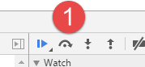

## HTML

```bash
WEB 标准可分为结构、表现和行为。
	- 结构层（structural layer）：主要由 HTML 或 XHTML 之类的标记语言负责创建。在页面 body 中写入的标签都是为了页面结构，对网页内容的语义含义做出了描述。
	- 表示层（presentation layer）： 由 CSS 样式表负责创建，通过 CSS 可以使页面结构标签更具美感。
	- 行为层（behaviorlayer）：指页面和用户具有一定的交互，同时页面结构或者表现发生变化，主要由 js 组成。

W3C 的代码规范
	- 书写标签必须闭合、标签小写、不乱嵌套，标签规范可以提高搜索引擎对页面的抓取效率，对 SEO 有帮助。
	- 建议使用外链 CSS 和 JS，从而达到结构、表现与行为的分离，提高页面的渲染速度，提高用户体验。
	- 样式与标签的分离，更合理的语义化标签，使内容能被更多的用户所访问、内容能被更广泛的设备所访问、更少的代码和组件，从而降低维护成本、改版方便。
	- 不需要变动页面内容，便可提供打印版本而不需要复制内容，提高网站易用性。
	- 遵循 W3C 指定的 WEB 标准，能够使用户浏览者更方便阅读，使网页开发者之间更好地交流。


### 什么是 HTML？
HTML 是网页的基础，是指超文本标记语言。
作为一个 Web 用户，当你访问本页面时，这个过程看起来是这样的：
	- 在设备上打开 Web 浏览器应用程序。
	- 单击指向此页面的链接或直接在地址栏中键入 URL。
	- 运行此网站的 Web 服务器接收来自您和您的浏览器的请求，并向浏览器发送一些 HTML 代码。
	- 浏览器下载 HTML 代码，对其进行解析，并在屏幕上显示结果。
这就是为什么这个页面会显示你现在正在阅读的内容。HTML 是用来表示构成此页面的各种元素的语言。


### SGML 、 HTML 、XML 和 XHTML 的区别？
- SGML 是标准通用标记语言，是一种定义电子文档结构和描述其内容的国际标准语言， 是所有电子文档标记语言的起源
- HTML（HyperText Markup Language）是超文本标记语言，它定义了网页内容的含义和结构。
- XML 是可扩展标记语言是未来网页语言的发展方向，XML 和 HTML 的最大区别就在于 XML 的标签是可以自己创建的，数量无限多，而 HTML 的标签都是固定的而且数量有限。
- XHTML 是一个基于 XML 的标记语言，他与 HTML 没什么本质的区别，但他比 HTML 更加严格。
- 为了规范 HTML，W3C 结合 XML 制定了 XHTML1.0 标准，这个标准没有增加任何新的标签，只是按照 XML 的要求来规范 HTML。两者最主要的区别是：
  - 文档顶部 `doctype` 声明不同，XHTML 的 doctype 顶部声明中明确规定了 xhtml DTD 的写法
  - 元素必须始终正确嵌套
  - 标签必须始终关闭
  - 标签名必须小写
  - 特殊字符必须转义
  - 文档必须有根元素
  - 属性值必须用双引号 `""` 括起来
  - 禁止属性最小化（例如，必须使用 `checked="checked"` 而不是 `checked`）
```


## 标签

### DOCTYPE

```bash
### DTD
- DTD（Document Type Definition 文档类型定义）是一组机器可读的规则，它们定义 XML 或 HTML 的特定版本中所有允许元素及它们的属性和层次关系的定义。在解析网页时，浏览器将使用这些规则检查页面的有效性并且采取相应的措施。
- DTD 是对 HTML 文档的声明，还会影响浏览器的渲染模式（工作模式）


- `<!DOCTYPE>` 声明位于 HTML 文档中的第一行，处于 `<html>` 标签之前。
- 网站设置 `<!DOCTYPE html>` 是为了告知浏览器的解析器使用标准模式渲染文档。防止浏览器在渲染文档时，使用一个不符合规范的渲染模式。
- `DOCTYPE` 不存在或格式不正确会导致文档以混杂模式呈现。


1. 标准模式：又称严格模式，是指浏览器按照 W3C 标准解析代码。
	- 在标准模式下，浏览器根据 W3C 标准进行解析并渲染，页面的排版和 JS 运作模式是以该浏览器支持的最高标准运行。

2. 兼容模式：又称怪异模式或混杂模式，是指浏览器用自己的解析方式解析并渲染。
	- 在兼容模式下，页面以宽松的向后兼容的方式显示。模式老式浏览器的行为以防站点无法工作。
	- 兼容模式的存在是为了在没有 W3C 标准时间段写的旧网页可以顺利地加载出来。

3. 如何区分
- 在 HTML4.01 标准中，浏览器解析时到底使用标准模式还是兼容模式，与网页中的 DTD 直接相关，因为 HTML4.01 基于 SGML，DTD 规定了标记语言的规则，这样浏览器才能正确呈现。
- HTML5 不基于 SGML，因此不需要对 DTD 进行引用，只需要在顶部声明 `<!DOCTYPE html>`


### Doctype 文档类型
该标签可声明三种 DTD 类型，分别表示严格版本、过渡版本以及基于框架的 HTML 文档。
HTML 4.01 规定三种文档类型：Strict、Transitional、Frameset。
XHTML 1.0 规定三种XML文档类型：Strict、Transitional、Frameset。
Stamdards（标准）模式（严格呈现模式）用于呈现遵循最新标准的网页，而 Quirks（包容）模式（松散呈现模式/兼容模式/混乱模式）用于呈现传统浏览器而设计的网页。


### HTML 与 XHTML 的区别
1. 所有的标记都必须要有一个相应的结束标记
2. 所有标签的元素和属性的名字都必须使用小写
3. 所有的XML标记都必须合理嵌套
4. 所有的属性必须用引号 `""` 括起来
5. 把所有 `<` 和 `&` 特殊符号用编码表示
6. 给所有属性赋一个值
7. 不要在注释内容中使 `--`
8. 图片必须有说明文字
```


### h1标签

> `<h1>`标签通常在页面顶部，以表明页面内容的总体目的。它在SEO中扮演着重要角色，因为搜索引擎比其他因素更重视它。它也可用于显示在搜索结果中。
>
> 在HTML的旧版本，特别是HTML4中，只允许每个页面有一个`<h1>`标签。但HTML5允许多个`<h1>`标签，用于每个`session`
>
> 这意味着使用多个`<h1>`标签在HTML语法方面是有效的，但它不被认为是最佳实践
>
> **注意：**我们应该避免每个页面使用多个 h1 标签
>
> ```html
> <!-- 👎 不建议这样做 -->
> <h1>Main heading</h1>
> <section>
>   <h1>A section heading</h1>
> </section>
> <section>
>   <h1>Another section heading</h1>
> </section>
>
>
> <!-- 👍 推荐这样做 -->
> <h1>Main heading</h1>
> <section>
>   <h2>A section heading</h2>
> </section>
> <section>
>   <h2>Another section heading</h2>
> </section>
> ```

### 辅助标签 meta


```bash
- `<meta>`标签是HTML语言头部的一个辅助性标签
- 作用：
		- 可以定义页面编码语言、搜索引擎优化、自动刷新并指向新的页面、控制页面缓冲、响应式视窗等
		- 可用于包含描述 HTML 文档属性的名称/值对，如作者，字符编号，关键字列表，文档作者等信息
- 注意：该标签中的关键字不是给用户看的


#### meta 标签包含属性
属性								值									描述
charset( H5 New)	character_set				定义文档的字符编码。
content						text								定义与 http-equiv 或 name 属性相关的元信息。
http-equiv				content-type				属性关联到 HTTP 头部。
									default-style
									refresh	把 content
name							application-name		把content 属性关联到一个名称。
									author
									description
									generator
									keywords
scheme(H5 删除)		format/URI					HTML5不支持。 定义用于翻译 content 属性值的格式。

整体来看，HTML5之前，meta标签只有两个主要属性，分别是 name 属性和 http-equiv 属性。 HTML5新添加"charset".
```

```html
<!DOCTYPE html>
<html>
  <head>
    <!-- 推荐 Meta Tags -->
    <meta charset="utf-8" />
    <meta name="language" content="english" />
    <meta http-equiv="content-type" content="text/html" />
    <meta name="author" content="Author Name" />
    <meta name="designer" content="Designer Name" />
    <meta name="publisher" content="Publisher Name" />
    <meta name="no-email-collection" content="name@email.com" />
    <meta http-equiv="X-UA-Compatible" content="IE=edge" />

    <!-- 搜索引擎优化 Meta Tags -->
    <meta name="description" content="Project Description" />
    <meta name="keywords" content="Software Engineer,Product Manager,Project Manager,Data Scientist" />
    <meta name="robots" content="index,follow" />
    <meta name="revisit-after" content="7 days" />
    <meta name="distribution" content="web" />
    <meta name="robots" content="noodp" />

    <!-- 可选 Meta Tags-->
    <meta name="distribution" content="web" />
    <meta name="web_author" content="" />
    <meta name="rating" content="" />
    <meta name="subject" content="Personal" />
    <meta name="title" content=" - Official Website." />
    <meta name="copyright" content="Copyright 2020" />
    <meta name="reply-to" content="" />
    <meta name="abstract" content="" />
    <meta name="city" content="Bangalore" />
    <meta name="country" content="INDIA" />
    <meta name="distribution" content="" />
    <meta name="classification" content="" />

    <!-- 移动设备上 HTML 页面的 Meta Tgas -->
    <meta name="format-detection" content="telephone=yes" />
    <meta name="HandheldFriendly" content="true" />
    <meta name="viewport" content="width=device-width, initial-scale=1.0" />
    <meta name="apple-mobile-web-app-capable" content="yes" />

    <!-- http-equiv Tags -->
    <meta http-equiv="Content-Style-Type" content="text/css" />
    <meta http-equiv="Content-Script-Type" content="text/javascript" />

    <title>HTML5 Meta Tags</title>
  </head>
  <body>
    ...
  </body>
</html>
```

#### name

name属性主要用于描述网页，对应属性是 content ，以便于搜索引擎机器人查找、分类（目前几乎所有的搜索引擎都使用网上机器人自动查找meta值来给网页分类）。

```html
<meta name="参数" content="参数值" />
```

1.Keywords（为搜索引擎提供的关键字列表）

```html
<meta name="keywords" content="程序员,程序猿,攻城狮"/>
```

2.Description（告诉搜索引擎你的网站主要内容）

```html
<meta name="description" content="meta标签是HTML中的一个重要标签，位于HTML文档头部的<HEAD>标签和<title>标签间"/>
```

3.robots（机器人向导）

```bash
说明：robots用来告诉搜索机器人哪些页面需要索引，哪些页面不需要索引。
语法：<meta name="robots" content=""/>

content 的参数值有 all,none,index,noindex,follow,nofollow，默认值是 all。
    all：文件将被检索，且页面上的链接可以被查询；
    none：文件将不被检索，且页面上的链接不可以被查询；
    index：文件将被检索；
    follow：页面上的链接可以被查询；
    noindex：文件将不被检索，但页面上的链接可以被查询；
    nofollow：文件将被检索，但页面上的链接不可以被查询；
```

4.author（标注网页的作者）

```html
<meta name="author" content="willy,willysliang@qq.com"/>
```

5.copyright（标注版权）

```html
<meta name="copyright" content="本网站版权归 willysliang@qq.com 所有"/>
```

6.generator（说明网站采用什么编辑器制作）

```html
<meta name="generator" content="你所用的编辑器"/>
```

7.revisit-after（网站重访）

```html
<meta name="revisit-after" content="7days"/>
```

#### http-equiv

​	http-equiv类似于HTTP的头部协议，它回应给浏览器一些有用的信息，以帮助正确和精确地显示网页内容。
​	与之对应的属性值为content，content中的内容其实就是各个参数的变量值。

```html
语法：<meta http-equiv="参数"  content="参数值"/>
```

**参数说明：**
	1.Expires（期限）

````html
说明：指定网页在缓存中的过期时间，一旦网页过期，必须到服务器上重新传输。
语法：<meta http-equiv="expires" content="Wed, 26 Feb 1997 08:21:57 GMT"/>

注意：必须使用GMT的时间格式，或者直接设为0（数字表示多久后过期
````

2.Pragma（cache模式）

```
说明：禁止浏览器从本地计算机的缓存中访问页面内容。
语法：<meta http-equiv="Pragma" content="no-cache"/>

注意：网页不保存在缓存中，每次访问都刷新页面。这样设定，访问者将无法脱机浏览。
```

3.Refresh（自动刷新并指向新页面）

```
<meta http-equiv="refresh"content="5; url=http://www.baidu.com/"/>
	其中的5表示5秒后自动刷新并调整到URL新页面。
```

4.Set-Cookie（cookie设定）

```
说明：浏览器访问某个页面时会将它存在缓存中，下次再次访问时就可从缓存中读取，以提高速度。
当你希望访问者每次都刷新你广告的图标，或每次都刷新你的计数器，就要禁用缓存了。
如果网页过期，那么存盘的cookie将被删除。

语法：<meta http-equiv="Set-Cookie"  content="cookievalue=xxx; expires=Wednesday,21-Oct-98 16:14:21 GMT; path=/">

注意：必须使用GMT的时间格式
```

5.Window-target（显示窗口的设定）

```
说明：强制页面在当前窗口以独立页面显示
语法：<meta http-equiv="Window-target" content="_top"/>
可以用来防止别人在框架里调用你的页面。
```

6.content-Type（显示设定页面使用的字符集）

```
<meta http-equiv="content-Type" content="text/html;charset=utf-8"/>

其他参数值：
	GB2312				简体中文
	BIG5					繁体中文
	iso-2022-jp		日文
	ks_c_5601			韩文
	ISO-8859-1		英文
	UTF-8					世界通用的语言编码；
在HTML5中，我们一般都是：<meta charset="utf-8"/>
```

7.content-Language（显示语言的设定）

```
<meta http-equiv="Content-Language" content="zh-cn"/>
```

8.http-equiv="imagetoolbar"

```
<meta http-equiv="imagetoolbar" content="false"/>
指定是否显示图片工具栏，当为false代表不显示，当为true代表显示。
```


#### name

##### viewport（屏幕的缩放）

```bash
说明：能优化移动浏览器的显示（屏幕的缩放）

meta viewport 标签的作用是让当前 viewport 的宽度等于设备的宽度，同时当设置 `user-scalbale="no"` 时不允许用户进行手动缩放。
viewport 的原理：移动端浏览器通常都会在一个比移动端屏幕更宽的虚拟窗口中渲染页面，这个虚拟窗口就是 viewport；目的是正常展示没有做移动端适配的网页，让他们完整的展示给用户；

语法：<meta name="viewport" content="width=device-width, initial-scale=1.0,maximum-scale=1.0, user-scalable=no"/>


#### 参数值
| 属性          | 描述                                                         |
| ------------- | ------------------------------------------------------------ |
| width         | [device-width、pixel_value] 设备的虚拟视口(viewport)的宽度，width如果直接设置pixel_value数值，大部分的安卓手机不支持，但是ios支持； |
| height        | 设备的虚拟视口(viewport)的高度（范围从 223 到 10,000 ）      |
| device-width  | 设备屏幕的物理宽度。                                         |
| device-height | 设备屏幕的物理高度。                                         |
| initial-scale | [数值] 初始化比例（范围从 > 0 到 10）                        |
| user-scalable | [yes、no] 是否允许缩放                                       |
| minimum-scale | [数值] 允许缩放的最小比例值，1.0 表无法缩放。                |
| maximum-scale | [数值] 允许缩放的最大比例值，1.0 表无法缩放。                |
```


##### format-detection（忽略电话号码和邮箱）

```
语法：
<meta name="format-detection" content="telephone=no">//忽略页面中的数字识别为电话号码
<meta name="format-detection" content="email=no"/>//忽略页面中的邮箱格式识别为邮箱
也可以写成：
<meta name="format-detection" content="telphone=no, email=no"/>
```

##### 浏览器内核控制

国内浏览器很多都是双内核（webkit和Trident），webkit内核高速浏览，IE内核兼容网页和旧版网站。而添加meta标签的网站可以控制浏览器选择何种内核渲染。（仅限360浏览器）

```
<meta name="renderer" content="webkit|ie-comp|ie-stand">
若页面需默认用极速核，增加标签：<meta name="renderer" content="webkit">
若页面需默认用ie兼容内核，增加标签：<meta name="renderer" content="ie-comp">
若页面需默认用ie标准内核，增加标签：<meta name="renderer" content="ie-stand">
```

```
各渲染内核的技术细节
内核			   			Webkit	  	IE兼容	  IE标准
内核版本		  		Chrome45   	IE6/7	  	IE9/IE10/IE11(取决于用户的IE)
HTML5支持		    	YES	       	NO	    	YES
ActiveX控件支持	   NO		 			YES	   		YES
```

##### WebApp全屏模式

```
<meta name="apple-mobile-web-app-capable" content="yes" />
<!-- 启用 WebApp 全屏模式 -->
```

##### 隐藏状态栏/设置状态栏颜色

只有在开启WebApp全屏模式时才生效。content的值为default | black | black-translucent 。

```
<meta name="apple-mobile-web-app-status-bar-style" content="black-translucent" />
```

##### 不同浏览器

```html
<!-- 针对手持设备优化，主要是针对一些老的不识别viewport的浏览器，比如黑莓 -->
<meta name="HandheldFriendly" content="true">

<!-- 微软的老式浏览器 -->
<meta name="MobileOptimized" content="320">

<!-- uc强制竖屏 -->
<meta name="screen-orientation" content="portrait">

<!-- QQ强制竖屏 -->
<meta name="x5-orientation" content="portrait">

<!-- UC强制全屏 -->
<meta name="full-screen" content="yes">

<!-- QQ强制全屏 -->
<meta name="x5-fullscreen" content="true">

<!-- UC应用模式 -->
<meta name="browsermode" content="application">

<!-- QQ应用模式 -->
<meta name="x5-page-mode" content="app">

<!-- windows phone 点击无高光 -->
<meta name="msapplication-tap-highlight" content="no">
```

#### http-equiv

```html
1、优先使用 IE 最新版本和 Chrome
<meta http-equiv="X-UA-Compatible" content="IE=edge,chrome=1" />

<!-- 关于X-UA-Compatible -->
<meta http-equiv="X-UA-Compatible" content="IE=6" ><!-- 使用IE6 -->
<meta http-equiv="X-UA-Compatible" content="IE=7" ><!-- 用于在IE8版本浏览器中使用IE7渲染来避免出错 -->
<meta http-equiv="X-UA-Compatible" content="IE=8" ><!-- 使用IE8 -->


2、转码申明：用百度打开网页可能会对其进行转码（比如贴广告），避免转码可添加如下meta
<meta http-equiv="Cache-Control" content="no-siteapp" />
```

#### 字符编码设置 charset

```html
字符编码是一种将字节转换为字符的方法。为了正确地验证或显示 HTML 文档，程序必须选择适当的字符编码。这是在标签中指定的。

在HTML5中，一般使用：<meta charset="UTF-8">

UTF-8：Unicode 转换格式，以 8 位为单位，即以字节为单位。UTF8 中的字符长度可以从 1 到 4 个字节，从而使 UTF8 的宽度可变。

其他参数值：
GB2312				简体中文
BIG5					繁体中文
iso-2022-jp		日文
ks_c_5601			韩文
ISO-8859-1		英文
UTF-8					世界通用的语言编码
```


### 外链 link

```bash
1. 链接外部文件，比如css文件
2. 设置网页图标
```

#### 预加载

```bash
预取 CSS 文件，预渲染整个页面或提前解析域


1. 资源预加载：preload
- 使用 preload 作为 rel 属性的属性值，还需要通过 href 和 as 属性指定需要被预加载资源的资源路径及类型。
- 使用 as 来指定要预加载的内容的类型，将使得浏览器能够：
    - 更精确地优化资源加载优先级。
    - 匹配未来的加载需求，在适当情况下，重复利用同一资源。
    - 为资源应用正确的内容安全策略。
    - 为资源设置正确的 Accept 请求头。

[内容安全策略](https://developer.mozilla.org/en-US/docs/Web/HTTP/CSP)
[`Accept`请求头](https://developer.mozilla.org/en-US/docs/Web/HTTP/Headers/Accept) 
[preload中as的完整列表](https://developer.mozilla.org/zh-CN/docs/Web/HTML/Attributes/rel/preload)


2. 资源预下载：prefetch
- `<link rel="prefetch">` 要求浏览器在后台下载并缓存资源（JS/CSS）。下载优先级较低，因此不会干扰更重要的资源。当下一个页面需要该资源，并且想要提前对其进行缓存时，这将很有帮助。
- 下载资源后，浏览器不执行任何操作。不执行JS，不应用 CSS。它只是被缓存，因此当其他需求时，它立即可用。


3. 提前连接：preconnent
- `<link rel="preconnent">` 要求浏览器提前执行到域的连接。


4. DNS资源的域名预解析：dns-prefetch
- dns-prefetch（DNS预获取）是尝试在请求资源之前解析域名。这可能是后面要加载的文件，也可能是用户尝试打开的链接目标。
- 链接预加载的注意事项：
		- 预加载可以跨域进行，当然请求时 cookie 等信息也会被发送。
		- 预加载可能破坏网站统计数据，而用户并没有实际访问。
		- 浏览器兼容性不好。


5. 资源预渲染：prerender
- `<link rel="prerender">` 要求浏览器加载 URL 并将其呈现在不可见的标签中。当用户单击指向该 URL 的链接时，应立即呈现该页面。当您确实确定用户接下来访问特定页面并且想要更快地呈现它时，这将很有帮助。
- 当您确定大多数用户将导航到特定页面，您也希望加快速度，那么可以使用它。


6. 模块预加载：modulepreload
- `<link rel="modulepreload">` 告诉浏览器尽快下载、缓存和编译 JS 模块脚本。
- 使用它可以更快加载 ES 模块应用程序，此标签仅使用于预加载 ES 模块。即通过 `import ...` 或导入的模块 `<script type="module">`。
```

```html
<link rel="prefetch" href="/index.css" as="style" />
<link rel="preload" href="/index.css" as="style" />
<link rel="preconnect" href="https://example.com" />
<link rel="dns-prefetch" href="https://example.com" />
<link rel="prerender" href="https://example.com/about.html" />
<link rel="modulepreload" href="/index.js" />


<!-- 预加载整个页面 -->
<link rel="prefetch" href="https://juejin.cn/user/96412754251390" />
<!-- 预加载一个图片 -->
<link rel="prefetch" href="https://images.pexels.com/photos/918281/pexels-photo-918281.jpeg?auto=compress&cs=tinysrgb&dpr=1&w=500" />
```


#### link标签跟CSS的`@import`区别

```bash
- link 属于 XHTML 标签，除了加载 CSS 外，还能用于定义 RSS、定义 rel 连接属性等作用；而 `@import` 是 CSS 提供，只能用于加载 CSS。
- 页面被加载时，link 的样式会同时被加载，而 `@import` 引用的 CSS 会等到页面加载完再加载。
- `@import` 是 CSS2.1 提出，只能再 IE5 以上才能识别，而 link 是 XHTML 标签，无兼容问题。
- link 方式的样式权重高于 `@import` 的权重。
```

#### 为什么最好把 link 标签放在 head 标签之中？

```bash
- 把 link 标签放在 `<head></head>` 之间是规范要求的内容，此外这种做法可以让页面逐步呈现，提高用户体验。
- 将样式表放在文档底部附近，会使得许多浏览器不能逐步呈现（因为样式表的变更导致许多样式触发重绘重排）
- 一些浏览器会阻止渲染，以避免在页面样式发生变化时，重新绘制页面中的元素。
- 这种做法可以防止呈现给用户空白的页面或没有正确样式的内容。
```

#### 什么是 FOUC（无样式内容闪烁）？你如何来避免 FOUC？

```bash
FOUC（Flash of Unstyled Content）是指在网页加载过程中，由于样式表加载的延迟或者顺序问题，导致用户先看到没有应用样式的网页内容，然后在样式表加载完成后，内容才突然应用样式，从而出现闪烁的现象。这种闪烁可能会让用户体验变差，尤其是在页面布局和外观突然改变时。
例如，当浏览器开始加载 HTML 文档时，它会尽快解析并显示内容。如果 CSS 样式表加载较慢，在样式表加载之前，文本可能会以浏览器默认的字体和布局显示，等 CSS 加载完成后，字体、颜色、间距等样式才突然生效，就会出现明显的闪烁。

避免 FOUC 的方法
  - 将样式表放在文档头部用 `link` 标签或者 `style` 标签加载样式。
  - 使用内联样式（容易产生样式权重问题，应避免使用）
  - 确保样式表尽快加载
      - 优化 CSS 文件大小和加载顺序：尽量减小 CSS 文件的大小，避免过多的嵌套和复杂的选择器
      - 使用 CDN 或缓存
  - 避免使用@import导入样式表（@import会导致样式表的加载顺序变为顺序加载，而且可能会延迟样式的应用）
```


### 超链接 a

```bash
## 锚链接 a
- 给超链接起一个名字，作用是 在本页面或者其他页面的的不同位置进行跳转。
- 比如说，在网页底部有一个向上箭头，点击箭头后回到顶部，这个就可以利用锚链接。


### 属性说明
- `href`：目标URL
- `title`：悬停文本。
- `name`：主要用于设置一个锚点的名称。
- `target`：告诉浏览器用什么方式来打开目标页面。
    - `_self`：在同一个网页中显示（默认值）
    - `_blank`：**在新的窗口中打开**。
    - `_parent`：在父窗口中显示
    - `_top`：在顶级窗口中显示


### 返回页面顶部示例
首先我们要创建一个锚点 ，即是使用`name`属性或者`id`属性给那个特定的位置起个名字。
`<a href="a.html#name1">回到顶部</a>`
```


#### 所有链接都在新标签打开

```bash
### 所有链接都在新标签打开
将 `target="_blank"` 属性设置为单个链接将在新选项卡中打开它。
在一个真实的用例中，您希望在一个新选项卡中打开页面上的所有链接，这是很少见的。一个只收集外部资源链接的网站可能就是一个例子。
在这种情况下，您只需将其设置为 `base` 标签，而不是将属性添加到所有链接：
注意:就像我们说的那样，链接会在新窗口中打开，即使链接中没有 `target="_blank"` 属性。这是因为 `base` 元素的 `target` 属性已经被设置为 `"_blank"`。
你还可以为所有 `a` 标签上 `href` 属性为空的链接添加一个 URL 指向。
```

```html
<head>
  <base href="https://www.baidu.com" />
  <base target="_blank" />
</head>
<body>
  <a href="https://www.baidu.com">百度一下，你就知道</a>
</body>
```


#### 使用 a 标签下载文件，浏览器会直接打开的解决方案

```bash
- 问题描述：使用 a 标签打开一个如 excel 的文件地址，浏览器会下载文件，但如图片的链接就不会下载。
- 在使用 a 标签进行下载文件时，chrome 浏览器是会打开支持预览的文件（如 txt、json 等），而不是下载文件到本地。


### 1. 使用a标签 + download属性
如 `<a href="/user/test/xxx.txt">点击下载</a>` 把文件路径给 a 标签的 href 属性，这样当用户点开链接时就会直接下载文件。
但如 txt、png、jpg 等这些浏览器支持直接打开的文件是不会执行下载任务的，而是会直接打开文件，这时就需要给 a 标签添加一个 download 属性，如 `<a href="/user/test/xxx.txt" download="文件名.txt">点击下载</a>`。


### 2. 即使使用a标签的download属性，浏览器仍然会打开文件
原因：服务器端返回的response中，content-type为text/plain，即数据以纯文本形式(text/json/xml/html)进行编码，其中不含任何控件或格式字符。chrome浏览器直接打开了该文本，并没有下载。
解决方案：浏览器对 txt、json 等文件直接打开是因为浏览器对这些类型的文件支持阅览，可以设置 `Content-type:application/octet-stream` 来告知浏览器这是一个字节流，浏览器处理字节流的默认方式就是下载。
		- Content-Type设置为application/octet-stream是二进制的下载流，导致强制下载。
如果是公共读类型的文件也可以直接在链接后面加上，比如：`window.open('https://xxx.json?response-content-type=application%2Foctet-stream')`。
```


#### 限制打开链接 `rel="noopener"`

```bash
- `rel="noopener"` 是 `<a>` 标签的一个属性。他可以禁止打开的新页面中使用 `window.opener` 属性，这样一来打开的新页面就不能通过 `window.opener` 去操作你的页面。
- 新页面可以通过 `window.opener.location = newURL` 将你的页面导航至任何网址。

- 如果正在使用带有 `target ="_ blank"` 的外部链接，则链接应具有 `rel="noopener"` 属性，以防止标签被挪用。如果需要支持旧版本的 Firefox，使用 `rel="noopener noreferrer"`

- 总结：`rel="noopener"` 应用于超链接，防止打开的链接操纵源页面
```

```html
<!-- home.html -->
<a href="./home.html" target="_blank">home</a>
<!-- <a href="./home.html" target="_blank" rel="noopener">home</a> -->

<!-- details.html -->
<h1>点关注 不迷路！</h1>
<script>
  window.opener.location = 'https://juejin.cn/user/96412754251390'
</script>
```


### 图片 img

> ```bash
> ## img 标签的 width、height 属性
> 在 web 早期，开发者会给  标签加上 `width 和 height` 属性，以确保浏览器开始获取图片之前分配好空间，这样可以减少 `reflow 和 re-layout`
> 
> 这两个属性没有带单位，但这些像素尺寸会确保保留 360*360 的区域，图片最终会平铺在这个区域，不管原始尺寸是否一致。
>
>
> ## 响应式css样式图片
> 当响应式设计来临时，开发者开始忽略 `width 和 height`，开始使用 css 来调整图片大小
> `img { width: 100%; height: auto }`
> 但这种方法的缺陷是，只有图片下载时，浏览器才知道图片的宽高并且分配好空间。图片下载完后，每张图片出现在屏幕上时，页面都会 `reflow` 一次，会导致页面频繁的往下弹，这对于用户来说非常不友好。
>
>
> ## aspect-ratio 的衍生
> 因为上述响应式实现的缺陷，因而诞生了图片的宽高比 `aspect-ratio`。
> 比如 x:y 的宽高比，指的是宽度 x 单位，高度 y 单位。
> 这也以为这我们只要知道宽度或高度的其中之一，就能计算出另一个属性。如对于一个 16:9 的宽高比而言：
> - 如果图片有 360px 的高度，则宽度为 `360 * (16 / 9) = 640px`
> - 如果图片有 640px 的宽度，则高度为 `640 * (9 / 16) = 360px`
>
>
> ## 现代浏览器的最佳体验
> 现代浏览器可以基于 `width 和 height` 属性设定默认宽高比，这样就能避免布局偏移。
>   
>   img { aspect-ratio: attr(width) / attr(height) }
> 这样一来，图片加载之前，浏览器就可以根据宽高属性分配好空间。图片加载之后，就可以根据宽度或高度属性，按照宽高比来分配实际空间。
> 如果图片位于容器内，可以设置宽度为容器宽度，高度为 auto，避免高度被固定为 360px
> 	img { height: auto; width: 100%; }
>
>
> ## 响应式图片 srcset
> 在使用响应式图片时，`srcset`定义了图片可以供浏览器选择的尺寸，为了确保图片 `width 和 height`可以被设置，每张图片的宽高比必须一致。
>        width="1000"
>     height="1000"
>     src="puppy-1000.jpg"
>     srcset="
>       puppy-1000.jpg 1000w,
>       puppy-2000.jpg 2000w,
>       puppy-3000.jpg 3000w,
>     "
>     alt="Puppy with balloons"
>   />
> 有时我们希望展示图片的剪切部分，比如长图的中间正方形区域，为了视觉好看。
>   <picture>
>     <source media="(max-width: 799px)" srcset="puppy-4800w-cropped.jpg">
>     <source media="(min-width: 800px)" srcset="puppy-800w-cropped.jpg">
>     
>   </picture>
> 这样一来图片宽高比就不一致了，浏览器可能更需要针对每一个资源设置特定宽高比。但目前还没有好的解决方案，`re-layout`依然存在。
> ```

#### app内嵌H5，禁止图片长按保存

```bash
1. css 禁止点击图片事件
img {  pointer-events:none; }
缺点：会禁止图片的点击事件。所以当图片有点击事件时，给有点击事件的图片设置 `pointer-events:auto;`，那么则合格图片又可以长按保存。
使用该方法的建议：如果需要给图片添加点击事件，可以在外层套一层 div，在 div 上绑定事件。


2. 禁用了默认的callout展示， callout 是指当触摸并按住一个元素的时候出现的提示。
img {
	user-select: none;
  -webkit-touch-callout: none;
  -webkit-user-select: none;
 	-moz-user-select: none;
	-ms-user-select: none;
}
缺点：安卓机上可能不生效。且该特性是非标准属性，不建议使用。
主要用于禁止长按菜单。当然针对webkit内核的浏览器。


3. img 使用背景图替代
改用背景图方式，原来使用img标签的改为背景图的方式实现，可以避免长按保存图片操作。


4. img 上添加遮罩层
在 img 图片层（与图片同一层级，可使用 absolute 定位来遮盖住图片）增加遮罩，设置透明度为0，这样图片不会被点击，也不会出现长按保存图片操作
```


#### alt 和 title 的区别

```bash
### alt 和 title 的区别
- `alt` 属性是当元素不能正常呈现时用作元素内容的替代文本。
		- img 标签是使用 `alt` 属性的最常用标签。当无法加载图像时，浏览器将在其位置显示 `alt` 文本，以便用户了解包含图像的含义。
- `title` 属性是将鼠标悬停在元素上时看到的工具提示文本，是对图片的描述和进一步的说明。

注意：浏览器并非总是会显示图像。当有下列情况时，`alt` 属性可以为图像提供替代的信息：
	- 非可视化浏览器（Non-visual browsers）（比如有视力障碍的人使用的音频浏览器）
	- 用户选择不显示图像（比如为了节省带宽，或出于隐私等考虑不加载包括图片在内的第三方资源文件）
	- 图像文件无效，或是使用了不支持的格式
	- 浏览器禁用图像等

推荐做法: 始终为 `` 标签使用 `alt` 属性，以提供一些有用的信息。
谷歌和其他搜索引擎无法读取图像，但可以看到 `alt` 文本。设置 `alt` 属性是 SEO（搜索引擎优化）的一个良好实践。
通常不会为 `` 设置 `title` 属性，除非它确实提供了有关图像的更多信息。


#### 确保在 `img` 标签上始终包含 `alt` 属性
使用 CSS 为任何缺少或空白 `alt` 属性的 `img` 提供红色轮廓：
img:not([alt]), img[alt=''] { outline: 8px solid red; }

```

```html
<!-- × -->


<!-- √ -->

```


#### src 和 href 的区别

```bash
- src 用于引用资源，替换当前元素；href 用于在当前文档和引用资源之间确立联系。
- href（hyperReference）即超文本引用：浏览器遇到href时会并行下载资源，不阻塞页面解析，与 link 引入 css 一样，浏览器并行下载 css 不阻塞页面解析。
		- href 是指网络资源所在位置，建立和当前元素（锚点）或当前文档（链接）之间的链接，用于超链接。
- src（resource）即资源：当浏览器遇到src时，会暂停页面解析，直到该资源下载或执行完毕，这也是 script 标签放底部的原因。
		- src 是指外部资源的位置，指向的内容将会嵌入到文档中当前标签所在位置；
		- 在请求src资源时会将其指向的资源下载并应用到文档内，例如js脚本、img图片和 frame 等元素。
		- 当浏览器解析到该元素时，会暂停其他资源的下载和处理，直到将该资源加载、编译、执行完毕，图片和框架等元素也如此，类似于将所指向资源嵌入当前标签内，这也是为什么将 js 脚本引入放在底部而不是头部的原因。
```


#### 图片跨域解决方案

方法一：后端传递 base64 字符串

方法二：前端设置 跨域` img.crossOrigin = 'anonymous'` 或者是 `image.setAttribute('crossOrigin', 'anonymous')`

```js
 let image = new Image()
  image.setAttribute('crossOrigin', 'anonymous')
  image.src = url + '?time=' + new Date().valueOf();
  image.onload = () => {
    // ... do something
  }
  image.onerror = (err) => {
    console.log(err)
  };
```

方法三：Nginx 设置允许跨域

```yml
location ~* .*\.(gif|jpg|jpeg|png) {
  add_header Access-Control-Allow-Origin *;
  add_header Access-Control-Allow-Headers X-Requested-With;
  add_header Access-Control-Allow-Methods GET,POST,PUT,DELETE,OPTIONS;
  if ($request_method = 'OPTIONS') {
  	return 204;
  }
  expires 30d;
}
```


#### 响应式图像

```bash
### 为什么在 img 标签中使用 srcset 属性？请描述浏览器遇到该属性后的处理过程。
为了设计响应式图片。可以使用两个新的属性 `srcset` 和 `sizes` 来提供更多额外的资源图像和提示，帮助浏览器选择正确的一个资源。
  - srcset：定义允许浏览器选择的图像集，以及每个图像的大小。
  - sizes：定义一组媒体条件（例如屏幕宽度）并且指明当某些媒体条件为真时，什么样的图片尺寸是最佳选择。

处理过程：
  - 查看设备宽度
  - 检查 sizes 列表中哪个媒体条件是第一个为真
  - 查看给予该媒体查询的槽大小
  - 加载 srcset 列表中引用的最接近所选的槽大小的图像
 
 
- [响应式图像：如果您只是在更改分辨率，请使用 srcset](https://css-tricks.com/responsive-images-youre-just-changing-resolutions-use-srcset/)
- [响应式图像教程](http://www.ruanyifeng.com/blog/2019/06/responsive-images.html)
```

```html

```


### 表格table

> - cellspacing 设置td与td之间的距离
>
> - cellpadding 设置内容与td左侧的距离
>
> - caption:表格标题
>
> - 合并边框border-collaspe:collapse;
>
> - 文本对齐： text-align 属性设置水平对齐方式 ；vertical-align 属性设置垂直对齐方式
> - 给tr或者td设置align属性，可以让其内容居中
> - 合并单元格： ☞ 横向合并：colspan         ☞ 纵向合并：rowspan
>
> > 注意：   给table标签设置align属性，只能让整个标签居中，内容不会居中；
>
> ```html
> 表格结构：<thead></thead>		<tbody></tbody>		<tfoot></tfoot>
> ```
>
> 


### 表单form

```bash
- 作用：收集用户数据
- 组成：提示信息 | 表单控件    | 表单域

1. 表单域：`<form></form>`
  - action: 设置后台处理数据的后台程序
  - method：提交数据给后台程序的方式
  - get提交数据：会将数据显示在地址栏中
  - post提交数据：会通过后台提交数据（安全性）
  


#### form 里 action 方法的 Get 和 Post 有什么区别
- Get：Form 的默认方法。
- Get 是用来从服务器上获得数据。Post 是用来向服务器上传递数据
- Get 将表单中数据的按照 name=value 的形式，添加到 action 所指向的 URL 后面，并且两者使用 "?" 连接，而各个变量之间使用 "&" 连接。Post 是将表单中的数据放在 form 的数据体中，按照变量和值相对应的方式，传递到 action 所指向 URL
- Get 是不安全的，因为在传输过程，数据被放在请求的 URL 中。Post 的所有操作对用户来说都是不可见的，其放置 request body 中
- Get 传输的数据量小，这主要是因为受 URL 长度限制。Post 可以传输大量的数据，所以在上传文件只能使用 Post
- Get 限制 Form 表单的数据集的值必须为 ASCII 字符。Post 支持整个 ISO10646 字符集
- Get 请求浏览器会主动 cache。Post 支持不会
- Get 请求参数会被完整保留在浏览历史记录中。Post 中的参数不会被保留。
- GET 和 POST 本质上就是 TCP 链接，并无差别。但是由于 HTTP 的规定和浏览器/服务器的限制，导致他们在应用过程中体现出一些不同。
- GET 产生一个 TCP 数据包；POST 产生两个 TCP 数据包。
```

> 2、**表单控件**
>
> 
>
> 分组控件和标题如下：
>
> 
>

### 列表 ul、ol、il

```bash
### 列表类型
- 有序列表：ol > li
- 无序列表：ul > li
- 自定义列表：dl > dt > dd   (dt中只能包含行内元素span/a)


### 列表属性
- 列表项的标志类型：list-style-type: decimal;
- 列表标志位置：list-style-position: inside;//包含向右缩进到文本内部
- 列表项图像：list-style-image: url(arr.gif);


### 创造编号项目的降序列表
  默认情况下，有序列表元素（`ol` 标签）将按升序显示每个项目的编号。第一项显示为数字 1。第二项是数字 2，依此类推
  有些情况下，我们希望颠倒数字的顺序，但保留实际项目。如前 5 部电影、前 10 首歌曲等是该用例的最佳示例。
  为此只需添加 reversed 属性
  还可使用 start 属性来指示开始编号

  <ol reversed start="5">
    <li>........</li>
    <li>........</li>
    <li>........</li>
    <li>........</li>
  </ol>
```


### 关联 label

```bash
label 标签定义表单控件的关系，当用户选择该标签时，浏览器会自动将焦点转到和标签相关的表单控件上。
有两种 HTML 原生方法可以将 label 元素与 input 元素连接起来。
	1. id 绑定；
	2. 嵌套。

注意：点击 label 时，事件冒泡一次，label 会触发关联 input 的 click 事件，导致事件再次触发事件。
```

```html
<label for="select">爱我</label>
<input type="radio" id="select" name="love" value="love" />

<!-- 用 label 包装 input 元素 -->
<label>
  恨我
  <input type="radio" name="hate" value="hate" />
</label>
```


### 内联框架 iframe

```bash
iframe 标签允许我们将来自其他来源（其他网站）的内容嵌入到我们的网页中。
从技术上讲，iframe 创建了一个新的嵌套浏览上下文。这意味着 iframe 中的任何内容都不会干扰父页面，反之亦然。JavaScript 和 CSS 不会泄漏到 iframe 或从 iframe 中泄漏。

注意：
	- HTML5 不再支持使用 frame, iframe 只有 src 属性。
	- 可以将提示文字放在 `<iframe>提示文字</iframe>` 中，来提示某些不支持 iframe 的浏览器。	

iframe 的优点：
	1. 程序调入静态页面比较方便。
	2. 页面和程序分离，便于修改。
	3. 并行加载脚本
	4. security sandbox（安全沙盒）
	5. 解决加载缓慢的第三方内容（如图标和广告等的加载问题）

iframe 的缺点：
	1. 样式/脚本需要额外链入，会增加请求（加载JS会具备安全隐患）。
	2. 没有语义，搜索引擎无法解读这种页面，不利于 SEO
			搜索引擎对 iframe 不友好，如果是动态网页可使用 include，但必须去除它的 `<html><head><title><body>` 标签。
	3. iframe 的框架结构可能会导致页面混杂（如产生滚动条）
	4. iframe 会阻塞主页面加载
    	window 的 onload 事件需要在所有 iframe 加载完毕后(包含里面的元素)才会触发。
    	但在 Safari 和 Chrome 中可通过 JS 动态设置的 iframe 的 `src` 属性上所绑定的链接来避免这种阻塞情况。
    	即使 iframe 种内容为空，加载也需要时间
	5. iframe 和主页面共享连接池
    	浏览器只能开少量的连接到 web 服务器（http只能同时发送6个请求），但因为主页面和其中的 iframe 是共享这些连接的。
    	这意味着 iframe 在加载资源时可能用光所有的可用连接，从而阻塞了主页面资源的加载。
    	但可通过在主页面上的重要的元素加载完毕后，在 JS 动态设置 iframe 的 src 属性上所绑定的链接来优化这个问题。


### sandbox 属性允许限制 iframe 中允许的操作
  - `allow-forms` 允许提交表单
  - `allow-modals` 允许打开模态窗口，包括在 JavaScript 调用 `alert()`
  - `allow-orientation-lock` 允许锁定屏幕方向
  - `allow-popups` 允许弹出窗口、使用 `window.open()` 和 `target="_blank"` 链接
  - `allow-same-origin` 将正在加载的资源视为同一来源
  - `allow-scripts` 让加载的 iframe 运行脚本（但不创建弹出窗口）。
  - `allow-top-navigation` 允许访问 iframe 以访问顶级浏览上下文


### 微前端上的 iframe 的缺点
1. url 不同步。浏览器刷新，iframe 的 url 状态丢失、后退前进按钮无法使用。
2. DOM 结构不共享。想象以下屏幕右下角 1/4 的 iframe 里有一个带遮罩层的弹框，同时我们要求和这个弹框要浏览器居中显示，还要浏览器 resize 时自动居中...（但该功能难以实现）
3. 全局上下文完全隔离，内存变量不共享。iframe 内外系统的通信、数据同步等需求，主应用的 cookie 要透传到根据域名到不同的子应用中实现免登效果。
4. 慢。每次子应用进入都是一次浏览器上下文重建、资源重新加载的过程。
```

```html
<iframe src="page.html" />

<iframe src="https://example.com/page.html" />

<iframe src="page.html" width="800" height="400" />

<iframe srcdoc="<p>Hello iframe!</p>" />
```


### 盒子 `div`

> ```bash
> ## 盒子边框问题
> 原本两个盒子都占有边距，如果相邻，则需要把右盒子的 margin 定义为负值（负值边框宽度）
>
>
> ## 盒子大小计算问题
> 原本盒子大小是盒子内容(width 和 height) + 盒子边框大小(盒子边框border)
> 如果想改变盒子计算方式，让其总大小为盒子内容大小，则需定义 `box-sizing:border-box;`
>
>
> ## 计算盒子宽度
> 使用 `calc()` 函数
> ```

### 输入框`input`

#### 清除输入框历史记录

> `autocomplete='off'`禁用自动完成功能，清除input框输入存留历史值，防止下拉历史值显示。
>
> ```html
> <input type="text" autocomplete="off"/>
> ```

#### 使input文本框不可编辑的3种方法

> 1. disabled 属性规定应该禁用 input 元素，被禁用的 input 元素，不可编辑，不可复制，不可选择，不能接收焦点,后台也不会接收到传值。设置后文字的颜色会变成灰色。disabled 属性无法与 `<input type="hidden"> `一起使用。
>
>    ```vue
>    <input type="text" disabled="disabled" />
>    ```
>
> 2. readonly 属性规定输入字段为只读可复制，但是，用户可以使用Tab键切换到该字段，可选择,可以接收焦点，还可以选中或拷贝其文本。后台会接收到传值. readonly 属性可以防止用户对值进行修改。
>
>    readonly 属性可与 `<input type="text"> `或` <input type="password">` 配合使用。
>
>    ```vue
>    <input type="text" readonly="readonly">
>    ```
>
> 3. readonly unselectable="on" 该属性跟disable类似，input 元素，不可编辑，不可复制，不可选择，不能接收焦点，设置后文字的颜色也会变成灰色，但是后台可以接收到传值。
>
>    ```vue
>    <input type="text"  readonly  unselectable="on" >
>    ```
>

#### 过滤文件输入的文件类型

> 默认情况下，单击文件输入（`<input type="file"/>`）时，浏览器将列出目标文件夹中的所有文件。
>
> 文件输入提供的`accept` 属性提示浏览器列出特定的文件类型。属性值可以是一个或多个文件扩展名、`MIME` 类型，用逗号分隔。
>
> 例如，要求用户选择的图像类型如下所示：
>
> ```html
> <input type="file" accept=".png, .jpg, .jpeg" />
> <!-- 或 -->
> <input type="file" accept="image/png, image/jpeg" />
>
>
> <input type="file" multiple  accept="image/*,audio/*,video/*" />
> ```
>
> `accept` 属性不阻止用户选择类型不在列表中的文件。不要使用它来验证所选文件

### 按钮 button

> ```bash
> ## button 与 <input type="button"/> 的区别
> 1. `<button>` 可以包含 HTML。`<input type="button">` 是空元素(如 `br、hr、image`)，因此不能包含内容。
> 2. `<button>` 支持伪元素，例如 `::after、::before`，这对于设置按钮样式非常有用，而 `<input type="button">` 没有。
> 3. 默认情况下 `<button>` 具有默认属性 `type="submit"`。这意味着如果没有指定 type 属性，单击该按钮将提交其封闭表单。
>
> 如果希望 input 作为提交按钮，必须将 type 属性更改为 submit。
>
>
> ### 建议
> - button 元素比 button 类型的 input 更具语义。如果要创建可单击的按钮，建议使用 button 元素。
> - 始终指定 button 元素的 type 属性。可能值：
> 			1. submit：按钮将表单数据提交到服务器
> 			2. reset：将表单输入重置为初始化
> 			3. button：默认情况下，按下时不执行任何操作
> ```

### 转义字符

> ```bash
> &nbsp;		空格 （non-breaking spacing，不断打空格）
> &lt;			小于号（less than）
> &gt;			大于号（greater than）
> &amp;			符号&
> &quot;		双引号
> &apos;		单引号
> &copy;		版权©
> &trade;		商标™
> &#32464;	文字绐。#32464是汉字绐的unicode编码
> &sup2;		平方（上标2）
> &sup3;		立方（上标3）
> ```


## 标签统合说明

### 替换元素与非替换元素

```bash
1. 替换元素
浏览器根据其标签的元素属性来判断显示具体内容的元素，且元素一般拥有固定的尺寸（宽高或宽高比）。
在 html 中替换元素有 `img、input、textarea、select、object`，这些元素都没有实际的内容。

2. 非替换元素
html 中大多数都是非替换元素，它们直接将内容告诉浏览器，直接显示出来。
如 p 标签，浏览器会直接显示 p 标签中的内容。

tips：替换元素和非替换元素不仅是在行内元素中有，块级元素也有替换和非替换元素之分。比如嵌入的文档 `iframe、audio、canvas` 在某些情况下也为替换元素。
```


### 块级元素与行内元素

- HTML4.01 中，元素被分成两大类：inlink（行内元素）与 block（块级元素）。
- 默认情况下是这样，但可以利用 `display` 来修改其为块级还是行内元素。

| 块级元素                       | 行内元素                                                     |
| ------------------------------ | ------------------------------------------------------------ |
| 独占一行                       | 不独占一行                                                   |
| 可以设置宽高（盒模型）         | 不可以设置宽高，宽高由元素内部的内容决定，`padding` 和 `margin` 的 `top/bottom` 不会对元素生效 |
| 可以包含行内元素和其他块级元素 | 行内元素只能包含文本和其他行内元素。                         |

**块级元素和行内元素分别有哪些？ 空（void）元素有哪些？**

- CSS 规范规定，每个元素都有 `display` 属性，每个元素都有默认的 `display` 值。例如：
  - div 默认`display` 属性值为 `block`，为块级元素；
  - span 默认 `display` 属性值为 `inline`，为行内元素。
- 块级元素：
  - `<h1>-<h6>`、`<p>`、`<div>`、`<ul>`、`<ol>`、`<form>`、`<table>`、`<address>`、`<blockquote>`、`<center>`、`<dir>`、`<dl>`、`<fieldset>`、`<hr>`、`<menu>`、`<noscript>`、`<pre>`、`<noframes>`、`<isindex>`
  - 当元素的 `display` 属性为 `block`、`list-item` 或 `table` 时，该元素将成为 “块级元素”。
- 行内元素：
  - `<a>`、``、`<input>`、`<span>`、`<textarea>`、`<label>`、`<select>`、`<abbr>`、`<acronym>`、`<b>`、`<bdo>`、`<big>`、`<br>`、`<cite>`、`<code>`、`<dfn>`、`<em>`、`<font>`、`<i>`、`<kbd>`、`<q>`、`<s>`、`<samp>`、`<small>`、`<strike>`、`<strong>`、`<sub>`、`<sup>`、`<tt>`、`<u>`
  - 当元素的 `display` 属性为 `inline`、`inline-block` 或 `inline-table` 时，该元素将成为 “行内元素”
- 常见的空元素：标签内没有内容的 HTML 标签被称为空元素。
  - `<br>`、`<hr>`、``、`<input>`、`<link>`、`<meta>`
- 不常见的空元素：`<area>`、`<base>`、`<col>`、`<command>`、`<embed>`、`<keygen>`、`<param>`、`<source>` `<track>`、`<wbr>`


### 可选标签

```bash
- 在 HTML 中，某些元素具有可选标签。实际上，即使元素本身是必需的，也可以从 HTML 文档中完全删除某些元素的开始和结束标签。
- 如 `p`，`li`，`td`，`tr`，`th`，`html`，`head`，`body` 等。
- 可选标签可以节省一些字节并减少需要在 html 文件中下载的字节。但为了便于阅读，当您的标签内有内容/文本时，带上结束标签。
```

```html
<p>Paragraph one.</p>
<p>Paragraph two.</p>
<p>Paragraph three.</p>
```


## SEO

#### SEO的TDK

```bash
在 SEO 中，所谓的 TDK 其实就是 `title`、`description`、`keywords` 这三个标签
  - `title` 标题标签
  - `description` 描述标签
  - `keywords` 关键词标签
```

#### `<title>` 与 `<h1>` 的区别

```bash
- `<title>` 用于网站信息标题，一个网站可以有多个 `title`，seo 权重高于 `h1`；
- `<h1>` 概括的是文章主题，一个页面最好只用一个 `h1`，seo 权重低于 `title`。
```

#### div+css 的布局较 table 布局有什么优点？

```bash
分离方便、改版快、清晰简洁、seo
  - 表现与结构相分离。
  - 改版的时候更方便，只要改 css 文件。
  - 页面加载速度更快、结构化清晰、页面显示简洁。
  - 易于优化（seo）搜索引擎更友好，排名更容易靠前。
```

#### 微格式

```bash
### 什么是微格式？在前端构建中应该考虑微格式吗？
- 微格式（Microformats）是一种让机器可读的语义化 XHTML 词汇的集合，是结构化数据的开放标准。是为特殊应用而制定的特殊格式。
- 优点：将智能数据添加到网页上，让网站内容在搜索引擎结果界面可以显示额外的提示。（如：豆瓣，有兴趣自行 google）

要创建一个微格式对象，需要在 class 属性中使用 h-* 类名。
要给对象添加属性，需要在对象的后代元素上使用 p-*、u-*、dt-*、e-* 类名。

- [Microformats](https://developer.mozilla.org/en-US/docs/Web/HTML/microformats)
```

```html
<p class="h-card">
  
  <a class="p-name u-url" href="https://example.org">Joe Bloggs</a>
  <a class="u-email" href="mailto:jbloggs@example.com">jbloggs@example.com</a>,
  <span class="p-street-address">17 Austerstræti</span>
  <span class="p-locality">Reykjavík</span>
  <span class="p-country-name">Iceland</span>
</p>
```


## HTML 全局属性（global attribute）

```bash
- `accesskey`：设置快捷键，提供快速访问元素
- `class`：为元素设置类标识，多个类名用空格分开，CSS 和 JavaScript 可通过 class 属性获取元素
- `contenteditable`：指定元素内容是否可编辑
- `contextmenu`：自定义鼠标右键弹出菜单内容
- `data-*`：为元素增加自定义属性
- `dir`：设置元素文本方向
- `draggable`：设置元素是否可拖拽
- `dropzone`：设置元素拖放类型： copy，move，link
- `hidden`：表示一个元素是否与文档。样式上会导致元素不显示，但是不能用这个属性实现样式效果
- `id`：元素 id，文档内唯一
- `lang`：元素内容的的语言
- `spellcheck`：是否启动拼写和语法检查
- `style`：行内 CSS 样式
- `tabindex`：设置元素可以获得焦点，通过 tab 可以导航
- `title`：元素相关的建议信息
- `translate`：元素和子孙节点内容是否需要本地化
```


### html 防止浏览器要求翻译

```bash
如果一个网站的内容是用一种特定的语言编写，那么访问者在使用某些浏览器时可能会被提示将其翻译成另一种语言(如谷歌浏览器)。
此时可通过为整个文档设置 `translate` 属性来防止这种情况发生。
		`<html translate="no"></html>`

translate 属性对某些翻译工具(如 Google translate) 有影响。
此外，它是一个全局属性，意味着我们可以对任何元素使用它。
如果我们不想翻译一个特定的标题，即使页面已翻译，它也非常有用。
	`<h1 translate="no">Title</h1>`
```


### 省略的HTML布尔属性的值

> 有一些 HTML 布尔属性，如 `checked`、`disabled`、`readonly`、`required`、`selected` 等。
>
> 根据 HTML 规范，布尔属性有三种可能的声明。所有这些都具有相同的效果：
>
> ```html
> <input readonly />
> <input readonly="" />
> <input readonly="readonly" />
> ```
>
> `true` 和 `false` 是无效值：
>
> ```html
> <!-- 不允许 -->
> <button disabled="true">...</button>
> <button disabled="false">...</button>
> ```
>
> 表示 `false` 值的唯一方法是删除该属性。因此，为了避免错误和误导性用法，建议不为布尔属性赋值：
>
> ```html
> <input readonly />
> ```


### 语言属性 lang

```bash
HTML 文档的内容可以是多种不同的语言。为了指定文档的主要语言，我们可以在根元素上使用 `lang` 属性。
我们还可以在页面中使用 `lang` 属性来划分与文档主语言不同语言的特定元素或部分。
对于特定于语言的样式，在 lang 属性选择器上使用 lang 伪类。

注意: `lang` 属性不能应用于以下元素（不包含不推荐使用的标签）：`br、iframe、script、base、param`


### 设置lang属性的好处
- 根据 `lang` 属性来设定不同语言的 `css` 样式，或者字体
- 告诉搜索引擎做精确的识别
- 让语法检查程序做语言识别
- 帮助翻译工具做识别
- 帮助网页阅读程序做识别等等
```

```html
<html lang="zh">
  <head>
    <style>
      [lang='en'] p {
        font-size: 1.2em;
        color: plum;
      }
    </style>
  </head>
  <body>
    <p lang="en">为 p 元素设置了 `lang` 属性，并设置了 `en`（英语）语言，如果我们想要给它设置样式，我们可以使用 `[lang]` 属性选择器来选择具有特定语言属性的所有元素或元素的子元素。</p>
  </body>
</html>
```


#### :lang 伪类

```bash
### `[lang]` 属性选择器不知道该元素的语言
使用基于 `[lang]` 属性选择器的特定于语言的样式的问题在于，选择器实际上并不知道元素的语言。它就像任何其他属性选择器一样。
如果一个文档包含多个不同语言的嵌套元素，这可能会成为一个问题。
    <section lang="zh">
      <p>注意：xxx</p>
      <blockquote lang="en">
        <p>I am Superman</p>
      </blockquote>
    </section>
    <style>
    [lang='en'] p {
      padding: 10px;
      border: 1px solid;
      border-left: 5px solid rebeccapurple;
      color: rebeccapurple;
      border-radius: 5px;
    }

    [lang='zh'] p {
      padding: 10px;
      border: 1px solid;
      border-left: 5px solid plum;
      color: plum;
      border-radius: 5px;
    }
    </style>

因为 CSS 没有优先考虑更接近的父级的概念。因此，无论哪个 `lang` 属性谁更接近谁，都会根据我们声明的 CSS 样式的顺序设置样式。所以这里的样式设置为了 `zh`，但我们本想区分两者。


### `:lang` 伪类
- `:lang` 是一个语言选择器，会根据 `html` 设置的语言应用对应的样式。可以有两种方式设置 `lang` 属性的样式：
		- 它使用所选元素的实际语言
		- 它可以应用于任何元素，而不是直接基于 `lang` 属性
- `:lang` 伪类用于根据元素的内容语言选择元素。元素的内容语言由以下三个因素决定：
		- 任何 `lang` 属性
		- 元标签，例如 `<meta http-equiv="content-language" content="en">`
		- HTTP 头，例如 `Content-language: en`
这意味着 `:lang` 伪类即使在没有指定 `lang` 属性的情况下也可以使用。


### `:lang` 和嵌套
作为一个伪类，`:lang` 最好用于特定的元素，而不是子元素。
使用与上面相同的示例，我们可以切换到使用 `:lang()` 属性来选择 `p` 元素。但是，我们不必选择指定语言的子 `p` 元素，而是可以选择本身属于指定语言的 `p` 元素。
    p:lang(zh) { color: rebeccapurple; }
    p:lang(en) { color: plum; }
即使 `p` 元素本身没有 `lang` 属性，我们仍然可以使用伪类，因为 `p` 元素的内容语言是从其父级继承的。

```


#### accessKey

```bash
- `accessKey` 属性规定激活（使元素获得焦点）元素的快捷键。
- 不同浏览器使用的快捷键方法不同：
  - IE，Chrome，Safari，Opera 15+：`[ALT] + accesskey`
  - Opera prior version 15：`[SHIFT] [ESC] + accesskey`
  - Firefox：`[ALT] [SHIFT] + accesskey`
```

```html
<input accesskey="b" />
<a href="https://www.baidu.com/" accesskey="c">百度一下，你就知道</a>
```


### data 标签

- `data` 元素表示其内容，以及值属性中这些内容的机器可读形式。Edge、Firefox 和 Safari 都支持 `<data>` 元素。
- `value` 属性是必需的，其值必须以机器可读的格式表示元素的内容。
- 元素可以与页面中的脚本一起使用，当脚本有一个文本值与一个人类可读的值一起存储时。（用法近似于 `data-*`）

```html
<!doctype html>
<html lang="en">
  <head>
    <style>
      data:hover::after {
        content: ' (ID ' attr(value) ')';
        font-size: 0.7em;
      }
    </style>
  </head>
  <body>
    <ul>
      <li><data value="398">Mini Ketchup</data></li>
      <li><data value="399">Jumbo Ketchup</data></li>
      <li><data value="400">Mega Jumbo Ketchup</data></li>
    </ul>
  </body>
</html>
```


### 自定义数据 `data-*`属性

```bash
- 自定义数据属性以 data 开始，并将根据您的需求进行命名
- 可以使用 JavaScript 获得这些属性的值

- 在 JavaScript 框架变得流行之前，前端开发者经常使用 `data-*` 属性，把额外数据存储在 DOM 自身中，而当时没有其他 Hack 手段（比如使用非标准属性或 DOM 上额外属性）。它用于存储页面或应用程序专用的自定义数据，对于这些数据，没有更合适的属性或元素。
- 而现在，不鼓励使用 `data-*` 属性。原因：
  - 用户可以通过在浏览器中利用检查元素，轻松地修改属性值，借此修改数据
  - 数据模型最好存储在 JavaScript 本身中，并利用框架提供的数据绑定，使之与 DOM 保持更新
```


### 内容可编辑 contenteditable

```bash
contenteditable 表示元素内容是否可被用户编辑（可以像 input 或 textare 那样编辑），可应用于任何 HTML 元素
    - `true` 或者空字符串，表示元素是可被编辑的；
    - `false` 表示元素不可被编辑。
    - `inherit` 表示元素继承其父元素的可编辑状态
```

```html
<div contenteditable="true">
  <h1>元素可编辑</h1>
</div>
<div contenteditable="">
  <h1>元素可编辑</h1>
</div>
<div contenteditable="false">
  <h1>元素不可编辑</h1>
</div>
<div contenteditable="inherit">
  <h1>元素继承其父元素的可编辑状态</h1>
</div>
```


#### tableIndex

```bash
- `tabindex` 属性规定当使用 "tab" 键进行导航时元素的顺序。
- 在 HTML4.01 中，tabindex 属性可用于：`<a>`，`<area>`，`<button>`，`<input>`，`<object>`，`<select>` 和 `<textarea>`。
- 在 HTML5 中，`tabindex` 属性可用于任何的 HTML 元素（它会验证任何 HTML 元素。但不一定是有用）
```

```html
<ul>
  <li tabindex="2">HTML</li>
  <li tabindex="1">CSS</li>
  <li tabindex="3">JAVASCRIPT</li>
</ul>
```


### 内容的文本方向 dir

```bash
dir 属性规定元素内容的文本方向
    - `ltr` —— 默认。从左向右的文本方向。常用于那种从左向右书写的语言（比如英语）；
    - `rtl` —— 从右向左的文本方向。常用于那种从右向左书写的语言（比如阿拉伯语）；
    - `auto` —— 让浏览器根据内容来判断文本方向。它在解析元素中字符时会运用一个基本算法，直到发现一个具有强方向性的字符，然后将这一方向应用于整个元素。仅在文本方向未知时推荐使用。
```

```html
<p dir="rtl">This paragraph is in English but incorrectly goes right to left.</p>
<p dir="ltr">This paragraph is in English and correctly goes left to right.</p>
<p>هذه الفقرة باللغة العربية ولكن بشكل خاطئ من اليسار إلى اليمين.</p>
<p dir="auto">هذه الفقرة باللغة العربية ، لذا يجب الانتقال من اليمين إلى اليسار.</p>
```


### 元素隐藏 hidden

`hidden` 布尔属性表示该元素尚未或不再相关。
可以配合 JS 来改变其值为 `true` 或 `false`，使浏览器是否需要渲染此类元素。例如，它可用于隐藏在登录过程完成之前无法使用的页面元素。

```html
<div hidden>lorem</div>
<div hidden="true">lorem</div>
<div hidden="false">lorem</div>
```


### 提示文本 title

`title` 包含表示与其所属元素相关的建议信息的文本。也就是指定元素的提示文本。
当鼠标移动到带有 `title` 属性的元素上时，提示文本将作为工具提示（tooltip）显示出来。可以说，`title` 是对该元素的描述和进一步的说明。

```html
<p title="爱在这">爱在这</p>
```


### accesskey

`accessKey` 属性规定激活（使元素获得焦点）当前元素的快捷键。

注意: 不同浏览器使用的快捷键方法不同：
  - IE，Chrome，Safari，Opera 15+: `[ALT] + accesskey`
  - Opera prior version 15: `[SHIFT] [ESC] + accesskey`
  - Firefox: `[ALT] [SHIFT] + accesskey`

```html
<input accesskey="b" />
<a href="https://www.baidu.com/" accesskey="c">百度一下，你就知道</a>
```


### 元素排序 tabindex

- `tabindex` 属性规定当使用键盘上的 `tab` 键进行导航时元素的顺序。
- 在 HTML4.01 中，`tabindex` 属性可用于：`<a>`，`<area>`，`<button>`，`<input>`，`<object>`，`<select>` 和 `<textarea>`。
- 在 HTML5 中，`tabindex` 属性可用于任何的 HTML 元素（它会验证任何 HTML 元素。但不一定是有用）

```html
<ul>
 <li tabindex="2">HTML</li>
 <li tabindex="1">CSS</li>
 <li tabindex="3">JAVASCRIPT</li>
</ul>
```


### 下载属性 Download

```bash
- 锚点标签的默认设置是导航链接，它将转到您在 `href` 属性中指定的链接。

`download` 属性表示浏览器应下载锚定指向的资源，而不是导航到该资源。
- 在锚点标签上添加 `download` 属性时，它将变成一个下载链接，提示您要下载的文件。下载的文件将具有与原始文件名相同的名称，但也可以通过将值传递给 `download` 属性来设置自定义文件名。
- `download` 属性仅适用于同源 URL。如果的 `href` 来源与网站的来源不同，那么它将无法正常工作。
```

```html
<a href="/logo.png" download>使用原始文件名下载本地文件</a>

<!-- 下载的文件名为 'logo' -->
<a href="/logo.png" download="logo">使用自定义文件名下载 logo.png</a>
```


### autocomplete

HTML `autocomplete` 属性为 `<input>` 字段提供了各种各样的选项。其作用是向浏览器指示值是否应在适当时自动填充。
`new-password` —— 当要求用户创建新密码（例如，注册或重置密码输入框）时，可以使用该值。此值可确保浏览器不会意外填写现有密码，同时还允许浏览器建议一个安全密码：

```html
<input autocomplete="on|off" />

<form action="signup" method="post">
  <input type="text" autocomplete="username" />
  <input type="password" autocomplete="new-password" />
  <input type="submit" value="注册" />
  <button type="reset">重置</button>
</form>
```


### loading

一般对于图像使用懒加载，通常是延迟加载初始视口外的图像，直到滚动页面达到图像与底部视口的交汇处才开始加载图像。
通常情况下都是使用 JS 编写该方法。而 HTML 标准中已经存在 `loading` 属性，可以精确的感知这种行为。
我们只需要在想到延迟加载的图像上添加 `loading="lazy"` 属性即可。

注意：大多数现代浏览器都支持 `loading` 属性，但 Safari 和 IE 11 则不支持该属性。

```html

```


### reversed 和 start

HTML `reversed` 属性可以帮助我们创建一个降序的编号列表。此布尔属性特定于 `<ol>` 元素，并指定列表元素的顺序相反（即从高到低编号）。
`start` 属性和 `reversed` 一样，都用于有序列表 `<ol>` 元素，它的值为一个整数，用于指定列表计数器的初始值。两者结合可以指定任意的以哪个倒序数字开始。


```html
<p>对列表顺序进行降序:</p>
<ol reversed>
 <li>item 3</li>
 <li>item 2</li>
 <li>item 1</li>
</ol>

<!--
 \3. item 3
 \2. item 2
 \1. item 1
-->

<p>在一个反向的 3 项列表中显示数字 101 到 99，只需添加 `start="101"`</p>
<ol reversed start="101">
 <li>item 101</li>
 <li>item 100</li>
 <li>item 99</li>
</ol>
```


#### `data-*` 和 `dataset`

`data-*` 自定义数据属性，它赋予我们在所有 HTML 元素上嵌入自定义数据属性的能力。
可以通过 JS 与 HTML 之间进行专有数据的交互。通过 `elem.dataset` 可以方便的获取或设置 `data-*` 自定义数据属性集。

```html
<div class="avatar" data-user="IU" data-avatar-type="circle" data-animateSpeed>
  
</div>

<script>
  const avatar = document.querySelector('.avatar')
  console.log(avatar.dataset.user === 'IU') // true
  console.log(avatar.dataset.avatarType === 'circle') // true
  avatar.dataset.animateSpeed = 4000

  // 添加不存在的属性
  avatar.dataset.id = 'user'
  console.log(avatar.dataset)
</script>
```


### autofocus

`autofocus` 属性用于自动对焦，当页面加载时将焦点放在指定的 HTML 元素上。

```html
<input autofocus />
```


### spellcheck

`spellcheck` 属性定义是否可以检查元素的拼写错误。当拼写检查用户键入的内容妨碍到您时，可以选择关闭它。

```html
<input type="text" spellcheck="true" />
```


### datalist

`<datalist>` 标签定义选项列表。与 `input` 元素配合使用，来定义 `input` 可能的值。
使用 `input` 元素的 `list` 属性来绑定 `datalist`。

```html
<label for="course">自动建议文本输入控件：</label>
<input id="course" name="course" list="target" />
<datalist id="target">
 <option value="HTML"></option>
 <option value="CSS"></option>
 <option value="JavaScript"></option>
 <option value="Node"></option>
 <option value="Vue"></option>
 <option value="React"></option>
 <option value="Vite"></option>
</datalist>
```


## Emmet(缩写)语法

### 元素

> Emmet使用类似于CSS选择器的语法描述元素在生成的文档树中的位置及其属性。
>
> 可以用元素名（如div或p）来生成HTML标签。Emmet没有预定义的元素名的集合，可以把任何单词当做标签来生成和使用。如：`div→<div></div>，foo→<foo></foo>`等。

### HTML模板

> 从 HTML 模板开始，在空的 html 文件中输入 `!` 会触发 Emmet 的建议：
>
> ```html
> !
> ```
>
> 它将生成一个 HTML5 基本模板

### 后代节点：`>`

> 可以使用`>`运算符指定嵌套元素在另一个元素内部：``
>
> ```html
> div>ul>li
> ```
>
> ```html
> <div>
> 	<ul>
> 		<li></li>
> 	</ul>
> </div>
> ```

### 兄弟节点：`+`

> 使用`+`运算符将相邻的其他元素处理为同级：
>
> ```html
> div+p+bq
> ```
>
> ```html
> <div></div>
> <p></p>
> <blockquote></blockquote>
> ```

### 节点上升：`^`

> 使用>运算符将会降低所有后续元素在生成树中的级别，每一级的兄弟也被解析成相同深度的元素：
>
> ```html
> div+div>p>span+em
> ```
>
> ````html
> <div></div>
> <div>
> 	<p><span></span><em></em></p>
> </div>
> ````
>
> 使用`^`运算符，能够提升元素在生成树中的一个级别，并同时影响其后的元素：`div+div>p>span+em^bq`
>
> ```
> <div></div>
> <div>
> 	<p><span></span><em></em></p>
> 	<blockquote></blockquote>
> </div>
> ```
>
> 可以连续使用多个运算符，没此提高一个级别：`div+div>p>span+em^^^bq`
>
> ````
> <div></div>
> <div>
> 	<p><span></span><em></em></p>
> </div>
> <blockquote></blockquote>
> ````

### 节点重复：`*`

> 使用`*`运算符可以定义一组元素：`ul>li*3`
>
> ```
> <ul>
> 	<li></li>
> 	<li></li>
> 	<li></li>
> </ul>
> ```

### 节点分组：`()`

> 括号用于在复杂的Emmet缩写中处理一组子树：
>
> ```html
> div>(header>ul>li*2>a)+footer>p
> ```
>
> ````html
> <div>
> 	<header>
> 		<ul>
> 			<li><a href=""></a></li>
> 			<li><a href=""></a></li>
> 		</ul>
> 	</header>
> 	<footer>
> 		<p></p>
> 	</footer>
> </div>
> ````

#### 与`*`嵌套使用

> 如果想与浏览器DOM协同工作，可能想要对文档片段分组：每个分组包含一个子树，所有的后续元素都插入到与组中第一个元素相同的级别中。能够在组中嵌套组并且使用`*`运算符绑定它们：
>
> ```html
> (div>dl>(dt+dd)*3)+footer+p
> ```
>
> ````html
> <div>
> 	<dl>
> 		<dt></dt>
> 		<dd></dd>
> 		<dt></dt>
> 		<dd></dd>
> 		<dt></dt>
> 		<dd></dd>
> 	</dl>
> </div>
> <footer></footer>
> <p></p>
> ````
>
> 使用分组，可以使用单个缩写逐个写出整页的标签，但不推荐此做法。

### 属性运算符

> 属性运算符用于编辑所生成的元素的属性，在HTML和XML中可以快速地生成元素添加class属性。

#### ID和class：`#`和`.`

> 在CSS中，可以使用elem#id和elem.class注解来达到元素指定id或class属性的目的。在Emmet中，可以使用几乎相同的语法来指定的元素添加这些属性：
>
> ```html
> div#header+div.page+div#footer.class1.class2.class3
> ```
>
> ```html
> <div id="header"></div>
> <div class="page"></div>
> <div id="footer" class="class1 class2 class3"></div>
> ```

#### 自定义属性：`[attr]`

> 可以使用`[attr]`注解来为元素添加自定义属性：
>
> ```html
> td[title="hello world!" colspan=3]
> ```
>
> ```html
> <td title="hello world!" colspan="3"></td>
> ```
>
> - 能够在方括号中放置多个属性，
> - 可以不为属性指定值：`td[colspan title]`，
> - 属性可以用单引号或双引号为定界符。
> - 如果属性不包含空格，不需要用定界符括住它：`td[title=hello colspan=3]`是正确的。

### 属性编号：`$`

> 使用*运算符可以重复生成元素，如果带`$`就可为它们编号。把`$`放在元素那个、属性名或属性值中，将为每个元素生成正确的编号：
>
> ```html
> ul>li.item$*5
>
> 生成结果：
> <ul>
> 	<li class="item1"></li>
> 	<li class="item2"></li>
> 	<li class="item3"></li>
> </ul>
> ```
>
> 使用多`$`可以填充前导的零：
>
> ```html
> ul>li.item$$$*3
>
> 生成结果：
> <ul>
> 	<li class="item001"></li>
> 	<li class="item002"></li>
> 	<li class="item003"></li>
> </ul>
> ```

#### 改变编号的基数和方向：`@`

> 使用`@`，可以改变数字的走向（升序或降序）和基数（例如起始值）。
>
> ##### 在`$`后添加`@-`来改变数字的走向：
>
> ```
> ul>li.item$@-*3
> 生成结果：
> <ul>
> 	<li class="item3"></li>
> 	<li class="item2"></li>
> 	<li class="item1"></li>
> </ul>
> ```
>
> ##### 在`$`后添加`@N`改变编号的基数：
>
> ```
> ul>li.item$@7*5
> 生成结果：
> <ul>
> 	<li class="item7"></li>
> 	<li class="item8"></li>
> 	<li class="item9"></li>
> </ul>
> ```
>
> ##### 同时改变编号的基数和方向：
>
> ```
> ul>li.item$@-3*5
> 生成结果：
> <ul>
> 	<li class="item7"></li>
> 	<li class="item6"></li>
> 	<li class="item5"></li>
> 	<li class="item4"></li>
> 	<li class="item3"></li>
> </ul>
> ```

### 文本：`{}`

> 可以用花括号向元素中添加文本：
>
> ```html
> a{Click me}
> ```
>
> ````html
> <a href="">Click me</a>
> ````
>
> 注意：这个`{text}`是被当成独立元素解析的（类似于div，p），但是当期跟在其他元素后面则有所不同。例如，`a{click}`和`a>{click}`产生相同的输出，但是`a{click}+b{here}`和`a>{click}+b{here}`的输出是不同的：
>
> ````html
> <!-- a{click} 和 a>{click} -->
> <a href="">click</a>
>
> <!-- a{click}+b{here} -->
> <a href="">click</a><b>here</b>
>
> <!-- a>{click}+b{here} -->
> <a href="">click<b>here</b></a>
>
> <!-- p>{Click }+a{here}+{ to continue}  -->
> <p>
> 	Click
> 	<a href="">here</a>
> 	 to continue
> </p>
> ````
>
> 因为用`>`运算符明确地将`Click here to continue`下移一级别，放在`<p>`元素内，但对于a元素的内容就不需要了，因为`<a>`仅有here这一部分内容，它不改变父元素的上下文。

### 隐式标签：`default`

>隐式标签表示 Emmet 可以省略某些标签名。
>
>```html
>.container
>em>.default-inline
>ul>.default-list
>table>.default-table-row>.default-table-column
>select>.default-select
>```
>
>效果如下：
>
>```html
><div class="container"></div>
><em><span class="text"></span></em>
><ul>
><li class="list"></li>
></ul>
><table>
><tr class="table-row">
><td class="table-column"></td>
></tr>
></table>
><select name="" id="">
><option class="select"></option>
></select>
>```

### 缩写格式的注意事项

> 当熟悉了Emmet的缩写语法后，可能会想要使用一些格式来生成更可读的缩写。例如，在元素和运算符之间使用空格间隔：`~~(header > ul.nav > li*5) + footer~~`
>
> 但是这种写法写法是错误的，因为**空格是Emmet停止缩写解析的标识符**。


## Html5

```bash
- HTML5 文档类型：`<!DOCTYPE html>`
- HTML5 字符集编码：`<meta charset="UTF-8" />`


### HTML5 新特性
HTML5 现在已经不是 SGML 的子集，主要是关于图像，位置，存储，多任务等功能的增加。
    - 8个语义元素（header、section、footer、aside、nav、main、article、figure）
    - 内容元素 mark 高亮 progress 进度
    - 新的表单控件（calendar、date、time、email、url、search）
    - 新的 input 类型（color date datetime datetime-local email）
    - 移除过时标签 big font frame frameset
    - 画布：canvas绘图，支持内联SVG。支持MathML
    - 多媒体 audio video source embed track
    - 本地离线存储，把需要离线存储在本地的文件列在一个manifest 配置文件
    - web 存储：localStorage、SessionStorage
    - 拖拽释放(Drag and drop) API
    - 地理(Geolocation) API


### HTML5移除的元素
- 纯表现的元素：basefont，big，center，font, s，strike，tt，u；
- 对可用性产生负面影响的元素：frame，frameset，noframes；
```


### html5新标签

#### 语义化标签

```bash
Web 语义化是指通过 HTML 标签表示页面包含的信息，其中包含了 HTML 标签的语义化和 CSS 命名的语义化。
	- HTML标签的语义化：通过使用包含语义的标签（如 h1~h6）恰当地表示文档结构。
	- CSS命名的语义化：为HTML标签添加有意义的 class、id 来补充未表达的语义，如 Microformat 通过添加符合规则的 class 描述信息。


### 标签语义化
概念：根据内容的结构化（内容语义化），选择合适的标签（代码语义化），合理正确地使用语义化的标签来创建页面结构。
语义化的标签：h1~h5、p、strong、em、button、header、nav、article、aside、section、footer 等。

作用：
    1. HTML标签语义化让页面的内容结构化，在没有 css 样式的情况下， 页面整体也会呈现很好的结构效果。
    2. 有利于浏览器、搜索引擎解析（SEO）优化： 搜索引擎的爬虫依赖于标签来确定上下文和各个关键字的权重，良好的结构和语义利于 SEO。
    3. 方便其他设备解析，根据语义渲染页面（如屏幕阅读器、盲人阅读器、移动设备）
    4. 代码结构清晰，易于阅读，便于团队开发和维护。
    5. 提升用户体验，比如title、alt。

注意事项：
    1. 尽可能少使用无语义化的标签，如 div 和 span。
    2. 在语义不明显时，既可使用 div 或 p 时，尽量使用 p，要使用有语义的标签。
    3. 不要使用春样式标签，如：b、font、u 等，应该改用 css 设置。
    4. 需要强调的文本，可以包含在 strong 或 em 标签中；strong 默认样式是加粗（不要用b），em 是斜体（不要用 i）。


### HTML5 新增的语义化标签
    - 头部标签：header
    - 导航标签：nav
    - 内容标签：article
    - 文档区域：section
    - 侧边栏标签：aside
    - 尾部标签：footer

- `<header>` 用于包含有关页面某个部分的介绍性和导航信息。这可以包括章节标题、作者姓名、出版时间和日期、目录或其他导航信息。
- `<article>` 是用来存放一个自成体系的作文，在逻辑上可以在页面之外独立地重新创建，而不会失去它的意义。个人博客文章或新闻故事就是很好的例子。
- `<section>` 是一个灵活的容器，用于保存共享公共信息主题或目的的内容。
- `<footer>` 用于保存应该出现在内容节末尾的信息，并包含有关该节的附加信息。作者姓名、版权信息和相关链接是此类内容的典型示例。
- `<main>` 元素表示 `body` 文档的主要内容。主要内容区域由与文档的中心主题或应用程序的中心功能直接相关或扩展的内容组成。
```


```html
<!-- 机器：这种结构看起来可能是导航元素？ -->
<div class="some-meaningless-class"><ul><li><a href="internal_link">...</div>

<!-- 机器: 这是导航元素！ -->
<nav class="some-meaningless-class"><ul><li><a>...</nav>
```

> #### 新语义和结构元素
>
> - `canvas` 标签定义图形，比如图表和其他图像。该标签基于 JavaScript 的绘图 API
>
> ```html
> <canvas width="300" height="300"> 抱歉，您的浏览器不支持canvas元素 </canvas>
> ```
>
> - `figure` 是当您想要显示带有标题的图像时经常使用的语义标签。经常与 `img` 和 `figcaption` 标签配合使用。
> - `figcaption` 标签包含标题文本。
>
> ```html
> <style>
>   figure {
>     border: thin #c0c0c0 solid;
>     display: flex;
>     flex-flow: column;
>     padding: 5px;
>     max-width: 220px;
>     margin: auto;
>   }
> 
>   img {
>     max-width: 220px;
>     max-height: 150px;
>   }
> 
>   figcaption {
>     background-color: #222;
>     color: #fff;
>     font: italic smaller sans-serif;
>     padding: 3px;
>     text-align: center;
>   }
> </style>
> 
> <figure>
>   
>   <figcaption>An elephant at sunset</figcaption>
> </figure>
> ```
>
> - `summary` 利用了一个 `details` 元素的一个内容的摘要，标题或图例。
> - `details` 可创建一个挂件，仅在被切换成展开状态时，它才会显示内含的信息。
>   - 标签用于描述文档或文档某个部分的细节。
>
> ```html
> <style>
>   details {
>     border: 1px solid #aaa;
>     border-radius: 4px;
>     padding: 0.5em 0.5em 0;
>   }
>   summary {
>     font-weight: bold;
>     margin: -0.5em -0.5em 0;
>     padding: 0.5em;
>   }
>   details[open] {
>     padding: 0.5em;
>   }
>   details[open] summary {
>     border-bottom: 1px solid #aaa;
>     margin-bottom: 0.5em;
>   }
> </style>
> 
> <details>
>   <summary>Details</summary>
>   Something small enough to escape casual notice.
> </details>
> ```
>
> - `header`、`nav`、`main`、`footer`、`section`、`article`
>
> ```html
> <section>
>   <header></header>
>   <main>
>     <nav></nav>
>   </main>
>   <footer></footer>
> </section>
> <article></article>
> ```
>
> - `map` 定义一个客户端图像映射。图像映射（image-map）指带有可点击区域的一幅图像
>   - area 元素永远嵌套在 map 元素内部。area 元素可定义图像映射中的区域。
>
> ```html
> <div>
>        src="../img/cs.jpg"
>     width="500"
>     height="500"
>     alt="pic"
>     usemap="#circusmap"
>   />
>   <map name="circusmap">
>     <area shape="rect" coords="90,18,202,186" href="https://www.baidu.com/" />
>     <area
>       shape="rect"
>       coords="222,141,318, 256"
>       href="https://www.baidu.com/"
>     />
>     <area
>       shape="circle"
>       coords="343,111,455, 267"
>       href="https://www.baidu.com/"
>     />
>     <area shape="rect" coords="35,328,143,500" href="https://www.baidu.com/" />
>   </map>
> </div>
> ```
>
> - `mark` 突出显示 html 中的文本。在这个标签出现之前，常使用使用 `em` 或 `strong` 赋予突出显示的内容一些语义。现在不推荐了。如果需要突出显示，请使用此标签
>
> ```html
> <p><mark>Lio</mark></p>
> ```
>
> 默认背景颜色 `<mark>` 是黄色
>
> ```css
> /* default style */
> mark {
>   background: yellow;
>   color: black;
> }
> ```
>
> 可以使用 CSS 自定义样式
>
> ```css
> mark {
>   background: red;
>   color: white;
> }
> ```
>
> - `meter` 标签定义已知范围或分数值内的标量测量，也被称为 gauge（尺度）。它不应用于指示进度（在进度条中）。如果标记进度条，请使用 `progress` 标签。
>
> ```html
> <div>
>   <meter value="4" min="0" max="10">4/10</meter><br />
>   <meter value="0.6">60%</meter>
> </div>
> ```
>
> - `progress` 标签标示任务的进度（进程）。
>
> ```html
> <label for="file">Downloading progress:</label>
> <progress id="file" value="32" max="100">32%</progress>
> ```
>
> - `time` 定义日期或时间。Edge、Firefox 和 Safari 都支持 `<time>` 元素。
>   - `datetime` 属性可用于提供机器可读的日期、时间、时区偏移量或持续时间形式。HTML 标准列出了这个属性的有效语法。几个例子：
>
> ```html
> <time datetime="2011-11">November, 2011</time>
> <time datetime="2009-08-29">two days ago</time>
> <time datetime="2011-11-18T15:00-08:00">3pm</time>
> ```
>
> - `bdi` 允许您设置一段文本，使其脱离其父元素的文本方向设置。
>
> ```html
> <p dir="ltr">Lorem ipsum <bdi>dolor</bdi> sit amet.</p>
> ```
>
> - `dialog` 标签定义一个对话框、确认框或窗口。
>
> ```html
> <dialog open>
>   <p>Greetings, one and all!</p>
> </dialog>
> ```
>
> #### 新多媒体元素
>
> - `source` 定义视频源 `<video>` 和 `<audio>`
> - `track` 定义文本轨道
> - `video` 定义视频元素
>   - HTML5 支持 mp4、webm 和 ogg 格式的视频。其中 Ogg 格式在 IE 中不受任何方式的支持
>   - `src` 指定视频的来源。
>   - 当不给 `video` 设置高度和宽度时，浏览器不知道视频的大小，当视频加载时，页面将发生变化或闪烁
>
> ```html
> <!-- 1. 用 src 属性定义 -->
> <video src="video.mp4" controls></video>
> 
> <!-- 2. 定义 source 标签 -->
> <video controls>
>   <source src="video.mp4" type="video/mp4" />
>   你的浏览器不支持 HTML5 viedo 标签。
> </video>
> ```
>
> - `embed` 将外部内容嵌入文档中的指定位置。
>
> ```html
> <embed src="https://juejin.cn/user/96412754251390" height="700" width="100%" />
> 
> <embed
>   type="video/webm"
>   src="/media/cc0-videos/flower.mp4"
>   height="700"
>   width="100%"
> />
> ```
>
> - `audio` 定义音频内容
>   - HTML5 支持 MP3、Wav 和 Ogg 格式的音频。
>
> ```html
> <audio controls>
>   <source src="sound.ogg" type="audio/ogg" />
>   <source src="sound.mp3" type="audio/mpeg" />
>   您的浏览器不支持 HTML5 audio 标签。
> </audio>
> ```
>
> #### 新表单元素
>
> - `datalist`
>   - `<datalist>` 标签定义选项列表。与 input 元素配合使用该元素，来定义 input 可能的值。
>   - datalist 及其选项不会被显示出来，它仅仅是合法的输入值列表。
>   - 使用 input 元素的 list 属性来绑定 datalist
>
> ```html
> <label for="course">选择学习课程：</label>
> <input list="target" name="course" id="course" />
> <datalist id="target">
>   <option value="HTML"></option>
>   <option value="CSS"></option>
>   <option value="JavaScript"></option>
>   <option value="Node"></option>
>   <option value="Vue"></option>
>   <option value="React"></option>
>   <option value="Webpack"></option>
> </datalist>
> ```
>
> - `keygen` 该元素有助于生成密钥和通过表单提交。
>
>   - `keygen` 必须在表单内使用。
>   - `keygen` 已经从 Web 标准中删除，请使用 JavaScript 生成密钥
>   - [MDN](https://developer.mozilla.org/en-US/docs/Web/HTML/Element/keygen)
>
> - `output` 标签定义不同类型的输出，比如脚本的输出。
>
> ```html
> <form oninput="x.value=parseInt(a.value) * parseInt(b.value)">
>   0 <input type="range" id="a" value="50" /> 100 *
>   <input type="number" id="b" value="1" /> =
>   <output name="x" for="a b"></output>
> </form>
> ```
>
> #### HTML5 之前的一些元素
>
> - `pre` 标签可定义预格式化的文本。被包围在 `<pre>` 标签中的文本通常会保留空格和换行符。而文本也会呈现为等宽字体。
> - `strong` 用于指示比周围文本更重要的文本，例如警告或错误。从语义上讲，它的重要性。它显示为粗体
> - `b` 与 `strong` 非常相似，因为它也显示为粗体。然而，与它不同的是，它并没有真正传达出任何重要性，它更像是一种文体而非语义。
> - `em` 用于强调某个词。它显示为斜体
>
> ```html
> <strong>lorem</strong>
> <b>lorem</b>
> <em>lorem</em>
> ```
>
> - `q` 和 `blockquote`
>   - `q` 引号
>   - `blockquote` 块引号
>
> ```html
> <q>lorem</q>
> <blockquote>lorem</blockquote>
> ```
>
> - `bdo` 可以更改 HTML 文本的方向。
>   - `rtl`：从右到左。`ltr`：从左到右。
>
> ```html
> <p><bdo dir="rtl">This text will go right to left.</bdo></p>
> ```
>
> - 使用 `abbr` 标签缩写您的代码，当你传递一个标题时，它将创建一个工具提示
>   - `<abbr>` 不同浏览器的默认样式有些不同。在 Chrome 和 Firefox 中，它将带有下划线，并且在悬停时将带有 `title` 传递的值的工具提示。如果在 Safari 上打开此页面，则不会出现下划线。此外，仅当您具有 `title` 属性时才显示下划线。
>   - 由于跨浏览器的差异，建议为 `<abbr>` 代码加上自定义样式。这样，您将在浏览器之间拥有一致的外观
>
> 定义术语时，可以与 `dfn` 混合使用
>
> ```html
> <dfn> <abbr title="Today I learned">TIL</abbr> something awesome! </dfn>
> ```
>
> 指示的非缩写词并将其输出到页面上的括号中
>
> ```css
> abbr[title]::after {
>   content: ' (' attr(title) ')';
> }
> ```
>
> 利用 `hover` 状态仅在点击时显示非缩写词
>
> ```css
> abbr[title]:hover::after {
>   content: ' (' attr(title) ')';
> }
> ```
>
> 使用 `abbr` 标签来指示在顺序键盘导航中是可聚焦的 `tabindex="0"`，然后在聚焦时触发我们的非缩写内容。
>
> ```html
> <abbr title="Today I learned" tabindex="0">TIL</abbr>
> ```
>
> ```css
> abbr[title]:focus::after {
>   content: ' (' attr(title) ')';
> }
> ```
>
> - `kbd` 和 `code`
>   - `kbd`：表示用户从键盘、语音输入或任何其他文本输入设备输入的文本。
>   - `code`：表示计算机代码的简短片段的文本。
>   - 两者使用同样的 `monospace` 字体。但是在语义上它们是不同的。最好使用 `kbd` 代替 `code`
>
> ```html
> <kbd>Ctrl</kbd> + <kbd>C</kbd> <code>Ctrl</code> + <code>C</code>
> ```
>
> ```css
> /* Default Style */
> kbd {
>   font-family: monospace;
> }
> 
> kbd,
> code {
>   border: 1px solid gray;
>   border-radius: 5px;
>   padding: 5px;
> }
> ```
>
> - `s` 和 `del` 删除线
>   - `s` 当您尝试表示不再相关或不再准确的事物时，使用它。
>   - `del` 当您要指示某些内容已从文档中删除时，使用它。
>   - 它们都是删除线。但是，它们传达了关于内容的不同含义。
>
> ```html
> <s>Lorem ipsum dolor sit amet.</s>
> 
> <!-- 常使用于商品价格折扣 -->
> <span><s>$1999</s></span>
> <span style="color: red;">$99</span>
> 
> <del>Lorem ipsum dolor sit amet.</del>
> 
> <!-- 常使用于待办事项清单 -->
> <ul>
>   <li><del>打卡</del></li>
>   <li>喝杯咖啡</li>
> </ul>
> ```
>
> - `ins`
>
> ```html
> <p>
>   Lorem ipsum
>   <ins>dolor sit amet consectetur adipisicing elit.</ins> Perferendis, rem.
> </p>
> ```
>

#### 多媒体标签

> - **视频`video`**：因为mp4格式所有浏览器都支持，所以尽量使用，`WebM和Ogg`不支持IE和Safari
>
> 
> 
>
> ```html
> <video src="文件地址" controls="controls"></video>
>
>
> <video>
>   <source src="move.ogg" type="video/ogg">
>   <source src="move.mp4" type="video/mp4">
>   您的浏览器暂不支持 video 标签播放视频
> </video>
> ```

#### 音频`audio`

> 

#### 新增input类型

```bash
新输入类型（type 13 种）：`date`、`month`、`week`、`time`、`number`、`range`、`email`、`url`、`color`、`datatime-local`、`datetime`、`search`、`tel`
    - `search`：用于搜索域，比如站点搜索或 Google 搜索，域显示为常规的文本域。
    - `url` ：用于应该包含 URL 地址的输入域在提交表单时，会自动验证 url 域的值。
    - `email`：用于应该包含 e-mail 地址的输入域，在提交表单时，会自动验证 email 域的值。
    - `datetime`：选取时间、日、月、年（UTC 时间）
    - `date`：选取日、月、年
    - `month`：选取月、年
    - `week`：选取周和年
    - `time`：选取时间（小时和分钟）
    - `datetime-local`：选取时间、日、月、年（本地时间）
    - `number`：用于应该包含数值的输入域，您还能够设定对所接受的数字的限定。
    - `range`：用于应该包含一定范围内数字值的输入域，类型显示为滑动条。
    - `color`：定义拾色器。
    - `tel`：定义用于输入电话号码的字段。

其中 `datetime` 不再被推荐使用，转而使用 `datatime-local`
```

```html
<!-- url -->
<input type="url" />

<!-- tel -->
<input type="tel" name="tel" />

<!-- search -->
<input type="search" />

<!-- email -->
<form action="/">
  <input type="email" />
  <input type="submit" value="提交" />
</form>

<!-- date -->
<input type="date" value="2020-06-01" min="2020-01-01" max="2022-01-01" />

<!-- time -->
<input type="time" value="12:00" />

<!-- datetime -->
<input type="datetime" value="2020-09-12T23:00Z" />

<!-- week -->
<input type="week" />

<!-- month -->
<input type="month" value="2020-06-01" />

<!-- datetime-local -->
<input type="datetime-local" value="2020-09-06T23:00" />

<!-- number -->
<input type="number" name="number" min="2" max="10" value="3" />

<!-- color -->
<input type="color" onchange="showColor(event)" />

<!-- range -->
<input type="range" name="range" min="0" max="100" step="1" value="" />
```


#### 新增表单属性

```bash
- `required` 必须输入内容。
- `autofocus` 属性能够让 `button`，`input` 或 `textarea` 元素在页面加载完成时自动成为页面焦点
- `pattern` 用正则表达式验证

```

```html
<!-- required -->
<input type="text" id="username1" name="username" required />

<!-- autofocus -->
<input type="text" id="username2" name="username" />

<!-- pattern -->
<input
  type="password"
  name="password"
  placeholder="请输入密码"
  pattern="^(?=.*\d)(?=.*[a-z])(?=.*[A-Z]).{6,20}$"
  required
/>
```


### 拖拽 dragger

```bash
### 拖拽元素
在HTML5标准中，通过为元素增加 `draggable="true"` 来设置此元素是否可以进行拖拽操作，其中图片、链接默认是开启拖拽的。

draggable属性：设置元素是否可拖动。语法：<element draggable="true | false | auto" >
	- true: 可以拖动
	- false: 禁止拖动
	- auto: 跟随浏览器定义是否可以拖动


### 拖动
每一个可拖动的元素，在拖动过程中，都会经历三个过程，拖动开始-->拖动过程中--> 拖动结束。
目标元素: 若把元素A拖拽到元素B里，那么元素B就是目标元素。页面中任何一个元素都可以成为目标元素。

拖拽元素的事件：（应用于拖拽元素）
  - `dragstart`: 当拖拽开始时触发
  - `dragleave`: 当鼠标离开拖拽元素时触发
  - `drag` 整个元素被拖拽时一直触发
  - `dragend` 当拖拽结束时触发

目标元素的事件：（应用于目标元素）
  - `dragenter`: 当被拖动元素进入目标元素所占据的屏幕空间时触发
  - `dragover`: 当被拖动元素停留在目标元素上时，就会连续一直触发（不管拖拽元素此时是移动还是不动的状态）
  - `drop`: 当在目标元素上松开鼠标时触发(释放元素，一般需要取消浏览器默认行为)
  - `dragleave`: 当被拖动元素没有放下就离开目的地元素时触发
	- 注意：dragenter 和 dragover 事件的默认行为是拒绝接受任何被拖放的元素。因此，我们必须阻止浏览器这种默认行为。`e.preventDefault();`

```


#### DataTransfer 对象

```bash
与拖放操作所触发的事件同时派发的对象是 DragEvent，它派生于MouseEvent，具有 Event 与 MouseEvent 对象的所有功能，并增加了 dataTransfer 属性。该属性用于保存拖放的数据和交互信息，返回DataTransfer对象。


属性：
  - type: 只读属性。它返回一个我们在dragstart事件中设置的拖动数据格式的数组。 格式顺序与拖动操作中包含的数据顺序相同
  - files: 返回拖动操作中的文件列表。包含一个在数据传输上所有可用的本地文件列表。如果拖动操作不涉及拖动文件，此属性是一个空列表。
  - dropEffect: 获取当前选定的拖放操作的类型或将操作设置为新类型。它应该始终设置成effectAllowed的可能值之一【none、move、copy、link】。dragover事件处理程序中针对放置目标来设置dropEffect。
  - effectAllowed: 指定拖放操作所允许的效果。必须是其中之一【 none, copy, copyLink, copyMove, link, linkMove, move, all, uninitialized】默认为uninitialized 表示允许所有的效果。ondragstart 处理程序中设置 effectAllowed 属性

方法：
- `void setData(format, data)`: 将拖动操作的拖动数据设置为指定的数据和类型。format可以是MIME类型
- `String getData(format)`: 返回指定格式的数据，format与setData()中一致
- `void clearData([format])`: 删除给定类型的拖动操作的数据。如果给定类型的数据不存在，此方法不执行任何操作。如果不给定参数，则删除所有类型的数据。
- `void setDragImage(img, xOffset, yOffset)`: 指定一副图像，当拖动发生时，显示在光标下方。大多数情况下不用设置，因为被拖动的节点被创建成默认图片。x,y参数分别指示图像的水平、垂直偏移量

```

```js
//IE10及之前版本，不支持扩展的MIME类型名
//Firefox 5版本之前，不能正确的将url和text映射为text/uri-list 和text/plain
var dataTransfer = event.dataTransfer;

//读取文本,
var text = dataTransfer.getData("Text");

//读取URL,
var url = dataTransfer.getData("url") || dataTransfer.getData("text/uri-list");

```


### 媒体查询 @media

```bash
## 媒体查询 @media
- `all` 适用于所有设备。
- `print` 为了加载合适的文档到当前使用的可视窗口. 需要提前咨询 paged media（媒体屏幕尺寸）, 以满足个别设备网页尺寸不匹配等问题。
- `screen` 主要适用于彩色的电脑屏幕
- `speech` 解析 speech 这个合成器. 注意: CSS2 已经有一个相似的媒体类型叫 aural.
```


### SVG

```bash
SVG 意为可缩放矢量图形（Scalable Vector Graphics）是一种基于 XML 的图像格式，用于为 web 定义基于向量的二维图形。与光栅图像（例如 .jpg、.gif、.png 等）不同，矢量图像可以在不损失图像质量的情况下进行任何程度的放大或缩小。

可以使用内联 CSS、嵌入式 CSS 部分或外部 CSS 文件对形状进行着色（包括指定对象上的属性）。在网上大部分 SVG 使用的是内联 CSS，不过每个类型都有优点和缺点。

通过设置fill和stroke属性，可以完成基本着色操作。fill可以设置内部的颜色，stroke可以设置周围绘制的线条的颜色。
可以使用与HTML中使用的 CSS 颜色命名方案相同的 CSS 颜色命名方案：颜色名称（即red）、RGB 值（即rgb(255,0,0)）、十六进制值、RGBA 值等等。
```

```html
<rect
  x="10"
  y="10"
  width="100"
  height="100"
  stroke="blue"
  fill="purple"
  fill-opacity="0.5"
  stroke-opacity="0.8"
/>
```

```svg
<!-- SVG 是矢量和声明性的 -->
<svg viewBox="0 0 200 200">
  <circle cx="10" cy="10" r="10" />
</svg>
```

#### Canvas 和 SVG 的区别

| Canvas                                             | SVG                                                      |
| -------------------------------------------------- | -------------------------------------------------------- |
| 基于栅格（由像素组成）                             | 基于矢量（由形状组成），非常适合 UI/UX 动画              |
| 依赖分辨率                                         | 不依赖分辨率                                             |
| 不支持事件处理器                                   | 支持事件处理器                                           |
| 文本渲染能力差                                     | 良好的文字渲染功能                                       |
| 使用更多的对象或更小的曲面或两者都提供更好的性能   | 复杂度高会减慢渲染速度（任何过度使用 DOM 的应用都不快）  |
| 最适合图像密集型的游戏，其中的许多对象会被频繁重绘 | 不适合游戏应用                                           |
| 仅通过脚本修改                                     | 通过脚本和 CSS 修改                                      |
| 能够以 .png 或 .jpg 格式保存结果图像               | 多个图形元素，成为页面 DOM 树的一部分                    |
| 可伸缩性差。不适合以较高分辨率打印。可能发生像素化 | 更好的可扩展性。可以任何分辨率高质量打印。不会发生像素化 |


### 画布 canvas

```bash
Canvas 是一个 HTML5 元素，用于在网页上绘制图形。它是一个带有 "立即模式" 图形应用程序编程接口（API）的位图，用于在其上绘图。

`<canvas>` 元素只是图形的容器，提供了一个空白绘图区域，可通过JS画布或WebGL API绘制图形及图形动画
    - 通过 JavaScript 来绘制 2D 图形
    - 是逐像素进行渲染的
    - 其位置发生改变，会重新进行绘制


#### 您如何为您的网站选择 svg 或 canvas？
- 如果需要矢量艺术，则选择 SVG。与 JPG 之类的栅格图形相比，矢量艺术在视觉上是清晰的，并且文件大小通常较小。
- 像一个小的平面颜色图标，这显然是 SVG 的领域。
- 像互动游戏，那显然是 Canvas。
```


> rect(上,右,下,左) 裁剪
>
> ```js
> var canvas = document.getElementById("canvas");
> canvas.width = 800;
> canvas.height = 600;
> canvas.style.border = "1px solid #000";
>
> // 创建画笔
> var context = canvas.getContext("2d");
>
> //绘制圆形
> /*  context.arc(x,y,radius,startAngle,endAngle,bAntiClockwise);
> 	x,y表示圆心，radius表示半径
> 	startAngle开始的度数（弧度）,endAngle结束的度数
> 	bAntiClockwise：true表示逆时针,false顺时针	*/
>
> context.arc(400,300,100,Math.PI/3,3*Math.PI/2,true);
> context.arc(200,300,100,0,2*Math.PI,false);
> context.moveTo(100,100);
> context.lineTo(400,100);
> context.lineTo(400,200);
> context.lineTo(100,200);
> context.closePath();
> // context.stroke();
> // context.rect(100,100,300,100);
> // context.strokeRect(100,100,300,100);
> //裁剪区域clip():没有描边的路径
> context.clip();
> // 填充矩形
> context.fillRect(0,0,800,600);
> ```

#### Data URL

> ```bash
> ## Data URL 的语法：
> data:[<media type>][;charset=<character set>][;base64],<data>
>
> ## Data URL 由四部分组成：
> - 前缀 data:
> - 指示数据类型的 MIME 类型。例如 image/jpeg 表示 JPEG 图像文件；如果此部分被省略，则默认值为 text/plain;charset=US-SACII
> - 如果为非文本数据，则可选 base64 做标记
> - 数据
>
>
> ## 优缺点：
> - 优点：可以将图片转化为 base64 直接使用，而无需额外的发送请求图片。
> - 缺点：
> 		- base64 编码后的图片会比原来的体积大三分之一左右。
> 		- Data URL 形式的图片不会缓存下来，每次访问页面都要被下载一次。但我们可以将 Data URL 写入到 CSS 文件中随着 CSS 被缓存下来。
>
> ## 安全
> Data URL 可以对任何类型的信息进行编码，而不仅仅是图像，因此它们具有一组安全隐患
> ```

#### 使用canvas

> `canvas` 就像一块幕布，可以用 JavaScript 在上面绘制各种图表、动画、游戏画面、数据可视化、图片编辑以及实时视频处理等方面。
>
> ```html
> <canvas>您的浏览器不支持 Canvas</canvas>
> ```
>
> ### 调整 `canvas` 元素
>
> 默认情况下，`canvas` 元素是宽 300 像素和高 150 像素，可以使用 `width` 和 `height` 属性来更改 `canvas` 的大小，推荐使用`style="width: 550px;height:150px"`的方式
> 
> ```html
> <canvas width="550" height="350"></canvas>
> ```
>
> ### 绘制线条
>
> 首先为 `canvas` 添加一个 `id`，方便使用 JS 去操作它：
>
> ```html
><canvas id="myCanvas" width="550" height="350"></canvas>
> ```
>
> 访问 `canvas` 元素：
> 
> ```js
>const canvas = document.querySelector('#myCanvas')
> ```
>
> 获取渲染上下文：
>
> ```js
> const context = canvas.getContext('2d')
> ```
>
> 移动虚拟笔并指定起始坐标和结束坐标：
>
> ```js
> context.moveTo(50, 50)
> context.lineTo(450, 300)
>
> // 绘制完后，关闭路径
>context.closePath()
> ```
> 
> 指定绘制的线的厚度和颜色：
>
> ```js
>context.lineWidth = 20
> context.strokeStyle = 'plum'
> ```
> 
>最后，将线绘制在 `canvas` 上：
> 
> ```js
> context.stroke()
>```
> 
>最终效果如下：
> 
> 

#### 将文本写入 HTML

> 一个 `canvas` 标签，并设置基本的宽高：
>
> ```html
> <canvas width="200" height="400"></canvas>
> ```
>
> 首先，获取对画布的引用：
>
> ```js
> const canvas = document.querySelector('canvas')
> ```
>
> 并从中创建一个上下文对象：
>
> ```js
> const context = canvas.getContext('2d')
> ```
>
> 现在我们可以调用 `context` 对象的 `fillText()` 方法：
>
> ```js
> context.fillText('Hello, Canvas!', 100, 100)
> ```
>
> `fillText` 方法的后两个参数分别为 `x` 和 `y` 的坐标。
>
> 如果画布看起来太小，你可以设置它的 `width` 和 `height` 属性：
>
> ```js
> canvas.width = 600
> canvas.height = 600
> ```
>
> 在调用 `fillText()` 之前，还可以传递其他属性来自定义外观，例如：
>
> ```js
> context.font = 'bold 70pt Menlo'
> context.fillStyle = '#ccc'
> context.fillText('hi!', 100, 100)
> ```

#### 将 canvas 打印到 Data URL

> Data URL是浏览器提供的一项有用的功能。通常引用一张图片，它会在浏览器渲染到它时，发起请求获取到这张图片
>
> ```html
> 
> ```
>
> 而 Data URL 将图像嵌入 HTML 本身，如下所示：
>
> ```js
> 
> ```
>
> Canvas 对象的 `toDataURL()` 方法，将 `canvas` 生成图像的 Data URL：
>
> ```js
> canvas.toDataURL()
> ```
>
> 我认为，当您创建服务器端映像并希望在服务器端生成的网页中提供它时，这尤其有用。
>
> 特别是，使用 [canvas](https://www.npmjs.com/package/canvas) 包，我们可以初始化一个画布：
>
> ```js
> const { createCanvas, loadImage } = require('canvas')
>
> const canvas = createCanvas(200, 200)
> const ctx = canvas.getContext('2d')
> ```
>
> 例如，使用 `ctx.fillText('Hello，Canvas！', 50, 100)` 绘制，然后调用 `canvas.toDataURL()` 生成图像的 Data URL，然后我们可以将其以字符串形式附加到 HTML 中，如下所示：
>
> ```js
> const imageHTML = ``
> ```
>
> 当然，您可以在前端执行相同的操作，但现在 `canvas` 对象是对要绘制的 HTML `<canvas>` 元素的引用：
>
> ```js
> const canvas = document.getElementById('canvas')
> // ...
> const imageHTML = ``
> ```


### 地理定位 Geolocation

```bash
地理定位API(Geolocation API) 可以获取用户的地理位置。

它是基于权限的，要求用户批准在一个网站和一个请求的基础上共享该数据。它还需要 SSL 证书，尽管在本地运行时可以不使用 SSL 证书。

- `Geolocation.getCurrentPosition()` — 返回一个 Position 对象，表示用户的当前位置。


- `Geolocation.watchPosition()` — 指定一个监听函数，每当用户的位置发生变化，就执行该监听函数。


- `navigator.getCurrentPosition(successCallback, errorCallback, options)` 获取当前地理信息
- `navigator.watchPosition(successCallback, errorCallback, options) ` 指定一个监听函数，每当用户的位置发生变化，就执行该监听函数。
- `Geolocation.clearWatch()` — 取消 watchPosition 方法指定的监听函数。

说明：
- 当成功获取地理信息后，会调用succssCallback，并返回一个包含位置信息的对象`position`
    - `coords`即坐标
    - `position.coords.latitude`纬度
    - `position.coords.longitude`经度

- 当获取地理信息失败后，会调用errorCallback，并返回错误信息error。

- 可选参数 options 对象可以调整位置信息数据收集方式
    - `enableHighAccuracy` — 是否返回高精度结果。
    		如果设为 `true`，可能导致响应时间变慢或（移动设备的）功耗增加；
    		如果设为 `false`，设备可以更快速地响应。
    		默认值为 `false`。
    - `timeout` — 正整数，表示等待查询的最长时间，单位为毫秒。默认值为 `Infinity`。
    - `maximumAge` — 正整数，表示可接受的缓存最长时间，单位为毫秒。
    		如果设为 `0`，表示不返回缓存值，必须查询当前的实际位置；
    		如果设为 `Infinity`，必须返回缓存值，不管缓存了多少时间。
    		默认值为 `0`。


### Coordinates 对象
`Position.coords` 属性来使用 `Coordinates` 对象，该坐标接口用于表示设备在地球上的位置和海拔，以及计算这些属性的精确度。
    - `Coordinates.latitude` — 表示纬度。
    - `Coordinates.longitude` — 表示经度。
    - `Coordinates.altitude` — 表示相对于海平面的位置海拔（单位：米）。如果实现无法提供数据，则此值可以为 `null`。
    - `Coordinates.accuracy` — 表示经度和纬度属性的精度（单位：米）。
    - `Coordinates.altitudeAccuracy` —表示海拔的精度（单位：米）。此值可以为 `null`。
    - `Coordinates.speed` — 表示设备的速度（单位：米/秒）。此值可以为 `null`。
    - `Coordinates.heading` — 表示设备运行的方向（单位：度）。表示设备离正北方向有多远。0 度表示正北，方向是顺时针方向确定的（这意味着东是 90 度，西是 270 度）。如果 `Coordinates.speed` 为 0，`heading` 属性返回 `NaN`。如果设备无法提供标题信息，则此值为 `null`。
```

```js
/* 兼容处理;如果支持，获取用户地理信息
navigator:导航  geolocation:地理定位 */
if (window.navigator.geolocation) {
  const options = {
    enableHighAccuracy: true,
    timeout: 5000,
    maximumAge: 0
  }

  const success = (pos) => {
    const crd = pos.coords
    console.log(`经度：${crd.latitude} 度`)
    console.log(`纬度：${crd.longitude} 度`)
    console.log(`海拔：${crd.altitude} 米`)
    console.log(`经度和纬度属性的精度：${crd.accuracy} 米`)
    console.log(`海拔的精确度：${crd.altitudeAccuracy} 米`)
    console.log(`设备的速度：${crd.speed} 米/秒`)
    console.log(`设备运行的方向：${crd.heading} 度`)
  }

  const error = (err) => {
    console.warn(`ERROR(${err.code}): ${err.message}`)
  }
  navigator.geolocation.getCurrentPosition(success, error, options)
} else {
  console.log('sorry,你的浏览器不支持地理定位');
}
```


### 视频 Viode

```bash
## <video>标签的属性
src ：视频的属性
poster：视频封面，没有播放时显示的图片
preload：预加载
autoplay：自动播放
loop：循环播放
controls：浏览器自带的控制条
width：视频宽度
height：视频高度


<video id="media" src="http://www.sundxs.com/test.mp4" controls width="400px" heigt="400px"></video>

### audio和video都可以通过JS获取对象,JS通过id获取video和 audio的对象
获取video对象
Media = document.getElementById("media");
Media方法和属性：
HTMLVideoElement和HTMLAudioElement 均继承自HTMLMediaElement
Media.error; //null:正常
Media.error.code; //1.用户终止 2.网络错误 3.解码错误 4.URL无效

### 网络状态
- Media.currentSrc; //返回当前资源的URL
- Media.src = value; //返回或设置当前资源的URL
- Media.canPlayType(type); //是否能播放某种格式的资源
- Media.networkState; //0.此元素未初始化 1.正常但没有使用网络 2.正在下载数据 3.没有找到资源
- Media.load(); //重新加载src指定的资源
- Media.buffered; //返回已缓冲区域，TimeRanges
- Media.preload; //none:不预载 metadata:预载资源信息 auto:

### 准备状态
- Media.readyState;//1:HAVE_NOTHING 2:HAVE_METADATA 3.HAVE_CURRENT_DATA 4.HAVE_FUTURE_DATA 5.HAVE_ENOUGH_DATA
- Media.seeking; //是否正在seeking

### 回放状态
Media.currentTime = value; //当前播放的位置，赋值可改变位置
Media.startTime; //一般为0，如果为流媒体或者不从0开始的资源，则不为0
Media.duration; //当前资源长度 流返回无限
Media.paused; //是否暂停
Media.defaultPlaybackRate = value;//默认的回放速度，可以设置
Media.playbackRate = value;//当前播放速度，设置后马上改变
Media.played; //返回已经播放的区域，TimeRanges，关于此对象见下文
Media.seekable; //返回可以seek的区域 TimeRanges
Media.ended; //是否结束
Media.autoPlay; //是否自动播放
Media.loop; //是否循环播放
Media.play(); //播放
Media.pause(); //暂停


### 视频控制
Media.controls;//是否有默认控制条
Media.volume = value; //音量
Media.muted = value; //静音
TimeRanges(区域)对象
TimeRanges.length; //区域段数
TimeRanges.start(index) //第index段区域的开始位置
TimeRanges.end(index) //第index段区域的结束位置


### 相关事件
  var eventTester = function(e){
     Media.addEventListener(e,function(){
         console.log((new Date()).getTime(),e)
     },false);
 }
eventTester("loadstart"); //客户端开始请求数据
eventTester("progress"); //客户端正在请求数据
eventTester("suspend"); //延迟下载
eventTester("abort"); //客户端主动终止下载（不是因为错误引起）
eventTester("loadstart"); //客户端开始请求数据
eventTester("progress"); //客户端正在请求数据
eventTester("suspend"); //延迟下载
eventTester("abort"); //客户端主动终止下载（不是因为错误引起），
eventTester("error"); //请求数据时遇到错误
eventTester("stalled"); //网速失速
eventTester("play"); //play()和autoplay开始播放时触发
eventTester("pause"); //pause()触发
eventTester("loadedmetadata"); //成功获取资源长度
eventTester("loadeddata"); //
eventTester("waiting"); //等待数据，并非错误
eventTester("playing"); //开始回放
eventTester("canplay"); //可以播放，但中途可能因为加载而暂停
eventTester("canplaythrough"); //可以播放，歌曲全部加载完毕
eventTester("seeking"); //寻找中
eventTester("seeked"); //寻找完毕
eventTester("timeupdate"); //播放时间改变
eventTester("ended"); //播放结束
eventTester("ratechange"); //播放速率改变
eventTester("durationchange"); //资源长度改变
eventTester("volumechange"); //音量改变
```


### 全屏 fullScreen

- HTML5规范允许用户自定义网页上任意元素全屏显示
- 开启全屏显示：`requestFullscreen()`
- 关闭全屏显示：`cancleFullscreen()`
- 检测当前是否处于全屏状态：`document.fullScreen`

```js
// 1. 开启全屏显示
requestFullscreen()
webkitRequestFullScreen
webkitCancleFullScreen

// 2. 关闭全屏下显示
cancleFullscreen()
mozRequestFullScreen
mozCancleFullScreen

// 3. 检测当前是否处于全屏状态
document.fullScreen
document.webkitIsFullScreen
document.mozFullScreen

// 4. 全屏的伪类
:full-screen {}
:-webkit-full-screen {}
:moz-full-screen {}
```

```html
<style>
  .box {
    width: 250px;
    height: 250px;
    background-color: green;
    margin: 100px auto;
    border-radius: 50%;
  }

  /*全屏伪类：当元素处于全屏时，改变元素的背景色*/
  .box:-webkit-full-screen,
  .box:-moz-full-screen,
  .box:-ms-fullscreen {
    background-color: red;
  }
</style>

<script>
  // 开启全屏显示的兼容写法
  function launchFullScreen(elem) {
    if (elem.requestFullScreen) {
      // 如果支持全屏，那就让元素全屏
      elem.requestFullScreen()
    } else if (elem.mozRequestFullScreen) {
      elem.mozRequestFullScreen()
    } else if (elem.webkitRequestFullScreen) {
      elem.webkitRequestFullScreen()
    } else if (elem.msRequestFullscreen) {
      elem.msRequestFullscreen()
    } else {
      elem.oRequestFullScreen()
    }
  }

  document.querySelector('.box').onclick = () => {
    launchFullScreen(document.querySelector('.box'))
  }
</script>
```


### Web 存储 Storage

```bash
## Web 存储特性
- 设置、读取方便。
- 容量较大，sessionStorage 约5M、localStorage 约20M（`document.cookie`只有4k）
- 只能存储字符串，可以将对象 JSON.stringify() 编码后存储。


### 持久化的本地存储 localStorage
- 本地存储 `window.localStorage`：保存在浏览器内存或硬盘中，永久生效，除非手动删除(通过JS删除，或者清除浏览器缓存)
- html5 修订 localStorage 取代 globalStorage
- 在同源的所有标签页和窗口之间共享数据
- 数据仅保存在客户端，不与服务器进行通信，对数据的操作是同步的
- 大小限制为 5M，但实际 JS 中的字符串为 UTF-16，因此每个字符需要两个字节的内存，这意味着尽管许多浏览器的限制为 5MB，但只能存储 2.5MB 个字节。
- 浏览器的支持情况：IE7及以下版本不支持 Web Storage，但在 IE5-7 中有 userData 也是用于本地存储。


### 会话存储 sessionStorage
- 会话存储`window.sessionStorage`：保存在内存中
- 在同一个窗口下(同一个窗口)可共享数据，当窗口关闭时销毁数据
- 跟 localStorage 一样大小限制最多为 5MB。
- 对数据的操作是同步的。


### 存储方式
1. 设置存储内容(若存在该则替换内容)：`setItem(key, value);`
2. 读取存储内容：`getItem(key);`
3. 根据键，删除存储内容：`removeItem(key);`
4. 清空所有存储内容：`clear();`
5. 根据索引值来获取存储内容：`key(n);`
```

#### 使用class设置本地存储过期时间

```js
class Storage {
  constructor(time) {
    this.time = time;
  }
  // this.time/1000 秒后清除localhost成功
  setItems(key, val) {
    localStorage.setItem(key,val);
    setTimeout(() => {
      localStorage.removeItem(key)
    }, this.time);
  }
}
const a = new Storage(5000).setItems('a', 'b');
```


#### IndexedDB

```bash
### WebSQL
- WebSQL 是使用 SQL 的客户端（浏览器）的数据库 API。
- WebSQL 数据库 API 并不是 HTML5 规范的一部分，它是一个独立的规范，引入一组使用 SQL 操作客户端数据库的 APIs。
- 并非所有浏览器都支持 WebSQL。
- 现在不推荐使用 WebSQL，而是使用 IndexedDB 代替它。


### IndexedDB
- IndexedDB 是一种底层异步 API，浏览器内置的数据库，用于在客户端存储大量的结构化数据（也包括文件、二进制大型文件(blobs)）
- IndexedDB 将数据存储为键值对的形式。
- 大多数浏览器都支持 IndexedDB。
- 使用 IndexedDB 代替 WebSQL 的原因：IndexedDB 像一个 NoSQL 数据库，而 WebSQL 像关系型数据库，使用 SQL 查询数据。W3C WebSQL 已经不再支持这种技术。
```


#### Web Workers

```bash
- Web Workers 帮助我们在后台运行 JavaScript 代码，而不会阻止应用程序。
- Web Workers 在一个隔离的（新的）线程中运行，用于执行 JavaScript 代码，并且通过 postMessage 将结果回传到主线程。这样就不会阻塞主线程的运行。
- Web Workers 通常用于大型任务。
- Web Workers 需要一个单独的文件来存储我们的 JavaScript 代码。
- Web Workers 文件是异步下载的。
```

客户端 js：

```js
var myWebWorker = new Worker('task.js') // 创建 worker

// 监听 task.js worker 消息
worker.addEventListener(
  'message',
  function (event) {
    console.log('Worker said: ', event.data)
  },
  false
)

// 启动工作程序
worker.postMessage('From web worker file')
```

task.js（工作文件）文件：

```js
// 监听客户端 JS 文件发布消息
self.addEventListener(
  'message',
  function (event) {
    // 处理后的数据发送到客户端监听 JS 文件
    self.postMessage(event.data)
  },
  false
)
```


#### WebSocket

```bash
- WebSocket 是 HTML5 开始提供的一种在单个 TCP 连接上进行全双工通讯的协议。
- WebSocket 是一种在客户端与服务器之间保持TCP长连接的网络协议，可以随时进行信息交换。
- WebSocket 使用 ws 或 wss 的统一资源标志符，类似于 HTTPS，其中 wss 表示在 TLS 之上的 Websocket。
- 默认情况下，Websocket 协议使用 80 端口；运行在 TLS 之上时，默认使用 443 端口。


#### websocket 与 socket 的区别
Socket 是传输控制层协议，WebSocket 是应用层协议。


#### WebSocket 如何兼容低浏览器？
- Adobe Flash Socket
- ActiveX HTMLFile（IE）
- 基于 multipart 编码发送 XHR
- 基于长轮询的 XHR
```


### 应用程序缓存（Application Cache）

````bash
通过离线存储，我们可以通过把需要离线存储在本地的文件列在一个 manifest 缓存清单配置文件中，这样即使在离线(非联网)状态下，用户也能正常使用 App。

- 构建一个离线（无网络状态）应用，需要创建 `cache manifest` 缓存清单文件
  缓存清单文件中列出了浏览器应缓存，以供离线访问的资源。
  推荐使用 `.appcache`作为后缀名，另外还要添加 MIME 类型。

- 应用缓存的优势
  - 可配置需要缓存的资源；
  - 网络无连接应用仍可用；
  - 本地读取缓存资源，提升访问速度，增强用户体验；
  - 减少请求，缓解服务器负担。


#### 应用缓存清单配置文件(.manifest)组成部分：
1. 顶行写CACHE MANIFEST。
2. CACHE: 指定需要缓存的静态资源，如.css、image、js等。
		- 由于包含 manifest 文件的页面将自动离线存储，所以不需要把页面自身也列出来。
3. NETWORK: 指定需要在线访问的资源，可使用通配符（不需缓存、必须在网络下才能访问的资源）。
		- 列出的资源不会被离线存储。如果在 CACHE 和 NETWORK 中有一个相同的资源，这个资源还是会被离线存储，即 CACHE 优先级更高。
4. FALLBACK: 当被缓存的文件找不到时的备用资源（当访问不到某个资源时，自动由另外一个资源替换）。


#### 离线事件的触发
1. oncached: 当离线资源存储完成之后触发
2. onchecking: 当浏览器对离线存储资源进行更新检查时触发
3. ondownloading: 当浏览器开始下载离线资源时触发
4. onprogress: 当浏览器在下载每一个资源时触发，每下载一个资源就会触发一次。
5. onupdateready: 当浏览器对离线资源更新完成之后触发
6. onnoupdate: 当浏览器检查更新之后发现没有资源更新时触发
````

```html
<!DOCTYPE HTML>
<html manifest="cache.manifest">
...
</html>
```

```cache.manifest
CACHE MANIFEST

#要缓存的文件
CACHE:
    images/img1.jpg
    images/img2.jpg

#指定必须联网才能访问的文件
NETWORK:
     images/img3.jpg
     images/img4.jpg

#当前页面无法访问是回退的页面
FALLBACK:
    404.html
```


### 网络状态 online/offline

```bash
online 和 offline 事件：检测用户当前的网络状况
	- online 事件在设备网络连接恢复时触发
	- offline 事件则在网络连接断开时触发（拔掉网线或者禁用以太网）
```

```js
window.addEventListener('online', function() {
  console.log('网络已连接，重新发起失败的数据请求');
});
window.addEventListener('offline', function() {
  console.log('网络已断开，暂停数据请求');
});
```


### 页面可见性 API

```bash
- 使用选项卡式浏览，任何给定网页都有可能在后台，因此对用户不可见。页面可见性(Page Visibility) API 提供可以观察的事件，以便了解文档何时可见或隐藏，以及查看页面当前可见性状态的功能。
页面可见性 API 对于节省资源和提高性能特别有用，它使页面在文档不可见时避免执行不必要的任务。- 

- document.hidden 返回一个布尔值。
    - true 表示页面可见，false 则表示页面隐藏。
    - 不同页面之间来回切换，将触发 visibilitychange 事件。

- document.visibilityState：表示页面所处的状态，当前页面的可见性，有四个取值
    - visible：页面彻底不可见。
    - hidden：页面至少一部分可见。
    - prerender：页面即将或正在渲染，处于不可见状态。
    - unloaded：已被废弃，不在使用。
- 只要 document.visibilityState 属性发生变化，就会触发 visibilitychange 事件


应用场景：
  - 动画，视频，音频都可以在页面显示时打开，在页面隐藏时关闭
  - 完成登陆后，无刷新自动同步其他页面的登录状态
```

```js
// 打开新的页面，来回切换标签页，观察页面标题的变化
document.addEventListener('visibilitychange', function () {
  if (document.visibilityState === 'visible') {
    console.log('页面可见，可恢复动画、更新数据等操作');
  } else {
    console.log('页面不可见，暂停动画、节省资源');
  }
})


// 视频暂停或播放
document.addEventListener('visibilitychange', function () {
  if (document.visibilityState === 'hidden') {
    video.pause()
  } else if (document.visibilityState === 'visible') {
    video.play()
  }
})
```


## 断点调试

> （1）先让程序运行一遍。
>
> （2）f12，弹出代码调试工具
>
> （3）打断点：
>
> 
>
> 然后刷新页面。
>
> （4）一步步调试，每点击一次，执行一步：
>
> 
>
> （5）监视变量：
>
> 当然，也可以添加变量或者表达式到监视窗口。操作如下：
>
> 
>
> 上图中，选择变量或表达式，然后右键add to watch.
>
> 然后监视窗口：
>
> 
>
> ### 断点调试2
>
> **1. debugger**
>
> 可以在JavaScript代码中加入一句`debugger;`来手工造成一个断点效果。需要带有条件的断点只需要用`if`语句包围它：
>
> ```js
> if (somethingHappens) {
> debugger;
> }
> ```
>
> 但要记住在程序发布前删掉它们
>
> **2. 设置在DOM node发生变化时触发断点**
>
> 有时候你会发现DOM不受你的控制，自己会发生一些奇怪的变化，让你很难找出问题的根源。
>
> 谷歌浏览器的开发工具里有一个超级好用的功能，专门可以对付这种情况，叫做“Break on…”，你在DOM节点上右键，就能看到这个菜单项。
>
> 断点的触发条件可以设置成这个 节点被删除、节点的属性有任何变化，或它的某个子节点有变化发生。
>
> 
>
> **3. Ajax 断点**
>
> XHR断点，或Ajax断点，就像它们的名字一样，可以让我们设置一个断点，在特点的Ajax调用发生时触发它们。当你在调试Web应用的网络传输时，这一招非常的有效。
>
> 
>
> **4. 移动设备模拟环境**
>
> 谷歌浏览器里有一些非常有趣的模拟移动设备的工具，帮助我们调试程序在移动设备里的运行情况。找到它的方法是：按F12，调出开发者工具
>
> 
>
> **5. 使用Audits改进你的网站**
>
> YSlow是一个非常棒的工具。谷歌浏览器的开发者工具里也有一个非常类似的工具，叫Audits。它可快速的审计你的网站，给你提出非常实际有效的优化你的网站的建议和方法。
>
> 

## 移动端

### 移动端适配1px问题

> ```bash
> ## 移动端适配 1px 问题
> 问题：移动端的1px在有些机型上看去比较粗，虽然写着1px但看上去的效果可能是2px。
>
>
> ### 1. 使用缩放 `scale(0.5)`
> 注意：单独使用 `transform:scaleY(0.5); height:1px;` 会导致线条变虚。但可通过指定变换的原点 `transform-origin: 50% 100%;` 就不会产生虚化。
>         .div {
>           height: 1px;
>           transform: scaleY(0.5);
>           transform-origin: 50% 100%; // 转换的原点
>         }
>
>
> ### 2. 使用 rem
> 但实际上 rem 的缩放最后还是会转化成 px。
>
>
> ### 3. 使用阴影 `box-shadow(0, 0.5px 0, #000)`
>       .div {
>         height: 1px;
>         background: none;
>         box-shadow: 0 0.5px 0 #000;
>       }
>
>
> ### 4. 使用线性渐变 `linear-gradient(0deg, #fff, #000)`
> `linear-gradient(0deg, #fff, #000)`的意思是：渐变的角度从下往上，从白色`#fff`渐变到黑色`#000`，而且是线性的，在高清屏上，1px的逻辑像素代表的物理（设备）像素有2px，由于是线性渐变，所以第1个px只能是`#fff`，而剩下的那个像素只能是`#000`，这样就达到了画一半的目的。但这种方法在各个流览器上面都不完美，效果都是虚的，通过虚化线实现，会让人产生变细了的错觉。
>       .div {
>         height: 1px;
>         background: linear-gradient(0deg, #fff, #000);
>       }
>```
> 
>```css
> li{
>   position: relative;
>     border:none;
>   }
> li::after {
>   content: '';
>     position: absolute;
>     left: 0;
>     bottom: 0;
>     background: #cccccc;
>     width: 100%;
>     height: 1px;
>     -webkit-transform: scaleY(0.5);
>     transform: scaleY(0.5);
>     -webkit-transform-origin: 0 0;
>     transform-origin: 0 0;
>   }
> ```
> 
>#### 不可行的假设方案
> 
>```bash
> ## 实现移动端 0.5 px 的不可行方案
> ### 1. 直接设置 0.5 px（主要是安卓浏览器不兼容）
> 理论上 px 的最小单位是 1，但高清屏的显示是一个特例。高清屏可以绘画 0.5 px。但在不同浏览器中会出现差异现象。
> 其中Chrome把0.5px四舍五入变成了1px，而firefox/safari能够画出半个像素的边，并且Chrome会把小于0.5px的当成0，而Firefox会把不小于0.55px当成1px，Safari是把不小于0.75px当成1px，进一步在手机上观察IOS的Chrome会画出0.5px的边，而安卓(5.0)原生浏览器是不行的。所以直接设置0.5px不同浏览器的差异比较大，并且我们看到不同系统的不同浏览器对小数点的px有不同的处理。所以如果我们把单位设置成小数的px包括宽高等，其实不太可靠，因为不同浏览器表现不一样。
> 
>
>### 2. svg（火狐不支持多色号）
> 利用SVG的描边等属性的1px还是物理像素的1px，而不是高清屏的1px。
> 使用svg的line元素画线，stroke表示描边颜色，默认描边宽度stroke-width="1"，由于svg的描边等属性的1px是物理像素的1px，相当于高清屏的0.5px，另外还可以使用svg的rect等元素进行绘制。
> 但因为firefox的background-image如果是svg的话只支持命名的颜色，如"black"、"red"等，如果把上面代码的svg里面的#000改成black的话就可以显示出来，但是这样就很不灵活了。
>  .div {
>       background: none;
>       height: 1px;
>       background: url("data:image/svg+xml;utf-8,<svg xmlns='http://www.w3.org/2000/svg' width='100%' height='1px'><line x1='0' y1='0' x2='100%' y2='0' stroke='#000'></line></svg>");
>     }
>    ```
> 

### css样式优惠券

> ```css
> // 横线
> .grad1 {
>      width: 250px;
>      height: 100px;
>      background: radial-gradient(circle at right top, transparent 10px,  #28A4F2 0) top left / 60px 51% no-repeat,
>        radial-gradient(circle at right bottom, transparent 10px,  #28A4F2 0) bottom left /60px 51% no-repeat,
>        radial-gradient(circle at left top, transparent 10px, #eeeeee 0) top right /190px 51% no-repeat,
>        radial-gradient(circle at left bottom, transparent 10px, #eeeeee 0) bottom right /190px 51% no-repeat;
>      filter: drop-shadow(3px 3px 3px rgba(0,0,0,.3));
> }
>
>
> // 竖向
> .grad2 {
>   width: 100px;
>   height: 120px;
>   background:
>     radial-gradient(circle at left bottom, transparent 10px, #28A4F2 0) top left /60px 30px no-repeat,
>     radial-gradient(circle at right bottom, transparent 10px, #28A4F2 0) top right /60px 30px no-repeat,
>     radial-gradient(circle at left top, transparent 10px, #EFEFF4 0) bottom left /60px 90px no-repeat,
>     radial-gradient(circle at right top, transparent 10px, #EFEFF4 0) bottom right /60px 90px no-repeat;
>   filter: drop-shadow(3rpx 3rpx 3rpx rgb(0 0 0 / 30%));
> }
> ```
>
> 

