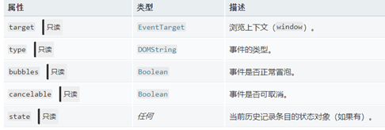
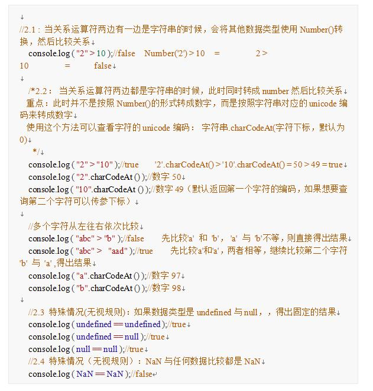
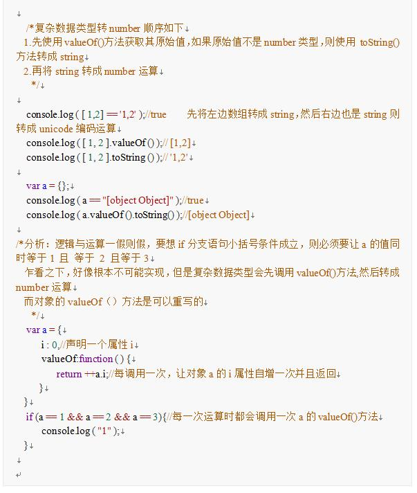

## JavaScript

## JS理念

> ```bash
> ### JS 是什么？
> - 解析执行，轻量级解析型，一行一行解析的。
> - 是一种运行在客户端的脚本语言，不需编译，运行过程中由js解释器(js引擎)逐行进行解释并执行；
> - js来源：借鉴了c语言、java语言等 --> (简化式)函数式编程 +（简化式）面向对象编程；
> - ES6既是一个历史名词，也是泛指5.1版本后的js的下一个标准。
>
>
> ### JS 的组成
> JS严格意义上来说分为：语言标准部分（ESCMAScript）+ 宿主环境部分。
> 	- 在浏览器中，宿主环境包括 DOM + BOM 等。
> 	- 在 Nod 中，宿主环境包括一些文件、数据库、网络、操作系统的交互等。
> 1. ECMAScript(js语法规范)：包括变量、表达式、运算符、函数、if语句、for语句等。
> 2. BOM:文档对象模型(Document object Model)：onload页面加载事件、window顶级对象；定时器；location、history
> 3. DOM:浏览器对象模型(Browser Object Model)：获取页面元素、注册事件；属性、样式操作；节点属性、节点层级；动态创建元素
>
>
> ### JS 引入方式
> 1. 行内式
> 2. 内嵌式
> 3. 外部引入式
>
>
> ### JS 的特点
> - 解释性：C语言为编译性
> - 基于对象：什么是对象
> - 事件驱动：onclick、onmouseover、onmouseout
> - 跨平台性：只跟浏览器有关
> - 安全性：不允许访问硬盘，不能对网络文件进行修改和删除
>
>
> ### JS 全局函数
> - 6个编码相关：`escape()、unescape()、encodeURL()、decodeURL()、encodeURLComponent()、decodeURLComponent()`
> - 2个数据处理：`Number()、String()`
> - 4个数字相关：`isFinite()、isNaN()、parseInt()、parseFloat()`
> - 1个特殊：`eval()`
> ```


### 一次js请求的缓存处理

- `DNS`缓存：短时间内多次访问某个网站，在限定时间内，不用多次访问DNS服务器
- `CDN`缓存：内容分发网络，就近节点获取
- 浏览器缓存：浏览器在用户磁盘上，对最新请求过的文档进行了存储
- 服务器缓存：将需要频繁访问的Web页面和对象保存在离用户更近的系统中，当再次访问这些对象时加快访问速度。


## V8 引擎

```bash
### V8 引擎是什么
 V8是由Google开发的JavaScript和WebAssembly引擎，他是用C++开发的。目前他主要应用于Chrome浏览器和NodeJS上。
 他是参照ECMAScript和WebAssembly规范进行实现，并支持跨平台使用。他可以独立运行，也可以嵌入其他由C++实现的应用中。


### 抽象语法树`AST`
- 抽象语法和抽象语法树就是源代码的抽象语法结构的树状表现形式
- 浏览器通过`javascript Parser`解析器将js代码转化为抽象语法树来进行下一步的分析等其他操作。所以将js转化为抽象语法树更利于程序的分析。
- 常用的`javascript Parser`：esprima、traceur、acorn、shift。

抽象语法树的作用
- 代码语法的检查，代码风格的检查，代码的格式化，代码的高亮，代码错误提示，代码自动补全等等
    如：JSLint、JSHint 对代码错误或风格的检查，发现一些潜在的错误
    IDE的错误提示，格式化，高亮，自动补全等
    代码的混淆压缩，如：UglifyJS2等

- 优化变更代码，改变代码结构达到想要的结构
    代码打包工具webpack，rollup等
    CommonJS、AMD、CMD、UMD等代码规范之间的转化
    CoffeeScript、TypeScript、JSX等转化为原生Javascript
 
 
 ### V8 引擎如何执行 JS 代码
 1. 将JavaScript代码解析为AST（抽象语法树）
		1.1 词法分析：将 JS 代码解析成一个个 token，token 就是代码中不能再拆分的小单元。
		1.2 语法分析：将解析好的 token 根据语法解析成 AST。
2. 生成字节码：字节码是介于AST与机器码之间的一种产物。他诞生的目的是为了解决内存占用问题。


### 参考
[知乎——认识 V8 引擎](https://zhuanlan.zhihu.com/p/27628685)
[v8.dev](https://v8.dev/)
```

#### V8 如何提升代码执行效率

```bash
JS是动态类型的。对象的结构也是可以动态变更的。所以翻译成机器码的过程很复杂
所以使用JIT编译（及时编译）：在代码执行的同时将代码翻译成机器码，而不是AOT(Ahead of Time)

Re-compiler 和 De-optimise
代码编译过程
1. Parse JavaScript代码解析成AST
2. AST再经过基础编译器（Baseline Compiler， Ignition）编译成机器码
3. 在执行过程，机器码的执行过程会被收集和标记，如果多次被执行，则会被编译成hot
4. 被标记为Hot之后，会走增强编译器（Optimizing Compiler， TurboFan）再编程成更加高效的机器码

例子：
    function load(obj) {
      return obj.x
    }
    load({x: 4, y: 7});
    load({x: 6, y: 3});
    load({x: 8, y: 7});
    load({x: 1, y: 5});
    load({x: 2, y: 4});

多次执行load后，load被标记为hot => 由于load的obj参数多次执行后类型都是一致的
下次执行后，会直接通过内存偏移的方式直接取出对应的obj.x，大大的提高了代码执行的性能

ES6的优化
    function foo() {
        return {[x]: 1}
    }
```


## JS在浏览器的运行机制

### 进程与线程

> ```bash
> ## 进程与线程
> CPU -> 进程 -> 线程
>
> ### 进程
> - CPU 是计算机的核心，承担所有的计算任务。
> - 进程是 CPU 资源分配的最小单位。
> - 进程包括运行中的程序和程序中所使用的内存和系统资源。
> - CPU 可以有很多进程，但 CPU 所拥有的资源空间是固定的，CPU 给每个进行分配资源空间，分出去的资源空间越多就会导致平均分配的内存不足而导致卡顿。每个进程之间是相互独立的，CPU 在运行一个进程时，其他的进程处于非运行状态，CPU 使用 `时间片轮转调度法` 来实现同时运行多个进程。
>
>
> ### 线程
> - 线程是 CPU 调度的最小单位。
> - 线程是建立在进程的基础上的一次程序运行单位，线程是程序中的一个执行流，一个进程可以有多个线程。
> - 一个进程中只有一个执行流称作单线程，即程序执行时，所走的程序路径按照连续顺序排下来，前面的必须处理好，后面的才会执行。
> - 一个进程中有多个执行流称作多线程，即一个程序中可以同时运行多个不同的线程来行执行不同的任务。
>
>
> ### 进程和线程的区别
> - 进程是操作系统分配资源的最小单位，线程是程序执行的最小单位。
> 		（CPU 分配足够多资源给一个应用，应用可调用多个线程执行任务，但分配给应用的运行内存是有限的，当线程运行过多就会因为运行内存不足导致卡顿）
> - 一个进程由一个或多个线程组成，线程可以理解为是一个进程中代码的不同执行路线。
> - 进程之间相互独立，但同一进程下的各个线程间共享程序的内存空间（包括代码段、数据集、堆等）及一些进程级的程序（如打开文件和信号）
> - 调度和切换：线程上下文切换比进程上下文切换要快得多。
>
>
> ### 多进程和多线程
> 1. 多进程：
> - 多进程指的是在同一时间里，同一个计算机系统中如果允许两个或两个以上的进程处于运行状态。
> - 多线程的好处：如在网易云听歌的同时打开编辑器敲代码，编辑器和网易云的进程之间不会相互干扰。
>
> 2. 多线程：
> - 多线程是指程序中包含多个执行流，即一个程序中可以同时运行多个不同的线程来行执行不同的任务。
>
>
>
> ### JS 为什么是单线程
> JS 的单线程与它的用途有关。作为浏览器脚本语言，JavaScript 的主要用途是与用户互动，以及操作DOM。这决定了它只能是单线程，否则会带来很复杂的同步问题。比如，假定 JS 同时有两个线程，一个线程在某个 DOM 节点上添加内容，另一个线程删除了这个节点，这时浏览器就不确定以哪个线程为准。
> 为了利用多核CPU的计算能力，HTML5 提出 WebWorker 标准，允许 JS 脚本创建多个线程，但是子线程是完全受主线程控制，而且不得操作 DOM。所以这个标准并没有改变 JavaScript 是单线程的本质。
> ```

### 浏览器

> ```bash
> ## 浏览器
> ### 浏览器是多进程的
> - 浏览器是多线程的，如Chrome浏览器，我们每打开一个 Tab 页就会产生一个进程，每个进程又有很多线程，都会占用内部才能，这也以为这内存等资源消耗会很大，因此当Chrome运行时间长了就会导致电脑会越来越卡。
> - 浏览器需要多进程的原因：如果浏览器是单线程，当某个Tab页、插件崩溃，就影响了整个浏览器，影响用户体验感
>
>
> ### 浏览器包含的进程
> 1. Browser 进程
>     - 浏览器的主进程（负责协调、主控），该进程只有一个。
>     - 负责浏览器界面显示，与用户交互。如页面的前进、后退等。
>     - 负责各个页面的管理，创建和销毁其他进程。
>     - 将渲染(Renderer)进程得到的内存中的 Bitmap(位图)，绘制到用户界面上。
>     - 网络资源的管理、下载等。
>
> 2. 第三方插件进程
> 		- 每种类型的插件对应一个进程，当使用该插件时才创建。
>
> 3. GPU 进程
> 		- 该进程也只有一个，用于 3D 绘制等等。
>
> 4. 渲染进程（重点）
>     - 浏览器内核（Renderer进程，其内部是多线程）。
>     - 每个 Tab 页面都有一个渲染进程，互不影响。
>     - 主要作为页面渲染、脚本执行、事件处理等。
>
>
> ### 渲染进程 Renderer 的主要进程
> #### GUI 渲染线程
> - 负责渲染浏览器界面，解析HTML、CSS、构建DOM树和RenderObject树，布局和绘制等。
>     1. 解析html代码（HTML代码本质是字符串）转化为浏览器认识的节点，生成 DOM树（DOM Tree）
>     2. 解析 CSS，生成 CSS规则树（CSSOM）
>     3. 把 DOM Tree 和 CSSOM 结合，生成渲染树（Rendering Tree）
> - 当修改元素的尺寸等，页面就会回流(Reflow)。
> - 当修改如一些元素的颜色或背景色，页面就会重绘(Repaint)。
> - 当页面需要 Repaint 和 Reflow 时， GUI 线程执行，绘制页面。
> - 回流(Reflow)比重绘(Repaint)的成本要高，我们要尽量避免 Reflow 和 Repaint。
> - GUI 渲染线程与 JS 引擎线程是互斥的
> 		- 当 JS 引擎执行时 GUI 线程会被挂起（相当于被冻结）。
> 		- GUI 更新会被保存在一个队列中等到 JS 引擎空闲时立即被执行。
>
>
> #### JS 引擎线程
> - JS 引擎就是 JS 内核，负责处理 JavaScript 脚本程序（例如 V8 引擎）
> - JS 引擎线程负责解析 JavaScript 脚本，运行代码。
> - JS 引擎一直等待任务队列中任务的到来，然后加以处理。
> 		- 浏览器同时只能有一个 JS 引擎线程在运行 JS 程序，所以js是单向成运行的。
> 		- 浏览器一个Tab页(renderer进程)中无论什么时候都只有一个 JS 线程在运行 JS 程序。
> - GUI 渲染线程与 JS 引擎线程是互斥的，JS 引擎线程会阻塞 GUI 渲染线程。
> 		- 就是我们常遇到的 JS 执行时间过长，造成页面渲染不连贯，导致页面渲染加载阻塞（页面加载缓慢）
> 		- 例如浏览器渲染时遇到 script 标签，就会停止 GUI 的渲染，然后 JS 引擎线程开始工作，执行里面的js代码，等js执行完毕，JS 引擎线程停止工作，GUI 继续渲染下面的内容。如果js执行时间太长就会造成页面卡顿的情况。
>
>
> #### 事件触发线程
> - 属于浏览器而不是 JS 引擎，用来控制事件循环，并且管理着一个事件队列（task queue）
> - 当js执行碰到事件绑定和一些异步操作（如setTimeOut，也可来自浏览器内核的其他线程，如鼠标点击、AJAX异步请求等），会走事件触发线程将对应的事件添加到对应的线程中（比如定时器操作，便把定时器事件添加到定时器线程），等异步事件有结果，便把它们的回调操作添加到事件队列，等待 JS 引擎线程空闲时来处理。
> - 当对应的事件符合触发条件被触发时，该线程会把事件添加到待处理队列的队尾，等待 JS 引擎的处理。
> - 因为 JS 是单线程的，所以这些待处理队列中的事件都得排队等待 JS 引擎处理。
>
>
> #### 定时触发器线程
> - setInterval 与 setTimeout 所在的线程。
> - 浏览器定时计数器并不是由 JavaScript 引擎计数的（因为 JS 引擎是单线程的，如果处于阻塞线程状态，就会影响计时的准确）
> - 通过单独线程来计时并触发定时（计时完毕后，添加到事件触发线程的事件队列中，等待 JS 引擎空闲后执行），这个线程就是定时触发器线程，也叫定时器线程。
> - W3C 在 HTML 标准中规定，规定要求 setTimeout 中低于 4ms 的时间间隔计算为 4ms。
>
>
> #### 异步 http 请求线程
> - 在XMLHttpRequest 在连接后是通过浏览器新开一个线程请求。
> - 将检测到状态变更时。如果设置有回调函数，异步线程就产生状态变更事件，将整个回调再放入事件队列中，再由 JavaScript 引擎执行。
> - 简单说就是当执行一个 http 异步请求时，就把异步请求事件添加到异步请求线程，等收到响应（准确说应该是http状态变化），再把回调函数添加到事件队列，等待 JS 引擎线程来执行。
> ```
>

### 事件循环 Event Loop

> ```bash
> ## 事件循环 Event Loop
> JS 分为同步任务和异步任务。
> 同步任务都在主线程（JS引擎线程）上执行，会形成一个执行栈；
> 主线程之外，事件触发线程管理着一个任务队列，只要异步任务有了运行结果，就在任务队列之中放一个事件回调；
> 一旦执行栈中的所有同步任务执行完毕（也就是JS引擎线程空闲），系统就会读取任务队列，将可运行的异步任务（任务队列中的事件回调，只要任务队列中有事件回调，就说明可以执行）添加到执行栈中，开始执行。
>
>
>
> ### 执行说明
> 浏览器上的所有线程的工作都很单一且独立，非常符合单一原则。
> - '定时触发线程' 只管理定时器，且只关注定时不关心结果，定时结束就把回调扔给事件触发线程。
> - '异步http请求线程' 只管理异步请求，同样不关心结果，请求结束就把回调扔给事件触发线程。
> - '事件触发线程' 只关心异步回调入事件队列。
> - 'JS引擎线程' 只会执行栈中的事件，执行栈中的代码执行完毕，就会读取事件队列中的事件并添加到执行栈中继续执行，这样反反复复的执行事件就是事件循环(Event Loop)
>
>
>
> ### 执行顺序
> JS是按照顺序从上往下执行的，可以先理解为这段代码的执行环境就是主线程，也就是当前执行栈。
> 1. 首先，执行 `console.log('同步任务1')`
> 2. 接着执行到 setTimeout 时，会移交给'定时器线程'，通知定时器线程 0s 后将 setTimeoutCallback 这个回调交给'事件触发线程'处理，在 0s 后事件触发线程会受到 setTimeoutCallback 这个回调并把它加入到 '事件触发线程' 所管理的事件队列中等待执行。
> 3. 接着执行 http 请求，会移交给 '异步http请求线程' 发送网络请求，请求成功后将 httpCallback 这个回调交由事件触发线程处理， '事件触发线程' 收到 httpCallback 这个回调后把它加入到 '事件触发线程' 所管理的事件队列中等待执行。
> 4. 再接着执行 `console.log('同步任务2')`
> 5. 至此主线程执行栈中执行完毕，'JS引擎线程' 已经空闲，开始向 '事件触发线程' 发起询问，询问'事件触发线程'的事件队列中是否有需要执行的回调函数，如果有将'事件队列'中的回调事件加入执行栈中，开始执行回调，如果事件队列中没有回调，'JS引擎线程'会一直发起询问，直到有为止。
> ```
>
> ```bash
> ### 事件执行案例
> let setTimeoutCallback = function () {
> 	console.log('定时器回调')
> }
> let httpCallback = function () {
> 	console.log('http请求回调')
> }
> console.log('同步任务1')
> setTimeout(setTimeoutCallback, 0)
> Promise.resolve().then(httpCallback)
> console.log('同步任务2')
> ```
>
> 

### 宏任务 & 微任务

> ```bash
> ### 浏览器事件循环`Event Loop`
> 1. 不同的任务源会被分配到不同的`Task`队列中，任务源分为微任务(task)和宏任务(jobs)
> 2. 首先 '执行同步代码'，这属于宏任务(`script、setTimeout、setInterval、setImmediate、I/O、UI rendering`)
> 3. 当执行完所有'同步代码'后，执行栈为空，查询是否有异步代码需要执行
> 4. '执行所有微任务'(`process.nextTick、promise、MutationObserver`)
> 5. 当执行完所有微任务后，如有必要，会'渲染页面'
> 6. 然后开始下一轮`Event Loop`，'执行宏任务的异步代码'，即`setTimeout、setInterval`中的回调事件。
> 
> 
> #### 宏任务（macrotask）
> - 在 ECMAScript 中，macrotask 也被称为 task，发起者为宿主（Node、浏览器）。
> - 我们可以将每次执行栈执行的代码当做是一个宏任务（包括每次从事件队列中获取一个事件回调并放到执行栈中执行），每一个宏任务会从头到尾执行完毕，不会执行其他。
> - 由于 'JS引擎线程' 和 'GUI渲染线程' 是互斥关系，浏览器为了能够使 '宏任务' 和 'DOM任务' 有序进行，会在一个 '宏任务' 执行结果后，在下一个 '宏任务' 执行前，'GUI渲染线程' 开始工作，对页面进行渲染。
> - 执行顺序：'宏任务 -> GUI渲染 -> 宏任务 -> ...'
> - 常见的宏任务：
> 		1. script 标签的代码(可以理解为外层同步代码 / 主代码块) 
> 		2. setTimeout、setInterval
> 		3. UI rendering/UI事件
> 		4.  postMessage，MessageChannel
> 		5. Node的setImmediate，I/O
> 		6. 浏览器的requestAnimationFrame
> 
> 
> #### 微任务（maicrotask）
> - 在ECMAScript中，`maicrotask` 也称为 `jobs`，发起者为JS自身发起（JS引擎）。
> - 当'宏任务'结束后，会执行渲染，然后执行下一个'宏任务'，而'微任务'可以理解成在当前'宏任务'执行后立即执行的任务。
> - 当一个'宏任务'执行完，会在渲染前，将执行期间所产生的所有'微任务'都执行完。
> - 执行顺序：'宏任务 -> 微任务 -> GUI渲染 -> 宏任务 -> ...'
> - 常见微任务：
> 		1. Promise.then()、Promise.catch、Promise.finally
> 		2. MutaionObserver
> 		3. Object.observe（已废弃；Proxy 对象替代）
> 		4. Node的process.nextTick()
> 
> 
> #### 宏任务微任务注意点
> - 浏览器会先执行一个宏任务，紧接着执行当前执行栈产生的微任务，再进行渲染，然后再执行下一个宏任务。
> - 微任务和宏任务不在一个任务队列。
> - 例如 setTimeout 是一个宏任务，它的事件回调在宏任务队列；Promise.then() 是一个微任务，它的事件回调在微任务队列，二者并不是一个任务队列。
> - 以 Chrome 为例，有关渲染的都是在渲染进程中执行，渲染进程中的任务（DOM树构建、jS解析等）需要主线程执行的任务都会在主线程中执行，而浏览器维护了一套事件循环机制，主线程上的任务都会放到消息队列中执行，主线程会循环消息队列，并从头部取出任务进行执行，如果执行过程中产生其他任务需要主线程执行的，渲染进程中的其他线程会把该任务塞入到消息队列的尾部，消息队列中的任务都是宏任务。
> - 微任务的产生：当执行到 script 脚本时，JS 引擎会为全局创建一个执行上下文，在该执行上下文中维护了一个微任务队列，当遇到微任务，就会把微任务回调放在微任务队列，当所有的js代码执行完毕，在退出全局上下文之前引擎会去检查该队列，有回调就执行，没有就退出执行上下文。这就是微任务要早于宏任务的原因，即是说每个宏任务都有一个微任务队列（由于定时器是浏览器的API，所以定时器是宏任务，在js中遇x到定时器也是放在浏览器的队列中）。
> ```
>
> 
>
> ```js
> console.log('script start')
> async function async1() {
>   await async2()
>   console.log('async1 end')
> }
> async function async2() {
>   console.log('async2 end')
> }
> async1()
> setTimeout(function () {
>   console.log('setTimeout')
> }, 0)
> new Promise(resolve => {
>   console.log('Promise')
>   resolve()
> }).then(function () {
>   console.log('promise1')
> }).then(function () {
>   console.log('promise2')
> })
> console.log('script end')
> 
> /*
> script start
> async2 end
> Promise
> script end
> async1 end
> promise1
> promise2
> setTimeout */
> ```

### 完整的事件循环 Event Loop

> ```bash
> ### 完整的事件循环 Event Loop
> 先执行同步代码，遇到异步宏任务则将异步宏任务放入宏任务队列中，遇到异步微任务则将异步微任务放入微任务队列中。
> 当所有同步代码执行完毕后，再将异步微任务从队列中调入主线程执行，微任务执行完毕后，再将异步宏任务从队列中调入主线程执行，一直循环直至所有任务执行完毕。
> 
> 
> #### 事件循环的简洁版
> 1. 先执行宏任务的同步代码
> 2. 再执行所有的微任务
> 3. 如果可能会渲染页面
> 4. 再执行宏任务的异步代码
> 5. 进入下一轮 Tick
> 
> 
> #### EventLoop 详细版
> 1. 首先，整体的 script 作为第一个宏任务开始执行时，会把所有代码分为 '同步任务、异步任务' 两部分。
> 2. 同步任务会直接进入主线程依次执行。
> 3. 异步任务会再分为异步宏任务和异步微任务。
> 	3.1 异步宏任务进入到 EventTable 中，并在里面注册回调函数，每当指定的事件完成时，Event Table 会将整个函数移到 Event Queue 中。
> 	3.2 异步微任务会进入到另一个 EventTable 中，并在里面注册回调函数，每当指定事件完成时，EventTable 会将整个函数移交到 Event Queue 中。
> 4. 当主线程内的任务执行完毕，主线程为空时，会检查微任务的 Event Queue 是否有任务，有则会执行至微任务队列为空。
> 5. 如果宿主为浏览器，可能会渲染页面
> 6. 开始下一轮tick，执行宏任务中的异步代码（setTimeout等回调）
> 7. 上述事件过程会不断重复（例如进入下一个 script 标签执行），这就是 Event Loop。
> 
> 
> 
> #### 关于 Promise
> - 如 `new Promise(() => ()).then()`
> 		- 前面的 `new Promise()` 这一部分是一个构造函数，这是一个同步任务。
> 		- 后面的 `.then()` 才是一个异步任务。
> 
>       new Promise((resolve) => {
>         console.log(1)
>         resolve()
>       }).then(() => {
>         console.log(2)
>       })
>       console.log(3)
>       // 会输出：1 3 2
> 
> 
> 
> #### 关于 async/await 函数
> - async/await 本质上是基于 Promise 的一些封装，而 Promise 是属于微任务的一种。
> 		所以在使用 await 关键字与 Promise.then() 效果类似。
> 		await 关键字之前的代码，相当于 new Promise() 的同步代码，await 以后的代码相当于 Promise.then() 的异步。
> 
>     setTimeout(() => console.log(1))
>     async function test() {
>       console.log(2)
>       await Promise.resolve()
>       console.log(3)
>     }
>     test()
>     console.log(4)
>     // 会输出： 2 4 3 1
> ```
>
> 

### NodeJS中的运行机制

> ```bash
> ## NodeJS 中的运行机制
> - 虽然 NodeJS 中的 JavaScript 运行环境也是 V8 引擎，也是单线程，但还是有些与浏览器中的表现是不一样的。
> - nodejs 与浏览器的区别是，nodejs 的宏任务分好几种类型，而这号几种又有不同的任务队列，而不同的任务队列又有顺序区别，而微任务是穿插在每一种宏任务之间的。
> - 在 node 环境下，process.nextTick 的优先级高于 Promise，可以简单理解为在宏任务结束后会先执行微任务队列中的 nextTickQueue 部分，然后才执行微任务中的 Promise 部分。
> - 浏览器和 Node 环境下，microtask 任务队列的执行时机不同
>     - Node 端，microtask 在事件循环的各个阶段之间执行
>     - 浏览器端，microtask 在事件循环的 macrotask 执行完之后执行
>
>
> ### NodeJS 的 EventLoop
> 1. node 会执行所有类型为 timers 的 MacroTask，然后执行所有的 MicroTask（NextTick例外）
> 2. 进入 poll 阶段，执行几乎所有 MacroTask，然后执行所有的 MicroTask。
> 3. 再执行所有类型为 check 的 MacroTask，然后执行所有的 MicroTask。
> 4. 再执行所有类型为 close callbacks 的 MacroTask，然后执行所有的 MicroTask。
> 5. 至此，完成一个 Tick，回到 timers 阶段，不断的进行循环执行。
>
>
> ### 浏览器中的 EventLoop
> 1. 先执行一个 MacroTask，然后执行所有的 MicroTask。
> 2. 再执行一个 MacroTask，然后执行所有的 MrcroTask。
> 3. 不断地循环执行上述的过程。
>
>
> ### NodeJS 的执行过程
> 外部输入数据 –> 轮询阶段(poll) –> 检查阶段(check) –> 关闭事件回调阶段(close callback) –> 定时器检测阶段(timers) –> I/O事件回调阶段(I/O callbacks) –> 闲置阶段(idle, prepare) –> 轮询阶段（按照该顺序反复运行）…
> - timers 阶段：这个阶段执行 timer（setTimeout、setInterval）的回调
> - I/O callbacks 阶段：处理一些上一轮循环中的少数未执行的 I/O 回调
> - idle, prepare 阶段：仅 node 内部使用
> - poll 阶段：获取新的 I/O 事件, 适当的条件下 node 将阻塞在这里
> - check 阶段：执行 setImmediate() 的回调
> - close callbacks 阶段：执行 socket 的 close 事件回调
> ```
>
> 
>
> ```bash
> ### 浏览器与nodejs 事件循环执行案例
> setTimeout(()=>{
>   console.log('timer1')
>   Promise.resolve().then(function() {
>     console.log('promise1')
>   })
> }, 0)
> setTimeout(()=>{
>   console.log('timer2')
>   Promise.resolve().then(function() {
>     console.log('promise2')
>   })
> }, 0)
>
>
> ### 浏览器端运行结果：timer1 => promise1 => timer2 => promise2
>
>
> ### Node 端运行结果：timer1 => timer2 => promise1 => promise2
> 全局脚本（main()）执行，将 2 个 timer 依次放入 timer 队列，main()执行完毕，调用栈空闲，任务队列开始执行；
> 首先进入 timers 阶段，执行 timer1 的回调函数，打印 timer1，并将 promise1.then 回调放入 microtask 队列，同样的步骤执行 timer2，打印 timer2；
> 至此，timer 阶段执行结束，event loop 进入下一个阶段之前，执行 microtask 队列的所有任务，依次打印 promise1、promise2
> ```
>
> **浏览器处理结果**
>
> 
>
> **Nodejs处理结果**
>
> 

### 浏览器渲染原理

> ```bash
> ## 浏览器渲染原理
> ### 浏览器渲染流程
> - 解析html -> 构建DOM树/CSS Rule Tree -> 构建render树 -> 布局render树 -> 绘制render树
>
>
> ### 浏览器解析过程
> 1. DOM Tree：浏览器会将HTML解析成一个DOM树，
> 		DOM 树的构建过程是一个深度遍历过程：当前节点的所有子节点都构建好后才会去构建当前节点的下一个兄弟节点。
> 2. CSS rule tree：将CSS解析成树形的数据结构
> 3. Render Tree: 根据DOM树和CSSOM来构造Render Tree
>     此时浏览器已经能知道网页中有哪些节点、各个节点的CSS定义以及他们的从属关系；
>     但并不知道节点的位置，需要依靠接下来的layout。
> 4. layout：计算出每个节点在屏幕中的位置(宽高、颜色等)
> 5. 绘制(painting)：即遍历render树，并使用UI后端层绘制每个节点到页面上
> 注意：上述这个过程是逐步完成的，为了更好的用户体验，渲染引擎将会尽可能早的将内容呈现到屏幕上，并不会等到所有的html都解析完成之后再去构建和布局render树。它是解析完一部分内容就显示一部分内容，同时，可能还在通过网络下载其余内容。
> ```
>
> **webkit的流程**
>
> 
>
> **Geoko的流程**
>
> 

### 重绘和回流(重排)

> ```bash
> ## 重绘 和 回流(重排)
> ### 1. 重绘(repaint)
> 重绘(repaint)：不会影响页面布局的操作，重新绘制到屏幕上的过程称为重绘。
>    - 如改变某个元素的背景色、文字颜色、边框颜色等不影响它周围或内部布局的属性时，即元素的几何尺寸没有变。
>    - DOM改动
>    - CSS改动
>
>
> ### 2. 回流/重排(reflow)
> 回流(reflow)：布局的改变(某个部位改变)导致需要倒回去重新渲染，这个回退的过程叫回流
>    - 增加、删除、修改DOM节点时，会导致 Reflow 或 Repaint。
>    - 移动DOM的位置，或是加个动画时。
>    - 修改CSS样式时（宽高、display 为none等，都是通过css样式来修改的）
>    - 当用户Resize窗口时（移动端没有这个问题），或是滚动时，有可能会触发（具体要看浏览器的规则）
>    - 修改网页的默认字体时。
> 注意：回流必将引起重绘，重绘不一定会引起回流
>
>
> ### 引起重排的原因
> 1. 添加或者删除可见的DOM元素；
> 2. 元素位置、尺寸、内容改变；
> 3. 浏览器页面初始化；
> 4. 浏览器窗尺寸改变，重排一定引起重绘，重绘不一定引起重排。
>
>
> ### 减少重绘和重排的方法
> 1. 不在布局信息改变时做 DOM 查询。
> 2. 使用 `cssText` 或者 `className` 一次性改变属性。
> 3. 使用 `fragment`。
> 4. 对于多次重排的元素，如动画，使用绝对定位脱离文档流，让他的改变不影响到其他元素。
> ```


## 脚本标签 script

```bash
## 脚本 script
		`<script type="text/javascript" src="" async></script>`
// async:异步		defer：
// 注意： 该属性指的是浏览器将外部js文件下载完成后，立马执行。

当浏览器看到普通脚本标签声明时，它执行以下步骤：
    - 暂停 HTML 文档解析器
    - 创建新请求以下载脚本
    - 在脚本完全下载后立即执行脚本
    - 执行结束后，继续解析 HTML 文档


### async 和 defer
async 与 defer 的作用是让浏览器知道脚本可以与文档解析器过程并行下载，从而不阻塞页面的渲染。
async 与 defer 的区别是脚本会在不同的时刻执行。

1. async 异步执行
    下载 async 脚本后，浏览器将暂停文档解析器，执行脚本并继续解析文档。
        1. 解析文档
        2. 下载脚本
        3. 暂停解析
        4. 执行脚本
        5. 恢复解析
     async 对于应用脚本的用处不大，因为它完全不考虑依赖（哪怕是最低级的顺序执行），
     但它对于那些可以不依赖任何脚本或不被任何脚本依赖的脚本来说非常适合。

2. defer 延时执行
    只有当解析器完成其工作时，才会执行 defer 脚本。
        1. 解析脚本
        2. 下载脚本
        3. 执行脚本
    注意：这个过程中，文档是不会停止解析的。


### aync 与 defer 的区别
async 脚本在完全下载后立即执行，加载和渲染后续文档元素的过程将和 JS 脚本的加载与执行并行进行（异步），因此它们的执行顺序可能与页面中显示的顺序不同（即不管声明顺序如何，只要它加载完成该脚本就会立刻执行）。
defer 脚本保证执行顺序。它是等到页面渲染完毕，所有脚本下载完成，在 `DOMContentLoaded` 事件前按照脚本在文档中的顺序执行。
```


### 页面的生命周期

```bash
- DOMContentLoaded：浏览器已经完全加载 HTML，并构建完 DOM 树，但像 `` 标签中引用的图片和样式表之类的外部资源可能尚未加载完成。
		- DOM 已经就绪，因此处理程序可以查找 DOM 节点，并初始化接口。

- load：浏览器加载完成 HTML 以及所有的外部资源（图片和样式）
		- 外部资源已加载完成，样式已被应用，图片大小已知。
		
- beforeload/upload：当用户离开页面时。
		- beforeunload：用户正在离开。此时可以检查用户是否保存了更改，并询问是否真的要离开。
		- unload：用户几乎已经离开，但现阶段仍然可以启动一些操作，如发送统计数据。
```


### DOMContentLoaded 事件

> ```bash
> ## DOMContentLoaded 事件
> 当初始HTML文档已完全加载和解析时，将触发DOMContentLoaded事件，而不需要等待样式表，图像和子框架页面加载（事件可以用来检测HTML页面是否完全加载完毕(fully-loaded)）。
> 
> 
> ### DOMContentLoaded 执行时机
> #### 1. 普通脚本/sync（等待脚本执行完后再执行DOMContentLoaded）
> 	HTML加载解析 -> 遇到普通脚本 -> 加载&执行脚本 -> 继续HTML加载解析 -> HTML解析完毕 -> DOMContentLoaded事件
> 
> 
> #### 2. 异步加载脚本/async（衡量HTML加载解析的速度来执行DOMContentLoaded）
> 	HTML加载解析 -> 遇到async脚本 -> (HTML&async脚本)并行加载解析 ->
> 		- 若HTML解析完后async脚本也已加载完毕 -> 停止HTML解析 -> 执行async脚本 -> 继续HTML加载解析 -> HTML解析完毕 -> DOMContentLoaded事件
> 		- 若HTML解析完后async脚本还未加载完成 -> DOMContentLoaded事件
> 
> 
> #### 3. 延时加载脚本/defer（等待脚本执行完后再执行DOMContentLoaded）
> 	HTML加载解析&defer脚本加载
> 			- 若HTML解析完后defer脚本也已加载完毕 -> 执行defer脚本 -> DOMContentLoaded事件
> 			- 若HTML解析完后async脚本还未加载完成 -> defer脚本加载完毕 -> 执行defer脚本 -> DOMContentLoaded事件
> ```
>
> 
>
> ```html
> <script>
>   document.addEventListener("DOMContentLoaded", () => {
>    alert("DOM ready!");
>   });
> </script>
> 
> <script src="https://cdnjs.cloudflare.com/ajax/libs/lodash.js/4.3.0/lodash.js"></script>
> 
> <script>
>   alert("Library loaded, inline script executed");
> </script>
> 
> <!-- 
> 先输出 'Library loaded, inline script executed'，
> 再输出 DOM ready!
> -->
> ```
>

### DOMContentLoaded和load的区别

```bash
## DOMContentLoaded 和 load 的区别
DOMContentLoaded：在 interactive 触发
	当初始的 HTML 文档被完全加载和解析完成之后，DOMContentLoaded 事件被触发，而无需等待样式表、图像和子框架的完成加载。

load：在 complete 触发
	当一个资源及其依赖资源已完成加载时，将触发load事件。
```


### `document.readyState`

```bash
在文档加载完成之后再设置 DOMContentLoaded，它将不会执行。

而 document.readyState 属性可以提供 DOM 文档当前加载状态的信息。
一个文档的 readyState 可以是以下值之一：
  - loading：加载，文档正在被加载。
  - interactive：互动，此时文档已经完成加载，文档已被解析，但是诸如图像、样式表和iframe之类的子资源仍在加载。
  - complete：完成，文档被全部读取，并且所有所有子资源（如图片等）都已完成加载。状态表示 load 事件即将被触发。

readystatechange 事件可以监听状态的改变。
```

```html
<script>
  log('initial readyState:' + document.readyState);

  document.addEventListener('readystatechange', () => log('readyState:' + document.readyState));
  document.addEventListener('DOMContentLoaded', () => log('DOMContentLoaded'));

  window.onload = () => log('window onload');
</script>

<iframe src="iframe.html" onload="log('iframe onload')"></iframe>


<script>
  img.onload = () => log('img onload');
</script>

<!-- 
[1] initial readyState:loading
[2] readyState:interactive
[2] DOMContentLoaded
[3] iframe onload
[4] img onload
[4] readyState:complete
[4] window onload
-->
```


### 对于不同声明的脚本，`DOMContentLoaded` 的触发时机

> ##### sync / 普通 JS
>
> - 文档解析的过程中，如果遇到 script 脚本，就会停止页面的解析进行下载，当脚本都下载并执行完毕后，才会继续解析页面。
>     - 脚本不能访问到位于它们下面的 DOM 元素，因此，脚本无法给它们添加处理程序等
>     - 如果页面顶部有一个笨重的脚本，它会“阻塞页面”。在该脚本下载并执行结束前，用户都不能看到页面内容（解决方案：把脚本放在页面底部）
>
> 
>
> ##### `async` / 异步加载脚本
>
> - `async` 脚本会在加载完毕后执行。
> - `async` 脚本的加载不计入 `DOMContentLoaded` 事件统计，就存在下面两种情况会发生。
>
> 1. HTML 还没有被解析完的时候，`async` 脚本已经加载完毕，那么 HTML 就会停止解析，去执行脚本，脚本执行完毕后触发 `DOMContentLoaded` 事件。
>
>    
>
> 2. HTML 解析完之后，`async` 脚本还未加载完成，那么在HTML解析完毕后就触发 `DOMContentLoaded` 事件。
>
>    
>
> 注意：`DOMContentLoaded` 可能在 `async` 之前或之后触发，不能保证谁先谁后。
>
> ##### defer / 延时加载脚本
>
> - 文档解析时，遇到设置 defer 属性的脚本，就会在后台进行下载，但是并不会阻止文档的渲染，当页面解析和渲染完毕后，会等到所有的 defer 脚本加载完毕并按照顺序执行完毕才会触发 `DOMContentLoaded` 事件。此时就存在两种情况会发生：
>
> 1. HTML还没被解析完的时候，defer 脚本已经加载完毕，此时会等待 HTML 解析完成后执行脚本，脚本执行完毕后触发 `DOMContentLoaded` 事件。
>
> 
>
> 2. HTML 解析完之后，defer 脚本才加载完，此时会先等待 defer 脚本执行完毕后，才会触发 `DOMContentLoaded` 事件。
>
> 
>
> 注意：defer 特性仅适用于外部脚本，如果 `<script>` 脚本没有 `src`，则会忽略 `defer` 特性。


### 动态加载脚本文件

要使用 JavaScript 动态加载脚本文件，基本步骤如下：

- 创建 `script` 元素
- 将 `script` 元素的 `src` 属性设置为指向要加载的文件
- 将 `script` 元素附加（append）到文档（document）中

```js
let myScript = document.createElement('script')
myScript.setAttribute('src', '/path/to/js/file.js')
// 通过 `appendChild` 将 `script` 元素添加到 `body` 元素的底部
document.body.appendChild(myScript)
```

#### 先运行动态加载的脚本

在 `body` 元素的底部添加 `script` 元素意味着页面将首先渲染，而不会被 JavaScript 阻止加载和执行。如希望 JavaScript 先于页面可能执行的任何操作运行，则需要添加在 `head` 元素中。

```js
let myScript = document.createElement('script')
myScript.setAttribute('src', './index.js')
// 动态加载的脚本文件是异步加载的。我们想要显式地重写默认行为
myScript.setAttribute('async', 'false')

let head = document.head
head.insertBefore(myScript, head.firstElementChild)
```

代码中有两个新特性，可以确保在渲染页面上的任何其他内容之前加载并运行外部脚本文件：

- 因为动态脚本默认情况下是异步的，先加载完成的脚先执行。所以需要先将 `script` 元素的 `async` 属性设置为 `false`，将脚本按照脚本在文档中的顺序执行。
- 接下来确保在加载页面其余部分之前加载脚本。在 `head` 元素的顶部添加 `script` 元素是确保它在页面可能达到的任何其他内容之前运行的最佳位置。

#### 脚本文件加载后运行相关代码

对于动态加载的脚本文件，如果想要加载一个外部脚本文件，然后立即调用一个函数，需要额外添加 `load` 事件来监听我们的 `script`，一旦监听到就调用相关的代码：

```js
let myScript = document.createElement('script')
myScript.setAttribute('src', './index.js')
document.body.appendChild(myScript)

// 当加载完 `index.js` 并执行后，`load` 事件将被触发，调用 `scriptLoaded` 事件处理程序。
myScript.addEventListener('load', scriptLoaded)
function scriptLoaded() {
  console.log('Hi')
}
```


## DOM

```bash
## DOM
- DOM 为文档提供了结构化表示，并定义了如何通过脚本来访问文档结构。
- DOM 的目的是为了能让 js 操作 html 元素而制定的一个规范。
- DOM 是由节点组成的；所有的节点本质上都是 Object。
- DOM对象与标签的区别
    - 元素标签(位于文档)对应的元素节点(位于Dom节点书上)。
    - 区别是 DOM 里面的元素节点是个对象，拥有属性和方法；而元素标签仅仅是标签而已。


### DOM作用
  - 找对象（元素节点）
  - 设置元素的属性值
  - 设置元素的样式
  - 动态创建和删除元素
  - 事件的触发响应：事件源、事件、事件的驱动程序

- 节点元素：父（parent）、子（child）和同胞（sibling）
- 元素的属性（包括对应标签的属性）
    - 非表单元素的属性：id、src、title、href、alt
    - 表单元素的属性：name、value、type、disabled、checked、selected
    - 超链接-->取消默认行为的执行：`return false`


### DOM节点属性
1. nodeName 属性规定节点的名称，仅只读
    - 文档节点（文档）：整个 HTML 文档就是一个文档节点；nodeName 始终是 `#document`
    - 元素节点（标签）：HTML标签；nodeName 与标签名相同
    - 属性节点（属性）：元素的属性；nodeName 与属性名相同
    - 文本节点（文本）：HTML标签中的文本内容(包括标签之间的空格、换行)；nodeName始终是 `#text`

2. nodeValue 属性规定节点的值
    - 元素节点的 nodeValue 是 undefined 或 null
    - 文本节点的 nodeValue 是文本本身
    - 属性节点的 nodeValue 是属性值

3. nodeType 属性获取 DOM 节点类型
    - 元素：1
    - 属性：2
    - 文本：3
    - 注释：8
    - 文档：9

4. tagNme 属性读取标签名
	- tabNme 属性仅适用于 Element 节点。
	- nodeName 是为任意 Node 定义的。
			- 对于元素，它的意义与 tagName 相同
			- 对于其他节点类型（text，comment 等），它拥有一个对应节点类型的字符串
		
```


### DOMString

```bash
## DOMString
DOMString 是一种字符串类型。它是由 16 位无符号证书序列组成，每个整数代表一个 UTF-16 代码单元。

每个代码单元都是一个 16 位的数值，通常代表一个字符，但有时需要两个代码单元来表示一个字符（对于 Unicode 辅助平面上的字符）。当文档或 Web API 规范提到 DOMString 时，它指的就是这样的字符串。

在 Web API 中，许多属性和方法返回或接受 DOMString 类型的参数。由于 JavaScript 的字符串是以 UTF-16 编码的，所以 DOMString 可以被当作普通的 JavaScript 字符串来使用，没有特殊的区别或限制。这意味着，在 JavaScript 中处理字符串时，实际是在处理 DOMString。

在 Web API 中，DOMString 通常用于：
	- DOM 元素属性，如 id、className、value 等。
	- 传递给或从方法返回的字符串值，如 document.querySelector() 或 Node.textContent。
	- 在构造函数中当做参数，如 new Text('Hello, world!')，其中 'Hello, world!' 就是一个 DOMString。
	- 表示 URL、选择器字符串或其他需要以文本形式表示的数据。
注意：尽管 DOMString 在概念上等同于 JavaScript 字符串，但在一些特殊情境下，DOMString 可能会被指定为 null 或 undefined，这通常表明字符串值是不存在的。此外，有些 API 可能会将 DOMString 限定为必须符合某些模式或格式(可能不接收 null 值)，比如必须是合法的 CSS 选择器或有效的 URL。在这些情况下，需要确保提供的字符串满足这些要求。

```

```js
/** 获取 DOM 元素属性值 */
let elementId = element.id;  // `elementId` is a DOMString
let elementClasses = element.className;  // `elementClasses` is a DOMString


/** 设置 DOM 元素属性值 */
element.id = 'new-id';  // Setting a DOMString
element.className = 'new-class'; // className is a DOMString that you can set

```


### DOM方法

```bash
### DOM 方法
1. get(获取)
2. set(设置)
3. remove(移除)
4. create(创建)
5. insert(插入)
6. replace(替代)
7. append(添加)


- getElementById(id) - 获取带有指定 id 的节点（元素）
- appendChild(node) - 插入新的子节点（元素）
- removeChild(node) - 删除子节点（元素）
- createAttribute() - 创建属性节点
- 要复制的节点.cloneNode(true)--复制节点
```


### 遍历 DOM

```bash
对 DOM 的所有操作都是以 document 对象开始的，它是 DOM 的访问入口，从它可以访问任何节点。

顶层：documentElement 和 body
- `<html>` = document.documentElement
- `<body>` = document.body
- `<head>` = document.head

- 最顶层的树节点可以直接作为 document 的属性来使用。
- 在 DOM 中，null 值以为着 '不存在' 或 '没有这个节点'。
```


#### document.body为null

```bash
注意：脚本在运行时无法访问不存在的元素，所以 document.body 的值可能是null（如一个脚本在 `<head>` 中使用同步方式引入时，脚本是无法访问到 document.body 元素，因为浏览器还没解析到 body 标签）
```

```html
<html>
<head>
  <script>
    alert( "From HEAD: " + document.body ); // null，这里目前还没有 <body>
  </script>
</head>

<body>
  <script>
    alert( "From BODY: " + document.body ); // HTMLBodyElement，现在存在了
  </script>
</body>
</html>
```


### DOM属性

```bash
- innerHTML - 节点（元素）的文本值
- parentNode - 节点（元素）的父节点
- childNodes - 节点（元素）的子节点
- attributes - 节点（元素）的属性节点


#### parentElement 和 parentNode 的区别
- parentElement 属性返回 '元素类型' 的父节点。
- parentNode 属性返回 '任何类型' 的父节点。

document.documentElement.parentNode === document
document.documentElement.parentElement === null

因为根节点 document.documentElement 的父节点是 document。但 document 不是一个元素节点，所以 parentNode 返回 document，但 parentElement 返回 null。

当想从任意节点 ele 到 `<html>` 而不是 document 时，可使用如下：
while (ele = ele.parentElement) { console.lg(ele) } // 递归向上，直到 <html>
```

#### 自定义属性

```bash
DOM 中的自定义属性不能直接访问，但可以通过以下方法来进行操作：
	- 获取标签对应的属性：`getAttribute('属性名')`（注意：属性可以是自定义，也可以是 DOM 自身已有的）
	- 设置标签属性的值：`setAttribute('属性名', '属性值')`
	- 移除标签属性值：`removeAttribute('属性名')`
```

```js
const ele = document.getElementById('data') as HTMLElement

/**
 * 获取 data-* 属性的值
 */
const getMessage1 = ele.getAttribute('data-message')
// or
const getMessage2 = ele.dataset.message

/**
 * 设置 da-* 属性的值
 */
ele.setAttribute('data-message', 'Hi, willy')
// or
ele.dataset.message = 'Hi, willy'


/**
 * 删除 data-* 属性
 */
ele.removeAttribute('data-message')
// or
delete ele.dataset.message
```


### DOM访问

```bash
### DOM 访问
- 通过Id获取单个标签：document.getElementById，返回Object类型
- 通过类名获取标签：document.getElementByClassName，返回一个数组
- 通过标签名获取标签：document.getElementsByTagName，返回一个数组
- H5中query查询Selector选择器：querySelctor()
- 查询所有选择器：querySelctorAll(标签名/类名/id名等等)

注意：因为id是单数，所以不用s，name等可以多个，为复数，所以需要s


### 元素的节点访问
节点.parentNode						：获取父元素

节点.previousSibling			 ：上一个兄弟节点
节点.nextSibling					：下一个兄弟节点
节点.previousElementSibling：上一个兄弟元素（处理兼容： 节点.previousElementSibling || 节点）
节点.nextElementSibling		：下一个兄弟元素（处理兼容问题： 节点.nextElementSibling || 节点）

节点.firstChild						：获取第一个子节点
节点.lastChild						：最后的子节点
节点.firstElementChild		：获取第一个子元素（处理兼容问题：节点.firstElementChild || 节点）
节点.lastElementChild			：最后的子元素		（处理兼容问题：节点.lastElementChild || 节点）

节点自己.parentNode.children[index] ：获取随意的兄弟节点
节点.childNodes						：获取所有子节点
节点.children							：获取所有子元素

document.body							:获取body节点
document.documentElement	:获取html节点

```


#### 获取父元素

- 使用 `Element.closest()` 方法来检查元素是否在某个父元素中。

```js
document.addEventListener('click', (e) => {
  if (!e.target.matches('.click-me')) return
  alert('想屁吃')
})
```

这将永远不会运行，因为点击事件的目标几乎总是 `.text-large` 或 `.text-small` 元素。仅当您单击按钮中的文本之外时才有效。
为了解决这个问题，我们可以使用 `Element.closest()` 方法。

```js
document.addEventListener('click', e => {
  if (!e.target.closest('.click-me')) {
    return alert('想屁吃')
  }
})
```


#### 匹配对应父元素的标签

```js
/**
 * @description 查找元素的所有祖先，直到元素与指定的选择器匹配为止
 * @param {HTMLElement} el - 所要查找的元素
 * @param {string} selector - 所要查找的父元素的标签名称
 */
const getParentsUntil = (el, selector) => {
  const parents = []
  let _el = el.parentNode

  // 循环向上移动元素的祖先树
  while (_el && typeof _el.matches === 'function') {
    // 将每个新祖先添加到数组的开头
    parents.unshift(_el)
    // 检查当前元素是否与指定的选择器匹配
    if (_el.matches(selector)) return parents
    else _el = _el.parentNode
  }
  return []
}

getParentsUntil(document.querySelector('#home-link'), 'header') // [header, nav, ul, li]
```


### DOM修改（操作样式）

> **操作样式：**设置类样式class 、设置行内样式style
>
> ```js
> let list = document.getElementsByTagName('li')[0];
> list.style.color = "lightgray";
> list.className = 'list';
> console.log(list['src'], list['className'])
> ```
>
> **动态创建元素**（innerHTML、document.write、inerText）:动态创建元素优点-->提高网页性能，降低流量使用
>
> **注意：通过`attribute`和设置`style`只能通过获取id标签来更改**
>
> - **innerHTML 和 innerText 区别**
>   - innerHTML 返回的是标签内的html内容，包含里层的html标签
>   - inerText 返回的是标签的文本值，不包含html标签
>   - innerHTML 和 innerText，如果两个都写，下面的内容会把上面的内容覆盖
>
> - **document.write()**      //比如弹出新框的在线客服
>   - 当页面加载时，会产生输出流，这个输出流在页面加载完毕时关闭
>   - 如果输出流关闭后执行document.write()，它会开启一个新的输出流，页面会被覆盖
>   - 使用建议：使用document.write只可以在页面加载中，可以使用在弹出新窗口时
>
> - **innerHTML**
>   - 在设置时会覆盖原来的内容，但是可以通过+=去解决
>
> - **inerHTML 和 document.write 区别**
>   - innerHTML 是将内容写入某个DOM节点，不会导致页面全部重绘
>   - document.write 是直接将内容写入页面的内容流，会导致页面全部重绘
> - `document.createElement()`
> - 动态操作表格
>   - rows (只读，table和textarea能用)
>   - insertRow(index) (只有table能调用)
>   - deleteRow(index) (只有table能调用)
>   - cells (只读，table和textarea能用)
>   - insertCell(index) (只有tr能调用)
>   - deleteCell(index) (只有tr能调用)


#### 将给定 CSS 代码注入到当前文档

```js
const injectCSS = (css) => {
  let el = document.createElement('style')
  el.type = 'text/css'
  el.innerText = css
  document.head.appendChild(el)
  return el
}

injectCSS('body { background-color: #000 }')
// '<style type="text/css">body { background-color: #000 }</style>'
```


#### 获取和设置CSS样式

```js
const styles = window.getComputedStyle(ele, null)

const bgColor = styles.backgroundColor
const textSizeAdjust = styles['-webkit-text-size-adjust']
const bgColor = styles.getPropertyValue('background-color')
```


#### 提取非行间样式

> ```js
>window.onload = function () {
>      let div = document.getElementsByTagName("div")[0];
>      let style = getAttr(div, 'width')
>      console.log(style)
> }
>
> // 获取class或id 标签的指定样式
>function getAttr(obj, attr) {
>      let style;
>      if (obj.currentStyle) {   //当有这个属性的时候currentStyle(即在IE中时)
>        style = obj.currentStyle[attr]; //兼容IE
>      }
>      else {
>        style = getComputedStyle(obj, false)[attr]; //主流浏览器
>      }
>      return style;
>}
> ```

#### 替换内容问题

> - 变量名.replace(“被替换内容”,“替换内容”);
>- 替换类名：`变量名.className = 变量名.className.replace(“被替者”,“替换者”);` //只是替换了replace的内容，class中定义的其他类名还是存在的，
> - 比如class="aa bb cc"，当你relpace("aa","dd")，其他两个bb,cc的类名仍然存在

#### 定义选择到框内的状态

> - 形如：input[type=text] 选择input标签中的文本类型的
>- Checkbox的checked 为选中状态
> - 取反则是为非：!   形如：获取的变量.checked=!获取的变量.checked

#### 切换类

```bash
### 切换类
classList.toggle() 是 JavaScript 中用于切换 HTML 元素类名的方法。
使用该方法时，元素存在该类名就会移除，没有则添加该类。

const toggleClass = (el, className) => el.classList.toggle(className)
toggleClass(document.querySelector('p.hdfp'), 'hdfp')

```

```html
<!DOCTYPE html>
<html lang="zh-cn">
  <head>
    <style>
      .btn { background-color: #ccc; color: #000; }
      .btn.active { background-color: #000; color: #fff; }
    </style>
  </head>
  <body>
    <button id="myBtn" class="btn">Toggle</button>
    <script>
      let btn = document.getElementById("myBtn");
      btn.addEventListener("click", () => {
        this.classList.toggle("active");
      });
    </script>
  </body>
</html>

```


#### 从 DOM 元素中移除所有子元素

```bash
给定 DOM 中的一个项目列表，使用 `querySelector()` 获取它，如下所示：
	const item = document.querySelector('.ele')

1. 最快的解决方案是：
	item.innerHTML = ''

2. 另一个解决方案是，创建一个循环，检查 `firstChild` 属性是否存在，然后将其删除：
	while (item.firstChild) {
  	item.removeChild(item.firstChild)
	}
当所有子元素都被移除时，循环结束。
```


#### 在指定元素的开头之前或末尾之后插入 HTML 字符串

```bash
使用位置为 `beforebeagin` 的 `Element.insertAdjacentHTML()` 解析 `htmlString` 并将其插入 `el` 开始之前。

使用位置为 `afterend` 的 `Element.insertAdjacentHTML()` 解析 `htmlString` 并将其插入 `el` 末尾之后。

```

```js
const insertBefore = (position, el, htmlString) =>
  el.insertAdjacentHTML(position, htmlString)

insertBefore('beforebegin', document.querySelector('#myId'), '<p>before</p>')
// <p>before</p> <div id="myId">...</div>

insertAfter('afterend', document.getElementById('myId'), '<p>after</p>')
// <div id="myId">...</div> <p>after</p>
```


### DOM事件

> ```bash
> ## DOM 事件
> 1. 鼠标拖拽事件
>     - `onmousedown`：当鼠标在被拖拽元素上按下时，开始拖拽；
>     - `onmousemove`：当鼠标移动时被拖拽元素跟随鼠标移动；
>     - `onmouseup`：当鼠标松开时，被拖拽元素固定在当前位置。
>     - `oncontextmenu`：鼠标右键点击事件。
>
> 2. 鼠标移动事件
>     - `onmousewheel`：鼠标滚轮滚动的事件，会在滚轮滚动时触发。但火狐不支持该属性
>     - `DOMMouseScroll`：在火狐中使用该方法来绑定滚动事件。该事件需要通过addEventListener()函数来绑定。
>
> 3. 键盘事件
>     - `onkeydown`：按键被按下时触发
>     - `onkeyup`：按键被松开时触发
>     - 注意：若持续按着某键不放，该`onkeydown`事件会持续触发。此时松开键盘，`onkeyup`事件会执行一次。
>
>
> - 其他事件
>     - onclick：点击事件
>     - onfocus：获取聚焦事件
>     - onblur：失去焦点事件
>     - onload用户进入页面
>     - onunload用户离开页面
> ```
>
> #### 动态创建列表
>
> ```js
> // 动态创建列表
> const box = document.getElementById('box')
> // 创建 ul，在内存中创建一个 DOM 对象
> const ul = document.createElement('ul')
> // 把 ul 对象添加到 box 中
> box.appendChild(ul)
>
> // 遍历数组，生成 li
> for (let i = 0; i < data.length; i++) {
>   // 创建 li，在内存中创建一个孤立的 DOM 元素
>   const li = document.createElement(li)
>   // 把元素添加到 ul 中（添加到 DOM 树上）
>   ul.appendChild(li)
>   // 设置 li 中的内容
>   setInnerText(li, data[i].key)
>
>   li.onmouseover = function () {
>     this.style.backgroundColor = 'lightgray'
>   }
>   li.onmouseout = function () {
>     this.style.backgroundColor = ''
>   }
> }
> ```

#### 事件

> ```bash
> ## 事件
> 事件三要素：'事件源(触发的事件的元素标签) -> 事件名称(click) -> 事件处理程序(function：对样式和html的操作)'。
>
> onload && onunload
> - 页面加载完毕时执行(DOM元素加载完毕，当外部文件加载完毕)：`onload = function () {}`
> - 当页面关闭时执行：`onunload = function () {}`
>
> mouseover && mouseenter
> - onmouseover/onmouseout：鼠标经过时自身触发事件，经过其子元素时也触发该事件。
> - onmouseenter/onmouseleave：鼠标经过时自身触发事件，经过其子元素时不触发该事件。
>
>
> ### 事件优先级
> - ` event.stopImmediatePropagation();`
> - `addEventListener`给某按钮同时注册了事件A、事件B。此时，如果单击按钮，就会依次执行事件A和事件B。
> 		现在要求：单击按钮时，只执行事件A，不执行事件B。该怎么做呢？
> 		此时可以在事件A的响应函数中加入 `stopImmediatePropagation` 方法
>
>
> ### addEventListener
> - `element.addEventListener('事件名', callback, target)`
> 		- 参数1：事件名的字符串（注意：没有 on 前缀）
> 		- 参数2：回调函数（当事件触发时，该函数会被执行）
> 		- 参数3：true表示捕获阶段触发，false表示冒泡阶段触发（不写默认为false）
> - 一个元素的一个事件，可以绑定多个响应函数，不存在响应函数被覆盖的情况。
> 		执行顺序是：事件被触发时，响应函数会按照函数的绑定顺序执行。
> - addEventListener() 中的 this 是绑定事件的对象。
> - addEventListener() 不支持 IE8 及以下的浏览器，在 IE8 中可以使用 attachEvent 来绑定事件。
>
>
>
> ### attachEvent
> - `element.attachEvent('事件名', callback)`
> 		- 参数1：事件名的字符串（注意：有 on 前缀）
> 		- 参数2：回调函数（当事件触发时，该函数会被执行）
> - 一个元素的一个事件，可以绑定多个响应函数。不存在响应函数被覆盖的情况。
> 		注意：执行顺序是，后绑定的先执行。
> - attachEvent() 中的 this，是 window
> ```
>

#### DOM元素事件执行顺序

> ```bash
> ## DOM 元素事件执行顺序
> HTML 页面上 DOM 元素的事件执行顺序一般有三个阶段：
> 	1. 事件捕获
> 	2. 事件触发
> 	3. 事件冒泡
>
> DOM 标准事件流触发的先后顺序为：先捕获再冒泡，即当触发 DOM 事件时，会进行事件捕获，捕获事件源之后通过事件传播进行事件冒泡。
> 而在 '浏览器中默认执行的是事件冒泡'，即我们一般 '观察不到事件捕获阶段'，比如 onclick 等事件。
> 如果想要观察到事件的捕获阶段，那需要借助 addEventListener 接口来实现。
>
>
> ### addEventListener
> - `element.addEventListener(type, listener, useCapture)`
> 		- type：事件类型（事件名称，注意：没有 on 前缀）
> 		- listener：事件触发实际执行的匿名函数（当事件触发时，该函数会被执行）
> 		- useCapture：是否在事件捕获阶段执行（不写默认为false）
>
> #### 关于 listener 中的 this 和 target
> - 当一个 EventListener 在 EventTarget 正在处理事件时被注册到 EventTarget 上，它不会被立即触发，但可能在事件流后面的事件触发阶段被触发，例如可能在捕获阶段添加，然后在冒泡阶段被触发。
> - 通常来说 this 的值是触发事件的元素的引用，当使用 addEventListener() 为一个元素注册事件时，句柄里的 this 值是该元素的引用。其与传递给句柄的 event 参数的 currentTarget 属性的值一致。
> ```
>
> ```html
> <div id="parent">
>   <div id="child" class="child"> 点我 </div>
> </div>
>
> <script>
>   document.getElementById('parent').addEventListener('click', function (e) {
>     alert(`冒泡: parent 事件触发, this指向:` + this.id + ', 触发的id为:' + e.target.id)
>   })
>   document.getElementById('child').addEventListener('click', function (e) {
>     alert(`冒泡: child 事件触发，this指向:` + this.id + ', 触发的id为:' + e.target.id)
>   })
>
>   document.getElementById('parent').addEventListener('click', function (e) {
>     alert(`捕获: parent 事件触发,this指向:` + this.id + ', 触发的id为:' + e.target.id)
>   }, true)
>   document.getElementById('child').addEventListener('click', function (e) {
>     alert(`捕获: child 事件触发,this指向:` + this.id + ', 触发的id为:' + e.target.id)
>   }, true)
> </script>
>
> <!--
>   输入的结果：
>     1. 捕获: parent 事件触发,this指向:parent, 触发的id为:child
>     2. 捕获: child 事件触发,this指向:child, 触发的id为:child
>     3. 冒泡: child 事件触发，this指向:child, 触发的id为:child
>     4. 冒泡: parent 事件触发, this指向:parent, 触发的id为:child
> -->
> ```
>
> 

#### 兼容性事件封装

> ```js
> // 浏览器兼容性写法
> var EventUtil = {
>     addHandler: function (element, type, handler) {
>        if (element.addEventListener) {
>          element.addEventListener(type, handler, false);
>        } else if (element.attachEvent) {
>          element.attachEvent("on" + type, handler);
>        } else {
>          element["on" + type] = handler;
>        }
>     }
> };
>
> // 当浏览器窗口被调整到一个新的高度或宽度时，就会触发resize事件
> EventUtil.addHandler(window, "resize", function () {
>     console.log("Resized");
> });
> ```
>
> - 注意：该事件会触发两次，比如浏览器全屏显示，如果使用screen.availHeight重布局屏幕会闪两次。因为resize方法会进2次.而且每次screen.availHeight都不一样（解决方法：设置延迟）
>
> ```js
> window.onresize = function () {
>   let res = null;
>   if(res) clearTimeout(res)
>   res = setTimeout(() => {
>     console.log("resize triggered");
>     res = null;
>   }, 20);
> };
> ```


#### 自定义事件

```bash
在 JavaScript 中，可以通过两种方式创建自定义事件：
 	- 使用 [`Event`](https://developer.mozilla.org/zh-CN/docs/Web/API/Event/Event) 构造函数
	- 使用 [`CustomEvent`](https://developer.mozilla.org/zh-CN/docs/Web/API/CustomEvent) 构造函数
	- 也可以使用 [`document.createEvent`](https://developer.mozilla.org/zh-CN/docs/Web/API/Document/createEvent) 来创建自定义事件，但从函数返回的对象所公开的大多数方法已被弃用

创建事件后，您需要能够调度它们。事件可以分派到任何扩展的对象，`EventTarget` 包括所有 HTML 元素、`document`、`window`等。要监听自定义事件，请向要监听的元素添加一个事件监听器，就像使用原生 DOM 事件一样。
`dispatchEvent` 方法向一个指定的事件目标派发一个事件，并以合适的顺序同步调用目标元素相关的事件处理函数
```

```js
var myEvent = new Event('clickTest');
element.addEventListener('clickTest', function () {
  console.log('smyhvae');
});

setTimeout(function () {
  element.dispatchEvent(myEvent); //注意，参数是写事件对象 myEvent，不是写 事件名 clickTest
}, 1000);
```

##### Event 构造函数

- 可以使用 `Event` 构造函数创建自定义事件
- 通过将事件名称传递给 `Event` 构造函数创建了一个事件 `myevent`。事件名称不区分大小写，因此 `myevent`、`myEvent` 和 `MyEvent` 都相同

```js
const myEvent = new Event('myevent', {
  bubbles: true,
  cancelable: true,
  composed: false
})
```

**`Event` 构造函数还接受一个对象，该对象指定与事件有关的一些重要属性**

- `bubbles` 属性：该指定事件事件是否应该向上传播到父元素
  - 将 `bubbles` 设置为 `true` 意味着，如果在子元素中调度事件，则父元素可以监听该事件并基于该事件执行操作。这是大多数原生 DOM 事件的行为，但对于自定义事件，它默认设置为 `false`。
  - 如果只希望在特定元素上调度事件，可以通过 `event.stopPropagation()` 停止事件的传播。
- `cancelable` 属性：该指定事件是否可取消
  - 原生 DOM 事件在默认情况下是可取消的，因此您可以对它们调用 `event.preventDefault()`，这将阻止事件的默认操作。
  - 如果自定义事件的 `cancelable` 设置为 `false`，则调用 `event.preventDefault()` 将不会执行任何操作。
- `composed` 属性：指定事件是否应从 shadow DOM（使用 Web 组件时创建）冒泡到真实 DOM
  - 如果 `bubbles` 设置为 `false`，则此属性的值无关紧要，因为您明确告诉事件不要向上冒泡。但是，如果要在 Web 组件中分派自定义事件并在真实 DOM 中的父元素上监听它，则需要将 `composed` 属性设置为 `true`。
  - 使用此方法的一个缺点是无法将数据发送到监听器。然而，在大多数应用程序中，我们希望能够从事件发送到监听器的位置发送数据。为此，我们可以使用 `CustomEvent` 创建自定义事件，并传递数据。
  - 您也不能使用原生 DOM 事件发送数据，只能从事件的目标获取数据。


##### `CustomEvent` 构造函数

- 可以使用 `CustomEvent` 构造函数创建自定义事件：
- 通过 `CustomEvent` 构造函数创建自定义事件与使用 `Event` 构造函数创建事件类似。***\*唯一的区别\****在于作为第二个参数传递给构造函数的对象。
- 当使用 `Event` 构造函数创建事件时，我们无法通过事件将数据传递给监听器。在这里，任何需要传递给监听器的数据都可以在 `detail` 属性中传递，该属性是在初始化事件时创建的。

```js
const myEvent = new CustomEvent('myevent', {
  detail: {},
  bubbles: true,
  cancelable: true,
  composed: false
})
```


##### 在 JavaScript 中调度派发自定义事件

```js
const myEvent = new CustomEvent('myevent', {
  detail: {},
  bubbles: true,
  cancelable: true,
  composed: false
})

const ele = document.querySelector('#someElement')
ele.addEventListener('myevent', (event) => {
  console.log('我正在监听一个自定义事件')
})

const handleClick = () => {
  ele.dispatchEvent(MyEvent)
}
```


#### DOM实例对象`event`

> ````bash
> ## DOM 实例对象 event
> - Event对象代表事件的状态，包含了与当前事件相关的一切信息。比如事件在其中发生的元素、键盘按键的状态、鼠标的位置、鼠标按钮的状态。
>     - 获取键盘按下或弹起的按键
>     - 获取鼠标的位置坐标
>     - 获取出发改事件的元素
>     - 获取事件名称
>     - 获取事件当前的传播阶段
>     - 获取事件生成的日期时间
>     - 事件句柄(Event Handlers)
>
>
> - 经典应用：商品的放大镜，鼠标光点追踪
> ````
>
> ```js
> let event = event || window.event;   //获取事件信息的兼容性写法
>
> // 事件信息event 常见的属性
> altKey			：返回当事件被触发时,"alt"键是否被按下
> shiftKey		：返回当事件被触发时,"shift"键是否被按下
> ctrlKey			：返回当事件被触发时,"ctrl"键是否被按下
> metaKey			：返回当事件被触发时,"meta"键是否被按下
>
> button			：返回当事件被触发时,哪个鼠标按钮被点击
> relatedTarget：返回与事件的目标节点相关的结点
>
> clientX			：返回当事件被触发时,鼠标指针的水平坐标
> clinetY			：返回当事件被触发时,鼠标指针的垂直坐标
> screenX			：返回当某事件被触发时,鼠标指针的水平坐标
> screenY			：返回当某事件被触发时,鼠标指针的垂直坐标
> ```
>
> #### 【典例】通过 ctrl + enter 键提交信息
>
> ```html
> <!-- 通过 ctrl + enter 键提交信息 -->
> <textarea id="text_comment" cols="60" rows="5"></textarea>
> <div id="div_show"><p>CTRL + 回车 提交</p>
>   <script>
>     // ctrl + enter 提交
>     let txt = document.getElementById('text_comment');
>     let board = document.getElementById('div_show')
>     txt.onkeydown = function (ev) {
>       let ev = ev || event;
>       if (ev.keyCode === 13 && ev.ctrlKey) {
>         var oP = document.createElement('p');
>         oP.innerHTML = txt.value;
>         txt.value = '';
>         if (board.children.length > 0) {
>           board.insertBefore(oP, board.children[0])
>         } else {
>           board.appendChild(oP);
>         }
>       }
>     }
>   </script>
> ```

#### DOM事件流

> ````bash
> ## DOM 事件流
> 事件传播的三个阶段：事件捕获 -> 目标 -> 事件冒泡
>
> 1. 捕获阶段
> 事件从祖先元素往子元素查找（DOM树结构），直到捕获到事件目标 target。在这个过程中，默认情况下，事件相应的监听函数时不会被触发的。
> 捕获阶段事件依次传递的顺序是：'window -> document -> html -> body -> 父元素 -> 子元素 -> 目标元素'。
>
>
> 2. 事件目标
> 当到达目标元素后，执行目标元素该事件相应的处理函数。如果没有绑定监听函数，那就不执行。
>
>
> 3. 事件冒泡
> 事件从事件目标 target 开始，从子元素往祖先元素向上冒泡，直到页面的最顶级标签。
> 冒泡指的是：'子元素的事件被触发时，父元素的同样的事件也会被触发'。取消冒泡就是取消这种机制。
> 冒泡的顺序是：'div -> body -> html -> document -> window'。
>
> 注意：
> 以下事件不冒泡（即事件不会往父元素那里传递）：'blur、focus、load、unload、onmouseenter、onmouseleave'。
> ````

#### 阻止事件冒泡 & 阻止默认事件

> ```bash
> ### 阻止事件冒泡
> 停止事件冒泡的方法：
> 	1. `event.stopPropagation()`
> 	2. `event.cancelBubble = true`
>
>
> 在事件结尾添加该方法，此方法阻止事件向 document 上蔓延（否则触发事件后，会冒泡到最后一层document上）
> 注意：当调用这个方法时，默认事件仍然会执行（如点击一个超链接，这个链接仍然会被打开）
>
>
> ### 阻止默认事件
> 阻止默认事件的默认方法：`event.preventDefault()`
> 调用此方法链接不会被打开，但是会发生事件冒泡，冒泡会传递到上一层的父元素。
>
> ### 阻止浏览器默认事件
> 阻止浏览器的默认事件：在函数末尾添加 `return false`
> 在函数结尾处增加语句 `return false;`。这个方法比较暴力，它会同时阻止事件冒泡和阻止默认事件；
> 写上次行代码，链接不会被打开，事件也不会传递到上一层的父元素，可以理解为 `return false` 等于同时调用 `event.stopPropagation()` 和 `event.preventDefault()`。
>
>
> ### stopImmediatePropagation 与 stopPropagation
> `stopImmediatePropagation()` 方法可以防止事件像 `stopPropagation()` 方法一样冒泡到父元素。但是，它会阻止调用相同事件的其他监听器。
> 假设我们将处理同一事件的不同侦听器附加到相同元素。当事件发生时，监听器的执行顺序与添加的顺序相同。
> 如果在给定的监听器中调用 `stopImmediatePropagation()` 方法，则不会调用其余的监听器。
> ```
>
> ```js
> /** 阻止事件冒泡 */
> document.getElementById('box3').onclick = function (event) {
>   event = event || window.event
> 	if (event && event.stopPropagation) {
>     event.stopPropagation()
>   }  else {
>     event.cancelBubble = true
>   }
> }
>
>
> /** stopImmediatePropagation */
> const button = document.getElementById('btn')
> button.addEventListener('click', () => {
>   console.log('foo')
> })
> button.addEventListener('click', (e) => {
>   console.log('bar')
>   e.stopImmediatePropagation()
> })
> button.addEventListener('click', () => {
>   console.log('baz')
> })
> // 单击按钮在控制台中打印 `foo` 和 `bar`，不会看到 `baz`，因为最后一个监听器没有被调用。
> ```

#### 事件委托

> ```bash
> ## 事件委托
> ### 事件委托的原理：
> 不给每个子节点单独设置事件监听器，而是设置在其父节点上，然后利用冒泡原理设置每个子节点。
>
>
> ### 事件委托的应用：
> 给 ul 注册点击事件，然后利用事件对象的 target（`event.target`） 来找到当前点击的 li ，然后事件冒泡到 ul 上， ul 有注册事件，就会触发事件监听器。
>
>
> ### 事件委托的好处：
> 只操作了一次 DOM，提高了程序的性能。
> 当该触发改事件的同一种标签过多，会过于消耗性能和内存。所以把触发事件绑定到该标签的父层，减少了事件绑定的次数，然后利用冒泡机制，在执行事件函数时利用冒泡机制再去匹配判断目标元素。
>
>
> ### 为什么要事件委托？
> 在 JavaScript 中，添加到页面上的事件处理程序数量将直接关系到页面的整体运行性能，因为 '需要不断地操作 DOM'，那么引起 '浏览器重绘和回流' 的可能也就更多，页面交互的时间也就变得越长，这就是为什么要 '减少 DOM 操作的原因'。
> 每一个事件处理函数都是一个对象，若存在许多的事件处理函数，内存就会被多占用一部分。如果使用事件委托，就会将所有的操作放到 JS 程序中，'只对它的父级（如果它只有一个父级）这一个对象进行操作，此时与 DOM 的操作就只需要交互一次，这样就能大大减少与 DOM 的交互次数，以此来提高性能'。
> ```
>
> ```html
> <ul id="parent-list" style="background-color: #bfa;">
>   <li><p>我是p元素</p></li>
>   <li><a href="javascript:;" class="link">超链接一</a></li>
>   <li><a href="javascript:;" class="link">超链接二</a></li>
>   <li><a href="javascript:;" class="link">超链接三</a></li>
> </ul>
>
> <script>
>   window.onload = function () {
>     document.getElementById('parent-list').addEventListener('click', function (event) {
>       event = event || window.event
>       // e.target 表示：触发事件的对象
>       // 如果触发事件的对象是我们期望的元素，则执行否则不执行
>       if (event.target && event.target.className === 'link') {
>         console.log('我是ul的单击响应函数')
>       }
>     }, false)
>   }
> </script>
> ```

#### 触发事件

```bash
## 触发事件

### 输入触发事件
  1. 用于文本框和文本区域（input/textarea 标签）
      - ele.focus()
      - ele.blur()

  2.  对于表单元素（form 标签）
      - formEle.reset()
      - formEle.submit()

  3. 对于任何元素
      - ele.click()


### 触发原生事件
const trigger = function(element, eventName) {
	const ele = document.createEvent('HTMLEvents')
	ele.initEvent(eventName, true, false)
	element.dispatchEvent(e)
}
trigger(ele, 'mousedown')


### 触发自定义事件
const e = document.createEvent('CustomEvent')
e.initCustomEvent('hello', true, true, { message: 'Hello World' })
ele.dispatchEvent(e) // 触发事件
```


#### 案例

##### 将光标移动到输入框的末尾

```html
<input type="text" id="fullName" />
<button id="edit">编辑</button>

<script>
  const fullNameEle = document.getElementById('fullName')
  const editEle = document.getElementById('edit')

  editEle.addEventListener('click', function (e) {
    // 聚焦 fullName 元素
    fullNameEle.focus()

    // 将光标移动到最后
    const length = fullNameEle.value.length
    fullNameEle.setSelectionRange(length, length)
  })
</script>
```


##### 文本内容不可选中/不可复制

```bash
1. css 方式实现
使用 `user-select: none` 不可选中，也就不可以复制
`body { user-select: none; }`


2. JS 方式实现
  - 监听 `selectstart` 事件，禁止选中。
  - 监听 `copy` 事件，不可复制。
当用户选中一片区域时（包括点击），将触发 `selectstart` 事件，Selection API 将会选中一片区域。禁止选中区域（使用 `preventDefault` 阻止事件的默认行为）即可实现页面文本不可复制。
```

```css
body {
  user-select: none;
}
```

```js
// 不可选中
document.documentElement.onselectstart = (e) => {
  e.preventDefault()
}

// 不可复制
document.documentElement.oncopy = (e) => {
  e.preventDefault()
}
```


##### 检测用户是否处于空闲状态或非活动状态

```bash
某些应用程序需要你持续关注。这类应用程序通常包括游戏、媒体播放器、任何 CPU/电池密集型的应用程序等等。对于这些类型的应用程序，当用户不再主动与您的应用程序交互时，做一些事情（以及用户友好的）可能很重要。


实现：
创建 `init` 函数。其中监听各种鼠标、键盘和触摸事件，来确保应用程序的活动状态。如果监听到这些事件中的任何一个，使用`resetTimer` 函数充当事件处理程序并被调用。
	- 使用 `setTimeout` 监听用户，一旦停止与应用程序交互，它就会开始计时。
	- 活跃时清除 `timeoutID` 定时器，并调用 `goActive` 函数。
	- 非活跃时重新计时，调用 `goInactive` 函数。
```

```js
let timeoutID

function startTimer() {
  // 请等待2秒钟，然后再调用 goInactive
  timeoutID = setTimeout(goInactive, 2000)
}

function resetTimer(e) {
  clearTimeout(timeoutID)
  goActive()
}

function goInactive() {
  // do something
}

function goActive() {
  // do something
  startTimer()
}

function init() {
  this.addEventListener('mousemove', resetTimer)
  this.addEventListener('mousedown', resetTimer)
  this.addEventListener('keypress', resetTimer)
  this.addEventListener('DOMMouseScroll', resetTimer)
  this.addEventListener('mousewheel', resetTimer)
  this.addEventListener('touchmove', resetTimer)
  this.addEventListener('MSPointerMove', resetTimer)
  startTimer()
}
init()
```


## 滚动

### 滚动位置

#### offset、scroll、client

##### 垂直计算

> - 常见高
>
>   - 网页可见区域高：document.body.clientHeight
>
>   - 网页正文全文高：document.body.scrollHeight
>
>   - 网页可见区域高（包括边线的高）：document.body.offsetHeight
>
>   - 网页被卷去的高：document.body.scrollTop
>
>   - 屏幕分辨率高：window.sreen.height
>
>   - > 注意：clientHeight 和 offsetHeight 属性和元素的滚动、位置无关；
>     >
>     > 它代表元素的高度，对于inline的元素这个属性一直是0，单位px，只读元素
>
> - **clientHeight/clientWidth = 内容宽高+padding**。包括padding，但不包括border、水平滚动条、margin的高度。
>
> - **offsetHeight/offsetWidth = 内容宽高+padding+border**。包括padding、border、水平滚动条，但不包括margin的高度。
>
> - **滚动条情况：**当本元素的子元素比本元素高且overflow=scroll时，本元素会scroll。
>
> - **scrollHeight/scrollWidth = 内容宽高**
>
>   - scrollHeight代表包括当前不可见部分的元素的高度，而可见部分的高度是clientHeight，所以**scrollHeight>=clientHeight**，
>   - 当没有滚动条时scrollHeight==clientHeight恒成立。单位px，只读元素。
>
> 

##### 水平计算

> - **scrollTop/scrollLeft:**
>
>   - 获取垂直/水平滚动条滚动的距离
>
>   - 代表在有滚动条时，滚动条向下滚动的距离也就是元素顶部被遮住部分的高度。
>
>   - 在没有滚动条时scrollTop==0恒成立。单位px，可读可设置。
>
>   - > 当 scrollHeight - scrollTop == clientHeight 时，垂直滚动条抵达底部
>     >
>     > 当 scrollWidth - scrollLeft == clientWidth 时，水平滚动条抵达底部
>
> - **offsetTop/offsetLeft:**
>
>   - 当前元素相对于其**定位父元素**的垂直/水平偏移量(获取的相对于offsetParent的距离)
>
>   - 当前元素顶部距离最近父元素(offsetParent)顶部/左边的距离，和滚动条无关。单位px，只读元素。
>
>   - > 从父元素的padding开始计算，父元素的border不算在内
>     >
>     > 注意：当父元素存在定位时，offsetLeft == style.left  (抛除去px的值)
>
> - **offsetParent/parentNode**:离所定义节点最近脱离文档流的父元素(position定义为absolute、relative、fixed)，如果没有脱离文档流的父元素，则offsetParent获取的是body
>
> 
>
> - offsetTop/offsetLeft：
>   - 调用者：任意元素。(盒子为主)
>   - 作用：距离父系盒子中带有定位的距离。
>
> - scrollTop/scrollLeft：
>   - 调用者：document.body.scrollTop（window调用）(盒子也可以调用，但必须有滚动条)
>   - 作用：浏览器无法显示的部分（被卷去的部分）。
> - clientY/clientX：
>   - 调用者：event
>   - 作用：鼠标距离浏览器可视区域的距离（左、上）。


### 自制滚动条

> 1. 先把系统滚动条隐藏
>
> 2. 根据内容大小设置滚动条高度（设置的滚动条内容高度越高，滚动条越小）
>
> 3. 当拖动滚动条时候，移动内容（滚动条跟着鼠标走）
>
> ```html
> <!DOCTYPE html>
> <html>
> <head>
>   <meta charset="UTF-8">
>   <title>自定义滚轮事件</title>
>   <style type="text/css">
>     * {
>       padding: 0;
>       margin: 0;
>     }
>     #wrap {
>       height: 500px;
>       width: 300px;
>       position: relative;
>       /*超出隐藏*/
>       overflow: hidden;
>       margin: 100px auto 0;
>       border: 3px solid black;
>     }
>
>     #content {
>       width: 300px;
>       /*不需要设置高度，可被图片撑开*/
>       position: absolute;
>       left: 0;
>       top: 0;
>       border: 1px solid red;
>     }
>     #content>div {
>       width: 294px;
>       /*去除图片间的间隙*/
>       vertical-align: top;
>       height: 500px;
>       border: 1px solid red;
>       text-align: center;
>       font-size: 100px;
>       line-height: 500px;
>     }
>     #sliderWrap {
>       height: 100%;
>       width: 16px;
>       background-color: greenyellow;
>       position: absolute;
>       right: 0;
>       top: 0;
>     }
>     #slider {
>       width: 10px;
>       height: 50px;
>       background-color: blue;
>       position: absolute;
>       left: 3px;
>       top: 0px;
>       border-radius: 10px;
>     }
>   </style>
> </head>
> <body>
>   <div id="wrap">
>     <div id="content">
>       <div>1 </div>
>       <div>2</div>
>       <div>3</div>
>       <div>4</div>
>       <div>5</div>
>     </div>
>     <!--右侧滚动条部分-->
>     <div id="sliderWrap">
>       <div id="slider"></div>
>     </div>
>   </div>
> </body>
> <script type="text/javascript">
>   var wrapDiv = document.getElementById("wrap");
>   var contentDiv = document.getElementById("content");
>   var sliderWrap = document.getElementById("sliderWrap");
>   var slider = document.getElementById("slider");
>   //设置比例
>   //clientHeight - 不包括border
>   var scale = wrapDiv.clientHeight / contentDiv.clientHeight;
>   //设置滑块的高度
>   var h1 = sliderWrap.clientHeight * scale;
>   //为了合理设置高度，设置滑块的最小高度
>   if (h1 < 50) {
>     h1 = 50;
>   } else if (scale >= 1) {
>     //说明当前内容能过完全显示在可视区域内，不需要滚动条
>     sliderWrap.style.display = "none";
>   }
>   //设置滑块的高度
>   slider.style.height = h1 + "px";
>   //设置y轴的增量
>   var y = 0;
>   //为wrap添加滚轮事件
>   wrapDiv.onmousewheel = function (e) {
>     console.log(h1)
>     var event1 = event || e
>     if (event.wheelDelta < 0) {
>       //滑动条向下滚动
>       y += 10;
>     } else if (event.wheelDelta > 0) {
>       //滑动条向上滚动
>       y -= 10;
>     }
>     //y变化时说明在滚动，此时使滚动条发生滚动，以及设置content内容部分滚动
>     //判断极端情况，滑块不能划出屏幕
>     if (y <= 0) {
>       //滑块最多滑到顶部
>       y = 0;
>     }
>     if (y >= sliderWrap.clientHeight - slider.clientHeight) {
>       //滑块最多滑到最底部
>       y = sliderWrap.clientHeight - slider.clientHeight;
>     }
>     //更新滑块的位置
>     slider.style.top = y + "px";
>     scale = wrapDiv.clientHeight / contentDiv.clientHeight;
>     contentDiv.style.top = - y / scale + "px";
>   }
> </script>
> </html>
> ```


### 滚动到页面顶部

#### 锚点和平滑滚动

在 `<html>` 元素上提供以 ID 为目标的链接

```html
<div id="top"></div>
<a href="#top">跳转到页面顶部</a>
```

可以使用 `scroll-behavior` 属性来实现 CSS 平滑滚动

```css
html {
  scroll-behavior: smooth;
}
```

#### scrollTo、scrollBy、scrollIntoViwe

先给根节点添加 `scroll-behavior` 属性来实现 CSS 平滑滚动

```css
html {
  scroll-behavior: smooth;
}
```

接下来给按钮添加点击事件，在任意使用 `scrollTo`、`scrollBy` 或 `scrollIntoViwe` 方法，实现滚动到顶部。

[`Window.scrollTo()`](https://developer.mozilla.org/en-US/docs/Web/API/Window/scrollTo) 滚动到文档中的某个坐标。

[`Elem.scrollTo()`](https://developer.mozilla.org/en-US/docs/Web/API/Element/scrollTo) 方法可以使界面滚动到给定元素的指定坐标位置。

```js
window.scrollTo(0, 0)
document.documentElement.scrollTo(0, 0)
```

[`Window.scrollBy()`](https://developer.mozilla.org/en-US/docs/Web/API/Window/scrollBy) 在窗口中按指定的偏移量滚动文档。

[`Elem.scrollBy()`](https://developer.mozilla.org/en-US/docs/Web/API/Element/scrollBy) 方法是使得元素滚动一段特定距离。

```js
window.scrollBy(0, -10000)
document.documentElement.scrollBy(0, -10000)
```

[`Window.scroll()`](https://developer.mozilla.org/en-US/docs/Web/API/Window/scroll) 滚动窗口至文档中的特定位置。

[`Elem.scroll()`](https://developer.mozilla.org/en-US/docs/Web/API/Element/scroll) 方法是用于在给定的元素中滚动到某个特定坐标。

```
window.scroll(0, 0)
document.documentElement.scroll(0, 0)
```

[`Elem.scrollIntoViwe(top)`](https://developer.mozilla.org/en-US/docs/Web/API/Element/scrollIntoView) 将滚动页面以使 `Elem` 可见。

- `top=true`（默认值），页面滚动，使 `Elem` 出现在窗口顶部。元素的上边缘将与窗口顶部对齐。
- `top=false` ，页面滚动，使 `Elem` 出现在窗口底部。元素的底部边缘将与窗口底部对齐。

```js
document.documentElement.scrollIntoView()
```


#### 检测滚动位置：`scroll` 事件

- 使用 `document.documentElement` 返回文档的根元素，我们需要它来获取偏移值
- 在按钮上添加 `click` 事件监听器。在 `scrollToTop` 函数内部，使用 `scrollTo` 方法将其滚动到屏幕顶部 。

```js
const scrollToTopBtn = document.querySelector('.scrollToTopBtn')
const rootElement = document.documentElement

const scrollToTop = () => {
  rootElement.scrollTo({
    top: 0,
    behavior: 'smooth'
  })
}

scrollToTopBtn.addEventListener('click', scrollToTop)
```

可以使用滚动事件侦听器检测滚动，在每次用户滚动时获取滚动的像素总数。

- `Element.scrollHeight` 只读属性。给出元素的内容高度，包括由于溢出而不可见的部分。
- `Element.clientHeight` 只读属性。给出元素的内部高度（以像素为单位），即可见部分的高度，包含内边距，但不包括水平滚动条、边框和外边距。

```js
function handleScroll() {
  const scrollTotal = rootElement.scrollHeight - rootElement.clientHeight
  if (rootElement.scrollTop / scrollTotal > 0.8) {
    scrollToTopBtn.classList.add('showBtn')
  } else {
    scrollToTopBtn.classList.remove('showBtn')
  }
}

document.addEventListener('scroll', handleScroll)
```


#### Intersection Observer API

[Intersection Observer API](https://developer.mozilla.org/en-US/docs/Web/API/Intersection_Observer_API) 提供了一种异步观察目标元素与祖先元素或顶级文档的视口相交的更改的方法。

比起 `scroll` 事件监听滚动，`Intersection Observer API` 在解决这类问题上是绝佳解决方案。这是一个相当新的浏览器 API，使开发人员可以以更优化的方式将大多数任务交给浏览器。

```js
const target = document.querySelector('footer')
const scrollToTopBtn = document.querySelector('.scrollToTopBtn')
const rootElement = document.documentElement

// 一旦页脚进入或离开视口，将添加或删除类。回调接收 entries 数组作为参数。
function callback(entries, observer) {
  entries.forEach((entry) => {
    if (entry.isIntersecting) {
      scrollToTopBtn.classList.add('showBtn')
    } else {
      scrollToTopBtn.classList.remove('showBtn')
    }
  })
}

const observer = new IntersectionObserver(callback)
observer.observe(target)

function scrollToTop() {
  rootElement.scrollTo({
    top: 0,
    behavior: 'smooth'
  })
}

scrollToTopBtn.addEventListener('click', scrollToTop)
```


#### requestAnimationFrame 设置动画

[`window.requestAnimationFrame()`](https://developer.mozilla.org/zh-CN/docs/Web/API/window/requestAnimationFrame) 告诉浏览器，你希望执行一个动画，并且要求浏览器在下次重绘之前调用指定的回调函数更新动画。该方法需要传入一个回调函数作为参数，该回调函数会在浏览器下一次重绘之前执行

- `Element.scrollTop` 属性可以获取或设置一个元素的内容垂直滚动的像素数。
- 使用 `window.requestAnimationFrame()` 来设置滚动动画。

```jsx
const scrollToTop = () => {
  const c = document.documentElement.scrollTop || document.body.scrollTop
  if (c > 0) {
    window.requestAnimationFrame(scrollToTop)
    window.scrollTo(0, c - c / 8)
  }
}
```


### 平滑地滚动到一个元素

可以通过传递 `behavior: smooth` 平滑滚动到给定元素：

```js
ele.scrollIntoView({ behavior: 'smooth' })
```

或将 CSS 属性滚动行为应用于目标元素：

```css
scroll-behavior: smooth;
```

注意：IE 和 Safari 中不支持这两种方法，并且不允许自定义动画。

**案例：请实现一个平滑滚动，它还允许我们自定义动画效果和持续时间，用户可以通过单击相关的导航按钮在各个部分之间切换。**

```html
<body>
  <a href="#section-1" class="trigger">aaa</a>
  <a href="#section-2" class="trigger">bbb</a>

  <div id="section-1" style="height: 40vh;background-color: goldenrod;">...</div>
  <div id="section-2" style="height: 60vh;background-color: yellowgreen;">...</div>

  <script type="text/javascript">
    /**
     * @function scrollToTarget 将滚动页面到给定的目标
     */
    const scrollToTarget = (target) => {
      /**
       * 在给定的持续时间内从起点移动到终点
       * 1. 起点是当前 `y` 轴偏移 `window.pageYOffset`
       * 2. 终点是目标的顶部距离。它可以作为 `target.getBoundingClientRect().top` 进行检索
       * 3. 持续时间为毫秒数,可以将其更改为可配置选项
       */
      const duration = 800
      const diff = target.getBoundingClientRect().top
      const startPos = window.pageYOffset

      /**
       * 浏览器在下一次绘制之前执行循环函数。第一次，`startTime` 将被初始化为当前时间戳（`currentTime`）
       */
      let startTime = null
      let requestId
      const loop = (currentTime) => {
        if (!startTime) {
          startTime = currentTime
        }

        // 已用时间（毫秒）
        const time = currentTime - startTime

        // 缓和功能替换当前的线性运动
        const easeInQuad = (t) => {
          return t * t
        }

        // 根据经过的时间和持续时间，计算我们移动的百分比数，并滚动到该位置
        const percent = Math.min(time / duration, 1)
        window.scrollTo(0, startPos + diff * easeInQuad(percent))

        // 如果还有剩余的时间，我们继续循环。否则将取消最后一个请求
        if (time < duration) {
          // 继续前进
          requestId = window.requestAnimationFrame(loop)
        } else {
          window.cancelAnimationFrame(requestId)
        }
      }
      requestId = window.requestAnimationFrame(loop)
    }

    /**
     * @function clickHandler 处理导航元素的单击事件
     * @description 它根据 `href` 属性确定目标节点。请注意，我们将自己滚动到目标部分，因此默认操作将被忽略
     */
    const clickHandler = (e) => {
      // 阻止默认操作
      e.preventDefault()

      // 获取 href 属性
      const href = e.target.getAttribute('href')
      const id = href.substr(1)
      const target = document.getElementById(id)
      scrollToTarget(target)
    }

    /** 单击该链接将滚动页面至可由 `href` 属性确定的特定元素 */
    const initTrigger = () => {
      const triggers = [].slice.call(
        document.querySelectorAll('.trigger'),
      )
      triggers.forEach((ele) => {
        ele.addEventListener('click', clickHandler)
      })
    }
    initTrigger()
  </script>
</body>
```


## BOM

DOM (Browser Object Model) 浏览器对象模型，允许 JavaScript 操作浏览器窗口。


### window

```bash
所有浏览器都支持 window 对象，它表示浏览器窗口。所有 JavaScript 全局对象、函数以及变量均自动成为 window 对象的成员。

全局变量是 window 对象的属性。全局函数是 window 对象的方法。它提供与浏览器交互的 5 大属性，都是 window 对象的属性：
    - `document` 文档对象；
    - `location` 浏览器当前 URL 信息；
    - `navigator` 浏览器本身信息；
    - `screen` 客户端屏幕信息；
    - `history` 浏览器访问历史信息；
```


#### window 对象常见的属性

```js
closed	      // 返回窗口是否已被关闭。
defaultStatus // 设置或返回窗口状态栏中的默认文本。
document	  // 对 Document 对象的只读引用。请参阅 Document 对象。
history		  // 对 History 对象的只读引用。请参数 History 对象。
innerheight	  // 返回窗口的文档显示区的高度。
innerwidth	  // 返回窗口的文档显示区的宽度。
length		  // 设置或返回窗口中的框架数量。
location	  // 用于窗口或框架的 Location 对象。请参阅 Location 对象。
name		  // 设置或返回窗口的名称。
Navigator	  // 对 Navigator 对象的只读引用。请参数 Navigator 对象。
opener		  // 返回对创建此窗口的窗口的引用。
outerheight	  // 返回窗口的外部高度。
outerwidth	  // 返回窗口的外部宽度。
pageXOffset	  // 设置或返回当前页面相对于窗口显示区左上角的 X 位置。
pageYOffset	  // 设置或返回当前页面相对于窗口显示区左上角的 Y 位置。
parent		  // 返回父窗口。
Screen		  // 对 Screen 对象的只读引用。请参数 Screen 对象。
self		  // 返回对当前窗口的引用。等价于 Window 属性。
status		  // 设置窗口状态栏的文本。
top			  // 返回最顶层的先辈窗口。
window		  // window 属性等价于 self 属性，它包含了对窗口自身的引用。
screenLeft、screenTop、screenX、screenY // 只读整数。声明了窗口的左上角在屏幕上的的 x 坐标和 y 坐标。IE、Safari 和 Opera 支持 screenLeft 和 screenTop，而 Firefox 和 Safari 支持 screenX 和 screenY。

console       // 只读。返回 console 对象的引用，该对象提供了对浏览器调试控制台的访问。
frames        // 只读。返回当前窗口中所有子窗体的数组。
history		  // 只读。返回一个对 history 对象的引用。
indexedDB	  // 只读。提供应用程序异步访问索引数据库功能的机制；返回 IDBFactory 对象。
localStorage  // 只读。返回用来存储只能在创建它的源下访问的数据的本地存储对象的引用
sessionStorage // 返回对用于存储数据的 session 存储对象的引用，这些数据只能由创建它的源访问。
```


#### window 对象常见的方法
```js
alert() // 显示带有一段消息和一个确认按钮的警告框。
blur() // 把键盘焦点从顶层窗口移开。
clearInterval() // 取消由 setInterval() 设置的 timeout。
clearTimeout() // 取消由 setTimeout() 方法设置的 timeout。
close() // 关闭浏览器窗口。
confirm() // 显示带有一段消息以及确认按钮和取消按钮的对话框。
createPopup() // 创建一个 pop-up 窗口。
focus() // 把键盘焦点给予一个窗口。
moveBy() // 可相对窗口的当前坐标把它移动指定的像素。
moveTo() // 把窗口的左上角移动到一个指定的坐标。
open() // 打开一个新的浏览器窗口或查找一个已命名的窗口。
print() // 打印当前窗口的内容。
prompt() // 显示可提示用户输入的对话框。
resizeBy() // 按照指定的像素调整窗口的大小。
resizeTo() // 把窗口的大小调整到指定的宽度和高度。
scrollBy() // 按照指定的像素值来滚动内容。
scrollTo() // 把内容滚动到指定的坐标。
setInterval() // 按照指定的周期（以毫秒计）来调用函数或计算表达式。
setTimeout() // 在指定的毫秒数后调用函数或计算表达式。

scroll() // 滚动窗口到文档中的特定位置。
requestAnimationFrame() // 告诉浏览器一个动画正在进行中，请求浏览器为下一个动画帧重新绘制窗口。
postMessage() // 为一个窗口向另一个窗口发送数据字符串提供了一种安全方法，该窗口不必与第一个窗口处于相同的域中。
getSelection() // 返回一个 Selection 对象，表示用户选择的文本范围或光标的当前位置。
getComputedStyle() // 获取指定元素的计算样式。Computed 样式指示元素的所有 CSS 属性的计算值。
```


#### 输出日志/对话框

- 控制台打印日志：`console.log()`

- 浏览器警示框：`window.alert(); `

- 浏览器输入框：`window.prompt(); `->用于显示可提示用户进行输入的对话框

- 浏览器确认框：`window.confirm(); `->判断用户是否确定输入数据（函数返回值是布尔型的，点击确定，返回值为true，点击取消返回值为false）

- > window下的内置对象可以省略`window`前缀

```js
prompt("请输入您的姓名"); //接受用户输入的信息

// 1、浏览器控制台打印出信息.输出获取元素对应的标签内容
console.log(x);

// 2、可以显示一个对象的所有属性和方法
console.dir(x);

// 3、typeof不能获取对象的具体类型,获取对象类型始终返回object
console.log(typeof x);

// 4、认为构造函数就是对象的类型
console.log(arr.constructor);

//5、会计算里边运行代码所需事件
console.time(x);-->在里边运行的代码-->console.timeEnd(x);
```

```js
//函数返回值是布尔型的，点击确定，返回值为true，点击取消返回值为false
// 1、主要用于删除单挑信息确认
function del() {
 var msg = "您真的确定要删除吗？\n\n请确认！";
 if (confirm(msg)==true){
 	return true;
 }else{return false;}
}

// 2、JS删除确认框
<a href="javascript:if(confirm('确定删除吗?'))location='jb.php?id='">删除</a>

// 3、主要用于批量的确认提示
<input
  name="Submit"
  type="submit"
  class="inputedit"
  value="删除"
  onclick="{
      if(confirm('确定纪录吗?')){
        this.document.formname.submit();
        return true;
      }
      return false;
    }"
/>
<input
  name="按钮"
  type="button"
  ID="ok"
  onclick="{
    if(confirm('确定删除吗?')){
      window.location='Action.asp?Action=Del&TableName=Item&ID=<%=ID%>';
      return true;
    }
    return false;
  }"
  value="删除栏目"
/>
```


### 窗口

```bash
### 打开窗口：`window.open(url, target, param)`
    - url：要打开的地址。
    - target：新窗口的位置。可以是：`_blank` 、`_self`、 `_parent` 父框架
    - 返回值：新窗口的句柄
    - param：新窗口的一些设置(多个参数用逗号隔开)
        - name：新窗口的名称，可以为空
        - features：属性控制字符串，在此控制窗口的各种属性，属性之间以逗号隔开。
        - `fullscreen= { yes/no/1/0 }` 是否全屏，默认no
        - `channelmode= { yes/no/1/0 }` 是否显示频道栏，默认no
        - `toolbar= { yes/no/1/0 }` 是否显示工具条，默认no
        - `location= { yes/no/1/0 }` 是否显示地址栏，默认no（有的浏览器不一定支持）
        - `directories = { yes/no/1/0 }` 是否显示转向按钮，默认no
        - `status = { yes/no/1/0 }` 是否显示窗口状态条，默认no
        - `menubar = { yes/no/1/0 }` 是否显示菜单，默认no
        - `scrollbars = { yes/no/1/0 }` 是否显示滚动条，默认yes
        - `resizable = { yes/no/1/0 }` 是否窗口可调整大小，默认no
        - `width = number` 窗口宽度（像素单位）
        - `height = number` 窗口高度（像素单位）
        - `top = number` 窗口离屏幕顶部距离（像素单位）
        - `left = number` 窗口离屏幕左边距离（像素单位）
        

    
### 同源策略限制
只有在窗口是同源的时，窗口才能自由访问彼此的内容（相同的协议://domain:port）。
否则，例如，如果主窗口来自于 site.com，弹窗来自于 gmail.com，则处于安全性考虑，这两个窗口不能访问彼此的内容。


### 阻止弹窗
在过去很多网站滥用弹窗，所有大多数浏览器都会阻止弹窗打开来保护用户。
如果弹窗是在用户触发的事件（如 onclick 事件）之外的地方调用，大多数浏览器都会阻止此类弹窗。
如果在 setTimeout 中打开，有可能也会被阻止打开（Firefox 可以接受 2000ms 或更短的延迟，但是超过这个时间则移除“信任”，限制打开）
	- 被阻止打开：`setTimeout(() => window.open('http://google.com'), 3000)` 
	- 允许打开：`setTimeout(() => window.open('http://google.com'), 1000)`


### 关闭窗口
- 关闭一个窗口：`newWin.close()`
- 检查一个窗口是否被关闭：`newWin.closed`


### 新窗口移动和调整大小的方法
- 新窗口.moveBy(x, y)
		将窗口相对于当前位置向右移动 x 像素，并向下移动 y 像素。允许负值（向上/向左移动）
		
- 新窗口.moveTo(x,y)
		将窗口移动到屏幕上的坐标 (x,y) 处

- 新窗口.resizeBy(width,height)
		根据给定的相对于当前大小的 width/height 调整窗口大小。允许负值。

- window.resizeTo(width,height)
		将窗口调整为给定的大小。
```

```js
const handleOpenWin = () => {
  const params = `scrollbars=no,resizable=no,status=no,location=no,toolbar=no,menubar=no,
width=600,height=300,left=100,top=100`;
  const newWin = window.open('/', 'test', params);

  newWin && newWin.focus();

  const handleClose = () => {
    if (newWin && !newWin.closed) newWin.close();
  };
  return handleClose;
};

// 获取到相应的关闭
const newWinClose = handleOpenWin();

// 5s 后关闭弹窗
setTimeout(newWinClose, 5000);
```


### `iframe`

```bash
### 跨窗口的同源策略
如果我们有对另外一个窗口（如一个使用 window.open 创建的弹窗，或者一个窗口中的 iframe）的引用，并且该窗口是同源的，那么我们就具有对该窗口的全部访问权限。
否则，如果该窗口不是同源的，则无法访问该窗口中的内容（变量，文档，任何东西），但可以修改其 location（注意：只能写入，不能读取）。


### iframe
一个 `<iframe>` 标签承载了一个单独的嵌入的窗口，它具有自己的 document 和 window。
    - iframe.contentWindow：获取 `<iframe>` 中的 window
    - iframe.contentDocument：获取 `<iframe>` 中的 document，是 iframe.contentWindow.document 的简写。

当我们访问嵌入的窗口中的内容时，浏览器会检查 iframe 是否具有相同的源。
如果非同源，只能进行以下操作：
	- 更改另一个窗口的 location （只能写入(进而重定向用户)，无法读取(防止泄露而保证安全性)）


#### 子域上的window：`documen.domain`
根据定义，两个具有不同域的 URL 具有不同的源。但是如果窗口的二级域相同，如 `john.site.com 、 peter.site.com 、 site.com`（它们共同的二级域是 site.com），我们可以给每个窗口添加相同的 domain 使浏览器忽略该差异（`document.domain = 'site.com';`），使得它们可以被作为“同源”，以便进行跨窗口通信。


### iframe 的 sandbox 特性（attribute）
如果一个 iframe 具有 sandbox 特性（attribute），则它会被强制处于“非同源”状态，除非在其特性值中指定了 allow-same-origin。这可用于在同一网站的 iframe 中运行不受信任的代码。
`<iframe sandbox="allow-same-origin allow-forms allow-popups">`

- allow-same-origin：默认情况下，"sandbox" 会为 iframe 强制实施“不同来源”的策略。即是说它使浏览器将 iframe 视为来自另一个源，即使其 src 指向的是同一个网站也是如此。具有所有隐含的脚本限制。此选项会移除这些限制。
- allow-top-navigation：允许 iframe 更改 parent.location。
- allow-forms：允许在 iframe 中提交表单。
- allow-scripts：允许在 iframe 中运行脚本。
- allow-popups：允许在 iframe 中使用 window.open 打开弹窗。
```

```html
<iframe src="https://example.com" id="iframe"></iframe>

<script>
  iframe.onload = function() {
    // 我们可以获取对内部 window 的引用
    let iframeWindow = iframe.contentWindow; // OK
    try {
      // ...但是无法获取其中的文档
      let doc = iframe.contentDocument; // ERROR
    } catch(e) {
      alert(e); // Security Error（另一个源）
    }

    // 并且，我们也无法读取 iframe 中页面的 URL
    try {
      // 无法从 location 对象中读取 URL
      let href = iframe.contentWindow.location.href; // ERROR
    } catch(e) {
      alert(e); // Security Error
    }

    // ...可以写入 location（所以在 iframe 中加载了其他内容）
    iframe.contentWindow.location = '/'; // OK

    iframe.onload = null; // 清空处理程序，在 location 更改后不要再运行它
  };
</script>
```

```html
<!-- 来自同一个网站的 iframe -->
<iframe src="/" id="iframe"></iframe>

<script>
  iframe.onload = function() {
    // doSomething
    iframe.contentDocument.body.prepend("Hello, world!");
  };
</script>
```


#### 页面所有的`iframe`集合：`window.frames`

```bash
获取 <iframe> 的window 对象另一种方式是从命名集合 window.frames 中获取：
	- 通过索引获取：`window.frames[0]` —— 文档中的第一个 iframe 的 window 对象。
	- 通过名称获取：`window.frames.iframeName` —— 获取 `name="iframeName"` 的 iframe 的 window 对象。
	
	
	
#### iframe 内嵌
一个 iframe 内可能嵌套了其他的 iframe。我们可以使用以下方式访问父/子窗口。
    - window.frames —— “子”窗口的集合（用于嵌套的 iframe）。
    - window.parent —— 对“父”（外部）窗口的引用。
    - window.top —— 对最顶级父窗口的引用。
    - iframe.contentWindow 是 <iframe> 标签内的 window 对象

```

```html
<iframe src="/" style="height:80px" name="win" id="iframe"></iframe>

<script>
  console.log(iframe.contentWindow == frames[0]); // true
  console.log(iframe.contentWindow == frames.win); // true

  console.log(window.frames[0].parent === window); // true

  // 使用 top 属性来检查当前的文档是否是在 iframe 内打开的
  if (window == window.top) { // 当前 window == window.top?
    alert('The script is in the topmost window, not in a frame');
  } else {
    alert('The script runs in a frame!');
  }
</script>
```


#### 两个窗口的通信：`postMessage`

```bash
postMessage 接口允许两个具有任何源的窗口之间进行通信：
1. 发送方调用 targetWin.postMessage(data, targetOrigin)。
		- 如果 targetOrigin 不是 '*'，浏览器会检查窗口 targetWin 是否具有源 targetOrigin。
	- 如果它具有，targetWin 会触发具有特殊的属性的 message 事件：
			- origin —— 发送方窗口的源（比如 http://my.site.com）。
			- source —— 对发送方窗口的引用。
			- data —— 数据，可以是任何对象。但 IE 浏览器只支持字符串，因此需要对对象数据调用 JSON.stringify 方法进行兼容处理。
			
2. 使用 addEventListener 来在目标窗口中设置 message 事件的处理程序。
```

```html
<h1>Parent Page</h1>
<iframe name="example" src="child.html"></iframe>
<button id="sendMessageBtn">Send Message to iframe</button>

<script>
  const iframe = document.getElementById('myIframe');
  const btn = document.getElementById('sendMessageBtn');

  btn.addEventListener('click', () => {
    const message = { type: 'greeting', text: 'Hello from parent page' };
    iframe.contentWindow.postMessage(message, 'http://example.com');
  });

  window.addEventListener('message', (event) => {
    // 忽略不可信任的来源
    if (event.origin !== 'http://example.com') return;
    console.log('Received message from iframe:', event.data);
  });
</script>
```

```html
<h1>Child Page</h1>
<div id="message"></div>
<button id="replyBtn">Reply to Parent</button>

<script>
  // 监听父页面发送的消息
  window.addEventListener('message', (event) => {
    // 忽略不可信任的来源
    if (event.origin !== 'http://example.com') return;
    console.log('Received message from parent:', event.data);
  });

  // 向父页面发送消息
  document.getElementById('replyBtn').addEventListener('click', () => {
    const message = { type: 'response', text: 'Hello from iframe' };
    window.parent.postMessage(message, 'http://your-parent-origin.com');
  });
</script>
```


#### `iframe` 的劫持攻击

```bash
iframe 劫持攻击（Iframe Hijacking）是一种通过在 iframe 中加载恶意内容或劫持用户交互的安全威胁。常见的 iframe 攻击包括 Clickjacking 和 XSS（跨站脚本攻击）。
```

```bash
1. Clickjacking
Clickjacking 是一种通过透明或不可见的 iframe 覆盖用户界面元素进行用户交互劫持的攻击方式。攻击者通常在 iframe 中加载目标网站，并诱导用户点击看似无害的页面元素，实际点击的是透明 iframe 上的内容。


防御 Clickjacking
  为了防御 Clickjacking 攻击，可以使用 X-Frame-Options 头:
  通过设置 HTTP 响应头 X-Frame-Options 来防止你的网页被嵌入到 iframe 中。
    - DENY：完全禁止页面被嵌入 iframe。
    - SAMEORIGIN：允许同源页面嵌入 iframe。
    - ALLOW-FROM uri：允许特定 URI 的页面嵌入 iframe。
```

```js
const express = require('express');
const app = express();

// 设置 X-Frame-Options 头
app.use((req, res, next) => {
  res.setHeader('X-Frame-Options', 'DENY');
  next();
});

// 设置 Content Security Policy 头
app.use((req, res, next) => {
  res.setHeader('Content-Security-Policy', "frame-ancestors 'self'");
  next();
});

app.get('/', (req, res) => {
  res.send('Hello World!');
});

app.listen(3000, () => {
  console.log('Server is running on port 3000');
});
```

```bash
2. 跨站脚本攻击（XSS）
XSS 攻击是指攻击者向受信任的网站注入恶意脚本。这些脚本通常通过 iframe 进行加载，从而执行恶意操作。


防御 XSS
  输出编码：在输出用户生成的内容时进行编码，以防止脚本注入。
  内容安全策略（CSP）：使用 CSP 可以防止加载未经授权的脚本。
  输入验证和清理：对用户输入进行验证和清理，防止注入恶意代码。
```

```bash
3. 内容安全策略（CSP）
CSP 是一种强大的安全机制，用于防止多种类型的攻击，包括 XSS 和数据注入攻击。通过定义哪些资源可以加载，CSP 可以大大减少攻击面。
```

```js
const express = require('express');
const app = express();

app.use((req, res, next) => {
  res.setHeader('Content-Security-Policy', "default-src 'self'; script-src 'self'; style-src 'self'");
  next();
});

app.get('/', (req, res) => {
  res.send('Hello World!');
});

app.listen(3000, () => {
  console.log('Server is running on port 3000');
});
```


### 页面错误捕获

```bash
### 即时错误
- `window.onerror = function(msg, url, row, col, error) { ... }`
		- msg 为异常基本信息
		- source 为发生异常 JavaScript 文件的 url
		- row 为发生错误的行号
- 添加监听错误事件：`window.addEventListener("error", callbackFn)`
- 注意：window.onerror 只能捕获即时运行错误（即只能捕获到在 window 发生的即时错误）。


### 跨域 js 的运行错误
因为受浏览器同源策略的影响，window.onerror 默认无法捕获与当前页面 '跨域' JS 脚本的运行错误。
- 需要在 window.onerror 的基础之上，做如下操作：
		- 在引入第三方的跨域文件里，加入如下响应头：`Access-Control-Allow-Origin:*;` 以表示允许跨域。
		- 引入第三方跨域文件时，在 `<script>` 标签中增加 `crossOrigin` 属性。
		- 因为无法获取出错的文件名和错误信息，所以需要把 '堆栈' 信息作为 msg 打印出来。


### Object.onerror
- window.onerror 只能捕获即时运行错误，无法捕获资源加载错误。
	原理是：资源加载错误，并不会向上冒泡，Object.onerror 捕获后就会终止(不会冒泡到window)，所以 window.onerror 并不能捕获资源加载错误。

1. 方式1：`Object.onerror`。
	img标签、script标签等节点都可以添加 onerror 事件来捕获资源加载的错误。

2.方式2：`performance.getEntries`。
	可以获取所有已加载资源的加载时长，通过这种方式可以间接拿到没有加载的资源错误。

	举例：
		1. 浏览器打开一个网站，按 F12 在控制台下输入 `performance.getEntries().forEach(item => { console.log(item.name) })`
				- `performance.getEntries()` 返回的是数组，打印出来的资源是已经成功加载的资源。
		2. 再输入 `document.getElementsByTagName('img')` 就会显示所有 '需要加载' 的 img 集合。
		3. 于是，`document.getElementsByTagName('img')` 获取的资源数组减去通过 `performance.getEntries()` 获取的资源数组，剩下的就是没有成功加载的，这种方式可以 '间接' 捕获到资源加载错误。
```


### 定时器

#### 定时器类别

> **1.  定时器setTimeout**
>
> ```js
> //设置定时器：
> var timer = setTimeout(function () {
>      location.href = 'http://www.baidu.com'//location：跳转网页
>   }, 5000); 	// 5秒以后跳转
>
> //清除定时器：
> clearTimeout(timer);
> ```
>
> **2.  间隔定时器setInterval**
>
> ```js
> // 间隔时间内做
> var timerId = setInterval(function () {
>     var date = new Date();
>     console.log(date);
> }, 1000);		//隔1秒做这个实践
> clearInterval(timerId);
> ```
>
> **3.  倒计时定时器**
>
> ```js
> getInterval(start,end)
> setInterval(函数，时间)
> ```

#### 定时器执行的原理，先后顺序

> 1. setTimeout允许设置一个超时对象，超时后执行这个对象，但是只执行一次，无周期
>2. setInternval允许设置一个超时对象，超时后执行这个对象，周期等于超时对象指定的时间，周期为无限循环
>
> ```js
> setTimeout("alert('定时器!')", 0);
>    alert("测试");		//运行先出现测试，然后再出现定时器
> ```
>
> 原因:：JS是单线程的，会先阻塞等待定时器执行完后再执行下面的语句，
>
> 异步机制：浏览器的多线程—>对于浏览器来说，JS的执行只不过是在浏览器众多现成中的一条，称之为JS引擎线程，而浏览器其他线程则是通过JS引擎在执行过程到某个特定的功能后指定给浏览器的对应线程。
>
> JS引擎线程先执行回调函数块，然后执行点击事件回调，接着是执行定时器的线程，最后再执行其他的线程。
>
> JS先读取到 setTimeout 定时器，此时会执行浏览器的线程，然后跳过定时器继续执行，就看到弹出框的内容为测试，然后因为定时器的时间为0，所以一执行定时器线程就会即可将弹出框为定时器字样的任务添加到主线程（JS引擎线程）的队列之后，等待JS引擎的调用，此时看到的结果是先弹出测试，然后再弹出定时器
>
> 注意：在 HTML5 规范中，规定定时器的定时时间不能小于4ms，如果是小于4ms，则默认为4ms
>
>   

#### setTimeout倒计时为什么会出现误差？

> setTimeout() 只是将事件插入了 “任务队列”，必须等当前代码（执行栈）执行完，主线程才会去执行它指定的回调函数。要是当前代码消耗时间很长，也有可能要等很久，所以并没办法保证回调函数一定会在 setTimeout() 指定的时间执行。所以， setTimeout() 的第二个参数表示的是最少时间，并非是确切时间。
>
> HTML5标准规定了 setTimeout() 的第二个参数的最小值不得小于4毫秒，如果低于这个值，则默认是4毫秒。在此之前。老版本的浏览器都将最短时间设为10毫秒。另外，对于那些DOM的变动（尤其是涉及页面重新渲染的部分），通常是间隔16毫秒执行。这时使用 `requestAnimationFrame()` 的效果要好于 `setTimeout()`。

#### 定时器用作耗时代码的优化

> - 假设在某个页面中要渲染50万个节点，此时若是直接渲染会因占用过多的内存，从而导致浏览器出现了卡死的状态；使得用户(体验感不好)误以为是页面卡死而直接关闭浏览器或者杀死进程
>- 此时可以利用定时器来优化这个问题。首先把50万个节点分成若干组，然后通过setInterval来进行循环。既不阻塞JS引擎线程的运行，又提高渲染的消耗时间，从而达到最终的优化渲染。
> - 在定时器执行结束时要调用clearInterval / clearTimeout 方法来清除定时器，以免定时器之间互相干扰。

### requestAnimationFrame 动画帧

> ```bash
> ## requestAnimationFrame
> - `window.requestAnimationFrame()` 告诉浏览器你希望执行一个动画，并且要求浏览器在下次重绘之前调用指定的回调函数更新动画。该方法需要传入一个回调函数作为参数，该回调函数会在浏览器下一次重绘之前执行。
> - `window.requestAnimationFrame(callback)` 的执行时机是在 '浏览器下一次重绘前' 调用 RAF 的回调函数获取最新的动画计算结果。
>
> 1. 说明
> - requestAnimationFrame 简称 RAF,它是浏览器全局对象window的一个方法。
> - RAF 主要是按照显示器的刷新频率（60Hz 或者 75Hz）对页面进行重绘，大概按照这个刷新频率同步重绘页面，就是大概 1s 最多重绘 60 次或者 75 次的频次，'按照 60 Hz 计算每次重绘大概 16.67ms 重绘一次'，如果 setInterval 设置的频率低于 16.67ms，会造成 '过渡绘制' 的问题，如果高于 16.67ms，有可能会出现 '掉帧' 的情况。
> - request 会把每一帧中的所有 DOM 操作几种起来，在一次重绘或回流中就完成（这点与虚拟DOM类似），并且重绘或回流的时间间隔紧紧跟随浏览器的刷新频率，这样就不会出现过度渲染的问题，保证了流畅的需求以及浏览器的完美渲染。
>
>
> 2. 与 setTimeout 的对比
> 相比于 setTimeout 的在固定时间后执行对应的动画函数，RAF 用于指示浏览器在下一次重新绘制屏幕图像时, 执行其提供的回调函数。
> 这也是rAF的最大优势：它能够保证我们的动画函数的每一次调用都对应着一次屏幕重绘，从而避免setTimeout通过时间定义动画频率，与屏幕刷新频率不一致导致的丢帧。
>
>
> 3. 用法
> - `window.requestAnimationFrame(callback)`
>   - 「参数：callback」下一次重绘之前更新动画帧所调用的函数(即上面所说的回调函数)。该回调函数会被传入DOMHighResTimeStamp参数，该参数与performance.now()的返回值相同，它表示requestAnimationFrame()开始去执行回调函数的时刻。
>   - 「返回值」一个 long 整数，请求 ID ，是回调列表中唯一的标识。是个非零值，没别的意义。你可以传这个值给 window.cancelAnimationFrame() 以取消回调函数。
>
> 	- DOMHighResTimeStamp 指的是一个double类型，用于存储毫秒级的时间值。这种类型可以用来描述离散的时间点或者一段时间（两个离散时间点之间的时间差）。
> 	- performance.now()方法返回一个精确到毫秒的DOMHighResTimeStamp 。
>
>
> 4. requestAnimationFrame的好处
> 相比于setTimeout的在固定时间后执行对应的动画函数，requestAnimationFrame用于指示浏览器在下一次重新绘制屏幕图像时, 执行其提供的回调函数。
> - 「使浏览器画面的重绘和回流与显示器的刷新频率同步」它能够保证我们的动画函数的每一次调用都对应着一次屏幕重绘，从而避免setTimeout通过时间定义动画频率，与屏幕刷新频率不一致导致的丢帧。
> - 「节省系统资源，提高性能和视觉效果」在页面被置于后台或隐藏时，会自动的停止，不进行函数的执行，当页面激活时，会重新从上次停止的状态开始执行，因此在性能开销上也会相比setTimeout小很多。
> ```
>
> ```html
> <div id="div" style="width:100px; height:100px; background-color:#000; position: absolute;left:0; top:0;"></div>
>
> <script type="text/javascript">
>   let divEle = document.getElementById("div");
>   const distance = 1500; // 需要移动的距离
>   const timeCount = 3000; // 需要使用的时间
>
>   function handler( time ) {
>     // time为rAF返回的毫秒级时间单位，当time的大于timeCount的值则停止
>     // time理论上是从 1 开始到timeCount定义的3000，
>     if(time > timeCount) {
>       time = timeCount;
>     }
>     // 这句代码的作用是 time理论上是从 1 至 3000
>     // 当到达3000的时候，time * distance / timeCount得到的一定是distance的值1500
>     divEle.style.left = time * distance / timeCount;
>     window.requestAnimationFrame( handler ); // 循环调用，渲染完成会停止
>   }
>
>   window.requestAnimationFrame( handler );
> </script>
> ```
>
> #### 兼容写法
>
> ```js
> (function() {
>   var lastTime = 0;
>   var vendors = ['webkit', 'moz']; // 浏览器前缀
>   // 当window.requestAnimationFrame不存在时执行for循环，添加前缀
>   for(var x = 0; x < vendors.length && !window.requestAnimationFrame; ++x) {
>     window.requestAnimationFrame = window[vendors[x] + 'RequestAnimationFrame'];
>     window.cancelAnimationFrame = window[vendors[x] + 'CancelAnimationFrame'] ||
>       window[vendors[x] + 'CancelRequestAnimationFrame'];
>   }
>
>   //当添加前缀后依旧不存在，则使用setTimeout替代
>   if (!window.requestAnimationFrame) {
>     window.requestAnimationFrame = function(callback, element) {
>       var currTime = new Date().getTime();
>       var timeToCall = Math.max(0, 16.7 - (currTime - lastTime));
>       var id = window.setTimeout(function() {
>         callback(currTime + timeToCall);
>       }, timeToCall);
>       lastTime = currTime + timeToCall;
>       return id;
>     };
>   }
>   if (!window.cancelAnimationFrame) {
>     window.cancelAnimationFrame = function(id) {
>       clearTimeout(id);
>     };
>   }
> }());
> ```

#### 为什么不使用 setTimeout？

> ```bash
> ## 为什么不使用 setTimeout ?
> setTimeout 通过设定一个时间间隔来不断的更新屏幕图像，从而完成动图。
> 它的优点是可控性高，可以进行编码式的动图效果实现。
>
>
> ### setTimeout 的缺点
> 1. 造成无用的函数运行开销
> 即是过度绘制，同时因为更新图像的频率和屏幕的刷新重绘制不掉不一致，会产生丢帧，在低性能的显示器动画看起来就会卡顿。
>
> 2. 当页面标签或浏览器置于后台不可见时，仍然会执行，造成资源浪费
>
> 3. API 本身达不到毫秒级的精确
> 如果使用 setTimeout 或 setInterval 那么需要我们制定时间。假设给予 （1000/60）理论上就可以完成 60 帧速率的动画。所以事实是浏览器可以 '强制规定时间间隔的下限(clamping th timeout interval)'，一般浏览器所允许的时间在 5~10ms，也就是说即使给了某个小于10的数，可能也要等待 10ms。
>
> 4. 浏览器不能完美执行
> 当动画使用 10ms 的 setTimeout 绘制动画时，将会看到一个时序不匹配。
> 我们的显示屏一般是「16.7ms（即60FPS）的显示频率」，下图的第一行代表大多数监视器上显示的「16.7ms显示频率」，下图的第二行代表「10ms的典型setTimeout」。由于在显示刷新间隔之前发生了另一个绘制请求，因此无法绘制每次的第三个绘制（红色箭头指示）。这种透支会导致动画断断续续，「因为每三帧都会丢失」。计时器分辨率的降低也会对电池寿命产生负面影响，并降低其他应用程序的性能。
> 如果使用requestAnimationFrame可以解决setTimeout的丢帧问题，因为它使应用程序时通知（且仅当）的浏览器需要更新页面显示，渲染时间由系统处理。因此，应用程序与浏览器绘画间隔完全一致，并且仅使用适当数量的资源。
> ```
>
> 

### 全局方法

#### Eval

```bash
过去它主要用于对 `JSON` 字符串进行反序列化，但现在可以使用 `JSON.parse` 方法来替代。

注意：
-  `eval` 已过时，尽量不要再使用它。
- 尽管有警告，但 `eval` 仍然可以工作（即使在严格模式下），但您通常可以避免它。

`eval` 存在几个问题：
  - 安全性：您的字符串可以通过第三方脚本或用户输入注入其他命令。
  - 调试：很难调试错误，您没有行号或明显的故障点。
  - 优化：JavaScript 解释器不一定能预编译代码，因为它可能会发生变化。虽然解释器的效率越来越高，但几乎可以肯定它的运行速度会比本地代码慢。
  - 性能：非常耗性能，它会执行 2 次，一次解析成 JS 语句，一次执行。
```

```js
eval('var x = "Hello eval!"')
x // 'Hello eval!'


/** eval() 函数 */
const x = 1
const y = 2
const result = eval('x + y') // result = 3


// 对 JSON 字符串反序列化
const json = '{"name":"O.O","age":20}'
eval('(' + json + ')') // {name: 'O.O', age: 20}
```


#### eval() 和 Function() 构造函数

```bash
### eval() 和 Function() 构造函数
eval() 和 Function() 构造函数都可以动态地执行 JS 代码。
eval() 函数可以将字符串作为 JS 代码执行，可以用于计算动态生成的算数表达式、解析 JSON 数据、动态生成函数等。
Function() 构造函数可以动态地创建函数，可以用于动态生成函数，或者在运行时根据不同的条件生成不同的函数。
注意：eval() 和 Function 构造函数可能存在安全风险，因此开发中应该避免使用它们，以确保代码的安全性和可维护性。
```

```js
/** Function 构造函数 */
const add = new Function('x', 'y', 'return x + y')
const result = add(1, 2) // result = 3
```


#### encodeURI 与 encodeURIComponent

```bash
### encodeURI 与 encodeURIComponent 的区别
由于 URL 只能由标准 ASCII 字符组成，因此必须对其他特殊字符进行编码。它们将被代表其 UTF-8 编码的不同字符序列替换。

- `encodeURI` 用于对完整 URL 进行编码。
-  `encodeURIComponent` 用于编码 URI 部分，例如查询字符串。
```

```js
encodeURI('https://example.com/path to a document.pdf')
// 空格 -> %20
// 'https://example.com/path%20to%20a%20document.pdf'


`http://example.com/?search=${encodeURIComponent('encode & decode param')}`
// & -> %26
// 'http://example.com/?search=encode%20%26%20decode%20param'
```

有 11 个字符不是由 `encodeURI` 编码的，而是由 `encodeURIComponent` 编码的。

以下方法打印这些字符：

```js
const arr = Array(256)
  .fill(0)
  .map((_, i) => String.fromCharCode(i))
  .filter((c) => encodeURI(c) != encodeURIComponent(c))

arr.forEach((c) => console.log(c, encodeURI(c), encodeURIComponent(c)))
```

以下是这些字符的列表：

| 字符 | `encodeURI` | `encodeURIComponent` |
| :--- | :---------- | :------------------- |
| `#`  | `#`         | `%23`                |
| `$`  | `$`         | `%24`                |
| `&`  | `&`         | `%26`                |
| `+`  | `+`         | `%2B`                |
| `,`  | `,`         | `%2C`                |
| `/`  | `/`         | `%2F`                |
| `:`  | `:`         | `%3A`                |
| `;`  | `;`         | `%3B`                |
| `=`  | `=`         | `%3D`                |
| `?`  | `?`         | `%3F`                |
| `@`  | `@`         | `%40`                |

另外，`decodeURI` 和 `decodeURIComponent` 是分别对 `encodeURI` 和 `encodeURIComponent` 编码的字符串进行解码的方法。

`encodeURIComponent` 不编码 `-_.!~*'()`。如果要对这些字符进行编码，必须将其替换为相应的 UTF-8 字符序列：

```js
const encode = (str) =>
  encodeURIComponent(str)
    .replace(/\-/g, '%2D')
    .replace(/\_/g, '%5F')
    .replace(/\./g, '%2E')
    .replace(/\!/g, '%21')
    .replace(/\~/g, '%7E')
    .replace(/\*/g, '%2A')
    .replace(/\'/g, '%27')
    .replace(/\(/g, '%28')
    .replace(/\)/g, '%29')

encode("What's result of (4 + 2)?") // "What%27s%20result%20of%20%284%20%2B%202%29%3F"
```

解码方法可能如下所示：

```js
const decode = (str) =>
  decodeURIComponent(
    str
      .replace(/\%2D/g, '-')
      .replace(/\%5F/g, '_')
      .replace(/\%2E/g, '.')
      .replace(/\%21/g, '!')
      .replace(/\%7E/g, '~')
      .replace(/\%2A/g, '*')
      .replace(/\%27/g, "'")
      .replace(/\%28/g, '(')
      .replace(/\%29/g, ')')
  )

decode('What%27s%20result%20of%20%284%20%2B%202%29%3F') // "What's result of (4 + 2)?"
```


### location 对象

```bash
`window.location` 对象用于获得当前页面的地址（URL），并把浏览器重定向到新的页面。

- `location.reload()`：用于重新加载当前文档(页面)，主要作用是刷新当前页面内容/数据
- `location.assign(str)`：用来跳转到其他的页面
- `location.replace(url)`：使用一个新的页面替换当前页面，调用完毕也会跳转页面。但不会生成历史记录，不能使用 `history.back()` 返回本来的页面

- href:  设置或返回完整的 URL 路径
- hash: 设置或返回从 `#` 开始的URL锚 (`#`后面的内容，包含`#`)
- host:  设置或返回主机名，包括端口号
- hostname: 主机名/域名
- port: 返回 web 主机的端口 （80 或 443）
- pathname: 返回当前页面的路径和文件名
- protocol: 返回所使用的 web 协议，一般是`http、https`
- search: 设置或返回从问号 (?) 开始的 URL（查询部分）
```

```js
// 1. 跳转到指定的 URL 页面
location.assign(url)

// HTTP 跳转 HTTPS
const httpsRedirect = () => {
  if (location.protocol !== 'https:') {
    location.replace('https://' + location.href.split('//')[1])
  }
}

httpsRedirect() // 若在 http://www.baidu.com, 则跳转到 https://www.baidu.com
```

#### 重定向到另一个页面

1. 使用 HTML
```html
<meta http-equiv="refresh" content="0;URL=https://github.com/willysliang" />
```

2. 使用 JavaScript
```js
window.location.replace('https://github.com/willysliang')
window.location.assign('https://github.com/willysliang')
window.location.href = 'https://github.com/willysliang'

document.location.href = 'https://github.com/willysliang'

window.self.location = 'https://github.com/willysliang'
window.top.location = 'https://github.com/willysliang'
```

3. 重定向回主页
`window.location = window.location.host`


### History 对象
- `window.history` 对象包含浏览器的历史
    - `history.length`：默认为1，获取浏览器历史列表中的 url 数量
    - `history.back()`：加载 history 列表中的前一个 URL，用来回退到上一个页面
    - `history.forward()`：加载 history 列表中的下一个 URL，用来跳转下一个页面
    - `history.go( int n)`：加载 history 列表中的某个具体页面(负数为后退，正数为前进，数字为前进/后退数)


#### popState 事件

当活动历史记录条目更改时会触发 popState 事件。如果被激活的历史记录条目是通过 `history.pushState()` 的调用创建时，或受到对 `history.replaceState()` 调用的影响，popState 事件的 state 属性包含历史条目的状态对象的副本。

注意：调用 history.pushState() 或 history.replaceState() 方法都不会触发 popState 事件。只有在做出浏览器动作时才会触发改事件（如用户点击浏览器的回退按钮、或在 JS 中调用 history.back() 或 history.forward() 方法）

不同的浏览器在加载页面时处理 popState 事件的形式存在差异。页面加载时 Chrome 和 Safari 通常会触发（emit）popState 事件，但 FireFox 则不会触发。



```js
window.addEventListener('popstate', (e) => {
  console.log(e.state) // pushState 或 replaceState 的第一个参数
})
```


#### 添加/修改浏览器记录
1. `History.pushState(state, title[, url])` 方法
    - 向当前浏览器会话的历史堆栈中添加一个状态
    - 用于在历史中添加一条记录。
    - `window.history.pushState({page:1}, 'title', '?page=1')`

2. `History.replaceState(state, title[, url])` 方法
    - 用来修改 History 对象的当前记录
    - `history.replaceState({page:1}, 'title', '?page=2')`

    - state：一个与指定历史记录相关联的状态对象，当 popState 事件触发时，会把该对象传入回调函数。如果不需要用到，可以传null。
    - title：页面的标题。但当前大多数浏览器都不支持或忽略这个值。可以传null。
    - url：添加或修改的history的网址。为了安全性，必须保持与当前URL同源；否则 `popState` 抛出一个异常。。
    - 注意：调用方法后，当前页面的搜索栏会发生变化，但是不会刷新当前页面。

pushState添加一个最新的历史记录，而replaceState则是把当前的页面的历史记录替换掉。
他们最大的特点是添加或替换历史记录后，浏览器地址栏会变成你传的地址，而页面并不会重新载入或跳转。


### Navigator 对象

- `window.navigator` 对象包含有关访问者浏览器的信息
- 注意：来自 `navigator` 对象的信息具有误导性，不应该被用于检测浏览器版本
    - `navigator` 数据可被浏览器使用者更改
    - 一些浏览器对测试站点会识别错误
    - 浏览器无法报告晚于浏览器发布的新操作系统

```js
navigator.appCodeName 		//返回浏览器的代码名
navigator.appName 			//返回浏览器的名称，由于兼容性问题，允许返回 "Netscape"
navigator.appVersion 		//返回浏览器的平台和版本信息
navigator.cookieEnabled 	//返回指明浏览器中是否启用 cookie 的布尔值
navigator.platform 			//返回运行浏览器的操作系统平台类型
navigator.userAgent 		//返回当前浏览器的 user agent（用户代理）字符串
navigator.product       // 返回当前浏览器的产品名称。在任意浏览器下都只返回 'Gecko'，此属性仅用于兼容的目的
navigator.onLine        // 返回浏览器的联网状态(在线/离线)
navigator.language      // 返回一个表示用户偏好语言的字符串，通常指浏览器 UI 的语言。
navigator.languages     // 返回一个数组，数组内容表示网站访客所使用的语言。使用 BCP 47 语言标签来描述不同的语言。在返回的数组中，最适合当前用户的语言将会被排到数组的首位。它占时只在一些浏览器内被使用。
navigator.javaEnabled() 	// 表明浏览器是否支持 Java
navigator.taintEnabled() 	//规定浏览器是否启用数据污点(data tainting)
```


### Screen

`window.screen` 对象包含有关用户屏幕的信息。

```js
screen.height // 返回当前屏幕的高度。(以像素为单位)
screen.width // 返回当前屏幕的宽度。(以像素为单位)
screen.availWidth // 可用的屏幕宽度
screen.availHeight // 可用的屏幕高度
screen.colorDepth // 色彩深度
screen.pixelDepth // 色彩分辨率
screen.colorDepth // 返回目标设备或缓冲器上的调色板的比特深度。
```


## 方法/类型

- toSource()返回该对象的源代码。
- toString()把逻辑值转换为字符串，并返回结果。
- valueOf() 返回 Boolean 对象的原始值。
- tagName返回元素的标签名    // document.children[0].tagName;//会返回HTML

- **NaN属性：-->用于引用特殊的非数字值**(Not a Number，表示不是一个数字)
  - isNaN() 来判断一个值是否是数字。原因是 NaN 与所有值都不相等，包括它自己
  - isNaN(x)-->true:代表不是数字；false:代表是数字
- **转义字符**
  - （在输出字符串时候要是想带上引号，需要运用到转义字符）
  - \" -->转双引号			\' -->转单引号		 \r -->回车符			\n -->换行符

### void关键字

```js
void 0 === undefined     // 一般用void 0替代undefined，除了防止被重写，还可减少字节

javascript:void()    // void会执行()里面的语句或表达式，返回值为undefined

javascript:void(0)   // 为执行js函数，0表示不执行函数，返回数值为undefined

javascript:void fun()  //此为执行fun函数，括号内可传参
```

### new

| 调用new的过程  |      自己实现new       |           new操作符具体干了什么            |
| :------------: | :--------------------: | :----------------------------------------: |
| 新生成一个对象 |     创建一个空对象     |   创建一个空对象，并且this变量引用该对象   |
|   链接到原型   |      获取构造函数      |             继承了该函数的原型             |
|    绑定this    |    设置空对象的原型    |     属性和方法被加入到this的引用对象中     |
|   返回新对象   | 绑定this并执行构造函数 | 新创建的对象由this所引用，最后隐式返回this |

```js
function create() {
  //创建一个空对象
  let obj = new Object();
  //获取构造函数
  let Constructor = [].shift.call(arguments);
  //链接到原型
  obj.__proto__ = Constructor.prototype;
  //绑定this值
  let result = Constructor.apply(obj, arguments);//使用apply，将构造函数中的this指向新对象，这样新对象就可以访问构造函数中的属性和方法
  //返回新对象
  return typeof result === "object" ? result : obj;//如果返回值是一个对象就返回该对象，否则返回构造函数的一个实例对象
}
```

### 运算规则

- 运算的优先级：`括号 > 字符串 > 数字 > 布尔`
- 如`'[3]' + (1 + 1 + true + null + 'ccc' + 1 + 1 + true + null) =  "[3]3ccc11truenull"`
- 通过typeof运算符来确定JS变量的数据类型


### 字符串String

- `数字0、NaN、空字符串""、false、undefined、null` 都会被识别为 false。
- `undefined`：未定义或未初始化的变量，都为 undefined。
- `undefined `和 `null `的区别：如果变量为 null，说明变量存在，只不过值是空值 null。


### 数据类型转换

- **转换为字符串类型：**`str.toString()` 或 `String(str)`
  - `String(100 + 23)`  // 从表达式中的数值返回字符串
  - `(100 + 23).toString()`
- **转换为数字类型：**`Number(x)、paseIntI(x)、paseFloat(x)`
  - Number(x)：通过该方法转化的数字类型保留原来值的内容
  - paseIntI(x)：通过该方法只能保留整数部分（返回的是一个整数）
  - paseFloat(x)：可以保留原来值内容，如果是非数字的字符串，直接保留数字部分
- **转换为布尔类型：**Boolean(x)

### 隐式转换







### 包装对象

- 包装对象指的是与数值、字符串、布尔值分别相对应的`Number`、`String`、`Boolean`三个原生对象。这三个原生对象可以把原始类型的值变成（包装成）对象，包装对象的目的是使得原始类型的值也有办法调用自己的方法
- 注意：三个对象作为构造函数使用（带有`new`）时，可以将原始类型的值转为对象；作为普通函数使用时（不带有`new`），可以将任意类型的值，转为原始类型的值

```js
// 用 new 关键字
var v1 = new Number(123);
var v2 = new String('abc');
var v3 = new Boolean(true);
console.log(typeof v1, v1 === 123)  //object false
console.log(typeof v2, v2 === 'abc')  //object false
console.log(typeof v3, v3 === true)  //object false
new Number(123).valueOf()  // 123
new String('abc').valueOf() // "abc"
new Boolean(true).valueOf() // true
new Number(123).toString() // "123"
new String('abc').toString() // "abc"
new Boolean(true).toString() // "true"

// 不用 new 关键字
var v4 = Number('123')
console.log(typeof v4, v4 === 123)  // number true
```

## 运动

### 方向判断


```js
let a = { x: 10, y: 20, }, b = { x: 5, y: 3, };
let x = a.x - b.x, y = a.y - b.y;
let dirName = new Array('上方', '右侧', '下方', '左侧');
// 上(0) 右(1) 下(2) 左(3)
let direction = Math.round((((Math.atan2(y, x) * (180 / Math.PI)) + 180) / 90) + 3) % 4;
console.log(dirName[direction]);
```

### 碰撞检测


### 缓冲运动

```js
/**
	* target - 运动到达的位置
	* div - 节点标签(需要设定为块元素)
*/
// 横向缓冲运动框架
function startMove(target, div) {
  clearInterval(timer);
  timer = setInterval(move, 50);
  function move() {
    speed = (target - div.offsetLeft) / 9;
    if (div.offsetLeft < target) {
      div.style.left = div.offsetLeft + Math.ceil(speed) + 'px';
    } else if (div.offsetLeft > target) {
      div.style.left = div.offsetLeft + Math.floor(speed) + 'px';
    } else if (div.offsetLeft === target)  {
      clearInterval(timer);
    }
  }
}

// 横向匀速运动框架
function startMove2(target, div) {
  clearInterval(timer);
  timer = setInterval(moving, 50);
  function moving() {
    div.offsetLeft <= target ? speed = 9 : speed = -9;
    if (Math.abs(target - div.offsetLeft) <= Math.abs(speed)) {
      div.style.left = target + 'px'; // 直接到达
      clearInterval(timer); // 停止
    } else {
      div.style.left = div.offsetLeft + speed + 'px';
    }
  }
}
```

### 完美运动

```js
// 封装获取计算后元素样式函数，返回小数
function getStyle(obj, name) {
  return obj.currentStyle ? obj.currentStyle[name] : getComputedStyle(obj, '')[name];
}
// 任意值运动框架
function startMove(obj, json, fnEnd) {
  clearInterval(obj.timer);
  obj.timer = setInterval(move, 30);
  function move() {
    var current = 0;
    var stop = true;
    for (const attr in json) {
      current = attr === 'opacity' ? Math.round(parseFloat(getStyle(obj, attr)) * 100) : parseInt(getStyle(obj, attr));
      var speed = (json[attr] - current) / 4;
      speed = speed < 0 ? Math.floor(speed) : Math.ceil(speed);
      if (json[attr] === current) {
        stop = true;
      } else {
        stop = false;
        if (attr === 'opacity') {
          obj.style[attr] = (current + speed) / 100;
          obj.style.filter = "alpha(" + [attr] + "=" + (current + speed) + ")";
        } else {
          obj.style[attr] = current + speed + 'px';
        }
      }
      console.log('json[attr]:', json[attr], 'attr:', attr, 'current:', current, 'getStyle:', getStyle(obj, attr), 'speed:', speed);
    }
    if (stop === true) {
      clearInterval(obj.timer);
      if (fnEnd) fnEnd();
    }
  }
}

/* 运动调用 */
// 注意：需要让触发事件的标签设置为块元素
startMove(
  document.getElementById('div1'),
  { 'height': 400, "width": 101, "opacity": 30, "left": 100, "top": 200 },
  () => { console.log('链式函数执行完成！')
        });
startMove(
  document.getElementById('div4'),
  { "top": 0, "height": 0 },
  () => { startMove( document.getElementById('div3'), { "width": 0 }) }
);
startMove(document.getElementsByTagName('left_icon'), {'opacity': 30});
```

### 弹性运动

- 弹性：
  - 速度+=（目标点-当前值）/系数；//系数大概可以选择6，7，8
  - 速度*=摩擦系数；//系数可以选择0.7，0.75，0.8
- 缓冲：
  - 速度=（目标点-当前值）/系数；
  - 速度取整；

```js
https://www.cnblogs.com/xiaohuochai/p/5980424.html#anchor2
```

### 重力加速度

## JQ

### 理念

#### load 和 ready 谁先执行？

```js
window.onload = function(){}
$(document).ready(fcuntion(){})
```

**DOM文档加载步骤：**

1. 解析 HTML 结构
2. 加载外部脚本和样式表文件
3. 解析并执行脚本代码
4. 构造 HTML DOM 模型（ready 方法执行）
5. 加载图片、视频等外部文件
6. 页面加载完毕（load 方法执行）

注意：onload 只执行一次，若有多次，则最后一次覆盖前面的
           ready 可以执行多次，不会覆盖

### 选择器

#### 基本选择器

```js
$("#div1")		//按id属性选择元素
$(".class1") 	//按class属性选择元素
$("div")		//按元素名称选择元素
$("*")			//选择所有元素
$("#div2,span")	//并列选择元素
```

#### 层次选择器

```js
$("body div") //选择body所有的div后代元素
$("body>div") //选择body所有的直接div后代元素
$("#div1+div") //选择id值为div1的元素的后面相邻的兄弟元素
$("#div1~div") //选择id值为div1的元素的后面所有的兄弟元素
```

#### 基本过滤选择器

```js
$("div:first")	//选择第一个div元素
$("div:last")	//选择最后一个div元素
$("div:eq(4)")	//选择第五个div元素
$("div:gt(5)") 	//选择所有索引值大于5的div元素
$("div:lt(5)") 	//选择所有索引值小于5的div元素
$("div:even")	//选择所有索引值为偶数的div元素
$("div:odd")	//选择所有索引值为奇数的div元素
$("div:not(.class1)") //选择不包含class属性值为class1的所有div元素
$(":header")	//选择所有的标题元素
$(":focus")		//选择成为焦点的元素
$(":animated")	//选择所有动画元素
```

#### 内容过滤选择器

```js
$("div:contains(class为class1)") //改变所有包含文本"class为class1"的div元素
$("div:has('.subClass1')") //改变所有包含class值为subClass1子元素的div元素
$("div:empty")//改变所有不包含子元素的div元素
$("div:parent")//改变所有包含子元素的div元素
```

#### 属性过滤选择器

```js
$("div[title]") //改变所有有title属性的div元素
$("div[title=title1]") //改变所有有title属性为title1的div元素
$("div[title!=title1]") //改变所有有title属性不为title1的div元素
$("div[title^=ti]") //改变所有有title属性值以ti开头的div元素
$("div[title$=1]") //改变所有有title属性以1结尾的div元素
$("div[title*=Pre]") //改变所有有title属性值包含Pre的div元素
$("div[id],[title]") //改变包含属性为id和属性为title的div元素
//注意："[],[]"是并集，"[][]"是交集（两个条件间隔一个空格）
```

#### 可见过滤选择器

```js
$("div:visible") //改变所有可见的的div元素
$("div:hidden").show(3000);//显示所有不可见的的div元素背景色
```

#### 子元素过滤选择器

```js
$("div.class1 :nth-child(2)") ;//选择所有class属性值为class1的div元素的第二个子元素
$("div.class1 :first-child") //改变所有class属性值为class1的div元素的第1个子元素
$("div.class1 :last-child") //改变所有class属性值为class1的div元素的最后1个子元素
$("div.class1 :only-child") //改变所有class属性值为class1的div元素的唯一一个子元素
```

### 自定义查询选择器简写(JQ原理)

```js
const $ = document.querySelector.bind(document)
const $$ = document.querySelector.bind(document)

const mainCotent = $('.main-content')
const exteralLinks = $$('a[target="_blank"]')

```

