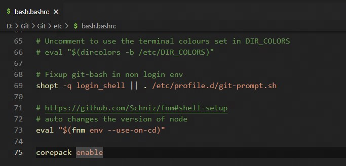

## nodejs

```bash
## node.js
### nodejs 的学习规划
1. 学习JavaScript，Node.js是基于JavaScript语言的，因此需要先学习 JS，掌握其基本语法、函数、面向对象编程等基础知识。
2. 学习Node.js基础知识，包括模块、事件机制、异步编程等。
3. 学习Node.js的核心模块，如fs、http、net等，掌握它们的使用方法和应用场景。
4. 学习Node.js框架，如Express、Koa等，了解它们的使用方法和特点，以及如何搭建Web应用程序。
5. 学习数据库操作，如MySQL、MongoDB等，学习如何使用Node.js连接数据库、进行增删改查等操作。
6. 学习前端技术，如HTML、CSS、React、Vue等，了解前后端分离的开发模式，以及如何使用Node.js搭建API服务。
7. 学习Node.js的高级特性，如流、Buffer、Cluster等，了解它们的使用方法和优化应用程序的技巧。
8. 实践项目，通过实践项目来巩固所学知识，如搭建一个博客、构建一个API服务等。


### nodejs 概念
- node.js是一个基于 Chrome V8 引擎的 JavaScript 运行环境：
	  - 不是库，是运行环境/JS语言解释器。底层源码是用C++开发的。
  	- Chrome V8引擎：引擎分为渲染引擎（渲染DOM）和脚本引擎(运行脚本语言)。脚本引擎最流行的是chrome中的V8引擎。
- node.js 的包管理是 npm，成为世界上最大的开源代码的生态系统。
- node.js 使用一个事件驱动、非阻塞I/O的模型，使其轻量又高效。
  	- 事件驱动：指在持续事务管理过程中，进行决策的一种策略，即跟随当前时间点上出现的事件，调动可用资源，执行相关任务，使不断出现的问题得以解决，防止事务堆积。
 	 	- I/O：在服务器上可理解为读写操作，非阻塞I/O(异步I/O)。nodejs是单线程语言，其在遇到I/O事件会创建一个线程去执行，然后主线程会继续往下执行。因此，触发一个I/O事件，紧接着继续执行别的动作，再触发一个I/O事件，两个动作并行执行，假如各需要 1s，那么总时间是1s。


### nodejs 组成
- nodejs 是由 ECMAScript 及 node 环境提供的一些附加API组成，包括文件、http、路径等API。
- 全局对象 global 的方法可在任何地方使用，global 可省略。
  - console.log()   //在控制台输出
  - setTimeout()   //设置超时定时器
  - clearTimeout()   /清除超时定时器
  - setInterval()   //设置间歇定时器
  - clearInterval()  //清除间歇定时器
- node 应用场景：自动化构件等工具、HTTP Proxy、网站应用开发、im即时聊天(socket、io)

```


## 安装 nodejs

```cmd
#下载cnpm	(i是英文install的缩写，-g代表全局安装，-D代表本地安装。全局安装意味着安装后在任何文件夹下都能使用，而本地安装则把东西安装到指定的文件夹，当然使用也只能在这个文件夹下使用)
npm i cnpm -g

#全局安装webpack（指定版本3.6.0，因为vue cli2依赖该版本）
npm install webpack@3.6.0 -g

#安装nrm（nrm有我们常用的镜像地址）
npm i nrm
#查看镜像地址
nrm ls
```

**npm安装报错**

```cmd
#去掉npm代理（权限问题记得加sudo）
npm config rm proxy
npm config rm https-proxy
#修改npm的资源镜像链接:
npm config set registry http://registry.npm.taobao.org
#查看是否修改成功
npm config get registry

```


### NPM

**概念**

- NPM是随同nodejs一起安装的包管理工具。常见使用场景：
  - 从NPM服务器下载别人编写的第三方包到本地；
  - 从NPM服务器下载并安装比人编写的命令行程序到本地；
  - 将自己编写的包或命令程序上传到NPM服务器。
- 在windows系统中，全局安装路径默认是用户node目录下的node_modules，非全局安装路径是命令运行所在路径下的node_modules下。

#### 使用npm

```bash
npm -v											#查看版本

npm install <name> -f			#强制安装
npm update <name>					#更新模块
npm uninstall <name>			#卸载模块


npm list									#查看安装的包
npm list | grep <包名> 		#查看安装的指定包的分支


npm view <包名>						#查看依赖包的所有的版本号


npm cache clean --force		#清除npm的缓存（防止上次安装断开导致此次无法正常安装）
```

#### package.json的使用

```bash
npm init -y									#初始化package.json文件，-y为默认生成
npm install <name> --save		#安装并写入package.json
npm install lodash --save-dev	#安装并写入package.json的dev环境上


npm i <name> -S #安装并写入package.json的生产环境("dependencies":{})中，即只有生产环境才使用的包
npm i <name> -D #安装并写入package.json的开发环境("devDependencies":{})中，即只有开发环境才使用的包
npm i --production				#安装package.json中指定环境的版本包(生产环境)
```

#### 更新本地安装依赖包的版本

**依赖包中的版本号`~、^、*`**

- **空表示patch；~表示minor； ^表示major ；*表示最新版本**
- `包名~2.0.0`：表示依赖包配置的版本号为2.0.0
- `包名^2.0.0`：表示依赖包配置的版本号最低要求为2.0.0
- `包名*`：表示依赖包配置版本号是最新的

```bash
$ npm info underscore
$ npm view underscore versions
$ npm install underscore@1.4.4 --save-dev
$ npm list | grep gulp

$ npm outdated 					#查看过期的包

$ npm list | grep gulp

$ npm update
```


#### npm install去哪获取模块？

- npm配置有仓库地址，install时都会从仓库地址中找模块。默认的仓库地址是：`https://registry.npmjs.org/`，可配置默本地默认的npm仓库下载地址：`npm config set registry http://ggjs-app-03.hnisi.com.cn:8090`

#### 淘宝NPM镜像

1. 使用淘宝镜像：`npm install -g cnpm --registry=http://registry.npm.taobao.org`
2. 安装模块：`cnpm install [name]`
3. 创建模块：nodejs模块就是发布到npm的代码块。
   1. 首先利用`npm init`命令创建package.json，这个过程中命令行会逐步提示你输入这个模块的信息，其中模块的名字和版本号是必填项。

#### 国内镜像（国内加速访问GitHub）

**Windows：**

```hosts文件
 //Hosts文件位于C:\Windows\System32\drivers\etc
//1、将下面的信息添加到Hosts文件中，保存
140.82.114.3		github.com
199.232.69.194	github.global.ssl.fastly.net
151.101.192.133 raw.githubusercontent.com
```

```cmd命令
//2、更新DNS缓存
ipconfig /flushdns
```

**Linux：**

```命令行
//1、编辑Hosts文件
vi /etc/hosts
```

```vi文本
 //2、按i进入编辑模式，插入如下文本
 140.82.114.3		github.com
199.232.69.194	github.global.ssl.fastly.net
151.101.192.133 raw.githubusercontent.com

//3、按Esc键退出编辑模式，输入:wq!保存退出。
//4、重启机器或者重启服务使Hosts生效
```

### Yarn

**概念**

- Yarm是一个由Facebook、Google、exponent和tilde构建的新的JavaScript包管理器。目标是解决npm所遇的问题：安装包不够快速和稳定；因npm允许包在安装时运行代码导致存在安全隐患。
- Yarm不能完全替代npm。Yarm仅仅是一个能够从npm仓库获取模块的新的CLI客户端。
- 特点：速度超快(yarm缓存每个下载过的包，再次使用无需重复下载)；安全(在执行代码前，yarm会通过算法校检每个安装包的完整性)；可靠(使用详细、简介的锁文件格式和明确的安装算法，Yarm能保证在不同系统上无差异工作)

### NVM

```bash
## NVM
在开发的工程中，我们可能需要经常切换node版本来应对不同的开发环境，所以需要经常使用不同版本的node


### 一、安装npm插件n ,通过n模块来管理node版本
1、全局安装n模块
npm instlal -g n
2、安装当前稳定版本
n stable或者sudo n stable
3、安装最新版本的
n latest或者sudo n latest
4、安装指定版本的node
n v8.16.0
5、卸载指定的node版本
n rm v8.16.0


### 二、使用nvm管理node版本
1、安装nvm
brew install nvm

2、使用nvm安装node版本
- 安装最新版本
	nvm isntall node

- 安装指定版本
	nvm install 8.16.0

3、查看所有版本
nvm ls

4、切换node版本
- 使用最新版本
	nvm use node
- 使用指定版本
nvm use 10.16.2

5. 案例
通常会使用第二种方式
例如：在一个项目中使用的是node@6.13.2,新项目使用的是node@8.16.0,
先要安装node@8.16.0：	nvm install 8.16.0，
然后，nvm use 8.16.0


### NVM 使用
nvm list	#查看所有安装版本
nvm use 12.13.1		#切换指定版本
nvm uninstall 12.13.1	#卸载指定版本
```

### NRM

- NRM(`npm registry manager`)是npm的镜像源管理工具，有时候国外资源太慢，使用这个就可以快速地在 npm 源间切换。

#### 手工切换源（镜像）

```bash
#1.查看当前源
npm config get registry

#2.切换淘宝源
npm config set registry https://registry.npm.taobao.org

#3.切换nrm  -->nrm use 源名

```

#### 管理源

```bash
#1.安装nrm
npm install -g nrm

#2.查看所拥有的源
#执行命令 nrm ls 查看可选的源。 其中，带*的是当前使用的源，上面的输出表明当前源是官方源。
nrm ls

#3.切换nrm  -->nrm use 源名
nrm use npm			#切换到https://registry.npmjs.org/
nrm use lesso		#切换到http://nexus.lesso.com/nexus/content/groups/npm/
nrm use taobao	#切换到 https://registry.npm.taobao.org/

#添加用户/账号
npm adduser

#测试源的响应时间
nrm test

```

### 对 npm package 进行发包

###### 1 编写模块

保存为index.js

```js
exports.sayHello = function(){
  return 'Hello World';
}
```

###### 2 初始化包描述文件

$ npm init package.json

```json
{
    "name": "gp19-npm",
    "version": "1.0.1",
    "description": "gp19 self module",
    "main": "index.js",
    "scripts": {
        "test": "make test"
    },
    "repository": {
        "type": "Git",
        "url": "git+https://github.com/lurongtao/gp19-npm.git"
    },
    "keywords": [
        "demo"
    ],
    "author": "Felixlu",
    "license": "ISC",
    "bugs": {
        "url": "https://github.com/lurongtao/gp19-npm/issues"
    },
    "homepage": "https://github.com/lurongtao/gp19-npm#readme",
}
```

###### 3 注册npm仓库账号

```
https://www.npmjs.com
felix_lurt/qq
$ npm adduser
```

###### 4 上传包

```
$ npm publish
```

坑：403 Forbidden

```bash
查看npm源：npm config get registry
切换npm源方法一：npm config set registry http://registry.npmjs.org
切换npm源方法二：nrm use npm
```

###### 5 安装包

```
$ npm install gp19-npm
```

###### 6 卸载包

```bash
# 查看当前项目引用了哪些包：
$ npm ls

# 卸载包：
$ npm unpublish --force
```

###### 7 使用引入包

```
var hello = require('gp19-npm')
hello.sayHello()
```

### npm安装git上发布的包

```bash
# 这样适合安装公司内部的git服务器上的项目
npm install git+https://git@github.com:lurongtao/gp-project.git

# 或者以ssh的方式
npm install git+ssh://git@github.com:lurongtao/gp-project.git
```

### npm脚本

- npm允许在package.json文件里面，使用`scripts`字段定义脚本命令。
- 如果npm脚本里面需要执行多个任务，就需要明确他们的执行顺序。
  - 如果是并行执行（即同时的平行执行），可以使用 `&` 符号。`npm run script1 & npm run script2`
  - 如果是继发执行（即只有前一个任务成功，才执行下一个任务），可以使用 `&&` 符号。`npm run script1 && npm run script2`

```json
"scripts": {
  "script1": "node script1.js",
  "script2": "node script2.js"
}
```

### npm变量

```bash
### npm 变量
- npm 脚本可以使用 npm 的内部变量。
- 通过 `npm_package_` 前缀， npm 脚本可以拿到 package.json 里面的字段。
	注意：一定要在 npm 脚本中运行才可以(如 `npm run view`)，直接在命令行中运行 JS 是拿不到值的(如 `node view.js`)。
- 通过环境变量 `process.env` 对象，拿到 `package.json` 的字段值。如果是 Bash 脚本，可以使用 `$npm_package_name` 和 `$npm_package_version` 取到这两个值。

```

**取值案例**

```json
// 以下为 pageage.json 文件内容

{
  "name": "foo",
  "version": "1.2.5",
  "scripts": {
    "view": "node view.js"
  }
}
```

```js
console.log(process.env.npm_package_name); // foo
console.log(process.env.npm_package_version); // 1.2.5
```

### NPX

- NPX(npm package extention)想要解决的主要问题是**调用项目内部安装的模块**。
- Node 自带 npm 模块，所以可以直接使用 npx 命令。万一不能用，就要手动安装一下`npm install -g npx`

#### 避免全局安装模块

除了调用项目内部模块，npx 还能避免全局安装的模块。比如，`create-react-app`这个模块是全局安装，npx 可以运行它，而且不进行全局安装。

> ```bash
> $ npx create-react-app my-react-app
> ```

上面代码运行时，npx 将`create-react-app`下载到一个临时目录，使用以后再删除。所以，以后再次执行上面的命令，会重新下载`create-react-app`。

下载全局模块时，npx 允许指定版本。

> ```bash
> $ npx uglify-js@3.1.0 main.js -o ./dist/main.js
> ```

上面代码指定使用 3.1.0 版本的`uglify-js`压缩脚本。

注意，只要 npx 后面的模块无法在本地发现，就会下载同名模块。比如，本地没有安装`http-server`模块，下面的命令会自动下载该模块，在当前目录启动一个 Web 服务。

> ```bash
> $ npx http-server
> ```

#### `--no-install` 参数和`--ignore-existing` 参数

如果想让 npx 强制使用本地模块，不下载远程模块，可以使用`--no-install`参数。如果本地不存在该模块，就会报错。

> ```bash
> $ npx --no-install http-server
> ```

反过来，如果忽略本地的同名模块，强制安装使用远程模块，可以使用`--ignore-existing`参数。比如，本地已经全局安装了`create-react-app`，但还是想使用远程模块，就用这个参数。

> ```bash
> $ npx --ignore-existing create-react-app my-react-app
> ```

#### 使用不同版本的 node

利用 npx 可以下载模块这个特点，可以指定某个版本的 Node 运行脚本。它的窍门就是使用 npm 的 node 模块。

> ```bash
> $ npx node@0.12.8 -v
> v0.12.8
> ```

上面命令会使用 0.12.8 版本的 Node 执行脚本。原理是从 npm 下载这个版本的 node，使用后再删掉。

某些场景下，这个方法用来切换 Node 版本，要比 nvm 那样的版本管理器方便一些。

#### `-p` 参数

`-p`参数用于指定 npx 所要安装的模块。

> ```bash
> $ npx -p node@0.12.8 node -v
> v0.12.8
> ```

上面命令先指定安装`node@0.12.8`，然后再执行`node -v`命令。

`-p`参数对于需要安装多个模块的场景很有用。

> ```bash
> $ npx -p lolcatjs -p cowsay [command]
> ```

#### -c 参数

如果 npx 安装多个模块，默认情况下，所执行的命令之中，只有第一个可执行项会使用 npx 安装的模块，后面的可执行项还是会交给 Shell 解释。

> ```bash
> $ npx -p lolcatjs -p cowsay 'cowsay hello | lolcatjs'
> # 报错
> ```

上面代码中，`cowsay hello | lolcatjs`执行时会报错，原因是第一项`cowsay`由 npx 解释，而第二项命令`localcatjs`由 Shell 解释，但是`lolcatjs`并没有全局安装，所以报错。

`-c`参数可以将所有命令都用 npx 解释。有了它，下面代码就可以正常执行了。

> ```bash
> $ npx -p lolcatjs -p cowsay -c 'cowsay hello | lolcatjs'
> ```

`-c`参数的另一个作用，是将环境变量带入所要执行的命令。举例来说，npm 提供当前项目的一些环境变量，可以用下面的命令查看。

> ```bash
> $ npm run env | grep npm_
> ```

`-c`参数可以把这些 npm 的环境变量带入 npx 命令。

> ```bash
> $ npx -c 'echo "$npm_package_name"'
> ```

上面代码会输出当前项目的项目名。

#### 执行 GitHub 源码

npx 还可以执行 GitHub 上面的模块源码。

> ```bash
> # 执行 Gist 代码
> $ npx https://gist.github.com/zkat/4bc19503fe9e9309e2bfaa2c58074d32
>
> # 执行仓库代码
> $ npx github:piuccio/cowsay hello
> ```

注意，远程代码必须是一个模块，即必须包含`package.json`和入口脚本。


### FNM

### FNM的安装

```powershell
### 安装 chocolatey
$ Set-ExecutionPolicy Bypass -Scope Process -Force; [System.Net.ServicePointManager]::SecurityProtocol = [System.Net.ServicePointManager]::SecurityProtocol -bor 3072; iex ((New-Object System.Net.WebClient).DownloadString('https://chocolatey.org/install.ps1'))


### 使用 cho 安装 FNM
$ choco install fnm


### 验证 FNM 安装
$ fnm --version


### 永久将 fm 添加到环境变量中
$ [System.Environment]::SetEnvironmentVariable("Path", $Env:Path + ";<fnm安装路径>", [System.EnvironmentVariableTarget]::User)

```

#### 在项目根目录中添加 .nvmrc 文件

````powershell
node --version
v14.18.3

node --version > .nvmrc

````

#### 更改 .bashrc

```bash
# https://github.com/Schniz/fnm#shell-setup
# auto changes the version of node
eval "$(fnm env --use-on-cd)"

corepack enable
```



#### windows下修改vscode默认终端为git bash

```bash
## 在vscode的settiongs.json中配置
"terminal.integrated.profiles.windows": {
  "PowerShell -NoProfile": {
  "source": "PowerShell",
  "args": ["-NoProfile"]
  },
  "Git-Bash": {
  "path": "D:\\Git\\bin\\bash.exe",
  "args": []
  }
},
"terminal.integrated.defaultProfile.windows": "Git-Bash"
```

配置fnm安装地址关联的环境变量

在 Powershell 中输入：`fnm env --use-on-cd | Out-String | Invoke-Expression`

## cross-env

```bash
## cross-env
- cross-env 是运行跨平台设置和使用环境变量的脚本。cross-env 使得可以使用单个命令而不必担心为平台正确设置或使用环境变量。

- 出现原因：当使用如 `NODE_ENV=production` 来设置环境变量时，大多数 Windows 命令提示符将会阻塞(报错)。（异常是Windows上的 Bash 是使用本机 Bash。即 Windows 不支持 `NODE_ENV=production` 的设置方式）

- 安装：`npm i --save-dev cross-env`

```

```bash
# 在Windows中
    #node中常用的到的环境变量是NODE_ENV，首先查看是否存在
    set NODE_ENV

    #如果不存在则添加环境变量
    set NODE_ENV=production

    #环境变量追加值 set 变量名=%变量名%;变量内容
    set path=%path%;C:\web;C:\Tools

    #某些时候需要删除环境变量
    set NODE_ENV=


# 在linux中配置
    #node中常用的到的环境变量是NODE_ENV，首先查看是否存在
    echo $NODE_ENV

    #如果不存在则添加环境变量
    export NODE_ENV=production

    #环境变量追加值
    export path=$path:/home/download:/usr/local/

    #某些时候需要删除环境变量
    unset NODE_ENV

    #某些时候需要显示所有的环境变量
    env
```

## 安装依赖问题

```bash
### ETIMEDOUT
问题：connect ETIMEDOUT 104.16.26.34:443

解决方案：
1. 清除缓存
$ npm config set proxy false

2. 如果报错，继续强制清除
$ npm cache clean --force

3. 重新执行安装步骤
$ npm i

```


## 模块化 CommonJS

```bash
## 模块化
- nodejs 是一种 javascript 的运行环境，能够使得 javascript 脱离浏览器运行。
- node 的加载机制：node 会把整个待加载的 js 文件放入一个包装 load 中执行。在执行整个 load 函数前Node 会调用 module 变量。
- 模块化的好处：防止命名冲突、高复用性、高维护性。


### CommonJS
CommonJS 是 NodeJS 使用的模块化规范。
CommonJS 规范规定：每个模块内部，module 变量代表当前模块。这个变量是一个对象，它的 exports 属性（即`module.exports`）是对外的接口对象。加载某个模块其实是加载该模块的 `module.exports` 对象。

在 CommonJS 中每个文件都可以当作一个模块：
  - 在服务端：模块的加载是运行时同步加载的。
  - 在客户端：模块需要提前编译打包处理。因为同步容易引起阻塞，且浏览器不认识 require 语法，因此需要提前编译打包。
- 不限node版本的情况下，如果不声明严格模式`'use strict';`，往往es6语法不支持启动。


### 模块暴露：exports 和 module.exports 的区别
- 模块暴露数据的方式有两种：
    1. module.exports = value
    2. exports.propName = value

- Node 中每个模块的最后都会执行 `return module.exports`。
- Node 中每个模块都会把 module.exports 指向的对象赋值给一个变量 exports，并且初始化为空对象`{}`。
		- 即存在隐式关系：`exports = module.exports = {}`。
		- 不能使用 `exports = value` 的形式暴露数据的原因：在通过 require 引入数据时，是引用 module.exports 里面的数据，`exports = value` 不能让 module.exports 里面的数据发生变化。
		- 能使用  `exports.propName = value` 的形式暴露数据的原因： 因为 module.exports 和 exports 通过隐式赋值关系来共用了同一个对象的内存空间，所以在 `exports.propName = value` 修改属性值时 module.exports 也会同时改变值。


### 引入模块的方式：require
- `const module1 = require('模块名')`
    - 内置模块：require 的是包名。
    - 下载的第三方模块：require 的是包名（会自动在 node_modules 中寻找相应的模块）
    - 自定义模块：require 的是文件路径。文件路径既可以用绝对路径，也可以用相对路径。后缀名 `.js` 可以省略。

- require() 函数的两个作用：
		- 执行导入的模块中的对象。
		- 返回导入模块中的接口对象。

- 导入自定义模块的流程
    1. 将相对路径转为绝对路径，定位目标文件。
    2. 缓存检测（查看之前是否加载过该目标文件，如果加载则取缓存的，无需再次加载）。
    3. 读取目标文件代码。
    4. 包裹成一个立即执行函数（可通过 `arguments.callee.toString()` 查看自执行函数）。
    5. 缓存模块的值。
    6. 返回 module.exports 的值。


### 自定义模块导入目录的加载规则
- 在目录中放置一个`package.json`文件，并且将入口文件写入`main`字段。
- 如果 require 传入的参数字符串是指向一个目录，则会首先检测该目录的`package.json`文件中 `main` 属性对应的文件，然后加载`main` 字段指定的入口文件。如果 main 属性不存在，或者不存在 package.json 文件，则会检测加载目录下的 `index.js` 和 `index.json` 文件，如果还是没找到，则会报错。


#### 模块的缓存
- 第一次加载某个模块时，Node会缓存该模块。以后再加载该模块，就直接从缓存取出该模块的`module.exports`属性。


### 清除模块缓存
- 所有缓存的模块保存在`require.cache`之中
- 注意，缓存是根据绝对路径识别模块的，如果同样的模块名，但是保存在不同的路径，`require`命令还是会重新加载该模块。

    // 删除指定模块的缓存
    delete require.cache[moduleName];

    // 删除所有模块的缓存
    Object.keys(require.cache).forEach((key) => {
      delete require.cache[key];
    })

```

### 导入模块原理

```js
/**
 * 模块导入 伪代码
 */
function require(file) {
    // 1. 将相对路径转化为绝对路径，定位目标文件
    const absolutePath = path.resolve(__dirname, file)

    // 2. 缓存检测（查看之前是否加载过该目标文件，如果加载则取缓存的，无需再次加载）
    const caches = {}
    if (caches[absolutePath]) {
        return caches[absolutePath]
    }

    // 3. 读取目标文件代码
    const code = fs.readFileSync(absolutePath).toString()

    const module = {}
    const exports = (module.exports = {})

    // 4. 包裹成一个立即执行函数
    ;(function (exports, require, module, __filename, __dirname) {
        var test = {
            name: "willy",
        }
        module.exports = test
        console.log(arguments.callee.toString())
    })(exports, require, module, __filename, __dirname)

    // 5. 缓存模块的值
    caches[absolutePath] = module.exports

    // 6. 返回 module.exports 的值
    return module.exports
}

const m1 = require("./tsconfig.json")
const m2 = require("./tsconfig.json") // 此时取缓存的，不会执行里面首次执行的内容

```


## 全局对象 global

```bash
## 全局对象 global


```

## 操作路径 path

```bash
## 操作路径：path
`const path = require(path)`

常用API
    - 拼接规范的绝对路径：`path.resolve`
    - 获取操作系统的路径分隔符：`path.sep`
    - 解析路径并返回对象：`path.parse`
    - 获取路径的基础名称：`path.basename`
    - 获取路径的目录名：`path.dirname`
    - 获取路径的扩展名：`path.extname`


### __dirname
`__dirname` 是 nodejs 中的一个全局变量，表示当前模块所在的目录的绝对路径。
例如，如果一个 Node.js 模块位于 `C:\Users\username\projects\myapp\index.js`，那么在该模块中访问 __dirname 变量的值为 `C:\Users\username\projects\myapp`。
__dirname 变量通常用于构建文件路径，比如读取文件、写入文件、加载模块等。使用 `__dirname` 变量可以确保路径的正确性，避免出现相对路径错误。
注意：`__dirname` 变量不是全局变量的一部分，而是每个模块独有的局部变量。因此在模块中使用 `__dirname` 变量时，不需要使用 `global` 对象或 `require()` 方法进行导入。


### 相对路径和绝对路径问题
- 相对路径参照物：命令执行的工作目录（即在不同目录下执行命令，则会把当前的工作目录下作为参照物，因而会导致路径的不稳定性（特别是会导致生成/读取文件所在目录））。
- 绝对路径'全局变量'保存的是：所在文件的所在目录的绝对路径。

- 会导致生成文件目录不确定性：`fs.writeFileSync('./index.html', 'love')`
- 稳定生成在该文件夹下：`fs.writeFileSync(__dirname + '/index.html', 'love')`


### 相对路径和绝对路径的转化
1. 绝对路径
- `https://www.baidu.com`：完整的url地址，直接跳转。
- `//jd.com`：会获取网站上的的协议名称拼接然后再跳转。如现在的网站是 `http://test.com`，则打开这个链接会拼接成 `http://jd.com`，但因为 jd 会对 `http://jd.com` 进行 301 重定向，所以导致页面上显示的是 `https://jd.com`。
- `/search`：会获取网站上的协议名称、域名、端口号跟这个路径进行拼接。如现在的网站是 `http://test.com`，则打开这个链接会拼接成 `http://test.com/search`。

2. 相对路径
会根据原来的网站来进行相应的回退和前进来拼接，当页面的url错误时，会以网站的初始地址为基准。如现在的网站是 `http://test.com/demo1/index.html`：
    - `./css/index.css`：跳转 `http://test.com/demo1/css/index.css`。
    - `js/index.js`：跳转 `http://test.com/demo1/js/index.js`。
    - `../img/logo.jpg`: 跳转 `http://test.com/img/logo.jpg`。
    - `../../img/logo.jpg`: 跳转 `http://test.com/img/logo.jpg`。

```

```js
const path = require('path')

/** path.resolve() */
const p1 = path.resolve(__dirname, './index.js')
const p2 = path.resolve(__dirname, 'index.js')
const p3 = path.resolve(__dirname, '/index.js') // 这会回到根目录下
console.log(p1, p2, p3)

/** sep 分隔符 */
console.log(path.sep)   // window下为 \，Linux下为 /

const pathStr = 'C:\\Users\\OP0213\\Desktop\\core\\index.js'

/** 文件分隔符：parse */
console.log(path.parse(pathStr))

/** 文件基础名称：basename */
console.log(path.basename(pathStr)) // index.js

/** 文件的所在目录名称：dirname */
console.log(path.dirname(pathStr)) // C:\Users\OP0213\Desktop\core

/** 路径的扩展名：extname */
console.log(path.extname(pathStr)) // .js

```

##  文件操作 fs

```bash
## 文件操作 fs
`const fs = require(fs)`


### 同步与异步的取舍
- 由于 Node 环境执行的JS代码一般作为服务端的代码运行，且其绝大部分需要在服务器运行期反复执行业务逻辑的代码，所以必须使用异步代码，否则，同步代码在执行时期，服务器将会因为同步错误而停止响应（因为JavaScript只有一个执行线程，产生同步错误会跳出异常并停止运行）。
- 服务器启动时，如果需要读取配置文件，或者结束时需要写入到状态文件时，可以使用同步代码，因为这些代码只在启动和结束时执行一次，不影响服务器正常运行时的异步执行。
```

### 文件读取

```bash
## 文件读取
标准读取文件，是采取异步的方式读取的。
同步读取的函数和异步函数相比，函数需要加`Sync`后缀，并且不接收回调函数，函数直接返回结果。
并且如果同步读取文件发生错误，需要用`try...catch`捕获错误。


### 文件读取方法
1. 异步读取：readFile
2. 同步读取：readFileSync
3. 流式读取：createReadStream


### 读取文件应用场景
- 电脑开机
- 程序运行
- 编辑器打开文件
- 查看图片、聊天记录
- 播放视频、音乐
- 上传文件
- 查看 Git 提交记录


### 异步读取 readFile
- `fs.readFile(path[, options], callback)`
```

```js
const fs = require('fs')

// 异步(标准)读取文件
fs.readFile('test.txt', 'utf-8', (err, data) => {
  if (err) {
    console.log(err)
    return
  }
  console.log(data)
})


// 同步读取文件
try {
  const data = fs.readFileSync('test.txt', 'utf-8')
  console.log(data)
} catch (err) {
  console.log(err)
}
```

### 文件写入

```bash
## 文件写入
将数据写入文件是通过`fs.writeFile()`函数实现；同步写文件则是`writeFileSync()`函数。
`writeFile()`的参数依次为文件名、数据和回调函数。如果传入的数据是String，默认按UTF-8编码写入文本文件，如果传入的参数是`Buffer`，则写入的是二进制文件。回调函数由于只关心成功与否，因此只需要一个`err`参数。


### 文件写入的方法
    1. 异步写入：writeFile
    2. 同步写入：writeFileSync
    3. 追加写入：appendFile、appendFileSync
    4. 流式写入：createWriteStram


### 写入文件的场景：（当需要持久化保存数据时，应该想到文件写入）
    - 下载文件
    - 安装软件
    - 保存程序日志，如 Git
    - 编辑器保存文件
    - 视频录制


### 追加内容：appendFile
- `fs.appendFile(file, data[, options], callback)`

fs.appendFile('example.txt', 'Hello, world!\n', (err) => {
  if (err) throw err;
  console.log('内容已追加到文件');
});


### 写入内容：writeFile
- 实现在文件内追加内容：fs.writeFile('/path', '追加的内容', { flag: 'a' })
- `fs.writeFile(file, data[, options], callback)`

fs.writeFile('example.txt', 'Hello, world!', (err) => {
  if (err) throw err;
  console.log('内容已写入文件');
});


### 流式写入：createWriteStream
注意：程序打开一个文件是需要消耗资源的，流失写入可以减少打开关闭文件的次数。
流式写入方式适用于大文件写入或者频繁写入的场景，writeFile 适用于写入频率较低的场景。
`fs.createWriteStream(path[, options])`

const ws = fs.createWriteStream('./willy.txt')
ws.write('昨日晴空万里\r\n')
ws.write('今天依旧晴朗，风和日丽\r\n')
```

```js
let fs = require('fs')

let data = 'Hello, Node.js'

fs.writeFile('test.txt', data, function (err) {
  if (err) {
    console.log(err)
  } else {
    console.log('ok.')
  }
})

fs.writeFileSync('test.txt', data)
```

### 文件信息状态 stat

```bash
## 文件信息资源状态 stat
`fs.stat()` 或 `fs.statSync()` 可以获取文件大小，创建时间等信息，它返回一个`Stat`对象，能告诉我们文件或目录的详细信息。

语法：
	- `fs.stat(path[, options], callback)`
	- `fs.statSync(path[, options])`

结果只对象结构：
    - 检测是否是文件 `isFile()`
    - 检测是否是目录 `isDirectory()`
    - 文件体积大小 `size`
    - 创建时间 `birthtime`
    - 最后修改时间 `mtime`
```

```js
'use strict'
const fs = require('fs')

fs.stat('./blog', function (err, stat) {
  if (err) {
    console.log("操作失败", err)
    return
  }
  // 是否是文件:
  console.log('isFile: ' + stat.isFile())
  // 是否是目录:
  console.log('isDirectory: ' + stat.isDirectory())
  if (stat.isFile()) {
    // 文件大小:
    console.log('size: ' + stat.size)
    // 创建时间, Date对象:
    console.log('birth time: ' + stat.birthtime)
    // 修改时间, Date对象:
    console.log('modified time: ' + stat.mtime)
  }
})
```

### stream 流

```bash
## stream 流
- stream 是 nodejs 提供的又一个仅在服务区端可用的模块，目的是支持 “流” 这种数据结构。
- 流的特点是数据有序的，而且必须依次读取，或者依次写入，不能像 Array 那样随机定位。（类似堆栈）

- 所有可以读取数据的流都继承自`stream.Readable`，所有可以写入的流都继承自`stream.Writable`。

- 流也是一个对象，存在三个响应流的事件：
    1. `data`事件表示流的数据已经读取；
    2. `end`事件表示这个流已经到末尾，没有数据可以读取了；
    3. `error`事件表示出错了。

- 注意：`data` 事件可能会有多次，每次传递的 `chunk` 是流的一部分数据。
```

```js
const fs = require("fs")

/** 创建读取流 */
const rs = fs.createReadStream("./package.json", "utf-8")

rs.on("open", () => {
    console.log("读取的文件已打开")
})
    .on("close", () => {
        console.log("读取流结束")
    })
    .on("error", (err) => {})
    .on("error", (err) => {
        console.log("ERROR: ", err)
    })
    .on("end", () => {
        console.log("END")
    })
    .on("data", (chunk) => {
        console.log("单批数据流入: ", chunk.length, chunk)
    })

```

```js
const fs = require("fs")

/** 创建写入流 */
const ws = fs.createWriteStream("./temp/test1.js", "utf-8")

ws.on("open", () => {
    console.log("文件打开")
})
ws.on("close", () => {
    console.log("文件写入完成，关闭")
})

//文件流式写入
ws.write("helloworld1!", (err) => {
    if (err) {
        console.log(err)
        return
    }
    console.log("内容1流入完成")
})
ws.write("helloworld2!", (err) => {
    if (err) {
        console.log(err)
        return
    }
    console.log("内容2流入完成")
})

ws.end(() => {
    console.log("文件写入关闭")
})

```

- 要以流的形式写入文件，只需要不断调用`write()`方法，最后以`end()`结束:

```js
const fs = require("fs")

const ws1 = fs.createWriteStream("./temp/test1.js", "utf-8")
ws1.write("使用Stream写入文本数据...\n")
ws1.write("END.")
ws1.end()

const ws2 = fs.createWriteStream("./temp/test2.js")
ws2.write(Buffer.from("使用Stream写入二进制数据...\n", "utf-8"))
ws2.write(Buffer.from("END.", "utf-8"))
ws2.end()

```


### pipe 读写流

```bash
## pipe 读写流
一个 Readable 流和一个 Writable 流串起来后，所有的数据自动从 Readable 流进入 Writable 流，这种操作叫 pipe。
通过 pipe() 把一个文件流和另一个文件流串联，这样源文件的所有数据就自动写入到目标文件中(实际是复制文件的过程)

默认情况下，当读取流的数据的`end`事件触发后，将自动关闭写入流。而限制写入流的自动关闭，则需要传入参数：`readable.pipe(writable, { end: false })`

```

```js
const fs = require("fs")

const rs = fs.createReadStream("test1.txt")
const ws = fs.createWriteStream("test2.txt")

rs.on("close", () => {
    console.log("读取流结束")
})

rs.pipe(ws, { end: false }) // 限制管理写入流

```

#### pipe原理

```js
const fs = require("fs")

//创建读取流
const rs = fs.createReadStream("video.mp4")
const ws = fs.createWriteStream("b.mp4")

rs.on("close", () => {
    ws.end()
    console.log("读取流结束")
})

//每一批数据流入完成
rs.on("data", (chunk) => {
    console.log("单批数据流入:" + chunk.length)
    ws.write(chunk, () => {
        console.log("单批输入流入完成")
    })
})

```


### 文件复制

```js
const fs = require('fs')
const process = require('process')

/** 方式一：readFile */
try {
  // 读取文件内容
  const data = fs.readFileSync('./package.json')
  // 写入文件
  fs.writeFileSync('./temp.json', data)
  console.log(process.memoryUsage()) // rss  71471104 -> 68.16015625
} catch (err) {
  console.log(err)
}


/** 方式二：流式操作 */
// 创建读取流对象
const rs = fs.createReadStream('./package.json')
// 创建写入流对象
const ws = fs.createWriteStream('./temp2.json')
// 绑定 data 事件
rs.on('data', chunk => {
  ws.write(chunk)
})
rs.on('end', () => {
  console.log(process.memoryUsage()) // rss  71561216 -> 68.24609375
})
```


### 文件重命名与移动

```js
const fs = require('fs')

/** 文件重命名 */
fs.rename('./temp/temp.json', './temp/temp1.json', (err) => {
  if (err) {
    console.log('操作失败~')
    return
  }
  console.log('操作成功')
})

/** 文件移动 */
fs.rename('./temp/temp2.json', './temp2.json', (err) => {
  if (err) {
    console.log('操作失败~')
    return
  }
  console.log('操作成功')
})
```


### 文件删除

```js
const fs = require('fs')

/** 调用 unlink 方法 或 unlinkSync */
fs.unlink('./temp/temp1.json', err => {
  if (err) {
    console.log('删除失败~')
    return
  }
  console.log('删除成功')
})


/** 调用 rm 方法 或 rmSync */
fs.rm('./temp/temp2.json', err => {
  if (err) {
    console.log('删除失败~')
    return
  }
  console.log('删除成功')
})
```


### 文件夹操作

```bash
## 文件夹操作
1. 创建文件夹：mkdir、mkdirSync
2. 读取文件夹：readdir、readdirSync
3. 删除文件夹：rmdir、rmdirSync


- `fs.mkdir(path[, options], callback)`
- `fs.mkdirSync(path[, options])`


- 注意：递归创建文件夹需要增加 recursive 参数，如：`fs.mkdir(path, { recursive: true })`
- 注意：`fs.rm()` 或 `fs.rmdir()` 只能删除空目录，如果目录中还有文件或子目录，则需要使用 `fs.readdir()` 方法遍历目录并递归删除其中的文件和子目录，直到目录为空，才能使用 `fs.rm()、fs.rmdir()` 方法删除目录。
```

```js
const fs = require('fs')

/** 回调函数封装 */
const callback = (typeValue, showData = false) => {
    return (err, data) => {
        if (err) {
            console.log(`${typeValue}失败~`)
            return
        }
        console.log(`${typeValue}成功`)
        showData && console.log(data)
    }
}

/** 创建 */
fs.mkdir('./temp', callback('创建'))

/** 递归创建 */
fs.mkdir('./temp/a/b/c', { recursive: true }, callback('创建'))

/** 读取文件夹  */
fs.readdir('./temp', callback('读取', true))

/** 删除文件夹 */
fs.rm('./temp', { recursive: true }, callback('删除'))

```


### 递归删除一个目录及其子目录和文件

```js
/** 递归删除一个目录及其子目录和文件 */
const path = require('path')
const fs = require('fs')

function deleteFolderRecursive(folderPath) {
  if (fs.existsSync(folderPath)) {
    fs.readdirSync(folderPath).forEach((file) => {
      const curFilePath = path.join(folderPath, file)
      if (fs.lstatSync(curFilePath).isDirectory()) {
        deleteFolderRecursive(curFilePath)
      } else {
        fs.unlinkSync(curFilePath)
      }
    });
    fs.rmdirSync(folderPath)
    console.log(`已删除目录：${folderPath}`)
  }
}

deleteFolderRecursive('temp')
```


### fs.extra


## URL接口

```bash
## URL 接口（代替内置模块 url）
浏览器原生提供 `URL()` 接口，它是一个构造函数，用来构造、解析和编码 URL。一般情况下，通过 `window.URL` 可拿到这个构造函数。


## URLSearchParams 对象(代替内置模块querystring使用)
URLSearchParams 对象是浏览器的原生对象，用来构造、解析和处理 URL 的查询字符串（即 URL 问号后面的部分）。
它本身也是一个构造函数，可以生成实例。参数可以为查询字符串，起首的问号?有没有都行，也可以是对应查询字符串的数组或对象。

  1. nodejs内置模块querystring有些方法要被废弃，我们使用URLSearchParams API 构造代替
  2. 如果你的nodejs版本大于18，可以使用 `const querystring= require('node:querystring')`。querystring比URLSearchParams性能更高，但不是 标准化的 API。使用URLSearchParams 当性能不重要或 当需要与浏览器代码兼容时。
  3. 还可以安装qs模块，使用方式和querystring一样


## qs 模块
qs是一个npm仓库所管理的包,可通过npm install qs命令进行安装。
qs.parse()将URL解析成对象的形式
qs.stringify()将对象 序列化成URL的形式，以&进行拼接
```

#### url 模块和 URL 接口的对比

```js
// url模块，url.parse('link')
const url = {
    protocol: "https:",
    slashes: true,
    auth: null,
    host: "m.shop.com",
    port: null,
    hostname: "m.shop.com",
    hash: "#detail",
    search: "?id=4433&name=%E6%9D%8E%E5%A4%87&directCompanyId=&mobile=18951431099",
    query: "id=4433&name=%E6%9D%8E%E5%A4%87&directCompanyId=&mobile=18951431099",
    pathname: "/home/share",
    path: "/home/share?id=4433&name=%E6%9D%8E%E5%A4%87&directCompanyId=&mobile=18951431099",
    href: "https://m.shop.com/home/share?id=4433&name=%E6%9D%8E%E5%A4%87&directCompanyId=&mobile=18951431099#detail",
}

// new URL()
const newURL = {
    href: "https://m.shop.com/home/share?id=4433&name=%E6%9D%8E%E5%A4%87&directCompanyId=&mobile=18951431099#detail",
    origin: "https://m.shop.com",
    protocol: "https:",
    username: "",
    password: "",
    host: "m.shop.com",
    hostname: "m.shop.com",
    port: "",
    pathname: "/home/share",
    search: "?id=4433&name=%E6%9D%8E%E5%A4%87&directCompanyId=&mobile=18951431099",
    // searchParams: URLSearchParams
    searchParams: {
        id: "4433",
        name: "李备",
        directCompanyId: "",
        mobile: "18951431099",
    },
    hash: "#detail",
}

```


## 资源压缩 zib

```bash
## 资源压缩 zlib
使用gizp：浏览器向服务端发起资源请求时，浏览器通过在 http 头部添加 `Accept-Encoding: gzip, deflate` 来告诉服务端可以用 gzip 或者 defalte 算法来压缩资源。如下载一个js文件，服务端会先对资源进行压缩再返回给浏览器，以此减少资源的大小，加快返回速度。

在 nodejs 中能对资源压缩的模块为 Alib 模块。


- 压缩文件：`zlib.createGzip()`
- 解压资源：`zlib.createGunzip()`
- 压缩字符串：`zlib.gzipSync('字符串')`
```

```js
const fs = require("fs")
const zlib = require("zlib")

const readStream = fs.createReadStream("./README.md")
const writeStream = fs.createWriteStream("./README.md")

/** 资源压缩 */
const gzip = zlib.createGzip()
readStream.pipe(gzip).pipe(writeStream)

/** 对字符串压缩 */
const str = "Hi, willysliang~"
const gzipStr = zlib.gzipSync(str)
console.log(gzipStr)

/** 资源解压 */
const gunzip = zlib.createGunzip()
readStream.pipe(gunzip).pipe(writeStream)

```

### 服务端gzip压缩

```js
const fs = require("fs")
const zlib = require("zlib")
const http = require("http")

/**
 * @title 服务端 gzip 压缩
 * @description 首先判断是否包含 accept-encoding 首部，且存在值为 gzip，是则返回 gzip 压缩后的文件，否则返回未压缩的文件
 */
const server = http.createServer((req, res) => {
    const filePath = "./README.md"
    const rs = fs.createReadStream(filePath)

    const acceptEncodeing = req.headers["accept-encoding"]

    // 判断是否需要 gzip 压缩
    if (acceptEncodeing && acceptEncodeing.indexOf("gzip") !== -1) {
        // 响应 Content-Encoding 告诉浏览器文件被 gzip 压缩过
        res.writeHeader(200, {
            "Content-Encoding": "gzip",
        })

        const gzip = zlib.createGzip()
        rs.pipe(gzip).pipe(res)

        // 对字符串进行 gzip 压缩
        const responseText = "Hi, willys~"
        res.end(zlib.gzipSync(responseText))
    } else {
        rs.pipe(res)
    }
})

server.listen(3000, () => {
    console.log("server start")
})

```


## 网络协议 http

```bash
## 网络协议 http

### 配置本地 host
1. 打开hosts文件。该文件通常位于以下位置：C:\Windows\System32\drivers\etc\hosts（对于Windows）或/etc/hosts（对于Mac和Linux）
2. 在hosts文件中添加条目，格式为“IP地址 域名”，例如 “127.0.0.1 willys.com”。
3. 保存 hosts 文件夹
4. 测试新的host配置是否生效。可以使用ping命令测试，例如“ping willys.com”。


### 设置状态代码、状态描述信息
- 设置响应头：res.writeHead()
- 设置状态码：res.statusCode = codeNumber
- 设置描述信息：res.statusMessage = 'message desc'


### 设置相应主体
1. response.write(chunk[, encoding][, callback])
		- chunk：响应主体的内容，可以是string，也可以是buffer。当为string时，encoding参数用来指明编码方式。（默认是utf8）
		- encoding：编码方式，默认是 utf8。
		- callback：当响应体 flushed 时触发的回调。

	注意：
		- 如果 res.write() 被调用时 res.writeHead() 还没被调用过，则会把 header flush 出去。
		- res.write() 可以被调用多次。
		- 当 res.write(chunk) 第一次被调用时，node 会将 header 信息以及 chunk 发送到客户端。第二次调用 res.write(chunk) ，node 会认为你是要发送 streaming data。


2. response.end([data][, encoding][, callback])
		- res.end() 用处是告诉 nodejs 此次请求到此结束。


### 超时处理
- response.setTimeout(msecs, callback)


### 事件 close/finish
- close：response.end() 被调用前连接就断开，此时会触发这个事件。
- finish：响应header、body都已经发送出去（交给操作系统，排队等候传输），但客户端是否实际收到数据为止。（这个事件后 res 上就不会再有其他事件触发）

```

### 服务器请求

```js
const http = require("node:http")

const server = http.createServer((request, response) => {
    // 获取请求的方法
    const { method } = request

    // 获取请求的 url 路径
    const { pathname } = new URL(request.url, "http://127.0.0.1")

    console.log(method, pathname)

    /** 响应状态码 */
    response.statusCode = 203
    response.statusMessage = "willysliang"
    /** 响应头 */
    response.setHeader("willy", ["L", "O", "V", "E"])

    /** 响应体设置 */
    response.write("I ")
    response.write("LOVE ")
    response.write("U! ")
    response.end("willysliang")

    /** 请求超时处理 */
    const timeout = 5000 // 设置超时时间为5秒
    request.setTimeout(timeout, () => {
        response.statusCode = 408 // 请求超时状态码
        response.end("Request Timeout") // 响应超时信息
    })
})

/** socket 连接超时处理 */
server.on("connection", (socket) => {
    // 如果连接超时，则socket会触发timeout事件，可以在该事件的回调函数中调用socket.destroy()方法来关闭连接
    socket.setTimeout(5000) // 设置超时时间为5秒
})

server.listen(80, () => {
    console.log("listener 80....")
})

```

### 加载完整项目

```js
/** bug: 对无效的路径请求无法响应（做不到是因为单页面应用的路由模块还没配置白名单） */

const http = require('node:http')
const fs = require('fs')
const path = require('node:path')

// 声明 MIME 资源变量
const mimes: Record<string, string> = {
    html: 'text/html;charset=utf-8;',
    css: 'text/css',
    js: 'text/javascript',
    png: 'image/png',
    jpg: 'image/jpeg',
    gif: 'image/gif',
    mp4: 'video/mp4',
    mp3: 'video/mpeg',
    json: 'application/json',
    other: 'application/octet-stream', // 其他文件类型(此会让浏览器对资源进行下载)
}

const server = http.createServer((request, response) => {
    let { pathname } = new URL(request.url, 'http://127.0.0.1')
    console.log('pathname==========', pathname)

    if (pathname === '/') {
        const html = fs.readFileSync(__dirname + '/dist/index.html')
        response.end(html)
    } else {
        const resourcePath = __dirname + pathname
        if (fs.existsSync(resourcePath)) {
            const resource = fs.readFileSync(resourcePath)

            // 获取文件的后缀名
            const ext = path.extname(pathname).slice(1)

            // 兼容在模块脚本需要在服务器响应中设置正确的 MIME 类型（例如，text/javascript 或 application/javascript），否则浏览器将无法正确解析脚本并报告这个错误
            // if (ext === 'js') response.setHeader('Content-Type', 'application/javascript')

            // 设置文件的 MIME 类型,如果文件的后缀没有匹配到,则设置为 'application/octet-stream' 类型
            response.setHeader('Content-Type', mimes[ext] || mimes['other'])

            response.end(resource)
        } else {
            // response.statusCode = 404
            // response.setHeader('Content-Type', 'text/html')
            // response.end('<h1>404 Not Found</h1>')
        }
    }
})

server.listen(80, () => {
    console.log('listener 80....')
})
```

### 优化版

```js
/** bug: 对无效的路径请求无法响应（做不到是因为单页面应用的路由模块还没配置白名单） */

const http = require('node:http')
const fs = require('fs')
const path = require('node:path')

/** 声明 MIME 资源变量 */
const mimes: Record<string, string> = {
    html: 'text/html;charset=utf-8;',
    css: 'text/css',
    js: 'text/javascript',
    png: 'image/png',
    jpg: 'image/jpeg',
    gif: 'image/gif',
    mp4: 'video/mp4',
    mp3: 'video/mpeg',
    json: 'application/json',
    other: 'application/octet-stream', // 其他文件类型(此会让浏览器对资源进行下载)
}

/** 错误处理 */
const errorResponse = (response, code) => {
    switch (code) {
        case 404:
            response.statusCode = 404
            response.end('<h1>404 Not Found</h1>')
            break
        case 403:
            response.statusCode = 403
            response.end('<h1>403 Forbidden</h1>')
            break
        case 405:
            response.statusCode = 405
            response.end('<h1>405 Method Not Allowed</h1>')
            break
        default:
            response.statusCode = 500
            response.end('<h1>500 Internet Server Error</h1>')
    }

    return response
}

const server = http.createServer((request, response) => {
    if (request.method !== 'GET') {
        response = errorResponse(response, 405)
        return;
    }

    let { pathname } = new URL(request.url, 'http://127.0.0.1')
    console.log('pathname==========', pathname)

    if (pathname === '/') {
        const html = fs.readFileSync(__dirname + '/dist/index.html')
        response.end(html)
    } else {
        const resourcePath = __dirname + pathname
        fs.readFile(resourcePath, (err, resourceData) => {
            if (err) {
                console.log('err=====', err)

                response.setHeader('Content-Type', mimes['html'])
                switch(err.code) {
                    case 'ENOENT':
                        response = errorResponse(response, 404)
                        break;
                    case 'EPERM':
                        response = errorResponse(response, 403)
                        break;
                    default:
                        response = errorResponse(response, err.code)
                }

                return
            }

            // 获取文件的后缀名
            const ext = path.extname(pathname).slice(1)

            // 兼容在模块脚本需要在服务器响应中设置正确的 MIME 类型（例如，text/javascript 或 application/javascript），否则浏览器将无法正确解析脚本并报告这个错误
            // if (ext === 'js') response.setHeader('Content-Type', 'application/javascript')

            // 设置文件的 MIME 类型,如果文件的后缀没有匹配到,则设置为 'application/octet-stream' 类型
            response.setHeader('Content-Type', mimes[ext] || mimes['other'])

            response.end(resourceData)
        })
    }
})

server.listen(80, () => {
    console.log('listener 80....')
})
```


## 网络服务 https

```bash
## 网络服务 https
https 与 http 模块用法相似。
```

### 生成证书

````bash
### 生成证书
1. 创建目录存放证书
$ mkdir cert
$ cd cert


2. 生成私钥
$ openssl genrsa -out willy-key.pem 2048


3. 生成证书签名请求（csr是 Certificate Signing Request）
openssl req -new \
  -sha256
  -key willy-key.key.pem \
  -out willy-csr.pem \
  -subj "/C=CN/ST=Guandong/L=Guangzhou/O=YH Inc/CN=www.willy.com"


4. 生成证书
openssl x509 \
  -req -in willy-csr.pem \
  -signkey willy-key.pem \
  -out willy-cert.pem


5. 本地测试（因为本地没有域名，所以先配置本地host）
127.0.0.1 www.willy.com

````

```js
// htts 服务端
const https = require("https")
const fs = require("fs")

const options = {
    key: fs.readFileSync("./cert/chyingp-key.pem"), // 私钥
    cert: fs.readFileSync("./cert/chyingp-cert.pem"), // 证书
}

const server = https.createServer(options, (req, res) => {
    res.end("这是来自HTTPS服务器的返回")
})

server.listen(3000)

```

## 数据加密 crypto

```bash
## 数据加密 crypto
crypto 模块的目的是为了提供通用的加密和哈希算法。

```

```js
const cryptos = require("crypto")

const algorithm = "aes-256-cbc" // 加密算法
const key = cryptos.randomBytes(32) // 根据加密算法生成一个32字节的密钥
const iv = cryptos.randomBytes(16) // 生成长度为 16 字节的随机数作为 iv

const data = "hello world" // 要加密的数据

/**
 * 创建加密器
 */
const cipher = cryptos.createCipheriv(algorithm, key, iv)

let encrypted = cipher.update(data, "utf8", "hex")
encrypted += cipher.final("hex")
console.log("encrypted:", encrypted) // encrypted: e221f586cf104b2d0d5d58166a8cfe69

/**
 * 创建解密器
 */
const decipher = cryptos.createDecipheriv(algorithm, key, iv)

let decrypted = decipher.update(encrypted, "hex", "utf8")
decrypted += decipher.final("utf8")
console.log("decrypted:", decrypted) // decrypted: hello world

```

### 计算摘要 hash

```bash
## 计算摘要 Hash
在 crypto 模块中，Hash 是一种用于计算数据摘要的算法，它可以将任意长度的数据映射为固定长度的哈希值。
哈希值通常用于验证数据完整性、数据签名和密码存储等场景。

注意：Hash 对象是单向的，即不能从哈希值中恢复原始数据。因此 Hash 算法通常用于验证数据完整性和密码存储等场景。
在密码场景中，通常将密码的哈希值存储在数据库中，而不是存储密码本身，以提高安全性。当用户登录时，将输入的密码进行哈希计算，然后将计算得到的哈希值与数据库中存储的哈希值进行比较，以验证密码是否正确。

在 crypto 模块中，可以使用 `const hash = crypto.createHash(algorithm)` 方法创建一个 Hash 对象。
`algorithm` 参数指定要使用的哈希算法，例如 "sha256"、"md5" 等。
可以使用 `crypto.getHashes()` 方法获取支持的哈希算法列表。


### hash 对象实例方法
1. 计算摘要：hash.digest([encoding])
		encoding 可以是 hex、latin1 或者 base64。
	如果声明了 encoding，那么返回字符串。否则，返回Buffer实例。
	注意：调用 hash.digest() 后，hash 对象就作废了，再次调用就会出错。


2. hash.update(data[, input_encoding])：
		input_encoding 可以是 utf8、ascii 或者 latin1。
	如果 data 是字符串，且没有指定 input_encoding，则默认是utf8。
	注意：hash.update() 方法可以调用多次。

```

```js
const cryptos = require("crypto")

// 创建了一个 SHA-256 的 Hash 对象
const algorithm = "sha256"
const hash = cryptos.createHash(algorithm)

// 使用 update() 方法将 data 字符串写入 Hash 对象中
const data = "Hi, willys"
hash.update(data)

// 使用 digest() 方法获取哈希值，以十六进制字符串的形式返回
const digest = hash.digest("hex")

console.log(digest) // 5412b888d0f63cc2269dab76826196fb5f37cd4253f081ff0fa9def0c3e4f1b4

```

### 消息认证 HMAC

```bash
## 消息认证 HMAC
HMAC（Hash-base Message Authentication Code）是一种基于哈希函数和密钥的消息认证算法，它可以用于验证消息的完整性和真实性。

在 crypto 模块中，可以使用 `crypto.createHmac(algorithm, key)` 方法创建一个 HMAC 对象。
	`algorithm` 参数指定要使用的哈希算法，例如 "sha256"、"md5" 等。
	key 参数指定用于计算 HMAC 的密钥。
	可以使用 `crypto.getHashes()` 方法获取支持的哈希算法列表。

```

```js
const cryptos = require("crypto")

// 创建了一个 SHA-256 的 Hash 对象
const algorithm = "sha256"
const key = "willy-key"
const hmac = cryptos.createHmac(algorithm, key)

// 使用 update() 方法将 data 字符串写入 Hash 对象中
const data = "Hi, willys"
hmac.update(data)

// 使用 digest() 方法获取哈希值，以十六进制字符串的形式返回
const digest = hmac.digest("hex")

console.log(digest) // ff21d18da8f432e60025a04db1eccdc39b1574edb5e5ae49d3ad8d1509335cfe

```

### 散列函数 md5

```bash
## 散列函数 md5
MD5（Message-Digest Algorithm）是计算机安全领域广泛使用的散列函数（又称哈希算法、摘要算法），主要用来确保消息的完整和一致性。


### 应用场景：
1. 文件完整性校验：如从网上下载一个软件，一般网站都会将软件的 md5 值附在网页上，用户下载完软件后，可对下载到本地的软件进行 md5 运算，然后跟网站上的 md5 值进行对比，确保下载的软件是完整的、正确的。
2. 密码保护：将 md5 加密后的密码保存到数据库，而不是保存明文密码，避免拖库等事件发生后导致明文密码外泄。
3. 防篡改：比如数字证书的防篡改，就用到摘要算法（还需要结合数字签名等手段）


### 特点：
1. 运算速度快
2. 输出长度固定：输入长度不固定，输出长度固定为 128 位。
3. 运算不可逆：已知运算结果的情况下，无法通过逆运算得到原始字符串。
4. 高度离散：输入的微小变化，可导致运算结果差异巨大。
5. 弱碰撞性：不同输入的散列值可能相同。


### 单纯 md5 加密的缺陷
因为相同的明文密码 md5 值也是相同的。即当攻击者知道算法是 md5 且数据库里存储的密码值时，理论上可以猜测出用户的明文密码。

事实上，彩虹表也是这么暴力破解的：事先将常见明文密码的 md5 值运算好存储起来，然后跟网站数据库里存储的密码进行匹配就能快速找到用户的明文密码。（此时可以使用 "密码加盐" 来进一步提升安全性）


### 密码加盐
密码加盐的原理：在密码特定位置插入特定字符串后，再对修改后的字符串进行 md5 运算加密。
例如同样的密码，当 "盐值" 不一样时 md5 值的差异非常大。通过密码加密，可以防止最初级的暴力破解。如果攻击者事先不知道 "盐值"，破解的难度就会非常大。
```

```js
const cryptos = require("crypto")

const cryptoPwd = (password) => {
    const md5 = cryptos.createHash("md5")
    return md5.update(password).digest("hex")
}

const password = "123456"
// 服务器端加密
console.log(cryptoPwd(password)) // e10adc3949ba59abbe56e057f20f883e

// 他人恶意暴力破解
console.log(cryptoPwd("123456")) // e10adc3949ba59abbe56e057f20f883e

```

### 盐值加密

```js
const cryptos = require("crypto")

/** 密码盐值加密 */
const cryptoPwd = (password, savedSalt = "") => {
    // 生成随机的盐值
    const salt = cryptos.randomBytes(16).toString("hex")

    // 对密码进行哈希处理（如果为用户注册时则使用随机生成的盐值，如果用户登录时则拿用户注册的盐值进行校验）
    const hash = cryptos
        .pbkdf2Sync(password, savedSalt || salt, 1000, 64, "sha512")
        .toString("hex")

    // 将盐值和哈希值保存到数据库中
    const savedPassword = {
        salt,
        hash,
    }

    return savedPassword
}

// 当用户注册时时，获取保存的盐值和哈希值
const password = "willy" // 假设用户输入的密码为 "password"
const savedPassword = cryptoPwd(password)
const savedSalt = savedPassword.salt
const savedHash = savedPassword.hash

// 对用户输入的密码进行哈希处理，并与保存的哈希值进行比较
const loginPassword = cryptoPwd("willy", savedSalt)
const loginHash = loginPassword.hash

if (loginHash === savedHash) {
    console.log("密码正确", loginHash)
} else {
    console.log("密码错误", loginHash, savedHash)
}

```


## Buffer 类

```bash
## Buffer 类
Buffer 是 Node.js 中用于处理二进制数据的类，它是 Node.js 在处理 TCP 流、文件系统操作、加密算法等方面的核心模块之一。
注意：Buffer对象在创建时需要指定其大小（以字节为单位），且创建后无法改变其大小。在使用Buffer时，需要注意内存泄漏和安全问题，避免出现缓冲区溢出等问题。


### Buffer 的作用：
1. 存储二进制数据：Buffer可以存储二进制数据，包括字节、位、16进制、ASCII等。
2. 处理网络流数据：Buffer可以用于处理网络流数据，如socket接收到的数据，可以将其转换为Buffer对象进行处理。
3. 处理文件系统操作：Buffer可以用于读取和写入文件系统中的二进制数据，如读取图片、音频、视频等文件。
4. 实现加密算法：Buffer可以用于实现加密算法，如MD5、SHA1等，以及对称加密算法、非对称加密算法等。
5. 处理数据传输：Buffer可以用于处理数据传输的编码和解码，如Base64编码、URL编码、JSON编码等。
6. 支持转换编码：Buffer可以将不同编码的数据进行转换，如将UTF-8编码的数据转换为GBK编码的数据。


### 计算机基本组成
内存：读写速度较快，断电丢失数据
硬盘：读写速度较慢，断电不丢失数据
线程：线程是一个进程的执行流


### 类方法：Buffer.from(buffer)
- Buffer.from()方法用于创建包含指定字符串，数组或缓冲区的新缓冲区。
- `Buffer.from( object, encoding )`
    - object：此参数可以包含字符串，缓冲区，数组或arrayBuffer。
    - encoding：如果对象是字符串，则用于指定其编码。它是可选参数。其默认值为utf8。


### buffer 与字符串的转换
- 转换为buffer：Buffer.from()
- 转换为字符串：Buffer.toString()
注意：一个 buffer 位只能存储最高二进制值为256的数值，超出256的数值会在转换为二进制后进行高位舍弃。

const buf1 = Buffer.from('hi, willy')
const buf2 = Buffer.from([105, 108, 111, 118, 101,121,111,117])
const str1 = buf2.toString() // iloveyou
console.log(buf1, buf2, str1)


```

## 事件机制模块 events

```bash
## 事件机制模块 events
nodejs 存在许多内置的事件，可通过引入 events 模块并通过实例化 EventEmitter 类来绑定和监听事件。


### EventEmmiter
EventEmitter 的每个事件由一个事件名和若干个参数组成，事件名是一个字符串，而对于每个事件，EventEmitter 支持若干个事件监听器。
当事件触发时，注册到这个事件的事件监听器被依次调用，事件参数作为回调函数参数传递。

```

```js
// 引入 events 模块
const EventEmitter = require("events")

// 创建 eventEmitter 对象
const events = new EventEmitter()

events.on("someEvent", function (arg1, arg2) {
    console.log("listener1", arg1, arg2)
})
events.on("someEvent", function (arg1, arg2) {
    console.log("listener2", arg1, arg2)
})

events.emit("someEvent", "arg1 参数", "arg2 参数")

/**
 * 输出
 * listener1 arg1 参数 arg2 参数
    listener2 arg1 参数 arg2 参数
 */

```

## 爬虫 puppeteer

```bash
## 爬虫 puppeteer

$ pnpm i puppeteer-core

```

```js
const puppeteer = require("puppeteer-core")

;(async () => {
    // 使用 puppeteer.launch 方法启动 Chrome 或 Chromium 浏览器
    const browser = await puppeteer.launch({
        executablePath:
            "C:\\Program Files\\Google\\Chrome\\Application\\chrome.exe",
        headless: false, // 关掉无界面模式 或 false（可视化）
        slowMo: 250, // 慢速度，slowMo选项以指定的毫秒减慢Puppeteer的操作
    })

    // 使用 browser.newPage 方法创建一个新页面
    const page = await browser.newPage()

    // 使用 page.goto 方法跳转到指定的网页：
    await page.goto("https://cc.163.com/")

    // 捕获console的输出,通过监听console事件
    page.on("console", (msg) => console.log("PAGE LOG:", ...msg.args))

    // 使用 page.evaluate(pageFunction, ...args) 执行 JavaScript 代码并获取结果
    const dimensions = await page.evaluate(() => {
        return {
            width: document.documentElement.clientWidth,
            height: document.documentElement.clientHeight,
            deviceScaleFactor: window.devicePixelRatio,
            title: document.title,
            href: location.href,
        }
    })
    console.log("Dimensions: ", dimensions)

    // 截屏
    await page.screenshot({ path: "willy.png" })

    // 打印页面成 pdf
    await page.pdf({ path: "willy.pdf", format: "A4" })

    // 使用 browser.close 方法关闭浏览器
    await browser.close()
})()

```

### 爬虫模拟登录

```ts
const puppeteer = require("puppeteer-core")
// import puppeteer from "puppeteer-core"
import type { Page, Browser } from "puppeteer-core"

const newPage = async (): Promise<{
    browser: Browser
    page: Page
}> => {
    const options = {
        executablePath:
            "C:\\Program Files\\Google\\Chrome\\Application\\chrome.exe",
        headless: false, // 关掉无界面模式 或 false（可视化）
        // slowMo: 250, // 慢速度，slowMo选项以指定的毫秒减慢Puppeteer的操作
        //设置视窗的宽高
        defaultViewport: {
            width: 1400,
            height: 800,
        },
        args: ["--window-size=1400,700"],
    }

    // 使用 puppeteer.launch 方法启动 Chrome 或 Chromium 浏览器
    const browser = await puppeteer.launch(options)

    // 使用 browser.newPage 方法创建一个新页面
    const page: Page = await browser.newPage()
    return {
        browser,
        page,
    }
}

const doPyt = async () => {
    const { page, browser } = await newPage()

    await page.goto("https://baidu.com")
    await page.type("#kw", "puppeteer", { delay: 100 })
    page.click("#su")
    await page.waitForSelector("#content_left")
    const targetLink = await page.evaluate(() => {
        const links = Array.prototype
            .concat(...document.querySelectorAll(".result a"))
            .filter((item) => {
                return item.innerText && item.innerText.includes("Puppeteer")
            })
        console.log(links)
        if (links.length > 0) {
            return links[0].href
        } else {
            // throw new Error("未找到相关链接")
            return "https://baidu.com"
        }
    })
    await page.goto(targetLink, { timeout: 60000 })
    await page.waitForSelector("#content_left")
    browser.close()
}
doPyt()

```


### 多元素处理

```ts
const puppeteer = require("puppeteer-core")
import type { Page, Browser } from "puppeteer-core"

const newPage = async (): Promise<{
    browser: Browser
    page: Page
}> => {
    const options = {
        executablePath:
            "C:\\Program Files\\Google\\Chrome\\Application\\chrome.exe",
        headless: false, // 关掉无界面模式 或 false（可视化）
        // slowMo: 250, // 慢速度，slowMo选项以指定的毫秒减慢Puppeteer的操作
        //设置视窗的宽高
        defaultViewport: {
            width: 1400,
            height: 800,
        },
        args: ["--window-size=1400,700"],
    }

    // 使用 puppeteer.launch 方法启动 Chrome 或 Chromium 浏览器
    const browser = await puppeteer.launch(options)

    // 使用 browser.newPage 方法创建一个新页面
    const page: Page = await browser.newPage()
    return {
        browser,
        page,
    }
}

const doPyt = async () => {
    const { page, browser } = await newPage()

    // 使用 page.goto 方法跳转到指定的网页：
    await page.goto("https://www.jd.com/")

    const input = await page.$("#key")

    if (input) {
        await input.type("手机")
        await page.keyboard.press("Enter")
        await page.waitForSelector(".gl-warp>.gl-item:last-child")

        // 获取到的对象进行 dom 操作，然后获取相应的内容
        const lis = await page.$$eval(".gl-warp>.gl-item", (els) =>
            els.map((item: any) => item.innerText)
        )
        console.log(lis)
    }

    // 使用 browser.close 方法关闭浏览器
    await browser.close()
}
doPyt()

```

### 输入文本与元素点击

```ts
const puppeteer = require("puppeteer-core")
import type { Page } from "puppeteer-core"

const newPage = async (): Promise<Page> => {
    const options = {
        executablePath:
            "C:\\Program Files\\Google\\Chrome\\Application\\chrome.exe",
        headless: false, // 关掉无界面模式 或 false（可视化）
        // slowMo: 250, // 慢速度，slowMo选项以指定的毫秒减慢Puppeteer的操作
        //设置视窗的宽高
        defaultViewport: {
            width: 1400,
            height: 800,
        },
        args: ["--window-size=1400,700"],
    }

    // 使用 puppeteer.launch 方法启动 Chrome 或 Chromium 浏览器
    const browser = await puppeteer.launch(options)

    // 使用 browser.newPage 方法创建一个新页面
    const page: Page = await browser.newPage()
    return page
}

const doPyt = async () => {
    const page = await newPage()

    await page.goto("https://www.baidu.com/")
    const input = await page.waitForSelector("#kw")
    if (input) {
        await input.type("hello world")
        const btn = await page.$("#su")
        btn && btn.click()

        /* 等待指定的选择器匹配的元素出现在页面中，如果调用此方法时已经有匹配的元素，
  那么此方法立即返回。如果指定的选择器在超时时间后扔不出现，此方法会报错。
  返回: <Promise<ElementHandle>>*/
        await page.waitForSelector(
            "div#content_left > div.result-op.c-container.xpath-log"
        )

        const text1 = await page.$eval(
            "div#content_left > div.result-op.c-container.xpath-log",
            (el) => el.innerText
        )
        console.log(text1)

        /** 使用 js 方法 */
        let text2 = await page.evaluate(() => {
            const div: any = document.querySelector(
                "div#content_left > div.result-op.c-container.xpath-log"
            )
            return div.innerText
        })
        console.log(text2)
    }
}
doPyt()

```


