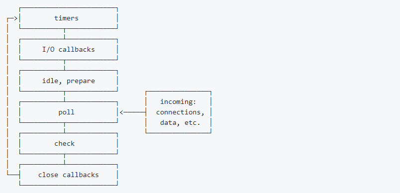

## NodeJS 进阶

### 原生路由

```ts
/** 
 * @file main.ts 入口文件
 */

// 启动服务
const server = require("./router/server")

// 路由模块
const route = require("./router/route")

// api
const apiRouter = require("./router/api")

server.use(route)
server.use(apiRouter)
server.start()
```

```js
/** 
 * @file server.ts 服务开关 
 */

const http = require("http")

/** 服务基础地址 */
const BASE_URL = "http://127.0.0.1"
/** 开启的服务端口号 */
const LISTEN_PORT = 3000

/** 创建一个大对象存储所有的路由和 api */
const route = {}

/** 暴露出去的函数：用于合并路由和 api */
const use = (routeObj) => {
    Object.assign(route, routeObj)
}

/** 开启服务 */
const start = () => {
    http.createServer(async (req, res) => {
        const url = new URL(req.url, BASE_URL)
        // 使所有匹配不到的路径走404网页
        routeMap[url.pathname || "/404"](res)
    }).listen(LISTEN_PORT, () => {
        console.log(`${BASE_URL}:${LISTEN_PORT}启动成功~`)
    })
}

module.exports = { use, start }
```

```ts
/**
 * @file utils.ts 工具类
 */

/** 接口调用中转处理 */
const render = (res, path, type = '', code = 200) => {
  res.writeHead(code, {
    'Content-Type': `${type || 'text/html'};charset=utf8`,
  })
  res.write(fs.readFileSync(path), 'utf-8')
  res.end()
}

module.exports = { render }
```

```ts
/**
 * @file route.ts 路由表
 */

const fs = require('fs')
const path = require('path')
// 根据文件后缀名自动获取响应头中content-type
const mime = require('mime')
const { render: routeRender } = require('./utils')

/** 路由表 */
const routes = {
  '/login'(req, res) {
    routeRender(res, './static/login.html')
  },
  '/home'(req, res) {
    routeRender(res, './static/home.html')
  },
  '/404'(req, res) {
    const url = new URL(req.url, 'http://127.0.0.1')
    /*
      <link href='/css/index.css'></link>根路径访问，就等于127.0.0.1:3000/css/index.css。
    	这里将项目文件夹F://项目+static+/css/index.css合并成文件路径，如果存在就读取该文件返回
    */
    const pathname = path.join(__dirname, 'static', url.pathname)
    if (fs.readStaticFile(res, pathname)) return
    routeRender(res, './static/404.html')
  },
}

module.exports = routes
```

```ts
/**
 * @file api.ts 接口
 */

const { render: apiRender } = require('./utils')

const api = {
  // get请求
  '/api/login'(req, res) {
    const url = new URL(req.url, 'http://127.0.0.1')
    const data = {}
    const username = url.searchParams.get('username')
    const password = url.searchParams.get('password')
    if (username === 'ds' && password === '123') {
      Object.assign(data, { ok: 1 })
    } else {
      Object.assign(data, { ok: 0 })
    }
    apiRender(res, JSON.stringify(data))
  },

  // post请求
  '/api/loginpost'(req, res) {
    let data: any = ''
    // 这里使用最原始的方法获取post请求参数, 通过req的data事件监听函数，每当接受到请求体的数据，就累加到post变量中
    req.on('data', (chunk) => {
      data += chunk
    })
    // 在end事件触发后，通过querystring.parse将post解析为真正的POST请求格式，然后向客户端返回。
    req.on('end', () => {
      data = JSON.parse(data)
      if (data.username === 'ds' && data.password === '123') {
        apiRender(res, JSON.stringify({ ok: 1 }))
      } else {
        apiRender(res, JSON.stringify({ ok: 0 }))
      }
    })
  },
}

module.exports = api
```

```ts
/**
 * @file demo.ts 客户端发起请求
 */

const username = 'willys'
const password = 123456

// get请求
fetch(`/api/login?username=${username}&password=${password}`)
  .then((res) => res.text())
  .then((res) => {
    console.log(res)
  })

// post请求
fetch(`/api/loginpost`, {
  method: 'POST',
  body: JSON.stringify({ username, password }),
  headers: {
    'Content-Type': 'application/json',
  },
})
  .then((res) => res.text())
  .then((res) => {
    console.log(res)
  })
```


### 中间件

```bash
中间件（Middleware）是一种软件模式，用于将不同的软件系统或组件连接起来，使其能够相互通信和交互。它最大的特点是一个中间件处理完可以再传递给下一个中间件。

App 实例再运行过程中，会调用一系列的中间件。每个中间件可以从 APP 实例中接收三个参数，依次为request对象（访问请求对象）、response对象（响应对象），next回调函数（代表 web 应用处于请求-响应循环流程中的下一个中间件）。每个中间件都可以对访问请求对象（request对象）进行加工，并且决定是否调用 next 方法将 request 对象再传给下一个中间件。


### 中间件的功能
1. 控制请求流程：可以通过调用 next 函数来将控制权传递给下一个中间件或路由处理程序，从而控制请求流程。
		注意：如果当前中间件没有终结 请求-响应 循环，则必须调用 next() 方法将控制权交给下一个中间件，否则请求就会挂起。
2. 处理请求：中间件可以拦截请求，在请求到达应用之前对其进行处理。例如，中间件可以验证请求参数、加装请求信息等。
3. 处理响应：可以在应用程序处理请求之后对请求响应 response 进行处理。例如，中间件可以设置响应信息、压缩响应体、处理错误等。
4. 执行共享逻辑：可以执行一些通用逻辑，这些逻辑可以在多个路由处理程序中共享。例如身份验证、请求日志记录、性能监控等。
5. 处理错误：可以捕获和处理应用程序中的错误。例如未处理的异常、HTTP 错误响应等。
```

````js
/** 不做任何操作，只传递 request 对象的中间件 */
const uselessMiddleware = (req, res, next) => {
    next()
}

/** 抛出异常的中间件（后面的中间件将不再执行，直到发现一个错误处理函数为止） */
const uselessMiddlewareError = (req, res, next) => {
    next("出错啦~")
}
````


### 洋葱模型

```bash
洋葱模型是 Koa 框架中常用的一种中间件处理方式，它的核心思想是将请求和响应的处理过程看作是一层层的中间件函数，每个中间件函数都可以对请求和响应进行处理，并将处理结果传递给下一个中间件，最终得到最终的响应结果。

洋葱模型执行示意图：
请求 -> 中间件1(前置处理) -> 中间件2(前置处理) -> 中间件3(前置处理) -> 业务处理 -> 中间件3(后置处理) -> 中间件2(后置处理) -> 中间件1(后置处理) -> 最终结果的响应。


在洋葱模型中，请求从外层开始，依次经过每个中间件函数的前置处理，然后进入业务处理结果，最后依次经过每个中间件函数的后置处理，最终得到响应结果。
```

```ts
/**
 * @file Koa.ts 实现 Koa 的洋葱模型
 */
class Koa {
  middlewares: Array<any> = []

  /** 执行动作 */
  private action = (instance, ctx) => {
    // 记录索引
    let index = 1

    const next = () => {
      // 记录执行的中间件函数
      const nextMiddleware = instance.middlewares[index]

      // 递归执行
      if (nextMiddleware) {
        index++
        nextMiddleware(ctx, next)
      }
    }

    // 从第一个开始执行
    instance.middlewares[0](ctx, next)
  }

  /** 添加中间件函数 */
  use(fn) {
    this.middlewares.push(fn)
  }

  /** 监听接口并启动服务 */
  public listen(port) {
    Promise.resolve({}).then((ctx) => {
      this.action(this, ctx)
    })
  }
}
```

```js
// const Koa = require("koa")
const Koa = require('./Koa')
const koa = new Koa()

koa.use(async (ctx, next) => {
    console.log(1)
    console.log(ctx) // {}
    await next()
    console.log(ctx) // { name: 'willy', age: 25 }
    console.log(2)
})

koa.use(async (ctx, next) => {
    console.log(3)
    ctx.name = "willy"
    await next()
    console.log(4)
})

koa.use(async (ctx, next) => {
    console.log(5)
    ctx.age = 25
})

koa.listen(3000)

/**
 * 执行结果为：
    1
    {}
    3
    5
    4
    { name: 'willy', age: 25 }
    2
 */
```


### 事件循环

```bash
#### Node 的事件循环
Node 事件循环是一种用于处理异步操作的机制。在 nodejs 中，大部分 I/O 操作（如文件读取、网络请求等）都是异步的，事件循环使得 nodejs 能够在等待这些异步操作完成的同时，继续处理其他任务，从而提高应用程序的效率和性能。
- 事件队列（Event Queue）：存储各种异步事件的回调函数。当一个异步操作完成时，其对应的回调函数就会被添加到事件队列中。
		- 例如，当一个文件读取操作完成后，读取文件的回调函数就会进入事件队列。
- 事件循环（Event Loop）：是一个不断循环的过程，负责从事件队列中取出回调函数并执行。这个循环会持续运行，直到程序结束。
		- 在进程启动时，Node 会创建一个类似于 `while(true)` 的循环，每执行一次循环体（tick）都会查看事件队列中是否有相应事件待处理，如果有则依次执行队列中所有事件，直到执行完毕，然后进入下一个循环。


#### 事件循环存在的阶段
1. 定时器阶段（Timers）：主要执行 setTimeout 和 setInterval 的 callback。
2. I/O回调阶段（I/O Callbacks）：处理几乎所有的异步 I/O 操作的回调函数。
		- 文件请求、TCP请求的 callback，即是除了 close 事件的 callbacks、被 timers(定时器：setTimeout、setInterval等)设定的 callbacks、setImmediate 设定的 callbacks 之外的 callbacks
3. 闲置阶段（Idle、Prepare）：node内部使用
4. 轮询阶段（Poll）：获取新的 I/O 事件，适当的条件下node将阻塞在这里
		- 主要用于处理新的 I/O 事件和执行于 I/O 相关的回调函数。如果没有定时器到期并且没有其他高优先级的任务，事件循环会在这个阶段阻塞，等待 I/O 事件的发生。
		- 如，当使用 `fs.readFile()` 读取文件时，在这个阶段会检查文件读取是否完成，如果完成就执行相应的回调函数。
		- 同时这个阶段也可用于处理一些其他的异步操作，如某些网络请求的回调。
5. 检查阶段（Check）：执行setImmediate设定的callbacks
6. 关闭事件阶段（Close Callbacks）：比如 `socket.on('close',callback)` 设置的callback会在这个阶段执行


#### poll 阶段
poll 阶段是衔接整个 EventLoop 各个阶段比较重要的阶段。这个阶段，除 timer、close、setImmediate 之外的所有异步方法完成时，都会将 callback 加到 poll queue 里并立即执行。
两个主要的功能：
	1. 执行 poll queue 的 callback
	2. 当 timer 设置的事件到达时，循环到 timer 阶段执行对应的 callback

1. 如果事件循环到 poll 阶段，且代码未设置 timer
	- 如果 poll queue 不为空，将同步执行 queue 中的 callback，直到 queue 为空，或执行 callback 达到系统上限。
	- poll queue 清空或者进来就为空，将会判断代码有没有被 setImmediate 设置 callback，如果有则进入 check 阶段执行 check 阶段的 queue，如果没有设定 setImmediate callback，event loop 将阻塞在这个阶段等待 callback 加入 poll queue。
2. 如果事件循环到 poll 阶段，且代码设置 timer
	- 清空 poll queue 进入空闲状态后，event loop 将检查 timers，如果有一个或多个 timers 时间已经到达，event loop 将按循环顺序进入 timer 阶段，并执行 timer queue。
	- Process.nextTick() 不属于任何阶段，而是在各个阶段切换的中间执行。


#### 观察者
判断是否有事件需要处理的过程就是询问观察者的过程，每个事件循环都会有一个或者多个观察者。
事件循环是一个典型的生产者消费者模型，异步I/O，定时器，网络请求这些都是事件的生产者，执行完成后，这些事件都会被传递到对应的观察者那里，事件循环则从观察者中取出事件进行处理。
观察者存在优先级，即事件循环会按照观察者的优先级顺序去找相应观察者寻找事件，也就是上述所说的事件循环的六个阶段。
```



```js
console.log('开始');

process.nextTick(() => {
  console.log('process.nextTick');
});

setTimeout(() => {
  console.log('定时器1');
}, 0);

setImmediate(() => {
  console.log('setImmediate 1');
});

fs.readFile('test.txt', (err, data) => {
  console.log('文件读取完成');
  
  setTimeout(() => {
    console.log('定时器2');
  }, 0);
  
  setImmediate(() => {
    console.log('setImmediate 2');
  });
});

console.log('结束');

/*
开始
结束
process.nextTick
文件读取完成
定时器1
setImmediate 1
定时器2
setImmediate 2
*/
```

```bash
- 代码会按照从上到下的顺序依次执行，首先执行 `console.log('开始');`，所以会输出 `开始`。
- 接着遇到 `process.nextTick(() => { console.log('process.nextTick'); });`，它会把对应的回调函数添加到当前执行栈的尾部，意味着当前代码块执行完后就会立即执行这个回调函数。
- 然后遇到`setTimeout(() => { console.log('定时器1'); }, 0);`，定时器回调函数被添加到定时器阶段的队列中。接着遇到`setImmediate(() => { console.log('setImmediate 1'); });`，其回调函数被添加到检查阶段的队列中。
- 执行`fs.readFile('test.txt', (err, data) => {... });`发起文件读取操作，然后输出`结束`。此时，由于文件读取是异步操作，程序不会等待读取完成，事件循环继续。
- 当文件读取完成后，文件读取的回调函数被添加到I/O回调阶段的队列中。当事件循环进入I/O回调阶段时，执行文件读取的回调函数，输出`文件读取完成`。
- 在文件读取回调函数中，又遇到两个异步操作：`setTimeout(() => { console.log('定时器2'); }, 0);`和`setImmediate(() => { console.log('setImmediate 2'); });`。它们的回调函数分别被添加到定时器阶段和检查阶段的队列中。
- 接下来事件循环进入定时器阶段，执行之前添加的`定时器1`的回调函数，输出`定时器1`。然后进入检查阶段，执行`setImmediate 1`的回调函数，输出`setImmediate 1`。
- 随着事件循环的继续，当再次进入定时器阶段时，执行`定时器2`的回调函数，输出`定时器2`。进入检查阶段时，执行`setImmediate 2`的回调函数，输出`setImmediate 2`。
```


### 底层如何实现 IO

```bash
### NodeJS中的异步I/O模型
主要分为4个核心：
  * 事件循环
  * 观察者
  * 请求对象
  * I/O线程池


## 不同环境的实现方式不同
1. 在Windows下，基于IOCP。
2. 在Linux中，是基于多线程。epoll
```


## Express

```bash
## Express 中间件
可以为请求处理提供多个回调函数，其行为类似中间件。唯一的区别是这些回调函数有可能调用 next('route') 方法而略过其他路由回调函数。可以利用该机制为路由定义前提条件，如果在现有路径上继续执行没有意义，则可将控制权交给剩下的路径。


### lowdb
`lowdb` 是一种轻量级的本地JSON数据库，可以用于读取、写入、更新和删除JSON数据，还支持链式操作。
它的作用是在Node.js和浏览器中提供一种简单的方法来创建和管理本地数据库，这些数据库通常用于小型应用程序和原型开发。
安装：$ npm i lowdb
```

### all方法和http动词方法

```js
const express = require("express")
const http = require("http")
const app = express()

/** 使用中间件来加装请求内容、以及对响应进行拦截 */
app.all("*", (req, res, next) => {
    res.writeHead(200, { "Content-Type": "text/plain" })
    next()
})

app.get("/", (req, res) => {
    res.end("Welcome to the homepage!")
})

app.get("/about", (req, res) => {
    res.end("Welcome to the about page!")
})

// 携带参数的请求
app.get("/hello/:who", (req, res) => {
    res.end("Hello, " + req.params.who + ".")
})

/** 进行兜底处理 */
app.get("*", (req, res) => {
    res.end("404!")
})

http.createServer(app).listen(300)
```

### 路径匹配

```js
const express = require("express")
const http = require("http")
const app = express()

/**
 * 字符串模式路径
 */
// 匹配 acd 和 abcd
app.get("/ab?cd", function (req, res) {
    res.send("ab?cd")
})

// 匹配 abcd、abbcd、abbbcd等
app.get("/ab+cd", function (req, res) {
    res.send("ab+cd")
})

// 匹配 abcd、abxcd、abRABDOMcd、ab123cd等
app.get("/ab*cd", function (req, res) {
    res.send("ab*cd")
})

// 匹配 /abe 和 /abcde
app.get("/ab(cd)?e", function (req, res) {
    res.send("ab(cd)?e")
})

/**
 * 正则表达式路径
 */
// 匹配任何路径中含有 a 的路径：
app.get(/a/, function (req, res) {
    res.send("/a/")
})

// 匹配以 fly 结尾的路径，如匹配 butterfly、dragonfly，不匹配 butterflyman、dragonfly man等
app.get(/.*fly$/, function (req, res) {
    res.send("/.*fly$/")
})

http.createServer(app).listen(300)
```

### 多回调处理

```js
/** 多回调函数 */
app.get(
    "/example/b",
    (req, res, next) => {
        console.log("response will be sent by the next function ...")
        next()
    },
    (req, res) => {
        res.send("Hello from B!")
    }
)

/** 回调函数数组 */
const cb0 = (req, res, next) => {
    console.log("CB0")
    next()
}
const cb1 = (req, res, next) => {
    console.log("CB1")
    next()
}
const cb2 = (req, res) => {
    res.send("Hello from C!")
}
app.get("/example/c", [cb0, cb1, cb2])
```

### request对象

```bash
### request 对象
1. 原生操作
	- request.method
	- request.url
	- request.httpVersion
	- request.headers

2. express 内置
	- request.path
	- request.query
	- request.ip		获取 IP 地址

	- request.get('请求头中某个属性名') 	获取请求头
```

### response 对象

```bash
res.end()	结束响应过程。
res.json()	发送JSON响应。
res.jsonp()	发送带有JSONP支持的JSON响应。
res.set('属性名', '属性值') 设置的响应头。
res.send()	发送各种类型的响应。
res.sendStatus()	设置响应状态代码，并将其字符串表示形式发送为响应正文。

res.download('需要被下载文件的所在路径')	提示要下载的文件。
res.redirect()	重定向请求（允许网址的重定向）。
res.sendFile()	将文件作为八位字节流发送（用于发送文件）。
		- 注意：除非指定 `root` 选项，否则路径必须是绝对路径
res.render()	渲染视图模板（用于渲染网页模板）。
```

```js
/** response.redirect */
response.redirect("/hello/anime")
response.redirect("http://wwww.willy.com")
response.redirect(301, "http://www.example.com")


/** response.render */
app.get("/", (request, response) => {
    response.render("index", { message: "Hello World!" })
})

/** response.sendFile */
app.get('/404', (req, res) => {
  res.sendFile('index.html', { root: __dirname })
})
app.get('500', (_, response) => {
  response.sendFile("/path/to/willy.mp4")
})
```

### CORS 配置

```js
const express = require('express')
const cors = require('cors')
const app = express()

// 全局默认不启用
app.use(cors({ origin: false }))

// 为特定路由启用
app.get(
  '/public-api',
  cors({
    origin: 'https://trusted-domain.com',
  }),
  (req, res) => {
    res.json({ data: '受保护数据' })
  },
)

// 允许所有来源的跨域请求
app.use(cors())

// 或者配置选项
app.use(
  cors({
    origin: '*', // 允许所有源（生产环境慎用）
    methods: 'GET,POST', // 允许的 HTTP 方法
    allowedHeaders: 'Content-Type,Authorization', // 允许的请求头
  }),
)

// 生产环境推荐配置
app.use(
  cors({
    methods: 'GET,POST,PUT,DELETE',
    allowedHeaders: ['Content-Type', 'Authorization', 'X-Custom-Header'],
    exposedHeaders: ['Content-Range', 'X-Items-Count'],
    credentials: true, // 允许发送 cookies
    maxAge: 86400, // 预检请求缓存时间（秒）
    optionsSuccessStatus: 200, // 兼容旧浏览器
    // origin: ['https://your-domain.com', 'https://cdn.your-domain.com'],
    origin: (origin, callback) => {
      const whitelist = new Set([
        'https://your-domain.com',
        'https://cdn.your-domain.com',
        'http://localhost:3000',
      ])
      if (whitelist.has(origin) || !origin) {
        callback(null, true)
      } else {
        callback(new Error('未允许的跨域请求'))
      }
    },
  }),
)

app.get('/api', (req, res) => {
  res.json({ message: 'CORS 已启用' })
})

app.listen(3000)
```


### Express 中间件

```bash
Express 应用可使用如下几种中间件：
	- 应用级中间件
	- 路由级中间件
	- 错误处理中间件

使用可选则挂载路径，可在应用级别或路由级别装载中间件。此外还可以同时装在一系列中间件函数，从而在一个挂载点上创建一个子中间件栈。


### 应用级中间件
应用级中间件绑定到 app 对象 使用 app.use() 和 app.method()。
其中， method 是需要处理的 HTTP 请求的方法，例如 GET, PUT, POST 等等，全部小写。


### 静态资源中间件
express.static 是 Express 唯一内置的中间件。它基于 serve-static，负责在 Express 应用中提托管静态资源。每个应用可有多个静态目录。
将静态资源文件所在的目录作为参数传递给 express.static 中间件就可以提供静态资源文件的访问了。
如果希望所有通过 express.static 访问的文件都存放在一个“虚拟（virtual）”目录（即目录根本不存在）下面，可以通过为静态资源目录指定一个挂载路径的方式来实现。
    1. index.html 文件为默认打开的资源。
    2. 如果静态资源与路由规则同时匹配，谁先匹配成功就响应。
    3. 路由一般响应动态资源，静态资源中间件响应静态资源。


### 路由级中间件
路由级中间件和应用级中间件一样，只是它绑定的对象为 express.Router()。
使用 express.Router 该类创建模块化的，可安装的路由处理程序。一个 Router 实例是一个完整的中间件和路由系统。
可将路由器创建为模块，在其中加载中间件功能，定义一些路由，并将路由器模块安装在主应用程序的路径上。


### 错误处理中间件
错误处理中间件和其他中间件定义类似，只是要使用 4 个参数，而不是 3 个，其签名如下： (err, req, res, next)。
    //上面的中间件都没有匹配就会走这里
    app.use(function(err, req, res, next) {
      console.error(err.stack)
         //send的状态码默认是200
      res.status(500).send('error')
    })
```

```js
const express = require("express")
const app = express()
const http = require("http")

const indexRouter = require("./route/indexRouter")
const LoginRouter = require("./route/LoginRouter")

/** token 信息验证 */
const tokenMiddleware = (req, res, next) => {
    // 验证用户 token 和 cookie 是否过期
    const authHeader = req.headers["authorization"]
    const isValid = !!authHeader
    if (isValid) {
        next()
    } else {
        res.send("token error")
    }
}

/** 防盗链监控（非自己所控制的域名进行请求则不响应请求） */
const refererMiddleware = (req, res, next) => {
    // 获取 referer（第一次请求可能不存在 referer）
    const referer = req.get("referer")
    if (referer) {
        // 实例化
        const url = new URL(referer)
        const hostname = url.hostname

        // 检测请求头中的 referer 是否为 127.0.0.1
        if (hostname !== "127.0.0.1") {
            res.status(404).send("<h1>404 Not Found</h1>")
            return
        }
    }
    next()
}

/** 验证码信息验证（路由级中间件） */
const checkCodeMiddleware = (req, res, next) => {
    if (req.query.code === "521") {
        next()
    } else {
        res.send("验证码错误")
    }
}

//应用级别(后面的路由都会执行此中间件)
app.use(tokenMiddleware, refererMiddleware)

/** 静态资源中间件设置 */
app.use(express.static(__dirname + "/public"))
app.use("/static", express.static(__dirname + "/public"))

//应用级别(这里不写路径默认/)
//这些use方法是每次访问都是从上往下执行
//如果是/login/a,会先找到/login开头的这个应用级中间件
//然后再进入这个中间件找/a
app.use(indexRouter)
app.use("/login", checkCodeMiddleware, LoginRouter)

http.createServer(app).listen(3000)
```

## 模板引擎 ejs

```bash
## Express 服务端渲染
1. 安装 Express 脚手架：
$ cnpm i -g express-generator

2. 使用 ejs 模板引擎创建应用：
$ express --view=ejs myapp
```

#### ejs 标签含义

```bash
<% '脚本' 标签，用于流程控制，无输出。
<%_ 删除其前面的空格符
<%= 输出数据到模板（输出是转义 HTML 标签）
<%- 输出非转义的数据到模板
<%# 注释标签，不执行、不输出内容
<%% 输出字符串 '<%'
%> 一般结束标签
-%> 删除紧随其后的换行符
_%> 将结束标签后面的空格符删除
```

```ejs
<header>
  我是公共样式
  <div>
    <% if(isShowSchool) {%>
    <h1>校园招聘</h1>
    <% } %>
  </div>
</header>


<%- include("./header.ejs",{ isShowSchool:true }) %> index <%# 我的注释 %>
```

#### ejs 列表渲染

```js
const ejs = require("ejs")

const arr = ["a", "b", "c", "d"]

const result = ejs.render(
    `<ul>
    <% arr.forEach(item => { %>
    <li><%= item %></li>
    <% }) %>
</ul>`,
    { arr }
)

console.log(result)

/*
<!-- 输出 result 转化为以下内容 -->
<ul>
    <li>a</li>
    <li>b</li>
    <li>c</li>
    <li>d</li>
</ul> */
```

#### ejs 条件渲染

```js
const ejs = require("ejs")

const isLogin = false

const result = ejs.render(
    `
    <% if (isLogin) { %>
        <span>欢迎回来</span>
    <% } else { %>
        <button>登录</button>
    <% } %>
    `,
    { isLogin }
)

console.log(result)

/*
<!-- 输出 result 转化为以下内容 -->
<button>登录</button>
*/
```

#### express 中使用 ejs

```js
const express = require("express")
const path = require("path")

// 创建应用对象
const app = express()

// 设置模板引擎
app.set("view engine", "ejs")

// 设置模板文件存放位置（模板文件：指具有模板语法内容的文件）
app.set("views", path.resolve(__dirname, "./views"))

// 创建路由
app.get("/home", (req, res) => {
    const title = "Hi, willy~"
    // 会识别 /views/home.ejs 的内容
    res.render("home", { title })
})

app.listen(80, () => {
    console.log("server is running at port 5000")
})
```

```ejs
<!-- 文件路径 views/home.ejs -->
<!DOCTYPE html>
<html lang="en">
<head>
    <meta charset="UTF-8">
    <title><%= title %></title>
</head>
<body>
    <p><%= title %></p>
</body>
</html>
```


## mongoDB 数据库

```bash
Mongoose 是一个对象文档模型（ODM）库，它对 Node 原生 的 MongoDB 模块做了进一步封装，并提供了更多功能。在大多数情况下，它被用来把结构化的模式应用到一个MongoDB集合，并提供了验证和类型转换等好处。

mongoose 中的对象：
	- Schema 模式对象（Schema 对象定义约束了数据库中的文档结构）
	- Model 模型对象（Model 对象作为集合中的所有文档的表示，相当于 MongoDB 数据库中的集合 collection）
	- Document 文档对象（Document 表示集合中的具体文档，相当于集合中的一个具体的文档）


[下载地址](https://www.mongodb.com/try/download/community)
[官方文档](https://docs.mongoing.com/install-mongodb)

mongoose 的好处
	1. 可以为文档创建一个模式结构（Schema）
	2. 可以对模型中的对象/文档进行验证
	3. 数据可以通过类型转换来转换成对象模型
	4. 可使用中间件来与应用业务逻辑挂钩

安装：$ npm i -S mongoose


### 字段类型
- 字符串：String
- 数字：Number
- 布尔值：Boolean
- 数组：Array
- 日期：Date
- Buffer对象：Buffer
- Mixed：任意类型，需使用 mongoose.Schema.Types.Mixed 指定
- ObjectId：对象ID，需使用 mongoose.Schema.Types.ObjectId 指定
- Decimal128：高精度数字，需使用 mongoose.Schema.Types.Decimal128 指定


### 方法
mongoose.model(modelName, schemaObj, collection, skipInit, connection)
  - modelName（字符串）：模型的名称。
  - schemaObj（Schema对象）：用于定义模型结构的Mongoose Schema对象。
  - collection（字符串，可选）：可选的集合名称，如果未提供，则Mongoose将使用模型名称的小写版本。
  - skipInit（布尔值，可选）：如果为true，则不会自动初始化模型，否则会自动初始化。默认为false。
  - connection（Mongoose连接对象，可选）：可选的连接对象，用于指定用于模型的数据库连接。如果未提供，则将使用默认连接。
```


### 连接 MongoDB

```ts
/**
 * db.connect.js
 * @param {*} success 数据库连接成功回调
 * @param {*} error 数据连接失败回调
 */
module.exports = function (success = null, error = null) {
    const mongoose = require("mongoose")

    /** 连接 mongoose 数据库 */
    mongoose.connect("mongodb://127.0.0.1:27017/test", {
        useNewUrlParser: true,
        useUnifiedTopology: true,
    })

    /** 监听 mongoose 数据库连接的状态 */
    mongoose.connection.on("open", async () => {
        if (success) return success()
        console.log("数据库连接成功~")
    })
    mongoose.connection.on("close", () => {
        console.log("数据库连接已经断开~")
    })
    mongoose.connection.on("error", (err) => {
        if (error) return error()
        console.log("连接错误", err)
    })

    // 断开数据库连接
    // mongoose.disconnect()
}
```


### 删除数据库

在 MongoDB 中，您可以通过切换到该数据库并运行 `db.dropDatabase()` 方法或 `dropDatabase` 命令来删除数据库。

#### `db.dropDatabase()` 方法

```bash
## 首先，检查一下我们的数据库列表
$ show databases
# or
$ show dbs
# local  0.000GB
# user   0.000GB
# test   0.005GB


## 切换到 `user` 数据库，使用 `db.dropDatabase()` 方法删除当前数据库。
$ use user
$ db.dropDatabase()
# { "dropped" : "user", "ok" : 1 }


## 再次查看数据库列表
$ show databases
# local  0.000GB
# test   0.005GB
```

#### `dropDatabase` 命令

也可以使用 `dropDatabase` 命令来做同样的事情。

```bash
$ use test
$ db.runCommand( { dropDatabase: 1 } )
# { "dropped" : "test", "ok" : 1 }


$ show databases
# local  0.000GB
```


### 删除集合

在 MongoDB 中，可以使用 `db.collection.drop()` 方法从数据库中删除集合。如果集合存在，它将返回 `true`，如果它不存在，它将返回 `false`。

```shell
## 查看数据库有哪些集合
$ show collections
# users
# articles
# subscribes


## 删除 `articles` 集合
$ db.article.drop()
# true


## 再次查看数据库现在拥有哪些集合
$ show collections
# users
# subscribes


## 尝试删除不存在的集合
$ db.articles.drop()
# false
```


### 字段定义及约束 Schema

```bash
### 模型的配置对象 Schema 和 SchemaType
在 mongoose 中，Schema 是模型的配置对象。Schema 不允许您从 MongoDB 读写，这就是模型的用途。

Schema 的作用
	- 定义保存在 MongoDB 中的文档可以具有哪些属性
	- 定义自定义验证(validation)
  - 声明(virtuals)
  - 声明 getter 和 setter
  - 定义静态(statics)和方法(methods)


`SchemaType` 类只是一个基类。有几个类继承自 `SchemaType`，代表不同的核心 Mongoose 类型：
    - `mongoose.Schema.Types.String`
    - `mongoose.Schema.Types.Number`
    - `mongoose.Schema.Types.Date`
    - `mongoose.Schema.Types.Buffer`
    - `mongoose.Schema.Types.Boolean`
    - `mongoose.Schema.Types.Mixed`
    - `mongoose.Schema.Types.ObjectId`（或等效的 `mongoose.ObjectId`）
    - `mongoose.Schema.Types.Array`
    - `mongoose.Schema.Types.Decimal128`
    - `mongoose.Schema.Types.Map`


### 文档字段约束
- require：Boolean，数据是否必填。
- default: any，设置默认值，如果给字段设置值时则取该设定的默认值。
- min/max：最小/大值（仅适用于数字）
- match：正则匹配（仅适用于字符串）
- enum: 枚举匹配（只适用于字符串）
- validate：自定义匹配。validate 是一个函数，函数的参数代表当前字段，返回 true 表示通过验证，返回 false 表示未通过验证。

```

````js
const mongoose = require("mongoose")
mongoose.connect("mongodb://localhost:27017/student")

const schema = new mongoose.Schema({
    name: {
        type: String,
        required: true,
        match: /01/, //将name的match设置为必须存在'01'字符。如果name不存在'01'，文档将不被保存
    },
    age: {
        type: Number,
        min: 10,
        max: 18,
        default: 14,
    },
    gender: {
        type: String,
        enum: ["male", "female"],
    },
    desc: {
        type: String,
        validate: (arg) => arg.length < 20,
    },
  	money: Number,
})

// 判断原始类型
schema.path('name') instanceof mongoose.SchemaType // true
schema.path('name') instanceof mongoose.Schema.Types.String // true
schema.path('age') instanceof mongoose.SchemaType // true
schema.path('age') instanceof mongoose.Schema.Types.Number // true

// 设置值
schema.path('money').default(25)
schema.path('money').validate((v) => v >= 21)

// 创建实例
const stuModel = mongoose.model("students", schema)
new stuModel({ name: "01willy", age: 12, gender: "male", desc: "" }).save(
    (err, doc) => {
        if (err) {
            console.log(err)
            return
        }
        console.log(doc)
    }
)

````

#### ObjectIds

```bash
默认情况下，MongoDB 在 ObjectID 类型的每个文档上创建一个 _id 属性作为唯一的自增值。
MongoDB `ObjectIds` 通常使用 24 个十六进制字符串表示，如 `5d6ede6a0ba62570afcedd3a`。Mongoose 根据模式路径将 `ObjectIds` 强制转换 24 个字符字符串。
Mongoose 还可以将其他的值转换为 `ObjectId`。因为 `ObjectId` 是 12 个任意字节。所以任何 12 字节的缓冲区或 12 个字符的字符串都是有效的 `ObjectId`。

`ObjectId` 对创建它们的本地时间进行编码。这意味着可以从文档的 `_id` 中提取文档创建的时间。


#### ObjectIds 作为自增值的原因
mongooseDB 使用 ObjectIds 设置自增值的原因
虽然在单个进程中递增计数器很简单实现，但是如果存在多个进程(如分片/集群)，当每个进程都需要能够递增计数器，此时无论何时插入文档，都需要递增分布式计数器。此时如果两个进程之间存在显著的网络延迟，则可能导致性能不可靠；如果一个进程停机，则可能导致不可预测的结果。
因为 ObjectId 冲突的可能性很小，因此 MongoDB 可以分配 ID，这些 ID 在没有进程间通信的分布式系统中可能是唯一的。

```

```js
const schema = mongoose.Schema({ testId: mongoose.ObjectId })
const Model = mongoose.model('Test', schema)


// testId 是一个 ObjectId，Mongoose 根据您的模式自动将 24 个十六进制字符字符串转换为 ObjectId。
let doc = new Model({ testId: '313263686172313263686172' })
doc.testId instanceof mongoose.Types.ObjectId // true

// 获取时间
doc.testId.getTimestamp() // 1996-02-27T01:50:32.000Z
doc.testId.getTimestamp() instanceof Date // true


// 任何 12 个字符的字符串都是有效的 ObjectId，因为 ObjectId 的唯一定义特性是它们有 12 个字节。
doc = new Model({ testId: '12char12char' })
doc.testId instanceof mongoose.Types.ObjectId // true
doc.testId // '313263686172313263686172'


// 类似地，Mongoose 将自动将长度为 12 的缓冲区转换为 ObjectID。
doc = new Model({ testId: Buffer.from('12char12char') })
doc.testId instanceof mongoose.Types.ObjectId // true
doc.testId // 313263686172313263686172

```


#### 数组

##### 基元数组（基础数组）

Mongoose 的 `Array` 类使用额外的 Mongoose 功能扩展了普通的 JavaScript 数组。

例如，假设有一个带有 `tags` 数组的 `BlogPost` 模型骨架，当创建一个新 `BlogPost` 文档时，`tags` 属性是普通 JavaScript 数组类的一个实例。但它也有一些特殊的性质。

```js
const blogPostSchema = new mongoose.Schema(
  {
    title: String,
    tags: [String]
  },
  { versionKey: false }
)
const BlogPost = mongoose.model('BlogPost', blogPostSchema)

const doc = new BlogPost({
  title: 'Intro to JavaScript',
  tags: ['programming']
})

Array.isArray(doc.tags) // true
doc.tags.isMongooseArray // true
```

例如，Mongoose 截取 `push()` 对 `tags` 数组的调用，当你 `save()` 文档时，它足够聪明地使用 `$push` 更新文档。

```js
mongoose.set('debug', true)

doc.tags.push('web development')
// 由于 debug 模式，将打印:
// Mongoose: blogposts.updateOne({ _id: ObjectId(...) }, { '$push': { tags: { '$each': [ 'web development' ] } } }, { session: null })
await doc.save()
```

##### 文档数组（数组对象）

`tags` 示例是一个基元数组。Mongoose 还支持子文档数组。

下面是如何定义 `members` 数组的方法，每个数组都有 `firstName` 和 `lastName` 属性。`doc.members` 是一个普通 JavaScript 数组的实例，因此它具有所有常用函数，例如 `slice()` 和 `filter()`。但它也有一些特定于 Mongoose 的功能。

```js
const groupSchema = new mongoose.Schema({
  name: String,
  members: [{ firstName: String, lastName: String }]
})
const Group = mongoose.model('Group', groupSchema)

const doc = new Group({
  title: 'Jedi Order',
  members: [{ firstName: 'Luke', lastName: 'Skywalker' }]
})

Array.isArray(doc.members) // true
doc.members.isMongooseArray // true
doc.members.isMongooseDocumentArray // true
```

例如，如果您设置第 0 个成员的 `firstName`，Mongoose 将在调用 `save()` 时将其转换为 `member.0.firstName` 上的集合。

```js
const groupSchema = Schema(
  {
    name: String,
    members: [{ firstName: String, lastName: String }]
  },
  { versionKey: false }
)
const Group = mongoose.model('Group', groupSchema)

const doc = new Group({
  title: 'Jedi Order',
  members: [{ firstName: 'Luke', lastName: 'Skywalker' }]
})
await doc.save()

mongoose.set('debug', true)

doc.members[0].firstName = 'Anakin'
// Mongoose: groups.updateOne({ _id: ObjectId("...") }, { '$set': { 'members.0.firstName': 'Anakin' } }, { session: null })
await doc.save()
```

##### 设置数组索引时的注意事项

Mongoose 在直接设置数组索引方面存在一个已知问题。例如，如果您设置了 `doc.tags[0]`，Mongoose 更改跟踪将不会获取该更改。

```js
const blogPostSchema = Schema(
  {
    title: String,
    tags: [String]
  },
  { versionKey: false }
)
const BlogPost = mongoose.model('BlogPost', blogPostSchema)

const doc = new BlogPost({
  title: 'Intro to JavaScript',
  tags: ['programming']
})
await doc.save()

// 此更改不会在数据库中结束！
doc.tags[0] = 'JavaScript'
await doc.save()

const fromDb = await BlogPost.findOne({ _id: doc._id })
console.log(fromDb.tags) // ['programming']
```

为了解决这个问题，需要使用 [`markModified()`方法](https://mongoosejs.com/docs/api/document.html#document_Document-markModified)或在数组元素上显式调用 [`MongooseArray.set()`](https://mongoosejs.com/docs/api/array.html#mongoosearray_MongooseArray-set) 来通知 Mongoose 的更改跟踪。

```js
// 这种改变是有效的。set() 是 Mongoose 数组上触发更改跟踪的一种特殊方法。
doc.tags.set(0, 'JavaScript')
await doc.save()

const fromDb = await BlogPost.findOne({ _id: doc._id })
console.log(fromDb.tags) // ['JavaScript']
```


#### 时间戳（timestamps）

启用 `Schema` 的 `timestamps` 选项时，Mongoose 会将 `createdAt` 和 `updatedAt` 属性添加到模型中。默认情况下，`createdAt` 和 `updatedAt` 的类型为 `Date`。更新文档时，Mongoose 会自动增加 `updatedAt`。

```js
const userSchema = mongoose.Schema(
  {
    name: String
  },
  {
    timestamps: true
  }
)

const User = mongoose.model('User', userSchema)
const doc = await User.create({ name: 'O.O' })

doc.createdAt // 2021-08-20T22:36:59.414Z
doc.updatedAt // 2021-08-20T22:36:59.414Z

doc.createdAt instanceof Date // true

doc.name = 'D.O'
await doc.save()

doc.createdAt // 2021-08-20T22:36:59.414Z
doc.updatedAt // 2021-08-20T22:37:09.071Z
```

特定的 mongoose 模型写入操作允许跳过 `timestamps`，前提是在 `Schema` 中设置了时间戳。为此，必须将 `timestamps` 设置为 `false`，并且该操作不会更新时间。

```js
const userSchema = mongoose.Schema(
  {
    name: String
  },
  {
    timestamps: true
  }
)

const User = mongoose.model('User', userSchema)

const doc = await User.findOneAndUpdate(
  {
    email: 'O.O'
  },
  {
    email: 'D.O'
  },
  {
    new: true,
    upsert: true,
    timestamps: false
  }
)
```

如果希望仅阻止其中一个更新，我们应该创建具有键值对的对象，而不是将 `timestamps` 设置为 `false` 作为值。根据需求，我们只需要根据需求将 `createdAt` 或 `updatedAt` 设置为 `true` 或 `false`。

```js
const userSchema = mongoose.Schema(
  {
    name: String
  },
  {
    timestamps: true
  }
)

const User = mongoose.model('User', userSchema)

const doc = await User.findOneAndUpdate(
  {
    name: 'O.O'
  },
  {
    name: 'D.O'
  },
  {
    new: true,
    upsert: true,
    timestamps: {
      createdAt: false,
      updatedAt: true
    }
  }
)
```

##### 备用属性名

默认情况下，Mongoose 使用 `createdAt` 和 `updatedAt` 作为时间戳的属性名。但你可以让 Mongoose 使用任何你喜欢的属性名。例如可以让 Mongoose 使用 `created_at` 和 `updated_at` 替代：

```js
const userSchema = mongoose.Schema(
  {
    name: String
  },
  {
    timestamps: {
      createdAt: 'created_at',
      updatedAt: 'updated_at'
    }
  }
)
const User = mongoose.model('User', userSchema)

const doc = await User.create({
  name: 'O.O'
})
doc.updated_at // 2021-08-20T22:40:06.667Z
```

##### 使用 UNIX 时间戳

Mongoose `Schema` 支持 `timestamps.currentTime` 选项，该选项允许您传递用于获取当前时间的自定义函数，可以让 Mongoose 将时间戳存储为自 1970 年 1 月 1 日以来的秒数。

```js
const userSchema = mongoose.Schema(
  {
    name: String
  },
  {
    // 让 Mongoose 使用 UNIX 时间（自1970年1月1日起的秒数）
    timestamps: {
      currentTime: () => Math.floor(Date.now() / 1000)
    }
  }
)
```


#### 唯一索引（unique）

Mongoose 的唯一索引 `unique` 选项都作用是，对于给定的路径，每个文档必须具有唯一的值。

```js
const mongoose = require('mongoose')

const userSchema = new mongoose.Schema({
  email: {
    type: String,
    unique: true // email 必须是唯一的
  }
})
const User = mongoose.model('User', userSchema)
```

如果您尝试使用相同的 `name` 创建两个用户，您将得到一个重复密钥错误。

```js
// 抛出 MongoError:E11000 重复密钥错误集合
await User.create([{ email: 'test@163.com' }, { email: 'test2@163.com' }])

const doc = new User({ email: 'test@163.com' })
// 抛出 MongoError:E11000 重复密钥错误集合
await doc.save()
```

更新还可能引发重复的密钥错误。例如，如果您创建了一个具有唯一电子邮件地址的用户，然后将其电子邮件地址更新为非唯一值，您将得到相同的错误。

```js
await User.create({ email: 'test2@163.com' })

// 抛出 MongoError:E11000 重复密钥错误集合
await User.updateOne({ email: 'test2@163.com' }, { email: 'test@163.com' })
```

##### `unique` 定义索引，而不是验证器

`unique` 选项告诉 Mongoose 定义一个[唯一索引](https://docs.mongodb.com/manual/core/index-unique/)。这意味着当使用 `validate()` 时，Mongoose 不会检查唯一性。

```js
await User.create({ email: 'test@163.com' })

const doc = new User({ email: 'test@163.com' })
await doc.validate() // 不会抛出错误
```

在编写自动测试时，[`unique` 定义索引而不是验证器](https://mongoosejs.com/docs/validation.html#the-unique-option-is-not-a-validator)这一点很重要。如果删除 `User` 模型所连接的数据库，还将删除 `unique` 索引，并且可以保存重复的索引。

```js
await mongoose.connection.dropDatabase()

// 成功，因为 unique 索引已消失！
await User.create([{ email: 'test@163.com' }, { email: 'test@163.com' }])
```

在生产环境中，通常不会删除数据库，因此这在生产环境中很少成为问题。

编写 Mongoose 测试时，通常建议使用 `deleteMany()` 清除测试之间的数据，而不是 `dropDatabase()`。这样可以确保删除所有文档，而无需清除数据库级别的配置，如索引和排序规则 `deleteMany()` 也比 `dropDatabase()` 快得多。

但是，如果选择在测试之间删除数据库，则可以使用 `Model.syncIndexes()` 方法重新生成所有唯一索引。

```js
await mongoose.connection.dropDatabase()

// 重新生成所有索引
await User.syncIndexes()

// 抛出 MongoError:E11000 重复密钥错误集合
await User.create([{ email: 'test@163.com' }, { email: 'test@163.com' }])
```

##### 处理 `null` 值

`null` 是一个不同的值，您不能保存两个具有 `null` 的 `email` 用户。同样，不能保存两个没有 `email` 属性的用户。

```js
// 抛出，因为两个文档都有 undefined
await User.create([{}, {}])

// 抛出，因为两个文档都有 null
await User.create([{ email: null }, { email: null }])
```

一种解决方法是使用 `required` 属性 ，这将不允许 `null` 和 `undefined` 的值存在：

```js
const userSchema = new mongoose.Schema({
  email: {
    type: String,
    required: true,
    unique: true // email 必须是唯一的
  }
})
```

如果您需要 `email` 是唯一的，除非它没有定义，您可以改为定义一个 **Sparse Indexes（稀疏索引）** 在 `email` 上。

```js
const userSchema = new mongoose.Schema({
  email: {
    type: String, // email 必须是唯一的，除非没有定义
    index: {
      unique: true,
      sparse: true
    }
  }
})
```

##### 用户友好的重复键错误

要使 `MongoDB E11000` 错误消息对用户友好，可以使用 [mongoose-beautiful-unique-validation](https://www.npmjs.com/package/mongoose-beautiful-unique-validation) 包。

```js
const schema = new mongoose.Schema({ name: String })
schema.plugin(require('mongoose-beautiful-unique-validation'))

const UserModel = mongoose.model('User', schema)

const doc = await UserModel.create({ name: 'O.O' })

try {
  // 尝试创建具有相同 _id 的文档。这将始终失败，因为 MongoDB 集合在 _id 上总是有唯一的索引。
  await UserModel.create(Object.assign({}, doc.toObject()))
} catch (err) {
  // _id 不是唯一的。
  console.log(err.errors['_id'].message)
}
```


### 文档新增

```bash
- save()：操作的是文档

- create()：操作的是模型
- createOne()：创建一个对象
- createMany()：创建多个对象

- insertMany()：插入一个对象
```

```js
const User = mongoose.model(
  'User',
  new mongoose.Schema({
    name: String
  })
)

const doc = await User.create({ name: 'O.O' })

console.log(doc instanceof User) // true
console.log(doc.name) // 'O.O'
```

`create()` 方法是 `save()` 方法的封装。上述 `create()` 调用相当于： 

```js
const doc = new User({ name: 'O.O' })
await doc.save()
```

使用 `create()` 最常见的原因是，通过传递一个对象数组，您可以通过单个方法调用方便地 `save()` 多个文档

```js
const User = mongoose.model(
  'User',
  new mongoose.Schema({
    name: String
  })
)

const docs = await User.create([{ name: 'O.O' }, { name: 'K.O' }])
console.log(docs[0] instanceof User) // true
console.log(docs[0].name) // 'O.O'
console.log(docs[1].name) // 'K.O'
```


#### 使用会话和事务

除了传递对象数组之外，`create()` 还支持传入单个对象或对象的扩展。

```js
// 保存两个新文档。
await User.create({ name: 'O.O' }, { name: 'D.O' })
```

不幸的是，如果您想将选项传递给 `create()` 方法，比如您想使用 [transactions](https://mongoosejs.com/docs/transactions.html)，扩展语法会导致语法歧义。例如，下面的代码将尝试创建两个文档，而不是将第二个参数视为 `options` 对象。

```js
const session = await User.startSession()

await session.withTransaction(async () => {
  // 注意，以下内容将不工作！它不是创建一个带有关联 session 的文档，而是创建两个没有 session 的文档！
  await User.create({ name: 'D.O' }, { session })
})
```

因此，如果要在事务中使用 `create()`，则**必须**将文档作为数组传递，即使只创建一个文档也是如此。

```js  
const session = await User.startSession()

await session.withTransaction(async () => {
  // 使用给定 session 创建一个文档。
  await User.create([{ name: 'D.O' }], { session })
})
```


#### 与 `insertMany()`

`model` 还有一个 [`insertMany()` 方法](https://mongoosejs.com/docs/api/model.html#model_Model.insertMany)在语法上类似于 `create()`。

```js
const User = mongoose.model(
  'User',
  new mongoose.Schema({
    name: String
  })
)

const [doc] = await User.insertMany([{ name: 'O.O' }])

console.log(doc instanceof User) // true
console.log(doc.name) // 'O.O'
```

最大的区别是，`insertMany()` 最终作为一个原子 `insertMany()` 命令，Mongoose 将它发送给 MongoDB 服务器，而 `create()` 最终作为一组单独的 `insertOne()` 调用。虽然这意味着 `insertMany()` 通常更快，但也意味着 `insertMany()` 更容易受到[**慢查询**](https://docs.mongodb.com/manual/tutorial/manage-the-database-profiler/)的影响。因此，建议使用 `create()` 而不是 `insertMany()`，除非您愿意冒险减慢其他操作以加快批量插入。

另一个区别是 `create()` 触发 `save()` 中间件，因为 `create()` 在内部调用 `save()`。`insertMany()` 不会触发`save()` 中间件，但它会触发 `insertMany()` 中间件。


### 文档查询

```bash
### 文档查询
- find()：根据条件返回多条数据
- findById()：根据id来进行查询
- findOne()：返回查询到的第一条数据

`Model.find()` 的默认行为是返回模型中的所有文档，因此如果传递的属性都不存在，它将所有文档
但需要注意的是，不要直接查询字符串 `req.query` 直接传递给 `find` 方法
```

```js
const User = mongoose.model(
  'User',
  new mongoose.Schema({
    name: String,
    age: String
  })
)

await User.create([
  { name: 'D.O', age: 20 },
  { name: 'O.O', age: 19 },
  { name: 'K.O', age: 18 },
  { name: 'O.K', age: 17 },
  { name: 'O.O', age: 22 }
])

// 空的 filter 表示匹配所有文档
const filter = {}
const all = await User.find(filter)


// 不要这样做，req.query 可能是空对象
// 在这种情况下，查询将返回每个文档。
await Model.find(req.query)
```


#### 复杂查询

```bash
- $where：复杂查询 $where 可以使用任意的 js 作为查询的一部分，包含 JavaScript 表达式的字符串或者函数。

常用的查询条件
  $or　　　　 或关系
  $nor　　　 或关系取反
  $gt　　　　 大于
  $gte　　　 大于等于
  $lt　　　　 小于
  $lte　　　 小于等于
  $ne　　　　 不等于
  $in　　　　 在多个值范围内
  $nin　　　 不在多个值范围内
  $all　　　 匹配数组中多个值
  $regex　　 正则，用于模糊查询
  $size　　　 匹配数组大小
  $maxDistance　 范围查询，距离（基于LBS）
  $mod　　　　 取模运算
  $near　　　 邻域查询，查询附近的位置（基于LBS）
  $exists　　 字段是否存在
  $elemMatch　 匹配内数组内的元素
  $within　　　 范围查询（基于LBS）
  $box　　　　 范围查询，矩形范围（基于LBS）
  $center　　　 范围醒询，圆形范围（基于LBS）
  $centerSphere　范围查询，球形范围（基于LBS）
  $slice　　　　 查询字段集合中的元素（比如从第几个之后，第N到第M个元素


### 特定类型查询
- sort	排序
- skip	跳过
- limit	限制
- select	显示字段
- exect	执行(与 Promise.then() 类似)
- count	计数
- distinct	去重
```

```js
// 字符串的 es5 中的 this 与 obj 指向一样，es6 中只能用 obj
stuModel.find({ $where: 'this.grades == this.test' || 'obj.grages == obj.test' })

// 函数
stuModel.find({
  $where: () => { return this.grades == this.test || obj.grades === obj.test }
})
```


#### 解决 Query was already executed 问题

当给定查询执行两次时，Mongoose 会抛出 "Query was already executed"（查询已执行）错误。对此最常见的解释是您正在混合 `await` 和回调。

```js
await Model.updateMany({}, { $inc: { count: 1 } }, function (err) {})
// "MongooseError: Query was already executed"
```

这是因为 Mongoose 在收到回调或 `await` 时执行查询。如果使用 `await` 并传递回调，则此查询将执行两次。

或者：

```js
Model.updateMany({}, { $inc: { count: 1 } }, function (err) {}).then(() => {})
```

此查询执行两次。一次是因为回调，一次是因为 `then()` 方法。

解决方案是跳过传递回调。在 Mongoose 中不需要回调，因为 Mongoose 支持 `promises` 和 `async/await`。

```js
await Model.updateMany({}, { $inc: { count: 1 } })
// or
Model.updateMany({}, { $inc: { count: 1 } }).then(() => {})
```

但如果我们想执行两次查询呢？可以使用 `clone()` 方法：

```js
let query = Model.findOne()

await query

// 抛出 "MongooseError: Query was already executed" 错误
await query

// ✅
await query.clone()
```


#### sanitizeFilter 选项

`sanitizeFilter` 选项可以防御查询选择器注入攻击。它只是将过滤器包装在 `$eq` 标签中，从而防止查询选择器注入攻击。

```js
// 使用 sanitizeFilter，Mongoose 将下面的查询转换为 { age, hashedPassword: { $eq: { $ne: null } } }
const user = await User.find({
  email: 'test@163.com',
  hashedPassword: { $ne: null }
}).setOptions({ sanitizeFilter: true })
```

#### cursor

假设你的应用程序很受欢迎，你有数百万用户。一次将所有用户加载到内存是行不通的。要一次遍历所有用户，而不将其全部加载到内存中，请使用 `cursor`。

```js
const User = mongoose.model(
  'User',
  new mongoose.Schema({
    name: String,
    email: String
  })
)

// 注意此处没有 await
const cursor = User.find().cursor()

for (let doc = await cursor.next(); doc != null; doc = await cursor.next()) {}
```

或者使用异步迭代器。

```js
for await (const doc of User.find()) {
}
```

#### select 查询某些字段

要过滤 mongoose 中的对象属性，可以对查询使用 `select()` 方法。其作用是：选择要返回的字段。

```js
//将返回仅包含文档的年龄、名称和id属性的所有文档
await Model.find({}).select('name age')
```

#### `_id` 属性

默认情况下，MongoDB 包含 `_id`。要在选择字段时排除 `_id`，可以使用 `.find().select({ name: 1, _id: 0 })` 或 `.find().select('name -_id')`。`0` 和 `-` 告诉 Mongoose 和 MongoDB 服务器显式排除 `_id`。

```js
await Model.find().select({ name: 1, _id: 0 });
// or
await Model.find().select({'name -_id'});
```

#### 按 ID 查找

在 Mongoose 中，[`Model.findById()` 方法](https://mongoosejs.com/docs/api/model.html#model_Model.findById)用于根据文档的 `_id` 查找一个文档。`findById()` 方法接受单个参数，即文档 `id`。如果 MongoDB 找到具有给定 `id` 的文档，则返回解析为 Mongoose 文档的 Promise；如果未找到任何文档，则返回 `null`。

```js
const schema = new mongoose.Schema({ _id: Number }, { versionKey: false })
const Model = mongoose.model('MyModel', schema)

await Model.create({ _id: 1 })

await Model.findById(1) // { _id: 1 }
await Model.findById(2) // null，因为找不到任何文档
```

当您调用 `findById(_id)` 时，Mongoose 会在后台调用 `findOne({ _id })`。这意味着 `findById()` 触发 `findOne()`中间件。

```js
const schema = new mongoose.Schema({ _id: Number }, { versionKey: false })

schema.pre('findOne', function () {
  console.log('调用 findOne()')
})

const Model = mongoose.model('MyModel', schema)
await Model.create({ _id: 1 })

// 打印 findOne()，因为 findById() 调用 findOne()
await Model.findById(1)
```

Mongoose 会强制转换查询以匹配您的模式，这意味着如果您的 `_id` 是一个 MongoDB ObjectId，可以将 `_id` 作为字符串传递，Mongoose 会将其转换为 ObjectId。

```js
const _id = '9d641f2ed75f4e2513b90abc'
const schema = new mongoose.Schema(
  { _id: mongoose.ObjectId },
  { versionKey: false }
)
const Model = mongoose.model('MyModel', schema)

await Model.create({ _id: new mongoose.Types.ObjectId(_id) })

typeof _id // 'string'
// { _id: '9d641f2ed75f4e2513b90abc' }
const doc = await Model.findById(_id)

typeof doc._id // 'object'
doc._id instanceof mongoose.Types.ObjectId // true
```

#### 链式

许多 Mongoose 模型函数，例如`find()`返回一个 Mongoose Query。Mongoose Query 类提供了一个用于查找、更新和删除文档的链式接口。

`Model.find()` 的第一个参数称为查询**过滤器**。当您调用 `find()` 时，MongoDB 将返回与查询过滤器匹配的所有文档。您可以使用 Mongoose 的[众多查询](https://mongoosejs.com/docs/api/query.html)来构建查询过滤器。只需确保使用 [`where()`](https://mongoosejs.com/docs/api/query.html#query_Query-where) 指定要添加到过滤器中的属性名即可。

```js
let docs = await User.find()
  // where 指定属性的名称，in() 指定 name 必须是数组中的两个值之一
  .where('name')
  .in(['D.O', 'O.K'])

// 相同的查询，但过滤器表示为对象，而不是使用链式
docs = await User.find({
  name: { $in: ['D.O', 'O.K'] }
})
```

可链式操作允许添加到当前查询筛选器。可以使用 `query.getFilter()` 方法获取查询的当前筛选器。

```js
const query = User.find().where('name').in(['D.O', 'O.K'])

// { name: { $in: ['D.O', 'O.K'] } }
query.getFilter()
```

以下是几个有用的查询方法列表：

- `lt(value)` 和 `gt(value)` — 指定一个属性必须小于（`lt()`）或大于（`gt()`）一个值。`value` 可以是数字、字符串或日期。
- `lte(value), gte(value)` — 指定一个属性必须大于或等于（`gte()`）或小于或等于（`gte()`）一个值。
- `in(arr)` — 指定一个属性必须等于 `arr` 中指定的值之一
- `nin(arr)` — 指定一个属性不能等于 `arr` 中指定的任何值
- `eq(val)` — 指定一个属性必须等于 `val`
- `ne(val)` — 指定一个属性不能等于 `val`
- `regex(re)` — 指定一个属性必须是 `re` 匹配的字符串

您可以链式调用任意多个 `where()` 和查询方法来建立查询。

```js
const docs = await User.find()
  // name 必须与正则表达式匹配，age 必须在 29 到 59 岁之间
  .where('name')
  .regex(/o/i)
  .where('age')
  .gte(29)
  .lte(59)

docs.map((doc) => doc.name) // [ 'D.O', 'O.O', 'O.K' ]
```

#### 使用 LIKE 查询

使用 SQL LIKE 运算符允许您搜索带有通配符的字符串。MongoDB 没有类似的运算符，`$text` 运算符执行更复杂的文本搜索。但是 MongoDB 确实支持与 LIKE 类似的正则表达式查询。

例如，假设您想要查找 `email` 包含 `gmail` 的所有用户。您可以简单地通过 JavaScript 正则表达式 `/gmail/` 进行搜索：

```js
const User = mongoose.model(
  'User',
  new mongoose.Schema({
    email: String
  })
)

await User.create([
  { email: 'yyds@163.com' },
  { email: 'tbds@qq.com' },
  { email: 'test@163.com' },
  { email: '163@qq.com' }
])

const docs = await User.find({ email: /163/ })
docs.length // 3
docs.map((doc) => doc.email).sort() // ['yyds@163.com', 'test@163.com', '163@qq.com']
```

同样，您可以使用 `$regex` 运算符。

```js
const docs = await User.find({ email: { $regex: '163' } })
```

需要注意的是 mongoose 不会为您转义 regexp 中的特殊字符。如果要对用户输入的数据使用 `$regexp`，应首先使用 [escape-string-regexp](https://www.npmjs.com/package/escape-string-regexp) 或用于转义正则表达式特殊字符的类似库来清理字符串。

```js
const escapeStringRegexp = require('escape-string-regexp')

const User = mongoose.model(
  'User',
  new mongoose.Schema({
    email: String
  })
)

await User.create([
  { email: 'yyds@163.com' },
  { email: 'tbds@qq.com' },
  { email: 'test+foo@163.com' }
])

const $regex = escapeStringRegexp('+foo')
const docs = await User.find({ email: { $regex } })

docs.length // 1
docs[0].email // 'test+foo@163.com'

// Throws: MongoError: Regular expression is invalid: nothing to repeat
await User.find({ email: { $regex: '+foo' } })
```

#### 查询运算符

在 Mongoose 中，Model.find() 函数是查询数据库的主要工具。find()的第一个参数是一个筛选器对象。MongoDB 将搜索与过滤器匹配的所有文档。如果传入一个空过滤器，MongoDB 将返回所有文档。

我们可以使用 [MongoDB 查询运算符](https://docs.mongodb.com/manual/reference/operator/query/)构造过滤器对象，从而在 Mongoose 中执行常见查询。

#### 相等检查

```js
const User = mongoose.model(
  'User',
  new mongoose.Schema({
    name: String,
    age: String
  })
)

await User.create([
  { name: 'D.O', age: 30 },
  { name: 'O.O', age: 29 },
  { name: 'K.O', age: 18 },
  { name: 'O.K', age: 40 },
  { name: 'O.O', age: 22 }
])
```

假设您要查找所有 `name` 为 O.O 的用户。可以将 `{ age: 'O.O' }` 作为 `filter` 传递。

```js
const docs = await User.find({ name: 'O.O' })

// MongoDB 可以按任何顺序返回文档，除非您明确排序
docs.map((doc) => doc.age).sort() // [29, 22]
```

你还可以按年龄查询。例如，下面的查询将查找 `age` 为 29 岁的所有字符。

```js
const docs = await User.find({ age: 29 })

docs.map((doc) => doc.name).sort() // ['O.O', 'O.K']
```

以上示例不使用任何查询运算符。如果将 `name` 的值设置为具有 [`$eq` 属性](https://docs.mongodb.com/manual/reference/operator/query/eq/#op._S_eq)的对象，则会得到一个等效的查询，但需要使用**查询运算符**。

```js
const docs = await User.find({ name: { $eq: 'O.O' } })

docs.map((doc) => doc.age).sort() // [29, 22]
```

#### 比较查询运算符

`$eq` 查询运算符检查完全相等。还有一些[比较查询运算符](https://docs.mongodb.com/manual/reference/operator/query/#comparison)，比如 `$gt` 和 `$lt`。例如，假设您想查找年龄严格小于 29 岁的所有字符。您可以使用 `$lt` 查询运算符，如下所示。

```js
const docs = await User.find({ age: { $lt: 29 } })

docs.map((doc) => doc.name).sort() // ['K.O', 'O.O']
```

假设你想找到所有年龄至少为 29 岁的用户。您可以使用 [`$gte` 查询运算符](https://docs.mongodb.com/manual/reference/operator/query/gte/#op._S_gte)。

```js
const docs = await User.find({ age: { $gte: 29 } })

docs.map((doc) => doc.name).sort() // ['D.O', 'O.K', 'O.O']
```

比较运算符 `$lt`、[`$gt`](https://docs.mongodb.com/manual/reference/operator/query/gt/#op._S_gt)、[`$lte`](https://docs.mongodb.com/manual/reference/operator/query/lte/#op._S_lte) 和 `$gte` 不仅可以处理数字。您还可以在字符串、日期和其他类型上使用它们。MongoDB 使用 [unicode](https://www.w3.org/TR/xml-entity-names/bycodes.html) 顺序比较字符串。如果该顺序不适用于您，您可以使用 [MongoDB collations](https://thecodebarbarian.com/a-nodejs-perspective-on-mongodb-34-collations) 对其进行配置。

```js
const docs = await User.find({ name: { $lte: 'K.O' } })

docs.map((doc) => doc.name).sort() // [ 'D.O', 'K.O' ]
```

#### 正则表达式

假设您要查找 `name` 包含 `K` 的用户。在 SQL 中，可以使用 [`LIKE` 运算符](https://www.w3schools.com/sql/sql_like.asp)。在 Mongoose 中，您可以简单地通过正则表达式进行查询，如下所示。

```js
const docs = await User.find({ name: /K/ })

docs.map((doc) => doc.name).sort() // ['K.O', 'O.K']
```

同样，您可以使用 [`$regex` 查询运算符](https://docs.mongodb.com/manual/reference/operator/query/regex/#op._S_regex)。这使您能够将正则表达式作为字符串传递，如果您是从 HTTP 请求中获取查询，这很方便。

```js
const docs = await User.find({ name: { $regex: 'K' } })

docs.map((doc) => doc.name).sort() // ['K.O', 'O.K']
```

### 包含 `$and` 和 `$or` 的组合

如果设置了多个 `filter` 属性，MongoDB 将查找与所有过滤器属性匹配的文档。例如，以下的查询将查找 `age` 至少为 29 岁且 `name` 等于 `'K.O'` 的所有用户。

```js
const docs = await User.find({
  name: 'K.O',
  age: { $gte: 29 }
})

docs.map((doc) => doc.name) // ['O.O']
```

假设您要查找 `age` 至少为 29 岁或 `name` 等于 `O.O` 的用户 。您需要 [`$or` 查询运算符](https://docs.mongodb.com/manual/reference/operator/query/or/#op._S_or)。

```js
const docs = await User.find({
  $or: [{ age: { $gte: 29 } }, { name: 'O.O' }]
})

docs.map((doc) => doc.name).sort() // [ 'D.O', 'O.O', 'O.K', 'O.O' ]
```

还有一个 [`$and` 查询运算符](https://docs.mongodb.com/manual/reference/operator/query/and/#op._S_and)。您很少需要使用 `$and` 查询运算符。`$and` 的主要用例是组合多个 `$or` 运算符。例如，假设您要查找满足以下两个条件的字符：

- `age` 至少 29 或 `name` 等于 `'O.O'`
- `name` 以字母开头，在 `O` 之前或 `O` 之后。

```js
const docs = await User.find({
  $and: [
    {
      $or: [{ age: { $gte: 29 } }, { rank: 'O.O' }]
    },
    {
      $or: [{ name: { $lte: 'O' } }, { name: { $gte: 'K' } }]
    }
  ]
})

docs.map((doc) => doc.name).sort() // [ 'D.O', 'O.O', 'O.K' ]
```


### 文档插入/更新

```bash
Mongoose 有 4 种不同的方式来更新文档。
	- `Document.save()`
	- `Model.updateOne()`和 `updateMany()`
	- `Document.updateOne()`
	- `Model.findOneAndUpdate()`


#### update
- update()
		- `Model.update(conditions, doc, [options], [callback])`
			- conditions：查询条件
			- doc：需要修改的数据（插入的数据）
			- [options]：控制选项
					- safe (boolean)： 默认为true。安全模式。
					- upsert (boolean)： 默认为false。如果不存在则创建新记录。
					- multi (boolean)： 默认为false。是否更新多个查询记录。
					- runValidators： 如果值为true，执行Validation验证。
					- setDefaultsOnInsert： 如果upsert选项为true，在新建时插入文档定义的默认值。
					- strict (boolean)： 以strict模式进行更新。
					- overwrite (boolean)： 默认为false。禁用update-only模式，允许覆盖记录。


- updateOne()：与 update() 的区别是默认更新一个文档，即使设置 {multi:true} 也无法只更新一个文档
- updateMany()：与 update() 的区别是默认更新多个文档，即使设置{multi:false}也无法只更新一个文档

注意：
	- `updateOne()` 是原子的。如果使用 `find()` 加载文档，它可能会在 `save()` 之前发生更改。
	- `updateOne()` 不需要您将文档加载到内存中，如果文档很大，这可能会给您带来更好的性能。


#### 复杂更新
- find() + save()
- findOne() + save()

- fingOneAndUpdate()
- findByIdAndUpdate()
```

通常，除非需要原子更新，否则应该使用 `save()` 更新 Mongoose 中的文档。

|                            | Atomic | 内存中的文档 | 返回更新的文档 | 更改跟踪 |
| -------------------------- | :----: | :----------: | :------------: | :------: |
| `Document.save()`          |   ❌    |      ✅       |       ✅        |    ✅     |
| `Model.updateOne()`        |   ✅    |      ❌       |       ❌        |    ❌     |
| `Model.updateMany()`       |   ❌    |      ❌       |       ❌        |    ❌     |
| `Document.updateOne()`     |   ❌    |      ✅       |       ❌        |    ❌     |
| `Model.findOneAndUpdate()` |   ✅    |      ❌       |       ✅        |    ❌     |

**插入文档**

```js
const res = await Character.updateOne(
  { name: 'O.O' },
  { $set: { age: 18 } },
  { upsert: true } // 将此更新设置为 upsert
)

// 如果 MongoDB 修改了现有文档，则为 1；如果 MongoDB 插入了新文档，则为 0。
console.log(res.nModified)
// 包含插入文档的描述数组，包括所有插入文档的 _id。
console.log(res.upserted)
```

**获取更新插入的文档**

```js
const doc = await Character.findOneAndUpdate(
  { name: 'O.O' },
  { $set: { age: 18 } },
  { upsert: true, new: true }
)

console.log(doc.name) // O.O
console.log(doc.age) // 18
```

**批量插入多个文档**

```js
const res = await Character.bulkWrite([
  {
    updateOne: {
      filter: { name: 'D.O' },
      update: { age: 20 },
      upsert: true
    }
  },
  {
    updateOne: {
      filter: { name: 'KAI' },
      update: { age: 20 },
      upsert: true
    }
  }
])

// 包含由于 upsert 而插入的文档数
console.log(res.upsertedCount)
// 包含已更新的现有文档数。
console.log(res.modifiedCount)
```


### 文档删除

```bash
### 文档删除
- deleteOne()：只删除一个文档，即使有多个文档符合条件
- deleteMany()：删除所有符合条件的文档

- findOneAndRemove()：删除符合条件的一条数据
- findByIdAndRemove()：通过 id 删除数据（id是唯一的）

- remove()：删除单个文档或符合指定条件的所有文档

```

#### `db.collection.deleteOne()` 方法

`db.collection.deleteOne()` 只删除一个文档，即使有多个文档符合条件。

```bash
$ db.articles.find({ artistname: { $in: [ "The Kooks", "Gang of Four", "Bastille" ] } })

# { "_id" : ObjectId("5781d7f248ef8c6b3ffb014d"), "artistname" : "The Kooks" }
# { "_id" : ObjectId("5781d7f248ef8c6b3ffb014e"), "artistname" : "Bastille" }
# { "_id" : ObjectId("5781d7f248ef8c6b3ffb014f"), "artistname" : "Gang of Four" }
```

```bash
# 对 `db.collection.deleteOne()` 方法使用完全相同的筛选条件
$ db.articles.deleteOne({ artistname: { $in: [ "The Kooks", "Gang of Four", "Bastille" ] } })
# { "acknowledged" : true, "deletedCount" : 1 }


# 再次查看符合条件的文档数量
$ db.articles.find({ artistname: { $in: [ "The Kooks", "Gang of Four", "Bastille" ] } })
# { "_id" : ObjectId("5781d7f248ef8c6b3ffb014e"), "artistname" : "Bastille" }
# { "_id" : ObjectId("5781d7f248ef8c6b3ffb014f"), "artistname" : "Gang of Four" }
```

#### `db.collection.deleteMany()` 方法

`db.collection.deleteMany()` 方法删除所有符合条件的文档。

```bash
$ db.articles.deleteMany({ artistname: { $in: [ "The Kooks", "Gang of Four", "Bastille" ] } })

# { "acknowledged" : true, "deletedCount" : 2 }
```

#### `db.collection.remove()` 方法

`db.collection.remove()` 方法删除单个文档或符合指定条件的所有文档。

```bash
# 删除 `article` 名为 `AC/DC` 的所有文档
$ db.articles.remove({ artistname: "AC/DC" })

# WriteResult({ "nRemoved" : 1 })
```

#### `justOne` 选项

可以使用 `justOne` 参数将删除操作限制为仅一个文档（就像使用 `db.collection.deleteOne()`）。

```bash
# 运行一个返回多个文档的查询
$ db.users.find({ born: { $lt: 1950 } })

# { "_id" : 2, "name" : "Ian Paice", "instrument": "Drums", "born": 1948 }
# { "_id" : 3, "name" : "Roger Glover", "instrument": "Bass", "born": 1945 }
# { "_id" : 5, "name" : "Don Airey", "instrument": "Keyboards", "born": 1948 }
```

```bash
# 使用 `justOne` 选项删除其中一条记录
$ db.users.remove({ born: { $lt: 1950 } }, { justOne: 1 })

# WriteResult({ "nRemoved" : 1 })


# 运行相同的查询以查看剩余的文档
$ db.users.find({ born: { $lt: 1950 } })

# { "_id" : 3, "name" : "Roger Glover", "instrument": "Bass", "born": 1945 }
# { "_id" : 5, "name" : "Don Airey", "instrument": "Keyboards", "born": 1948 }
```


#### 删除集合中的所有文档

只需省略任何筛选条件，即可删除集合中的所有文档。

> **注意**：如果您收到一个错误：`remove needs a query`，请检查您是否忘记包含花括号

```bash
# 删除 `article` 集合中的所有文档
$ db.articles.remove({})

# WriteResult({ "nRemoved" : 8 })
```


### 前后钩子

```bash
前后钩子即 pre() 和 post() 方法（中间件）
中间件在 schema 上指定，类似静态方法或实例方法等。
  - pre()：在执行某些操作前执行。
  - post()：在执行某些操作前后执行，不可以使用 next()。
  
`save()` 中间件是递归的，因此对父文档调用 `save()` 也会触发子文档的 `save()` 中间件。
```

```js
const mongoose = require("mongoose")

mongoose.connect("mongodb://localhost:27017/student")

const Schema = new mongoose.Schema({
  name: String,
  grades: Number,
  test: { type: Number, default: 0 },
})

Schema.pre("find", (next) => {
  console.log("我是pre方法1")
  next()
})
Schema.pre("find", (next) => {
  console.log("我是pre方法2")
  next()
})
Schema.pre("save", (next) => {
  console.log('保存时间为 ', Date.now() - this.$locals.start, ' ms')
  next()
})

Schema.post("find", (docs) => {
  console.log("我是post方法1")
})
Schema.post("find", (docs) => {
  console.log("我是post方法2")
})

const stuModel = mongoose.model("grades", Schema)
stuModel.find((err, docs) => {
  console.log(docs[0])
})

const doc = new stuModel({ name: 'O.O', grades: 5 })
await doc.save() // 保存时间为 12 ms

/*
    我是pre方法1
    我是pre方法2
    我是post方法1
    我是post方法2
    {test: 34, _id: 6017befb5c36d64d08b72576,name: '小明',grades: 78,__v: 0}
*/
```

```js
const friendSchema = new mongoose.Schema({ name: String, age: Number, hobby: String })
friendSchema.pre('save', function () {
  console.log('Save', this.hobby)
})
const schema = new mongoose.Schema({
  name: String,
  age: Number,
  friend: friendSchema
})
const Person = mongoose.model('Person', schema)

const doc = new Person({
  name: 'O.O',
  age: 18,
  friend: {
    name: 'D.O',
    age: 20,
    hobby: 'sing'
  }
})

// Save sing
await doc.save()

doc.friend.hobby = 'dance'
// Save dance
await doc.save()
```


### 引用文档 Populate

`Populate` 允许您引用其他集合中的文档，其类似于 SQL 中的左外部连接，但区别在于 Populate 发生在 Node.js 应用程序中，而不是在数据库服务器上。Mongoose 在引擎下执行单独的查询以加载引用的文档。

#### Populate 基础

假设你有两个 Mongoose 模型：`Movie` 和 `Person`。`Movie` 文档有一个 `director` 和一系列 `actors`。

```js
const Person = mongoose.model(
  'Person',
  new mongoose.Schema({
    name: String
  })
)

// ref 告诉 Mongoose Populate 要查询的模型
const Movie = mongoose.model(
  'Movie',
  new mongoose.Schema({
    title: String,
    director: {
      type: mongoose.ObjectId,
      ref: 'Person'
    },
    actors: [
      {
        type: mongoose.ObjectId,
        ref: 'Person'
      }
    ]
  })
)
```

Mongoose 查询有一个`populate()` 方法允许您在一行中加载电影及其相应的 `director` 和 `actors`：

```js
const people = await Person.create([
  { name: 'James Cameron' },
  { name: 'Arnold Schwarzenegger' },
  { name: 'Linda Hamilton' }
])

await Movie.create({
  title: 'Terminator 2',
  director: people[0]._id,
  actors: [people[1]._id, people[2]._id]
})

// 只加载电影导演
let movie = await Movie.findOne().populate('director')
console.log(movie.director.name) // 'James Cameron'
console.log(movie.actors[0].name) // undefined

// 加载导演和演员
movie = await Movie.findOne().populate(['director', 'actors'])

console.log(movie.director.name) // 'James Cameron'
console.log(movie.actors[0].name) // 'Arnold Schwarzenegger'
console.log(movie.actors[1].name) // 'Linda Hamilton'
```

> **注意**：Mongoose 文档上也有一个 [`populate()` 方法](https://mongoosejs.com/docs/api/document.html#document_Document-populate)，详细可以查看文档。这里需要注意的是，6.x 已移除文档上 [`document.execPopulate()`](https://mongoosejs.com/docs/migrating_to_6.html#removed-execpopulate)。，其不再是可链接。

`populate` 返回一个 Promis，所以以下方法将不在适用：

```js
movie = await Movie.findOne().populate('director').populate('actors')
```

您应将旧的链接写法进行替换：

```js
await doc.populate('path1').populate('path2').execPopulate()
// 替换为
await doc.populate(['path1', 'path2'])

await doc
  .populate('path1', 'select1')
  .populate('path2', 'select2')
  .execPopulate()
// 替换为
await doc.populate([
  { path: 'path1', select: 'select1' },
  { path: 'path2', select: 'select2' }
])
```

#### 引用文档不存在

如果您正在 `populate` 单个文档，而引用的文档不存在，Mongoose 会将 populate 的属性设置为 `null`。

```js
await Person.deleteOne({ name: 'James Cameron' })

const movie = await Movie.findOne().populate('director')
console.log(movie.director) // null
```

如果您正在 `populate` 一个数组，而其中一个引用的文档不存在，Mongoose 将在默认情况下从数组中过滤该值，并返回一个较短的数组。您可以使用 `retainNullValues` 选项覆盖此选项。

```js
await Person.deleteOne({ name: 'Arnold Schwarzenegger' })

let movie = await Movie.findOne().populate('actors')
console.log(movie.actors.length) // 1
console.log(movie.actors[0].name) // 'Linda Hamilton'

// 设置 retainNullValues 选项，为数组中缺少的文档插入 null
movie = await Movie.findOne().populate({
  path: 'actors',
  options: { retainNullValues: true }
})

console.log(movie.actors.length) // 2
console.log(movie.actors[0]) // null
console.log(movie.actors[1].name) // 'Linda Hamilton'
```


### 查询聚合 aggregate

- Mongoose `aggregate()` 是一个小的包装器，因此任何在 MongoDB shell（`mongo`）中工作的任何聚合查询都应该在 Mongoose 中工作，而不做任何更改。
- 从语法上讲，聚合框架查询是一个阶段数组。阶段是 MongoDB 应该如何转换进入该阶段的任何文档的对象描述。第一阶段将文档馈送到第二阶段，依此类推，这样您就可以使用阶段组合转换。传递给 `aggregate()` 方法的阶段数组称为聚合管道。

#### `$match` 阶段

`$match` 阶段过滤掉与给定 `filter` 参数不匹配的文档 ，类似于 Mongoose `find()` 方法的过滤器。

```js
await User.create([
  { name: 'O.O', age: 18 },
  { name: 'D.O', age: 19 },
  { name: 'K.O', age: 31 },
  { name: 'O.K', age: 19 },
  { name: 'LAY', age: 28 }
])

const filter = {
  age: {
    $gte: 30
  }
}

let docs = await User.aggregate([{ $match: filter }])

console.log(docs.length) // 1
console.log(docs[0].name) // K.O
console.log(docs[0].age) // 31

// $match 类似于 find()
docs = await User.find(filter)
console.log(docs.length) // 1
console.log(docs[0].name) // 'K.O'
console.log(docs[0].age) // 31
```

#### `$group` 阶段

聚合可以做的不仅仅是过滤文档。您还可以使用聚合框架来转换文档。例如，`$group` 阶段的行为类似于 `reduce()` 方法。例如，`$group` 阶段允许您计算给定 `age` 的用户数量。

```js
let docs = await User.aggregate([
  {
    $group: {
      // 每个 _id 都必须是唯一的，因此如果有多个文档具有相同的期限，MongoDB 将增加 count。
      _id: '$age',
      count: {
        $sum: 1
      }
    }
  }
])

console.log(docs.length) // 4
docs.sort((d1, d2) => d1._id - d2._id)
console.log(docs[0]) // { _id: 18, count: 1 }
console.log(docs[1]) // { _id: 19, count: 2 }
console.log(docs[2]) // { _id: 28, count: 1 }
console.log(docs[3]) // { _id: 31, count: 1 }
```

#### 结合多个阶段

聚合管道的优势在于其**可组合性**。例如，结合前两个例子，仅按 `age` 对用户进行分组，条件为 `age < 30`：

```js
let docs = await User.aggregate([
  {
    $match: {
      age: {
        $lt: 30
      }
    }
  },
  {
    $group: {
      _id: '$age',
      count: {
        $sum: 1
      }
    }
  }
])

console.log(docs.length) // 3
docs.sort((d1, d2) => d1._id - d2._id)
console.log(docs[0]) // { _id: 18, count: 1 }
console.log(docs[1]) // { _id: 19, count: 2 }
console.log(docs[2]) // { _id: 28, count: 1 }
```

#### `Aggregate` 类

Mongoose 的 `aggregate()` 方法返回 Mongoose [`Aggregate` 类](https://mongoosejs.com/docs/api/aggregate.html)的实例 。`Aggregate` 聚合实例是可聚合的，因此您可以将它们与 `await` 和 Promise 链一起使用。

`Aggregate` 类还支持用于构建聚合管道的链接接口。例如，下面的代码显示了另一种用于构建聚合管道的语法，该聚合管道后跟 `$match` 和 `$group`。

```js
let docs = await User.aggregate()
  .match({ age: { $lt: 30 } })
  .group({ _id: '$age', count: { $sum: 1 } })

console.log(docs.length) // 3
docs.sort((d1, d2) => d1._id - d2._id)
console.log(docs[0]) // { _id: 18, count: 1 }
console.log(docs[1]) // { _id: 19, count: 2 }
console.log(docs[2]) // { _id: 28, count: 1 }
```

Mongoose 中间件也支持 `pre('aggregate')` 和 `post('aggregate')` 钩子。可以使用聚合中间件来转换聚合管道。

```js
const userSchema = new mongoose.Schema({ name: String, age: Number })
userSchema.pre('aggregate', function () {
  // 将 $match 添加到管道的开头
  this.pipeline().unshift({ $match: { age: { $lt: 30 } } })
})
const User = mongoose.model('User', userSchema)

// pre('aggregate') 向管道中添加一个 $match。
let docs = await User.aggregate().group({
  _id: '$age',
  count: { $sum: 1 }
})

console.log(docs.length) // 3
docs.sort((d1, d2) => d1._id - d2._id)
console.log(docs[0]) // { _id: 18, count: 1 }
console.log(docs[1]) // { _id: 19, count: 2 }
console.log(docs[2]) // { _id: 28, count: 1 }
```


### 统计信息 Explain

`explain` 命令告诉 MongoDB 服务器返回有关其如何执行查询的统计信息，而不是查询结果。Mongoose 查询有一个 `explain()` 方法，用于将查询转换为 `explain()`。

```js
const User = mongoose.model(
  'User',
  new mongoose.Schema({
    name: String,
    age: Number
  })
)

await User.create([
  { name: 'O.O', age: 18 },
  { name: 'D.O', age: 19 },
  { name: 'K.O', age: 28 },
  { name: 'O.K', age: 29 },
  { name: 'LAY', age: 24 }
])

const explain = await User.find({ name: /Y/ })
  .explain()
  .then((res) => res[0])

// 描述 MongoDB 计划如何执行查询
console.log(explain.queryPlanner) // { ... }
// 包含有关 MongoDB 如何执行查询的统计信息
console.log(explain.executionStats) // { ... }
```

#### 读取 `queryPlanner` 输出

`queryPlanner` 对象包含有关 MongoDB 决定如何执行查询的更详细信息。例如，下面是来自上述 `explain()` 调用的 `queryPlanner` 对象。

```js
{
  plannerVersion: 1,
  namespace: 'test.users',
  indexFilterSet: false,
  parsedQuery: { name: { '$regex': 'Y' } },
  winningPlan: {
    stage: 'COLLSCAN',
    filter: { name: { '$regex': 'Y' } },
    direction: 'forward'
  },
  rejectedPlans: []
}
```

最重要的信息是 `winningPlan` 属性，它包含有关决定执行查询的 plan MongoDB 的信息。实际上，`winningPlan` 用于检查 MongoDB 是否使用索引进行查询。

查询计划是用于标识与查询匹配的文档的阶段列表。上述计划只有一个阶段 `COLLSCAN`，这意味着 MongoDB 执行了完整的集合扫描来回答查询。集合扫描意味着 MongoDB 搜索 `users` 集合中的每个文档，查看 `name` 是否与给定查询匹配。

当引入索引时，查询计划会变得更加复杂。例如，假设您在 `name` 上添加一个索引，如下所示。

```js
await User.collection.createIndex({ name: 1 })

const explain = await User.find({ name: 'O.O' })
  .explain()
  .then((res) => res[0])

explain.queryPlanner
```

`queryPlanner` 输出如下所示：

```js
{
  plannerVersion: 1,
  namespace: 'test.users',
  indexFilterSet: false,
  parsedQuery: { name: { '$eq': 'O.O' } },
  winningPlan: {
    stage: 'FETCH',
    inputStage: {
      stage: 'IXSCAN',
      keyPattern: { name: 1 },
      indexName: 'name_1',
      isMultiKey: false,
      multiKeyPaths: { name: [] },
      isUnique: false,
      isSparse: false,
      isPartial: false,
      indexVersion: 2,
      direction: 'forward',
      indexBounds: { name: [ '["O.O", "O.O"]' ] }
    }
  },
  rejectedPlans: []
}
```

`winningPlan` 属性是一个递归结构：`winningPlan` 指向获胜查询计划中的最后一个阶段，每个阶段都有一个描述前一阶段的 `inputStage` 属性。

在上述计划中，有两个阶段：`IXSCAN` 和 `FETCH`。这意味着第一个 MongoDB 使用 `{ name: 1 }` 索引来确定哪些文档与查询匹配，然后获取各个文档。


#### 读取 `executionStats` 输出

`executionStats` 输出比 `queryPlanner` 更复杂：它包括关于每个阶段花费的时间以及每个阶段扫描的文档数量的统计信息。

例如，下面是简单集合扫描的 `executionStats` 输出：

```js
{
  executionSuccess: true,
  nReturned: 1,
  executionTimeMillis: 0,
  totalKeysExamined: 0,
  totalDocsExamined: 5,
  executionStages: {
    stage: 'COLLSCAN',
    filter: { name: { '$regex': 'Y' } },
    nReturned: 1,
    executionTimeMillisEstimate: 0,
    works: 7,
    advanced: 1,
    needTime: 5,
    needYield: 0,
    saveState: 0,
    restoreState: 0,
    isEOF: 1,
    direction: 'forward',
    docsExamined: 5
  },
  allPlansExecution: []
}
```

这里需要注意的重要细节是顶层 `executionTimeMillis` 和 `TotalDocsChecked` 属性。`executionTimeMillis` 是 MongoDB 执行查询所花费的时间，`TotalDocsDemined` 是 MongoDB 回答查询时必须查看的文档数。

请记住，`executionTimeMillis` 不包括网络延迟或[被阻塞的时间](https://thecodebarbarian.com/slow-trains-in-mongodb-and-nodejs)。仅仅因为 `executionTimeMillis` 很小，并不意味着最终用户可以立即看到结果。

当您有一个索引和多个阶段时，`executionStats` 会分解每个阶段的大致执行时间和扫描的文档数。以下是带有索引的查询的 `executionStats`，为了简洁起见，排除了一些不太重要的细节：

```js
{
  executionSuccess: true,
  nReturned: 1,
  executionTimeMillis: 2,
  totalKeysExamined: 1,
  totalDocsExamined: 1,
  executionStages: {
    stage: 'FETCH',
    nReturned: 1,
    executionTimeMillisEstimate: 0,
    // ...
    docsExamined: 1,
    // ...
    inputStage: {
      stage: 'IXSCAN',
      nReturned: 1,
      executionTimeMillisEstimate: 0,
      // ...
    }
  },
  allPlansExecution: []
}
```

上面的 `executionStats` 输出表明有两个阶段：`IXSCAN` 和 `FETCH`。`IXSCAN` 阶段在 0 毫秒内执行并导致一个文档被发送到 `FETCH` 阶段。`FETCH` 阶段检查并返回 1 个文档，这是查询的最终结果。


## MySQL关系数据库

```bash
### 关系型数据库与非关系型数据库的区别
关系型数据库最典型的数据结构是表，由二维表及其之间的联系所组成的一个数据组织。
  优点：
    1. 易于维护：都是使用表结构，格式一致。
    2. 使用方便：SQL语言通用，可用于复杂查询。
    3. 复杂操作：支持SQL，可用于一个表以及多个表之间非常复杂的查询。
  缺点：
    1. 读写性能比较差，尤其是海量数据的高效率读写。
    2. 固定的表结构，灵活度稍欠。
    3. 高并发读写需求，传统关系型数据库来说，硬盘I/O是一个很大的瓶颈。

非关系型数据库严格上不是一种数据库，应该是一种数据结构化存储方法的集合，可以是文档或者键值对等。
  优点：
    1. 格式灵活：存储数据的格式可以是key,value形式、文档形式、图片形式等，使而关系型数据库只支持基础类型。
    2. 速度快：nosql 可以使用硬盘或者随机存储器作为载体，而关系型数据库只能使用硬盘。
    3. 高扩展性。
    4. 成本低：nosql数据库部署简单，基本都是开源软件。
  缺点：
    1. 不提供sql支持。
    2. 无事务处理。
    3. 数据结构相对复杂，复杂查询方面稍欠。


### 安装 MySQL 2
$ npm i --save mysql2

```

### 连接数据库

```js
/** config/db.config.js */
const mysql = require("mysql2/promise")

// 通过 createPool 方法连接服务器
const db = mysql.createPool({
    host: "127.0.0.1", // 表示连接某个服务器上的mysql数据库
    user: "root", // 数据库的用户名 （默认为root）
    password: "123456", // 数据库的密码 (默认为root)
    database: "dbtest11", // 创建的本地数据库名称
})

// 测试数据库是否连接成功
db.getConnection((err, conn) => {
    conn.connect((err) => {
        if (err) {
            console.log("连接失败~")
            return
        }
        console.log("连接成功~")
    })
})

module.exports = db

```

### 增删改查操作

```js
const express = require("express")
const db = require("../config/db.config")
const router = express.Router()

/**
 * 查询操作
 */
router.get("/", async (req, res) => {
    // 通过db.query方法来执行mysql  测试是否连接成功
    // 查询语句 data 得到的是一个数组，  增删改得到的是受影响的行数
    const users = await db.query("select * from users")
    console.log(users[0])
    res.send({
        ok: 1,
        data: users[0],
    })
})

/**
 * 插入操作
 */
router.get("/addUser", async (req, res) => {
    // 给user中添加用户名和密码
    const sql = "insert into users (userid,department_id) values (?,?)" // 构建sql语句
    // 执行sql语句
    let ret = await db.query(sql, ["Mary", 2])
    console.log(ret)
    res.send({
        ok: 1,
    })
})

/**
 * 修改操作
 */
router.get("/updateUser", async (req, res) => {
    const sql = "update users set userid=?,department_id=? where id=?" // 构建sql语句
    // 执行sql语句
    let ret = await db.query(sql, ["Jerry", 10, 8])
    console.log(ret)
    res.send({
        ok: 1,
    })
})

/**
 * 删除操作
 */
router.get("/deleteUser", async (req, res) => {
    const sql = "delete from users where id=?" // 构建sql语句
    // 执行sql语句
    let ret = await db.query(sql, [8])
    console.log(ret)
    res.send({
        ok: 1,
    })
})

module.exports = router

```

## RESTful 接口规范

```javascript
/** config/db.config.js */
const mongoose = require('mongoose')

mongoose.connect('mongodb://127.0.0.1:27017/ds')
//插入集合和数据,数据库ds2会自动创建

// 监听mongodb数据库的连接状态
// 绑定数据库连接成功事件
mongoose.connection.once('open', function () {
  console.log('连接成功')
})
// 绑定数据库连接失败事件
mongoose.connection.once('close', function () {
  console.log('数据库连接已经断开')
})
```

```javascript
// model/UserModel.js

const mongoose = require('mongoose')

const userType = new mongoose.Schema({
  username: String,
  password: String,
  age: Number,
})

const UserModel = mongoose.model('UserModel', userType, 'users')

module.exports = UserModel
```

```javascript
// app.js
var express = require('express');
var indexRouter = require('./routes/index');
var usersRouter = require('./routes/users');

var app = express();

app.use('/', indexRouter);
app.use('/users', usersRouter);

module.exports = app;
```

```javascript
// router/user.js
var express = require('express')
var router = express.Router()
const userController = require('../controllers/userController')

router.get('/', userController.getUser)
router.post('/', userController.addUser)
router.put('/:id', userController.updateUser)
router.delete('/:id', userController.deleteUser)

module.exports = router
```

```js
// controllers/userController.js
const userService = require('../services/userService')

const userController = {
  async getUser(req, res, next) {
    const { page, limit } = req.query
    let data = await userService.getUser(page, limit)
    res.send(data)
  },
  async addUser(req, res, next) {
    const { username, password, age } = req.body
    let data = await userService.addUser({ username, password, age })
    res.send(data)
  },
  async updateUser(req, res, next) {
    let data = await userService.updateUser(req.params.id)
    res.send(data)
  },
  async deleteUser(req, res, next) {
    let data = await userService.deleteUser(req.params.id)
    res.send(data)
  },
}

module.exports = userController
```

```js
// services/userService.js
const userModel = require('../model/userModel')

const userService = {
  getUser(page, limit) {
    return userModel
      .find({}, { _id: 0 })
      .sort({ age: -1 })
      .skip((page - 1) * limit)
      .limit(limit)
  },
  addUser: ({ username, password, age }) => userModel.create({ username, password age }),
  updateUser: (_id) => userModel.updateOne({ _id }, { username: '更新' }),
  deleteUser: (_id) => userModel.deleteOne({ _id }),
}

module.exports = userService
```


## PM2 管理

```bash
##  PM2 - Node 应用进程管理器
pm2 是 node 进程管理工具，可以利用它来简化很多 node 应用管理的繁琐任务，如性能监控、自动重启、负载均衡等。
因为在工作中遇到服务器重启后，正常情况是需要一个个去重新启动每个服务（如`node index.js`的方式启动），这样不仅繁琐、效率低，而且若是服务器端口过多，容易遗忘开启一些服务。

对于 node 的项目，如果报错可能会直接停止导致整个服务器崩溃，一般监控 node 的方案有:
	- supervisor: 一般用于开发环境的使用。
	- forever: 管理多个站点，一般每个站点的访问量不大的情况，不需要监控。
	- PM2: 网站的访问量比较大，需要完整的监控页面。


### PM2 原理
PM2 有自己的主进程，它会将应用作为子进程再启动，启动子应用的方式有 fork、cluster 两种。
PM2 的核心是 pm2 本身是一个主进程，它会将应用程序作为子进程启动（fork/cluster模块），然后通过进程通信的方式来实现进程状态的管理。

1. 如何管理进程状态
进程状态，PM2 通过 fork（或cluster模块）来启动子进程（应用程序）。如果子进程发生错误抛出异常时，会以信号的形式向父进程发送“自杀”消息，发送完成后，会将自身的进程退出，此时父进程会再重新启动一个新的进程。

2. 如何做到负载均衡
PM2 在启动子进程时，会自行监听 80 端口，当监听的端口接收到消息时，通过向子进程发送消息的方式将监听的句柄发送给子进程，子进程在接收到句柄后，就可以直接处理客户端请求，就好像它们自己在监听 80 端口一样。
—— 句柄是一种可以用来表示资源的引用，它内部包含了指向对象的文件描述符。


### PM2 的特性
  - 内建负载均衡（使用 Node cluster 集群模块）
  - 后台运行
  - 0 秒停机重载（维护升级时不需要停机）
  - 具有 Ubuntu 和 CentOS 的启动脚本
  - 停止不稳定的进程（避免无限循环）
  - 控制台检测
  - 提供 HTTP API
  - 远程控制和实时的接口 API（Nodejs 模块,允许和 PM2 进程管理器交互）


### 安装 & 使用
  - 全局安装：`$ npm i -g pm2`
  - 安装 bun: `$ npm i -g bun`
  - 创建目录：`$ mkdir pm2`
  - 创建 index.js：`$ echo >index.js`
  - 查看所在目录是否成功创建目录：`dir`
  - 初始化生成package.json文件：`$ npm init -y`
  - 启动服务命令：`$ pm2 start 文件名.js`
```


### 常用命令

```bash
### 常用命令
1. 启动服务：pm2 start app.js
2. 重启命令：pm2 restart app.js

3. 停止命令：
    - 停止特定的应用，可以通过 pm2 list 先获取应用的名字或者进程的 id，然后再调用以下命令停止相应的应用
        pm2 stop app_name | app_id
    - 停止全部的应用：
        pm2 stop all

4. 删除命令：
		 - 删除特定的应用，可以通过 pm2 list 先获取应用的名字或者进程的 id，然后再调用以下命令删除相应的应用
        pm2 delete app_name | app_id
    - 停止全部的应用：
        pm2 delete all

5. 查看存在进程：$ pm2 list

6. 命令行参数
    可以在最基本的启动命令后面添加一些参数选项，常用的参数选项如下：
    --watch：监听应用目录的变化，一旦发生变化，自动重启。
    -i 或 --instance：启用多少个实例，可用于负载均衡，如果 -i 0 或者 -i max，则根据当前机器核数确定实例数目。
    --ignore-watch：排除监听的目录或文件，可以是特定的文件名，也可以是正则。
    完整命令示例：pm2 start index2.js --watch -i max -n willy


 #### 查看这状态信息
 - 查看详细状态信息: `$ pm2 show (appname|id)`
 - 查看所有启动的进程列表: `$ pm2 list`


```


### 配置文件

```bash
### 配置文件
如果使用命令行参数定义一些选项，那么在每次启动进程时，都需要敲上一大堆的命令，非常繁琐；
所以可以使用配置文件来将命令行参数进行配置，配置文件里的配置项跟命令行参数是基本一致的。

如下 pm2 的配置文件 ecosystem.config.js ，然后在项目中运行 `$ pm2 start ecosystem.config.js`

```

#### ecosystem.config.js文件

````json
module.exports = {
  apps: [
    {
      name: 'server', // 启动项目的别名
      script: './app.ts', // 项目的启动文件
      cwd: './', // 项目的目录位置
      kill_timeout: 10000,
      args: '', // 传递给脚本的参数
      interpreter: '', // 指定的脚本解释器
      interpreter_args: '', // 传递给解释器的参数
      wait_ready: true,
      watch: true, // 是否监听文件改动，而重新启动服务
      ignore_watch: ['node_modules', 'public', './node_modules', './data'], // 忽略监听的目录
      exec_mode: 'cluster_mode', // 应用启动模式，支持 fork 和 cluster 模式
      instances: 'max', // 应用启动实例个数，仅在 cluster 模式有效 默认为 fork
      error_file: './logs/app-err.log', // 错误日志文件
      out_file: './logs/app-out.log', // 正常日志文件
      merge_logs: true, // 设置追加日志而不是新建日志
      log_date_format: 'YYYY-MM-DD HH:mm:ss', // 指定日志文件的时间格式
      min_uptime: '60s', // 应用运行少于时间被认为是异常启动
      max_restarts: 30, // 最大异常重启次数
      autorestart: true, // 默认为 true, 发生异常的情况下自动重启
      restart_delay: '60', // 异常重启情况下，延时重启时间
      env: {
        NODE_ENV: 'production', // 环境参数，当前指定为生产环境
        REMOTE_ADDR: '',
      },
      env_dev: {
        NODE_ENV: 'development', // 环境参数，当前指定为开发环境
        REMOTE_ADDR: '',
      },
      env_test: {
        // 环境参数，当前指定为测试环境
        NODE_ENV: 'test',
        REMOTE_ADDR: '',
      },
    },
  ],
}

````


#### 高阶应用

```bash
### 高阶应用
1. 负载均衡
	- 可以使用 -i 参数配置集群数，实现负载均衡
      - $ pm2 start app.js -i 3 // 开启三个进程
      - $ pm2 start app.js -i max // 根据机器CPU核数，开启对应数目的进程

2. 日志查看
    - 可以通过打开日志文件查看日志外，还可以通过 pm2 logs 来查看实时日志，这点有对于线上问题排查
    - $ pm2 logs

3. 监控
    - 可以使用以下命令，查看当前通过 pm2 运行的进程的状态
    - $ pm2 monit
```


## 任务调度 `node-cron`

**任务调度**使您能够计划任意代码（方法/函数）和命令在固定日期和时间、重复间隔或指定间隔后执行一次。在 Linux 操作系统中，任务调度通常由诸如 cron 之类的实用程序服务在操作系统级别处理。

在 Node.js 应用程序中，类似于 cron 的功能，我们可以使用 [node-cron](https://github.com/kelektiv/node-cron) 这样的包实现。**[node-cron](https://www.npmjs.com/package/node-cron)** 是基于 GNU crontab 的 node.js 纯 JavaScript 中的微型任务调度器。

crontab 是 Linux 系统的定时任务执行器。cron 的操作由 [crontab](https://www.gnu.org/software/mcron/manual/html_node/Crontab-file.html) 文件驱动，该文件是一个配置文件，其中包含对 cron 守护程序的指令。`node-cron` 模块允许我们使用完整的 crontab 语法在 Node 中调度任务。

crontab 语法如下所示：

```txt
┌────────────── second (可选)
│ ┌──────────── 分钟 (minute，0 - 59)
│ │ ┌────────── 小时 (hour，0 - 23)
│ │ │ ┌──────── 一个月中的第几天 (day of month，1 - 31)
│ │ │ │ ┌────── 月份 (month，1 - 12，或月份简写 Jan、Feb...)
│ │ │ │ │ ┌──── 一个星期中星期几 (day of week，0 - 6) 注意：星期天为 0，或 Jan、Feb...
│ │ │ │ │ │
│ │ │ │ │ │
* * * * * *			
```

单个星号的行为类似于通配符。这意味着该任务将针对该时间单位的每个实例运行。五个星号（`* * * * *`）表示 crontab 默认每分钟运行一次。

星号处的数字将被视为该时间单位的值。允许您将任务安排为每天、每周或更复杂的时间。


#### 使用 node-cron

```bash
安装 node-cron 模块：`$ npm i node-cron`
语法：`cron.schedule(cronExpression: string, task: Function, options: Object)`
		- `scheduled`：一个布尔值（`boolean`），用于设置创建的任务是否已安排（默认值为 `true`）
		- `timezone`：用于任务调度的时区
		

#### 任务调度技巧
在某些情况下，您可能需要每两小时、三小时或四小时运行一次任务。可以通过将小时数除以所需的时间间隔来完成此操作。
	- 例如，每四小时 `*4`，或在上午 12 点到下午 12 点之间每三小时运行 `0-12/3`。
	- 分钟也可以用同样的方法划分。例如，`minutes` 位置的表达式为 `*/10`，表示每 10 分钟运行一次任务。
	
每个季度（1 月、4 月、7 月和 10 月）运行一次数据库备份。crontab 语法没有一个月的最后一天选项，因此可以使用下个月的第一天
```

```js
const cron = require('node-cron')

cron.schedule('5 * * * * *', () => {
  console.log('每分钟在第 5 秒运行任务')
})

cron.schedule('30 5 * * *', () => {
  console.log('每天凌晨 5:30 运行任务')
})

cron.schedule('0 16 * * friday', () => {
  console.log('每周五下午 16:00 运行任务')
})

// 每个季度（1 月、4 月、7 月和 10 月）运行一次数据库备份。crontab 语法没有一个月的最后一天选项，因此可以使用下个月的第一天
cron.schedule('2 3 1 1,4,7,10 *', () => {
  console.log('在每个季度第一天的 03:02 运行任务')
})

// 按设定的小时来执行
cron.schedule('5 10-18 * * *', () => {
  console.log('从上午 10 点到下午 18 点，每小时第 5 分钟运行任务')
})

// 按设定分钟间隔来执行
cron.schedule('*/5 8-18/2 * * *', () => {
  console.log('从上午 8 点到下午 18 点，每 2 小时后的每 5 分钟运行一次任务')
})
```


#### 定时任务方法

##### 开始任务

将 `scheduled` 选项值设置为 `false` 时，任务将被调度，但无法启动，即使 cron 表达式正在滴答作响。

要启动这样的任务，您需要调用 `start` 方法。

```js
const cron = require('node-cron')

const task = cron.schedule('*/5 8-18/2 * * *', () => {
  console.log('从上午 8 点到下午 18 点，每 2 小时后的每 5 分钟运行一次任务')
})

task.start()
```

##### 停止任务

如果需要停止任务运行，可以使用 `stop` 方法将 `scheduled` 选项设置为 `false`。除非重新启动，否则不会执行该任务。

```js
const cron = require('node-cron')

const task = cron.schedule('*/5 8-18/2 * * *', () => {
  console.log('从上午 8 点到下午 18 点，每 2 小时后的每 5 分钟运行一次任务')
})

task.stop()
```

##### 销毁任务

`destroy` 方法停止任务并将其完全销毁。

```js
const cron = require('node-cron')

const task = cron.schedule('*/5 8-18/2 * * *', () => {
  console.log('从上午 8 点到下午 18 点，每 2 小时后的每 5 分钟运行一次任务')
})

task.destroy()
```


#### 示例：删除错误日志文件

考虑一个场景，您需要在每个月的第十五天定期从服务器中删除日志文件。

```js
const cron = require('node-cron')
const fs = require('fs')

cron.schedule('0 0 15 * *', () => {
  fs.unlink('./error.log', (err) => {
    if (err) throw err
    console.log('错误日志文件已成功删除')
  })
})
```

#### 示例：备份数据库

确保用户数据的保存是任何业务的关键。如果发生意外事件，并且数据库损坏，则需要从备份中恢复数据库。如果您的业务没有任何形式的现有备份，您将面临严重的麻烦。

考虑一个场景，您需要在每天晚上 11:59 例行备份数据库转储。

假设您已经在环境中安装并运行了 SQLite。给定一个名为 `database.sqlite` 的数据库，用于进行数据库备份的 shell 命令可能类似于：

```bash
sqlite3 database.sqlite .dump > data_dump.sql
```

为了执行以上命令，需安装 `shelljs` 来运行 shell 命令。

```bash
pnpm install shelljs
```

```js
const cron = require('node-cron')
const shell = require('shelljs')

// 每天晚上 11:59 备份数据库
cron.schedule('59 23 * * *', () => {
  if (shell.exec('sqlite3 database.sqlite .dump > data_dump.sql').code !== 0) {
    shell.exit(1)
  } else {
    shell.echo('数据库备份完成')
  }
})
```

#### 示例：发送预定的电子邮件

发送电子邮件，需要安装 `nodemailer` 包：

```bash
pnpm i nodemailer
```

假设我们需要在每周五为公司员工统一发送一封邮件：

```js
const cron = require('node-cron')
const nodemailer = require('nodemailer')

// 创建邮件传输器
let transporter = nodemailer.createTransport({
  host: 'your_demo_email_smtp_host.example.com',
  port: your_demo_email_port,
  auth: {
    user: 'your_demo_email_address@example.com',
    pass: 'your_demo_email_password'
  }
})

// 每周五发送邮件
cron.schedule('0 0 * * 5', () => {
  let messageOptions = {
    from: 'your_demo_email_address@example.com',
    to: 'your_demo_email_address@example.com',
    subject: '预定电子邮件',
    text: '你好，这封电子邮件是公司自动发送的。'
  }

  transporter.sendMail(messageOptions, (error, info) => {
    if (error) {
      throw error
    } else {
      console.log('电子邮件已成功发送！')
    }
  })
})
```

如果需要测试效果，Nodemailer 支持 [Ethereal Email](https://ethereal.email/) 提供的测试账户。创建一个 Ethereal 帐户并使用为您生成的用户名和密码。


