## React基础

### Vue和React的对比

```bash
## Vue 和 React 的对比

### 设计思想
1. vue
vue 是一款渐进式框架，采用自底向上增量开发的设计。渐进式框架是在声明式渲染（视图模板引擎）的基础上，我们可以通过添加组件系统（components）、客户端路由（vue-router）、大规模状态管理（vuex）来构建一个完整的框架。Vue从设计角度来讲，虽然能够涵盖所有这些内容，但是你并不需要一上手就把所有东西全用上，因为没有必要。无论从学习角度，还是实际情况，这都是可选的。声明式渲染和组建系统是Vue的核心库所包含内容，而客户端路由、状态管理、构建工具都有专门解决方案。这些解决方案相互独立，你可以在核心的基础上任意选用其他的部件，不一定要全部整合在一起。可以看到，所说的“渐进式”，其实就是Vue的使用方式，同时也体现了Vue的设计的理念。

2. react
react主张函数式编程，所以推崇纯组件，数据不可变，单向数据流，当然需要双向的地方也可以手动实现，比如借助 onChange 和 setState 来实现一个双向的数据流。而vue是基于可变数据的，支持双向绑定，它提供了v-model这样的指令来实现文本框的数据流双向绑定。


### 编写语法
1. vue
vue推荐的做法是webpack+vue-loader的单文件组件格式，vue保留了html、css、js分离的写法，使得现有的前端开发者在开发的时候能保持原有的习惯，更接近常用的web开发方式，模板就是普通的html，数据绑定使用mustache风格，样式直接使用css。其中<style>标签还提供了一个可选的scoped属性，它会为组件内 CSS 指定作用域，用它来控制仅对当前组件有效还是全局生效。
模板和JSX是各有利弊的东西。模板更贴近我们的HTML，可以让我们更直观地思考语义结构，更好地结合CSS的书写。
同时vue也支持JSX语法，因为是真正的JavaScript，拥有这个语言本身的所有的能力，可以进行复杂的逻辑判断，进行选择性的返回最终要返回的DOM结构，能够实现一些在模板的语法限制下，很难做到的一些事情。

2. react
用过react的开发者可能知道，react是没有模板的，直接就是一个渲染函数，它中间返回的就是一个虚拟DOM树，React推荐的做法是 JSX + inline style, 也就是把HTML和CSS全都写进JavaScript了,即'all in js'。JSX实际就是一套使用XML语法，用于让我们更简单地去描述树状结构的语法糖。在react中，所有的组件的渲染功能都依靠JSX。你可以在render()中编写类似XML的语法，它最终会被编译成原生JavaScript。不仅仅是 HTML 可以用 JSX 来表达，现在的潮流也越来越多地将 CSS 也纳入到 JavaScript 中来处理。JSX是基于 JS 之上的一套额外语法，学习使用起来有一定的成本。


### 数据绑定
1. vue
vue是实现了双向数据绑定的mvvm框架，当视图改变更新模型层，当模型层改变更新视图层。在vue中，使用了双向绑定技术，就是View的变化能实时让Model发生变化，而Model的变化也能实时更新到View。
Vue采用数据劫持&发布-订阅模式的方式，vue在创建vm的时候，会将数据配置在实例当中，然后通过Object.defineProperty对数据进行操作，为数据动态添加了getter与setter方法，当获取数据的时候会触发对应的getter方法，当设置数据的时候会触发对应的setter方法，从而进一步触发vm的watcher方法，然后数据更改，vm则会进一步触发视图更新操作。

2. react
react是单向数据流，react中属性是不允许更改的，状态是允许更改的。react中组件不允许通过this.state这种方式直接更改组件的状态。自身设置的状态，可以通过setState来进行更改。在setState中，传入一个对象，就会将组件的状态中键值对的部分更改，还可以传入一个函数，这个回调函数必须向上面方式一样的一个对象函数可以接受prevState和props。通过调用this.setState去更新this.state,不能直接操作this.state，请把它当成不可变的。
调用setState更新this.state，它不是马上就会生效的，它是异步的。所以不要认为调用完setState后可以立马获取到最新的值。多个顺序执行的setState不是同步的一个接着一个的执行，会加入一个异步队列，然后最后一起执行，即批处理。
setState是异步的，导致获取dom可能拿的还是之前的内容，所以我们需要在setState第二个参数（回调函数）中获取更新后的新的内容。


### diff算法
1. vue
vue中diff算法实现流程
		1. 在内存中构建虚拟dom树
		2. 将内存中虚拟dom树渲染成真实dom结构
		3. 数据改变的时候，将之前的虚拟dom树结合新的数据生成新的虚拟dom树
		4. 将此次生成好的虚拟dom树和上一次的虚拟dom树进行一次比对（diff算法进行比对），来更新只需要被替换的DOM，而不是全部重绘。在Diff算法中，只平层的比较前后两棵DOM树的节点，没有进行深度的遍历。
		5. 会将对比出来的差异进行重新渲染

2. react
react中diff算法实现流程
		1. DOM结构发生改变-----直接卸载并重新create
		2. DOM结构一样-----不会卸载,但是会update变化的内容
		3. 所有同一层级的子节点。他们都可以通过key来区分-----同时遵循1.2两点
（其实这个key的存在与否只会影响diff算法的复杂度,换言之,你不加key的情况下,diff算法就会以暴力的方式去根据一二的策略更新,但是你加了key,diff算法会引入一些另外的操作）

React会逐个对节点进行更新，转换到目标节点。而最后插入新的节点，涉及到的DOM操作非常多。diff总共就是移动、删除、增加三个操作，而如果给每个节点唯一的标识（key），那么React优先采用移动的方式，能够找到正确的位置去插入新的节点。
vue会跟踪每一个组件的依赖关系，不需要重新渲染整个组件树。而对于React而言,每当应用的状态被改变时,全部组件都会重新渲染,所以react中会需要shouldComponentUpdate这个生命周期函数方法来进行控制。


### 指令
1. vue
指令 (Directives) 是带有 `v-` 前缀的特殊特性，指令的职责是，当表达式的值改变时，将其产生的连带影响，响应式地作用于 DOM。
vue中提供很多内部指令供我们使用，它可以让我们进行一些模板的操作，例如有时候，我们的data中的存放的数据不是个简单的数字或者字符串，而是数组Array类型，这个时候，我们要把数组的元素展示在视图上，就需要用到vue提供的 v-for 指令，来实现列表的渲染。

2. react
因为react中没有v-for指令，所以循环渲染的时候需要用到map()方法来渲染视图，并且将符合条件的元素放入一个新数组返回。


### 性能优化
1. vue
vue中的每个组件内部自动实现了 shouldComponentUpdate 的优化，在vue里面由于依赖追踪系统的存在，当任意数据变动的时，Vue的每一个组件都精确地知道自己是否需要重绘，所以并不需要手动优化。用vue渲染这些组件的时候，数据变了，对应的组件基本上去除了手动优化的必要性。而在react中我们需要手动去优化其性能，但是当数据特别多的时候vue中的watcher也会特别多，从而造成页面卡顿，所以一般数据比较多的大型项目会倾向于使用react。React 适用于构建快速响应的大型 Web 应用程序。

2. react
当props或state发生改变的时候会触发 shouldComponentUpdate 生命周期函数，它是用来控制组件是否被重新渲染的，如果它返回true，则执行render函数，更新组件；如果它返回false，则不会触发重新渲染的过程。
有的时候我们希望它在更新之前，和之前的状态进行一个对比，这个时候我们就需要重写 shouldComponentUpdate 来避免不必要的dom操作，对比当前的props或state和更新之后的nextProps或nextState，返回true时 ，组件更新；返回false，则不会更新，节省性能。
      shouldComponentUpdate(nextProps, nextState) {
          if (this.props.a !== nextProps.a) {
              return true;
          }
          if (this.state.b !== nextState.b) {
              return true;
          }
          return false;
      }
我们也可以创建一个继承React.PureComponent的React组件，它自带 shouldComponentUpdate，可以对props进行浅比较，发现更新之后的props与当前的props一样，就不会进行render了。
`classTestextendsReact.PureComponent{constructor(props){super(props);}render(){return<div>hello...{this.props.a}</div>}}`
由于React.PureComponent进行的是浅比较，也就是说它只会对比原对象的值是否相同，当我们的props或state为数组或者对象这种引用类型的时候，我们修改它的数值，由于数据引用指针没有发生改变，所以组件也是不会重新渲染的。这个时候我们就需要进行深拷贝，创建一个新的对象或数组，将原对象的各项属性的"值"（数组的所有元素）拷贝过来，是"值"而不仅仅是"引用地址"。我们可以使用slice()方法：`ew_state.todos = new_state.todos.slice();`，或者引入immutable库来实现数据不可变。


### 销毁组件
1. vue
vue在调用 `$destroy` 方法的时候就会执行beforeDestroy生命周期函数，然后组件被销毁，这个时候组件的dom结构还存在于页面结构中，也就说如果想要对残留的dom结构进行处理必须在destroyed生命周期函数中处理。

2. react
react执行完componentWillUnmount之后把事件、数据、dom都全部处理掉了，也就是说当父组件从渲染这个子组件变成不渲染这个子组件的时候，子组件相当于被销毁，所以根本不需要其他的钩子函数了。react销毁组件的时候，会将组件的dom结构也移除，vue则不然，在调用destory方法销毁组件的时候，组件的dom结构还是存在于页面中的，this.$destory组件结构还是存在的，只是移除了事件监听，所以这就是为什么vue中有destroyed，而react却没有componentDidUnmount。


### 状态集管理工具
- vuex
vuex是一个专门为vue构建的状态集管理工具，vue和react都是基于组件化开发的，项目中包含很多的组件，组件都会有组件嵌套，想让组件中的数据被其他组件也可以访问到就需要使用到Vuex。
vuex的流程
1. 将需要共享的状态挂载到state上：this.$store.state来调用
创建store，将状态挂载到state上，在根实例里面配置store，之后我们在组件中就可以通过this.$store.state来使用state中管理的数据，但是这样使用时，当state的数据更改的时候，vue组件并不会重新渲染，所以我们要通过计算属性computed来使用，但是当我们使用多个数据的时候这种写法比较麻烦，vuex提供了mapState辅助函数，帮助我们在组件中获取并使用vuex的store中保存的状态。

2. 我们通过getters来创建状态：通过this.$store.getters来调用
可以根据某一个状态派生出一个新状态，vuex也提供了mapGetters辅助函数来帮助我们在组件中使用getters里的状态。

3. 使用mutations来更改state：通过this.$store.commit来调用
我们不能直接在组件中更改state，而是需要使用mutations来更改，mutations也是一个纯对象，里面包含很多更改state的方法，这些方法的形参接收到state，在函数体里更改，这时，组件用到的数据也会更改，实现响应式。vuex提供了mapMutations方法来帮助我们在组件中调用mutations 的方法。

4. 使用actions来处理异步操作：this.$store.dispatch来调用
Actions类似于mutations，不同在于：Actions提交的是mutations，而不是直接变更状态。Actions可以包含任意异步操作。也就是说，如果有这样的需求：在一个异步操作处理之后，更改状态，我们在组件中应该先调用actions，来进行异步动作，然后由actions调用mutations来更改数据。在组件中通过this.$store.dispatch方法调用actions的方法，当然也可以使用mapMutations来辅助使用。


- react
2015年Redux出现，将 Flux 与函数式编程结合一起，很短时间内就成为了最热门的前端架构。它的出现主要是为解决react中组件之间的通信问题。建议把数据放入到redux中管理，目的就是方便数据统一，好管理。项目一旦出现问题，可以直接定位问题点。组件扩展的时候，后续涉及到传递的问题。本来的话，组件使用自己的数据，但是后来公用组件，还需要考虑如何值传递，在redux中可以存储至少5G以上的数据。
redux的流程
1. 创建store： 从redux工具中取出createStore去生成一个store。

2. 创建一个reducer，然后将其传入到createStore中辅助store的创建。 
reducer是一个纯函数，接收当前状态和action，返回一个状态，返回什么，store的状态就是什么，需要注意的是，不能直接操作当前状态，而是需要返回一个新的状态。 想要给store创建默认状态其实就是给reducer一个参数创建默认值。

3. 组件通过调用store.getState方法来使用store中的state，挂载在了自己的状态上。

4. 组件产生用户操作，调用actionCreator的方法创建一个action，利用store.dispatch方法传递给reducer

5. reducer对action上的标示性信息做出判断后对新状态进行处理，然后返回新状态，这个时候store的数据就会发生改变， reducer返回什么状态，store.getState就可以获取什么状态。

6. 我们可以在组件中，利用store.subscribe方法去订阅数据的变化，也就是可以传入一个函数，当数据变化的时候，传入的函数会执行，在这个函数中让组件去获取最新的状态。


### 总结
vue和react的核心都是专注于轻量级的视图层，虽然只是解决一个很小的问题，但是它们庞大的生态圈提供了丰富的配套工具，一开始它并不会给你提供全套的配置方案，将所有的功能都一次性给你打包好，它只会给你提供一些简单的核心功能，当你需要做一个更复杂的应用时，再增添相应的工具。例如做一个单页应用的时候才需要用路由；做一个相当庞大的应用，涉及到多组件状态共享以及多个开发者共同协作时，才可能需要大规模状态管理方案。
框架的存在就是为了帮助我们应对不同的项目复杂度，当我们面对一个大型、复杂的开发项目时，使用太简陋的工具会极大的降低开发人员的生产力，影响工作效率，框架的诞生就是在这些工程中提取一些重复的并且已经受过验证的模式，抽象到一个已经帮你设计好的API封装当中，帮助我们去应对不同复杂度的问题。所以在开发的过程中，选择一个合适的框架就会事半功倍。但是，框架本身也有复杂度，有些框架会让人一时不知如何上手。当你接到一个并不复杂的需求，却使用了很复杂的框架，那么就相当于杀鸡用牛刀，会遇到工具复杂度所带来的副作用，不仅会失去工具本身所带来优势，还会增加各种问题，例如学习成本、上手成本，以及实际开发效率等。

```


### 前置准备

```bash
js基础
class类的概念
class的继承（实现类组件的继承）
this的改变（通过call/bind/apply改变函数组件的this）

原型与原型链
箭头函数（借助箭头函数的不存在this，使得函数的this指向类本身）
箭头函数的返回值（在箭头函数体中使用只写返回值，可以使用小括号包裹内容，小括号会把里面的内容作为一个个主体来进行返回）
展开运算符（展开传入props的参数，不用繁杂的写）

阻止默认事件触发event.preventDefault() （为了防止表单提交后自动跳转页面）
函数柯里化（使用函数柯里化调用event和传入函数参数，用来表单信息数据的更新；因为函数柯里化可以通过返回函数并调用的方式来执行，所以可以在最底层的返回函数中携带event作为参数使用），因为一般的函数无法在携带参数的情况下使用event参数，而函数柯里化可以
对象应用（使用对象来响应式更新变量，因为对象的属性名其实是字符串的，所以可以通过`[属性名]:值`的方式来使用；注意：`属性名:值`与其不同）

组件模块化、样式模块化（在CLI中拆分组件，拆分css样式）
同步、异步的区别（因为state的更新是异步的，所以需要使用函数来进行数据的更新来防止数据出错）
连续解构赋值+重命名：let obj={a:{b:{c:1}}}; const {a: {b:{c:value}}} = obj;=>c重命名为value

redux的reducer纯函数应用（redux的reducer必须是一个纯函数，不能修改传来的实参数据）

高阶函数的应用（通过使用函数柯里化，达到封装组件的效果，使其组件具备复用高效性）


求解
- 在对象为空的时候是否存在比（遍历+判断是否为空）还好的方式？ 对
- 函数式组件因为没有钩子函数，是否还有其他方式达到类似钩子函数的调用？ 一般只有effect
- 错误边界在日常开发中是否常用，还是只是为了测试BUG存在或掩盖BUG？ 一般用作掩盖BUG，使得系统上线后让其他模块能正常运行
```


### 概念

- react是将数据渲染成页面视图的js库，还可在React Native中使用react语法进行移动端开发
- 特点：采用**组件化**模式、**声明式编码**，提高开发效率及组件复用率。
- react高效：使用虚拟DOM(不直接操作页面真实DOM)和Diffing算法(最小化页面重绘)，尽量减少与真实DOM的交互
- 创建虚拟DOM
    - js：**React.createElement(component, props, ...children)**
    - JSX：**` const VDOM = <h1>Hello,React</h1>`**
- 渲染虚拟DOM到页面： **ReactDOM.render(虚拟DOM’virtualDOM’, 容器‘containerDOM’)**
- 使用React开发者工具调试：`React Developer Tools`
- `shift + F5`会刷新整个浏览器


### JSX

- JSX：JS+XML，XML早期用于存储和传输数据（后来因JSON格式简便且可跟字符串相互转换被JSON替代）
- 使用JSX的原因：因为用纯js写生成的html代码，当为多层标签嵌套时，会产生很多嵌套循环语句，代码相对不简便
- jsx语法规则
    1. 虚拟DOM元素**只能有一个根元素**
    2. DOM元素标签必须闭合
    3. 定义虚拟DOM时，不能用引号
    4. 标签中混入JS**表达式**要用`{}`(注意：只能混入表达式，不能混入语句)
    5. 样式的类名指定用`className`，而不是class
    6. 内联样式要用`style={key:value}`的形式写，且样式要用驼峰法
    7. 标签首字母大小写
        1. 若小写字母开头，则将该标签转为html中同名标签元素，若html中无该标签对应的同名元素，会导致因该标签不存在Html定义中而报错
        2. 若大写字母开头，react就会渲染对应的组件，若该组件名没有定义，则报错


### 语句与表达式

- 表达式：一个表达式会产生一个值，可以放在任何一个需要值的地方`a、a+b、demo(1)、arr.map()、function test(){}`
- 语句(代码)：`if(){} 、 for(){} 、 switch(){case:xxx}`
- 虚拟DOM里面只可以放表达式，不能放语句

```jsx
const data = ['Angular', 'React', 'Vue']

// 创建虚拟DOM  
const VDOM = (
	<div>
  	<ul>
  		{ 
        data.map((item, index) => { 
  				return <li key={index+item}>{item}</li>
				}) 
			}
  	</ul>
  </div>
)

// 渲染虚拟DOM到页面
ReactDOM.render(VDOM, document.getElementById('test'))
```


### 模块化与组件化

> - 模块是按功能开发，组件是按区域开发
> - 模块
>   - 向外提供特定功能的js程序, 一般就是一个js文件
>   - 拆成模块原因：随着业务逻辑增加，代码越来越多且复杂
>   - 作用：复用js, 简化js的编写, 提高js运行效率
>   - 模块化：当应用的js都以模块来编写的, 这个应用就是一个模块化的应用
> - 组件
>   - 理解：用来实现局部功能效果的代码和资源的集合(html/css/js/image等等)
>   - 为什么要用组件： 一个界面的功能更复杂
>   - 作用：复用编码, 简化项目编码, 提高运行效率
>   - 组件化：当应用是以多组件的方式实现, 这个应用就是一个组件化的应用

### 组件类型

#### 类式组件

- 类式组件的类必须继承`React.Compoment`，类中render的this指向实例对象
- 不写构造器，则不需要写super
- 该组件还需要一个 `render()` 方法，该方法返回 HTML。
- **渲染类组件标签的基本流程**

    1. React内部解析组件标签，通过new来创建组件实例对象
    2. 通过该实例来调用 `render()` 得到虚拟DOM, 并解析为真实DOM
    3. 插入到指定的页面元素内部

```jsx
class MyCompoment extends React.Compoment {
  render() {
    console.log(this)		// 指向MyCompoment这个实例对象
    return <h1>类定义的组件[适用于复杂组件的定义]</h1>
  }
}
ReactDOM.render(<MyCompoment/>, document.getElementById('app'))
```


#### 函数式组件

- `Function` 组件也返回 HTML，其行为方式与 `Class` 组件非常相似，但 `Function` 组件可以使用更少的代码编写，更易于理解。
- **函数名开头需要大写**
- **函数里面的this是undefined**，因为script中定义的`type='text/babel'`，babel编译后会开启成严格模式

```jsx
function Demo() {	// 函数开头需要大写（即Deom是一个组件
  console.log(this)		// undefined
  return <p>函数式组件[适用于简单组件的定义]</p>
}

ReactDOM.render(<Demo/>, document.getElementById('app'))
```


#### 组件中的组件

我们可以在其他组件内部引用组件：

```jsx
function SayHello() {
  return <h2>Hello React!</h2>
}

function Person() {
  return (
    <>
      <h1>我编写的代码输出的第一段内容</h1>
      <SayHello />
    </>
  )
}

ReactDOM.render(<Person />, document.getElementById('root'))
```


#### 文件中的组件

React 就是重用代码，建议将组件拆分为单独的 js 文件中

***\*注意\****：文件名必须以大写字符开头。

```js
function SayHello() {
  return <h2>Hello React!</h2>
}

export default SayHello
```


### 类组件实例的三大属性

#### constructor

>- 如果不初始化state或不进行方法绑定，则不需要为React组件实现构造函数，但使用则必须要调用super(props)，否则会出现bug
>- 构造函数在react的唯二作用
>
>  1. 通过给`this.state`赋值对象来初始化内部state
>  2. 为事件处理函数绑定实例

#### state

>```bash
>## 类组件实例的三大属性之一：state
>- state是组件对象最重要的属性, 值是对象(可以包含多个key-value的组合)；通过更新组件的state来更新对应的页面显示(重新渲染组件)
>
>
>### 类组件的 this 指向
>1. 组件中render方法中的this为组件实例对象
>2. 组件自定义的方法中this为undefined
>    - 强制绑定this: 通过函数对象的bind()箭头函数
>    - 因为在类中默认开启局部严格模式，所以在类的html内容中定义的函数通过`oldFun`中的this为undeined（如果使用oldFun()来调用触发onclick事件，则是相当于把该函数当表达式使用，而该函数表达式返回的是undefined，而不是调用该函数）
>  	- 所以在构造函数中通过赋值并给函数绑定`this.newFun = this.oldFun.bind(this)`来绑定类中的函数(使得函在函数中的this指向实例对象)，在React渲染中调用则通过`this.newFun`来调用
> 
>
>### 类组件的状态修改 & 执行次数
>1. 状态数据不能直接修改或更新，需借助内置API `this.setState()` 变更状态，触发组件重新渲染，更新视图。
>2. 构造函数执行1次，函数调用几次就执行几次，render()函数为函数调用次数+1(因为有次为初始化渲染)
>
>
>### setState 的更新机制
>setState不是真异步，而是看上去是异步的，在源码中通过 `isBacthingPudates` 判断 setState 是先存进 state 队列还是直接更新，如果值为 true 则执行异步操作，为 false 则直接更新。
>	- 异步更新：在react可以控制的地方为异步，如 react 生命周期事件和合成事件中（相同的setState只会更新最后一次，render也只render一次）
>	- 同步更新：在react无法控制的地方为同步，如原生事件中的 addEventListener、setTimeout、setInterval 等事件中
>
>#### setState 的批量更新机制
>setState 更新时，会定义一个批量更新对象（updateQueue），其中有一个属性变量标识（batchedUpdates），判断 setState 所处的环境是react合成事件或生命周期，还是与react无关的事件，默认是 false。
>我们在调用合成事件和生命周期的时候，都会改变这个变量标识为true，React此时就会知道setState在自己掌握中。
>那么在setState的时候，会判断该变量标识的值，如果是fasle，也就是setState同步更新，如果是同步，那么直接更新组件。
>如果判断是异步，react则会收集setState，也就是收集我们定义的收集器，将我们的setState每个都push到定义的批量更新对象（updateQueue）的数组中，然后等事件函数结束的时候重置这个变量标志，才会取出之前缓存的setState，进行一次执行。（react等待事件处理程序中所有代码运行后在处理state的更新，这可能会让你想起在餐厅点菜的服务员。服务员不会一听到你点的第一道菜就跑到厨房!相反，他们会先让你完成你的订单，让你修改它，甚至接受桌子上其他人的订单）
>
>### setState 异步的意义
>批量更新允许更新多个 state 变量（甚至来自多个组件）而不会触发太多的重新 render。但这也会导致在事件处理程序和其中的任何代码之前，UI 不会更新。这种行为也称为批量处理，使你的 react 应用运行得更快，它还避免了只有其中一些变量被更新的现象呈现。
>react 不会跨多个意图事件（如单击）进行批量处理 —— 每个意图事件都是单独处理的。react 是在安全情况下进行批量处理的，这样可以确保如第一次单击按钮禁用了一个表单，则第二次单击不会再次提交它。
>一般认为，做异步设计是为了性能优化、减少渲染次数。如下两点做异步的意义。
>	1. 应保持内部一致性。如果将 state 改为同步更新，那么尽管 state 的更新是同步的，但是 props 不是。
>	2. 启用并发更新，完成异步渲染。
>```
>
>```js
><script type="text/babel">
>class Weather extends React.Component {
>constructor(props) {
>  super(props); //初始化状态
>   this.state = { isHot: false, wind: "微风" };
>   this.oldFun = this.newFun.bind(this); //解决changeWeather中this指向问题
> }
> 
> newFun() {
>  const isHot = this.state.isHot;
>   this.setState({ isHot: !isHot });
> }
> 
> render() {
>  const { isHot, wind } = this.state;
>   return (
>     <h1 onClick={this.oldFun}>
>       今天天气很{isHot ? "炎热" : "凉爽"}，{wind}
>     </h1>
>   );
> }
> }
> //2.渲染组件到页面
>ReactDOM.render(<Weather />, document.getElementById("test"));
></script>
>```
>
>#### 简写
>
>```js
>// 简写
>class Weather extends React.Component{
>	state = {isHot:false,wind:'微风'}
>
>	change = () => {
>		const isHot = this.state.isHot
>		this.setState({isHot:!isHot})
>	}
>
>	render(){
>		const {isHot,wind} = this.state
>		return <h1 onClick={this.change}>今天天气很{isHot ? '炎热' : '凉爽'}，{wind}</h1>
>	}
>
>}
>ReactDOM.render(<Weather/>,document.getElementById('test'))
>```

#### props

>- 每个组件对象都会有props(properties)属性
>- 组件标签的所有属性都保存在props
>- 作用：通过标签属性从组件外向组件内传递变化的数据
>
>**注意: 组件内部props数据只读，无法修改**
>
>```js
>// 如果在 16.0之前的版本，则是在React.PropTypes里面添加属性限制，如`name: React.PropTypes.string`，但是如果这么做，会让这些属性存活在React中，导致出现很多冗余，所以在16.0+版本去除了
>// 注意：如果在16.0+版本加上属性限制，需要引入prop-types.js包对组件标签属性限制，让打包后的体积更小
>
>class Person extends React.Component {
>	//对标签属性进行类型、必要性的限制
>	static propTypes = {
>		name: PropTypes.string.isRequired, //限制name必传，且为字符串
>		sex: PropTypes.string,//限制sex为字符串
>		age: PropTypes.number,//限制age为数值
>		speak: PropTypes.func,//限制speak为函数
>	}
>	//指定默认标签属性值
>	static defaultProps = {
>		sex: '男',
>		age: 18
>	}
>
>	render() {
>		const { name, age, sex, speak } = this.props
>		const speaks = speak.bind(this)  // 绑定实例对象的this
>
>		return (
>			<ul>
>				<li onClick={speaks}>姓名：{name}</li>
>				<li>性别：{sex}</li>
>				<li>年龄：{age + 1}</li>
>			</ul>
>		)
>	}
>}
>
>function speak() {
>	console.log(this,`我说话了`);
>}
>
>// 使用{}来括起属性值，就可以使其属性值的类型变为number数据类型（进行标签属性类型限制）
>ReactDOM.render(<Person name="tom" age={18} sex="女" speak={speak} />, document.getElementById('test1'))
>const p = { name: '老刘', age: 18, sex: '女', speak: speak }
>ReactDOM.render(<Person {...p} />, document.getElementById('test2'))
>```
>
>注意：通过扩展运算符展开的参数是需要与原来传参设定的参数一致才行，且babel中展开运算符只适用于标签属性的展开
>
>#### props传递函数
>
>1. 当方法没有参数时调用：`<button onClick={getFunc}>按钮</button>`
>2. 当方法有参数时调用：`<button onClick={() => getFunc("参数值")}>按钮</button>`

#### refs

> - 组件内的标签通过定义`ref`属性来标识自己（类似于给标签添加id属性），然后通过`this.refs.ref定义的属性名`来访问DOM节点获取其标签（注意：该种定义获取ref的方式已过时，因为string类型的ref存在一些问题）
> - 字符串形式的ref：`<input ref="input1" />`（不建议使用）
> - 绑定class形式的ref：`<input ref={this.input1}>`
> - **回调函数形式的ref**：`<p ref={ currentNode => this.input1 = currentNode} />`（意思是把当前ref的节点挂载到实例自身上并取名为input1）
> - **createRef创建ref容器**，然后绑定函数
>   - `myRef = React.createRef() `
>   - `<input ref={ this.myRef }/>`


### 单向数据流 props

```bash
单向数据流意味着数据只有一种方式可以传输到应用程序的其他部分。


在 React 中，这意味着：
  - 状态传递给视图和子组件
  - 操作由视图触发
  - 操作可以更新状态
  - 状态更改被传递给视图和子组件


### 视图是应用程序状态的结果。状态只能在操作发生时改变。当操作发生时，状态会更新。
由于单向绑定，数据不能以相反的方式流动（例如，双向绑定（Vue）会发生这种情况），这具有一些关键优势：
  - 它不易出错，因为您可以更好地控制数据
  - 调试起来更容易，因为您知道来自哪里
  - 它更有效，因为库已经知道系统每个部分的边界是什么
  
状态始终由一个组件拥有。任何受此状态影响的数据都只能影响它下面的组件：它的子组件。

更改组件的状态不会影响其父组件、同级组件或应用程序中的任何其他组件：仅影响其子组件。

这就是状态经常在组件树中向上移动的原因，以便可以在需要访问它的组件之间共享。
```

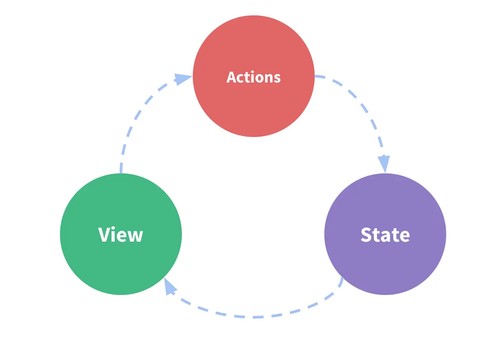


#### 函数组件的props

- 函数组件可以使用props属性，但不能使用state和refs（除非使用Hooks）
- 函数式组件没有自己的this，this为undefined
- props属性中的值只读，不可修改

```jsx
<!-- 准备好一个“容器” -->
<div id="test1"></div>

<!-- 引入react核心库 -->
<script type="text/javascript" src="../js/react.development.js"></script>
<!-- 引入react-dom，用于支持react操作DOM -->
<script type="text/javascript" src="../js/react-dom.development.js"></script>
<!-- 引入babel，用于将jsx转为js -->
<script type="text/javascript" src="../js/babel.min.js"></script>
<!-- 引入prop-types，用于对组件标签属性进行限制 -->
<script type="text/javascript" src="../js/prop-types.js"></script>

<script type="text/babel">
	//创建组件
	function Person (props){
		const {name,age,sex} = props
		return (
				<ul>
					<li>姓名：{name}</li>
					<li>性别：{sex}</li>
					<li>年龄：{age}</li>
				</ul>
			)
	}
	Person.propTypes = {
		name:PropTypes.string.isRequired, //限制name必传，且为字符串
		sex:PropTypes.string,//限制sex为字符串
		age:PropTypes.number,//限制age为数值
	}

	//指定默认标签属性值
	Person.defaultProps = {
		sex:'男',//sex默认值为男
		age:18 //age默认值为18
	}
	//渲染组件到页面
	ReactDOM.render(<Person name="jerry"/>,document.getElementById('test1'))
</script>
```


### 合成事件

> ```bash
> ## React 的事件机制：合成事件 & 原生事件
> React 的合成事件与浏览器的原生事件不同，也不会直接映射到原生事件。
> React 事件注册后并没有绑定在对应的真实 DOM 上，而是通过事件代理的方式，将所有的事件都统一绑定在 Document 上。这样的方式不仅减少了内存消耗，还能在组件挂载销毁时统一订阅和移除事件。
> 另外冒泡到 Document 上的事件也不是原生浏览器事件，而是 React 自己实现的合成事件(SyntheticEvent)。它是浏览器原生事件的跨浏览器包装器，它还是拥有和浏览器原生事件相同的接口，包括阻止事件传递的 `stopPropagation()` 和 `preventDefault()` 等接口。
> 
> 
> ## React 实现合成事件的目的
> 1. 赋予了 React 跨浏览器开发的能力。合成事件是一个跨浏览器原生事件包装器，抹平了浏览器之间的兼容问题。
> 2. 不仅减少了内存，还能在组件挂载销毁时统一订阅和移除事件（事件委托）：
> 		- 对于原生浏览器事件来说，浏览器会给每个监听器创建一个事件对象，如果有很多事件需要监听，那么就需要分配很多的事件对象，造成高额的内存分配问题。
> 		- 但对于合成事件来说，有一个事件池专门来管理它们的创建和销毁，当事件需要被使用时，就会从事件池中复用对象，事件回调结束后，就会销毁事件对象上的属性，从而便于下次复用事件对象（简化了事件处理和回收机制）。
> 		（但在 React17 中移除类库事件池）
> 		- 记录当前事件发生的状态，即记录事件执行的上下文，这便于 React 来处理不同事件的优先级，达到谁优先级高先处理谁的目的，这也实现了 React 的增量渲染思想，可以预防掉帧，同时达到页面更顺滑的目的，提升用户体验。
> 		
> 
> ### 事件处理
> - 通过onXxx属性指定事件处理函数(注意大小写)
>     - React使用的是自定义(合成)事件, 而不是使用的原生DOM事件
>     - React中的事件是通过事件委托方式处理的(委托给组件最外层的元素)
> - 通过event.target得到发生事件的DOM元素对象
> - 注意：不要过度使用ref，可以把数据保存在state中
> ```
>
> ```jsx
> myRef = React.createRef()
> //展示左侧输入框的数据
> showData = (event)=>{
>   console.log(event.target);
>   alert(this.myRef.current.value);
> }
> 
> render(){
>   return (
>     <div>
>       <input ref={this.myRef} type="text" placeholder="点击按钮提示数据"/>&nbsp;
>       <button onClick={this.showData}>点我提示左侧的数据</button>&nbsp;
>     </div>
>   )
> }
> ```

### 受控/非受控组件

#### 非受控组件

> - 只能临时存放，在触发按钮时才能得以获取数据（现用现取）
>
> ```js
> handleSubmit = (event)=>{
> 	event.preventDefault() //阻止表单提交
> 	const {username,password} = this
> 	alert(`用户名：${username.value},密码：${password.value}`)
> }
> render(){
> 	return(
> 		<form onSubmit={this.handleSubmit}>
> 			用户名：<input ref={c => this.username = c} type="text" name="username"/>
> 			密码：<input ref={c => this.password = c} type="password" name="password"/>
> 			<button>登录</button>
> 		</form>
> 	)
> }
> ```

#### 受控组件(类比vue的数据双向绑定)

> - 当内容改变时，触发`onChange`事件，改变其存在state中的值；调用时直接调状态的值即可
>
>
> ```jsx
> //初始化状态
> state = {
> 	username:'', //用户名
> 	password:'', //密码
>   account: "", // 账号
> }
> 
> //保存表单数据到状态中
> saveFormData = (dataType)=>{
>   return (event)=>{
>     this.setState({[dataType]:event.target.value})
>   }
> }
> // 保存表单数据的另类写法
> saveDate = (dataType, event) => {
>   this.setState({ [dataType]: event.target.value })
> }
> 
> //表单提交的回调
> handleSubmit = (event)=>{
> 	event.preventDefault() //阻止表单提交
> 	const {username,password, account} = this.state
> 	alert(`用户名：${username},密码：${password},账号：${account}`)
> }
> 
> render(){
> 	return(
> 		<form onSubmit={this.handleSubmit}>
> 			用户名：<input onChange={this.saveFormData('username')} type="text" name="username"/>
> 			密码：<input onChange={this.saveFormData('password')} type="password" name="password"/>
>       账号：<input onChange={event => this.saveDate('account', event)} type="text" name="account">
> 			<button>登录</button>
> 		</form>
> 	)
> }
> ```


### React CSS

#### 内联样式

```bash
要使用内联样式属性设置元素的样式，值必须是 JavaScript 对象

**注意**：在 JSX 中，JavaScript 表达式写在花括号内，由于 JavaScript 对象也使用花括号，所以样式写在两组花括号内 `{{}}`。

由于内联 CSS 是在 JavaScript 对象中编写的，因此带有连字符分隔符的属性，例如 `background-color`，必须使用驼峰式语法编写
还可以创建带有样式信息的对象，并在样式属性中引用它
```

```jsx
const Header = () => {
  const myStyle = {
    color: 'white',
    backgroundColor: 'plum',
    padding: '10px',
    fontFamily: 'Sans-Serif'
  }

  return (
    <>
      <h1 style={{ color: 'green', backgroundColor: 'plum' }}>Hello Style!</h1>
      <p style={myStyle}>添加一点样式!</p>
    </>
  )
}
```


#### CSS 样式表

可以在单独的文件中编写 CSS 样式，只需使用 `.css` 文件扩展名保存文件，然后将其导入您的应用程序

```scss
// index.scss
body {
  background-color: plum;
  color: white;
  padding: 40px;
  font-family: Sans-Serif;
  text-align: center;
}
```

```js
// main.js
import React from 'react'
import ReactDOM from 'react-dom'
import './index.css'

const Header = () => {
  return (
    <>
      <h1>Hello Style!</h1>
      <p>添加一点样式!</p>
    </>
  )
}

ReactDOM.render(<Header />, document.getElementById('root'))
```


### 组件生命周期

> **重要的钩子函数**
>
> 1. render：初始化渲染或更新渲染调用
> 2. componentDidMount：开启监听, 发送ajax请求
> 3. componentWillUnmount：做一些收尾工作, 如: 清理定时器
>
> **即将废弃的钩子**
>
> 1. componentWillMount
> 2. componentWillReceiveProps
> 3. componentWillUpdate
>
> 注意：现在使用会出现警告，下一个大版本需要加上**UNSAFE_**前缀才能使用，以后可能会被彻底废弃，不建议使用。

#### React15的生命周期

> 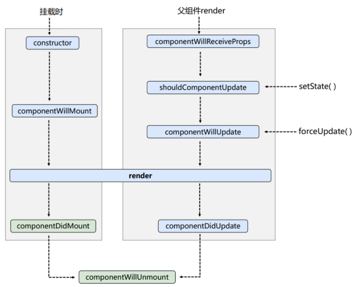
>
> ```bash
> 1. 初始化阶段: 由ReactDOM.render()触发---初次渲染
> 					1.	constructor()
>					2.	componentWillMount()
> 					3.	render()
>					4.	componentDidMount() =====> 常用
> 									一般在这个钩子中做一些初始化的事，例如：开启定时器、发送网络请求、订阅消息
> 
> 2. 更新阶段: 由组件内部this.setSate()或父组件render触发 (父组件接收数据)
>          1.	componentWillReceiveProps(props)
> 								注意：第一次接收子组件的数据时会不做处理（不触发该事件）,能接收一个参数
>          2.	shouldComponentWillUpdate()
>           			必须要返回一个boolean, 当返回true时，继续执行下列的钩子函数，否则中断执行
>          3.	componentWillUpdate()	
>           4.	render() =====> 必须使用的一个
>          5.	componentDidUpdate()
> 
> 3. 卸载组件: 由ReactDOM.unmountComponentAtNode()触发
> 					1.	componentWillUnmount()  =====> 常用
> 									一般在这个钩子中做一些收尾的事，例如：关闭定时器、取消订阅消息
> ```
> 
> 注意：componentWillReceiveProps第一次接收子组件的数据时会不做处理（不触发该事件），能接收一个参数
> 
> ```js
> //父组件A
> class A extends React.Component{
> 	//初始化状态
> 	state = {carName:'奔驰'}
> 
> 	changeCar = ()=>{
> 		this.setState({carName:'奥拓'})
> 	}
> 
> 	render(){
> 		return(
> 			<div>
>				<div>我是A组件</div>
> 				<button onClick={this.changeCar}>换车</button>
>				<B carName={this.state.carName}/>
> 			</div>
> 		)
> 	}
> }
> 
> //子组件B
> class B extends React.Component{
> 	//组件将要接收新的props的钩子
> 	componentWillReceiveProps(props){
> 		console.log('B---componentWillReceiveProps',props);
> 	}
> 
> 	//控制组件更新的“阀门”
> 	shouldComponentUpdate(){
> 		console.log('B---shouldComponentUpdate');
> 		return true
> 	}
> 	//组件将要更新的钩子
> 	componentWillUpdate(){
> 		console.log('B---componentWillUpdate');
> 	}
> 
> 	//组件更新完毕的钩子
> 	componentDidUpdate(){
> 		console.log('B---componentDidUpdate');
> 	}
> 
> 	render(){
> 		console.log('B---render');
> 		return(
> 			<div>我是B组件，接收到的车是:{this.props.carName}</div>
> 		)
> 	}
> }
> 
> //渲染组件
> ReactDOM.render(<A/>,document.getElementById('test'))
> ```

#### React16的生命周期

> ```bash
>所有旧生命周期上带上Will的钩子函数都需要加上UNSAFE_前缀
> 
> 1. 初始化阶段: 由ReactDOM.render()触发---初次渲染
> 				1.	constructor()
>				2.	getDerivedStateFromProps 
> 				3.	render()
>				4.	componentDidMount() =====> 常用
> 							一般在这个钩子中做一些初始化的事，例如：开启定时器、发送网络请求、订阅消息
> 
> 2. 更新阶段: 由组件内部this.setSate()或父组件重新render触发
>				1.	getDerivedStateFromProps(props, state)
> 						必须要返回一个 state Obj（状态对象） 或 null	来更新状态信息
>              此定义的props是：state的值任何时候都取决于 props
>               return props
>				2.	控制组件更新的“阀门”：shouldComponentUpdate()
> 				3.	组件渲染：render()
>				4.	组件更新前：getSnapshotBeforeUpdate(preProps, preState) 
> 				5.	组件更新完毕：componentDidUpdate()
> 
> 3. 卸载组件: 由ReactDOM.unmountComponentAtNode()触发
> 				1.	componentWillUnmount()  =====> 常用
> 							一般在这个钩子中做一些收尾的事，例如：关闭定时器、取消订阅消息
> ```
> 
> 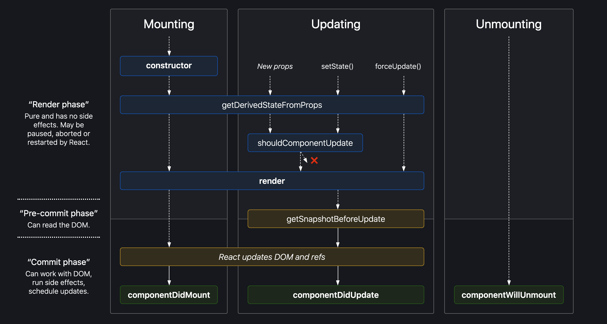
> 
> 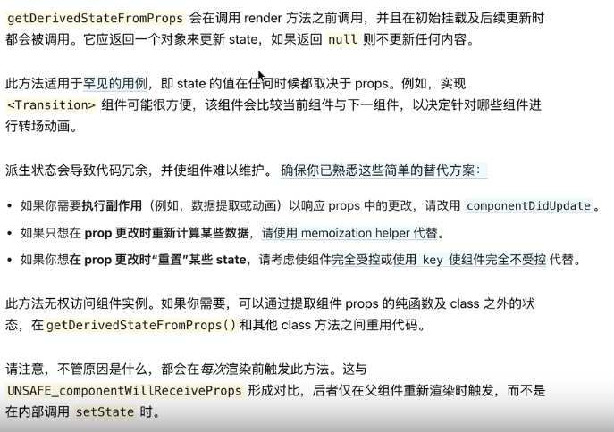
> 
> ```bash
> ## React Fiber
> React 在 16.0 版本中引入全新的一个底层架构-Fiber。它作为一个核心算法重构全新的协调引擎，主要目的是使 Virtual DOM 可以进行增量式渲染：将渲染工作分为多个块并将其分布到多个帧中的能力。
> 
> ### 引入 Fiber 的原因
> 主要是为了解决原来同步渲染、且无法打断的问题。在React16之前，在渲染很大很深的 React 组件树结构时，同步渲染会带来性能问题。
> 具体表现为：在同步渲染的模式下，如果最上层的组件数据变更触发渲染，会同步引发渲染子组件，再同步渲染子组件的子组件...最后完成整个组件树的渲染。
> 上述的调用栈会非常长，过程中又有大量复杂更新逻辑，diff计算过程就可能导致长时间阻塞主线程，而JS运行环境是单线程的，长期占用就会导致浏览器渲染引擎无法及时（大于16ms）进行 UI 绘制，会有掉帧的性能问题，且还会导致用户的交互操作以及页面动画得不到响应，影响用户体验。
> 
> 
>### Fiber 的解决方式：纤维增强机制
> Fiber 把上述耗时长的同步渲染任务进行切片，分成多个任务块。在完成每个任务块之后，给主线程的其他任务一个可以执行的机会。这样主线程就不会被 Virtual DOM 计算及渲染独占而阻塞。这个过程也被称为协调，Fiber 调度器会按照优先级自由调度这些小的任务块，达到在不影响体验的情况下去分段计算增量更新渲染的目的。
>比如：对于动画这种实时性很高的东西，React 会每 16ms 暂停以下更新，优先保证动画执行，之后继续渲染调度，从而保证动画不卡顿。
> 
> 
> ### 生命周期函数的两个阶段：Render阶段 和 Commit阶段
> 1. Render 阶段
> - 纯净且不包含副作用，可以被 React 暂停、中止或重新启动。
>     - componentWillMount
>     - componentWillReceiveProps
>     - shouldComponentUpdate
>     - componentWillUpdate
> 
> 2. Commit 阶段
> - 不能被中止，会一致更新界面直到完成；可以使用 DOM，运行副作用，安排更新。
>     - componentDidMount
>     - componentDidUpdate
>     - componentWillUnmount
> 
> 因为 Render 阶段是可以被打断的，所以 Render 阶段会执行的生命周期函数就可能会出现调用多次的情况，从而引起 Bug。由此对于 Render 阶段调用的几个函数，除了 shouldComponentUpdate 以外，其他都应该避免去使用。并且 v16.4 中引入新的 API 来解决这个问题：
>   - getDerivedStateFromProps（获取props衍生的状态） 用于替换 componentWillReceiveProps，该函数会在初始化和 update 时被调用。
>   - getSnapshotBeforeUpdate（获取更新前的快照） 用于替换 componentWillUpdate，该函数会在 update 后 DOM 更新前被调用，用于读取最新的 DOM 数据。
> 
> 
> ### 不再 componentWillMount 里做 AJAX 的原因
> 1. 一个组件的 componentWillMount 比 componentDidMount 也早调用不了几微秒，性能没啥提升；
> 2. Render 阶段的 componentWillMount 可能会被中途打断，中断之后渲染又要重做一遍，会出现接口请求调用 N 次的情况。相反，若把 AJAX 放在 componentDidMount，因为 componentDIdMount 在第二阶段，所以不会多次重复调用。
> 3. 在服务端同构渲染的模式下，如果在 componentWillMount 里面获取数据， fetch data 会执行两次，一次在服务端，一次在客户端。在 componentDidMount 中则不会。
> ```

#### 生命周期总结

> ```bash
> ### react 生命周期
> - componentWillMount 组件渲染之前调用
> - componentDidMount 在第一次渲染之后调用
> - getDerviedStateFromProps（comPonentWillReceiveProps） 在组件接收到一个新的 props 时调用
> - shouldComponentUpdate 判断组件是否更新 html
> - getSnapshotBeforeUpdate（componentWillUpdate） 组件即将更新 html 时调用
> - componentDidUpdate 在组件完成更新后立即调用
> - componentDidUpdate 在组件完成更新后立即调用
> - componentWillUnmount 在组件移除之前调用
> 
> 
> ### 生命周期避免的 bug
> 1. getDerviedStateFromProps 容易编写反模式代码，使受控组件与非受控组件区分模糊。
> 2. componentWillMount 在 React 中被标记弃用，主要原因是新的异步渲染架构会导致它被多次调用。所以网络请求及事件绑定代码应移至 componentDidMount 中。
> 3. componentWillReceiveProps 被标记为弃用，被 getDerviedStateFromProps 所取代，主要原因是性能问题（componentWillReceiveProps 更新状态时同步进行的，而 getDerviedStateFromProps 的设计更适用于异步场景）。
> 4. shouldComponentUpdate 通过返回 true 或者 false 来确定是否需要触发新的渲染，主要用于性能优化。
> 5. componentWillUpdate 同样是由于新的异步渲染机制而被标记废弃，原先的逻辑可结合 getSnapshotBeforeUpdate 与 componentDidUpdate 改造使用。
> 6. 如果在 componentWillUnmount 函数中忘记接触事件绑定，取消定时器等清理操作，容易引发 bug。
> 7. 如果没有添加错误边界厝里，当渲染发生异常时，用户将会看到一个无法操作的白屏，所以一定要添加。
> 
> 
> ### react 的请求应该放在哪个生命周期钩子中调用？
> 对于异步请求，应该放在 componentDidMount 中取操作。从时间顺序来看，除了 componentDidMount 还可以有以下选择：
>   - constructor：可以放，但从设计上而言不推荐。constructor 主要用于初始化 state 与函数绑定，并不承载业务逻辑。而且随着类属性的流行，constructor 已经很少使用了。
>   - componentWillMount：已被标记废弃，在新的异步渲染架构下回触发多次渲染，容易引发 Bug，不利于未来 React 升级后的代码维护。
> ```


### 虚拟DOM与Diffing算法

#### 虚拟DOM

> ```bash
> ## Virtual DOM
> 虚拟DOM 是一种编程概念，在这个概念中，UI 以一种理想化的（虚拟的）表现形式被保存于内存中，并通过如 ReactDOM 等类库使之与 "真实DOM" 同步，这一过程叫做协调。
> 基于 Virtual DOM 技术，通过 JavaScript 实现的类库（在对 DOM 操作的基础上建立一个抽象层，用 JavaScript 对象来代替 DOM 节点，承载与真实 DOM 的交互），帮助开发者避免直接进行真实及繁琐的 DOM 操作和 UI 渲染。
> 同时， Virtual DOM 也是一种抽象的编程模式，衍生出的声明式 UI 编程、DOM Diff 算法、React Fiber 引擎等都是 Virtual DOM 的一部分具体体现。
> 
> 
> ### 虚拟 DOM 的原理
> 虚拟 DOM 的工作原理是通过 JS 对象模拟 DOM 的节点。在 Facebook 构建 React 初期时，考虑到要提升代码抽象能力、避免人为的 DOM 操作、降低代码整体风险等因素，所以引入虚拟 DOM。
> Virtual DOM 在实现上通常是 Plain Object，以 react 为例，在 render 函数中写的 JSX 会在 Babel 插件的作用下编译为 React.createElement 执行 JSX 中的属性参数。
> React.createElement 执行后会返回一个 Plain Object，它会描述自己的 tag 类型、props 属性以及 children 情况等。这些 Plain Object 通过树形结构组成一颗 Virtual DOM 树。当状态发生变更时，将变更前后的 Virtual DOM 树进行差异比较，这个过程称为 diff，生成的结果称为 patch。计算之后，会渲染 patch 完成对真实 DOM 的操作。
> Virtual DOM 的优点是：改善大规模 DOM 操作的性能、规避 XSS 风险、能以较低成本实现跨平台开发。
> Virtual DOM 的缺点是：内存占用较高，因为需要模拟整个网页的真实 DOM；高性能应用场景存在难以优化的情况，类似 Google Earth 异类的高性能前端应用在技术选型上往往不会选择 react。
> 
> 
> ###  Virtual DOM 的优势
> ● 将 Virtual DOM 作为一个兼容层，让我们还能对接非 Web 端的系统，实现跨端开发。
> ● 同样的，通过 Virtual DOM 我们可以在其他的平台渲染，比如实现 SSR、同构渲染等等。
> ● 为函数式的 UI 编程方式打开了大门，实现组件的高度抽象化。
> ● 隐藏DOM操作细节，配合框架提高项目可维护性；
> ● 在频繁操作DOM、频繁小量数据更新的应用场景，有很好的性能优势
> 
> 
> ### Virtual DOM 跟原生操作DOM 的对比
> Virtual DOM最后还是会解析成原生DOM，进行原生DOM操作。Virtual DOM 在数据Change时才能有优势，如果页面第一次展现出来以后都不用变就没优势了。
> 不要天真地以为 Virtual DOM 就是快，Diff 不是免费的，且最终还是要进行原生API调用渲染。真正的价值不止是性能，它带来的优势还在于：
> 1. 通过框架封装，提高了可维护性，并不是把性能优化放到首位。框架给你的保证是，你在不需要手动优化的情况下，我依然可以给你提供过得去的性能。
> 2. 和 DOM 操作比起来，js 计算是极其便宜的。
> ```

#### React 的 DOM Diff 算法原理

> ```bash
> ## React 的 DOM Diff 算法原理
> React 组件在首次渲染后，会创建一颗对应的虚拟 DOM 树，当组件的 props 或 state 变化时，React 将会调用 render() 方法，并构建一颗新的虚拟 DOM 树，React 需要基于这两棵树之间的差别来判断真正变化的部分，进而有效率地更新真实 DOM 数据，以保证当前 UI 与最新的树保持同步，这就涉及 Diff 算法的优劣问题。
> Diff 算法是指生成更新补丁的方式，主要应用于虚拟 DOM 树变化后，更新真实 DOM。所以 diff 算法一定存在这样一个过程：
> 		触发更新 -> 生成补丁 -> 应用补丁
> 
> ### 传统 Diff 算法：
> 传统的diff算法触发虚拟DOM变更遍历，采用了深度优先遍历算法，通过循环递归对节点进行依次对比，算法复杂度达到 O(n^3)，效率较低。
> 
> ### React 的 Diff 算法：
> React的Diff算法是：将 Virtual DOM 树转换成实际 DOM 树的最少操作化的过程。
> React为了优化效率，采用分治的方式，将单一节点比对转化为三种类型节点(树、组件以及节点元素)的对比，将 O(n^3)复杂度 转化为 O(n)复杂度，以此提升效率。
> 
> 1. Tree Diff（树层级比较）
> 对两颗 Virtual DOM 树只对同一层级的节点进行比较。如果比较发现对应的节点无法匹配或不存在，则该节点及子节点会被完全删除，不再进行比较。这样只需遍历一次就能完成整颗 DOM 树的比较。
> 如此，Diff 算法只简单考虑同层级的节点位置变换，如果是跨层级，只有创建新节点和删除旧节点的操作。
> 
> 2. Component Diff（组件比较）
> 如果两个组件时同一类型，则进行树比较；
> 如果两个组件为不同类型，则会判定为脏组件，则直接放入到补丁中（替换整个组件的所有节点，将会生成不同的树形结构）。
> 
> 3. Element Diff（节点元素比较）
> 主要发生在同一层级中，通过标记节点操作生成补丁，节点操作对应真实的 DOM 剪裁操作：
>   - 插入：对于新的节点，直接插入；
>   - 删除：对于不能复用和实际移除的节点，则删除旧的，重新创建新的；
>   - 移动：对于添加唯一 Key 进行区分的同一组子节点，可以做到移动位置即可。
> 
> 
> 
> ### JavaScript 链表的作用：React 16 引入的 Fiber 架构的更新算法
> Fiber英文意思为纤维化，即将任务进行细化，它把一个耗时长的任务分成很多小片，每一个小片的运行时间很短，虽然总时间依然很长，但是在每个小片执行完之后，都给其他任务一个执行的机会，这样唯一的线程就不会被独占，其他任务依然有运行的机会，React 中的 Fiber 就把整个 VDOM 的更新过程碎片化。
> 
> 在之前 React 的 render() 方法会接收一个 虚拟DOM 对象和一个真实的 容器DOM 作为 虚拟DOM 渲染完成后的挂载节点，其主要作用是将 虚拟DOM 渲染为 真实DOM 并挂载到容器下，这个方法在更新时是进行递归操作的，如果在更新的过程中有大量的节点需要更新，就会出现长时间占用 JS 主线程的情况，并且整个递归过程是无法被打断的，由于 JS 线程和 GUI 线程是互斥的，所以大量更新的情况下会看到界面有些卡顿。
> 
> Fiber 架构主要是解决两个问题：一是保证任务在浏览器空闲时执行，二是将任务进行碎片化。
> 
> JS 中有一个实验性质的方法 `requestIdleCallback(callback)`，它可以传入一个回调函数，回调函数能够收到一个 deadline 对象，通过该对象的 timeRemaining() 方法可以获取到当前浏览器的空闲时间，如果有空闲时间，那么就可以执行一小段任务，如果时间不足，则继续 requestIdleCallback，等到浏览器有空闲时间时再接着执行，这样就实现了浏览器空闲时执行。
> 
> 但是 虚拟DOM 是树结构，当任务被打断后，树结构无法恢复之前的任务继续执行。
> Fiber 架构为了使整个更新过程可随时暂停恢复，节点与树分别采用了 FiberNode 与 FiberTree 进行重构。FiberNode 使用了双链表结构，链表中就包含三个指针，parent 指向其父 Fiber 节点，child 指向其子 Fiber 节点，sibling 指向其兄弟 Fiber 节点，一个 Fiber 节点对应一个任务节点，这样就可以直接找到兄弟节点与子节点，继而可以恢复任务的执行。
> 整个过程由 current 与 workInProgress 两株树双缓冲完成。workInProgress 更新完成后，再通过修改 current 相关指针指向新节点。
> 
> 
> ### Vue 的 Preact 与 React 的 diff 算法对比
> Preact 的 Diff 算法相较于 React，整体设计思路相似，但最底层的元素采用了真实 DOM 对比操作，也没有采用 Fiber 设计。Vue 的 Diff 算法整体也与 React 相似，同样未实现 Fiber 设计。
> 然后进行横向比较，React 拥有完整的 Diff 算法策略，且拥有随时中断更新的时间切片能力，在大批量节点更新的极端情况下，拥有更友好的交互体验。
> Preact 可以在一些对性能要求不高，仅需要渲染框架的简单场景下应用。
> Vue 的整体 diff 策略与 React 对其，虽然缺乏事件切片能力，但这并不意味着 Vue 的性能更差，因为 VUe3 初期引入过，后期因为收益不高移除掉了。除了高帧率动画，在 Vue 中其他的场景几乎都可以使用防抖和节流去提高响应性能。
> ```
>
> 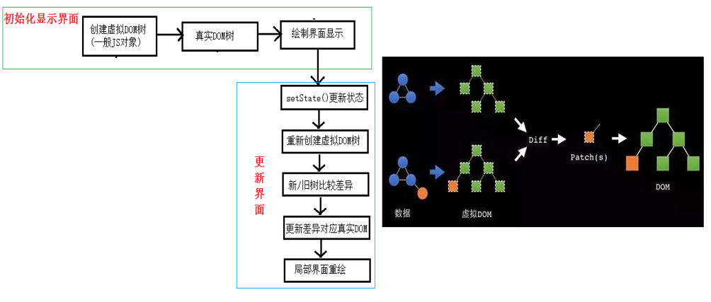

#### key的渲染机制

> ```bash
> 1). react/vue中的key有什么作用？（key的内部原理是什么？）
> 2). 为什么遍历列表时，key最好不要用index?
> 
> 1. 虚拟DOM中key的作用：
> 		key是虚拟DOM对象的标识, 当状态中的数据发生变化时，
> 		react会根据【新数据】生成【新的虚拟DOM】, 
> 		随后React进行【新虚拟DOM】与【旧虚拟DOM】的diff比较，比较规则如下：
> 						a. 旧虚拟DOM中找到了与新虚拟DOM相同的key：
> 									(1).若虚拟DOM中内容没变, 直接使用之前的真实DOM
> 									(2).若虚拟DOM中内容变了, 则生成新的真实DOM，随后替换掉页面中之前的真实DOM
> 						b. 旧虚拟DOM中未找到与新虚拟DOM相同的key
> 									根据数据创建新的真实DOM，随后渲染到到页面
> 
> 2. 用index作为key可能会引发的问题：
> 					1. 若对数据进行：逆序添加、逆序删除等破坏顺序操作:
> 									会产生没有必要的真实DOM更新 ==> 界面效果没问题, 但效率低。
> 					2. 如果结构中还包含输入类的DOM：
> 									会产生错误DOM更新 ==> 界面有问题。
> 									比如用key为index在渲染li列表时，里面都存在一个input标签，则input里面的内容可能或错乱，会渲染到其他内容里面
> 					3. 注意！如果不存在对数据的逆序添加、逆序删除等破坏顺序操作，
> 						仅用于渲染列表用于展示，使用index作为key是没有问题的。
> 
> 3. 开发中如何选择key?:
> 					1.最好使用每条数据的唯一标识作为key, 比如id、手机号、身份证号、学号等唯一值。
> 					2.如果确定只是简单的展示数据，用index也是可以的。
> ```
>
> ```jsx
> /* 用key为index在渲染li列表时，里面都存在一个input标签，则input里面的内容可能或错乱，会渲染到其他内容里面 */
> class Person extends React.Component{
> 	state = {
> 		persons:[ {id:1,name:'小张',age:18}, {id:2,name:'小李',age:19}, ]
> 	}
> 
> 	add = () => {
> 		const {persons} = this.state
> 		const p = {id:persons.length+1, name:'小王', age:20}
> 		this.setState({persons:[p,...persons]})
> 	}
> 
> 	render(){
> 		return (
> 			<div>
> 				<button onClick={this.add}>添加一个小王</button>
>         
> 				<h3>使用index（索引值）作为key</h3>
> 				<ul>
> 					{ this.state.persons.map((perObj,index)=>{
> 							return <li key={index}>{perObj.name}-{perObj.age}<input type="text"/></li>
> 					}) }
> 				</ul>
>         
> 				<h3>使用id（数据的唯一标识）作为key</h3>
> 				<ul>
> 					{ this.state.persons.map((per)=>{
> 							return <li key={per.id}>{per.name}-{per.age}<input type="text"/></li>
> 					}) }
> 				</ul>
> 			</div>
> 		)
> 	}
> }
> ReactDOM.render(<Person/>,document.getElementById('test'))
> ```

## React CLI

**创建项目**

> 1. 全局安装：`npm i -g create-react-app`
> 2. 创建项目文件夹
>    1. `create-react-app 项目名`
>    2. yarn方式：`yarn create react-app react-ts --template=typescript`
>    3. npx方式：`npx crate-react-app react-ts --template=typescript`
> 3. 启动项目：`npm start`
> 4. 使用脚手架开发项目特点：模块化、组件化、工程化
> 5. 项目整体技术架构为：`react + webpack + es6 eslint`
> 6. 清空命令行`cls`
> 7. 在vscode中下载jsx插件，会有react语法提示
> 8. 在vscode安装插件`ES7+ React/Redux/React-Native snippets`，输入`rcc`或`rfc`会快捷生成初始内容
> 9. 生成唯一id标识符的库：`nanoid`和`uuid`库

**脚手架项目结构**

> ```js
> public ---静态资源文件夹
> 	- mainfest.json		---应用加壳的配置文件
> 	- robots.txt			---爬虫协议文件
> src		---源码文件夹
> 	- reportWebVitals.js	---页面性能分析文件（需要web-vitals库的支持）
> 	- setupTests.js				---
> ```

### Json Server(模拟接口数据)

> - JsonServer主要作用是搭建本地的数据接口，创建json文件，便于调试调用
> - 如果只是get数据，需借助`jsonplaceholder`，如果是post请求数据，则可使用json server对数据进行增删改查
> - 全局安装：`npm install -g json-server`
> - 创建文件夹(不能用json-server作为文件夹名，否则会报错)，初始化一个package.json文件`npm init -yes`
> - 安装json-server：`npm i json-server --save`
> - 运行：`npm run json:server`
> - 不需要package.json就能运行：`json-server --watch 文件名.json`

### 跨域setupProxy.js

> - 安装插件：`npm i http-proxy-middleware --save`
> - 在react CLI项目的src文件夹下创建`setupProxy.js`文件进行跨域访问端口设置，其内部会把该文件添加到webpack配置下，webpack里边用的都是node语法，所以这个文件里要写commonjs语法
> - node用的是commonjs语法规范，浏览器用 browserify语法规范
> - 在该文件内可以设置多个代理对象
> - 还可在package.json文件中增加`proxy: "http://localhost:3000"`的字段进行跨域
>
> ```js
> const proxy = require('http-proxy-middleware')	// 请求http代理中间件
> 
> module.exports = function(app) {
>   app.use(
>     proxy('/api1', {	// 遇见 /api1 前缀的请求，就会触发该代理配置
>       target: "http://localhost:3000",	// 从原求地址转发到该地址
>       changeOrigin: true,	// 控制服务器收到的响应头中Host字段的值（host的字段标识请求是从哪发出的）
>       pathRewrite: { '^api1': "" },	// 重写地址
>     }),
>     proxy('/api1', {
>       target: "http://localhost:3001",
>       changeOrigin: true,
>       pathRewrite: { '^api1': "" },
>     })
>   )
> }
> ```

### 消息发布-订阅机制

> - 发布订阅者模式是一对多模式，一个发布者多个订阅者可接收。
> - publish发布消息，subscribe订阅消息，需要依赖`pubsub-js`模块，通过`cnpm install pubsub-js --save`，然后通过`import PubSub from 'pubsub-js'`引入模块再进行使用
> - `PubSub.publish(发送消息的名称, 消息的内容)`发布消息
> - `PubSub.subscribe(接收的消息名称eventName, callback(消息名称, 消息内容){})`：订阅消息
> - `PubSub.unsubcribe(eventName, callback)`：解除自定义事件
> - `PubSub.subscribeOne(eventName, callback)`：发布一个只触发一次的自定义事件
> - `PubSub.notify(eventName, callback)`：触发已经发布的自定义事件
>
> ```js
> // 导入模块
> import PubSub from 'pubsub-js'
> // const PubSub  = require('pubsub-js')	// CommonJS
> 
> // 发布消息
> PubSub.publish("emits", { name: "willy", age: 24 })
> 
> // 订阅消息
> PubSub.subscribe("emits", (_, context) => {
>   console.log(_, context)	// emits, {name:"willy",age:24}
> })
> ```

### fetch发送请求（关注分离的设计思想）

> - fetch是基于promise设计的，因为XMLHttpRequest是一个设计粗糙的API，不符合关注分离的原则，配置和调用方式非常混乱，而且基于事件的异步模型写起来也没现代的`promise、generator/yield、async/await`友好，Fetch的出现就是为了解决XHR的问题
> - Fetch的优点
>   - 语法简洁更加语义化，关注分离的设计思想
>   - 基于Promise实现，支持async/await；
>   - 同构方便，使用`isomorphic-fetch`
> - Fetch的缺点
>   - Fetch请求默认不携带cookie，需要设置`fetch(url, { credentials: "include" })`
>   - 服务器返回400、500错误码并不会reject，只有网络错误这些导致请求不能完成时，fetch才会被reject
>
> ```js
> // XHR 进行请求
> var xhr = new XMLHttpRequest()
> xhr.open('GET', url)
> xhr.responseType = 'json'
> xhr.onload = function() {
>   console.log(xhr.response)
> }
> xhr.onerror = function() {
>   console.log("error")
> }
> xhr.send()
> 
> // Fetch 进行请求
> fetch(url).then(res => res.json())
>   .then(data => console.log(data))
>   .catch(err => console.log(err))
> 
> // async/await函数+Fetch 进行请求
> async function reqs() {
>   try {
>     let response = await fetch(url)
>     let data = response.json()
>     console.log(data)
>   } catch(err) {
>     console.log(err)
>   }
> }
> reqs()
> ```
>
> #### 请求封装
>
> ````js
> /* utils/http.js */
> import qs from 'querystring'
> export function httpGet(url) {
>   return fetch(url)
> }
> export function httpPost(url, params) {
>   const result = fetch(url, {
>     method: "POST",
>     headers: {
>       "Content-Type": "application/x-www-form-urlencoded",
>       "Accept": "application/json,text-plain,*/*"
>     },
>     body: qs.string(params)
>   })
>   return result
> }
> ````
>
> ```js
> /* api/base.js */
> const base = {
>   baseURL: "http://127.0.0.1:3000",
>   addAPI: "/api/add/getList.php",
>   login: '/api/login.php'
> }
> ```
>
> ```js
> /* api/index.js */
> import {httpGet} from '../utils/http'
> import base from './base'
> 
> const api = {
>   getList = () => httpGet(base.baseURL + addAPI),
> 	login = (params) => httpPost(base.baseURL+login,params)
> }
> export default api
> ```
>
> ```jsx
> import React from "react"
> import api from '/api/index'
> export default function Demo() {
>   api.getList().then(res => res.json()).then(data => {console.log(data)})
>   api.login({"account":"willy","pwd":"123456"})
>     .then(res => res.json()).then(data => {console.log(data)})
>   
>   render() {
>     return (<div>Demo...</div>)
>   }
> }
> ```

### Fragment

> - 传统的jsx生成的界面标签，最外层是通过div标签包裹的，所以生成真实DOM会包含外层div（类似vue2最外层必须使用根元素标签包裹）
> - 通过Fragment包裹的外层的标签，是会把jsx的最外层`Fragment`标签去除，导致在真实DOM中只有里层的标签元素内容（类似vue3没有根元素标签）
> - **最外层使用Fragment标签跟空标签的区别是Fragment标签可使用key值标识该便签元素，使得其唯一存在，更有利与虚拟DOM的渲染**
>
> ```jsx
> import React, { Component, Fragment } from 'react'
> export defalut class Deom extends Component {
>   render() {
>     return (
>     	<Fragment key={1}>
>         <p>使用Fragment标签包裹后生成的真实DOM不会把Fragment这层标签渲染上去</p>
>       </Fragment>
>     )
>   }
> }
> ```

### 项目打包运行

> - 执行`npm run build`后，项目会进行打包生成一个build文件夹，里面的页面无法打开运行，需要服务器来做运行
> - 安装服务器：`npm i serve -g`
> - 在build文件夹下执行命令`serve`或在主项目文件夹下执行`serve build`

### setState两种方式

> ```js
> state状态的更新是异步的，即this.setState引起后面的动作是异步的，所以不要放在for循环里面同步更新，可把`this.setState`当做函数来进行数据更新
> 
> 1. 对象式的setState：setState(stateChange, [callback])
> 		-- stateChange为状态改变对象，给对象可以体现出状态的更改
>     -- callback 是可选的回调函数，它在状态更新完毕、界面也更新后(render调用后)才被调用
> 
> 2. 函数式的setState：setState(updater, [callback])
> 		-- updater为返回stateChange对象的函数，可以接收到props和state
>     -- callback 是可选的回调函数，它在状态更新完毕、界面也更新后(render调用后)才被调用
> 
> 总结：对象式的setState是函数式setState的简写语法糖，使用原则如下：
>     1. 如果新状态不依赖于原状态 --- 使用对象式
>     2. 如果新状态依赖于原状态	---	 使用函数式
>     3. 如果需要在setState()执行后获取最新状态数据，需要在callback函数中读取
> 
> 
> for(let i = 0; i < 100; i++) {
>   console.log(this.state.counter)
>   // this.setState({counter: this.state.counter + 1}) // 错误写法
>   // state的更新是异步的，所以把更新放入函数中，这样才会正常更新而不出错
>   this.setState((state, props) => ({
>   	counter: state.counter + 1
>   }))
> }
> 
> 
> /**
> 	* - setState当前情况下是异步操作
> 	* - setState会合并所有的异步执行，然后异步执行完毕后，才会执行异步回调函数
> */
> this.setState({
>   count: this.state.count + 1
> },() => {
>   console.log(this.state.count);	// 4
> })
> this.setState((prevState, props) => ({ count: prevState.count + 1 }))
> this.setState((prevState, props) => ({ count: prevState.count + 1 }))
> this.setState((prevState, props) => ({ count: prevState.count + 1 }))
> ```


## React 内置组件

### `<>` 和 `React.Fragment`

```bash
`<>` 是 `React.Fragment` 的简写标签。它允许我们对元素列表进行分组，而无需将它们包装到新节点中。
基本上，我们应该在任何时候使用 `React.Fragment` 或 `<>`，它可以避免不必要的 `div` 包装器，得到一个更加清晰的标签结构。

它们之间唯一的区别是简写版本不支持 `key` 属性。以下是在多行字符串中插入新行（`br`）标签的常见示例：
```

```jsx
return (
  <>
  <Header />
  <Navigation />
  <Main />
  <Footer />
  </>
)
```

```jsx
str.split('\\n').map((item, index) => {
  return (
    <Fragment key={index}>
      {item}
      <br />
    </Fragment>
  )
})
```


### React 严格模式

```bash
可以使用 `React.StrictMode` 内置组件，用于启用一组检查，以执行 React 并向您发出警告。


该组件的主要用例之一是用作自动化的最佳实践、潜在问题和弃用检查。
它无法捕捉所有内容，但您在这里有很多不错的检查可以帮助您解决开发问题。
它在 React 16.3 中引入，对生产环境没有影响，因此您可以始终将组件保留在代码库中。在开发中使用，它将在浏览器 JavaScript 控制台中打印有用的警告。


一种简单的方法是将整个 App 组件包装在 `main.js` 文件中的 `<React.StrictMode></React.StrictMode>` 中。
```

```jsx
import React from 'react'
import ReactDOM from 'react-dom'

ReactDOM.render(
  <React.StrictMode>
    <App />
  </React.StrictMode>,
  document.getElementById('root')
)
```


## React 路由

> ```bash
> - SPA单页面：整个应用只有一个完整的页面，点击页面中的链接不会刷新页面，只会做页面的局部刷新，数据都需要通过ajax请求获取，并在前端异步展现
> 
> - 路由：一个路由就是一个映射关系(key:value)，key为路径，value可能是function或component
> 
>   - 后端路由：value是function，用来处理客户端提交的请求
>     - 注册路由`router.get(path, function(req, res))`
>     - 工作过程：当node接收到一个请求时，根据请求路径找到匹配的路由，调用路由中的函数来处理请求，返回响应数据
> 
>   - 前端路由：浏览器路由，value是component，用于展示页面内容
>     - 注册路由：`<Route path="/test" component={Test}>`
>     - 工作过程：当浏览器的path变为`/test`时，当前路由组件就会变为Test组件
> 
> - 安装路由：`npm i react-router-dom@5`，在2021-11月已经升级为6版本 
> 
> - 注意：为了保证项目的页面的路由跳转复用，把BrowserRouter或HashRouter放在`index.js`中，包住`<App/>`标签
> ```
>
> **路由的跳转与改变**
>
> ````js
> // 创建历史记录对象
> let history = History.createBrowserHistory()	// 使用H5推出的history API
> // let history = History.createHashHistory()	// 使用hash值，锚点，兼容性好，但相对不安全
> 
> // 页面跳转
> - history.push(path)
> - history.replace(path)
> - history.goBack()
> - history.goForward()
> ````
>
> **react-router-dom内置API**
>
> ```bash
> 1. BrowserRouter：history模式路由跳转，一般包裹App标签
> 2. HashRouter：hash模式路由跳转，一般包裹App标签
> 3. Route：标签包裹的是所跳转的页面内容(即所展示页面的位置)
>    1. path属性代表与Link标签的to的路径进行匹配
>    2. component属性代表所跳转的组件页面/内容，引入组件
>    3. exact属性会开启严格匹配，即是路由输入的路径必须包含匹配路径且要等于匹配的路径(注意：有时开启严格匹配会导致无法继续匹配二级路由，不常用)
> 4. Redirect：重定向	 `<Redirect from="/helloabout" to="/about" />`
> 5. Link：等同a标签，to属性所代表的是跳转的路由地址
> 6. NavLink：相对于link标签，其具有高亮效果（其是内置一个active的class属性,点击那个路由链接，则颜色内容那些改变，显得你触发点击了该路由）
>    - 其内置有activeClassName属性，该路由处于活动状态时调用的class属性样式设定（若用了bootstrap，则需要给每个样式增加`important!`后缀增加权重，否则会出现样式闪现效果）
> 7. Switch：匹配路由，使得在多个`Route`标签中匹配路由选择跳转时提高效率，所以一般里面是包裹Route标签
> ```
>
> **解决多级路径刷新页面导致样式丢失问题**
>
> 1. `public/index.html`中引入样式时不用`./`为前缀，改用`/`或`%PUBLIC_URL%`作为前缀
> 2. 使用HashRouter
>
> **一般组件与路由组件区别**
>
> ```bash
> 存放位置不同
> 	一般组件：components
> 	路由组件：pages
> 接收到props不同
> 	一般组件：写组件标签时传递什么就能接收到什么
> 	路由组件：接收到三个固定属性
>       history：
>           go(n)
>           goBack()
>           goForward()
>           push(path, state)
>           replace(path, state)
>       location:
>           pathname: '/routeName'
>           search: ''
>           state: undefined
>       match:
>           params: {}
>           path: '/routeName'
>          url: 'routeName'
> ```

### 基本用法

**路由器**

```bash
首先用 `<BrowserRouter>` 包装我们的内容，然后定义一个 `<Routes>`。一个应用程序可以有多个 `<Routes>`（本示例仅使用一个）。

`<Route>` 可以嵌套。第一个 `<Route>` 具有 `/` 组件的路径，并渲染 `Layout` 组件。

嵌套的 `<Route>` 继承并添加到父路由。因此，`blogs` 路径与父路径合并，成为 `/blogs`。

`Home` 组件路由没有路径，但有 `index` 属性。将此路由指定为父路由的默认路由，即 `/`。

设置 `path` 为 `*` 将作为任何未定义 URL 的回退。这对于 404 错误页面是很好的。
```

```jsx
// main.js
import ReactDOM from 'react-dom'
import { BrowserRouter, Routes, Route } from 'react-router-dom'
import Layout from './pages/Layout.js'
import Home from './pages/Home.js'
import Blogs from './pages/Blogs.js'
import Contact from './pages/Contact.js'
import NotFoundPage from './pages/NotFoundPage.js'

export default function App() {
  return (
    <BrowserRouter>
      <Routes>
        <Route path='/' element={<Layout />}>
          <Route index element={<Home />} />
          <Route path='blogs' element={<Blogs />} />
          <Route path='contact' element={<Contact />} />
          <Route path='*' element={<NotFoundPage />} />
        </Route>
      </Routes>
    </BrowserRouter>
  )
}

ReactDOM.render(<App />, document.getElementById('root'))
```

**页面/组件**

```bash
`Layout` 组件具有 `<Outlet>` 和 `<Link>` 元素。
	- `<Outlet>` 渲染当前选择的路由。
	- `<Link>` 用于设置 URL 并跟踪浏览历史记录。
每当我们链接到内部路径时，我们将使用 `<Link>` 而不是 `<a href="">`。
`Layout` 路由是一个共享组件，可以在所有页面上插入公共内容，例如导航菜单。
```

```jsx
// Layout.js
import { Outlet, Link } from 'react-router-dom'

const Layout = () => {
  return (
    <>
      <nav>
        <ul>
          <li><Link to='/'>Home</Link></li>
          <li><Link to='/blogs'>Blogs</Link></li>
          <li><Link to='/contact'>Contact</Link></li>
        </ul>
      </nav>
      <Outlet />
    </>
  )
}

export default Layout
```

```js
// Home.js
const Home = () => <h1>Home</h1>
export default Home


// Blogs.js
const Blogs = () => <h1>Blog Articles</h1>
export default Blogs


// Contact.js
const Contact = () => <h1>Contact Me</h1>
export default Contact


// NotFoundPage.js
const NotFoundPage = () => <h1>404</h1>
export default NotFoundPage
```


### 路由传参

> 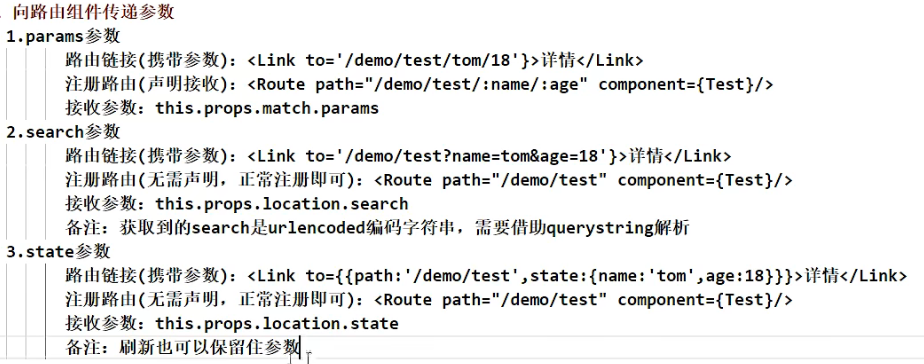
>
> **向路由组件传递params参数**
>
> ```jsx
> {/* 路由链接，向路由组件传递params参数 */}
> <Link to={`/home/message/detail/${msgObj.id}/${msgObj.title}`}>{msgObj.title}</Link>
> 
> {/* 注册路由，声明接收params参数 */}
> <Route path="/home/message/detail/:id/:title" component={Detail} />
> 
> {/* 组件中接收params参数 */}
> export default class Detail extends Component {
>     render() {
>        const { id, title } = this.props.match.params
>        return (<p>{ id } { title }</p>)
>      }
>  }
> ```
> 
> **向路由组件传递search参数**
>
> ```jsx
>{/* 路由链接，向路由组件传递search参数 */}
> <Link to={`/home/message/detail?id=${msgObj.id}&title=${msgObj.title}`}>{msgObj.title}</Link>
> 
> {/* 注册路由，search参数无需声明接收 */}
> <Route path="/home/message/detail" component={Detail} />
> 
> {/* 组件中接收search参数 */}
> import qs from 'querystring'
> export default class Detail extends Component {
>     render() {
>        // 接收search参数，并转换为对象
>        const { search } = this.props.location
>        const result = qs.parse(search.slice(1))
>        const { id, title } = result
>        return (<p>{ id } { title }</p>)
>      }
>  }
>  ```
>    
>  **向路由组件传递state参数**
> 
> - 刷新页面state参数传递的值必须是对象形式，且值不会丢失，但清除浏览器缓存state参数传递的值会丢失，所以需要给其设定默认值
> 
>```jsx
> {/* 路由链接，向路由组件传递state参数 */}
><Link to={{`/home/message/detail`, state: {id:1,title:"aaa"}}}>{msgObj.title}</Link>
> 
>{/* 注册路由，state参数无需声明接收 */}
> <Route path="/home/message/detail" component={Detail} />
> 
> {/* 组件中接收state参数 */}
> export default class Detail extends Component {
>   render() {
>     // 防止传值为空，或刷新页面state数据丢失
>     const { id, title } = this.props.location?.state || {}	
>     return (<p>{ id } { title }</p>)
>   }
> }
> ```

### 路由跳转方式push和replace

> - 路由式路由导航是在路由组件里面设定push和replace方式，默认为push方式
> - push叠加的上一次页面依然存在内存中，replace是替换，上一次的页面不存在
>
> ```jsx
> <Link replace={true} to={`/home/message/detail/${msgObj.id}/${msgObj.title}`}>{msgObj.title}</Link>
> ```
>
> - 编程式路由导航是通过触发事件使用`this.props.history`对象进行路由跳转，有控制跳转`push和replace`方法，控制页面跳转历史记录的`go、goBack、goForward`方法
>
> ```jsx
> replaceShow = (id, title) => {
>   // replace跳转 + 携带params参数
>   this.props.history.replace(`/home/message/detail/${id}/${title}`)
> 
>   // replace跳转 + 携带search参数
>   this.props.history.replace(`/home/message/detail?id=${id}&title=${title}`)
> 
>   // replace跳转 + 携带state参数
>   this.props.history.replace(`/home/message/detail`, {id,title})
> }
> 
> pushShow = (id, title) => {
>   // push跳转 + 携带params参数
>   this.props.history.push(`/home/message/detail/${id}/${title}`)
> 
>   // push跳转 + 携带search参数
>   this.props.history.push(`/home/message/detail?id=${id}&title=${title}`)
> 
>   // push跳转 + 携带state参数
>   this.props.history.push(`/home/message/detail`, {id,title})
> }
> ```
>
> #### 函数式使用
>
> ```jsx
> import React from 'react'
> import querystring from 'querystring'
> export default const Mine = (props) => {
>   const clickHandle = () => {
>     // props.history.replace('/')
>     props.history.push('/')
>   }
>   return(<button onClick={ clickHandle }>回到Home页面</button>)
> }
> ```

### 一般组件使用路由组件API

> 一般组件无法使用路由组件的API，所以需要引入`react-router-dom`的 `withRouter` 对象可把一般组件加工为路由组件才可使用路由API
>
> withRouter可以加工一般组件，让一般组件具备路由组件所特有的API，withRouter的返回值是一个新组件
>
> ```jsx
> import React, {Component} from 'react'
> import {withRouter} from 'react-router-dom'
> 
> class Header extends Component {
>     back = () => {
>        this.props.history.goBack()
>     }
>     render() {
>        return (<button onClick={this.back}>回退</button>)
>     }
> }
> 
> // 把一般组件封装为路由组件，使得可以使用路由组件api
> export default withRouter(Header)	
> ```

### BrowserRouter和HashRouter的区别

> ```bash
> 1. 底层原理不同（常用BrowserRouter开发）
>    - BrowserRouter使用的是H5的history API，不兼容IE9以下版本
>    - HashRouter使用的是URL的哈希值
> 
> 2. URL表现形式不同
>    - BrowserRouter的路径没有#，如`localhost:3000/demo/test`
>    - HashRouter的路径包含#，如`localhost:3000/#/demo/teest`
> 
> 3. 刷新后对路由state参数的影响
>    - BrowserRouter没有任何影响，因为state保存在history对象中
>    - HashRouter刷新后会导致路由state参数的丢失
> 
> 4. HashRouter可用于解决一些路径错误相关的问题
> ```

### 路由懒加载lazyLoad

> 路由懒加载：只有在该路由使用的时候，才会加载该组件
>
> ```bash
> 1. 通过React的lazy函数配合import()函数动态加载路由组件 -> 路由组件代码会被分开打包
> 	const Login = lazy(() => import('@/pages/Login'))
> 
> 2. 通过<Suspense>指定在加载得到路由打包文件前显示一个自定义loading界面
> 	<Suspense fallback={<h1>loading...</h1>}>
> 		<Switch>
>     	<Route path="/xxx" component={Xxx}/>
>       <Redirect to="login"/>
>     </Switch>
>   </Suspense>
> 
> 3. fallback里可引用组件，但不能使用懒加载的方式进行引用，
> 		需要使用`import Loading from './Loading.jsx'`的方式进行引入
> ```

## 组件通信

### 组件通信方式

> ```bash
> ## 组件间关系
>   - 父子组件
>   - 兄弟组件（非嵌套组件）
>   - 祖孙组件（跨级组件）
> 
> 
> ## 组件通信方式
>   1. props：children props、render props
>   2. 消息发布-订阅：pubs-sub、event
>   3. 集中式管理：redux、dva
>   4. conText：生产者-消费者模式
> 
> 
> ## 推荐使用的组件通信方式
> 	- 父子组件：props
> 	- 兄弟组件：消息发布-订阅、集中式观念里
> 	- 祖孙组件：消息发布-订阅、集中式管理、conText(开发用得少，封装插件用得多)
> 	
> 	
> 	
> ## 面向组件跨层级通信
> 1. 在父与子的情况下，因为 react 的设计实际上就是传递 props 即可。那么场景体现在容器组件与展示组件之间，通过 props 传递 state，让展示组件受控。
> 
> 2. 在子与父的情况下，有两种方式，分别是回调函数与实例函数。
>   - 回调函数，比如输入框向父级组件返回输入内容，按钮向父级组件传递点击事件等。
>   - 实例函数的情况有些特别，主要是在父组件中通过 react 的 ref API 获取子组件的实例，然后是通过实例调用子组件的实例函数。这种方式在过去常见于 Modal 框的显示与隐藏。这种代码风格有着 JQuery 时代特征，在现在比较少见，目前流行做法是希望组件的所有能力都可以通过 props 控制。
> 
> 3. 多层级的数据通信，有两种情况。第一种是容器中包含了多层子组件，需要最底部的子组件与顶部组件进行通信。在这种情况下，如果不断传 props 或回调函数，不仅代码层级太深，后续也不好维护。第二种是两个组件不相关，在整个 react 的组件树的两侧，完全不想交。那么基于多层级间的通信一般有三种方案。
> - 第一个是使用 react 的 Context API，最常见的用途是做语言包国际化。
> - 第二个是使用全局变量与事件。全局变量通过在 windows 上挂载新对象的方式实现，这种方式一般用于临时存储值，这种值用于计算或者上报，缺点是渲染显示时容易引发错误。全局事件就是使用 document 的自定义事件，因为绑定事件的操作一般会放在组件的 componentDidMount 中，所以一般要求两个组件都已经在页面中加载显示，这就导致了一定的时序依赖。如果加载时机存在差异，那么很有可能导致两者都没对应响应时间。
> - 第三个是使用状态管理框架，比如 Flux、Redux及 Mobx。优点是由于引入了状态管理，使得项目的开发模式与代码结构得以约束，缺点是学习成本相对较高。
> ```

### Context

> - 一种常用于【祖组件】与【后代组件】间通信的通信方式
> - **在应用开发中一般不用context，一般都用它来封装react插件**
>
> ```jsx
> 1. 创建Context容器对象
> 		const XxxContext = React.crateContext()
> 
> 2. 渲染子组件时，外面包裹XxxContext.Provider，通过value属性给后代组件传递数据
> 		<XxxContext.Provider value={数据}>
>     	子组件
>     </XxxContext.Provider>
> 
> 3. 后代组件读取数据：
> 		1. 仅适用于类组件
> 				static contextType = XxxContext	 // 声明接收context
> 				this.context	// 读取context的value数据
> 		2. 函数组件与类组件都使用
> 				<XxxContext.Consumer>
> 					{
>           	value = (
>           		// value就是context的value数据
>           	)
>           }
> 				</XxxContext.Consumer>
> ```
>
> ```jsx
> import React, { Component } from 'react'
> import './index.css'
> 
> //创建Context对象
> const MyContext = React.createContext()
> const {Provider,Consumer} = MyContext
> export default class A extends Component {
> 	state = {username:'tom',age:18}
> 
> 	render() {
> 		const {username,age} = this.state
> 		return (
> 			<div className="parent">
> 				<h3>我是A组件</h3>
> 				<h4>我的用户名是:{username}</h4>
> 				<Provider value={{username,age}}>
> 					<B/>
> 				</Provider>
> 			</div>
> 		)
> 	}
> }
> 
> class B extends Component {
> 	render() {
> 		return (
> 			<div className="child">
> 				<h3>我是B组件</h3>
> 				<C/>
> 			</div>
> 		)
> 	}
> }
> 
> /* class C extends Component {
> 	//声明接收context
> 	static contextType = MyContext
> 	render() {
> 		const {username,age} = this.context
> 		return (
> 			<div className="grand">
> 				<h3>我是C组件</h3>
> 				<h4>我从A组件接收到的用户名:{username},年龄是{age}</h4>
> 			</div>
> 		)
> 	}
> } */
> 
> function C(){
> 	return (
> 		<div className="grand">
> 			<h3>我是C组件</h3>
> 			<h4>我从A组件接收到的信息:
> 			<Consumer>{value => `${value.username},${value.age}`}</Consumer>
> 		</div>
> 	)
> } 
> ```

### 组件优化（纯组件）

> - 当父组件数据内容更新，而子组件数据内容无更新，但是父子组件都会重新render，这就会导致性能的铺张浪费，我们就可以通过设置当组件的state或props数据发生变化时才会重新执行render()来节约性能。
>
> ```bash
> Component的两个问题
> 	- 1. 只要执行setState()，即便不改变状态数据，组件也会重新执行render()函数
>   - 2. 只要当前组件重新执行render()函数，就会重新render子组件 ==> 重复性渲染子组件而导致效率低
> 
> 效率高的做法：
> 	- 原因：Component中shouldComponentUpdate()总是返回true
> 	- 解决：只有当组件的state或props数据发生改变时才重新执行render()
> 
> 解决：
> 	- 1. 在子组件中重写shouldComponentUpdate(nextProps,nextState)方法，比较新旧state或props数据，如果有变化才返回true，否则返回false
> 	- 2. 使用纯组件`PureComponent`重写shouldComponentUpdate()，只有state或props数据有变化才返回true
>   - 注意：
>     - 只是进行state和props数据的浅比较（对象内部数据变化会当做没改变），如果只是数据内部数据变了，返回false
>     - 不要直接修改state数据，而是要产生新数据
> - 项目中一般使用PurComponent来优化
> ```
>
> ```jsx
> import React from 'react'
> 
> export default class Child extends React.Component {
>   shouldComponentUpdate(nextProps, nextState) {
>     if(nextProps.num === this.props.num) { return false }
>     return true;
>   }
> 
>   render() {
>     return <div>Child:{this.props.num}</div>
>   }
> }
> ```

### render props

> ```bash
> ## render props
> - 组件包裹的内容在子组件接收时使用`this.props.children`来接收
> - 在父子组件不确认的情况下，使用类似如下：
>   - 父组件传值：`<A willy={(name)=><B name={name}/>}/>`
>   - 子组件调用值：`this.props.willy(name)`
> 
> 
> 
> ### 如何向组件内部动态传入带内容的结构(标签)？
> 	- vue：使用slot插槽技术，通过组件标签传入结构 <A><B/></A>
> 	- React
> 		- 使用children props：通过组件标签体传入结构
> 		- 使用render props：通过组件标签属性传入结构，一般用render函数属性
> 
> children props
> 	- 父组件传递值：<A><B>xxx</B></A>
> 	- 子组件接收值：{ this.props.children }
> 	- 缺点：B组件无法获取A组件内的数据
> 
> render props
> 	- <A render={(data)=><C data={data}></C>}></A>
> 	-	A组件：{this.props.render(内部state数据)}
> 	- C组件：读取A组件传入的数据显示 {this.props.data}
> ```

### 错误边界

> - 错误边界(Error boundary)：用来捕获后代组件的错误，渲染出备用UI界面，防止后代子组件的错误导致整个页面崩溃（即限制错误往不相关的组件外扩展）
> - 特点：只能捕获后代组件生命周期产生的错误，不能捕获组件自身产生的错误和其他组件在合成事件、定时器中产生的错误
> - 使用方式：`getDeriveStateFromError`配合`componentDidCatch`
>   - 注意：`getDerivedStateFromError`返回的报错信息是在开发环境是不稳定的(只会一闪而过的出现)，需要在打包后生成的build中才稳定运行显示
>
> ```js
> // 钩子函数，一旦后代组件报错会触发调用并携带错误信息返回给该后代组件
> static getDerivedStateFromError(err) {
>   console.log(err)
>   // 在render前触发，返回新的state
>   return { hasError: true },
> }
> componentDidCatch(err, info) {
>   // 统计页面的错误，发送请求到后台
>   console.log(err, info)
> }
> ```
>
> ```jsx
> import React, { Component } from 'react'
> export default class Parent extends Component {
> 	state = {
> 		hasError: true,
>     error: null,
>     errorInfo: null
> 	}
> 
> 	//当Parent的子组件出现报错时候，会触发getDerivedStateFromError调用，并携带错误信息
> 	static getDerivedStateFromError(error,info){
> 		this.setState({
>       hasError: true,
>       error: error,
>       errorInfo: info
>     })
> 	}
> 
> 	// 由于组件问题引发的错误，就会触发该钩子函数
> 	componentDidCatch(){
> 		console.log('此处统计错误次数反馈给服务器，用于通知编码人员进行bug的解决');
> 	}
> 
> 	render() {
> 		return (<div>{this.state.hasError ? <h2>当前网络不稳定，稍后再试</h2> : <Child/>}</div>)
> 	}
> }
> 
> class Child extends Component {
> 	state = {
> 		// users:[{id:'001',name:'tom',age:18},{id:'002',name:'jack',age:19}] // 理应显示的数据
>     users:'abc' // 使用该定义，会让下面的render遍历渲染出错，而父组件的错误边界包裹就可以限制该错误无法往外扩展，导致整个页面显示为报错信息（理应其他组件的信息数据会正常显示，在该组件的内容框内才会报错）
> 	}
> 	render() {
> 		return (
> 			<div>
>       	{this.state.users.map(obj=>(<p key={obj.id}>{obj.name}-{obj.age}</p>))}
>       </div>
> 		)
> 	}
> }
> ```

### 权限判定

> 1. 可在getDruvedStateFromProps里面做判定，如果返回null则不更新任何内容
> 2. 可在shouldComponentUpdate里面做判定，如果返回false则不更新内容

### 高阶组件 HOC

> - 高阶组件定义为：参数是组件，返回值也是一个组件
> - 应用：封装组件复用（有些组件是除了传递的数据，都是重复性的）
>
> ```jsx
> import React from 'react'
> 
> const withFetch = ComposeComponent => {
>   return props => (<ComposeComponent {...props} />)
> }
> const Data = props => (<div>MyData:{props.data}</div>)
> const WithFetch = withFetch(Data)
> 
> export default function Demo1() {
>   return (<div><WithFetch data={"Hello"} /></div>)
> }
> ```
>
> ````jsx
> /* 对高阶组件的应用，封装重复性的组件应用 */
> import React, { useState, useEffect } from "react";
> 
> const withFetch = (url) => (View) => {
>   return () => {
>     const [loading, setLoading] = useState(true);
>     const [data, setData] = useState(null);
>     useEffect(() => {
>       fetch(url)
>         .then((res) => res.json())
>         .then((res) => {
>           setLoading(false);
>           setData([
>             { title: "willy", text: "1" },
>             { title: "luccy", text: "2" },
>           ]);
>         })
>         .catch((err) => {
>           setLoading(false);
>           setData([
>             { title: "willy", text: "1" },
>             { title: "luccy", text: "2" },
>           ]);
>         });
>       return () => {
>         setLoading(true);
>       };
>     }, []);
>     
>     if (loading) {
>       return <div>loading...</div>;
>     } else {
>       return <View data={data}></View>;
>     }
>   };
> };
> 
> /* 组件1复用封装的高阶组件 */
> const Demo1Middle1 = withFetch("http://test.com/api/test1.php")((props) => {
>   return (
>     <div>
>       <hr />
>       {props.data && props.data.map((item, index) => <p key={index}>{item.title}</p> )}
>     </div>
>   )
> })
> 
> /* 组件2复用封装的高阶组件 */
> const Demo1Middle2 = withFetch("http://test.com/api/test2.php")((props) => {
>   return (
>     <div>
>       <hr />
>       {props.data && props.data.map((item, index) => <p key={index}>{item.text}</p> )}
>     </div>
>   )
> })
> 
> export { Demo1Middle1, Demo1Middle2 }
> ````

## 函数式组件

> ```bash
> ## 函数式组件
> 
> ### 类组件遇到的问题
> 1. 在组件之间复用状态逻辑很难
> 可以通过拆分组件的方式做到复用 UI，但却没有一个简洁的方式在组件间复用状态的处理逻辑；
> 如果我们需要抽离一些重复的状态逻辑处理，就会选择 HOC  或者 render props  的方式。
> 这类方式需要重新组织组件结构，改造麻烦的同时也使代码难以理解。
> 
> 2. 组件嵌套地狱问题
> 在实现复杂业务逻辑时，大量使用 HOC、render props 等高阶技巧组成的代码充斥着组件结构，打开 React DevTools 就会明显地发现正常组件被各种由 providers、高阶组件、render props 等其它抽象层组成包裹，形成“嵌套地狱”。
> 带来的问题是代码难以理解，也提高了 debug 的难度。
> 
> 3. 函数组件的局限性
> React 16.8 之前，函数式组件不能维护内部状态，如果需要一个有状态管理的组件，就必须转成 class 的方式去创建一个组件，并且一旦 class 组件变得复杂，那么逻辑四散的代码就不容易维护。
> 
> 4. class 组件通过 Babel 编译出来的代码相对函数组件多得多
> 
> 
> 
> ### Hooks解决的问题
> 1. 组件间的状态、逻辑复用
>   在 hooks 出现之前，react先后尝试 mixins 混入，HOC 高阶组件，render-props 等模式
>   但是都有各自的问题，比如 mixin 的数据来源不清晰，高阶组件的嵌套问题等
> 2. class 组件自身问题
> 	class 组件提供了许多东西，有不可忽视的学习成本，比如各种生命周期、this指向问题等
> 	hooks 可实现在不编写 class 的情况下使用 state 以及其他 React 特性
> 3. Hooks 的函数式编程可以减少组件的嵌套
> 
> 
> ### hook 注意事项
> - hooks 只能在函数组件中使用。
> - 在函数组件渲染时 Hooks API 是依赖于固定顺序调用的，底层通过单向链表维护队列。
> - hooks 实现的源码在 react-reconciler 库。
> 
> 
> ### Hooks 的原理
> - 函数式组件的底层心智模式与 Class 组件不同，函数式组件捕获了渲染所使用的值。
> - 函数组件首先是一个普通函数，每一次渲染都是函数执行一遍。函数每一次执行都会生成本次独有的执行上下文，相对应的，React 重新渲染组件时都有它自己独立的变量及函数，包括 Props 和 State 以及它自己的事件处理函数。
> - 其次 React Hooks API 赋予了函数内被 Hooks API 包裹的某些变量独特的意义：缓存值和函数、值变更触发重渲染等（通过 useMemo、useCallback、useEffect等）。
> - 每一个组件内的函数（包括事件处理函数、effects、定时器或者 API 调用等等）会捕获某次渲染中定义的 props 和 state。
> 
> 
> 
> ### Hooks 使用规则
> #### 1. 只能在函数最外层调用 Hook，不要在循环、条件判断或者子函数中调用。
> react规则的限制是为了保证 react 对函数组件的正确重渲染。
> 而 react 源码实现中是通过单向链表维护 list 队列的方式存储 hooks API 的调用顺序。
> 因为函数式组件在每次重新渲染时，函数会重新执行，这需要保证每次执行时，hooks API 的调用顺序是保持一致的。
> 
> 在组件首次渲染时，hooks 依次插入链表之中；
> 再次渲染时，执行中 hooks API 则从之前的链表队列中一一关联对照；
> 而如果此时在条件判断等逻辑中调用了 hooks，当条件不满足时，hooks 调用的对应关系就会不一致，从而产生 Bug。
> 在下一次函数组件更新，hooks 链表结构将会破坏。
> 
> hooks 的基本操作可以分为 mount(首次挂载)阶段和 update(更新)阶段。
>   在 mount 阶段，初始化新的 hooks 队列，添加到 fiber 流中；
>   在 update 阶段，则将当前 fiber 的 hooks 队列克隆到 workProgressHook。
> 以下为mount阶段-mountWorkInProgressHook函数生成hook的逻辑：
> 
> 
> #### 2. 只能在 React 的函数组件或自定义的 Hooks 中调用 hook，不要在其他 JavaScript 函数中调用。
> 2.1 不能在 react 的 Class 组件中使用
> react渲染时，判断一个组件是 Class 组合和函数组件后，是两套不同的处理逻辑，hooks API 只支持函数组件。
> Class 组件中通过声明周期函数完成，也无法达成第一准则——只能在最外层函数中调用 hooks API。
> 
> 2.2 在其他 JS 函数中调用无效
> - react 库只是定义 react 语法的 API 封装，绝大多数的实现都存在于 React-DOM 等渲染器中。实际功能是渲染时通过 "依赖注入" 的方式加载的。
> - 在 react 组件之外的其他普通 JS 函数中，只是引入 React.useState() 等 API 直接调用是无效的。它不是一个 React 组件，就不会被渲染器识别，未被依赖注入 React-DOM 渲染器上的 dispatcher，自然无法被正常执行。
> 
> 2.3 在自定义的 hooks 中可以使用
> - 自定义 hooks 在函数组件中使用，且只在最外层函数中调用 hooks，就可以在自定义 hook 执行后里面调用 hook API 平铺添加到当前函数组件中。再次渲染时，可以满足调用顺序是保持一致的。
> 
> 
> #### 需要遵从的实践规则
> - 你可能不需要派生 state，任何数据，都要保证只有一个数据来源，而且避免直接复制它。
> - useMemo、useCallback 是作为性能优化的方式存在，不要作为阻止渲染的语义化保证。
> - 一个 hooks 函数尽量只做一件事，每个 effect 内功能不能过于耦合，尽量控制一个 effect 只做一件事。
> - 代码结构：功能划分优于结构化划分；逻辑聚合，获得更高的代码可读性。
> - 尽量避免过早地增加抽象逻辑。
> ```
> 
> #### mount阶段-mountWorkInProgressHook函数生成hook的逻辑
> 
> ```ts
>// React 部分源码
> let currentlyRenderingFiber: Fiber = (null: any); // 当前Fiber
>let workInProgressHook = null; // 指向当前hook，存储当前hook相关信息
> 
> // 初次渲染，每一个自定义hook都会调用 mountWorkInProgressHook 函数
> function mountWorkInProgressHook(){
>   const hook = {
>     memoizedState: null, // 记忆存储的state，
>     baseState: null, // 缓存的基准state
>     baseQueue: null, // 缓存的基准队列
>     queue: null, // 调度的操作队列
>     next: null, // 指向下一个hook对象
>   };
> 
>   if (workInProgressHook === null) {
>     // 如果链表为空，则是list队列中的第一个hook，直接添加
>     // 且添加到当前fiber的memoizedState中；
>     currentlyRenderingFiber.memoizedState = workInProgressHook = hook;
>   } else {
>     // 否则，则向链表尾部增加hook
>     workInProgressHook = workInProgressHook.next = hook;
>   }
>   return workInProgressHook;  // 返回当前hook
> }
> ```

### hooks注意事项

```bash
### hooks 使用注意事项
1. useState 的 setter 方法其实是异步的。
2. 有时候使用hook 莫名其妙组件卡顿了，此时可考虑使用 useMemo。
3. useCallback 是缓存函数，useMemo 是缓存函数的返回值。
4. 在组件内部，会成为其他 useEffect 依赖项的方法，建议使用 useCallback 包裹，或直接编写在引用它的 useEffect 中。
5. 如果 function 会作为 props 传递给子组件，一定要使用 useCallback 包裹。
6. 使用高阶函数的场景，建议使用 useMemo。
7. useState 不适用函数就 set 依赖之前状态的状态
    const [visible, setVisible] = useState(false)
    setVisible(!visible) // bad
    setVisible(visible => !visible)	// good
8. 函数式组件自身this为undefined，函数式组件不存在声明周期，但可通过`useEffect`来模拟`componentDidMount()、componentWillUnmount()、componentDidUpdate()`此三个钩子函数。 
    
    

### hooks 中不能使用 if-else 逻辑判断
确保 hook 在每一次渲染中都按照同样的顺序被调用。这让 react 能够在多次的 useState 和 useEffect 调用之间保持 hook 状态的正确。
在 hook/src/index.js 下，找到 useState 源码，底层调用了 useReducer 是通过全局索引去获取 hook state。


### 挂钩规则
钩子有 3 条规则：
  - Hooks 只能在 React 函数组件内部调用。
  - Hooks 只能在组件的顶层调用。
  - Hooks 不能是有条件的
**注意**：钩子在 React 类组件中不起作用。

```


### useState

```bash
### State HOOK：让函数组件可以有state状态，并进行状态数据的读写操作
  - 语法： const [xxx, setXxx] = React.useState(initValue)
  - 注意：不应该直接更新状态，需要使用 `setXxx`来更新状态。

  - useState()说明
  		- 参数：第一次初始化指定的值在内部作缓存
			- 返回值：包含2个元素的数组，第一个为内部当前状态值，第二个为更新状态值的函数

	- setXxx()的两种写法
  		- setXxx(newValue)：参数为非函数值，直接指定新的状态值，内部用其覆盖原来的状态值
  		- setXxx(val => newVal)：参数为函数，接收原本状态值，返回新状态值，内部用其覆盖原来的状态值


#### useState 回调函数的参数
参数只会在初始化渲染中起作用，后续渲染时会被忽略。如果初始 state 需要通过计算才能获得，则可以传入一个函数，在函数中计算并返回初始的 state
const [count, setCount] = useState(() => {
	// 编写计算逻辑，并 return 计算之后的初始值
	return props.count
})


#### 使用规则
1. 为了减少团队开发中其他开发者的理解成本，useState变量放到函数组件顶部，且最好增加注释
2. 尽量把 state 往上层组件提取，公共状态提取到公共父组件中。
3. 任何数据，都要保证只有一个数据来源，而且避免直接复制它，也不要随意派生state。很多场景可以使用传递 props、useMemo 解决。
4. state 拆分粒度：
	- 当 state 状态过多，或 state 有关联变动时，可根据数据状态的相关联性放到一个 state 对象中。
	- 复杂状态的处理方式更推荐使用 useReducer
			- 页面里定义了一堆的 state 状态
			- 状态数据之间有联动变更的操作，比如 a 改变，需要变动 b、c 等。
```

```jsx
import { useState } from 'react'
import ReactDOM from 'react-dom'

function FavoriteColor() {
  const [color, setColor] = useState('red')

  const [user, setUser] = useState({
    name: 'O.O',
    age: 20,
    year: 1998
  })

  const updateUser = () => {
    setUser((previousState) => {
      return { ...previousState, age: 18 }
    })
  }

  return (
    <>
    <h1>我最喜欢的颜色是 {color}!</h1>
    <button type='button' onClick={() => setColor('blue')}>Blue</button>
    <p>个人信息: {user.name}，今年{user.age}岁，生于{user.year}年</p>
    <button onClick={updateUser}>18</button>
    </>
  )
}

ReactDOM.render(<FavoriteColor />, document.getElementById('root'))
```


### useRef

```bash
### Ref Hook：可在函数组件中存储/查找组件内的标签或任意其他数据
	- 语法：const refContainer = useRef()
	- `useRef` 钩子允许在渲染之间持久化值。
	- 它可用于存储在更新时不会导致重新渲染的可变值，也可用于直接访问 DOM 元素（功能与React.createRef()一样）
	- 注意：`useRef()` 只返回一个为 `current` 的对象。


#### 使用场景
1. 指向组件 dom 元素
    - 获取组件元素的属性值。
    - 用以操作目标指向dom的API。
      export const Page = () => {
        const myRef = useRef(null)
        useEffect(() => {
          myRef.current.focus()	// 目标 input 聚焦
        })
        return (<input ref={myRef} type="text" />)
      }

2. 存放变量
    - 可以保存任何可变值，且值不会进入依赖收集项内。
    - 类似 class 组件使用实例字段的方式，类似于 this，在重渲染时，每次都会返回相同的引用。
        import React, { useRef } from 'react'
        const LikeButton: React.FC = () => {
          const like = useRef(0) // 定义一个实例变量
          return (<button onClick={() => { like.current = like.current + 1 }}>{like.current}赞</button>)
        }
        export default LikeButton
```


#### 不会导致重新渲染

如果我们试图计算应用程序使用 `useState` 钩子渲染的次数，将陷入无限循环，因为这个钩子本身会导致重新渲染。

为了避免这种情况，可以使用 `useRef` 钩子。

- `useRef` 创建了一个 `renderCount` 引用，它可以在组件的整个生命周期内保持持久，不会因为组件的重新渲染而丢失其值。
- `renderCount.current += 1`：每次组件渲染时，增加 `renderCount` 的值。

```jsx
import React, { useState, useRef } from 'react';
import ReactDOM from 'react-dom/client';

function App() {
  const [inputValue, setInputValue] = useState('');
  const renderCount = useRef(0);
  
  // 更新渲染计数
  renderCount.current += 1;

  return (
    <>
      <input
        type="text"
        value={inputValue}
        onChange={(e) => setInputValue(e.target.value)}
      />
      <h1>渲染次数: {renderCount.current}</h1>
    </>
  );
}

const root = ReactDOM.createRoot(document.getElementById('root'));
root.render(<App />);
```


#### 访问 DOM 元素

在 React 中处理所有 DOM 操作，可以向元素添加 `ref` 属性，以便直接在 DOM 中访问它。

```js
import { useRef } from 'react'
import ReactDOM from 'react-dom'

function App() {
  const inputElement = useRef()

  const focusInput = () => inputElement.current.focus()

  return (
    <>
      <input type='text' ref={inputElement} />
      <button onClick={focusInput}>聚焦 input</button>
    </>
  )
}

ReactDOM.render(<App />, document.getElementById('root'))
```


#### 跟踪状态变化

`useRef` 钩子还可用于跟踪先前的状态值。这是因为我们能够在渲染之间持久化 `useRef` 值。

```js
import { useState, useEffect, useRef } from 'react'
import ReactDOM from 'react-dom'

function App() {
  const [inputValue, setInputValue] = useState('')
  const previousInputValue = useRef('')

  useEffect(() => {
    previousInputValue.current = inputValue
  }, [inputValue])

  return (
    <>
      <input
        type='text'
        value={inputValue}
        onChange={(e) => setInputValue(e.target.value)}
      />
      <h2>当前值: {inputValue}</h2>
      <h2>先前值: {previousInputValue.current}</h2>
    </>
  )
}

ReactDOM.render(<App />, document.getElementById('root'))
```


### useEffect

```bash
### Effect HOOK：允许您在函数组件中执行副作用操作（用于模拟类组件中的生命周期钩子，类似vue的watch）
	- React中的副作用操作
      1. 发ajax请求获取数据
      2. 设置订阅、启动定时器
      3. 直接手动更改真实DOM
  - 可把useEffect Hook看做如下三个函数的组合
  		1. componentDidMount()
			2. componentDidUpdate()
			3. componentWillUnmount()
		

#### 参数说明
- 第一个参数：柯里化函数
- 第二个参数一定是一个数组，不写则默认监听所有状态，使得回调函数只在初始化时执行一次，如果写内容，则只监听所定义变量的状态是否更新，并在其内容改变时触发

  - 语法及说明：
		useEffect(() => { 
      // 此为模拟componentDidMount钩子函数，在此执行任何带副作用操作
      return () = > { // 在组件卸载钱执行
        // 此为模拟componentWillUnmount钩子函数，在此做清除定时器、取消订阅等收尾工作
      }
    }, [stateValue]) // 如果指定的是[]，回调函数只会在第一次render()后执行


#### useEffect 引用类型更新 浅比较问题
useEffect、useCallback、useMemo 等依赖项都是钱比较，对于复杂对象，如果只用到了某些属性，则依赖项完全可以只添加对应属性
    useEffect(() => {
      // do Something ...
    }, [info.name, info.age])


#### 在依赖列表中省略函数是否安全
在 useEffect 中调用函数，尽量写在 useEffect 中再自调用，防止因为该函数中存在未知变量变化

[在依赖列表中省略函数是否安全](https://zh-hans.reactjs.org/docs/hooks-faq.html#is-it-safe-to-omit-functions-from-the-list-of-dependencies)

```

```jsx
import { useState, useEffect } from 'react'
import ReactDOM from 'react-dom'

function Timer() {
  const [count, setCount] = useState(0)

  useEffect(() => {
    setTimeout(() => {
      setCount((count) => count + 1)
    }, 1000)
  }, []) // <- 在此处添加空括号

  return <h1>我渲染了 {count} 次!</h1>
}

ReactDOM.render(<Timer />, document.getElementById('root'))
```


#### 控制副作用何时运行

`useEffect` 在每个渲染上运行。这意味着当计数发生变化时，会发生渲染，然后触发另一个效果。

我们应该始终包含接受数组的第二个参数。我们可以选择将依赖项传递给该数组中的 `useEffect`。

```js
// 没有任何依赖：
useEffect(() => {
  // 在每个渲染上运行
})


// 一个空数组：
useEffect(() => {
  // 仅在第一次渲染时运行
}, [])


// `prop` 或 `state` 值：
useEffect(() => {
  // 在第一次渲染和任何依赖项值更改时运行
}, [prop, state])
```

```jsx
import { useState, useEffect } from 'react'
import ReactDOM from 'react-dom'

function Counter() {
  const [count, setCount] = useState(0)
  const [calculation, setCalculation] = useState(0)

  useEffect(() => {
    setCalculation(() => count * 2)
  }, [count]) // <- 在这里添加 count 变量

  return (
    <>
      <p>总数: {count}</p>
      <button onClick={() => setCount((c) => c + 1)}>+</button>
      <p>计算: {calculation}</p>
    </>
  )
}

ReactDOM.render(<Counter />, document.getElementById('root'))
```


#### 清理 Effect

有些效果需要清理以减少内存泄漏。
超时、订阅、事件监听器和其他不再需要的效果应该被处理。
可以通过在 `useEffect` 钩子的末尾包含一个返回函数来实现这一点。

```jsx
import { useState, useEffect } from 'react'
import ReactDOM from 'react-dom'

function Timer() {
  const [count, setCount] = useState(0)

  useEffect(() => {
    let timer = setTimeout(() => {
      setCount((count) => count + 1)
    }, 1000)

    return () => clearTimeout(timer)
  }, [])

  return <h1>我渲染了 {count} 次!</h1>
}

ReactDOM.render(<Timer />, document.getElementById('root'))
```


#### 异步更新 - 竞态问题

> 比如，页面中多场景变更，都会触发同一异步请求去更新数据。如果第二次异步请求比第一次异步请求先返回，就会发生竞态问题。页面许安然处不匹配的数据。
>
> 其中一种解决竞态问题的方式就是加入一个标识。
>
> ```js
> const API_MESSAGE = '/api/message'
> const [a] = useState('a')
> const [b] = useState('b')
> 
> useEffect(() => {
>      let isCancel = false // 取消异步请求处理状态
>   
>      // 异步获取数据（不可写在 effect 外部，防止变量变化触发 bug）
>      const queryData = async (isCncel) => {
>        try {
>          const params = {a, b}
>          const res = await fetch({ url: API_MESSAGE， payload: params })
>          if (!isCncel) {
>            // 存在竞态，则不更新数据，否则更新数据
>            curDispatch({ type: 'list-data', payload: list || [] })
>          }      
>        } catch (error) {
>          console.warn('接口处理失败：', error)
>        }
>      }
>      queryData()
>   
>      return () => { isCancel = true }
> }, [a, b])
> ```

#### 闭包导致变量获取不及时

> ```js
> import React, { useState, useEffect, useRef } from 'react';
> 
> // 此 hooks 处理了所有可能的变化：改变 delay、暂停、或者恢复 interval
> export function useInterval(callback, delay) {
>     const savedCallback = useRef();
> 
>     // 保存新回调
>     useEffect(() => {
>        savedCallback.current = callback;
>     });
> 
>     // 建立 interval
>     useEffect(() => {
>        function tick() {
>          savedCallback.current();
>        }
>        if (delay !== null) {
>          let id = setInterval(tick, delay);
>          return () => clearInterval(id);
>        }
>     }, [delay]);
> }
> 
> 
> export default function Counter() {
>     let [count, setCount] = useState(0);
> 
>     useInterval(() => {
>        // 你自己的代码
>        setCount(count + 1);
>     }, 1000);
> 
>     return <h1>{count}</h1>;
> }
> ```

#### 累加减Demo

> ````jsx
> function Demo(){
>   const [count,setCount] = React.useState(0)
>   const myRef = React.useRef()
> 
>   React.useEffect(()=>{
>     let timer = setInterval(()=>{
>       setCount(count => count+1)
>     },1000)
>     return ()=>{
>       clearInterval(timer)
>     }
>   },[])
> 
>   //加的回调
>   function add(){
>     //setCount(count+1) //第一种写法
>     setCount(count => count+1)
>   }
> 
>   //提示输入的回调
>   function show(){
>     alert(myRef.current.value)
>   }
> 
>   //卸载组件的回调
>   function unmount(){
>     ReactDOM.unmountComponentAtNode(document.getElementById('root'))
>   }
> 
>   return (
>     <div>
>       <input type="text" ref={myRef}/>
>       <h2>当前求和为：{count}</h2>
>       <button onClick={add}>点我+1</button>
>       <button onClick={unmount}>卸载组件</button>
>       <button onClick={show}>点我提示数据</button>
>     </div>
>   )
> }
> 
> export default Demo
> ````


### React.memo()

> - 包裹函数组件，避免相同对props的重复渲染，以达到优化效果（只适用于函数组件，效果类似于`React.PureComponent`）
>
> ```jsx
> import React from 'react'
> /** 
> 	* - 因为通过props传过来的timer是不变的，当父组件在不断更新，该组件也会跟着更新 
> 	* - 为了不必要的渲染性能浪费，我们限制其渲染一次即可，而React.memo包裹函数组件可以达到该效果
> 	*/
> const Child = ({ timer }) => {
>   console.log('child render');
>   return (<p>current time:{timer}</p>)
> }
> export default React.memo(Child)
> ```

### useMemo

```bash
### `useMemo` Hooks
- `useMemo` 钩子返回一个已记忆的值，它仅在其中一个依赖项更新时运行，提高性能。
- `useMemo` 钩子可以用来防止昂贵的、资源密集型的函数不必要地运行。
- `useMemo` 和 `useCallback` 钩子类似。
		- `useMemo` 返回一个已记忆的值，
	  - `useCallback` 返回一个已记忆的函数。


### useMemo 用法
1. 缓存复杂计算值，减少不必要的状态管理，同时可避免维护不必要的派生 state
下面的money字段通过useMemo缓存，只有info.num变更才会重新计算，减少不必要计算的同时还避免维护不必要的派生state
    export defualt Demo = ({ info }) => {
      const money = useMemo(() => {
        // 计算 渲染值
        const res = calculateNum(info.num)
        return res
      }, [info.num])
      return <div>价格是：{money}</div>
    }


2. 缓存部分 jsx 或 组件，避免不必要的渲染
下面的这段代码，
	- 可以通过在部分状态数据不变时，缓存对应的jsx；
	- 可以适当拆分复杂逻辑，使组件更简洁；
当然处理逻辑复杂到一定程度，还是推荐抽离成独立组件，并通过memo包裹子组件；
    export default Demo = ({ info }) => {
      const topEl = useMemo(() => {
        <div>
          <p>用户信息</p>
          {/* 渲染用户数据... */}
        </div>
      }, [info.user])
      return <div> 
        {topEl} 
        {/* 渲染列表数据... */} 
      </div>
    }
```

```js
import { useState, useMemo } from 'react'
import ReactDOM from 'react-dom'

const expensiveCalculation = (num) => {
  console.log('计算...')
  for (let i = 0; i < 1000000000; i++) {
    num += 1
  }
  return num
}

const App = () => {
  const [count, setCount] = useState(0)
  const [todos, setTodos] = useState([])
  
  const calculation = useMemo(() => expensiveCalculation(count), [count])

  const increment = () => {
    setCount((c) => c + 1)
  }
  const addTodo = () => {
    setTodos((t) => [...t, 'New Todo'])
  }

  return (
    <div>
      <div>
        <h2>Todos List</h2>
        {todos.map((todo, index) => {
          return <p key={index}>{todo}</p>
        })}
        <button onClick={addTodo}>新增 Todo</button>
      </div>
      <hr />
      <div>
        Count: {count}
        <button onClick={increment}>+</button>
        <h2>昂贵的计算</h2>
        {calculation}
      </div>
    </div>
  )
}

ReactDOM.render(<App />, document.getElementById('root'))
```


### useCallback

```bash
### `useCallback` Hooks
React `useCallback` Hook 返回一个已记忆的回调函数。这使我们能够隔离资源密集型函数，以便它们不会在每次渲染时自动运行。

  - 存在缓存的行为，函数的第二个参数决定是否允许第一个参数执行
  - 作用：使用 `useCallback` 钩子可以防止组件被重新创建并渲染，除非其 `props` 已更改


const memoizedCallback = useCallback(
  () => {
    doSomething(a, b);
  },
  [a, b],
);
```

```jsx
// main.js
import { useState, useCallback } from 'react'
import ReactDOM from 'react-dom'
import Todos from './Todos'

const App = () => {
  const [count, setCount] = useState(0)
  const [todos, setTodos] = useState([])

  const increment = () => {
    setCount((c) => c + 1)
  }

  /*
  // 即使 `todos` 没有更改，`Todos` 组件也会重新渲染。
  // 使用的是 `memo`，所以 `Todos` 组件不应该重新渲染，因为当 `count `增加时，`todos` 状态和 `addTodo` 函数都没有改变。
  // 每次组件重新渲染时，都会重新创建其函数。因此，`addTodo` 函数实际上发生了变化
  const addTodo = () => {
    setTodos((t) => [...t, 'New Todo'])
  }
  */
  
  // 使用 `useCallback` 钩子可以防止 `Todos` 组件不必要地重新渲染
  const addTodo = useCallback(() => {
    setTodos((t) => [...t, 'New Todo'])
  }, [todos])


  return (
    <>
    <Todos todos={todos} addTodo={addTodo} />
    <div>
      次数: {count}
      <button onClick={increment}>+</button>
    </div>
    </>
  )
}

ReactDOM.render(<App />, document.getElementById('root'))
```

```js
// Todos.js
import { memo } from 'react'

const Todos = ({ todos, addTodo }) => {
  console.log('子渲染')
  return (
    <>
      <h2>Todos List</h2>
      {todos.map((todo, index) => {
        return <p key={index}>{todo}</p>
      })}
      <button onClick={addTodo}>添加 Todo</button>
    </>
  )
}

export default memo(Todos)
```


### useContext

```bash
### `useContext` Hooks
React Context 是一种全局管理状态的方法。
与单独使用 `useState` 相比，它可以与 `useState` 钩子一起使用，在深度嵌套的组件之间更容易地共享状态。

#### 作用
获取上层组件传递下来的上下文对象（一般是获取通过 Provider 提供的数据）


#### 使用步骤
1. 使用 createContext 创建 Context 对象并导出
2. 在顶层组件通过 Provider 提供数据
3. 在底层组件接收顶层导出的 Context 对象，并通过 useContext 函数获取数据


### 问题
状态应由堆栈中需要访问状态的最高父组件持有。
举例来说，我们有许多嵌套组件。堆栈顶部和底部的组件需要访问状态。
要在没有上下文的情况下实现这一点，我们需要将状态作为 `props` 传递给每个嵌套组件。这被称为 **prop drilling**。


#### 替代 redux
可以使用 useReducer + useContext 来替代 redux
```

```jsx
import { createContext, useContext } from 'react'

/** 创建 Context 对象 */
export const Context = createContext('')

function Bar() {
  /** 底层组件通过 useContext 函数获取数据 */
  const name = useContext(Context)
  return <div>Bar {name}</div>
}

function Foo() {
  return <div>Foo <Bar /></div>
}

function App() {
  return (
    // 顶层组件通过 Provider 提供数据
    <Context.Provider value={'this is name'}>
      <div><Foo /></div>
    </Context.Provider>
  )
}

export default App
```

#### props 跟 useContext 传递变量的区别

**通过props不断往子组件传递变量**

```jsx
import { useState } from 'react'
import ReactDOM from 'react-dom'

function Comp1() {
  const [user, setUser] = useState('O.O')

  return (
    <>
      <h1>{`Hello ${user}!`}</h1>
      <Comp2 user={user} />
    </>
  )
}

function Comp2({ user }) {
  return (
    <>
      <h1>组件 2</h1>
      <Comp3 user={user} />
    </>
  )
}

function Comp3({ user }) {
  return (
    <>
      <h1>组件 3</h1>
      <Comp4 user={user} />
    </>
  )
}

function Comp4({ user }) {
  return (
    <>
      <h1>组件 4</h1>
      <Comp5 user={user} />
    </>
  )
}

function Comp5({ user }) {
  return (
    <>
      <h1>组件 5</h1>
      <h2>{`Hello ${user} again!`}</h2>
    </>
  )
}

ReactDOM.render(<Comp1 />, document.getElementById('root'))
```

**使用createContext来是创建上下文传递**

```jsx
import { useState, createContext, useContext } from 'react'
import ReactDOM from 'react-dom'

const UserContext = createContext()

function Component1() {
  const [user, setUser] = useState('O.O')

  return (
    <UserContext.Provider value={user}>
      <h1>{`Hello ${user}!`}</h1>
      <Comp2 user={user} />
    </UserContext.Provider>
  )
}

function Comp2() {
  return (
    <>
      <h1>组件 2</h1>
      <Comp3 />
    </>
  )
}

function Comp3() {
  return (
    <>
      <h1>组件 3</h1>
      <Comp4 />
    </>
  )
}

function Comp4() {
  return (
    <>
      <h1>组件 4</h1>
      <Comp5 />
    </>
  )
}

function Comp5() {
  const user = useContext(UserContext)

  return (
    <>
      <h1>组件 5</h1>
      <h2>{`Hello ${user} again!`}</h2>
    </>
  )
}

ReactDOM.render(<Component1 />, document.getElementById('root'))
```


#### 使用 useContext 切换暗/亮主题

将 `Theme` 定义为 `light` 或 `dark`，并将 `ThemeContext` 定义为具有两个属性的对象：`theme` 和 `toggleTheme`（它们通过 `useContext` 钩子提供给其他组件）。
我们必须确保使用 React 导出 `createContext` 创建 `ThemeContext` 对象。

使用 `useState` 钩子维护 `theme` 状态，并创建一个 `toggleTheme` 函数，该函数将在 `light` 和 `dark` 之间切换状态。

简洁版：根据 `theme` 状态当前是 `light` 还是 `dark` 来设置文档正文的 `color` 和 `backgroundColor` 样式。最后返回 `ThemeContext.Provider`，其值设置为具有 `theme` 和 `toggleTheme` 属性的对象，并在 `ThemeContext.Provider` 组件中渲染子级。

```tsx
// ThemeProvider.tsx
import React, { createContext, useState } from 'react'

type Theme = 'light' | 'dark'
type ThemeContext = { theme: Theme; toggleTheme: () => void }

const ThemeContext = createContext<ThemeContext>({} as ThemeContext)

const ThemeProvider: React.FC = ({ children }) => {
  const [theme, setTheme] = useState<Theme>('light')
  const toggleTheme = () => {
    setTheme(theme === 'light' ? 'dark' : 'light')
  }

  const color = theme === 'light' ? '#333' : '#FFF'
  const backgroundColor = theme === 'light' ? '#FFF' : '#333'

  document.body.style.color = color
  document.body.style.backgroundColor = backgroundColor

  return <ThemeContext.Provider value={{ theme, toggleTheme }}>{children}</ThemeContext.Provider>
}
```

在 `App` 组件中，使用 `useContext` 钩子来访问 `theme` 字符串，并创建一个可以切换主题的按钮来执行`toggleTheme` 函数。

```tsx
// APP.tsx
import React, { useContext } from 'react'

const App: React.FC = () => {
  const { theme, toggleTheme } = useContext(ThemeContext)

  return (
    <>
      <div>Hi friend!</div>
      <button onClick={toggleTheme}>Switch to {theme === 'light' ? 'dark' : 'light'} mode</button>
    </>
  )
}
```

将整个 `App` 包装在 `ThemeProvider` 组件中。当然，我们不需要在实际项目应用层面这样做，我们只需要确保任何需要 `theme` 或 `toggleTheme` 的组件都在我们的 Provider 的子树中即可

```ts
// main.ts
import ReactDOM from 'react-dom'

ReactDOM.render(
  <ThemeProvider>
    <App />
  </ThemeProvider>,
  document.getElementById('app')
)
```


### useReducer

```bash
### useReducer
- useReducer 是 useState 的替代方案。
- 它接收一个形如 `(state, action) => newState` 的 reducer，并返回当前的 state 以及与其配套的 dispatch 方法

格式：`const [state, dispatch] = useReducer(reducer, initialArg, init)`

```

```jsx
//	useState 计数器
function Counter() {
  const initialCount = {count: 0};
  const [count, setCount] = useState(initialCount);
  return (
    <>
    <p>Count: {count}</p>
    <button onClick={() => setCount(initialCount)}>Reset</button>
    <button onClick={() => setCount(prevCount => prevCount - 1)}>-</button>
    <button onClick={() => setCount(prevCount => prevCount + 1)}>+</button>
    </>
  );
}


//	reducer 计数器
function Counter() {
  const reducer = (state, action) => {
    switch (action.type) {
      case 'increment': return {count: state.count + 1};
      case 'decrement': return {count: state.count - 1};
      default: throw new Error();
    }
  }
  const initialCount = {count: 0};
  const [state, dispatch] = useReducer(reducer, initialState);

  return (
    <>
    <p>Count: {state.count}</p>
    <button onClick={() => dispatch({type: 'decrement'})}>-</button>
    <button onClick={() => dispatch({type: 'increment'})}>+</button>
    </>
  );
}
```


### useStartTransition

> ```bash
> ## useStartTransition
> - 用途：用以在 startTransition 加载过程中使用，防止 startTransition 一直在加载中，页面还没成功加载到相应的页面。
> - `const [isPending, startTransition] = useTransition()`
> 
> 
> ## startTransition
> - 用途：
> 		- startTransition 函数可以将 state 更新标记为 transition。
> 		- startTransition 可以让你在不阻塞 UI 的情况下更新 state。
> 
> - 描述
> startTransition 包裹里的更新函数被当作是非紧急事件，如果有别的紧急更新进来，则这个 startTransition 包裹里的更新会被打断。
> 
> - react 把状态更新分成两种：
>     - Urgent Updates：紧急更新，指直接交互，如点击、输入、滚动、拖拽等
>     - Transition updates：过渡更新，如 UI 从一个视图向另一个视图的更新
>     
> - 与 setTimeout 异同
> 与 setTimeout 不同的是 startTransition 并不会延迟调度，而是会立即执行，startTransition 接收的函数是同步执行的，只是这个 update 被加上一个 'transition' 的标记。而这个标记，react 内部处理更新时会作为参考信息，这就意味着，相比于 setTimeout 把一个 update 交给 startTransition 能够更早被处理。 ===> 从而导致在较快的设备上这个过渡效果是用户感知不到的。
> 
> - 使用场景
> startTransition 可以用在任何你想更新的时候，但从实际来说，有以下两种典型适用场景：
> 		- 渲染慢：如果你有很多没那么着急的内容要渲染更新。
> 		- 网络慢：如果你的更新需要花费较多时间从服务端获取，这时候可以结合 Suspense。
> ```
>
> ```jsx
> import { startTransition } from 'react';
> 
> function TabContainer() {
>   const [tab, setTab] = useState('about');
> 
>   function selectTab(nextTab) {
>     startTransition(() => {
>       setTab(nextTab);
>     });
>   }
>   // ...
> }
> ```
>
> ```jsx
> import { useTransition } from 'react';
> 
> function TabContainer() {
>   const [isPending, startTransition] = useTransition();
>   // ...
> }
> ```

### useDeferrendValue

> ```bash
> ## useDeferrendValue
> - 用途：延迟更新某个不重要的部分页面内容。
> - 应用场景：如在搜索框输入值后，等待一会，再渲染相应的数据。
> ```
>
> ```jsx
> import { useState, useDeferredValue } from 'react';
> 
> function SearchPage() {
>   const [query, setQuery] = useState('');
>   const deferredQuery = useDeferredValue(query);
>   // ...
> }
> ```


### 自定义 Hooks 组件

```js
/* 自定义Hooks组件：输入框值响应式Demo */
import React, { useState } from "react";

/***
 * 自定义HOOK
 * - 当内容改变，会触发输入框值的响应式更新
 * - 当输入框失去焦点，会触发内容提交
 * - 输入框触发提交事件时，会清空输入框
*/
const TodoForm = ({ onSubmit }) => {
  /* 封装，响应式定义值与获取值 */
  const useInputValue = (initVal) => {
    const [value, setValue] = useState(initVal);
    return {
      value,
      onChange: (e) => setValue(e.target.value),
      reset: () => setValue(""), // 清空输入框
      onBlur: () => submit(), // 当失去焦点就触发提交
    };
  };

  const { reset, ...text } = useInputValue(""); // 封装函数响应式更新数据
  const submit = () => {
    onSubmit(text.value);
    reset();
  };

  return (<input type="text" {...text} />);
};

/* 调用自定义HOOK组件 */
const TodoList = () => {
  const [todos, setTodos] = useState([]);
  const setValue = (text) => {
    setTodos([{ text }, ...todos]);
  };

  return (
    <>
    <TodoForm onSubmit={setValue} />
    <div>
      {todos.map((item, i) => <p key={i}>{item.text}</p>)}
    </div>
    </>
  );
};

export default TodoList;
```

```js
import { useState, useEffect } from 'react'
import ReactDOM from 'react-dom'

export const useFetch = (url) => {
  const [data, setData] = useState(null)

  useEffect(() => {
    fetch(url)
      .then((res) => res.json())
      .then((data) => setData(data))
  }, [url])

  return [data]
}

const Home = () => {
  const [data] = useFetch('https://jsonplaceholder.typicode.com/todos')

  return (
    <>
      {data &&
        data.map((item) => {
          return <p key={item.id}>{item.title}</p>
        })}
    </>
  )
}

ReactDOM.render(<Home />, document.getElementById('root'))
```


## react Router 6

### 概念与改变

> ````bash
> ## React Router分三个包发布到npm上
> 	1. react-router：路由核心库，提供组件、钩子
> 	2. react-routet-dom：包含react-router所有内容，并添加一些专门用于DOM的组件，如<BrowserRouter>
>   3. react-router-native：包括react-router所有内容，并添加一些专门用于ReactNative的API，如<NativeRouter>
> 
> ## 与React Router5.x版本对比
> 	- 1. 内置组件变化：移除<Switch/>，新增<Routes>
>   - 2. 语法变化：component={About} 变为 element={<About/>}
> 	- 3. 新增多个hook：useParams、useNavigate、useMatch
>   - 4. 官方推荐使用函数式组件
> 
> Component：BrowserRouter、HashRouter、Routes与Route、Link、NavLink、Navigate、Outlet
> Hooks：useRouters()、useNavigate()、useParams()、useSearchParams()、useLocation()、useMatch()
> 
> 
> ## BrowerRouter | HashRouter
>   作用：包裹整个应用，一个 React 应用只需要使用一次
>   - HashRouter 模式：监听 url hash值的变化，如`http://localhost:3000/#/about`
>   - BrowerRouter 模式：h5的 history.pushState API实现，如`http://localhost:3000/about`
> ````

### Routers

> ```bash
> ## Routes
> 1. v6版本中移除了<Switch>，引入新的替代者<Routes>
> 2. 必须用<Routes>包裹<Route>
> 3. <Route>相当于一个If语句，如果其路径与当前URL匹配，则呈现其对应组件
> 4. <Route caseSensitive>属性用于指定：匹配时是否区分大小写（默认为false）
> 5. 当URL发生变化时，<Routes>都会查看其所有<Route>元素以找到最佳匹配并呈现组件
> 6. <Route>也可嵌套，且可配合useRoutes配置“路由表”，但需要通过<Outlet>组件来渲染其子路由
> ```
>
> ```jsx
> <Routes>
>   /* path属性用于定义路径，element属性用于定义当前路径所对应的组件 */
>   <Route path="/login" element={<Login/>}/>
>   <Route element={<NotFound/>}/>	/* 404页面 */
> 
>   /* 路由重定向 */
>   <Route path="/" element={<Navigate to="/about"/>}/>
> 
>   /* 用于定义嵌套路由，home是一级路由，对应的路径/home */
>   <Route path="home" element={<Home/>}>
>     /* test1 和 test2 是二级路由，对应路径是/home/test1 */
>     <Route path="test1" element={<Test1/>}/>
>     <Route path="test2" element={<Test2/>}/>
>   </Route>
> </Routes>
> ```

### Navigate

> - 作用：只要`<Navigate>`组件被渲染，就会修改路径，切换视图（常用作路由重定向）
> - replace属性用于控制跳转模式（push或replace，默认为push）
>
> ```jsx
> import React, { useState } from 'react'
> import { Navigate, useNavigate } from 'react-router-dom'
> export default function Home() {
>   const [sum,setSum] = useState(1)
>   const navigate = useNavigate()
>   return (
>     <div>
>       {/* 根据sum值决定是否切换视图 */}
>       {sum === 1 ? <p>sum值:{sum}</p> : <Navigate to='/about' replace={true}/>}
>       <button onClick={()=>setSum(2)}>点击sum变为2</button>
>       <button onClick={() => navigate('about', { replate: false })}>跳转详情页</button>
>     </div>
>   )
> }
> ```

### NavLink

> - 修改URL，且不发送网络请求，与`LinK`主要区别是能让活动路由的内容高亮显示
> - `end`属性是当子集路由如果匹配，则自身失去高亮效果
>
> ```jsx
> const computedClassName = ({isActive}) => isActive ? "list-group-item" : "";
> 
> {/* 路由链接 */}
> {/* <NavLink className={({isActive})=> isActive ? "list-group-item" : ""} to="/about">About</NavLink> */}
> <NavLink className={computedClassName} to="/about">About</NavLink>
> <NavLink className="list-group-item" end to="/home">Home</NavLink>
> ```

### 路由表useRoutes

>- 路由表类似vue2的路由写法方式，在该使用的页面通过`useRoutes`来导入路由
>
>```js
>/* routes/index.js */
>import { NavLink, useRoutes } from 'react-router-dom'
>import About from './pages/About'
>import Home from './pages/Home'
>import News from './pages/Home/News'
>import Message from './pages/Home/Message'
>import Detail from './pages/Home/Message/Detail'
>import Detail2 from './pages/Home/Message/Detail2'
>import Board from './pages/Board'
>import NotFound from './pages/NotFound'
>
>export const routes = [
>  {
>    path: '/about',
>    element: <About/>,
>  }, {
>    path: '/home',
>    element: <Home/>,
>    children: [
>     {
>       path: 'news',
>       element: <News/>,
>      },{
>        path: 'message',
>        element: <Message/>,
>        children: [
>         {
>           element: <Board />,
>           index: true, // index设置为true 变成默认的二级路由
>         }, {
>           path: '/detail/:id/:title',
>           element: '<Detail/>',
>         }, {
>           path: '/detail2',
>           element: '<Detail2/>',
>         },
>        ]
>      },
>    ]
>  }, {
>    path: '/',
>    element: <Navigate to="about"/>,
>  }, {
>      path: '*',
>      element: <NotFound />,
>    },
>]
>
>// 2. 使用useRoutes方法传入 routes 生成Routes组件
>export const WrapperRoutes = () => {
>  // 根据路由表生成对应的路由规则
>  const element = useRoutes(routes)
>  return element
>}
>```
>
>```jsx
>/* App.jsx */
>import React from 'react'
>import {NavLink,useRoutes} from 'react-router-dom'
>import { WrapperRoutes } from './routes'
>
>export default function App() {
>  return (
>    <div>
>      {/* 路由链接 */}
>      <NavLink to="/about">About</NavLink>
>      <NavLink to="/home">Home</NavLink>
>
>      <BrowserRouter>
>        {/* 3. 替换之前的Routes组件 */}
>        <WrapperRoutes />
>        {/* 注册路由，与下述等同 */}
>        {/*<Routes>
>         <Route path="home" element={<Home/>}>
>         <Route path="/about" element={<About/>}/>
>         <Route path="/" element={<Navigate to="/about"/>}/>
>       </Routes>*/}
>      </BrowserRouter>
>    </div>
>  )
>}
>```

### 路由传参

> #### params参数
>
> - useParams与useMatch：可接收到路由传递的params参数，接收到的是一个对象，但useMatch需要定义使用路由参数结构
>
> ```jsx
> /* pages/Home/Message.jsx */
> import React,{useState} from 'react'
> import {NavLink,Outlet} from 'react-router-dom'
> export default function Message() {
>   const [message] = useState([{id:'001',title:"消息1"},{id:'002',title:"消息2"}])
>   return (
>   	<div>
>       <ul>
>         <li>params参数路由</li>
>       	{message.map(m => (<li key={m.id}><Link to=`detail/${m.id}/${m.title}/${m.content}`>{m.title}</Link></li>))}
>       </ul>
> 
>       <ul>
>         <li>search参数路由</li>
>       	{message.map(m => (<li key={m.id}><Link to=`detail2?id=${m.id}&title=${m.title}`>{m.title}</Link></li>))}
>       </ul>
> 
>        <ul>
>         <li>state参数路由</li>
>       	{message.map(m => (<li key={m.id}><Link to=`detail2` state={{id:m.id,title:m.title}}>{m.title}</Link></li>))}
>       </ul>
> 
>       <Outlet/>	 {/* 指定路由组件呈现的位置 */}
>     </div>
>   )
> }
> ```
>
> ```jsx
> /* pages/Home/Message/Detail.jsx */
> import React from 'react'
> import { useParams,useMatch } from 'react-router-dom'
> export default function Detail() {
>   const {id,title} = useParams()
>   // const {id,title} = useMatch('/home/message/detai/:id/:title')
>   return (
>   	<ul>
>     	<li>消息编号：{id}</li>
>       <li>消息标题：{title}</li>
>     </ul>
>   )
> }
> ```
>
> #### search参数
>
> - search参数的参数需要使用get方法来一个个接收，setSearch是用来更新参数内容的
>
> ```jsx
> /* pages/Home/Message/Detail2.jsx */
> import React from 'react'
> import { useSearchParams,useLocation } from 'react-router-dom'
> export default function Detail2() {
>   const [search, setSearch] = useSearchParams()
>   const id = search.get('id')
>   const title = search.get('title')
>  	// const [search] = useLocation()
>   
>   return (
>   	<ul>
>       <li><button onClick={()=>setSearch('id=002&title=willy')}>点击更新收到的search参数内容</button></li>
>     	<li>消息编号：{id}</li>
>       <li>消息标题：{title}</li>
>     </ul>
>   )
> }
> ```
>
> #### state参数
>
> ```jsx
> /* pages/Home/Message/Detail2.jsx */
> import React from 'react'
> import { useLocation } from 'react-router-dom'
> export default function Detail2() {
>   const {state:{id,title}} = useLocation()
>   return (
>     <ul>
>       <li>消息编号：{id}</li>
>       <li>消息标题：{title}</li>
>     </ul>
>   )
> }
> ```

### 嵌套路由出口OutLet

> - 当`<Route>`产生嵌套时，渲染其对应的后续子路由（类似vue的插槽占位）
> - 路由中使用`./demo`与`demo`的效果等同是在上级路由下进行匹配，如果使用`/demo`则从根路由匹配
>
> ```jsx
> {/* App.jsx 组件中定义路由的嵌套关系 */}
> <Routes>
>   <Route path="/" element={<Layout/>}>
>     <Route path="board" element={<Board/>} />
>     <Route path="article" element={<Article/>} />
>   </Route>
> </Routes>
> ```
>
> ```jsx
> // Layout.jsx 组件中使用 Outlet 组件添加二级路由出口
> import React from 'react'
> import {NavLink,Outlet} from 'react-router-dom'
> export default function Layout() {
>   return (
>     <div>
>       {/* 二级路由的path等于一级路由path + 二级path */}
>       <NavLink to="/board">Board</NavLink>
>       <NavLink to="/article">Article</NavLink>
>       {/* 二级路由出口 */}
>       <Outlet/>
>     </div>
>   )
> }
> ```

### 默认二级路由

> ```bash
> 场景：应用首次渲染完毕就需要显示的二级路由
> 时间步骤：
> 	1. 给默认二级路由标记 index 属性
> 	2. 把原本的路径 path 属性去除
> ```
>
> ```jsx
> {/* App.jsx */}
> <Routes>
> 	<Route path="/" element={<Layout/>}>
>   	<Route index element={<Board/>} />
>     <Route path="article" element={<Article/>} />
>   </Route>
> </Routes>
> ```
>
> ```jsx
> // Layout.jsx 组件中使用 Outlet 组件添加二级路由出口
> import React from 'react'
> import {NavLink,Outlet} from 'react-router-dom'
> const Layout = () => {
>   return (
>     <div>
>       { /* 默认二级不再具有自己的路径  */ }
>       <NavLink to="/">Board</NavLink>
>       <NavLink to="/article">Article</NavLink>
>       {/* 二级路由出口 */}
>       <Outlet/>
>     </div>
>   )
> }
> ```

### 404路由配置

> ```jsx
> // {/* App.jsx */}
> const NotFound = () => {
>     return <div>this is NotFound</div>
> }
> 
> const App = () => {
>     return (
>       <BrowserRouter>
>          <Routes>
>            <Route path="/" element={<Layout/>}>
>              <Route index element={<Board/>} />
>              <Route path="article" element={<Article/>} />
>            </Route>
>            <Route path="*" element={<NotFound />} />
>          </Routes>
>        </BrowserRouter>
>     )
> }
> ```

### useNavigate

> - 在函数中触发路由的跳转
> - 还可通过`useNavigate()(-1)`来控制回退，`useNavigate()(1)`来控制前进
>
> ```jsx
> import React,{useState} from 'react'
> import {Link,Outlet,useNavigate} from 'react-router-dom'
> export default Demo() {
>   const navigate = useNavigate()
>   function showAbout() {
>     navigate('/about', {
>       replace: true,
>       state: {
>         id: '001',
>         title: 'title'
>       }
>     })
>   }
>   return (<button onClick={showAbout}>点击跳转About页</button>)
> }
> ```

### useInRouterContext()

>- 如果组件在`<Router>`的上下文中呈现则`useInRouterContext`钩子返回true，否则返回false
>- Router的上下文为`BrowserRouter或HashRouter`包裹在内的所有组件内容
>- 主要作用：让第三方组件封装者判定别人是否在路由环境下使用你的组件
>
>```js
>import React from 'react'
>import {useInRouterContext} from 'react-router-dom'
>export default function Demo() {
>   console.log(useInRouterContext())	// true
>}
>```

### useOutlet()

>- 作用：用来呈现当前组件中要渲染的嵌套路由
>- 如果嵌套路由没有挂载，则result为null，否则展示嵌套的路由对象
>
>```jsx
>import React from 'react'
>import {useOutlet} from 'react-router-dom'
>export default function Demo() {
>   const result = useOutlet()
>   console.log(result)	// true
>}
>```

### useNavigationType()

>- 该API返回当前的导航类型，主要是判定用户如何到达该页面（刷新页面、路由push或replace的方式进入该页面）
>- 返回值：`POP、PUSH、REPLACE`
>- 注意：`POP`是指在浏览器中直接打开这个路由组件（或通过F5刷新页面）
>
>```jsx
>import React from 'react'
>import {useNavigationType} from 'react-router-dom'
>export default function Demo() {
>   console.log(useNavigationType())	// POP、PUSH、REPLACE
>}
>```

### useResolvedPath()

>- 作用：给定一个URL值，解析其中的`path、search、hash值`
>
>```jsx
>import React from 'react'
>import {useResolvedPath} from 'react-router-dom'
>export default function Demo() {
> console.log(useResolvedPath('/demo?id=001&name=willy#qw'))
> // {pathname:'/demo', search:"?id=001&name=willy", hash:"#qw"}
>}
>```

## CSS-in-JS

> ```bash
> ## CSS-in-JS 的提升程序性能方案
> - 不要过渡的组合嵌套样式组件：这可以让React需要管理的组件更少，可以更快的完成渲染工作
> - 优先使用静态组件：一些 CSS-in-JS 库会在你的CSS没有依赖主题或props的情况下优化其执行。你的标签模板越是‘静态’， CSS-in-JS 运行时就越有可能执行得更快
> - 避免无效的React重新渲染：确保只在需要时才渲染
> ```

## 更新复杂对象插件

### immer

> ```bash
> ## 在类组件中更新复杂对象
> 在 React 类组件中，state是一个对象，当组件相对复杂时，state对象的结构可能也相当复杂。
> 
> ### 常规更新类组件复杂对象的方法
>     this.setState((prevState) => {
>       return {
>         address: {
>           ...prevState.address,
>           city: {
>             ...prevState.address.city,
>             area: 'JingAn',
>             postcode: prevState.address.city.postcode + 10, 
>           }
>         }
>       }
>     }); 
> 
> 
> 
> ### Redux reducer
> reducer 必须是纯函数，不能更改参数state，而要计算并返回下一个state，所以不得不这么写
>     const tagReducer = function(state, action){
>       switch(action.type){
>         case UPDATE_TAG: {
>           return {
>             ...state,
>             products: {
>               ...state.products,
>               tag: {
>                 ...state.products.tag,
>                 info: {
>                   ...state.products.tag.info,
>                   value: action.payload
>                 }
>               }
>             }
>           };
>         }
>           // 其他代码
>       }
>     }
> 
> 
> ### 简单的解决方案 —— 先深拷贝出一个新的对象，然后直接更改新对象的属性
> 但是，这种方案有明显的性能问题 —— 不管打算更新对象的哪一个属性（子节点），每次都不得不深拷贝整个对象；当对象特别大的时候，深拷贝会导致性能问题。
>     this.setState((prevState) => {
>       const newState = deepClone(prevState);
>       newState.address.city.area = 'JingAn';
>       newState.address.city.postcode = newState.address.city.postcode + 10;
>       return newState;
>     });
>     
> 
> 
> ### immer 插件 —— 避免深拷贝所有属性，而只针对目标属性（子节点）
> 1. 当我们调用 immer 的 API produce时，immer 将内部暂时存储着我们的目标对象（以 state 为例）
> 2. immer 暴露一个 draft （草稿）给我们
> 3. 我们在 draft 上作修改
> 4. immer 接收修改后的draft，immer 基于传入的 state 照着draft 的修改 返回一个新的 state
> 5. immer 还默认地把返回的新对象设置成了不可变对象，从而避免人为意外地直接修改。当然，如果不想要这个行为，可以调用 immer 的setAutoFreeze(false) 取消掉。
> 
>     import {produce} from 'immer';
>     // produce 的第二个参数是一个 function，这个function的参数名 draftState 清晰表明了它是个 draft （草稿），而接下来两行都是在draft上修改。
>     this.setState((prevState) => {
>       return produce(prevState, draftState =>{
>         draftState.address.city.area = 'JingAn';
>         draftState.address.city.postcode = draftState.address.city.postcode + 10;
>       });
>     });
> 
> 		// 第二种写法是基于第一种写法的柯里化版，可以进一步减少代码量。
>     this.setState(produce(draftState => {
>       draftState.address.city.area = "JingAn";
>       draftState.address.city.postcode = draftState.address.city.postcode + 10;
>     }));
> ```

### ahooks

> ````bash
> ## ahoos 更新复杂对象
> - 在 hooks 组件中，可通过 ahooks 插件来更新复杂对象的特定属性。
> - ahooks官网链接：https://ahooks.js.org/zh-CN/hooks/use-set-state
> ````

## mobx

> ```bash
> ## mobx在项目中的作用
> - 在项目中主要应用：单个页面与全局数据的存放、修改、即时更新
> - 目前项目中的数据都是逐级传递，回调修改。使用mobx可以在当前页面修改数据，在需要的页面得到修改后的数据
> - 安装轻量版（只能在函数组件中使用）：`cnpm i mobx mobx-react-lite`
> - 官网：https://cn.mobx.js.org/
> 
> 
> ## 描述
> mobx 用的并不是发布订阅模式与观察者模式，用的是由宇宙力量驱动的 observable 维度传送门，它不会进行变更侦听，且比 redux 更容易理解、阅读
> 
> 
> ## 核心概念：Observable state(可观察状态)
>  - mobx为现有的数据结构（如对象、数组核类实例）添加可观察功能。通过使用`@observable`装饰器来给你的类属性添加注解即可。
>  - 使用observable类似把对象属性变成excel单元格，但和单元格不同的是这些值还可以是引用值(如对象和数组)，甚至还可以自定义可观察数据源。
> 
> ### 1. observable
> 可用来观测数据，这个数据可为数字、字符串、对象、数组等类型
> 
> ### 2. @observer
> - @observer函数/装饰器可用来将React组件转变为响应式组件。
> - 它用`mobx.autorun`包装了组件的render函数以确保任何组件渲染中使用数据变化时看都可强制刷新组件。
> - observer是由单独的mobx-react包提供的
> 
> ### 3. action（动作）
> 任何应用都有动作；动作是任何用来修改状态的东西；动作有助于更好的组织代码。使用mobx可在代码中显式地标记出动作所在位置。
> - runInAction：runInAction是简单的工具函数，它接收代码块并在异步动作中执行。这对于即时创建和执行动作非常有用（因为异步不阻塞）
> - @computed：计算值是可根据现有状态或其他计算值衍生出的值，可定义在相关数据发生变化时自动更新的值。
> ```
>
> 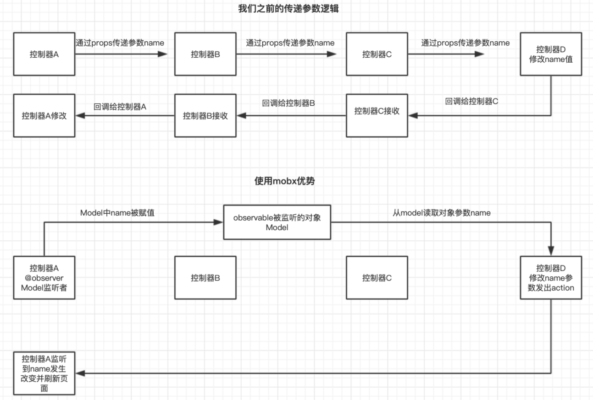

## redux

> - redux是专门用做状态管理的JS库(非react插件库)，但基本与react配合使用
> - 作用：集中式管理react应用中多个组件共享的状态，主要用作组件间通信
>
> 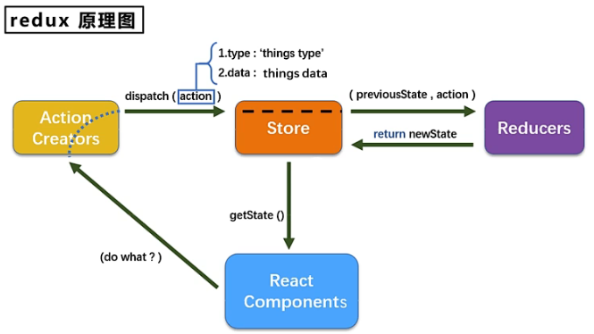

### 用redux使页面数据加减案例

#### redux的主文件

> ```js
> // redux/store.js
> /*
> 	* 引入createStore,专门为创建最核心的store对象
> 	* 引入applyMiddleware中间件，用于为支持redux-thunk的使用
> */
> import { createStore, applyMiddleware } from 'redux'	
> import countReducer from './count_reducer.js'	// 引入为Count组件服务的reducer
> import thunk from 'redux-thunk' // 引入redux-thunk，用于支持异步action
> export default createStore(reducer, applyMiddleware(thunk))
> ```

#### redux的reducer文件，主要是同步函数形式

> ```js
> // redux/count_reducer.js
> /*
> 	* 该文件用于创建Count组件服务的reducer，reducer本质是一个函数
> 	* reducer函数会接收两个参数，分别为：之前的状态preState，动作对象action
> 	* 第一次使用，preState会为undefined，所以需要给其初始化为0才能进行累加累减
> */
> import { INCREMENT,DECREMENT } from './constant'
> const initState = 0	// 初始化状态
> function countReducer(preState = initState, action) {
>   const { type, data } = action
>   switch(type) {
>     case INCREMENT:
>       return preState + data
>     case DECREMENT:
>       return preState + data
>     default:
>       return preState || 0	// 初始化状态
>   }
> }
> ```

#### 封装action函数的常量名，防止函数名打错导致函数不执行

> - 注意：调用redux的函数，如果该函数不存在，也不会报错，只是会不执行，所以需要封装成常量名，防止打错函数名而无法捕获错误
>
> ```js
> // redux/constant.js
> // 该模块用于定义action对象中type类型的常量值,使得容易捕获错误
> export const INCREMENT = "increment"
> export const DECREMENT = "decrement"
> ```

#### redux的action函数

注意：action必须返回一个一般对象(`plain object`)，如果要返回一个函数则需要使用`async`，否则会报错

- 延迟的动作不想交给组件自身，想交给action
- 何时需要异步action：想要对状态进行操作，但是具体的数据靠异步任务返回
    1. `yarn add redux-thunk`，并配置在store中
    2. 创建action的函数不再返回一般对象，而是一个函数，该函数中写异步任务
    3. 异步任务有结果后，分发一个同步的action去真正操作数据
    4. 异步action不是必须要写的，完全可以自己等待异步任务的结果再去分发同步的action

```js
// redux/count_action.js
/* 该文件专门为Count组件生成action对象 */
import { INCREMENT,DECREMENT } from './constant'
import store from "./store"

// 同步action，指action的值为Object类型的一般对象
export const increment = (data) => ({ type:INCREMENT, data })
export const decrement = (data) => ({ type:DECREMENT, data })

// 异步action是指action的值为函数，异步action中一般会调用同步action 
export const incrementAsync = (data, time) => {
  return (dispatch) => {
    setTimeout(() => {
      // store.dispatch(increment(data))
      dispatch(increment(data))
    },time)
  }
}
```


#### Count组件的主内容

> ```jsx
> // components/Count/index.jsx
> import React, { Component } from 'react'
> import store from '../../redux/store' // 引入store用于获取redux中保存状态
> import {increment, decrement, incrementAsync} from '../../redux/count_action' //引入actionCreator，用于创建action对象
> 
> export default class Count extends Component {
>    state = { carName: "奔驰" }
> 
>    /* componentDidMount() {
>     // 检测redux状态的更新，响应式更新页面视图数据
>     store.subscribe() => {
>         this.setState({})
>     }
>   }*/
> 
>     increment() => {
>        const { value } = this.selectNumber
>        // store.dispatch({type:"increment", data:value*1})	// store虽然执行，但是页面视图数据没更新，所以需要通过 componentDidMount 钩子函数来监测redux状态的变化更新
>        // store.dispatch(increment(value*1))	// 直接传递给redux
>       this.props.add(value*1)	// 通过进一步封装redux
>   }
>     decrement() => {
>        const { value } = this.selectNumber
>        // store.dispatch({type:"decrement", data:value*1})
>        store.dispatch(decrement(value*1))
>    }
>    incrementIfOdd() => {
>        const { value } = this.selectNumber
>        /* const count = store.getState()
>        if(count % 2 !== 0) {
>         // store.dispatch({type:"increment", data:value*1})
>         store.dispatch(increment(value*1))
>        } */
>        if(this.props.count % 2 !== 0) {
>          this.props.add(value*1)
>        }
>     }
>     incrementAsync() => {
>        const { value } = this.selectNumber
>        /* setTimeout(() => {
>          // store.dispatch({type:"increment", data:value*1})
>         store.dispatch(increment(value*1))
>       }, 500) */
>        // store.dispatch(incrementAsync(value*1, 500))
>        this.props.addAsync(value*1, 500)
>     }
> 
>   render() {
>        console.log("UI组件接收到的props：", this.props)
>     return {
>          <h1>当前求和：{store.getState()}（单纯使用redux的store的用法）</h1>
>         <h1>当前求和：{this.props.count}（使用Count组件进行封装redux的用法）</h1>
>         <select ref={c => this.selectNumber =c}>
>            <option value="1">1</option>
>            <option value="2">2</option>
>            <option value="2">2</option>
>          </select>
>          <button onClick={this.increment}>+</button>
>          <button onClick={this.decrement}>-</button>
>          <button onClick={this.incrementIfOdd}>当前求和为奇数再加</button>
>          <button onClick={this.incrementAsync}>异步加</button>
>        }
>   }
> }
> ```

#### 在App.jsx中使用容器组件

> ```jsx
> // App.jsx
> import React, { Component } from 'react'
> import Count from './components/Count'
> 
> export default class App extends Component {
>    render() {
>        return (
>          <div>
>            <Count/>
>          </div>
>        )
>    }
> }
> ```

#### 在项目的入口文件`index.js`中配置，只要redux状态发生变化，页面视图内容响应式刷新

> ```js
> // index.js
> import React from 'react'
> import ReactDOM from 'react-dom'
> import App from './App'
> import store from './redux/store'
> import { Provider } from 'react-redux'
> 
> // 只要redux的状态发生变化，就重新执行render函数，这样就不用再每个调用redux的组件中使用componentDidMount钩子函数检测响应式刷新页面数据
> store.subscribe(() => {
> 	React.render(<App/>,document.getElementById('root'))
> })
> ```

### react-redux、容器组件与UI组件

> - UI组件：不能使用任何redux的API，只负责页面的呈现、交互
> - 容器组件：负责与redux通信，将结果交给UI组件
> - 靠`react-redux`的connect函数来创建容器组件
>   - `connect(mapStateToProps,mapDispatchToProps)(UI组件)`
>   - `mapStateToProps`：映射状态，返回值是一个对象
>   - `mapDispatchProps`：映射操作状态的方法，返回值是一个函数
>   - 容器组件中的store是靠props传入的，而不是在容器组件中直接引用
>
> 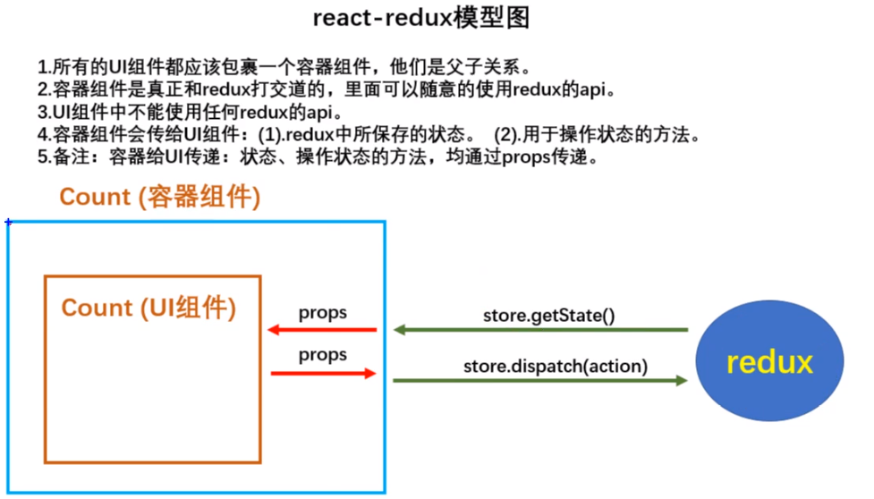
>
> ```jsx
> /* containers/Count/index.jsx：容器组件 */
> import CountUI from '../../components/Count' // 引入Count的UI组件
> import {increment, decrement, incrementAsync} from '../../redux/count_action' // 引入action
> /*
> 	* 引入connect用于连接UI组件与redux
> 	* connect(传递的参数)(UI组件)
> 	* connect是一个柯里化函数，先调用conncet函数，然后在其返回的函数中才能传递放置参数
> 	* connect传递的第一个括号里面的参数必须是函数，其给子组件传递的值是改函数的返回值
> */ 
> import { connect } from 'react-redux'
> /*
> 	* mapStateToProps函数返回的是一个对象，作为状态传递给UI组件，UI组件通过使用props来接收
> 	* mapStateToProps函数的参数为传递的redux的store状态，等同store.getState()
> 	* 函数的返回值传递过去的值等同：<CountUI count={state}/>
> */
> const mapStateToProps = (state) => {
>   return { count: state }
> }
> 
> /*
> 	* mapDispatchToProps函数用于传递状态的操作方法，UI组件通过使用props来接收其方法
> 	* mapDispatchToProps函数的参数为传递给redux使其执行redux设定的方法，等同执行调用store.dispatch()方法
> 	* 函数的返回值传递过去的值等同：<CountUI add={add}/>
> */
> const mapDispatchToProps = (dispatch) => {
>   return {
>     add: number => dispatch(increment(number)),
>     dec: number => dispatch(decrement(number)),
>     addAsync: (number,time) => dispatch(iecrementAsync(number, time)),
>   }
> }
> 
> // 使用 connect()(UI组件名) 创建并暴露一个Count的容器组件
> export default connect(mapStateToProps,mapDispatchToPropsw)(CountUI)
> ```
>
> ```jsx
> // App.jsx 出错的写法
> import React, { Component } from 'react'
> import Count from './containers/Count'	// 修改组件的引用
> 
> export defalut class App extends Component {
>   render() {
>     return (<div><Count/></div>)
>   }
> }
> 
> // App.jsx 纠正后的写法
> import React, { Component } from 'react'
> import Count from './containers/Count'	// 修改组件的引用
> import store from './redux/store'
> export defalut class App extends Component {
>   render() {
>     return (
>       <div>
>         {/* 给容器组件传递store */}
>         <Count store={store}/>
>       </div>
>     )
>   }
> }
> ```
>
> **错误**
>
> > - 错误原因：尚未引入store并使用
> > - 错误解决：删除容器组件内store的引用，而是在使用容易组件的页面中添加store使用
> >
> > 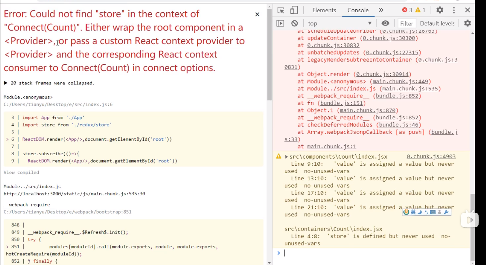
> >
> > 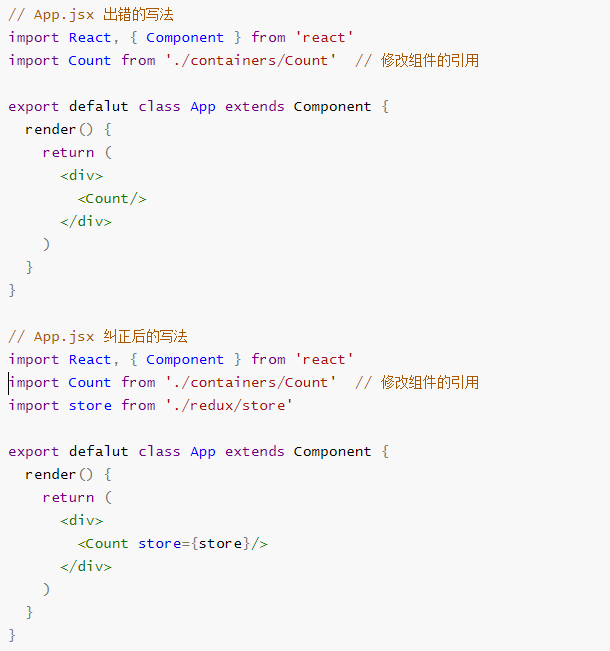

### provider供养者

> - 因为使用redux封装容器时，需要给每个容器传递store才能使用，而使用provider后就不用给每个组件传递store
>
> ```js
> // index.js
> import React from 'react'
> import ReactDOM from 'react-dom'
> import App from './App'
> import store from './redux/store'
> import { Provider } from 'react-redux'
> 
> // 只要redux的状态发生变化，就重新执行render函数，这样就不用再每个调用redux的组件中使用componentDidMount钩子函数检测响应式刷新页面数据
> store.subscribe(() => {
>   React.render(
>     <provider store={store}>
>     	<App/>
>     </provider>,
>     document.getElementById('root')
>   )
> })
> ```

### UI组件与容器组件合并优化

> ```jsx
> import React, { Component } from 'react'
> import store from '../../redux/store' // 引入store用于获取redux中保存状态
> import {increment, decrement, incrementAsync} from '../../redux/count_action' // 引入actionCreator，用于创建action对象
> import { connect } from 'react-redux'
> 
> // 定义UI组件
> class Count extends Component {
>   increment = () => {
>     const { value } = this.selectNumber
>     this.props.add(value*1)	// 通过进一步封装redux
>   }
>   decrement = () => {
>     const { value } = this.selectNumber
>     store.dispatch(decrement(value*1))
>   }
>   incrementIfOdd = () => {
>     const { value } = this.selectNumber
>     if(this.props.count % 2 !== 0) {
>         this.props.add(value*1)
>     }
>   }
>   incrementAsync = () => {
>     const { value } = this.selectNumber
>     this.props.addAsync(value*1, 500)
>   }
> 
>   render() {
>     console.log("UI组件接收到的props：", this.props)
>     return {
>        <h1>当前求和：{this.props.count}（使用Count组件进行封装redux的用法）</h1>
>         <select ref={c => this.selectNumber =c}>
>            <option value="1">1</option>
>            <option value="2">2</option>
>            <option value="2">2</option>
>         </select>
>         <button onClick={this.increment}>+</button>
>         <button onClick={this.decrement}>-</button>
>         <button onClick={this.incrementIfOdd}>当前求和为奇数再加</button>
>         <button onClick={this.incrementAsync}>异步加</button>
>     }
>   }
> }
> 
> // 暴露容器组件
> export default connect(
>   state => ({ count: state }),
>   {
>     add: increment,
>     dec: decrement,
>     addAsync: incrementAsync,
>   }
> )(Count)
> ```

### redux文件分类整合

> ```js
> - redux 				文件夹
> 	- actions 		文件夹
> 		- count.js	为组件生成action对象
> 	- reducers 		文件夹
> 		- count.js	
> 	- constant.js	常量文件
> 	- store.js		暴露文件
> ```
>
> ```js
> /* actions/count.js：该文件专门为Count组件生成action对象 */
> import { INCREMENT,DECREMENT } from '../constant'
> 
> // 同步action，指action的值为Object类型的一般对象
> export const increment = (data) => ({ type:INCREMENT, data })
> export const decrement = (data) => ({ type:DECREMENT, data })
> 
> // 异步action是指action的值为函数，异步action中一般会调用同步action 
> export const incrementAsync = (data, time) => {
>   return (dispatch) => {
>     setTimeout(() => {
>       dispatch(increment(data))
>     },time)
>   }
> }
> ```
>
> ```js
> /* reducers/count.js：用于创建组件服务的reducer，reducer函数(之前的状态preState，动作对象action) */
> import { INCREMENT,DECREMENT } from '../constant'
> const initState = 0	// 初始化状态
> function countReducer(preState = initState, action) {
>   const { type, data } = action
>   switch(type) {
>     case INCREMENT:
>       return preState + data
>     case DECREMENT:
>       return preState + data
>     default:
>       return preState || 0	// 初始化状态
>   }
> }
> ```
>
> ```js
> /* redux/constant.js：配置redux的常量名，使得容易捕获错误 */
> export const INCREMENT = "increment"
> export const DECREMENT = "decrement"
> ```
>
> ```js
> /* redux/store.js：暴露store对象 */
> import { createStore, applyMiddleware } from 'redux'	
> import countReducer from './reducers/count'	
> import thunk from 'redux-thunk'	// 引入redux-thunk，用于支持异步action
> export default createStore(reducer, applyMiddleware(thunk))	// 暴露store
> ```

### combineReducers数据共享

> - 因为redux正常情况下只能暴露一个reducers，所以如果想要使用多个模块，则需要在redux的暴露文件中使用`combineReducers`来让多个模块合并成对象来进行暴露
> - 但是通过引用后，在组件模块中调用时需要在connect函数用`stata.he`等来调用redux的相关信息
>
> ```js
> /* redux/index.js */
> import { createStore, combineReducers, applyMiddleware } from 'redux'	
> import countReducer from './reducers/count'	
> import personReducer from './reducers/person'	
> import thunk from 'redux-thunk'	// 引入redux-thunk，用于支持异步action
> 
> // 汇总所有reducers模块成对象
> const allReducer = combineReducers({
>   counts: countReducer,
>   persons: personReducer,
> })
> 
> // 暴露store
> export default createStore(allReducer, applyMiddleware(thunk))	
> ```
>
> ```jsx
> /* containers/Person/index.jsx */
> import React, { Component } from 'react'
> import {nanoid} from 'nanoid'
> import {connect} from 'react-redux'
> import {addPerson} from '../../redux/actions/person'
> 
> class Person extends Component {
> 	addPerson = ()=>{
> 		this.props.addPerson({
>       id:nanoid(),
>       this.nameNode.value,
>       this.ageNode.value
>     })
> 		this.nameNode.value = ''
> 		this.ageNode.value = ''
> 	}
> 
> 	render() {
> 		return (
> 			<div>
> 				<h2>我是Person组件,上方组件求和为{this.props.counts}</h2>
> 				<input ref={c=>this.nameNode = c} type="text" placeholder="输入名字"/>
> 				<input ref={c=>this.ageNode = c} type="text" placeholder="输入年龄"/>
> 				<button onClick={this.addPerson}>添加</button>
> 				<ul>{this.props.somePerson.map((p)=> <li key={p.id}>{p.name}--{p.age}</li>)}</ul>
> 			</div>
> 		)
> 	}
> }
> 
> export default connect(
> 	state => ({somePerson:state.persons, counts:state.counts}),//映射状态
> 	{addPerson:addPerson}//映射操作状态的方法
> )(Person)
> ```
> 
> ```js
> /* redux/action/person.js */
> //创建增加一个人的action动作对象
> export const addPerson = personObj => ({type:'add_person',data:personObj})
> ```
>
> ````js
> /* redux/reducers/person.js */
> //初始化人的列表
> const initState = [{id:'001',name:'tom',age:18}]
> export default function personReducer(preState=initState,action){
>	const {type,data} = action
> 	switch (type) {
> 		case 'add_person': //若是添加一个人
> 			return [data,...preState]
> 		default:
> 			return preState
> 	}
> }
> ````

### reducer纯函数

> - 犹如redux的reducers返回的对象是之前的对象，但因为跟之前对象一致（虽然添加或删除了部分元素），但仍是原来对象，所以页面视图内容并不会改变（因为reducers只会进行浅比较，底层会判断为还是同样的数据的，所以导致视图数据与之前一样）
> - redux的reducer函数必须是一个纯函数（只要是同样的输入(实参)，必定得到同样的输出(返回)）
>   - 不得改写参数数据
>   - 不会产生任何副作用，如网络请求、输入和输出设备
>   - 不能调用`Date.now()`或`Math.random()`等不纯的方法
>
> ````js
> /* redux/reducers/person.js */
> // 进行浅比较。页面数据不会刷新
> export default function personReducer(preStae = [], action) {
>   const { type, data } = action
>   switch(type) {
>     case 'add_person':
>       // return [data, ...preState] // 因为生成新对象变量，所以视图会更新数据
>     	preState.unshift(data)
>       return preState	// 数据并不会更新， 因为数据对象仍是之前的对象，并没有改变
>     default:
>       return preState
>   }
> }
> ````

### redux开发者工具

> - 在浏览器安装`redux dev tools`工具，正常情况下redux开发者工具是不会正常运行的，需要在系统安装导包才能进行应用
>   - `yarn add redux-devtools-extension`
>   - 在redux的出口暴露文件`store.js`中引用`redux-devtools-extension`的`composeWithDevTools`，并在createStore的第二个参数中调用该函数
>
> ```js
> import {createStore,applyMiddleware,combineReducers} from 'redux'
> import countReducer from './reducers/count'
> import personReducer from './reducers/person'
> import thunk from 'redux-thunk'	//引入redux-thunk，用于支持异步action
> import {composeWithDevTools} from 'redux-devtools-extension'
> import logger from 'redux-logger' // cnpm i --save-dev redux-logger ,引入中间件
> 
> //汇总所有的reducer变为一个总的reducer
> const allReducer = combineReducers({
> 	he:countReducer,
> 	rens:personReducer
> })
> 
> // 中间件计算redux调用的动作
> /* const logger = store => next => action => {
>   console.log("dispatch->", action)
>   let result = next(action)
>   console.log("next state->", store.getState())
>   return result
> }
> const error = store => next => action => {
>   try {
>     next(action)
>   } catch (err) {
>     console.log("error->", err)
>   }
> } */
> 
> // export default createStore(allReducer,composeWithDevTools()) // 如果第二参数中不存在其他的调用
> export default createStore(allReducer,{}, composeWithDevTools(applyMiddleware(logger, thunk)))
> ```

### 简洁案例

> ```jsx
> import React, { Component } from 'react'
> import { connect } from 'react-redux'
> import * as counterActions from '/redux/actions/counter'
> import { bindActionCreators } from 'redux'
> 
> class App extends Component {
>   render(){
>     return (
>       <div>
>         <h1>当前求和：{this.props.counter}</h1>
>         <button onClick={ () => this.props.counterActions.increment(10) }>+</button>
>         <button onClick={ () => this.props.counterActions.decrement(5) }>-</button> 
>       </div>
>     )
>   }
> }
> 
> export default connect(
>   state => ({ counter: state.counter }),
>   (dispatch) => ({
>     counterActions:bindActionCreators(counterActions, dispatch)
>   })
> )(App)
> ```
>
> ```js
> /* redux/reducers/counter.js */
> import * as actions from '../constants'
> const counter = (state = 0,action) => {
>    switch(action.type) {
>       case actions.INCREMENT:
>          return state + action.num;
>       case actions.DECREMENT:
>          return state - action.num;
>       default:
>          return state;
>    }
> }
> export default counter
> ```
>
> ```js
> /* redux/actions/counter.js */
> import * as actions from '../constants'
> export const increment = (num) => ({ 
>    type: actions.INCREMENT,
>     num,
> })
> export const decrement = (num) => ({ 
>   type: actions.DECREMENT,
>   num,
> })
> 
> export const incrementAsync = (num) => {
>   return dispatch => {
>      setTimeout(() => {
>          dispatch({
>            type: actions.INCREMENT,
>            num,
>          });
>        }, 1000);
>     };
> };
> ```
>
> ```js
> /* redux/constants.js */
> export const INCREMENT = "INCREMENT"
> export const DECREMENT = "DECREMENT"
> ```
>
> ```js
> /* redux/reducers/index.js */
> import { combineReducers } from 'redux'
> import counter from './reducers/counter'
> export default combineReducers({ counter })
> ```
>
> ```js
> /* index.js */
> import React from 'react'
> import ReactDOM from 'react-dom'
> import App from './App'
> import { createStore, applyMiddleware } from 'redux'
> import { Provider } from 'react-redux'
> import rootReducer from './redux/index'
> 
> // 中间件计算redux调用的动作
> /* const logger = store => next => action => {
> console.log("dispatch->", action)
> let result = next(action)
> console.log("next state->", store.getState())
> return result
> }
> const error = store => next => action => {
> try {
> next(action)
> } catch (err) {
> console.log("error->", err)
> }
> } */
> import logger from 'redux-logger' // cnpm i --save-dev redux-logger ,引入中间件
> import thunk from 'redux-thunk'	// cnpm i --save-dev redux-thunk ,解决action异步操作
> const store = createStore(rootReducer, {}, applyMiddleware(logger, thunk))
> 
> 
> ReactDOM.render(
> <Provider store={store}>
> <App />
> </Provider>
> ,
> document.getElementById('root')
> );
> ```

## express

> #### nodemon
>
> >- 通过`npm i -g nodemon`安装，它将会见监视源文件中任何的更改自动重启服务器。nodemon不会对代码产生额外改变，只是当修改源文件后无需手动重启更改即可生效(类似热更新)
> >- 执行js文件与node无区别`nodemon index.js`
>
> #### JWT（JSON Web token）
>
> > - 通过`npm i --save jsonwebtoken`安装，
>
> ````js
> /* routes/users.js */
> const express = require('express')
> const isEmpty = require('lodash/isEmpty')
> const validator = require('validator')
> const router = express.Router()
> const jwt = require('jsonwebtoken')
> 
> const validatorInput = (data) => {
>   let errors = {}
>   if(validator.isEmpty(data.username)) {
>     errors.username = "请填写用户名"
>   }
>   if(validator.isEmpty(data.passowrd)) {
>     errors.password = "请输入密码"
>   }
>   if(!validator.equals(data.password, data.pwdConfirm)) {
>     errors.pwdConfirm = "密码不一致"
>   }
>   return {
>     errors,
>     isValid: isEmpty(errors)
>   }
> }
> 
> router.post("/register", (req,res) => {
>   const { errors,isValid } = validatorInput(req.body)
>   const { username, password } = req.body
>   const sql = "select * from user WHERE `username`=? AND `password`=?"
>   const arr = [username, password]
>   sqlFn(sql, arr, (data)=> {
>     if(data.length>0) {
>       const token = jwt.sign({
>         id: data[0].id,
>         username: data[0].username
>       }, config.jwtSecret)
>       } else {
>         res.status(401).json({errors:{from:"用户密码错误"}})
>         if(!isValid) {res.status(401).json(errors) }
>       }
>   })
> 
> })
> 
> module.exports = router
> ````
>
> ```js
> const express = require('express')
> const app = express()
> const users = require('./routes/users')
> const debug = require('debug')("my-application")
> const bodyParser = require('body-parser')
> app.use(bodyParser.json())
> app.use("/api/users", users)
> app.listen(3000, (req,res) => { debug("服务器启动") })
> ```

## DvaJs

> ```js]
> 安装使用
> 	- 安装：`cnpm i dva-cli -g`
> 	- 创建新应用：`dva new dva-demo`
> 	- 切换到项目中启动：`npm start`
> 	- 安装History依赖：`cnpm i --save history`
> 
> 
> Dva正常情况下是无法包含history对象的
>   - 可通过 import { withRouter, Link, routerRedux } from 'dva/router'
>   1. 可使用`withRouter`包裹所暴露的组件来，然后通过`this.props.history.push('/')`进行页面跳转
>   2. 可使用`this.props.dispatch(routerRedux.push('/'))`进行页面跳转
>   3. 可在使用组件时，给其传递一个history参数
> ```
>
> ### 理念
>
> - dva是基于redux和react-saga的数据流方案，为简化开发体验，dva还内置react-router和fetch，也是轻量级应用框架
> - dva把react所需引入的模块集成在一起并形成一定的架构规范，把react常需引用、代码集成一起，如一些依赖、必写的一些的`ReactDOM.render`、引入saga、redux控制台工具、provider包裹等都省去不写，大大提高开发效率
> - 增加一个`Subscriptions`用于收集其他来源的action、eg：键盘操作、滚动条、websocket、路由等
> - 在react-redux上开发的dva+在redux-saga基础上开发的dva-core+在webpack基础上开发的roadhog进行打包启动服务
> - 数据流向（基于redux，所以同react-redux）
>
> 
>
> - 输入url渲染对应的组件，该组件通过dispatch去出发action里面的函数，如果是同步的就去进入model的ruducer去修改state，如果是异步比如fetch获取数据就会被effect拦截通过server交互获取数据进而修改state，同样state通过connect将model、状态数据与组件相连