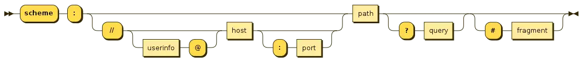

## Vue2.0

## VUE的认知

> ```bash
> ## Vue 的认知
> 1. 提高开发效率的发展历程
>   - 原生JS -> Jquery之类的类库 -> 前端模板引擎 -> Angular.js / vue.js
>   - 能够帮助我们减少不必要的DOM操作；提高渲染能力；双向数据绑定的概念
> 
> 2. 框架和库的区别
>   - 框架：是一套完整的解决方案，对项目的侵入性较大，项目如果需要更换框架，则需要重新架构整个项目。
>   - 库(插件)：提供某一个功能，读项目的侵入性较小，如果某个库无法完成某些需求，可以很容易切换到其他库实现需求
> 
> 3. Vue的两个核心
>   - 数据驱动和组件系统
> 
> 4. 方法和函数的区别
>   - 方法：methods；函数：function
>   - java中只有方法，没有函数（方法面对对象的）
>   - 方法在类中定义的，函数是在外边定义
>   
> 
> Vue 是一个构建数据驱动的渐进式框架，它的目标是通过 API 实现响应数据绑定和视图更新。
> 优点：
>     1. 数据驱动视图：对真实 DOM 进行抽象出 Virtual DOM（本质是一个 JS 对象），并配合 diff 算法、响应式和观察者、异步队列等手段以最小代价更新 DOM，渲染页面。
>     2. 组件化：组件采用单文件的形式进行代码的组织编写，使得我们可以在一个文件里编写 html/js/css（scoped 属性配置 css 隔离），并且配合 vue-loader 之后，支持更强大的预处理等功能。
>     由于采用虚拟 DOM，让 Vue 开发 SSR 更加便捷。
> 缺点：
> 		由于底层基于 Object.defineProperty（vue3采用 Proxy）实现响应式，但这个 API 本身不支持 IE8 及以下浏览器。
> 		CSR 的先天不足，首屏性能问题（白屏）
> 		由于搜索引擎爬虫无法爬取 JS 中的内容，故 SPA 应用先天对 SEO 优化存在短板。
> 
> 
> 
> ### vue 的特点
> 1. 数据双向绑定，数据响应式改变
> 2. 组件化开发，代码量减少，维护代码成本降低
> 3. vue内置指令：可以达到对页面效果处理的行为
> 4. 前端路由：相对于传统的页面通过超链接实现页面的切换和跳转，vue路由不会刷新页面
> 5. vuex状态管理：减少数据的重复性定义和处理
> ```


### MVC 与MVVM 间的区别

> ```bash
> ## MVC 与 MVVM 间的区别
> - MVC是后端的分层开发概念；MVVM是前端视图层的概念，主要关注于视图层分离（即MVVM把前端视图层分为Model，ViewModel，View三部分）
> 
> ### MVVM作用：把逻辑层跟视图层区通过VM调度来分开
>   - M（数据层Model）：指保存的是每个页面中的单独数据，js中data的数据
>   - V（视图层View）：UI组件(html+css)，负责将数据模型转化成UI展现到页面上
>   - VM（视图模型层ViewModel）：分割了M和每当V层想要获取后保存数据时，都要由VM做中间处理，把data中的数据(model层)通过v-model双向数据绑定把数据渲染到页面(view层)（即VM层实现了数据双向绑定）
>     
> 	1. View和ViewModel通信是双向的，ViewModel和Model也是双向通信的
>   2. View和Model不会直接通信
>   
>   
> ### MVC
>   1. View 传送指令到 Controller
>   2. Controller 完成业务逻辑后，要求 Model 改变状态
>   3. Model 将新的数据发送到 View，用户得到反馈
> ```
>
> 
>
> 
>
> 

### vue实现数据双向绑定原理

> ```bash
> ## vue2 实现数据双向绑定的原理
> 1. 监听器Observer：劫持并监听所有属性，对数据对象遍历(包括子属性对象的属性)，利用 `Object.definedProperty()` 对属性加上 setter 和 getter 方法，当对象值增加或获取，就会触发。
> 2. 解析器Compile：解析 Vue 指令模板，将模板的变量替换为数据，然后初始渲染页面视图，并对每个指令节点绑定更新函数，添加监听数据的订阅者，当数据有变动，就会调动更新函数进行数据更新。
> 3. 订阅者Watcher：是监听器和解析器之间通信的桥梁，主要是订阅监听器中的属性值变化，当发生变化，就会触发解析器中对应的更新函数。
> 4. 订阅器Dep：订阅器采用 发布-订阅 模式，用来收集订阅者，对监听器进行统一管理。
> 
> 
> ### Vue2 的 Object.definedProperty 为什么不支持数组的响应式变化？
> Object.definedProperty 虽然可以实现这样的效果，但是 vue2 为了优化性能而不实现这样的功能。
> 因为如果不断地监听数组变化（可能数组存在深层次数据），就会消耗很多不必要的性能，所以在 vue2 中不做这样的实现。
> 而 vue3 可以监听到是因为 vue3 是通过 proxy 代理数据（当数据变动都会触发该proxy对象），而 vue2 是劫持数据。
> ```
>
> 

###  Vue的生命周期

> ```bash
> ## Vue2 的生命周期
> ### 名词说明
> - 生命周期：从 vue 实例创建、运行到销毁期间，总是伴随各种事件，这些事件统称为生命周期。
> 					开始创建vue实例、初始化数据、编译模板、挂载DOM -> 渲染、更新 -> 渲染、销毁等一系列过程。
> - 生命周期钩子 = 生命周期函数 = 生命周期事件 = callbackHook(回调钩子)
> 
> 
> ### 创建期间的生命周期函数
>   1. beforeCreate：
>       在实例初始化后，数据观测(data observer) 和 event/watcher 事件配置之前被调用。
>       在当前阶段，data、methods、computed、watch 上的数据和方法都不能被访问。
>   2. create：
>       实例已经创建完成后被调用。
>       此时实例已经完成数据观测(data observer)、属性和方法的运算、event/watcher 事件回调。
>       此时没有 `$el`(还未进入浏览器 render 阶段)，但可通过 vm.$nextTick 来访问 DOM。
>   3. beforeMount：
>       在挂载开始之前被调用。
>       此时已经完成模板的编译(相关的 render 函数首次被调用)，但是还没挂载到页面中。
>   4. mounted：
>       在挂载完成后被触发。
>       此时真实 DOM 挂载完毕，数据完成双向绑定，可以访问到 DOM 节点。
> 
> ### 运行期间的生命周期函数
>   1. beforeUpdate：
>       数据更新时调用，发生在虚拟 DOM 重新渲染和打补丁(patch) 之前。
>       可以在这个钩子中进一步地更改状态，这不会触发附加的重新渲染过程。
>   2. updated：
>       发生在更新完成之后，当前阶段组件 DOM 已完成更新。
>       注意1：要避免在此期间更改数据，因为这可能会导致无限循环的更新。
>       注意2：该钩子在服务端渲染期间不被调用。
> 
> ### 销毁期间的生命周期函数（vue实例一般不会销毁，一般组件会销毁）
>   1. beforeDestroy：
>       实例销毁之前被调用。此时实例仍然可用。
>       此时常用作善后收尾工作，如清除定时器。
>   2. destroyed：
>       Vue实例(组件)销毁之后调用。
>       调用后，vue实例(组件)的所有东西都会解除绑定，所有的事件监听器都会被移除，所有的子实例也会被销毁。
>       该钩子在服务端渲染期间不被调用。
> 
>   前者适合移除事件、定时器等，避免可能引起的内存泄露问题。
>   然后进行销毁操作，如果有子组件，也会递归销毁子组件，所有子组件都销毁完毕后才会执行根组件的 destroyed 钩子函数。
>   
>   注意：关于销毁 vue 实例
>     - 销毁后借助 vue 开发工具看不到任何消息。
>     - 销毁后自定义会失效，但原生DOM事件依然有效（只是消除其绑定的模板、methods方法与钩子函数等）
>     - 一般不会在 beforeDestroy 操作数据，因为即便可操作数据，也不会再触发数据更新流程。
> 
> 
> ### keep-alive 独有的生命周期函数
> 1. activated：路由设置keep-alive时，该路由组件被激活时调用。
> 2. deactivated：路由设置keep-alive时，该路由组件被销毁时调用。
> 用 keep-alive 包裹的组件在切换时不会进行销毁，而是缓存到内存中并执行 deactivated 钩子函数，命中缓存渲染后会执行 activated 钩子函数。
> ```

### 虚拟DOM

> ```bash
> ## 虚拟 DOM
> DOM（Document Object Model）渲染是很慢的，其元素非常庞大，页面的性能问题鲜有由 JS 引起的，大部分都是由 DOM 操作引起的。如果对前端工作进行抽象的话，主要是维护状态和更新视图，而更新视图和维护状态都需要 DOM 操作。
> 在 JQ 之前直接操作 DOM 结构，这种方法复杂度高，兼容性差；
> JQ 强大的选择器以及高度封装的API 可以让我们更方便的操作 DOM，还能帮我们解决兼容性问题，同时也使得 DOM 操作变得简单；
> MVVM使用数据双向绑定，使得我们完全不需要操作DOM，更新了状态视图会自动更新，更新了视图数据状态也会自动更新，可以说MMVM使得前端的开发效率大幅提升，但是其大量的事件绑定使得其在复杂场景下的执行性能堪忧。
> Vue底层引入的 Virtual DOM(虚拟DOM) 在用 JS 对象表示 DOM 结构后，当页面状态发生变化而需要操作 DOM 时，可以先通过虚拟 DOM 计算出对真实 DOM 的最小修改量，然后再修改真实 DOM 结构(因为真实DOM的操作代价太大)。通过虚拟DOM计算出两颗真实DOM树之间的差异后，就可以修改真实的DOM结构。上文深度优先遍历过程产生了用于记录两棵树之间差异的数据结构patches, 通过使用patches我们可以方便对真实DOM做最小化的修改。
> 
> 
> ### 渲染一个列表时，设置 key 的目的是什么？
> 使用 key 有助于虚拟 dom 识别哪些 items 进行修改(增删改操作)。
> key 应该被赋予数组内的元素一个稳定的唯一字符串，该字符串能唯一地标识一个列表项。
> 
> 
> ## VNode实例对象的属性
>     tag: 当前节点的标签名
>     data: 当前节点的数据对象，
>     children: 数组类型，包含了当前节点的子节点
>     text: 当前节点的文本，一般文本节点或注释节点会有该属性
>     elm: 当前虚拟节点对应的真实的dom节点
>     ns: 节点的namespace
>     context: 编译作用域
>     functionalContext: 函数化组件的作用域
>     key: 节点的key属性，用于作为节点的标识，有利于patch的优化
>     componentOptions: 创建组件实例时会用到的选项信息
>     child: 当前节点对应的组件实例
>     parent: 组件的占位节点
>     raw: raw html
>     isStatic: 静态节点的标识
>     isRootInsert: 是否作为根节点插入，被<transition>包裹的节点，该属性的值为false
>     isComment: 当前节点是否是注释节点
>     isCloned: 当前节点是否为克隆节点
>     isOnce: 当前节点是否有v-once指令
> 
>     VNode可以理解为vue框架的虚拟dom的基类，通过new实例化的VNode大致可以分为几类
>     EmptyVNode: 没有内容的注释节点
>     TextVNode: 文本节点
>     ElementVNode: 普通元素节点
>     ComponentVNode: 组件节点
>     CloneVNode: 克隆节点，可以是以上任意类型的节点，唯一的区别在于isCloned属性为true
> 
> 
> ## patch原理
>     patch函数的定义在src/core/vdom/patch.js中，我们先来看下这个函数的逻辑
>     patch函数接收6个参数：
>     oldVnode: 旧的虚拟节点或旧的真实dom节点
>     vnode: 新的虚拟节点
>     hydrating: 是否要跟真实dom混合
>     removeOnly: 特殊flag，用于<transition-group>组件
>     parentElm: 父节点
>     refElm: 新节点将插入到refElm之前
> 
> 
> ## patch的策略是：
> 如果vnode不存在但是oldVnode存在，说明意图是要销毁老节点，那么就调用invokeDestroyHook(oldVnode)来进行销毁
> 如果oldVnode不存在但是vnode存在，说明意图是要创建新节点，那么就调用createElm来创建新节点
> 当vnode和oldVnode都存在时
> 如果oldVnode和vnode是同一个节点，就调用patchVnode来进行patch
> 当vnode和oldVnode不是同一个节点时，如果oldVnode是真实dom节点或hydrating设置为true，需要用hydrate函数将虚拟dom和真是dom进行映射，然后将oldVnode设置为对应的虚拟dom，找到oldVnode.elm的父节点，根据vnode创建一个真实dom节点并插入到该父节点中oldVnode.elm的位置
> 这里面值得一提的是patchVnode函数，因为真正的patch算法是由它来实现的（patchVnode中更新子节点的算法其实是在updateChildren函数中实现的，为了便于理解，我统一放到patchVnode中来解释）。
> 
> 
> ## patchVnode算法是：
> 1. 如果oldVnode跟vnode完全一致，那么不需要做任何事情
> 2. 如果oldVnode跟vnode都是静态节点，且具有相同的key，当vnode是克隆节点或是v-once指令控制的节点时，只需要把oldVnode.elm和oldVnode.child都复制到vnode上，也不用再有其他操作
> 3. 否则，如果vnode不是文本节点或注释节点
> 4. - 如果oldVnode和vnode都有子节点，且两方的子节点不完全一致，就执行更新子节点的操作（这一部分其实是在updateChildren函数中实现），算法如下
>    - - 分别获取oldVnode和vnode的firstChild、lastChild，赋值给oldStartVnode、oldEndVnode、newStartVnode、newEndVnode
>      - 如果oldStartVnode和newStartVnode是同一节点，调用patchVnode进行patch，然后将oldStartVnode和newStartVnode都设置为下一个子节点，重复上述流程
>      - 如果oldEndVnode和newEndVnode是同一节点，调用patchVnode进行patch，然后将oldEndVnode和newEndVnode都设置为上一个子节点，重复上述流程
>      - 如果oldStartVnode和newEndVnode是同一节点，调用patchVnode进行patch，如果removeOnly是false，那么可以把oldStartVnode.elm移动到oldEndVnode.elm之后，然后把oldStartVnode设置为下一个节点，newEndVnode设置为上一个节点，重复上述流程
>      - 如果newStartVnode和oldEndVnode是同一节点，调用patchVnode进行patch，如果removeOnly是false，那么可以把oldEndVnode.elm移动到oldStartVnode.elm之前，然后把newStartVnode设置为下一个节点，oldEndVnode设置为上一个节点，重复上述流程
> 
> - 如果以上都不匹配，就尝试在oldChildren中寻找跟newStartVnode具有相同key的节点，如果找不到相同key的节点，说明newStartVnode是一个新节点，就创建一个，然后把newStartVnode设置为下一个节点
> - 如果上一步找到了跟newStartVnode相同key的节点，那么通过其他属性的比较来判断这2个节点是否是同一个节点，如果是，就调用patchVnode进行patch，如果removeOnly是false，就把newStartVnode.elm插入到oldStartVnode.elm之前，把newStartVnode设置为下一个节点，重复上述流程
> 
> 1. - - 如果在oldChildren中没有寻找到newStartVnode的同一节点，那就创建一个新节点，把newStartVnode设置为下一个节点，重复上述流程
>      - 如果oldStartVnode跟oldEndVnode重合了，并且newStartVnode跟newEndVnode也重合了，这个循环就结束了
>    - 如果只有oldVnode有子节点，那就把这些节点都删除
>    - 如果只有vnode有子节点，那就创建这些子节点
>    - 如果oldVnode和vnode都没有子节点，但是oldVnode是文本节点或注释节点，就把vnode.elm的文本设置为空字符串
> 2. 如果vnode是文本节点或注释节点，但是vnode.text != oldVnode.text时，只需要更新vnode.elm的文本内容就可以
> 
> 
> ## 生命周期
> patch提供了5个生命周期钩子，分别是
> - create: 创建patch时
> - activate: 激活组件时
> - update: 更新节点时
> - remove: 移除节点时
> - destroy: 销毁节点时
> 
> 
> ## vnode也提供了生命周期钩子，分别是
> - init: vdom初始化时
> - create: vdom创建时
> - prepatch: patch之前
> - insert: vdom插入后
> - update: vdom更新前
> - postpatch: patch之后
> - remove: vdom移除时
> - destroy: vdom销毁时
> 
> 
> ## vue 组件的生命周期
> vue组件的生命周期底层其实就依赖于vnode的生命周期，在src/core/vdom/create-component.js中我们可以看到
> ```

### Diff算法

> - `snabbdom` 是著名的`虚拟DOM`库，是 `diff` 算法的奠基者
> - 虚拟DOM渲染：会比较跟之前元素是否有相同项，只重新渲染与之前元素的不同项
>
> 
>
> - `diff`算法是发生在 新旧`虚拟DOM`之上的，算出如何最小更新，最后反映到`真实DOM`
>   - 遍历旧虚拟DOM，遍历新虚拟DOM，比较不同，重新排序
>   - 只比较同一层级，不跨级比较虚拟DOM
>   - 先判断key值再判断标签名是否相同，都相同则认为是相同节点，不再继续深度比较
>
> 

## 语法

### 插值

> - **文本**
>
>   - 数据绑定最常见的形式就是使用“Mustache”语法（双大括号）的文本插值
>   - Mustache 标签将会被替代为对应数据对象上 `msg` property 的值。当绑定的数据对象上 `msg` property 发生改变，插值处的内容都会更新。
>   - 例：`<span>Message:{{ msg }}</span>`
>
> - **v-once**
>
>   - 通过使用` v-once `指令也能执行一次性地插值，当数据改变时，插值处的内容不会更新。但会影响到该节点上的其它数据绑定
>   - 例：`<span v-once>这个将不会改变: {{ msg }}</span>`
>
> - **原始HTML `v-html`**
>
>   - 双大括号会将数据解释为普通文本，而非 HTML 代码。为了输出真正的 HTML，你需要使用 `v-html`指令
>   - `<p>{{ rawHtml }}</p>  <span v-html="rawHtml"></span>`
>
> - **文本形式`v-text`**
>
>   - `<p v-text="message">v-text的内容，包括把标签一起输出来</p>`
>
> - **不解析直接输出内容`v-pre`	**
>
>   - （ pre 是 prevent的缩写，阻止解析）
>   - `<p v-pre>把{{ message }}直接输出</p>`
>
> - **先解析再渲染`v-cloak`**
>
>   - 包含 v-cloak 属性的 html 标签在页面初始化时会被隐藏，
>
>   - 主要作用是防止当页面加载时，存在vue模板数据没加载到页面时触发(即防止页面中出现vue的变量名)，出现页面闪烁问题
>
>   - 注意：v-cloak要在样式中设置属性；若把`[v-cloak]`样式写在`@import style.css`的方式中，会出现页面闪烁问题，则我们可以改成link或内联样式的方式写入`[v-cloak]`
>
>   - ```html
>     // css
>     [v-cloak] { display:none }
>     
>     <!-- html -->
>     <ul v-cloak v-for="item in obj"><li>{{ obj.name }}</li></ul>
>     <p v-cloak>{{msg}}</p>
>     <p v-text="msg"> 11 </p>
>     <p v-html="msg"> 11 </p>
>     ```
>
> - **v-cloak(斗篷)、v-text、v-html的区别**
>
>   - 相同：都是等到页面解析完后，才会改变相应的数据，此三种指令都可以防止插值表达式的页面闪烁。
>   - ①：v-cloak：需要设置相应的样式才能防闪烁， 而v-text和v-html默认就没有闪烁问题；
>
>   - ②：在使用v-cloak的元素标签中添加其他的内容，渲染完页面后会被保留，而v-text和v-html如果在元素标签中填写其他，页面加载完成后，会被覆盖掉
>
>   - ③：v-html会识别数据中的标签元素，而v-cloak和v-text则不会识别元素标签


###  v-bind:（缩写`：`）

- 是Vue中绑定属性的指令，绑定data中的数据，因为普通的mustache语法无法达成绑定。


```html
<input type="button" value="按钮" v-bind:title="mytitle + '123'">
<input type="button" value="按钮" :title="mytitle + '123'">
<!-- 上面两个式子等价  -->
```

#### 使用v-bind绑定class样式

```html
//1、数组
<h1 :class="['red', 'thin']">这是一个H1</h1>

//2、数组中使用三元表达式
<h1 :class="['red', 'thin', isactive?'active':'']">这是一个H1</h1>

//3、数组中嵌套对象
<h1 :class="['red', 'thin', {'active': isactive}]">这是一个H1</h1>

//4、直接使用对象
<h1 :class="{red:true, italic:true, active:true, thin:true}">这是一个H1</h1>
```

#### 使用v-bind绑定内联样式

```html
//1、直接在元素上通过 :style 的形式，书写样式对象
<h1 :style="{color: 'red', 'font-size': '40px'}">这是一个善良的H1</h1>

//2、将样式对象，定义到 data 中，并直接引用到 :style 中
<h1 :style="h1StyleObj">这是一个H1</h1>
data: {
        h1StyleObj: { color: 'red', 'font-size': '40px'}
}

//3、在 :style 中通过数组，引用多个 data 上的样式对象
<h1 :style="[h1StyleObj, h1StyleObj2]">这是一个H1</h1>
data: {
        h1StyleObj: { color: 'red', 'font-size': '40px'},
        h1StyleObj2: { fontStyle: 'italic' }
}

//4、调用函数的样式
<h1 :style="getStyles()">这是一个H1</h1>
data: {
       finalColor: 'red', 
       finalSize: 100
},
methods: {
	getStyles(){
		return {color: this.finalColor,fontSize: this.finalSize+'px'}
	}
}
```

### v-on:（缩写`@`）

> - 是Vue中绑定事件的指令，调用需在methods里设置触发事件（即绑定的是一个函数/方法）
>
>
> ```html
> <input type="button" value="按钮" v-on:click="stop">
> <input type="button" value="按钮" @click="stop">
> ```

#### v-on的参数传递

> - 当v-on中不带参数时，可以省略小括号，但方法本身是需要一个参数的，此时vue会默认将浏览器生成的event事件对象作为参数传入到方法
> - 手动获取到浏览器参数的event对象：**$event**
>
> ```vue
> //html
> <div id="app">
>     <!-- 事件调用方法不带参数 -->
>     <button @click="btn1">按钮1</button>
>     <button @click="btn1()">按钮2</button>
> 
>     <!-- 带一个参数 -->
>     <button @click="btn2(123)">按钮3</button>
>     <button @click="btn2()">按钮4</button>
>     <button @click="btn2">按钮5</button>
> 
>     <!-- 带两个参数 -->
>     <!-- 手动获取到浏览器参数的event对象：$event -->
>     <button @click="btn3(123,$event)">按钮6</button>
>     <button @click="btn3">按钮7</button>
> </div>
> <!-- 按钮1、2为空值；按钮3：123；按钮4：undefined；按钮5：event对象；按钮6、7:123，evnet对象 -->
> //JS
> const app = new Vue({ 
> 	el: '#app',
> 	methods: {
> 		btn1(){ console.log("btn1"); },
> 		btn2(event){ console.log("btn2———",event); },
> 		btn3(abc,event){ console.log("btn3——",abc,"——",event); }
> 	}
> });
> ```

#### v-on 绑定多个方法

> ```vue
> <template>
> 	<p v-on="{ click:dbClick, mousemove:MouseClick }">绑定多个触发事件</p>
> 
> 	<p @click="one(), two()">绑定多个方法·</p>
> </template>
> ```

### `v-on`事件修饰符

> -  .stop：阻止事件冒泡（不再循环触发，也不在子代触发）
> -  .prevent：阻止默认事件行为（如a标签的跳转，表单的跳转）
> -  .capture：实现捕获事件的触发机制（从最外层标签到内层标签逐层触发）
> -  .self：只当事件在该元素本身（如不是子元素）触发时触发回调
> -  .once：事件只触发一次
> -  .`{keyCode|keyAias} `：只当事件是从特定键触发时才触发回调
> -  native：监听组件根元素的原生事件**（组件是不能点击的，必须加上`.native`，否则会认为监听的是来自Item组件自定义的事件）**
>
>
> > .stop与.once的区别：.self只会阻止自身的冒泡行为触发，并不会真正组织冒泡
>
> ```html
> <!-- 阻止单击事件继续传播 -->
> <a @click.stop="doThis"></a>
> 
> <!-- 提交事件不再重载页面 -->
> <form @submit.prevent="onSubmit"></form>
> 
> <!-- 修饰符可以串联 -->
> <a @click.stop.prevent="doThat"></a>
> 
> <!-- 只有修饰符 -->
> <form @submit.prevent></form>
> 
> <!-- 添加事件监听器时使用事件捕获模式 -->
> <!-- 即内部元素触发的事件先在此处理，然后才交由内部元素进行处理 -->
> <div @click.capture="doThis">...</div>
> 
> <!-- 只当在 event.target 是当前元素自身时触发处理函数 -->
> <!-- 即事件不是从内部元素触发的 -->
> <div @click.self="doThat">...</div>
> 
> <!-- 点击事件将只会触发一次 -->
> <a @click.once="doThis"></a>
> 
> <!-- 点击事件监听键帽（点击enter键触发事件） -->
> <input type="text" @keyup.enter="keyup">
> 
> //1、 给vue组件绑定事件时，必须加上native ，否则会认为监听的是来自Item组件自定义的事件
> //2、 等同在子组件中：子组件内部处理click事件然后向外发送click事件：$emit("click".fn)
> <Item @click.native = "shijian()"></Item>
> ```
>

### 数据双向绑定`v-model`

- v-bind只能实现数据的单向绑定，只能从M自动绑定到V，无法实现数据双向绑定

- 表单元素：`input（text、radio、address、email….）、select、checkbox、textarea`
- `v-model` 在内部为不同的输入元素使用不同的 property 并抛出不同的事件
  - text 和 textarea 元素使用 `value` property 和 `input` 事件；
  - checkbox 和 radio 使用 `checked` property 和 `change` 事件；
  - select 字段将 `value` 作为 prop 并将 `change` 作为事件。

```html
<div id="app">
	<input v-model="test">
	<!-- <input :value="test" @input="test = $event.target.value"> --><!--语法糖，等价于v-modl='test'-->
</div>
<script>
    new Vue({
    	el: '#app',
    	data: {
        	test: '这是一个测试'
        }
    });
</script>
```

```vue
//select选择多个(需要按住ctrl键选择)
//html
<div id="app">
	<select name="abc" v-model="fruit" multiple>
        <option value="苹果">苹果</option>
        <option value="香蕉">香蕉</option>
    </select>
    <p>{{fruit}}</p>
</div>

//vue
const app = new Vue({ 
    el: '#app',
    data: {
    	fruit: []
    }
});
```

```html+vue
//HTML
<div id="app">
<!-- checkbox多选框 -->
    <input type="checkbox" value="篮球" v-model="hobbies">篮球
    <input type="checkbox" value="足球" v-model="hobbies">足球
    <input type="checkbox" value="乒乓球" v-model="hobbies">乒乓球
    <p>您的爱好是：{{hobbies}}</p>

    <label v-for="item in originHobbies" :for="item">
        <input type="checkbox" :value="item" :id="item" v-model="hobbies">{{item}}
    </label>
</div>

//VUE
const app = new Vue({ 
    el: '#app',
    data: {
    	hobbies: ['篮球'],	//多选框，默认为篮球
    	originHobbies: ['篮球','足球','乒乓球','羽毛球','台球','高尔夫球']
    }
});
```

**修饰符**

v-model默认是在input事件中同步输入框的数据，即一旦数据发生改变对应的data中数据自动改变。

- lazy修饰符：使数据失去焦点或回车才会更新
- number修饰符：将输入的数字转换为Number 类型
  输入框中无论输入的是字母还是数字，都会被当做字符串string 处理(数字输入框比较有用)
- trim修饰符：自动过滤输入的首尾空格
  如果输入内容首尾很多空格，通常我们希望将其去除(内容中间的空格无法去掉)

```vue
<input type="text" v-model.lazy="test">
<input type="number" v-model.number="test">
<input type="text" v-model.trim="test">
```

> **.sync修饰符**
>
> ```js
> // 父组件给子组件传入一个函数
> <MyFooter :age="age" @setAge="(res)=> age = res"></MyFooter>
> 
> // 子组件通过调用这个函数来实现修改父组件的状态
> mounted() {
> console.log(this.$emit('setAge', 1234567));
> }
> ```
>
> ```js
> // 父组件将age传给子组件并使用.sync修饰符
> <MyFooter :age.sync="age">
> 
> // 子组件触发事件
> mounted() {
> console.log(this.$emit('update:age', 1234567));
> }
> ```
>
> - 需要注意，事件名称被换为`update:age`
>   - update：是被固定的，即vue为我们约定好的名称部分
>   - age是我们要修改的状态名称，是我们手动配置的，与传入的状态名字对应起来
>   - 我们必须在事件执行名称前加上`update:`的前缀才能正确触发事件

### 循环`v-for和key属性`

> #### 迭代（数组、对象属性、数字）
>
> ```vue
> //1、迭代数组
> <ul>
> <li v-for="(item,i) in list">索引：{{i}}---值：{{item.name}}{{item.age}}</li>
> </ul>
> 
> //2、迭代对象中的属性 //循环遍历对象身上的属性
> <div v-for="(val,key,i) in info">{{val}}---{{key}}---{{i}}</div>
>     
> //3、迭代数字
> <p v-for="i in 10">这是第 {{i}} 个P标签</p>
> ```
>
> - 当 vue用`v-for`正在更新已渲染过的元素列表时默认用**就地复用**策略。如果数据项的顺序被改变，Vue**不是移动 DOM 元素来匹配数据项的顺序**， 而是**简单复用此处每个元素**，并且确保它在特定索引下显示已被渲染过的每个元素。
> - 为了给 Vue 一个提示，**以便它能跟踪每个节点的身份，从而重用和重新排序现有元素**，需要为每项提供一个唯一 **key** 属性。
> - key的作用主要是为了高效地的更新虚拟DOM。
>
> #### key值绑定的问题描述
>
> - 注意：如果循环的的是一个如`[1, 2, 3]`，并且绑定的key值为value值，且给其内置绑定的是输入框可改变值，则每次输入内容都会失去焦点。
>- 这是因为每次输入值，其都会使得重新渲染标签，即之前所绑定的标签，虚拟DOM认为已经被删除，且添加了一个新的标签内容进来
> 
> ```vue
><!-- 错误的绑定方法，每次在输入框中输入值，都会使得输入框失去焦点 -->
> <div v-for="(val, index) in arr" :key="val">
>   <input v-model="val" type="text" />
> </div>
> 
> <div v-for="(val, index) in arr" :key="index">
>   <input v-model="val" type="text" />
> </div>
> 
> <script setup>
> import { ref } from 'vue'
> const arr = [1, 2, 3];
> </script>
> ```
> 
> #### vue循环赋值
>
> ```js
>this.purdetailData.itemList.forEach((i) => {
>     if(i.IIType == "尺寸类") {
>        this.dataResource = Object.assign({}, i.detailList);	//浅拷贝
>         this.dataResource = [...i.detailList];	// 三点运算符，算是深拷贝
>     }
> })
> let newArr =  this.purdetailData.itemList.filter((item)=>{	// 过滤
>     return item.IIType == "尺寸类"
> })
> ```
> 
> 
> ### 方法
> 
>- **splice()**：从数组中添加/删除u项目，然后返回被删除的项目（返回数组，且会改变原数组）
>
> ```js
>arrayObject.splice(index,howmany,item1,.....,itemX);
> //index	必需。整数，规定添加/删除项目的位置，使用负数可从数组结尾处规定位置。
>//howmany	要删除的项目数量。如果设置为 0，则不会删除
> //item1, ..., itemX	可选。向数组添加的新项目。
> this.arr.splice(1);//删除第一个参数后面的所有参数
> this.arr.splice(1,3);//删除第一个参数的三个参数
> ```
> 
> - **push()**：添加元素到最后面	//this.array1.push('abc');
> - **pop()**：删除最前面的元素	//this.array1.pop();
> - **shift()**：删除数组第一个元素	//this.array1.shirt();
>
> - **unshift**：在数组最前面添加元素	//this.array1.unshirt('aaa','bbb','ccc');
> 
> - **sort()：**排序。
>- **reverse()：**对字符串进行反转操作。
> 
>- **Number.toFixed(num)**：定义num位小数位数（需要是数字型）
> - **padStart(maxLength,fillString=' ')**：用于头部补全，补充字符串
> 
>- **padEnd(maxLength,fillString=')**：用来尾部补全，填充字符串
> 
> ```js
>//超出会自动补全，差一点则截取到最大长度
> 'AA'.padStart(5,'B')  //输出：BBBAA
>'AA'.padStart(5,'BC')  //输出：BCBAA
> 
> 'AA'.padEnd(5,'B') //输出：AABBB
> 'AA'.padEnd(5,'BC') //输出：AABCB
> ```
> 

### v-if

```vue
//当isName=true时显示
<div v-if="isName">
    <p v-if="score>=90">优秀</p>
    <p v-else-if="score>=80">良好</p>
    <p v-else-if="score>=60">及格</p>
    <p v-else="score<60">不及格</p>
</div>
```

**v-if 和 v-show**

- v-if（不存在DOM中-->有较高的切换性能消耗）和v-show（通过CSS样式隐藏-->有较高的初始渲染消耗）

- 两者区别：

  v-if按照条件是否渲染（v-if每次都会重新删除或创建元素）

  v-show是dispkay的bloak或none（v-show每次都不会重新进行DOM的删除和创建操作，只会切换了元素的display:none;样式）

- 推荐使用场景

  如果涉及到频繁的切换，使用v-show

  如果元素可能永远也不会被显示出来被用户看到，则推荐使用v-if

### vue中this的必要性

- **在VM实例中，如果要访问data上的数据，或者访问methods中的方法，必须带this**

### 计算属性`computed`

- **computed 适合多个数据变化影响一个数据（得到的是一个返回的新值）**

- 计算属性是由data中的已知值，得到的一个新值。
  这个新值只会根据已知值的变化而变化，其他不相关的数据的变化不会影响该新值。
  计算属性不在data中，计算属性新值的相关已知值在data中。
- 支持缓存，只有依赖数据发生改变，才会重新进行计算
- 不支持异步，当computed内有异步操作时无效，无法监听数据的变化
- 若computed属性值是函数，默认会用get方法；函数的返回值就是属性的属性值；在computed中的属性都有一个get和set方法，当数据变化时，调用set方法。（计算属性一般没有set方法，只读属性）
- `computed`计算时只执行调用一次，而methods每次运行都需要执行调用（因为`computed`拥有自己的缓存机制）

```js
//在html里要当作属性来使用，所以调用计算属性不需要加括号
<div id="demo">{{ fullName }}</div>

//js
var vm = new Vue({
  el: '#demo',
  data: {
    firstName: 'Foo',
    lastName: 'Bar',
  },
  computed: {
	/* fullName:{
      // get和set方法
      set:function(newValue){
        const names = newValue.split(' ');
        this.firstName=names[0];
        this.lastName=names[1];
      },
      get:function(){
        return this.firstName+' '+this.lastName
      }
    } */
    fullName() {
      return this.firstName + ' ' + this.lastName
    }
  }
})
```

### 侦听属性`watch`

- **watch 适合一个数据的变动影响多个数据或者复杂的运算（当data中所监听的数据发生变动时，才会执行）**
- **watch的作用可以监控一个值（必须存在`data`中）的变换，并调用因为变化需要执行的方法。可以通过watch动态改变关联的状态。**
- 不支持缓存，监听的数据改变，直接会触发相应的操作；
- watch支持异步；
- 监听的函数接收两个参数，第一个参数是最新值，第二个参数是输入之前的值； 当一个属性发生变化时，需要执行对应的操作；一对多；
- 监听数据必须是data中声明过或者父组件传递过来的props中的数据，当数据变化时，触发其他操作，函数有两个参数，
  - immediate：立即监听，
  - deep: 深度监听，为了发现**对象内部值**的变化，复杂类型的数据时使用，如数组中的对象内容的改变(监听数组的变动不需要)
    注意：deep无法监听到数组的变动和对象的新增，参考vue数组变异,只有以响应式的方式触发才会被监听到。

```js
data:{
  a:1,
    b:{
      c:1
    }
},
  watch:{
    a(val, oldVal){//普通的watch监听
      console.log("a: "+val, oldVal);
    },
      b:{//深度监听，可监听到对象、数组的变化
        handler(val, oldVal){
          console.log("b.c: "+val.c, oldVal.c);
        },
          deep:true //true 深度监听
      }
  }
```

###  template标签

- H5中的template
  **html中的template标签中的内容在页面中不会显示**，但是在后台查看页面DOM结构存在template标签。（因为template标签设置了`display:none;`属性）

- vue实例中的template属性
  将实例中template属性值进行编译，并将编译后的dom替换掉vue实例绑定的元素，如果该vue实例绑定的元素中存在内容，这些内容会直接被覆盖。

- 循环遍历
  template的作用是占位符，可帮助我们包裹元素，但在循环的过程中，template不会被渲染到页面上。

  ```vue
  <template v-for="(item, index) in list" :key="item.id">
  	<div>{{item.text}}--{{index}}</div>
  	<span>{{item.text}}</span>
  </template>
  ```

### scoped属性

> ```bash
> ## scoped 属性
> - scoped 代表作用域。
> - 在 `<style scoped></stype>` 中添加scope属性，该style中的css样式只会针对当前组件起效果；若不添加，其他组件中的css样式相同样式，会在该组件中其效果。
> 
> 
> ### scoped 的原理
> vue中的 scoped 通过在DOM结构以及css样式上加唯一不重复的标记:data-v-hash的方式，以保证唯一（而这个工作是由过PostCSS转译实现的），达到样式私有化模块化的目的。
> PostCSS会给一个组件中的所有dom添加了一个独一无二的动态属性data-v-xxxx，然后，给CSS选择器额外添加一个对应的属性选择器来选择该组件中dom，这种做法使得样式只作用于含有该属性的dom——组件内部dom, 从而达到了'样式模块化'的效果。
> 
> 
> ### scoped 渲染规则
> 1. 给HTML的DOM节点加一个不重复data属性(形如：data-v-123)来表示他的唯一性
> 2. 在每句css选择器的末尾（编译后的生成的css语句）加一个当前组件的data属性选择器（如[data-v-123]）来私有化样式
> 3. 如果组件内部包含有其他组件，只会给其他组件的最外层标签加上当前组件的data属性
> ```

### 深度修改样式`/deep/`或`>>>`

> ```bash
> ## 样式穿透：深度修改样式 /deep 或 >>>
> - 使用scoped后，父组件的样式将不会渗透到子组件中；但一个子组件的根节点会同时受其父组件scoped CSS和子组件的scoped CSS的影响。
> - 如果希望scoped样式中的一个选择器能够作用得更深（如影响子组件），可以使用`>>>`操作符。
> - 如Sass之类的预处理无法正确解析`>>>`，这种情况下可以使用`/deep/`或`:v-deeep`操作符取而代之（两者都是`>>>`的别名）
> ```
>
> ```vue
> <style scoped>
> .a >>> .b { /* css样式 */ }
> </style>
> 
> //会编译成如下:
> .a[data-v-f3f3eg9] .b { /* css样式 */ }
> ```

### 动画

动画进入：

- v-enter：动画进入之前的**初始**状态，动画还没开始（是时间点）
- v-enter-to：动画进入之后的**结束**状态，此时动画已经结束（时间点）
- v-enter-active：动画进入的时间段

动画离开：

- v-leave：动画离开之前的**初始**状态（时间点）
- v-leave-to：动画离开之后的**结束**状态（时间点）
- v-leave-active：动画离开的时间段


```css
<style>
  .v-enter,
  .v-leave-to {
    opacity: 0;
    transform: translateX(80px);
    /* smyhvae提示：v-enter表示，一开始让DOM元素处于靠右80px的位置 */
  }
  .v-enter-active,
  .v-leave-active {
    transition: all 1s ease;
    /*期间，设置过渡的属性：all表示所有的属性、时间为1秒、过渡的状态*/
  }
</style>
```

#### 自定义动画

- 通过修改过渡类名的前缀来把两个DOM元素的动画进行分开定义
- 注意：`enter-active-class`和`leave-active-class`这两个类名是Vue动画里的关键词
- 给出/入场动画设置持续的时间，可以使用`:duration`
- 注意：在实现列表过渡的时候，如果需要过渡的元素，是通过 v-for 循环渲染出来的，不能使用 transition 包裹，需要使用 transitionGroup
  - 给 transition-group 添加 appear 属性，实现页面刚展示出来时候，入场时候的效果
  - 通过 为 transition-group 元素，设置 tag 属性，指定 transition-group 渲染为指定的元素，如果不指定 tag 属性，默认，渲染为 span 标签

```vue
// html
<transition name="my" enter-active-class="animated bounceIn" leave-active-class="animated bounceOut" :duration="{ enter: 1000, leave: 300 }">
  <h6 v-if="flag2">这是一个H6</h6>
</transition>

// css
.my-enter,
.my-leave-to {
  opacity: 0;
  transform: translateY(70px);
}
```

**动画的生命周期函数**

```html
<transition
  v-on:before-enter="beforeEnter"
  v-on:enter="enter"
  v-on:after-enter="afterEnter"
  v-on:enter-cancelled="enterCancelled"

  v-on:before-leave="beforeLeave"
  v-on:leave="leave"
  v-on:after-leave="afterLeave"
  v-on:leave-cancelled="leaveCancelled"
>
  <!-- DOM元素 -->
</transition>
```

**transition-grop**

```html
<transition-group appear  tag="ul">
  <li v-for="(item, i) in list" :key="item.id" @click="del(i)">
    {{item.id}} --- {{item.name}}
  </li>
</transition-group>
```

### 过滤器

- 过滤器可用两个地方：mustache插值和v-bind表达式，过滤器应添加在JS表达式的尾部，有“管道”符表示。
- `Vue.filter('过滤器名称',function(data){return data;})`：过滤器中function的第一个参数data永远都是过滤器管道符前面传递来的数据

#### 私有过滤器

```vue
<td>{{item.ctime | dataFormat('yyyy-mm-dd')}}</td>

filters: { // 私有局部过滤器，只能在当前VM对象所控制的 View 区域使用
    dataFormat(input, pattern = "") { // 在参数列表中通过 pattern="" 来指定形参默认值，防止报错
      var dt = new Date(input);
      // 获取年月日
      var y = dt.getFullYear();
      var m = (dt.getMonth() + 1).toString().padStart(2, '0');
      var d = dt.getDate().toString().padStart(2, '0');
      
      // 如果 传递进来的字符串类型，转为小写之后，等于 yyyy-mm-dd，那么就返回 年-月-日
      // 否则，就返回  年-月-日 时：分：秒
      if (pattern.toLowerCase() === 'yyyy-mm-dd') {return `${y}-${m}-${d}`;
      } else { // 获取时分秒
        var hh = dt.getHours().toString().padStart(2, '0');
        var mm = dt.getMinutes().toString().padStart(2, '0');
        var ss = dt.getSeconds().toString().padStart(2, '0');
        return `${y}-${m}-${d} ${hh}:${mm}:${ss}`;
      }
    }
  }

/* 使用ES6中的字符串新方法 
String.prototype.padStart(maxLength, fillString='')
String.prototype.padEnd(maxLength, fillString='')
来填充字符串； */
```

#### 全局过滤器

> 注意：局部过滤器优先于全局过滤器被调用
> 当有局部和全局两个名称相同的过滤器时，会以就近原则进行调用

```vue
// 定义一个全局过滤器
Vue.filter('dataFormat', function (input, pattern = '') {
  var dt = new Date(input);
  // 获取年月日
  var y = dt.getFullYear();
  var m = (dt.getMonth() + 1).toString().padStart(2, '0');
  var d = dt.getDate().toString().padStart(2, '0');

  // 如果传递进来的字符串类型，转为小写之后，等于 yyyy-mm-dd，那么就返回 年-月-日;否则，就返回  年-月-日 时：分：秒
  if (pattern.toLowerCase() === 'yyyy-mm-dd')  {return `${y}-${m}-${d}`;
  } else { // 获取时分秒
    var hh = dt.getHours().toString().padStart(2, '0');
    var mm = dt.getMinutes().toString().padStart(2, '0');
    var ss = dt.getSeconds().toString().padStart(2, '0');
    return `${y}-${m}-${d} ${hh}:${mm}:${ss}`;
  }
});
```

```html+vue
<div id="app">
    <p>{{ msg | msgFormat('疯狂','123') }}</p>
</div>

//js
Vue.filter('msgFormat',function(msg, arg, arg2){
	return msg.replace(/单纯/g,arg + arg2)

})
var vm = new Vue({
	el: '#app',
	data: {
		msg: '曾经，我也是一个单纯的少年，单纯的我，傻傻的问谁是世界上最单纯的男人'
	}
})
```

## 组件

### 全局组件与局部组件

> ```html+vue
> <div id="app">
> 	<cpn></cpn>
> </div>
> 
> //全局组件
> //创建组件构造器对象
> const cpnC = Vue.extend({
> 	template:`<div><h2>标题</h2><p>内容</p><div>`
> })
> //注册组件
> Vue.component('cpn',cpnC);	//cpn为使用时的标签名
> ```
>
> ```html+vue
> //局部组件(可以在创建组件中调用其他组件标签，template里的``是tab键上面那个)
> //HTML
> <div id="app">
> 	<cpn></cpn>
> </div>
> 
> //js
> const cpnC1 = Vue.extend({	//子组件
> 	template: `
> 		<div>
> 			<h2>标题1</h2>
> 			<p>内容1</p>
> 		<div>
> 	`
> })
> const cpnC2 = Vue.extend({	//父组件
> 	template: `
> 		<div>
> 			<h2>标题2</h2>
> 			<p>内容2</p>
> 			<cpn1></cpn1> <!-- 调用cpnC1组件的内容 -->
> 		<div>
> 	`,
> 	components: {	//cpnC1的调用只能在cpnC2中使用
> 		cpn1: cpnC1
> 	}
> })
> const VM = new Vue({
> 	el: '#app',
> 	components: {	//root组件
>      cpn: cpnC2
>  }
> })
> ```
>
> #### 组件注册的语法糖
>
> ```js
> //全局组件语法糖
> Vue.component('cpn1',{
> 	template: 
> 		`<div>
> 			<h2>标题1</h2>
> 			<p>内容1</p>
> 		<div>`
> })
> 
> //局部组件语法糖
> const VM = new Vue({
> 	el: '#app',
> 	components: {
>      'cpn2': {
>      	template: 
>          `<div>
>           <h2>标题2</h2>
>           <p>内容2</p>
>         <div>`
>      }        
>  }
> })
> ```
>
> **组件优化**
>
> ```html+vue
> //HTML
> <div id="app">
>  <cpn></cpn>
>  <cpn1></cpn1>
> </div>
> <!-- 1.通过template标签 -->
> <template id="cpnC1">
>  <div>
>      <h2>标题1</h2>
>      <p>内容1</p>
>  <div>
> </template>
> 
> <!-- 2.通过script标签，但是类型必须为text/x-template -->
> <script type="text/x-template" id="myCpn">
>  <div>
>      <h2>标题1</h2>
>      <p>内容1</p>
>  <div>
> </script>
> 
> //JS
> Vue.component('cpn1',{
> 	template: '#cpnC1'
> })
> const VM = new Vue({
>  el: '#app',
>  components: {
>      'cpn': {
>      	template: '#myCpn'
>      }
>  }
> })
> ```

### 组件data

> ```bash
> ## 组件的 data 属性
> - 组件的 data 不能是对象的原因：
> 		vue组件中 data 值不能为对象，因为对象是引用类型，组件可能会被多个实例同时引用。
> 		如果 data 值为对象，将导致多个实例共享一个对象，其中一个组件改变 data 属性值，其它实例也会受到影响。
> 
> - data 为函数的原因：
> 		data 为函数，通过 return 返回对象的拷贝，致使每个实例都有自己独立的对象，实例之间可以互不影响地改变 data 的属性值。
> ```
>
> ```vue
> //HTML
> <div id="app">
>   <cpn></cpn>
> </div>
> 
> <template id="cpnC1">
> 	<div>
>     <h2>{{title}}</h2>
>     <p>{{content}}</p>
>   <div>
> </template>
> 
> //js
> <script>
>   Vue.component('cpn',{
>     template: '#cpnC1',
>     data(){
>       return{
>         title: '我是标题',
>         content: '我是内容'
>       }
>     }
>   })
> </script>
> ```
>

### 组件name的作用

> ```vue
> <template>
> 	<div>组件命名为detail,其中dom加载完毕后,在钩子函数mounted中进行数据加载</div>
> </template>
> <script>
> export default {
> 	name: 'Details',
> 	mounted() {
> 		this.getInfo();	// 请求加载数据
> 	},
> 	methods: {
> 		getInfo() {
> 			// 通过接口请求数据。。。
> 		}
> 	}
> }
> </script>
> ```
>
> #### 作用一：当项目使用`keep-alive`时，可搭配组件`name`进行缓存过滤。
>
> - 因为使用`keep-alive`会导致我们第二次进入时页面不会重新请求，即触发`mounted`函数。
>   有两种解决方案，一是增加`activated()`函数，每次进入新页面时再获取一次数据。
>   								  二是在`keep-alive`中增加一个过滤。
>
> - ```vue
>   <div>
>   	<keep-alive exclude="Details">
>   		<router-view/>
>   	</keep-alive>
>   </div>
>   ```
>
> #### 作用二：DOM做递归组件时
>
> - 比如说detail.vue组件里有个List.vue子组件，递归迭代时需要调用自身name
>
> ```vue
> <div>
>   <div v-for="(item,index) of list" :key="index">
>     <div>
>       <span class="item-title-icon"></span>
>       {{item.title}}
>     </div>
>     <div v-if="item.children" >
>       <detail-list :list="item.children"></detail-list>
>     </div>
>   </div>
> </div>
> <script>
>   export default {
>     name:'DetailList',//递归组件是指组件自身调用自身
>     props:{
>       list:Array
>     }
>   }
> </script>
> ```
>
> #### 作用三：当你用vue-tools时，vue-devtools调试工具里显示的组见名称是由vue中组件name决定的

### 组件懒加载

> #### 不用懒加载引入组件
>
> ```vue
> <template>
> 	<div>
>        <p>{{ msg }}</p>
>        <one-comp />
>     </div>
> </template>
> 
> <script>
>   import OneComp from './OneComp'
>   export default {
>       components: {
>          "one-comp": OneComp
>       },
>       data () {
>          return {
>            msg: 'Hello World !'
>          }
>       }
>   }
> </script>
> ```
>
> #### 组件实现懒加载方式
>
> 1. vue异步组件实现懒加载：`组件定义名: resolve => (['所加载组件的所在路径'], resolve)`
> 2. ES6的import方法实现懒加载：`组件定义名: () => import('所加载组件的所在路径')`
>
> ```vue
> <template>
> 	<div>
>     <one-comp />
>     <two-comp />
>     <three-comp />
>   </div>
> </template>
> 
> <script>
> import OneComp from './OneComp'
> export default {
>   components: {
>     "one-comp": OneComp,
>     "two-comp": resolve => (['./TwoComp'], resolve), // 异步组件加载
>     "three-comp": () => import('./ThreeComp'), // ES6的import方法
>   },
>   data () {
>     return {
>       msg: 'Hello World !'
>     }
>   }
> }
> </script>
> ```

### 父子组件的通信

#### 父传子`props`

> ```bash
> ### 父传子 props
> - 通过 props 接收父组件传递数据。
>     - 父组件在引用子组件时，父组件通过事件绑定机制，将父组件的方法/值传递给子组件。
>     - 在子组件中 使用 `props` 属性来接收父组件传来的数据（如果定义类型，就会对传来的数据做过滤）
>     - 在子组件中使用 `$attrs` 会保存父组件传来的数据中 `props` 不接收的数据（捡漏）
>           注意：`$attrs` 中接收的数据不会存在类型过滤（父组件传递什么数据就会接收什么）
> 
> #### 子组件中，data 中的数据和 props 中的数据的区别：
> 		- 子组件中的 data 数据，并不是通过父组件传递过来的，而是子组件自身私有的；
> 			props 中的数据都是通过父组件传递给子组件的。
> 		- data 中的数据是可读可写的；props 中的属性是只读的，重新赋值会报错。
> 			即单向数据流：子组件不能直接修改父组件中的数据。
> ```
>
> ```vue
> <div id="app">
>   <cpn :cmovies="movies" :cmessage="message" mname="willys"></cpn>
> </div>
> 
> <template id="cpn1">
> 	<div>
>     <p>{{cmessage}}</p>
>     <ul>
>       <li v-for="item in cmovies">{{item}}</li>
>     </ul>
>     <p>props中不接收的数据,$attrs来接收剩余数据 {{ $attrs.mname }}</p>
>   <div>
> </template>
> 
> <script>
>   const cpn = {
>     template: '#cpn1',
>     props: ['cmovies','cmessage'],
>     data(){
>       return {} 
>     }
>   }
>   const VM = new Vue({
>     el: '#app',
>     data: {
>       message: 'hello',
>       movies: ['海王','海贼王','海绵宝宝']
>     },
>     components: {
>       cpn		//增强式写法,原式为cpn: cpn
>     }
>   })
> </script>
> ```
>
> #### props 的使用
>
> ```js
> // 数组写法
> props: ['cmovies','cmessage'],	//里面的定义不支持驼峰写法
> 
> // 对象写法
> props: {
> 	//1、类型限制
> 	cmovies: Array,
> 	
> 	//2、提供一些默认值
> 	cmessage:  {
> 		type: String,	//数据类型
> 		default: 'aaaaaa',	//默认值
> 		required: true	//必须填写	
> 	}
> }
> ```

#### 子传父`$emit`

> - 通过自定义事件(`events`)向父组件发送消息
>
> ```vue
> <div id="app">
>   <cpn @itemclick="cpnClick"></cpn>
> </div>
> 
> <template id="cpn">
> 	<button v-for="item in categories" @click="btnClick(item)">
>   {{ item.name }}
>   </button>
> </template>
> 
> <script>
>   // 子组件
>   const cpn = {
>     template: '#cpn',
>     data() {
>       return { categories: [ {id: 'a', name: '热门推荐'},{id: 'b', name: '手机数码'},{id: 'c', name: '家用电器'} ]} 
>     },
>     methods: {
>       btnClick(item) {
>         this.$emit('itemclick',item);    //子组件发射的事件
>       }
>     }
>   }
>   
>   // 父组件
>   const VM = new Vue({
>     el: '#app',
>     components: { cpn },
>     methods: {
>       cpnClick(value){	//接收子组件传过来的值（item{}）
>         console.log('cpnClick' + value.name,value.id);
>       }
>     }
>   })
> </script>
> ```

### **自定义事件`$emit与$on`**

- **`$emit`**
  - `this.$emit("自定义事件名","要传送的数据");`
  - 触发当前实例上的事件，要传递的数据会传给监听器。
- **`$on`**
  - `VM.$on('事件名',callback);`	
  - `callback`回调`$emit`要传送的数据；
  - 监听当前实例上自定义事件

```vue
<template>
  <div>
    <button @click="relation">Son按钮</button>
  </div>
</template>
<script>
export default {
  created() {
    this.$on("relation",function(relations) {
      console.log("子组件接收了自己发射的事件:" + relations);
    });
  },
  methods: {
    relation() {
      console.log("子组件发射事件");
      this.$emit("relation","son");
    }
  }
}
</script>
```

```vue
<template>
  <div>
      <p>{{ relations }}</p>
     <son @relation='father'/>
</template>
<script>
import son from '@/views/home/FatherAndSonComm-Son'
export default {
  data() {
    return { relations: 'father' }
  },
  components: { son },
  methods: {
    father(relation) {
      this.relations = relation;
      console.log("父组件接收事件:" + this.relations);
    }
  }
}
</script>
```


### 跨多级组件(嵌套关系)的通信

#### 非父子组件间的传递`this.$bus.$on`与`this.$bus.$emit`

- bus用来传递非父子关系的数据

```js
// main.js中引用实例
Vue.prototype.$bus=new Vue();

// 子组件1
this.$bus.$emit("change",param)

// 子组件2
this.$bus.$on("change",para => { /* ... */ })
```

#### 例：A/C组件属于夸多级的组件嵌套关系，需实现数据通信

1. 借助B组件的中转，从上到下props依次传递；从下至上，$emit事件的传递，达到跨级组件通信的效果(但如果嵌套的组件过多，会导致代码繁琐，代码维护比较困难；如果C中状态的改变需要传递给A，使用事件系统一级级往上传递)
2. 借助Vuex的全局状态共享进行数据管理（仅实现数据传递，并非数据共享，如果项目中多个组件共享状态较少，会显得大材小用）
3. 自定义一个Vue中央数据总线`Vue Event Bus`，实现事件的监听和发布，实现组件之间的传递(如不能实现很好的事件监听与发布管理，往往容易导致数据流的混乱，在多人协作的项目中，不利于项目的维护)

> 在vue2.4中，`$attrs和$listeners`解决了第一种情况的问题，B组件在其中传递props以及事件过程中，仅将`$attrs以及$listeners`向上或向下传递即可。

```vue
<!-- demo.vue A组件 -->
<template>
  <div>
    <child-dom :coo="coo" v-on:upRocket="reciveRocket">
    </child-dom>
  </div>
</template>

<script>
  import childDom from "@/components/ChildDom.vue";
  export default {
    name: 'demoNo',
    data() {
      return { coo: "Hello,rui", }
    },
    components: { childDom },
    methods: {
      reciveRocket() { console.log("reciveRocket success"); },
    }
  }
</script>
```

```vue
<!-- child-demo.vue B组件 -->
<template>
  <div>
    <p>foo:{{foo}}</p>
    <p>attrs:{{$attrs}}</p>
    <childDomChild v-bind="$attrs" v-on="$listeners"></childDomChild>
  </div>
</template>

<script>
  import childDomChild from './childDomChild';
  export default {
    name: 'child-dom',
    props: ["foo"],
    inheritAttrs: false,
  }
</script>
```

```vue
<!-- childDomChild.vue  C组件 -->
<template>
  <div>
    <p>coo:{{coo}}</p>
    <button @click="startUpRocket">我要发射事件</button>
  </div>
</template>

<script>
  export default {
    name: 'childDomChild',
    props: ['coo'],
    methods: {
      startUpRocket() {
        this.$emit("upRocket");
        console.log("startUpRocket")
      }
    }
  }
</script>
```

- 组件中的`inheritAttrs、$attrs、$listeners`

  - 当设置`inheritAttrs:true`(默认)时，子组件的顶层标签元素中会渲染出父组件传递过来的属性
  - 当设置`inheritAttrs:false`时，子组件的顶层标签元素中不会渲染出父组件传递过来的属性
  - 不管inheritAttrs为true/false，子组件中都能通过`$attrs`属性获取到父组件中传递过来的属性
  - 通过在组件B上绑定`v-on="$listeners"`，在A组件中监听C组件触发的事件(即在A组件通过该事件接收C组件发出的数据)

```bash
$attrs
包含了父作用域中不被认为 (且不预期为) props 的特性绑定 (class 和 style 除外)。当一个组件没有声明任何 props 时，这里会包含所有父作用域的绑定 (class 和 style 除外)，并且可以通过 v-bind=”$attrs” 传入内部组件。

$listeners
包含了父作用域中的 (不含 .native 修饰器的) v-on 事件监听器。它可以通过 v-on=”$listeners” 传入内部组件——在创建更高层次的组件时非常有用。

inheritAttrs
默认情况下父作用域的不被认作 props 的特性绑定 (attribute bindings) 将会“回退”且作为普通的 HTML 特性应用在子组件的根元素上。当撰写包裹一个目标元素或另一个组件的组件时，这可能不会总是符合预期行为。通过设置 inheritAttrs 到 false，这些默认行为将会被去掉。而通过 (同样是 2.4 新增的) 实例属性 $attrs 可以让这些特性生效，且可以通过 v-bind 显性的绑定到非根元素上。
```

### 父子组件的访问方式

**父访子 `$children、$refs`、子访父` $parent、$root`**

> 注意：在复用组件时需要在组件中定义属性   `ref=''`

- `ref`如果绑定在组件中，那么通过`this.$refs.refname`获取到的是一个组件对象。
  `ref`如果绑定在普通元素中，那么通过`this.$refs.refname`获取到的是一个元素对象。

```vue
<div id="app">
    <cpn></cpn>
    <cpn ref="aaa"></cpn>
    <button @click='btnClick'>按钮</button>
</div>
<template id="cpn">
    <div>我是子组件</div>
</template>

<script>
  const VM = new Vue({
    el: '#app',
    methods: {
      btnClick(){
        /* console.log(this.$children);
            for(let c of this.$children){
                console.log(c.name);
            } */
        console.log(this.$refs.aaa.name);	//访问子组件
      }
    },
    components: {
      cpn: {
        template: '#cpn',
        data(){
          return {
            name: '子组件',
            console.log(this.$parent,this.$root);	//访问父组件、根组件
        }
      }
    }
  })
</script>
```

##### **子组件的methods中获取props中的值**

```vue
<!-- 父组件.vue -->
<div id="app">
  <cpn ref="aa" :chartData='chartData'></cpn>
</div>

<script>
  import cpn from './子组件'
  export default {
    data() {
      return { chartData: [1,3,4], }
    },
    components: { cpn }
  }
</script>
```

```vue
<!-- 子组件.vue -->
<template>
</template>

<script>
  export default {
    props: ['chartData'],
    data(){
      return { cData: [], }
    },
    watch: {
      chartData: function(newVal,oldVal) {
        this.cData = newVal;  //newVal即是chartData
        this.drawChart();
      }
    },
  }
</script>
```

- 在props中的值为静态值的情况下，子组件的methods中想要取到props中的值，直接使用`this.chartData`即可;

- 当父组件中chartData里面的值并不是固定的，而是动态获取的，此时methods中取不到`chartData`，或取到值是默认值，此时需要通过侦听属性`watch`来处理，把props传来的值赋给data数据中`cData`存放，再通过调用data中的数据即可。

- > 当父组件中多个值**同时**传来，则只需要在侦听属性`watch`中定义一个监听函数即可（在同一监听函数内，获取同一个父组件通过props传来的数据，以此来降低性能损耗）

### slot组件的插槽

组件的插槽目的是让我们封装的组件更具扩展性（预留空间、抽取共性保留不同）

> 可以通过$slots来获取所有插槽（$slots通过数组对象来存放定义的插槽）

#### 普通插槽（携带的默认值可替换）

```html+vue
<div id="app">
    <cpn><button>按钮</button></cpn>	<!--slot的位置被一个按钮代替-->
    <cpn></cpn>
</div>
<template id="cpn">
    <div>
        <slot></slot>	<!--插槽-->
    	<slot><span>默认值</span></slot>	<!--  可以在slot中放默认值 -->
    </div>
</template>
```

#### **具名插槽**（多个插槽）

```html+vue
<div id="app">
    <cpn>
    	<span slot="left">我是返回</span>
    	<span slot="right">我是菜单</span>
    	<span slot="center">我是标题</span>
    </cpn>
</div>
<template id="cpn">
    <div>
        <slot name="left"><button>左边</button></slot>
        <slot name="center"><button>中间</button></slot>
        <slot name="right"><button>右边</button></slot>
    </div>
</template>
```

**编译作用域**：template的作用域是组件里面的，调用组件的是实例的作用域

#### **作用域插槽`slot-scope属性`**

- 作用：通过获取子组件的data数据，然后在实例中输出
- 在子组件中绑定一个`:data="Languages"`，然后在父组件中的使用`slot-scope`属性调用子组件中绑定在属性中数据（）

````html+vue
//HTML
<div id="app">
    <cpn></cpn>
    <cpn>
    	<!-- 获取子组件的的数据，存放在slot1中 -->
        <template slot-scope="slot1">
            <!-- <span v-for="item in slot1.data">{{ item }}</span> -->
            <span>{{ slot.data1.join('  -  ') }}</span>
        </template>
    </cpn>
    <cpn>
        <template slot-scope="slot">
            <span>{{ slot.data1.join('  *  ') }}</span>
        </template>
    </cpn>
</div>
<template id="cpn">
    <div>
    	<!-- 把language数组的数据存放在data1中 -->
        <slot :data1="language">
            <ul>
                <li v-for="item in language">{{item}}</li>
            </ul>
        </slot>
    </div>
</template>

//JS
const app = new Vue({ 
    el: '#app',
    components: {
        cpn: {
            template: '#cpn',
            data(){
                return {
                    language: ['JavaScript','Java','C++','c#','Go']
                }
            }
        }
    }   
});
````

## 响应式原理

### 动态修改`Vue`中的页面标题

> - 在页面的最外层div上添加属性 v-title data-title="页面标题"，然后通过在`main.js`中获取值给`document.title`
> - 还可在页面方法中直接赋值给`document.title`（不建议，会产生多冗余代码）
>
> ```js
> //main.js
> Vue.directive('title', {
> 	inserted: function(el, binding) {
> 		document.title = el.dataset.title
> 	}
> })
> ```
>
> ```vue
> //在页面的最外层div上添加属性 v-title data-title="页面标题"
> <template>
> 	<div v-title data-title="页面标题"><p>这是页面的内容</p></div>
> </template>
> ```
>

### vue2响应式的缺陷

>````bash
>## vue2 响应式缺陷
>对象新增、删除属性没有响应式，数组新增、删除元素没有响应式，通过下标修改某个元素没有响应式，通过 `.length` 改变数组长度没有响应式。
>只有实例创建时 data 中有的数据实例创建后才是响应式，给已创建好的 vue 实例 data 对象中添加属性时，数据虽然会更新，但视图不会更新，不具有响应式。
>
>
>
>### 解决方案
>1. 使用 `this.$forceUpdate()` 强制更新视图和数据（不推荐）
>
>2. 使用具有响应式的函数来操作对象：
>	[Vue | this].$set(object,key,value),实例中添加响应式属性;
>    [Vue | this].$delete(object,key)，实例中删除属性;
>    Object.assign()，将多个对象属性合并到目标对象中，具有响应式;
>    Object.freeze()，将对象冻结，防止任何改变。使得对象成为只读，无法添加、删除或更新;
>    Object.keys()，返回对象的所有属性;
>    Object.values()，返回对象的所有属性值;
>    Object.entries(),返回对象的所有键值对;
>
>3. 使用具有响应式的函数来操作数组：
>    pop(),尾部删除元素；
>    push(),尾部添加元素；
>    unshift(),首部添加元素；
>    shift(),首部删除元素；
>    sort(),排序；
>    reverse(),翻转；
>    splice(index[必填，位置]，howmany[必填，要删除的数量],item1...itemx[可选，向数组中添加的新元素])；
>
>4. 清空对象
>    this.form = {}
>    this.$refs.form.resetFields()
>    this.form.name = ""
>
>5. 清空数组
>    this.arrayList = [] 
>    this.arrayList.splice(0,this.arrayList.length)
>    // this.arrayList.length = 0  不具有响应式，无法实现
>````

### vue中响应式值变化处理this.$set()

#### 对于对象

- 对于已经创建的实例，Vue 不允许动态添加根级别的响应式 property。

- 但可使用`this.$set(object, propertyName, value)`、`Vue.set(object, propertyName, value)`方法向嵌套对象添加响应式proterty。

- 当为已有对象赋值多个新的property，如使用 `Object.assign()` 或 `_.extend()`。但是，这样添加到对象上的新 property 不会触发更新。在这种情况下，应该用原对象与要混合进去的对象的 property 一起创建一个新的对象。

  ```vue
  // 代替 `Object.assign(this.someObject, { a: 1, b: 2 })`
  this.someObject = Object.assign({}, this.someObject, { a: 1, b: 2 })
  ```

#### 对于数组

- Vue 不能检测以下数组的变动：
  1. 当你利用索引直接设置一个数组项时，例如：`vm.items[indexOfItem] = newValue`
  2. 当你修改数组的长度时，例如：`vm.items.length = newLength`
- `vm.$set(arrayName, indexOfItem, newValue)`

```vue
const vm = new Vue({
  data: {
    items: ['a', 'b', 'c']
  }
})
vm.items[1] = 'x' // 不是响应性的
vm.items.length = 2 // 不是响应性的
```

```vue
Vue.set(vm.items, indexOfItem, newValue)	// Vue.set
vm.items.splice(indexOfItem, 1, newValue)	// Array.prototype.splice

vm.items.splice(newLength)	//修改数组长度
vm.$set(vm.items, indexOfItem, newValue)
```

#### 对于 数组中嵌套对象

- `this.$set( 数组名, 索引, { 该列数组中对象的属性名 : 该属性赋予的值，可以是方法或者是函数 })`

```vue
data(){
	return {
		filldata: [
			{inputValue: "", result: "2", //0/1/2},
			{inputValue: "", result: "2", //0/1/2},
			{inputValue: "", result: "2", //0/1/2},
		]
	}
},
methods: {
	updateData(i) {
		this.$set(
          this.fillData,
          index,
          { result:this.fillData[index].inputValue, result: "1" }
        )
		this.$set( this.fillData, index, { result: "1" })
	}
	
}
```

### 重置vue的data中的数据

- **方法1**：`Object.assign()`合并成一个新的对象再赋值		

  -  Object.assign() 方法用于将所有可枚举属性的值从一个或多个源对象复制到目标对象
  -  例：`this.seller=Object.assign({},this.seller,new.data)`
     将`new.data`和`this.seller`都复制到空对象中，在赋值给`this.seller`

- **方法2**：使用`this.$set()`,vue中是推荐使用此方法的，会强制视图重新渲染

  - 例：vue文件中data有个值option，修改option值，并让页面视图更新

    ```vue
    data() { 
    	return { 
    		option: {},
    	} 
    },
    methods: {
    	btn() {
    		let moke = { a: 1 };
    		this.$set(this, "option", moke);
    	}
    }
    ```

- **方法3**：push等一系列自带的添加方法，也会触发视图的更新

- **方法4**： v-if也会触发视图更新

- **方法5：**this.$nextTick() 

- 方法6：对象层次过深，没有办法时，可以试试重新获取数据，前提是清空数据，再异步获取数据

  ```vue
  this.data = [];
  setTimeout(() => {
  	this.onLoad();
  }, 0);
  ```


### `this.$nextTick()`异步更新队列

- Vue 在更新 DOM 时是**异步**执行的。
  只要侦听到数据变化，Vue 将开启一个队列，并缓冲在同一事件循环中发生的所有数据变更。
  如果同一个 watcher 被多次触发，只会被推入到队列中一次。
  这种在缓冲时去除重复数据对于避免不必要的计算和 DOM 操作是非常重要的。
  然后，在下一个的事件循环“tick”中，Vue 刷新队列并执行实际 (已去重的) 工作。
  Vue 在内部对异步队列尝试使用原生的 `Promise.then`、`MutationObserver` 和 `setImmediate`，如果执行环境不支持，则会采用 `setTimeout(fn, 0)` 代替。

- this.$nextTick 将回调延迟到下次DOM更新循环之后执行。在修改数据之后立即使用它，然后等待DOM更新。

- >`$nextTick()` 返回一个 `Promise` 对象

```vue
<div id="example">{{message}}</div>

var vm = new Vue({
  el: '#example',
  data: {
    message: '123'
  },
})
vm.message = 'new message' // 更改数据
vm.$el.textContent === 'new message' // false
Vue.nextTick(function () {
  vm.$el.textContent === 'new message' // true
})
```

```vue
// 因为是promise对象，所以可以使用 async/await
methods: {
  updateMessage: async function () {
    this.message = '已更新'
    console.log(this.$el.textContent) // => '未更新'
    await this.$nextTick()
    console.log(this.$el.textContent) // => '已更新'
  }
}
```

### 无痕刷新

- 常见刷新页面
  - `window.location.reload()`，原生 js 提供的方法；
  - `this.$router.go(0)`，vue 路由里面的一种方法；
  - 这两种方法都可刷新页面，但会使用户体验不好，相当于按 F5 刷新页面重新载入，会有短暂的白屏。
- 实现无痕刷新
  - 先在全局组件注册一个方法，用该方法控制 `router-view` 的显示与否，然后在子组件调用；
  - 用 `v-if` 控制 `<router-view></router-view>` 的显示；
  - `provice/reject`：需一起使用，以允许祖先向其后代所有子组件中注入一个依赖
    provide：全局注册方法；inject：子组件引用 provide 注册的方法

```vue
<!-- App.vue -->
<template>
  <div id="app">
    <router-view v-if="isRouterAlive"></router-view>
  </div>
</template>
<script>
  export default {
    provide() {
      return {
        reload: this.reload
      }
    },
    data() {
      return {
        isRouterAlive: true
      }
    },
    methods: {
      reload() {
        this.isRouterAlive = false;
        this.$nextTick(function () {
          this.isRouterAlive = true;
        })
      }
    }
  }
</script>
```

```vue
<!-- 需要引用的子组件   先用inject注册，然后即可通过this调用-->
<script>
  export default {
    inject: ['reload'],
    mounted() {
      this.reload();
    }
  }
</script>
```

#### `provider/inject`

> ```bash
> ## 依赖注入 provider/inject
> - 在父组件中通过 provider 来提供变量，然后再子组件中通过 inject 来注入变量。
> 		- provide：一个对象或返回一个对象的函数。
> 		- inject：一个字符串数组，或一个对象，对象的 key 是本地的绑定名。
> 		
> 注意：
> - 不论子组件有多深层次，只要调用了 inject 就可以注入 provider 中的数据，而不是局限于只能从当前父组件的 prop 属性来获取数据。
> - 只要在父组件中通过 provide 注入了该变量，那么在这个父组件生效的生命周期内，其所有的子组件都可以通过调用 inject 来注入父组件中的值。
> ```
>
> ```js
> // 返回一个对象的函数
> provide() {
>   return {
>     objFun: "返回一个对象的函数",
>   }
> },
> 
> // 返回一个对象
> provide() {
>   obj: "一个对象",
> }
> 
> // 注入一个字符串数组
> inject: ["objFun"],
> 
> // 注入一个对象
> inject: {
>   obj: {
>     type: String,
>     default: "一个对象",
>   }
> },
> ```

## 模块化开发

常见的模块化规范：CommonJS、AMD、CMD、ES6的Modules

**ES6的模块化**

```js
/*
使用export指令导出模块对外提供的借口，通过import命令来加载该模块
我们引入导入导出的js文件类型必须设置为module
导入的变量跟导出的变量名必须要一致的，不能改变
<script src="info.js" type="module"> </script>
*/

//导入的{}中定义的变量
import {flag, sum} from './aaa.js';

//导出变量
export function mul(num1,num2){
    return num1*num2;
}
export default abc	//default只能导一个，不能多个default

//导出所有接口，然后定义一个来接收
import * as abc from './aaa.js'
cosole.log(abc.flag);
```

### 可视化管理 `vue ui`

- 在cmd中输入`vue ui`就会在浏览器中弹出可视化界面生成并管理项目。


### 脚手架CLI

- CLI是Command-Line Interface，即命令行界面，俗称脚手架；使用vue-cli可以快速搭建vue开发环境以及对应的webpack配置（注意：使用的前需要安装webpack和node）
- NPM全程是Node Package Manager，是一个nodejs包管理和分发工具，是非官方的模块/包的标准

```cmd
# 脚手架安装
npm install -g @vue/cli@3.2.1
vue --version
#拉取脚手架2.0版本
npm install -g @vue/cli-init
```

### 脚手架2


```cmd
#创建脚手架项目，项目名为my-project
vue in
it webpack my-project
```

**解读生成的文件**：先从package.json中读文件运行的过程


**runtime-compiler和runtime-only的区别**

vue程序运行过程如下图所示：


- runtime-compiler运行过程：template-->ast-->render-->virtual dom-->UI

- runtime-only运行过程：render-->virtual dom-->UI，所以性能相对更高，代码量更少

  注意：runtime-only中不存在template

**createElement**

```vue
const cpn = {
  template: `<div>{{message}}</div>`,
  data() {
    return {
      message: '我是组件message'
    }
  }
}

new Vue({
	el: '#app',
	render: function(createElement){
	//1.普通用法：createElemnt('标签',{标签的属性},['标签的内容，里面可以再次嵌套'])
		//return createElement('h4',{class:'box'},['Hello,world~',createElement('button',['按钮'])])
		
	//2. 传入组件对象(不能再runtime-only中运行)
	return createElement(cpn)
	}
})
```

**npm run build/dev运行过程**


### 脚手架3

```cmd
#创建cli3项目
vue create cliName

#打开页面的项目管理器（因为cli3的配置会隐藏起来，所以这个比较好管理配置）
vue ui
```

**vue-cli 3 与 2版本的区别**（约定大于配置）

- vue-cli 3 是基于webpack 4打造，vue-cli 2 还是 webpack 3
- vue-cli 3 的设计原则是“0配置”，移除的配置文件根目录下的build和config等目录
- vue-cli 3 提供了vue ui 命令，提供了可视化配置，更加人性化
- 移除了static文件，新增public文件夹，并且index.html移动到public中


## 路由

- 路由是通过互联的网络把信息从源地址传输到目的地址的活动。
- 路由器提供了两种机制：路由和转送
  - 路由是决定数据数据包从来源到目的地的路径。
  - 转送是输入端的数据转移到合适的输出端。
- 路由表本质上时一个映射表，决定了数据包的指向。

- 后端渲染：
  - 通过转发和重定向发送数据给服务器来渲染好对应的HTML页面，返回给客户端进行展示。
  - 每个页面由对应的URL，url会发送到服务器，服务器通过正则对该URL进行匹配，然后交给Controller进行处理，最终生成HTML或数据，返回给前端，此为I/O操作。——后端路由
- 前端渲染：
  - 前后端分离阶段(ajax)：后端只负责提供数据，不负责任何阶段的内容。浏览器中显示的页面的大部分内容都是前端写的JS代码在浏览器中执行，最终渲染出来的页面。
  - 单页面富应用SPA阶段(vue)：在前后端分离基础上加一层前端路由，即由前端来维护一套路由规则(一个URL对应一个页面)
  - 前端路由整体核心：改变URL，但是页面不进行整体的刷新。
  - 改变页面的url但页面并不刷新的方案：url的hash和HTML5的history

### 路由的使用

> ```bash
> # 安装vue-router：
> 	npm install vue-router --save
> 	
> 
> # vue-router的使用
> 	1. 导入路由对象，并且调用`Vue.use(VueRouter)`
> 	2. 创建路由实例，并且传入路由映射配置
> 	3. 在Vue实例中挂载创建的路由实例：通过`<router-link> 和 <router-view>`
> 	
> 	
> # <router-link> 标签
> <router-link>: 该标签是一个`vue-router`中一个内置的组件，会被渲染成一个`<a>`标签；
>   - <router-link to='/home' tag='button' replace active-class="class1">
>   		- tag：tag可以指定`<router-link>`之后渲染成什么组件，如上会渲染成一个button按钮
> 	  	- replace：replace不会留下history记录，所以指定replace时，后退键不能返回上一操作页面
> 	  	- active-class：当`<router-link>`对应的路由匹配成功时，会自动给当前元素设置一个`router-link-active`的`class`，设置`active-class`可以修改默认的名称。
>     		(在进行高亮显示的导航菜单或底部tabbar时会使用该类；但通常不会修改类的属性，会直接使用默认的router-link-active即可)
> 
> # <router-view> 标签
> 	- `<router-view>`:该标签会根据当前的路径，动态渲染出不同的组件(显示不同组件的页面内容)
> 			- 网页的其他内容，比如顶部的标题/导航，或底部的一些版权信息会跟`<router-view>`处于同一个等级。
> 			- 在路由切换时，切换的是`<router-view>`挂载的组件，其他内容不会发生改变
> ```

### 路由底层原理

> 

### hash模式与history模式

> ```bash
> ## 路由的模式
> 用于与服务器交互，通过不同的路径请求不同的资源，其中包含如下三种路由类型：
>     1. Hash：使用 URL 的 hash 值来作为路由。支持所有浏览器。
>     2. History：以 HTML5 History API 和服务器配置。
>     3. Abstract：支持所有 JS 运行模式，如果发现没有浏览器的API，路由会自动强制进入该模式。
> 
> 
> ### hash 模式与 history 模式
> - `Hash`模式只可以更改`#`后面的内容，`History`模式可以通过API设置任意的同源url
> - `History`模式可通过API添加任意类型的数据到历史记录中，`Hash`模式只能更改哈希值(即字符串)
> - `Hash`模式无需后端配置且兼容性好。`History`模式在用户手动输入地址或刷新页面时会发起url请求，后端需要配置`index.html`页面用于匹配不到的静态资源时
> 
> 
> ### hash 模式(window.location.hash)
> - location.hash 的值实际是 URL 中 `#` 字符后面的字符串，它的特点在于 hash 虽然出现在 URL 中，但是不会被包含在 HTTP 请求中，对后端完全没有影响，因此改变 hash 不会重新加载页面。
> - URL 的 hash 值只是客户端的一种状态，是由前端路由处理，即当服务端发出请求时 hash 值不包括在 http 请求中，所以改变 hash 值时不会刷新页面，也不会向服务器发送请求。
> - 每一次改变 hash（window.location.hash）都会在浏览器的访问历史中增加一个记录，因此我们通过浏览器的回退、前进可以控制 hash 的切换，就可实现前端路由 '更新视图但不重新请求页面' 的功能。
> - 可通过 a 标签并设置 href 属性，当用户点击标签后，URL 的 hash 值会发生改变，或者使用 JavaScript 来对 location.hash 进行赋值，改变 URL 的 hash 值。
> - 可使用 hashchange 事件来监听 hash 值的变化，从而对页面进行跳转（渲染）
> 		`window.addEventListener('hashchange', funcRef, false);`
> 		
> 		
> ### history 模式(HTML5 的 history 模式)
> - 整个地址重新加载，可以保存历史记录，方便前进后退。
> - 使用 html5 和 http 服务端配置，没有后台配置，页面刷新可能会出现 404 页面。
> - 可使用 popstate 事件来监听 URL 的变化，从而对页面进行跳转（渲染）
> - 主要是利用 `history.pushState()` 和 `history.replaceState()` 两个 API 来操作实现 'URL/页面路由' 的跳转变化。
> 		这两个方法应用于浏览器的历史记录栈，通过 `back、forward、go` 方法对历史记录进行修改。
> 		这两个 API 共同特点：当调用它们修改浏览器历史记录栈后，虽然当前的 URL 改变，但不会触发 popSate 事件，浏览器不会刷新页面，这就为 spa 前端路由 '更新视图但不重新请求页面' 提供了基础，此时我们可通过监听 popState 事件来手动触发页面的跳转。
> ```
>
> **hash模式**
>
> - 形如`www.test.com/#/` 就是Hash URL，当 # 后面的哈希值发生变化时，可以通过`hashchange`时间来监听页面 url 的变化，从而进行跳转页面，并且无论哈希值如何变化，服务端接收到的 url 请求永远是` www.test.com`
> - hash模式无法使用形如a标签所附带的锚点定位
>
> ```js
> // 监听页面url变化
> window.addEventListener('hashchange', ()=> {
>   // ... 具体逻辑
> })
> ```
>
> **history模式**
>
> - 通过`history`模式改变url同样不会引起页面的刷新，只会更新浏览器的历史记录
> - 对IE9以下浏览器会不兼容
>
> ```js
> // 修改页面的URL地址，且使页面不刷新（注意：可在浏览器控制台中修改）
> location.href='ddd'	//页面会刷新且URL修改
> location.hash='aaa'	//页面不刷新但URL修改
> history.pushState({},'','bbb')		//入栈（会保留历史记录）
> history.replaceState({},'','ccc')	//替换（不保留历史记录）
> 
> // back()、forward()、go()等同于浏览器界面的前进后退
> history.back()		等价于	history.go(-1)
> history.forward()	等价于	history.go(1)
> ```
>
> ### 路由的默认值和修改为history模式
>
> ```js
> // router/index.js
> import Vue from 'vue'
> import Router from 'vue-router'
> import Home from '../components/Home'
> 
> Vue.use(Router)
> 
> //3.将router对象传入（导入）到VUE实例中
> export default new Router({
>   //配置路由和组件之间的应用关系
>   routes: [
>     {
>       path: '',  //路由的默认值，默认显示(配置的是根路径)
>       redirect: '/home' //重定向，将根路径重定向到/home的路径下
>     }, 
>     { path: '/home', component: Home }, 
>     { path: '/about', component: () => import('../components/About') }
>   ],
>   mode: 'history', //把默认的hash模式改为history模式
>   linkActiveClass: 'class1'	//index.js中active-class='class1'所统一设置的属性样式
> })
> ```
> 

### 通过代码修改路由

```vue
<template>
  <div id="app">
    <router-link to="/home" tag="button" replace>首页1</router-link>
    <router-link to="/about" tag="button" replace>关于1</router-link>
    <button @click="homeClick">首页2</button>
    <button @click="aboutClick">关于2</button>
    <router-view></router-view>
  </div>
</template>

<script>
export default {
  name: 'App',
  methods: {
    homeClick() {
      //通过代码的方式修改路由 vue-router
      this.$router.replace('/home');
    },
    aboutClick() {
      this.$router.push('/about');
    }
  }
}
</script>
```

### 动态路由(携带参数)

```vue
<template>
  <div>
    <p>{{ $route.params.userid }}</p>
    <p>{{ userId }}</p>
  </div>
</template>

<script>
export default {
  name: "User",
  computed: {
    userId() {
      //return this.$router.userid; //获取的是index.js中router对象的内容
      return this.$route.params.userid;  //$route获取的是index.js中最活跃的路由
    }
  }
}
</script>
```

```js
// router/index.js
//配置路由相关信息
import Vue from 'vue'
import Router from 'vue-router'
import User from '../components/User'
Vue.use(Router)

export default new Router({
  routes: [
    {
      path: '/user/:userid',  //此userid时传给compents/User.vue中js请求的userid传的值
      component: User
    }
  ]
})
```

```vue
<template>
  <div id="app"> 
    <router-link :to="'/user/'+userid" tag="button">用户1</router-link>
    <!-- 通过v-bind绑定。带单引号里面的内容为真实的，其他为字符串/变量 -->
    <router-view></router-view>
  </div>
</template>
<script>
export default {
  name: 'App',
  data() {
    return {
      userid: 'lisi'
    }
  }
}
```

### 打包文件的解析（路由的懒加载）

> - 懒加载：用到的时候再加载（加快页面的加载速度）
> - 路由懒加载主要作用是将路由对应的组件打包成一个个的js代码块，只有这个路由被访问到时才能加载对应的组件。
> - ES6的import实现懒加载方式：` component: ()=> import('需要加载的模块地址')`
> - AMD实现懒加载方式：`component: resolve => (require(['需要加载的路由的地址']), resolve)`
>
> ```js
> // router/index.js
> //方式一（不推荐）：结合Vue的异步组件和webpack的代码分析
> const Home = resolve => {require.ensure(['../components/Home.vue'],() => { resolve(require('../components/Home.vue')) })};
> 
> //方式二：AMD写法
> const About = resolve => require(['../components/About.vue'],resolve);
> 
> //方法三（推荐）：在ES6中，优化方法一来组织vue异步组件和webpack的代码分割
> const Home = () => import('../components/Home.vue')
> 
> //示例
> export default new Router({
>   routes: [
>     {
>       path: '/home',
>       component: () => import('../components/Home')
>     },
>     {
>       path: '/about',
>       component: () => import('../components/About')
>     }
>   ]
> })
> ```
>
> ### 默认路由初始化加载（未用懒加载）
>
> - 路由默认的加载方式是在初始化加载时就全部加载了组件
>
> ```js
> // router/index.js
> import Home from '../components/Home.vue'
> import About from '../components/About'
> 
> export default new Router({
>   routes: [
>     {
>       path: '/home',
>       component: Home
>     },
>     {
>       path: '/about',
>       component: About
>     }
>   ]
> })
> ```

### 嵌套路由（子路由）

```js
// index.js
import Vue from 'vue'
import Router from 'vue-router'

Vue.use(Router)

export default new Router({
  routes: [
    {
      path: '/home',
      component: ()=> import('../components/Home'),
      children: [ //子路由能让router-view不改变其框的父内容
        {
          path:'',
          redirect: 'news'  //默认设置子路由的路径
        },
        {
          path: 'news',
          component: () => import('../components/HomeNews')
        },
        {
          path: 'messages',
          component: () => import('../components/HomeMessage')
        }
      ]
    }
  ]
})
```

```vue
<template>
  <div>
    <h2>我是首页</h2>
    <router-link to="home/news">新闻</router-link>
    <router-link to="/home/messages">消息</router-link>
    <router-view></router-view>
  </div>
</template>
```

>**注意：以`/`开头的嵌套路径会被当做根路径，使得在使用嵌套组件时无需设置嵌套的路径**
>**（即在使用嵌套路由时无需再前面使用`/`，否则父路径将会无效，而是作为单独的路径存在）**

### 参数传递

- 传递参数主要有两种类型：params和query
- params类型：
  - 配置路由格式：`/router/:idname`
  - 传递的方式：`在path后面跟上对应的值`
  - 传递后形成的路径：`/router/123   或/router/abcd等`
- query类型：
  - 配置路由格式：`/router`，即是普通配置
  - 传递的方式：`对象中使用query的key作为传递方式`
  - 传递后形成的路径：`/router?id=123 或 /router?id=abc等`
  - url中query的位置：
    - `URI = scheme:[//authority]path[?query][#fragment] `
    - `authority = [userinfo@]host[:port]`
    - 

```js
{
	path:'/params/:id',
	component:Params
}

this.$router.push({
  path:'/xxx'
  params:{
  	id:'198'
  }
})
```

1.params只能用name来引入路由，query用path/name来引入

2.params类似于post，query更加类似于我们ajax中get传参，说的再简单一点，前者在浏览器地址栏中不显示参数，后者显示，所以params传值相对安全一些。

3.取值用法类似分别是this.$route.params.name和this.$route.query.name

4.params传值一刷新就没了，query传值刷新还存在

```vue
<template>
  <div id="app">
    <router-link :to="{ path: '/profile', query:{name:'willy', age:22, heigth:188}}" tag="button" replace>档案1</router-link>
    <router-link :to="'/user/'+userid" tag="button">用户1</router-link>
    <!-- 通过v-bind绑定。带单引号里面的内容为真实的，其他为字符串/变量 -->
    <hr>
    <button @click="profileClick">档案2</button>
    <button @click="userClick">用户2</button>
    <router-view></router-view>
  </div>
</template>

<script>
export default {
  name: 'App',
  data() {
    return {
      userid: 'lisi'
    }
  },
  methods: {
    profileClick() {
      this.$router.push({
        path: '/profile',
        query: {
          name: 'willy',
          age: 22,
          height: 199
        }
      });
    },
    userClick() {
      this.$router.push('/user/' + this.userid);
    }
  }
}
</script>
```

```js
// router/index.js
import Vue from 'vue'
import Router from 'vue-router'

Vue.use(Router)

export default new Router({
  routes: [
    {
      path: '/user/:userid',  //此userid时传给compents/User.vue中js请求的userid传的值
      // component: User
      component: ()=> import('../components/User')
    },
    {
      path: '/profile',
      component: () => import('../components/Profile')
    }
  ]
})
```

### `$route`与`$router`区别

- `$router`为`VueRouter`实例，想要导航到不同`URL`，则使用`$router.push`方法（vue原型里面定义的方法）
- `$route`为当前`router`跳转对象，里面可以获取`name、path、query、params`等（index定义的path对象）

### `keep-alive`与`vue-router`

- `keep-alive`是vue内置的一个组件，可以使被包含的组件保留状态，避免重新渲染(渲染过程可通过`create`声明函数来验证)
  - 一般结合路由和状态路由一起使用，用于缓存组件
  - `keep-alive`标签提供`include和exclude`属性，两个属性都支持字符串或正则表达式。
    - `kepp-alive`的`include`属性：只有名称匹配的组件会被缓存
    - `keep-alive`的`exclude`属性：任何名称匹配的组件都不会被缓存
  - （其两种属性中的值为定义组件的`name`值，且exclude优先级比include高）
  - 对应两个钩子函数 activated 和 deactivated ，当组件被激活时，触发钩子函数 activated，当组件被移除时，触发钩子函数 deactivated
- `router-view`也是一个组件，如果直接被包在`keep-alive`里，所有的路径匹配的视图组件都会被缓存。
- `path`属性离开时的路径在`beforeRouteLeave()`方法中记录。

```App.vue
<template>
  <div id="app">
    <router-link to="/home" tag="button" replace>首页1</router-link>
    <router-link to="/about" tag="button" replace>关于1</router-link>

    <keep-alive include="Home">
    <!-- include属性为包含其内容模块，值是组件页面中js定义的name值    exclude为匹配的组件不会被缓存 -->
      <router-view></router-view>
    </keep-alive>
  </div>
</template>
```

```index.js
//去掉默认路径的重定向
```

```vue
<!-- Home.vue -->
<template>
  <div>
    <p>{{ message }}</p>
    <router-link to="/home/news">新闻</router-link>
    <router-link to="/home/messages">消息</router-link>
    <router-view></router-view>
  </div>
</template>

<script>
export default {
  name: "Home",
  data() {
    return {
      message: '这是一个消息',
      path: '/home/news'
    }
  },
  //activated 和 deactivated这两个函数只有该组件被保持了状态使用keep-alive时，才是有效的
  activated() {
    this.$router.push(this.path);
  },
  beforeRouteLeave (to, from, next) {
    this.path = this.$route.path;
    next();
  }
}
</script>
```

### 配置路径别名(文件路径引用问题)

- 在`build/webpack.base.conf.js`中的`resolve:{alias}`中配置路径的别名(节省了书写路径中多个`../`繁杂容易出错的操作)
- 注意：src属性里面，需要在前面添加`~`符号

```webpack.base.conf.js
resolve: {
	extensions: ['.js', '.vue', '.json'],
	alias: {
		'vue$': 'vue/dist/vue.esm.js',
		'@': resolve('src'),
		'assets': 'src/assets'
	}
}
```

```修改的文件


import TabBar from "@/components/tab-bar/TabBar"
```

### 静态文件引用

#### assets文件夹与static文件夹的区别

1. assets文件是src下的，所以最后运行时需要进行打包，而static文件不需要打包就直接放在最终的文件中
2. assets中的文件在vue中的template/style下用../这种相对路径的形式进行引用，在script下必须用@import的方式引入，而static下的文件在**.vue中的任何地方都只要使用../这种相对路径的方式引入**
3. assets用来放置样式、静态图片，只要src下面的组件中用到的资源就放在assets中；static用来放没有npm包的第三方插件，字体文件

**注意：静态文件(如excel、world文档等)的引入一般放入static中**；如果放在src下，项目打包后会找不到该文件的路径而出错

#### vue如何引入其他静态文件

1. src目录下的资源只能import或require方式引入
2. 想静态引入需建立一个与src同级的目录(如static)，然后把静态资源放入该文件夹下
   **注意：一定要放在static文件夹下，否则会报错**

### 账号登录缓存

- 通过`cookie`在客户端记录状态
- 通过`session`在服务端记录状态
- 通过`token`方式维持状态
  - `token`只在打开浏览器时存在，所以存放在`sessionStorage`中
  - `window.sessionStorage.setItem("token", res.data.token);`
  - 清除token：`window.sessionStorage.clear();`


### 导航守卫（可做权限验证）

- `vue-router` 提供的导航守卫主要用来通过跳转或取消的方式守卫导航。有多种机会植入路由导航过程中：全局的, 单个路由独享的, 或者组件级的。

- 导航守卫：路由跳转过程中一些钩子函数。每个过程都有一个函数，这个函数能让你操作一些其他的事情(点击该页路由链接，页面的标题也会随之改变)

#### 全局前置守卫`router.beforeEach()`

确保 next 函数在任何给定的导航守卫中都被严格调用一次。它可以出现多于一次，但是只能在所有的逻辑路径都不重叠的情况下，否则钩子永远都不会被解析或报错。

```js
// index.js
const routes = [
  {
    path: '/home',
    // component: Home
    component: ()=> import('../components/Home'),
    meta: {		//元数据（描述数据的数据）
    title: '首页'
  }
]

const router = new Router({
  routes,
  mode: 'history'
})

router.beforeEach((to, from, next) => {	//前置守卫gaurd
  // document.title = to.meta.title;
  document.title = to.matched[0].meta.title //解决子路由导航问题
  // to 将要访问的路径, from 代表从哪个路径跳转而来, next 是一个函数，表示放行
  //     next()  放行    next('/login')  强制跳转
  if (to.path === '/login') return next()
  // 获取token
  const tokenStr = window.sessionStorage.getItem('token')
  if (!tokenStr) return next('/login')
  next();
})

export default router
```

**全局解析守卫`router.beforeResolve()`**：与`router.beforeEach` 类似，区别是在导航被确认之前，**同时在所有组件内守卫和异步路由组件被解析之后**，解析守卫就被调用。

**全局后置钩子`router.afterEach()`：钩子钩子不会接受 `next` 函数也不会改变导航本身。**

```index.js
router.afterEach((to, from) => {
  // ...
})
```

**路由独享守卫**

```index.js
const router = new VueRouter({
  routes: [
    {
      path: '/foo',
      component: Foo,
      beforeEnter: (to, from, next) => {
        // ...
      }
    }
  ]
})
```

#### 组件内的守卫

```js
const Foo = {
  template: `...`,
  beforeRouteEnter(to, from, next) {
    // 在渲染该组件的对应路由被 confirm 前调用
    // 不！能！获取组件实例 `this`
    // 因为当守卫执行前，组件实例还没被创建
  },
  beforeRouteUpdate(to, from, next) {
    // 在当前路由改变，但是该组件被复用时调用
    // 举例来说，对于一个带有动态参数的路径 /foo/:id，在 /foo/1 和 /foo/2 之间跳转的时候，
    // 由于会渲染同样的 Foo 组件，因此组件实例会被复用。而这个钩子就会在这个情况下被调用。
    // 可以访问组件实例 `this`
  },
  beforeRouteLeave(to, from, next) {
    // 导航离开该组件的对应路由时调用
    // 可以访问组件实例 `this`
  }
}
```

#### **完整的导航解析流程**

1. 导航被触发。
2. 在失活的组件里调用 `beforeRouteLeave` 守卫。
3. 调用全局的 `beforeEach` 守卫。
4. 在重用的组件里调用 `beforeRouteUpdate` 守卫 (2.2+)。
5. 在路由配置里调用 `beforeEnter`。
6. 解析异步路由组件。
7. 在被激活的组件里调用 `beforeRouteEnter`。
8. 调用全局的 `beforeResolve` 守卫 (2.5+)。
9. 导航被确认。
10. 调用全局的 `afterEach` 钩子。
11. 触发 DOM 更新。
12. 调用 `beforeRouteEnter` 守卫中传给 `next` 的回调函数，创建好的组件实例会作为回调函数的参数传入。

### `NavigationDuplicated: Avoided redundant navigation to current location`

> vue项目中，点击左侧菜单栏中的项，重复点击时会报错，解决这个问题，首先找到项目中管理路由的文件，一般是router/index.js,有的直接就是router.js。
> 然后看vue-router的引入名称，
>
> ```js
> //情况一：
> import VueRouter from 'vue-router'
> Vue.use(VueRouter)
> // 解决ElementUI导航栏中的vue-router在3.0版本以上重复点菜单报错问题
> const originalPush = VueRouter.prototype.push
> VueRouter.prototype.push = function push(location) {
>   return originalPush.call(this, location).catch(err => err)
> }
> 
> //情况二：
> import Router from 'vue-router';
> Vue.use(Router);
> // 解决ElementUI导航栏中的vue-router在3.0版本以上重复点菜单报错问题
> const originalPush = Router.prototype.push
>  
> Router.prototype.push = function push(location) {
>   return originalPush.call(this, location).catch(err => err)
> }
> ```
>

## Vuex

> ```bash
> ## Vuex
> - Vuex是一个专为Vue.js应用程序开发的状态管理模式。
>   - 采用 '集中式存储管理' 应用的所有组件的状态，并以相应的规则保证状态以一种可预测的方式发生变化。
>   - Vuex也集成到Vue的官方调试工具`devtools extension`，提供了诸如零配置的`time-travel`调试，状态快照导入导出等高级调试功能。
> - vuex就是为了提供一个在多个组件间共享状态的插件。
> - 刷新页面vuex中的数据会丢失：vuex 数据存放在内存中，当你刷新页面后会重新加载页面，内存就会被释放，js垃圾回收，localstorage 存在本地存储中
> 
> 
> Vuex 与其它状态管理库如 mobx、redux 不同的是，Vuex 不能单独运行，它强依赖于 Vue 并且使以 vue plugin 的形式存在的。
> Vuex 的设计思想是将数据存放到全局的 store，再将 store 挂载到每个 vue 实例组件中，利用 Vue.js 的细粒度数据响应机制来进行高效的状态更新。
> 
> 
> ### vue 的 store 是如何挂载注入到组件中？
> 1. vuex 是插件，当使用 Vue.use() 会调用 vuex 暴露的 install 方法。
> 2. vuex 利用 mixin 方法，在 beforeCreated 生命周期调用了自身的 vueInit 方法，将 $store 注入到每个实例中。
> 3. Vue.mixin() 有个特性是当该方法被调用后，所有的 vue 实例都会被混入传入的参数。
> 
> 
> ### vuex 的 state 和 getters 是如何映射到各个组件实例中响应式更新状态？
> vuex 中的响应式是依赖于 vue 的 data 本身是响应式的。
>```
> 

### 使用`vuex`管理状态

- 安装vuex：`npm install vuex --save`
- 安装插件Vue.use(Vuex)`，在src下新建store文件夹，新建index.js
- 一般不会直接使用`$store.state.count`获取vuex中的状态，也不是直接使用`$store.state.count++`来操作vuex中的状态。

```js
import Vue from 'vue'
import Vuex from 'vuex'

// 1.安装插件
Vue.use(Vuex)

// 2.创建对象
const store = new Vuex.Store({
  state: { // 状态集合
    count: 0 // 具体的状态数据
  }
})

// 3.导出store对象
export default store
```


- Vue Components是vue组件
- Mutations ：更改 Vuex 的 store 中的状态的唯一方法是提交 mutation
- State 是vuex中状态的集合
- Actions与Mutations 类似，经常与后端交互，不同于Action 提交的是 mutation，而不是直接变更状态； 可包含任意异步操作。

### State（单一状态树）

- Vuex 使用**单一状态树**用一个对象就包含全部应用层级状态，即每个应用将仅仅包含一个 store 实例。单一状态树能够直接地定位任一特定的状态片段，在调试的过程中也能轻易获取整个当前应用状态的快照。
- 把数据所有相关的数据封装到一个对象(store实例)，无论是数据的状态(state)，以及对数据的操作(mutation、action)等都在store实例中，便于管理维护操作。
- 可直接通过`this.$store.state`获取state对象。

### Getters

- Getters类似计算属性，帮我们做一些重复的事情。
- 如果很多组件中需要计算出某个属性值，可能一般会将这个计算属性复制用filter函数或computed属性写很多遍，但是如果你有**Getters**只需计算一次即可（或通过让 getter 返回一个函数，来实现给 getter 传参）

```js
const store = new Vuex.Store({
  state: { // 状态集合
    students: [
      {id: 110, name: 'zzz', age: '18'},
      {id: 111, name: 'ttt', age: '20'},
      {id: 112, name: 'yyy', age: '22'},
    ]
  },
  getters: {
    //获取年龄大于20岁的学生数量
    getStudentCounts: state => state.students.filter(s => s.age > 20).length
  }
})
```

```js
// vue页面中通过计算属性 computed 调用 getters
computed: {
    stuCount() {
      return this.$store.getters.getStudents
    }
  }
```

### Mutation(传递参数、状态更新)

- Vuex的store状态更新的唯一方式：**提交Mutation**

- 提交更新数据的方法，必须是同步的(如果需要异步使用action)。

- 每个mutation 都有一个字符串的 事件类型 (type) 和 一个 回调函数 (handler)。回调函数是实际进行状态更改的地方，并且它会接受 state 作为第一个参数，提交载荷(Payload)作为第二个参数。

- Mutation的定义方式：

  ```js
  mutation: {
    addStu(state, stu) {
      state.students.push(stu) // 向数组中添加指定的stu
      console.log(state.students.find(s => s.id === stu.id)) // 输出打印查看state中是否有新增stu
  	}
  }
  ```

- 通过Mutation更新

  ```vue
  <button @click="addStu">新增一个指定的学生</button>
  
  //methods中的方法
  addStu() {
      const stu = { id: 114, name: 'ytz', age: '35', }
      this.$store.commit('addStu', stu)
  }
  ```

#### mutation的提交风格

1. 普通提交风格

   ```js
   this.$store.commit('addStudent', stu);	//把stu作为参数传递给mutation的addStudent函数
   ```

2. 特殊的提交封装

   ```js
   // 页面的 methods 中的函数
   addStudent() {
   	const stu = {id:117, name:'willy', age:22};
   	// this.$store.commit('addStudent',stu);	//把stu作为参数传递给mutation的addStudent函数
   	this.$store.commit({ type: 'addStudent', stu }) //传过去的是一个对象payload（载荷）{type: 'addCount',stu：stu}	
   }
   ```

```js
// index.js 中的 getters 中的函数
addCount (state, payload) { // 此时传入的就不是一个count值了，而是一个对象
  state.count += payload.count
}
```


### Vuex的响应式原理

- 通过`Vue.set()、Vue.delete()`方法来响应式更新state中的数据

  ```js
  // store.js
  state: {
    user: {  name: 'zhangsan', sex: '男' },
  }
  mutation: {
    updateInfo (state, age) {
      Vue.set(state.user, 'age', 12)
  	}
  }
  ```

  ```vue
  <!-- App.vue -->
  <h3>{{ $store.state.user }}</h3>
  <button @click="updateInfo()">修改信息</button>
  
  //methods
  updateInfo () {
      this.$store.commit('updateInfo', 12)
  }
  ```

#### mutation的类型常量

一个vue文件中有关mutation的方法太多了，常常可能写错，所有可以在store文件夹下定义一个`mutation-type.js`的常量。

1. 定义一个`mutation-type.js`的常量

```json
export const UPDATEINFO = 'updateInfo'
```

2. 修改`App.vue`的updateinfo方法

```js
import { UPDATEINFO } from './store/mutation-type'
[UPDATEINFO] () {
	this.$store.commit(UPDATEINFO, 12)
}
```

3. 修改store的`index.js`，将mutation的方法名也改成常量使用方式

```js
import { UPDATEINFO } from './mutation-type'
[UPDATEINFO] (state, age) {
    Vue.set(state.user, 'age', 12)
    // Vue.delete(state.user, age)// 响应式删除age
}
```

这样保证了所有的方法都定义在`mutation-type.js`中，不会出问题。

#### mutation同步函数

- 通常Vuex要求mutation中的方法必须是同步方法。
- 方便`devtools`工具捕捉mutation的快照（异步操作`devtools`不能很好的追踪操作什么时候完成）

- 即强调，不要用Mutation中进行异步操作。
- 使用mutation操作更新state的时候，使用异步修改数据，用actions代替。

### Actions

- 使用actions操作更新state时，使用异步修改数据

- Action 类似于 mutation，不同在于：
  - Action 提交的是 mutation，而不是直接变更状态。
  - Action 可以包含任意异步操作。
  - dev-tools也能跟踪到state的变化，通过`$store.dispacth()`方法来调用actions，发送异步请求，在actions中需要提交mutation来修改state。

```js
mutation: {
  updateName (state, name) {
    state.user.name = name
  }
},
actions: {
    // context：上下文
    aUpdateInfo(context, name) {
        let msg = '响应成功'
        return new Promise((resolve, reject) => {
            setTimeout(() => {
                context.commit(UPDATEINFO, 12)
                resolve(msg)
            }, 1000)
        })
    }
}
```

```vue
<-- App.vue -->
<h3>异步修改的信息:{{ $store.state.user }}</h3>
<button @click="aUpdateInfo()">异步修改信息</button>

// methods 的方法
aUpdateInfo () {
    this.$store.dispatch('aUpdateInfo', 'lisi').then(response => {
        console.log(response)
    })
}
```

> Actions 支持同样的载荷方式(**payload**)和对象方式进行分发

```js
// 以载荷形式分发
store.dispatch('aUpdateInfo', {
  name: 'lisi'
})

// 以对象形式分发
store.dispatch({
  type: 'aUpdateInfo',
  name: 'lisi'
})
```

### moudules（模块）

由于使用单一状态树，应用的所有状态会集中到一个比较大的对象。当应用变得非常复杂时，store 对象就有可能变得相当臃肿。

为了解决以上问题，Vuex 允许我们将 store 分割成**模块（module）**。每个模块拥有自己的 state、mutation、action、getter、甚至是嵌套子模块——从上至下进行同样方式的分割。

```js
const moduleA = {
  state: () => ({ ... }),
  mutations: { ... },
  actions: { ... },
  getters: { ... }
}

const moduleB = {
  state: () => ({ ... }),
  mutations: { ... },
  actions: { ... }
}

const store = new Vuex.Store({
  modules: {
    a: moduleA,
    b: moduleB
  }
})

store.state.a // -> moduleA 的状态
store.state.b // -> moduleB 的状态
```

#### 模块的局部状态

1. 模块内部的mutation 和 getter，接收的第一个参数是**模块的局部状态对象**。

2. 模块内部的 action，局部状态是 `context.state` ，根节点状态则为 `context.rootState`。

3. 对于模块内部的 getter，第三个参数是根节点状态。

4. > 注意：只有模块才有根节点

   ```js
   const moduleA = {
     state: () => ({
       count: 0
     }),
     mutations: {
       increment (state) {
         // 这里的 `state` 对象是模块的局部状态
         state.count++
       }
     },
     actions: {
       incrementIfOddOnRootSum (context) {
         if ((context.state.count + context.rootState.count) % 2 === 1) {
           context.commit('increment')
         }
       }
     },
     getters: {
       doubleCount (state, getters, rootState) {
         console.log(rootState.count) // 获取的是根状态的count
         return state.count * 2
       }
     }
   }
   ```

   > 注意actions的context

   ```js
   actions: {
       incrementIfOddOnRootSum ({ state, commit, rootState }) {
           if ((context.state.count + context.rootState.count) % 2 === 1) {
               context.commit('increment')
           }
       }
   }
   ```

   `{ state, commit, rootState }`对应`context`对象中的属性，使用ES6的对象解构。

#### 动态/延迟加载Vuex模块

- **动态模块**相比静态模块来说，可以在 **Vuex Store** 创建后再进行注册。这种简洁的功能意味着我们不需要在应用程序初始化时下载动态模块，而是可以将其打包在不同的代码块中，或者在需要时延迟加载（使用`registerModule`方法延迟注册这个模块）

- **如果模块只在特定的路由上需要**，那么我们可以在适当的路由组件中动态注册它，这样它就不会打包在主文件中。
- **如果模块只有在一些交互之后才需要**，那么我们需要将动态模块注册与动态导入结合起来，并以适当的方法延迟加载模块。

```js
// store.js
import { userAccountModule } from './modules/userAccount'
export const store = new Vuex.Store({
  modules: {
    user: userAccountModule,
  }
})
// Admin.vue
import adminModule from './admin.js'
export default {
  // other component logic
  mounted() {
    // 在这里动态注册模块
    this.$store.registerModule('admin', adminModule)
  },
  beforeDestroy() {
    // 当组件被销毁时，取消注册
    this.$store.unregisterModule('admin')
  }
}
```

> 重要提示：如果使用SSR模式，请确保在 mounted 钩子中 注册模块。否则，它可能导致内存泄漏，因为beforeDestroy钩子在服务器端不能执行。


### 项目结构

Vuex 并不限制你的代码结构。但是，它规定了一些需要遵守的规则：

1. 应用层级的状态应该集中到单个 store 对象中。
2. 提交 **mutation** 是更改状态的唯一方法，并且这个过程是同步的。
3. 异步逻辑都应该封装到 **action** 里面。

只要你遵守以上规则，如何组织代码随你便。如果你的 store 文件太大，只需将 action、mutation 和 getter 分割到单独的文件。

对于大型应用，我们会希望把 Vuex 相关代码分割到模块中。

```bash
├── index.html
├── main.js
├── api
│   └── ... # 抽取出API请求
├── components
│   ├── App.vue
│   └── ...
└── store
    ├── index.js          # 我们组装模块并导出 store 的地方
    ├── actions.js        # 根级别的 action
    ├── mutations.js      # 根级别的 mutation
    └── modules
        ├── cart.js       # 购物车模块
        └── products.js   # 产品模块
```

## axios

**网络模块选择**

- 传统的AJAX是基于XMLHttpRequest(XHR)：配置和调用方式很混乱，编码繁杂，一般使用JQuery-Ajax;
- JQuery-Ajax：相对于Vue该框架过于重量。
- vue-resource：在vue2.0后不再更新和维护，对以后的项目开发维护存在隐患。
- axios（ajax i/o system）特点：在浏览器中发送XMLHttpRequests请求；在node.js中发送http请求；支持Promise API；拦截请求和响应；转换请求和响应数据...

**jsonp**

- 使用JSONP原因：解决跨域访问的问题。
- 原理：JSONP核心在于通过`<script>`标签的src来帮助我们请求数据，将数据当做一个javascript的函数来执行，并且执行的过程中传入我们需要的json。
- 封装JSONP的核心在于监听window上的jsonp进行回调时的名称。

#### 安装/使用axios

- 安装axios：`npm install axios --save`
- 网站测试：`http://httpbin.org/`
- 并发请求：使用`axios.all([])`，可以放入多个请求的数组，返回的结果是一个数组，使用`axios.spread`可将数组`[res1,res2]`展开为res1，res2。

#### axios请求方式

```js
axios(config)
axios.request(config)
axios.get(url[, config])
axios.delete(url[, config])
axios.head(url[, config])
axios.post(url[, data[, config]])
axios.put(url[, data[, config]])
axios.patch(url[, data[, config]])
```

```js
import axios from 'axios'
axios({
  url: 'http://123.207.32.32:8000/home/data',
  //专门针对get请求的参数拼接
  params:{
    type: 'pop',
    page: 1
  },
  method: 'get'
}).then(res => {
  console.log('axios.get模拟测试：',res);
})
// axios.post()

//进行axios的全局配置
axios.defaults.baseURL = 'http://123.207.32.32:8000'
axios.defaults.timeout = 1000

//2、axios发送并发请求
axios.all([axios({
  url: '/home/multidata',

}),axios({
  url: '/home/data',
  params:{
    type: 'sell',
    page: 4
  },
})])
/* .then(resluts =>{
  // console.log(resluts)
}) */
  .then(axios.spread((res1,res2) =>{
  console.log('axios.spread,res1：',res1);
  console.log('axios.spread,res2：',res2);
}))
```

#### 全局配置

- 因为有些代码段都是固定的，这时我们可进行一些抽取，利用axios的全局配置

**常见的配置选项：**

- 请求地址：`url:'/user'`
- 请求类型：`method:'get'`
- 请求路径：`baseURL:'http://www.baidu.com/api'`
- 请求前的数据处理：`transformRequest:[function(data){}]`
- 请求后的数据处理：`transformResponse:[function(data){}]`
- 自定义的请求头：`headers:{'x-Requested-With':'XMLHttpRequest'}`
- URL查询对象：`params:{id:12}`
- 查询对象序列化函数：`paramsSerializer:function(params){}`
- request body：`data:{key:'aa'}`
- 超时设置s：`timeout:1000`
- 跨域是否带Token：`withCredentials:false`
- 自定义请求处理：`adapter:function(resolve,reject,config){}`
- 身份验证信息：`auth:{uname:'willy',pwd:'123'}`
- 相应的数据格式json/blod/document/arraybuffer/text/stream：`responseType:'json'`

#### 创建axios实例

- 不要对第三方框架过于依赖，即不要在多个页面嵌套axios请求，应进行封装（否则后期维护花费成本过高）
- 在src目录下创建`network`文件夹，存放网络请求文件，主文件为`request.js`

```js
/* request.js */
import axios from 'axios'
/* export function request(config, success, failure) {
  //创建axios实例
  const instancel = axios.create({
    baseURL: 'http://123.207.32.32:8000',
    timeout: 1000,
  })

  //发送真正的网络请求
  instancel(config)
    .then(res => {
      // console.log(res);
      success(res)
    }).catch(err => {
      // console.log(err);
      failure(err)
    })
} */

export function request(config){
  return new Promise((resolve, reject) => {
    const instancel = axios.create({
      baseURL: 'http://123.207.32.32:8000',
      timeout: 1000,
    })

    //axios的拦截器 interceptors.request
    instancel.interceptors.request.use(data => {
      console.log('interceptors.request的data：',data)

      //拦截data中不符合的信息
      //发送请求时，在界面上显示加载中（请求）的图标
      //某些网络请求（如登录携带token），必须携带写特殊的信息

      return data //需要使用return返回结果，否则在main.js中的请求回调会输出error信息
    }, err => {
      console.log('interceptors.request的err：',err)
    })

    //axios的响应拦截 interceptors.response
    instancel.interceptors.response.use(res => {
      console.log('interceptors.response的res：',res)
      return res
    }, err => {
      console.log('interceptors.response的err：',err)
    })

    // return instancel(config)

    //发送真正的网络请求
    instancel(config)
      .then(res => {
        resolve(res)
      }).catch(err => {
        reject(err)
      })
  })
}

//回调函数：
/* function test(aa, bb) {
  aa('hello');
  bb('hi');
}
test(function(res) {
  console.log(res);
},function (err) {
  console.log(err);
})
 */
```

```js
/* main.js */
//封装axios请求中的request模块
import { request } from './network/request';
/* request({
  url: '/home/multidata'
},res => {
  console.log(res);
},err => {
  console.log(err);
}) */

request({
  url: '/home/multidata'
}).then(res => {
  console.log('request请求的数据：',res)
}).catch(err => {
  console.log(err);
})
```

#### axios的拦截器`interceptors`

- `interceptors.use()`携带两个参数，成功与失败的参数
- `interceptors.request`：拦截请求
- `interceptors.response`：响应拦截

