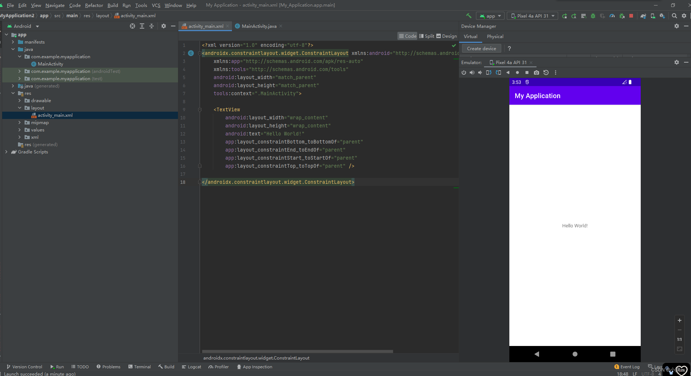

## vue3

## 原理

### 异步更新队列：vue采用异步渲染原因

```bash
一、vue 中的 DOM 操作都是异步执行的原因：
	1. 为了避免频繁操作DOM造成的性能消耗，如果每次数据发生变化都立即更新DOM的话，会造成频繁操作DOM。
	2. 避免重复的DOM操作，如果同一个 watcher 被多次触发，只会被推入到队列中一次（所有数据变化都会合并处理）。


二、实现原理：
只要侦听到数据变化，vue 将开启一个队列，并缓冲在同一个事件循环中发生的所有数据变化。
如果同一个 watcher 被多次触发，只会被推入到队列中依次。
这种在缓冲时去除重复数据对于避免不必要的计算和 DOM 操作时非常重要的。
然后，在下一个的事件循环 'Tick' 中，vue 刷新队列并执行实际（已去重的）工作。
vue 在内部对异步队列尝试使用原生的 `Promise.then`、`MutationObserver` 和 `setImmediate`，如果执行环境不支持，则采用 `setTimeout(fn, 0)` 代替。
```


### vue模板编译原理

```bash
一、编译过程
1. 解析器：将 `模板字符串` 转换成 `element ASTs`（VirtualDOM）
2. 优化器：对 AST 遍历来标记静态节点，主要用来做虚拟 DOM 的渲染优化
3. 代码生成器：将优化后的 AST 转换成 `render` 函数代码字符串


二、阶段描述
1. 解析器（Parser）：主要任务是将模板字符串转换成抽象语法树（AST）
	- 模板字符串：这是用户编写的模板代码，包含 HTML 元素、指令、绑定等。
	- 词法分析（Tokenization）：将模板字符串分割成一个个标记（tokens），例如标签、属性、文本等。
	- 语法分析（Parsing）：将标记转换成一棵树形结构，即 AST，表示模板的结构和内容。


2. 优化器（Optimizer）：主要是对 AST 进行优化标记，主要是标记静态节点
	- 遍历 AST：对 AST 进行深度优先遍历。
	- 标记静态节点：静态节点是那些在渲染过程中不需要改变的节点。通过标记这些节点，Vue 可以在后续的更新过程中跳过这些节点，从而提升性能。

	- 标记静态节点的意义：
			- 避免不必要的更新：通过标记静态节点，Vue 可以在数据变化时跳过这些节点，从而减少不必要的 DOM 操作和重新渲染。
			- 提升渲染性能：因为静态节点不会改变，Vue 可以直接复用这些节点，提高渲染性能。


3. 代码生成器（Code Generator）：主要是将优化后的 AST 转换成渲染函数（render function） 的代码字符串
	- 遍历 AST：对优化后的 AST 进行遍历。
	- 生成代码字符串：将 AST 转换成 JavaScript 代码字符串，这些代码字符串将用来生成渲染函数。
```


## 组合式Composition API

> ```bash
> ## vue3 VS vue2
>     1. 压缩包体积更小(20Kb => 10Kb)
>     2. 数据劫持的方式修改（Object.defineProperty => Proxy）
>     3. Virtual DOM 重构，提供diff算法效率
>     4. 组件定义方式变更(Options API => Function_Based API)
> 		5. vue3 组件模板中可以没有跟标签
> 		6. 相对于vue2性能提升：打包大小减少、渲染时间减少、内存减少
>
>
> - vue3需要cli版本在4.5.0以上
> - 项目创建：`vue create projectName`
> - 使用vite（新一代前端构件工具）
>   - 开发环境中，无需打包操作，可快速冷启动
>   - 轻量快速的热重载（HMR）
>   - 真正的按需编译，不再等待整个应用编译完成
> ```

### vue3优化Vdom

> - 在Vue2中，每次更新diff都是全量对比；Vue3则只对比带有标记的，这样大大减少了非动态内容的对比消耗
> - 查看代码静态标记网站：`https://vue-next-template-explorer.netlify.app/`
>
> 

### patch flag 优化静态树

> - 在创建动态 dom 元素时，Vdom 除了模拟出它的基本信息外，还添加了一个标记：`1/* TEXT */`
> - 这个标记叫做`patch flag`*（补丁标记），`patch flag`会在当diff算法走到`_createBlock`函数时，会忽略所有的静态节点，只对由标记的动态节点进行对比，而且在多层嵌套下依然有效
> - 尽管JS做Vdom的对比时非常快速，但`patch flag` 的出现还是让Vue3的Vdom的性能得到很大提升，尤其在针对大组件时
>
> ```js
> /* 新增了 patch flag 标记 */
> TEXT = 1 // 动态文本节点
> CLASS=1<<1,1 // 2//动态class
> STYLE=1<<2，// 4 //动态style
> PROPS=1<<3,// 8 //动态属性，但不包含类名和样式
> FULLPR0PS=1<<4,// 16 //具有动态key属性，当key改变时，需要进行完整的diff比较。
> HYDRATE_ EVENTS = 1 << 5，// 32 //带有监听事件的节点
> STABLE FRAGMENT = 1 << 6, // 64 //一个不会改变子节点顺序的fragment
> KEYED_ FRAGMENT = 1 << 7, // 128 //带有key属性的fragment 或部分子字节有key
> UNKEYED FRAGMENT = 1<< 8, // 256 //子节点没有key 的fragment
> NEED PATCH = 1 << 9, // 512 //一个节点只会进行非props比较
> DYNAMIC_SLOTS = 1 << 10 // 1024 // 动态slot
> HOISTED = -1 // 静态节点
> BALL = -2
> ```
>
> ```js
> <span>Hello world!</span>
> <span>Hello world!</span>
> <span>Hello world!</span>
> <span>Hello world!</span>
> <span>{{msg}}/span>
> <span>Hello world!</span>
> <span>Hello world! </span>
>
>
> /* --------- Vue3编译后的Vdom ------------------- */
> export function render(_ctx, _cache, $props, $setup, $data, $options) {
>   return (
>     _openBlock(),
>     _createBlock(
>       _Fragment,
>       null,
>       [
>         _createvNode("span", null, "Hello world ! "),
>         _createvNode("span", null, "Hello world! "),
>         _createvNode("span", null, "Hello world! "),
>         _createvNode("span", null, "Hello world! "),
>         _createVNode("span", null, _toDisplaystring(_ctx.msg), 1/* TEXT */),
>         _createvNode("span", null, "Hello world! "),
>         _createvNode("span", null, "Hello world! "),
>       ],
>       64/*STABLE_FRAGMENT */,
>     )
>   );
> }
> ```

### diff算法

> 

### `composition API`与`Options API`的区别

> - 使用vue2传统的`Options API`开发，若新增或修改一个需求，需要在`data、methods、computed、watch`等中修改，当项目过于庞大时，会非常消耗时间查找相关数据和函数；
> - 使用vue3的`composition API`开发，可更加优雅的组织相关的变量和函数，让相关功能的代码有序的放在一起，便于维护项目。
>
> 

### 生命周期

> - `beforeCreate`===>`setup()`
> - `created`=======>`setup()`
> - `beforeMount` ===>`onBeforeMount`
> - `mounted`=======>`onMounted`
> - `beforeUpdate`===>`onBeforeUpdate`
> - `updated` =======>`onUpdated`
> - `beforeUnmount` ==>`onBeforeUnmount`
> - `unmounted` =====>`onUnmounted`
>
> 组合式API的钩子函数要比配置项的钩子函数要高(即如onUpdated比update的执行速度提前一点)
>
> ```js
> 1. onBeforeMount()
> 在组件DOM实际渲染安装之前调用。在这一步中，根元素还不存在。
>
> 2. onMounted()
> 在组件的第一次渲染后调用，该元素现在可用，允许直接DOM访问
>
> 3. onBeforeUpdate()
> 数据更新时调用，发生在虚拟 DOM 打补丁之前。
>
> 4. updated()
> DOM更新后，updated的方法即会调用。
>
> 5. onBeforeUnmount()
> 在卸载组件实例之前调用。在这个阶段，实例仍然是完全正常的。
>
> 6. onUnmounted()
> 卸载组件实例后调用。调用此钩子时，组件实例的所有指令都被解除绑定，所有事件侦听器都被移除，所有子组件实例被卸载。
> ```

### 自定义渲染器custom renderer

> ```vue
> <template>
> <piechart
>    @click="handleClick"
>    :data="state.chartData"
>    :x="200"
>    :y="200"
>    :r="200"
> />
> </template>
>
> <script setup>
>   import { reactive, ref } from "vue";
>   const state = reactive({
>     chartData: [
>        { title: "青铜", count: 200, color: "red" },
>        { title: "白银", count: 150, color: "yellow" },
>        { title: "黄金", count: 100, color: "gray" },
>        { title: "钻石", count: 80, color: "green" },
>        { title: "王者", count: 50, color: "gold" },
>     ],
>   });
>   const handleClick = () => {
>     state.chartData.push({ title: "其他", count: 30, color: "orange" });
>   };
> </script>
> ```
>
> ```js
>/* main.js */
> import { createApp, createRenderer } from 'vue'
> import App from './App.vue'
> import CanvasApp from './CanvasApp.vue'
>
> createApp(App).mount('#app')
>
> // 自定义渲染器
> const nodeOps = {
>     // 处理元素创建逻辑
>      createElement(tag, isSVG, is) {
>        // 创建元素时由于没有需要创建的dom元素，只需返回当前元素数据对象
>        return { tag }
>      },
>
>     // 处理元素插入逻辑：
>      insert(child, parent, anchor) {
>        // 1. 如果是子元素，不是真实dom，此时只需将数据保存到前面虚拟dom上
>        child.parent = parent
>        if (!parent.childs) {
>          parent.childs = [child]
>        } else {
>          parent.childs.push(child)
>        }
>
>        // 2. 如果是真实dom元素，在这会是canvas，需要绘制
>        if (parent.nodeType === 1) {
>          draw(child)
>          // 如果子元素附加事件，需要给canvas添加监听器
>          if (child.onClick) {
>            canvas.addEventListener('click', () => {
>              child.onClick()
>              setTimeout(() => { draw(child) }, 0)
>            })
>          }
>        }
>      },
>
>      remove: child => { },
>      createText: text => { },
>      createComment: text => { },
>      setText: (node, text) => { },
>      setElementText: (el, text) => { },
>      parentNode: node => { },
>      nextSibling: node => { },
>      querySelector: selector => { },
>      setScopeId(el, id) { },
>      cloneNode(el) { },
>      insertStaticContent(content, parent, anchor, isSVG) { },
>
>     // 属性更新
>      patchProp(el, key, prevValue, nextValue) {
>        el[key] = nextValue
>      },
>    };
>
> const renderer = createRenderer(nodeOps);
> let ctx, canvas
>
> // 绘制方法：el为子元素
> const draw = (el, noClear) => {
>     if(!noClear) {
>        ctx.clearRect(0, 0, canvas.width, canvas.height)
>      }
>      if(el.tag === 'piechart') {
>        let { data, r, x, y } = el;
>        let total = data.reduce((memo, current) => memo + current.count, 0)
>        let start = 0, end = 0;
>        data.forEach(item => {
>          end += item.count / total * 360;
>          drawPieChart(start, end, item.color, x, y, r);
>          drawPieChartText(item.title, (start + end) / 2, x, y, r);
>          start = end;
>        });
>      }
>      el.childs && el.childs.forEach(child => draw(child, true));
>   }
>
> const d2a = n => n * Math.PI / 180
>
> const drawPieChart = (start, end, color, cx, cy, r) => {
>     const x = cx + Math.cos(dsa(start)) * r;
>      const y = cy + Math.cos(dsa(start)) * r;
>      ctx.beginPath();
>      ctx.moveTo(cx, cy);
>      ctx.lineTo
>   }
>
>
> // 扩展mount：首先创建一个画布元素
> function createCanvasApp(App) {
>     const app = renderer.createApp(App);
>      const mount = app.mount
>      app.mount = function (selector) {
>        // 创建并插入画布
>        canvas = document.createElement('canvas');
>        ctx = canvas.getContext('2d');
>
>        // 设置画布基础属性
>        canvas.width = 600
>        canvas.height = 600
>        document.querySelector(selector).appendChild(canvas)
>
>        // 执行默认mount
>        mount(canvas)
>      }
>    }
>
> createCanvasApp(CanvasApp).mount();
> ```

### 数据双向绑定原理

#### Proxy数据代理

> ```js
> /**
>  * Set a property on an object. Adds the new property and
>  * triggers change notification if the property doesn't
>  * already exist.
>  */
> export function set(target: Array<any> | Object, key: any, val: any): any {
>   /**
>    * 如果target是数组，且key是有效的数组索引，会调用数组的splice方法，
>    * 数组的splice方法会被重写，重写的方法中会手动Observe,
>    * 所以vue的set方法，对于数组，就是直接调用重写splice方法
>   */
>   if (Array.isArray(target) && isValidArrayIndex(key)) {
>     target.length = Math.max(target.length, key);
>     target.splice(key, 1, val);
>     return val;
>   }
>   /* 对于对象，如果key本来就是对象中的属性，直接修改值就可以触发更新 */
>   if (key in target && !(key in Object.prototype)) {
>     target[key] = val;
>     return val;
>   }
>   /* vue的响应式对象中都会添加了__ob__属性，所以可以根据是否有__ob__属性判断是否为响应式对象 */
>   const ob = (target: any).__ob__;
>   // 如果不是响应式对象，直接赋值
>   if (!ob) {
>     target[key] = val;
>     return val;
>   }
>   /**
>    * 调用defineReactive给数据添加了 getter 和 setter，
>    * 所以vue的set方法，对于响应式的对象，就会调用defineReactive重新定义响应式对象，defineReactive 函数
>   */
>   defineReactive(ob.value, key, val);
>   ob.dep.notify();
>   return val;
> }
> ```

#### js响应式原理

> 1. `Object.defineProperty`()
> 2. `Reflect.defineProperty()`
> 3. `Proxy()`
>
> ```js
> // 模拟vue3中实现响应式
> let person = {
>   a: "a", b: "b", c: { d: "e" },
> };
>
> // 1.Proxy代理对象实现响应
> const p = new Proxy(person, {
>   // 读取p某个属性时调用
>   get(target, propName) {
>     console.log(`读取了p的${propName}属性`);
>     if (propName === 'date')
>       target[propName] += "天";
>     return target[propName]
>   },
>
>   // 修改p某个属性或给p追加属性时调用
>   set(target, propName, value) {
>     console.log(`修改了p的${propName}`);
>
>     // 字段过滤
>     if (propName === 'age' && typeof value != 'number') {
>       throw Error("age字段必须为number类型");
>     }
>
>     // 返回数据
>     // target[propName] = value;
>     return Reflect.set(target, propName, value); // 等同target[propName] = value;
>   },
>
>   // 删除p的某个属性时调用
>   deleteProperty(target, propName) {
>     console.log(`删除p的${propName}属性`);
>     return delete target[propName]  // 返回的是true || false
>   }
> })
>
> let obj = {}
> // Object.defineProperty 实现响应
> try {
>   Object.defineProperty(obj, 'c', {
>     get() { return 3 }
>   })
>   Object.defineProperty(obj, 'c', {
>     get() { return 4 }
>   })
> } catch (err) {
>   console.log("Object DefineProperty error", err)
> }
>
> // Reflect.defineProperty 实现响应
> const x1 = Reflect.defineProperty(obj, 'c', {
>   get() { return 3 }
> })
> const x2 = Reflect.defineProperty(obj, 'c', {
>   get() { return 4 }
> })
> if (x2) {
>   console.log('x2操作成功了')
> } else {
>   console.log('x2操作失败了');
> }
> console.log('Reflect.defineProperty 相对于 Object.defineProperty 更具优势，因为不会出现报错信息，只是把相同的覆盖，返回false');
> ```

#### 重写双向绑定原理

> ```js
> /**
>  * vue2 -> 基于 Object.defineProperty() 实现
>  * vue3 -> 基于 Proxy 实现
>
> * Proxy 与 Object.defineProperty(obj, prop, desc) 方式相比有以下优势：
>  *    1. 丢掉麻烦的备份数据
>  *    2. 省去for in 循环
>  *    3. 可以监听数组变化
>  *    4. 代码更简化
>  *    5. 可以监听动态新增的属性
>  *    6. 可以监听删除的属性
>  *    7. 可以监听数组的索引和 length 属性
> */
> let proxyObj = new Proxy(obj, {
>   get: function (target, prop) {
>     return prop in target ? target[prop] : 0
>   },
>   set: function (target, prop, value) {
>     target[prop] = 888;
>   }
> })
> ```


## vue2迁移改动

### v-model的改变

> ```css
> # v-model 本质是 props 和 emit 组合成的语法糖
>
> # 默认值的改变
>   1. props：value -> modelValue
>   2. 事件：input -> update:modelValue
>   3. v-bind 的 .sync 修饰符和组件的model选项移除
>   4. 新增支持多个 v-model
>   5. 新增支持自定义修饰符
> ```
>
> ```vue
> <template>
>   <button @click="show = !show">开关{{show}}</button>
>   <Dialog v-model:title='title' v-model="show"/>
> </template>
>
> <script setup lang='ts'>
> import Dialog from "./Dialog.vue";
> import {ref} from 'vue'
> const show = ref(false)
> </script>
> ```
>
> ````vue
> <template>
> <div v-if='propData.modelValue'>
>   <div class="dialog-header">
>     <div>标题</div>
>     <div @click="close">x</div>
>   </div>
>   <div class="dialog-content">内容</div>
> </div>
> </template>
>
> <script setup lang='ts'>
>   type Props = {
>     modelValue: boolean,
>     title?: string,
>     modelModifiers?: {
>     	default: () => {}
>   	}
>   	titleModifiers?: {
>   		default: () => {}
>   	}
>   }
>
>   const propData = defineProps<Props>()
>   const emit = defineEmits(['update:modelValue', 'update:title'])
>
>   const close = () => {
>     console.log(propData.modelModifiers);
>     emit('update:modelValue', false)
>     emit('update:title', '我要改变')
>   }
> </script>
> ````
>
> #### model选项和v-bind的sync修饰符被移除，统一为v-model参数形式
>
> ````vue
> <template>
> 	<comp v-model="data" />
> 	<!-- 等效于 -->
> 	<comp :modelValue="data" @update:modelValue="data=$event" />
> </template>
> <script setup>
> import { ref } from 'vue'
> const data = ref('aaa')
> </script>
> ````
>
> ```js
> /* main.js */
> import { createApp } from 'vue'
> import App from './App.vue'
> const app = createApp(App);
> app.component('comp', {
>   template: `
>    <div @click="$emit('update:modelValue', 'new value')">
>         I am comp, {{ modelValue }}
>   </div>
>   `,
>  props: ['modelValue'],
> })
> app.mount('#app')
> ```

### 全局API的转移

> **Vue 2.x 有许多全局 API 和配置，如：注册全局组件、注册全局指令等**
>
> ```js
> /* vue2写法 */
> //注册全局组件
> Vue.component('MyButton', {
>   data: () => ({ count: 0 }),
>   template: '<button @click="count++">Clicked {{ count }} times.</button>'
> })
>
> //注册全局指令
> Vue.directive('focus', {
>   inserted: el => el.focus()
> }
> ```
>
> **Vue3.0将全局的API如`Vue.xxx`调整到应用实例（`app`）上**
>
> | 2.x 全局 API（```Vue```） | 3.x 实例 API (`app`)                        |
> | ------------------------- | ------------------------------------------- |
> | Vue.config.xxxx           | app.config.xxxx                             |
> | Vue.config.productionTip  | <strong style="color:#DD5145">移除</strong> |
> | Vue.component             | app.component                               |
> | Vue.directive             | app.directive                               |
> | Vue.mixin                 | app.mixin                                   |
> | Vue.use                   | app.use                                     |
> | Vue.prototype             | app.config.globalProperties 全局属性        |
> | Vue.filter                | <strong style="color:#DD5145">移除</strong> |

### 添加全局方法

> **1.使用app.config.globalProperties**
>
> ```bash
> // main.js 入口文件
> import { createApp } from 'vue'
> import axios from 'axios'
> const app = createApp({
> 	created() {
> 		console.log(this.$axios)
> 	}
> })
> app.config.globalProperties.$axios = axios
> app.mount('#root')
>
>
> // 调用文件：在setup中访问（ setup中没有this）
> <script setup>
> 	import { getCurrentInstance } from 'vue'
> 	const { proxy: { $axios } } = getCurrentInstance(); //获取公用方法proxy.$axios，或者use中方法
> 	console.log($axios)
> </script>
> ```
>
> **使用app.mixin**
>
> ```js
> // main.js 入口文件
> import { createApp } from 'vue'
> import axios from 'axios'
> const app = createApp({
> 	created() {
> 		console.log(this.$axios)
> 	}
> })
> app.mixin({
> 	methods: { $axios: axios }
> })
> app.mount('#root')
> ```
>
> **3.使用provide、inject方法**
>
> ```js
> // main.js 入口文件
> import { createApp } from 'vue'
> import axios from 'axios'
> const app = createApp({
>     inject: ['$axios'],
>     created() {
>        console.log(this.$axios)
>     }
> })
> app.provide('$axios', axios)
> app.mount('#root')
> ```

### data选项应始终被声明为一个函数

> ```bash
> 组件中的 data 为什么是一个函数返回一个对象，而不是一个对象？
> 1. vue中组件是用来复用的，为了防止data复用，将其定义为函数。
> 
> 2. vue组件中的data数据都应该是相互隔离，互不影响的，组件每复用一次，data数据就应该被复制一次，之后，当某一处复用的地方组件内data数据被改变时，其他复用地方组件的data数据不受影响，就需要通过data函数返回一个对象作为组件的状态。
> 
> 3. 当我们将组件中的data写成一个函数，数据以函数返回值形式定义，这样每复用一次组件，就会返回一份新的data，拥有自己的作用域，类似于给每个组件实例创建一个私有的数据空间，让各个组件实例维护各自的数据。
> 
> 4. 当我们组件的date单纯的写成对象形式，这些实例用的是同一个构造函数，由于JavaScript的特性所导致，所有的组件实例共用了一个data，就会造成一个变了全都会变的结果。
> ```
>
> ```js
> createApp({
>   data() {
>     return {
>       apiKey: 'a1b2c3'
>     }
>   }
> }).mount('#app')
> ```

### keyCode作为`v-on`修饰符被移除

> - vue2中可使用keyCode指代某个按键，vue3移除keyCode作为 v-on 的修饰符，同时也不再支持`config.keyCodes`
>
> ```vue
> <!-- keyCode方式不再被支持 -->
> <input v-on:keyup.13="submit" />
>
> <!-- 只能使用alias方式 -->
> <input v-on:keyup.entry="submit" />
> ```

> - <strong style="color:#DD5145">移除</strong>```v-on.native```修饰符
> - 移除`$on、$off、$once`，可以引入第三方库来支持`npm i mitt -S`
> - 移除filters过滤器

### Event Loop 和 nextTick

> ```bash
> # JS 执行机制
> 若js为多线程会引发一个问题：在同一时间操作DOM，一个增加一个删除，此时JS会不知先做哪个操作，所以需要让JS为单线程；
> 而HTML5支持多线程webWorker，但不允许操作DOM。
> 单线程意味着所有任务都需要排队，后面的任务需要等前面的任务执行完才能执行。若前面的任务耗时过长，后面的任务就需要一直等待。
> 一些从用户角度上不需要等待的任务一直在等待，这从用户体验角度上是不可接收的，所以JS中就出现了异步概念。
>
>
> # 同步任务
> 代码从上到下按顺序执行，会造成任务阻塞
>
> # 异步任务
> 1. 宏任务：script（整体代码）、setTimeout、setInterval、UI交互事件、postMessage、Ajax
> 2. 微任务：Promise 的then catch finally、MutationObserver、process.nextTick(Node.js环境)
>
>
> # 事件循环 Event Loop 运行机制
> 所有的同步任务都是在主进程执行的形成一个执行栈，主线程外，还存在一个“任务队列”。
> 异步任务执行队列先执行宏任务，然后清空当次宏任务中的所有微任务，然后进行下一个tick如此形成循环
>
>
> # nextTick
> nextTick 即是创建一个异步任务，等到同步任务执行完成后才执行。
> 作用：使得视图层与数据层同时间更新数据
>
>
> # nextTick 源码
> // 源码地址：core\packages\runtime-core\src\scheduler.ts
> const resolvedPromise: Promise<any> = Promise.resolve()
> let currentFlushPromise: Promise<void> | null = null
>
> export function nextTick<T = void>(
>   this: T,
>   fn?: (this: T) => void
> ): Promise<void> {
>   const p = currentFlushPromise || resolvedPromise
>   return fn ? p.then(this ? fn.bind(this) : fn) : p
> }
>
>
> # nextTick 源码解析
> nextTick 接收一个参数fn（函数）定义了一个变量P，这个P最终返回都是Promise，最后是return；
> 如果传递了fn，就使用变量 P.then 执行一个微任务去执行 fn 函数，then 里面 this 如果有值就调用 bind 改变 this 执行返回新的函数，否则直接调用 fn，如果没有传 fn，就返回一个 promise。
> 最终结果都会返回一个 promise
> ```
>
> ```vue
> <template>
>    <div ref="willy">{{ text }}</div>
>    <button @click="change">change div</button>
> </template>
>
> <script setup lang='ts'>
> import { ref,nextTick } from 'vue';
>
> const text = ref('willysliang')
> const willy = ref<HTMLElement>()
>
> const change = async () => {
>    text.value = 'william'
>    console.log(willy.value?.innerText) // willysliang（因为虚拟DOM的视图更新是异步的）
>    await nextTick();
>    console.log(willy.value?.innerText) //william
> }
> </script>
> ```

### CSS完整特性（scoped、样式穿透、动态css）

> ```bash
> # 插槽选择器 :slotted()
> :slotted() 的作用是改变父组件传递给子组件的样式（默认会认为插槽所替换的内容为父组件的内容，在该插槽子组件中是无法渲染到定义该样式的内容）
> 如	:slotted(.a) { color: red; }
>
>
> # 全局选择器	:global()
> :global() 的作用是所设定的样式全局生效
> 如	：global(div) { color: red; }
>
>
> # 动态CSS：v-bind
> 	- 单文件组件的 <style> 标签可以通过 v-bind 这一 CSS 函数将 CSS 的值关联到动态的组件状态上
> 			（注意：如果是对象 v-bind 请加引号）
>
>
> # 动态CSS：CSS module
> 	通过把 style 设定为 module 模式，然后在 绑定 样式 :class="$style.样式名" 或 :class="[$style.样式名1, $style.样式名2]"
> 	- <style module> 标签会被编译为 CSS Modules 并且将生成的 CSS 类作为 $style 对象的键暴露给组件
> 	- 自定义注入名称（多个可以用数组）
> 			可以通过给 module attribute 一个值来自定义注入的类对象的 property 键
> 	- 与组合式 API 一同使用 （使用场景一般用于TSX 和 render 函数居多）
> 			注入的类可以通过 useCssModule API 在 setup() 和 <script setup> 中使用。对于使用了自定义注入名称的 <style module> 模块，useCssModule 接收一个对应的 module attribute 值作为第一个参数
> ```

#### scoped属性

> ```bash
> ## scoped 属性
> - scoped 代表作用域。
> - 在 `<style scoped></stype>` 中添加scope属性，该style中的css样式只会针对当前组件起效果；若不添加，其他组件中的css样式相同样式，会在该组件中其效果。
> 
> 
> ### scoped 的原理
> Vue 中 scoped CSS 的核心原理是通过为每个组件生成一个唯一的属性（如 data-v-hash），并将这个属性附加到组件的根元素以及组件模板中的每个元素上。然后，Vue 编译器会在编译 scoped 样式时，将这些样式规则限定在带有相应属性的元素范围内（而这个工作是由过PostCSS转译实现的），达到样式私有化模块化的目的。
> PostCSS会给一个组件中的所有dom添加了一个独一无二的动态属性data-v-xxxx，然后，给CSS选择器额外添加一个对应的属性选择器来选择该组件中dom，这种做法使得样式只作用于含有该属性的dom——组件内部dom, 从而达到了'样式模块化'的效果。
> 
> 
> ### scoped 渲染规则
> 1. 给HTML的DOM节点加一个不重复data属性(形如：data-v-123)来表示他的唯一性
> 2. 在每句css选择器的末尾（编译后的生成的css语句）加一个当前组件的data属性选择器（如[data-v-123]）来私有化样式
> 3. 如果组件内部包含有其他组件，只会给其他组件的最外层标签加上当前组件的data属性
> 
> 
> 
> ### scoped 的不足
> 1. 全局样式和第三方库的冲突问题：
> scoped CSS 不能完全避免全局样式或第三方库样式对组件的影响。如果全局样式或第三方库样式具有较高的优先级，可能会覆盖 scoped 样式。
>  
> 2. 在子组件中的样式穿透
> scoped 样式默认不穿透子组件。这意味着不能直接在父组件的 scoped 样式中修改子组件的样式，但可以通过深度选择器（`:deep()`）来实现，这会引入一定的复杂性。
> 
> 3. scoped 样式的冗长 css 选择器：
> scoped 样式生成的选择器通常比较冗长，这可能会影响性能，特别是在大型项目中
> 
> 4. 动态插入的内容无法自动应用 scoped 样式：
> 动态插入的 DOM 内容不会自动应用 scoped 样式，需要手动处理。这限制了某些动态内容的样式控制。
> 
> 5. 互动性和高级选择器的限制：
> 某些复杂的选择器或者伪类在 scoped 样式中使用会有一些限制和不便。如 `:hover` 或 `:nth-child` 这样的伪类选择器在使用时需要更加小心。
> ```

#### 样式穿透 deep

> ```bash
> # 样式穿透  :deep()
> - `:deep()` 的作用就是用来改变 属性选择器的位置
> - 使用scoped后，父组件的样式将不会渗透到子组件中；但一个子组件的根节点会同时受其父组件scoped CSS和子组件的scoped CSS的影响。
> - 如果希望scoped样式中的一个选择器能够作用得更深（如影响子组件），可以使用 `:deep()` 操作符。
> ```
>
> ```vue
> <style scoped>
>   :deep(input) { background: red; }
> 	:deep(.uni-select) { border: 1px solid red; }
> </style>
> ```

#### 插槽选择器

> ```vue
> <template>
> 	<slot>我是插槽</slot>
> </template>
>
> <style scoped>
> .a{ color:red } /* 此种设置是无效的，因为解析器会认为这是父组件的东西，无法进行渲染到a标签 */
> :slotted(.a) { color:red }  /* 此种就可以渲染到替换插槽的内容 */
> </style>
> ```
>
> ```vue
> <template>
>     <A>
>        <div class="a">私人定制div</div>
>     </A>
> </template>
>
> <script setup>
> import A from "@/components/A.vue"
> </script>
> ```

#### 动态css

> ```vue
> <template>
> <div class="div">动态CSS</div>
> </template>
>
> <script setup lang="ts">
>   import { ref } from 'vue'
>   const style = ref({ color: 'red', })
>   const green = ref<string>('green')
>   setTimeout(() => { style.value.color = 'blue' }, 1000)
> </script>
>
> <style scoped>
>   .div {
>      color: v-bind('style.color');
>      background: v-bind(green);
>   }
> </style>
> ```

#### css  module

> ```vue
> <template>
> 	<div :class="$style.div">单个CSS module</div>
> 	<div :class="[$style.div, $style.border]">多个CSS module</div>
> 	<div :class="[willy.yellow, willy.bg]">自定义注入 CSS module 名称</div>
> </template>
>
> <script setup lang="ts">
> import { useCssModule } from 'vue'
> const css = useCssModule('willy')
> console.log(css);
> const render = (<div class={css.yellow}>render CSS</div>)
> </script>
>
> <style module>
> .div { color: red }
> .border { border: 1px solid green; }
> </style>
> <style module="willy">
> .yellow { color: yellow }
> .bg { background: #fff }
> </style>
> ```

## setup语法糖

> `<script setup>`是在单文件组件（SFC）中使用组合式API的编译时语法糖，解决Vue3中setup需要频繁将声明的变量、函数及`import`引入的内容通过`return`向外暴露，才能在`<template/>`使用的问题

### 基本使用

> - `<script setup>`语法糖里面的代码会被编译成组件`setup()`函数的内容，不需要通过`return`暴露声明的变量、函数以及`import`引入的内容，即可在`<template>`中使用，并且不需要`export default {}`
> - 这意味着与普通的`<script>`只在组件被首次引入时执行一次不同，`<script setup>`中代码会在每次组件实例被创建时执行
>
> ```vue
> <template>
>   <!-- 在template中直接使用声明的变量、函数以及import引入的内容 -->
>   <div @click="log">{{ msg }}</div>
>   <p>{{ getToday() }}</p>
> </template>
> <script setup>
> 	// import 引入内容
> 	import { getToday } from "./utils";
> 	// 变量
> 	let msg = "Hello!";
> 	// 函数
> 	function log() {
> 		console.log(msg);
> 	}
> </script>
> <script>
>   console.log('script');//多次实例组件,只触发一次
>   export default {
> 		setup() {
> 			console.log('setupFn');//每次实例化组件都触发和script-setup标签一样
> 		}
>   }
> </script>
> ```

### 引入组件将自动注册

> ```vue
> <script setup>
> 	import MyComponent from './MyComponent.vue'
> </script>
>
> <template>
> <MyComponent />
> </template>
> ```

### 组件通信：defineProps、defineEmits、withDefaults

> - 组件通信必须使用`defineProps`和`defineEmits`API来代替`props`和`emits`
> - `<template/>` 中可以直接使用父组件传递的props （可省略props.）
> - `<script-setup>` 需要通过props.xx获取父组件传递过来的props
>
> ```vue
> <template>
>   <div>父组件</div>
> 	<Child :title="title"  @on-click='childFn' />
>   <p>接收子组件传递的数据{{childData}} </p>
> </template>
>
> <script setup lang="ts">
>   import { ref, reactive } from 'vue'
>   import Child from './child.vue'
>
> 	const title = ref('这是标题');
>   const childData = reactive<number[]>([])
>   const childFn = (e) => {
>     consloe.log('子组件触发了父组件childFn，并传递了参数e')
>     childData = e.value
>   }
> </script>
> ```
>
> ```vue
> <template>
> <div>子组件</div>
> <div>父组件传递的值：{{title}}</div>
> <button @click="toEmits">子组件向外暴露数据</button>
> </template>
>
> <script setup lang="ts">
>   import { reactive } from 'vue'
>
>   type Props = {
>     title?: string,
>     data?: number[]
>   }
>   const  props = withDefaults(defineProps<Props>(), {
>     title: "我是默认标题",
>     data: () => [1, 2, 3],
>   });
>   console.log(props.title) //父的值
>
>   const  emits = defineEmits(['on-click']);
>   const list = reactive<number[]>([1, 2, 3])
>   const  toEmits = () => {
>     emits('on-click', list)
>   }
> </script>
> ```

### 需要主动暴露组件属性：defineExpose

> 使用`<script setup>`的组件时默认关闭的，即通过模板`ref`或`$parent`链获取到的组件的公开实例，不会暴露任何在`<script setup>`中声明的绑定
>
> ```vue
> <!-- 子组件 -->
> <script setup>
>   import { ref } from 'vue'
>
>   const a = 1
>   const b = ref(2)
>   //主动暴露组件属性
>   defineExpose({
>     a,
>     b
>   })
> </script>
> ```
>
> ```vue
> <!-- 父组件 -->
> <template>
> <div>父组件</div>
> <Child  ref='childRef' />
> <button @click='getChildData'>通过ref获取子组件的属性 </button>
> </template>
>
> <script setup>
>   import {ref} from 'vue'
>   import Child from './child.vue'
>   const childRef= ref()  //注册响应数据
>   const getChildData =()=>{
>     //子组件接收暴露出来得值
>     console.log(childRef.value.a) //1
>     console.log(childRef.value.b) //2  响应式数据
>   }
> </script>
> ```

### useSlots和useAttrs

> `useSlots` 和 `useAttrs` （少用，由于大部分人是SFC模式开发，在`<template/>`通过`<slot/>`标签就可以渲染插槽）
> 如果需要在`script-setup`中使用 `slots` 和 `attrs` 需要用`useSlots` 和 `useAttrs`替代
> 需要引入：`import { useSlots ,useAttrs } form 'vue'`
> 在`<template/>`中通过 `$slots`和`$attrs` 来访问更方便（`attrs`用来获取父组件中非`props`的传递到子组件的参数/方法，`attrs` 用来获取父组件中非`props`的传递到子组件的参数/方法，`attrs`用来获取父组件中非`props`的传递到子组件的参数/方法，`slots`可以获取父组件中插槽传递的虚拟`dom`对象，在SFC模式应该用处不大，在JSX /TSX使用比较多）
>
> ```vue
> <!-- 父组件 -->
> <template>
> <Child msg="非porps传值子组件用attrs接收" >
> <!-- 匿名插槽 -->
> <span >默认插槽</span>
> <!-- 具名插槽 -->
> <template #title>
> <h1>具名插槽</h1>
> </template>
> <!-- 作用域插槽 -->
> <template #footer="{ scope }">
> <footer>作用域插槽——姓名：{{ scope.name }}，年龄{{ scope.age }}</footer>
> </template>
> </Child>
> </template>
>
> <script setup>
> // 引入子组件
> import Child from './child.vue'
> </script>
> ```
>
> ```vue
> <!-- 子组件 -->
> <template>
> <!-- 匿名插槽 -->
> <slot />
> <!-- 具名插槽 -->
> <slot name="title" />
> <!-- 作用域插槽 -->
> <slot name="footer" :scope="state" />
> <!-- $attrs 用来获取父组件中非props的传递到子组件的参数 -->
> <p>{{ attrs.msg == $attrs.msg }}</p>
> <!--true  没想到有啥作用... -->
> <p>{{ slots == $slots }}</p>
> </template>
>
>
> <script setup>
>   import { useSlots, useAttrs, reactive, toRef } from 'vue'
>   const state = reactive({
>     name: '张三',
>     age: '18'
>   })
>
>   const slots = useSlots()
>   console.log(slots.default()); //获取到默认插槽的虚拟dom对象
>   console.log(slots.title());   //获取到具名title插槽的虚拟dom对象
>   // console.log(slots.footer()); //报错  不知道为啥有插槽作用域的无法获取
>   //useAttrs() 用来获取父组件传递的过来的属性数据的（也就是非 props 的属性值）。
>   const attrs = useAttrs()
> </script>
> ```
>
> **useSlots在JSX/TSX下更实用**
>
> ```jsx
> <script lang='jsx'>
>   import { defineComponent, useSlots } from "vue";
>   export default defineComponent({
>     setup() {
>       // 获取插槽数据
>       const slots = useSlots();
>       // 渲染组件
>       return () => (
>         <div>
>            {slots.default?slots.default():''}
>            {slots.title?slots.title():''}
>         </div>
>       );
>     },
>   });
> </script>
> ```

### 自定义全局函数和变量

> - Vue3 没有 Prototype 属性，使用` app.config.globalProperties`代替去定义变量和函数
>
> ```ts
> /* main.ts */
> import { createApp } from 'vue'
> import App from './App.vue'
>
> const app = createApp(App)
>
> /* 声明文件 不然TS无法正确类型 推导，然后会导致VSCode中报红 */
> type Filter = {
>     format: <T extends any>(str: T) => T
>   }
> // 声明要扩充@vue/runtime-core包的声明.
> // 这里扩充"ComponentCustomProperties"接口, 因为他是vue3中实例的属性的类型.
>   declare module '@vue/runtime-core' {
>     export interface ComponentCustomProperties {
>         $filters: Filter
>     }
>   }
>
> app.config.globalProperties.$filters = {
>   format<T extends any>(str: T): string {
>     return `$${str}`
>   }
> }
> ```
>
> ```vue
> <template>
> 	<div>{{ $filters.format('willys') }}</div>
> </template>
> <script setup lang="ts">
> import { getCurrentInstance, ComponentInternalInstance } from 'vue';
>
> const { appContext } = <ComponentInternalInstance>getCurrentInstance()
> console.log(appContext.config.globalProperties.$filters);
> </script>
> ```
>
> #### 编写Vue3插件
>
> - 插件是自包含的代码，通常向 Vue 添加全局级功能。你如果是一个对象需要有install方法Vue会帮你自动注入到install 方法 你如果是function 就直接当install 方法去使用
> - 使用插件：在使用 `createApp()` 初始化 Vue 应用程序后，你可以通过调用 `use()` 方法将插件添加到你的应用程序中。
>
> ```vue
> <!-- loading/index.vue -->
> <template>
>     <div v-if="isShow" class="loading">
>         <div class="loading-content">Loading...</div>
>     </div>
> </template>
>
> <script setup lang='ts'>
> import { ref } from 'vue';
> const isShow = ref(false)//定位loading 的开关
>
> const show = () => {
>     isShow.value = true
> }
> const hide = () => {
>     isShow.value = false
> }
> //对外暴露 当前组件的属性和方法
> defineExpose({
>     isShow,
>     show,
>     hide
> })
> </script>
>
> <style scoped lang="less">
> .loading {
>     position: fixed;
>     inset: 0;
>     background: rgba(0, 0, 0, 0.8);
>     display: flex;
>     justify-content: center;
>     align-items: center;
>     &-content {
>         font-size: 30px;
>         color: #fff;
>     }
> }
> </style>
> ```
>
> ```ts
> /* loading/index.ts */
> import {  createVNode, render, VNode, App } from 'vue';
> import Loading from './index.vue'
>
> export default {
>     install(app: App) {
>         //createVNode vue提供的底层方法 可以给我们组件创建一个虚拟DOM 也就是Vnode
>         const vnode: VNode = createVNode(Loading)
>         //render 把我们的Vnode 生成真实DOM 并且挂载到指定节点
>         render(vnode, document.body)
>         // Vue 提供的全局配置 可以自定义
>         app.config.globalProperties.$loading = {
>             show: () => vnode.component?.exposed?.show(),
>             hide: () => vnode.component?.exposed?.hide()
>         }
>  				// 调用插件：app.config.globalProperties.$loading.show()
>     }
> }
> ```
>
> ```ts
> /* main.ts */
> import { createApp } from 'vue'
> import Loading from './loading'
>
> let app = createApp(App)
> app.use(Loading)
>
> type Lod = {
>   show: () => void,
>   hide: () => void
> }
> //编写ts loading 声明文件放置报错 和 智能提示
> declare module '@vue/runtime-core' {
>   export interface ComponentCustomProperties {
>     $loading: Lod
>   }
> }
>
> app.mount('#app')
> ```
>
> ````vue
> <!-- 调用插件的vue组件 -->
> <template>
> 	<button @click="showLoading">切换</button>
> </template>
> <script setup lang="ts">
> import { getCurrentInstance, ComponentInternalInstance } from 'vue'
>
> const { appContext } = getCurrentInstance() as ComponentInternalInstance
>
> const showLoading = () => {
>   appContext.config.globalProperties.$loading.show()
>   setTimeout(() => {
>     appContext.config.globalProperties.$loading.hide();
>   }, 5000)
> }
> </script>
> ````

### 自定义Hooks

> ```css
> # vue2 中使用 Mixins 来处理复用代码逻辑的封装
> 	- mixins的优点：将多个相同的逻辑抽离出来，各个组件只需引入 mixins 就能实现一次写代码多组件受益的效果
> 	- mixins的缺点：会涉及到覆盖问题，组件的data、methods、filters 会覆盖mixins里同名的data、methods、filters
> 	- mixins的缺点二：变量来源不明确（隐式传入），不利于代码阅读，使得代码难以维护
>
> # vue3 中使用自定义 hooks
> ```
>
> ```ts
> /**
> 	* hooks.ts
> 	* @function 图片转换为 base64
> */
> import { onMounted } from 'vue'
>
> type Options = {
>   el: string
> }
>
> export default function (option: Options): Promise<{ Baseurl: string | null }> {
>   return new Promise((resolve) => {
>     onMounted(() => {
>       const file: HTMLImageElement = document.querySelector(option.el) as HTMLImageElement;
>       file.onload = ():void => {
>         resolve({ Baseurl: toBase64(file) })
>       }
>     })
>
>     const toBase64 = (el: HTMLImageElement): string => {
>       const canvas: HTMLCanvasElement = document.createElement('canvas')
>       const ctx = canvas.getContext('2d') as CanvasRenderingContext2D
>
>       canvas.width = el.width
>       canvas.height = el.height
>       ctx.drawImage(el, 0, 0, canvas.width,canvas.height)
>
>       return canvas.toDataURL('./image/png')
>     }
>   })
> }
> ```
>
> ```vue
> <template>
> 	
> </template>
>
> <srcipt setup lang="ts">
> import useBase64 from './hooks'
> useBase64({ el: "#img" }).then(res => { console.log(res.baseUrl) })
> </srcipt>
> ```

### 自定义指令

> ```css
> 注意的限制：必须以 vNameOfDirective 的形式来命名本地自定义指令，以使得它们可以直接在模板中使用
>
> # 生命周期钩子参数详解
> - 第一个 el  当前绑定的DOM 元素
> - 第二个 binding
>     instance：使用指令的组件实例。
>     value：传递给指令的值。例如，在 v-my-directive="1 + 1" 中，该值为 2。
>     oldValue：先前的值，仅在 beforeUpdate 和 updated 中可用。无论值是否有更改都可用。
>     arg：传递给指令的参数(如果有的话)。例如在 v-my-directive:foo 中，arg 为 "foo"。
>     modifiers：包含修饰符(如果有的话) 的对象。例如在 v-my-directive.foo.bar 中，修饰符对象为 {foo: true，bar: true}。
>     dir：一个对象，在注册指令时作为参数传递。
> - 第三个 当前元素的虚拟DOM 也就是Vnode
> - 第四个 prevNode 上一个虚拟节点，仅在 beforeUpdate 和 updated 钩子中可用
> ```
>
> #### 自定义指令声明周期
>
> ```vue
> <template>
>   <button>切换</button>
>   <A v-move:willy.aa="{background:'green',flag:flase}"/>
> </template>
>
> <script setup lang="ts">
> import { ref, Directive, DirevtiveBinding } from 'vue'
> import A from './A.vue'
>
> const vMoveDirective: Directive = {
>   created: () => {
>     console.log("初始化====>");
>   },
>   beforeMount(...args: Array<any>) {
>     // 在元素上做些操作
>     console.log("初始化一次=======>");
>   },
>   mounted(el: any, dir: DirectiveBinding<Value>) {
>     el.style.background = dir.value.background;
>     console.log("初始化========>");
>   },
>   beforeUpdate() {
>     console.log("更新之前");
>   },
>   updated() {
>     console.log("更新结束");
>   },
>   beforeUnmount(...args: Array<any>) {
>     console.log(args);
>     console.log("======>卸载之前");
>   },
>   unmounted(...args: Array<any>) {
>     console.log(args);
>     console.log("======>卸载完成");
>   },
> };
> </script>
> ```
>
> ### 函数简写
>
> - 函数模式简写：在 `mounted` 和 `updated` 时触发相同行为，而不关心其他的钩子函数。
>
> ```vue
> <template>
>   <input v-model="value" type="text" />
>   <A v-move="{ background: value }"></A>
> </template>
>
> <script setup lang='ts'>
> import A from './components/A.vue'
> import { ref, Directive, DirectiveBinding } from 'vue'
> let value = ref<string>('')
> type Dir = {
>    background: string
> }
> const vMove: Directive = (el, binding: DirectiveBinding<Dir>) => {
>    el.style.background = binding.value.background
> }
> </script>
> ```
>
> #### 自定义拖拽指令
>
> ```vue
> <template>
>   <div v-move class="box">
>     <div class="header"></div>
>     <div>内容</div>
>   </div>
> </template>
> 
> <script setup lang='ts'>
>import { Directive } from "vue";
> const vMove: Directive = {
>   mounted(el: HTMLElement) {
>     let moveEl = el.firstElementChild as HTMLElement;
>     const mouseDown = (e: MouseEvent) => {
>       //鼠标点击物体那一刻相对于物体左侧边框的距离=点击时的位置相对于浏览器最左边的距离-物体左边框相对于浏览器最左边的距离
>       console.log(e.clientX, e.clientY, "-----起始", el.offsetLeft);
>       let X = e.clientX - el.offsetLeft;
>       let Y = e.clientY - el.offsetTop;
>       const move = (e: MouseEvent) => {
>         el.style.left = e.clientX - X + "px";
>         el.style.top = e.clientY - Y + "px";
>         console.log(e.clientX, e.clientY, "---改变");
>       };
>       document.addEventListener("mousemove", move);
>       document.addEventListener("mouseup", () => {
>         document.removeEventListener("mousemove", move);
>       });
>     };
>     moveEl.addEventListener("mousedown", mouseDown);
>   },
> };
> </script>
> 
> <style lang='less'>
>.box {
>   position: fixed;
>   left: 50%;
>   top: 50%;
>   transform: translate(-50%, -50%);
>   width: 200px;
>   height: 200px;
>   border: 1px solid #ccc;
>   .header {
>     height: 20px;
>     background: black;
>     cursor: move;
>   }
> }
> </style>
> ```

## 数据绑定处理

### setup（vue Hook）

> - 组件中所用到的数据、方法等均要配置在setup中
>
> - setup有两种返回值
>
>   - 若返回一个对象，则对象中的属性、方法，在模板中均可直接使用
>   - 若返回一个渲染函数，则可以自定义渲染内容
>
> - 与vue2混合使用（一般不建议混合使用）
>
>   - vue2.x配置(data、methods、computed...)中可以访问到setup中的属性和方法。
>   - 但在setup中不能访问到vue2.x配置(但可以通过箭头函数调用)
>   - 如果有重名，setup会优先（因为setup是渲染时调用，所以会把之前重名的方法覆盖）
>
> - > setup不能是一个async函数，因为返回值不是return的对象，而是promise，模板看不到return对象中的属性。
>   > 注意：当使用Suspense和异步组件配合时，可以返回一个Promise实例，且可使用async函数
>
> - **ref函数和reactive函数的作用**：
>
>   - 为了让数据可以响应式改变；
>   - 在vue2中，对象或者数组的数据改变，需要调用`this.$set或vue.set`方法来实现才可以做出响应式改变。
>
> - 执行时机
>
>   - 在`beforeCreate`之前执行一次，`this`是`undefined`
>
> - setup的参数
>
>   - props：值为对象，包含组件外部传递过来且组件内部接收了的属性
>   - context：上下文对象
>     - attrs：值为对象，包含组件外部传递过来，但没有在props配置中声明的属性，相当于`this.$attrs`
>     - slots：收到的插槽内容，相当于`this.$slots`
>     - emit：分发自定义事件的函数，相当于`this.$emit`
>
> ```bash
> - 组件中所用到的数据、方法等均要配置在setup中
>
> - setup的参数
>   - props：值为对象，包含组件外部传递过来且组件内部接收了的属性
>   - context：上下文对象
>     - attrs：值为对象，包含组件外部传递过来，但没有在props配置中声明的属性，相当于`this.$attrs`
>     - slots：收到的插槽内容，相当于`this.$slots`
>     - emit：分发自定义事件的函数，相当于`this.$emit`
>
>
> - setup有两种返回值
>   - 若返回一个对象，则对象中的属性、方法，在模板中均可直接使用
>   - 若返回一个渲染函数，则可以自定义渲染内容
>
>
> - 与vue2混合使用（一般不建议混合使用）
>   - vue2.x配置(data、methods、computed...)中可以访问到setup中的属性和方法。
>   - 但在setup中不能访问到vue2.x配置(但可以通过箭头函数调用)
>   - 如果有重名，setup会优先（因为setup是渲染时调用，所以会把之前重名的方法覆盖）
>
>
> - setup不能是一个async函数，因为返回值不是return的对象，而是promise，模板看不到return对象中的属性。
>   注意：当使用Suspense和异步组件配合时，可以返回一个Promise实例，且可使用async函数
>
>
> - ref函数和reactive函数的作用：
>   - 为了让数据可以响应式改变；
>   - 在vue2中，对象或者数组的数据改变，需要调用`this.$set或vue.set`方法来实现才可以做出响应式改变。
>
>
> - 执行时机
>   - 在`beforeCreate`之前执行一次，`this`是`undefined`
> ```

#### TodoList 案例

```vue
<template>
  <div class="todo-container">
    <div class="todo-header">
      <div class="todo-title">Todo List</div>
    </div>

    <div class="todo-content">
      <div class="todo-input-group">
        <input
          type="text"
          class="todo-input"
          :value="innerInput"
          placeholder="What needs to be done?"
          @input="(event: any) => onInput(event!.target!.value, event)"
          @keydown.enter="(event: any) => onAdd(innerInput, event)"
        />
        <div
          class="todo-button-add"
          @click.stop="(event: any) => onAdd(innerInput, event)"
        >
          Add
        </div>
      </div>

      <div
        class="todo-items-group"
        @scroll.passive="(event: any) => onScroll(event)"
      >
        <template v-for="(item, index) of innerFilter" :key="index">
          <div class="todo-item-group">
            <div
              :class="[
                'todo-item-content',
                { 'todo-item-done': item.state === true },
              ]"
              @click.stop="(event: Event) => onClick(item, event)"
            >
              <slot name="item" :item="item" :index="index">
                {{ index + 1 + ') ' + item.title }}
              </slot>
            </div>

            <div class="todo-item-buttons">
              <div
                v-if="item.state !== true"
                class="todo-button-done"
                @click.stop="(event: any) => onChange(item, event)"
              >
                Done
              </div>

              <div
                v-if="item.state === true"
                class="todo-button-reset"
                @click.stop="(event: any) => onChange(item, event)"
              >
                Reset
              </div>
            </div>
          </div>
        </template>
      </div>

      <div class="todo-item-actions">
        <div class="todo-count">
          <span style="margin-right: 3px">Total: </span>
          <span style="color: #f34d4d">{{ innerCount }}</span>
        </div>

        <div class="todo-states">
          <div
            :class="[
              'todo-state',
              { 'todo-state-active': innerState === null },
            ]"
            @click.stop="(event: any) => onFilter(null, event)"
          >
            All
          </div>

          <div
            :class="[
              'todo-state',
              { 'todo-state-active': innerState === false },
            ]"
            @click.stop="(event: any) => onFilter(false, event)"
          >
            Uncompleted
          </div>

          <div
            :class="[
              'todo-state',
              { 'todo-state-active': innerState === true },
            ]"
            @click.stop="(event: any) => onFilter(true, event)"
          >
            Completed
          </div>
        </div>
      </div>
    </div>
  </div>
</template>

<script lang="ts">
import { ref, computed, PropType, SlotsType, defineComponent } from 'vue'

export interface Item {
  title: string
  state: boolean
}

export default defineComponent({
  name: 'TodoList',
  props: {
    input: {
      type: String as PropType<string>,
      default: '',
    },
    items: {
      type: Array as PropType<Item[]>,
      default: () => [],
    },
    state: {
      type: Boolean as PropType<boolean | null>,
      default: null,
    },
  },
  emits: {
    // eslint-disable-next-line @typescript-eslint/no-unused-vars
    'update:items': (_input: Array<Item>) => true,
    // eslint-disable-next-line @typescript-eslint/no-unused-vars
    'update:state': (_state: boolean | null) => true,
    // eslint-disable-next-line @typescript-eslint/no-unused-vars
    scroll: (_event: Event) => true,
    // eslint-disable-next-line @typescript-eslint/no-unused-vars
    click: (_item: Item) => true,
  },
  slots: {} as SlotsType<{
    item: {
      index: number
      item: Item
    }
  }>,
  setup(props, ctx) {
    const innerInput = ref(props.input)
    const innerState = ref(props.state)
    const innerItems = ref(props.items)

    const innerFilter = computed(() => {
      return innerState.value !== null
        ? innerItems.value.filter((item) => item.state === innerState.value)
        : innerItems.value
    })

    const innerCount = computed(() => {
      return innerFilter.value.length
    })

    // eslint-disable-next-line @typescript-eslint/no-unused-vars
    const onInput = (input: string, _event: Event) => {
      innerInput.value = input
    }

    // eslint-disable-next-line @typescript-eslint/no-unused-vars
    const onAdd = (input: string, _event: Event) => {
      if (input.trim()) {
        innerItems.value.push({
          title: input.trim(),
          state: false,
        })
        ctx.emit('update:items', [...innerItems.value])
      }
      innerInput.value = ''
    }

    // eslint-disable-next-line @typescript-eslint/no-unused-vars
    const onChange = (item: Item, _event: Event) => {
      item.state = !item.state
      ctx.emit('update:items', [...innerItems.value])
    }

    // eslint-disable-next-line @typescript-eslint/no-unused-vars
    const onFilter = (state: boolean | null, _event: Event) => {
      innerState.value = state
      ctx.emit('update:state', state)
    }

    // eslint-disable-next-line @typescript-eslint/no-unused-vars
    const onClick = (item: Item, _event: Event) => {
      ctx.emit('click', item)
    }

    const onScroll = (event: Event) => {
      ctx.emit('scroll', event)
    }

    return {
      innerInput,
      innerState,
      innerItems,
      innerFilter,
      innerCount,
      onInput,
      onAdd,
      onChange,
      onFilter,
      onScroll,
      onClick,
    }
  },
})
</script>

```


### ref函数

- 作用：**把数据定义为响应式**
- 语法：`let xx = ref(initValue);`
  - 创建一个包含响应式数据的引用对象（reference对象，简称ref对象）
  - js中操作数据：`xx.value`
  - 模板中读取数据：不需要`.value`，直接`<div>{{ xx }}</div>`
- 注意：
  - 接受的数据可以是基本类型和对象类型
  - 基本类型的数据：响应式考`object.definedProperty()`的`get`和`set`方法完成
  - 对象类型的数据：内部“求助”了vue3的`reactive`函数（返回的是proxy(代理)对象）
- 通过ref绑定dom节点时的注意
  - 在onMounted钩子函数之前，ref所绑定的节点因为没有渲染到页面上，所以会无法准确获取到

```vue
<template>
<div>{{ name }}</div>
<div>{{ hobbies }}</div>
<div>{{ study }}</div>
<button @click="changeInfo">响应式修改数据</button>
</template>

<script>
  import { ref } from "vue"
  export default {
    name: 'App',
    setup() {
      let name = ref("willy");
      let hobbies = ref({
        play: "basketball",
        eat: "fruit",
      });
      let study = ref({
        a: "vue2",
        b: "vue3"
      })

      function changeInfo() {
        name.value = "willysliang";
        hobbies.value.play = "game";
        hobbies.value.eat = "meat";
        study.value = {
          a: "js",
          b: "java"
        }
      }

      return { name, hobbies, study, changeInfo }
    },
  }
</script>
```

#### unRef函数

> - `unref() `是 `val = isRef(val) ? val.value : val` 的语法糖
> - 如果参数是一个 ref 则返回它的 value，否则返回参数本身
>
> ```vue
> <script setup lang='ts'>
>   import { unRef } from 'vue'
>
>   const valueRef = ref('');
>   const value = unref(valueRef);
>   if (!value) {
>     console.warning('请输入要拷贝的内容！');
>     return;
>   }
> </script>
> ```

#### isref()函数

> 检查一个值是否为一个 ref 对象。

#### toRef() 与 toRefs()

> ```bash
> ## toRef() 作用
> 当把一个响应式对象转换成普通对象（如使用扩展运算符提取响应式对象的数据赋值给另一个对象会失去响应式），该普通对象的每个 property 都是一个 ref ，和响应式对象 property 一一对应。
> 并且，当想要从一个组合逻辑函数中返回响应式对象时，用 toRefs 是很有效的，该 API 让消费组件可以 解构 / 扩展（使用 … 操作符）返回的对象，并不会丢失响应性
>
> 即是：
> - toRef()函数可以把原本通过ref()函数定义却失去响应式的对象重新转换为响应式对象
> - 创建一个 ref 对象，其value值指向另一个对象中的某个属性（类似浅拷贝，跟原对象共同使用同一内存）
>
> ## 应用
> - 要将响应式对象中的某个属性单独提供给外部使用时不丢失响应式
>
> ## 扩展：
> - ```toRefs``` 与```toRef```功能一致，但可以批量创建多个 ref 对象（类似ES10的flat()方法把获取对象中的属性平铺，但只平铺一层）
>
>
> ## 案例
> const person = ref({ name: 'willy' })
> const name = toRef(person,'name');
>  const person1 = toRefs({...person});  // 若不用toRef()，该解构赋值会让 person1 变量不具备响应式
>  const person2 = toRefs(person) // 若不用toRef()，该赋值会让 person2 变量不具备响应式
> ```
>
> ```vue
> <script>
>   import { reactive, toRef, toRefs  } from 'vue'
>
>   export default {
>     setup() {
>       const person = reactive({
>         name: "aaa",
>         age: 14,
>         job: {
>           job1: {
>             select: "frontEnd"
>           }
>         }
>       })
>
>       return {
>         person,
>         name: person.name,  // 不会改变person中的name值
>         jobs: toRef(person.job.job1, 'select'), // 会改变person中的值
>         ...toRefs(person),  // 如ES10的flat()对toRef()平铺,但是只平铺一层 调用时直接属性名，深层次的数据则一层一层引用
>       }
>     }
>   }
> </script>
> ```
>

### reactive函数

> ```bash
> # reactive 作用：定义一个 对象类型 的响应式数据
>
> # 语法：let 代理对象 = reactive(被代理对象)
>
> # 说明：
> 	- reactive 接收一个对象或数组，返回一个代理器对象(proxy对象)
> 	- 内部基于ES6的Proxy实现，通过代理对象操作原对象内部数据都是响应式的
>
>
> # reactive 对比 ref
>   1. 从数据定义角度对比
>     - ref 用来定义：基本类型数据
>     - reactive 用来定义：对象（或数组）类型数据
>     - 注意：ref 也可用来定义对象（或数组）类型数据，它内部会自动通过 reactive 转为代理对象
>
>   2. 从原理角度对比
>     - ref 通过 Object.defineProperty() 的 get() 与 set() 方法来实现响应式（数据劫持）
>     - reactive 通过使用 Proxy 来实现响应式（数据劫持），并通过 Reflect 操作源对象内部的数据
>
>   3. 从使用角度对比
>     - ref 定义的数据：操作数据需要 .value，读取数据时从模板中直接读取不需要 .value 后缀
>     - reactive 定义的数据：操作数据与读取数据 均不需要 .value 后缀
>
>
> # reactive 数据被重新赋值后无法双向绑定问题
>   - 问题原因：因为 reactive 数据被重新赋值后，原来数据的代理函数和最新的代理函数不是同一个，无法被处罚
>   - 问题分析：当接收到接口数据，不要直接赋值，比如 list = res.data
>   - 问题解决：需要给所定义的代理对象嵌套多一层
>       const data = reactive({
>         list: [],
>         obj: {},
>       })
>       data.list = res.data
> ```
>
> ```js
> import { ref, reactive } from "vue"
> export default {
>   name: 'App',
>   setup() {
>     let name = ref("willy");
>     let hobbies = ref({
>       play: "basketball",
>       eat: "fruit",
>     });
>     let study = ref({
>       a: "vue2",
>       b: "vue3",
>     })
>     let drink = reactive({
>       a: "1",
>       b: {
>         c: {
>           d: "椰汁",
>         },
>       },
>     })
>     let move = reactive(["跳", "跑", "走"])
>
>     function changeInfo() {
>       name.value = "willysliang";
>       hobbies.value.play = "game";
>       hobbies.value.eat = "meat";
>       study.value = {
>         a: "js",
>         b: "java"
>       }
>
>       /* drink = {  // 不会响应式改变
>         a: "牛奶",
>         b: "可乐",
>       } */
>       drink.a = "牛奶"
>       drink.b.c.d = "可乐";
>
>       move[0] = "飞"
>     }
>
>     return { name, hobbies, study, drink, move, changeInfo }
>   },
> }
> ```

### 对ref与reactive函数定义的变量处理

#### 响应式处理：shallowReactive 与 shallowRef

> - shallowReactive：只处理对象最外层属性的响应式（浅层次响应式）
> - shallowRef：只处理基本数据类型的响应式, 不进行对象的响应式处理
>
> - 什么时候使用?（用作性能优化）
>   -  如果有一个对象数据，结构比较深, 但变化时只是外层属性变化 ===> shallowReactive
>   -  如果有一个对象数据，后续功能不会修改该对象中的属性，而是生新的对象来替换 ===> shallowRef

#### 数据只读：readonly 与 shallowReadonly

> - readonly: 让一个响应式数据变为只读的（深只读）
> - shallowReadonly：让一个响应式数据变为只读的（浅只读，即深层次的数据是可以响应式修改的）
> - 应用场景: 不希望数据被修改时。

#### 非响应式转换：toRaw 与 markRaw

> - toRaw：
>   - 作用：将一个由```reactive```生成的**响应式对象**转为**普通对象**
>   - 使用场景：用于读取响应式对象对应的普通对象，对这个普通对象的所有操作，不会引起页面更新
> - markRaw：
>   - 作用：标记一个对象，使其永远不会再成为响应式对象
>   - 应用场景:
>     1. 有些值不应被设置为响应式的，例如复杂的第三方类库等
>     2. 当渲染具有不可变数据源的大列表时，跳过响应式转换可以提高性能
>     3. 如果给定义为reactive的对象添加属性，其属性必然是响应式的；但可通过markRaw使得其添加的属性不可响应式改变

### 响应式数据的判断

> - isRef: 检查一个值是否为一个 ref 对象
> - isReactive: 检查一个对象是否是由 `reactive` 创建的响应式代理
> - isReadonly: 检查一个对象是否是由 `readonly` 创建的只读代理
> - isProxy: 检查一个对象是否是由 `reactive` 或者 `readonly` 方法创建的代理

### triggerRef强制刷新DOM

> 强制更新页面DOM（也可改变页面的值）
>
> ```vue
> <template>
> <button @click="changeMsg">change</button>
>  <div>{{ message }}</div>
> </template >
>
> <script setup lang="ts">
>     import { Ref, shallowRef,triggerRef } from 'vue'
>     type Obj = {
>        name: string
>     }
>      let message: Ref<Obj> = shallowRef({
>        name: "小满"
>     })
>
>     const changeMsg = () => {
>        message.value.name = '大满'
>        triggerRef(message)
>      }
> </script>
> ```

### 自定义ref：customRef

> - customRef 是个工厂函数，要求返回一个对象，并且实现 get 和 set
>
> - 作用：创建一个自定义的 ref，并对其依赖项跟踪和更新触发进行显式控制
>
> - 实现函数防抖效果：当你不断输入时，下面内容不会更新；当停止输入才更新
>
>   ```vue
>   <template>
>     <input type="text" v-model="keyword" />
>     <h3>{{ keyword }}</h3>
>   </template>
>
>   <script setup>
>   import {ref,customRef} from 'vue'
>   export default {
>     //自定义一个myRef
>     function myRef(value,delay){	// delay为延迟时间
>       let timer	// 设置定时器
>       //通过customRef去实现自定义
>       return customRef((track,trigger)=>{
>         return{
>           get(){
>             track() //告诉Vue这个value值是需要被“追踪”的
>             return value
>           },
>           set(newValue){
>             clearTimeout(timer)	// 防止触发set方法时定时器不断触发而导致崩溃
>             timer = setTimeout(()=>{
>               value = newValue
>               trigger() //触发器：通知Vue去解析页面，重新执行get()方法
>             },delay)
>           }
>         }
>       })
>     }
>     const keyword = myRef('hello', 500) //使用自定义的ref
>   }
>   </script>
>   ```

### Vue响应性语法糖

> ```bash
> # 响应性语法糖版本要求： vue版本 3.2.25 及以上
>
> # 需要在 vite.config.js 中设定 reactivityTransform 为 true 才能使用新特性
>  import { fileURLToPath, URL } from 'url'
>  import { defineConfig } from 'vite'
>  import vue from '@vitejs/plugin-vue'
>  import vueJsx from '@vitejs/plugin-vue-jsx'
>  export default defineConfig({
>  server: {
>      port: 3000
>    },
>    plugins: [
>      vue({
>        reactivityTransform: true
>      }),
>     vueJsx()],
>    resolve: {
>      alias: {
>        '@': fileURLToPath(new URL('./src', import.meta.url))
>      }
>    },
>    })
>
>
> # 若在 vue-cli 中，则需要在 vue.config.js 中配置
> // vue.config.js
>  module.exports = {
>  chainWebpack: (config) => {
>      config.module
>        .rule('vue')
>        .use('vue-loader')
>        .tap((options) => {
>          return {
>            ...options,
>            reactivityTransform: true
>          }
>        })
>    }
>    }
>
>
> # $ref
> 	在之前 ref 修改值和获取值都要添加 .value 后缀才可，不想用.value 可以使用vue3的新特性$ref
> <template>
>       <button @click="add">add：{{count}}</button>
>    </template>
>    <script setup lang='ts'>
>    import { $ref } from 'vue/macros'
>    let count = $ref(0)
>    const add = () => { count++ }
>    </script>
>
>
> # 与 $ref 相关函数的改动
> 	当然跟ref 有关的函数都做处理 都不需要.value了
> ref -> $ref
>    computed -> $computed
>    shallowRef -> $shallowRef
>    customRef -> $customRef
>    toRef -> $toRef
>
>
> # $ref 的弊端
>   - 因为他编译之后就是 count.value 并不是一个ref对象所以 watch 无法监听而且会抛出一个警告
>   - [Vue warn]: Invalid watch source:  0 A watch source can only be a getter/effect function, a ref, a reactive object, or an array of these types.
>   - 解决方法：解决这个问题需要$$ 符号 就是再让他编译的时候变成一个ref 对象不加.value
>
>       <script setup lang='ts'>
>         import { reactive, ref, toRefs,watch } from 'vue';
>         import { $ref,$$ } from 'vue/macros'
>         let count = $ref<number>(0)
>         // watch(count,(v)=>{ console.log(v) }) // 报错的代码
>         watch($$(count),(v)=>{ console.log(v) }) // 正常的代码
>         setInterval(()=>{ count++ },1000)
>       </script>
>
>
>
> # 解构
>   - 在之前解构一个对象使用 toRefs 解构完成之后 获取值和修改值 还是需要.value
>   - vue3 也提供了 语法糖  $() 解构完之后可以直接赋值
>
>         <template>
>             <div>{{name}}</div>
>         </template>
>         <script setup lang='ts'>
>           import { reactive, toRefs } from 'vue'
>           import {$} from 'vue/macros'
>           const obj = reactive({ name: 'willy' })
>           let { name } = $(obj);
>           setTimeout(()=>{ name = 'william' },2000)
>         </script>
> ```

## 属性监听

### computed

> - 计算属性是当依赖的属性的值发生变化时，才会触发它的更改，如果依赖值不发生变化时使用缓存中的属性值
>
> ```vue
> <template>
> 	{{ list }}
> </template>
> <script setup>
> import { computed } from 'vue'
> const arr = [1, 2, 3]
> const list = computed(() => arr)
> </script>
> ```

### watch

> - 监听`ref`所定义的一个数据`watch(变量, (newVal, oldVal) => {})`
>
> - 监听多个响应多个数据时，返回的也是一个数组``watch([变量1, 变量2], (newVal, oldVal) => {})`
>
> ```js
> let person = reactive({
>   firstName: "willys",
>   lastName: "liang",
>   job: {
>     j1: { kk: "job1" }
>   }
> })
> // watch情况一：监听一个响应数据
> watch(num, (newVal, oldVal) => {
>   console.log('sum改变了', num, newVal, oldVal)
> },{immediate: true})
>
> // watch 情况二：监听多个响应数据
> watch([num, msg], (newVal, oldVal) => {
>   console.log('sum或msg改变了', newVal, oldVal)
> },{immediate: true})
>
> /* watch 情况三：监听reactive所定义的一个响应式数据。
>  注意1：此处无法正确的获取oldVal值，都是新值；因为返回的是Proxy对象
>  注意2：强制开启了深度监视（deep配置无效），且不可关闭深度监视（即多层内的数据都可以改变，但不可阻止其改变）
> */
> watch(person, (newVal, oldVal) => {
>   console.log('person改变了', newVal, oldVal)
> },{immediate: true})
>
> //情况四：监视reactive定义的响应式数据中的某个属性
> watch(()=>person.job,(newValue,oldValue)=>{
>   console.log('person的job变化了',newValue,oldValue)
> },{immediate:true,deep:true})
>
> //情况五：监视reactive定义的响应式数据中的某些属性
> watch([()=>person.job,()=>person.name],(newValue,oldValue)=>{
>   console.log('person的job变化了',newValue,oldValue)
> },{immediate:true,deep:true})
>
> //特殊情况
> watch(()=>person.job,(newValue,oldValue)=>{
>   console.log('person的job变化了',newValue,oldValue)
> },{deep:true}) //此处由于监视的是reactive素定义的对象中的某个属性，所以deep配置有效
> ```
>
> 
>

### watchEffect高级侦听器

> - 不用指明监听哪个属性，监听在watchREffect函数内部调用的属性（只要其属性发生改变，就执行回调，初次渲染立即执行一次）
> - 立即执行传入的一个函数，同时响应式追踪其依赖，并在其依赖变更时重新运行该函数
> - **watchEffect与computed的区别**
>   - computed注重计算出的值(回调函数的返回值)，所以必须写返回值
>   - watchEffect更注重过程(回调函数的函数体)，所以不用返回值
> - 副作用刷新时机（flush一般用post）
>   - pre：组件更新前执行
>   - sync：强制效果始终同步触发
>   - post：组件更新后执行
> - 副作用描述：副作用是指类似定时器类的异步代码在下次触发执行时，仍然还在继续执行，所以此时需要先清除上一次执行所启动的无效代码，而重新启动一轮定时器之类的效果
>
> ```js
> import { watchEffect, ref } from 'vue'
> const message = ref<string>('')
> const message2 = ref<string>('')
> watchEffect(() => {
>   console.log(message.value, message2.value);
> })
>
>
> /* 清除副作用：就是在触发监听之前会调用一个函数可以处理你的逻辑例如防抖 */
> watchEffect((oninvalidate) => {
>   oninvalidate(()=>{
>
>   })
>   console.log(message.value, message2.value);
> })
>
>
> /* 停止跟踪 watchEffect 返回一个函数 调用之后将停止更新 */
> const stop =  watchEffect((oninvalidate) => {
>   oninvalidate(()=>{
>
>   })
>   console.log(message.value, message2.value);
> },{
>   flush:"post",
>   onTrigger () {
>
>   }
> })
> stop()
> ```

## 组件

### Fragment虚拟标签

> - 在Vue2中: 组件必须有一个根标签
> - 在Vue3中: 组件可以没有根标签, 内部会将多个标签包含在一个Fragment虚拟元素中
> - 好处: 减少标签层级, 减小内存占用
> - 同时支持`render JSX`写法
>
> ```js
> render() {
>   return (
>     <>
>       {this.visable ? (
>         <div>{this.obj.name}</div>
>       ) : (
>         <div>{this.obj.price}</div>
>       )}
>       <input v-model={this.val}></input>
>       {[1, 2, 3].map((v) => {
>         return <div>{v}-----</div>;
>       })}
>     </>
>   );
> },
> ```

### 函数式组件

> - 性能提升在vue3中可忽略不计，所以vue3中推荐使用状态组件
> - 函数式组件仅能通过纯函数形式声明，接收`props`和`context`两个参数
> - SFC中`<template>`不能添加`functionnal`特性声明函数是组件
> - `{ functional: true }`组件选项移除
>
> ```vue
> <script>
> 	import { h } from 'vue'
>   // vue3 中函数式组件只能用函数方式声明
>   function Heading(props, context) {
>     return h(`h{props.level}`, context.attrs, context.slots)
>   }
>
>   // Heading.props = ['level']
>
>   export default Heading;
> </script>
> ```
>
> ```vue
> <template>
> 	<Functional level="3">这是一个动态h元素</Functional>
> </template>
> <script setup>
> 	import Functional from './Heading'
>
> </script>
> ```

### h函数（常用作表格动态列渲染）

> ```css
> # h函数常用场景
> 	- 常用于 表格列的动态生成 或 动态渲染
>
> # h 接收三个参数
>   - type 元素的类型
>   - propsOrChildren 数据对象, 这里主要表示(props, attrs, dom props, class 和 style)
>   - children 子节点
>
> # h函数的组合方式
> 	1. 除类型之外的所有参数都是可选的
>     h('div')
>     h('div', { id: 'foo' })
>
>   2. 属性和属性都可以在道具中使用（Vue会自动选择正确的分配方式）
>   	h('div', { class: 'bar', innerHTML: 'hello' })
>
>   3. props modifiers such as .prop and .attr can be added
>   	// with '.' and `^' prefixes respectively
>   	h('div', { '.name': 'some-name', '^width': '100' })
>
>   4. class 和 style 可以是对象或者数组
>   	h('div', { class: [foo, { bar }], style: { color: 'red' } })
>
>   5. 定义事件需要加on 如 onXxx
>   	h('div', { onClick: () => {} })
>
>   6. 子集可以字符串
>   	h('div', { id: 'foo' }, 'hello')
>
>   7. 如果没有props是可以省略props 的
>     h('div', 'hello')
>     h('div', [h('span', 'hello')])
>
>   8. 子数组可以包含混合的VNode和字符串
>   	h('div', ['hello', h('span', 'hello')])
> ```
>
> #### 使用props传递参数
>
> ```vue
> <template>
>     <Btn text="按钮"></Btn>
> </template>
>
> <script setup lang='ts'>
> import { h, } from 'vue';
> type Props = {
>     text: string
> }
> const Btn = (props: Props, ctx: any) => {
>     return h('div', {
>         class: 'p-2.5 text-white bg-green-500 rounded shadow-lg w-20 text-center inline m-1',
>
>     }, props.text)
> }
> </script>
> ```
>
> #### 接收emit
>
> ```vue
> <template>
>     <Btn @on-click="getNum" text="按钮"></Btn>
> </template>
>
> <script setup lang='ts'>
> import { h, } from 'vue';
> type Props = {
>     text: string
> }
> const Btn = (props: Props, ctx: any) => {
>     return h('div', {
>         class: 'p-2.5 text-white bg-green-500 rounded shadow-lg w-20 text-center inline m-1',
>         onClick: () => {
>             ctx.emit('on-click', 123)
>         }
>     }, props.text)
> }
>
> const getNum = (num: number) => {
>     console.log(num);
> }
> </script>
> ```
>
> #### 定义插槽
>
> ```vue
> <template>
>   <Btn @on-click="getNum">
>     <template #default>按钮slots</template>
>   </Btn>
> </template>
>
> <script setup lang='ts'>
> import { h, } from 'vue';
> type Props = {
>   text?: string
> }
> const Btn = (props: Props, ctx: any) => {
>   return h('div', {
>     class: 'p-2.5 text-white bg-green-500 rounded shadow-lg w-20 text-center inline m-1',
>     onClick: () => {
>       ctx.emit('on-click', 123)
>     }
>   }, ctx.slots.default())
> }
>
> const getNum = (num: number) => {
>   console.log(num);
> }
> </script>
> ```

### 自定义组件白名单（防止自定义组件报错）

> - 因为有时候自定义组件通过其他方式声明（如自定义渲染器等），导致该组件可以被渲染出来但是会跳出提示，对此就需要使用自定义组件白名单来忽略该组件
> - vue3中自定义元素检测发生在模板编译时，如果要添加一些vue之外的自定义元素，需要在编译器选项中设置`isCustomElement`选项
> - 使用构建工具时，模板都会用`vue-loader`编译，在`vue.config.js`配置`compilerOptions` 或 `vite.config.js`配置`vueCompilerOptions`即可
>
> ```js
> /* vue.config.js配置`compilerOptions` 或 vite.config.js配置`vueCompilerOptions` */
> rules: [
>   {
>     test: /\.vue$/,
>     use: 'vue-loader',
>     options: {
>       compilerOptions: {
>         isCustomElement: tag => tag === 'plastic-button'	// plastic-button为筛选的白名单
>       }
>     }
>   }
> ]
> ```

### 插槽 v-slot

> - 插槽的语法简写：`v-slot:`可以简写为`#`，若是匿名插槽则在调用时需要写成`v-slot`或`#defult`
>
> ```vue
> <template>
>   <div>子组件A：插槽应用</div>
>   <slot>匿名插槽</slot>
>   <slot name="main">具名插槽</slot>
>   <slot name="footer">具名插槽，现用作动态插槽（即是在调用时使用变量定义来使用该插槽）</slot>
>   <div v-for="item in list" :key="item">
>     <slot :sad="item">作用域插槽</slot>
>   </div>
> </template>
>
> <script lang="ts" setup>
>   import { reactive } from 'vue';
>   type names = {
>     name: string,
>     age: number;
>   }
>   const list = reactive<names[]>([
>     { name: "willy", age: 10 },
>     { name: 'william', age: 30 },
>   ])
> </script>
> ```
>
> ```vue
> <template>
>   <span>父组件：调用插槽</span>
>   <A>
>     <template #default>默认插槽内容</template>
>     <template #main>具名插槽内容</template>
>     <template #[footer]>动态插槽内容</template>
>     <template #defult="{ sad }">
>     <div v-for="(item, index) in sad" :key="index">作用域插槽内容{{ sad.name }}</div>
>     </template>
>   </A>
> </template>
>
> <script lang="ts" setup>
> import A from './A.vue';
> import { ref } from 'vue';
> const footer = ref('footer');
> </script>
> ```

### 全局组件

> ```vue
> <!-- @/components/Card/index.vue  -->
> <template>
> <div class="card">
>   <div v-if='content' class="card-content">
>       {{content}}
>   </div>
> </div>
> </template>
>
> <script setup lang="ts">
> type Props = {
>  content:string
> }
> defineProps<Props>()
> </script>
> ```
>
> ```js
> /* main.js 入口文件 */
> import { createApp } from 'vue'
> import App from './App.vue'
> import Card from './components/Card/index.vue'
>
> createApp(App).component('Card',Card).mount('#app')
> ```
>
> ```vue
> <!-- 在项目的其他vue文件中可直接使用，无需引用  -->
> <template>
> 	<Card></Card>
> </template>
> ```

### 局部组件

> 就是在一个组件内（A） 通过import 去引入别的组件(B) 称之为局部组件
>
> 应为B组件只能在A组件内使用 所以是局部组件
>
> 如果C组件想用B组件 就需要C组件也手动import 引入 B 组件

### 递归组件

> **在父组件配置数据结构 数组对象格式 传给子组件（递归树）**
>
> ```vue
> <template>
> 	<Tree @on-click="" :data="data" />
> </template>
> <script setup lang="ts">
> import { reactive } from 'vue'
> import Tree from '@/components/Tree/index.vue'
>
> type TreeList = {
>  name: string;
>  icon?: string;
>  children?: TreeList[] | [];
> };
>
> const data = reactive<TreeList[]>([
>  {
>    name: "no.1",
>    children: [
>      {
>        name: "no.1-1",
>        children: [
>          {
>            name: "no.1-1-1",
>          },
>        ],
>      },
>    ],
>  },
>  {
>    name: "no.2",
>    children: [
>      {
>        name: "no.2-1",
>      },
>    ],
>  },
>  {
>    name: "no.3",
>  },
> ]);
> </script>
> ```
>
> **子组件递归使用**
>
> ```vue
> <!-- components/Tree/index.vue -->
> <!-- TreeItem 其实就是当前组件 通过import 把自身又引入了一遍 如果他没有children 了就结束 -->
> <template>
> 	  <div style="margin-left:10px;" class="tree">
>    <div :key="index" v-for="(item,index) in data">
>      <div @click.stop='clickItem(item)'>{{item.name}}</div>
>      <!-- 若不在调用的时候使用on-click，则只会触发第一层 -->
>    	<TreeItem @on-click='clickItem' v-if='item?.children?.length' :data="item.children" />
>  	</div>
>  </div>
> </template>
>
> <!-- 子组件接收值 第一个script -->
> <script setup lang="ts">
> import TreeItem form './index.vue'
> type TreeList = {
>  name: string;
>  icon?: string;
>  children?: TreeList[] | [];
> };
>
> type Props<T> = {
>  data?: T[] | [];
> };
>
> defineProps<Props<TreeList>>();
> defineEmits(['on-click'])
>
> const clickItem = (item: TreeList) => {
>  emit('on-click', item);
> }
> </script>
> <!-- 子组件增加一个script 定义组件名称为了 递归用  -->
> <script lang="ts">
> export default {
>  name:"TreeItem"
> }
> </script>
> ```

### 动态组件

> - 动态组件是让多个组件使用同一个挂载点，并动态切换
> - 在挂载点使用`<component>`标签，然后使用`v-bind:is='所导入的组件名'`
> - 常用场景：tab切换、keep-alive的路由页面切换
>
> ```vue
> <template>
> 	<component :is="A" />
> </template>
>
> <script setup>
> 	import A from './A.vue'
>   import B from './B.vue'
> </script>
> ```

#### 注意事项

> ```css
> 1. 在Vue2 的时候is 是通过组件名称切换的 在Vue3 setup 是通过组件实例切换的
>
>
> 2. 如果你把组件实例放到Reactive Vue会给你一个警告runtime-core.esm-bundler.js:38 [Vue warn]: Vue received a Component which was made a reactive object. This can lead to unnecessary performance overhead, and should be avoided by marking the component with `markRaw` or using `shallowRef` instead of `ref`.
> Component that was made reactive:
> 这是因为reactive 会进行proxy 代理 而我们组件代理之后毫无用处 节省性能开销 推荐我们使用shallowRef 或者  markRaw 跳过proxy 代理
>
> 修改如下:
> const tab = reactive<Com[]>([{
>     name: "A组件",
>     comName: markRaw(A)
> }, {
>     name: "B组件",
>     comName: markRaw(B)
> }])
> ```

#### 完整案例

> ```vue
> <template>
> 	<div v-for="item in data" :key="item.comName" @click="switchCom"></div>
> 	<component :is="current.comName" />
> </template>
>
> <script setup lang="ts">
> import { reactive, ref, markRaw, toRaw } from 'vue'
> 	import A from './A.vue'
> import B from './B.vue'
> import C from './C.vue'
>
> type Tabs = {
>  name: string,
>  comName: any
> }
> type Com = Pick<Tabs, 'comName'>
>
> // 使用 markRaw 跳过Proxy代理的过程
> const data = reactive<Tabs[]>([
>  { name: "我是A组件", comName: markRaw(A), },
>  { name: "我是B组件", comName: markRaw(B), },
>  { name: "我是C组件", comName: markRaw(C), },
> ])
>
> let current = reactive<Com>({
>  comName: data[0].comName
> })
>
> const switchCom = (item:Tabs) => {
>  current.comName = item.comName;
> }
> </script>
> ```

#### is属性仅限于用在component标签上（v-is 与 is）

> - vue3中设置动态组件时，is属性仅能用于component标签上
> - dom内模板解析使用`v-is`代替
>
> ```vue
> <!-- is -->
> <component is="comp"></component>
>
> <!--  v-is -->
> <table>
>   <tr v-is="'row'" v-for="item in list" :data="item"></tr>
> </table>
> <script>
> 	Vue.createApp({
>     data() {
>       return {
>         list: ['aa', 'bb'],
>       };
>     },
>   }).component('row', {
>     props: ['data'],
>     template: "<tr><td>{{ this.data }}</td></tr>",
>   }).mount('#app')
> </script>
> ```

### 白屏优化（异步组件、Suspense）

> - 异步组件在加载时需要时间，尚未加载完成时会出现白屏现象，对此需要使用异步组件进行优化
> - 需要使用：异步组件 + 代码分包 + `<Suspense>`组件

#### 异步组件

> - 在大型应用中可能需要将应用分割成小一些的代码块 并且减少主包的体积，这时候就可以使用异步组件
> - `<script setup>`中可以使用顶层`await`，结果代码会被编译成`async setup()`
> - 父组件引用子组件通过`defineAsyncComponent`加载异步配合`import`函数模式便可以分包
>
> ```vue
> <!-- vue3 -->
> <script setup>
>     import { defineAsyncComponent } from 'vue'
>     import ErrorComponent from './ErrorComponent.vue'
>     import LoadingComponent from './LoadingComponent.vue'
>
>     const post = await fetch(`/api/post/1`).then(r => r.json())
>
>     const asyncPageWithOptions = defineAsyncComponent({
>         // 要加载的组件
>         loader: () => import('./NextPage.vue'),
>         // 加载延迟（在显示loadingComponent之前的延迟），默认200
>         delay: 200,
>         // 超时显示组件错误，默认永不超时
>         timeout: 3000,
>         // 加载失败时使用的组件
>         errorComponent: ErrorComponent,
>         // 加载异步组件时使用的组件
>         loadingComponent: LoadingComponent
>     })
> </script>
> ```
>
> ```vue
> <!-- vue2 -->
> <AsyncComp />
>
> components: {
> 	AsyncComp: defineAsyncComponent(() => import('./NextPage.vue'))
> }
> ```

#### Suspense

> - 等待异步组件时渲染一些额外内容，让应用有更好的用户体验（类似vue2的路由懒加载）
>
> - 作用：当所加载的组件的数据渲染比较缓慢时，可以让页面不出现内容缺失(该组件未完成加载，需要白屏优化)
>
> - 使用步骤：
>
>   - 异步引入组件（页面会先加载渲染父组件再渲染子组件，因为父组件在import前就请求了)
>     若是同步(直接import导入组件)，则会等所有组件请求完再渲染页面
>
>     > 注意：异步请求会使得未加载到的组件所占的位置出现空缺的情况；
>     >
>     > 所以通过Suspense通过插槽来展示为为加载到组件时，该组件所在位置渲染的内容
>
>   - `<suspense>` 组件有`default和fallback`两个插槽，它们都只接收一个直接子节点。
>
>     - default放本应该放置的组件（常放置异步组件）
>     - fallback放置当尚未加载到default中组件时，所显示的内容（防止异步组件尚未加载，出现白屏现象）
>
>     ```vue
>     <template>
>       <Suspense>
>         <template v-slot:default>
>         	<Child/>
>         </template>
>         <template v-slot:fallback>
>         	<h3>加载中.....</h3>
>         </template>
>       </Suspense>
>     </template>
>
>     <script setup>
>       import { defineAsyncComponent } from 'vue'
>       const Child = defineAsyncComponent(() => import('@/components/Child.vue'))
>     </script>
>     ```

### Teleport传送门组件

> - `Teleport`传送门组件是一种能够将我们的模板渲染至指定DOM节点，不受父级style、v-show等属性影响，但data、prop数据依旧能够共用的技术；类似于 React 的 Portal
> - 主要解决的问题因为Teleport节点挂载在其他指定的DOM节点下，完全不受父级style样式影响
> - 常用场景：弹层、遮罩层
> - to属性：可以移动至指定的id、class、标签内容
>
> ```vue
> <!-- 弹层案例 -->
> <template>
>   <button @click="modelOpen = true">弹出模态窗口</button>
> 	<!-- <teleport to=".class1"> -->
>   <teleport to="body">
>     <div v-if="modelOpen" class="modal">
> 			<div class="dialog">
>        	<div>这是一个弹窗，父元素是body</div>
>         <button @click="modelOpen = false">关闭弹窗</button>
>   		</div>
>   	</div>
>   </teleport>
> </template>
>
> <script setup>
> 	import {ref} from 'vue'
> 	const isShow = ref(false)
> </script>
>
> <style lang="scss" scoped>
> 	.modal {
> 		position: absolute;
> 		top: 0;bottom: 0;left: 0;right: 0;
> 		background-color: rgba(0, 0, 0, .5);
> 	}
> 	.dialog {
> 		position: absolute;
> 		top: 50%;
> 		left: 50%;
> 		transform: translate(-50%,-50%);
> 		text-align: center;
> 		width: 300px;
> 		height: 300px;
> 		background-color: green;
> 	}
> </style>
> ```

### 内置组件keep-alive

> ```css
> # keep-alive组件作用：缓存组件并维持当前状态，避免多次重复渲染组件以提高性能。
>
> # 开启keep-alive 声明周期的变化
>   1. 初次进入时：onMounted -> onActivated
>   2. 退出后触发 deactivated
>   3. 再次进入只会触发onActivated
>   4. 事件挂载的方法等只执行一次的放在 onMounted 中，组件每次进去执行的方法放在 onActivated 中
>
> # include 和 exclude 属性
> 	- include属性：只有名称匹配的组件会被缓存
> 	- exclude属性： 任何名称匹配的组件都不会被缓存
> 	- 二者都可以用逗号分隔字符串、正则表达式或一个数组来表示
> 	- 注意：include查找的name属性找寻的是 **组件的名称**，而不是路由实例中配置的命名
> 			<script>export defalt { name: 'App' }</script>
>
> # max
> 	- 只能存活组件的最大数量
> ```
>
> ```vue
> <!-- 基本 -->
> <keep-alive>
>   <component :is="view"></component>
> </keep-alive>
>
> <!-- 多个条件判断的子组件 -->
> <keep-alive>
>   <comp-a v-if="a > 1"></comp-a>
>   <comp-b v-else></comp-b>
> </keep-alive>
>
> <!-- 和 `<transition>` 一起使用 -->
> <transition>
>   <keep-alive>
>     <component :is="view"></component>
>   </keep-alive>
> </transition>
>
> <!-- include和exclude -->
> <keep-alive :include="" :exclude="" :max="10"></keep-alive>
>
> <!-- max -->
> <keep-alive :max="10">
>   <component :is="view"></component>
> </keep-alive>
> ```

### transition动画组件

> ```css
> # Vue 提供了 transition 的封装组件，在下列情形中，可以给任何元素和组件添加进入/离开过渡:
> 	1. 条件渲染 (使用 v-if)
>   2. 条件展示 (使用 v-show)
>   3. 动态组件
>   4. 组件根节点
>
> # 自定义 transition 过度效果，你需要对transition组件的name属性自定义。并在css中写入对应的样式
> # 使用 duration 属性来指定过渡时间，:duration="{ enter: 500, leave: 800 }"  :duration="1000"
>
>
> # 通过自定义class 结合css动画库animate css（https://animate.style/）
> 		- 安装库 npm install animate.css
> 		- 引入 import 'animate.css'
>         <transition
>             leave-active-class="animate__animated animate__bounceInLeft"
>             enter-active-class="animate__animated animate__bounceInRight"
>         >
>             <div v-if="flag" class="box"></div>
>         </transition>
>
>
> # 过渡 class：在进入/离开的过渡中，会有 6 个 class 切换。
>     1. v-enter-from：定义进入过渡的开始状态。在元素被插入之前生效，在元素被插入之后的下一帧移除。
>     2. v-enter-active：定义进入过渡生效时的状态。在整个进入过渡的阶段中应用，在元素被插入之前生效，在过渡/动画完成之后移除。这个类可以被用来定义进入过渡的过程时间，延迟和曲线函数。
>     3. v-enter-to：定义进入过渡的结束状态。在元素被插入之后下一帧生效 (与此同时 v-enter-from 被移除)，在过渡/动画完成之后移除。
>     4. v-leave-from：定义离开过渡的开始状态。在离开过渡被触发时立刻生效，下一帧被移除。
>     5. v-leave-active：定义离开过渡生效时的状态。在整个离开过渡的阶段中应用，在离开过渡被触发时立刻生效，在过渡/动画完成之后移除。这个类可以被用来定义离开过渡的过程时间，延迟和曲线函数。
>     6. v-leave-to：离开过渡的结束状态。在离开过渡被触发之后下一帧生效 (与此同时 v-leave-from 被移除)，在过渡/动画完成之后移除。
>
>
> # transition 生命周期
> 	  @before-enter="beforeEnter" 				//对应enter-from
>     @enter="enter"										 //对应enter-active
>     @after-enter="afterEnter"						//对应enter-to
>     @enter-cancelled="enterCancelled"		 //显示过度打断
>     @before-leave="beforeLeave"					//对应leave-from
>     @leave="leave"										 //对应enter-active
>     @after-leave="afterLeave"            //对应leave-to
>     @leave-cancelled="leaveCancelled"		 //离开过度打断
> ```
>
> ```vue
> <template>
>   <button @click='flag = !flag'>切换</button>
>   <transition name='fade' :duration="{ enter: 500, leave: 800 }">
>     <div v-if='flag' class="box"></div>
>   </transition>
> </template>
>
> <style>
> // 开始过度
> .fade-enter-from{
> 	background: red;
> 	width: 0;
> 	height: 0;
> 	transform: rotate(360deg)
> }
>
> // 开始过度了
> .fade-enter-active{
> 	transition: all 2.5s linear;
> }
>
> // 过度完成
> .fade-enter-to{
> 	background: yellow;
> 	width: 200px;
> 	height: 200px;
> }
>
> // 离开的过度
> .fade-leave-from{
> 	width: 200px;
> 	height: 200px;
> 	transform: rotate(360deg)
> }
>
> // 离开中过度
> .fade-leave-active{
> 	transition: all 1s linear;
> }
>
> // 离开完成
> .fade-leave-to{
> 	width: 0;
> 	height: 0;
> }
> </style>
> ```
>
> #### 过度类名transition变更
>
> ```css
> /* Vue2.x写法 */
> .v-enter,
> .v-leave-to {
>   opacity: 0;
> }
> .v-leave,
> .v-enter-to {
>   opacity: 1;
> }
>
>
> /* Vue3.0写法 */
> .v-enter-from,
> .v-leave-to {
>   opacity: 0;
> }
>
> .v-leave-from,
> .v-enter-to {
>   opacity: 1;
> }
> ```

### transition-grop过渡列表

> ```css
> # 在同时渲染整个列表时，使用 <transition-group> 组件，多个节点，每次只渲染一个节点
>
> # transition-grop过渡列表特点
> 	- 默认情况下，它不会渲染一个包裹元素，但是可以通过 tag attribute 指定渲染一个元素。
> 	- 过渡模式不可用，因为我们不再相互切换特有的元素。
> 	- 内部元素总是需要提供唯一的 key attribute 值。
> 	- CSS 过渡的类将会应用在内部的元素中，而不是这个组/容器本身。
>
> # 列表的移动过渡
>   <transition-group> 组件还有一个特殊之处。除了进入和离开，它还可以为定位的改变添加动画。
>   只需了解新增的 v-move 类就可以使用这个新功能，它会应用在元素改变定位的过程中。
>   像之前的类名一样，它的前缀可以通过 name attribute 来自定义，也可以通过 move-class attribute 手动设置
>
> ```
>
> ```vue
> <template>
> 	<transition-group>
>     <div :key="item.id" v-for="item in list">{{ item.number }}</div>
> 	</transition-group>
> </template>
>
> <script setup lang="ts">
> import { ref } from 'vue'
> let list = ref(Array.apply(null, { length: 81 } as number[]).map((_, index) => {
>  return { id: index, number: (index % 9) + 1 }
> }))
> </script>
> ```
>
> #### 列表的移动过渡
>
> ```vue
> <!-- 列表的移动过渡 -->
> <template>
>     <div>
>         <button @click="shuffle">Shuffle</button>
>         <transition-group class="wraps" name="mmm" tag="ul">
>             <li class="cell" v-for="item in items" :key="item.id">{{ item.number }}</li>
>         </transition-group>
>     </div>
> </template>
>
> <script setup  lang='ts'>
> import _ from 'lodash'
> import { ref } from 'vue'
> let items = ref(Array.apply(null, { length: 81 } as number[]).map((_, index) => {
>     return {
>         id: index,
>         number: (index % 9) + 1
>     }
> }))
> const shuffle = () => {
>     items.value = _.shuffle(items.value)
> }
> </script>
>
> <style scoped lang="less">
> .wraps {
>     display: flex;
>     flex-wrap: wrap;
>     width: calc(25px * 10 + 9px);
>     .cell {
>         width: 25px;
>         height: 25px;
>         border: 1px solid #ccc;
>         list-style-type: none;
>         display: flex;
>         justify-content: center;
>         align-items: center;
>     }
> }
>
> .mmm-move {
>     transition: transform 0.8s ease;
> }
> </style>
> ```
>
> #### 状态过渡
>
> ```vue
> <template>
>     <div>
>         <input step="20" v-model="num.current" type="number" />
>         <div>{{ num.tweenedNumber.toFixed(0) }}</div>
>     </div>
> </template>
>
> <script setup lang='ts'>
> import { reactive, watch } from 'vue'
> import gsap from 'gsap'
> const num = reactive({
>     tweenedNumber: 0,
>     current:0
> })
>
> watch(()=>num.current, (newVal) => {
>     gsap.to(num, {
>         duration: 1,
>         tweenedNumber: newVal
>     })
> })
>
> </script>
> ```

## TSX组件

### TSX依赖配置

> **安装支持使用tsx的插件：`npm install @vitejs/plugin-vue-jsx -D`**
>
> **在`vite.config.ts`中配置**
>
> ```ts
> /* vite.config.ts */
> import { defineConfig } from 'vite'
> import vue from '@vitejs/plugin-vue'
> import vueJsx from '@vitejs/plugin-vue-jsx';
> // https://vitejs.dev/config/
> export default defineConfig({
> plugins: [vue(),vueJsx()]
> })
> ```
>
> **修改`tsconfig.json`配置文件**
>
> 

### Vue文件中的JSX

#### 在vue文件中使用JSX语法注意事项

```bash
## 在 vue 文件中使用 JSX 语法的注意事项

### 文件的定义和声明
	- 需要 jsx 语法的支持 (typescript 和 @vitejs/plugin-vue-jsx)
  - 需要使用语言的声明 `<script lang="tsx">`


### setup 函数的使用注意事项
- 由于 `setup` return 导出的是渲染函数，所以如果想让父组件 ref 获取子组件 `setup` 函数中定义的属性和方法，必须呀使用 expose 导出。
  `ctx.expose({ innerInput, onChange })`


### jsx 语法中如何定义事件修饰符
- 如果是 `stop、prevent、self、ctrl、shift、alt、meta、left、middle、right、exact` 修饰符，可以使用 `withModifiers` 进行处理。
		`<button onClick={withModifiers((event) => handleFilter(null, event), ['stop'])}>按钮</button>`

- 如果是 `.passive、.capture 、 .once ` 等修饰符，可以使用驼峰写法将他们拼接在事件名后面。
		`<div onScrollPassive={(event) => handleScroll(event)}>滚动区域</div>`

- 还有其他的修饰符如回车事件等可通过 Event 自定义来处理。
		`<input type="text" onKeydown={(event) => event.keyCode === 13 && handleAdd(innerInput.value, event)} />`


### vue语法的使用注意
- jsx 语法中需注意 ref、v-models、slots 的定义和使用，其中 v-model 和 v-models 都只是语法糖
		- 单个 v-model: 例 `v-model={[items.value, 'items']}`
		- 多个 v-model: 例 `v-models={[[items.value, 'items'], [state.value, 'state']]}`

```

#### TodoList 案例（VUE文件）

```vue
<script setup lang="tsx">
import { ref, computed } from 'vue'

defineOptions({
  name: 'TodoList',
  inheritAttrs: false,
})

export interface Item {
  title: string
  state: boolean
}

export interface Emits {
  (e: 'update:items', input: Item[]): void
  (e: 'update:state', state: boolean | null): void
  (e: 'scroll', event: Event): void
  (e: 'click', item: Item): void
}
const emit = defineEmits<Emits>()

export interface Slots {
  item(props: { index: number; item: Item }): any
}
const slots = defineSlots<Slots>()

export interface Props {
  input: string
  items: Item[]
  state: boolean | null
}
const props = withDefaults(defineProps<Props>(), {
  input: '',
  items: () => [],
  state: null,
})

const innerInput = ref(props.input)
const innerState = ref(props.state)
const innerItems = ref(props.items)

const innerFilter = computed(() => {
  return innerState.value !== null
    ? innerItems.value.filter((item) => item.state === innerState.value)
    : innerItems.value
})

const innerCount = computed(() => innerFilter.value.length)

// eslint-disable-next-line @typescript-eslint/no-unused-vars
const onInput = (input: string) => {
  innerInput.value = input
}

const onAdd = (input: string, event: Event) => {
  if (input.trim()) {
    innerItems.value.push({
      title: input.trim(),
      state: false,
    })
    emit('update:items', [...innerItems.value])
  }
  innerInput.value = ''
  event.stopPropagation()
}

const onChange = (item: Item, event: Event) => {
  item.state = !item.state
  emit('update:items', [...innerItems.value])
  event.stopPropagation()
}

// eslint-disable-next-line @typescript-eslint/no-unused-vars
const onFilter = (state: boolean | null) => {
  innerState.value = state
  emit('update:state', state)
}

const onClick = (item: Item, event: Event) => {
  emit('click', item)
  event.stopPropagation()
}

const onScroll = (event: Event) => {
  emit('scroll', event)
}

defineExpose({
  innerInput,
  innerState,
  innerItems,
  innerFilter,
  innerCount,
  onInput,
  onAdd,
  onChange,
  onFilter,
  onScroll,
  onClick,
})

const TodoItems = () =>
  innerFilter.value.map((item, index) => {
    return (
      <div class="todo-item-group">
        <div
          class={[
            'todo-item-content',
            { 'todo-item-done': item.state === true },
          ]}
          onClick={(event: Event) => onClick(item, event)}
        >
          {slots.item
            ? slots.item({ index, item })
            : index + 1 + ') ' + item.title}
        </div>

        <div class="todo-item-buttons">
          <div
            class={{
              'todo-button-done': item.state !== true,
              'todo-button-reset': item.state === true,
            }}
            onClick={(event: any) => onChange(item, event)}
          >
            {item.state !== true ? 'Done' : 'Reset'}
          </div>
        </div>
      </div>
    )
  })
</script>

<template>
  <div class="todo-container">
    <div class="todo-content">
      <div class="todo-input-group">
        <input
          type="text"
          class="todo-input"
          :value="innerInput"
          placeholder="What needs to be done?"
          @input="(event: any) => onInput(event.target.value)"
          @keydown.enter="(event: any) => onAdd(innerInput, event)"
        />
        <span
          class="todo-button-add"
          @click.stop="(event: any) => onAdd(innerInput, event)"
        >
          Add
        </span>
      </div>

      <div
        class="todo-items-group"
        @scroll.passive="(event: any) => onScroll(event)"
      >
        <TodoItems />
      </div>

      <div class="todo-item-actions">
        <div class="todo-count">
          <span style="margin-right: 3px">Total: </span>
          <span style="color: #f34d4d">{{ innerCount }}</span>
        </div>

        <div class="todo-states">
          <span :class="['todo-state']" @click.stop="() => onFilter(null)">
            All
          </span>

          <span :class="['todo-state']" @click.stop="() => onFilter(false)">
            Uncompleted
          </span>

          <span :class="['todo-state']" @click.stop="() => onFilter(true)">
            Completed
          </span>
        </div>
      </div>
    </div>
  </div>
</template>

<style lang="scss">
// @import './style.scss';
</style>

```

#### UseTodoList 案例（TSX文件）

```tsx
import { defineComponent, onMounted, watch, ref } from 'vue'
import TodoList, { Item } from './TodoList'

export default defineComponent({
  name: 'UseTodoList',

  setup() {
    const input = ref('')
    const state = ref(null)
    const todo: any = ref(null)

    const items = ref([
      {
        title: '晨跑3公里',
        state: true,
      },
      {
        title: '午休30分钟',
        state: true,
      },
      {
        title: '看书2小时',
        state: false,
      },
    ])

    watch(state, () => {
      console.log('watch/state: ', state.value)
    })
    watch(items, () => {
      console.log('watch/items: ', items.value)
    })

    onMounted(() => {
      console.log(todo.value)
    })

    return () => (
      <>
        <TodoList
          ref={el => { todo.value = el }}
          input={input.value}
          v-models={[[items.value, 'items'], [state.value, 'state']]}
          v-slots={{ item: (opts: { index: number, item: Item }) => opts.index + 1 + '、' + opts.item.title }}
        />
        <TodoList
          {
            ...{
              'items': items.value,
              'state': state.value,
              'onUpdate:items': value => { items.value = value },
              'onUpdate:state': value => { state.value = value }
            }
          }
          ref={el => { todo.value = el }}
          input={input.value}
          v-slots={{ item: (opts: { index: number, item: Item }) => opts.index + 1 + '、' + opts.item.title }}
        />
      </>
    )
  },
})

```


### TSX的使用

> -  tsx不会自动解包，使用ref在标签中调用时需要加上`.value`提取内容
> -  tsx支持 `v-model、v-show` 的使用
> -  tsx不支持`v-if `，可以使用`{} 和语句判断（三目运算符）`等来替代
> -  tsx不支持`v-for`，可使用`map()`方法来替代
>
> ```tsx
> import { ref } from 'vue'
>
> type Props = {
>   title: string
> }
>
> let str = ref<string>('')
> let flag = ref<boolean>(false);
> let arr = ref<Array[number]>([1,2,3,4]);
>
> const clickTap = () => {
>   flag.value = !flag.value;
> }
>
> const onEmit = (ctx: any) => {
>   ctx.emit('on-click', 'emit -> willy')
> }
>
> const renderDom = (props: Props, content: any) => {
>   return (
>   	<>
>     	<div></div>
>     	<div v-show={flag.value} onClick={clickTap}>props接收值：{ props.title }</div>
>     	<div v-show={!flag.value} onClick={onEmit.bind(this, content)}>Emit派发：</div>
>    		{
>         flag.value
>         	?
>         		<div>willy</div>
>         	:
>         		arr.map((val, index) => <div key={index}> v-bind绑定key值，map替换v-for： ${ val } </div>)
>       }
>     </>
>   )
> }
>
> export default renderDom;
> ```

### SFC与TSX的对比

> - TSX 要用 `defineComponent` 包裹，并且只使用 `setup`（没有 data、methods、computed 等一级声明），返回值要是一个 `render function`，里面采用 JSX 的写法；
> - TSX（defineComponent） 中 `components`、`props`、`emits` 等的声明是省不了的
> - @click` 在 TSX 中要变为 `onClick`，自定义 `emit` 也要由 `@child-click` 变为 `onChildClick；如果用了 TSX，像 onClick 这种可能引起无效重复 render 的问题，就需要使用者自己解决了
> - TSX 中的 ref 对象还是需要使用 `.value` 结尾，有点麻烦，但是编辑器会自动补全；
> - 如果有多个`slots`，TSX 要像例子中一样，通过一个对象传入子组件。对象的 key 为 slot 的名字，value 为要传入的组件
>
> 
>
> ```tsx
> // Child.tsx
>
> import { CSSProperties, defineComponent, PropType } from "vue";
>
> interface Props {
>   count: number;
>   style: CSSProperties;
> }
> export default defineComponent({
>   props: {
>     style: {
>       type: Object as PropType<Props["style"]>,
>       default: undefined,
>     },
>     count: {
>       type: Number as PropType<Props["count"]>,
>       default: undefined,
>     },
>   },
>   emits: ["childClick"],
>   setup(props, ctx) {
>     const { slots, emit } = ctx;
>     return () => (
>       <div style={props.style}>
>         <h1>This is Child</h1>
>
>         {slots?.header && slots.header()}
>         <button onClick={() => emit("childClick")}>Child Count++</button>
>         <p>Child count is: {props.count}</p>
>
>         {slots?.default && slots.default()}
>         <p>Props' keys are: {Object.keys(props).join(", ")}</p>
>       </div>
>     );
>   },
> });
> ```

### 插值

> jsx/tsx 的插值与 vue 模板语法中的插值一样，支持有效的 Javascript表达式，比如：`a + b`, `a || 5`...
>
> 只不过在 jsx/tsx中 由双大括号`{{}}` 变为了单大括号`{}`
>
> ```tsx
> // vue3模板语法
> <span>{{ a + b }}</span>
>
> // jsx/tsx
> <span>{ a + b }</span>
> ```

### class与style绑定

> class类名绑定有两种方式，使用模板字符串或者使用数组。
>
> - 使用模板字符串两个类名之间使用空格隔开
>
> ```tsx
> // 模板字符串
> <div className={`header ${ isBg ? 'headerBg' : '' }`}>header</div>
> <div className={'header headerBg'}>header</div>
>
> //数组
> <div class={ [ 'header', isBg && 'headerBg' ] } >header</div>
> ```
>
> style绑定需要使用 双大括号
>
> ```tsx
> const color = 'red'
>
> const element = <sapn style={{ color, fontSize: '16px' }}>style</sapn>
> ```

### 条件渲染

> - jsx/tsx中只保留了 `v-show`指令，没有 `v-if`指令
> - 使用 `if/else`和三目表达式都可以实现
>
> ```tsx
> setup() {
>   const isShow = false
>   const element = () => {
>     if (isShow) {
>       return <span>我是if</span>
>     } else {
>       return <span>我是else</span>
>     }
>   }
>   return () => (
>     <div>
>       <span v-show={isShow}>我是v-show</span>
>       {
>         element()
>       }
>       {
>         isShow ? <p>我是三目1</p> : <p>我是三目2</p>
>       }
>       <div>
>   )
> }
> ```

### 列表渲染

> 同样，jsx/tsx 中也没有 `v-for`指令，需要渲染列表我们只需要使用Js 的数组方法 `map` 就可以了
>
> ```tsx
> setup() {
>   const listData = [
>     {name: 'Tom', age: 18},
>     {name: 'Jim', age: 20},
>     {name: 'Lucy', age: 16}
>   ]
>
>   return () => (
>     <div>
>       <div class={'box'}>
>         <span>姓名</span>
>         <span>年龄</span>
>       </div>
>       {
>         prop.listData.map(item => {
>           return <div class={'box'}>
>             <span>{item.name}</span>
>             <span>{item.age}</span>
>           </div>
>         })
>       }
>     </div>
>   )
> }
> ```

### 事件处理

> 绑定事件使用的也是 单大括号 `{}`，不过事件绑定不是以 `@`为前缀了，而是改成了 `on`，例如：click 事件是 `onClick`
>
> 如果需要使用事件修饰符，就需要借助`withModifiers`方法啦，`withModifiers` 方法接收两个参数，第一个参数是绑定的事件，第二个参数是需要使用的事件`修饰符`
>
> ```tsx
> setup() {
>   const clickBox = val => {
>     console.log(val)
>   }
>
>   return () => (
>     <div class={'box1'} onClick={() => clickBox('box1')}>
>       <span>我是box1</span>
>       <div class={'box2'} onClick={() => clickBox('box2')}>
>         <span>我是box2</span>
>         <div class={'box3'} onClick={withModifiers(() => clickBox('box3'), ['stop'])}>我是box3</div>
>       </div>
>     </div>
>   )
> }
> ```

### v-model

> jsx/tsx是支持v-model语法的
>
> ```js
> // 正常写法
> <input v-model="value" /> // vue
> <input v-model={value} /> // jsx
>
> // 指定绑定值写法
> <input v-model:modelValue="value" /> // vue
> <input v-model={[value,'modelValue']} /> // jsx
>
> // 修饰符写法
> <input v-model:modelValue.trim="value" /> // vue
> <input v-model={[value,'modelValue',['trim']]} /> // jsx
> ```

### slot插槽

> **定义插槽**
>
> jsx/tsx中是没有 `slot` 标签的，定义插槽需要使用`{}`或者使用`renderSlot`函数
>
> setup 函数默认接收两个参数 1. props 2. context上下文 其中包含 slots、attrs、emit 等
>
> ```jsx
> import { renderSlot } from "vue"
> export default defineComponent({
>   // 从context 中解构出来 slots
>   setup(props, { slots }) {
>     return () => (
>       <div>
>         { renderSlot(slots, 'default') }
>         { slots.title?.() }
>       </div>
>     )
>   }
> })
> ```
>
> **使用插槽**
>
> 可以通过 `v-slots` 来使用插槽
>
> ```jsx
> import Vslot from './slotTem'
> export default defineComponent({
>   setup() {
>     return () => (
>       <div class={'box'}>
>         <Vslot v-slots={{
>             title: () => {
>               return <p>我是title插槽</p>
>             },
>               default: () => {
>                 return <p>我是default插槽</p>
>               }
>           }} />
>       </div>
>     )
>   }
> })
> ```

#### 给孙组件传递slot，孙组件如何给父组件传递参数

> #### 父组件 parent.vue
>
> ```vue
> <script setup lang="ts">
> import Child from './Child.vue'
> </script>
>
> <template>
>  <Child>
>   <template #search="{search}">
>     <div v-for="item in search" :key="item">{{ item }}</div>
>   </template>
>  </Child>
> </template>
> ```
>
> #### 子组件 Child.vue
>
> ```vue
> <script setup lang="ts">
> import Grandson from './Grandson.vue'
> </script>
>
> <template>
>   <Grandson>
>     <template #search_item="{ search }">
>       <slot name="search" :search="search"></slot>
>     </template>
>   </Grandson>
> </template>
> ```
>
> ### 孙组件 Grandson.vue
>
> ```vue
> <template>
>   <slot name="search_item" :search="{ userName: 'willys', age: 24 }"></slot>
> </template>
> ```

### 使用 tsx 实现递归组件-菜单

> 主要功能就是根据路由信息自动取生成菜单
>
> 如果需要控制权限啥的，自己在路由信息的`meta`中添加对应的参数，然后在`menuItem`中自行控制
>
> ```tsx
> // index.tsx
>
> import { routes } from '@/router/index'
> import MenuItem from './menuItem'
> import './index.scss'
>
> export default defineComponent({
>   setup() {
>     const isShowRoutes = computed(() => {
>       return routes
>     })
>     const currentPath = computed(() => {
>       return useRoute().path
>     })
>
>     return () => (
>       <el-scrollbar class={`menuContent`}>
>         <el-menu
>           default-active={currentPath.value}
>           mode="vertical"
>           class={'menu'}
>           >
>           {
>             isShowRoutes.value.map((route) => {
>               return <MenuItem item={route} key={route.path}></MenuItem>
>             })
>           }
>         </el-menu>
>       </el-scrollbar>
>     )
>   }
> })
> ```
>
> ```tsx
> // menuItem.tsx
>
> import { defineComponent, PropType } from 'vue'
> import { RouteRecordRaw } from 'vue-router'
> import './index.scss'
>
> const MenuItem = defineComponent({
>   name: 'MenuItem',
>   props: {
>     item: {
>       type: Object as PropType<RouteRecordRaw>,
>       required: true
>     }
>   },
>   setup(props: { item: any }) {
>     const router = useRouter()
>     const jumpRoute = (path: string) => {
>       router.push(path)
>     }
>     return () => {
>       let { item } = props
>       if (item.children) {
>         const slots = {
>           title: () => {
>             return <div>
>               <span>{item.meta.title}</span>
>             </div>
>           }
>         }
>         return <el-sub-menu index={item.path} v-slots={slots}>
>           {item.children.map((child: RouteRecordRaw) => {
>             return <MenuItem item={child} key={child.path}></MenuItem>
>           })}
>         </el-sub-menu>
>       } else {
>         return <el-menu-item index={item.path} onClick={() => jumpRoute(item.path)}>{item.meta.title}</el-menu-item>
>       }
>     }
>   }
> })
>
> export default MenuItem
> ```

### TSX父子组件通信

#### tsx版本

> ```tsx
> // Child.tsx
>
> import { CSSProperties, FunctionalComponent } from "vue";
>
> interface Props {
>   count: number;
>   style: CSSProperties;
> }
> type Emit = {
>   childClick: () => void;
> };
>
> const Child: FunctionalComponent<Props, Emit> = (props, ctx) => {
>   const { count, ...rest } = props;
>   const { slots, emit } = ctx;
>
>   return (
>     <div {...rest}>
>       <h1>This is Child</h1>
>       {slots?.header && slots.header()}
>       <button onClick={() => emit("childClick")}>Child Count++</button>
>       <p>Child count is: {count}</p>
>       {slots?.default && slots.default()}
>       <p>Props' keys are: {Object.keys(props).join(", ")}</p>
>     </div>
>   );
> };
> export default Child;
> ```
>
> ```tsx
> // Parent.tsx
>
> import { defineComponent, ref } from "vue";
> import Child from "./Child";
>
> export default defineComponent({
>   components: {
>     Child,
>   },
>   setup() {
>     const count = ref(0);
>     const handleIncrease = () => {
>       count.value++;
>     };
>
>     return () => (
>       <div
>         style={{ padding: 10, backgroundColor: "#cef", textAlign: "center" }}
>       >
>         <h1>This is Parent</h1>
>         <button onClick={handleIncrease}>Count++</button>
>         <p>Parent count is: {count.value}</p>
>         <Child
>           style={{ backgroundColor: "#ffd" }}
>           count={count.value}
>           onChildClick={handleIncrease}
>         >
>           {{
>             header: () => <h3>Slot Header</h3>,
>             default: () => <h3>Slot Default</h3>,
>           }}
>         </Child>
>       </div>
>     );
>   },
> });
> ```

#### SFC版本

> ```tsx
> <!-- Child.vue -->
>
> <script setup lang="ts">
> import { defineProps, defineEmits, CSSProperties } from "vue";
>
> interface Props {
>   count: number;
>   style: CSSProperties;
> }
> interface Emit {
>   (e: "childClick"): void;
> }
>
> defineProps<Props>();
> const emit = defineEmits<Emit>();
> </script>
>
> <template>
>   <div :style="style">
>     <h1>This is Child</h1>
>     <slot name="header"></slot>
>     <button @click="() => emit('childClick')">Child Count++</button>
>     <p>Child count is: {{ count }}</p>
>     <slot></slot>
>     <p>Props' keys are: {{ Object.keys($props).join(", ") }}</p>
>   </div>
> </template>
> ```
>
> ```tsx
> <!-- Parent.vue -->
>
> <script setup lang="ts">
> import { ref } from "vue";
> import Child from "./Child1.vue";
>
> const count = ref(0);
> const handleIncrease = () => {
>   count.value++;
> };
> </script>
>
> <template>
>   <div :style="{ padding: 10, backgroundColor: '#cef', textAlign: 'center' }">
>     <h1>This is Parent</h1>
>     <button @click="handleIncrease">Count++</button>
>     <p>Parent count is: {{ count }}</p>
>     <Child
>       :style="{ backgroundColor: '#ffd' }"
>       :count="count"
>       @child-click="handleIncrease"
>     >
>       <template #header>
>         <h3>Slot Header</h3>
>       </template>
>       <h3>Slot Default</h3>
>     </Child>
>   </div>
> </template>
> ```

## 组件间通信

### 自定义事件$emits

> - vue3中组件发送的自定义事件需要定义在emits选项中
> - 原生事件会触发两次，比如click
> - 更好的指示组件工作方式
> - 对象形式事件校验
>
> ```vue
> <template>
> 	<h3>子组件：声明自定义事件、发送给父组件</h3>
> 	<div @click="$eimt('click')">自定义事件，触发两次</div>
> 	<div @click="$eimt('my-click')">自定义事件，触发一次</div>
> </template>
> <script>
> 	export default {
>     emits: ['my-click']
>   }
> </script>
> ```
>
> ```vue
> <template>
> 	<h3>父组件：绑定接收子组件发送的自定义事件</h3>
> 	<Child @click="handleClick" @my-click="handleMyClick" />
> </template>
> <script setup>
> 	const handleClick = () => {
>     console.log("触发click事件");
>   }
> 	const handleMyClick = () => {
>     console.log('触发my-click事件');
>   }
> </script>
> ```

### 依赖注入provide / inject

> - 作用：实现**祖与后代组件**间通信
> - 父组件有一个 `provide` 选项来提供数据，后代组件由 `inject` 选项来开始接收这些数据
> - 注意：如果传递普通的值是不具有响应式的，需要通过ref 或 reactive 添加响应式
> - 使用场景：当父组件有很多数据需要分发给其子代组件时， 就可以使用provide和inject
>
> ```vue
> <template>
> 	<h3>祖组件通过provide向后代注入依赖，进行信息传递</h3>
> 	<Child />
> </template>
>
> <script setup lang='ts'>
>   import { provide, ref } from 'vue'
>   import A from './Child.vue'
>   let flag = ref<number>(1)
>   provide('flag', flag)
> </script>
> ```
>
> ```vue
> <template>
> 	<h3>子孙组件通过inject接收祖组件传递的信息</h3>
>   <button @click="change">change falg</button>
>   <div>{{ flag }}</div>
> </template>
>
> <script setup lang='ts'>
>   import { inject, Ref, ref } from 'vue'
>
>   const flag = inject<Ref<number>>('flag', ref(1))
>
>   const change = () => {
>       flag.value = 2
>   }
> </script>
> ```

### v-model父子组件通信（更新父组件内容）

> - 效果如同vue2的子组件emit发送事件，然后父组件使用`.async`修饰符或`update:value`来更新变量信息
>
> ```vue
> <!-- 父组件 -->
> <template>
>   <A v-model:count="count"></A>
> </template>
> <script setup lang="ts">
> import A from "@/components/A.vue"
> import { ref } from "vue"
> const count = ref(100);
> </script>
>
> <!-- 子组件 -->
> <template>
>   <div>{{count}}</div>
>   <div @click="updateHandle">修改内容</div>
> </template>
> <script setup lang="ts">
> import { ref } from "vue"
> const props = defineProps<{count:number}>()
> //修改
> const emit = defineEmits(["update:count"])
> const updateHandle = () => {
>   emit("update:count",10)
> }
> </script>
> ```

### 兄弟组件传参

> - 通过借助父组件充当桥梁来进行兄弟组件间通信
> - 通过eventBus事件总线来进行兄弟通信
>
> ```vue
> <template>
>   <A @on-click="getFalg" />
>   <B :flag="Flag" />
> </template>
>
> <script setup lang='ts'>
> import A from './A.vue'
> import B from './B.vue'
> import { ref } from 'vue'
>
> let Flag = ref<boolean>(false)
> const getFalg = (flag: boolean) => {
>    Flag.value = flag;
> }
> </script>
>
> <style>
> </style>
> ```

### Mitt库

> - 安装依赖库：`npm i mitt -S`
>
> ```js
> /* main.js 全局注入 */
> import { createApp } from 'vue'
> import App from './App.vue'
> import mitt from 'mitt'
>
> const Mit = mitt()
> const app = createApp()
>
> declare module 'vue' {
> 	export interface ComponentCustomProperties {
>     $Bus: typeof Mit
>   }
> }
>
> app.config.globalProperties.$bus = Mit
>
> app.mount('#app');
> ```
>
> ```vue
> <template>
> 	<button @click="emit">emit</button>
> </template>
>
> <script setup lang='ts'>
> import { getCurrentInstance } from 'vue'
> const instance = getCurrentInstance()
>
> const emit = () => {
>   instance?.proxy?.$Bus.emit('on-willy', 'mitt');
> }
> </script>
> ```
>
> ```vue
> <template>
> 	<button @click="on">on</button>
> </template>
>
> <script setup lang='ts'>
> import { getCurrentInstance } from 'vue'
> const instance = getCurrentInstance()
>
> const on = () => {
>   instance?.proxy?.$Bus.on('on-willy', (str) => {
>     	console.log(str);
>   });
> }
> </script>
> ```

### event Bus自实现

> **发布订阅模式**
>
> ```ts
> type BusClass<T> = {
>  emit: (name: T) => void
>  on: (name: T, callback: Function) => void
> }
> type BusParams = string | number | symbol
> type List = {
>  [key: BusParams]: Array<Function>
> }
>
> class Bus<T extends BusParams> implements BusClass<T> {
>  list: List
>  constructor() {
>      this.list = {}
>  }
>  emit(name: T, ...args: Array<any>) {
>      let eventName: Array<Function> = this.list[name]
>      eventName.forEach(ev => {
>          ev.apply(this, args)
>      })
>  }
>  on(name: T, callback: Function) {
>      let fn: Array<Function> = this.list[name] || [];
>      fn.push(callback)
>      this.list[name] = fn
>  }
> }
>
> export default new Bus<number>()
> ```
>
> ### 单例模式
>
> ```js
> class Listener {
>  constructor() {
>      this.name = "Listener"
>      this.store = {}
>  }
>
>  static getInstance() {
>      if (!Listener.instance) {
>          Listener.instance = new Listener()
>      }
>      return Listener.instance
>  }
>
>  /**
>      * 同一个事件可多次注册，可能触发时执行多次
>      * @param evtName
>      * @param cb
>      */
>     $on(evtName, cb) {
>         if (typeof cb !== 'function') {
>             console.error(`[${this.name}] can't listen event:${evtName}, cb is not a function`)
>             return
>         }
>         if (!(evtName in this.store)) {
>             this.store[evtName] = []
>         }
>         this.store[evtName].push(cb)
>         console.log(`[${this.name}] listen on event:${evtName}, cb: ${cb.name}`)
>     }
>
>     $emit(evtName, ...data) {
>         if (evtName in this.store) {
>             this.store[evtName].forEach(cb => {
>                 cb(...data)
>             })
>         } else {
>             console.error(`[${this.name}] could not found event:${evtName}`)
>         }
>     }
>
>     /**
>      * 卸载一个事件，如果没有传入cb会被所有cb都清除
>      * @param evtName
>      * @param cb
>      */
>     $off(evtName, cb) {
>         if (evtName in this.store) {
>             if (cb) {
>                 const index = this.store[evtName].indexOf(cb)
>                 if (index > -1) {
>                     this.store[evtName].splice(index, 1)
>                     console.log(`[${this.name}] remove event:${evtName} cb: ${cb.name}`)
>                 }
>                 return
>             }
>             delete this.store[evtName]
>             console.log(`[${this.name}] deleted event:${evtName}`)
>             return null
>         }
>         console.warn(`[${this.name}] event:${evtName} not exist`)
>     }
> }
>
> export const VueListener = {
>     install: (Vue) => {
>         Vue.prototype.$listener = Listener.getInstance()
>     }
> }
>
> export const MyListener = Listener.getInstance()
> ```

## 自定义Hooks函数(mixins函数)

> ```bash
> # mixins 用途概述
> - 在开发的过程中我们会遇见相同或者相似的逻辑代码，可以通过vue的 mixin 功能抽离公共的业务逻辑；
> - 然后通过impor再组件中引入。通过mixins注册进来，这样我们就可以使用mixin中共同的业务逻辑。
> - 我们通常会在src下创建一个文件夹mixins，然后在创建mixins/index.js文件
> 注意：在混合mixin中，各个数据彼此是互相独立的。不会互相影响。
>
>
> ## hooks
> - hook本质是封装好的函数，把setup函数中使用的Composition API进行了封装。
> - 类似于vue2.x中的mixin，但比mixin优化了可能会覆盖组件中相同变量或函数的缺点
> - 自定义hook的优势: 复用代码, 让setup中的逻辑更清楚易懂。
> ```
>
> ```js
> /* hooks/addHooks.js */
> import { ref } from 'vue'
> export default function () {
>   const num = ref(0);
>   const like = ref(false)
>   const favBtn = () => {
>     num.value += 1;
>     like.value = false;
>     setTimeout(() => {
>       like.value=true;
>     })
>   }
>   // 暴露出去
>   return {
>     num,
>     like,
>     favBtn,
>   }
> }
> ```
>
> ```vue
> <!-- vue组件 -->
> <template>
> <p>数量{{num }}</p>
> <el-button @click="favBtn"> {{like ? '收藏过' :'未收藏'}} </el-button>
> </template>
>
> <script setup lang="ts">
>   import addHooks from '@/hooks/addHooks.js'
>   let { num, like, favBtn } = mixins()
> </script>
> ```
>
> ```ts
> /** src/hooks/clickPonit.ts - 封装鼠标“打点”功能 */
> import { reactive, onMounted, onBeforeUnmount } from 'vue'
> export default function() {
>   // 实现鼠标"打点"相关的数据
>   let point = reactive({
>     x: 0,
>     y: 0,
>   })
>
>   // 实现鼠标“打点“相关方法
>   function savePoint(event) {
>     point.x = event.pageX
>     point.y = event.pageY
>   }
>
>   // 实现鼠标“打点”相关的生命周期钩子	（此为使用了组合式API的函数进行封装）
>   onMounted(() => {
>     window.addEventListener('click', savePoint)
>   })
>   onBeforeUnmount(() => {
>     window.removeEventListener('click', savePoint)
>   })
>
>   return point
> }
> ```
>
> ```vue
> <template>
> 	<div>{{ point.x }}{{ point.y }}</div>
> </template>
>
> <script lang='ts' setup>
> // 使用封装的功能
> import usePoint from 'src/hooks/clickPonit.ts'
> const { point } = usePoint();
> </script>
> ```

## 	Router 4

### Router 4概念

> ```bash
> # 安装Router
> 	npm i vue-router -S
>
>
> # 实例创建方式： history选项替代了 mode 选项
>   - history: createWebHistory()
>   		- 通过 location.hash() 来进行控制路由的跳转
>       - 可通过监听 hashchange 事件来控制路由
>           window.addEventListener('hashchange', (e) => {
>             console.log(e);	// newURL 为新路由， oldURL为老路由
>           })
>   - hash: creteWebHashHistory()
>   		- 通过 history.pushState() 来进行控制路由的跳转
>       - 可通过监听 popstate 事件来控制路由
>           window.addEventListener('popstate', (e) => {
>             console.log(e);	// state.current为新路由， state.back和state.forward为老路由
>           })
>   - 服务端渲染-抽象模式：abstract: createMemoryHistory()
>
>
> # <router-link> 进行跳转
>     - 通过 path 属性进行跳转：<router-link to="/login">Login</router-link>
>     - 通过 name 属性进行跳转：<router-link :to="{ name: 'Login' }">Login</router-link>
> # <a> 标签进行跳转
> 		-  <a href="/login">通过a标签进行页面跳转</a>
> 		- 注意：直接通过a href也可以跳转但是会刷新页面
>
> # 通过方法记录路由历史记录
>     - 创建router实例：import {useRouter} from 'vue-router'; const router = useRouter();
>     1. 路由替换 router.replace('routeName')，会覆盖当前路由
>     2. 路由前进 router.push('routeName')，会插入新的路由地址
>     3. 路由前进或后退 router.go(n)，根据路由的历史记录进行前进或回退，n为负数时回退，n为正数时前进
>     4. 路由后退 router.back()，根据路由记录进行回退
>
>
> # 编程式导航
>     - 除了使用 <router-link> 创建 a 标签来定义导航链接，我们还可以借助 router 的实例方法
>     - 使用编程式导航的前提（定义实例方法）
>         import { useRouter } from 'vue-router'
>         const router = useRouter()
>     1. 字符串模式：router.push('/reg')
>     2. 对象模式：router.push({ path: '/reg' })
>     3. 命名式路由模式：router.push({ name: 'Reg' })
>
>
> # 路由传参
> - 创建route实例：
>     import { useRoute, useRouter } from 'vue-router';
>     const router = useRouter()
>     const route = useRoute()
>
> - 路由携带参数跳转
> 		1. query方式传参（注意：参数会展现在url上）
>       - 实例中定义：router.push({ path: 'details', query: { name: 'willy', id: 1 } })
>       - 获取路由参数：<div>{{ route.query.name }}{{ route.query.id }}</div>
>
>     2. params方式传参（注意：params传参无法使用 path 属性，需要使用 name 属性。且参数不会展示在url上）
>       - 实例中定义：router.push({ name: 'Details', query: { name: 'willy', id: 1 } })
>       - 获取路由参数：<div>{{ route.params.name }}{{ route.params.id }}</div>
>
>     3. 动态路由方式
>       - 注意：其页面中所定义动态属性携带的值会通过后缀的方式加入到url中，并且刷新页面该数据值不会消失，但不再其属性字段的数据会丢失
>       - 路由中定义：{ path: '/details:id', name: 'Details', compoment: () => import('@/pages/Details.vue') }
>       - 实例中定义：router.push({ path: 'details', query: { name: 'willy', id: 1 } })
>       - 获取路由参数：<div>{{ route.query.name }}{{ route.query.id }}</div>
>
>
> # 嵌套路由
>   - 一些应用程序的 UI 由多层嵌套的组件组成。在这种情况下，URL 的片段通常对应于特定的嵌套组件结构，
>   - 命名子路由如果path为空时不再追加/，（修复可以找到同一层级的路由，无需定义上级路由来进行重定向）
>         [{
>           path: '/test',
>           children: [
>             // {path: '', redirect: '/test/home'}, // 以前的。
>             // {path: 'home', component: ()=>import('@/pages/test/test1.vue')}, // 以前的
>             {path: '', redirect: 'home'},	// 现在
>             {path: 'home', component: ()=>import('@/pages/test/test1.vue')},
>           ]
>         }]
>       以前生成url为：/test/，其会给设置了重定向redirect选项的子路由带来副作用，如上会变为/home
>       现在生成url为：/test，现在设定无需写上父级的路由
>
>
> # 命名视图
>     - 概念：命名视图可以在同一级（同一个组件）中展示更多的路由视图，而不是嵌套显示。
>     - 作用：命名视图可以让一个组件中具有多个路由渲染出口，这对于一些特定的布局组件非常有用。
>     - 类似：命名视图的概念非常类似于“具名插槽”，并且视图的默认名称也是 default
>     - 使用：
>       1. 在路由设定中的components属性中使用自定义的命名
>           {
>             path: "/",
>             components: {
>               default: () => import('@/pages/menu.vue'),
>               willys: () => import('@/pages/content.vue'),
>             }
>           },
>       2. 对应Router-view 通过name 对应组件：
>           <router-view name="willys"></router-view>
>
>
>
> # 重定向（redirect）
>     1. 字符串形式配置，访问/ 重定向到 /user （地址栏显示/,内容为/user路由的内容）
>         const routes: Array<RouteRecordRaw> = [{
>           path:'/',
>           component:() => import('../components/root.vue'),
>           redirect:'/user1',
>           children:[
>             {path:'/user1', components:{ default:()=> import('../components/A.vue') },
>           ],
>         }]
>
>     2. 对象形式配置
>         const routes: Array<RouteRecordRaw> = [{
>           path:'/',
>           component:() => import('../components/root.vue'),
>           redirect:{ path: '/user1' },
>           children:[
>             {path:'/user1', components:{ default:()=> import('../components/A.vue') },
>           ],
>         }]
>
>     3. 函数模式（可以进行传参）
>         const routes: Array<RouteRecordRaw> = [{
>           path:'/',
>           component:() => import('../components/root.vue'),
>           redirect: (to) => {
>             return { path: '/user1', query: { ...to.query, name: 'willy' } }
>           },
>           children:[
>             {path:'/user1', components:{ default:()=> import('../components/A.vue') },
>           ],
>         }]
>
>
> # 别名（alias）
> 		- 将`/`别名为`/root`，意味着当用户访问`/root`时，URL 仍然是`/user`，但会被匹配为用户正在访问 `/`
>         const routes: Array<RouteRecordRaw> = [{
>           path:'/',
>           component:() => import('../components/root.vue'),
>           alias:["/root", "/root2", "/root3"],
>           redirect: (to) => ({ path: '/user1', query: { ...to.query, name: 'willy' } }),
>           children:[
>             {path:'/user1', components:{ default:()=> import('../components/A.vue') },
>           ],
>         }]
>
>
>
> # 导航守卫（又叫中间件）
> - 每个守卫都接收三个参数
>   - to: Route， 即将要进入的目标 路由对象；
>   - from: Route，当前导航正要离开的路由；
>   - next(): 进行管道中的下一个钩子。如果全部钩子执行完了，则导航的状态就是 confirmed (确认的)。
>     - next(false): 中断当前的导航。如果浏览器的 URL 改变(可能是用户手动或者浏览器后退按钮)，则 URL 地址会重置到 from 路由对应的地址。
>     - next('/') 或者 next({ path: '/' }): 跳转到一个不同的地址。当前的导航被中断，然后进行一个新的导航。
>   - 注意：next() 必须要调用，否则会该守卫一直存在而导致内存泄漏
>
> 1. 全局前置守卫：router.beforeEach
> 		/* 案例：权限判断 */
>     const whileList = ['/']	// 路由白名单
>     router.beforeEach((to, form, next) => {
>     	let token = localStorage.getItem('token')
>       //白名单 有值 或者登陆过存储了token信息可以跳转 否则就去登录页面
>       (whileList.includes(to.path) || token) ?
>         next() : next({ path:'/' })
>     })
>
> 2. 全局后置守卫：router.afterEach
>     - 使用场景：常用作 loadingBar（加载路由页面未完成时的加载条）
>     - 注册全局后置钩子 与 守卫的区别是：这些钩子不会接收 next() 函数，也不会改变导航本身
>         router.afterEach((to,from)=>{
>             Vnode.component?.exposed?.endLoading()
>         })
>
>
> # 路由元信息
>     - 通过路由记录的 meta 属性可以定义路由的元信息。使用路由元信息可以在路由中附加自定义的数据
>         - 权限校验标识。
>         - 路由组件的过渡名称。
>         - 路由组件持久化缓存 (keep-alive) 的相关配置。
>         - 标题名称。
>     - 一般在导航守卫或者是路由对象中访问路由的元信息数据
>
>
> # 路由过渡效果
>     - 若想要在路径组件上使用转场，并对导航进行动画处理，需要使用 v-slot
>     		// 在js中判断是否在设定了 transition 属性样式
>     		const animate_transition = route.meta?.transition || "animate__bounceIn"
>         <router-view #default="{route,Component}">
>           <transition  :enter-active-class="`animate__animated ${animate_transition}`">
>             <component :is="Component"></component>
>           </transition>
>         </router-view>
>
>
> # 滚动行为
>     - vue-router 可以自定义路由切换时页面如何滚动，当切换到新路由时，想要页面滚到顶部，或保持原先的滚动位置，就像重新加载页面一样。
>     - scrollBehavior 方法接收 to 和 from 路由对象。
>     		- 第三个参数 savedPosition 当且仅当 popstate 导航 (通过浏览器的 前进/后退 按钮触发) 时才可用
>         - scrollBehavior 改动：
>             - vue2之前： { x: 10, y: 10 }
>             - vue3现在：{ left: 10, top: 10 }
>         scrollBehavior(to, from, savedPosition) {
>          if(savedPosition) { return savedPosition }
>          else { return { top: 20 } }
>         });
>
>
>
> # 动态路由
>     - 一般使用动态路由都是后台会返回一个路由表前端通过调接口拿到后处理(后端处理路由)
>     - 动态路由主要通过两个函数实现：router.addRoute() 和 router.removeRoute()
>     - 它们只注册一个新的路由，若新增加的路由与当前位置相匹配，就需要使用 router.push() 或 router.replace() 来手动导航，才能显示该新路由
>     - 注意：当路由被删除时，所有的别名和子路由也会被同时删除
>     - 注意：当在vite启动中，在使用动态路由的时候无法使用别名`@`，必须使用相对路径
>
>     1. 添加路由：
>         - router.addRoute({ path: '/about', component: About })
>
>     2. 删除路由：
>         -1. 通过添加一个名称冲突的路由。如果添加与现有途径名称相同的途径，会先删除路由，再添加路由：
>             router.addRoute({ path: '/about', name: 'about', component: About })
>             // 这将会删除之前已经添加的路由，因为他们具有相同的名字且名字必须是唯一的
>             router.addRoute({ path: '/other', name: 'about', component: Other })
>
>         -2. 通过调用 router.addRoute() 返回的回调：（当路由没有名称时，这很有用）
>             const removeRoute = router.addRoute(routeRecord)
>             removeRoute() // 删除路由如果存在的话
>
>         -3. 通过使用 router.removeRoute() 按名称删除路由：
>         	 // 注意：如果你想使用这个功能，但又想避免名字的冲突，可以在路由中使用 Symbol 作为名字
>             router.addRoute({ path: '/about', name: 'about', component: About })
>             // 删除路由
>             router.removeRoute('about')
>
>     3. 查看现有路由：
>         - router.hasRoute()：检查路由是否存在。
>         - router.getRoutes()：获取一个包含所有路由记录的数组。
> ```

### vue2到vue3变动

> ```bash
> # 实例创建方式： history选项替代了 mode 选项
>   - history: createWebHistory()
>   - hash: creteWebHashHistory()
>   - 服务端渲染-抽象模式：abstract: createMemoryHistory()
>
> # base选项移至createWebHistory等方法中
>
> # 通配符 * 被移除，通过路径参数的形式放入
>
> # isReady() 替代 onReady()   常用于底层的服务渲染
> 	- 如 router.push()，其返回的所有信息都是异步的，所以常用 router.onReady(onSuccess, onError) 来接收
> 	- 先如今使用 router.isReady().then(onSuccess).catch(onError) 的方式
>
> # scrollBehavior 变化 ， 其常用于记录导航滚动的位置
> 	- 以前使用{ x: 10, y: 10 }
> 	- 如今使用{ left:10, top: 10 }
>
> # 现在使用 keep-alive 和 transition 必须用在 router-view 内部
> 	- 以前：<keep-alive><router-view></router-view></keep-alive>
> 	- 现在（还可使用插槽，解构出所需）：
> 			<router-view v-slot="{Component}">
> 				<keep-alive>
> 					<component :is="Component" />
> 				</keep-alive>
> 			</router-view>
>
>
> # router-link 移除了一票属性
> 	- append：路由追加
> 		以前：<router-link to="child-route" append>
> 		现在：<router-link :to="append($route.path, 'child-route')">
> 			需在main.js中配置 app.config.globalProperties.append = (path, pathToAppend) => path + pathToAppend
>
> 	- tag/event：路由链接触发事件提示
> 		以前：<router-link to="/xx" tag="span" event="dblclick"></router-link>
> 		现在：
>       <router-link to="/xx" custom v-slot="{navigate}">
> 				<span @dblClick="navigate">xxx</span>
>       </router-link>
>
> 	- exact：完全匹配逻辑简化
>
>
> # mixins 中的路由守卫将被忽略
> # match 方法移除，使用resolve 替代
> # 移除 router.getMatchedComponents()，使用 router.currentRoute.value.matched 替代
>
> # 包括首屏导航在内的所有导航均为异步
> 	app.use(router)
> 	router.isReady().then(() => app.mount('#app'))
> 	注意：如果首屏存在路由守卫，则可以不等待就绪直接挂载，产生结果将和vue2相同
>
> # route 的 parent 属性被移除（因为parent和children属性会产生不必要的循环冗余）
> 	以前：const parent = this.$route.matched[this.$route.matched.length - 2]，（-1为当前，-2位当前的父级）
> 	现在：
>
> # 路径解析
> 	以前解析路径会引入path-to-regxp库
>
> # pathToRegexpOptions 选项被移除
> 	- pathToRegexpOptions 被 strict 取代
> 	- caseSensitive 被 sensitive 取代
>       createRouter({
>         strict: boolean,
>         sensitive: boolean
>       })
>
> # 使用 history.state
> 	- history.pushState(myState, '', url) 替换成 router.push(url)
> 											或 history.replaceState({ ...history.state, ...myState }, '')
> 	- history.replaceState({}, '', url) 替换成 history.replaceState(history.state, '', url)
>
> # routes 选项是必填项：createRouter({ routes: [] })
> # 跳转不存在命名的路由会报错：router.push({ name: 'dashboad' })
> # 缺少必填参数会抛出异常
>
> # 命名子路由如果path为空时不再追加/，（修复可以找到同一层级的路由，无需定义上级路由来进行重定向）
>     [{
>       path: '/test',
>       children: [
>         // {path: '', redirect: '/test/home'}, // 以前的。
>       	// {path: 'home', component: ()=>import('@/pages/test/test1.vue')}, // 以前的
>       	{path: '', redirect: 'home'},	// 现在
>         {path: 'home', component: ()=>import('@/pages/test/test1.vue')},
>       ]
>     }]
> 	以前生成url为：/test/，其会给设置了重定向redirect选项的子路由带来副作用，如上会变为/home
> 	现在生成url为：/test，现在设定无需写上父级的路由
>
> # $route 属性编码行为
> 	params/query/hash
> 		- Path/fullpath 不再解码
> 		- hash 会被解码
> 		- push、resolve和replace，字符串参数或者对象参数path属性必须编码
> 		- params中的/ 会被解码
> 		- query中的+ 不处理，stringifyQuery
> ```

### 命名视图

> ```ts
> /* router/index.ts */
> import { createRouter, createWebHistory, RouteRecordRaw } from 'vue-router'
> const routes: Array<RouteRecordRaw> = [
>  {
>      path: "/",
>      components: {
>          default: () => import('../components/layout/menu.vue'),
>          header: () => import('../components/layout/header.vue'),
>          willys: () => import('../components/layout/content.vue'),
>      }
>  },
> ]
> const router = createRouter({
>  history: createWebHistory(),
>  routes
> })
> export default router
> ```
>
> ```vue
> <!-- 对应Router-view 通过name 对应组件 -->
> <template>
> <router-view></router-view>
> <router-view name="header"></router-view>
> <router-view name="willys"></router-view>
> </template>
> ```

### 组件缓存 keep-alive

> ```bash
> ## 缓存路由组件 keep-alive
> `<keep-alive>` 包裹动态组件时，会缓存不活动的组件实例，而不是销毁它们。和 `<transition>` 相似，`<keep-alive>` 是一个抽象组件：它自身不会渲染一个 `DOM` 元素，也不会出现在组件的父组件链中。
> 当组件在 `<keep-alive>` 内被切换，它的 `activated` 和 `deactivated` 这两个生命周期钩子函数将会被对应执行。
>
>
>
> ### keep-alive 缓存原理：
> 进入页面时，页面组件渲染完成，keep-alive 会缓存页面组件的实例；
> 离开页面后，组件实例由于已经缓存就不会进行销毁；
> 当再次进入页面时，就会将缓存的组件实例拿出来渲染。
> 因为组件实例保存着原来页面的数据和Dom的状态，那么直接渲染组件实例就能得到原来的页面。
>
> - keep-alive 的原理，是否还会触发 create 和 mounted，是否 render 重新渲染页面
> 		- 第二次加载不会触发 create 和 mounted 钩子函数。
> 		- 第二次进入缓存的页面，仍然会触发 render 重新渲染页面。因为缓存的知识组件实例以及实例中的数据，其是缓存在 Map 中存储起来，再次进入该页面只是把 Map 中相应的组件实例取出，所以仍然会触发 render 渲染。
>
>
> ### keep-alive 属性
> - include - string | RegExp | Array。只有名称匹配的组件会被缓存。
> - exclude - string | RegExp | Array。任何名称匹配的组件都不会被缓存。
> - max - number | string。最多可以缓存多少组件实例。
>
>
>
> ### keep-alive 清理缓存
> include是可以用来清除缓存，做法是：将组件名称添加到include里，组件会被缓存；移除组件名称，组件缓存会被清除。
>
>
> ### keep-alive 的使用场景
> `keep-alive`一般与动态组件相结合用，众所周知动态组件是根据不同条件而动态切换组件，当组件由渲染到被销毁，再由销毁变为渲染状态，其内部的数据都要初始化并且所有生命周期都会重新调用。
> 如果内部的组件存在一些异步调用或资源申请，会造成不小的性能浪费，如果使用`keep-alive`的话，由于其包含的组件都会被缓存到内存中，那么他就会避免被多次销毁和初始化。
>
>
>
> ### 页面弹窗实现缓存
> 将详情页做成全屏弹窗，那么从列表页进入详情页，就只是简单地打开详情页弹窗，将列表页覆盖，从而达到列表页 “缓存”的效果，而非真正的缓存。
> 这里还有一个问题，打开详情页之后，如果点后退，会返回到首页，实际上我们希望是返回列表页，这就需要给详情弹窗加个历史记录，如列表页地址为 '/list'，打开详情页变为 '/list?id=1'。
>
>
>
> ### 父子路由实现缓存
> 该方案原理就是页面弹窗，列表页为父路由，详情页为子路由，从列表页跳转到详情页时，显示详情页子路由，且详情页全屏显示，覆盖住列表页。
> ```

#### 【keep-alive】实现原理

> ```bash
> ## keep-alive 实现原理
> 在Vue中，`keep-alive`是单独的组件，内部有自己的render函数，内部对于自身的slot中的所有组件实例做了缓存处理。
>
>
> ### 参考
> - LRU算法：[leetcode146.LRU缓存](https://leetcode.cn/problems/lru-cache/)
> - KeepAlive 的核心逻辑在于它的 render 函数，它用 Map 去记录要缓存的组件，就是 `[key, vnode]` 的形式。它的核心思想就是 'LRU'，当我们限制有 maxSize 时，超过 maxSize 时会删除最久没有使用的 `[key, vnode]` 。
> - 源码位于：core/package/runtime-core/src/components/KeepAlive.ts
>
>
> ### setup 核心代码
> - 主要是使用 Map 缓存下来组件，并使用 Set 作为队列记录下缓存下来的组件名
>
>
> ### render 核心代码
> - 根据组件名与 Set 中判定该组件是否缓存下来，
> 		- 如果是，则把存储下来的 key 值删除并添加到 Set 最后一位，然后取出 Map 中相应的组件返回。
> 		- 如果不存在，则把 key 值添加到 Set 最后一位，然后把该组件缓存到 Map 中，并返回该组件。
> - 若设置最大缓存的值，则把 Set 前面溢出部分 key 削减。
>
>
> ### onActivated 和 onDeactived调用
> 这两块逻辑是在 diff 中，只要注意一个点就是被缓存的组件节点有一个标识
> ShapeFlags.COMPONENT_SHOULD_KEEP_ALIVE，我们在挂载组件的时候和卸载组件的时候判断一下是否有这个标识，有就去调用 onActiveated 或 onDeactived
> 源码位于：core/package/runtime-core/src/renderer
> ```
>
> #### setup 核心代码
>
> ```ts
> const cache: Cache = new Map()
> const keys: Keys = new Set()
> // 渲染后渲染子树
> let pendingCacheKey: CacheKey | null = null
> const cacheSubtree = () => {
>   // fix #1621, the pendingCacheKey could be 0
>   if (pendingCacheKey != null) {
>     cache.set(pendingCacheKey, getInnerChild(instance.subTree))
>   }
> }
> // 组件挂载和更新的时候就会缓存最新的组件
> onMounted(cacheSubtree)
> onUpdated(cacheSubtree)
> ```
>
> #### render 核心代码
>
> ```ts
> const comp = vnode.type as ConcreteComponent
> const key = vnode.key == null ? comp : vnode.key
> pendingCacheKey = key
> const cachedVNode = cache.get(key)
>
> // tips： keys 仅仅是用于收集组件的 key 组件实际收集在cache中
> if (cachedVNode) { // 节点存在缓存中
>   // copy over mounted state（复制过去的状态）
>   vnode.el = cachedVNode.el
>   vnode.component = cachedVNode.component
>
>   // 将节点放到队尾
>   keys.delete(key)
>   keys.add(key)
> } else { // 不存在
>   keys.add(key) // 加入缓存队列
>   // prune oldest entry
>   // 超过最大值了，将最久没有使用的组件删除，也就是队头组件
>   if (max && keys.size > parseInt(max as string, 10)) {
>     pruneCacheEntry(keys.values().next().value)
>   }
> }
> ```
>
> #### onActivated 和 onDeactived调用
>
> ```ts
> // core/package/runtime-core/src/renderer
>
> if (shapeFlag & ShapeFlags.COMPONENT_SHOULD_KEEP_ALIVE) {
>   ;(parentComponent!.ctx as KeepAliveContext).deactivate(vnode)
>   return
> }
>
> if (
>   initialVNode.shapeFlag & ShapeFlags.COMPONENT_SHOULD_KEEP_ALIVE ||
>   (parent &&
>    isAsyncWrapper(parent.vnode) &&
>    parent.vnode.shapeFlag & ShapeFlags.COMPONENT_SHOULD_KEEP_ALIVE)
> ) {
>   instance.a && queuePostRenderEffect(instance.a, parentSuspense)
>   if (
>     __COMPAT__ &&
>     isCompatEnabled(DeprecationTypes.INSTANCE_EVENT_HOOKS, instance)
>   ) {
>     queuePostRenderEffect(
>       () => instance.emit('hook:activated'),
>       parentSuspense
>     )
>   }
> }
> ```

#### 页面弹窗实现缓存

> ```vue
> <!-- PopupPage.vue -->
> <template>
>   <div class="popup-page" :class="[!dialogVisible && 'hidden']">
>      <slot v-if="dialogVisible"></slot>
>   </div>
> </template>
>
> <script setup lang="ts">
>   import { useLockscreen } from 'element-plus'
>   import { computed, defineProps, defineEmits } from 'vue'
>   import useHistoryPopup from './useHistoryPopup'
>
>   const props = defineProps({
>       modelValue: {
>          type: Boolean,
>          default: false
>       },
>       // 路由记录
>       history: {
>          type: Object
>       },
>       // 配置了history后，初次渲染时，如果有url上有history参数，则自动打开弹窗
>       auto: {
>          type: Boolean,
>          default: true
>      },
>       size: {
>          type: String,
>          default: '50%'
>       },
>       full: {
>          type: Boolean,
>          default: false
>       }
>   })
>   const emit = defineEmits(
>       ['update:modelValue', 'autoOpen', 'autoClose']
>   )
>
>   const dialogVisible = computed<boolean>({ // 控制弹窗显示
>       get () {
>          return props.modelValue
>       },
>       set (val) {
>          emit('update:modelValue', val)
>       }
>   })
>
>   useLockscreen(dialogVisible)
>
>   useHistoryPopup({
>       history: computed(() => props.history),
>       auto: props.auto,
>       dialogVisible: dialogVisible,
>       onAutoOpen: () => emit('autoOpen'),
>       onAutoClose: () => emit('autoClose')
>   })
> </script>
>
> <style lang='less'>
>   .popup-page {
>       position: fixed;
>       left: 0;
>       right: 0;
>       top: 0;
>       bottom: 0;
>       z-index: 100;
>       overflow: auto;
>       padding: 10px;
>       background: #fff;
>
>       &.hidden {
>          display: none;
>       }
>   }
> </style>
> ```
>
> ```vue
> <!-- 弹窗组件调用 -->
> <popup-page
>     v-model="visible"
>     full
>     :history="{ id }">
>   	<Detail />
> </popup-page>
> ```

#### 父子路由实现缓存

> ```js
> // 声明父子路由
> {
>     path: '/list',
>     name: 'list',
>     component: () => import('./views/List.vue'),
>     children: [
>       {
>         path: '/detail',
>         name: 'detail',
>         component: () => import('./views/Detail.vue'),
>       }
>     ]
> }
> ```
>
> ```vue
> <template>
>   <el-table v-loading="loading" :data="tableData" border style="width: 100%; margin-top: 30px;">
>     <el-table-column prop="id" label="id" />
>     <el-table-column prop="content" label="内容"/>
>     <el-table-column label="操作">
>       <template v-slot="{ row }">
>         <el-link type="primary" @click="gotoDetail(row)">进入详情</el-link>
>         <el-tag type="success" v-if="row.id === curRow?.id">刚点击</el-tag>
>       </template>
>    </el-table-column>
>   </el-table>
>  <el-pagination
>       v-model:currentPage="currentPage"
>       :page-size="pageSize"
>       layout="total, prev, pager, next"
>       :total="list.length"
>   />
>
>   <!-- 详情页 -->
>   <router-view class="popyp-page"></router-view>
> </template>
>
> <style lang='less' scoped>
> .popyp-page {
>     position: fixed;
>     top: 0;
>     bottom: 0;
>     left: 0;
>     right: 0;
>     z-index: 100;
>     background: #fff;
>     overflow: auto;
> }
> </style>
> ```
>

### 全局后置守卫：loadingBar组件（加载路由页面未完成时的加载条）

> ```vue
> <!-- components/loadingBar.vue -->
> <template>
>  <div class="wraps">
>      <div ref="bar" class="bar"></div>
>      </div>
> </template>
>
> <script setup lang='ts'>
>     import { ref, onMounted } from 'vue'
>     let speed = ref<number>(1)
>     let bar = ref<HTMLElement>()
>     let timer = ref<number>(0)
>     const startLoading = () => {
>        let dom = bar.value as HTMLElement;
>        speed.value = 1
>        timer.value = window.requestAnimationFrame(function fn() {
>          if (speed.value < 90) {
>            speed.value += 1;
>            dom.style.width = speed.value + '%'
>            // 如果不命名函数为fn，则函数只走一次，而命名函数后，可以对其进行递归使用
>            timer.value = window.requestAnimationFrame(fn)
>          } else {
>            speed.value = 1;
>            window.cancelAnimationFrame(timer.value) // 清除动画
>          }
>        })
>     }
>
>     const endLoading = () => {
>        let dom = bar.value as HTMLElement;
>        setTimeout(() => {
>          window.requestAnimationFrame(() => {
>            speed.value = 100;
>            dom.style.width = speed.value + '%'
>          })
>        }, 500);
>     };
>
>     defineExpose({
>        startLoading,
>        endLoading,
>     })
> </script>
>
> <style scoped lang="less">
>     .wraps {
>        position: fixed;
>        top: 0;
>        width: 100%;
>        height: 2px;
>        .bar {
>          height: inherit;
>          width: 0;
>          background: blue;
>        }
>     }
> </style>
> ```
>
> ```ts
> /* main.ts */
> import { createApp, createVNode } from 'vue'
> import App from './App.vue'
> import loadingBar from './components/loadingBar.vue'
> const Vnode = createVNode(loadingBar) // 因为无法直接使用该组件，所以需要调用createVNode()函数
> render(Vnode, document.body)
> console.log(Vnode);
>
> router.beforeEach((to, from, next) => {
>      Vnode.component?.exposed?.startLoading()
> })
>
> router.afterEach((to, from) => {
>      Vnode.component?.exposed?.endLoading()
> })
> ```

### 路由元信息TS扩展

> ```ts
> /* router/index.ts */
> import { createRouter, createWebHistory, RouteRecordRaw } from 'vue-router'
>
> // 如果不使用TS扩展 将会是unknow 类型
> declare module 'vue-router' {
>     interface RouteMeta {
>        title?: string,
>          transition?:string,
> 	};
> };
>
> const routes: Array<RouteRecordRaw> = [
>     {
>        path: '/',
>        name: '/',
>        compoment: () => import('@/pages/index/index.vue'),
>        transition:"animate__bounceIn",
>     },
>     {
>        path: '/index',
>        component: () => import('@/views/Index.vue'),
>        meta: {
>        title: "首页",
>        transition:"animate__fadeInUp",
>      }
>     },
> ]
>
> const router = createRouter({
>     history: createWebHistory(import.meta.env.BASE_URL),
>     routes,
> })
>
> router.beforeEach((to, from, next) => {
>     document.title = to.meta.title; // 不使用TS扩展，这里将会得到 unkonw 类型
>     next();
> })
>
> export default router;
> ```

### 动态路由案例

> ```js
> /* main.js */
> const router = createRouter({
>   history: createWebHashHistory(),
>   routes: [
>     { path: '/', name: '/', compoment: () => import('@/pages/index/index.vue') },
>     { path: '/todos', name: 'todos', compoment: () => import('@/pages/todos/index.vue') },
>     { path: '/"pathMatch(.*)*"', name: 'not-found', compoment: () => import('@/pages/errors/404.vue') },
>   ],
>   // 在页面回退后，回调所设定的页面位置（如回到原先的最底部，不设置的话，一般会回退到上一层页面的顶部）
>   scrollBehavior(to, from, savedPosition) {
>     // 以前 { x: 10, y: 10 }
>     // 现在 { left: 10, top: 10  }
>     if(savedPosition) { return savedPosition }
>     else { return { top: 0 } }
>   },
> });
>
> // 使用命令导航至404页面
> router.resolve({
>   name: 'not-found',
>   params: {
>     pathMatch: ['not', 'found']
>   }
> }).href // notFound
>
> router.addRoute({
>   path: '/about',
>   name: 'about',
>   component: () => import('@/pages/about/index.vue')
> })
>
> /* 动态添加子路由 */
> router.addRoute('about', {
>   path: '/about/info',
>   name: 'info',
>   component: {
>     render() { return h('div', 'info page') }
>   },
> })
>
> export default router;
> ```
>
> ````vue
> <script setup>
>   import { useRouter, useRoute } from 'vue-router';
>   const router = useRouter();
>   const route = useRoute();
>
>   // 监听路由的变化
>   watch(
>     () => route.query,
>     (query) => {
>       console.log(query);
>     }
>   )
>
>   // 路由守卫
>   onBeforeRouteLeave((to, from) => {
>     const answer = window.comfirm('你确定要离开当前页面吗')
>     if(!answer) return false
>   })
> </script>
> ````
>
> ````vue
> <!-- NavLink.vue  -->
> <template>
> <div :class="{active: isActive}" @click="navigate">
>   {{ route.name }}
>  </div>
> </template>
> <script>
>  import { RouterLink, useLink } from 'vue-router'
>  export default {
>     props: {
>       ...RouterLink.props,
>       inactiveClass: String,
>     },
>     setup(props) {
>       // 获取RouterLink内部属性和方法
>       const { route, href, isActive, isExactActive, navigate } = useLink(props);
>
>       return { route, isActive, navigate }
>     }
>   }
> </script>
> <style scoped>
>  .active { background-color: #3fb983; }
> </style>
> ````
>
> ```vue
> <!-- Todos.vue -->
> <template>
> <ul>
> <li><NavLink to="/">/</NavLink></li>
> <li><NavLink to="/about">about</NavLink></li>
> <li><NavLink to="/todos">todos</NavLink></li>
> </ul>
> </template>
> ```
>
> ```vue
> <!-- App.vue -->
> <template>
> 	
> 	<router-view v-slot="{Component}">
>     <keep-alive>
>       <component :is="Component" />
>     </keep-alive>
>   </router-view>
> </template>
> ```

### 动态路由（登录权限控制）

> #### 前端核心代码
>
> ```js
> // <!-- login.vue -->
> const submit = () => {
>   form.value?.validate(validte => {
>   if(validate) {
>        initRouter();
>    } else {
>        ElMessage.error('请输入完整');
>    }
> })
> }
>
> const initRouter = async () => {
>    const result = await axios.get('http://localhost:9999/login', { params: formInline });
>    result.data.route.forEach((v: any) => {
>        router.addRoute({
>          path: v.path,
>          name: v.name,
>          //这儿不能使用@
>          component: () => import(`../views/${v.component}`)
>        })
>        router.push('/index')
>    })
>    console.log(router.getRoutes());
> }
> ```
>
> #### 后端代码
>
> ```ts
> /* 后端代码 Node express */
> import express, { Express, Request, Response } from 'express'
>
> const app: Express = express()
>
> app.get('/login', (req: Request, res: Response) => {
>   res.header("Access-Control-Allow-Origin", "*");
>   if (req.query.user == 'admin' && req.query.password == '123456') {
>      res.json({
>          route: [
>            {
>              path: "/demo1",
>              name: "Demo1",
>              component: 'demo1.vue'
>            }, {
>              path: "/demo2",
>              name: "Demo2",
>              component: 'demo2.vue'
>            }, {
>              path: "/demo3",
>              name: "Demo3",
>              component: 'demo3.vue'
>            }
>          ]
>        })
>      } else {
>      res.json({ code:400, mesage:"账号密码错误" })
>   }
>  })
>
> app.listen(9999, () => { console.log('http://localhost:9999'); })
> ```

## Vuex 4

> ```vue
> <template>
> <p @click="add">{{ store.state.count }}</p>
> </template>
>
>   <script setup>
>     import { useStore } from 'vuex'
>
>     const store = useStore();
>   const add = () => {
>       store.commit('add')
>      }
>    </script>
> ```

### vuex4模块化案例

> ```css
> # 命名空间：避免命名重复问题
> 在模块中添加 namespaced: true 属性，防止该命名的空间被重复
>
> # 调用方式
>   - state：			const userInfo = store.state.user.userInfo
>   - mutations：	store.commit('user/setUser', 'user的code')
>   - actions：		store.dispatch('user/setUsera', 'action的user的code')
>   - getter：			store.getters['user/getUser']
> ```
>
> ```js
> //  main.js
> import { createApp } from 'vue'
> import App from './App.vue'
> import store from "@/store";
>
> const app=createApp(App)
> app.use(store)
> app.mount('#app')
> ```
>
> ```js
> // store.index.js
> import {createStore} from 'vuex' // 引入Vuex
> import school from './modules/school'
> import student from './modules/student'
>
> export default createStore({
>   modules:{
>     school,
>     student
>   }
> })
> ```
>
>```js
> // store/modules/student.js
> const student = {
>   namespaced:true,
>   state: {
>     student:{},
>   },
>   mutations:{
>     setStudent(state,data){
>       state.student=data
>     }
>   },
>   getters:{
>     gettersAge(state){
>       return state.student.age*10
>     }
>   },
>   actions:{
>     setAsynStudent(state,data){
>       setTimeout(function () {
>         state.commit('setStudent',data)
>       },500)
>     }
>   }
> }
> export default student
> ```
>
>```js
> // store/modules/school.js
> const school = {
>   namespaced:true,
>   state:{
>     school:{},
>   },
>   mutations:{
>     setSchool(state,data){
>       state.school=data
>     },
>   },
>   actions:{
>     setAsynSchool(state,data){
>       setTimeout(function () {
>         state.commit('setSchool',data)
>       },500)
>     },
>   }
> }
> export default school
> ```
>
> ```vue
> <template>
>   <button @click="changeStudent">修改学生信息</button>
>  <button @click="changeStudentAsyn">异步修改学生信息</button>
> </template>
>
> <script setup>
>   import {reactive} from "vue";
>   import { useStore } from "vuex";
>
>   const store = useStore()
>   const student  =reactive({
>     name:'张三',
>     age:20,
>   })
>   store.commit('student/setStudent',student)
>   const changeStudent = () => {
>     store.commit('student/setStudent',{
>       name:'张三（修改后）',
>       age:30
>     })
>   }
>   const changeStudentAsyn = () => {
>     store.dispatch('student/setAsynStudent',{
>       name:'张三（修改后，异步）',
>       age:10
>     })
>   }
> </script>
> ```
>
> ```vue
> <template>
>   <button @click="changeSchool">修改学校信息</button>
>   <button @click="changeSchoolAsyn">异步修改学校信息</button>
> </template>
>
> <script setup>
>   import {reactive} from "vue";
>   import {useStore} from "vuex";
>
>   const store=useStore()
>
>   const school=reactive({
>     schoolName:'学校',
>     level:'一级'
>   })
>  store.commit('school/setSchool',school)
>   const changeSchool = () => {
>     store.commit('school/setSchool',{
>       schoolName:'学校（修改后）',
>       level:'一级（修改后）'
>     })
>   }
>   const changeSchoolAsyn = () => {
>     store.dispatch('school/setAsynSchool',{
>       schoolName:'学校（修改后，异步）',
>       level:'一级（修改后，异步）'
>     })
>   }
> </script>
> ```
>
> ```vue
> <template>
>   <h1>学生信息</h1>
>   <h2>{{student.name}}===={{student.age}}</h2>
>   <h2>学生年龄放大十倍后：{{ageTen}}</h2>
>   <hr/>
>   <h1>学校信息</h1>
>   <h2>{{school.schoolName}}===={{school.level}}</h2>
> </template>
>
> <script setup>
>   import {useStore} from "vuex";
>   import {computed} from "vue";
>
>   const store=useStore()
>   const school=computed(()=>store.state.school.school)
>   const student=computed(()=>store.state.student.student)
>   const ageTen=computed(()=>store.getters['student/gettersAge'])
> </script>
> ```

## Pinia

> ```bash
> # Pinia 特点
>   - 完整的 ts 的支持；
>   - 足够轻量，压缩后的体积只有1kb左右;
>   - 去除 mutations，只有 state，getters，actions；
>   - actions 支持同步和异步；
>   - 代码扁平化没有模块嵌套，只有 store 的概念，store 之间可以自由使用，每一个store都是独立的
>   - 无需手动添加 store，store 一旦创建便会自动添加；
>   - 支持Vue3 和 Vue2
>
>
> # 安装 Pinia
> yarn add pinia   # 或 npm install pinia
>
>
> # 引入注册 Vue3
>     import { createApp } from 'vue'
>     import App from './App.vue'
>     import {createPinia} from 'pinia'
>
>     const store = createPinia()
>     const app = createApp(App)
>     app.use(store).mount('#app')
>
>
> # 引入注册 Vue2
>     import { createPinia, PiniaVuePlugin } from 'pinia'
>     Vue.use(PiniaVuePlugin)
>     const pinia = createPinia()
>     new Vue({
>       el: '#app',
>       pinia,
>     })
>
>
>
> # Pinia 属性介绍
> 1. state：是一个函数，返回一个对象
> 	- State 是允许直接修改值的 例如current++
> 	- 在他的实例上有$patch方法可以批量修改多个值
> 	- 推荐使用函数形式$patch(state => {}) 可以自定义修改逻辑
> 	- $state您可以通过将store的属性设置为新对象来替换store的整个状态（缺点是必须修改整个对象的所有属性）
>
> 2. actions：可以操作异步 和 同步提交state
> 	- 在actions 中直接使用this就可以指到state里面的值
>
> 3. getters：主要作用类似于computed 数据修饰并且有缓存
> 	- 使用箭头函数不能使用this this指向已经改变指向undefined 修改值请用state
> 	- 普通函数形式可以使用this
>
> # 解构 store
> - 在 Pinia 是不允许直接解构，否则会失去响应式
> - 解决方案可以使用 storeToRefs
> - 原理：
> 		其原理跟toRefs 一样的给里面的数据包裹一层toref，通过toRaw使store变回原始数据防止重复代理
> 		循环store 通过 isRef isReactive 判断 如果是响应式对象直接拷贝一份给refs 对象 将其原始对象包裹toRef 使其变为响应式对象
>     import { storeToRefs } from 'pinia'
>     const Test = useTestStore()
>     const { current, name } = storeToRefs(Test)
>
>
> # $reset：重置store到他的初始状态
> 	Test.$reset();
>
> # $subscribe：订阅state的改变
> 	- 类似于Vuex 的abscribe  只要有state 的变化就会走这个函数
> 	- 如果你的组件卸载之后还想继续调用请设置第二个参数
>       Test.$subscribe((args,state)=>{ console.log(args,state); })
>       Test.$subscribe((args,state)=>{
>          console.log(args,state);
>       },{ detached:true })
>
> # $onAction：订阅Actions的调用（只要有actions被调用就会走这个函数）
> 		Test.$onAction((args)=>{ console.log(args); })
>
>
> # Pinia 插件
> 	- pinia 和 vuex 都有一个通病 页面刷新状态会丢失， 可以写一个pinia 插件缓存他的值
> ```
>
> 

### Pinia缓存插件

> ```ts
> // main.ts
> import { createApp, toRaw } from 'vue'
> import App from './App'
> import { createPinia, PiniaPluginContext } from 'pinia'
>
> //定义兜底变量
> const __piniaKey = '__PINIAKEY__'
>
> //定义入参类型
> type Options = {
>   	key?:string
> }
>
> //将数据存在本地
> const setStorage = (key: string, value: any): void => {
>   	localStorage.setItem(key, JSON.stringify(value))
> }
>
> //存缓存中读取
> const getStorage = (key: string) =>
> 	(localStorage.getItem(key) ? JSON.parse(localStorage.getItem(key) as string) : {})
>
>
> //利用函数柯里化接受用户入参
> const piniaPlugin = (options: Options) => {
>   	//将函数返回给pinia  让pinia  调用 注入 context
>     return (context: PiniaPluginContext) => {
>        const { store } = context;
>        const data = getStorage(`${options?.key ?? __piniaKey}-${store.$id}`);
>
>        store.$subscribe(() => {
>            setStorage(`${options?.key ?? __piniaKey}-${store.$id}`, toRaw(store.$state));
>        })
>        //返回值覆盖pinia 原始值
>        return { ...data }
> 	}
> }
>
> //初始化pinia
> const pinia = createPinia()
>
> //注册pinia 插件
> pinia.use(piniaPlugin({
> 	key: "pinia"
> }))
> ```

### Pinia案例

>```ts
>// index.ts
>import { defineStore } from 'pinia'
>
>const enum Names {
>    Test = 'TEST',
>}
>
>  type Result = {
>      name: string
>      isChu: boolean
>}
>
>    const Login = (): Promise<Result> => {
>       return new Promise((resolve) => {
>         setTimeout(() => {
>           resolve({
>             name: '小满',
>             isChu: true
>           })
>         }, 3000)
>      })
>}
>
>  export const useTestStore = defineStore(Names.Test, {
>      state:() => ({
>         current: 1,
>         name: 'willy',
>         user: <Result>{},
>       }),
>       getters:{
>         newPrice:(state) =>  `$${state.user.price}`,
>         newCurrent ():number | string { return ++this.current + this.newName },
>         newName ():string { return `$-${this.name}` },
>       },
>       actions:{
>         setCurrent () {
>           this.current++
>         },
>         async getLoginInfo() {
>           const result = await Login()
>           this.user = result;
>           this.setName(result.name)
>         },
>         setName (name:string) {
>           this.name = name;
>         },
>       }
>     })
>```
>
>```vue
><template>
><button @click="Add">单个修改：{{Test.current}}</button>
><button @click="update">批量修改$patch：{{Test.current}}{{Test.name}}</button>
><button @click="updateFn">批量修改函数形式$patch：{{Test.current}}{{Test.name}}</button>
><button @click="updateAll">修改对象所有属性：{{Test.current}}{{Test.name}}</button>
></template>
>
><script setup lang='ts'>
>import { useTestStore } from './store'
>    const Test = useTestStore()
>
>// 单个修改
>    const Add = () => { Test.current++ }
>
>// 批量修改
>    const update = () => {
>       Test.$patch({ current:200, name:300 })
>     }
>
>// 批量修改（函数形式：推荐使用）
>    const updateFn = () => {
>       Test.$patch((state)=>{
>           state.current++;
>           state.age = 40
>        })
>     }
>
>// $store 修改所有属性
>     const updateAll = () => {
>        Test.$state = { current:10, age:30 }
>     }
>    </script>
>```
>
>```vue
><template>
> <button @click="Add">actions同步修改：{{Test.current}}</button>
> <button @click="AddUser">actions同步修改：{{Test.user}}</button>
><button @click="resetUser">$reset重置数据：{{Test.user}}</button>
><button @click="resetUser">$subscribe订阅state的改变：{{Test.user}}</button>
></template>
>
><script setup lang='ts'>
>import {useTestStore} from './store'
>   const Test = useTestStore()
>
>const Add = () => { Test.setCurrent() }
>  const AddUser = () => { Test.getLoginInfo() }
>  const resetUser = () => { Test.$reset() }
>  </script>
>```

## Nuxt

> ````bash
> # SPA 单页面的缺点
> 	- 不利于 SEO
> 	- 服务端渲染 SSR
> 	- 首屏渲染时间长
> 	- 预渲染 Prerendering。适用于静态页面站点：如 html 格式页面
>
>
> # Nuxt 优点
> 	- 静态站点
> 	- 动态渲染
> 	- 简化配置
>
>
> # 项目安装依赖 && 初运行
>   npm i -g nodemon
>   npm init -y
>   npm i vue vue-server-renderer --save
>   npm i express
>   修改package.json文件的scripts属性的dev为："scripts": { "dev": "nodemon ./server.js" },
>   通过 npm run dev 来运行项目
>
>
> # Nuxt 框架安装
> npx create-nuxt-app projectName      # 或 vue init nuxt-conmuunity/starter-template projctName
>
> # 开发
> npm run dev   npm run build    npm run start
>
> # 生命周期
> nuxtServerInit
> ````

### Nuxt初试

> ```js
> /**
> 	* 安装依赖
> 		npm i -g nodemon
>     npm init -y
>     npm i vue vue-server-renderer --save
>     npm i express
>   * 文件名：server.js
>   * 项目启动：npm run dev
> 	*/
> const Vue = require('vue');
> const server = require('express')();
>
> /* express 响应 */
> server.get('/', (req, res) => {
>   /* 创建一个 Vue 实例 */
>   const app = new Vue({
>     template: `
>       <div>
>         <h2>${ req.url }</h2>
>         <h2>Hello World</h2>
>       </div>
>     `
>   })
>
>   /* 创建一个 renderer */
>   const renderer = require('vue-server-renderer').createRenderer();
>
>   /* 将 Vue 实例渲染为 HTML */
>   renderer.renderToString(app).then(html => {
>     res.send(`
>       <!DOCTYPE html>
>       <html lang="en">
>       <head>
>         <meta charset="UTF-8">
>         <meta http-equiv="X-UA-Compatible" content="IE=edge">
>         <meta name="viewport" content="width=device-width, initial-scale=1.0">
>         <title>Document</title>
>       </head>
>       <body>
>         ${ html }
>       </body>
>       </html>
>     `)
>   }).catch(err => {
>     console.log(err);
>   })
> })
>
> server.listen(3008)
> ```
>
> ```json
> /* package.json */
> {
>   "name": "ssr",
>   "version": "1.0.0",
>   "description": "",
>   "main": "index.js",
>   "scripts": {
>     "dev": "nodemon ./server.js"
>   },
>   "keywords": [],
>   "author": "",
>   "license": "ISC",
>   "dependencies": {
>     "express": "^4.18.1",
>     "vue": "^2.6.11",
>     "vue-server-renderer": "^2.6.11"
>   }
> }
> ```

## Echarts 数据可视化图表库

```bash
## Echarts 数据可视化图表库
- Echarts 是使用 JS 实现的开源可视化库，底层依赖矢量图形库 ZRender，可高度个性化定制数据可视化图表。主要配置：`series 、xAxis 、yAxis 、grid 、tooltip 、title 、legend 、color`
    - series：系列列表。每个系列通过 `type` 决定自己的图表类型，可以多个图表重叠。
    - xAxis：直角坐标系 grid 中的 x 轴
      	- boundaryGap: 坐标轴两边留白策略。当值未 true 时刻度只是作为分隔线，标签和数据点都会在两个刻度之间的带(band)中间。
    - yAxis：直角坐标系 grid 中的 y 轴
    - grid：直角坐标系内绘图网格。
    - title：标题组件
    - tooltip：提示框组件，用于配置鼠标滑过或点击图标时的显示框
    - legend：图例组件(通用配置），用于筛选系列，需和series配合使用
    - color：调色盘颜色列表，数据堆叠，同个类目轴上系列配置相同的`stack`值，后一个系列的值会在前一个系列的值上相加。
    - toolbox：工具栏（内置导出图片、数据导图、动态类型转换、数据区域缩放、重置五个工具）


### 注意：
- **`legend`内的`data`值与`series`内的`name`值不一致**，将会导致拿到后台传递的数据后，页面依旧不会渲染成功。
- **不给`canvas`（即描绘数据表的div标签）设定宽高值**，将会导致数据表无法显示出来。
- `xAxis或yAxis`里面的值与`series`中的data值（看描述什么图），将会导致数据表无法正确渲染。


### 建议：
- 数据报表不能`mounted`生命周期中。
- 图标挂载之前判断是否有数据，当数据请求回来以后再进行挂载。或者使用`$nextTick()`方法，让图表在下一个tick或者本轮tick的微任务阶段挂载。
- 父组件要使用中间变量的方式向子组件传递所需要的数据。（即在子组件的data中定义变量，再通过watch侦听父组件传来的值，且把传来的值赋给data的变量中，调用的是data的变量）
- 在父组件数据发生改变后子组件要做到实时更新，就需要子组件用watch来监听数据的变化，而且对象类型和数组类型的监听方式不同。
```


### 图状

```bash
## 图状

### 柱状图 bar


### 折线图 line
- serires中的type设置为line
- 折线图常见效果
  - 最大值/最小值/平均值：markPoint/ markLine / markArea
  - 线条填充：smooth lineStyle
  - 填充风格：areaStyle
  - 紧挨边缘：boundaryGap
  - 脱离0值比例：scale
  - 堆叠图：stack
- 折线图特点：折线图常用于分析数据随时间的变化趋势


### 散点图 scatter
- 基本的散点图
  - x轴和y轴的数据是一个二维数组
  - series中的type设置为scatter
  - xAxis和yAxis中的type设置为value

- 气泡图效果
  - 散点的大小不同：`symbolSize`
  - 散点的颜色不同：`itemStyle.color`
  - 涟漪动画效果：`type:effectScatter,showEffectOn:'emphasis',rippleEffect:{}`
- 散点图特点
  - 散点图可推断出不同维度数据之间的相关性
  - 散点图经常用在地图的标注上

```

### 直角坐标系

```bash
## 直角坐标系
- 直角坐标系图标：柱状图、折线图、散点图
- 配置：网格`grid`、坐标轴`axis`、区域缩放`dataZoom`
- 网格`grid`
  - `grid`是用来控制直角坐标系的布局和大小
  - x轴和y轴是在grid的基础上进行绘制
  - 显示grid：`show`
  - grid的边框：`borderWidth`、`borderColor`
  - grid的位置和大小：`left | top | right | bottom`
- 坐标轴`axis`
  - 坐标轴分x轴`xAxis`和y轴`yAxis`
  - 坐标轴类型type：
    - value：数值轴，自动会从目标数据读取数据
    - category：类目轴，该类型必须通过data设置类目数据
  - 显示位置`position`：
    - xAxis：可取值为top/bottom
    - yAxis：可取值为left/right

- 区域缩放`dataZoom`
  - dataZoom用于区域缩放，对数据范围过滤(x、y轴都可)
  - dataZoom是一个数组，可配置多个区域缩放器
  - 类型type：
    - slider:滑块过滤
    - inside：内置过滤，依赖鼠标滚轮或者双指缩放
  - 指明产生的作用轴：
    - xAxisIndex：设置缩放组件控制的是哪个x轴，一般为0
    - yAxisIndex：设置缩放组件控制的是哪个y轴，一般为0
  - 指明初始状态的缩放情况：start、end（注意：值为百分比的值，100为所有，0为无）
```


### 图表大小自适应窗口大小

```bash
### 图表大小自适应窗口大小
一般是把图表写在子组件中，然后把子组件的宽高定义为`100%`，再在父组件中通过`ref属性`绑定子组件，再调用`window.onresize`。
注意：必须要给容器一个高度，否则高度为0，图表不显示。

window.onresize = function () {
	this.myChart.resize();
}


```

```vue
<!-- son.vue -->
<template>
<div class="m-box">
  <div>图表<div>
    <div class="m-subject">
      <div class="m-echarts" ref="myCharts"></div>
  </div>
  </div>
</template>

<script>
  import echarts from 'echarts'
  export default {
    props: { xData: Array, },
    data() {
      return {
        xxData: [],
        xxDataName: [],
        xxDataValue: [],
        instance: {},
      }
    },
    methods: {
      resize() {
        this.instance.echart.resize();
      },
      initEcharts() {
        this.instance.echart = echarts.init(this.$refs.myCharts);
      },
      setEchartsOption() {
        this.instance.echart.setOption({
          legend: {
            data: ['DATA1']
          },
          xAxis: [{  //x轴坐标数据
            type: 'category',
            boundaryGap: false,
            data: this.xxDataName //['周一','周二','周三','周四','周五','周六','周日']
          }],
          yAxis: [{   //y轴坐标数据
            type: 'value',
            axisLabel: {
              formatter: '{value} °'
            }
          }],
          series: [  //驱动图表生成的数据内容数组，几条折现，数组中就会有几个对应对象，来表示对应的折线
            {
              name: "DATA1",
              type: "line",  //pie->饼状图  line->折线图  bar->柱状图
              data: this.xxDataValue,//[11, 11, 15, 13, 12, 13, 10],
            },
          ]
        });
      },
    },
    create() {
      this.yData();
      this.xData();
    },
    mounted() {
      this.initEcharts();
      this.setEchartsOption();
    },
    watch: {
      xData: function (newVal, oldVal) {
        this.xxData = newVal;
        for (let i in this.xxData) {
          this.xxDataName.push(this.xxData[i].name);
          this.xxDataValue.push(parseInt(this.xxData[i].value));
        }
        this.setEchartsOption();
      }
    }
  }
</script>
<style lang="less">
  .m-box {
    width: 100%;
    height: 100%;

    .m-subject {
      width: 100%;
      height: 100%;

      .m-echarts {
        width: 100%;
        height: 100%;
      }
    }
  }
</style>
```

```vue
<!-- App.vue -->
<template>
  <div id="app">
    <div class="charts">
      <data-table :xData="xData" class="charts" ref="dataTable"></data-table>
    </div>
  </div>
</template>

<script>
  import { xData } from './components/data.js';
  import dataTable from './components/son'

  export default {
    name: 'App',
    data() {
      return { xData: [], }
    },
    methods: {
      getData() { this.xData = xData; },
    },
    components: { xData, dataTable },
    mounted() {
      this.getData();
      window.onresize = () => {	//通过定义CSS样式宽高100%，和这函数来实现满屏显示图表
        this.$refs.dataTable.resize();
      }
    },
  }
</script>
<style lang="less">
  html,body,#app {
    width: 100%;
    height: 100%;
    margin: 0;
    padding: 0;
  }
  .charts {
    width: 100%;
    height: 100%;
  }
</style>
```

## GoDB.js 库（IndexedDB的二次封装）

```bash
## GoDB.js 说明
- 说明文档：https://godb-js.github.io/li97cu.html
- 项目GitHub：https://github.com/chenstarx/GoDB.js
- 安装：`pnpm i godb`
- 是对 IndexedDB 的封装库


## 方法
- Table.add()：增加数据
- Table.get()：查找数据（使用索引）
- Table.put()：更新数据
- Table.delete()：删除数据
- Table.addMany()：一次增加多个数据
- Table.find()：查找数据（使用查找函数）


## Table.add(data) 用于添加数据
- data 为 JS 对象
- data 的 key 是数据库的字段，对应值是该字段的值

## Table.get() 用查找索引的方式，返回数据
- 接受一个 id 或者索引作为输入
- 然后在 Promise 里返回完整数据

## Table.addMany(data) 用于添加多条数据
- 接受一个数组 data
- 返回装有完整数据的数组
- 严格按照 data 的顺序添加
- 返回 id 的数组，与 data 顺序一致


## Table.consoleTable() 在浏览器的控制台打印表
- 注意：`Table.consoleTable()` 方法是异步的，因为需要在数据库里把数据库取出来；异步意味着紧接在它后面的代码，可能会在打印出结果之前执行，如果不希望出现这种情况，使用 await 或 Promise.then 即可
- 注意：addMany 和 add 不要同步调用，如果在 addMany 正在执行时调用 add，可能会导致数据库里的顺序不符合预期，请在 addMany 的回调完成后再调用 add


## Table.find() 在数据库中查找数据
- Table.find(fn) 接受一个函数 fn 作为参数，这个函数的返回值应当为 true 和 false
- 用法其实和 JS 数组方法 Array.find() 如出一辙
- 这个方法在内部会从头遍历整个表（使用 IndexedDB 的 Cursor），然后把每一次的结果放进 fn 执行，如果 fn 的返回值为 true（内部使用 if(fn()) 判断），就返回当前的结果，停止遍历
- 这个方法只会返回第一个满足条件的值，如果需要返回所有满足条件的值，请使用 Table.findAll()，用法与 Table.find() 一致，但是会返回一个数组，包含所有满足条件的值


## Table.find() 与 Table.get() 的区别
- `find()` 使用判断函数 + 遍历表的方法
		使用上更灵活，因为判断函数由用户决定
- `get()` 使用数据库索引进行搜索
		性能更高，尤其是在大量数据中进行搜索的时候

## Table.put(data) 用来更新数据
- data 是一个对象，里面必须有 id 这个 key
- 如果没有 id，那么表现会和 Table.add(data) 一致


## Table.delete() 用于删除数据
- `Table.delete()` 和 `Table.add()` 接受的值一样
- 可以是 Table.delete(id)，也可以是 Table.delete({ key: 'value' })
- 注意：当只有定义了 Schema，才能使用 id 以外的字段


## Schema
- GoDB 会根据 schema 建立 IndexedDB 数据表，并给相应字段建立索引

```

```js
import GoDB from 'godb'

// 定义数据库结构
const schema = {
  users: {
    id: {
      type: String,
      unique: true,
    },
    name: String,
    age: Number,
    sex: String,
  }
}

// 连接数据库
const myDB = new GoDB('myDB', schema)
// 建表
const user = myDB.table('users')

// 去除proxy
const removeProxy = (data) => JSON.parse(JSON.stringify(data))
// 新增
const add = (data) => user.add(removeProxy(data))

//   获取单个
const read = (id) => user.get(id)

//   获取所有
const readAll = () => user.getAll()

//   更新
const update = (data) => user.put(data)

//   删除
const remove = (id) => user.delete(id)

// 一次性添加多条数据
const addMany = (data) => user.addMany(data)

// 在浏览器打印出数据
const getInfo = () => user.consoleTable()

// 查找数据
const searchByName = (name) => user && user.find((item) => item?.name === name)

export { add, read, readAll, update, remove, searchByName, addMany, getInfo }

```

## Vue扩展

### 接口可视化

> ```bash
> # 查看接口软件： apifox
>
> # 接口 API
> npm install ts-node -g
> npm init -y
> npm install @types/node -D
> npm install express -S
> npm install @types/express -D
> npm install axios -S
>
>
> # 使用api
>
> ```
>
> #### 后台接口
>
> ````ts
> // index.ts
> import express, { Express, Router, Request, Response } from 'express'
> const app:Express = express();
> const router:Router = express.Router();
>
> app.use('/api', router);
>
> router.get('/list', async (req:Request, res:Response) => {
> const result = await axios.post('http://api.inews.qq.com/newsqa/v1/query');
> })
>
> app.listen(3000, () => {
> console.log('success server 3000');
> })
> ````
>
> ```json
> // package.json
> {
>   "scripts": {
>     "dev": "ts-node index.ts",
>   }
> }
> ```

### axios封装

> ````js
> import Vue from 'vue'
> import axios from 'axios'
>
> const service = axios.create({
>   // baseURL: 'http://172.31.132.8:8011/api',
>   baseURL: '',
>   timeout: 6000,
>   crossDomain: true //允许跨域
> })
>
> // request拦截器,在请求之前做一些处理
> service.interceptors.request.use(
>   config => {
>     if (uni.getStorageSync('login_token')) {
>       // 给请求头添加user-token 这块看你使用什么方式存储，需要确定是否有其他关键字
>       config.headers["Authorization"] = `Bearer ${uni.getStorageSync('login_token')}`;
>     }
>     console.log('此时请求拦截成功')
>     return config;
>   },
>   error => {
>     console.log(error); // for debug
>     return Promise.reject(error);
>   }
> );
>
> //配置成功后的拦截器
> service.interceptors.response.use(res => {
>   console.log(res, '相应拦截了')
>   return res.data
> }, error => {
>   console.log('相应拦截了直接错误')
>   const { response } = error;
>   if (response.status) {
>     switch (response.status) {
>       case 400:
>         console.log('请求无效')
>         break
>       case 401:
>         console.log('尚未登录请重新登录')
>         break
>       case 403:
>         console.log('您没有权限这样做，请联系管理员')
>         break
>       case 404:
>         console.log('请求未找到')
>         break
>       case 500:
>         console.log('系统异常')
>         break
>       case 504:
>         console.log('请求超时，请稍后再试')
>         break
>       default:
>         console.log('系统异常')
>         break
>     }
>   }
>   return Promise.reject(error)
> })
>
> // 在main.js中放入这段自定义适配器的代码，就可以实现uniapp的app和小程序开发中能使用axios进行跨域网络请求，并支持携带cookie
> /* axios.defaults.adapter = function(config) {
> 	return new Promise((resolve, reject) => {
> 		console.log(config)
> 		var settle = require('axios/lib/core/settle');
> 		var buildURL = require('axios/lib/helpers/buildURL');
> 		uni.request({
> 			method: config.method.toUpperCase(),
> 			url: config.baseURL + buildURL(config.url,
> 				config.params, config.paramsSerializer),
> 			header: config.headers,
> 			data: config.data,
> 			dataType: config.dataType,
> 			responseType: config.responseType,
> 			sslVerify: config.sslVerify,
> 			complete: function complete(response) {
> 				console.log("执行完成：", response)
> 				response = {
> 					data: response.data,
> 					status: response.statusCode,
> 					errMsg: response.errMsg,
> 					header: response.header,
> 					config: config
> 				};
>
> 				settle(resolve, reject, response);
> 			}
> 		})
> 	})
> } */
>
> export default service
>
> /***
>  * npm i axios
>
>   const res = await this.$axios({
>     method: 'GET',
>     url: '/nav',
>     params: { key: 'abc' }
>   })
>   const res = await this.$axios({
>     url: 'base/auto/',
>     method: 'POST',
>     data: { username: 'aaa' }
>   })
> */
> ````

### vite

> - Vite是开发构建工具，开发期它利用浏览器native ES Module特性导入组织代码，生产中理由rollup作为打包工具，它具有光速启动、热模块替换、按需编译的特点
>
> ```bash
> # 创建vite：
> yarn create vite   # 或 npm init vite@latest
>
> # 使用vite安装项目：
> npm init vite-app project-name
>
> # 安装依赖包：
> yarn
>
> # 启动：
> npm run dev
>
> # 安装mockjs：
> npm i mockjs -S
> npm i vite-plugin-mock cross-env -D
> ```

### 集成Tailwind CSS

> ```css
> Tailwind CSS 是一个由js编写的CSS 框架 他是基于postCss 去解析的
> 对于PostCSS的插件使用，我们再使用的过程中一般都需要如下步骤：
> PostCSS 配置文件 postcss.config.js，新增 tailwindcss 插件。
> TaiWindCss插件需要一份配置文件，比如:tailwind.config.js。
> PostCSS - 是一个用 JavaScript 工具和插件来转换 CSS 代码的工具 | PostCSS 中文网
>
> postCss 功能介绍
> 1.增强代码的可读性 （利用从 Can I Use 网站获取的数据为 CSS 规则添加特定厂商的前缀。 Autoprefixer 自动获取浏览器的流行度和能够支持的属性，并根据这些数据帮你自动为 CSS 规则添加前缀。）
> 2.将未来的 CSS 特性带到今天！（PostCSS Preset Env 帮你将最新的 CSS 语法转换成大多数浏览器都能理解的语法，并根据你的目标浏览器或运行时环境来确定你需要的 polyfills，此功能基于 cssdb 实现。）
> 3.终结全局 CSS（CSS 模块 能让你你永远不用担心命名太大众化而造成冲突，只要用最有意义的名字就行了。）
> .  4.避免 CSS 代码中的错误（通过使用 stylelint 强化一致性约束并避免样式表中的错误。stylelint 是一个现代化 CSS 代码检查工具。它支持最新的 CSS 语法，也包括类似 CSS 的语法，例如 SCSS 。）
>
> postCss 处理 tailWind Css 大致流程
> 将CSS解析成抽象语法树(AST树)
> 读取插件配置，根据配置文件，生成新的抽象语法树
> 将AST树”传递”给一系列数据转换操作处理（变量数据循环生成，切套类名循环等）
> 清除一系列操作留下的数据痕迹
> 将处理完毕的AST树重新转换成字符串
> ```
>
> ```css
> # 安装使用
> 1. 官网：https://www.tailwindcss.cn/docs/responsive-design
>
> 2. 初始化项目
> 		npm init vue@latest
>
> 3. 安装 Tailwind 以及其它依赖项
> 		npm install -D tailwindcss@latest postcss@latest autoprefixer@latest
>
>  4. 生成配置文件
>  		npx tailwindcss init -p
>
>  5. 修改配置文件 tailwind.config.js
>     module.exports = {
>       purge: ['./index.html', './src/**/*.{vue,js,ts,jsx,tsx}'], // 2.6版本
>       content: ['./index.html', './src/**/*.{vue,js,ts,jsx,tsx}'], // 3.0版本
>       theme: {
>         extend: {},
>       },
>       plugins: [],
>     }
>
>
> 6. 创建一个index.css
>       @tailwind base;
>       @tailwind components;
>       @tailwind utilities;
>
>
> 7.  在main.ts 引入
> 		import './index.css'
>
> 8. npm run dev运行项目即可
> ```

### CSS原子化unocss

> ```css
> # 什么是 CSS 原子化
> 	https://zhuanlan.zhihu.com/p/425814828
> 	相对于 TailWind CSS 更快速
>
> # CSS原子化的优缺点
> 1.减少了css体积，提高了css复用
> 2.减少起名的复杂度
> 3.增加了记忆成本：将css拆分为原子后，势必要记住一些class才能书写，哪怕tailwindcss提供了完善的工具链， background，也要记住开头是bg
>
> # 装入 unocss 依赖
> 	npm i -D unocss
>
> # presetIcons Icon图标预设
> 图标集合安装：npm i -D @iconify-json/ic
>
> 首先我们去icones官网[https://icones.js.org/]（方便浏览和使用iconify）浏览我们需要的icon，比如这里我用到了Google Material Icons图标集里面的baseline-add-circle图标
> <div  class="i-ic-baseline-backspace text-3xl bg-green-500" />
>
> 2.presetAttributify 属性化模式支持
> 属性语义化 无须class
> <div font="black">
>     btn
> </div>
>
>
> 3.presetUno 工具类预设
>
> 默认的 @unocss/preset-uno 预设（实验阶段）是一系列流行的原子化框架的 通用超集，包括了 Tailwind CSS，Windi CSS，Bootstrap，Tachyons 等。
>
> 例如，ml-3（Tailwind），ms-2（Bootstrap），ma4（Tachyons），mt-10px（Windi CSS）均会生效。
> ```
>
> ```ts
> // vite.config.ts
> import unocss from 'unocss/vite'
>
> plugins: [vue(), vueJsx(), unocss({
>   rules: [	// 转换规则
>      [/^m-(\d+)$/, ([, d]) => ({ margin: `${Number(d) * 10}px` })],
>      ['flex', { display: "flex" }],
>      ['pink', { color: 'pink' }]
>   ],
>   shortcuts: {	// 原子化
>      btn: "pink flex",
>      cike: ['flex', 'red'],
>   },
>   presets:[presetIcons(),presetAttributify(),presetUno()], // 预设
> })],
> ```
>
> ```ts
> // main.ts
> import 'uno.css'
> ```

### vue开发移动端（使用postcss适配）

> ```css
> # 安装依赖
> 	npm install postcss-px-to-viewport -D
>
> # 配置postcss（vite中已经内联了postcss，所以并不需要额外的创建 postcss.config.js文件）
> ```
>
> ```js
> // vite.config.js
> import { fileURLToPath, URL } from 'url'
> import { defineConfig } from 'vite'
> import vue from '@vitejs/plugin-vue'
> import vueJsx from '@vitejs/plugin-vue-jsx'
> import postcsspxtoviewport from "postcss-px-to-viewport" //插件
>
> export default defineConfig({
>   plugins: [vue(), vueJsx()],
>   css: {
>      postcss: {
>          plugins: [
>            postcsspxtoviewport({
>              unitToConvert: 'px', // 要转化的单位
>              viewportWidth: 750, // UI设计稿的宽度
>              unitPrecision: 6, // 转换后的精度，即小数点位数
>              propList: ['*'], // 指定转换的css属性的单位，*代表全部css属性的单位都进行转换
>              viewportUnit: 'vw', // 指定需要转换成的视窗单位，默认vw
>              fontViewportUnit: 'vw', // 指定字体需要转换成的视窗单位，默认vw
>              selectorBlackList: ['ignore-'], // 指定不转换为视窗单位的类名，
>              minPixelValue: 1, // 默认值1，小于或等于1px则不进行转换
>              mediaQuery: true, // 是否在媒体查询的css代码中也进行转换，默认false
>              replace: true, // 是否转换后直接更换属性值
>              landscape: false // 是否处理横屏情况
>            })
>          ]
>      }
>   },
>   resolve: {
>      alias: {
>          '@': fileURLToPath(new URL('./src', import.meta.url))
>      }
>   }
> })
> ```
>
> ```ts
> // postcss-px-to-viewport.d.ts （与vite.ts同级别）
> declare module 'postcss-px-to-viewport' {
>
>    type Options = {
>        unitToConvert: 'px' | 'rem' | 'cm' | 'em',
>        viewportWidth: number,
>        viewportHeight: number, // not now used; TODO: need for different units and math for different properties
>        unitPrecision: number,
>        viewportUnit: string,
>        fontViewportUnit: string,  // vmin is more suitable.
>        selectorBlackList: string[],
>        propList: string[],
>        minPixelValue: number,
>        mediaQuery: boolean,
>        replace: boolean,
>        landscape: boolean,
>        landscapeUnit: string,
>        landscapeWidth: number
>    }
>
>    export default function(options: Partial<Options>):any
> }
> ```
>
> ```ts
> // ts.config.json
> {
>   "extends": "@vue/tsconfig/tsconfig.web.json",
>     "include": ["env.d.ts", "src/**/*", "src/**/*.vue", "postcss-px-to-viewport.d.ts"],
>       "exclude": ["src/**/__tests__/*"],
>         "compilerOptions": {
>            "composite": true,
>              "baseUrl": ".",
>                "paths": {
>                    "@/*": ["./src/*"]
>                }
>         }
> }
> ```

### 将vue项目打包成App

> #### 1.安装JDK Java Downloads | Oracle
>
> 配置环境变量
>
> JAVA_HOME
>
> 
>
> CLASSPATH （下面的照抄就行）
>
> ```bash
> .;%JAVA_HOME%\lib\dt.jar;%JAVA_HOME%\lib\tools.jar;
> ```
>
> 最后一个Path，添加 %JAVA_HOME%\bin
>
> 
>
> 2.安卓编辑器下载地址：https://developer.android.com/
>
> 一直next 就行了 然后磁盘选一下 安装就可以了
>
> 装完启动需要还需要安装sdk 然后就可以打开了
>
> 新建一个空项目选这个就可以了
>
> 
>
> 语言会java选java 会别的就选别的
>
> 
>
> 等待加载完成后，打开之后可以创建一个虚拟机
>
> 
>
> 
>
> 创建完成之后就可以运行安卓项目
>
> 
>
> 其实就是一个虚拟手机
>
> #### 代码配置
>
> 
>
> 切换成代码模式
>
> 
>
> 修改成以下代码
>
> ```xml
> <?xml version="1.0" encoding="utf-8"?>
> <LinearLayout  xmlns:android="http://schemas.android.com/apk/res/android"
>  android:id="@+id/activity_main"
>  android:layout_width="match_parent"
>  android:orientation="vertical"
>  android:layout_height="match_parent">
>
>  <WebView
>      android:id="@+id/web_view"
>      android:layout_width="match_parent"
>      android:layout_height="match_parent" />
> </LinearLayout  >
> ```
>
> 其实就是类似于我们前端的display felx
>
> 
>
> webView 就和小程序的webView 基本一样 套网页的
>
> match_parent表示让当前控件的大小和父布局的大小一样，也就是让父布局来决定当前控件的大小
>
> 
>
> java 代码逻辑
>
> ```java
> package com.example.myapplication;
>
> import androidx.appcompat.app.AppCompatActivity;
>
> import android.os.Bundle;
>
> import android.webkit.WebView;
>
> import android.app.Activity;
>
> import android.webkit.WebViewClient;
>
> public class MainActivity extends Activity {
>
>  @Override
>  protected void onCreate(Bundle savedInstanceState) {
>      super.onCreate(savedInstanceState);
>      //设置一个Activity的显示界面，
>      setContentView(R.layout.activity_main);
>
>      WebView view = (WebView)findViewById(R.id.web_view);
>      //设置 WebView 属性，能够执行 Javascript 脚本
>      view.getSettings().setJavaScriptEnabled(true);
>      //加载需要显示的网页 不能使用局域网地址 只能虚拟机专属地址 http://10.0.2.2 端口是我们vue 项目端口
>      view.loadUrl("http://10.0.2.2:3000");
>
>      view.setWebViewClient(new WebViewClient());
>  }
> }
> ```
>
> }
> 加载需要显示的网页 不能使用局域网地址 只能虚拟机专属地址 http://10.0.2.2 端口是我们vue 项目端口
>
> 
>
>
> 配置权限
>
> 
>
> ```xml
> <?xml version="1.0" encoding="utf-8"?>
> <manifest xmlns:android="http://schemas.android.com/apk/res/android"
>  xmlns:tools="http://schemas.android.com/tools"
>  package="com.example.myapplication">
>
>  <application
>      android:allowBackup="true"
>      android:dataExtractionRules="@xml/data_extraction_rules"
>      android:fullBackupContent="@xml/backup_rules"
>      android:icon="@mipmap/ic_launcher"
>      android:label="@string/app_name"
>      android:roundIcon="@mipmap/ic_launcher_round"
>      android:supportsRtl="true"
>      android:theme="@style/Theme.MyApplication"
>      android:usesCleartextTraffic="true"
>      tools:targetApi="31">
>      <activity
>          android:name=".MainActivity"
>          android:exported="true">
>          <intent-filter>
>              <action android:name="android.intent.action.MAIN" />
>
>              <category android:name="android.intent.category.LAUNCHER" />
>          </intent-filter>
>      </activity>
>  </application>
>  <uses-permission android:name="android.permission.INTERNET" />
>  <uses-permission android:name="android.permission.ACCESS_NETWORK_STATE" />
>  <uses-permission android:name="android.permission.ACCESS_WIFI_STATE" />
> </manifest>
> ```
>
> 
>
> 你就可以看到我们的项目了
>
> 最后打包
>
> 打包的时候路径记得换成线上的服务器地址
>
> 

### vue开发桌面程序Electron

> ```bash
> # 使用 vite 构建 electron 项目
>   1. 创建vite项目
>    npm init vite@latest
>
>   2. 安装electron
>     npm install electron -D
>     npm install vite-plugin-electron -D
>
>   3.  根目录新建 electron / index.ts
>   4. 修改vite.config.ts 配置文件；引入electron插件配置 main 的 entry 对应electron的文件
>   5. 配置package json：增加main 字段 type 去掉
>
> # 打包 Electron
>   1. 安装 electron-builder
>     npm install electron-builder -D
>
>   2. package json 配置 build 修改npm run build命令
>     "build": "vue-tsc --noEmit && vite build  &&  electron-builder",
>
>   3. 执行打包命令
>     npm run build
>
>
> # Electron Vscode 输出乱码解决方案
> 	dev 的时候 加上chcp 65001 输出中文
> 		 "dev": "chcp 65001 && vite",
>
>
> # 渲染进程和主进程通信
> 	vite.config.ts 需要修改 不然会报一个错Error: Module "path" has been externalized for browser compatibility. Cannot
> 	只要安装了  vite-plugin-electron 就会带上 vite-plugin-electron-renderer 直接引入用就行
>
>
>    1. 渲染进程使用ipcRenderer 发送
>      import { ipcRenderer } from 'electron'
>      const open = () => {
>         ipcRenderer.send('openFlyCar')
>      }
>
>    2. 主进程使用 ipcMain 接受
>      ipcMain.on('openFlyCar',()=>{
>         console.log('收到')
>     })
>
>   3. 主进程通知渲染进程
>     const  win = new BrowserWindow(xxxxx)
>     win!.webContents.send('load', { message: "electron初始化了" })
>
>   4. 渲染进程接受
>     ipcRenderer.on('load',(_,data)=>{
>       console.log(data)
>     })
> ```
>
> #### 配置electron/index.ts
>
> ```ts
> import { app, BrowserWindow } from 'electron'
> import path from 'path'
> //app 控制应用程序的事件生命周期。
> //BrowserWindow 创建并控制浏览器窗口。
>
> let win: BrowserWindow | null;
> //定义全局变量获取 窗口实例
>
> const createWindow = () => {
>     win = new BrowserWindow({
>         //
>         webPreferences: {
>             devTools: true,
>             contextIsolation: false,
>             nodeIntegration: true
>             //允许html页面上的javascipt代码访问nodejs 环境api代码的能力（与node集成的意思）
>         }
>     })
>     if (app.isPackaged) {
>         win.loadFile(path.join(__dirname, "../index.html"));
>     } else {
>         win.loadURL(`http://${process.env['VITE_DEV_SERVER_HOST']}:${process.env['VITE_DEV_SERVER_PORT']}`)
>     }
> }
> //在Electron完成初始化时被触发
> app.whenReady().then(createWindow)
> ```
>
> #### 配置vite.config.ts
>
> ```ts
> import { defineConfig } from 'vite'
> import vue from '@vitejs/plugin-vue'
> import electron from 'vite-plugin-electron'
> import electronRender from 'vite-plugin-electron-renderer' // 用作渲染进行通信
> // https://vitejs.dev/config/
>
> export default defineConfig({
>   plugins: [vue(), electron({
>     main: {
>       entry: "electron/index.ts"
>     }
>   }),electronRender()],
>   build:{
>     emptyOutDir: false,
>   }
> })
> ```
>
> #### 配置package.json
>
> ```json
> {
>   "name": "electron-vite",
>   "private": true,
>   "version": "0.0.0",
>   "main": "dist/electron/index.js",
>   "scripts": {
>     "dev": "chcp 65001 && vite",
>     "build": "vue-tsc --noEmit && vite build  &&  electron-builder",
>     "preview": "vite preview"
>   },
>   "dependencies": {
>     "vue": "^3.2.37"
>   },
>   "devDependencies": {
>     "@vitejs/plugin-vue": "^3.0.0",
>     "electron": "^19.0.10",
>     "electron-builder": "^23.1.0",
>     "typescript": "^4.6.4",
>     "vite": "^3.0.0",
>     "vite-plugin-electron": "^0.8.3",
>     "vue-tsc": "^0.38.4"
>   }
> }
> ```
>
> #### 配置build
>
> ```json
>   "build": {
>     "appId": "com.electron.desktop",
>     "productName": "electron",
>     "asar": true,
>     "copyright": "Copyright © 2022 electron",
>     "directories": {
>       "output": "release/"
>     },
>     "files": [
>       "dist"
>     ],
>     "mac": {
>       "artifactName": "${productName}_${version}.${ext}",
>       "target": [
>         "dmg"
>       ]
>     },
>     "win": {
>       "target": [
>         {
>           "target": "nsis",
>           "arch": [
>             "x64"
>           ]
>         }
>       ],
>       "artifactName": "${productName}_${version}.${ext}"
>     },
>     "nsis": {
>       "oneClick": false,
>       "perMachine": false,
>       "allowToChangeInstallationDirectory": true,
>       "deleteAppDataOnUninstall": false
>     },
>     "publish": [
>       {
>         "provider": "generic",
>         "url": "http://127.0.0.1:8080"
>       }
>     ],
>     "releaseInfo": {
>       "releaseNotes": "版本更新的具体内容"
>     }
>   }
> ```
>
> #### nsis属性详解
>
> ```bash
> {
> 		"oneClick": false, // 创建一键安装程序还是辅助安装程序（默认是一键安装）
>     "allowElevation": true, // 是否允许请求提升，如果为false，则用户必须使用提升的权限重新启动安装程序 （仅作用于辅助安装程序）
>     "allowToChangeInstallationDirectory": true, // 是否允许修改安装目录 （仅作用于辅助安装程序）
>     "installerIcon": "public/timg.ico",// 安装程序图标的路径
>     "uninstallerIcon": "public/timg.ico",// 卸载程序图标的路径
>     "installerHeader": "public/timg.ico", // 安装时头部图片路径（仅作用于辅助安装程序）
>     "installerHeaderIcon": "public/timg.ico", // 安装时标题图标（进度条上方）的路径（仅作用于一键安装程序）
>     "installerSidebar": "public/installerSiddebar.bmp", // 安装完毕界面图片的路径，图片后缀.bmp，尺寸164*314 （仅作用于辅助安装程序）
>     "uninstallerSidebar": "public/uninstallerSiddebar.bmp", // 开始卸载界面图片的路径，图片后缀.bmp，尺寸164*314 （仅作用于辅助安装程序）
>     "uninstallDisplayName": "${productName}${version}", // 控制面板中的卸载程序显示名称
>     "createDesktopShortcut": true, // 是否创建桌面快捷方式
>     "createStartMenuShortcut": true,// 是否创建开始菜单快捷方式
>     "shortcutName": "SHom", // 用于快捷方式的名称，默认为应用程序名称
>     "include": "script/installer.nsi",  // NSIS包含定制安装程序脚本的路径，安装过程中自行调用  (可用于写入注册表 开机自启动等操作)
>     "script": "script/installer.nsi",  // 用于自定义安装程序的NSIS脚本的路径
>     "deleteAppDataOnUninstall": false, // 是否在卸载时删除应用程序数据（仅作用于一键安装程序）
>     "runAfterFinish": true,  // 完成后是否运行已安装的应用程序（对于辅助安装程序，应删除相应的复选框）
>     "menuCategory": false, // 是否为开始菜单快捷方式和程序文件目录创建子菜单，如果为true，则使用公司名称
> }
> ```

## 代码配置

### ESLint代码规范

#### 在`package.json`文件中安装项目所需依赖

> ```json
> {
> "scripts": {
>  "lint": "eslint \"src/**/*.{js,vue}\"",
>  "dev": "cross-env NODE_ENV=development vite",
> },
> "devDependencies": {
>  "@vue/eslint-config-prettier": "^6.0.0",
>  "babel-eslint": "^10.1.0",
>  "eslint": "^6.7.2",
>  "eslint-plugin-prettier": "^3.1.3",
>  "eslint-plugin-vue": "^7.0.0-0",
>  "prettier": "^1.19.1",
>  "typescript": "^3.9.7"
> }
> }
> ```

#### 在`.eslintrc.js`中配置lint规则

> ```js
> module.exports = {
> root: true,
> env: {
>  node: true,
>  jest: true, // 为下面的test测试作兼容，防止提示
> },
> extends: ["plugin:vue/vue3-essential", "eslint:recommended", "@vue/prettier"],
> parserOptions: {
>  parser: "babel-eslint",
> },
> rules: {
>  "no-console": process.env.NODE_ENV === "production" ? "warn" : "off",
>  "no-debugger": process.env.NODE_ENV === "production" ? "warn" : "off",
>  "prettier/prettier": [
>    "warn",
>    {
>      // singleQuote: none,
>      // semi: false,
>      trailingComma: "es5",
>    },
>  ],
> },
> };
> ```

#### 在`prettier.config.js`中修改prettier的默认格式化规则

> ```js
> module.exports = {
> printWidth: 80, // 每行代码长度
> tabWidth: 2, // 每个tab相当于多少个空格
> useTabs: false, // 是否使用tab进行缩进
> singleQuote: false, // 使用单引号
> semi: true, // 声明结尾使用分号
> trailingComma: true, // 多行使用拖尾逗号
> bracketSpacing: true, // 对象字面量的大括号间使用空格
> jsxBracketSameLine: false, // 多行JSX中的>放置在最后一行的结尾，而不是另起一行
> arrowParens: "aviod", // 只有一个参数的箭头函数是否带圆括号
> };
> ```

### 单元测试

> 利用jest和@vue/test-utils测试组件（或mocha、sinon等方式）

#### 安装依赖package.json

> ```json
> // package.json
> {
>    "scripts": {
>     "test": "jest --runInBand",	// 启动test脚本
>   },
>    "devDependencies": {
>      "jest": "^24.0.0",
>      "vue-jest": "^5.0.0-alpha.3",
>      "babel-jest": "^26.1.0",
>      "@babel/preset-env": "^7.10.4",
>     "@vue/test-utils": "^2.0.0-beta.9",
>   },
>    "gitHooks": {
>      "pre-commit": "lint-staged",
>     "pre-push": "npm run test"
>   },
>    "lint-staged": {
>     "*.{js,vue}": "eslint"
>   }
> }
> ```

#### 配置babel.config.js

> ```js
> module.exports = {
>   presets: [
>      [
>          "@babel/preset-env",
>          {
>            targets: {
>              node: "current",
>            },
>          },
>      ],
>   ],
> };
> ```

#### 配置jest.config.js

> ````js
> module.exports = {
>   testEnvironment: "jsdom",
>   transform: {
>      "^.+\\.vue$": "vue-jest",
>      "^.+\\js$": "babel-jest",
>   },
>   moduleFileExtensions: ["vue", "js", "json", "jsx", "ts", "tsx", "node"],
>   testMatch: ["**/tests/**/*.spec.js", "**/__tests__/**/*.spec.js"], // 生成test的文件所在目录
>   moduleNameMapper: {
>      "^main(.*)$": "<rootDir>/src$1",
>   },
> };
> ````
>
> #### 启动脚本：`npm run test`
>
> #### 将lint、test和git挂钩：`npm i lint-staged yorkie -D`
>
> - 正常情况下安装yorkie后会自动安装提交钩子
> - 如果提交钩子未生效可以手动运行`node node_modules/yorkie/bin/install.js`来安装
> - 也可以运行`node node_modules/yorkie/bin/uninstall.js`来卸载钩子

### ts、vite

#### 配置tsconfig.json

> ```json
> "compilerOptions": {
>   "incremental": true, // TS编译器在第一次编译之后会生成一个存储编译信息的文件，第二次编译会在第一次的基础上进行增量编译，可以提高编译的速度
>   "tsBuildInfoFile": "./buildFile", // 增量编译文件的存储位置
>   "diagnostics": true, // 打印诊断信息
>   "target": "ES5", // 目标语言的版本
>   "module": "CommonJS", // 生成代码的模板标准
>   "outFile": "./app.js", // 将多个相互依赖的文件生成一个文件，可以用在AMD模块中，即开启时应设置"module": "AMD",
>   "lib": ["DOM", "ES2015", "ScriptHost", "ES2019.Array"], // TS需要引用的库，即声明文件，es5 默认引用dom、es5、scripthost,如需要使用es的高级版本特性，通常都需要配置，如es8的数组新特性需要引入"ES2019.Array",
>   "allowJS": true, // 允许编译器编译JS，JSX文件
>   "checkJs": true, // 允许在JS文件中报错，通常与allowJS一起使用
>   "outDir": "./dist", // 指定输出目录
>   "rootDir": "./", // 指定输出文件目录(用于输出)，用于控制输出目录结构
>   "declaration": true, // 生成声明文件，开启后会自动生成声明文件
>   "declarationDir": "./file", // 指定生成声明文件存放目录
>   "emitDeclarationOnly": true, // 只生成声明文件，而不会生成js文件
>   "sourceMap": true, // 生成目标文件的sourceMap文件
>   "inlineSourceMap": true, // 生成目标文件的inline SourceMap，inline SourceMap会包含在生成的js文件中
>   "declarationMap": true, // 为声明文件生成sourceMap
>   "typeRoots": [], // 声明文件目录，默认时node_modules/@types
>   "types": [], // 加载的声明文件包
>   "removeComments":true, // 删除注释
>   "noEmit": true, // 不输出文件,即编译后不会生成任何js文件
>   "noEmitOnError": true, // 发送错误时不输出任何文件
>   "noEmitHelpers": true, // 不生成helper函数，减小体积，需要额外安装，常配合importHelpers一起使用
>   "importHelpers": true, // 通过tslib引入helper函数，文件必须是模块
>   "downlevelIteration": true, // 降级遍历器实现，如果目标源是es3/5，那么遍历器会有降级的实现
>   "strict": true, // 开启所有严格的类型检查
>   "jsx": "preserve", // 指定 jsx 格式
>   "alwaysStrict": true, // 在代码中注入'use strict'
>   "noImplicitAny": true, // 不允许隐式的any类型
>   "strictNullChecks": true, // 不允许把null、undefined赋值给其他类型的变量
>   "strictFunctionTypes": true, // 不允许函数参数双向协变
>   "strictPropertyInitialization": true, // 类的实例属性必须初始化
>   "strictBindCallApply": true, // 严格的bind/call/apply检查
>   "noImplicitThis": true, // 不允许this有隐式的any类型
>   "noUnusedLocals": true, // 检查只声明、未使用的局部变量(只提示不报错)
>   "noUnusedParameters": true, // 检查未使用的函数参数(只提示不报错)
>   "noFallthroughCasesInSwitch": true, // 防止switch语句贯穿(即如果没有break语句后面不会执行)
>   "noImplicitReturns": true, //每个分支都会有返回值
>   "esModuleInterop": true, // 允许export=导出，由import from 导入
>   "allowUmdGlobalAccess": true, // 允许在模块中全局变量的方式访问umd模块
>   "moduleResolution": "node", // 模块解析策略，ts默认用node的解析策略，即相对的方式导入
>   "baseUrl": "./", // 解析非相对模块的基地址，默认是当前目录
>   "paths": { // 路径映射，相对于baseUrl
>      // 如使用jq时不想使用默认版本，而需要手动指定版本，可进行如下配置
>      "jquery": ["node_modules/jquery/dist/jquery.min.js"]
>   },
>   "rootDirs": ["src","out"], // 将多个目录放在一个虚拟目录下，用于运行时，即编译后引入文件的位置可能发生变化，这也设置可以虚拟src和out在同一个目录下，不用再去改变路径也不会报错
>   "listEmittedFiles": true, // 打印输出文件
>   "listFiles": true// 打印编译的文件(包括引用的声明文件)
> }
> ```

#### vite.config.js配置

> ```js
> const path = require("path");
> const { createMockServer } = require("vite-plugin-mock");
>
> module.exports = {
>      alias: {
>        "comps/": path.resolve(__dirname, "src/components"),
>      },
>      proxy: {
>        "/api": {
>          target: "http://localhost:3000",
>          changeOrigin: true,
>          rewrite； path => path.replace(/^\/api/, ""),
>      },
> },
>
>      // 数据mock（需要在package.json中修改scripts.dev为 "cross-env NODE_ENV=development vite"）
>      plugins: [
>        createMockServe({
>          supportTs； true, // 是否支持ts
>        })
>      ]
> }
> ```

### 模式和环境变量配置

> 使用模式做多环境配置，vite serve时模式默认是development，vite build时是production

#### `.env.development`配置

> ```.env.development
> VITE_TOKEN = THIS IS TOKEN
> // 代码读取：import.meta.env.VITE_TOKEN
> ```

### 代码打包

> - 使用`npm run build`执行打包
> - 部署：手动上传dist中的内容到服务器，再配置好nginx也可以，但这一过程最好自动化处理，避免前面这些繁琐的操作。在此利用`github actions`实现ci/cd过程
> - `Github Actions`让我们可以在GitHub仓库中直接创建自定义的软件开发生命周期工作流程。
> - 准备工作：阿里云linux服务器
>
> 
>
> #### 配置workflow
>
> - 以下配置可以在push代码时自动打包应用并部署到阿里云服务器上，在项目根目录下创建`.github/workflows/publish.yml`
>
> ```yml
> name: 打包应用并上传阿里云
>
> on:
> 	push:
> 		branches:
> 			- master
>
> jobs:
> 	build:
> 		# runs-on 指定job任务运行所需要的虚拟环境（必填）
> 		runs-on: ubuntu-latest
> 		steps:
> 			#获取源码
> 			- name: 迁出代码
> 				# 使用action库 action/checkout 获取源码
> 				uses: actions/checkout@master
>
> 			# 安装node10
> 			- name: 安装node.js
> 				# 使用action库 actions/setup-node 安装node
> 				uses: actions/setup-node@v1
> 				with:
> 					node-version: 14.0.0
>
> 			# 安装依赖
> 			- name: 安装依赖
> 				run: npm install
>
> 			# 打包
> 			- name: 打包
> 				run: npm run build
>
> 			# 上传阿里云
> 			- name: 发布到阿里云
> 				uses: easingthems/ssh-deploy@v2.1.1
> 				env:
> 					# 私钥
> 					SSH_PRIVATE_KEY: ${{ secrets.PRIVATE_KEY }}
> 					# scp 参数
> 					ARGS: "-avzr --delete"
> 					# 源目录
> 					SOURCE: "dist"
> 					# 服务器IP：换成自己的服务器IP
> 					REMOTE_USER: "root"
> 					# 目标地址
> 					TARGET: "/root/vue-in-action"
> ```
>
> #### 在github当前项目下设置私钥选项
>
> 
>
> 复制本地私钥，`~/.ssh/id_rsa`
>
> #### 在阿里云服务器上配置nginx
>
> ```bash
> # 登录服务器
> ssh root@47.98.252.43 # ip换成自己的
>
> # 配置nginx
> cd /etc/nginx/sites-enabled/
> vi vue-in-action
>
> 添加如下配置
> server {
> 	listen 8080;
> 	server_name 47.98.252.43;
> 	location / {
> 		root /root/vue-in-action/dist/;
> 		index index.html index.htm;
> 	}
> }
>
> # 重启nginx
> nginx -s reload
> ```

