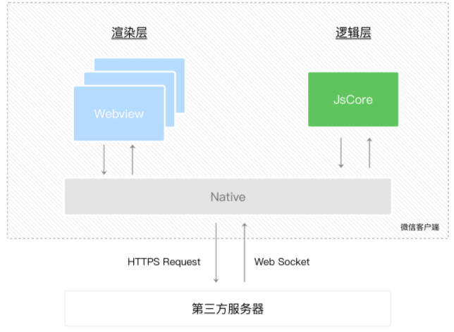

## 小程序

## 描述

> ```bash
> # 小程序特点
> 	- 简单、用完即走、低频、性能要求不高的应用
> 	- 不需要下载安装即可使用的应用，实现“触手可及”的梦想，使用方便快捷
> 	
> 	
> # 小程序文件注意事项
>   - 标签的书写严格，区分大小写
>   - 不支持通配符选择器
>   - JSON  文件中无法使用注释，样式文件多行注释才有效
>   - 没有跨域的，服务器必须用Https
>   - 页面.js文件中 存放事件回调函数的时候，存放在data同层级下
>   - 组件.js文件中存放事件回调函数的时候，必须要存放在methods中
>   - iPhone的部分手机不识别webp图片格式
>   
>   
> # 小程序中引入less
> 	- 安装插件`easy-less`
> 	- 在设置里面的`easy-less`配置加入自动生成`wxss`文件配置
> 			"less.compile": {
>           "outExt":".wxss"
>         }
>         
>   
>   
> # vscode 开发微信小程序安装的插件
>     - minapp：微信小程序标签、属性的智能补全
>        - （同时支持原生小程序、mpvue 和 wepy 框架，并提供 snippets）
>        - 需要输入才会触发标签补全；输入空格会触发对应标签的属性补全
>     - wxapp-helper：选择创建wx组件，自动生成配套的文件
>     - WXML-Language Service
>     - 小程序开发助手
>     - wechat-snippet：微信小程序代码辅助,代码片段自动完成
> 
> ```

### 小程序代码构成

````bash
# 微信小程序的页面分别由四个文件组成：
  - .js(脚本逻辑文件)：负责页面逻辑内容的处理，遵循js语言框架。
  - .json(配置文件)：用来设置页面的窗口内容，遵循`JSON`语法规范。
  - .wxss(样式文件)：兼容CSS语法规范。类似CSS源文件
  - .wxml（页面结构文件或视图文件）：用于页面可视化组件的组织和描述，语法结构类似于xml，与html格式差别较大。
      是编写小程序骨架的文件（类似HTML+CSS）


# 开发目录如下：
    |—— app.js
    |—— app.json
    |—— app.wxss
    |—— pages
    |   |—— index
    |   |   |—— index.wxml
    |   |   |—— index.js
    |   |   |—— index.json
    |   |   |—— index.wxss
    |   |—— logs
    |   |   |—— logs.wxml
    |   |   |—— logs.js
    |__ utils


# 页面路由配置
	- 需要在app.json文件下配置 page与logs 路径
      {
        "pages": ["pages/index/index", "pages/logs/logs"]
      }
````

#### .json配置

##### 小程序配置app.json

- 用于指定小程序由哪些页面组成，每一项都对应一个页面的路径（含文件名）信息。文件名不需要写文件后缀，框架会自动去寻找对应位置的 `.json`, `.js`, `.wxml`, `.wxss` 四个文件进行处理
- app.json文件对微信小程序进行全局配置，决定页面文件的路径、窗口表现、设置网络超时时间、设置多tab等。
- `pages`字段 —— 用于描述当前小程序所有页面路径，这是为了让微信客户端知道当前你的小程序页面定义在哪个目录下。
- `window`字段 —— 定义小程序所有页面的顶部背景颜色，文字颜色定义等。

##### 页面配置page.json

在页面下的`.json`文件不能写搭配的路径，如上面的`"pages":["xxx"]`等；只能写配置窗口表现`window`的属性

```app.json
{
  "window": {
    "navigationBarBackgroundColor":"#ffffff",
    "navigationBarTextStyle": "black",
    "navigationBarTitleText":"文与字", //设置标题字
    "backgroundColor": "#eeeeee",
    "backgroundTextStyle": "light"
  }
}
```

##### 微信索引sitemap.json

- 当开发者允许微信索引时，微信会通过爬虫的形式，为小程序的页面内容建立索引。当用户的搜索词条触发该索引时，小程序的页面将可能展示在搜索结果中。 
- 在小程序根目录下的`sitemap.json`文件来配置小程序及其页面是否允许被微信索引。
- 注：`没有 sitemap.json` 则默认所有页面都能被索引
  注：`{"action": "allow", "page": "\*"}` 是优先级最低的默认规则，未显式指明 "disallow" 的都默认被索引
- 注：`sitemap` 的索引提示是默认开启的，如需要关闭 `sitemap` 的索引提示，可在小程序项目配置文件 `project.config.json` 的 `setting` 中配置字段 `checkSiteMap` 为 `false`
  注: `sitemap` 文件内容最大为 5120 个 UTF8 字符

```sitemap.json
{
  "rules":[{	
  	// 所有页面都会被微信索引（默认情况）
    "action": "allow",
    "page": "*"
  },{	
  	//配置 path/to/page 页面不被索引，其余页面允许被索引
    "action": "disallow",
    "page": "path/to/page"
  },{	
  	// 包含 a 和 b 参数的 path/to/pages 页面会被微信优先索引，其他页面都会被索引
    "action": "allow",
    "page": "path/to/pages",
    "params": ["a", "b"],
    "matching": "inclusive"
  }]
}
```

#### .wxml 模板

- 网页编程采用的是 HTML + CSS + JS 这样的组合，其中 `HTML` 是用来描述当前这个页面的结构，`CSS` 用来描述页面的样子，`JS` 通常是用来处理这个页面和用户的交互。
- `wxml`和`html`相似，由标签、属性等构成。

1、view主键：等价于HTML中的div标签

2、滑动轮播图

```.wxml
//可以滑动切换内容,相对于JS，内部已经通过标签部署好切换的JS代码
//swiper-item标签只是起到容器的作用，里面可以放不同的内容
//vertical为滚动的方向，默认false，true为纵向滚动
<view>
	<swiper vertical="true">
		<swiper-item>Content1</swiper-item>
		<swiper-item>Content2</swiper-item>
		<swiper-item>Content3</swiper-item>
	</swiper>
</view>
```

3、数据绑定

通过 {{ }} 的语法把一个变量绑定到界面上，我们称为数据绑定。仅仅通过数据绑定还不够完整的描述状态和界面的关系，还需要 `if`/`else`, `for`等控制能力，在小程序里边，这些控制能力都用 `wx:` 开头的属性来表达。

```wxml
this.setData({ msg: "Hello World" })
```

#### wxss 样式

- `WXSS` 具有 `CSS` 大部分的特性；
  新增尺寸单位，`WXSS` 在底层支持新的尺寸单位 `rpx`；
  提供了全局的样式和局部样式；
  `WXSS` 仅支持部分 `CSS` 选择器。

1、移动设备的分辨率与rpx

- 分辨率PT：逻辑分辨率，长度和视觉单位，pt大小和屏幕尺寸有关

- 分辨率PX：物理分辨率，像素比，和屏幕尺寸无关

- PPI（DPI）：用分辨率的平方开根号再除以屏幕英寸所得

- 建议：在控制两个元素之间的距离时，用px，因为在不同设备下，rpx会转变为不同的宽度，而不是固定的宽度，可能会造成换行的情况。

2、通过弹性布局使得页面具有流动性

```wxss
.container{
	display:flex;
	flex-dicection:colum;//设置方向为列方向
	align-item:conter; //设置内容居中
}
```

#### .js逻辑交互

- 通过`.js`脚本文件来处理用户的操作和用户交互。如响应用户的点击、获取用户的位置等。

### 渲染层与逻辑层

- 小程序运行环境分为渲染层和逻辑层，其中`WXML`模板和`WXSS`样式工作在渲染层，`JS`脚本工作在逻辑层。
- 渲染层的界面使用`WebView`进行渲染；逻辑层采用`JsCore`线程运行`JS`脚本。因小程序有多个页面，所以渲染层存在多个`WebView`线程，这两个线程的通信会经常由微信客户端做中转，逻辑层发送网络请求也经由`Native`(微信客户端)转发。



### 小程序架构->`MVVM`模式

- 架构分为视图层(`wxml、wxss`)，逻辑层(`js`)，组件，API四部分。视图层负责页面结构，样式和数据展示。逻辑层负责业务逻辑，调用API等。
- 视图层和逻辑层类似`vue的MVVM`模式，逻辑层只需对数据对象更新，就可改变视图层的数据显示，类似vue。组件是视图层封装好的基础组件，如按钮，输入框等。API提供了访问手机设备，网络，服务器，微信平台接口等能力。

### 分包

```

```

## 标签

### 单选框`radio`

- > 需要与父元素`radio-group`一起使用

- 绑定事件`bindchange="函数"`

```
<radio-group bindchange="handleChange">
    <radio value="male" color="red" checked="{{true}}">男</radio>
    <radio value="female" color="red">女</radio>    
</radio-group>
<view>选中的是{{gender}}</view>
```

```js
Page({
  data: {
    gender:""
  },
  handleChange(e){
    let gender = e.detail.value;
    this.setData({ gender })
  }
})
```

### `icon`标签

- type属性，样式
  - success勾选
- size属性，图标大小
- color属性，图标颜色

### `view`标签

- `view`标签相当于`html的div`，默认为块级元素。

### text标签

- text 相当于span，默认行内元素，html中怎么打怎么显示	
- 只能嵌套text
- selectable属性，长按文字可以复制，只有这个标签有这个功能
- decode属性，可以对空格，大于号进行编码

### block标签

一个占位符标签，当页面渲染的时候会自动去掉该标签和属性，效果依然显示

### image标签

- 默认大小为宽320px，高240px
- 小程序的图片支持懒加载`mode="lazy-load"`(图片出现在视口上下三屏高度之内时，自动加载图片)

#### 图片显示大小

- **`高度 = 750rpx * 图片高度/图片宽度;`**

```wxss
// 如轮播图图片 750rpx默认高度，图片宽520px,高280px
swiper {	
	width: 100%;	
	height: calc(750rpx * 280px / 520px);
}
image { width: 100%; }
```

#### **图片高度自适应**

小程序图片高度自适应：给image标签定义属性`mode="widthFix"`

```wxml
<image src="{{item.cover}}" mode="widthFix" />
```

### swiper标签（轮播图）

- 轮播图外层容器swiper

- 每一个轮播项swiper-item

- 默认宽度100%，高度150px（swiper的宽度=100%或者100vw或者750rpx）

- `swiper的高度 = calc(原图的高度 * swiper的宽度 / 原图的宽度)`

#### 轮播图滚动时圆角变直角

- 原因：轮播切换时子元素溢出。
- 解决方案：设置父级元素的样式，自己元素溢出的话隐藏

```wxss
swiper {
  width: 80%;
  height: cal(750rpx * 720px / 1280px);
  border-radius:20rpx;
  overflow:hidden; 
  swiper-item {
    border-radius: 5%;
    image {
      width: 100%;
      border-radius: 5%;
    }
  }
}
```

### navigator标签(超链接)


## 组件

### tabBar配置（底部导航栏）

- 底部的导航栏可以放2~5个导航链接，定义这个需要在全局`app.json`文件中配置`tabBar`字段。

  - `position`->top顶部显示，但是看不到图标，默认是底部显示

  - `color`未选中时的颜色

  - `selectedColor`选中时的颜色

  - `backgroundColor`背景颜色

  - `borderStyle`边框颜色，仅支持black/white。默认为black,选填

  - >list数组里至少有两个对象；颜色仅支持十六进制的输入

```app.json
{
	"tabBar": {
		"color": "#ddd",
		"selectedColor": "#3cc51f",
		"backgroundColor": "#fff",
		"borderStyle": "black",	
		"list":[{	// iconPath图标是非必填，只是tab栏会变矮，selectedIconPath也非必填
                "pagePath":"pages/index/index",
                "iconPath":"./image/icon_API.png",
                "selectedIconPath":"./image/icon_API_HL.png",
                "text":"index"
            },{
                "pagePath":"pages/detail/detail",
                "iconPath":"./image/icon_component.png",
                "selectedIconPath":"./image/icon_component_HL.png",
                "text":"detail"
            }]
	}
}
```


### navigator导航栏组件

- url可加绝对路径，也可加相对路径，/根目录，./当前目录，小程序跳转最多只有5级

  ```html
  url="/pages/demo01/demo01"
  url="../detail/detail?={{item.id}}" //点击跳转不同页面
  ```

- 块级元素，导航栏对navigatior导航栏进行渲染

- target跳到当前的小程序还是跳到其他的小程序

- open-type属性

  - navigate默认属性，保留了当前页面，不能跳到tabar页面
  - redirect没返回跳转功能，关闭当前页面，也不能跳转到taber页面
  - switchTab跳转到tabar页面，关闭其他所有页面，底部的tabar可轮流切换
  - reLaunch随便跳
  - navigateBack跳转过去，可在跳回来
  - exit退出其他小程序

### 父子组件通信

- 父组件

  ```wxml
  <Tabs aaa="a123a"></Tabs>
  ```

- 子组件 `tabs.js` 

  ```index.js
  properties: {
    aaa:{
    	type:String,
    	value:""
    }
  }
  ```

  ```wxml
  <view>{{ aaa }}<view>
  ```


## 动态

### 冒泡事件

- 冒泡事件：子向父元素传递事件
- 三个阶段：捕获->处理->冒泡
- 事件委托：防止重复定义事件
- `bind`绑定冒泡事件，`catch`绑定非冒泡事件

### 数据绑定

```.wxml
<view>
	//6、内壳嵌套使用
	<image src="{{img.post_img}}">
	<button class='{{item}}' bindtap='clickme'>按钮</button>
</view>

//3、运算绑定
<view hidden='{{type?true:false}}'>Hidden</view>

//4、控制属性绑定
<view wx:if="{{myKey}}">你的名字</view>

//5、wx:for列表渲染语句
<view wx:for="{{array}}">{{index}}:{{item.info}}</view>
```

### 自定义下拉刷新

- 在`app.json`和`xx.json`中的`window`里配置,

  ```wxml
  {	"window": {		"enablePullDownRefresh": true,	}}
  ```

- 在下拉触发的`onPullDownRefresh`函数里清除`loadin`状态
  （如果不清除loadin状态，下拉后，动态图片一直在loadin状态，即二次刷新不出来）

  ```index.js
  onPullDownRefresh: function() {	wx.stopPullDownRefresh();},
  ```

### `input`事件绑定

- input事件的双向绑定，`bindinput="函数"`,函数与data同级
  - 获取事件源对象`e.detail.value`
  - 把输入框的值赋值给data中，用`this.setData({})`，不能直接`this.data.name=e.detail.value`或``this.name=e.detail.value`

- button点击事件，``bindtap=“函数”``
  - 无法在小程序中直接传参的
  - 通过自定义属性的方式传递参数``data-operation=“{{1}}”``
  - 事件源（函数）中获取自定义属性`consolo.log(e)`
  - `const operation=e.currentTarget.dataset.operation`
  - 获取值用`this.data`，设置值用`this.setData({})`

```html
<input type="text" bindinput="handle"/>
<button bindtap="handletap" data-operation="{{1}}">+</button><button bindtap="handletap" data-operation="{{-1}}">-</button>
```

```js
Page({  
  data: {    
    num:0  
  },  
  handle(e){    
    this.setData({      
      num:e.detail.value    
    })  
  },  
  handletap(e){    
    const operation = e.currentTarget.dataset.operation;    
    this.setData({      
      num:this.data.num + operation    
    })  
  }
})
```

### 本地存储

**web与小程序本地存储的区别**

- 书写方式不同
  - web：`localStorage.setItem("key","value")  localStorage.getItem("key")`
  - 小程序：`wx.setStorageSync("key","value"); wx.getStorageSync("key");`
- 存储时有无做类型转换
  - web：不管存入什么类型的数据，最终都会通过`toString()`把数据转换成字符串再存入；
  - 小程序：不做类型转换操作，存什么类型数据，就会获取什么类型。

> **注意：本地缓存是永久存储的，但不建议将关键信息存放在localStorage，以防用户换设备的情况**

#### 异步

**`wx.setStorage(Object object)`：将数据存储在本地缓存中指定的 key 中，会覆盖掉原来该 key 对应的内容**

```
wx.setStorage({
  key:"key",
  data:"value"
})
```

 **`wx.getStorage(Object object)`：从本地缓存中异步获取指定 key 的内容**

```
wx.getStorage({
  key: 'key',
  success: function(res) {
      console.log(res.data)
  }
})
```

 **`wx.getStorageInfo(Object object)`：异步获取当前storage的相关信息**

```
wx.getStorageInfo({
  success: function(res) {
    console.log(res.keys)
    console.log(res.currentSize)
    console.log(res.limitSize)
  }
})
```

 **`wx.removeStorage(Object object)`：从本地缓存中移除指定的key**

```
wx.removeStorage({
  key: 'key',
  success (res) {
    console.log(res)
  }
})
```

#### 同步

1. `wx.setStorageSync(string key, any data)`：将 data 存储在本地缓存中指定的 key 中，会覆盖掉原来该 key 对应的内容。
2. `wx.getStorageSync(string key)`：从本地缓存中同步获取指定 key 对应的内容。
3. `wx.getStorageInfoSync()`：同步获取当前storage的相关信息
4. `wx.removeStorageSync(string key)`：从本地缓存中同步移除指定 key 。

#### 清理缓存

1. 清理本地数据缓存：`wx.clearStorage()`
2. 同步清理本地数据缓存：`wx.clearStorageSync()`

#### 判断本地缓存中某key是否存值

- 常用于判断用户是否已经登录

```js
onLoad: function() {
  let value = wx.getStorageSync("key11");
  if(!value) {
    console.log("key值为key11的本地缓存为空");
  } else {
    console.log("key值为key11的本地缓存不为空")
  }
},
```

### 消息提示框

- 显示消息提示框：**wx.showToast(OBJECT)**
- 隐藏消息提示框：**wx.hideToast()**
- 显示模态弹窗：**wx.showModal(OBJECT)**
- 显示操作菜单：**wx.showActionSheet(OBJECT)**

```js
wx.showToast({
 title: '成功',
 icon: 'success',
 duration: 2000
})

wx.showToast({
 title: '加载中',
 icon: 'loading',
 duration: 10000
})
setTimeout(function(){
 wx.hideToast()
},2000)

wx.showModal({
 title: '提示',
 content: '这是一个模态弹窗',
 success: function(res) {
  if (res.confirm) {
   console.log('用户点击确定')
  }
 }
})

wx.showActionSheet({
 itemList: ['A', 'B', 'C'],
 success: function(res) {
  if (!res.cancel) {
   console.log(res.tapIndex)
  }
 }
})
```

### 数组

#### 数组无法使用push()

- 在小程序中的类库中没有包含数组的push()方法来给数组添加元素，以为为替代方法

```js
let list = []
let obj = {"willy","test"}
list[list.length] = obj;
setData({ list: list })
```

## 属性

### 条件渲染

> ```bash
> # 条件渲染 wx:if、wx:elif、wx:else
> 		- 在组件上使用`wx:if={{ 表达式的真假性 }}`来判断是否需要渲染该代码块
>         <view wx:if="{{ length >5 }}"> 1 </view>
>         <view wx:elif="{{ length >2 }}"> 2 </view>
>         <view wx:else="{{ length }}"> 3 </view>
> 
> 
> 
> # wx:if 与 hidden 属性的区别
>     1. wx-if="{{对象.key}}" 条件渲染
>         - 初始渲染开销小，用于非频繁切换
>         - 当条件为false时，直接把标签从页面结构移除掉
>     2. hidden属性直接加入hidden="{{true}}" 就隐藏组件
>         - 初始渲染开销大，用于用户频繁切换
>         - 通过添加样式的方式来切换显示
>         - 相当于添加了个样式`display:none`，不要和display标签一起使用
>     3. wx:if懒渲染，hidden渲染
> ```

### 列表渲染`wx:for`

> - 在组件上使用`wx:for="数组名"`控制属性绑定一个数组，即可使用数组中各项数据重复渲染该组件。
>   - 默认数组当前项的下标变量名默认为`index`，当前项的变量名默认为`item`
>   - `wx:for-item`可指定数组当前元素的变量名；
>   - `wx:for-index`可以指定数组当前下标的变量名；
>
> ```wxml
> <view wx:for="{{ arr }}" wx:for-item="itemName" wx:for-index="idx">
>   {{ idx }}：{{ itemName.message }}
> </view>
> ```
>
> ```index.js
> Page({	
> 	data: {
> 		arr: [			
> 			{ message: 'foo', },			
> 			{ message: 'bar', },		
> 		]	
> 	}
> })
> ```

### 属性说明

> ```bash
> # overflow属性
> 		- overflow：auto;手指滚动
> 		
> 		
> # box-sizing属性
>   - box-sizing: border-box;屏幕自适应尺寸，就不会再考虑边框和内边距会改变整体所占宽度
>   		- 原：width=content
>   		- `width=content+padding+border`，``height=content+padding+border`
>   		- 采用的是flex布局的方式，为了自适应，宽度 width采用的是 % 的形式，border，padding，margin采用的是 px尺寸，所有外层的盒子运用了 box-sizing:border-box; 属性来改变盒子的结构，从而实现需求。
> ```

## 样式

### `tap-highlight-color`点击高亮透明

- `tap-highlight-color：transparent；`

- 点击内容的时候是高亮的改为透明的；

  这个属性只用于iOS (iPhone、iPad)。当点击链接或通过Javascript定义的可点击元素时，就会出现一个半透明的灰色背景。要重设这个表现，可设置``-webkit-tap-highlight-color`为任何颜色。

### 文本行数

```wxss
display: -webkit-box;
overflow: hidden;
-webkit-box-orient: vertical;
-webkit-line-clamp: 2;	

white-space: normal;
word-wrap: break-word;
text-overflow: ellipsis;
```

- `-webkit-line-clamp` 是一个 不规范的属性（unsupported WebKit property），它没有出现在 CSS 规范草案中。为了实现该效果，它需要组合其他外来的WebKit属性。常见结合属性：
  - `display: -webkit-box;` 必须结合的属性 ，将对象作为弹性伸缩盒子模型显示 。
  - `-webkit-box-orient` 必须结合的属性 ，设置或检索伸缩盒对象的子元素的排列方式 。
  - `text-overflow`：可以用来多行文本的情况下，用省略号“...”隐藏超出范围的文本 。

### 文本显示空格、换行

- 使用 css 属性 ：**white-space:pre-wrap**

> 注意：设置space和decode属性必须在`<text>`标签中使用

```wxml
<view style="white-space:pre-wrap">
	文本保留空格和回车
</view>

2.连续空格  注意：必须在<text>标签中使用
<text space="ensp">你好 啊      哈哈哈（空格是中文字符一半大小）</text>
<text space="emsp">你好 啊      哈哈哈（空格是中文字符大小）</text>
<text space="nbsp">你好 啊      哈哈哈（空格根据字体设置）</text>
<text decode="{{true}}">&ensp;（空格是中文字符一半大小）\n&emsp;（空格是中文字符大小）\n&nbsp;（空格根据字体设置）</text>
```


### 尺寸单位`rpx`

- 

```bash
# 尺寸计算
  - 自适应屏幕大小，小程序的屏幕默认为`750rpx`
  - `设计稿 1px / 设计稿基准宽度 = 框架样式 1rpx / 750rpx`
  - 页面的宽度：`calc（750rpx * 元素在设计稿中的宽度 / 设计稿基准宽度）`，750和rpx之间不能有空格


# 尺寸计算案例
    1. 若设计稿宽度为 750px，元素 A 在设计稿上的宽度为 100px，
        那么元素 A 在 `uni-app` 里面的宽度应该设为：`750 * 100 / 750`，结果为：100rpx。
    2. 若设计稿宽度为 640px，元素 A 在设计稿上的宽度为 100px，
        那么元素 A 在 `uni-app` 里面的宽度应该设为：`750 * 100 / 640`，结果为：117rpx。
    3. 若设计稿宽度为 375px，元素 B 在设计稿上的宽度为 200px，
        那么元素 B 在 `uni-app` 里面的宽度应该设为：`750 * 200 / 375`，结果为：400rpx。
```

## 问题

### 小程序没有npm

1. 进入小程序根目录，打开终端(cmd)，输入：`npm init`
2. 输入命令：`npm i miniprogram-sm-crypto --production`
3. 执行命令完之后，然后再去微信开发者中点工具-构建npm，然后就成功了

### `vant`组件的样式无法覆盖

>普通样式类和外部样式类的优先级是未定义的，因此使用时请添加`!important`以保证外部样式类的优先级。

```wxml
<van-button type="primary">主要按钮</van-button>
<van-cell
  title="单元格"
  value="内容"
  title-class="cell-title"
  value-class="cell-value"
/>
```

```wxss
/* page.wxss */
.van-button--primary {
  font-size: 20px;
  background-color: pink;
}

.cell-title {
  color: pink !important;
  font-size: 20px !important;
}
.cell-value {
  color: green !important;
  font-size: 12px !important;
}
```

在自定义组件中使用 Vant Weapp 组件时，需开启`styleIsolation: 'shared'`选项。

```js
Component({
  options: {
    styleIsolation: 'shared',
  },
});
```

### 控制台报错

#### `Unhandled promise rejection TypeError: WebAssembly.instantiate(): Argument 0 must be a buffer source or a WebAssembly. `

原因：基础库版本过高

打开 顶部工具栏-------设置-------项目设置：把测试基础库改为2.14.4