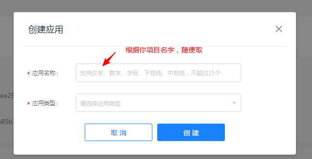
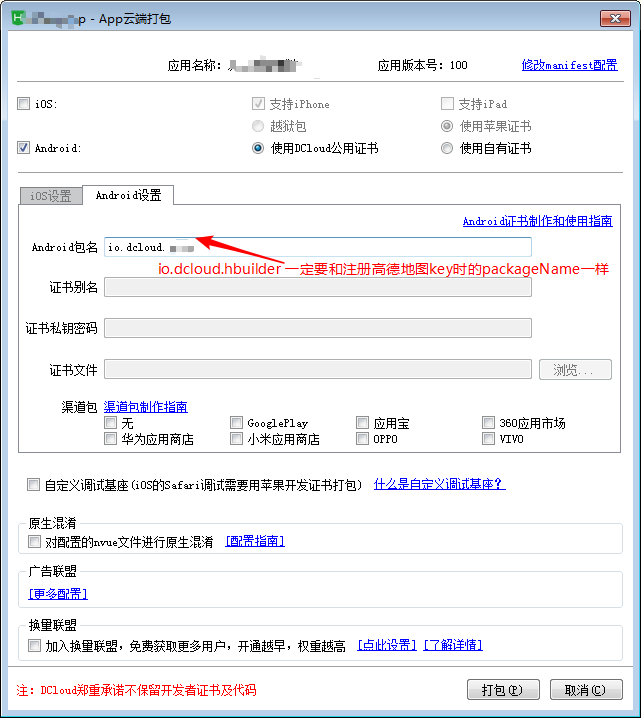

## 移动端开发

```bash
# 移动端开发 / HTML5
DTD对比
FileReader文件流
页面生命周期
网页状态监听
Notifications桌面通知
播放器开发 canvas交互特效开发
移动端适配/事件
移动端适配概念
尺寸与分辨率原理
PPI与DPI计算
DIP与DPR设备像素概念
视口viewport概念
布局视口
视觉视口
理想视口
视口适配方案（Meta viewport）缩放设置
screen窗口大小API
移动端适配方案
flexible rem方案
复合方案
高清适配方案
移动端字体缩放解决
半像素线
图片高清适配
image-set
Srcset
js拼接URL技巧
IPhonex刘海屏适配
安全区域
fit与env
Meta权限管理
兼容优化
IOS头部底部闪屏回退输入框问题
输入法空格问题
默认首字母大写问题
滑动卡顿问题等
终端样式美化与访问判断
Touch事件组封装
click延迟处理
FastClick使用
禁用缩放设置理想视口

```


### 视窗 viewport

```bash
viewport 是严格等于浏览器的窗口。
	- 在桌面浏览器中，viewport 就是浏览器窗口的宽度高度。
	- 因为移动端的 viewport 太窄，所以存在两个 viewport：虚拟的 viewportVisualViewport 和 布局的 viewportLayoutViewport
```


#### 物理像素、逻辑像素、CSS 像素、PPI、设备像素比

```bash
- 物理像素代表屏幕上有多少个点，比如 1080*2340 表示屏幕水平方向一排有 1080 个物理像素点。
- 逻辑像素表示屏幕展示物体的视觉尺寸是多少。逻辑像素相同表示物体看起来或者打印出来大小一样，物理像素点越小，一个逻辑像素包含点物理像素点越多，看起来就越清晰。
- 一般情况下 CSS 像素等同于逻辑像素，但浏览器和手机具备放大模式，此时就不再相等。
- PPI 是屏幕对角线的物理像素的个数除以对角线英寸数。
- 设备像素比是在水平或者垂直方向，在同一排一个逻辑像素能放几个物理像素。


1. 物理像素 (physical pixel)
物理像素又称设备像素，是屏幕的最小物理单位。
如手机参数中的 '2340 * 1080' 像素分辨率指的是设备像素，表示屏幕水平有 10801 个点，垂直有 2340 个点。


2. 逻辑像素 (density-independent pixel)
逻辑像素又称设备独立像素，可以认为是计算机坐标系统中的一个点，这个点代表一个可以由程序使用的虚拟像素(比如说CSS像素)，然后由相关系统转换为物理像素。
如电脑屏幕中 2560*1600 分辨率的字太小了，把它调为 1400*900。这里的分辨率指设备独立像素，可通过 window.screen.width/window.screen.height 查看。


3. 屏幕密度 (PPI - pix per inch)
每英寸的物理像素数。
以尺寸为5.4英寸（屏幕对角线长度）、分辨率为1080 x 2340的iPhone12 mini为例， ppi = Math.sqrt(1080*1080 + 2340*2340) / 5.4 ，值为 476PPI。


4. CSS像素
CSS像素（CSS pixels）是指在CSS中使用的抽象单位，不同于物理像素（physical pixels），它是浏览器使用的一个相对单位，用来精确度量网页上的内容。
CSS像素的大小与设备的分辨率无关，而是根据浏览器的缩放级别和用户屏幕的像素密度（DPI (device-independent pixel)）而定。
在标准屏幕上（页面缩放比为1），1个CSS像素等于 1个设备独立像素，1个CSS像素通常等于 1个物理像素；但在高分辨率屏幕（如Retina显示屏）上，1 CSS像素可能会对应多个物理像素。
CSS像素常用于定义网页元素的尺寸、边距、字体大小等，它的值可以是整数或小数。在不同的设备上，同样的CSS像素大小可能会呈现不同的物理尺寸，因此使用CSS像素可以保证在不同设备上元素的显示效果更加一致。
当页面缩放比不为1时，CSS像素和设备独立像素不再对应。比如当页面放大200%，则1个CSS像素等于4个设备独立像素。
比如假设把屏幕独立像素分辨率设置为 1440x900，给页面元素设置为宽度 720px，则视觉上元素的宽度是屏幕宽度的一半。这也解释了为什么当我们把独立像素分辨率调高后网页的文字感觉变小了。


5. 设备像素比 (device pixel ratio)
设备像素比（dpr），指设备物理像素和逻辑像素（device-independent pixels, dips）的比例。
公式：设备像素比 ＝ 物理像素 / 设备独立像素。
在JavaScript中，可以通过window.devicePixelRatio获取到当前设备的dpr。
iPhone12mini 的 DPR 是 1080 / 375 = 3。
```


#### 安全区域适配

```bash
### ViewPort 
iOS11 为了适配 iPhoneX 对现有 `viewport meta` 标签的一个扩展，用于设置网页在可视窗口的布局方式，可设置三个值：
 - contain: 可视窗口完全包含网页内容
 - cover：网页内容完全覆盖可视窗口
 - auto：默认值，跟 contain 表现一致


### env() 和 constant()
iOS11 新增特性，`Webkit` 的一个 CSS 函数，用于设定安全区域与边界的距离，有四个预定义的变量：
 * safe-area-inset-left：安全区域距离左边边界距离
 * safe-area-inset-right：安全区域距离右边边界距离
 * safe-area-inset-top：安全区域距离顶部边界距离
 * safe-area-inset-bottom：安全区域距离底部边界距离
注意：env() 跟 constant() 需要同时存在，而且顺序不能换
```

**第一步：设置网页在可视窗口的布局方式**

```html
<meta name="viewport" content="width=device-width, viewport-fit=cover">
```

**第二步：页面主体内容限定在安全区域内**

```html
body {
	padding-bottom: constant(safe-area-inset-bottom);
	padding-bottom: env(safe-area-inset-bottom);
}
```

**第三步：fixed 元素的适配**

追加`padding-bottom`

```css
.fixed-div {
	height: calc(60px(假设值) + constant(safe-area-inset-bottom));
	height: calc(60px(假设值) + env(safe-area-inset-bottom));
}
```


#### flexible

- [flexible.js的源码地址](https://github.com/amfe/lib-flexible/blob/master/src/flexible.js)
- [flexible.js源码解析](https://github.com/beipiaoyu2011/flexible)
- fleible 的实现
    1. 动态创建（或修改）`meta[name="viewport"]` 的`initial-scale`和`maximum-scale`值。
    2. 根据根节点 Bounding Box 的宽度，计算根节点的fontSize值
    3. 监听`resize`和`pageshow`事件，事件触发时，重新计算根节点 fontSize 值。

```ts
const Flexible = () => {
  const doc = window.document
  const docEl = doc.documentElement
  let metaEl: any = document.querySelector('meta[name="viewport"]')

  /** 获取 dpr 和 scale */
  let dpr = 1
  let scale = 1
  const getDpr = () => {
    if (metaEl !== null) {
      const match = metaEl
        .getAttribute('content')
        .match(/initial\-scale=([\d\.]+)/)
      if (match) {
        scale = parseFloat(match[1])
        dpr = parseInt((1 / scale).toString())
      }
    }
    return { dpr, scale }
  }
  getDpr()

  /** 设置 meta 标签的数值 */
  const setMeta = () => {
    docEl.setAttribute('data-dpr', dpr.toString())
    if (!metaEl) {
      metaEl = doc.createElement('meta')
      metaEl.setAttribute('name', 'viewport')
      metaEl.setAttribute(
        'content',
        'initial-scale=' +
          scale +
          ', maximum-scale=' +
          scale +
          ', minimum-scale=' +
          scale +
          ', user-scalable=no',
      )
      if (docEl.firstElementChild) {
        docEl.firstElementChild.appendChild(metaEl)
      } else {
        var wrap = doc.createElement('div')
        wrap.appendChild(metaEl)
        doc.write(wrap.innerHTML)
      }
    }
  }
  setMeta()

  /** 更新 rem 数值 */
  const refreshRem = () => {
    const docElWidth = docEl.getBoundingClientRect().width
    const rem = (docElWidth * dpr) / 10
    docEl.style.fontSize = rem + 'px'
  }

  /** 设置时延触发事件 */
  let resetTimerId: NodeJS.Timeout | null
  const resetSetRem = () => {
    if (resetTimerId) clearTimeout(resetTimerId)
    resetTimerId = setTimeout(() => {
      resetTimerId = null
      refreshRem()
    }, 100)
  }

  /** 初始化执行事件 */
  const initEvent = () => {
    window.addEventListener('DOMContentLoaded', resetSetRem)
    window.addEventListener('load', resetSetRem)
    window.addEventListener('resize', resetSetRem)
  }
  initEvent()
}
Flexible()

```


## Hybrid App 开发

```bash
混合式开发（Hybrid App开发）是指在开发一款 App 产品由原生与 H5 的开发技术（“HTML5云网站 + APP应用客户端”）两部分组成的的混合应用，原生代码利用 "Web View" 插件或者其他框架为 H5 提供容器，程序主要的业务实现、页面展示都是利用与 H5 相关的 Web 技术进行实现。


### WebView
webView 是移动端提供的运行 JavaScript 的环境，是系统渲染 Web 网页的一个控件，可与页面 JavaScript 交互，实现混合开发，其中 Android 和 iOS 又有些不同：
	- Android 的 WebView 的低版本和高版本使用了不同的webkit内核，4.4后使用 Chrome。
	- iOS 中 UIWebView 是自IOS2就有，但性能、特性支持较差，WKWebView 是 iOS8 后的升级版。
WebView 控件除了能加载指定的 url 外，还可以对 URL 请求、JavaScript 的对话框、加载进度、页面交互进行处理，如拦截请求、执行JS脚本等。


### JS桥技术（JsBridge）
JSBridge 主要提供 JS 调用 Native 代码的能力来实现原生功能（如查看本地相册、打开摄像头、指纹支付等），核心是构建 Native 和 H5 之前的通信通道（双向通信）。
		1. JS 向 Native 发送信息：调用相关功能、通知 Native 当前 JS 的相关状态等。
		2. Native 向 JS 发送信息：回溯调用结果、消息推送、通知 JS 当前 Native 的状态等。


### JSBridge 的实现原理
JavaScript 是运行在一个单独的 JS Context 中（如 WebView 的 Webkit 引擎、JSCore）。由于这些 Context 与原生运行环境的天然隔离，我们可以将这种情况与 RPC（远程过程调用 Remote Procedure Call）通信活JSONP流程进行类比，将 Native 与 JavaScript 的每次互相调用看做一次 RPC 调用。
实现 JSBridge 主要是两点：
		- （通信调用（Native 与 JS 通信）和句柄解析调用）
		1. 将 Native 端原生接口封装成 JavaScript 接口
		2. 将 Web 端 JavaScript 接口封装成原生接口


### JSBridge 的通信流程
JavaScript 调用 Native：
		1. 接收到 JavaScript 消息；
		2. 解析参数，拿到 bridgeName、data 和 callbackId；
		3. 根据 bridgeName 找到相应功能方法，以 data 为参数执行；
		4. 执行返回值和 callbackId 一起回传到前端。
Native 调用 JavaScript：
		1. 直接自动生成一个唯一的 ResponseId，并存储句柄，然后和 data 一起发送给前端。


### Android 跟 IOS 调用的区别
- IOS: `window.postBridgeMessage(message)`
- Android: `window.webkit.messageHandlers.nativeBridge.postMessage(message)`
```


### JSBridge 的通信原理


### JS 调用 Native

```bash
### JS 调用 Native

#### 拦截 Webview 请求的 URL Schema
URL SCHEME 是类似于 url 链接，是为了方便 App 直接互相调用设计的，形式和普通 url 主要区别是 protocol 和 host 是自定义的，格式如 `<protocol>://<host>/<path>?<qeury>#fragment`。
例如: qunarhy://hy/url?url=ymfe.tech，protocol 是 qunarhy，host 则是 hy。

拦截 URL SCHEME 的主要流程是：Web 端通过某种方式（例如 iframe.src）发送 URL Scheme 请求，之后 Native 拦截到请求并根据 URL SCHEME（包括所带的参数）进行相关操作。
在时间过程中，这种方式有一定的缺陷：
  1. 使用 iframe.src 发送 URL SCHEME 会有 url 长度的隐患。
  2. 创建请求需要一定的耗时，比注入 API 的方式调用同样的功能耗时会较长。
因此 JavaScript 调用 Native 推荐使用注入 API 的方式。


#### 注入 API
注入API 主要原理是通过 WebView 提供的接口，向 JS 的 Context（window）中注入对象或者方法，让 JS 调用时直接执行相应的 Native 代码逻辑，达到 JS 调用 Native 的目的。
```


### 实现 JSBridge

#### JavaScript 端实现

```ts
interface JSBridge {
  id: number
  callbacks: { [key: number]: (data: any) => void }
  registerFuncs: {
    [key: string]: ((
      data: any,
      responseCallback: (response: any) => void,
    ) => void)[]
  }

  postMessage: (message: any) => void
  callNative: (
    bridgeName: string,
    data: any,
    callback?: (response: any) => void,
  ) => void
  receiveMessage: (response: {
    bridgeName?: string
    callbackId?: number
    data: any
    responseId?: number
  }) => void
  register: (
    bridgeName: string,
    callback: (data: any, responseCallback: (response: any) => void) => void,
  ) => void
}

interface Window {
  JSBridge: JSBridge
  [key: string]: any
}

window.JSBridge = {
  id: 0,
  callbacks: {},
  registerFuncs: {},

  postMessage: (message) => {
    if (
      window.webkit &&
      window.webkit.messageHandlers &&
      window.webkit.messageHandlers.nativeBridge
    ) {
      // iOS
      window.webkit.messageHandlers.nativeBridge.postMessage(message)
    } else if (window.nativeBridge) {
      // Android
      window.nativeBridge.postMessage(message)
    }
  },

  // 调用 Native 方法
  callNative: (bridgeName, data, callback) => {
    // 判断环境，获取不同的 nativeBridge
    const thisId = window.JSBridge.id++ // 获取唯一 id
    const request = {
      bridgeName: bridgeName,
      data: data || {},
      callbackId: thisId, // 传到 Native 端
    }

    // 存储回调函数
    if (callback) {
      window.JSBridge.callbacks[request.callbackId] = callback
    }
    // 将请求发送给原生应用
    window.JSBridge.postMessage(request)
  },

  // 接收 Native 端发送的消息
  receiveMessage: (response) => {
    const { bridgeName, callbackId, data, responseId } = response

    // bridgeName 和 callbackId 不会同时存在
    if (callbackId !== undefined) {
      const callback = window.JSBridge.callbacks[callbackId]
      if (callback) {
        // 找到相应句柄
        callback(data) // 执行调用
        delete window.JSBridge.callbacks[callbackId]
      }
    } else if (bridgeName) {
      const registerFuncList = window.JSBridge.registerFuncs[bridgeName]
      if (registerFuncList) {
        // 通过 bridgeName 找到句柄
        let ret = {}
        let flag = false
        registerFuncList.forEach((callback) => {
          callback(data, (r) => {
            flag = true
            ret = { ...ret, ...r }
          })
        })
        if (flag) {
          const responseMessage = { responseId, ret }
          window.JSBridge.postMessage(responseMessage)
        }
      }
    }
  },

  register: (bridgeName, callback) => {
    if (!window.JSBridge.registerFuncs[bridgeName]) {
      window.JSBridge.registerFuncs[bridgeName] = []
    }
    // 存储回调
    window.JSBridge.registerFuncs[bridgeName].push(callback)
  },
}

// 示例：调用原生方法
window.JSBridge.callNative('nativeMethod', { key: 'value' }, (response) => {
  console.log('Native response:', response)
})
```


#### iOS 原生端实现

在 iOS 端，可以使用 `WKWebView` 并通过 `WKScriptMessageHandler` 处理来自 JavaScript 的消息。

```swift
import WebKit

class ViewController: UIViewController, WKScriptMessageHandler {
  var webView: WKWebView!

  override func viewDidLoad() {
    super.viewDidLoad()

// 注入对象，前端调用其方法时，Native 可以捕获到
    let contentController = WKUserContentController()
    contentController.add(self, name: "nativeBridge")

    let config = WKWebViewConfiguration()
    config.userContentController = contentController

    webView = WKWebView(frame: self.view.bounds, configuration: config)
    self.view.addSubview(webView)

    if let url = Bundle.main.url(forResource: "index", withExtension: "html") {
      webView.loadFileURL(url, allowingReadAccessTo: url)
    }
  }

  func userContentController(_ userContentController: WKUserContentController, didReceive message: WKScriptMessage) {
    if message.name == "nativeBridge" {
      if let body = message.body as? [String: Any],
      let bridgeName = body["bridgeName"] as? String,
      let callbackId = body["callbackId"] as? Int {

        // 处理 JavaScript 调用
        if bridgeName == "nativeMethod" {
          // 执行相应的原生操作
          let response = ["status": "success"]

          // 将 JSON 数据转换为字符串
          if let responseData = try? JSONSerialization.data(withJSONObject: response, options: []),
            let responseString = String(data: responseData, encoding: .utf8) {
            // 调用 JavaScript 回调函数
            let callbackScript = "window.JSBridge.receiveMessage({ callbackId: \(callbackId), data: \(responseString) })"
            webView.evaluateJavaScript(callbackScript, completionHandler: { (result, error) in
              if let error = error {
                  print("Error executing JavaScript: \(error)")
              }
            })
          }
        }
      }
    }
  }
}
```


#### Android 原生端实现

在 Android 端，可以使用 `WebView` 并通过 `WebView.addJavascriptInterface` 处理来自 JavaScript 的消息。

```java
import android.os.Bundle;
import android.webkit.JavascriptInterface;
import android.webkit.WebChromeClient;
import android.webkit.WebView;
import android.webkit.WebViewClient;
import androidx.appcompat.app.AppCompatActivity;

public class MainActivity extends AppCompatActivity {
  private WebView webView;

  @Override
  protected void onCreate(Bundle savedInstanceState) {
    super.onCreate(savedInstanceState);
    setContentView(R.layout.activity_main);

    webView = findViewById(R.id.webView);
    webView.getSettings().setJavaScriptEnabled(true);
    webView.setWebViewClient(new WebViewClient());
    webView.setWebChromeClient(new WebChromeClient());

    final JavaScriptInterface myJavaScriptInterface = new JavaScriptInterface(this);

    webView.addJavascriptInterface(myJavaScriptInterface, "nativeBridge");

 // TODO 显示 WebView
    webView.loadUrl("file:///android_asset/index.html");
  }

  private class JSBridge {
    @JavascriptInterface
    public void postMessage(String message) {
      try {
        JSONObject request = new JSONObject(message);
        String bridgeName = request.getString("bridgeName");
        String callbackId = request.getString("callbackId");
        JSONObject params = request.getJSONObject("data");

        // 处理 JavaScript 调用
        if ("nativeMethod".equals(bridgeName)) {
          // 执行相应的原生操作
          // 例如，获取一些数据或调用其他原生功能
          JSONObject response = new JSONObject();
          response.put("status", "success");

          // 调用 JavaScript 回调函数
          final String callbackScript = "window.JSBridge.receiveMessage({ callbackId: " + callbackId + ", data: " + response.toString() + " })";
          runOnUiThread(new Runnable() {
            @Override
            public void run() {
              webView.evaluateJavascript(callbackScript, null);
            }
          });
        }
      } catch (JSONException e) {
        e.printStackTrace();
      }
    }
  }
}
```


### JSSDK封装

#### Web端

```html
<body>
    <div>
      <button id="showBtn">获取Native输入，以Web弹窗展现</button>
    </div>
</body>

<script>
  // 根据id保存callback
  const callbackMap = {};

  // 使用JSSDK封装调用与Native通信的事件，避免过多的污染全局环境
  window.JSSDK = {

    // 获取Native端输入框value，带有回调
    getNativeEditTextValue(callback) {
      const callbackId = `${new Date().getTime()}-${Math.random() * 100}`;
      callbackMap[callbackId] = callback;
      // 调用JSB方法，并将callbackId传入
      window.NativeBridge.getNativeEditTextValue(callbackId);
    },

    // 接收Native端传来的callbackId
    receiveMessage(callbackId, value) {
      if (callbackMap[callbackId]) {
        // 根据ID匹配callback，并执行
        callbackMap[callbackId](value);
      }
    }
  };

  const showBtn = document.querySelector('#showBtn');
  // 绑定按钮事件
  showBtn.addEventListener('click', () => {
    // 通过JSSDK调用，将回调函数传入
    window.JSSDK.getNativeEditTextValue(value => window.alert('Natvie输入值：' + value));
  });
</script>

```

#### Android端

```kotlin
webView.addJavascriptInterface(new NativeBridge(this), "NativeBridge");

class NativeBridge {
  private Context ctx;
  NativeBridge(Context ctx) {
    this.ctx = ctx;
  }

  // 获取Native端输入值
  @JavascriptInterface
  public void getNativeEditTextValue(int callbackId) {
    MainActivity mainActivity = (MainActivity)ctx;

    // 获取Native端输入框的value
    String value = mainActivity.editText.getText().toString();
    // 需要注入在Web执行的JS代码
    String jsCode = String.format("window.JSSDK.receiveMessage(%s, '%s')", callbackId, value);
    
    // 在UI线程中执行
    mainActivity.runOnUiThread(new Runnable() {
      @Override
      public void run() {
        mainActivity.webView.evaluateJavascript(jsCode, null);
      }
    });
  }
}

```


### window.WebViewJavascriptBridge

```bash
## window.webViewJavaScriptBridge
`window.WebViewJavascriptBridge` 是一个 JavaScript 库，用于实现 WebView（例如 Android WebView 或 iOS WKWebView 等）与前端 JavaScript 之间的双向通信。它给 JavaScript 和原生代码提供了一套统一的接口，隐藏了平台之间的差异，从而简化了双向通信的实现。


### webViewJavaScriptBridge 的解析过程
1. 初始化
在 WebView 中加载 WebViewJavascriptBridge 库。
注意：要确保页面上的其他 JavaScript 代码在 WebViewJavascriptBridge 加载完成之后再执行。
可以利用 `document.addEventListener('WebViewJavascriptBridgeReady', callback)` 来监听 WebViewJavascriptBridge 的加载事件。
document.addEventListener('WebViewJavascriptBridgeReady', function() {
	// WebViewJavascriptBridge 加载完成
}, false);
    

2. 原生调用 JavaScript
使用 `window.WebViewJavascriptBridge.callHandler()` 函数调用 JavaScript 函数。
window.WebViewJavascriptBridge.callHandler('javascriptFunction', data, function(response) {
	// 处理 JavaScript 函数返回的响应
});
    
    
3. JavaScript 调用原生代码
使用 `window.WebViewJavascriptBridge.registerHandler()` 函数注册一个本地处理器，供原生代码调用。
window.WebViewJavascriptBridge.registerHandler('nativeFunction', function(data, responseCallback) {
  // 处理原生代码传入的数据
  responseCallback(response);
});


4. 原生端实现
- Android：使用 WebViewJavascriptBridge 提供的库实现 JS 与 Java/Kotlin 代码之间的交互。
- iOS：可以使用 WebViewJavascriptBridge-iOS 库或自行实现 WKScriptMessageHandler 协议。

注意：虽然 WebViewJavascriptBridge 可以简化双向通信的实现，但很多现代环境中已有原生解决方案（例如，Android 的 `addJavascriptInterface()` 和 iOS 的 `WKScriptMessageHandler`），因此直接使用原生方法可能更加高效和安全。不过，WebViewJavascriptBridge 仍然适用于需要跨平台一致性的场景。
```

#### IOS端

首先，为了实现 `WebViewJavascriptBridge`，需要将 `WebViewJavascriptBridge` 项目添加到 iOS 项目中。你可以使用 CocoaPods 来方便地添加这个库。

**使用 CocoaPods 安装 `WebViewJavascriptBridge`**

在 `Podfile` 中添加以下内容：

```ruby
pod 'WebViewJavascriptBridge'
```

然后运行 `pod install`。

**在 iOS 项目中实现**

```swift
import WebKit
import WebViewJavascriptBridge

class ViewController: UIViewController {
    var webView: WKWebView!
    var bridge: WebViewJavascriptBridge!

    override func viewDidLoad() {
        super.viewDidLoad()

        webView = WKWebView(frame: self.view.bounds)
        self.view.addSubview(webView)

        bridge = WebViewJavascriptBridge(for: webView)
        bridge.setWebViewDelegate(self)

        bridge.registerHandler("nativeMethod") { (data, responseCallback) in
            // 原生处理逻辑
            let response = ["status": "success"]
            responseCallback?(response)
        }

        if let url = Bundle.main.url(forResource: "index", withExtension: "html") {
            webView.loadFileURL(url, allowingReadAccessTo: url)
        }
    }
}
```

#### Android 实现

在 Android 上，可以使用 `橋接` 或其他类似库，或者实现一个类似的桥接模式。以下是一个简单的实现示例：

**在你的项目中添加 WebView 设置**

```xml
<!-- 在 res/layout/activity_main.xml 中 -->
<WebView
    android:id="@+id/webView"
    android:layout_width="match_parent"
    android:layout_height="match_parent" />
```

**在 MainActivity 中实现**

```java
import android.os.Bundle;
import android.webkit.JavascriptInterface;
import android.webkit.WebChromeClient;
import android.webkit.WebView;
import android.webkit.WebViewClient;
import androidx.appcompat.app.AppCompatActivity;
import org.json.JSONException;
import org.json.JSONObject;

public class MainActivity extends AppCompatActivity {
    private WebView webView;

    @Override
    protected void onCreate(Bundle savedInstanceState) {
        super.onCreate(savedInstanceState);
        setContentView(R.layout.activity_main);

        webView = findViewById(R.id.webView);
        webView.getSettings().setJavaScriptEnabled(true);
        webView.setWebViewClient(new WebViewClient());
        webView.setWebChromeClient(new WebChromeClient());

        webView.addJavascriptInterface(new JSBridge(), "WebViewJavascriptBridge");

        webView.loadUrl("file:///android_asset/index.html");
    }

    private class JSBridge {
        @JavascriptInterface
        public void postMessage(String message) {
            try {
                JSONObject request = new JSONObject(message);
                String bridgeName = request.getString("bridgeName");
                int callbackId = request.getInt("callbackId");
                JSONObject params = request.getJSONObject("data");

                // 处理 JavaScript 调用
                if ("nativeMethod".equals(bridgeName)) {
                    // 执行相应的原生操作
                    JSONObject response = new JSONObject();
                    response.put("status", "success");

                    // 调用 JavaScript 回调函数
                    final String callbackScript = "WebViewJavascriptBridge.receiveMessage({ callbackId: " + callbackId + ", data: " + response.toString() + " })";
                    runOnUiThread(() -> webView.evaluateJavascript(callbackScript, null));
                }
            } catch (JSONException e) {
                e.printStackTrace();
            }
        }
    }
}
```

#### JavaScript 端

在你的 HTML 文件中添加以下 JavaScript 代码来初始化和使用 `WebViewJavascriptBridge`

```html
<!DOCTYPE html>
<html lang="en">
<head>
    <meta charset="UTF-8">
    <title>WebViewJavascriptBridge Example</title>
</head>
<body>
    <h1>WebViewJavascriptBridge Example</h1>
    <button onclick="callNativeMethod()">Call Native Method</button>

    <script>
        function setupWebViewJavascriptBridge(callback) {
            if (window.WebViewJavascriptBridge) {
                return callback(WebViewJavascriptBridge);
            }
            if (window.WVJBCallbacks) {
                return window.WVJBCallbacks.push(callback);
            }
            window.WVJBCallbacks = [callback];
            var WVJBIframe = document.createElement('iframe');
            WVJBIframe.style.display = 'none';
            WVJBIframe.src = 'wvjbscheme://__BRIDGE_LOADED__';
            document.documentElement.appendChild(WVJBIframe);
            setTimeout(function() { document.documentElement.removeChild(WVJBIframe) }, 0);
        }

        setupWebViewJavascriptBridge(function(bridge) {
            bridge.registerHandler('jsHandler', function(data, responseCallback) {
                console.log('Received message from Native:', data);
                responseCallback({'status': 'received'});
            });
        });

        function callNativeMethod() {
            setupWebViewJavascriptBridge(function(bridge) {
                bridge.callHandler('nativeMethod', {'key': 'value'}, function(response) {
                    console.log('Received response from Native:', response);
                });
            });
        }
    </script>
</body>
</html>
```


## uni-app

> ### 路由
>
> uni-app有两种页面路由跳转的方式：使用`navigator`组件跳转、调用`API`跳转。
>
> #### 页面栈
>
> 框架以栈的形式管理当前页面，当发生路由跳转时，页面栈表现：
>
> 1. 初始化：新页面入栈，uni-app打开的一个页面
> 2. 打开新页面：新页面入栈，调用API`uni.navigateTo`、使用组件`<navigator open-type="navigate"/>`
> 3. 页面重定向：当前页面出栈，新页面入栈
> 4. 页面返回：页面不断出栈，知道目标返回页
> 5. Tab切换：页面全部出栈，只留下新的Tab页面
> 6. 重加载：页面全部出栈，只留下新的页面
>
> #### 平台判断
>
> 因为不同平台编译出包后是不同的代码，所以需要判断某些方法
>
> 运行期判断 运行期判断是指代码已经打入包中，仍然需要在运行期判断平台，此时可使用 `uni.getSystemInfoSync().platform` 判断客户端环境是 Android、iOS 还是小程序开发工具
>
> > 注意：`uni.getSystemInfoSync().platform` 返回值均为 devtools）
>
> ```js
> switch(uni.getSystemInfoSync().platform){
>   case 'android':
>     console.log('运行Android上')
>     break;
>   case 'ios':
>     console.log('运行iOS上')
>     break;
>   default:
>     console.log('运行在开发者工具上')
>     break;
> }
> ```

### iconfont封装成svg

> ```vue
> <!-- SvgIcon.vue -->
> <template>
> <svg :class="classList" aria-hidden="true">
>   <use :xlink:href="iconName" :fill="color" />
>   </svg>
> </template>
> <script setup>
>   import { computed } from 'vue';
>   const props = defineProps({
>     className: {
>       type: String,
>       default: ''
>     },
>     iconClass: {
>       type: String,
>       required: true
>     },
>     color: {
>       type: String,
>       default: '#409eff'
>     },
>     size: {
>       type: String,
>       default: '20px'
>     }
>   })
>   const classList = computed(() => {
>     return ['icon', props.className || '']
>   })
>   const iconName = computed(() => {
>     return `#${props.iconClass}`
>   })
> </script>
> <style scoped>
>   .icon {
>     /* v-bind是Vue3才支持的功能，可以将CSS的值与js的值绑定 */
>     width: v-bind('props.size');
>     height: v-bind('props.size');
>     position: relative;
>     vertical-align: -2px;
>     fill: currentColor;
>   }
> </style>
> ```
>
> ```vue
> <template>
> <SvgIcon :icon-class="icon-pointer"></SvgIcon>
> 		<el-icon>
> <SvgIcon :icon-class="icon-pointer"></SvgIcon>
> </el-icon>
> </template>
> <script setup>
> import SvgIcon from './SvgIcon.vue'
> </sript>
> ```
>
> #### 设置hover样式
>
> ```vue
> <template>
> <div v-for="(item, index) in list" @mouseenter="($event) => handleMouseenter($event, index)" @mouseleave="($event) => handleMouseleave($event, index)">
> <SvgIcon :icon-class="icon-pointer" :color="hoverIconIndex == index ? 'blue' : 'red'"></SvgIcon>
> </div>
> </template>
> <script setup>
>   import {ref} from 'vue'
>   const list = ref([
>     {name: '张三'}
>   ])
>   const color = ref('red')
>   const hoverIconIndex = ref(-1)
>   const handleMouseenter = (event, index) => {
>     hoverIconIndex.value = index;
>   }
>   const handleMouseleave = (event, index) => {
>     hoverIconIndex.value = -1;
>   }
> </sript>
> ```

### 根据touch事件实现左右移动切换模块

> ````vue
> <template>
> <view @touchstart="touchStart" @touchmove="touchMove" @touchend="touchEnd">
>   <BaseForm v-if="menuFlag === 0" />
>   <PersonForm v-else-if="menuFlag === 1" />
>   <VehicleForm v-else-if="menuFlag === 2" />
>   <LogisticsForm v-else-if="menuFlag === 3" />
>   <ThingForm v-else-if="menuFlag === 4" />
>   <CostForm v-else-if="menuFlag === 5" />
>   <DocumentForm v-else-if="menuFlag === 6" />
> </view>
> </template>
> 
> <script setup>
>   import { ref, reactive } from 'vue'
>   const menuFlag = ref(0); // 来标记当前所在模块
>   const touch = reactive({
>     startX: 0, //滑动开始x轴位置
>     startY: 0, //滑动开始y轴位置
>     moveX: 0, //滑动的x轴距离
>     moveY: 0, //滑动的y轴距离
>     like_state: 0, //-1：左滑，0：没滑动，1：右滑
>   })
>   const touchStart = (event) => {
>     touch.startX = event.touches[0].pageX;
>     touch.startY = event.touches[0].pageY;
>   }
>   const touchMove = (event) => {
>     const currentX = event.touches[0].pageX;
>     const currentY = event.touches[0].pageY;
>     const moveX = currentX - touch.startX;
>     const moveY = currentY - touch.startY;
>     let text = '';
>     let state = 0; //-1：左滑，0：没滑动，1：右滑
>     // //左右方向滑动
>     if (Math.abs(moveX) > Math.abs(moveY)) {
>       if (moveX < -10) {
>         text = '左滑';
>         state = 1;
>       } else if (moveX > 10) {
>         text = '右滑';
>         state = -1;
>       }
>     } else { 
>       //上下方向滑动
>       if (moveY < 0)
>         text = '上滑';
>       else if (moveY > 0) 
>         text = '下滑';
>     }
>     touch.like_state = state;
>     touch.moveX = moveX;
>     touch.moveY = moveY;
>   }
>   const touchEnd = (event) => {
>     // console.log(`移动距离:${Math.abs(touch.moveX)}`)
>     if (Math.abs(touch.moveX) > 60 && touch.like_state != -100) {
>       const state = touch.like_state
>       console.log(touch.like_state, state);
>       touch.like_state = -100//设置这个数是为了避免滑动之后点击不走touchMove而产生的不正常滑动
>       //这里放需要进行的业务逻辑
>       if(state >= 1 && menuFlag.value > 0) { 
>         menuFlag.value = menuFlag.value - 1;
>       } else if(state <= -1 && menuFlag.value < 6) {
>         menuFlag.value = menuFlag.value + 1;
>       }
>     }
>   }
> </script>
> ````

### uniapp打包

> Android平台打包发布apk应用，需要使用数字证书（.keystore文件）进行签名，用于表明开发者身份。Android证书的生成是自助和免费的，不需要审批或付费。可以使用JRE环境中的keytool命令生成。
>
> **windows平台生成证书的方法**
>
> ````css
> 1. 安装JRE环境，推荐使用JRE8环境
> 	可从Oracle官方下载jre安装包：https://www.oracle.com/technetwork/java/javase/downloads/index.html
> 	下面以Windows平台，jre安装目录为“C:\Program Files\Java\jre1.8.0_201”为例，实际操作时请修改为自己安装目录
> 	建议将JRE安装路径添加到系统环境变量，已配置可跳过此章节
> 	打开命令行（cmd），输入以下命令：
> d:  
> set PATH=%PATH%;"C:\Program Files\Java\jre1.8.0_201\bin"
> 
> 
> 2. 生成签名证书
> 使用keytool -genkey命令生成证书，在cmd输入一下命令：
> keytool -genkey -alias testalias -keyalg RSA -keysize 2048 -validity 36500 -keystore test.keystore
> 
> 2.1 输入的命令说明：
>     testalias是证书别名，可修改为自己想设置的字符，建议使用英文字母和数字
>     test.keystore是证书文件名称，可修改为自己想设置的文件名称，也可以指定完整文件路径
>     36500是证书的有效期，表示100年有效期，单位天，建议时间设置长一点，避免证书过期
> 
> 2.2 回车后会提示：
> Enter keystore password:  //输入证书文件密码，输入完成回车  
> Re-enter new password:   //再次输入证书文件密码，输入完成回车  
> What is your first and last name?  
>   [Unknown]:  //输入名字和姓氏，输入完成回车  
> What is the name of your organizational unit?  
>   [Unknown]:  //输入组织单位名称，输入完成回车  
> What is the name of your organization?  
>   [Unknown]:  //输入组织名称，输入完成回车  
> What is the name of your City or Locality?  
>   [Unknown]:  //输入城市或区域名称，输入完成回车  
> What is the name of your State or Province?  
>   [Unknown]:  //输入省/市/自治区名称，输入完成回车  
> What is the two-letter country code for this unit?  
>   [Unknown]:  //输入国家/地区代号（两个字母），中国为CN，输入完成回车  
> Is CN=XX, OU=XX, O=XX, L=XX, ST=XX, C=XX correct?  
>   [no]:  //确认上面输入的内容是否正确，输入y，回车  
> 
> Enter key password for <testalias>  
>         (RETURN if same as keystore password):  //确认证书密码与证书文件密码一样（HBuilder|HBuilderX要求这两个密码一致），直接回车就可以
> 
> 
> 2.3 以上命令运行完成后就会生成证书，路径为“D:\test.keystore”。
> 
> 
> 3. 查看证书
> 使用如下命令查看：
> keytool -list -v -keystore test.keystore  
> Enter keystore password: //输入密码，回车
> 
> 
> 会输出如下格式信息：
> Keystore type: PKCS12    
> Keystore provider: SUN    
> 
> Your keystore contains 1 entry    
> 
> Alias name: test    
> Creation date: 2019-10-28    
> Entry type: PrivateKeyEntry    
> Certificate chain length: 1    
> Certificate[1]:    
> Owner: CN=Tester, OU=Test, O=Test, L=HD, ST=BJ, C=CN    
> Issuer: CN=Tester, OU=Test, O=Test, L=HD, ST=BJ, C=CN    
> Serial number: 7dd12840    
> Valid from: Fri Jul 26 20:52:56 CST 2019 until: Sun Jul 02 20:52:56 CST 2119    
> Certificate fingerprints:    
>          MD5:  F9:F6:C8:1F:DB:AB:50:14:7D:6F:2C:4F:CE:E6:0A:A5    
>          SHA1: BB:AC:E2:2F:97:3B:18:02:E7:D6:69:A3:7A:28:EF:D2:3F:A3:68:E7    
>          SHA256: 24:11:7D:E7:36:12:BC:FE:AF:2A:6A:24:BD:04:4F:2E:33:E5:2D:41:96:5F:50:4D:74:17:7F:4F:E2:55:EB:26    
> Signature algorithm name: SHA256withRSA    
> Subject Public Key Algorithm: 2048-bit RSA key    
> Version: 3
> 
> 其中证书指纹信息（Certificate fingerprints）：
> 
> MD5
> 证书的MD5指纹信息（安全码MD5）
> SHA1
> 证书的SHA1指纹信息（安全码SHA1）
> SHA256
> 证书的SHA256指纹信息（安全码SHA245）
> ````

### uniapp安卓app打包后获取位置信息失败解决方法（含高德地图key详细申请流程）

> 这个也是我在做uniapp混合app时遇到的问题，也是困惑了几天，网上也有很大相关文章，但是有些地方有些不清晰，让新手很困惑。
>
> ### 问题原因
>
> 我在项目中碰到两个问题
>
> 1. 如果只需要用定位功能获取到**经纬度坐标**的，可以不用在manifest.json --> App SDK配置中勾选定位和地图服务（注意：部分国产Android手机可能必须勾选才能获取位置，看下图），但是项目中的地图功能却没法用
> 2. 我在高德地图申请了key，也在manifest.json --> App SDK中填写了，但是却并**没有生效**，打包完连基本的经纬度都获取不到了，但是地图貌似能用，哈，这应该是大多数人遇到的问题
>
> 
>
> ### 解决方法
>
> 解决方法就是，申请高德或者百度的key，在manifest.json --> App SDK中勾选地图和定位服务，在App模块权限配置中勾选Maps，这样我们可以获取更多的位置服务权限。
>
> 
>
> 
>
> ### 怎么在高德地图申请key
>
> 其实主要的问题是出在这里，**大多数人配置完这个在app上还不生效，就是因为申请key时填的包名和云打包时填写的不一致造成的**。
>
> 下面写一下申请流程
>
> - 注册高德开放平台会员
> - 创建新应用
>
> 
>
> - 在应用下创建key
>
> 
>
> 
>
> 这里安全码SHA1，我们可以用官方给的 `BA:AD:09:3A:82:82:9F:B4:32:A7:B2:8C:B4:CC:F0:E9:F3:7D:AE:58`
>
> 在DCloud公用证书主要信息中有，如下
>
> ```
> Alias name: hbuilder  
> Creation date: 2014-9-29  
> Entry type: PrivateKeyEntry  
> Certificate chain length: 1  
> Certificate[1]:  
> Owner: CN=DH, OU=数字天堂（北京）网络技术有限公司, O=数字天堂（北京）网络技术有限公司, L=海淀, ST=北京, C=86  
> Issuer: CN=DH, OU=数字天堂（北京）网络技术有限公司, O=数字天堂（北京）网络技术有限公司, L=海淀, ST=北京, C=86  
> Serial number: 5174dc8b  
> Valid from: Mon Apr 22 14:45:31 CST 2013 until: Sun Aug 23 14:45:31 CST 3012  
> Certificate fingerprints:  
>         MD5:  59:20:1C:F6:58:92:02:CB:2C:DA:B2:67:52:47:21:12  
>          SHA1: BA:AD:09:3A:82:82:9F:B4:32:A7:B2:8C:B4:CC:F0:E9:F3:7D:AE:58  
>         SHA256: D7:5C:1F:A2:B9:AE:86:7C:E6:88:A8:AD:C6:DE:AC:7C:D6:BA:96:F4:3A:75:1F:D1:0A:20:0F:A5:97:4A:C6:36  
> Signature algorithm name: SHA1withRSA  
> Subject Public Key Algorithm: 1024-bit RSA key
> ```
>
> 详细请看 [Android平台云端打包证书使用说明](https://ask.dcloud.net.cn/article/35985)
>
> 说一下包名PackageName，大部分人会在这里出错，因为有格式限制，我们一般写这种格式**：**io.dcloud.hbuilder这种格式，但是不管写成什么，**一定要和App云端打包时的安卓包名一致，注意，一定不要写成uniapp的appID（__UNI_FDXXXXX）**
>
> ****
>
>  
>
> -  将生成的key填写到manifest.json --> App SDK配置中

### uniapp强制退出系统/app

> ```js
> // 退出APP
> export const quitApp = () => {
>   uni.getSystemInfo({
>     success: function (device) {   
>       // #ifdef H5
>       window.open("about:blank", "_self").close();
>       // #endif
> 
>       // #ifdef APP-PLUS
>       // 判断为安卓的手机
>       if (device.platform == "android") {
>           // 安卓退出app
>           plus.runtime.quit();
>       } else {
>           // 判断为ios的手机，退出App
>           plus.ios
>              .import("UIApplication")
>              .sharedApplication()
>              .performSelector("exit");
>       }
>       // #endif
>     }
>   });
> };
> ```

### 获取摄像头权限

> 

### uniapp应用更新

> ```json
> {"status":200,"msg":"ok","data":{"info":{"id":3,"file_type":"app","file_name":"http:\/\/www.sunhotin.com:8011\/uploads\/store\/comment\/20221208\/fb766aaf77209c53884950e3926107b3.apk","version":"2.2.2","md5":"","file_time":"0000-00-00 00:00:00","target_file_name":"2212.apk","memo":"21212","status":1}}}
> ```
>
> #### 方法一
>
> ```js
> const downWgt = (path) => {
>   uni.showLoading({
>     title: "更新中...",
>   });
> 
>   uni.showModal({
>     // 更新提醒
>     title: "更新中...",
>     content: ,
>     success: (res) => {
>     if (!res.confirm) {
>       // 取消下载任务。
>       downloadTask.abort();
>       uni.hideLoading();
>     }
>   },
> });
> 
> const downloadTask = uni.downloadFile({
>   //执行下载
>   url: path, //下载地址
>   timeout: 1000 * 60 * 10, //10分钟超时时间
>   success: (downloadResult) => {
>     //下载成功
>     uni.hideLoading();
>     if (downloadResult.statusCode == 200) {
>       uni.showModal({
>          title: "",
>          content: "更新成功，确定现在重启吗？",
>          confirmText: "重启",
>          confirmColor: "#EE8F57",
>          success: (res) => {
>              if (res.confirm == true) {
>                plus.runtime.install(
>                  downloadResult.tempFilePath,
>                  {
>                    force: true,
>                  },
>                  (res) => {
>                    uni.showToast({
>                      title: "更新成功，重启中",
>                      icon: "none",
>                    });
>                    plus.runtime.restart();
>                  }
>                );
>              }
>          },
>       });
>     }
>   },
>   fail: (err) => {
>     uni.hideLoading();
>     console.log(err);
>   },
>   complete: (com) => {
>     console.log(com);
>   },
> });
> 
> // 下载进度
> downloadTask.onProgressUpdate((res) => {
>   console.log(`下载进度：${res.progress} \n 已下载/预期需要下载数据长度：${res.totalBytesWritten}/${res.totalBytesExpectedToWrite}`)
> });
> };
> 
> const checkVersion = async () => {
>   try {
>     const res = await $http(`/api/tr/version/info/${file_type}/${versionId}`, {
>       id: versionId,
>       file_type,
>     });
>     const data = res.data?.info;
> 
>     //#ifdef APP-PLUS
>     const version = "1.0.1";
>     uni.showModal({
>     // 更新提醒
>     title: "发现新版本，是否更新",
>           content:
>           "此版本号：" + version + "\xa0\xa0\xa0" + "待更新版本号：" + data.version,
>             success: (res) => {
>               if (res.confirm) {
>                  downWgt(data.file_name); //下载文件
>               }
>             },
>   });
>   //#endif
> 
>   // #ifdef H5
>   const elink = document.createElement("a");
>   elink.download = data.target_file_name;
>   elink.target = "_blank";
>   elink.href = `${data.file_name}`;
>   elink.click();
>   window.URL.revokeObjectURL(elink.href);
>   // #endif
> } catch {}
> };
> ```
>
> #### 方法二
>
> ```js
> const up = (path) => {
>   //开启下载任务
>   const dtask = plus.downloader.createDownload(
>     path,
>     {
>       method: "GET",
>     },
>     (d, status) => {
>       if (status == 200) {
>         console.log("下载成功安装: " + d.filename);
>         plus.runtime.install(d.filename);
>       } else {
>         plus.nativeUI.alert("安装失败，请稍候重试: " + status);
>       }
>     }
>   );
> 
>   // 下载任务状态变化事件,计算进度条数值
>   dtask.addEventListener("statechanged", (task) => {
>     if (task.state == 3) {
>       let progress = (dtask.downloadedSize / dtask.totalSize) * 100;
>       progress = Math.trunc(progress);
>     }
>   });
>   dtask.start();
> };
> ```
>
> 暂存三
>
> ```js
> onst downWgt = (path) => {
>   uni.showModal({
>     // 更新提醒
>     title: "更新中...",
>     content: `是否取消更新`,
>     success: (res) => {
>       if (res.confirm) {
>       } else {
>           // 取消下载任务。
>           downloadTask.abort();
>       }
>     },
>   });
>   const downloadTask = uni.downloadFile({
>     //执行下载
>     url: path, //下载地址
>     timeout: 1000 * 60 * 10, //10分钟超时时间
>     success: (downloadResult) => {
>       //下载成功
>       if (downloadResult.statusCode == 200) {
>           uni.showModal({
>              title: "",
>              content: "更新成功，确定现在重启吗？",
>              confirmText: "重启",
>              confirmColor: "#EE8F57",
>              success: (res) => {
>                if (res.confirm == true) {
>                  plus.runtime.install(
>                    downloadResult.tempFilePath,
>                    {
>                      force: true,
>                    },
>                    (res) => {
>                      plus.runtime.restart();
>                    }
>                  );
>                }
>              },
>           });
>       }
>     },
>     fail: (err) => {
>       console.log(err);
>     },
>     complete: (com) => {
>       console.log(com);
>     },
>   });
> 
>   // 下载进度
>   downloadTask.onProgressUpdate((res) => {});
> };
> 
> const checkVersion = async () => {
>   try {
>     const result = await $http(
>       `/api/tr/version/info/${file_type}/${versionId}`,
>       {
>           id: versionId,
>           file_type,
>       }
>     );
>     const data = result.data?.info;
>     if (data.id <= 0) return false;
> 
>     //#ifdef APP-PLUS
>     uni.showModal({
>       // 更新提醒
>       title: "发现新版本，是否更新",
>       content: "此版本号：" + versionName + ",待更新版本号：" + data.version,
>       success: (res) => {
>           if (res.confirm) {
>              downWgt(data.file_name); //下载文件
>           }
>       },
>     });
>     //#endif
> 
>     // #ifdef H5
>     const elink = document.createElement("a");
>     elink.download = data.target_file_name;
>     elink.target = "_blank";
>     elink.href = `${data.file_name}`;
>     elink.click();
>     window.URL.revokeObjectURL(elink.href);
>     // #endif
>   } catch {}
> };
> ```
