### LeetCode
```bash
1. 刷题的理解
   刷题需要考虑的是算法，而不是语言，所以使用语言只需使用自己熟悉的就行。
   刷题提升的是算法能力，良好的算法能降低我们的时间复杂度和空间复杂度。
   在初始刷题时，必须掌握的是递归的思想，利用递归这个思想可以解大部分的题，然后在理解题后，再通过其他方式来优化算法。
    计算机擅长的是记忆以及速度，而递归可以把这两个优势发挥到极致。
    递归是把大问题分解成小问题，而把这些小问题解决，代码解题思路自然而然就出来了。
   此外，一些递归可以使用动态规划的思想改写，从而优化递归压栈所消耗的时间。
    递归是顶部到底部再回到底部。
    动态规划是通过存储，直接从底部到顶部解决问题。

   如：斐波那契数列，指的是这样一个数列：1、1、2、3、5、8、13、21、34 …… 在数学上，斐波纳契数列定义如下：F ( 0 ) = 0，F ( 1 ) = 1 , F ( n ) = F ( n - 1 ) + F ( n - 2 )（n >= 2，n ∈ N*）；
    Fibonacci(n) {
      if (n == 0) return 0;
      else if (n == 1) return 1;
      else return Fibonacci(n-1) + Fibonacci(n-2);
    }


2. 刷题的收获
   因为在总结的过程中，会力求他人能理解代码思路，所以在理清思路的动机过程中，会发现之前的想法可能是错误的，会总结总结着产生新的思路 or 新的解法，或者明白各个解法相互之间的联系。
   从理清他人的代码，再到自己写代码，再到把各个解法用自己的理解串联起来，会有一种 「纸上得来终觉浅，绝知此事要躬行」的感觉。有时候虽然大体的解题框架想到了，但是小的细节方面还是需要自己亲自下手才能体会到。如为什么加这个if？为什么是小于等于？这段代码能带来什么作用？我能不能简化一下这个写法？每一句代码的产生都是有原因的，我们必须要亲身体会。
   所以虽然一道题从看题、理解、自己思考、看别人解法、到重新实现、再到总结出来，可能需要 3/4 小时，甚至大半天，但我觉得是值得的。
```


### LeetCode 1~50

### 1. 两数之和

> ```bash
> ## 1. 两数之和
> 给定一个整数数组 nums 和一个整数目标值 target，请你在该数组中找出 和为目标值 target  的那 两个 整数，并返回它们的数组下标。
> 你可以假设每种输入只会对应一个答案。但是，数组中同一个元素在答案里不能重复出现。
> 你可以按任意顺序返回答案。
> 
> 
> ### 示例
> 示例1：
>        输入：nums = [2,7,11,15], target = 9
>        输出：[0,1]
>        解释：因为 nums[0] + nums[1] == 9 ，返回 [0, 1] 。
> 示例2：
>        输入：nums = [3,2,4], target = 6
>        输出：[1,2]
> 示例3：
>        输入：nums = [3,3], target = 6
>        输出：[0,1]
> ```
>
> ```js
> /** 双循环暴力解法 */
> var twoSum = function(nums, target) {
>     for(let i = 0; i < nums.length; i++) {
>        for(let j = i+1; j < nums.length; j++) {
>          if(nums[i] + nums[j] == target)
>            return [i, j]
>        }
>     }
> };
> ```
>
> ```js
> /** 使用 Map */
> var twoSum = function (nums, target) {
>      const map = new Map()
>      for (let i = 0; i < nums.length; i++) {
>        const complement = target - nums[i]	// 计算当前所属数的值 与 target 的差值
>        if (map.has(complement)) return [map.get(complement), i]
>        else map.set(nums[i], i)
>      }
>      return []
>    }
>    ```

### 2. 两数相加

> ```bash
> ## 2. 两数相加
> 给你两个 非空 的链表，表示两个非负的整数。它们每位数字都是按照 逆序 的方式存储的，并且每个节点只能存储 一位 数字。
> 请你将两个数相加，并以相同形式返回一个表示和的链表。
> 你可以假设除了数字 0 之外，这两个数都不会以 0 开头。
> 
> ### 示例
> 示例1：
>        输入：l1 = [2,4,3], l2 = [5,6,4]
>        输出：[7,0,8]
>        解释：342 + 465 = 807.
> 示例2：
>        输入：l1 = [0], l2 = [0]
>        输出：[0]
> 示例3：
>        输入：l1 = [9,9,9,9,9,9,9], l2 = [9,9,9,9]
>        输出：[8,9,9,9,0,0,0,1]
> ```
>
> 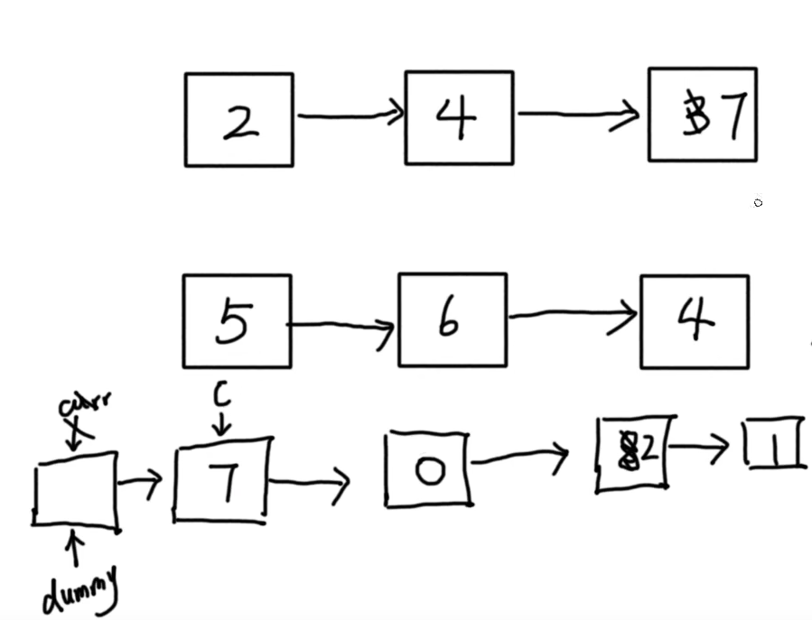
>
> ```js
> /**
>  * Definition for singly-linked list.
>  * function ListNode(val, next) {
>  *     this.val = (val===undefined ? 0 : val)
>  *     this.next = (next===undefined ? null : next)
>  * }
>  */
> /**
>  * @param {ListNode} l1
>  * @param {ListNode} l2
>  * @return {ListNode}
>  */
> var addTwoNumbers = function(l1, l2) {
>   let dummy = new ListNode()
>   let curr = dummy
>   let carry = 0
> 
>   while (l1 !== null || l2 !== null) {
>     let sum = 0
>     if (l1 !== null) {
>       sum += l1.val
>       l1 = l1.next
>     }
>     if (l2 !== null) {
>       sum += l2.val
>       l2 = l2.next
>     }
> 
>     sum += carry
>     curr.next = new ListNode(sum % 10)
>     carry = Math.floor(sum / 10)
>     curr = curr.next
>   }
> 
>   if (carry > 0) {
>     curr.next = new ListNode(carry)
>   }
> 
>   return dummy.next
> };
> ```
>
> ```js
> /** 错误版：未使用链表 */
> var addTwoNumbers = function (l1, l2) {
>   let len = l1.length > l2.length ? l1.length : l2.length,
>       storage = 0,
>       arr = new Array(len).fill(0)
>   for (let i = 0; i < len; i++) {
>     let arri = (l1[i] || 0) + (l2[i] || 0) + storage
>     storage = Math.floor(arri / 10)
>     arr[i] = arri % 10
>     if (i == len - 1 && storage == 1) {
>       arr.push(1)
>     }
>   }
>   return arr
> }
> ```

### 3. 无重复字符的最长子符

> ```bash
> ## 3. 无重复字符的最长子符
> - 给定一个字符串 s ，请你找出其中不含有重复字符的 最长子串 的长度。
> - 示例 1: 输入: s = "pwwkew";	 输出: 3
> 
> 
> ### 实现思路
>   - 先将没有重复的值按顺序放入新数组temp中，
>   - 当出现重复数字时，则表示第一个元素的子串出现重复字符，重新以第二个元素为开头继续往下寻找，
>   - 在删除第一个元素时，需要i--来重新判断该子串中是否还存在重复现象
>   - 若没有重复，则将该值压入temp数组中，并重新计算子串最大值
> ```
>
> ````js
> /**
>  * @param {string} s
>  * @return {number}
>  */
> var lengthOfLongestSubstring = function (s) {
>   let res = 0, temp = [];
>   for (let i = 0; i < s.length; i++) {
>     if (temp.indexOf(s[i]) === -1) {//数组中无被遍历的值
>       temp.push(s[i]);  // 将不重复的值压入数组栈中
>       res = Math.max(res, temp.length); // 重新计算最长不重复子字符的值
>     } else {
>       temp.shift(); // 存在值重复，删除第一个元素(默认为第一个重复)
>       i--;  // 重新计算该轮循环，校检是否存在值重复
>     }
>   }
>   return res;
> };
> ````
>
> ```js
> /**
>  * @param {string} s
>  * @return {number}
>  */
> var lengthOfLongestSubstring = function (s) {
>   const set = new Set()
>   let j = 0, maxLength = 0
>   if (s.length === 0) return 0
> 
>   for (let i = 0; i < s.length; i++) {
>     if (!set.has(s[i])) {
>       set.add(s[i])
>       maxLength = Math.max(maxLength, set.size)
>     } else {
>       while (set.has(s[i])) {
>         set.delete(s[j])
>         j++
>       }
>       set.add(s[i])
>     }
>   }
> 
>   return maxLength
> }
> ```

### 4. 寻找两个正序数组的中位数

> ```bash
> ## 4. 寻找两个正序数组的中位数
> 给定两个大小分别为 m 和 n 的正序（从小到大）数组 nums1 和 nums2。请你找出并返回这两个正序数组的中位数。
> 算法的时间复杂度应该为 O(log (m+n)) 。
> 
> 
> ### 示例
> 示例 1：
>        输入：nums1 = [1,3], nums2 = [2]
>        输出：2.00000
>        解释：合并数组 = [1,2,3] ，中位数 2
> 示例 2：
>        输入：nums1 = [1,2], nums2 = [3,4]
>        输出：2.50000
>        解释：合并数组 = [1,2,3,4] ，中位数 (2 + 3) / 2 = 2.5
> ```
>
> ```js
> /**
>  * @param {number[]} nums1
>  * @param {number[]} nums2
>  * @return {number}
>  */
> var findMedianSortedArrays = function (nums1, nums2) {
>   const nums = [...nums1, ...nums2].sort((a, b) => a - b)
>   const len = nums.length
>   return !(len % 2) ? (nums[len / 2] + nums[len / 2 - 1]) / 2 : nums[Math.floor(len / 2)]
> };
> ```

### 5. 最长回文字符串

> ```bash
> ## 5. 最长回文字符串
> 给你一个字符串 s，找到 s 中最长的回文子串。
> 
> 
> ### 题目示例
> 示例 1：
>        输入：s = "babad"
>        输出："bab"
>        解释："aba" 同样是符合题意的答案。
> 示例 2：
>        输入：s = "cbbd"
>        输出："bb"
> 
> 
> ### 题目解决方案
> 1. 方案一：双指针中心扩展法
> 	对字符串进行循环，根据循环索引 i 来进行两边扩展对比，如果左边的字符等于右边的字符，则为回文，否则断开循环，并记录在下标为 i 处的最长回文子串，然后与当前所记录的最大回文子串对比，如果比其大则替换
> 
> 2. 方案二：动态规划
> 思路：定义dp[i][j]表示子串i～j是否是回文子串，循环s的子串，看是否满足s[i]，s[j]相等，如果相等，则dp[i][j]是否为回文串取决于dp[i+1][j-1]是否也是回文子串，在循环的过程中不断更新最大回文子串的长度，注意子串的长度是0或1也算回文子串
> 复杂度：时间复杂度O(n^2)，两层循环。空间复杂度O(n^2)，即动态规划dp数组的空间。
> ```
>
> #### 双指针中心扩展法（对循环i两边进行扩展对比字符是否相等）
>
> ```js
> /**
>  * @param {string} s
>  * @return {string}
>  */
> var longestPalindrome = function (s = 'badadjda') {
>   // 边界条件
>   if (s.length <= 1) return s;
> 
>   let maxLength = 1 // 最大子回文字符长度
>   let startIndex = 0  // 最长回文子串的起始索引
> 
>   for (let i = 0; i < s.length; i++) {
>     // 分奇偶， 一次遍历，每个字符位置都可能存在奇数或偶数回文
>     helper(i - 1, i + 1)
>     helper(i, i + 1)
>   }
> 
>   function helper(left, right) {
>     // 定义左右双指针：当 s[left] 和 s[right] 相等时，不断向外扩展回文字符串的长度
>     while (left >= 0 && right < s.length && s[left] === s[right]) {
>       if (right - left + 1 > maxLength) {
>         maxLength = right - left + 1
>         startIndex = left
>       }
> 
>       left--
>       right++
>     }
>   }
> 
>   return s.substring(startIndex, startIndex + maxLength)
> };
> ```
>
> #### 动态规划
>
> ```js
> var longestPalindrome = function (s = "ajkldajdjlk") {
>   let n = s.length;
>   let res = '';
> 
>   let dp = Array.from(new Array(n), () => new Array(n).fill(false)); // 初始化数组
> 
>   for (let i = n - 1; i >= 0; i--) { // 循环字符串
>     for (let j = i; j < n; j++) {
>       // dp[i][j]表示子串i～j是否是回文子串
>       // 回文子串必须满足s[i]，s[j]相等。并且向外扩展一个字符也相等，即dp[i+1][j-1]也是回文子串
>       // j - i < 2表示子串小于等于1也是回文串
>       dp[i][j] = s[i] == s[j] && (j - i < 2 || dp[i + 1][j - 1]);
> 
>       //当前回文子串比之前的大，更新最大长度
>       if (dp[i][j] && j - i + 1 > res.length) {
>         res = s.substring(i, j + 1);
>       }
>     }
>   }
> 
>   return res;
> };
> ```

### 6. Z字形变换

> ```bash
> ## 6. Z字形变换
>     将一个给定字符串 s 根据给定的行数 numRows ，以从上往下、从左到右进行 Z 字形排列。
>     比如输入字符串为 "PAYPALISHIRING" 行数为 3 时，排列如下：
>       P   A   H   N
>       A P L S I I G
>       Y   I   R
>     之后，你的输出需要从左往右逐行读取，产生出一个新的字符串，比如："PAHNAPLSIIGYIR"
> 
> ### 题目示例
>   示例 1：
>       输入：s = "PAYPALISHIRING", numRows = 3
>       输出："PAHNAPLSIIGYIR"
>   示例 2：
>       输入：s = "PAYPALISHIRING", numRows = 4
>       输出："PINALSIGYAHRPI"
>       解释：
>         P     I    N
>         A   L S  I G
>         Y A   H R
>         P     I
>   示例 3：
>       输入：s = "A", numRows = 1
>       输出："A"
> 
> 
> ### 题目理解：
>   - 字符串 S 是以 Z 字形为顺序存储的字符串，目标是按行打印。
>   - 设 numRows 行字符串分别为 S1，S2,...,Sn，
>   - 则容易发现：按顺序遍历字符串 S 时，每个字符 c 在 Z 字形中对应的 行索引 先从 S1 增大至 Sn，再从 Sn减少至 S1...如此反复 
>   - 因此，解决方案为：模拟这个行索引的变化，在遍历 S中把每个字符填到正确的行 res[i] 。
> 
> ### 算法流程： 按顺序遍历字符串 s
> 	1. res[i] += c：把每个字符 c 填入对应的 Si
> 	2. currentIndex += flag：更新当前字符 c 对应的行索引
> 	3. flag = -flag：在达到 Z 字形转折点时，执行反向
> 	
> ### 复杂度分析
> 	- 时间复杂度 O(N)：遍历一遍字符串 S
> 	- 空间复杂度 O(N)：各行字符串共占用 O(N)额外空间
> ```
>
> ```js
> /**
>  * @param {string} s
>  * @param {number} numRows
>  * @return {string}
>  */
> var convert = function (s = "PAYPALISHIRING", numRows = 3) {
>   if (numRows <= 1) 
>     return s;
> 
>   const len = Math.min(s.length, numRows);
>   const rows = new Array(len).fill("");
>   let currentIndex = 0; // 记录所在的行索引
>   let down = false; // 记录是否反向遍历
> 
>   for (const c of s) {
>     rows[currentIndex] += c;
> 
>     // 如果为第一行 或 最后一行，则反向
>     if (currentIndex == 0 || currentIndex == numRows - 1) 
>       down = !down;
>     
>     // 若是为反向，则当前所在行索引往上一行（即索引行 - 1）
>     // 若是为正向，则当前所在行索引往下一行（即索引行 + 1）
>     currentIndex += down ? 1 : -1; 
>   }
> 
>   // 合并 rows 数组为字符串后返回
>   return rows.join(''); // PAHNAPLSIIGYIR
> };
> console.log(convert())
> ```
>

### 7. 整数翻转

> ```bash
> ## 7. 整数翻转
> 给你一个 32 位的有符号整数 x ，返回将 x 中的数字部分反转后的结果。
> 如果反转后整数超过 32 位的有符号整数的范围 [−231,  231 − 1] ，就返回 0。
> 假设环境不允许存储 64 位整数（有符号或无符号）。
> 
> 
> ### 题目示例
> 示例 1：输入：x = 123		输出：321
> 示例 2：输入：x = -123	输出：-321
> 示例 3：输入：x = 120		输出：21
> 示例 4：输入：x = 0			输出：0
> 提示：-231 <= x <= 231 - 1
> 
> 
> ### 题解
> 	- 可以通过 try...catch 跳出异常 + 反转数字用字符串
> ```
>
> ```js
> /**
>  * @param {number} x
>  * @return {number}
>  */
> var reverse = function(x) {
>   let res = 0;
>   while(x) {
>     res = res * 10 + x % 10;
>     if(res > Math.pow(2, 31) - 1 || res < Math.pow(-2, 31)) return 0;
>     x = parseInt(x / 10);	// 或 x = ~~(x / 10)
>   }
>   return res
> };
> ```

### 8. 字符串转换整数（atoi）

> ```bash
> ## 8. 字符串转换整数（atoi）
> - 请你来实现一个 myAtoi(string s) 函数，使其能将字符串转换成一个 32 位有符号整数（类似 C/C++ 中的 atoi 函数）。
> 
> - 函数 myAtoi(string s) 的算法如下：
>     1. 读入字符串并丢弃无用的前导空格
>     2. 检查下一个字符（假设还未到字符末尾）为正还是负号，读取该字符（如果有）。 确定最终结果是负数还是正数。 如果两者都不存在，则假定结果为正。
>     3. 读入下一个字符，直到到达下一个非数字字符或到达输入的结尾。字符串的其余部分将被忽略。
>     4. 将前面步骤读入的这些数字转换为整数（即，"123" -> 123， "0032" -> 32）。如果没有读入数字，则整数为 0 。必要时更改符号（从步骤 2 开始）。
>     5. 如果整数数超过 32 位有符号整数范围 [−231,  231 − 1] ，需要截断这个整数，使其保持在这个范围内。具体来说，小于 −231 的整数应该被固定为 −231 ，大于 231 − 1 的整数应该被固定为 231 − 1 。
>     6. 返回整数作为最终结果。
> 
> 注意：
>     - 本题中的空白字符只包括空格字符 ' ' 。
>     - 除前导空格或数字后的其余字符串外，请勿忽略 任何其他字符。
> 
> 
> ### 题目示例
> 示例 1：
>     输入：s = "42"
>     输出：42
>     解释：加粗的字符串为已经读入的字符，插入符号是当前读取的字符。
>     第 1 步："42"（当前没有读入字符，因为没有前导空格）
>              ^
>     第 2 步："42"（当前没有读入字符，因为这里不存在 '-' 或者 '+'）
>              ^
>     第 3 步："42"（读入 "42"）
>                ^
>     解析得到整数 42 。
>     由于 "42" 在范围 [-231, 231 - 1] 内，最终结果为 42 。
> 
> 示例 2：
>     输入：s = "   -42"
>     输出：-42
>     解释：
>     第 1 步："   -42"（读入前导空格，但忽视掉）
>                 ^
>     第 2 步："   -42"（读入 '-' 字符，所以结果应该是负数）
>                  ^
>     第 3 步："   -42"（读入 "42"）
>                    ^
>     解析得到整数 -42 。
>     由于 "-42" 在范围 [-231, 231 - 1] 内，最终结果为 -42 。
> 
> 示例 3：
>     输入：s = "4193 with words"
>     输出：4193
>     解释：
>     第 1 步："4193 with words"（当前没有读入字符，因为没有前导空格）
>              ^
>     第 2 步："4193 with words"（当前没有读入字符，因为这里不存在 '-' 或者 '+'）
>              ^
>     第 3 步："4193 with words"（读入 "4193"；由于下一个字符不是一个数字，所以读入停止）
>                  ^
>     解析得到整数 4193 。
>     由于 "4193" 在范围 [-231, 231 - 1] 内，最终结果为 4193 。
> ```
> 
> ```js
>/**
>  * @param {string} s
>  * @return {number}
>  */
> var myAtoi = function(s) {
>   const str = s.trim().match(/^[-+]?\d+/)
>   if(str !== null) {
>     if(str[0] > Math.pow(2, 31) - 1) {
>       return Math.pow(2, 31) - 1
>     }
>     if(str[0] < Math.pow(-2, 31)) {
>       return Math.pow(-2, 31)
>     }
>     return str[0]
>   }
>   return 0;
> };
> ```

### 9. 回文数字

> ```bash
> ## 题目描述
> 给你一个整数 x ，如果 x 是一个回文整数，返回 true ；否则，返回 false 。
> 回文数是指正序（从左向右）和倒序（从右向左）读都是一样的整数。
> 例如，121 是回文，而 123 不是。
> 
> ## 题目示例
> 示例 1：输入：x = 121		输出：true
> 示例 2：输入：x = -121	输出：false
> 示例 3：输入：x = 10		输出：false
> ```
>
> ```js
> /**
>  * @param {number} x
>  * @return {boolean}
>  */
> var isPalindrome = function(x) {
>   if(x === 0) return true;
> 
>   // 如果 小于零（因为携带负号） 或 个位数为零（最高位不为零） 则不是回文数
>   if(x < 0 || x % 10 === 0) return false;
> 
>   // 反转数值
>   let temp = x, reverse = 0
>   while(temp !== 0) {
>     const rem = temp % 10; // 获取个位数
>     temp = parseInt(temp / 10) // 获取十位数打上的数值
>     reverse = reverse * 10 + rem;
>   }
>   
>   // 判断反转后的数字是否相等
>   if(x == reverse) return true
>   else return false
> };
> ```

### 10. 正则表达式匹配

> ```bash
> ## 题目描述
> 给你一个字符串 s 和一个字符规律 p，请你来实现一个支持 '.' 和 '*' 的正则表达式匹配。
>   - '.' 匹配任意单个字符
>   - '*' 匹配零个或多个前面的那一个元素
>   - 所谓匹配，是要涵盖 整个 字符串 s的，而不是部分字符串。
> 
> 
> ## 题目示例
> 示例 1：输入：s = "aa", p = "a"		 输出：false
> 解释："a" 无法匹配 "aa" 整个字符串。
> 
> 示例 2:输入：s = "aa", p = "a*"		输出：true
> 解释：因为 '*' 代表可以匹配零个或多个前面的那一个元素, 在这里前面的元素就是 'a'。因此，字符串 "aa" 可被视为 'a' 重复了一次。
> 
> 示例 3：输入：s = "ab", p = ".*"		输出：true
> 解释：".*" 表示可匹配零个或多个（'*'）任意字符（'.'）。
> ```
>
> ### 动态规划实现
>
> ```js
> /**
>  * @param {string} s
>  * @param {string} p
>  * @return {boolean}
>  */
> const isMatch = function (s, p) {
>   // 极端情况：s 和 p 都是空，返回 false
>   if (s === null && p === null) return false
> 
>   // 初始化数组
>   const sLen = s.length
>   const pLen = p.length
>   const dp = new Array(sLen + 1)
>     .fill([])
>     .map(() => new Array(pLen + 1).fill(false))
>   dp[0][0] = true // s 和 p 第0个位置是匹配的
> 
>   // 迭代
>   for (let i = 0; i < sLen; i++) {
>     for (let j = 0; j < pLen; j++) {
>       // 情况2：如果 s 和 p 当前字符相等，或 p 当前位置为任意字符, 则当前的 dp[i+1][j+1] 可由 dp[i][j] 转移过来
>       // 当前位置相匹配，则 s 和 p 都向前看一位，如果前面所有字符相匹配，则当前位置前面所有字符也匹配
>       // 例如：s='xxxa' p='xxx.' 或 s='xxxa' p='xxxa'
>       if (s[i] === p[j] || p[j] === '.') {
>         dp[i + 1][j + 1] = dp[i][j]
>       }
> 
>       // 情况3：进入当前字符不匹配的分支，如果当前 p 是 * ，则有可能匹配
>       else if (p[j] === '*') {
>         // 初始化 dp 第一列, 此时 s 的位置是 0
>         // 情况1：如果 p 的第 j-1 个位置是 * ,则 j 的状态等于 j-2 的状态
>         // 例如：s='' p='a*' 相当于 p 向前看 2 个位置，如果匹配则 * 相当于重复 0 个字符
>         i === 0 && (dp[0][j + 1] = dp[0][j - 1]) // 只执行一遍
> 
>         // s 当前位置和 p 前一个位置相同，或者 p 前一个位置等于 '.'，则有三种可能
>         // 其中一种情况能匹配，则当前位置的状态也能匹配
>         // 1. dp[i+1][j-1]: p向前看2个位置，相当于'*'重复了0次
>         // 2. dp[i+1][j]: p向前看1个位置，相当于'*'重复了1次
>         // 3. dp[i][j+1]: s向前看一个位置，相当于'*'重复了n次
>         if (s[i] === p[j - 1] || p[j - 1] === '.') {
>           dp[i + 1][j + 1] = dp[i + 1][j - 1] || dp[i + 1][j] || dp[i][j + 1]
>         }
> 
>         // 情况4：s当前位置和 p 前2个位置不匹配，则相当于'*'重复了0次
>         // 例如 s='xxxb' p='xxxa*' 当前位置的状态和 p 向前看2个位置的状态相同
>         else {
>           dp[i + 1][j + 1] = dp[i + 1][j - 1]
>         }
>       }
>     }
>   }
> 
>   return dp[sLen][pLen]
> }
> ```
>
> ### 递归实现
>
> ```js
> function matchStr (s, pattern, sIndex, patternIndex) {
>   // 字符串和模式都匹配完成
>   if (sIndex === s.length && patternIndex === pattern.length) return true
>   // 字符串还未匹配完，但模式已经匹配完成
>   if (sIndex !== s.length && patternIndex === pattern.length) return false
> 
>   // 如果下一位为 '*'
>   if (patternIndex + 1 < pattern.length && pattern[patternIndex + 1] === '*') {
>     // 当前字符等于当前匹配的字符 或 当前字符可为任意字符，则产生匹配次数
>     if (
>       sIndex < s.length &&
>       (s[sIndex] === pattern[patternIndex] || pattern[patternIndex] === '.')
>     ) {
>       return (
>         matchStr(s, pattern, sIndex, patternIndex + 2) ||
>         matchStr(s, pattern, sIndex + 1, patternIndex + 2) ||
>         matchStr(s, pattern, sIndex + 1, patternIndex)
>       )
>     } else {
>       // 不产生匹配，只有模式右移两位
>       return matchStr(s, pattern, sIndex, patternIndex + 2)
>     }
>   }
> 
>   // 如果下一位不为'*' 且（当前字符等于当前匹配的字符 或 当前字符为任意字符），则模式与字符都后移一位
>   if (
>     sIndex < s.length &&
>     (s[sIndex] === pattern[patternIndex] || pattern[patternIndex] === '.')
>   ) {
>     return matchStr(s, pattern, sIndex + 1, patternIndex + 1)
>   }
> 
>   // 上述所有情况都不满足，则为不匹配
>   return false
> }
> 
> function match (s, pattern) {
>   if (s === undefined || pattern === undefined) return false
>   return matchStr(s, pattern, 0, 0)
> }
> 
> console.log(match('aa', 'a'), match('aa', 'a*'), match('ab', '.*')) // false true true
> ```

### 15. 三数之和

> ```bash
> ## 三数之和
> ### 题目描述
> 给你一个整数数组 nums ，判断是否存在三元组 [nums[i], nums[j], nums[k]] 满足 i != j、i != k 且 j != k ，同时还满足 nums[i] + nums[j] + nums[k] == 0 。请你返回所有和为 0 且不重复的三元组。
> 注意：答案中不可以包含重复的三元组。
> 
> 
> ### 示例
> 示例1
>     输入：nums = [-1,0,1,2,-1,-4]
>     输出：[[-1,-1,2],[-1,0,1]]
>     解释：
>       nums[0] + nums[1] + nums[2] = (-1) + 0 + 1 = 0 。
>       nums[1] + nums[2] + nums[4] = 0 + 1 + (-1) = 0 。
>       nums[0] + nums[3] + nums[4] = (-1) + 2 + (-1) = 0 。
>       不同的三元组是 [-1,0,1] 和 [-1,-1,2] 。
>     注意，输出的顺序和三元组的顺序并不重要。
> 
> 示例 2：
>     输入：nums = [0,1,1]
>     输出：[]
>     解释：唯一可能的三元组和不为 0 。
>     
> 示例 3：
>     输入：nums = [0,0,0]
>     输出：[[0,0,0]]
>     解释：唯一可能的三元组和为 0 。
> 
> 
> ### 解题思路
> 1. 给数组排序
> 2. 遍历数组，从 0 遍历到 length - 2
> 3. 如果当前的数字等于前一个数字，则跳过这个数
> 4. 如果数字不同，则设置 start=i+1, end=length-1。
> 			查看 i+start+end 三个数的和比零大还是小，
> 				如果比 0 小，则 stat++
> 				如果比 0 大，则 end--
> 				如果等于 0，则把这三个数加入到结果中。
> 5. 遍历完成后，返回结果
> ```
>
> ```js
> /**
>    * @param {number[]} nums
>    * @return {number[][]}
>    */
> var threeSum = function (nums) {
>   const result = []
>   nums.sort((a, b) => a - b)
> 
>   for (let i = 0; i < nums.length - 2; i++) {
>     if (i === 0 || nums[i] !== nums[i-1]) {
>       let start = i + 1
>       let end = nums.length - 1
>       while (start < end) {
>         if (nums[i] + nums[start] + nums[end] === 0) {
>           result.push([nums[i], nums[start], nums[end]])
>           start++
>           end--
> 
>           // 值去重(防止在 start递增 或 end 递减后出现值重复，导致结果一致)
>           while (start < end && nums[start] === nums[start - 1]) {
>             start++
>           }
>           while (start < end && nums[end] === nums[end + 1]) {
>             end--
>           }
>         } else if (nums[i] + nums[start] + nums[end] < 0) {
>           start++
>         } else if (nums[i] + nums[start] + nums[end] > 0) {
>           end--
>         }
>       }
>     }
>   }
>   return result
> }
> ```

### [19. 删除链表的倒数第 N 个结点](https://leetcode.cn/problems/remove-nth-node-from-end-of-list/)

> ```bash
> ## 19. 删除链表的倒数第 N 个结点
> 给你一个链表，删除链表的倒数第 n 个结点，并且返回链表的头结点。
> 
> 
> ### 示例
> 示例1：
>     输入：head = [1,2,3,4,5], n = 2
>     输出：[1,2,3,5]
> 示例 2：
>     输入：head = [1], n = 1
>     输出：[]
>     
> 示例 3：
>     输入：head = [1,2], n = 1
>     输出：[1]
> 
> 
> ### 题解：快慢双指针解题
> 双指针的经典应用，如果要删除倒数第n个节点，让 fast 先移动 n 步，然后让 fast 和 slow 同时移动，直到 fast 指向链表末尾。删掉slow所指向的节点就可以了。
> ```
>
> 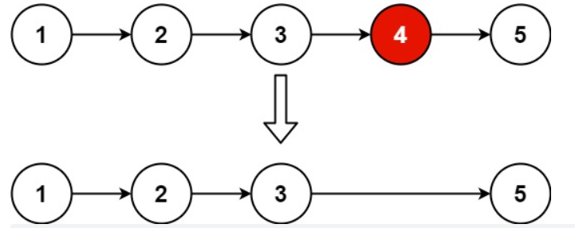
>
> #### 快慢双指针实现
>
> ```js
> /**
>  * Definition for singly-linked list.
>  * function ListNode(val, next) {
>  *     this.val = (val===undefined ? 0 : val)
>  *     this.next = (next===undefined ? null : next)
>  * }
>  */
> /**
>  * @param {ListNode} head
>  * @param {number} n
>  * @return {ListNode}
>  */
> var removeNthFromEnd = function(head, n) {
>   const dummy = new ListNode(0, head)
>   let slow = fast = dummy
>   
>   // 让快指针先走 n 步
>   while (n--) fast = fast.next
>   // 防止下面遍历的错误
>   if (fast === null) return dummy.next
>   
>   // 让双指针同时走，当快指针指向 null 时说明快指针抵达链尾，此时慢指针抵达倒数第 N 个结点处
> 	while (fast.next !== null) {
>     fast = fast.next
>     slow = slow.next
>   }
>   
>   // 删除倒数第 N 个结点
>   slow.next = slow.next.next
>   
>   // 返回头部节点
>   return dummy.next
> };
> ```

### [20. 有效的括号](https://leetcode.cn/problems/valid-parentheses/)

> ```bash
> ## 20. 有效的括号
> 给定一个只包括 '('，')'，'{'，'}'，'['，']' 的字符串 s ，判断字符串是否有效。
> 有效字符串需满足：
>     左括号必须用相同类型的右括号闭合。
>     左括号必须以正确的顺序闭合。
>     每个右括号都有一个对应的相同类型的左括号。
> 
> 
> ### 示例
> 示例 1：
>     输入：s = "()"
>     输出：true
> 示例 2：
>     输入：s = "()[]{}"
>     输出：true
> 示例 3：
>     输入：s = "(]"
>     输出：false
> 
> 
> ### 题解思路（使用 stack 先进后出的特性来解决）
> 1. 创建一个 HashMap，把括号配对放进去。
> 2. 创建一个 stack（object），for 循环遍历字符串：对于每一个字符，如果 map 里有这个 key，那说明它是一个左括号，从 map 里取得相应的有括号，把它 push 进 stack 里。否则，它就是有括号，需要 pop 出 stack 里的第一个字符，然后看它是否等于当前的字符。如果不相符，则返回 false。
> 3. 循环结束后，如果 stack 不为空，说明还剩一些左括号没有被闭合，返回 false。否则返回 true。
> ```
>
> #### 使用栈先进后出特性实现
>
> ```js
> /**
>  * @param {string} s
>  * @return {boolean}
>  */
> var isValid = function(s) {
>   const hashMap = new Map()
>   hashMap.set('(', ')')
>   hashMap.set('{', '}')
>   hashMap.set('[', ']')
> 
>   const stack = []
>   for (let i = 0; i < s.length; i++) {
>     // 判断是左括号还是右括号，若是左括号添加一个右括号进栈，若是右括号则出栈并判断是否跟当前值一致
>     if (hashMap.has(s[i])) {
>       stack.push(hashMap.get(s[i]))
>     } else {
>       if (stack.pop() !== s[i]) {
>         return false
>       }
>     }
>   }
> 
>   // 如果最终栈还存在值，说明不是有效的括号
>   if (stack.length > 0) return false
>   return true
> };
> ```

### [21. 合并两个有序链表](https://leetcode.cn/problems/merge-two-sorted-lists/)

> ```bash
> ## 21. 合并两个有序链表
> 将两个升序链表合并为一个新的 升序 链表并返回。新链表是通过拼接给定的两个链表的所有节点组成的。 
> 
> 
> ### 示例 
> 示例 1：
>     输入：l1 = [1,2,4], l2 = [1,3,4]
>     输出：[1,1,2,3,4,4]
> 示例 2：
>     输入：l1 = [], l2 = []
>     输出：[]
> 示例 3：
>     输入：l1 = [], l2 = [0]
>     输出：[0]
> ```
>
> 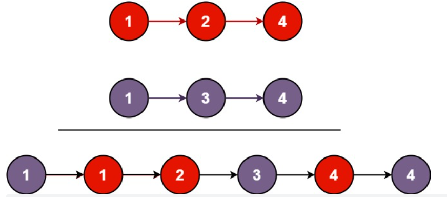
>
> ```js
> /**
>  * Definition for singly-linked list.
>  * function ListNode(val, next) {
>  *     this.val = (val===undefined ? 0 : val)
>  *     this.next = (next===undefined ? null : next)
>  * }
>  */
> /**
>  * @param {ListNode} list1
>  * @param {ListNode} list2
>  * @return {ListNode}
>  */
> var mergeTwoLists = function(list1, list2) {
>   let cur = new ListNode()
>   const dummy = cur
> 
>   // 当 list1 和 list2 都不为空节点时，进行对比
>   while (list1 !== null && list2 !== null) {
>     if (list1.val < list2.val) {
>       cur.next = list1
>       list1 = list1.next
>     } else {
>       cur.next = list2
>       list2 = list2.next
>     }
>     // cur 指向下一个节点
>     cur = cur.next
>   }
> 
>   // 获取剩余的节点
>   if (list1 !== null) {
>     cur.next = list1
>   }
>   if (list2 !== null) {
>     cur.next = list2
>   }
> 
>   return dummy.next
> };
> ```

### [24. 两两交换链表中的节点](https://leetcode.cn/problems/swap-nodes-in-pairs/)

> ```bash
> ## 24. 两两交换链表中的节点
> 给你一个链表，两两交换其中相邻的节点，并返回交换后链表的头节点。你必须在不修改节点内部的值的情况下完成本题（即，只能进行节点交换）。
> 
> 
> ### 示例
> 示例 1：
>     输入：head = [1,2,3,4]
>     输出：[2,1,4,3]
> 示例 2：
>     输入：head = []
>     输出：[]
> 示例 3：
>     输入：head = [1]
>     输出：[1]
> 
> ```
>
> 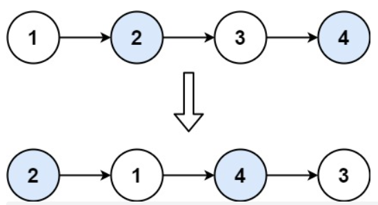
>
> ```js
> /**
>  * Definition for singly-linked list.
>  * function ListNode(val, next) {
>  *     this.val = (val===undefined ? 0 : val)
>  *     this.next = (next===undefined ? null : next)
>  * }
>  */
> /**
>  * @param {ListNode} head
>  * @return {ListNode}
>  */
> var swapPairs = function(head) {
>   /** 0号节点 */
>   const dummy = new ListNode()
>   dummy.next = head
>   /** 当前节点为0号节点 */
>   let current = dummy
> 
>   while (current.next !== null && current.next.next !== null) {
>     /** 两个节点指向交换 */
>     const n1 = current.next
>     const n2 = current.next.next
>     current.next = n2
>     n1.next = n2.next
>     n2.next = n1
>     // 把下下个节点作为当前节点
>     current = n1
>   }
> 
>   return dummy.next
> };
> ```
>
> 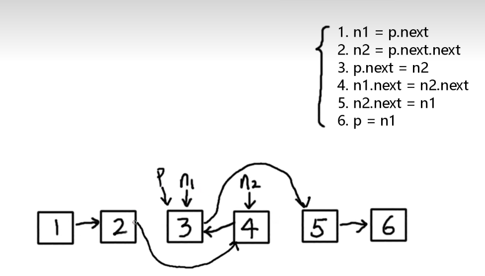

### [49. 字母异位词分组](https://leetcode.cn/problems/group-anagrams/)

> ```bash
> ## 49. 字母异位词分组
> 给你一个字符串数组，请你将 字母异位词 组合在一起。可以按任意顺序返回结果列表。
> 字母异位词 是由重新排列源单词的字母得到的一个新单词，所有源单词中的字母通常恰好只用一次。
> 
> 
> ### 示例
> 示例 1:
>  输入: strs = ["eat", "tea", "tan", "ate", "nat", "bat"]
>  输出: [["bat"],["nat","tan"],["ate","eat","tea"]]
> 示例 2:
>  输入: strs = [""]
>  输出: [[""]]
> 示例 3:
>  输入: strs = ["a"]
>  输出: [["a"]]
> 
> 
> ### 解决方案
> - 通过把字符串排序，然后判断是否一致再放入同一个数组
> - 使用 hashMap
> 		1. 检查是否为空数组
> 		2. 建立一个长度为 26 的数组，起始值为 0
> 		3. 遍历所有字符串，将字母的出现频率放到数组的对应位置里（利用 ASCII 码）
> 		4. 遍历数组，按照相同字母出现频率进行分组归类（使用 hashMap）
> 		5. 遍历 map，将结果返回
> ```
>
> ```js
> /**
>  * @param {string[]} strs
>  * @return {string[][]}
>  */
> var groupAnagrams = function(strs) {
>   /** 边界条件 */
>   if (strs.length === 0) return []
> 
>   const hashMap = new Map()
>   for (let str of strs) {
>     const characters = Array.from({ length: 26 }).fill(0)
> 
>     for (let i = 0; i < str.length; i++) {
>       // 把字符根据 ASCII 码值来让数组相应索引下的值 + 1
>       const ascii = str.charCodeAt(i) - 97
>       characters[ascii]++
>     }
> 
>     // 要使用一个符号分隔开，否则会产生缺陷
>     // （如前一个值为26后一个值为2 与 前一个值为2后一个值为62，此时会产生问题）
>     const key = characters.join(' ')
>     if (hashMap.has(key)) {
>       hashMap.set(key, [...hashMap.get(key), str])
>     } else {
>       hashMap.set(key, [str])
>     }
>   }
> 
>   /** 把 hashMap 值取出作为返回值 */
>   const result = []
>   for (let [_, value] of hashMap) {
>     result.push(value)
>   }
>   return result
> };
> ```

### LeetCode 51~100

### 51. N皇后

> ```bash
> ## 51. N皇后
> 按照国际象棋的规则，皇后可以攻击与之处在同一行或同一列或同一斜线上的棋子。
> n 皇后问题 研究的是如何将 n 个皇后放置在 n×n 的棋盘上，并且使皇后彼此之间不能相互攻击。
> 给你一个整数 n ，返回所有不同的 n 皇后问题 的解决方案。
> 每一种解法包含一个不同的 n 皇后问题 的棋子放置方案，该方案中 'Q' 和 '.' 分别代表了皇后和空位。
> 
> 示例1：
>     输入：n = 4
>     输出：[[".Q..","...Q","Q...","..Q."],["..Q.","Q...","...Q",".Q.."]]
>     解释：如上图所示，4 皇后问题存在两个不同的解法。
> 示例2：
>     输入：n = 1
>     输出：[["Q"]]
> ```
>
> 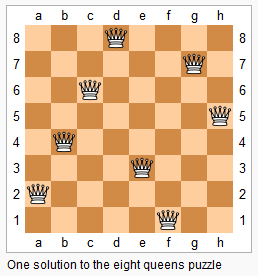
>
> 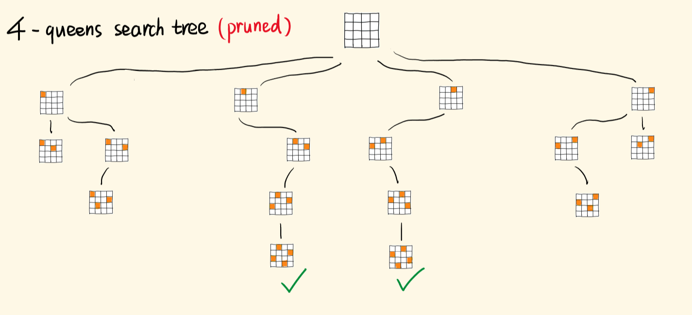
>
> ```bash
> ## 错误解法
>   - 每一行，选一个格子置为"Q"，一行行往下选，第一行有四种选择。
>   - 在选下一行的皇后时，为了避免列的冲突，有三种选择。
>   - 继续选下去，可能会遇到对角线冲突，继续选下去没有意义，得不出合法的解。需要回溯。
> 
> 
> ## 回溯套路
> 1. 遍历枚举出所有可能的选择。
> 2. 依次尝试这些选择：作出一种选择，并往下递归。
> 3. 如果这个选择产生不出正确的解，要撤销这个选择（将当前的 "Q" 恢复为 "."），回到之前的状态，并作出下一个可用的选择。
> 4. 选择、探索、撤销选择。识别出死胡同，就回溯，尝试下一个点，不做无效的搜索。
> 
> 
> ## 思路修正
> 在枚举选择时，应规避行、列的冲突和对角线冲突作为约束，进行充分剪枝。
> 即遍历之前的行，如果当前的格子和之前的皇后们同列或同对角线，则跳过该点
> 当所有可选的选择迭代完，当前递归分支就结束，撤销最后的选择，回到上一层，切入另一个分支。
> 当可填完所有行，则可生成一个解并加入解集，并返回，开始回溯，继续寻找完整解。
> 
> 
> ## 回溯三要点
> 1. 选择，决定了搜索空间，决定了搜索空间有哪些节点。
> 2. 约束，用来剪枝，避免进入无效的分支。
> 3. 目标，决定了什么时候捕获有效的解，提前结束递归，开始回溯。
> ```
>
> ```js
> const solveNQueens = (n) => {
>   const board = new Array(n);
>   for (let i = 0; i < n; i++) {     // 棋盘的初始化
>     board[i] = new Array(n).fill('.');
>   }
>   const res = [];
>   const isValid = (row, col) => {  
>     for (let i = 0; i < row; i++) { // 之前的行
>       for (let j = 0; j < n; j++) { // 所有的列
>         if (board[i][j] == 'Q' &&   // 发现了皇后，并且和自己同列/对角线
>           (j == col || i + j === row + col || i - j === row - col)) {
>           return false;             // 不是合法的选择
>         }
>       }
>     }
>     return true;
>   };
>   const helper = (row) => {   // 放置当前行的皇后
>     if (row == n) {           // 递归的出口，超出了最后一行
>       const stringsBoard = board.slice(); // 拷贝一份board
>       for (let i = 0; i < n; i++) {
>         stringsBoard[i] = stringsBoard[i].join(''); // 将每一行拼成字符串
>       }
>       res.push(stringsBoard); // 推入res数组
>       return;
>     }
>     for (let col = 0; col < n; col++) { // 枚举出所有选择
>       if (isValid(row, col)) {          // 剪掉无效的选择
>         board[row][col] = "Q";          // 作出选择，放置皇后
>         helper(row + 1);                // 继续选择，往下递归
>         board[row][col] = '.';          // 撤销当前选择
>       }
>     }
>   };
>   helper(0);  // 从第0行开始放置
>   return res;
> };
> ```
>
> ```js
> /**
> 	* 优化解法：本题必须记录之前放置皇后的位置，才能结合约束条件去做剪枝。
> 	*	每次都调用 isValid 遍历一遍前面的格子，效率是不优的。
> 	* 最好是用三个数组或 Set 去记录出现过皇后的列们、正对角线们、反对角线们，用空间换取时间。
> */
> const solveNQueens = (n) => {
>   const board = new Array(n);
>   for (let i = 0; i < n; i++) {
>     board[i] = new Array(n).fill('.');
>   }
> 
>   const cols = new Set();  // 列集，记录出现过皇后的列
>   const diag1 = new Set(); // 正对角线集
>   const diag2 = new Set(); // 反对角线集
>   const res = [];
> 
>   const helper = (row) => {
>     if (row == n) {
>       const stringsBoard = board.slice();
>       for (let i = 0; i < n; i++) {
>         stringsBoard[i] = stringsBoard[i].join('');
>       }
>       res.push(stringsBoard);
>       return;
>     }
>     for (let col = 0; col < n; col++) {
>       // 如果当前点的所在的列，所在的对角线都没有皇后，即可选择，否则，跳过
>       if (!cols.has(col) && !diag1.has(row + col) && !diag2.has(row - col)) { 
>         board[row][col] = 'Q';  // 放置皇后
>         cols.add(col);          // 记录放了皇后的列
>         diag2.add(row - col);   // 记录放了皇后的正对角线
>         diag1.add(row + col);   // 记录放了皇后的负对角线
>         helper(row + 1);
>         board[row][col] = '.';  // 撤销该点的皇后
>         cols.delete(col);       // 对应的记录也删一下
>         diag2.delete(row - col);
>         diag1.delete(row + col);
>       }
>     }
>   };
>   helper(0);
>   return res;
> };
> ```

### [53. 最大子数组和](https://leetcode.cn/problems/maximum-subarray/)

> ```bash
> ## 53. 最大子数组和
> 给你一个整数数组 nums ，请你找出一个具有最大和的连续子数组（子数组最少包含一个元素），返回其最大和。
> 子数组 是数组中的一个连续部分。
> 
>  
> ### 示例
> 示例 1：
>     输入：nums = [-2,1,-3,4,-1,2,1,-5,4]
>     输出：6
>     解释：连续子数组 [4,-1,2,1] 的和最大，为 6 。
> 示例 2：
>     输入：nums = [1]
>     输出：1
> 示例 3：
>     输入：nums = [5,4,-1,7,8]
>     输出：23
> 
> 提示：
>     1 <= nums.length <= 105
>     -104 <= nums[i] <= 104
> ```
>
> ```js
> /**
>  * @param {number[]} nums
>  * @return {number}
>  */
> var maxSubArray = function(nums) {
>   const memos = [nums[0]]
> 
>   /** 动态规划：计算在连续的情况下最大的值 */
>   for (let i = 1; i < nums.length; i++) {
>     memos[i] = Math.max(nums[i] + memos[i - 1], nums[i])
>   }
> 
>   /** 循环获取最大的值 */
>   let max = memos[0]
>   for (let i = 1; i < memos.length; i++) {
>     max = Math.max(max, memos[i])
>   }
> 
>   return max
> };
> ```

### [54. 螺旋矩阵](https://leetcode.cn/problems/spiral-matrix/)

> ```bash
> ## 54. 螺旋矩阵
> 给你一个 m 行 n 列的矩阵 matrix ，请按照 顺时针螺旋顺序 ，返回矩阵中的所有元素。
> 
> 
> ### 示例
> 示例 1：
>     输入：matrix = [[1,2,3],[4,5,6],[7,8,9]]
>     输出：[1,2,3,6,9,8,7,4,5]
> 示例 2：
>     输入：matrix = [[1,2,3,4],[5,6,7,8],[9,10,11,12]]
>     输出：[1,2,3,4,8,12,11,10,9,5,6,7]
> 
> ```
>
> 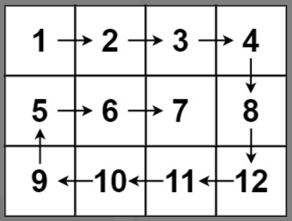
>
> ```js
> /**
>  * @param {number[][]} matrix
>  * @return {number[]}
>  */
> var spiralOrder = function(matrix) {
>   // 上、下、左、右边角的坐标（边界）
>   let left = 0
>   let right = matrix[0].length - 1
>   let top = 0
>   let bottom = matrix.length - 1
> 
>   // 控制方向
>   let direction = 'right'
> 	// 导出的结果
>   const result = []
> 	
>   // 在满足条件时，循环执行
>   while (left <= right && top <= bottom) {
>     if (direction === 'right') {
>       for (let i = left; i <= right; i++) {
>         result.push(matrix[top][i])
>       }
>       // 向右增加后，下沉一行，并且方向转为向下
>       top++
>       direction = 'down'
>     } else if (direction === 'down') {
>       for (let i = top; i <= bottom; i++) {
>         result.push(matrix[i][right])
>       }
>       // 向下增加后，左移一列，并且方向向左
>       right--
>       direction = 'left'
>     } else if (direction === 'left') {
>       for (let i = right; i >= left; i--) {
>         result.push(matrix[bottom][i])
>       }
>       // 向左增加后，上升一行，并且方向向上
>       bottom--
>       direction = 'up'
>     } else if (direction === 'up') {
>       for (let i = bottom; i >= top; i--) {
>         result.push(matrix[i][left])
>       }
>       // 向上增加后，右移一列，并且方向向右
>       left++
>       direction = 'right'
>     }
>   }
> 
>   return result
> };
> ```

### [55. 跳跃游戏](https://leetcode.cn/problems/jump-game/)

> ```bash
> ## 55. 跳跃游戏
> 给定一个非负整数数组 nums ，你最初位于数组的 第一个下标 。
> 数组中的每个元素代表你在该位置可以跳跃的最大长度。
> 判断你是否能够到达最后一个下标。
> 
> 
> ### 示例
> 示例 1：
>     输入：nums = [2,3,1,1,4]
>     输出：true
>     解释：可以先跳 1 步，从下标 0 到达下标 1, 然后再从下标 1 跳 3 步到达最后一个下标。
> 示例 2：
>     输入：nums = [3,2,1,0,4]
>     输出：false
>     解释：无论怎样，总会到达下标为 3 的位置。但该下标的最大跳跃长度是 0 ， 所以永远不可能到达最后一个下标。
> ```
>
> #### 递归+动态规划实现跳跃游戏
>
> ```js
> /**
>  * @param {number[]} nums
>  * @return {boolean}
>  */
> var canJump = function(nums) {
>   const totalLen = nums.length
>  	// 使用 memo 缓存路径是否可行来实现动态规划
>   const memo = Array(totalLen).fill(0)  // memo值：0未知、1通、-1不通
>   memo[totalLen - 1] = 1 // 走到最后一步为 true
> 
>   /** 跳跃的递归算法 */
>   const jump = function (position) {
>     // 如果为1，则说明该路径是可以到达最后一个下标的
>     if (memo[position] === 1) return true
>     // 如果为-1，则说明该路径肯定是不可以到达最后一个下标的
>     if (memo[position] === -1) return false
> 
>     // 循环递归
>     const maxJump = Math.min(position + nums[position], totalLen - 1)
>     for (let i = position + 1; i <= maxJump; i++) {
>       const jumpResult = jump(i)
> 
>       // 如果为 true，则说明该路径是可以到达最后一个下标的；否则可能是未知情况，需要继续遍历
>       if (jumpResult === true) {
>         memo[position] = 1
>         return true
>       }
>     }
> 
>     // 若都没有返回 true，则为无效路径
>     memo[position] = -1
>     return false
>   }
> 
>   const result = jump(0)
>   return result
> };
> ```
>
> #### 双层遍历+动态规划实现跳跃游戏
>
> ```js
> /**
>  * @param {number[]} nums
>  * @return {boolean}
>  */
> var canJump = function(nums) {
>   const totalLen = nums.length
>  	// 使用 memo 缓存路径是否可行来实现动态规划
>   const memo = Array(totalLen).fill(0)  // memo值：0未知、1通、-1不通
>   memo[totalLen - 1] = 1 // 走到最后一步为 true
> 
>   // 逆序遍历
>   for (let i = totalLen - 2; i >= 0; i--) {
>     // 遍历是否能到达最后一步
>     const maxJump = Math.min(i + nums[i], totalLen - 1)
>     for (let j = i + 1; j <= maxJump; j++) {
>       if (memo[j] === 1) {
>         memo[i] = 1
>         break
>       }
>     }
>   }
> 
>   // 遍历后查看首位是否能到达最后一步
>   if (memo[0] === 1) {
>     return true
>   } else {
>     return false
>   }
> };
> ```
>
> #### 贪心算法实现跳跃游戏
>
> ```js
> /**
>  * @param {number[]} nums
>  * @return {boolean}
>  */
> var canJump = function(nums) {
>   let maxJump = nums.length - 1
> 
>   // 逆序遍历
>   for (let i = nums.length - 2; i >= 0; i--) {
>     // 如果 当前下标 + 当前下标的值 >= 最大跳跃的步，则说明可以到达终点
>     if (i + nums[i] >= maxJump) {
>       maxJump = i
>     }
>   }
> 
>   // 如果当可跳跃步所定位的下标到索引0处，则说明可以达到终点
>   return maxJump === 0
> };
> ```

### [56. 合并区间](https://leetcode.cn/problems/merge-intervals/)

> ```bash
> ## 56. 合并区间
> 以数组 intervals 表示若干个区间的集合，其中单个区间为 intervals[i] = [starti, endi] 。请你合并所有重叠的区间，并返回 一个不重叠的区间数组，该数组需恰好覆盖输入中的所有区间 。
> 
> 
> ### 示例
> 示例 1：
>     输入：intervals = [[1,3],[2,6],[8,10],[15,18]]
>     输出：[[1,6],[8,10],[15,18]]
>     解释：区间 [1,3] 和 [2,6] 重叠, 将它们合并为 [1,6].
> 示例 2：
>     输入：intervals = [[1,4],[4,5]]
>     输出：[[1,5]]
>     解释：区间 [1,4] 和 [4,5] 可被视为重叠区间。
> ```
>
> ```js
> /**
>  * @param {number[][]} intervals
>  * @return {number[][]}
>  */
> var merge = function(intervals) {
>     // 边界判定
>     if (intervals.length < 2) return intervals
> 
>     // 对数组进行排序，防止乱序无法正确对比
>     intervals.sort((a, b) => a[0] - b[0])
> 
>     let curr = intervals[0] // 当前缓存的数组项
>     let result = [] // 导出的结果
> 
>     // 遍历
>     for (let interval of intervals) {
>         // 如果当前缓存的右区间 ≥ 当前区间的左区间，则把当前区间的左区间记录
>         // 否则把缓存区间放入结果中，并把当前区间作为新缓存存储
>         if (curr[1] >= interval[0]) {
>             curr[1] = Math.max(interval[1], curr[1])
>         } else {
>             result.push(curr)
>             curr = interval
>         }
>     }
> 
>     // 防止 curr 中仍然有值未放入 result 中
>     if (curr.length !== 0) {
>         result.push(curr)
>     }
> 
>     return result
> };
> ```

### [57. 插入区间](https://leetcode.cn/problems/insert-interval/)

> ```bash
> ## 57. 插入区间
> 给你一个 无重叠的 ，按照区间起始端点排序的区间列表。
> 在列表中插入一个新的区间，你需要确保列表中的区间仍然有序且不重叠（如果有必要的话，可以合并区间）。
> 
>  
> ### 示例
> 示例 1：
>     输入：intervals = [[1,3],[6,9]], newInterval = [2,5]
>     输出：[[1,5],[6,9]]
> 示例 2：
>     输入：intervals = [[1,2],[3,5],[6,7],[8,10],[12,16]], newInterval = [4,8]
>     输出：[[1,2],[3,10],[12,16]]
>     解释：这是因为新的区间 [4,8] 与 [3,5],[6,7],[8,10] 重叠。
> 示例 3：
>     输入：intervals = [], newInterval = [5,7]
>     输出：[[5,7]]
> 示例 4：
>     输入：intervals = [[1,5]], newInterval = [2,3]
>     输出：[[1,5]]
> 示例 5：
>     输入：intervals = [[1,5]], newInterval = [2,7]
>     输出：[[1,7]]
> ```
>
> ```js
> /**
>  * @param {number[][]} intervals
>  * @param {number[]} newInterval
>  * @return {number[][]}
>  */
> var insert = function(intervals, newInterval) {
>     intervals = [...intervals, newInterval].sort((a, b) => a[0] - b[0])
> 
>     // 边界判定
>     if (intervals.length < 2) return intervals
> 
>     // 对数组进行排序，防止乱序无法正确对比
>     intervals.sort((a, b) => a[0] - b[0])
> 
>     let curr = intervals[0] // 当前缓存的数组项
>     let result = [] // 导出的结果
> 
>     // 遍历
>     for (let interval of intervals) {
>         // 如果当前缓存的右区间 ≥ 当前区间的左区间，则把当前区间的左区间记录
>         // 否则把缓存区间放入结果中，并把当前区间作为新缓存存储
>         if (curr[1] >= interval[0]) {
>             curr[1] = Math.max(interval[1], curr[1])
>         } else {
>             result.push(curr)
>             curr = interval
>         }
>     }
> 
>     // 防止 curr 中仍然有值未放入 result 中
>     if (curr.length !== 0) {
>         result.push(curr)
>     }
> 
>     return result
> };
> ```

### [62. 不同路径](https://leetcode.cn/problems/unique-paths/)

> ```bash
> ## 62. 不同路径
> 一个机器人位于一个 m x n 网格的左上角 （起始点在下图中标记为 “Start” ）。
> 机器人每次只能向下或者向右移动一步。机器人试图达到网格的右下角（在下图中标记为 “Finish” ）。
> 问总共有多少条不同的路径？
> 
>  
> ### 示例
> 示例 1：
>     输入：m = 3, n = 7
>     输出：28
> 示例 2：
>     输入：m = 3, n = 2
>     输出：3
>     解释：
>         从左上角开始，总共有 3 条路径可以到达右下角。
>         1. 向右 -> 向下 -> 向下
>         2. 向下 -> 向下 -> 向右
>         3. 向下 -> 向右 -> 向下
> 示例 3：
>     输入：m = 7, n = 3
>     输出：28
> 示例 4：
>     输入：m = 3, n = 3
>     输出：6
> ```
>
> 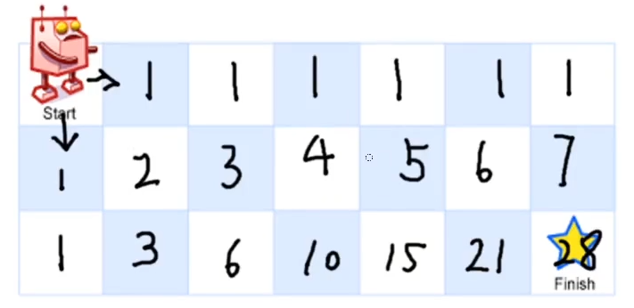
>
> ```js
> /**
>  * @param {number} m
>  * @param {number} n
>  * @return {number}
>  */
> var uniquePaths = function(m, n) {
>     /** 初始化 */
>     const memo = []
>     for (let i = 0; i < n; i++) {
>         memo.push([])
>     }
>     for (let row = 0; row < n; row++) {
>         memo[row][0] = 1
>     }
>     for (let col = 0; col < m; col++) {
>         memo[0][col] = 1
>     }
> 
>     /** 动态规划计算 */
>     for (let row = 1; row < n; row++) {
>         for (let col = 1; col < m; col++) {
>             memo[row][col] = memo[row - 1][col] + memo[row][col - 1]
>         }
>     }
> 
>     // 获取最后的值
>     return memo[n - 1][m - 1]
> };
> ```

### [66. 加一](https://leetcode.cn/problems/plus-one/)

> ```bash
> ## 66. 加一
> 给定一个由 整数 组成的 非空 数组所表示的非负整数，在该数的基础上加一。
> 最高位数字存放在数组的首位， 数组中每个元素只存储单个数字。
> 你可以假设除了整数 0 之外，这个整数不会以零开头。
> 
>  
> ### 示例
> 示例 1：
>     输入：digits = [1,2,3]
>     输出：[1,2,4]
>     解释：输入数组表示数字 123。
> 示例 2：
>     输入：digits = [4,3,2,1]
>     输出：[4,3,2,2]
>     解释：输入数组表示数字 4321。
> 示例 3：
>     输入：digits = [0]
>     输出：[1]
> ```
>
> ```js
> /**
>  * @param {number[]} digits
>  * @return {number[]}
>  */
> var plusOne = function(digits) {
>     for (let i = digits.length - 1; i >= 0; i--) {
>         // 当原值为9，+1则会使得数组前一个值也+1
>         // 否则，数组的+1到此为止
>         if (digits[i] !== 9) {
>             digits[i]++
>             return digits
>         } else {
>             digits[i] = 0
>         }
>     }
> 
>     return [1, ...digits]
> };
> ```
>
> ```js
> /**
>  * @param {number[]} digits
>  * @return {number[]}
>  */
> var plusOne = function(digits) {
>     return ((BigInt(digits.join('')) + 1n) +'').split('');
> };
> ```

### [70. 爬楼梯](https://leetcode.cn/problems/climbing-stairs/)

> ```bash
> ## 70. 爬楼梯
> 假设你正在爬楼梯。需要 n 阶你才能到达楼顶。
> 每次你可以爬 1 或 2 个台阶。你有多少种不同的方法可以爬到楼顶呢？
> 
>  
> ### 示例
> 示例 1：
>     输入：n = 2
>     输出：2
>     解释：有两种方法可以爬到楼顶。
>       1. 1 阶 + 1 阶
>       2. 2 阶
> 示例 2：
>     输入：n = 3
>     输出：3
>     解释：有三种方法可以爬到楼顶。
>       1. 1 阶 + 1 阶 + 1 阶
>       2. 1 阶 + 2 阶
>       3. 2 阶 + 1 阶
> ```
>
> ```js
> /**
>  * @param {number} n
>  * @return {number}
>  */
> var climbStairs = function(n) {
>     const memo = []
>     memo[1] = 1
>     memo[2] = 2
>     for (let i = 3; i <= n; i++) {
>         memo[i] = memo[i - 2] + memo[i - 1]
>     }
>     return memo[n]
> };
> ```

### [73. 矩阵置零](https://leetcode.cn/problems/set-matrix-zeroes/)

> ```bash
> ## 73. 矩阵置零
> 给定一个 m x n 的矩阵，如果一个元素为 0 ，则将其所在行和列的所有元素都设为 0 。请使用 原地 算法。
> 
>  
> ### 示例
> 示例 1：
>     输入：matrix = [[1,1,1],[1,0,1],[1,1,1]]
>     输出：[[1,0,1],[0,0,0],[1,0,1]]
> 示例 2：
>     输入：matrix = [[0,1,2,0],[3,4,5,2],[1,3,1,5]]
>     输出：[[0,0,0,0],[0,4,5,0],[0,3,1,0]]
>     
> 
> 
> ### 实现
> 1. 检查并标记第一行和第一列是否有 0（firstColHasZero、firstRowHasZero）
> 2. 使用第一行和第一列来标记其余行列是否含有0
> 3. 接下来利用第一行和第一列的标0情况将 matrix 中的数字标 0
> 4. 最后处理第一行和第一列
> 		- 如果 firstColHasZero 等于 true，将第一列全设为 0
> 		- 如果 firstRowHasZero 等于 true，将第一行全设为 0
> ```
>
> 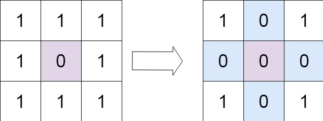
>
> 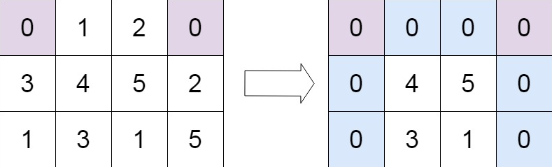
>
> ```js
> /**
>  * @param {number[][]} matrix
>  * @return {void} Do not return anything, modify matrix in-place instead.
>  */
> var setZeroes = function(matrix) {
>   /** 第一行和第一列是否有0 */
>   let firstColHasZero = false
>   let firstRowHasZero = false
>   // 检查第一列是否有0
>   for (let i = 0; i < matrix.length; i++) {
>     if (matrix[i][0] === 0) {
>       firstColHasZero = true
>       break
>     }
>   }
>   // 检查第一行是否有0
>   for (let i = 0; i < matrix[0].length; i++) {
>     if (matrix[0][i] === 0) {
>       firstRowHasZero = true
>       break
>     }
>   }
> 
>   // 校验其他行是否有0，来更新相应第一行或第一列的0值
>   for (let row = 1; row < matrix.length; row++) {
>     for (let col = 1; col < matrix[0].length; col++) {
>       if (matrix[row][col] === 0) {
>         matrix[0][col] = 0
>         matrix[row][0] = 0
>       }
>     }
>   }
> 
>   // 根据第一行和第一列的标0情况，将 matrix 相应行和列标0
>   for (let row = 1; row < matrix.length; row++) {
>     for (let col = 1; col < matrix[0].length; col++) {
>       if ( matrix[0][col] === 0 || matrix[row][0] === 0) {
>         matrix[row][col] = 0
>       }
>     }
>   }
> 
>   // 处理第一行和第一列
>   if (firstColHasZero) {
>     for (let i = 0; i < matrix.length; i++) {
>       matrix[i][0] = 0
>     }
>   }
>   if (firstRowHasZero) {
>     for (let i = 0; i < matrix[0].length; i++) {
>       matrix[0][i] = 0
>     }
>   }
> 
> 	// 原地算法 - 返回原数组
>   return matrix
> };
> ```

### [78. 子集](https://leetcode.cn/problems/subsets/)

> ```bash
> ## 78. 子集
> 给你一个整数数组 nums ，数组中的元素 互不相同 。返回该数组所有可能的子集（幂集）。
> 解集 不能 包含重复的子集。你可以按 任意顺序 返回解集。
> 
>  
> ### 示例
> 示例 1：
>     输入：nums = [1,2,3]
>     输出：[[],[1],[2],[1,2],[3],[1,3],[2,3],[1,2,3]]
> 示例 2：
>     输入：nums = [0]
>     输出：[[],[0]]
> ```
>
> ```js
> /**
>  * @param {number[]} nums
>  * @return {number[][]}
>  */
> var subsets = function(nums) {
>     const result = []
> 
>     const backTrack = (start, curr) => {
>         // 把 curr 添加到 result 数组
>         result.push([...curr])
> 
>         // 遍历递归
>         for (let i = start; i < nums.length; i++) {
>             // 把 nums[i] 加入到 curr 数组中
>             curr.push(nums[i])
> 
>             // 递归操作，如 nums=[1,2,3] start=0，递归会给 result 添加 [1,2],[1,2,3]
>             backTrack(i + 1, curr)
> 
>             // 将 curr 中的当前元素移除，以便尝试其他元素
>             curr.pop()
>         }
>     }
> 
>     // 初始触发递归
>     backTrack(0, [])
> 
>     return result
> };
> ```

### [83. 删除排序链表中的重复元素](https://leetcode.cn/problems/remove-duplicates-from-sorted-list/)

> ```bash
> ## 83. 删除排序链表中的重复元素
> 给定一个已排序的链表的头 head ， 删除所有重复的元素，使每个元素只出现一次 。返回 已排序的链表 。
> 
> 
> ## 示例
> 示例 1：
>     输入：head = [1,1,2]
>     输出：[1,2]
> 示例 2：
>     输入：head = [1,1,2,3,3]
>     输出：[1,2,3]
> ```
>
> ```js
> /**
>   * Definition for singly-linked list.
>   * function ListNode(val, next) {
>   *     this.val = (val===undefined ? 0 : val)
>   *     this.next = (next===undefined ? null : next)
>   * }
>   */
> /**
> * @param {ListNode} head
> * @return {ListNode}
> */
> var deleteDuplicates = function(head) {
>   let current = head
>   while (current !== null && current.next !== null) {
>     if (current.val === current.next.val) {
>       current.next = current.next.next
>     } else {
>       current = current.next
>     }
>   }
>   return head
> };
> ```

### [90. 子集 II](https://leetcode.cn/problems/subsets-ii/)

> ```bash
> ## 90. 子集 II
> 给你一个整数数组 nums ，其中可能包含重复元素，请你返回该数组所有可能的子集（幂集）。
> 解集 不能 包含重复的子集。返回的解集中，子集可以按 任意顺序 排列。
> 
>  
> ## 示例
> 示例 1：
>     输入：nums = [1,2,2]
>     输出：[[],[1],[1,2],[1,2,2],[2],[2,2]]
> 示例 2：
>     输入：nums = [0]
>     输出：[[],[0]]
> ```
>
> ```js
> /**
>  * @param {number[]} nums
>  * @return {number[][]}
>  */
> var subsetsWithDup = function(nums) {
>   const result = []
>   nums.sort((a, b) => a - b)
> 
>   const backtrack = (start, curr = []) => {
>     result.push([...curr]) // 将元素加入到当前的子集中
>     for (let i = start; i < nums.length; i++) {
>       // 避免选择重复的元素
>       if (i > start && nums[i] === nums[i - 1]) {
>         continue
>       }
>       curr.push(nums[i]) // 将当前的子集加入到结果数组中
>       backtrack(i + 1, curr) // 递归
>       curr.pop() // 回溯
>     }
>   }
> 
>   backtrack(0, []) // 从空数组开始生成子集
> 
>   return result
> };
> ```

### [92. 反转链表 II](https://leetcode.cn/problems/reverse-linked-list-ii/)

> ```bash
> ## 92. 反转链表 II
> 给你单链表的头指针 head 和两个整数 left 和 right ，其中 left <= right 。请你反转从位置 left 到位置 right 的链表节点，返回 反转后的链表 。
>  
> ### 示例
> 示例 1：
>  输入：head = [1,2,3,4,5], left = 2, right = 4
>  输出：[1,4,3,2,5]
> 示例 2：
>  输入：head = [5], left = 1, right = 1
>  输出：[5]
> 
> ```
>
> 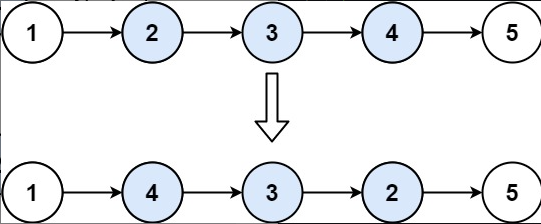
>
> ```js
> /**
>  * Definition for singly-linked list.
>  * function ListNode(val, next) {
>  *     this.val = (val===undefined ? 0 : val)
>  *     this.next = (next===undefined ? null : next)
>  * }
>  */
> /**
>  * @param {ListNode} head
>  * @param {number} left
>  * @param {number} right
>  * @return {ListNode}
>  */
> var reverseBetween = function(head, left, right) {
>     let prev = null
>     let curr = head
>     let next = head
> 
>     // 取左边作为起点
>     for (let i = 1; i < left; i++) {
>         prev = curr
>         curr = curr.next
>     }
> 
>     // 暂存左边起点的内容
>     let prev2 = prev
>     let curr2 = curr
> 
>     // 做左边起点开始反转
>     for (let i = left; i <= right; i++) {
>         next = curr.next
>         curr.next = prev
>         prev = curr
>         curr = next
>     }
> 
>     // 拼接内容（分为左边未反转部分、中间反转部分、右边未反转部分）
>     if (left > 1) {
>         prev2.next = prev
>     } else {
>         head = prev
>     }
>     
>   curr2.next = curr
>   
>     return head
> 
> };
> ```

### LeetCode 100~150

### 118. 杨辉三角

> ```bash
> ## 118. 杨辉三角
> 给定一个非负整数 numRows，生成「杨辉三角」的前 numRows 行。
> 在「杨辉三角」中，每个数是它左上方和右上方的数的和。
> 
> ## 题目示例
> 示例 1:输入: numRows = 5		输出: [[1],[1,1],[1,2,1],[1,3,3,1],[1,4,6,4,1]]
> 示例 2:输入: numRows = 1		输出: [[1]]
> ```
>
> ```js
> /**
>  * @param {number} numRows
>  * @return {number[][]}
>  */
>  var generate = function(numRows) {
>   if (numRows === 0) return [];
>   let result = [[1]];
> 
>   for (let i = 1; i < numRows; i++) {
>       const preArr = result[i - 1];
>       let row = [1];
> 
>       for (let j = 1; j < preArr.length; j++) {
>       row.push(preArr[j - 1] + preArr[j]);
>       }
> 
>       result.push([...row, 1]);
>   }
> 
>   return result;
> };
> ```

### 119. 杨辉三角II

> ```bash
> ## 119. 杨辉三角II
> 给定一个非负索引 rowIndex，返回「杨辉三角」的第 rowIndex 行。
> 在「杨辉三角」中，每个数是它左上方和右上方的数的和
> 
> ## 题目示例
> 示例 1:输入: rowIndex = 3		输出: [1,3,3,1]
> 示例 2:输入: rowIndex = 0		输出: [1]
> 示例 3:输入: rowIndex = 1		输出: [1,1]
> ```
>
> 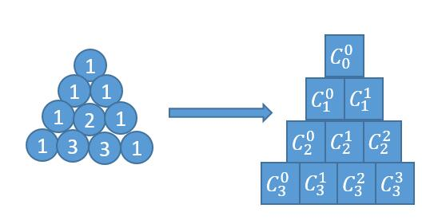
>
> 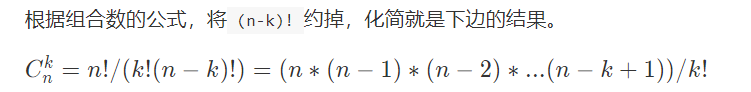
>
> 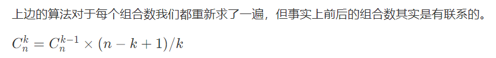
>
> ```js
> /**
>  * @param {number} rowIndex
>  * @return {number[]}
>  */
> var getRow = function (rowIndex) {
>   const N = rowIndex;
>   let pre = 1;
>   let arr = []
>   arr.push(pre)
> 
>   for (let k = 1; k <= N; k++) {
>     pre = Number.parseInt(pre * (N - (k - 1)) / k)
>     arr.push(pre)
>   }
>   return arr
> };
> ```
>
> **简洁版**
>
> ```js
> /**
>  * @param {number} rowIndex
>  * @return {number[]}
>  */
> var getRow = function (rowIndex) {
>   let currentLine = [1];
> 
>   for (let k = 1; k <= rowIndex; k++) {
>     const pre = currentLine[k - 1]
>     currentLine[k] = (pre * (rowIndex - (k - 1))) / k;
>   }
>   return currentLine;
> };
> ```

### [121. 买卖股票的最佳时机](https://leetcode.cn/problems/best-time-to-buy-and-sell-stock/)

> ```bash
> ## 121. 买卖股票的最佳时机
> 给定一个数组 prices ，它的第 i 个元素 prices[i] 表示一支给定股票第 i 天的价格。
> 你只能选择 某一天 买入这只股票，并选择在 未来的某一个不同的日子 卖出该股票。设计一个算法来计算你所能获取的最大利润。
> 返回你可以从这笔交易中获取的最大利润。如果你不能获取任何利润，返回 0 。
> 
> 
> ### 示例
> 示例 1：
>     输入：[7,1,5,3,6,4]
>     输出：5
>     解释：在第 2 天（股票价格 = 1）的时候买入，在第 5 天（股票价格 = 6）的时候卖出，最大利润 = 6-1 = 5 。
>          注意利润不能是 7-1 = 6, 因为卖出价格需要大于买入价格；同时，你不能在买入前卖出股票。
> 
> 示例 2：
>     输入：prices = [7,6,4,3,1]
>     输出：0
>     解释：在这种情况下, 没有交易完成, 所以最大利润为 0。
> ```
>
> ```js
> /**
>  * @param {number[]} prices
>  * @return {number}
>  */
> var maxProfit = function(prices) {
> 	if (prices.length === 0) return 0
>     
>     let minPrice = prices[0]
>     let maxProfit = 0
>     
>     for (let i = 0; i < prices.length; i++) {
>         if (prices[i] < minPrice) {
>             minPrice = prices[i]
>         } else if (prices[i] - minPrice > maxProfit) {
>             maxProfit = prices[i] - minPrice
>         }
>     }
>     
>     return maxProfit
> };
> ```

### [122. 买卖股票的最佳时机 II](https://leetcode.cn/problems/best-time-to-buy-and-sell-stock-ii/)

> ```bash
> ## 122. 买卖股票的最佳时机 II
> 给你一个整数数组 prices ，其中 prices[i] 表示某支股票第 i 天的价格。
> 在每一天，你可以决定是否购买和/或出售股票。你在任何时候 最多 只能持有 一股 股票。你也可以先购买，然后在 同一天 出售。
> 返回 你能获得的 最大 利润 。
> 
>  
> ### 示例
> 示例 1：
>     输入：prices = [7,1,5,3,6,4]
>     输出：7
>     解释：
>     在第 2 天（股票价格 = 1）的时候买入，在第 3 天（股票价格 = 5）的时候卖出, 这笔交易所能获得利润 = 5 - 1 = 4 。
>     随后，在第 4 天（股票价格 = 3）的时候买入，在第 5 天（股票价格 = 6）的时候卖出, 这笔交易所能获得利润 = 6-3=3。
>     总利润为 4 + 3 = 7 。
> 
> 示例 2：
>     输入：prices = [1,2,3,4,5]
>     输出：4
>     解释：
>     在第 1 天（股票价格 = 1）的时候买入，在第 5 天 （股票价格 = 5）的时候卖出, 这笔交易所能获得利润 = 5 - 1 = 4 。
>     总利润为 4 。
>     
> 示例 3：
>     输入：prices = [7,6,4,3,1]
>     输出：0
>     解释：在这种情况下, 交易无法获得正利润，所以不参与交易可以获得最大利润，最大利润为 0 。
> ```
>
> **常规写法**
>
> ```js
> /**
>  * @param {number[]} prices
>  * @return {number}
>  * @desc 常规写法
>  */
> var maxProfit = function(prices) {
> 	if (prices.length === 0) return 0
>     
>     // 利润、波谷、波峰
>     let profit = 0, valley = prices[0], peak = prices[0]
>     
>     let i = 0
>     while(i < prices.length - 1) {
>         // 波谷计算
>         while(i < prices.length - 1 && prices[i] >= prices[i + 1]) {
>             i++
>         }
>         valley = prices[i]
>         
>         // 波峰计算
>         while(i < prices.length - 1 && prices[i] <= prices[i + 1]) {
>             i++
>         }
>         peak = prices[i]
>         
>         // 总利润计算
>         profit += peak - valley
>     }
>     
>     return profit
> };
> ```
>
> **贪心算法**
>
> ```js
> /**
>  * @param {number[]} prices
>  * @return {number}
>  * @desc 贪心算法
>  */
> var maxProfit = function(prices) {
> 	if (prices.length === 0) return 0
>    
>     let profit = 0	// 利润
>     
>     for (let i = 0; i < prices.length - 1;i++) {
>         if (prices[i] < prices[i + 1]) {
>             profit += prices[i + 1] - prices[i]
>         }
>     }
>     
>     return profit
> };
> ```

### [123. 买卖股票的最佳时机 III](https://leetcode.cn/problems/best-time-to-buy-and-sell-stock-iii/)

> ```bash
> ## 123. 买卖股票的最佳时机 III
> 给定一个数组，它的第 i 个元素是一支给定的股票在第 i 天的价格。
> 设计一个算法来计算你所能获取的最大利润。你最多可以完成 两笔 交易。
> 注意：你不能同时参与多笔交易（你必须在再次购买前出售掉之前的股票）。
> 
>  
> ### 示例
> 示例 1:
>     输入：prices = [3,3,5,0,0,3,1,4]
>     输出：6
>     解释：在第 4 天（股票价格 = 0）的时候买入，在第 6 天（股票价格 = 3）的时候卖出，这笔交易所能获得利润 = 3-0 = 3 。
>          随后，在第 7 天（股票价格 = 1）的时候买入，在第 8 天 （股票价格 = 4）的时候卖出，这笔交易所能获得利润 = 4-1 = 3 。
>      
> 示例 2：
>     输入：prices = [1,2,3,4,5]
>     输出：4
>          注意你不能在第 1 天和第 2 天接连购买股票，之后再将它们卖出。   
>          因为这样属于同时参与了多笔交易，你必须在再次购买前出售掉之前的股票。
> 
> 示例 3：
>     输入：prices = [7,6,4,3,1] 
>     输出：0 
>     解释：在这个情况下, 没有交易完成, 所以最大利润为 0。
> 
> 示例 4：
>     输入：prices = [1]
>     输出：0
> ```
>
> ```js
> /**
>  * @param {number[]} prices
>  * @return {number}
>  * @desc 动态规划
>  */
> var maxProfit = function(prices) {
> 	const len = prices.length
>     if (len === 0) return 0
>     
>     const dp = Array.from({ length: 3 }, () => new Array(len))
>     
>     // 初始化 dp
>     for (let i = 0; i < len; i++) {
>         dp[0][i] = 0
>     }
>     for(let i = 0; i < 3; i++) {
>         dp[i][0] = 0
>     }
>     
>     // 动态计算
>     for (let i = 1; i < 3; i++) {
>         let maxProfit = -prices[0]
>         
>         for (let j = 1; j < len; j++) {
>             dp[i][j] = Math.max(dp[i][j - 1], prices[j] + maxProfit)
>             maxProfit = Math.max(maxProfit, dp[i - 1][j] - prices[j])
>         }
>     }
>     
>     return dp[2][len - 1]
> };
> ```
>
> 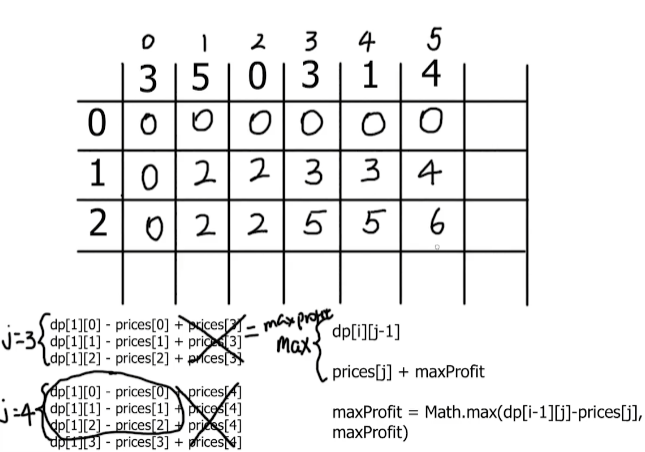


### 剑指Offer

### 50. 第一个只出现一次的字符

> ```bash
> ## 50. 第一个只出现一次的字符
> 在字符串 s 中找出第一个只出现一次的字符。如果没有，返回一个单空格。 s 只包含小写字母。
> 示例 1：输入：s = "abaccdeff"，输出：'b'
> 示例 2：输入：s = "" ，输出：' '
> 
> 解题：indexOf(searchvalue, startIndex?)，使用indexOf进行查找
> ```
>
> ```js
> /**
>  * @param {string} s
>  * @return {character}
>  */
> var firstUniqChar = function (s) {
>   for (let i = 0; i < s.length; i++) {
>     first = s.indexOf(s[i]);
>     e = s.indexOf(s[i], first + 1);
>     if (e == -1) return s[i];
>   }
>   return " ";
> };
> ```

