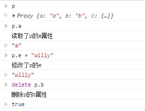

> ```bash
> ## 待实现
> 手写深拷贝
> 手写call / apply
> 手写Promise.all / Promise.race / Promise.allSettled
> 手写限制并发数量
> 手写括号匹配
> 手写红包算法（注意均衡分配和浮点数计算精度问题）
> 数组去重
> 将奇数排在前面，偶数排在后面。要求时间复杂度O(n)。空间复杂度O(1)（不能用splice）
> 数组转树结构
> 解析出URL中所有的部分
> 实现一个compare函数，比较两个对象是否相同
> 螺旋矩阵
> 大数相加
> 找出出现次数最多的英语单词
> 节点倒序（将ul.id=list，将ul节点下的10000个li节点倒序。考虑性能。）
> 实现一个函数计算 "1+12-31+100-93"
> 判断链表是否有环
> 手写useReducer
> 手写useDidMount
> 手写useDidUpdate，模拟componentDidUpdate
> 手写usePrevious
> 删除单向链表中的某个节点
> 中划线转大写
> 千位分割
> 
> 
> 
> ## 开放题
> Antd栅格布局的实现
> 劫持所有的a标签，点击时不发生跳转，而是弹出提示框提示即将跳转到某个网址，点击确认则跳转，点击取消则无操作
> 两个promise，分别实现串行和并行形式，只有两个promise都返回结果时打印success，否则打印fail
> 埋点是如何拦截和上报的
> 如何实现一个无埋点数据上报
> 使用hash路由时，怎么能再刷新后时候自动滚动到页面上次的锚点位置？
> 实现一个多级菜单，菜单层级不定
> 如何监控和排查内存泄漏问题
> 模拟实现Java中的sleep函数
> 使用var模拟实现es6中的let和const
> 实现一个数组的splice方法（说思路）
> A页面跳转到B页面，在B页面做的操作传输给A页面的方法
> Sentry是如何实现错误监控的
> 将一个GIF绘制到canvas上是否可行？如果可行，说说你的实现方法。
> 如果让你搭建一个项目，你会使用哪些技术方案进行组合？
> 如何做技术选型？
> 手写实现一个图片懒加载
>   1、到指定高度加载图片
>   2、考虑重排和重绘
>   3、考虑性能
>   4、先加载缩略图，再加载完整的图
>   5、注意图片加载容错情况
> 编写一个函数，传入一个promise和数字n，n(s)内promise没有返回结果，直接reject
> 了解SSR吗
> 说一下深拷贝要注意的点
> 前端发展方向设想
> 如何设计一个类似于elementui这样的可以单包发布，也可以多包发布的框架
> 如果让你设计一个单测框架，你怎么设计？
> 如何实现模块懒加载？import语法是如何做的
> 如何设计一个单点登录方案？
> 用过哪些设计模式？分别说说它们的使用场景和应用案例？你觉得使用设计模式给你带来了什么好处？
> 从A页面跳转到B页面，再返回A页面时，如何让A页面保持上一次的状态
> Nginx和node中间件代理的区别
> Node中间件主要是解决什么问题
> 说一下你做过的最有收获的项目。描述一下系统所承载的功能、目标以及这个系统能解决什么问题？
> 
> ```
> 

## 中阶

### 回文判断

- 回文是倒转仍然等于原来的字符串

```js
// split() 把字符串转为数组; reverse() 把数组颠倒过来; join()把数组转为字符串
fn = (v) => v == v.split('').reverse().join('')
console.log(fn('manam'))
```

### var定义函数问题

```js
/* 循环中使用闭包解决 var 定义函数的问题 */
for (var i = 1; i <= 5; i++) {
   setTimeout(function timer() {
      console.log(i)
   }, i * 1000)
}
console.log(i); // 先输出（因为i是用var定义，所以存在变量提升）
/* 输出： 第 1 个 3 直接输出，1 秒之后，连续输出 3 个 3
分析：for循环是同步任务，setTimeout是异步任务；
      for循环每次遍历时遇到setTimeout都会先暂留着往后处理；
      等for循环处理完成(此时 i 已为3 )，再处理异步任务(定时器)。
      循环执行过程中，几乎同时设置了3个定时器，这些定时器都会在 1 秒后触发，而循环的输出是立即执行的 */

/* 1. 使用闭包 */
for (var i = 1; i <= 5; i++) {
   (function (j) {
      setTimeout(function timer() {
         console.log(j)
      }, j * 1000)
   })(i)
}

/* 2. 通过定时器的第三个参数（会被当成timer函数的参数传入） */
for (var i = 1; i <= 5; i++) {
   setTimeout(function timer(j) {
      console.log(j)
   }, i * 1000, i)
}

/* 3. 使用 let 定义 i */
for (let i = 1; i <= 5; i++) {
   setTimeout(function timer() {
      console.log(i)
   }, i * 1000)
}
```

### 数字位数固定补零

```js
const addZero1 = (num, len = 2) => (`0${num}`).slice(-len);	// 缺点是超过长度的部分会被砍掉
const addZero2 = (num, len = 2) => (`${num}`).padStart(len, '0');
addZero1(3);  // 03
addZero2(32, 4);  // 0032
```

```js
formatZero = (num, len) => {
  if (String(num).length > len) return num;
  return (Array(len).join(0) + num).slice(-len);
}
let a = formatZero(123456, 5);
let b = formatZero(123, 5);
console.log(a,b); // 123456 '00123'
```

### id自增

**闭包实现id自增**

```js
function next_id(){
    var current_id = 0;
    return function (){
        return ++current_id;
    }
}
var g =  next_id();
for( let i = 0; i < 10; i++ ){
    console.log(g());
}
```

**迭代器generator实现id自增**

```js
function* next_id(){
    let current_id =0;
    while(true) {
        current_id++;
        yield current_id;
    }
}

let g = next_id();

for( var i = 0; i < 10; i++ ){
    console.log( g.next().value )
}
```

### 数组去重

> ```js
> let arr = [1, 0, 0, 2, 9, 8, 3, 1];
> arr1 = Array.from(new Set(arr))
> arr2 = [...new Set(arr)]
> arr3 = arr.filter((n, i) => arr.indexOf(n) === i)	// 判断这个不重复数的首个下标是否跟是当前数的下标一致
> arr4 = arr.sort().filter((n, i) => n != arr[i+1] )	// 先排序，然后判断前后两个数是否相同，不同则存到新数组里面
> arr5 = arr.reduce((acc, n, i) => [].concat(acc, arr.indexOf(n) === i ? n : []))
> ```

###  统计相同项的个数

```js
// 统计相同项的个数
let cars = ['BMW','Benz',  'Benz',  'Tesla',  'BMW',  'Toyota'];
let carsObjNum = cars.reduce((objNum, name) => {
  objNum[name] = objNum[name] ? ++objNum[name] : 1
  return objNum
}, {})
console.log(carsObjNum);  // { BMW: 2, Benz: 2, Tesla: 1, Toyota: 1 }
```

### 合并数组并排序

- **把俩个数组` [A1, A2, B1, B2, C1, C2, D1, D2]` 和` [A, B, C, D]`，合并为 `[A1, A2, A, B1, B2, B, C1, C2, C, D1, D2, D]`**

```js
let a1 = ['A1', 'A2', 'B1', 'B2', 'C1', 'C2', 'D1', 'D2']
// 先给['A', 'B', 'C', 'D']数组添加标记 
let a2 = ['A', 'B', 'C', 'D'].map((item) => item + 'flag' )
/* 先排序，然后删除标记 */
let a3 = [...a1, ...a2].sort().map((item) => {
  if (item.includes('flag')) {
    return item.split('')[0]
  }
  return item
})
console.log(a3);
```

### 隐式转换

- 问当a等于什么时，`if (a == 1 && a == 2 && a == 3) { console.log(1); }`恒成立

````js
/* 当a为对象时 */
var a = {
  i: 1,
  toString() {
    return a.i++;
  }
}
if (a == 1 && a == 2 && a == 3) { console.log(1); }
````

```js
/* 当a为数组时 */
var a = [1, 2, 3];
a.join = a.shift;
if (a == 1 && a == 2 && a == 3) { console.log('1'); }
```

```js
/* 当a为es6的symbol时 */
let a = { 
  [Symbol.toPrimitive]: ((i) => () => ++i)(0) 
};
if (a == 1 && a == 2 && a == 3) { console.log('1'); }
```

### 随机数

**随机生成一个长度为 10 的整数类型的数组，例如 `[2, 10, 3, 4, 5, 11, 10, 11, 20]`，将其排列成一个新数组，要求新数组形式如下，例如 `[[2, 3, 4, 5], [10, 11], [20]]`**

```js
// 得到一个两数之间的随机整数，包括两个数在内
function getRandomIntInclusive(min, max) {
  min = Math.ceil(min);
  max = Math.floor(max);
  return Math.floor(Math.random() * (max - min + 1)) + min;
}
// 随机生成10个整数数组, 排序, 去重
let initArr = Array.from({ length: 10 }, (v) => getRandomIntInclusive(0, 99));
initArr.sort((a, b) => a - b);
initArr = [...new Set(initArr)];

// 放入hash表
let obj = {};
initArr.map((i) => {
  const intNum = Math.floor(i / 10);
  if (!obj[intNum]) obj[intNum] = [];
  obj[intNum].push(i);
})

const resArr = [];
for (let i in obj) {
  resArr.push(obj[i]);
}
console.log(resArr);
```

### 旋转数组

```js
function rotate(arr, k) {
  const len = arr.length
  const step = k % len
  return arr.slice(-step).concat(arr.slice(0, len - step))
}
rotate([1, 2, 3, 4, 5, 6], 7) // => [6, 1, 2, 3, 4, 5]
```

### 字符串大小写取反

```js
function processString(str) {
  let arr = str.split('').map(item => item === item.toUpperCase() ? item.toLowerCase() : item.toUpperCase());
  str = arr.join('');
  return str;
}
console.log(processString('Abc'));  // aBC
```

### 不定长参柯里化函数

```js
function add() {
  let args = [].slice.call(arguments);
  let fn = function () {
    let fn_args = [].slice.call(arguments)
    return add.apply(null, args.concat(fn_args))
  }
  fn.toString = function () {
    return args.reduce((a, b) => a + b)
  }
  return fn
}

let a = add(1); 			// 1
let b = add(1)(2);  	// 3
let c = add(1)(2)(3) // 6
let d = add(1)(2, 3); // 6
let f = add(1, 2)(3); // 6
let e = add(1, 2, 3); // 6
console.log(a, b, c, d, e, f);
```

### js统计html中标签出现次数最多的标签

> 
>
> ```js
> var root = document.getElementsByTagName("html")[0];
> var tags = [];
> //这个函数用来统计子节点中各个标签出现的数量，参数是要统计的子节点的父节点
> function build(root) {
> var childs = root.children;
> for (var i = 0; i < childs.length; i++) {
> var flag = 0;
> for (var j = 0; j < tags.length; j++) {
> if (tags[j].name === childs[i].tagName) {
>   tags[j].num++;
>   flag = 1;
>   break;
> }
> }
> if (!flag) {
> var temp = {};
> temp.name = childs[i].tagName;
> temp.num = 1;
> tags.push(temp);
> }
> build(childs[i]);
> }
> }
> 
> build(root);
> //假设出现最多的标签数是0，下标为-1
> var max = 0;
> var index = -1;
> //遍历获取标签出现次数最多的一个
> tags.forEach(function (v, i, tags) {
> if (v.num > max) {
> max = v.num;
> index = i;
> }
> });
> console.log("标签出现最多的是：" + tags[index].name + "\n出现的次数为：" + tags[index].num);
> ```

##  高阶

### 青蛙跳台阶

> **一只青蛙一次可以跳上1级台阶，也可以跳上2级。求该青蛙跳上一个n级的台阶总共有多少种跳法**
>
> 1. 原理为使用了斐波那契数列；
> 2. 当台阶超过三级时，青蛙跳一次台阶有两种跳法；
> 3. 如果跳1级，则在`(n-1)`级阶梯上跳1级，则有`f(n-1)`种跳法；
> 4. 如果跳2级，则在`(n-2)`级阶梯上跳2级；
> 5. 所以该次跳台阶有`f(n) = f(n-1) + f(n-2)`种跳法
>    （即当台阶超过3级时跳一次台阶，需要计算(n-1)级的跳法 和 (n-2)级的跳法）
>
> ```js
> // 有 n 个台阶，你可以选择每次完成一个台阶 或者 两个台阶，试问走完这 n 个台阶有多少种走法
> function jumpFloor(n) {
>   if (n == 1) return 1;
>   else if (n == 2) return 2;
>   else if (n >= 3) {
>     const arr = [];
>     arr[1] = 1, arr[2] = 2;
>     for (i = 3; i <= n; i++) {
>       // 计算(n-1)级的跳法 和 (n-2)级的跳法
>       arr[i] = arr[i - 1] + arr[i - 2];
>     }
>     return arr[n]
>   }
> }
> console.log(jumpFloor(10)); // 89
> ```
>
> **一只青蛙一次可以跳上1级台阶，也可以跳上2级……它也可以跳上n级。求该青蛙跳上一个n级的台阶总共有多少种跳法？**
>
> - 因为n级台阶，第一步有n种跳法：跳1级、跳2级、到跳n级
>   跳1级，剩下n-1级，则剩下跳法是f(n-1)；
>   跳2级，剩下n-2级，则剩下跳法是f(n-2)
>   所以`f(n) = f(n-1) + f(n - 2) +...+ f(1)`
>   =>`f(n-1) = f(n-2) + f(n-3) +...+ f(1)`
>   =>`f(n) = 2 * f(n-1)`
>   即求 ` 2 的 (n-1) 次方`
>   注意：右移一位相当于除2，右移n位相当于除以2的n次方；左移一位相当于乘以2，左移n为相当于乘以2的n次方
>
> ```js
> /* 通过左移运算符求解 */
> jumpFloor = (n) => 1 << (n - 1)
> console.log(jumpFloor(15));
> 
> /* 通过Math内置方法求解 2 ^ (n-1) */
> jumpFloorII = (n) => Math.pow(2, n - 1)
> console.log(jumpFloorII(15));
> 
> /* 通过递归求解 */
> jumpFloorIII = (n) => {
>   if (n <= 0) return;
>   else if (n === 1) return 1;
>   else if (n === 2) return 2;
>   else return 2 * jumpFloorIII(n - 1);
> }
> console.log(jumpFloorIII(15));
> ```
>
> 

### 雨点游戏

> 先正向遍历，根据前一个的值和原数组当前位置的值两者取最大值；
> 然后逆向遍历，根据后一个的值与原数组当前位置的值两者取最大值；
> 把正向跟逆向遍历的两个数组取最小值再减去原数组的值，把所有值想加则为雨水存储量
>
> ```js
> var trap = function(height) {
> const n = height.length;
> if (n == 0) {
>   return 0;
> }
> 
> const leftMax = new Array(n).fill(0);
> leftMax[0] = height[0];
> for (let i = 1; i < n; ++i) {
>   leftMax[i] = Math.max(leftMax[i - 1], height[i]);
> }
> 
> const rightMax = new Array(n).fill(0);
> rightMax[n - 1] = height[n - 1];
> for (let i = n - 2; i >= 0; --i) {
>   rightMax[i] = Math.max(rightMax[i + 1], height[i]);
> }
> 
> let ans = 0;
> for (let i = 0; i < n; ++i) {
>   ans += Math.min(leftMax[i], rightMax[i]) - height[i];
> }
> return ans;
> };
> ```
>
> 

### 扁平结构数据转树形结构

> 当数据比较大时，会比较耗性能。所以我采用的是先通过reduce对数据进行去重（因为他有多个属性依赖），然后通过for循环把里面每条数据的子数据放入新添加的children属性中，然后再通过两层的for循环再次添加到最里层的children属性中
>
> ````js
> function tree(arr, id=1) {
> const o = {}
> arr.forEach(item => {
> 	const pItem = o[item.pid] || (o[item.pid] = {children:[]})
> o[item.id] = {
>    ...item,
>    children: o[item.id] && o[item.id].chidren || []
> };
> pItem.children.push(o[item.id])
> 	})
> 	return o[id];
> }
> ````
>
> https://juejin.cn/post/6983904373508145189?share_token=ecdf12ab-ac14-49d8-8d62-c71b3f9ab487
>
> ```js
> function convert(list) {
> const res = []
> const map = list.reduce((res, v) => (res[v.id] = v, res), {})
> for (const item of list) {
> if (item.parentId === 0) {
>   res.push(item)
>   continue
> }
> if (item.parentId in map) {
>   const parent = map[item.parentId]
>   parent.children = parent.children || []
>   parent.children.push(item)
> }
> }
> return res
> }
> let list = [
> { id: 1, name: '部门A', parentId: 0 }, { id: 2, name: '部门B', parentId: 0 },
> { id: 3, name: '部门C', parentId: 1 }, { id: 4, name: '部门D', parentId: 1 },
> { id: 5, name: '部门E', parentId: 2 }, { id: 6, name: '部门F', parentId: 3 },
> { id: 7, name: '部门G', parentId: 2 }, { id: 8, name: '部门H', parentId: 4 }
> ];
> console.log(convert(list));
> ```
>
> 
>
> 递归问题（递归怎么停止，为什么会内存泄露）
>
> 

### 消除连续字符串

> - 输入一个数组或字符串，相邻相同的字符串消除，输出剩下的数组段或字符串，注意消除相邻的字符串后相邻位置可能产生新的相同字符串（类似开心消消乐）
> - 示例：输入[1, 2, 3, 4, 4, 4, 3, 1, 2]，输出为[1, 2, 1, 2]。即先消除三个4，然后两个3相邻，再消除两个3。输出为[1, 2, 1, 2]
> - 思路：新建一个数组，用以存放元素，并将原数组的第一位放入新数组的第一位；
>   循环遍历原数组，注意此处移位操作放在for循环里面（避免指针移动情况与期望的不一致）；
>   依次判断原数组和新数组最后一位，如果不相同，将该字符放入新数组；如果相同，指针后移，直至遇到不相同的元素退出while循环，同时删除新数组的最后一个字符；
>   继续重复该判断，i++放在for循环里面就是为了让上一次判断结束之后直接进行下一次判断，指针不进行移位，否则将不能完整遍历整个原数组。
>   返回新数组。
>
> ```js
> function delChar(arr) {
>   let newArr = [arr[0]];
>   for (let i = 1; i < arr.length;) {
>     if (newArr[newArr.length - 1] == arr[i]) {
>       while (newArr[newArr.length - 1] == arr[i]) {
>         i++;
>       }
>       newArr.pop();
>     } else {
>       newArr.push(arr[i])
>       i++;
>     }
>   }
>   return newArr;
> }
> console.log(delChar([1, 2, 3, 4, 4, 4, 3, 1, 2]))
> ```

### 数组中第K个最大元素

```js
/*输入: [3,2,1,5,6,4] 和 k = 2；	输出: 5
  输入: [3,2,3,1,2,4,5,5,6] 和 k = 4；		输出: 4*/
function findKthLargest(nums, k) {
  if (1 <= k <= nums.length) {
    nums.sort((a, b) => b - a)	// 从大到小排序(不去重)
    return nums[k - 1]	// 返回第k-1个元素
  }
  return false
};
console.log(findKthLargest([3, 2, 3, 1, 2, 4, 5, 5, 6], 4))
```

### 数组排序

> /* 在一个字符串数组中有红、黄、蓝三种颜色的球，且个数不相等、顺序不一致，请为该数组排序。使得排序后数组中球的顺序为:黄、红、蓝。
> 例如：红蓝蓝黄红黄蓝红红黄红，排序后为：黄黄黄红红红红红蓝蓝蓝。 */
>
> ```js
> let str = '红蓝蓝黄红黄蓝红红黄红'
> let obj = {'黄': 0,'红':1, '蓝': 2}
> let arr = str.split('').sort((a, b) => {
> return obj[a] - obj[b]
> })
> console.log(arr.join(''))  // 黄黄黄红红红红红蓝蓝蓝
> ```

### 查找数组

> - 给定一个整数数组 nums 和一个整数目标值 target，请你在该数组中找出和为目标值 target  的那两个整数，并返回它们的数组下标。
>   你可以假设每种输入只会对应一个答案。但是，数组中同一个元素在答案里不能重复出现。
>   你可以按任意顺序返回答案
>   输入：nums = [2,7,11,15], target = 9;   输出：[0,1]
>   输入：nums = [3,2,4], target = 6;   输出：[1,2]
>   输入：nums = [3,3], target = 6;   输出：[0,1]
>
> ```js
> var twoSum = function (nums, target) {
>   for (let i = 0; i < nums.length; i++) {
>     let a = nums.indexOf(target - nums[i], i + 1)
>     if (a > 0) return [i, a]
>   }
> };
> ```

### 两数相加

```js
/* 给定一个由 整数 组成的 非空 数组所表示的非负整数，在该数的基础上加一。
最高位数字存放在数组的首位， 数组中每个元素只存储单个数字。
你可以假设除了整数 0 之外，这个整数不会以零开头。
输入：digits = [1,2,3], 输出：[1,2,4]
输入：digits = [4,3,2,1], 输出：[4,3,2,2]
输入：digits = [0], 输出：[1] */
let digits = [4,3,2,1]
((BigInt(digits.join('')) + 1n) +'').split('')	// [4,3,2,2]
```

```js
/* 给你两个 非空 的链表，表示两个非负的整数。它们每位数字都是按照 逆序 的方式存储的，并且每个节点只能存储 一位 数字。
请你将两个数相加，并以相同形式返回一个表示和的链表。
你可以假设除了数字 0 之外，这两个数都不会以 0 开头。
输入：l1 = [2,4,3], l2 = [5,6,4],   输出：[7,0,8]
输入：l1 = [0], l2 = [0],   输出：[0]
输入：l1 = [9,9,9,9,9,9,9], l2 = [9,9,9,9]; 输出：[8,9,9,9,0,0,0,1] */
var addTwoNumbers = function (l1, l2) {
  len = l1.length > l2.length ? l1.length : l2.length	// 获取最长的数组长度
  let l3 = Array(len).fill(0);
  for (let i = 0; i < len; i++) {
    l1[i] = l1[i] || 0, l2[i] = l2[i] || 0;	// 防止超过长度存在数据未定义，导致相加失败
    let flag = l1[i] + l2[i] + l3[i];
    if (flag > 9) {	// 当相加大于9，则向后一位加1，本身取相加所得的个位数
      l3[i] = flag % 10;
      l3[i + 1] = 1;
    } else {
      l3[i] = flag;
    }
  }
  return l3
};

// 优化写法  因为可以看为是两个数相加，然后倒叙即为所求结果
var addTwoNumbers = function (l1, l2) {
  return ((BigInt(l1.join('')) + BigInt(l2.join(''))) + '').split('').reverse().map(Number)
};
let l1 = [0, 1, 1, 3], l2 = [9, 9, 9, 9, 9, 9, 9, 9, 9]
console.log(addTwoNumbers(l1, l2))
```

### 无重复字符的最长子字符串

> - 给定一个字符串 s ，请你找出其中不含有重复字符的 最长子串 的长度
>
> ```js
> /* 给定一个字符串 s ，请你找出其中不含有重复字符的 最长子串 的长度。
> 输入: s = "abcabcbb";   输出: 3 
> 输入: s = "bbbbb";    输出: 1
> 输入: s = "pwwkew";   输出: 3 
> 输入: s = "";         输出: 0
> 思路：如果当前位置的字符重复，则取重复字符后的字符 + 当前位置的字符 */
> let s = "abcabcbb"
> var lengthOfLongestSubstring = function (s) {
>   let sum = '', max = 0;
>   for (let i = 0; i < s.length; i++) {
>     let current = s.charAt(i);  // 获取当前位置的字符
>     // 如果当前位置的字符重复，则取重复字符后的字符 + 当前位置的字符
>     if (sum.indexOf(current) > -1) {
>       sum = sum.substring(sum.indexOf(current) + 1) + current // 截取出现字符重复之后的所有字符
>     } else {
>       sum += current;
>     }
>     max = max < sum.length ? sum.length : max;
>   }
>   return max
> };
> console.log(lengthOfLongestSubstring(s))
> ```
>
> ```js
> function lengthOfLongestSubstring(string) {
>   const stArr = string.split('')
>   let contArr = []
>   stArr.forEach((item, index) => {
>     let itemArr = []  // 进入下次循环时清空数组盒子从头开始
>     for (var i = index; i < stArr.length; i++) {
>       // 如果没有重复的就放到内容数组
>       if (!itemArr.includes(stArr[i])) {
>         itemArr.push(stArr[i])
>       } else {
>         // 查看在if中收集的最终内容数据
>         // 如果有重复的了就先把之前的放到数组盒子,清空内容数组重新赋值
>         contArr.push(itemArr)
>         itemArr = []
>         itemArr.push(stArr[i])
>       }
>     }
>   })
>   contArr.sort((a, b) => b.length - a.length) // 将最长的放到第一位
>   return contArr[0].join('').length // 返回最长字符串的长度
> }
> console.log(lengthOfLongestSubstring('widoiadiaoewole'))
> ```

### 寻找两个正序整数的中位数

```js
/* 给定两个大小分别为 m 和 n 的正序（从小到大）数组 nums1 和 nums2。请你找出并返回这两个正序数组的 中位数
输入：nums1 = [1,3], nums2 = [2];	输出：2.00000
输入：nums1 = [1,2], nums2 = [3,4];	输出：2.50000
*/
var findMedianSortedArrays = function(nums1, nums2) {
    let nums = [...nums1, ...nums2].sort((a,b) => a - b)
    let len = nums.length
    return len % 2 === 0 ? (nums[len/2] + nums[len/2 -1])/2 : nums[Math.floor(len/2)]
};
let nums1 = [1,2], nums2 = [3,4]
console.log(findMedianSortedArrays(nums1, nums2))
```

### 手写红绿灯

> 使用callbak、promise、async…await、genteror编写 3秒打印一个红 二秒绿 1秒黄
>
> ```js
> // promise
> new Promise((resolve, reject) => {
> setTimeout(() => {
> console.log('red')
> return Promise.resolve('green').then(res => {
> setTimeout(() => {
>  console.log(res)
>    return Promise.resolve('yellow').then(res => {
>       setTimeout(() => {
>         console.log(res)
>       }, 1000)
>     })
>   }, 2000)
> })
> }, 3000)
> })
> ```
>
> ```js
> // async...await
> const changeColor = (color, timer) => {
> return new Promise((resolve, reject) => {
> setTimeout(() => {
> console.log(color)
> resolve(color)
> }, timer)
> })
> }
> const getColor = async () => {
> try {
> await changeColor('red', 3000);
> await changeColor('green', 2000);
> await changeColor('yellow', 1000)
> } catch (err) { }
> }
> getColor()
> ```
>
> ```js
> // generaotor
> function* showColor() {
> yield getColor('red', 3000)
> yield getColor('green', 2000)
> yield getColor('yellow', 1000)
> }
> function getColor(color, timer) {
> setTimeout(() => {
> console.log(color)
> }, timer)
> }
> let arr = showColor();
> arr.next();
> arr.next();
> arr.next();
> ```

### 设置缓存有效时间

> ```js
> /* 实现使用localStorage时有数据过期时间功能
> ->存储记录下有效截止时间
> 取数据时判断是否超过有效时间，在有效时间内则返回
> 不在则提示或返回空并且将其删除*/
> class MyStorage {
> get(key) {
> const wrapValue = localStorage.getItem(key);
> if (wrapValue == null) {
>   return undefined
>  }
> 
>  const { value, expires } = JSON.parse(wrapValue);
>  if (!expires || Date.now() < expires) {
>    return value
>  } else {
>    localStorage.removeItem(key)
>    return undefined
>  }
> }
> set(key, value, period) {
>  const wrapValue = { value };
>  if (period != null) {
>    wrapValue.expires = Date.now() + period;
> }
> localStorage.setItem(key, JSON.stringify(wrapValue))
> }
> }
> let storageInstance = new MyStorage();
> // 设置本地缓存
> storageInstance.set(
> "web",
> { url: "willy.com" },
> 5000
> );
> // 获取本地缓存
> let a = storageInstance.get('web')
> console.log(a)
> ```

### 手写PipeLine类

> ```js
> class PipeLine {
> constructor() {
> 	/**
>       * 使用Map来存放指令-函数映射
>       * 执行的时候遍历出来依次执行
>       * Map遍历的时候会按照set的顺序来，而不是按照hash大小的顺序
>       */
>       this.cmdMap = new Map()
>     }
>   /**
>    * @param {String} cmdName 命令名称
>    * @param {Function} callback 执行回调
>    */
>   on(cmdName, callback) {
>     this.cmdMap.set(cmdName, callback)
>   }
>   /**
>    * 依次执行命令
>    */
>   run() {
>     const cmdMap = this.cmdMap
> 
>     function* orderExe() {
>       yield* cmdMap.entries()
>     }
>     const iterator = orderExe()
> 
>     function loop() {
>       const [name, callback] = iterator.next().value
>       callback({
>         name
>       }, function() {
> 				loop()
>       })
>     }
> 		loop()
>   }
> }
> 
> const pipe = new PipeLine()
> pipe.on('start', (ctx, next) => {
>   console.log(ctx.name)
>   next()
> })
> pipe.on('progress', (ctx, next) => {
>   console.log(ctx.name)
> })
> pipe.on('end', (ctx, next) => {
>   console.log(ctx.name)
> })
> pipe.run()
> ```

## 原理题

### instanceof 运算符

> ```bash
> ## instanceof
> instanceof 运算符用于检测构造函数的 prototype 属性是否出现在某个实例对象的原型链上。
> ```
>
> ```js
> /**
>   * @description 判断对象是否属于某个构造函数
>   * @prams left: 实例对象  right: 构造函数
>   * @return boolean
> */
> const myInstanceof = function (left, right) {
>   // 获取构造函数的显示原型
>   const rightPrototype = right.prototype
>   // 获取实例对象的隐式原型
>   let leftProto = left.__proto__
> 
>   // 循环执行，直到找到对应的原型 or 到达原型链顶层
>   while (true) {
>     // 当到达原型链顶层，还未找到，则返回 false
>     if (leftProto === null) return false
> 
>     // 隐式原型与显式原型相等
>     if (leftProto === rightPrototype) return true
> 
>     // 获取隐式原型的隐式原型，重新赋值给 leftProto，继续向上一层原型链中查找
>     leftProto = leftProto.__proto__
>   }
> }
> myInstanceof(function(){}, Function)	// true
> ```

### call 改变 this 指向

> ```bash
> ## 模拟实现 call()
> - call() 主要是会改变this指向，第一个参数为所改变的this指向，第二个之后的参数列表为传递的值
> 
> ## 实现原理
> 1. 判断当前 this 是否为函数，防止 `Function.prototype.myCall()` 直接调用
> 2. context 为可选参数，如果不传的话默认上下文为 window
> 3. 为 context 创建一个 Symbol 属性来保证不会重名，将当前函数复制给这个属性
> 4. 处理参数，传入的第一个参数后的其余参数
> 5. 调用函数后立即删除该 Symbol 属性
> ```
>
> ```js
> 
> ```
>
> 1. 将函数设为传入参数的属性，如果不传入参数则默认指向为 window/global
> 2. 判断当前 this 是否为函数，防止 `Function.prototype.myCall()` 直接调用
> 3. context 为可选参数，如果不传的话默认上下文为 window
> 4. 为 context 创建一个 Symbol 属性来保证不会重名，将当前函数复制给这个属性
> 5. 处理参数，传入的第一个参数后的其余参数
> 6. 调用函数后立即删除该 Symbol 属性

### new 生成一个对象

> ```bash
> ## new 生成一个对象
> 1. 创建一个新对象。
> 2. 这个新对象会被执行[[原型]]连接。
> 3. 属性和方法被加入到 this 引用的对象中。并执行了构造函数中的方法.
> 4. 如果函数没有返回其他对象，那么返回创建的这个新对象，否则返回构造函数的执行结果。
> ```
>
> ```js
> function new (func) {
>   let target = {}
>   let [constructor, ...args] = [...argument]
>   target.__proto__ = constructor.prototype
>   let res = func.apply(target, args)
>   // 如果函数没有返回其他对象，那么返回创建的这个新对象，否则返回构造函数的执行结果。
>   if ((res && typeof res === 'object') || (typeofres === 'function')) {
>     return res
>   }
>   return target
> }
> ```

### 函数防抖

> ```js
> /**
>  * @desc 函数防抖
>  * @param func 目标函数
>  * @param wait 延迟执行毫秒数
>  * @param immediate true - 立即执行， false - 延迟执行
>  */
> export const debounce = function(func, wait = 1000, immediate = true) {
> 	let timer;
> 	return function() {
> 		let context = this, args = arguments;
> 		if (timer) clearTimeout(timer);
> 		if (immediate) {
> 			let callNow = !timer;
> 			timer = setTimeout(() => {
> 				timer = null;
> 			}, wait);
> 			if (callNow) func.apply(context, args);
> 		} else {
> 			timer = setTimeout(() => {
> 				func.apply(context, args);
> 			}, wait)
> 		}
> 	}
> }
> ```

### 函数节流

> ```js
> /**
>  * @desc 函数节流
>  * @param func 函数
>  * @param wait 延迟执行毫秒数
>  * @param type 1 使用表时间戳，在时间段开始的时候触发 2 使用表定时器，在时间段结束的时候触发
>  */
> export const throttle = (func, wait = 1000, type = 1) => {
>   let previous = 0;
>   let timeout = null;
>   return function() {
>     let context = this, args = arguments;
> 
>     if (type === 1) {
>       let now = Date.now();
>       if (now - previous > wait) {
>         func.apply(context, args);
>         previous = now;
>       }
>     }
> 
>     if (type === 2) {
>       if (!timeout) {
>         timeout = setTimeout(() => {
>           timeout = null;
>           func.apply(context, args)
>         }, wait)
>       }
>     }
>   }
> }
> ```

### Proxy数据响应式原理

> ```js
> /**
>  * 模拟vue3中实现响应式改变数据
> */
> let person = {
>   a: "a", b: "b", c: { d: "e" },
> };
> const p = new Proxy(person, {
>   // 读取p某个属性时调用
>   get(target, propName) {
>     console.log(`读取了p的${propName}属性`);
>     if (propName === 'date')
>       target[propName] += "天";
>     return target[propName]
>   },
> 
>   // 修改p某个属性或给p追加属性时调用
>   set(target, propName, value) {
>     console.log(`修改了p的${propName}`);
> 
>     // 字段过滤
>     if (propName === 'age' && typeof value != 'number') {
>       throw Error("age字段必须为number类型");
>     }
> 
>     // 返回数据
>     // target[propName] = value;
>     return Reflect.set(target, propName, value); // 等同target[propName] = value;
>   },
> 
>   // 删除p的某个属性时调用
>   deleteProperty(target, propName) {
>     console.log(`删除p的${propName}属性`);
>     return delete target[propName]  // 返回的是true || false
>   }
> })
> ```
>
> 

### vue3 reactive响应式

#### 基础版本

> ```ts
> /**
>  * @ Author: willy <willysliang@qq.com>
>  * @ Create Time: 2023-06-01 09:39:51
>  * @ Modifier by: willy <willysliang@qq.com>
>  * @ Modifier time: 2023-06-01 09:58:14
>  * @ Description:  VUE3 reactive 响应式系统的实现
>  *
>  * 1. 借助 Proxy 将一个对象 obj 变成响应式数据,拦截其 get 和 set 操作
>  * 2. 通过 effect 注册副作用函数,并在其首次执行副作用函数时完成 obj 对象的以来收集(track)
>  * 3. 当数据发生变化时,第 2 步注册的副作用函数会重新执行(trigger)
>  */
> 
> console.log('------------- START -----------------')
> 
> const bucket = new WeakMap()
> // 重新定义 bucket 数据类型为 WeakMap
> let activeEffect: any = null
> 
> /**
>  * 注册副作用函数
> */
> const effect = function (fn) {
>   activeEffect = fn
>   fn()
> }
> 
> /**
>  * tracket 追踪
> */
> function track (target, key) {
>   // activeEffect 无值意味着没有执行 effect 函数,无法收集以来,直接 return
>   if (!activeEffect) {
>     return undefined
>   }
> 
>   // 每个 target 在 bucket 中都是一个 Map 类型, key => effects
>   let depsMap = bucket.get(target)
> 
>   // 第一次拦截时 depsMap 不存在,所以需要先创建联系
>   if (!depsMap) {
>     bucket.set(target, (depsMap = new Map()))
>   }
> 
>   // 根据当前读取的 key,尝试读取 key 的 effect 函数
>   let deps = depsMap.get(key)
> 
>   // deps 本质是 Set 结构,即一个 key 可以存在多个 effect 函数,被多个 effect 所依赖
>   if (!deps) {
>     depsMap.set(key, (deps = new Set()))
>   }
> 
>   // 将激活的 effectFn 存入桶中
>   deps.add(activeEffect)
> }
> 
> /**
>  * trigger 执行依赖
> */
> function trigger (target, key) {
>   // 读取 depsMap,其结构为 key => effects
>   const depsMap = bucket.get(target)
> 
>   if (!depsMap) {
>     return undefined
>   }
> 
>   // 真正读取依赖当前属性值 key 的 effects
>   const effects = depsMap.get(key)
> 
>   // 循环逐个执行
>   effects && effects.forEach((fn) => fn())
> }
> 
> /** 同意对外暴露响应式函数 */
> const reactive = (state) => {
>   return new Proxy(state, {
>     get (target, key) {
>       const value = target[key]
>       track(target, key)
>       return value
>     },
>     set (target, key, newValue) {
>       // 设置属性值
>       target[key] = newValue
>       trigger(target, key)
>       return true
>     }
>   })
> }
> 
> /**
>  * 测试
>  */
> const state = reactive({
>   name: 'willys',
>   age: 999,
> })
> effect(() => {
>   console.log('name', state.name)
> 
>   effect(() => {
>     console.log('age', state.age)
>   })
> })
> 
> state.name = 'willysliang'
> state.age = 1200
> console.log('------------- END -----------------')
> 
> export {
>   effect,
>   reactive,
> }
> ```

#### 支持 effect 嵌套

> ```ts
> /**
>  * @ Author: willy <willysliang@qq.com>
>  * @ Create Time: 2023-06-01 09:39:51
>  * @ Modifier by: willy <willysliang@qq.com>
>  * @ Modifier time: 2023-06-01 10:20:36
>  * @ Description:  VUE3 reactive 响应式系统的实现
>  *
>  * 1. 借助 Proxy 将一个对象 obj 变成响应式数据,拦截其 get 和 set 操作
>  * 2. 通过 effect 注册副作用函数,并在其首次执行副作用函数时完成 obj 对象的以来收集(track)
>  * 3. 当数据发生变化时,第 2 步注册的副作用函数会重新执行(trigger)
>  */
> 
> console.log('------------- START -----------------')
> 
> const bucket = new WeakMap()
> const effectStack: Array<any> = []
> // 重新定义 bucket 数据类型为 WeakMap
> let activeEffect: any = null
> 
> /**
>  * 清除副作用函数
>  */
> const cleanup = (effectFn) => {
>   for (let i = 0; i < effectFn.deps.length; i++) {
>     const deps = effectFn.deps[i]
>     deps.delete(effectFn)
>   }
>   effectFn.deps.length = 0
> }
> 
> /**
>  * 注册副作用函数
> */
> const effect = function (fn) {
>   const effectFn = () => {
>     cleanup(effectFn)
>     activeEffect = effectFn
>     // 入栈
>     effectStack.push(effectFn)
>     fn()
>     // 出栈
>     effectStack.pop()
>     activeEffect = effectStack[effectStack.length - 1]
>   }
> 
>   // 用来存储那些依赖集合包含这个副作用函数
>   effectFn.deps = []
>   effectFn()
>   // activeEffect = null
> }
> 
> /**
>  * tracket 追踪
> */
> function track (target, key) {
>   // activeEffect 无值意味着没有执行 effect 函数,无法收集以来,直接 return
>   if (!activeEffect) {
>     return undefined
>   }
> 
>   // 每个 target 在 bucket 中都是一个 Map 类型, key => effects
>   let depsMap = bucket.get(target)
> 
>   // 第一次拦截时 depsMap 不存在,所以需要先创建联系
>   if (!depsMap) {
>     bucket.set(target, (depsMap = new Map()))
>   }
> 
>   // 根据当前读取的 key,尝试读取 key 的 effect 函数
>   let deps = depsMap.get(key)
> 
>   // deps 本质是 Set 结构,即一个 key 可以存在多个 effect 函数,被多个 effect 所依赖
>   if (!deps) {
>     depsMap.set(key, (deps = new Set()))
>   }
> 
>   // 将激活的 effectFn 存入桶中
>   deps.add(activeEffect)
> }
> 
> /**
>  * trigger 执行依赖
> */
> function trigger (target, key) {
>   // 读取 depsMap,其结构为 key => effects
>   const depsMap = bucket.get(target)
>   if (!depsMap) {
>     return undefined
>   }
> 
>   // 真正读取依赖当前属性值 key 的 effects
>   const effects = depsMap.get(key)
> 
>   // 解决 cleanup 执行会无限执行的问题
>   const effectsToRun = new Set(effects)
> 
>   // 循环逐个执行
>   effectsToRun && effectsToRun.forEach((fn: any) => fn())
> }
> 
> /** 同意对外暴露响应式函数 */
> const reactive = (state) => {
>   return new Proxy(state, {
>     get (target, key) {
>       const value = target[key]
>       track(target, key)
>       return value
>     },
>     set (target, key, newValue) {
>       // 设置属性值
>       target[key] = newValue
>       trigger(target, key)
>       return true
>     }
>   })
> }
> 
> /**
>  * 测试
>  */
> const state = reactive({
>   name: 'willys',
>   age: 999,
> })
> effect(() => {
>   console.log('name', state.name)
> 
>   effect(() => {
>     console.log('age', state.age)
>   })
> })
> 
> state.name = 'willysliang'
> state.age = 1200
> console.log('------------- END -----------------')
> 
> export {
>   effect,
>   reactive,
> }
> 
> ```

## 手写题

### 自定义事件函数Event

> ```js
> /**
>  * 实现自定义事件函数Event，使其的实例具有监听事件、触发事件、解除绑定功能。
>  * 注意：实例可能监听多个不同的事件，也可以去除监听事件
> */
> class Event {
>   constructor(name) {
>     this.name = name
>     this.eventsObj = {}
>   }
> 
>   on(eventName, callback) {
>     // 利用数组储存同事件的所有回调
>     (this.eventsObj[eventName] || (this.eventsObj[eventName] = [])).push(callback)
>   }
> 
>   emit(eventName, ...param) {
>     const currentEvent = this.eventsObj[eventName];
>     if (Array.isArray(currentEvent)) {
>       currentEvent.forEach(currentFn => {
>         currentFn(...param);
>       })
>     }
>   }
> 
>   off(eventName, callback) {
>     const currentEvent = this.eventsObj[eventName];
>     if (Array.isArray(currentEvent)) {
>       this.eventsObj[eventName] = currentEvent.filter(cbk => cbk !== callback)
>     }
>   }
> 
>   sayHi() {
>     console.log(`Hi, I am ${this.name}`)
>   }
> }
> 
> /* 以下为测试代码 */
> const say1 = (greeting) => {
>   console.log(`${greeting}, nice meeting you.`)
> }
> 
> const say2 = (greeting) => {
>   console.log(`${greeting}, nice meeting you, too.`)
> }
> 
> const jerry = new Event('Jerry')
> jerry.sayHi()
> // => 输出：'Hi, I am Jerry'
> 
> jerry.on('greeting', say1)
> jerry.on('greeting', say2)
> 
> jerry.emit('greeting', 'Hi')
> // => 输出：'Hi, nice meeting you.' 和 'Hi, nice meeting you, too'
> 
> jerry.off('greeting', say1)
> jerry.emit('greeting', 'Hi')
> // => 只输出：'Hi, nice meeting you, too'
> ```

### sleep函数（休眠函数，不作响应）

> ```js
> /**
>  * 题目2：完成 sleep 函数，可以达到下面的效果：
>  * 实现方案1. await 一般是等待一个Promise对象并获取该对象结果，所以首先想到就是 Promise + setTimeout 来实现
>  * 实现方案2. 还可以使用时间戳来计算休眠时间，使用 while 来不断获取最新时间戳来判断是否达到预期休眠时间，并使用 return 结束休眠函数调用或 break/continue 来跳出循环
> */
> const sleep = (duration) => {
>   // return new Promise((resolve) => setTimeout(resolve,duration));
>   const start = new Date().getTime();
>   while (true) {
>     if (!(new Date().getTime() - start - duration)) {
>       return;
>     }
>   }
> }
> 
> const anyFunc = async () => {
>   console.log("123") // 输出 123
>   await sleep(300) // 暂停 300 毫秒
>   console.log("456") // 输出 456，但是距离上面输出的 123 时间上相隔了 300 毫秒
> }
> anyFunc();
> ```

### deepGet函数（深度获取对象内容）

> ```js
> /**
>  * 完成 deepGet 函数，给它传入一个对象和字符串，字符串表示对象深层属性的获取路径，可以深层次获取对象内容
> */
> const deepGet = (obj, prop) => {
>   let path = JSON.parse(JSON.stringify(obj));
>   const props = prop.split('.');
>   for (let i = 0; i < props.length; i++) {
>     const propName = props[i];
>     const current = propName.split(/[\[||\]]/g);
>     const name = current[0];
>     if (current.length > 1) {
>       if (!path[name] || path[name].length < current[1]) {
>         path = undefined;
>         break;
>       };
>       path = path[name][current[1]];
>     } else if (current.length === 1) {
>       if (!path[name]) {
>         path = undefined;
>         break;
>       };
>       path = path[name];
>     }
>   }
>   console.log(path);
>   return path;
> }
> 
> /** 以下为测试代码 */
> deepGet({
>   school: {
>     student: { name: 'Tomy' },
>   },
> }, 'school.student.name') // => 'Tomy'
> 
> deepGet({
>   school: {
>     students: [
>       { name: 'Tomy' },
>       { name: 'Lucy' },
>     ],
>   }
> }, 'school.students[1].name') // => 'Lucy'
> 
> // // 对于不存在的属性，返回 undefined
> deepGet({ user: { name: 'Tomy' } }, 'user.age') // => undefined
> deepGet({ user: { name: 'Tomy' } }, 'school.user.age') // => undefined
> ```

### compose函数（接收多函数参数，并返回函数）

> ```js
> /**
>  * 完成 compose 函数。
>  * 它接受任意多个单参函数（只接受一个参数的函数）作为参数，并且返回一个函数。
>  * 它的作为用：使得类似 f(g(h(a))) 这样的函数调用可以简写为 compose(f, g, h)(a)。
>  * 主要使用柯里化函数来实现
> */
> 
> // 方案一：递归实现
> const compose = (...callbackArr) =>
>   (...params) => {
>     const fn = callbackArr.shift();
>     return callbackArr.length < 1 ?
>       fn(...params) :
>       fn(compose(...callbackArr)(...params))
>   }
> 
> /**
>  * 方案二：reduce替代递归实现
>  * 题目要求的顺序实际上是从右至左执行的，所以可以使用reduceRight方法
>  * 首先它利用了reduceRight来从右至左执行函数，初始值就是最终执行时传入的真正的参数，然后每次执行的结果current(total)作为下一次执行的参数total
> */
> /* const compose = (...rest) =>
>   (...params) => rest.reduceRight(
>     (total, current) => current(total), ...params
>   ) */
> 
> /* 以下为测试代码 */
> const addOne = (a) => a + 1
> const multiTwo = (a) => a * 2
> const divThree = (a) => a / 3
> const toString = (a) => a + ''
> const split = (a) => a.split('')
> console.log(split(toString(addOne(multiTwo(divThree(666))))));
> // => ["4", "4", "5"]
> const testForCombo = compose(split, toString, addOne, multiTwo, divThree)
> console.log(testForCombo(666));
> // => ["4", "4", "5"]
> ```

### 尼姆游戏（Nim游戏必胜策略）

> ```js
> /* 类似二进制满 1 补 0 的实现 */
> 有两个盘子分别放有 5 个和 7 个小球，两个朋友玩游戏：每个人轮流从两个盘子中拿小球，每人每次只能从其中一个盘子中拿，每次可以拿 1 个或者多个（不能一个都不拿），拿到最后一个小球的人算输。问开局先手和后手是否有必胜策略？如果有，请描述必胜策略。
> 
> 假设 A 盘5个球，B 盘7个球
> 一、先手必胜策略
>       1. 第一次拿需要在 B 盘取 2 个球，保证两盘之和为偶数，以确保 先手方 不是最后一次拿球
>       2. 当两个盘为数量都 >=2 时，先手方 需要尽量保证两个盘子数量相同即可
>       3. 当有一个盘球数量为1，一个盘球数量为n（n>1）时，先手方取n个球，使得后手方只能取一个球
>       4. 当只有一个盘时，先手取球数量剩一个在盘中即可（该情况只会发生在该盘球数 >=2时）
>   二、后手必胜策略
>       暂时未想到能胜利的策略
> ```

### 请求并发&限流

> ```bash
> ## 【手动维护 HTTP 请求排队】
> 实现一个带并发数限制的fetch请求函数：
> 请实现如下函数，可以批量请求数据，所有的 URL 地址在 urls 参数中，同时可以通过 max 参数控制请求的并发度，当所有请求结束之后，需要执行 callback 回调函数。发请求的函数可以直接使用 fetch 即可。
> 
> 
> ### 思路 & 解题
>   1. 批量请求
>       要实现批量请求，而且并不需要按顺序发起请求（如果需要按顺序可以存入队列中，按优先级则可以存入优先队列中）。
>       所以这里我们存入数组中即可，然后进行比阿尼，去除数字的每一项丢入 fetch 中进行调用。
> 
>   2. 可控制并发度
>       在控制并发数的同时，每结束一个请求并发起一个新请求。
>       使用递归的方式，添加一个请求队列，然后我们只要维护这个队列。每次发起一个请求就添加进去，结束一个就丢出来，继而实现控制并发。
> 
>   3. 全部请求结束，执行 callback
>       因为是异步请求，所以无法寄希望于安装的顺序在函数调用后执行，但每次 fetch 有返回结果会调用 then 或 catch，我们可以在这个时候判断请求数组是否为空，就可以知道是否全部被调用完。
> ```
>
> ```ts
> /** 带并发数限制的fetch请求函数 */
> const handleFetchQueue = function (
>   urls: string[],
>   max: number,
>   callback: (_: any) => void,
> ) {
>   const urlCount = urls.length
>   const requestsQueue: Array<any> = []
>   const results: Array<any> = []
>   let i = 0
>   const handleRequest = (url) => {
>     const req = fetch(url)
>       .then((res) => {
>         console.log('当前并发：' + requestsQueue)
>         // 更新数组长度
>         const len = results.push(res)
>         if (len < urlCount && i + 1 < urlCount) {
>           requestsQueue.shift()
>           handleRequest(urls[++i])
>         } else if (len === urlCount) {
>           typeof callback === 'function' && callback(results)
>         }
>       })
>       .catch((e) => {
>         results.push(e)
>       })
>     if (requestsQueue.push(req) < max) {
>       handleRequest(urls[++i])
>     }
>   }
>   handleRequest(urls[i])
> }
> 
> /** fetch请求 */
> const fetch = function (url, delay = Math.random() * 1e4) {
>   return new Promise((resolve) => {
>     console.log(`\t\tsending request: [${url}] >> [${delay}ms]`)
>     setTimeout(() => {
>        console.log(`\t\t-------- done:[${url}] >> [${delay}ms]`)
>       resolve(url)
>     }, delay)
>   })
> }
> 
> /** 条件 & demo */
> const urls = Array.from({ length: 10 }, (v, k) => k.toString())
> const max = 4
> const callback = () => { console.log('run callback') }
> handleFetchQueue(urls, max, callback)
> ```
> 
>

### 中文转阿拉伯数字

> ```js
> function ChineseToNumber (chnStr) {
>   let rtn = 0
>   let section = 0
>   let number = 0
>   let secUnit = false
>   let str = chnStr.split('')
>   let chnNameValue = {
>     十: { value: 10, secUnit: false },
>     百: { value: 100, secUnit: false },
>     千: { value: 1000, secUnit: false },
>     万: { value: 10000, secUnit: true },
>     亿: { value: 100000000, secUnit: true },
>   }
>   // 增加‘两’的对象，解决“两百零一”等数字的转换问题
>   let chnNumChar = {
>     零: 0,
>     一: 1,
>     二: 2,
>     两: 2,
>     三: 3,
>     四: 4,
>     五: 5,
>     六: 6,
>     七: 7,
>     八: 8,
>     九: 9,
>   }
> 
>   if (typeof chnNumChar[str[0]] !== 'undefined' || str[0] === '十') {
>     if (str[0] === '十') {
>       rtn = (chnNumChar[str[1]] || 0) + 10
>     } else {
>       for (let i = 0; i < str.length; i++) {
>         let num = chnNumChar[str[i]]
>         if (typeof num !== 'undefined') {
>           number = num
>           if (i === str.length - 1) {
>             section += number
>           }
>         } else {
>           let unit = chnNameValue[str[i]].value
>           secUnit = chnNameValue[str[i]].secUnit
>           if (secUnit) {
>             section = (section + number) * unit
>             rtn += section
>             section = 0
>           } else {
>             section += number * unit
>           }
>           number = 0
>         }
>       }
>     }
>   } else {
>     rtn = 0
>     section = 0
>   }
> 
>   return rtn + section
> }
> console.log(ChineseToNumber('一亿一百零二'))
> ```
>

### 安全获取无限层次的数据

> ```js
> /**
>  * @description 可以安全地获取无限多层次的数据，一旦数据不存在不会报错，会返回undefined，相当于ts的安全导航符
>  * @param {Object} o data 如 {a: {b:2}}
>  * @param {String} p 路径 如 'a.b'
>  * @return {String | Number | Object | Boolean | Function} 对应的key值
>  * @example
>  * const data = {a: {b:2}}
>  * const b = this.safeGet(data, 'a.b') // 返回2
>  * const b = this.safeGet(data, 'a.b.c.d.f') // 返回undefined
>  */
> export const safeGet = (o, p) => {
>     try {
>         return p.split('.').reduce((o, k) => o[k], o)
>     } catch (e) {
>         return null
>     }
> }
> 
> const result = safeGet(res, 'data.data.0.data') || {}
> ```
>
> 