## 数据结构

## 术语说明

> ```bash
> ## 术语说明
> - 稳定：如果 a 原本在 b 前面，并且 a=b，排序之后 a 仍然在 b 前面
> - 不稳定：如果 a 原本在 b 前面，并且 a=b，而排序之后 a 可能在 b 后面
> - 内排序：所有排序操作都在内存中完成
> - 外排序：由于数据太大，因此把数据都放在磁盘中，而排序通过磁盘和内存的数据传输才能进行
> - 时间复杂度：一个算法执行所耗费的时间
> - 空间复杂度：运行完一个程序所需内存大小
> - In-place：占用常数内存，不占用额外内存
> - Out-place：占用额外内存
>
>
> ## 空间复杂度
> 一个程序的空间复杂度是指运行完一个程序所需内存的大小。利用程序的空间复杂度，可以对程序的运行所需要的内存多少有个预先估计。
> 一个程序执行时除了需要存储空间和存储本身所使用的指令、常数、变量和输入数据外，还需要一些对数据进行操作的工作单元和存储一些为现实计算所需信息的辅助空间。
> ```

### 时间复杂度 TimeComplexity

> ```bash
> ## 时间复杂度
> 一个算法的时间复杂度反映了程序运行从开始到结束所需要的时间。把算法中基本操作重复执行的次数(频度)作为算法的时间复杂度。
> 没有循环语句，记作`O(n)`，也成为常数阶。只有一重循环，则算法的基本操作的执行频率与问题规模 n 呈线性增大关系，记作`O(n)`，也叫线性阶。
>
>
> ### 常见的时间复杂度：大O符号（Big O notation）
> - O(1): Constant Complexity: Constant 常数复杂度
> 		常数级别，无论输入多大，它执行的步数都是恒定的，不会因为输入变大而变大，哈希表的查找就是这个级别。
> - O(logN): Logarithmic Complexity: 对数复杂度
> 		对数级别，它的底数是2，默认省略了；输入每大一倍，耗费步骤则增加1，二分查找属于这个级别。
> - O(N): Linear Complexity: 线性时间复杂度
> 		线性级别，随着输入变大耗费的步数也正向相关，遍历算法就是这个级别。
> - O(N²): N square Complexity 平⽅方
> 		平方级别，随着输入的变大所耗费的步数也会成倍增加，一般当你的算法使用双层for循环就是这个级别，比如冒泡排序。
> - O(n^3): N square Complexity ⽴立⽅方
>- O(2^n): Exponential Growth 指数
> - O(n!): Factorial 阶乘
>
>
>
> ### 时间复杂度优化：从低一级的复杂度寻找灵感
> - O(N) -> O(log N)：使用 '二分搜索'。
> - O(N log N) -> O(N)：遇到需要排序的题，想想能否通过 '数组、Set、Map、Heap' 来解决。
> - O(N²) -> O(N log N)：遇到嵌套循环，想想能否通过 '排序 + 一个 for 循环' 来解决。
> ```
>
> 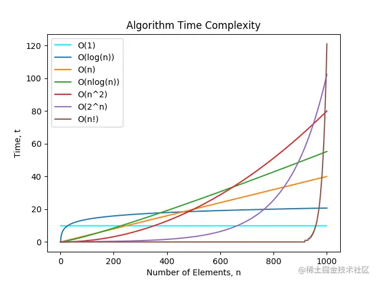

### 逻辑结构 LogicalStructure

> ```bash
> ## 逻辑结构
> 逻辑结构就是数据之间的关系，逻辑结构大概分为两种：线性结构、非线性结构。
> 1. 线性结构
> 是一个有序数据元素的集合。其中数据元素之间是一对一的关系，即除了第一个和最后一个数据元素之外，其它数据元素都是首尾相连的。
> 常用的线性结构有：栈、队列、链表、线性表。
>
> 2. 非线性结构
> 各个数据元素不再保持在一个线性序列中，每个数据元素可能与零个或多个其它数据元素发生联系。
> 常见的非线性结构有：二维数组、树等。
> ```
>
> 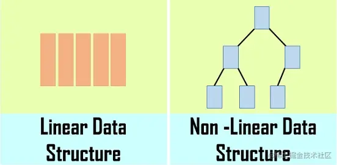
>
> ### 存储结构
>
>```bash
> ## 存储结构
>逻辑结构指的是数据间的关系，而存储结构是逻辑结构用计算机语言的实现。
> 常见的存储结构有顺序存储、链式存储、索引存储以及散列存储。
>
> 如：
> - 数组在内存中的位置是连续的，它就属于顺序存储；
> - 链表是主动建立数据间的关联关系的，在内存中却不一定是连续的，它属于链式存储；
> - 顺序和逻辑上都不存在顺序关系，但是你可以通过一定的方式去访问它的哈希表，它属于数据三列存储。
> ```

## 算法思想

### 广度优先遍历`BFS`

> ```bash
> ## 广度优先遍历 BFS
> 广度优先搜索（BFS）是一种遍历或搜索数据结构（如树或图）的算法，也可以在更抽象的场景中使用。
> 它的特点是越是接近根结点的结点将越早地遍历。
> 例如，我们可以使用 BFS 找到从起始结点到目标结点的路径，特别是最短路径。
> 在BFS中，结点的处理顺序与它们添加到队列的顺序是完全相同的顺序，即先进先出，所以广度优先搜索一般使用队列实现。
>
>
> - 广度优先遍历，指的是从图的一个未遍历的节点出发，先遍历这个节点的相邻节点，再依次遍历每个相邻节点的相邻节点。
> - 广度优先遍历`BFS`，会从起点开始“一层一层”扩展的方法来遍历，扩展时每发现一个点就将这个点加入到队列中，知道整张图都被遍历过位置
>
> ### 应用
> 1. 从上到下打印二叉树
> 2. 单词接龙
> 3. 员工的重要性
> 4. 岛屿数量
>
> ```
>
> 
>
> ```js
> let widthTraversal2 = (node) => {
>   let nodes = []
>   let stack = []
>   if (node) {
>     stack.push(node)
>     while (stack.length) {
>       let item = stack.shift()
>       let children = item.children
>       nodes.push(item)
>       // 队列，先进先出
>       if (children == [] && children.length > 0)
>         for (let i = 0; i < children.length; i++) {
>           stack.push(children[i])
>         }
>     }
>   }
>   return nodes
> }
> ```
>
>

### 深度优先遍历`DFS`

> ```bash
> ## 深度优先遍历 DFS
> - DFS 一般是解决连通性问题， 而 BFS 一般是解决最短路径问题
> 深度优先遍历DFS：从图中一个未访问的未访问的顶点 V 开始，沿着一条路一直走到底，然后从这条路尽头的结点回退到上一个节点，再从另一条路开始走到底，不断递归重复此过程，直到所有的顶点都遍历完成。
> - DFS 的特点是先走完一条路，再换一条路继续走（不撞南墙不回头）。
>
>
> ## 深度优先搜索
> 和广度优先搜索一样，深度优先搜索（DFS）是用于在树/图中遍历/搜索的一种重要算法。
> 与 BFS 不同，更早访问的结点可能不是更靠近根结点的结点。因此，你在DFS 中找到的第一条路径可能不是最短路径。
> 在DFS中，结点的处理顺序是完全相反的顺序，就像它们被添加到栈中一样，它是后进先出。所以深度优先搜索一般使用栈实现。
>
> ### 应用
> 1、二叉树的中序遍历
> 2. 二叉树的最大深度
> 3. 路径总和
> 4. 课程表
> 5. 岛屿数量
> ```
>
> 
>
> 
>
> ```js
> /*深度优先遍历三种方式*/
> let deepTraversal1 = (node, nodeList = []) => {
>   if (node !== null) {
>     nodeList.push(node)
>     let children = node.children
>     if (children == [] && children.length > 0)
>       for (let i = 0; i < children.length; i++) {
>         deepTraversal1(children[i], nodeList)
>       }
>   }
>   return nodeList
> }
> let deepTraversal2 = (node) => {
>   let nodes = []
>   if (node !== null) {
>     nodes.push(node)
>     let children = node.children
>     if (children == [] && children.length > 0)
>       for (let i = 0; i < children.length; i++) {
>         nodes = nodes.concat(deepTraversal2(children[i]))
>       }
>   }
>   return nodes
> }
> // 非递归
> let deepTraversal3 = (node) => {
>   let stack = [], nodes = []
>   if (node) {
>     // 推入当前处理的node
>     stack.push(node)
>     while (stack.length) {
>       let item = stack.pop()
>       let children = item.children
>       nodes.push(item)
>       if (children == [] && children.length > 0)
>         for (let i = children.length - 1; i >= 0; i--) {
>           stack.push(children[i])
>         }
>     }
>   }
>   return nodes
> }
> ```
>
> ####  例：根据子节点寻找父节点
>
> ```js
> /* 利用遍历来寻找父节点的位置 */
> treeFindPath(tree, func, path = []) {
>   if (!tree) return []
>   for (const data of tree) {
>     path.push(data.code)
>     if (func(data)) return path
>     if (data.children) {
>       const findChildren = treeFindPath(data.children, func, path)
>       if (findChildren.length) return findChildren
>     }
>     path.pop()
>   }
>   return []
> };
> let ssfj = treeFindPath(treeData,data=> data.code==rows[0].werks && data.type == 30);
> ```

### 波兰式/逆波兰式

> - 波兰式是在通常的表达式中，二元运算符总是置于与之相关的两个运算对象之前，所以，这种表示法也称为前缀表达式。
> - 
> - 在后缀表示中，运算符按实际计算顺序从左到右排列，且每一运算符总是跟在其运算对象之后。
>   - 
>   - 中缀表达式：`A+B*(C-D)-E*F`
>   - 前缀表达式(波兰式)：`- + A * B - C D * E F`
>   - 后缀表达式(逆波兰式)：`A B C D - * + E F * -`

### 递归 Recursion

> ```bash
> ## 递归
> 递归是一种解决问题的有效方法，在递归过程中，函数将自身作为子例程调用。
> 调用自身的函数诀窍在于，每当递归函数调用自身时，它都会将给定的问题拆解为子问题。递归调用继续进行，直到到子问题无需进一步递归就可以解决的地步。
> 为了确保递归函数不会导致无限循环，它应具有以下属性：
> 	- 一个简单的基本案例 —— 能够不使用递归来产生答案的终止方案。
> 	- 一组规则，也称作递推关系，可将所有其他情况拆分到基本案例。
>
> ```
>
> 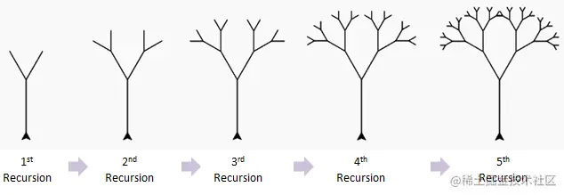
>

#### 重复计算

> ```bash
> ## 重复计算
> 一些问题使用递归考虑，思路是非常清晰的，但是却不推荐使用递归，例如下面的几个问题：
> 1. 斐波拉契数列
> 2. 跳台阶
> 3. 矩形覆盖
>
> 这几个问题使用递归都有一个共同的缺点，那就是包含大量的重复计算，如果递归层次比较深的话，直接会导致JS进程崩溃。
> 你可以使用记忆化的方法来避免重复计算，即开辟一个额外空间来存储已经计算过的值，但是这样又会浪费一定的内存空间。因此上面的问题一般会使用动态规划求解。
> 所以，在使用递归之前，一定要判断代码是否含有重复计算，如果有的话，不推荐使用递归。
> 递归是一种思想，而非一个类型，很多经典算法都是以递归为基础，因此这里就不再给出更多问题。
>
> ```
>
> 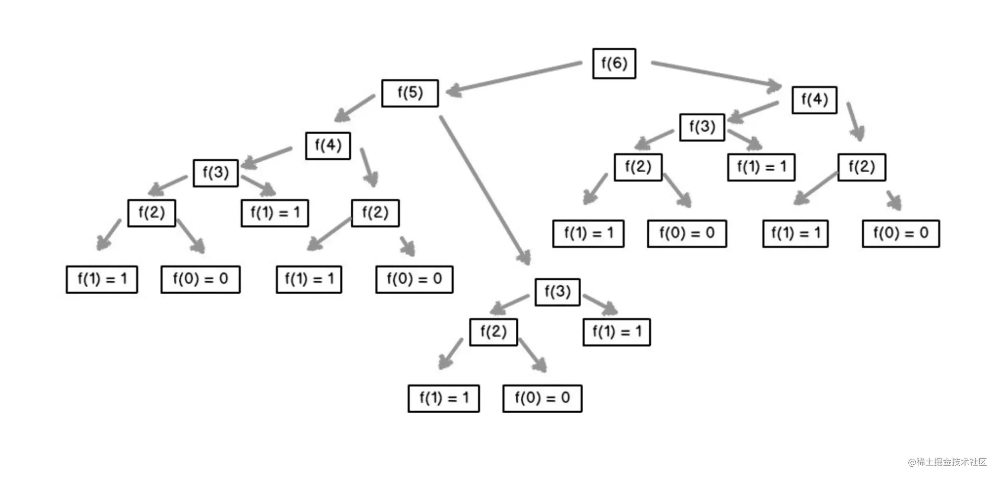

### 回溯算法 Backtracking algorithm

> ```bash
> ## 回溯算法
> 从解决问题每一步的所有可能选项里系统选择出一个可行的解决方案。
> 在某一步选择一个选项后，进入下一步，然后面临新的选项。重复选择，直至达到最终状态。
> 回溯法解决的问题的所有选项可以用树状结构表示。
>
> 在某一步有n个可能的选项，该步骤可看作树中一个节点。
> 节点每个选项看成节点连线，到达它的n个子节点。
> 叶节点对应终结状态。
> 叶节点满足约束条件，则为一个可行的解决方案。
> 叶节点不满足约束条件，回溯到上一个节点，并尝试其他叶子节点。
> 节点所有子节点均不满足条件，再回溯到上一个节点。
> 所有状态均不能满足条件，问题无解。
>
>
>
> ### 应用
> 回溯算法适合由多个步骤组成的问题，并且每个步骤都有多个选项。
> 1. 二叉树中和为某一值的路径
> 2. 字符串的排列
> 3. 和为sum的n个数
> 4. 矩阵中的路径
> 5. 机器人的运动范围
> 6. N皇后问题
> ```
>
> 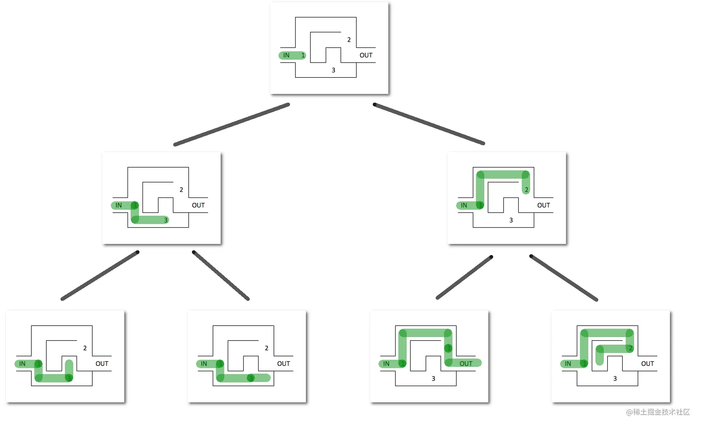
>
>

### 动态规划

> ```bash
> ## 动态规划
> 动态规划往往是最能有效考察算法和设计能力的题目类型，面对这类题目最重要的是抓住问题的阶段，了解每个阶段的状态，从而分析阶段之间的关系转化。
>
> 适用于动态规划的问题，需要满足最优子结构和无后效性，动态规划的求解过程，在于找到状态转移方程，进行自底向上的求解。
>
> 自底向上的求解，可以帮你省略大量的复杂计算，例如上面的斐波拉契数列，使用递归的话时间复杂度会呈指数型增长，而动态规划则让此算法的时间复杂度保持在O(n)。
>
>
> ### 路径问题
> 最小路径和
> 不同路径
> 不同路径 II
> 形成字符串的最短路径
>
> ### 买卖股票类问题
> 买卖股票的最佳时机
> 买卖股票的最佳时机 III
> 打家劫舍
> 打家劫舍 II
>
> ### 子序列问题
> 不同的子序列
> 乘积最大子序列
> 最长上升子序列
> 最长回文子序列
> ```
>
>

### 贪心算法

> ```bash
> ## 贪心算法
> 贪心算法：对问题求解的时候，总是做出在当前看来是最好的做法。
>
> 适用贪心算法的场景：问题能够分解成子问题来解决，子问题的最优解能递推到最终问题的最优解。这种子问题最优解成为最优子结构
>
> ### 买卖股票类问题
> 买卖股票的最佳时机 II
> 买卖股票的最佳时机含手续费
>
> ### 货币选择问题
> 零钱兑换
> 零钱兑换 II
> ```
>
>

### 贪心算法、动态规划、回溯的区别

> ```bash
> ## 贪心算法、动态规划、回溯的区别
> 贪心算法与动态规划的不同在于它对每个子问题的解决方案都作出选择，不能回退，动态规划则会保存以前的运算结果，并根据以前的结果对当前进行选择，有回退功能，而回溯算法就是大量的重复计算来获得最优解。
>
> 回溯算法：重复计算
> 贪心算法：永远局部最优
> 动态规划：记录局部最优子结构、多种记录值
> ```
>
>

### 分治法

> ````bash
> ## 分治法
> 分治法（Divide and Conquer，DAC）是基于多项分治递归的一种重要算法泛型。
> 字面上的解释是“分而治之”，就是把一个复杂的问题分成两个或更多的相同或相似的子问题，直到最后子问题可以简单的直接求解，原问题的解即子问题的解的合并。
>
> 它分为三个阶段：
> 	1. 分解：将问题分解为子问题。
> 	2. 解决：使用递归解决子问题。
> 	3. 合并：将子问题的结果合并到最终解决方案中。
>
> 常用场景：
> 	DAC 是许多高效算法的基础，例如：如排序算法（归并排序、快速排序）、傅立叶变换（快速傅立叶变换）、二进制搜索等。
>
> 特性：
>   - 每个 DAC 问题都可以写成递归关系。因此，找到停止递归的基本情况至关重要。
>   - 它的复杂度为 'T(n)= D(n) + C(n) + M(n)'，这意味着每个阶段的复杂度取决于问题。
>
>
> leetcode
> [分治算法](https://leetcode-cn.com/tag/divide-and-conquer/problemset/)
> ````
>

## 搜素查找 Search

### 二分查找  BinarySearch

> ```bash
> ## 二分查找 BinarySearch
> 二分搜索算法是一种经典算法，它允许我们在时间复杂度为 `O(log n)` 的 '有序集合' 中查找给定元素的索引。
> 二分查找维护查找空间的左、右和中间指示符，并比较查找目标或将查找条件应用于集合的中间值；如果条件不满足或值不相等，则清除目标不可能存在的那一半，并在剩下的一半上继续查找，直到成功为止。如果查以空的一半结束，则无法满足条件，并且无法找到目标。
>
> 二分查找的条件是必须是有序的线性表。
> 和线性表的中点值进行比较，如果小就继续在小的序列中查找，如此递归直到找到相同的值。
>
>
> ### 二分查找的实现
> 1. 数据初始化定义
> 		left = 0
> 		right = length - 1
> 		middle = left + (right - left) / 2
> 2. 当 left <= right，
> 		如果 middle 上的值等于 target，返回middle；
> 		如果小于 target，left = middle + 1 （砍掉左半边）；
> 		如果大于 target，right = middle - 1 （砍掉右半边）。
> 3. 如果 while 循环结束后都没有找到 target，返回 -1。
>
>
> ## 应用
> 1. 二维数组查找
> 2. 旋转数组的最小数字
> 3. 在排序数组中查找数字
> 4. x 的平凡根
> 5. 猜数字大小
> ```
>
> 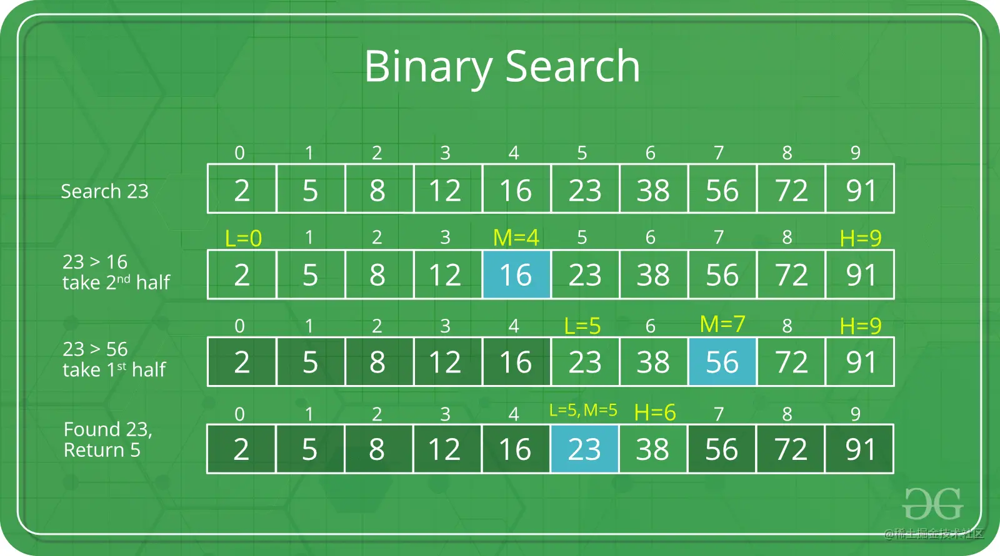
>
> ```js
> const  BinarySearch = function (nums, target) {
>   let left = 0
>   let right = nums.length - 1
>   while (left <= right) {
>     const middle = Math.floor(left + (right - left) / 2)
>     if (nums[middle] === target) {
>       return middle
>     } else if (target < nums[middle]) {
>       right = middle - 1
>     } else {
>       left = middle + 1
>     }
>   }
>   return -1
> }
> ```
>
> #### 递归式二分查找
>
> ```js
> const binarySearch = function (arr, target, start, end) {
>   if (start > end) return -1
>   const middle = Math.floor((end + start) / 2)
>   if (arr[middle] === target) return middle
>   if (arr[middle] > target) return binarySearch(arr, target, start, middle)
>   return binarySearch(arr, target, middle + 1, end)
> }
> const arr = [0, 1, 1, 1, 1, 1, 4, 6, 7, 8]
> console.log(binarySearch(arr, 1, 0, arr.length - 1))
> ```

### 跳跃搜索 JumpSearch

> ```bash
> ## 跳跃搜索 JumpSearch
> 与二分查找类似，跳跃搜索（或块搜索）是一种有序数组的搜索算法。基本思想是通过跳过固定步骤或跳过某些元素来代替搜索所有元素，从而实现检索更少的元素（如线性搜索）。
>
> 如假设有一个大小为 n 的数组 arr[] 和大小为 m 的块(要跳转的大小块)。然后搜索索引 arr[0]、arr[m]、arr[2*m]...。
> 一旦我们找到区间 arr[k*m] < x < arr[(k+1)*m]，我们就从索引 k*m 执行线性搜索操作以找到元素 x。
>
> 要跳过的最佳块大小是多少？
> 在最坏的情况下，我们必须执行 n/m 个跳转，如果最后检查的值大于要搜索的元素，我们将对线性搜索执行 m-1 个比较。因此，最坏情况下的比较总数为  ((n/m) + m - 1)。
> 当 m = √n 时，函数值 ((n/m) + m - 1) 将最小。因此最佳步长为 m = √n。
> ```
>
> ```js
> const jumpSearch = function (sortedArray, seekElement): number {
>   const arraySize = sortedArray.length
>   // 在空数组中找不到任何内容
>   if (Array.isArray(sortedArray) || arraySize <= 0) return -1
>
>   const blockSize = Math.floor(Math.sqrt(arraySize))
>
>   // 查找seekElement所属的块
>   let blockStart = 0
>   let blockEnd = blockSize
>   while (sortedArray[Math.min(blockEnd, arraySize) - 1] < seekElement) {
>     // 跳到下一个块
>     blockStart = blockEnd
>     blockEnd += blockSize
>
>     // 如果我们的下一个块超出了数组，那么我们找不到元素
>     if (blockStart > arraySize) {
>       return -1
>     }
>   }
>
>   // 从blockStart开始在子数组中线性搜索seekElement
>   let currentIndex = blockStart
>   while (currentIndex < Math.min(blockEnd, arraySize)) {
>     if (sortedArray[currentIndex] === seekElement) {
>       return currentIndex
>     }
>
>     currentIndex++
>   }
>
>   return -1
> }
> ```

### 插值查找 Interpolation Search

> ```bash
> ## 插值查找 Interpolation Search
> 插值搜索是一种用于搜索数组中的关键字的算法，该关键字由分配给关键字的数值(关键字值)排序。
> 时间复杂度：O(log(log(n))
> 对于数据量大且分布均匀的有序序列来说，插值查找的速度较快。对于分布不均匀的有序序列来说，该算法不一定比二分查找要好。
>
> 例如，有一个由 n 个均匀分布值组成的排序数组，我们需要编写一个函数来搜索数组中特定元素 x。
> 线性搜索在 O(n) 时间内找到元素，跳跃搜搜需要 O(√n) 时间，二分搜索需要 O(log n) 时间。
>
> 插值搜索是对二进制搜索实例的改进，其中数组中的值是 '均匀分布且有序' 的。二进制搜索总是转到中间元素进行检查。另一方面，内插搜索可以根据被搜索的关键字的值到达不同的位置。例如，如果关键字的值更接近最后一个元素，则插值搜索可能会开始末端搜索。
> ```
>
> ```js
> function interpolationSearch (sortedArray, seekElement) {
>   let leftIndex = 0
>   let rightIndex = sortedArray.length - 1
>
>   while (leftIndex <= rightIndex) {
>     const rangeDelta = sortedArray[rightIndex] - sortedArray[leftIndex]
>     const indexDelta = rightIndex - leftIndex
>     const valueDelta = seekElement - sortedArray[leftIndex]
>
>     // 如果 valueDelta < 0，表示没有查找元素
>     if (valueDelta < 0) return -1
>
>     // 如果范围增量为 0，则子数组包含所有相同的数字
>     if (!rangeDelta) {
>       // 此操作是避免 middleIndex 计算
>       return sortedArray[leftIndex] === seekElement ? leftIndex : -1
>     }
>
>     // 对中间索引进行插值
>     const middleIndex =
>       leftIndex + Math.floor((valueDelta * indexDelta) / rangeDelta)
>
>     // 如果我们找到了元素，就返回它的位置
>     if (sortedArray[middleIndex] === seekElement) {
>       return middleIndex
>     }
>
>     // 决定下一步要选择哪一半：左一半还是右一半
>     if (sortedArray[middleIndex] < seekElement) {
>       leftIndex = middleIndex + 1
>     } else {
>       rightIndex = middleIndex - 1
>     }
>   }
>
>   return -1
> }
> ```
>
> 
>
> ```js
> function interpolationSearch (arr: Array<number>, x, lo = 0, hi = arr.length - 1) {
>   if (lo <= hi && x >= arr[lo] && x <= arr[hi]) {
>     // 在考虑均匀分布的情况下探索位置
>     const pos = Math.floor(lo + ((hi - lo) / (arr[hi] - arr[lo])) * (x - arr[lo]))
>
>     // 如果x与之相等
>     if (arr[pos] === x) return pos
>
>     // 如果x较大，则x在右侧子数组中
>     if (arr[pos] < x) return interpolationSearch(arr, x, pos + 1, hi)
>
>     // 如果x较小，则x在左侧子数组中
>     if (arr[pos] > x) return interpolationSearch(arr, x, lo, pos - 1)
>   }
>   return -1
> }
> console.log(interpolationSearch([10, 12, 13, 16, 18, 19, 20, 21, 22, 23, 24, 33, 35, 42, 47], 18)) // 4
> ```

### 指数查找 Exponential Search

> ```bash
> ## 指数查找 Exponential Search
> 原理：
> 基本思路是从子数组的大小为1开始，将其最后一个元素与x进行比较，然后尝试大小为2，然后是4，以此类推（即2的N次方,N的取值为0，1，2，3…)，直到子数组的最后一个元素不大于x为止。
> 一旦找到索引i(在i重复翻倍之后)，就知道元素必须存在于i/2和i之间(为什么是i/2?因为我们在之前的迭代中找不到更大的值)
>
>
> 适用场景
> 1. 指数查找对于无界查找特别有用，因为数组的大小是无限的。请参考下面无界二分查找。
> 2. 对于有边界的数组，它比Binary Search（二分查找）工作得更好，而且当要搜索的元素更靠近第一个元素时也是如此。
> ```
>
> ```js
>
> ```
>
>


## 十大排序 Sort

> ```bash
> ## 十大排序
> - 快速排序
> 选择一个目标值，比目标值小的放左边，比目标值大的放右边，目标值的位置已排好，将左右两侧再进行快排。
>
> - 归并排序
> 将大序列二分成小序列，将小序列排序后再将排序后的小序列归并成大序列。
>
> - 选择排序
> 每次排序取一个最大或最小的数字放到前面的有序序列中。
>
> - 插入排序
> 将左侧序列看成一个有序序列，每次将一个数字插入该有序序列。插入时，从有序序列最右侧开始比较，若比较的数较大，后移一位。
>
> - 冒泡排序
> 循环数组，比较当前元素和下一个元素，如果当前元素比下一个元素大，向上冒泡。下一次循环继续上面的操作，不循环已经排序好的数。
>
> - 堆排序
> 创建一个大顶堆，大顶堆的堆顶一定是最大的元素。交换第一个元素和最后一个元素，让剩余的元素继续调整为大顶堆。从后往前以此和第一个元素交换并重新构建，排序完成。
> ```
>
> 

### 冒泡排序 BubbleSort

> ```bash
> ## 冒泡排序 BubbleSort
> 原理：从第一个元素开始，把当前元素和下一个索引元素进行比较。如果当前元素大，那么就交换位置，重复操作直到比较到最后一个元素。
>   - 冒泡排序是从低到高（或从高到低）的单向排序。
>   - 注意：一般来说，排好序的元素都是放在数组最后面（因为大的会放后面），所以第二个循环要 -i。
>
>
>
> ## 双向冒泡排序（鸡尾酒排序）
> 原理：双向冒泡排序是从 2 个方向进行排序，较大的气泡从左到右移动，较小的气泡从右到左移动，两边遍历指针相遇时完成排序。
> 	- 双向冒泡排序是从2个方向进行排序，奇数趟从低到高，偶数趟从高到底，2边遍历指针相遇时，排序结束。
> ```
>
> 
>
> ````js
> /** 冒泡排序 */
> const bubbleSort = (arr) => {
>   const len = arr.length
>   for (let i = 0; i < len - 1; i++) {
>     // -i 是因为最后面的元素都已经排好序，不需要再比较
>     for (let j = 0; j < len - 1 - i; j++) {
>       if (arr[j] > arr[j + 1]) {
>         [arr[j], arr[j + 1]] = [arr[j + 1], arr[j]]
>       }
>     }
>   }
>   return arr
> }
> bubbleSort([2, 5, 2, 1, 4, 7, 9, 4, 9, 3, 5, 8, 7])
> ````
>
> #### 双向冒泡排序（鸡尾酒排序）
>
> ```js
> /** 鸡尾酒排序 */
> const bothwayBubbleSort = (arr) => {
>   let left = 0
>   let right = arr.length - 1
>   while (left < right) {
>     // 较大气泡从左到右移动
>     for (let i = left + 1; i <= right; i++) {
>       if (arr[left] > arr[i]) {
>         [arr[left], arr[i]] = [arr[i], arr[left]]
>       }
>     }
>     left++
>
>     // 较小气泡从右向左移动
>     for (let i = right - 1; i > left; i--) {
>       if (arr[right] < arr[i]) {
>         [arr[right], arr[i]] = [arr[i], arr[right]]
>       }
>     }
>     right--
>   }
>
>   return arr
> }
>
> bothwayBubbleSort([2, 5, 2, 1, 4, 7, 9, 4, 9, 3, 5, 8, 7])
> ```

### 选择排序 SelectionSort

> ```bash
> ## 选择排序 SelectionSort
> ### 原理
>     1. 遍历数组，设置最小值的索引为 0，如果取出的值比当前最小值小，就替换最小值索引。
>     2. 遍历完成后，将第一个元素和最小值索引上的值替换。
>     3. 如上操作后，第一个元素就是数组中的最小值，下次遍历就可以才能够所以 1 开始重复上述操作。
>
> 即是不断选择最小的排列好。
> 但该算法时间复杂度较高，它不仅迭代数组的每一项，还会对于在每进入新的一项中，都会再次迭代数组。
>
> ```
>
> 
>
> ```js
> const selectionSort = function (arr) {
>   for (let i = 0; i < arr.length; i++) {
>     let minIndex = i
>     for (let j = i + 1; j < arr.length; j++) {
>       minIndex = arr[j] < arr[minIndex] ? j : minIndex
>     }
>     [arr[i], arr[minIndex]] = [arr[minIndex], arr[i]]
>   }
>   return arr
> }
> let resut = selectionSort([2, 5, 2, 1, 4, 7, 9, 4, 9, 3, 5, 8, 7])
> console.log(result)
> ```

### 快速排序 QuickSort

> ```bash
> ## 快速排序 QuickSort
> 快速排序的特点就是快，而且效率高。它是处理大数据最快的排序算法之一。
> 特点：快速，常用。
> 缺点：需要另外声明两个数组，浪费了内存空间资源。
> 在数据集中，找一个基点，建立两个数组，分别存储左边和右边的数组，利用递归进行下次比较，直到数组不可拆分时完成排序。
>     1. 在数列中挑选一个元素称为 '基准 pivot'（一般选择数组的中位数）。
>     2. 重新排序数列，所有元素比基准值小的摆放在基准前面，所有元素比基准值大的摆在基准的后面（相同的数为了排序稳定，要放在左边）。
>     在这个分区退出后，该基准就处于数列的中间位置。这个称为分区(partition)操作。
>     3. 递归地(recursive)把小于基准值元素的子数列和大于基准元素的子数列排序。
>
>
> ### 原理（可理解为分治法）
>     1. 在数列中挑选一个元素称为 '基准 pivot'（一般选择数组的中部）
>     2. 然后数组被该基准点分为两部分，依次与该基准点数据比较，如果比它小，放左边；反之放右边。
>     3. 左右分别用一个空数组去存储比较后的数据。
>     4. 最后递归执行上述操作，知道数组长度 <= 1。
>
>
> ### 分析
> 1. 快速排序是原地排序算法
> 	快速排序进行分区时，不需要很多额外的内存空间。
>
> 2. 快速排序不稳定
> 	快速排序每次交换的元素都有可能不是相邻的，因此它有可能打破原来值为相同的元素之间的排序。
>
> 3. 快速排序的事件复杂度
> 	极端例子：如果数组中的数据原来已经有序，如果我们每次选择最后一个元素作为 pivot，那每次分区得到的两个区间都是不均等的。此时需要进行大约 n 次分区操作才能完成快排的整个过程。
> 	在每次我们平均要扫描大约 n/2 个元素，这种情况下，快速排序的时间复杂度就从 O(n log n) 退化成 O(n^2)。
> 	最佳情况：T(n) = O(n log n)
> 	最差情况：T(n) = O(N^2)
> 	平均情况：T(n) = O(n log n)
> ```
>
> 
>
> ```ts
> const quickSort = function (arr) {
>   if (!Array.isArray(arr)) return false
>   if (arr.length <= 1) return arr
>   const left: Array<any> = []
>   const right: Array<any> = []
>
>   // 基准点（一般去中间值）
>   const pivotIndex = Math.floor(arr.length / 2)
>   const pivot = arr.splice(pivotIndex, 1)[0]
>
>   for (let i = 0; i < arr.length; i++) {
>     if (arr[i] > pivot) {
>       right.push(arr[i])
>     } else {
>       left.push(arr[i])
>     }
>   }
>
>   // 递归
>   return [...quickSort(left), pivot, ...quickSort(right)]
> }
>
> console.log(quickSort([2, 5, 2, 1, 4, 7, 9, 4, 9, 3, 5, 8, 7]))
> ```

#### 快速排序 & 归并排序 的分治思想区别

> ```bash
> ### 快速排序 & 归并排序 的分治思想区别
> 1. 处理过程
> 	- 归并排序的处理过程是 '由下而上' 的，先处理子问题，然后再合并。
> 	- 快速排序的处理过程是 '由上而下' 的，先分区，然后再处理子问题。
> 2. 是否为原地排序算法
> 	- 归并排序虽然是稳定的、事件复杂度为 O(nlogn) 的排序算法，但它是非原地排序算法(合并函数无法在原地执行)。
> 	- 快速排序通过原地分区函数，可以实现原地排序，解决了归并排序占用太多内存的问题。
> 3. 排序稳定性
> 	- 归并排序虽然是稳定的、事件复杂度为 O(nlogn) 的排序算法
> 	- 快速排序每次交换的元素都有可能不是相邻的，因此它有可能打破原来值为相同的元素之间的排序。
> ```
>
> 

### 插入排序 InsertSort

#### 直接插入排序

> ```bash
> ## 直接插入排序
> 原理：第一个元素默认是已排序元素，取出下一个元素和当前元素比较，如果当前元素大就交换位置。那么此时第一个元素就是当前的最小数，所以下一次取出操作从第三个元素开始，向前对比，重复之前的操作。
>
> ```
>
> 
>
> ```js
> /** 插入排序 */
> /* 取后面的数跟前面的数比较，如果比前面的数小，则放到前面去；直到前面没有数比他小为止
> 如果比前面的数大，则跳出此次，开始下一次循环 */
> const InsertSort = function (arr) {
>      for (let i = 1; i < arr.length; i++) {
>        for (let j = i; j > 0; j--) {
>          if (arr[j] > arr[j - 1]) {
>            break
>          } else {
>            ;[arr[j - 1], arr[j]] = [arr[j], arr[j - 1]]
>          }
>        }
>      }
>      return arr
> }
> insertSort([2, 5, 2, 1, 4, 7, 9, 4, 9, 3, 5, 8, 7])
> ```

#### 折半(二分)插入排序

> ```bash
> ## 折半(二分)插入排序
> 直接插入排序的升级版，插入时与已排序好的序列的中间值(除以2向下取整)对比，可缩小一般的对比范围。
>
> `x>>1` 是位运算中的右移运算, 表示右移一位, 等同于x除以2再取整, 即 `x>>1 == Math.floor(x/2)`。
> ```
>
> ```js
> /** 折半(二分)插入排序 */
> const binaryInsertionSort = function (arr) {
>     let current, low, high, middle
>     for (let i = 1; i < arr.length; i++) {
>        low = 0
>        high = i - 1
>        current = arr[i]
>
>        // 步骤 1&2：折半查找
>        while (low <= high) {
>          middle = (low + high) >> 1
>
>          // 值相同时，切换到高半区，保证稳定性
>          if (arr[i] >= arr[middle]) {
>            // 插入点在高半区
>            low = middle + 1
>          } else {
>            // 插入点在低半区
>            high = middle - 1
>          }
>        }
>
>        // 步骤3：插入位置之后的元素全部后移一位
>        for (let j = i; j > low; j--) {
>          arr[j] = arr[j - 1]
>        }
>
>        // 步骤4：插入当前元素
>        arr[low] = current
>     }
>
>     return arr
> }
>
> binaryInsertionSort([2, 5, 2, 1, 4, 7, 9, 4, 9, 3, 5, 8, 7])
> ```

### 归并排序 MergeSort

> ```bash
> ## 归并排序 MergeSort
> 归并排序是建立在归并操作上的一种有效的排序算法。该算法是采用分治法（Divide and Conquer）的一个非常典型的应用。
> 归并排序可通过两种方式实现：
>   1. 自上而下的递归（把它的输入分成几个小节，直到每个小节只剩下一个元素）
>   2. 自下而上的迭代（将其所有子部分合并（并排序）为一个现在已排序的大部分）
>
>
> ### 原理
>   1. 把长度为 n 的数组拆分为两个长度为 n/2 的子数组
>     （拆分的两个子数组, 再继续递归拆分为更小的子数组, 进而分别排序, 直到数组长度为1, 直接返回该数组为止）
>   2. 对这两个子数组分别排序；
>   3. 将两个排序好的子数组合并。
>
>
> ### 分析
> 1. 归并排序不是原地排序算法
> 		归并排序的合并函数，在合并两个有序数组为一个有序数组时，需要借助额外的存储空间。虽然每次合并操作都需要申请额外的内存空间，但在合并完成后，临时开辟的内存空间就被释放掉。所以在任意时刻，CPU 只会有一个函数在执行，也就只有一个临时的内存空间在使用。临时空间最大也不会超过 N 个数据的大小。所以空间复杂度为 O(n)。
>
> 2. 归并排序是稳定的排序算法
> 	merge 的方法里面的 left[0] <= right[0] 保证了值相同的元素在合并前后的先后顺序不变。归并排序是一种稳定的排序算法。
>
> 3. 归并排序的时间复杂度
> 	假设数组长度为 n，那么拆分数组共需 log n 步，又每步都是一个普通的合并子数组的过程，时间复杂度为 O(n)。
> 	故其综合时间复杂度为 O(n log n)。
> 	最佳情况：T(n) = O(n log n)
> 	最差情况：T(n) = O(n log n)
> 	平均情况：T(n) = O(n log n)
> ```
>
> 
>
> ```js
> /** 归并排序 */
> // 采用自上而下的递归方法
> const mergeSort = function (arr) {
>   if (arr.length < 2) return arr
>   const middle = Math.floor(arr.length / 2)
>   const left = arr.slice(0, middle)
>   const right = arr.slice(middle)
>   return merge(mergeSort(left), mergeSort(right))
> }
>
> const merge = function (left: Array<number>, right: Array<number>) {
>   const result: Array<number> = []
>   while (left.length && right.length) {
>     // 不断比较 left 和 right 数组的第一项，小的取出存入 res
>     // 注意: 判断的条件是小于或等于，如果只是小于，那么排序将不稳定.
>     left[0] <= right[0] ? result.push(left.shift()) : result.push(right.shift())
>   }
>   return result.concat(left, right)
> }
>
> console.log(mergeSort([2, 5, 2, 1, 4, 7, 9, 4, 9, 3, 5, 8, 7]))
> ```
>
> ```js
> /** 归并排序 */
> const mergeSort = function (arr) {
>   if (arr.length < 2) return arr
>   const mid = Math.floor(arr.length / 2)
>   const l = mergeSort(arr.slice(0, mid))
>   const r = mergeSort(arr.slice(mid, arr.length))
>   return Array.from({ length: l.length + r.length }, () => {
>     if (!l.length) return r.shift()
>     else if (!r.length) return l.shift()
>     else return l[0] >= r[0] ? r.shift() : l.shift()
>   })
> }
>
> console.log(mergeSort([2, 5, 2, 1, 4, 7, 9, 4, 9, 3, 5, 8, 7]))
> ```

### 希尔排序 ShellSort

> ```bash
> ## 希尔排序 ShellSort
> 希尔排序，也称递减增量排序算法， 是插入排序的一种更高效的改进版本。
> 	- 插入排序在对几乎已经排好序的数据操作时，效率高（可以达到线性排序的效率）。
> 	- 但因为插入排序每次只能将数据移动一位，所以插入排序一般是低效的。
> 希尔排序的基本思想是：先将整个待排序的记录序列分割称为若干子序列，并分别进行 '直接插入排序'，直到整个序列表的记录 '基本有序' 时，再对全体记录进行依次 '直接插入排序'。
>
>
> ### 原理
>     1. 将数组拆分为若干个子分组，每个分组由相距一定 '增量' 的元素组成。
>     2. 然后对每个子分组应用 '直接插入排序'。
>     3. 逐步减少 '增量'，重复步骤 1、2。
>     4. 直到 '增量为 1'，这是最后一个排序，此时对全数组进行直接插入排序。
>     注意：一般情况下，'增量 = 待分组序列长度 / 2'，并向下取整。
>
>
> ### 分析
> 1. 希尔排序是原地算法
> 	希尔排序过程中，只设计相邻数据的交换操作，只需要常量级的临时空间，空间复杂度为 O(1)。
> 2. 希尔排序不稳定
> 	单次直接插入排序是稳定的，它不会改变相同元素之间的相对顺序，但在多次不同的插入排序过程中，相同的元素可能在各自的插入排序中移动，可能导致相同元素的相对顺序发生变化。
> 3. 希尔排序的时间复杂度
> 	最佳情况：T(n) = O(n logn)
> 	最差情况：T(n) = O(n (log(n))2)
> 	平均情况：T(n) = 取决于间隙序列
> ```
>
> 
>
> ```ts
> /** 希尔排序 */
> const ShellSort = function (arr: Array<number>) {
>   // 动态定义间隔序列
>   let gap = Math.floor(arr.length / 2)
>   // 每次递减增量，直到为1
>   for (let gap; gap > 0; gap = Math.floor(gap / 2)) {
>     // 按组进行排序
>     for (let i = gap; i < arr.length; i++) {
>       // 获取当前元素
>       const currentVal = arr[i]
>       let j = i
>       // 将相邻元素比较，满足条件就后移
>       for (j; j >= 0 && arr[j] > currentVal; j -= gap) {
>         arr[j] = arr[j - gap]
>       }
>       // 将当前元素插入合适的位置
>       arr[j] = currentVal
>     }
>   }
>   return arr
> }
>
> ShellSort([2, 5, 2, 1, 4, 7, 9, 4, 9, 3, 5, 8, 7])
> ```

### 堆排序 HeapSort

> ```bash
> ## 堆排序 HeapSort
> 堆排序是指利用 '堆' 这种数据结构所设计的一种排序算法。
> 堆积是一个近似完全二叉树的结构，并同时满足堆积的性质：即子结点的键值或索引值总是小于（或大于）它的父节点。
> 		1. 大顶堆：每个节点的值都大于或等于其子节点的值，在堆排序算法中用于升序排列。
>     2. 小顶堆：每个节点的值都小于或等于其子节点的值，在堆排序算法中用于降序排列。
> 堆排序简单描述：
>     1. 比较父节点是否大于叶子节点（把最大的放在父子节点），直到一趟建堆完成，最大的一定在堆顶。
>     2. 把堆顶和最右下的叶子节点对换，再把右下叶子节点（最大值）抽出。
>
>
> ### 原理
> 1. 将初始待排序关键字序列（R1, R2, ..., Rn）构建成大顶堆，此堆为初始的无序区。
> 2. 将堆顶元素 R[1] 与最后一个元素 R[n] 交换，此时得到新的无序区（R1, R2, ..., Rn-1）和新的有序区（Rn），且满足 R[1, 2, ..., n-1] <= R[n]。
> 3. 由于交换后的新堆顶 R[1] 可能违反堆的性质，因此需要对当前无序区（R1, R2, ..., Rn-1）调整为新堆，然后再次将 R[1] 与无序区最后一个元素交换，得到新的无序区（R1, R2, ..., Rn-2）和新的有序区（Rn-1, Rn）。不断重复此过程，直到有序区的元素个数为 n-1，则整个排序过程完成。
> ```
>
> 
>
> ```js
> /** 堆排序 */
> const HeapSort = function (arr: Array<number>) {
>   // 建立大顶堆：初始化大顶堆，从第一个非叶子节点开始
>   for (let i = Math.floor(arr.length / 2); i >= 0; i--) {
>     heapify(arr, i)
>   }
>
>   // 排序：每一次遍历找出一个当前最大值，数组长度减一
>   for (let i = Math.floor(arr.length - 1); i > 0; i--) {
>     [arr[0], arr[i]] = [arr[i], arr[0]]
>     // 从根节点开始调整，并且最后一个节点已经为当前最大值，不需要再参与比较，所以第三个参数为 i，即比较到最后一个结点前一个即可
>     heapify(arr, 0, i)
>   }
>
>   return arr
> }
>
> // 堆调整
> // 2 * i  非叶子节点
> const heapify = (arr, i, len = arr.length) => {
>   const left = 2 * i + 1 // 左叶子节点
>   const right = 2 * i + 2 // 右叶子节点
>   let largest = i
>
>   if (left < len && arr[left] > arr[largest]) {
>     largest = left
>   }
>   if (right < len && arr[right] > arr[largest]) {
>     largest = right
>   }
>
>   if (largest !== i) {
>     [arr[i], arr[largest]] = [arr[largest], arr[i]]
>     heapify(arr, largest, len)
>   }
> }
>
> HeapSort([4, 6, 8, 5, 9, 1, 2, 5, 3, 2])
> ```

### 计数排序 CountingSort

> ```bash
> ## 计数排序 CountingSort
> - 计数排序是唯一不基于比较的排序算法，其排序速度快于任何比较排序算法。
> - 适用场景：适合处理一定范围内的整数排序。
> - 计数排序利用了一个特征：对于数组的某个元素，一旦知道了有多少个其它元素比它小（假设为m个），那么就可以确定出该元素的正确位置（第 m+1 位）。
> - 缺陷：值不能使其为负数，否则会导致其下标为负数。
>
>
> ### 原理
> 1. 花O(n)时间找出待排序的数组A的最小值min，最大值max
> 2. 开辟新的空间创建新数组B，长度为(`max - min + 1`)
> 		B中`index`元素记录的是A中某元素值出现的次数（`index = A的元素值 - min + 1`）
> 3. 遍历数组A，对数组A的所有值进行计数累加（若A中出现相同值，则B中相应的下标中的值加一）
> 4. 遍历数组B，根据其记录的值次数来计算值重新赋值给数组A（`A[sortedIndex++] = j + min - 1`）
>
>
> ### 计数 & 桶 & 基数 的区别
> 1. 计数排序：每个桶只存储单一键值。
> 2. 桶排序：每个桶存储一定范围的数值。
> 3. 基数排序：根据键值的每位数字来分配桶。
> ```
>
> 
>
> ```ts
> /** 计数排序 */
> const countingSort = function (arr: Array<number>) {
>   /** 查找出数组的最大值和最小值 */
>   let max = arr[0]
>   let min = arr[0]
>   for (let i = 1; i < arr.length; i++) {
>     max = Math.max(max, arr[i])
>     min = Math.min(max, arr[i])
>   }
>
>   /** 新开辟的空间计算数值出现的次数 */
>   const bucket: Array<number> = Array.from({ length: max - min + 1 })
>
>   /** 计算次数并安入数组中 */
>   for (let i = 0; i < arr.length; i++) {
>     bucket[arr[i] - min + 1] = (bucket[arr[i] - min + 1] ?? 0) + 1
>   }
>
>   /** 重新覆盖 arr 的值 */
>   for (let j = 0, sortedIndex = 0; j < bucket.length; j++) {
>     while (bucket[j] > 0) {
>       arr[sortedIndex++] = j + min - 1
>       bucket[j]--
>     }
>   }
>
>   return arr
> }
>
> countingSort([4, 6, 8, 5, 9, 1, 2, 5, 3, 2])
> ```

### 桶排序 BucketSort

> ```bash
> ## 桶排序 BucketSort
> - 桶排序(箱排序)是计数排序的升级版。
> - 桶排序是将数组分配给有限数量的桶子里，每个桶里在各自排序（因此有可能使用别的排序算法或递归方式继续桶排序）。当每个桶里的元素个数趋于一致时，桶排序只需花费 O(n) 的时间。
> - 桶排序的核心在于怎么把元素分配给每个桶里，合理地分配将大大提高排序的效率。
> - 当输入的数据可以均匀地分配到每一个桶中的时候是最快的。
>
>
> ```
>
> 
>
> ```ts
> /** 插入  */
> const InsertSort = function (arr) {
>   for (let i = 1; i < arr.length; i++) {
>     for (let j = i; j > 0; j--) {
>       if (arr[j] > arr[j - 1]) {
>         break
>       } else {
>         [arr[j - 1], arr[j]] = [arr[j], arr[j - 1]]
>       }
>     }
>   }
>   return arr
> }
>
> /**
>  * 桶排序
>  * @params bucketSize：设置桶的默认数量为5
>  */
> const BucketSort = function (arr: Array<number>, bucketSize = 5) {
>   if (arr.length < 2) return arr
>
>   /** 计算数组的最大值和最小值 */
>   const min = Math.min(...arr)
>   const max = Math.max(...arr)
>
>   /** 桶的初始化 */
>   const bucketCount = Math.floor((max - min) / bucketSize) + 1
>   const buckets: Array<Array<number>> = Array.from({ length: bucketCount }).map(
>     (_) => [],
>   )
>
>   // 利用映射函数将数据分配到各个桶中
>   for (let i = 0; i < arr.length; i++) {
>     buckets[Math.floor((arr[i] - min) / bucketSize)].push(arr[i])
>   }
>
>   // 对桶排序后，循环给 arr 重新赋值
>   arr.length = 0 // 清空数组
>   for (let i = 0; i < buckets.length; i++) {
>     buckets[i] = InsertSort(buckets[i]) // 使用插入排序，对桶进行排序
>     let j = 0
>     while (j < buckets[i].length) {
>       arr.push(buckets[i][j++])
>     }
>   }
>
>   return arr
> }
>
> BucketSort([42, 62, 81, 52, 92, 13, 24, 55, 36, 22])
> ```

### 基数排序 RadixSort

> ```bash
> ## 基数排序 RadixSort
> 基数排序是一种非比较型整数排序算法，其原理是将整数按位数切割成不同的数字，然后按每个位数分别比较。
> 由于整数也可以表达字符串(比如名字或日期)和特定格式的浮点数，所以基数排序也不是只能使用于整数。
>
> 按照优先从高位或低位来排序有两种实现方案：
> - MSD: 由高位为基底, 先按k1排序分组, 同一组中记录, 关键码k1相等, 再对各组按k2排序分成子组, 之后, 对后面的关键码继续这样的排序分组, 直到按最次位关键码kd对各子组排序后. 再将各组连接起来, 便得到一个有序序列. MSD方式适用于位数多的序列.
> - LSD: 由低位为基底, 先从kd开始排序，再对kd-1进行排序，依次重复，直到对k1排序后便得到一个有序序列. LSD方式适用于位数少的序列.
> ```
>
> 
>
> ```js
> /**
>  * name: 基数排序
>  * @param arr 待排序数组
>  * @param max 最大位数
>  */
> const RadixSort = function (arr: Array<number>, maxDigit = 2) {
>   const counter: any[] = []
>   for (
>     let i = 0, unit = 10, base = 1;
>     i < maxDigit;
>     i++, base *= 10, unit *= 10
>   ) {
>     for (let j = 0; j < arr.length; j++) {
>       // 依次过滤出个位,十位等等数字
>       const bucket = ~~((arr[j] % unit) / base)
>       // 初始化桶
>       if (counter[bucket] === null) {
>         counter[bucket] = []
>       }
>       // 往不同桶里添加数据
>       counter[bucket].push(arr[j])
>     }
>
>     let pos = 0
>     for (let j = 0; j < counter.length; j++) {
>       let value = null
>       if (counter[j] != null) {
>         while ((value = counter[j].shift()) != null) {
>           // 将不同桶里数据挨个捞出来,为下一轮高位排序做准备,由于靠近桶底的元素排名靠前,因此从桶底先捞
>           arr[pos++] = value
>         }
>       }
>     }
>   }
>
>   return arr
> }
>
> RadixSort([42, 62, 81, 52, 92, 13, 24, 55, 36, 22])
> ```
>

## 经典算法 Classic

### 素数(质数)

> ```bash
> ## 素数(质数)
> 质数(Prime number) 又称素数，指在大于 1 的自然数中，除了 1 和自身外，无法被其他自然数整除的数（也可定义为只有 1 与该数本身两个正因数的数）。
>
> 埃拉托斯特尼筛法：简称埃氏筛，也称素数筛。是一种由希腊数学家埃拉托斯特尼所提出的一种简单鉴定素数的算法。
> 要得到自然数 n 以内的全部素数，必须把不大于根号 n 的所有素数倍数剔除，省下的就是素数。
>
>
> ### LeetCode
> - [回文素数](https://leetcode-cn.com/problems/prime-palindrome/)
> - [第 K 个最小的素数分数](https://leetcode-cn.com/problems/k-th-smallest-prime-fraction/)
> ```
>
> ```js
> /**
>  * 埃拉托斯特尼筛法 查找所有数字
>  * @param num 给定的数字
>  *    1. 从 2 到给定数字生成一个数组
>  *    2. 使用 filter() 筛选出可被 2 到所提供数字的平凡根的任何数字整除的值
>  */
> const primes = function (num) {
>   let arr = Array.from({ length: num - 1 }).map((_, i) => i + 2)
>   const sqroot = Math.floor(Math.sqrt(num))
>   const numsTillSqroot = Array.from({ length: sqroot - 1 }).map((_, i) => i + 2)
>   numsTillSqroot.forEach(
>     (x) => (arr = arr.filter((y) => y % x !== 0 || y === x)),
>   )
>   return arr
> }
> primes(10) // [2, 3, 5, 7]
> ```

### 杨辉三角形

> - 杨辉三角形（pascal triangle）又称帕斯卡三角形，是二项系数的三角形数组。
> - 表达式为：`C(lineNumber, i) = C(lineNumber, i - 1) * (lineNumber - i + 1) / i`
> - 当前行的第i位的数值为 = 当前行的第i-1位的数值 * (当前行 - 所在位置i  + 1) / 所在位置i
>
> 
>
> ### 获取杨辉三角形的设定行数据
>
> - 第一行默认为 1，第 n 行的个数需要在 n 的基础上加 1
> - 进行循环，每一行的每个条目都是通过将左上方的数字与右上方的数字相加来构建的，如果没有将视为为 0
>
> ```js
> const pascalTriangle = (lineNumber) => {
>   const currentLine = [1]
>   const currentLineSize = lineNumber + 1
>   for(let i = 1; i < currentLineSize; i++) {
>     currentLine[i] = (currentLine[i - 1] * (lineNumber - i + 1)) / i
>   }
>   return currentLine
> }
>
> pascalTriangle(0) // [1]
> pascalTriangle(1) // [1, 1]
> pascalTriangle(2) // [1, 2, 1]
> pascalTriangle(3) // [1, 3, 3, 1]
> pascalTriangle(4) // [1, 4, 6, 4, 1]
> ```
>
> ### 获取杨辉三角形设定行所有数据
>
> - 使用动态规划，获取上一层的j-1列与j列的和
>
> ```js
> /**
>  * @param {number} numRows
>  * @return {number[][]}
>  */
> var generate = function (numRows = 5) {
>   if (numRows === 0) return [];
>   let result = [];
>   result.push([1]);
>
>   for (let i = 1; i < numRows; i++) {
>     const preArr = result[i - 1];
>     let row = [];
>     row.push(1);
>
>     for (let j = 1; j < preArr.length; j++) {
>       row.push(preArr[j - 1] + preArr[j]);
>     }
>
>     row.push(1);
>     result.push(row);
>   }
>
>   return result;
> };
> ```
>

### 聚类算法 - K 均值

```bash
## 聚类算法 - K 均值
k-均值算法源于信号处理中的一种向量量化方法，现在则更多地作为一种聚类分析方法流行于数据挖掘和机器学习领域。

K 均值（K-means）是一种常用的聚类算法，用于将数据集分成 K 个簇。


### 思路
KMeans 类的构造函数接收数据点、簇的数量 k，以及最大迭代次数 maxIterations（可选）作为参数，并存储为实例属性。
      euclideanDistance：静态方法，计算两个点之间的欧几里得距离。
      initializeCentroids：初始化质心，简单地从数据点中随机选择。
      assignPointsToCentroids：将点分配给最近的质心，形成簇。
      recalculateCentroids：重新计算簇的质心。
      centroidsChanged：检查质心是否变化。
      run 方法是算法的主要逻辑。它首先初始化质心，然后不断迭代更新簇和质心，直到质心不再变化或达到最大迭代次数为止。最终返回形成的簇数组
```

```ts
/**
 * @class KMeans K均值
 * @memberof KMeans.constructor KMeans 类的构造函数接收数据点、簇的数量 k，以及最大迭代次数 maxIterations（可选）作为参数，并存储为实例属性
 * @memberof KMeans.euclideanDistance 计算两个点之间的欧几里得距离
 * @memberof KMeans.initializeCentroids 初始化质心，简单地从数据点中随机选择
 * @memberof KMeans.assignPointsToCentroids 将点分配给最近的质心，形成簇
 * @memberof KMeans.recalculateCentroids 重新计算质心
 * @memberof KMeans.centroidsChanged 检查质心是否变化
 * @memberof KMeans.run 运行算法(心脏): 先初始化质心，然后不断迭代更新簇和质心，直到质心不再变化或达到最大迭代次数为止。最终返回形成的簇数组
 */
export class KMeans {
  /** 一个包含多个点的数组，其中每个点是一个数值数组，表示在多维空间中的坐标 */
  private points: IPoint[]
  /** 存储最终形成的簇 */
  private clusters: ICluster[]
  /** 要将数据分成的簇的数量 */
  private k: number
  /** 算法迭代的最大次数，默认值为100 */
  private maxIterations: number

  constructor(points: IPoint[], k: number, maxIterations: number = 100) {
    this.points = points
    this.k = k
    this.maxIterations = maxIterations
    this.clusters = []
  }

  /**
   * @method euclideanDistance 计算两个点之间的欧几里得距离
   * @description 通过对两点各维度的差值的平方求和，然后取平方根来实现欧几里得距离计算。
   */
  private static euclideanDistance(point1: IPoint, point2: IPoint): number {
    return Math.sqrt(
      point1.reduce(
        (sum, current, i) => sum + Math.pow(current - point2[i], 2),
        0,
      ),
    )
  }

  /**
   * @method initializeCentroids 随机初始化质心
   * @description 先将输入的点随机打乱，然后选择前 k 个点作为初始质心。这是 K-means 算法中的一个简单但不够理想的质心初始化方法
   */
  private initializeCentroids(): IPoint[] {
    const shuffled = [...this.points].sort(() => 0.5 - Math.random())
    return shuffled.slice(0, this.k)
  }

  /**
   * @method assignPointsToCentroids 将点分配给最近的质心，形成簇
   * @description 对于每个点，该方法计算其与各质心的距离，并将其分配给最近的质心所代表的簇
   */
  private assignPointsToCentroids(centroids: IPoint[]): void {
    this.clusters = centroids.map((centroid) => ({ centroid, points: [] }))

    this.points.forEach((point) => {
      let closest = Number.MAX_VALUE
      let index = 0
      centroids.forEach((centroid, i) => {
        const distance = KMeans.euclideanDistance(point, centroid)
        if (distance < closest) {
          closest = distance
          index = i
        }
      })
      this.clusters[index].points.push(point)
    })
  }

  /**
   * @method recalculateCentroids 重新计算簇的质心
   * @description 通过计算每个簇中所有点在每个维度上的平均值来实现的，从而得到新的质心
   */
  private recalculateCentroids(): IPoint[] {
    return this.clusters.map((cluster) => {
      const meanPoint = cluster.points[0].map(
        (_, i) =>
          cluster.points.reduce((acc, point) => acc + point[i], 0) /
          cluster.points.length,
      )
      return meanPoint
    })
  }

  /**
   * @method centroidsChanged 检查质心是否变化
   * @description 如果新计算的质心与旧质心在任一位置存在差异
   * @returns {boolean} 如果质心发生了变化，则返回 true；否则返回 false
   */
  private centroidsChanged(
    oldCentroids: IPoint[],
    newCentroids: IPoint[],
  ): boolean {
    return oldCentroids.some(
      (centroid, i) => KMeans.euclideanDistance(centroid, newCentroids[i]) > 0,
    )
  }

  /**
   * @method run K均值算法的核心逻辑 (KMeans 类的心脏)
   * @description 通过初始化质心，然后不断地将点分配给最近的质心并重新计算质心，直到质心不再变化或达到最大迭代次数，这个过程形成了最终的簇。
   * @returns {ICluster[]} 返回形成的簇的数组，供外部使用
   */
  public run(): ICluster[] {
    let centroids = this.initializeCentroids()
    let iterations = 0
    do {
      this.assignPointsToCentroids(centroids)
      const newCentroids = this.recalculateCentroids()
      if (
        !this.centroidsChanged(centroids, newCentroids) ||
        iterations >= this.maxIterations
      ) {
        break
      }

      centroids = newCentroids
      iterations++
    } while (true)

    return this.clusters
  }
}

/** K均值示例 */
const points: IPoint[] = [
  [1, 2],
  [1, 4],
  [1, 0],
  [10, 2],
  [10, 4],
  [10, 0],
]
const k = 2
const kMeans = new KMeans(points, k)
const clusters = kMeans.run()
console.log(clusters)
```


### 数组乱序 - 洗牌算法

```bash
## 数组乱序 - 洗牌算法
 Fisher-Yates 洗牌算法（Knuth 洗牌算法）以随机的方式重新排列数组元素。
从最后一个元素开始，从数组中随机选出一个位置来交换，直到第一个元素为止。

```

```ts
/**
 * @method disorder 数组乱序 - 洗牌算法
 * 从最后一个元素开始，从数组中随机选出一个位置来交换，直到第一个元素为止
 */
export const disorder = (nums: number[]): number[] => {
  const length = nums.length
  let current = length - 1
  while (current > -1) {
    const randomIndex: number = Math.floor(Math.random() * length)
    ;[nums[current], nums[randomIndex]] = [nums[randomIndex], nums[current]]
    current--
  }
  return nums
}

```


## 字符串 String

#### 判断字符串是否表示为数值

> ```bash
> ## 判断字符串是否表示为数值
> 请实现一个函数用来判断字符串是否表示数值（包括整数和小数）。
> 例如，字符串 "+100", "5e2", "-123", "3.1416" 和 "-1E-16" 都表示数值。
> 但是 "12e", "1a3.14", "1.2.3", "+-5" 和 "12e+4.3" 都不是。
>
>
> ### 思路
> 1. 只能出现数字、符号位、小数点、指数位
> 2. 小数点、指数符号只能出现一次，且不能出现在开头和结尾
> 3. 指数位出现后，小数点不允许再出现
> 4. 符号位只能出现在开头和指数位后面
> ```
>
> ```ts
> function isNumeric (s) {
>   if (s === undefined) return false
>
>   let hasPoint = false
>   let hasExp = false
>   for (let i = 0, len = s.length; i < len; i++) {
>     const target = s[i]
>     if (target >= 0 && target <= 9) {
>       // 数字
>       continue
>     } else if (target === 'e' || target === 'E') {
>       // 指数位
>       if (hasExp || i === 0 || i === len - 1) {
>         return false
>       }
>       hasExp = true
>       continue
>     } else if (target === '.') {
>       // 小数点
>       if (hasPoint || hasExp || i === 0 || i === len - 1) {
>         return false
>       }
>       hasPoint = true
>       continue
>     } else if (target === '-' || target === '+') {
>       // 符号位
>       if (i === 0 || s[i - 1] === 'e' || s[i - 1] === 'E') {
>         continue
>       } else {
>         return false
>       }
>     } else {
>       return false
>     }
>   }
>
>   // 循环后仍然不返回 false，则可判定该字符串可表示为数值
>   return true
> }
>
> const truelist = ['+100', '5e2', '-123', '3.1416', '-1E-16']
> const falselist = ['12e', '1a3.14', '1.2.3', '+-5', '12e+4.3']
> const result: boolean[] = []
> truelist.forEach((item) => result.push(isNumeric(item)))
> falselist.forEach((item) => result.push(isNumeric(item)))
> console.log(result)
> ```

#### 替换空格

> ```bash
> ## 替换空格
> 请实现一个函数，将一个字符串中的每个空格替换成“%20”。例如，当字符串为We Are Happy。则经过替换之后的字符串为We%20Are%20Happy。
>
> ### 1. 直接使用空格将字符串切割成数组，再用 `%20` 进行连接
> const replaceSpace = (str) => str.split(' ').join('%20')
>
> ### 2. 使用正则表达式找到所有空格依次替换
> const replaceSpace = (str) => str.replace('/s/g', '%20')
>
>
> ### 扩展：多个空格用一个 `%20` 替换
> const replaceSpace = (str) => str.replace('/s+/g', '%20')
>```

#### 正则表达式匹配

> ```bash
> ## 正则表达式匹配
> 请实现一个函数用来匹配包括 '.' 和 '*' 的正则表达式。
> 模式中的字符 '.' 表示任意一个字符，而 '*' 表示它前面的字符可以出现任意次（包含0次）。
> 在本题中，匹配是指字符串的所有字符匹配整个模式。
> 例如，字符串 "aaa" 与模式 "a.a" 和 "ab*ac*a" 匹配，但是与 "aa.a" 和 "ab*a" 均不匹配。
>
>
> ### 思路
> 1. 当模式中的第二个字符不是 '*' 时：
> 	- 如果字符串第一个字符和模式中的第一个字符相匹配，那么字符串和模式都后移一个字符，然后匹配剩余的。
> 	- 如果字符串第一个字符和模式中的第一个字符不匹配，直接返回 false。
>
> 2. 当模式中的第二个字符是 '*' 时：
> 	- 不匹配：如果字符串第一个字符跟模式第一个字符不匹配，则模式后移两个字符，继续匹配。
> 	- 产生匹配：如果字符串第一个字符跟模式第一个字符匹配，可以有 3 种匹配方式：
>       - 匹配了零次：模式后移 2 个字符，相当于 'x*' 被忽略；
>       - 匹配了1次：字符串后移 1 个字符，模式后移 2 个字符；
>       - 匹配了n次：字符串后移 1 个字符，模式不变，即继续匹配字符下一位，因为 '*' 可以匹配多位。
> ```
>
> ```js
> function matchStr (s, pattern, sIndex, patternIndex) {
>   // 字符串和模式都匹配完成
>   if (sIndex === s.length && patternIndex === pattern.length) return true
>   // 字符串还未匹配完，但模式已经匹配完成
>   if (sIndex !== s.length && patternIndex === pattern.length) return false
>
>   // 如果下一位为 '*'
>   if (patternIndex + 1 < pattern.length && pattern[patternIndex + 1] === '*') {
>     // 当前字符等于当前匹配的字符 或 当前字符可为任意字符，则产生匹配次数
>     if (
>       sIndex < s.length &&
>       (s[sIndex] === pattern[patternIndex] || pattern[patternIndex] === '.')
>     ) {
>       return (
>         matchStr(s, pattern, sIndex, patternIndex + 2) ||
>         matchStr(s, pattern, sIndex + 1, patternIndex + 2) ||
>         matchStr(s, pattern, sIndex + 1, patternIndex)
>       )
>     } else {
>       // 不产生匹配，只有模式右移两位
>       return matchStr(s, pattern, sIndex, patternIndex + 2)
>     }
>   }
>
>   // 如果下一位不为'*' 且（当前字符等于当前匹配的字符 或 当前字符为任意字符），则模式与字符都后移一位
>   if (
>     sIndex < s.length &&
>     (s[sIndex] === pattern[patternIndex] || pattern[patternIndex] === '.')
>   ) {
>     return matchStr(s, pattern, sIndex + 1, patternIndex + 1)
>   }
>
>   // 上述所有情况都不满足，则为不匹配
>   return false
> }
>
> function match (s, pattern) {
>   if (s === undefined || pattern === undefined) return false
>   return matchStr(s, pattern, 0, 0)
> }
>
> console.log(match('aa', 'a'), match('aa', 'a*'), match('ab', '.*')) // false true true
> ```
>

## 数组 Array

```bash
## 数组
- '存储'：在现今往往使用数组作为一个容器，用于按顺序存储元素的集合，它可以方便的存储成千上万个元素，并且数组中的每个元素都可以通过数组索引来识别；如果没有数组，存储这么多的元素则需要成千上万个引用。

- '查找'：在数组中中，每一个数组都有一个地址，同时可以通过数组的下标方便的算出每个元素的内存地址，从而实现快速访问和赋值，所以它通过下标查找的效率是 O(1) 级别的。

- '插入/删除'：在数组的插入和删除中，如果是在数组尾部插入或删除一个元素则可以直接进行；但如果在其他位置插入或者删除元素，则需要要移动后续元素的位置，比如你删除数组的第一个元素之后，则需要把后面的元素都往前移动一位。

- '数组容量'：数组的巨大弱点是当这个数组已经装满时，就无法再继续装入元素，此时需要考虑扩容问题。

- '动态数组'：在高级编程语言中，往往使用动态数组来解决这个问题，所谓动态数组是自动会进行数组扩容，当数组容量达到某个临界点时，动态数组会开辟一个更大的数组，然后将原来的元素复制过去。

```


#### 把数组排成最小的数

```ts
/**
 * @function minNumber 把数组组成最小的数
 * @description 输入一个正整数数组，把数组里所有数字拼接起来排成一个数，打印能拼接出的所有数字中最小的一个。
 * @param {number[]} 数组
 * @returns {string} 最小数
 * @example minNumber([3, 32, 321]) // 321323
 */
function minNumber(nums: number[]): string {
  nums.sort((a, b) => parseInt('' + a + b) - parseInt('' + b + a))
  return nums.join('')
}

/** 测试用例 */
console.log(minNumber([3, 32, 321])) // 321323
console.log(minNumber([3, 30, 34, 5, 9])) // 3033459

```


#### 第一次只出现一次的字符

```bash
### 第一次只出现一次的字符
在一个字符串(0<=字符串长度<=10000，全部由字母组成)中找到第一个只出现一次的字符,并返回它的位置, 如果没有则返回-1（需要区分大小写）。


#### 思路
1. 思路1
- 使用map记录每个字符出现的次数，然后遍历字符串，如果当前字符在map中只出现了一次，则返回该索引。
- 时间复杂度：O(n)、空间复杂度：O(n)

2. 思路2
- 遍历字符串，比较每个第一次和最后一次出现的位置是否相同
- 时间复杂度：O(n^2)、空间复杂度：O(0)

```

```ts
/**
 * @function firstUniqChar 第一个只出现一次的字符
 * @param str 字符串
 * @returns {number} 返回第一个只出现一次的字符的索引，如果不存在则返回 -1
 */
export const firstUniqChar = (str: string): number => {
  // 用于存储字符及其出现次数的哈希表
  const charCountMap = {}

  // 计算每个字符出现的次数
  for (let i = 0; i < str.length; i++) {
    const currentChar = str[i]
    const currentCharCount = charCountMap[currentChar]
    charCountMap[currentChar] = currentCharCount ? currentCharCount + 1 : 1
  }

  // 找出第一个只出现一次的字符
  for (let i = 0; i < str.length; i++) {
    if (charCountMap[str[i]] === 1) return i
  }
  return -1
}

console.log(firstUniqChar('leetcode')) // 输出: 0
console.log(firstUniqChar('loveleetcode')) // 输出: 2
console.log(firstUniqChar('aabb')) // 输出: -1

```

```ts
/**
 * @function firstUniqChar 第一个只出现一次的字符(解法2)
 * @param str 字符串
 * @returns {number} 返回第一个只出现一次的字符的索引，如果不存在则返回 -1
 */
export const firstUniqChar = (str: string): number => {
  for (let i = 0; i < str.length; i++) {
    if (str.indexOf(str[i]) === str.lastIndexOf(str[i])) return i
  }
  return -1
}
console.log(firstUniqChar('leetcode')) // 输出: 0
console.log(firstUniqChar('loveleetcode')) // 输出: 2
console.log(firstUniqChar('aabb')) // 输出: -1

```


#### 奇数位于偶数前面

```bash
### 调整数组顺序：奇数位于偶数前面
题目：输入一个整数数组，实现一个函数来调整该数组中数字的顺序，使得所有的奇数位于数组的前半部分，所有的偶数位于数组的后半部分


思路：使用双指针，一个指针从头部开始遍历，另一个指针从尾部开始遍历。
  - 第一个指针start从数组第一个元素出发，向尾部前进
  - 第二个指针end从数组的最后一个元素出发，向头部前进
  - start遍历到偶数，end遍历到奇数时，交换两个数的位置
  - 当start>end时，完成交换
```

```ts
/**
 * @function reorderArray 调整数组顺序：奇数位于偶数前面
 * @param {number[]} array 无序数组
 * @returns {number[]} 返回调整后的数组
 */
export const reorderArray = (array: number[]): number[] => {
  if (!Array.isArray(array) || array.length < 2) return array

  let start = 0
  let end = array.length - 1
  while (start < end) {
    // 从左边开始，找到第一个偶数
    while (array[start] % 2 === 1) start++
    // 从右边开始，找到第一个奇数
    while (array[end] % 2 === 0) end--

    // 交换这两个元素
    if (start < end) {
      ;[array[start], array[end]] = [array[end], array[start]]
    }
  }
  return array
}
console.log(reorderArray([1, 2, 3, 4, 5, 6, 7])) // [1, 7, 3, 5, 4, 6, 2]
```


#### 连续子数组的最大和

```bash
### 连续子数组的最大和
题目：
输入一个整型数组，数组里有正数也有负数。数组中的一个或连续多个整数组成一个子数组。求所有子数组的和的最大值，要求时间复杂度为O(n)
例如:{6,-3,-2,7,-15,1,2,2},连续子向量的最大和为8(从第0个开始,到第3个为止)。

思路：
  - 记录当前连续子数组中最大值 max
  - 记录当前连续子数组累加值 sum
  - 从数组第二个元素开始遍历
      1. 若 sum < 0，则 sum = nums[i]
      2. 若 sum > 0，则 sum += nums[i]
      3. 若 max < sum，则 max = sum
```

```ts
/**
 * @function findGreatestSumOfSubArray 连续子数组的最大和
 * @param {number[]} nums 数组
 * @returns {number} 最大子数组和
 */
export const findGreatestSumOfSubArray = (nums: number[]): number => {
  if (!Array.isArray(nums) || nums.length === 0) return 0
  let sum = 0
  let max = 0
  for (let i = 0; i < nums.length; i++) {
    sum = sum < 0 ? nums[i] : sum + nums[i]

    if (sum > max) max = sum
  }
  return max
}
console.log(findGreatestSumOfSubArray([6, -3, -2, 7, -15, 1, 2, 2])) // 8

```


#### 扑克牌顺子

```bash
### 扑克牌顺子
扑克牌中随机抽5张牌，判断是不是一个顺子，即这5张牌是不是连续的。
2-10为数字本身，A为1，J为11...大小王可以看成任何数字，可以把它当作0处理。


#### 思路
1. 对数组进行排序
2. 计算大小王的个数 (大小王数量必然 <= 2)
3. 累计除了大小王外的连续数的差值 (因为进行排序，必然是在大小王之后)
        - 如果除了大小王外，有两个元素相等，则不能构成顺子 (对子不是顺子)
4. 判断是否是顺子（顺子 = 大小王个数超出空缺的数量）

```

```ts
/**
 * @function isContinuous 扑克牌顺子
 * @param {number[]} nums 扑克牌(5张牌)
 * @returns {boolean} 是否是顺子
 */
const isContinuous = (nums: number[]): boolean => {
   // 检测输入数组是否有效
  if (!Array.isArray(nums) || nums.length !== 5) return false

  // 确保顺序正确
  nums.sort((a, b) => a - b)

  let kingNum = 0 // 大小王的数量
  let spaceNum = 0 // 空缺的数量

  for (let i = 0; i < nums.length - 1; i++) {
    // 统计大小王的数量(大小王数量必然 <= 2)
    if (nums[i] === 0) kingNum++
    else {
      // 计算相邻数字空缺的数量
      const space = nums[i + 1] - nums[i]
      // 数字相同(有对子)，则必然不能构成顺子
      if (space === 0) return false
      // 存在大于1的差值，说明暂时还未构成顺子，需要累计空缺数量
      else if (space > 1) spaceNum += space - 1
    }
  }
  // 如果大小王个数超出空缺的数量，则构成顺子
  return kingNum >= spaceNum
}

console.log(isContinuous([1, 3, 2, 5, 4])) // true，因为1到5已经构成顺子
console.log(isContinuous([0, 3, 2, 6, 4])) // true，0可以代表5，构成2到6的顺子
console.log(isContinuous([0, 0, 1, 2, 5])) // true，两个王可以代表3和4
console.log(isContinuous([11, 0, 9, 0, 10])) // true，两个王可以代表12和13，构成9到13的顺子
console.log(isContinuous([0, 5, 3, 1, 4])) // true，0可以代表任何数字，在这里可以视作2
console.log(isContinuous([2, 6, 4, 5, 3])) // true，2到6已经构成顺子
console.log(isContinuous([1, 3, 0, 7, 0])) // false，即使有两个王，也不能
```


#### 数组中的逆序对

```bash
### 数组中的逆序对
在数组中的两个数字，如果前面一个数字大于后面的数字，则这两个数字组成一个逆序对。输入一个数组,求出这个数组中的逆序对的总数P。

#### 思路
使用归并排序的递归分治方式来解决逆序对问题
 - mergeSort函数负责递归分治
 - merge函数负责合并两个排序好的数组段，并计算逆序对的数量
 - reversePairs函数是提供给外部调用的接口

#### 计算：[7, 5, 6, 4]
从左到右，第一个数字是7，与它后面的每个数字（5, 6, 4）比较，因为7大于所有这些数字，所以，这里有3个逆序对：(7, 5), (7, 6), (7, 4)。
接下来看数字5，它后面有两个数字（6, 4）。5只大于4，所以这里有1个逆序对：(5, 4)。
然后是数字6，它后面只有一个数字4，而6大于4，因此这里有1个逆序对：(6, 4)。
最后是数字4，它后面没有数字了，所以不会形成更多的逆序对。
因此，整个数组中逆序对的数量是3 (来自数字7) + 1 (来自数字5) + 1 (来自数字6) = 5。
```

```ts
/**
 * @function reversePairs 数组中的逆序对
 * @param {number[]} numbers 无序的数组
 * @returns  {number} 逆序对的总数
 * @description ,求出这个数组中的逆序对的总数P
 */
export const reversePairs = (numbers: Array<number>): number => {
  /** 合并两个排序的数组段 left和right，并计算跨越这两部分的逆序对数量 */
  const merge = (
    nums: Array<number>,
    left: Array<number>,
    right: Array<number>,
  ): number => {
    let i = 0 // 左指针
    let j = 0 // 右指针
    let k = 0 // num 的索引
    let count = 0 // 记录逆序对数量

    /**
     * 对 left 和 right 数组进行重新排序（保证了下次递归不会再次重复计算）
     *  1. 如果 left 的当前元素 <= right 的当前元素，则不存在逆序对
     *  2. 如果 left 的当前元素 > right 的当前元素，则存在逆序对
     *      因为left和right都已排序，所以left中从当前元素到末尾的所有元素都与right的当前元素形成逆序对
     */
    while (i < left.length && j < right.length) {
      if (left[i] <= right[j]) {
        nums[k++] = left[i++]
      } else {
        nums[k++] = right[j++]
        count += left.length - i // 计算逆序对数量
      }
    }

    // 如果left或right有剩余的元素，直接追加到nums数组的末尾
    while (i < left.length) nums[k++] = left[i++]
    while (j < right.length) nums[k++] = right[j++]

    return count
  }

  /** 归并排序，同时计算逆序对的数量 */
  const mergeSort = (nums: Array<number>): number => {
    // 如果数组长度 <= 1，不存在逆序对
    if (nums.length <= 1) return 0

    // 计算中间位置，分割左右两边数组
    const mid = Math.floor(nums.length / 2)
    const left = nums.slice(0, mid)
    const right = nums.slice(mid)

    // 对左右部分递归进行归并排序，并计算左右变量内部各自的逆序对数量，最后加上合并时计算的跨越两部分的逆序对数量
    return mergeSort(left) + mergeSort(right) + merge(nums, left, right)
  }

  return mergeSort(numbers)
}

console.log(reversePairs([7, 5, 6, 4])) // 5
console.log(reversePairs([1, 20, 6, 4, 5])) // 5

```


### 双指针

```bash
## 双指针
主要是利用两个或多个不同位置的指针，通过速度和方向的变换解决问题。
注意这种技巧经常在排序数组中使用。


### 应用
1. 调整数组顺序使奇数位于偶数前面
2. 和为 S 的两个数字
3. 和为 S 的连续正整数序列

```


#### 调整数组顺序使奇数位于偶数前面

```bash
### 调整数组顺序使奇数位于偶数前面
输入一个整数数组，实现一个函数来调整该数组中数字的顺序，使得所有的奇数位于数组的前半部分，所有的偶数位于数组的后半部分。


#### 思路
设定两个指针：
	1. 第一个指针 start 从数组第一个元素出发，向尾部前进。
	2. 第二个指针 end 从数组最后一个元素出发，向头部前进。
	- start 遍历到偶数 或 end 遍历到奇数时，交换两个数的位置。
当 start > end 时，完成交换。

```

```ts
/**
 * @function reorderArray 重新排序
 * @description 调整数组顺序使奇数位于偶数前面
 * @param {number[]} arr 需要排序的数组
 * @returns {number[]} 返回排序后的数组
 */
function reorderArray(arr: number[]): number[] {
  let start = 0 // 前进
  let end = arr.length - 1 // 倒进

  while (start < end) {
    /** 如果遇到同样都是奇数，则继续往前进 */
    while (arr[start] % 2 === 1 && start < end) {
      start++
    }

    /** 如果遇到同样都是偶数，则继续往前进 */
    while (arr[end] % 2 === 0 && start < end) {
      end--
    }

    /** 在前面的情况对比后，存在奇数和偶数顺序问题，此时交换两者位置 */
    if (start < end) {
      ;[arr[start], arr[end]] = [arr[end], arr[start]]
    }
  }

  return arr
}

const disorder = Array.from({ length: 30 }).map(() =>
  Math.floor(Math.random() * 10),
)
const sortArr = reorderArray(disorder)
console.log(disorder, sortArr)
```


#### 和为 S 的两个数字

```bash
### 和为 S 的两个数字
输入一个递增排序的数组和一个数字S，在数组中查找两个数，使得他们的和正好是S，如果有多对数字的和等于S，输出两个数的乘积最小的。


#### 解题
数组中可能有多对符合条件的结果，而且要求输出乘积最小的，说明要分布在两侧。
比如 [3,8 5,7] 要取3,8。

注意：类似【两数之和】的解法来求解，使用map存储另已经遍历过的key，这种解法在有多个结果的情况下是有问题的，因为这样优先取得的结果是乘积较大的。例如 [3,8 5,7] ，会优先取到5,7。
```

```ts
/**
 * @function findNumberWithSum 和为 S 的两个数字
 * @description 输入一个递增排序的数组和一个数字S，在数组中查找两个数，使得他们的和正好是S，如果有多对数字的和等于S，输出两个数的乘积最小的。
 * @param {number[]} nums 数组
 * @param {number} sum 和
 * @returns {[number, number] | []} 最小数
 * @example findNumberWithSum([1, 2, 3, 4, 5], 9) // [4, 5]
 */
function findNumberWithSum(nums: number[], sum: number): [number, number] | [] {
  if (!Array.isArray(nums) || nums.length === 0) return []

  let left = 0
  let right = nums.length - 1
  while (left < right) {
    const s = nums[left] + nums[right]
    if (s < sum) left++
    else if (s > sum) right--
    else return [nums[left], nums[right]]
  }

  return []
}

/** 测试用例 */
console.log(findNumberWithSum([1, 2, 3, 4, 5], 9)) // Output: [4, 5]
console.log(findNumberWithSum([2, 4, 6, 8, 10], 7)) // Output: []

```


#### 和为 S 的连续正整数序列

```bash
### 和为 S 的连续正整数序列
输入一个正数S，打印出所有和为S的连续正数序列。
例如：输入15，有序 1+2+3+4+5 = 4+5+6 = 7+8 = 15 所以打印出3个连续序列 1-5，5-6 和 7-8。

#### 思路
1. 使用双指针 low 和 high 分别指向当前考虑的连续序列的起始和结束位置，因为最小的连续序列至少包含两个数字。
3. 在起始位置小于结束位置(保证为连续序列)，且结束位置小于目标值（保证序列至少拥有两个数）时，不断进行循环计算。
	- 子序列的和小于目标值，扩大考虑的序列范围（向右移动）。
	- 当子序列的和大于目标值，缩小考虑的序列范围（抛弃最左位的一个值，然后向右移动）。
	- 当子序列的和等于目标值，则找到了一个连续序列。在暂存这个连续序列后，抛弃最左位的一个值，然后向右移动，为找下一个可能的序列做准备。

```

```ts
/**
 * @function findNumberWithSum 和为 S 的连续正整数序列
 * @description 输入一个正数S，打印出所有和为S的连续正数序列
 * @param {number} target 正整数
 * @returns {number[][]} 连续正整数序列
 * @example FindContinuousSequence(15) // 预期结果：[[1, 2, 3, 4, 5], [4, 5, 6], [7, 8]]
 */
function FindContinuousSequence(target: number): number[][] {
  const result: number[][] = []
  let low: number = 1
  let high: number = 2
  let sum: number = low + high

  while (low < high && high < target) {
    if (sum < target) {
      // 扩大范围：向右移动
      high++
      sum += high
    } else if (sum > target) {
      // 收缩范围（抛弃最左位的一个值，然后向右移动）
      sum -= low
      low++
    } else {
      // sum === target：找到连续序列，将其插入结果中
      const sequence: number[] = []
      for (let i = low; i <= high; i++) {
        sequence.push(i)
      }
      result.push(sequence)

      // 抛弃最左位的一个值，然后向右移动，重新计算
      sum -= low
      low++
    }
  }

  return result
}

/** 测试用例 */
const case1 = FindContinuousSequence(15) // 预期结果：[[1, 2, 3, 4, 5], [4, 5, 6], [7, 8]]
console.log(case1)
```


### N数之和

```bash
## N数之和
主要考虑如果比暴力法降低时间复杂度，而且也会用到上面的双指针技巧。


### 应用
1. 两数之和
2. 三数之和
3. 四数之和

```


#### 两数之和

```bash
### 两数之和
给定一个整数数组 nums 和一个目标值 target，请你在该数组中找出和为目标值的那两个整数，并返回他们的数组下标。
你可以假设每种输入只会对应一个答案。但是，你不能重复利用这个数组中同样的元素。


#### 示例
给定 nums = [2, 7, 11, 15], target = 9
因为 nums[0] + nums[1] = 2 + 7 = 9
所以返回 [0, 1]

```

```js
var twoSum = function (nums, target) {
  const map = new Map()
  for (let i = 0; i < nums.length; i++) {
    const complement = target - nums[i]	// 计算当前所属数的值 与 target 的差值
    if (map.has(complement)) return [map.get(complement), i]
    else map.set(nums[i], i)
  }
  return []
}
```

#### 三数之和

```bash
### 三数之和
给定一个包含 n 个整数的数组nums，判断 nums 中是否存在三个元素a，b，c ，使得 a + b + c = 0 ？找出所有满足条件且不重复的三元组。
注意：答案中不可以包含重复的三元组。


#### 示例
例如, 给定数组 nums = [-1, 0, 1, 2, -1, -4]，
满足要求的三元组集合为：
[
  [-1, 0, 1],
  [-1, -1, 2]
]


### 解题思路
1. 先对数组从小到大排序
2. 对数组进行遍历，把 i 作为基准数、左指针 left = i + 1、右指针 right = nums.length - 1
3. 判断 nums[i] + nums[left] + nums[right] 是否等于0
    - 如果等于 0，则是满足条件的三元组，加入结果数组，并分别将 left 和 right 向中间靠拢
    - 如果小于 0，则 left 向右移动一位
    - 如果大于 0，则 right 向左移动一位
提示：nums[left] + nums[right] = -nums[base]

```

```ts
/**
 * @function threeSum 三数之和
 * @param nums 数组
 * @returns 满足条件的三元组
 * @description 双指针法
    1. 先对数组从小到大排序
    2. 对数组进行遍历，把 i 作为基准数、左指针 left = i + 1、右指针 right = nums.length - 1
    3. 判断 nums[i] + nums[left] + nums[right] 是否等于0
        - 如果等于 0，则是满足条件的三元组，加入结果数组，并分别将 left 和 right 向中间靠拢
        - 如果小于 0，则 left 向右移动一位
        - 如果大于 0，则 right 向左移动一位
    提示：nums[left] + nums[right] = -nums[base]
 */
const threeSum = function (nums: number[]): number[][] {
  // 排序
  nums.sort((a, b) => a - b)

  const result: number[][] = []

  /** 循环：使用双指针 */
  for (let i = 0; i < nums.length - 2; i++) {
    // 跳过重复数字（防止重复的三元组），注意：因为 i=0 时 nums[i-1] 不存在，所以需要忽略
    if (i > 0 && nums[i] === nums[i - 1]) continue

    const base = i
    let left = i + 1
    let right = nums.length - 1

    while (left < right) {
      const sum = nums[base] + nums[left] + nums[right]
      if (sum > 0) right--
      else if (sum < 0) left++
      else {
        result.push([nums[base], nums[left], nums[right]])
        left++
        right--

        // 跳过重复数字（防止重复的三元组）
        while (left < right && nums[left] === nums[left - 1]) left++
        while (left < right && nums[right] === nums[right + 1]) right--
      }
    }
  }

  return result
}

/** 测试用例 */
const result = threeSum([-1, 0, 1, 2, -1, -4])
console.log(result) // [[-1, 0, 1], [-1, -1, 2]]

```

#### 四数之和

```bash
### 四数之和
给定一个包含 n 个整数的数组nums，判断 nums 中是否存在四个元素a，b，c，d ，使得 a + b + c + d = 0 ？找出所有满足条件且不重复的四元组。
注意：答案中不可以包含重复的四元组。


#### 示例
给定数组 nums = [1, 0, -1, 0, -2, 2]，和 target = 0。
满足要求的四元组集合为：
[
  [-1,  0, 0, 1],
  [-2, -1, 1, 2],
  [-2,  0, 0, 2]
]


#### 思路
在三数之和的基础上，再多加一层循环来固定另一个 base 的值。
即 四数之和 是固定两个基准数，然后再加两个指针来移动计算出相应的四元组。

```

```ts
/**
 * @function fourSum 四数之和
 * @param nums 数组
 * @returns 满足条件的四元组
 * @description 双指针法
 */
const fourSum = function (nums: number[], target: number): number[][] {
  if (nums.length < 4) return []

  // 排序
  nums.sort((a, b) => a - b)

  const result: number[][] = []

  /** 循环：使用双指针 */
  for (let i = 0; i < nums.length - 3; i++) {
    // 跳过重复数字（防止重复的四元组），注意：因为 i=0 时 nums[i-1] 不存在，所以需要忽略
    if (i > 0 && nums[i] === nums[i - 1]) continue

    // 如果超过目标值，则可判定后续再也没有满足条件的四元组（因为从小到大排序）
    if (nums[i] + nums[i + 1] + nums[i + 2] + nums[i + 3] > target) break

    const baseI = i

    for (let j = i + 1; j < nums.length - 2; j++) {
      // 跳过重复数字（防止重复的四元组）
      if (j > i + 1 && nums[j] === nums[j - 1]) continue

      const baseJ = j
      let left = j + 1
      let right = nums.length - 1

      while (left < right) {
        const sum = nums[baseI] + nums[baseJ] + nums[left] + nums[right]

        if (sum > target) right--
        else if (sum < target) left++
        else {
          result.push([nums[baseI], nums[baseJ], nums[left], nums[right]])

          left++
          right--

          // 跳过重复数字（防止重复的四元组）
          while (left < right && nums[left] === nums[left + 1]) left++
          while (left < right && nums[right] === nums[right - 1]) right--
        }
      }
    }
  }

  return result
}

/** 测试用例 */
const result = fourSum([1, 0, -1, 0, -2, 2], 0)
console.log(result) // [[-1, 0, 0, 1], [-2, -1, 1, 2], [-2, 0, 0, 2]]
```


### 二维数组

```bash
## 二维数组
建立一定的抽象建模能力，将实际中的很多问题进行抽象。


### 应用
1. 构建乘积数组
2. 顺时针打印矩阵
```


#### 构建乘积数组

```bash
### 构建乘积数组
给定一个数组A[0,1,...,n-1],请构建一个数组B[0,1,...,n-1],其中B中的元素B[i]=A[0]*A[1]*...*A[i-1]*A[i+1]*...*A[n-1]。不能使用除法。


#### 思路
1. 正常实现是 B[i] = (A[0] * A[1] *  ... * A[n]) / A[i]
2. 但因为不能使用除法，所以可通过保存为 n 行 n 列的数组，并初始化数据为 temp[i] = A，然后通过循环把 temp[i][i] = 1，最后 B[i] = temp[i] 的所有乘积。
3. 因为步骤 2 中是通过双循环的方式来实现的，所有时间复杂度为 O(n^2)。可通过分为上三角形和下三角形来实现优化：
	- 用一个循环计算左下三角形每个 B[i] 的乘积值。
	- 用一个循环计算右上三角形每个 B[i] 的乘积值。
	- 两个三角形中的 B[i] 值相乘就得到最终的 B[i] 值。
	- 最终实现的时间复杂度为 O(n)。

```

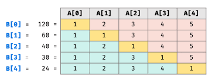

```ts
/**
 * @function multiplyArray 构建乘积数组
 * @param {number[]} A 需要构建乘积的数组
 * @returns {number[]}
 */
function multiplyArray(A: number[]): number[] {
  if (!Array.isArray(A)) return []

  const n = A.length
  const B: number[] = new Array(n).fill(1)

  // 计算下三角
  for (let i = 1; i < n; i++) {
    B[i] = B[i - 1] * A[i - 1]
  }

  // 乘上三角
  let temp = 1
  for (let i = n - 1; i >= 0; i--) {
    B[i] *= temp
    temp *= A[i] // 暂存乘积结果留着 B[i - 1] 使用
  }

  return B
}

/** 测试用例 */
const A1 = [1, 2, 3, 4]
const B1 = multiplyArray(A1)
console.log(B1) // Output: [24, 12, 8, 6]

const A2 = [1, 2, 3, 4, 5]
const B2 = multiplyArray(A2)
console.log(B2) // [120, 60, 40, 30, 24]

```


#### 顺时针打印矩阵

```bash
### 顺时针打印矩阵
输入一个矩阵，按照从外向里以顺时针的顺序依次打印出每一个数字。
例如，如果输入如下 4x4 矩阵：
    1 2 3 4
    5 6 7 8
    9 10 11 12
    13 14 15 16
则依次打印出数字 1,2,3,4,8,12,16,15,14,13,9,5,6,7,11,10.

```

```ts
/**
 * @function spiralOrderPrintMatrix 顺时针打印矩阵
 * @param {number[][]} matrix 矩阵
 * @returns {number[]} 顺时针打印矩阵的值
 */
function spiralOrderPrintMatrix(matrix: number[][]): number[] {
  if (!matrix.length || !matrix[0].length) return []

  const rows = matrix.length
  const coloums = matrix[0].length
  let start = 0 // 每一层的起始坐标
  let result: number[] = []

  /** 打印一圈 */
  function printCircle(matrix, start, coloums, rows, result) {
    const endX = coloums - 1 - start // 当前层结束的列号
    const endY = rows - 1 - start // 当前层结束的行号

    // 从左到右打印一行
    for (let i = start; i <= endX; i++) {
      result.push(matrix[start][i])
    }

    // 从上到下打印一列（需注意在最后一圈时存在仅有一行的情况）
    if (start < endY) {
      for (let i = start + 1; i <= endY; i++) {
        result.push(matrix[i][endX])
      }
    }

    // 从右到左打印一行（仅在 从上到下打印一列时 & 此时需要打印的行>=1个）
    if (start < endY && start < endX) {
      for (let i = endX - 1; i >= start; i--) {
        result.push(matrix[endY][i])
      }
    }

    // 从下到上打印一列（仅在 从上到下打印一列 & 从右到左打印一行 & 此时需要打印的列>=1个）
    // endY - 1 是为了相对于从上到下打印一列时，最顶部的行不需要打印（是为了进入下一圈）
    if (start < endY - 1 && start < endX) {
      for (let i = endY - 1; i > start + 1; i--) {
        result.push(matrix[i][start])
      }
    }

    return result
  }

  while (coloums > start * 2 && rows > start * 2) {
    result = printCircle(matrix, start, coloums, rows, result)

    // 进入下一层
    start++
  }

  return result
}

/** 测试代码 */
const len = 4
const matrix = Array.from({ length: len }).map((_, i) =>
  Array.from({ length: len }).map((__, j) => i * 4 + j + 1),
)
const case1 = spiralOrderPrintMatrix(matrix) // [1, 2, 3, 4, 8, 12, 16, 15, 14, 13, 9, 6, 7, 11, 10]
console.log(case1)

```


### 数据统计

```bash
## 数据统计
数组少不了的就是统计和计算，此类问题考察如何用更有效的方法对数组进行统计计算。

### 应用
1. 数组中出现次数超过数组长度一半的数字
2. 连续子数组的最大和
3. 扑克牌顺子
4. 第一个只出现一次的字符
```

#### 数组中出现次数超过数组长度一半的数字

```bash
### 数组中出现次数超过数组长度一半的数字
数组中有一个数字出现的次数超过数组长度的一半，请找出这个数字。

例如输入一个长度为 9 的数组 {1,2,3,2,2,2,5,4,2}。
由于数字 2 在数组中出现了 5 次，超过数组长度的一半，因此输出2。
如果不存在则输出 0。


#### 摩尔投票算法
摩尔投票算法的旨在找到一个数组中的多数元素，多数元素定义为出现次数超过数组大小一般的元素。
摩尔投票算法的基本思想是，维护一个候选数字和它出现的次数，遍历数组时，如果遇到和候选数字相同的数，就增加次数，如果遇到一个和候选数字不同的数，则减少次数。如果次数变为 0，就更换候选数字。由于超过一半的数字比其他所有数字出现次数的总和还要多，所以最后剩下的候选数字就是超过数组长度一半的数字。

```

**解法1：创建Map存储每个值的次数，获取最高次数的值**

```ts
/**
 * @function moreThanHalfNum 数组中出现次数超过数组长度一半的数字
 * @param {number[]} numbers 数组
 * @returns {number}
 */
function moreThanHalfNum(numbers: number[]): number {
  // 边界条件，防止数组长度为 0 时下面的错误计算
  if (!Array.isArray(numbers) || !numbers.length) return 0

  const len = numbers.length
  const map = new Map() // 计算每个数字的出现次数

  let largestNumber = numbers[0] // 记录出现最多的值（默认取第一个）
  let largestNumberCount = 1 // 记录出现最多的值的次数（因为默认取第一个值，所以必然存在次数为1）

  for (let i = 0; i < len; i++) {
    // 查看 map 中是否记录过该数字，如果没有，则初始化该 number 的次数为 1
    if (map.has(numbers[i])) {
      const targetNumber = numbers[i]
      const targetNumberCount = map.get(targetNumber) + 1

      map.set(targetNumber, targetNumberCount)

      if (targetNumberCount > largestNumberCount) {
        largestNumberCount = targetNumberCount
        largestNumber = targetNumber
      }
    } else {
      // 因为在初始化时已经取了第一个值，所以这里必然不用赋值，largestNumberCount 的次数必然 >= 该 number
      const targetNumber = numbers[i]
      map.set(targetNumber, 1)
    }
  }

  // 如果数组长度为 0 或者 数组中没有超过该数组的长度的一半(务必向上取整，防止奇数时出现小数)时，此时返回 0，否则返回出现最多次数的值
  return len && largestNumberCount >= Math.ceil(len / 2) ? largestNumber : 0
}

const case1 = moreThanHalfNum([1, 2, 3, 2, 2, 2, 5, 4, 2])
console.log(case1) // 2

```

**解法2：摩尔投票算法**

```ts
/**
 * @function findMajorityElement 摩尔投票法（数组中出现次数超过数组长度一半的数字）
 * @param {number[]} numbers 数组
 * @returns {number}
 * @description 摩尔投票法核心：目标值的个数比其他所有值加起来的数多（必为众数）
 */
function findMajorityElement(numbers: number[]): number {
  // 边界条件，防止数组长度为 0 时下面的错误计算
  if (!Array.isArray(numbers) || !numbers.length) return 0

  let candiate: number = numbers[0] // 候选人：数组中的某个值
  let count = 0 // candiate 的出现次数

  for (const num of numbers) {
    count += num === candiate ? 1 : -1

    // 次数为 0 后保存新值
    if (count === 0) {
      candiate = num
      count = 1
    }
  }

  count = 0 // 判断 candiate 这个数值的出现个数
  for (const num of numbers) {
    if (num === candiate) count++
  }

  return count > numbers.length / 2 ? candiate : 0
}

const case1 = findMajorityElement([1, 2, 3, 2, 2, 2, 5, 4, 2])
console.log(case1) // 2

```


#### 连续子数组的最大和

```bash
### 连续子数组的最大和


```

```ts

```


#### 扑克牌顺子

```bash
### 连续子数组的最大和


```

```ts

```


#### 第一个只出现一次的字符

```bash
### 第一个只出现一次的字符


```

```ts

```


## 链表 LinkedList

### 单向链表

```bash
## 单向链表
用一组任意存储的单元来存储线性表的数据元素。每个节点有一个 next 指针指向后一个节点（下一个元素的地址），还有一个成员变量用于存储该节点本身的数值。
链表的效率：
  - 链表的结构注定它无法快速访问某个元素，只能依靠遍历的方式慢慢查找，所以链表查询数据的效率为 O(N) 级别；
  - 但它在头节点进行插入和删除，只需改变第一个元素的引用，此时的插入效率为 O(1) ；
  - 如果在尾节点进行插入和删除，必须要遍历整个链表，找到最后这个链表节点再进行插入，遍历链表的花费为 O(N)。

单向链表的两个特殊节点：
  - 头节点用来记录链表的基地址，知道头节点我们可以遍历得到整条链表。
  - 尾节点的指针指向一个空指针 NULL。

单向链表的特征：
	- 优点：动态扩容，不需要占用过多的内存；插入元素快，只需断开连接重新赋值。
	- 缺点：查询元素慢：不能随机访问，不能根据索引访问，需要从头节点开始遍历才能查询到元素。
	- 遍历：要遍历链表就是不断找到当前节点的 next 节点，当 next 节点为 null 时说明是最后一个节点，停止遍历。


### 链表与数组的区别
链表与数组都是存储有序的元素集合，但与数组的区别是链表中的元素在内存中并不是连续的，每个元素由一个存储元素本身的节点和一个指向下一个元素的引用（指针）组成。
相较于传统的数组，链表的一个好处是添加或移除元素时不需要移动其它元素；但在数组中可以直接访问任何位置的元素，而链表无法实现，因为链表中每个节点只有对下一个节点的引用，所以想访问链表中间的一个元素，必须从起点（链表头部节点）开始迭代链表知道找到所需的元素。


### 应用场景
React16 的 Fiber Node 连接起来形成的 Fiber Tree 就是个单链表结构。


### 链表的案例
1. 基础应用
    - 从尾到头打印链表
    - 删除链表中的节点
    - 反转链表
    - 复杂链表的复制

2. 环形链表
    - 环形链表
    - 链表中环的入口节点
    - 约瑟夫环
    - 圈圈中最后剩下的数字

 3. 双指针
    - 两个链表的第一个公共节点
    - 两个链表的公共节点
    - 链表倒数第 k 个节点
    - 相交链表
    - 删除链表中的节点 / 重复节点

 4. 双向链表
    - 合并两个排序的链表
    - 扁平化多级双向链表

```


#### 链表实现

```ts
/** 链表单个节点数据字段约束 */
interface ILinkedNode {
  next: ILinkedNode | null
  value: unknown
}
/** 当前节点数据字段约束 */
type ICurListNode = null | ILinkedNode

/** 链表节点类 */
class ListNode {
  next: ILinkedNode | null
  value: unknown

  constructor (nodeValue) {
    this.next = null
    this.value = nodeValue
  }
}

/** 链表类 */
class LinkedList {
  /** 链表长度 */
  length: number
  /** 链表头部节点 */
  head: ICurListNode

  constructor () {
    this.length = 0
    this.head = null
  }

  /** 获取链表中索引所对应的元素，返回所查找节点 | null */
  getElementAt (index: number): ICurListNode {
    if (index < 0 || index >= this.length) return null

    let currentNode: ICurListNode = this.head
    while (index--) {
      currentNode = currentNode?.next || null
    }
    return currentNode
  }

  /** 获取链表中某个节点 */
  find (nodeValue: unknown): ICurListNode {
    let currentNode: ICurListNode = this.head
    while (currentNode) {
      if (currentNode.value === nodeValue) return currentNode
      currentNode = currentNode.next
    }
    return null
  }

  /** 追加节点 */
  append (nodeValue: unknown) {
    const node = new ListNode(nodeValue)

    if (!this.head) {
      this.head = node
    } else {
      const cur = this.getElementAt(this.length - 1)
      cur!.next = node
    }
    this.length++
  }

  /** 指定位置插入节点: 返回是否插入成功 */
  insert (index: number, nodeValue: unknown): boolean {
    // 边界判定是否超出界限
    if (index < 0 || index > this.length) return false

    const node = new ListNode(nodeValue)

    if (index === 0) {
      node.next = this.head
      this.head = node
    } else {
      const prev = this.getElementAt(index - 1)
      node.next = prev?.next || null
      prev!.next = node
    }

    this.length++
    return true
  }

  /** 删除指定位置的元素，并返回这个元素的值 */
  removeAt (index: number): ILinkedNode['value'] {
    if (index < 0 || index >= this.length) return null

    let currentNode: ICurListNode = this.head

    if (index === 0) {
      this.head = currentNode?.next || null
    } else {
      const prev = this.getElementAt(index - 1)
      currentNode = prev?.next || null
      prev!.next = currentNode?.next || null
    }

    this.length--
    return currentNode?.value || null
  }

  /** 获取链表中给定元素的索引 */
  indexOf (nodeValue: unknown): number {
    let currentNode: ICurListNode = this.head

    for (let i = 0; i < this.length; i++) {
      // 边界判定
      if (currentNode === null) return -1
      // 查找到
      if (currentNode?.value === nodeValue) return i
      // 未找到，往下一个节点查找
      currentNode = currentNode.next ?? null
    }
    // 始终为查找到该节点值
    return -1
  }

  /** 删除链表中对应元素 */
  remove (nodeValue: unknown) {
    const index = this.indexOf(nodeValue)
    return this.removeAt(index)
  }

  /** 判断链表是否为空 */
  isEmpty (): boolean {
    return this.length > 0
  }

  /** 获取链表的长度 */
  size () {
    return this.length
  }

  /** 获取链表的头元素 */
  getHead () {
    return this.head
  }

  /** 清空链表 */
  clear () {
    this.head = null
    this.length = 0
  }

  /** 链表转数组 */
  toArray (): ILinkedNode['value'][] {
    let currentNode: ICurListNode = this.head
    const tempArr: unknown[] = []
    while (currentNode !== null) {
      tempArr.push(currentNode.value)
      currentNode = currentNode.next ?? null
    }
    return tempArr
  }

  /** 序列化链表 */
  join (str: string) {
    return this.toArray().join(str)
  }

   /**
   * @reverse 反转链表
   * @param head 所需要反转的链表
   * 说明：
   *    1. 以链表的头部节点为基准节点
   *    2. 将基准节点的下一个节点挪到头部作为头结点
   *    3. 当基准节点的 next 为 null，则其已经成为最后一个节点，链表已经完成反转
   *  注意：传递的 head 需要深拷贝，否则会改变原链表
   */
  reverse (head: ICurListNode = cloneDeep(this.head)): ICurListNode {
    let currentNode: ICurListNode = null
    let reverseNode: ICurListNode = head
    while (head && head.next) {
      currentNode = head.next
      head.next = currentNode?.next || null
      currentNode.next = reverseNode
      reverseNode = currentNode
    }
    return reverseNode
  }
}

/** 测试内容 */
const linkedList = new LinkedList()
linkedList.append(10)
linkedList.append(20)
linkedList.append(30)
console.log(linkedList.join('--'))

linkedList.insert(0, 5)
linkedList.insert(2, 15)
linkedList.insert(4, 25)
console.log(linkedList.join('--'))

console.log(linkedList.getHead(), linkedList.reverse())

console.log(linkedList.removeAt(0))
console.log(linkedList.removeAt(1))
console.log(linkedList.removeAt(2))
console.log(linkedList.join('--'))

console.log(linkedList.indexOf(20))

linkedList.remove(20)

console.log(linkedList.join('--'))

console.log(linkedList.find(10))

linkedList.clear()
console.log(linkedList.size())

/* 输出结果：
10--20--30
191 5--10--15--20--25--30
193 5
194 15
195 25
196 10--20--30
198 1
202 10--30
204 ListNode {next: ListNode, value: 10}
0 */
```

    -
    - 删除链表中的节点
    - 反转链表
    - 复杂链表的复制
#### 从尾到头打印链表

```ts
/** 链表结构 */
class ListNode {
  value: unknown
  // eslint-disable-next-line no-use-before-define
  next: null | ListNode
  constructor(value) {
    this.value = value
    this.next = null
  }
}

/** 从尾到头打印链表 */
const printListFromTailToHead = (head: ListNode | null): Array<unknown> => {
  const result: Array<unknown> = []
  while (head) {
    result.unshift(head.value)
    head = head.next
  }
  return result
}

/** 测试代码 */
const listNode = new ListNode(1)
listNode.next = new ListNode(2)
const result = printListFromTailToHead(listNode)
console.log(result)

```


#### 反转链表

```bash
### 反转链表
1. 以链表的头部节点为基准节点
2. 将基准节点的下一个节点挪到头部作为头结点
3. 当基准节点的 next 为 null，则其已经成为最后一个节点，链表已经完成反转
    reverse (head = cloneDeep(this.head)) {
      let currentNode = null, reverseNode = head
      while (head && head.next) {
        currentNode = head.next
        head.next = currentNode?.next || null
        currentNode.next = reverseNode
        reverseNode = currentNode
      }
      return reverseNode
    }
```

#### 复杂链表的复制

```bash
### 复杂链表的复制
输入一个复杂链表（每个节点中有节点值，以及两个指针，一个指向下一个节点，另一个特殊指针指向任意一个节点），返回结果为复制后复杂链表的head。

#### 解题思路
1. 复制一份链表放在前一个节点后面，即根据原始链表的每个节点 N 创建 N，把 N 直接放在 N 的 next 位置，让复制后的链表和原始链表组成新的链表。
2. 给复制的链表 random 赋值，即 N.random = N.random.next。
3. 拆分链表，将 N 和 N 进行拆分，保证原始链表不受影响。

```

#### 合并两个排序的链表

```bash
### 合并两个排序的链表
输入两个单调递增的链表，输出两个链表合成后的链表，当然我们需要合成后的链表满足单调不减规则。
前提条件：两个链表都做好大小排序。

```

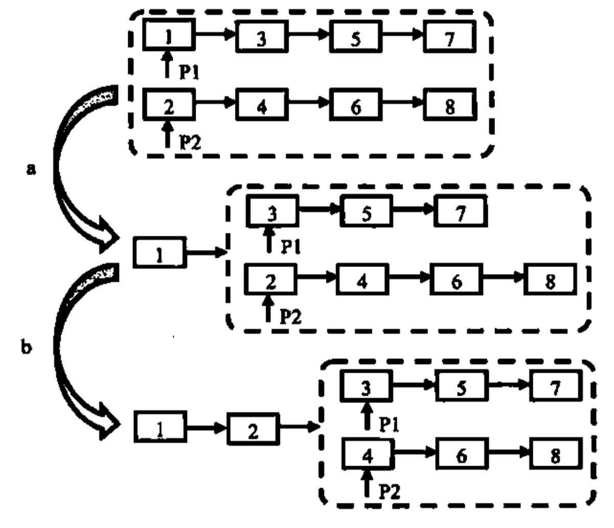

```ts
/** 链表结构 */
class ListNode {
  value: number
  // eslint-disable-next-line no-use-before-define
  next: null | ListNode
  constructor(value?: number, next?: ListNode | null) {
    this.value = value === undefined ? 0 : value
    this.next = next === undefined ? null : next
  }
}

/**
 * @function MergeTowLists 合并两个排序的链表
 * @description
 *  1. 链表头部节点作比较，小节点的 next 等于 小节点的 next 和节点中对比的较小值
 *  2. 依次递归，直到两个链表中都为 null 为止
 */
function MergeTowLists(list1: ListNode | null, list2: ListNode | null) {
  /** 边界条件判定（递归的终止条件） */
  if (list1 === null) return list2
  if (list2 === null) return list1

  let head: ListNode
  if (list1.value < list2.value) {
    head = list1
    head.next = MergeTowLists(list1.next, list2)
  } else {
    head = list2
    head.next = MergeTowLists(list1, list2.next)
  }
  return head
}

/** 测试代码 */
MergeTowLists(null, null)

```


### 双指针

```bash
## 双指针
双指针主要利用两个或多个不同位置的指针，通过速度和方向的变换解决问题。
  1. 两个指针从不同位置出发：一个从始端开始，另一个从末端开始；
  2. 两个指针以不同速度移动：一个指针快一些，另一个指针慢一些。
因为在单链表中只能在一个方向上遍历链表，所以第一种情况可能无法工作。
然而第二种情景，也被称为慢指针和快指针，是非常有用的。


### 应用
- 两个链表的第一个公共节点
- 两个链表的公共节点
- 链表倒数第 k 个节点
- 相交链表
- 删除链表中的节点 / 重复节点

```

```ts
/** 链表单个节点数据字段约束 */
interface ILinkedNode {
  next: ILinkedNode | null
  random: ILinkedNode | null
  value: unknown
}

/** 当前节点数据字段约束 */
type ICurListNode = null | ILinkedNode

/** 链表节点类 */
class ListNode implements ILinkedNode {
  next: ICurListNode
  random: ICurListNode
  value: unknown

  constructor(nodeValue: unknown, next = null, random = null) {
    this.next = next
    this.random = random
    this.value = nodeValue
  }
}

/** 复制复杂链表 */
function CopyRandomList(head: ICurListNode): ICurListNode {
  if (head === null) return null

  const map = new Map()
  let node: ICurListNode = head

  /** 创建新的节点并将其保存在 Map 中 */
  while (node !== null) {
    map.set(node, new ListNode(node.value))
    node = node.next
  }

  node = head

  /** 为新节点设置正确的 next 和 random */
  while (node !== null) {
    map.get(node)!.next = map.get(node.next) || null
    map.get(node)!.random = map.get(node.random) || null
    node = node.next
  }

  return map.get(head)
}

/** 测试代码 */
CopyRandomList(null)

```

#### 链表倒数第 k 个节点

```bash
### 链表倒数第 k 个节点
输入一个链表，输出该链表中倒数第k个结点。

简单思路： 循环到链表末尾找到 length 在找到length-k节点 需要循环两次。

优化：
	- 设定两个节点，间距相差k个节点，当前面的节点到达终点，取后面的节点。
	- 前面的节点到达k后，后面的节点才出发。
	- 需要考虑head为null，k为0，k大于链表长度的情况。

```

```ts
/** 链表单个节点数据字段约束 */
interface ILinkedNode {
  next: ILinkedNode | null
  random: ILinkedNode | null
  value: unknown
}

/** 当前节点数据字段约束 */
type ICurListNode = null | ILinkedNode

/** 链表节点类 */
class ListNode implements ILinkedNode {
  next: ICurListNode
  random: ICurListNode
  value: unknown

  constructor(nodeValue, next = null, random = null) {
    this.next = next
    this.random = random
    this.value = nodeValue === undefined ? null : nodeValue
  }
}

/** 链表倒数第 K 个节点 */
function FindKthFromEnd(head: ICurListNode, k: number): ICurListNode {
  if (head === null || k <= 0) return null

  /** 快指针 */
  let fast: ICurListNode = head
  /** 慢指针 */
  let slow: ICurListNode = head

  /** 快指针先移动 k 步 */
  for (let i = 0; i < k; i++) {
    // 如果快指针为空，则说明 k 大于链表的长度，则返回 null
    if (fast === null) return null
    fast = fast.next
  }

  /** 快慢指针同时移动，直到快指针到达链表最后一个节点 */
  while (fast !== null) {
    fast = fast.next
    slow = slow.next as ListNode
  }

  // 慢指针所指向的节点，则为倒数第 k 个节点
  return slow
}

/** 测试代码 */
FindKthFromEnd({ next: null, value: 10, random: null }, 1)

```


#### 两个链表中的第一个公共节点

```bash
### 两个链表中的第一个公共节点
- 输入两个链表，找出它们的第一个公共结点。

#### 思路
1. 先找到两个链表的长度length1、length2
2. 让长一点的链表先走 length2-length1 步，让长链表和短链表起点相同
3. 两个链表一起前进，比较获得第一个相等的节点
- 时间复杂度O(length1+length2) 空间复杂度O(0)

```

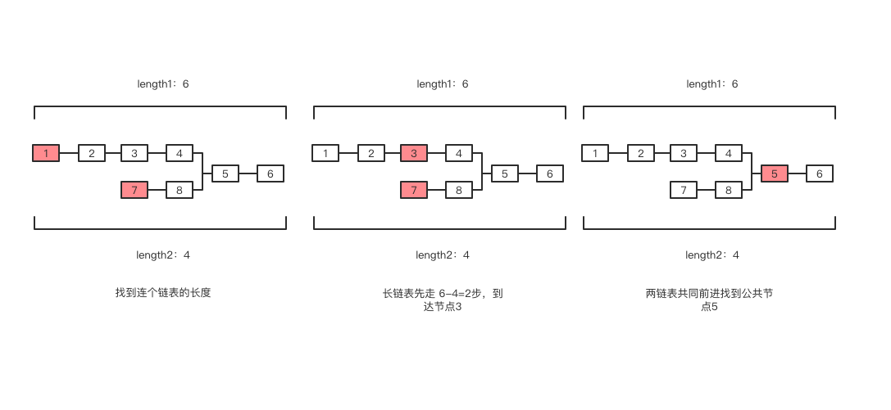

```ts
/** 链表单个节点数据字段约束 */
interface ILinkedNode<T> {
  next: ILinkedNode<T> | null
  value: T
}

/** 当前节点数据字段约束 */
type ICurListNode<T> = null | ILinkedNode<T>

/** 链表节点类 */
class ListNode<T = number> implements ILinkedNode<T> {
  next: ICurListNode<T>
  value: T

  constructor(nodeValue: T, next: ICurListNode<T> = null) {
    this.next = next
    this.value = nodeValue
  }
}

class List {
  /** 获取链表的长度 */
  public getListLength<T>(head: ICurListNode<T>): number {
    let current = head
    let len = 0
    while (current) {
      len++
      current = current.next
    }
    return len
  }

  /** 找出它们的第一个公共结点 */
  public FindFirstCommonNode<T>(
    listHead1: ICurListNode<T>,
    listHead2: ICurListNode<T>,
  ): ICurListNode<T> {
    /** 获取链表的长度 */
    const len1 = this.getListLength(listHead1)
    const len2 = this.getListLength(listHead2)

    /** 长短链表以及长短链表的差值 */
    let lang: ICurListNode<T> = len1 > len2 ? listHead1 : listHead2
    let short: ICurListNode<T> = len1 > len2 ? listHead2 : listHead1
    let interval: number = Math.abs(len1 - len2)

    /** 长链表先走 差值 的步数（为了让两个链表后面的长度相同） */
    while (interval--) {
      lang = lang!.next
    }

    /** 查找是相同的节点 */
    while (lang) {
      if (lang === short) return lang
      lang = lang.next
      short = short!.next
    }

    /** 直到最后都没找到相同的节点（兜底） */
    return null
  }
}

/** 测试代码 */
// 创建公共链表节点
const commonNode1 = new ListNode<string>('Common Node 1')
const commonNode2 = new ListNode<string>('Common Node 2')

// 创建链表节点
const list1 = new ListNode<string>(
  'Node 1',
  new ListNode<string>('Node 2', { ...commonNode2, next: commonNode1 }),
)
const list2 = new ListNode<string>(
  'Node A',
  new ListNode<string>('Node B', new ListNode('Node C', commonNode1)),
)

// 创建链表类实例 并 找出它们的第一个公共结点并打印
new List().FindFirstCommonNode(list1, list2) // 预期结果: ListNode {next: null, value: 'Common Node 1'}

```


#### 删除链表中的选定节点

```bash
### 删除链表中的选定节点
给定单链表的头指针和要删除的指针节点，在O(1)时间内删除该节点。
  1. 删除的节点不是尾部节点：将 next 节点覆盖当前节点
  2. 链表仅有一个节点：将头节点设置为 null
  3. 删除的节点是尾节点且前面还有节点：遍历到末尾的前一个节点进行删除

```

```ts
/** 链表单个节点数据字段约束 */
interface ILinkedNode<T = number> {
  next: ILinkedNode<T> | null
  value: T
}

/** 当前节点数据字段约束 */
type ICurListNode<T = number> = null | ILinkedNode<T>

/** 链表节点类 */
export class ListNode<T = number> implements ILinkedNode<T> {
  next: ICurListNode<T>
  value: T

  constructor(nodeValue: T, next: ICurListNode<T> = null) {
    this.next = next
    this.value = nodeValue
  }
}

/**
 * 用来删除选定的链表节点
 * @param {ICurListNode<T>} head - 链表的头节点
 * @param {ICurListNode<T>} node - 要删除的链表节点
 * @returns {ICurListNode<T>} 删除选定节点后的链表头节点
 */
function deleteNode<T = number>(
  head: ICurListNode<T>,
  node: ICurListNode<T>,
): ICurListNode<T> {
  if (node === null || head === null) {
    throw new Error('Cannot delete the last node or a null node')
  }

  if (node.next) {
    /** 1. 删除的节点不是尾部节点：将 next 节点覆盖当前节点 */
    const nextNode = node.next
    node.value = nextNode.value
    node.next = nextNode.next
    return head
  } else if (node === head) {
    /** 2. 链表仅有一个节点：将头节点设置为 null  */
    node = null
    head = null
    return null
  } else {
    /** 3. 删除的节点是尾节点且前面还有节点：遍历到末尾的前一个节点进行删除 */
    node = head
    while (node?.next?.next) {
      node = node.next
    }
    node!.next = null

    return head
  }
}

/** 测试用例 */
// 用例1：删除中间的节点
const case1Node1: ICurListNode<number> = new ListNode(1)
const case1Node2: ICurListNode<number> = new ListNode(2)
const case1Node3: ICurListNode<number> = new ListNode(3)
case1Node1.next = case1Node2
case1Node2.next = case1Node3
console.log(deleteNode(case1Node1, case1Node2)) // 预期结果： {value: 1, next: { value: 3, next: null }}

// 用例2：只有一个节点，并删除这个唯一节点
const case2Node1: ICurListNode<number> = new ListNode(1)
console.log(deleteNode(case2Node1, case2Node1)) // 预期结果：null

// 用例3：删除尾部节点
const case3Node1: ICurListNode<number> = new ListNode(1)
const case3Node2: ICurListNode<number> = new ListNode(2)
const case3Node3: ICurListNode<number> = new ListNode(3)
case3Node1.next = case3Node2
case3Node2.next = case3Node3
console.log(deleteNode(case3Node1, case3Node3)) // 预期结果：{value: 1, next: { value: 2, next: null }}

```


#### 删除链表中重复的节点

```bash
### 删除链表中重复节点

```

```ts
/** 链表单个节点数据字段约束 */
interface ILinkedNode<T = number> {
  next: ILinkedNode<T> | null
  value: T
}

/** 当前节点数据字段约束 */
type ICurListNode<T = number> = null | ILinkedNode<T>

/** 链表节点类 */
export class ListNode<T = number> implements ILinkedNode<T> {
  next: ICurListNode<T>
  value: T

  constructor(nodeValue: T, next: ICurListNode<T> = null) {
    this.next = next
    this.value = nodeValue
  }
}

/**
 * 用来删除重复链表节点
 * @param {ICurListNode<T>} head - 链表的头节点
 * @returns {ICurListNode<T>} 删除重复节点后的链表头节点
 */
function deleteDuplicatesNode<T = number>(
  head: ICurListNode<T>,
): ICurListNode<T> {
  /** 如果是链表为空 或 链表只有一个节点，则直接返回 */
  if (head === null || head.next === null) return head

  const listNodeMap = new Map<T, boolean>()
  let currentNode: ICurListNode<T> = head
  let prev: ICurListNode<T> = null

  while (currentNode !== null) {
    if (listNodeMap.has(currentNode.value)) {
      // 删除重复节点
      prev!.next = currentNode.next
    } else {
      listNodeMap.set(currentNode.value, true)
      prev = currentNode
    }

    currentNode = currentNode.next
  }

  return head
}

/** 测试用例 */
// 创建链表
const node1 = new ListNode(1)
const node2 = new ListNode(2)
const node3 = new ListNode(2)
const node4 = new ListNode(3)
node1.next = node2
node2.next = node3
node3.next = node4

// 调用函数删除重复节点
const newHead = deleteDuplicatesNode(node1)
console.log(newHead)
```


### 双向链表

> ```bash
> ## 双向链表
> - 双向链表支持两个方向，每个节点不仅有一个后驱节点指针 next 指向后面的节点，还有一个前驱指针 prev 指向前面的节点。
> - 双链表中，除了可以像单向链表一样从头部开始遍历之外，还可以从尾部进行遍历。
>
> ### 应用
> 1. 扁平化多级双向链表
> ```
>
> 
>
> ```ts
> /** 链表单个节点数据字段约束 */
> interface ILinkedNode {
>   next: ILinkedNode | null
>   prev: ILinkedNode | null
>   value: unknown
> }
> /** 当前节点数据字段约束 */
> type ICurListNode = null | ILinkedNode
>
> /** 链表节点类 */
> class ListNode implements ILinkedNode {
>   next: ILinkedNode | null
>   prev: ILinkedNode | null
>   value: unknown
>
>   constructor (nodeValue) {
>     this.next = null
>     this.prev = null
>     this.value = nodeValue
>   }
> }
>
> /** 双向链表类 */
> class DoubleLinkedList {
>   /** 链表长度 */
>   length: number
>   /** 链表头部节点：仅在插入首个节点or头部插入新节点时才修改，主要通过节点next属性查找下一个节点  */
>   head: ICurListNode
>   /** 链表尾部的节点：仅在插入首个节点or尾部插入新节点时才更改，主要通过节点prev属性查找上一个节点 */
>   tail: ICurListNode
>
>   constructor () {
>     this.length = 0
>     this.head = null
>     this.tail = null
>   }
>
>   /** 获取双向链表中索引所对应的元素，返回所查找节点 | null */
>   getElementAt (index: number): ICurListNode {
>     if (index < 0 || index >= this.length) return null
>     let currentNode: ICurListNode = null
>     // 当索引大于链表长度的一半时，从后往前找
>     if (index > Math.floor(this.length / 2)) {
>       currentNode = this.tail
>       let i = this.length - 1
>       while (i > index) {
>         currentNode = currentNode?.prev || null
>         i--
>       }
>     } else {
>       currentNode = this.head
>       while (index--) {
>         currentNode = currentNode?.next || null
>       }
>     }
>     return currentNode
>   }
>
>   /** 获取双向链表中某个节点 */
>   find<T = any> (nodeValue: T): ICurListNode {
>     let curHead: ICurListNode = cloneDeep(this.head)
>     let curTail: ICurListNode = cloneDeep(this.tail)
>     // 双向迭代，理想状态下相对单向链表更快速
>     while (curHead) {
>       if (curHead.value === nodeValue) return curHead
>       curHead = curHead.next
>
>       if (curTail?.value === nodeValue) return curTail
>       curTail = curTail?.prev || null
>     }
>     return null
>   }
>
>   /** 向双向链表中追加节点 */
>   append<T = any> (nodeValue: T): void {
>     const node = new ListNode(nodeValue)
>
>     if (this.head === null) {
>       // 链表为空，head 和 tail 都指向当前追加的节点
>       this.head = node
>       this.tail = node
>     } else {
>       // 链表不为空，将当前节点添加到链表的尾部
>       this.tail!.next = node
>       node.prev = this.tail
>       this.tail = node
>     }
>
>     this.length++
>   }
>
>   /** 在双向链表的指定位置插入节点 */
>   insert<T = any> (index: number, nodeValue: T): boolean {
>     if (index < 0 || index > this.length) return false
>
>     // 插入到尾部
>     if (index === this.length) {
>       this.append<T>(nodeValue)
>     } else {
>       const node = new ListNode(nodeValue)
>       if (index === 0) {
>         // 插入到头部
>         if (this.head === null) {
>           this.head = node
>           this.tail = node
>         } else {
>           node.next = this.head
>           this.head.prev = node
>           this.head = node
>         }
>       } else {
>         // 插入到中间位置
>         const curNode = this.getElementAt(index)
>         const prevNode = curNode!.prev
>         node.next = curNode
>         node.prev = prevNode
>         prevNode!.next = node
>         curNode!.prev = node
>       }
>       this.length++
>     }
>
>     return true
>   }
>
>   /** 删除双向链表中指定位置的元素，并返回这个元素的值 */
>   removeAt (index: number): ILinkedNode['value'] {
>     if (index < 0 || index >= this.length) return null
>
>     let curNode: ICurListNode
>     let prevNode: ICurListNode
>
>     // 移除头部元素
>     if (index === 0) {
>       curNode = this.head
>       this.head = curNode!.next
>       this.head!.prev = null
>       if (this.length === 1) this.tail = null
>     } else if (index === this.length - 1) {
>       // 移除尾部元素
>       curNode = this.tail
>       this.tail = curNode!.prev
>       this.tail!.next = null
>     } else {
>       // 移除中间元素
>       curNode = this.getElementAt(index)
>       prevNode = curNode!.prev
>       prevNode!.next = curNode!.next
>       prevNode!.next!.prev = prevNode
>     }
>
>     this.length--
>     return curNode!.value
>   }
>
>   /** 获取双向链表中给定元素的索引 */
>   indexOf<T = any> (nodeValue: T): number {
>     let curHead = this.head
>     let curTail = this.tail
>     let idx = 0
>
>     while (curHead !== curTail) {
>       if (curHead?.value === nodeValue) return idx
>       curHead = curHead!.next
>
>       if (curTail?.value === nodeValue) return this.length - 1 - idx
>       curTail = curTail!.prev
>
>       idx++
>     }
>     return -1
>   }
>
>   /** 删除链表中对应的元素 */
>   remove <T = any> (nodeValue: T) {
>     const index = this.indexOf(nodeValue)
>     return this.removeAt(index)
>   }
>
>   /** 序列化双向链表 */
>   join (str: string): string {
>     let curNode = this.head
>     let tempStr = ''
>     while (curNode) {
>       tempStr += curNode.value
>       if (curNode.next) tempStr += str
>       curNode = curNode.next
>     }
>     return tempStr
>   }
> }
>
> /** 测试内容 */
> const doubleLinkedList = new DoubleLinkedList()
> doubleLinkedList.append(10)
> doubleLinkedList.append(15)
> doubleLinkedList.append(20)
> doubleLinkedList.append(25)
> console.log(doubleLinkedList.join('<->'))
>
> console.log(doubleLinkedList.getElementAt(0)?.value)
> console.log(doubleLinkedList.getElementAt(1)?.value)
> console.log(doubleLinkedList.getElementAt(5))
>
> console.log(doubleLinkedList.join('<->'))
> console.log(doubleLinkedList.indexOf(10))
> console.log(doubleLinkedList.indexOf(25))
> console.log(doubleLinkedList.indexOf(50))
>
> doubleLinkedList.insert(0, 5)
> doubleLinkedList.insert(3, 18)
> doubleLinkedList.insert(6, 30)
> console.log(doubleLinkedList.join('<->'))
>
> console.log(doubleLinkedList.find(10)?.value)
> console.log(doubleLinkedList.removeAt(0))
> console.log(doubleLinkedList.removeAt(1))
> console.log(doubleLinkedList.removeAt(5))
> console.log(doubleLinkedList.remove(10))
> console.log(doubleLinkedList.remove(100))
>
> console.log(doubleLinkedList.join('<->'))
> console.log(doubleLinkedList.tail, doubleLinkedList.head)
>
> /* 测试结果：
> 10<->15<->20<->25
> 10
> 15
> null
> 10<->15<->20<->25
> 0
> 3
> -1
> 5<->10<->15<->18<->20<->25<->30
> 10
> 5
> 15
> null
> 10
> null
> 18<->20<->25<->30 */
> ```

### 循环列表(环类)

> ```bash
> ## 循环列表（环类）
> 循环列表是一种特殊的单链表，与单链表不同的是尾节点不指向空地址，指向链表的头结点。
> 优点是从链尾到链头比较方便，当要处理的数据具有环形结构特点时，非常适合用循环列表来处理。
>
>
> ## 环类：从判定一个单链表是否存在循环而扩展衍生的问题
> 1. 环形链表
> 2. 链表环的入口节点
> 3. 约瑟夫环
> ```
>
> 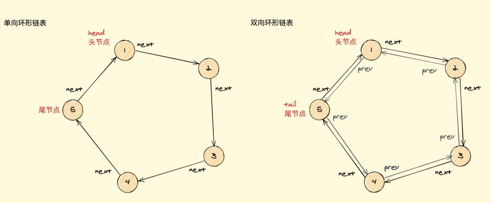

#### 链表中环的入口节点

````bash
### 链表中环的入口节点
给一个链表，若其中包含环，请找出该链表的环的入口结点，否则，输出null。


### 思路
声明两个指针 P1 P2。
	1. 判断链表是否有环： P1 P2 从头部出发，P1走两步，P2走一步，如果可以相遇，则环存在。
	2. 从环内某个节点开始计数，再回到此节点时得到链表环的长度 length。
	3. P1、P2 回到head节点，让 P1 先走 length 步 ，当P2和P1相遇时即为链表环的起点。

````

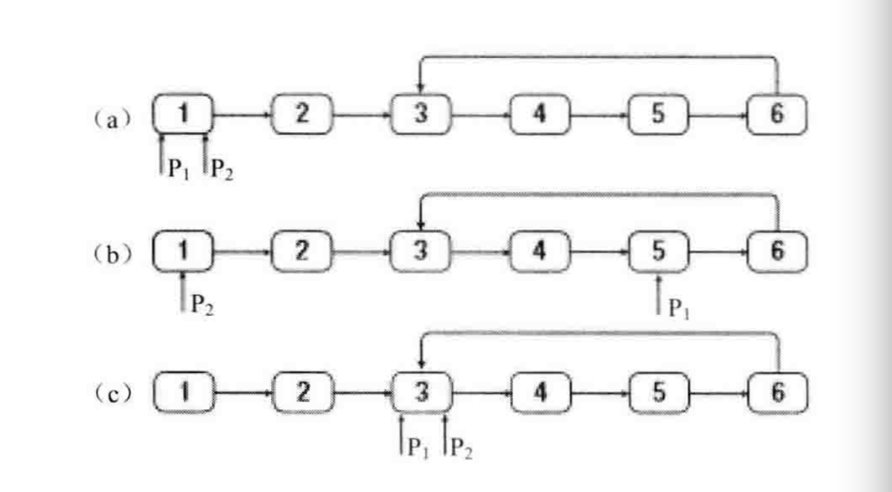

```ts
/** 链表单个节点数据字段约束 */
interface ILinkedNode<T> {
  next: ILinkedNode<T> | null
  value: T
}

/** 当前节点数据字段约束 */
type ICurListNode<T> = null | ILinkedNode<T>

/** 链表节点类 */
class ListNode<T = number> implements ILinkedNode<T> {
  next: ICurListNode<T>
  value: T

  constructor(nodeValue: T, next: ICurListNode<T> = null) {
    this.next = next
    this.value = nodeValue
  }
}

/**
 * @function detectCycle 链表中环的入口节点
 * @description 龟兔赛跑算法（Floyd's Cycle Detection Algorithm）能够找到链表中的环入口
 *  1. 定义两个指针，一个慢指针（slow）每次移动一个节点，一个快指针（fast）每次移动两个节点。
 *  2. 如果链表中存在环，快指针和慢指针最终会在环内相遇（这是由于快指针每次比慢指针多走一步）。
 *  3. 让快指针从相遇点开始，另外再定义一个新的指针从链表头开始，两个指针每次都只移动一个节点，它们相遇的节点就是环的入口节点。
 */
function detectCycle<T = number>(head: ICurListNode<T>): ICurListNode<T> {
  if (head === null || head.next === null) return null

  /** 快指针 */
  let fast: ICurListNode<T> = head
  /** 慢指针 */
  let slow: ICurListNode<T> = head

  /**
   * 1. 如果指针不断走动，存在指针指向的下一个节点为空，则说明为不是环状链表
   * 2. 如果为环状，快指针和慢指针终会相遇。
   *    - 在相遇时快指针和慢指针的差值等于环的长度的整数倍（此时可确定相遇的值为环的入口节点）
   *    - k=nr，（n为正整数，r是环的长度）
   */
  while (fast !== null && fast.next !== null) {
    slow = slow!.next
    fast = fast!.next.next

    if (slow === fast) {
      let slow2: ListNode<T> | null = head

      while (slow2 !== slow) {
        slow = slow!.next
        slow2 = slow2!.next
      }

      return slow
    }
  }

  return null
}

/** 测试代码 */
const node1 = new ListNode(3)
const node2 = new ListNode(2)
const node3 = new ListNode(0)
const node4 = new ListNode(-4)

node1.next = node2
node2.next = node3
node3.next = node4
node4.next = node3 // 形成环

const result = detectCycle(node1)
console.log(result?.value) // 输出 2

```


#### 圈圈中最后剩下的数字（约瑟夫环问题）

```bash
### 圈圈中最后剩下的数字
0,1,...,n-1这n个数字排成一个圆圈，从数字0开始，每次从这个圆圈里删除第m个数字。求出这个圆圈里剩下的最后一个数字。


#### 约瑟夫环问题
据说著名犹太历史学家 Josephus有过以下的故事：在罗马人占领乔塔帕特后，39 个犹太人与Josephus及他的朋友躲到一个洞中，39个犹太人决定宁愿死也不要被敌人抓到，于是决定了一个自杀方式，41个人排成一个圆圈，由第1个人开始报数，每报数到第3人该人就必须自杀，然后再由下一个重新报数，直到所有人都自杀身亡为止。然而Josephus 和他的朋友并不想遵从。首先从一个人开始，越过k-2个人（因为第一个人已经被越过），并杀掉第k个人。接着，再越过k-1个人，并杀掉第k个人。这个过程沿着圆圈一直进行，直到最终只剩下一个人留下，这个人就可以继续活着。问题是，给定了和，一开始要站在什么地方才能避免被处决？Josephus要他的朋友先假装遵从，他将朋友与自己安排在第16个与第31个位置，于是逃过了这场死亡游戏。


```

```ts
/** 链表单个节点数据字段约束 */
interface ILinkedNode<T = number> {
  next: ILinkedNode<T> | null
  value: T
}

/** 当前节点数据字段约束 */
type ICurListNode<T = number> = null | ILinkedNode<T>

/** 链表节点类 */
export class ListNode<T = number> implements ILinkedNode<T> {
  next: ICurListNode<T>
  value: T

  constructor(nodeValue: T, next: ICurListNode<T> = null) {
    this.next = next
    this.value = nodeValue
  }
}

/**
 * 约瑟夫环问题
 * @param {number} n 参与游戏的总人数
 * @param {number} m 每报数到 m 的人出列
 * @returns {number} 存活的人的编号（仅能剩下一个人）
 */
function josephus(n: number, m: number): number {
  /** 边界条件 */
  if (n < 1 || m < 1) return -1

  const head: ICurListNode = new ListNode(1)
  let current: ICurListNode = head

  // 循环生成长度为 n 的链表
  for (let i = 2; i <= n; i++) {
    current.next = new ListNode(i)
    current = current.next
  }

  // 构成环状链表
  current.next = head

  /** 指针的前一个节点 */
  let prev: ICurListNode = current
  /** 计数值 */
  let count: number = 0
  /** 当前指针 */
  let cur: ICurListNode = head

  /** 直到只有一个节点为止 */
  while (cur !== cur.next) {
    if (++count === m) {
      // 每当报数到达 m 时，就将当前节点从链表中移除（通过修改前一个节点的指针），并将计数器重置为 0
      prev.next = cur.next
      count = 0
    } else {
      // 如果报数未达到 m，就简单地将当前节点指针移动到下一个节点。
      prev = cur
    }

    // 指针后移
    cur = cur.next as ListNode<number>
  }

  return cur.value
}

/** 测试代码 */
console.log(josephus(11, 3)) // 输出：4

```

**数组解**

```ts
/**
 * 约瑟夫环问题 - 数组解法
 * @param {number} n 参与游戏的总人数
 * @param {number} m 每报数到 m 的人出列
 * @returns {number} 存活的人的编号（可剩下多个人）
 */
function josephusAsArr(n, m) {
  const persons = Array.from({ length: n }).map((_, idx) => idx + 1)

  let index = 0
  //   while (persons.length > 1) {
  while (persons.length >= m) {
    index = ((index + m) % persons.length) - 1
    if (index >= 0) {
      persons.splice(index, 1)
    } else {
      persons.splice(persons.length - 1, 1)
      index = 0
    }
  }

  return persons
}

josephusAsArr(11, 3) // 预期结果：[2, 7]
```


### JS & 链表

> ```bash
> ### JavaScript 不内置链表的原因
> 链表效率高于数组效率这种话，事实上在 JavaScript 中是不存在的，即使创建一个长度为 1亿 的数组，在创建一个长度为 10 的数组，并且向这两个数组的中间添加元素，会发现两者所用时间与数组长度无关，这说明 JavaScript 数组达到了链表的效率要求。
>
> 而且数组中可用 `splice()` 方法向数组的指定位置去添加和删除元素，所需时间同样与数组长度无关，也能达到链表的要求，而数组的下标完全可以取代链表的 `head、tail、next、prev` 等方法，并且大多数使用链表的情况不多。
>
> 当然这只局限于 JavaScript 这门语言中，这和 JS 内部的数组实现机制有关，其实 JS 的数组只是叫数组而已，它和常规语言中的数组概念不同。
>
>
>
> ### JavaScript 链表的作用：React 16 引入的 Fiber 架构的更新算法
> Fiber 翻译为纤维化，将任务进行细化。它把一个耗时长的任务分成很多小片，每一个小片的运行时间很短，虽然总时间依然很长，但是在每个小片执行完之后，都给其他任务一个执行的机会，这样唯一的线程就不会被独占，其他任务依然有运行的机会，React 中的 Fiber 就把整个 VDOM 的更新过程碎片化。
>
> 在之前 React 的 render() 方法会接收一个 虚拟DOM 对象和一个真实的 容器DOM 作为 虚拟DOM 渲染完成后的挂载节点，其主要作用是将 虚拟DOM 渲染为 真实DOM 并挂载到容器下，这个方法在更新时是进行递归操作的，如果在更新的过程中有大量的节点需要更新，就会出现长时间占用 JS 主线程的情况，并且整个递归过程是无法被打断的，由于 JS 线程和 GUI 线程是互斥的，所以大量更新的情况下会看到界面有些卡顿。
>
> Fiber 架构主要是解决两个问题：一是保证任务在浏览器空闲时执行，二是将任务进行碎片化。
>
> JS 中有一个实验性质的方法 `requestIdleCallback(callback)`，它可以传入一个回调函数，回调函数能够收到一个 deadline 对象，通过该对象的 timeRemaining() 方法可以获取到当前浏览器的空闲时间，如果有空闲时间，那么就可以执行一小段任务，如果时间不足，则继续 requestIdleCallback，等到浏览器有空闲时间时再接着执行，这样就实现了浏览器空闲时执行。
>
> 但虚拟 DOM 是树结构，当任务被打断后，树结构无法恢复之前的任务继续执行。
> Fiber 架构为了使整个更新过程可随时暂停恢复，节点与树分别采用了 FiberNode 与 FiberTree 进行重构。FiberNode 使用了双链表结构，链表中就包含三个指针，parent 指向其父 Fiber 节点，child 指向其子 Fiber 节点，sibling 指向其兄弟 Fiber 节点，一个 Fiber 节点对应一个任务节点，这样就可以直接找到兄弟节点与子节点，继而可以恢复任务的执行。
> 整个过程由 current 与 workInProgress 两株树双缓冲完成。workInProgress 更新完成后，再通过修改 current 相关指针指向新节点。
>
> ```

## 队列 Queue

```bash
## 队列
- 队列是线性结构，遵循先进先出原则，特点是在尾部插入元素，在头部取出元素。
- 队列分为两种：
		1. 有界队列：能装入的元素有限。
		2. 无界队列：能装入的元素无线，只要内存还有，就能一直装下去。


### 队列的应用场景
面对无法同时处理多个问题的场景，通常使用队列先进先出的特性一个一个地解决问题，还可以保证有序性。
    1. 食堂排队打饭
    2. JS异步中的任务队列：JS使用队列先后处理异步任务，因为JS是单线程的，无法同时处理异步中的并发任务。
    3. 计算最近请求次数


### 循环队列
因为单链队列出队操作的时间复杂度为 O(n)，而循环队列的出队操作的时间复杂度为 O(1)

```


#### 单链队列

```ts
class Queue {
  private queue: Array<number> = []

  get length () { return this.queue.length }

  /** 入队 */
  public enter (num) {
    this.queue.push(num)
  }

  /** 出队 */
  public delete (): null | number | undefined {
    if (this.queue.length === 0) return null
    return this.queue.shift()
  }

  public clear (): void { this.queue = [] }
}
```


##### 【典例】933. 最近的请求次数

```bash
### 【典例】933. 最近的请求次数
题目：
请你实现 RecentCounter 类来计算特定时间范围内最近的请求：
RecentCounter() 初始化计数器，请求数为 0 。
int ping(int t) 在时间 t 添加一个新请求，其中 t 表示以毫秒为单位的某个时间，并返回过去 3000 毫秒内发生的所有请求数（包括新请求）。确切地说，返回在 [t-3000, t] 内发生的请求数。
保证 每次对 ping 的调用都使用比之前更大的 t 值。


输入：
["RecentCounter", "ping", "ping", "ping", "ping"]
[[], [1], [100], [3001], [3002]]
输出：
[null, 1, 2, 3, 3]

解释：
RecentCounter recentCounter = new RecentCounter();
recentCounter.ping(1);     // requests = [1]，范围是 [-2999,1]，返回 1
recentCounter.ping(100);   // requests = [1, 100]，范围是 [-2900,100]，返回 2
recentCounter.ping(3001);  // requests = [1, 100, 3001]，范围是 [1,3001]，返回 3
recentCounter.ping(3002);  // requests = [1, 100, 3001, 3002]，范围是 [2,3002]，返回 3


复杂度分析:
时间：O(n)n为while中踢出的个数
空间：O(n)n为队列长度 即 最近请求次数

```

```js
class RecentCounter {
  queue: number[]
  constructor() {
    this.queue = []
  }

  ping(t: number): number {
    this.queue.push(t)
    while(this.queue[0] < t - 3000) {
      this.queue.shift()
    }
    return this.queue.length
  }
}
```


#### 链表实现队列

```ts
interface IListNode {
  value: number
  next: IListNode | null
}

class Queue {
  private head: IListNode | null = null
  private tail: IListNode | null = null
  private len = 0

  /**
   * 入队，在 tail 位置
   * @param n number
   */
  add (n: number) {
    const newNode: IListNode = {
      value: n,
      next: null,
    }

    // 处理 head
    if (this.head === null) {
      this.head = newNode
    }

    // 处理 tail
    const tailNode = this.tail
    if (tailNode) {
      tailNode.next = newNode
    }
    // 记录尾结点
    this.tail = newNode

    // 记录长度
    this.len++
  }

  /**
   * 出队，在 head 位置
   */
  delete (): number | null {
    const headNode = this.head
    if (headNode === null) return null
    if (this.len <= 0) return null

    // 取值
    const value = headNode.value

    // 处理 head
    this.head = headNode.next

    // 记录长度
    this.len--

    return value
  }

  get length (): number {
    // length 要单独存储，不能遍历链表来获取（否则时间复杂度太高 O(n)）
    return this.len
  }
}
```


#### 循环队列

```ts
/** 循环队列 */
class SqQueue {
  /** 队列 */
  private queue: any[]
  /** 队头 */
  private head = 0
  /** 队尾 */
  private tail = 0
  /** 队列大小 */
  private size = 0

  constructor (length: number) {
    this.queue = new Array(length + 1)
  }

  private resize (length) {
    const q = new Array(length)
    for (let i = 0; i < length; i++) {
      q[i] = this.queue[(i + this.head) % this.queue.length]
    }
    this.queue = q
    this.head = 0
    this.tail = this.size
  }

  public pushQueue (item) {
    //  % this.queue.length 是为了防止数组越界
    if (this.head === (this.tail + 1) % this.queue.length) {
      this.resize(this.getLength() * 2 + 1)
    }
    this.queue[this.tail] = item
    this.size++
    this.tail = (this.tail + 1) % this.queue.length
  }

  /** 出队 */
  public popQueue () {
    if (this.isEmpty()) {
      throw Error('Queue is empty')
    }
    const result = this.queue[this.head]
    this.queue[this.head] = null
    this.head = (this.head + 1) % this.queue.length
    this.size--
    // 为了保证不浪费空间，在队列空间等于总⻓度四分之⼀且不为2时,缩⼩总⻓度为当前的⼀半
    if (this.size === this.getLength() / 4 && this.getLength() / 2 !== 1) {
      this.resize(this.getLength() / 2)
    }
    return result
  }

  /** 获取队列 */
  public getQueue () {
    if (this.isEmpty()) {
      throw Error('Queue is empty')
    }
    try {
      return Array.from(this.queue)
    } catch (error) {
      console.error('error----', error)
    }
  }

  /** 获取队头、队尾 */
  public getQueueHeadAndTail = () => ({ tail: this.tail, head: this.head })
  /** 获取长度 */
  public getLength = () => this.queue.length - 1
  /** 判断是否为空 */
  public isEmpty = () => this.head === this.tail
}
const quese = new SqQueue(10)
quese.pushQueue('a')
quese.pushQueue('b')
quese.pushQueue('c')
quese.pushQueue('d')
quese.pushQueue('e')
console.log(quese) // SqQueue { queue: [ 'a', <10 empty items> ], head: 0, tail: 1, size: 1 }
```


#### 滑动窗口的最大值

```bash
### 滑动窗口的最大值
给定一个数组 nums，有一个大小为 k 的滑动窗口从数组的最左侧移动到数组的最右侧。你只可以看到在滑动窗口 k 内的数字。滑动窗口每次只向右移动一位。 返回滑动窗口最大值。


输入: nums = [1,3,-1,-3,5,3,6,7], 和 k = 3
输出: [3,3,5,5,6,7]
解释:
  滑动窗口的位置                最大值
---------------               -----
[1  3  -1] -3  5  3  6  7       3
 1 [3  -1  -3] 5  3  6  7       3
 1  3 [-1  -3  5] 3  6  7       5
 1  3  -1 [-3  5  3] 6  7       5
 1  3  -1  -3 [5  3  6] 7       6
 1  3  -1  -3  5 [3  6  7]      7


### 思路
使用一个双端队列（队列两面都可进出），用于存储处于窗口中的值的下标，保证窗口头部元素永远是窗口最大值
  1. 当前进入的元素下标 - 窗口头部元素的下标 >= k 头部元素移出队列
  2. 如果当前数字大于队列尾，则删除队列尾，直到当前数字小于等于队列尾，或者队列空 （保证窗口中左侧的值均大于当前入队列的值，这样做可以保证当下次循环窗口头部的元素出队后，窗口头部元素仍然为最大值）
  3. 队列元素入队
  4. 第k次遍历后开始向结果中添加最大值
```

```ts
export const maxSlidingWindow = (nums: number[], k: number): number[] => {
  const window: number[] = [] // 双端队列，存储窗口的索引
  const result: number[] = [] // 存储每个窗口的最大值
  for (let i = 0; i < nums.length; i++) {
    // 队列不为空，且队首元素不在窗口中，则删除
    if (window.length && window[0] < i - k + 1) {
      window.shift()
    }

    // 保持队列的单调递减，只取大于当前 num[i] 的值
    while (window.length && nums[window.at(-1)!] <= nums[i]) {
      window.pop()
    }

    // 将当前的元素下表加入队列，保证队列必然存在一个值，且队首元素为当前窗口的最大值
    window.push(i)

    // 当窗口形成时，将队首元素加入结果数组（前k个元素不作计算）
    if (i >= k - 1) {
      result.push(nums[window[0]])
    }
  }

  return result
}

console.log(maxSlidingWindow([1, 3, -1, -3, 5, 3, 6, 7], 3)) // 输出: [3,3,5,5,6,7]

```


#### 两个栈实现队列

```bash
### 两个栈实现队列
用两个栈来实现一个队列，完成队列的Push和Pop操作。 队列中的元素为int类型。


#### 思路
- 栈1: 用于入队列存储
- 栈2:
    - 出队列时将栈1的数据依次出栈，并入栈到栈2中
    - 栈2出栈即栈1的底部数据即队列要出的数据
注意: 栈2为空时才能把栈1的数据推入栈2中，否则会打乱当前的顺序。
```
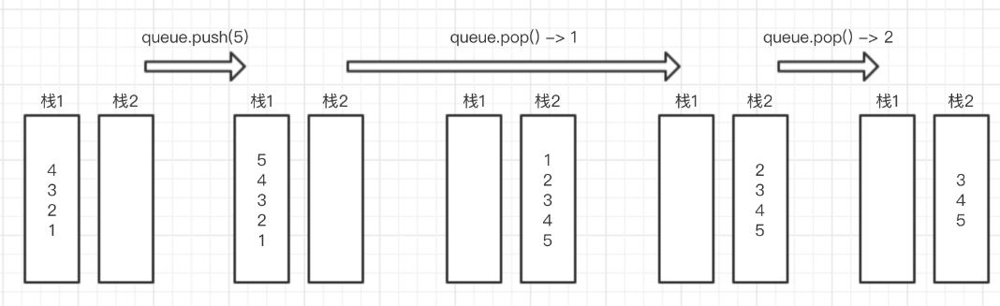

```js
const stack1 = []
const stack2 = []

function push(node) {
  stack1.push(node)
}

function pop() {
  if (stack2.length === 0) {
    while (stack1.length > 0) {
      stack2.push(stack1.pop())
    }
  }
  return stack2.pop() || null
}
````


## 栈 Stack

```bash
## 栈
- 栈是一个线性结构，所以栈元素具有线性关系，即前驱后继关系，只不过它是一种的特殊的线性表。
- 栈的插入操作叫进栈，栈的删除操作叫出栈，遵循'先进后出'的原则。
- 栈的特殊在于限制了这个线性表的插入和删除位置，它始终只在栈顶进行。即栈底是固定的，最先进栈的只能在栈底。
- 在计算机中，栈长被用于程序的调用帧栈，在程序中出现的 StackOverFlow 异常就是由于程序调用栈用尽，所以栈一般都是有相对固定的深度（栈深往往被设定的内存影响）。


### 栈的基本操作
- 入栈 - push
- 出栈 - pop
- 查看栈顶 - peek
- 检查栈是否为空 - isEmpty
- 获取栈的大小 - size


### 匹配括号
通过栈先进后出的特点来判断是否形成闭环

```

```ts
class Stack<T = number> {
  private storage: T[] = []

  /** 入栈操作 */
  public push(item: T): void {
    this.storage.push(item)
  }

  /** 出栈操作 */
  public pop(): T | undefined {
    return this.storage.pop()
  }

  /** 查看栈顶 */
  get peek(): T | undefined {
    return this.storage.at(-1)
  }

  /** 检查栈是否为空 */
  get isEmpty(): boolean {
    return this.storage.length === 0
  }

  /** 获取栈的大小(元素数量) */
  get size(): number {
    return this.storage.length
  }

  /** 清空栈 */
  public clear(): void {
    this.storage = []
  }

  /** 输出栈 */
  public print(): void {
    console.log(this.storage.toString())
  }
}

const stack = new Stack<number>()
console.log(stack.isEmpty) // true
stack.push(1)
stack.push(2)
stack.print() // 1,2
console.log(stack.peek) // 2
console.log(stack.pop()) // 2
console.log(stack.size) // 1
console.log(stack.isEmpty) // false
```


#### 匹配括号

```js
let isValid = function (str) {
  strArr = str.split('');	// 字符串转数组
  let map = {
    '(': -1, ')': 1,
    '[': -2, ']': 2,
    '{': -3, '}': 3,
  }
  let stack = [];
  for (let i = 0; i < strArr.length; i++) {
    if (map[strArr[i]] < 0) {
      stack.push(strArr[i])  // 左括号入栈
    } else {
      // 判断是否为右括号 且 是否形成闭环
      // (注意：需要数据是右括号才行，否则会破坏数据结构)
      if (map[strArr[i]] > 0 && map[stack.pop()] + map[strArr[i]] != 0) return false;
    }
  }
  return stack.length == 0
}
console.log(isValid('{9()8}'))  // true
console.log(isValid('{9(])8}'))  // false
console.log(isValid('{222)'))  // false
console.log(isValid('{'))   // false
```


#### 包含min函数的栈

```bash
### 包含 min 函数的栈
定义栈的数据结构，请在该类型中实现一个能够得到栈中所含最小元素的min函数（时间复杂度应为O（1））。


#### 思路
1.定义两个栈，一个栈用于存储数据，另一个栈用于存储每次数据进栈时栈的最小值.
2.每次数据进栈时，将此数据和最小值栈的栈顶元素比较，将二者比较的较小值再次存入最小值栈.
4.数据栈出栈，最小值栈也出栈。
3.这样最小值栈的栈顶永远是当前栈的最小值。
```

```ts
/**
 * @class MinStack 包含min函数的栈
 * @description 定义栈的数据结构，请在该类型中实现一个能够得到栈中所含最小元素的min函数（时间复杂度应为O（1））。
 */
class MinStack<T = number> {
  public stack: T[] = []
  public minStack: T[] = []

  /** 入栈 */
  public push(value: T): void {
    this.stack.push(value)
    // 如果 minStack 为空，或新元素比 minStack 栈顶元素小，则将新元素推入 minStack 中
    if (!this.minStack.length || value <= this.minStack.at(-1)!) {
      this.minStack.push(value)
    }
  }

  /** 出栈 */
  public pop(): void {
    const value = this.stack.pop()
    // 如果 stack 出栈的元素等于 minStack 栈顶元素，则将 minStack 出栈
    if (value === this.minStack.at(-1)) {
      this.minStack.pop()
    }
  }

  /** 查看栈顶元素 */
  public top(): T | undefined {
    return this.stack.at(-1)
  }

  /** 获取栈中的最小元素 */
  public min(): T | undefined {
    return this.minStack.at(-1)
  }
}

const minStack = new MinStack()
;[3, 4, 2, 7, 9, 0].forEach((value) => minStack.push(value))
console.log(minStack.stack, minStack.minStack) // [3, 4, 2, 7, 9, 0], [3, 2, 0]
console.log(minStack.min()) // 应输出 0
minStack.pop()
console.log(minStack.top()) // 应输出 9
console.log(minStack.min()) // 应输出 2
```


#### 栈的压入&弹出序列

```bash
### 栈的压入、弹出序列
输入两个整数序列，第一个序列表示栈的压入顺序，请判断第二个序列是否可能为该栈的弹出顺序。假设压入栈的所有数字均不相等。例如序列1,2,3,4,5是某栈的压入顺序，序列4,5,3,2,1是该压栈序列对应的一个弹出序列，但4,3,5,1,2就不可能是该压栈序列的弹出序列。（注意：这两个序列的长度是相等的）


#### 思路
1. 创建一个空数组 stack 模拟栈，模拟栈的弹出，再跟弹出序列对比是否一致。
2. 迭代压栈序列 Pushed，将每个元素压入模拟的栈中。
3. 再每次压栈后，检查栈顶元素是否与弹出序列 Popped 中的当前元素相同。如果相同，则持续弹出栈，并将 popIndex 指针向前移动，直到栈顶元素与弹出序列的当前元素不同或者栈为空。
4. 循环结束，如果模拟栈为空，则说明可以按照 Popped 序列完全弹出 Pushed 中的元素。
```
```ts
function validateStackSequences<T = number>(pushed: T[], popped: T[]): boolean {
  if (!pushed || !popped || !pushed.length || !popped.length) return false

  let stack: T[] = []
  let popIndex: number = 0

  for (let num of pushed) {
    // 模拟压栈操作
    stack.push(num)

    // 检查栈顶元素与弹出序列当前元素是否相同，如果相同则持续弹栈直到不相同或栈空
    while (stack.length && stack.at(-1) === popped[popIndex]) {
      stack.pop()
      popIndex++
    }
  }

  // 如果都能正常弹出，stack 应该为空
  return stack.length === 0
}

// 测试代码
console.log(validateStackSequences([1, 2, 3, 4, 5], [4, 5, 3, 2, 1])) // 输出: true
console.log(validateStackSequences([1, 2, 3, 4, 5], [4, 3, 5, 1, 2])) // 输出: false

```


## 堆 Heap

```bash
## 堆 Heap
堆的底层实际上是一颗完全二叉树，可以用数组实现。
- 每个的节点元素值不小于其子节点 - 最大堆
- 每个的节点元素值不大于其子节点 - 最小堆


#### 堆的基本操作
1. 堆的构建
  1-1. 大顶堆 createMaxHeap
    从第一个非叶子节点开始依次对数组中的元素进行下沉操作。
      和孩子节点的最大值 max 比较。
          - 大于 max: 不需要再下沉。
          - 小于 max: 和 max 交换位置，然后继续和下一层孩子节点比较，直到队列末尾。

	1-2. 小顶堆 createMinHeap
		从第一个非子节点开始依次堆数组中的元素进行下沉操作。
      和孩子节点的最小值 min 比较。
        - 小于 min: 不需要下沉
        - 大于 min: 和 min 交换位置(下沉) - 继续和下一层孩子节点比较，直到队列末尾。

2. 堆的插入
  由于堆属于优先队列，只能从末尾添加
  添加后有可能会破坏堆的结构，需要从下到上进行调整
  如果元素小于父元素，则上浮

3. 堆的移除
  由于堆属于优先队列，只能从头部移除
  移除头部后，使用末尾元素填充头部，开始头部下沉操作


### 应用
堆在处理某些特殊场景时可以大大降低代码的事件复杂度，例如在庞大的数据中找到最大的几个数或者最小的几个数，可以借助堆来完成这个过程。
1. 堆的基本操作
2. 数据流中的中位数
3. 最小的K个数

```

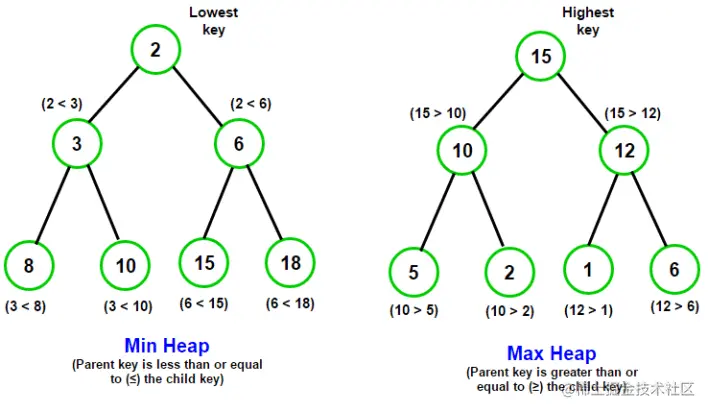

#### 堆的基本操作

```ts
/**
 * @class Heap
 * 堆(Heap)的类模板，包括大顶堆和小顶堆的基本操作
 */
export class Heap<T = number> {
  private heapType: 'max' | 'min'
  /** 存储的堆元素的数组 */
  private heap: T[]
  /** 比较函数，确定堆的类型（大顶堆或小顶堆） */
  private compare: (a: T, b: T) => boolean

  constructor(heapType: 'max' | 'min' = 'max', initHeap: T[] = []) {
    const maxCompareFn = (a, b) => a > b
    const minCompareFn = (a, b) => a < b

    this.heapType = heapType
    this.compare = heapType === 'max' ? maxCompareFn : minCompareFn
    this.heap = []

    // 初始化堆
    initHeap.forEach((value) => this.insert(value))
  }

  /** 堆的大小 */
  get size(): number {
    return this.heap.length
  }

  /** 获取堆顶元素 */
  get top(): T | undefined {
    return this.heap?.[0]
  }

  /** 获取所有堆元素(排序 -> 大顶堆:从大到小，小顶堆:从小到大) */
  get getHeap(): T[] {
    const minSortFn = (a, b) => a - b
    const maxSortFn = (a, b) => b - a
    return this.heap.sort(this.heapType === 'max' ? maxSortFn : minSortFn)
  }

  /** 父节点索引 */
  private getParentIndex(i: number): number {
    return Math.floor((i - 1) / 2)
  }

  /** 左节点索引 */
  private getLeftChildIndex(i: number): number {
    return 2 * i + 1
  }

  /** 右节点索引 */
  private getRightChildIndex(i: number): number {
    return 2 * i + 2
  }

  /** 交换堆中两个元素的位置 */
  private swap(i: number, j: number): void {
    ;[this.heap[i], this.heap[j]] = [this.heap[j], this.heap[i]]
  }

  /** 向堆中插入一个元素 */
  public insert(value: T): void {
    this.heap.push(value)
    let index = this.size - 1
    let parentIndex = this.getParentIndex(index)

    // 上浮调整，以满足堆的性质
    while (
      index > 0 &&
      this.compare(this.heap[index], this.heap[parentIndex])
    ) {
      this.swap(index, parentIndex)
      index = parentIndex
      parentIndex = this.getParentIndex(index)
    }
  }

  /** 删除: 从堆中取出最大元素（堆顶元素） */
  public extract(): T | undefined {
    const size = this.size
    if (size === 0) return undefined
    const root = this.heap[0]
    const last = this.heap.pop()!
    if (size > 1) {
      this.heap[0] = last
      this.heapify(0)
    }
    return root
  }

  /** 下沉调整，确保堆的性质 */
  public heapify(index: number): void {
    const left = this.getLeftChildIndex(index)
    const right = this.getRightChildIndex(index)
    let largestOrSmallest = index

    // 比较当前节点与左子节点，更新最大（或最小）值的索引
    if (
      left < this.size &&
      this.compare(this.heap[left], this.heap[largestOrSmallest])
    ) {
      largestOrSmallest = left
    }

    // 比较当前（或更新后的）节点与右子节点，更新最大（或最小）值的索引
    if (
      right < this.size &&
      this.compare(this.heap[right], this.heap[largestOrSmallest])
    ) {
      largestOrSmallest = right
    }

    // 如果最大（或最小）值的索引已变化，执行交换并递归调用 heapify
    if (largestOrSmallest !== index) {
      this.swap(index, largestOrSmallest)
      this.heapify(largestOrSmallest)
    }
  }
}

console.log('创建大顶堆示例 --->')
const maxHeap = new Heap('max', [3, 4])
maxHeap.insert(1)
console.log(maxHeap.getHeap) // [4, 3, 1]
console.log(maxHeap.extract(), maxHeap.extract(), maxHeap.extract()) // 4 3 1

console.log('创建小顶堆示例 --->')
const minHeap = new Heap('min', [3, 4])
minHeap.insert(1)
console.log(minHeap.getHeap) // [1, 3, 4]
console.log(minHeap.extract(), minHeap.extract(), minHeap.extract()) // 1 3 4
```


#### 两个队列实现栈

```js
const queue1 = []
const queue2 = []

function push(x) {
  if (queue1.length === 0) {
    queue1.push(x)

    while (queue2.length) {
      queue1.push(queue2.shift())
    }
  } else if (queue2.length === 0) {
    queue2.push(x)

    while (queue1.length) {
      queue2.push(queue1.shift())
    }
  }
}

function pop() {
  if (queue1.length !== 0) {
    return queue1.shift()
  } else {
    return queue2.shift()
  }
}
```


#### 数据流中的中位数

```bash
### 数据流中的中位数
因为数据流是动态的，意味着数据会不断地添加进来。中位数是指在一组数字中处于中间位置的数字。
如果从数据流中读出奇数个数值，那么中位数就是所有数值排序之后位于中间的数值。
如果从数据流中读出偶数个数值，那么中位数就是所有数值排序之后中间两个数的平均值。


### 思路 (使用最大堆和最小堆组合来处理数据流中的中位数问题)
使用一个最大堆来存储当前所有数字中较小的一半，- 一个最小堆来存储当前所有数字中较大的一半。
	1. 当最大堆的元素个数比最小堆多1个时，将最小堆中的元素插入到最大堆中
	2. 如果最大堆的个数比最小堆少时，取出最小堆中的堆顶元素到最大堆中
```

```ts
/**
 * @class MiniHeap
 * 简化版的堆结构
 */
export class MiniHeap<T = number> {
  /** 存储的堆元素的数组 */
  private heap: T[]
  /** 比较函数，确定堆的类型（大顶堆或小顶堆） */
  private compare: (a: T, b: T) => number

  constructor(heapType: 'max' | 'min' = 'max') {
    this.heap = []
    const maxCompareFn = (a, b) => a - b
    const minCompareFn = (a, b) => b - a
    this.compare = heapType === 'max' ? maxCompareFn : minCompareFn
  }

  public insert(value: T): void {
    this.heap.push(value)
    this.heap.sort(this.compare)
  }

  public extract(): T | undefined {
    return this.heap.shift()
  }

  public top(): T | undefined {
    return this.heap?.[0]
  }

  get size(): number {
    return this.heap.length
  }
}

/**
 * @class MedianFinder
 * 中位数查找器
 */
export class MedianFinder<T = number> {
  /** 最大堆: 存储当前所有数字中较小的一半 */
  private maxHeap: MiniHeap<T>
  /** 最小堆: 存储当前所有数字中较大的一半 */
  private minHeap: MiniHeap<T>

  constructor() {
    this.maxHeap = new MiniHeap<T>('max')
    this.minHeap = new MiniHeap<T>('min')
  }

  /** 数据流中增加数据(往堆结构中添加数据) */
  public addNum(value: T): void {
    // 先插入最大堆中排序存储，然后再取出顶点元素放入最小堆 (最大堆的顶点元素一定是最大堆中最大的元素)
    this.maxHeap.insert(value)
    this.minHeap.insert(this.maxHeap.extract()!)

    // 两个堆保持数量均衡
    if (this.maxHeap.size < this.minHeap.size) {
      this.maxHeap.insert(this.minHeap.extract()!)
    }
  }

  /** 在数据流中查找中位数 */
  public findMedian(): T | number {
    if (this.maxHeap.size > this.minHeap.size) return this.maxHeap.top()!
    return (Number(this.maxHeap.top()) + Number(this.minHeap.top())) / 2
  }
}

/** 示例代码 */
const medianFinder = new MedianFinder()
medianFinder.addNum(1)
medianFinder.addNum(2)
console.log(medianFinder.findMedian()) // 1.5
medianFinder.addNum(3)
console.log(medianFinder.findMedian()) // 2
```


#### 最小的K个数

```bash
### 最小的 K 个数
输入n个整数，找出其中最小的K个数。
例如输入 4,5,1,6,2,7,3,8 这 8 个数字，则最小的 4 个数字是 1,2,3,4


#### 思路
思路1:
	先排序，再取出前 k 个数，最小时间复杂度 nlogn。

思路2:
	1. 把前 k 个数构建一个大顶堆。
	2. 从第 k 个数开始，和大顶堆的最大值进行比较，若比最大值小，则交换两个数的位置，重新构建大顶堆。
	3. 一次遍历之后大顶堆里的数就是整个数据里最小的 k 个数。
	时间复杂度 nlogk。

```

```ts
const getLeastNumbers = (nums: number[], k: number): number[] => {
  if (k === 0 || nums.length === 0) return []

  /** 创建大顶堆 */
  const maxHeap = new Heap('max')

  // 先填充大小为 k 的最大堆
  for (let i = 0; i < k; i++) maxHeap.insert(nums[i])

  // 对数组中的剩余元素与堆中元素对比，如果比堆顶元素小，则替换堆顶元素
  for (let i = k; i < nums.length; i++) {
    if (nums[i] < maxHeap.top!) {
      maxHeap.extract()
      maxHeap.insert(nums[i])
    }
  }

  return maxHeap.getHeap.reverse()
}

/** 示例 */
console.log(getLeastNumbers([4, 5, 1, 6, 2, 7, 3, 8], 4)) // [1,2,3,4]
```


## 哈希表 HashTable

```bash
## 哈希表 HashTable
哈希的基本原理是将给定的键值转换为偏移地址来检索记录。
键转换成地址是通过一种关系（公式）来完成，这就是哈希（散列）函数。
虽然哈希表是一种有效的搜索技术，但它还是有些缺点。两个不同的关键字，由于哈希函数值相同，因而被映射到同一表位置上。该现象称为冲突。发生冲突的两个关键字称为该哈希函数的同义词。


### 哈希函数设计问题
如何设计哈希函数以及避免冲突就是哈希表的常见问题，好的哈希函数的选择有两条标准：
  1. 简单快速地计算
  2. 能够在地址空间中获得键的均匀分布


## 应用
1. 常数事件插入、删除和获取随机元素
（当用到哈希表时我们通常要开辟一个额外空间来记录一些计算过的值，同时我们又要在下一次计算的过程中快速检索到它们，例如两数之和、三数之和等都利用了这种思想）
2. 两数之和、三数之和
3. 字符流中第一个不重复的字符
4. 宝石与石头
```

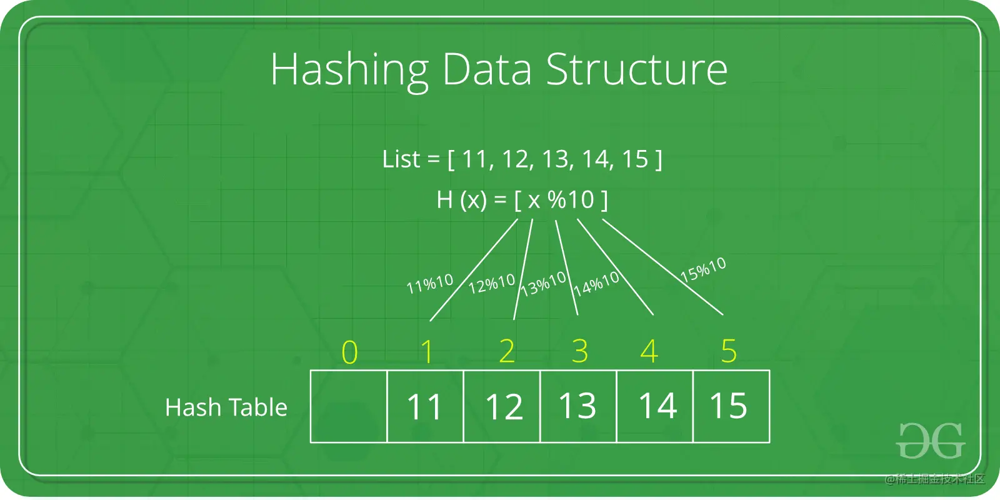


#### 字符流中第一个不重复的字符

```bash
### 字符流中第一个不重复的字符
请实现一个函数用来找出字符流中第一个只出现一次的字符。
例如:
	- 当从字符流中只读出前两个字符"go"时，第一个只出现一次的字符是"g"。
	- 当从该字符流中读出前六个字符"google"时，第一个只出现一次的字符是"l"。
	- 如果当前字符流没有存在出现一次的字符，返回'#'字符。


#### 思路
题目: 字符流中第一个不重复的字符
  请实现一个函数用来找出字符流中第一个只出现一次的字符。
  例如:
    - 当从字符流中只读出前两个字符"go"时，第一个只出现一次的字符是"g"。
    - 当从该字符流中读出前六个字符"google"时，第一个只出现一次的字符是"l"。
    - 如果当前字符流没有存在出现一次的字符，返回'#'字符。
思路:
  要求是获得第一个出现，且只出现一次的
  错误解法：
    - 使用一个有序的存储结构(Object/Map)为每个数字计数，再遍历整个对象，第一个出现次数为 1 的即为结果。
    - 因为对象遍历在所有浏览器中的实现并不是都是有序的，而且直接使用对象存储，当字符流中出现数字时也会有问题。
  正确解法：
    通过维护一个字符出现次数的哈希表和一个队列来实现。哈希表用于记录每个字符出现的次数，而队列用于记录字符出现的顺序。
    每次读取一个字符，都更新哈希表，并检查队列的前端字符是否仍然只出现一次，如果不是，则从队列中移除，直到队列的前端字符是只出现一次的字符。
```

```ts
/**
 * @class FirstUniqueCharInStream
 * 字符流中第一个不重复的字符
 */
export class FirstUniqueCharInStream {
  private charCount: Map<string, number>
  private queue: Array<string>

  constructor(initQueue: string[] = []) {
    this.charCount = new Map<string, number>()
    this.queue = initQueue

    // 初始化时如果有数据，则需要处理
    if (initQueue.length) {
      initQueue.forEach((char) => this.readChar(char))
    }
  }

  /** 处理每个来自字符流的字符 */
  public readChar(char: string): void {
    if (this.charCount.has(char)) {
      this.charCount.set(char, this.charCount.get(char)! + 1)
    } else {
      this.charCount.set(char, 1)
      this.queue.push(char)
    }

    // 清除队列中不再是唯一的字符
    while (this.queue.length && this.charCount.get(this.queue[0])! > 1) {
      this.queue.shift()
    }
  }

  /** 获取当前字符流中第一个只出现一次的字符 */
  get getFirstUniqueChar(): string | null {
    if (this.queue.length) return this.queue[0]
    return null
  }
}

const stream = new FirstUniqueCharInStream(['a', 'b', 'a'])
console.log("['a', 'b', 'a'] =>", stream.getFirstUniqueChar) // 输出 'b'，因为 'b' 是目前为止唯一出现一次的字符
stream.readChar('c')
console.log("['a', 'b', 'a', 'c'] =>", stream.getFirstUniqueChar) // 输出 'b'
stream.readChar('b')
console.log("['a', 'b', 'a', 'c', 'b'] =>", stream.getFirstUniqueChar) // 输出 'c'
```


## 二叉树 BinaryTree

> ```bash
> ## 完全二叉树的公式
> - 第 n 层的节点数最对为 2^n 个节点
> - n 层二叉树最多有 2^0 + ... + 2^n = 2^(n+1) -1 个节点
> - 第一个非野子节点：length/2
> - 一个节点的孩子节点：2n 或 2n+1
> ```
>
> 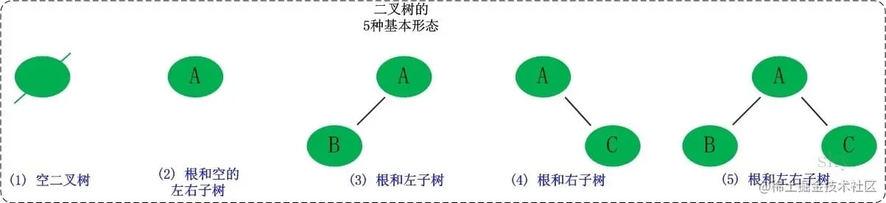
>
> 
>

### 二叉树基本操作

> ```bash
> ## 二叉树的基本操作
> 1. 插入树节点
> 2. 前序遍历
> 3. 中序遍历
> 4. 后序遍历
> 5. 获取最大值的节点
> 6. 获取最小值的节点
> 7. 获取树的深度
> ```
>
> ```ts
> /** 树节点约束 */
> interface ITreeNode {
>   /** 值 */
>   value: number
>   /** 左孩子 */
>   left: ITreeNode | null
>   /** 右孩子 */
>   right: ITreeNode | null
> }
> /** 树的 root 存储的可能值 */
> type ITree = ITreeNode | null
>
> /** 节点类（记录每个节点上下关联） */
> class TreeNode implements ITreeNode {
>   public value = 0
>   public left = null
>   public right = null
>
>   constructor (value: number) {
>     this.value = value
>   }
>
>   show () {
>     console.log(this.value)
>   }
> }
>
> /** 树类 */
> class Tree {
>   /** 根节点 */
>   private root: ITree
>
>   constructor (treeNode: ITree = null) {
>     this.root = treeNode
>   }
>
>   /** 插入节点 */
>   insertNode (nodeValue: number): ITree {
>     const treeNode = new TreeNode(nodeValue)
>     if (!this.root) {
>       this.root = treeNode
>       return this.root
>     }
>
>     let curNode: ITree = this.root
>     let parent: ITree = null
>
>     while (curNode) {
>       parent = curNode
>
>       if (nodeValue < parent.value) {
>         curNode = curNode.left
>         if (!curNode) {
>           parent.left = treeNode
>           return this.root
>         }
>       } else {
>         curNode = curNode.right
>         if (!curNode) {
>           parent.right = treeNode
>           return this.root
>         }
>       }
>     }
>
>     return this.root
>   }
>
>   /** 插入多个节点 */
>   inserNodes (nodeValues: number[]): ITree {
>     nodeValues.forEach(nodeValue => {
>       this.insertNode(nodeValue)
>     })
>     return this.root
>   }
>
>   /** 前序遍历 */
>   preOrder (treeNode = this.root): Array<number> {
>     if (treeNode === null) return []
>     return [
>       treeNode.value,
>       ...this.preOrder(treeNode.left),
>       ...this.preOrder(treeNode.right),
>     ]
>   }
>
>   /** 中序遍历 */
>   middleOrder (treeNode = this.root): Array<number> {
>     if (treeNode === null) return []
>     return [
>       ...this.middleOrder(treeNode.left),
>       treeNode.value,
>       ...this.middleOrder(treeNode.right),
>     ]
>   }
>
>   /** 后序遍历 */
>   laterOrder (treeNode = this.root): Array<number> {
>     if (treeNode === null) return []
>     return [
>       ...this.laterOrder(treeNode.left),
>       ...this.laterOrder(treeNode.right),
>       treeNode.value,
>     ]
>   }
>
>   /** 获取树的最小值的节点 */
>   getMin (): ITree {
>     let current = this.root
>     while (current) {
>       if (!current.left) {
>         return current
>       }
>       current = current.left
>     }
>     return null
>   }
>
>   /** 获取树的最大值的节点 */
>   getMax (): ITree {
>     let current = this.root
>     while (current) {
>       if (!current.right) {
>         return current
>       }
>       current = current.right
>     }
>     return null
>   }
>
>   /** 获取树的深度 */
>   getDeep (treeNode = this.root, deep = 0) {
>     if (treeNode === null) return deep
>     deep++
>     const dleft = this.getDeep(treeNode.left, deep)
>     const dright = this.getDeep(treeNode.right, deep)
>     return Math.max(dleft, dright)
>   }
> }
>
> /** 测试代码 */
> const t = new Tree()
> t.insertNode(3)
> t.inserNodes([8, 1, 2, 5, 7, 6, 0])
> console.log(t)
> console.log('节点遍历', t.preOrder(), t.middleOrder(), t.laterOrder())
> console.log('节点最值：', t.getMin(), t.getMax())
> console.log('节点深度：', t.getDeep())
> ```

### 二叉树的遍历

#### 二叉树的前序遍历

> ```bash
> ## 二叉树的前序遍历
> 取根节点为目标节点，开始遍历：
> 	1. 访问目标节点。
>   2. 左孩子入栈 -> 直至左孩子为空的节点。
>   3. 节点出栈，以右孩子为目标节点，再依次执行步骤 1、2、3。
>
>
> ### 示例
> 输入: [1,null,2,3]
>    1
>     \
>      2
>     /
>    3
> 输出: [1,2,3]
> ```
>
> #### 【非递归实现前序遍历】
>
> ```js
> /**
>  * 二叉树的前序遍历
>  * @param root 树的根节点
>  */
> const preorderTraversal = function (root) {
>   const result = []
>   const stack = []
>   let curNode = root
>
>   while (curNode || stack.length > 0) {
>     while (curNode) {
>       result.push(curNode.value)
>       stack.push(curNode)
>       curNode = curNode.left
>     }
>
>     curNode = stack.pop()
>     curNode = curNode.right
>   }
>
>   return result
> }
> ```
>
> #### 【递归实现前序遍历】
>
> ```js
> /**
>  * 二叉树的前序遍历
>  * @param root 树的根节点
>  * @param result 导出的遍历结果：数组
>  */
> const preorderTraversal = function (root, result = []) {
>   if (root !== null) {
>     result.push(root.value)
>     preorderTraversal(root.left, result)
>     preorderTraversal(root.right, result)
>   }
>   return result
> }
> ```

#### 二叉树的中序遍历

> ```bash
> ## 二叉树的中序遍历
> 取根节点为目标节点，开始遍历：
>   1. 左孩子入栈 -> 直至左孩子为空的节点。
>   2. 节点出栈 -> 访问该节点。
>   3. 以右孩子为目标节点，再依次执行步骤 1、2、3。
>
>
> ### 示例
> 输入: [1,null,2,3]
>    1
>     \
>      2
>     /
>    3
> 输出: [1,3,2]
> ```
>
> #### 【非递归实现中序遍历】
>
> ```js
> /**
>  * 二叉树的中序遍历
>  * @param root 树的根节点
>  */
> const inorderTraversal = function (root) {
>   const result = []
>   const stack = []
>   let curNode = root
>
>   while (curNode || stack.length > 0) {
>     while (curNode) {
>       stack.push(curNode)
>       curNode = curNode.left
>     }
>
>     curNode = stack.pop()
>     result.push(curNode.value)
>     curNode = curNode.right
>   }
>
>   return result
> }
> ```
>
> #### 【递归实现中序遍历】
>
> ```js
> /**
>  * 二叉树的中序遍历
>  * @param root 树的根节点
>  * @param result 导出的遍历结果：数组
>  */
> const inorderTraversal = function (root, result = []) {
>   if (root !== null) {
>     inorderTraversal(root.left, result)
>     result.push(root.value)
>     inorderTraversal(root.right, result)
>   }
>   return result
> }
> ```

#### 二叉树的后序遍历

> ```bash
> ## 二叉树的后序遍历
> 取根节点为目标节点，开始遍历：
>   1. 左孩子入栈 -> 直至左孩子为空的节点。
>   2. 栈顶节点的右节点为空或右节点被访问过 -> 节点出栈并访问它，将节点标记为已访问。
>   3. 栈顶节点的右节点不为空且未被访问，以右孩子为目标节点，再依次执行步骤 1、2、3。
>
>
> ### 示例
> 输入: [1,null,2,3]
>    1
>     \
>      2
>     /
>    3
> 输出: [3,2,1]
> ```
>
> #### 【非递归实现后序遍历】
>
> ```js
> /**
>  * 二叉树的后序遍历
>  * @param root 树的根节点
>  */
> const postorderTraversal = function (root) {
>   const result = []
>   const stack = []
>   let last = null // 标记上一个访问的节点
>   let curNode = root
>
>   while (curNode || stack.length > 0) {
>     while (curNode) {
>       stack.push(curNode)
>       curNode = curNode.left
>     }
>
>     curNode = stack[stack.length - 1]
>     if (!curNode.right || curNode.right === last) {
>       curNode = stack.pop()
>       result.push(curNode.value)
>       last = curNode
>       curNode = null // 继续弹栈
>     } else {
>       curNode = curNode.right
>     }
>   }
>
>   return result
> }
> ```
>
> #### 【递归实现后序遍历】
>
> ```js
> /**
>  * 二叉树的后序遍历
>  * @param root 树的根节点
>  * @param result 导出的遍历结果：数组
>  */
> const postorderTraversal = function (root, result: any[] = []) {
>   if (root !== null) {
>     postorderTraversal(root.left, result)
>     postorderTraversal(root.right, result)
>     result.push(root.value)
>   }
>   return result
> }
> ```

### 二叉树的重建

```bash
## 二叉树的重建

```


### 二叉树的对称性

#### 对称的二叉树

```bash

```


#### 对称的二叉树

```bash

```


### 二叉树的深度

#### 二叉树的最大深度

```bash

```


#### 二叉树的最小深度

```bash

```


#### 平衡二叉树

```bash

```


### 二叉搜索树 BST

> ```bash
> ## 二叉搜索树 BST(Binary Search Tree)
> ### 描述
> 是二叉树的一种，专注于检索，特点是让节点按照一定的规律摆放，从而让搜索某个节点特别的高效。
> 如果以根节点划分二叉搜索树，左子树里的节点全部小于根节点，右子树全部大于根节点；而且无论以哪个节点作为根节点来划分，规律亦是如此。
> 注意：二叉搜索树每个节点的值必须具备可比较性。
>
> ## 作用
> 当我们需要检索一个值时，如果大于该节点就去右子树查找，如果小于就去该节点的左子树查找，每次都可以过滤一半查找返回。例如图中一共有15个数字，找到数字33根据比对只需要查找4次即可。
>
>
> ## 插入
> 根据二叉搜索树的定义，所以需要保证无论往这棵树上增加多少个节点，都需要保证其定义不被破坏。
> 当遇到一个新的节点需要插入时，我们可以与根节点进行比较：
>   - 如果比根节点值大就放入右子树内；
>   - 如果比根节点值小，就放入左子树内；
> 使用这样的插入规则，逐层往下，当遇到一个节点的孩子为空，将新节点设置为其新的孩子节点即可。
>
>
> ## 查找
> 关于二叉搜素树的搜索，根据二叉搜索树的特性从根节点开始逐层递归进行比较，对于每个节点：
>   - 如果目标值等于节点的值，则返回节点；
>   - 如果目标值小于节点的值，则继续在左子树中搜索；
>   - 如果目标值大于节点的值，则继续在右子树中搜索；
>   - 如果根据规则最后遇到了空节点，则说明这棵树里没有这个节点。
>
>
> ## 删除
> 二叉搜索树最繁琐的就是删除，因为删除一个节点后，原来位置的节点并不会空着，必须找到替代的节点续上才行。续上后续节点而又保持二叉搜索树的定义分为几种情况：
>   1. 只有一边有孩子节点：将另一边孩子节点续上即可。
>   2. 两边都有孩子节点：有两种处理方式，
>     - 一种是在待删除节点的左子树里找到最大的值替代，然后切断其链接；
>       指定树的最大值一定是在其左子树沿着右边一直找到最后那个非空节点的值。
>     - 另一种是在待删除的右子树里找到最小值替代，然后切断其链接。
>       根据二叉搜索树的特性，指定树的最小值一定是沿着左边一直找，最后找到的那个非空节点；而删除指定树的最小值节点，也只需用被删除节点的右子树续上即可。
> 需要注意点如下：
>     - 如果目标节点 '没有子节点'，我们可以 '直接移除' 该目标节点。
>     - 如果目标节点 '只有一个子节点'，我们可以用其子节点作为 '替换'。
>     - 如果目标节点 '有两个子节点'，我们需要用其中序 '后继节点或前驱结点' 来替换，再删除该节点。
>
>
> ## 性能对比
> 存储需要占用额外空间去保存节点的指针，但这一些是为了在搜索时使得性能优化。比如从 100 万条数据里查找对应数据，数组需要 O(n) 的复杂度，而二叉搜索树平均只需要 O(logn) 即可，也就是查找 20 次即可找到，当树的节点数量每次 ×2 的倍增时，查找的次数只是 +1 而已。而从 100 万条数据里移除某条数据时，数组需要 O(n) 的搬家操作，而二叉树每次也只需要 O(logn) 即可完成操作。
> - 增加数据：数组 O(1)		二叉搜索树(平均)	O(logn)
> - 查找数据：数组 O(n)		二叉搜索树(平均)	O(logn)
> - 删除数据：数组 O(n)		二叉搜索树(平均)	O(logn)
>
> 在二叉搜索树的性能对比中需要加上平均时，是因为会出现极端的情况，如整一颗二叉树只有右节点，会使得查找的次数急剧增加。
> 所以二叉搜索树的缺点也很明显，极端情况下回退化成链表，这时它的任何操作会变成 O(n)。
> 为了避免这种情况出现，就需要使用自平衡二叉搜索树（AVL树、红黑树）。
> ```
>
> 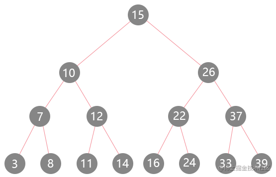
>
> 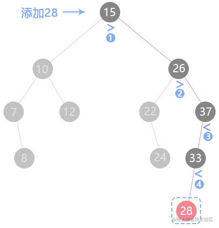
>
> 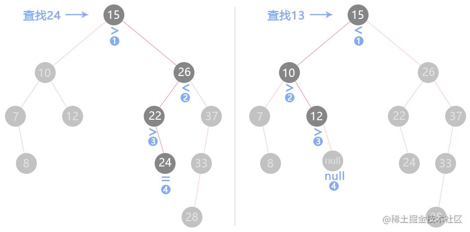
>
> 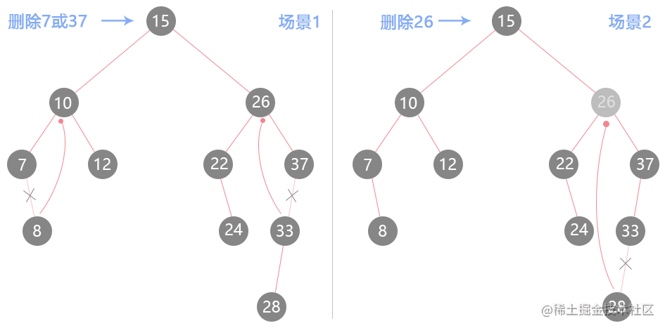
>
> ```js
> /** 节点类（记录每个节点上下关联） */
> class TreeNode {
>   constructor(value) {
>     this.value = value
>     this.left = null // 左孩子
>     this.right = null // 右孩子
>   }
> }
>
>
> /** 树类 */
> class BST {
>   constructor() {
>     this.root = null // 根节点
>   }
>
>   /** 插入新节点 */
>   insertNode(...insertArr) {
>     const _helper = (node, val) => {
>       // 如果某个节点的子节点为空，创建新节点返回
>       if (node === null) {
>         return new TreeNode(val)
>       }
>       // 如果当前节点比 val 大，新节点需要放在其左子树里
>       if (node.value > val) {
>         // 以当前节点左孩子为起点，返回新的左孩子节点
>         node.left = _helper(node.left, val)
>         return node // 返回新的结点
>       } else {
>         node.right = _helper(node.right, val)
>         return node
>       }
>     }
>     // 从根节点开始插入value，返回新节点
>     insertArr.forEach((value) => {
>       this.root = _helper(this.root, value)
>     })
>   }
>
>
>   /** 查找子节点 */
>   searchNode(value) {
>     const _helper = (node, val) => {
>       // 如果找到最底层节点也没找到
>       if (node === null) return null
>       // 正好找到
>       if (node.value === val) return node
>       // 如果比当前节点小，则去左子树查找，否则往右子树查找
>       if (node.value > val) {
>         return _helper(node.left, val)
>       } else {
>         return _helper(node.right, val)
>       }
>     }
>     // 从跟节点开始查找
>     return _helper(this.root, value)
>   }
>
>
>   /** 删除子节点 */
>   deleteNode(value) {
>     // 找到要删除的节点
>     const search = (node, val) => {
>       if (val === node.left.value || val === node.right.value) {
>         const parent = node.left.value === val ? node.left : node.right
>         const where = node.left.value === val ? 'left' : 'right'
>         return [node, parent, where]
>       } else {
>         const where = node.value < val ? 'right' : 'left'
>         return search(node[where], val)
>       }
>     }
>
>     // 保存要删除的节点，要删除节点的父节点，已经删除的左右方向
>     let [node, parent, where] = search(this.root, value)
>     if (node) {
>       if (parent.left === null && parent.right === null) {
>         node[where] = null
>       } else if (parent.left === null) {
>         node[where] = parent.right
>       } else if (parent.right === null) {
>         node[where] = parent.left
>       } else {
>         let empty = parent
>         // 找到左子树中最小的节点
>         while (empty.left.left !== null) {
>           empty = empty.left
>         }
>         // 把最左侧的底层节点移动到被删除的节点位置上
>         parent.value = empty.left.value
>         empty.left = null
>       }
>     }
>   }
>
>
>   /** 修改节点（注意：该实现在修改后并没有重排树，可能会造成使得树不再是二叉搜索树结构） */
>   replaceNode(oldVal, newVal) {
>     const replaceHelper = (node) => {
>       if (node === null) return false
>       if (node.value === oldVal) {
>         return node.value = newVal
>       } else if (node.value === oldVal) {
>         replaceHelper(node.right, oldVal)
>       } else {
>         replaceHelper(node.left, oldVal)
>       }
>     }
>     replaceHelper(this.root)
>   }
> }
>
> const bst = new BST()
> bst.insertNode(15, 10, 7, 12, 8, 26, 22, 24, 37, 33)
> bst.insertNode(28)
> console.log(bst.root) // 插入节点
> console.log(bst.searchNode(24)) // 查找节点
> bst.deleteNode(7)
> console.log(bst.root) // 删除节点
> bst.replaceNode(15)
> console.log(bst.root) // 修改节点
> ```

