## 设计模式

### 设计模式的六大原则

> ```bash
> ## 设计模式六大原则
> 1. 单一职责原则		SRP - Single Responsibility Principle
> 	一个人只做一件事
> 	如果功能过于复杂就拆分，每个拆分的子模块都要保持独立
> 	
> 	
> 2. 开放-封闭原则		OCP - OpenClosed Principle
> 	对扩展开放，对修改封闭
> 	软件实体（类、模块、函数）可以扩展，但是不可修改
> 	
> 	
> 3. 里氏替换原则		LSP - Liskov Substitution Principle
> 	子类能覆盖父类
> 	父类能出现的地方子类就能出现
> 	
> 4. 依赖倒转原则		DIP - Dependency Inersion Principle
> 	面向接口编程，依赖于抽象而不依赖于具体
> 	使用方只关注接口而不关注具体类的实现
> 	A.高层模块不应该依赖底层，两个都应该依赖抽象。
> 	B.抽象不应该依赖细节，细节依赖抽象
> 	
> 5. 接口隔离原则		ISP - Interface Segregation Principle
> 	保持接口的单一独立
> 	类似单一职责原则，这里更关注于接口
> 
> 6. 迪米特原则（最小知识原则）	LoD - law of demeter Principle
>   尽量降低类与类之间的耦合
>   如果两个类不必直接通信，那么这两个类不应当发生直接的相互作用。
>   如果其中一个类需要调用另一个类的某一个方法的话，可通过第三者发起这个调用
> ```

### 设计模式分类

> ```bash
> ## 创建型模式（五种）：用于解决对象的创建问题，抽象了实例化过程，使对象的创建和使用解耦
> - 着重点：提供了一种在创建对象时隐藏创建逻辑的方式，而不是直接实例化对象，提高了对象创建的灵活性
> 1. 工厂方法模式：允许一个类的实例化（产品的创建）延迟到子类中实现
> 2. 抽象工厂模式：选择产品簇的创建
> 3. 单例模式：控制对象实例的数目（一个类仅有一个实例对象。 	vuex、redux）
> 4. 建造者（生成器）模式：分离整体构建和部件的构造
> 5. 原型模式：克隆生成对象
> 
> 
> ## 结构型模式（七种）：描述如何将类或对象进行组合以实现更大的结构或新功能，实现多个类之间协同工作
> - 着重点： 关注类和对象的组合
> 1. 适配器模式：转换匹配，复用功能（一种数据结构改成另一种数据结构。	枚举值接口变更）
> 2. 装饰器模式：动态组合
> 3. 代理(委托)模式：代理对象和本体对象具有一致的接口（控制对象的访问。	图片懒加载）
> 4. 外观模式：封装交互，简化调用
> 5. 桥接模式：分离抽象和实现
> 6. 组合模式：在对象间形成一致对待的树形结构（统一叶子对象和组合对象。	扫描文件夹）
> 7. 享元模式：分离与共享，减少对象创建的个数，节约对象开销成本（减少创建实例的个数。	男女模具试装）
> 
> 
> ## 行为型模式（十一种）：描述算法和对象之间的交互和职责分配
> 1. 策略模式：根据不同参数可以命中不同的策略（分离算法，选择实现。	表单校验）
> 2. 状态模式：根据状态来分离和选择行为
> 3. 命令(事务)模式：不同对象间约定好相应的接口（封装请求。	项目负责人分配任务给相应的工作人员，而无需知道任务怎么完成）
> 4. 备忘录模式：保存和恢复内部状态
> 5. 职责链模式：通过请求第一个条件，会持续执行后续的条件，直到返回结果为止（分离职责，动态组合。	if-else的优化）
> 6. 迭代器模式：能获取聚合对象的顺序和元素（控制访问聚合对象中的元素。 each([1, 2, 3], cb)）
> 7. 解释器模式：分离实现，解释执行
> 8. 访问者模式：把对元素的访问操作交给访问者
> 9. 中介者(调停)模式：对象和对象之间借助第三方中介者进行通信（封装交互，对象间解耦。	测试结束告知结果）
> 10. 观察者(发布订阅)模式：当观察对象发生变化时，自动调用相关函数（订阅消息，发布通知消息更新。	vue 双向绑定）
> 11. 模板方法模式：父类中定好执行顺序（将定义'算法步骤骨架'和'具体实现'分离。	咖啡和茶）
> ```

## 创建型模式

### 【工厂模式】

> ```bash
> ## 工厂模式描述
> - 工厂模式是定义一个创建对象的接口，这个接口由子类决定实例化哪一个类。
> - 即是使一个类的实例化延迟到子类；而子类可以重写接口方法以便创建时指定自己的对象类型。
> - 主要思想：将创建者（对象的创建）与构造函数（对象的实现）分离开。将对象的逻辑封装在一个函数中（工厂函数），而不暴露对象创建的逻辑
> 
> ## JS的实现：
> 根据不同的输入返回不同类的实例，一般用来创建同一类对象
> 因为 JS 中没有抽象类，所以可将工厂模式看做一个实例化对象的工厂类。
> 
> 
> ## 工厂模式分类
> 工厂模式根据抽象程度不同可分为：
> 1. 简单工厂
> 2. 工厂方法
> 3. 抽象工厂
> 
> ## 优点
> 1. 对象的创建过程可能比较复杂，而访问者无需知道创建的具体流程（调用者想创建对象，只需要知道其名称）
> 2. 通过工厂方法分离构造函数和创建者，符合“开放封闭原则”
> 3. 扩展性优良，如果想增加一个产品，只需要扩展一个工厂类
> 4. 解耦了高层逻辑和底层产品类，符合最少知识原则，无需了解底层逻辑
> 
> ## 缺点
> 1. 每次新增或删除产品种类时，不仅要增加产品类，还需要对应修改的工厂方法，违反了开闭原则，也导致这个方法变得臃肿、高耦合。
> 2. 考虑到系统的可扩展性，需要引用抽象层，在客户端代码中均使用抽象层进行定义，带来了额外的系统复杂度，增加了系统的抽象性和理解难度
> 
> 
> ## 工厂模式适用场景
> 1. 如果不想让某个子系统与较大的那个对象之间形成强耦合，而是想运行时从许多子系统中进行挑选时，此模式为最佳选择
> 2. 将 new 操作简单封装，遇到 new 时应该考虑是否用工厂模式
> 3. 处理大量具有相同属性的小对象
> 
> 
> ## 非适用场景
> 当被应用到错误的问题类型上时，这一模式会给应用程序引来大量不必要的复杂性，除非为创建对象提供一个接口是我们编写的库或者框架的一个设计上目标，否则就建议使用明确的构造器，以避免不必要的开销。
> 由于对象的创建过程被高效的抽象在一个接口后面的事实，这也会给依赖于这个过程可能或有多复杂的单元测试带来问题。
> 
> 
> ## 工厂模式的应用：vue的异步组件 与 React的createElement()
> 在大型应用中，我们可能需要将应用分割成小一些的代码块，并且只在需要的时候才从服务器加载一个模块。
> 为了简化，Vue允许以一个工厂函数的方式定义你的组件，这个工厂函数会异步解析你的组件定义。
> Vue只有在这个组件需要被渲染时才会触发该工厂函数，且会把结果缓存起来供未来重渲染。
> 
> 
> ## 工厂模式 与 模板方法模式 的主要区别
> - 工厂模式主要关注产品实例的创建，对创建流程封闭起来
> - 模板方法模式主要专注的是为固定的算法骨架提供某些步骤的实现
> ```
>
> ### 工厂模式应用1：vue的异步组件
>
> ````js
> Vue.component('async-example', function (resolve, reject) {
>   setTimeout(() => {
>     resolve({
>       template: `<div>这是一个异步组件！</div>`
>     })
>   }, 1000)
> })
> ````
>
> ### 工厂模式应用2：路由权限控制
>
> ```js
> /** router/index.js */
> 
> import Vue from 'vue'
> import Router from 'vue-router'
> 
> Vue.use(Router)
> 
> export default new Router({
>   routes: [
>     //重定向到登录页
>     {
>       path: '/',
>       redirect: '/login'
>     },
>     //登陆页
>     {
>       path: '/login',
>       name: 'Login',
>       component: () => import('../components/Login.vue')
>     }
>   ]
> })
> ```
>
> ```ts
> // routerFactory.js
> const AllRoute = [
>   //超级管理员页面
>   {
>     path: '/super-admin',
>     name: 'SuperAdmin',
>     component: () => import('../components/SuperAdmin.vue')
>   },
>   //普通管理员页面
>   {
>     path: '/normal-admin',
>     name: 'NormalAdmin',
>     component: () => import('../components/Admin.vue')
>   },
>   //普通用户页面
>   {
>     path: '/user',
>     name: 'User',
>     component: () => import('../components/User.vue')
>   },
>   //404页面
>   {
>     path: '*',
>     name: 'NotFound404',
>     component: () => import('../components/404.vue')
>   }
> ]
> 
> export const routerFactory = (role) => {
>   switch (role) {
>     case 'superAdmin':
>       return {
>         name: 'SuperAdmin',
>         route: AllRoute
>       };
>       break;
>     case 'normalAdmin':
>       return {
>         name: 'NormalAdmin',
>         route: AllRoute.splice(1)
>       }
>       break;
>     case 'user':
>       return {
>         name: 'User',
>         route:  AllRoute.splice(2)
>       }
>       break;
>     default: 
>       throw new Error('参数错误! 可选参数: superAdmin, normalAdmin, user')
>   }
> }
> ```
>
> ```js
> // Login.vue
> import {routerFactory} from '../router/routerFactory.js'
> export default {
>   methods: {
>     userLogin() {
>       //请求登陆接口, 获取用户权限, 根据权限调用this.getRoute方法
>     },
> 
>     getRoute(role) {
>       //根据权限调用routerFactory方法
>       let routerObj = routerFactory(role);
> 
>       //给vue-router添加该权限所拥有的路由页面
>       this.$router.addRoutes(routerObj.route);
> 
>       //跳转到相应页面
>       this.$router.push({name: routerObj.name})
>     }
>   }
> };
> ```
>
> 在实际项目中，因为使用`this.$router.addRoutes`方法添加的路由刷新后不能保存，所以会导致路由无法访问。通常的做法是本地加密保存用户信息，在刷新后获取本地权限并解密，根据权限重新添加路由。

### 【简单工厂模式】

> ```bash
> ## 简单工厂模式的优缺点及应用场景
> 1. 简单工厂的优点：
> 	使用工厂函数时，只需传递一个合法的参数，就可以获取到想要的对象，而无需了解创建并返回该对象的具体细节。
> 
> 2. 简单工厂的缺点
> 	因为在工厂函数内包含了所有对象的构造函数和判断逻辑代码，若每次需要添加一个对象，则需要新增一个构造函数，当我们所需要维护的对象过多时，则这个函数将会成为超级函数，而导致难以维护。
> 
> 3. 简单工厂的推荐应用场景
> 	简单工厂模式只适用于所创建构造函数产生的对象数量少，以及逻辑简单的情况（因为对象数量过多会导致后期难以维护该工厂）
> ```
>
> ```js
> /** 工厂构造函数 */
> function Superman () {
>   this.name = '超级管理员'
>   this.role = ['修改密码', '发布消息', '查看主页']
> }
> function CommonMan () {
>   this.name = '普通用户'
>   this.role = ['查看主页']
> }
> 
> /** 简单工厂 */
> function Factory () {}
> Factory.prototype.getInstance = function (className) {
>   try {
>     return eval('new' + className + '()')
>   } catch {
>     throw new Error('参数错误，不存在该工厂构造函数')
>   }
> }
> 
> const factory = new Factory()
> const obj1 = factory.getInstance('Superman')
> const obj2 = factory.getInstance('CommonMan')
> console.log(obj1.name, obj2.name)	// 超级管理员， 普通用户
> ```
>
> #### 实际版
>
> ```js
> /** 简单工厂函数 */
> const factory = function (role) {
>   function superman () {
>     this.name = '超级管理员'
>     this.role = ['修改密码', '发布消息', '查看主页']
>   }
> 
>   function commonMan () {
>     this.name = '普通用户'
>     this.role = ['查看主页']
>   }
> 
>   switch (role) {
>     case 'superman':
>       return new superman()
>     case 'man':
>       return new commonMan()
>     default:
>       throw new Error('参数错误')
>   }
> }
> 
> /** 模式调用 */
> const superman = factory('superman')
> const man = factory('man')
> console.log(superman.role, man.role)
> ```
>
> #### 简单工厂优化
>
> factory就是一个简单的工厂，该工厂中存在两个构造函数分别对应不同的权限。我们只需要传递相应的参数就可以获取一个实例对象。因为工厂内部的构造函数有相似的地方，所以还可以进一步优化。
>
> ```js
> /** 简单工厂（优化版） */
> const factory = function (role) {
>   function User (userObj) {
>     this.name = userObj.name
>     this.role = userObj.role
>   }
> 
>   switch (role) {
>     case 'superman':
>       return new User({ name: '平台用户', role: ['主页', '登录页'] })
>     case 'man':
>       return new User({ name: '游客', role: ['登录页'] })
>     default:
>       throw new Error('参数错误')
>   }
> }
> 
> /** 模式调用 */
> const superman = factory('superman')
> const man = factory('man')
> console.log(superman.role, man.role)
> ```

### 【工厂方法模式】抽象思考

> ```bash
> ## 工厂方法（Factory Method）：抽象思考
> 工厂方法模式是说将提供某一产品的过程进行抽象，通过接口的模式去规范出来。
> 类似的，我们很多做事的过程，都是面向过程，没有抽象提炼一下。如果经过进一步思考，那么可以往上再提炼一个层次，发现事物的本质：到底在做什么，我们的职责是什么，提供什么样的价值。想的更清楚，做的也会更加准确。
> 
> 
> ## 工厂方法模式描述
> 允许一个类的实例化推迟到子类中进行。这样核心类就会变成抽象类，而工厂方法的工程类，它只需做实例化这件事。
> 一般采用安全模式创建工厂对象。
> 
> 
> ## 工厂方法模式相对于简单工厂模式
> 在简单工厂模式中，我们添加一个新对象需要 添加相应新的构造函数 和 对该对象的判定，
> 在工厂方法模式中，我们只需要修改它的原型类即可。
> ```
> 
>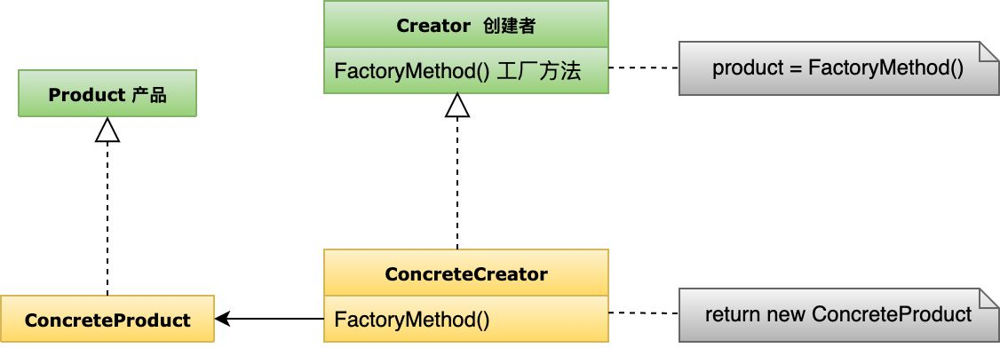
> 
>```ts
> /** 工厂 */
> const factory = function (role) {
>   if (this instanceof factory) {
>      return new this[role]()
>      } else {
>      return new factory(role)
>      }
>  }
> 
> /** 工厂的原型类 */
> factory.prototype = {
>   admin: function () {
>      this.name = '平台用户'
>        this.role = ['登录页', '主页']
>      },
>    common: function () {
>      this.name = '游客'
>        this.role = ['登录页']
>      },
>    test: function () {
>      this.name = '测试';
>        this.role = ['登录页', '主页', '测试页'];
>        this.test = '我还有一个测试属性哦'
>      }
>  }
> 
> /** 工厂方法的实例化对象 */
> const admin = new factory('admin')
> const common = new factory('common')
> const test = new factory('test')
> console.log(admin, common, test)
> ```

### 【抽象工厂模式】多套方案

> ```bash
> ## 抽象工厂（Abstract Factory）：多套方案
> 抽象工厂模式是对创建不同的产品类型的抽象。
> 在工作中，我们应该具备提供多套方案的能力，来提供选择规避风险。当你有这样的前瞻意识，一般也会被打上思考较多的标签，但是内在来说，的确想问题更加全面了。
> 
> 
> ## 描述
> 通过对类的工厂抽象使其业务用于对产品类簇的创建，而不是负责创建某一类产品的实例。
> 关键在于使用抽象类制定了实例的结构，调用者直接面对实例的结构编程，从实例的具体实现中解耦。
> 
> ## 优点
> - 抽象产品类将产品的结构抽象出来，访问者不需要知道产品的具体实现，只需要面向产品的结构编程即可，丛产品的具体实现中解耦
> 
> ## 缺点
> - 扩展新类簇的产品类比较困难，因为需要创建新的抽象产品类，并且还要修改工厂类，违反开放封闭原则
> - 带来了系统复杂度，增加新的类，和新的继承关系
> 
> ## 适用场景
> 如果一组实例都有相同的结构，那么就可以使用抽象工厂模式
> 
> 
> ## 抽象工厂模式 与 工厂模式 的区别
> - 工厂模式主要关注单独的产品实例的创建
> - 抽象工厂模式主要关注产品类簇实例的创建，如果产品类簇只有一个产品，那么这时的抽象工厂模式就退化为工厂模式了
> 
> 
> ## 抽象工厂模式的通用实现：
> Factory ：工厂，负责返回产品实例；
> AbstractFactory ：虚拟工厂，制定工厂实例的结构；
> Product：产品，访问者从工厂中拿到的产品实例，实现抽象类；
> AbstractProduct ：产品抽象类，由具体产品实现，制定产品实例的结构；
> ```
>
> 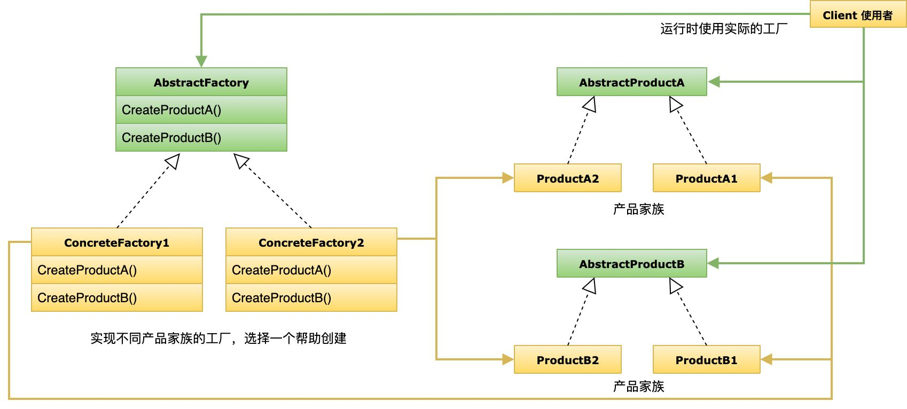
>
> ```ts
> /** 用户登录抽象类 */
> abstract class AbstractUserLogin {
>   kind: string
>   type?: string
>   constructor() {
>     this.kind = '登录方法'
>   }
>   // 抽象方法
>   abstract goLogin(): void
> }
> 
> /** 微信登录 */
> class UserOfWechat extends AbstractUserLogin {
>   constructor() {
>     super()
>     this.type = '微信登录'
>   }
>   goLogin() {
>     console.log(this.kind + ':' + this.type)
>   }
> }
> 
> /** QQ登录 */
> class UserOfQQ extends AbstractUserLogin {
>   constructor() {
>     super()
>     this.type = 'QQ登录'
>   }
>   goLogin() {
>     console.log(this.kind + ':' + this.type)
>   }
> }
> 
> /** 用户的抽象工厂 */
> class AbstractUserFactory {
>   static setUserLoginType(type) {
>     switch (type) {
>       case 'wechat': return new UserOfWechat()
>       case 'qq': return new UserOfQQ()
>       default: throw new Error('参数错误, 可选参数:wechat、qq')
>     }
>   }
> }
> 
> /** 抽象工厂实例调用 */
> const userLogin1 = AbstractUserFactory.setUserLoginType('qq')
> userLogin1.goLogin() // 登录方法:微信登录
> ```

### 单例模式 Singleton

> ```bash
> ## 单例模式（Singleton）：单一专注
> 单例模式是指在多线程的情况下，保证一个类只能构造出唯一实例，并提供一个访问它的全局访问点。
> 	- 涉及到一个单一的类，该类负责创建自己的对象，同时确保只有单一对象被创建。
> 	- 这个单例类提供了一种访问其唯一对象的方式，可以直接访问，不需要实例化该类的对象。
> 
> 
> ## JS 中的单例模式
> 	- 因为JS不存在类，只需用一个变量确保实例只创建一次即可（JS中实现该类的原理是使用了对象的浅拷贝）
> 	- 相对于通过 class 生成对象的单例模式，在 js 中我们可以直接生成对象，并且这个对象就是全局唯一，所以在 js 中单例模式是浑然天成，我们平常是不会感知的。尤其是现在开发使用的 ES6 module 模块，每个模块也同样是一个单例对象。
> 
> 
> 
> ## 优点·
> 	- 划分命名空间，减少全局变量
> 	- 增强模块化，将自己的代码放在一个全局变量名下，便于维护
> 	- 即使是调用多次，也只会实例化一次，其余的都是将实例化对象复制给它
> 
> ## 缺点
> 	- 由于单例模式提供的是一种单点访问，所以它有可能导致模块间的强耦合，从而不利于单元测试。无法单独测试一个调用了来自单例的方法的类，而只能把它与那个单例作为一个单元一起测试。
> 	- 可测试性不强、对抽象、继承、多态都支持得不友好等。
> 
> 
> ## 场景实例
>   - 如全局缓存、全局状态管理等这些只有一个对象可访问，就可以使用单例模式构建
>   - 定义命名空间和实现分支型方法
>   - vuex 和 redux 中的 store
>   - 弹框层的创建：
>       实现弹框的一种做法是先创建好弹框，然后使之隐藏，但这样会浪费部分不必要的 DOM 开销。
>       我们可以在需要弹框时再进行创建，同时结合单例模式实现只有一个实例，从而节省部分 DOM 开销，以及防止出现多个弹层在页面中显示的问题。
> ```
>
> 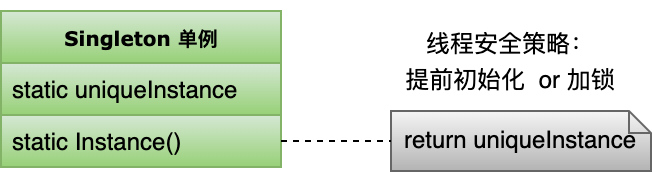
>
> 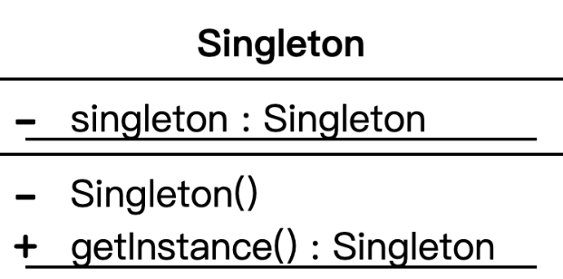
>
> ```js
> /** 单例模式 */
> const Singleton = function () {
>   this.instance = null
> }
> Singleton.getInstance = function (name) {
>   if (!this.instance) {
>     this.instance = new Singleton()
>   }
>   return this.instance
> }
> 
> const a = Singleton.getInstance()
> const b = Singleton.getInstance()
> // 因为单例模式只创建一次实例，而第二次触发的是将第一次创建的实例赋值给 s2，所以两个实例是相等的
> console.log(a === b) // true
> ```
>
> #### 【典例一】VUEX
>
> ```js
> let Vue = null
> expoet function install (_Vue) {
>  if (Vue && _Vue === Vue) {
>     // 如果发现 Vue 有值，则无需重新创建实例
>    return
>   } 
>   Vue = _Vue
>   applyMixin(Vue)
> }
> ```
>
> #### 【典例二】创建弹层
>
> ```js
> // ElementUI 的 Loading
> // ~/packages/loading/src/index.js
> 
> let fullscreenLoading;
> 
> const Loading = (options = {}) => {
>   ...
>   // options 不传的话默认是 fullscreen
>   options = merge({}, defaults, options);
>   if (options.fullscreen && fullscreenLoading) {
>     return fullscreenLoading; // 存在直接 return
>   }
> 
>   let parent = options.body ? document.body : options.target;
>   let instance = new LoadingConstructor({
>     el: document.createElement('div'),
>     data: options
>   });
> 
>   ...
>   if (options.fullscreen) {
>     fullscreenLoading = instance;
>   }
>   return instance;
> };
> ```
>
> ```js
> // 这样在使用 Element 的 loading 的时候，如果同时调用两次，其实只会有一个 loading 的遮罩层，第二个并不会显示。
> mounted() {
>   const first = this.$loading({
>     text: '我是第一个全屏loading',
>   })
> 
>   const second = this.$loading({
>     text: '我是第二个'
>   })
> 
>   console.log(first === second); // true
> }
> ```
>
> 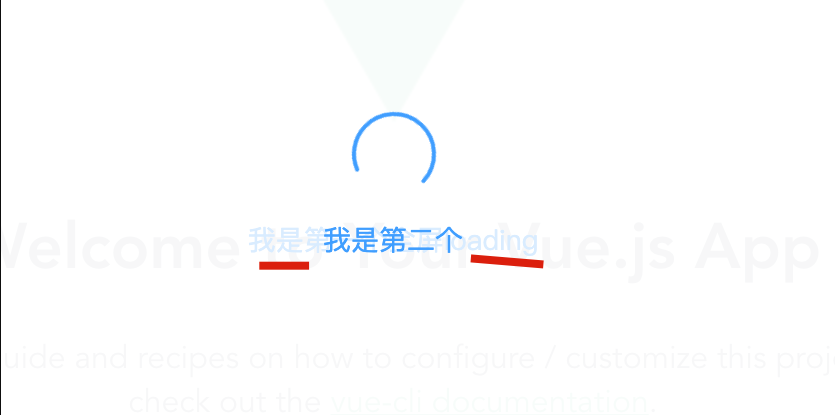

### 建造者模式 Builder

> ```bash
> ## 建造者（Builder）：善于分解
> 生成器模式是对一个个体的创建过程进行细分，拆解为不同的创建部分。
> 
> 建造者模式主要作用：分步构建一个复杂的对象，将一个复杂对象的构建层与其表示层分离。若不是极其复杂的对象，应选择适用对象字面或工厂模式等方式创建对象。
> 实现原理：通常使用 链式调用 来进行建造过程，最后调用 build() 方法生成最终对象
> 
> 
> ## 优点
> - 封装性好，创建和使用分离
> - 扩展性好，建造类之间独立，一定程度上解耦
> 
> ## 缺点
> - 产生多余的 Builder 对象
> - 产品内部发生变化，建造者都要修改，成本较大
> 
> ## 适用场景
> 1. 相同的方法，不同的执行顺序，产生不一样的产品时适用。
> 2. 产品的组成部件类似，通过组装不同的组件获得不同产品时适用。
> 3. 在设计组件时，如果组件的参数会经常变动，并且越来越多，可引入一个 Object 类型的参数，然后将相关的参数内聚到 Object 中进行传递。
> 
> 
> ## 建造者模式 与工厂模式 的区别
> - 工厂模式关注的是创建的结果
> - 建造者模式不仅得到结果，同时也参与了创建的具体过程
> 
> 
> ## 建造者模式的通用实现：
> Builder: 生成器接口，定义创建一个Product对象各个部件的操作。
> ConcreteBuilder: 具体的生成器实现，实现各个部件的创建，并负责组装Product对象的各个部件，同时还提供一个返回Product对象的方法。
> Director: 指导者，主要用来使用Builder接口，以一个统一的过程来构建所需要的Product对象。
> 		- 在 Director 类的构造函数中持有一个 Builder 实例，然后调用 Builder 类的 buildPart 和 getResult 即可创建对象。
> 		- 未来有新的对象需要创建时，只需实现新的 Builder 类即可，无需修改 Director 实例。
> Product: 产品，表示被生成器构建的复杂对象，包含多个部件。
> ```
>
> 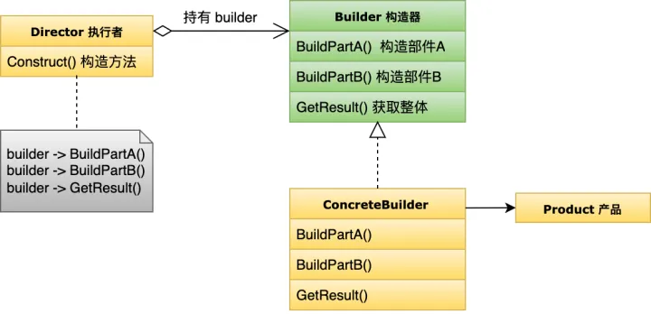
>
> ```ts
> /** 汽车零件大小类型约束 */
> type CarPartType = 'small' | 'normal' | 'big'
> 
> /** 建造者：汽车部件厂家，提供具体零部件的生产 */
> class CarPartBuilder {
>   color: string
>   weight: string
>   tyreType?: string
>   engineType?: string
>   // buildTyre: <T extends CarPartType>(type: T) => void
>   // buildEngine?: <T extends CarPartType>(type: T) => void
> 
>   constructor (color: string, weight: string) {
>     this.color = color
>     this.weight = weight
>   }
> 
>   /** 生产部件：轮胎 */
>   buildTyre (type) {
>     switch (type) {
>       case 'small':
>         this.tyreType = '小号轮胎'
>         break
>       case 'normal':
>         this.tyreType = '中号轮胎'
>         break
>       case 'big':
>         this.tyreType = '大号轮胎'
>         break
>     }
>   }
> 
>   /** 生产部件：发动机 */
>   buildEngine (type) {
>     switch (type) {
>       case 'small':
>         this.engineType = '小马力发动机'
>         break
>       case 'normal':
>         this.engineType = '中马力发动机'
>         break
>       case 'big':
>         this.engineType = '大马力发动机'
>         break
>     }
>   }
> }
> 
> /** 汽车厂家：负责汽车产品零件的装配 */
> class CarDirector {
>   constructor (tyre: CarPartType, engine: CarPartType, param) {
>     const car = new CarPartBuilder(param.color, param.weight)
>     car.buildTyre(tyre)
>     car.buildEngine(engine)
>     return car
>   }
> }
> 
> /** 产品实例 */
> const product1 = new CarDirector('small', 'big', { color: 'red', weight: '1600kg' })
> const product2 = new CarDirector('normal', 'small', { color: 'blue', weight: '2000kg' })
> console.log(product1, product2)
> ```

### 【原型模式】传承知识

> ```bash
> ## 原型（Prototype）：传承知识
> 原型模式是利用拷贝对象的方法，减少一些复杂的创建过程。
> 很多方案不是每次都需要重写，是可以在原来的方案上进行拷贝服用的。这个 clone 的过程，往往是只是传承的结果。如果有比较好的传承机制，那么会大大提升服务效率。
> 
> ## 描述
> - 用原型实例指定创建对象的种类，并通过拷贝这些原型创建新的对象。
> - 原型模式是用于创建重复的对象，同时又能保证性能。
> 
> ## JS构建
> 用同一个原型 new 出来的实例，拥有相同的原型上的属性和方法
> 注意：用构造函数创建函数时不可以使用箭头函数（因为箭头函数没有自己的上下文 this指向）
> ```
>
> 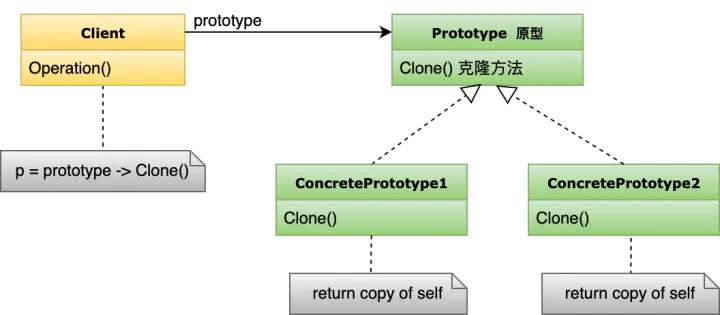
>
> ```js
> /** 类 */
> class PersonProperty {
>   constructor() { }
> }
> 
> /** 原型 */
> PersonProperty.prototype.name = 'willy'
> PersonProperty.prototype.sayName = function () {
>   console.log(this.name)
> }
> 
> /** 实例化 */
> const person1 = new PersonProperty()
> const person2 = new PersonProperty()
> person1.sayName() // 'willy'
> person2.sayName() // 'willy'
> ```

## 结构型模式

### 适配器模式 Adapter

> ```bash
> ## 适配器（Adapter）：适应能力
> - 适配器是为了结合原来的能力，适配新的接口服务，比如适配不同的协议入口。
> - 将一个类的接口转化为另外一个接口，以满足用户的需求，使类之间的接口不兼容问题通过适配器得以解决。
> 
> 
> ## 适用场景
> - 当你想要已有对象的功能，却想修改它的接口时，一般可考虑是否可以应用适配器模式。
> - 如果你想要一个已经存在的对象，但是它的接口不满足需求，那么可以使用适配器模式把已有的实现转换成你需要的接口。
> - 如果你想创建一个可复用的对象，而且确定需要和一些不兼容的对象一起工作，这种情况可以使用适配器模式，然后需要什么就适配什么。
> - 实际场景如：系统集成、旧系统升级、第三窟调用等。
> 
> 
> ## 优点
> - 已有的功能如果只是接口不兼容，使用适配器适配已有功能，可以使原有逻辑得到更好的服用，有助于避免大规模改写现有代码。
> - 可扩展性良好，在实现适配器功能时，可以调用自己开发的功能，从而方便地扩展系统功能。
> - 灵活性好，因为适配器并没有对原有对象的功能有所影响，如果不想使用适配器，直接删除即可，不会对使用原有对象的代码有影响。
> - 可以让任何两个没有关联的类一起运行，提高了类的复用。
> - 适配对象，适配库，适配数据。
> 
> ## 缺点
> - 额外对象的创建，非直接调用，存在一定的开销（且不像代理模式在某些功能点上可实现性能优化）
> - 如果没必要使用适配器模式的话，可考虑重构，如果使用，则要尽量把说明文档完善。
> 
> 
> ## 应用实例：Vue的计算属性 computed
> 因为旧的 data 数据不满足当前要求，通过计算属性的规则来适配成我们需要的格式，对原有数据并没有改变，只改变了原有数据的表现形式
> 	const message = ref('Hello')
> 	const reverseMessage = computed(() => message.value.split('').reverse().join(''))	// olleH
> 
> 
> ## 其他相关模式
> 适配器模式、代理模式 和 装饰者模式 都是属于包装模式，即是用一个对象来包装另一个对象的模式
> 1. 适配器模式 与 代理模式
> 	- 适配器模式：提供一个不一样的接口，由于原来的接口风格不能使用，提供新的接口可以满足新场景的需求。
> 	- 代理模式：提供一个一模一样的接口，由于不能直接访问目标对象，找个代理来帮忙访问，使用者就像访问目标对象一样来访问代理对象。
> 2. 适配器模式、装饰者模式 与 代理模式
> 	- 适配器模式：功能不变，只转换了原有接口访问格式。
> 	- 装饰者模式：扩展功能，原有功能不变且可直接使用。
> 	- 代理模式：原有功能不变，但一般是经过限制访问的。
>```
> 
>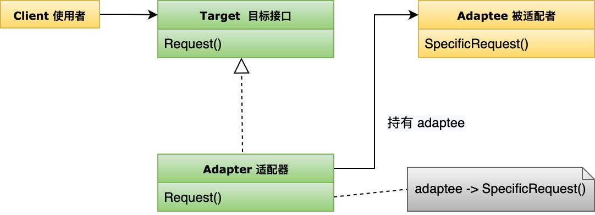
> 
> ```js
> /** 原有接口（被适配者） */
> class AdapteePlug {
>   getName () {
>     return 'iphone 充电头'
>   }
> }
> 
> /** 目标接口（适配器） */
> class Target {
>   constructor () {
>     this.plug = new AdapteePlug()
>   }
>   getName () {
>     return this.plug.getName() + '适配器 Type-c 充电头'
>   }
> }
> 
> /** 实例 */
> const target = new Target()
> const resultName = target.getName()
> console.log(resultName) // iphone 充电头适配器 Type-c 充电头
> ```

### 装饰器模式 Decorator

>```bash
>## 装饰（Decorator）：增量价值
>- 装饰模式是将原来的能力进行包装，并提供新的行为，是一种实现继承的替代方案。
>- 就增加功能而言，装饰模式比生成子类更灵活。
>- 装饰器模式是在不改变原对象的前提下，对其进行包装扩展（动态地添加新的功能或行为），从而提高代码的可复用性和灵活性，且不会影响这个类中派生的其他对象。
>
>
>## 优点
>- 装饰类和被装饰类都只关心自身的核心业务，实现了解耦。
>- 方便动态地扩展功能，且提供了比继承更多的灵活性。
>
>## 缺点
>- 多层装饰比较复杂。
>- 常常会引入许多小对象，看起来比较相似，实际功能大相径庭，从而使得我们的应用程序架构变得复杂起来。
>
>
>## 适用场景
>1. 适用于扩展对象的功能，而无需修改现有的类或构造函数。
>2. 将特征添加到对象中，而无需修改底层的代码。
>3. 当我们接手老代码时，需要对它已有的功能做扩展。
>4. 常用于组合多个小型功能
>
>
>## 场景实例
>1. 常见场景：日志记录、性能统计、权限控制、缓存等。
>2. core-decorators
>3. ES7的装饰器 Decorator
>4. 如现在有四种型号的自行车，我们为每种自行车都定义一个单独的类。
>    现在要给每种自行车都装上前灯、尾灯和铃铛这三种配件。
>    如果使用继承的方式来给每种自行车创建子类，则需要 4*3=12 个子类。
>    但是如果把前灯、尾灯、铃铛这些对象动态组合到自行车上，则只需要额外增加 3 个类。
>
>
>### 继承与装饰器的对比
>1. 继承的方式并不灵活，会导致超类和子类之间存在强耦合性，当超类改变时，子类也会随之改变
>2. 在继承方式中，超累的内部细节是对子类可见的，继承常常被认为破坏了封装性
>3. 在完成一些功能复用的同时，有可能创建出大量的子类，使子类的数量呈现爆炸性增长
>
>
>### 代理模式与装饰器模式的区别
>业务上的区别：
>1. 代理模式中是直接将原有对象封装到代理对象中，对于业务方不关心原始对象，直接使用代理对象即可。
>2. 装饰器模式中，我们只提供了装饰函数、输入原始对象、输出增强对象。输出的增强对象还可以接着传入到新的装饰器函数中继续增强。对于业务方，可以随意组合装饰函数，但得有一个最开始的原始对象。
>
>性质上的区别：
>1. 代理模式：显示原有功能，但是可对原有功能进行限制。
>2. 装饰器模式：扩展对象，原有功能不变且可直接使用。
>```
>
>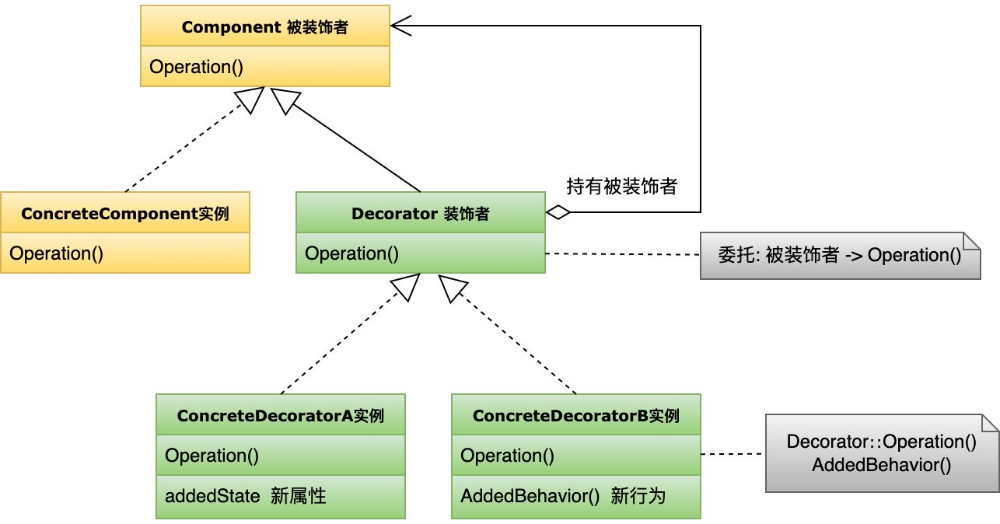
>
>```js
>/** 原有老代码 */
>let horribleCode = function () {
>  console.log('一堆看不懂的老逻辑代码')
>}
>
>
>/**
>* 对原有老代码已有功能做扩展
>* 缺点1：直接修改已有的函数体，违背 "开放封闭原则"
>* 缺点2：往一个函数体塞这么多逻辑，违背 "单一职责原则"
>* 需优化项：为了不被已有的业务逻辑干扰，需将旧逻辑与新逻辑分离，把旧逻辑抽离出去
>*/
>horribleCode = function () {
>  console.log('一堆看不懂的老逻辑代码')
>  console.log('添加的新逻辑代码')
>}
>horribleCode()
>
>
>/**
>* 优化：对老旧代码进行抽离
>* 缺点1：临时变量会越来越多
>* 缺点2：this 指向有时会出错
>*/
>horribleCode = function () {
>  console.log('一堆看不懂的老逻辑代码')
>}
>const _horribleCode = horribleCode
>horribleCode = function () {
>  _horribleCode()
>  console.log('添加的新逻辑代码')
>}
>horribleCode()
>```
>
>#### ES6实现装饰器
>
>```js
>/** 原有对象类 */
>class HorribleCode {
>  control () {
>    console.log('一堆看不懂的老逻辑代码')
>  }
>}
>
>/** 老代码对应的装饰器 */
>class Decorator {
>  // 将老代码实例传入
>  constructor (oldHC) {
>    this.oldHC = oldHC
>  }
>  newHC () {
>    console.log('添加的新逻辑代码')
>  }
>  control () {
>    this.oldHC.control()
>    // 包装一层新逻辑
>    this.newHC()
>  }
>}
>
>/** 测试实例 */
>const oldHC = new HorribleCode()
>const decorator = new Decorator(oldHC)
>decorator.control()
>```
>
>#### ES7 装饰器
>
>```js
>/**
>* 优化：ES7 装饰器
>*/
>// 装饰器函数，它第一个参数是目标类
>function Decorator (target, name, descriptor) {
>  console.log(target, name, descriptor)
>  const originalMethod = descriptor.value
>  descriptor.value = function () {
>    console.log('我是 Func 的装饰器逻辑')
>    console.log('我是新的逻辑')
>    // eslint-disable-next-line prefer-rest-params
>    return originalMethod.apply(this, arguments)
>  }
>  return descriptor
>}
>
>// 将装饰器 安装到 HorribleCode 上
>class HorribleCode {
>  @Decorator
>  control () {
>    console.log('我是一堆看不懂的老逻辑代码')
>  }
>}
>
>// 验证装饰器是否生效
>const horribleCode = new HorribleCode()
>horribleCode.control()
>```
>
>#### 柯里化函数实现装饰器
>
>```js
>const wear1 = function () {
>  console.log('1')
>}
>const wear2 = function () {
>  console.log('2')
>}
>const wear3 = function () {
>  console.log('3')
>}
>
>// 前置函数
>Function.prototype.before = function (beforeFn) {
>  const self = this // 保存原函数引用
>  return function () {
>    // 返回包含了原函数和新函数的 '代理函数'
>    beforeFn.apply(self, arguments) // 执行新函数，修正this
>    return self.apply(self, arguments) // 执行原函数
>  }
>}
>// 后置函数
>Function.prototype.after = function (afterFn) {
>  const self = this
>  return function () {
>    self.apply(self, arguments)
>    return afterFn.apply(self, arguments)
>  }
>}
>wear2.after(wear3).before(wear1)()
>
>
>/**
>* 优化：防止污染原生函数
>*/
>const after = function (fn, afterFn) {
>  return function () {
>    fn.apply(this, arguments)
>    afterFn.apply(this, arguments)
>  }
>}
>const wear = after(after(wear1, wear2), wear3)
>wear()
>```
>
>#### React的装饰器模式
>
>```js
>//  React中随处可见的装饰模式
>import { connect } from 'react-redux'
>class MyComponent extends React.Component {
>  // ...具体逻辑
>}
>export default connect(mapStateToProps)(MyComponent)
>```
>

### 代理模式 Proxy

>```bash
>## 代理模式(委托模式)（Proxy）：理解保护
>- 为一个对象包装一个类，以便对相关操作进行二次转发 或 管控对它访问。
>- 代理模式把代理对象插入到访问者和目标对象之间，从而为访问者对目标对象的访问引入一定的间接性。正是这种间接性给了代理对象很多操作空间，比如在调用目标对象前和调用后进行一些预操作和后操作，从而实现新功能或者扩展目标的功能。
>
>
>## 优点
>- 代理模式能将访问者与被调用对象分离，在一定程度上降低了系统的耦合度。
>- 代理模式在访问者和目标对象之间，可以起到 中介和保护目标对象 的作用。
>- 代理对象可以扩展目标对象的功能，通过修改代理对象即可，符合 "开闭原则"。
>- 符合 "单一职责原则"，如果直接修改对象，会增加原有对象的复杂度，原对象如何负责的职责过多，引起对象改动的原因就会增多。
>
>## 缺点
>- 处理请求速度可能有差别，非直接访问存在一定开销。
>- 增加了系统的复杂度。
>
>
>## 应用场景实例
>常用的虚拟代理形式：某一个花销很大的操作，可以通过虚拟代理的方式延迟到这种需要它的时候才去创建。
>		如使用虚拟代理实现图片懒加载：先通过一张loading图占位，然后通过异步的方式加载图片，等图片加载好再把完成的图片加载到img标签里面。
>- ES6的代理对象 Proxy()。
>
>
>## 代理模式与装饰器模式区别
>- 装饰器模式：扩展功能，原有功能不变且可直接使用
>- 代理模式：显示原有功能，但是是经过限制之后的
>
>
>## 代理模式与适配器模式的区别
>- 适配器模式：主要用来解决接口之间不匹配的问题，通常是为所适配的对象提供一个不同的接口
>- 代理模式：提供访问目标对象的间接访问，以及对目标对象功能的扩展，一般提供和目标对象一样的接口
>
>
>## 1.1 正向代理
>一般的访问流程是客户端直接向目标服务器发送请求并获取内容，使用正向代理后，客户端改为向代理服务器发送请求，并指定目标服务器（原始服务器）。然后由代理服务器和原始服务器通信，转交请求并获得的内容，再返回给客户端。
>正向代理隐藏了真实的客户端，为客户端收发请求，使真实客户端对服务器不可见。
>
>## 1.2 反向代理
>与一般访问流程相比，使用反向代理后，直接收到请求的服务器是代理服务器，然后将请求转发给内部网络上真正进行处理的服务器，并将得到的结果返回给客户端。
>反向代理隐藏了真实的服务器，为服务器收发请求，使真实服务器对客户端不可见。常用于处理跨域请求。
>
>## 2. 虚拟代理
>虚拟代理是把一些开销很大的对象，延迟到真正需要它的时候才去创建执行。
>如图片的懒加载：在浏览一些购物商城时会发现，当网络不太好的情况下，有些图片是加载不出来的，会有一张图片去代替它的实际图片，等网络图片加载完成后才会被实际图片代替。
>
>## 3. 缓存代理
>缓存代理是可以为一些开销大的运算结果提供暂时的存储，在下次运算时，如果传递进来堵塞参数跟之前一致，则可直接返回前面存储的运算结果。
>比如前后端分离，向后端请求分页数据时，每次页码改变时都需要重新请求后端数据，我们可以将页面和对应的结果进行缓存，当请求同一页时，就不再请求后端的接口，而是从缓存中取数据。
>```
>
>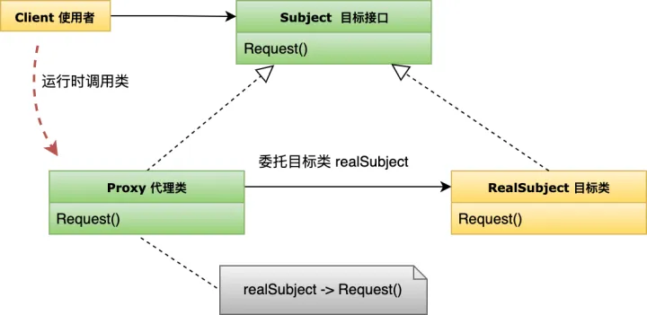
>
>```ts
>class Person {
>  sayName () {
>    console.log('willysliang')
>  }
>  sayAge () {
>    console.log(25)
>  }
>}
>
>/** 代理类 */
>class PersonProxy {
>  person: Person
>  constructor () {
>    this.person = new Person()
>  }
>
>  // 代理调用 Person 的方法
>  callMethod (functionName: string) {
>    // 代理方法
>    try {
>      this.person[functionName]()
>    } catch {
>      throw new Error('参数错误，原对象不存在该方法')
>    }
>  }
>}
>
>/** 测试实例 */
>const person1 = new PersonProxy()
>// 通过代理来调用应有的方法
>person1.callMethod('sayName') // willylsiang
>person1.callMethod('sayAge') // 25
>```
>
>#### 图片懒加载的代理
>
>使用代理模式实现图片懒加载的优点还有符合单一职责原则。减少一个类或方法的粒度和耦合度。
>
>```js
>// 图片懒加载
>const imgFunc = (function() {
> const imgNode = document.createElement('img');
> document.body.appendChild(imgNode);
> return {
>   setSrc: function(src) {
>     imgNode.src = src;
>   }
> }
>})();
>
>const proxyImage = (function() {
> const img = new Image();
> img.onload = function() {
>   imgFunc.setSrc(this.src);
> }
> return {
>   setSrc: function(src) {
>     imgFunc.setSrc('./loading,gif');
>     img.src = src;
>   }
> }
>})();
>
>proxyImage.setSrc('./pic.png');
>```
>
>#### HTML元素事件的代理
>
>- 代理是为了控制对对象的访问，不让外部直接访问到对象
>- 事件代理就用到代理模式（通过给父节点绑定一个事件，让父节点作为代理去拿到真实点击的结点）
>- 不直接给事件点击代理事件的原因（动态添加该兄弟节点时，节省手动添加事件操作）
>
>```html
><ul id="ul">
> <li>1</li>
> <li>2</li>
></ul>
>
><script>
> const ul = document.querySelector("#ul");
> ul.addEventListener('click', (event) => {
>   console.log(event.target);
> })
></script>
>```
>
>#### 缓存斐波那契数列（缓存代理）
>
>```js
>const getFib = (number) => {
> if (number <= 2) {
>   return 1
> } else {
>   return getFib(number - 1) + getFib(number - 2)
> }
>}
>
>const getCacheProxy = (fn, cache = new Map()) => {
> return new Proxy(fn, {
>   apply (target, context, args) {
>     const argsString = args.join(' ')
>     if (cache.has(argsString)) {
>       // 如果有缓存，直接返回缓存数据
>       console.log(`输出${args}的缓存结果：${cache.get(argsString)}`)
>       return cache.get(argsString)
>     }
>     const result = fn(...args)
>     cache.set(argsString, result)
>     return result
>   },
> })
>}
>
>const getFibProxy = getCacheProxy(getFib)
>getFibProxy(40) // 保存缓存的结果
>getFibProxy(40) // 获取上次缓存的结果
>```

### 外观模式 Facade

>```bash
>## 外观（Facade）：深入浅出
>- 外观模式是说我们不需要理解复杂的系统，而是通过一个外观去操作。可以理解为对系统功能包装后收口和聚焦的感觉。
>- 外观模式为一组复杂的子系统接口提供一个更高级的统一接口，隐藏了内部的逻辑，而且通过这个接口使得对子系统接口的访问更容易。
>- 外观模式的用途：将一些复杂操作封装起来，并创建一个简单的接口用于调用。
>
>
>## 适用场景
>- 设计初期如果构建多层系统，应该有意识地使用外观模式来将系统分层，让外观模块成为每层的入口，简化层间调用，松散层间耦合。比如经典的三层结构，在数据访问层和业务逻辑层、业务逻辑层和表示层之间建立外观 Facade。
>- 在开发阶段，子系统往往因为不断的重构演化而变得越来越复杂，增加外观 Facade 可以提供一个简单的接口，减少他们之间的依赖。
>- 在维护一个遗留的大型系统时，可能这个系统已经难以维护，这时为系统开发一个外观 Facade 类，为设计粗糙和高度复杂的遗留代码提供比较清晰的接口，让新系统和 Facade 对象交互，Facade 与遗留代码交互所有的复杂工作。
>- 团队协作时，可以给各个负责的模块建立合适的外观，以简化使用，节约沟通时间。
>
>
>## 优点
>- 访问者不需要再了解子系统内部模块的功能，而只需和外观交互即可，使得访问者对子系统的使用变得简单，符合 "最少知识原则"，增加了可移植性和可读性。
>- 减少了与子系统模块的直接引用，实现了访问者与子系统中模块之间的松耦合，增加了可维护性和可扩展性。
>- 通过合理使用外观模式，可以帮组我们更好地划分系统访问层次，比如把需要暴露给外部的功能集中到外观中，这样既方便访问者使用，也很好地隐藏了内部的细节，提高了安全性。
>
>## 缺点
>- 不符合 "开闭原则"，对修改关闭，对扩展开放，如果外观模块出错，那么只能通过修改的方式来解决问题，因为外观模块是子系统的唯一出口。
>- 不需要或不合理的使用外观会让人迷惑，过犹不及。
>
>
>## 外观模式与终结者模式的区别
>- 外观模式：封装子使用者对子系统内模块的直接交互，方便使用者对子系统的调用。
>- 中介者模式：封装子系统间各模块之间的直接交互，松散模块间的耦合。
>```
>
>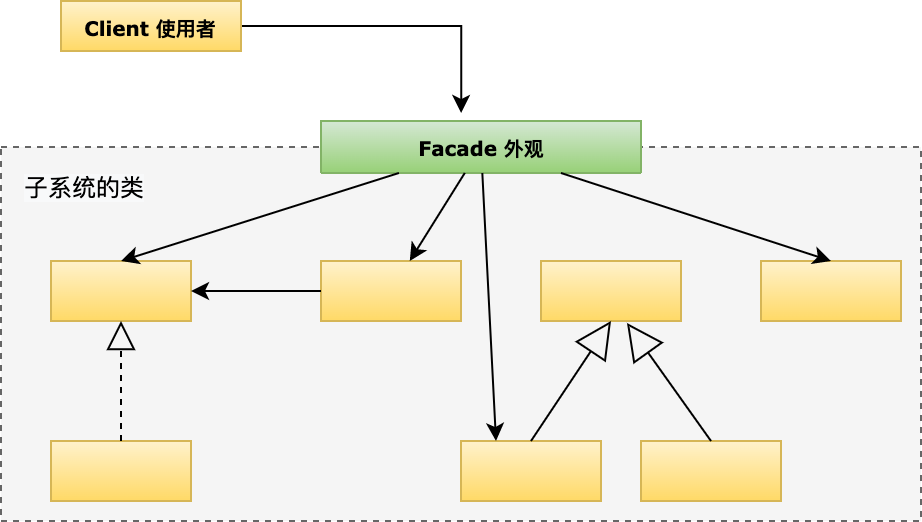
>
>```ts
>/** 子系统A */
>class SubSystemA {
>  operationA () { console.log('SubSystemA operation') }
>}
>/** 子系统B */
>class SubSystemB {
>  operationB () { console.log('SubSystemB operation') }
>}
>
>/** 外观类 */
>class Facade {
>  private subSystemA: SubSystemA
>  private subSystemB: SubSystemB
>
>  constructor () {
>    this.subSystemA = new SubSystemA()
>    this.subSystemB = new SubSystemB()
>  }
>
>  operation () {
>    this.subSystemA.operationA()
>    this.subSystemB.operationB()
>  }
>}
>
>/** 客户端代码 */
>const facade = new Facade()
>facade.operation() // 调用外观类的方法，输出 SubSystemA operation、SubSystemB operation
>```
>
>#### 兼容浏览器事件绑定
>
>```js
>function addEvent(elm, evType, fn, useCapture) {
>  if (elm.addEventListener) {
>    ele.addEventListener(evType, fn, useCapture);
>    return true;
>  } else if (elm.attachEvent) {
>    return ele.attachEvent("on" + evType, fn);
>  } else {
>    elm["on" + evType] = fn;
>  }
>}
>```
>

### 【桥接模式】合理关系

>```bash
>## 桥接（Bridge）：合理关系
>桥接模式是将原来相互依赖的部分，通过上层接口再往抽象层提一下，减少类之间的直接合作，形成间接关系。
>在工作中经常是开发对开发 case By Case 解决问题，如果往产品逻辑层走一下，开发对产品，产品层面可能有更好的抽象，当然为了更好的服务体检，这样的解耦是不多见的，但这样的思考我们可能要 get 一下
>
>## 描述
>- 桥接模式将抽象部分与实现部分分离，使得两者都可以独立地变化。使用组合关系代替继承关系，降低抽象和实现两个可变维度的耦合度。
>
>
>## 优点
>- 分离了抽象和实现部分，将实现层（DOM 元素事件触发并执行具体修改逻辑）和抽象层（元素外观、尺寸部分的修改函数）解耦，有利于分层独立地管理各组成部分
>- 提高了可扩展性，多个维度的部件自由组合，避免了类继承带来的强耦合关系，也减少了部件类的数量
>- 使用者不用关心细节的实现，可方便快捷地进行使用
>
>## 缺点
>- 桥接模式要求两个部件没有耦合关系，否则无法独立地变化，因此要求正确的对系统变化的维度进行识别，使用范围存在局限性
>- 大量的类将导致开发成本的增加，同时在性能方面可能也会有所减少
>
>## 使用场景
>- 如果产品的部件有独立的变化维度，可以考虑桥接模式
>- 不希望使用继承，或因为多层次继承导致系统类的个数急剧增加的系统
>- 产品部件的粒度越细，部件复用的必要性越大，可以考虑桥接模式
>```
>
>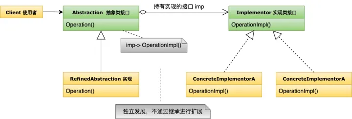
>
>```js
>/** 典例：演奏乐器 */
>class Boy {
> instrument: any
> constructor (instrument) {
>   this.instrument = instrument
> }
>
> sayHi () {
>   console.log('hi, 我是男生~')
> }
>
> playInstrument () {
>   this.instrument?.play && this.instrument.play()
> }
>}
>
>class Girl {
> instrument: any
> constructor (instrument) {
>   this.instrument = instrument
> }
>
> sayHi () {
>   console.log('hi, 我是女生~')
> }
>
> playInstrument () {
>   this.instrument?.play && this.instrument.play()
> }
>}
>
>class Piano {
> play () {
>   console.log('钢琴开始演奏')
> }
>}
>
>class Guitar {
> play () {
>   console.log('吉他开始演奏')
> }
>}
>
>const piano = new Piano()
>const pianoBoy = new Boy(piano)
>pianoBoy.playInstrument() // 钢琴开始演奏
>
>const guitar = new Guitar()
>const guitarGirl = new Girl(guitar)
>guitarGirl.playInstrument() // 吉他开始演奏
>```
>

### 【组合模式】递归思考

>```bash
>## 组合（Composite）：递归思考
>组合模式是通过继承和子节点，可以递归地去描述一个对象层次。
>我们在工作中，若是要加深思考的层次，可以某个点拆分再去思考，同时如果能够在递归分解过程中抽象一些共性的点，就能找到一些规律。
>比如我们的需求分解，每个需求可以分解为子需求，子需求再往下看又可以递归分解。分解完后，每个部分有这部分的owner去驱动它的下游，形成一个层次结构。
>
>
>## 描述
>- 组合模式允许你将对象组合成树形结构来表现 “部分-整体” 的层次结构。
>- 通过对象的多态表现，让使用者可以用一致的方式处理组合对象以及部分对象（一致性）
>
>## 适用场景
>- 如果对象组织呈现树形结构就可以考虑使用组合模式，特别是如果操作树中对象的方法比较类似时。
>
>## 优点
>- 忽略组合对象和单个对象的差别，对外一致接口使用。
>- 解耦调用者与复杂元素之间的联系，处理方式变得简单。
>
>## 缺点
>- 树叶对象接口一致，无法区分，只有在运行时方可辨别。
>- 包裹对象创建太多，额外增加内存负担。
>```
>
>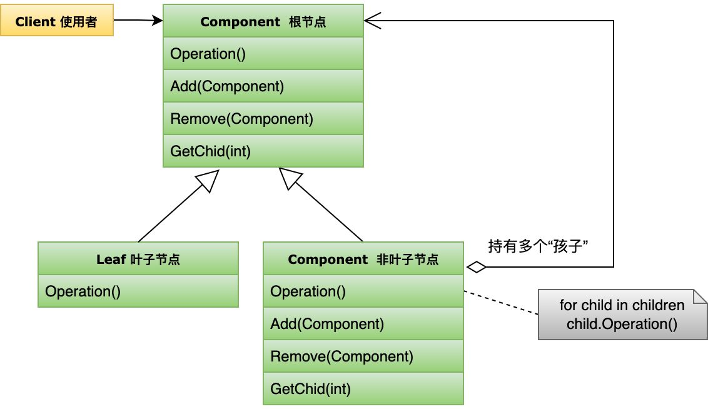
>
>```js
>class TrainOrder {
>  create() {
>    console.log('创建火车票订单')
>  }
>}
>class HotelOrder {
>  create() {
>    console.log('创建酒店订单')
>  }
>}
>
>class TotalOrder {
>  constructor() {
>    this.orderList = []
>  }
>  addOrder(order) {
>    this.orderList.push(order)
>    return this
>  }
>  create() {
>    this.orderList.forEach(item => {
>      item.create()
>    })
>    return this
>  }
>}
>
>// 可以在购票网站买车票同时也订房间
>const train = new TrainOrder()
>const hotel = new HotelOrder()
>const total = new TotalOrder()
>total.addOrder(train).addOrder(hotel).create()
>```
>
>### 典例：文件夹
>
>```js
>/** 创建文件夹 */
>const createFolder = function (name) {
>  return {
>    name,
>    _children: [],
>
>    // 在文件夹下增加文件或文件夹
>    add (...fileOrFolder) {
>      this._children.push(...fileOrFolder)
>      return this
>    },
>
>    // 扫描方法
>    scan (cb) {
>      this._children.forEach((child) => child.scan(cb))
>    },
>  }
>}
>
>/** 创建文件 */
>const createFile = function (name, size) {
>  return {
>    name,
>    size,
>
>    // 在文件下增加文件，应报错
>    add () {
>      throw new Error('文件下面不能再添加文件')
>    },
>
>    // 执行扫描方法
>    scan (cb) {
>      cb(this)
>    },
>  }
>}
>
>// 创建总文件夹
>const foldMovies = createFolder('电影')
>
>// 创建子文件夹，并放入根文件夹
>const foldMarvelMovies = createFolder('漫威英雄电影')
>foldMovies.add(foldMarvelMovies)
>const foldDCMovies = createFolder('DC英雄电影')
>foldMovies.add(foldDCMovies)
>
>// 为两个子文件夹分别添加电影
>foldMarvelMovies.add(createFile('钢铁侠.mp4', 1.9))
>foldMarvelMovies.add(createFile('蜘蛛侠.mp4', 2.1))
>foldMarvelMovies.add(createFile('金刚狼.mp4', 2.3))
>foldMarvelMovies.add(createFile('黑寡妇.mp4', 1.9))
>foldMarvelMovies.add(createFile('美国队长.mp4', 1.4))
>foldDCMovies.add(createFile('蝙蝠侠.mp4', 2.4))
>
>console.log('size 大于2G的文件有：')
>foldMovies.scan((item) => {
>  if (item.size > 2) {
>    console.log(`name:${item.name} size:${item.size}GB`)
>  }
>})
>
>/** 链模式调用 */
>const foldMovies2 = createFolder('电影').add(
>  createFolder('漫威英雄电影')
>    .add(createFile('钢铁侠.mp4', 1.9))
>    .add(createFile('蜘蛛侠.mp4', 2.1))
>    .add(createFile('金刚狼.mp4', 2.3))
>    .add(createFile('黑寡妇.mp4', 1.9))
>    .add(createFile('美国队长.mp4', 1.4)),
>  createFolder('DC英雄电影')
>    .add(createFile('蝙蝠侠.mp4', 2.4))
>    .add(createFile('超人.mp4', 1.6)),
>)
>console.log('size 大于2G的文件有：')
>foldMovies2.scan((item) => {
>  if (item.size > 2) {
>    console.log(`name:${item.name} size:${item.size}GB`)
>  }
>})
>
>/**
>  size 大于2G的文件有：
>  index.vue:63 name:蜘蛛侠.mp4 size:2.1GB
>  index.vue:63 name:金刚狼.mp4 size:2.3GB
>  index.vue:63 name:蝙蝠侠.mp4 size:2.4GB
> */
>```
>
>#### ES6类模式实现文件夹
>
>```js
>/** 文件类 */
>class Folder {
>  constructor (name, children) {
>    this.name = name
>    this.children = children
>  }
>
>  // 在文件夹下增加文件或文件夹
>  add (...fileOrFolder) {
>    this.children.push(...fileOrFolder)
>    return this
>  }
>
>  // 扫描方法
>  scan (callback) {
>    this.children.forEach((child) => child.scan(callback))
>  }
>}
>
>// 文件类
>class File {
>  constructor (name, size) {
>    this.name = name
>    this.size = size
>  }
>
>  // 在文件下增加文件，应报错
>  add (...fileOrFolder) {
>    throw new Error(`文件下面不能再添加文件`)
>  }
>
>  // 执行扫描方法
>  scan (callback) {
>    callback(this)
>  }
>}
>
>const foldMovies = new Folder('电影', [
>  new Folder('漫威英雄电影', [
>    new File('钢铁侠.mp4', 1.9),
>    new File('蜘蛛侠.mp4', 2.1),
>    new File('金刚狼.mp4', 2.3),
>    new File('黑寡妇.mp4', 1.9),
>    new File('美国队长.mp4', 1.4),
>  ]),
>  new Folder('DC英雄电影', [
>    new File('蝙蝠侠.mp4', 2.4),
>    new File('超人.mp4', 1.6),
>  ]),
>])
>
>console.log('size 大于2G的文件有：')
>foldMovies.scan((item) => {
>  if (item.size > 2) {
>    console.log(`name:${item.name} size:${item.size}GB`)
>  }
>})
>
>/**
>  size 大于2G的文件有：
>  index.vue:63 name:蜘蛛侠.mp4 size:2.1GB
>  index.vue:63 name:金刚狼.mp4 size:2.3GB
>  index.vue:63 name:蝙蝠侠.mp4 size:2.4GB
> */
>```

### 【享元模式】分离共享

>```bash
>## 享元（Flyweight）：分离共享
>- 享元模式是说当我们已经存在一些内容时，可以通过缓存服用，而不是重新创建，减少开销。
>- 我们在工作中要做好积累，更要做好缓存的key，通过怎么样的手段去链接到我们工作中，是需要我们做好类目管理和持续积累的。
>- 即享元就是共享单元，如现在的共享单车和共享充电宝等，它们的核心理念都是享元模式。
>
>## 描述
>- 运用共享技术有效地支持大量细粒度对象的复用，以减少创建的对象的数量。
>- 系统只使用少量对象，而这些对象都很相似，状态变化很小，可以实现对象的多次复用。由于享元模式要求能够共享的对象必须是细粒度对象，因此它又称为轻量级模式，它是一种对象结构型模式。
>
>
>## 适用场景
>- 程序中使用了大量的相似对象，造成很大的存储开销时就应该考虑使用
>- 对象的大多数状态都可以变为外部状态，剥离外部状态后，可以用相对较少的共享对象取代大量对象。
>
>## 优点
>- 大大减少对象的创建，降低系统的内存，使效率提高
>- 外部状态相对独立，不会影响到内部状态，所以享元对象能够在不同环境被共享
>
>## 缺点
>- 引入了共享对象，使对象结构变得复杂
>- 共享对象的创建、销毁等需要维护，带来额外的复杂度（如果需要把共享对象维护起来的话）
>- 提高了系统的复杂度，需要分离出外部状态和内部状态，而且外部状态具有固有化的性质，不应该随着内部状态的变化而变化，否则会造成系统的混乱
>```
>
>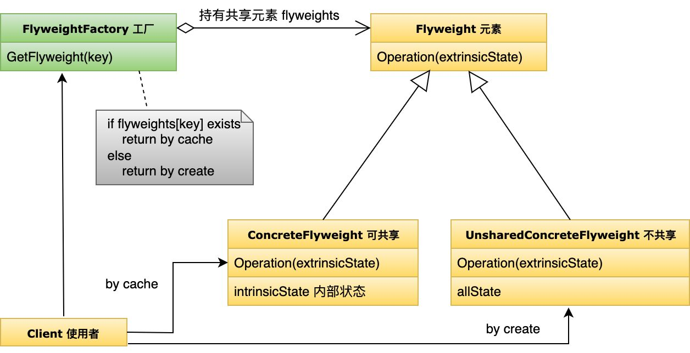
>
>```js
>/** 【案例】某商家有 50 种男款内衣和 50 种款女款内衣, 要展示它们 */
>/**
> * 方案一：造 50 个塑料男模型和 50 个塑料女模型，让他们穿上
> */
>class Model1 {
>  constructor(gender, underwear) {
>    this.gender = gender
>    this.underwear = underwear
>  }
>  takePhoto() {
>    console.log(`${this.gender}穿着${this.underwear}`)
>  }
>}
>for (let i = 1; i < 51; i++) {
>  const maleModel = new Model1('male', `第${i}款衣服`)
>  maleModel.takePhoto()
>}
>for (let i = 1; i < 51; i++) {
>  const femaleModel = new Model1('female', `第${i}款衣服`)
>  femaleModel.takePhoto()
>}
>
>
>
>/**
> * @方案二：造 1 个塑料男模特和 1 个塑料女模特，分别试穿 50 款内衣
> * @对比：方案一创建了 100 个对象，方案二只创建了 2 个对象
> * @说明：在该 demo 中，gender（性别）是内部对象，underwear（衣服）是外部对象
> */
>class Model2 {
>  constructor(gender) {
>    this.gender = gender
>  }
>  takePhoto() {
>    console.log(`${this.gender}穿着${this.underwear}`)
>  }
>}
>const maleModel = new Model2('male')
>const femaleModel = new Model2('female')
>for (let i = 1; i < 51; i++) {
>  maleModel.underwear = `第${i}款衣服`
>  maleModel.takePhoto()
>}
>for (let i = 1; i < 51; i++) {
>  femaleModel.underwear = `第${i}款衣服`
>  femaleModel.takePhoto()
>}
>
>
>
>/**
> * 方案二优化1：一开始就通过构造函数显示地创建实例，可用工厂模式将其升级成可控生成
> * 方案二优化2：在实例上手动添加 underwear 不是很优雅，可以在外部单独写个 manager 函数
> */
>class Model3 {
>  constructor(gender) {
>    this.gender = gender
>  }
>
>  takePhoto() {
>    console.log(`${this.gender}穿着${this.underwear}`)
>  }
>}
>
>class ModelFactory {
>  constructor() {
>    this.modelGender = {}
>  }
>
>  createModel(gender) {
>    if (this.modelGender[gender]) {
>      return this.modelGender[gender]
>    }
>    return this.modelGender[gender] = new Model3(gender)
>  }
>}
>const modelFactory = new ModelFactory()
>
>class ModelManager {
>  constructor() {
>    this.modelObj = {}
>  }
>
>  add(gender, i) {
>    this.modelObj[i] = { underwear: `第${i}款衣服` }
>    return modelFactory.createModel(gender)
>  }
>
>  copy(model, i) { // 优化第二点
>    model.underwear = this.modelObj[i].underwear
>  }
>}
>const modelManager = new ModelManager()
>
>for (let i = 1; i < 51; i++) {
>  const maleModel = modelManager.add('male', i)
>  modelManager.copy(maleModel, i)
>  maleModel.takePhoto()
>}
>for (let i = 1; i < 51; i++) {
>  const femaleModel = modelManager.add('female', i)
>  modelManager.copy(femaleModel, i)
>  femaleModel.takePhoto()
>}
>```
>
>### 【典例一】享元模式优化图书管理
>
>- 记录书籍的属性，如果已经存在则只需要调用缓存的图书，不需要再次重复存储该书籍（内部状态）
>- 记录图书馆的所拥有的书籍，如果存在则不需要创建，只需要调用即可（外部状态）
>
>```js
>/** 享元（存储内部状态）- 书籍属性 */
>class Book {
>  constructor(title, author, genre, pageCount, publisherId, isbn) {
>    this.title = title
>    this.author = author
>    this.genre = genre
>    this.pageCount = pageCount
>    this.publisherId = publisherId
>    this.isbn = isbn
>  }
>}
>
>
>/** 享元工厂（创建/管理享元） */
>class BookFactory {
>  constructor() {
>    this.existingBooks = {} // 存在的书籍库
>    this.existingBook = null  // 当前的书籍
>  }
>
>  /** 创建/查找图书 */
>  createBook(title, author, genre, pageCount, publisherId, isbn) {
>    // 如果书籍已经创建，则找到并返回
>    this.existingBook = this.existingBooks[isbn]
>    if (!!this.existingBook) {
>      return this.existingBook
>    } else {
>      // 如果书籍不存在，则选择创建该书的新实例并保存
>      const book = new Book(title, author, genre, pageCount, publisherId, isbn)
>      this.existingBooks[isbn] = book
>      return book
>    }
>  }
>}
>const bookFactory = new BookFactory()
>
>
>/** 客户端（存储外部状态） - 管理所需的额外属性 */
>class BookRecordManager {
>  constructor() {
>    this.bookRecordDatabase = {} // 图书记录库
>  }
>
>  /** 添加新书到数据库 */
>  addBookRecord(id, title, author, genre, pageCount, publisherId, isbn,
>    checkoutDate, checkoutMember, dueReturnDate, availability) {
>    const book = bookFactory.createBook(title, author, genre, pageCount, publisherId, isbn)
>    this.bookRecordDatabase[id] = {
>      checkoutMember: checkoutMember,
>      checkoutDate: checkoutDate,
>      dueReturnDate: dueReturnDate,
>      availability: availability,
>      book: book
>    }
>  }
>
>  /** 更新图书信息状态 */
>  updateCheckStatus(bookId, newStatus, checkoutDate, checkoutMember, newReturnDate) {
>    const record = this.bookRecordDatabase[bookId]
>    record.availability = newStatus
>    record.checkoutDate = checkoutDate
>    record.checkoutMember = checkoutMember
>    record.dueReturnDate = newReturnDate
>  }
>
>  /** 延长期限 */
>  extendCheckoutPeriod(bookId, newReturnDate) {
>    this.bookRecordDatabase[bookId].dueReturnDate = newReturnDate
>  }
>
>  /** 归还期限是否到期 */
>  isPastDue(bookId) {
>    const currentDate = new Date()
>    return currentDate.getTime() > Date.parse(this.bookRecordDatabase[bookId].dueReturnDate)
>  }
>}
>
>const bookRecordManager = new BookRecordManager()
>// isbn号是书籍的唯一标识，以下三条只会创建一个book对象
>bookRecordManager.addBookRecord(1, 'x', 'x', 'xx', 300, 10001, '100-232-31') // new book1
>bookRecordManager.addBookRecord(2, 'xx', 'xx', 'xx', 300, 10001, '100-232-32') // new book2
>bookRecordManager.addBookRecord(1, 'xxx', 'xxx', 'xxx', 300, 10001, '100-232-31')
>console.log(bookFactory.existingBooks, bookRecordManager.bookRecordDatabase)
>```
>
>### 【典例二】享元模式 + 对象池技术优化页面渲染
>
>- 以下代码仅使用 2 个享元对象，21个 DOM 对象，就完成了 10000 条数据的渲染，相比 10000 个 book 对象和 10000 个 DOM，性能优化是非常明显的
>
>```js
>const books = new Array(10000).fill(0).map((v, index) => {
>  return Math.random() > 0.5
>    ? {
>        name: `软件工程${index}`,
>        category: '技术类',
>      }
>    : {
>        name: `傲慢与偏见${index}`,
>        category: '文学类',
>      }
>})
>
>class FlyweightBook {
>  constructor (category) {
>    this.category = category
>  }
>
>  // 用于享元对象获取外部状态
>  getExternalState (state) {
>    for (const p in state) {
>      this[p] = state[p]
>    }
>  }
>
>  print () {
>    console.log(this.name, this.category)
>  }
>}
>
>/**
> * 工厂类：生产享元对象
> * 注意：这代码实际用了单例模式，每个享元对象都为单例，因为我们没必要创建多个相同的向原对象
> */
>class FlyweightBookFactory {
>  constructor () {
>    this.flyweightBookStore = {}
>  }
>
>  /** 生产享元对象 */
>  produce (category) {
>    if (this.flyweightBookStore[category]) {
>      return this.flyweightBookStore[category]
>    }
>    const flyweightBook = new FlyweightBook(category)
>    this.flyweightBookStore[category] = flyweightBook
>    return flyweightBook
>  }
>}
>const flyweightBookFactory = new FlyweightBookFactory()
>
>/** DOM 的享元对象 */
>class Div {
>  constructor () {
>    this.dom = document.createElement('div')
>  }
>
>  getExternalState (extState, onClick) {
>    // 获取外部状态
>    this.dom.innerText = extState.innerText
>    this.dom.style.top = `${extState.seq * 4}px`
>    this.dom.style.position = `absolute`
>    this.dom.addEventListener('click', onClick)
>  }
>
>  mount (container) {
>    container.appendChild(this.dom)
>  }
>}
>
>class DivFactory {
>  constructor () {
>    this.divPool = [] // 对象池
>  }
>
>  inner (innerContainer) {
>    let div
>    if (this.divPool.length <= 20) {
>      div = new Div()
>      this.divPool.push(div)
>    } else {
>      // 滚动行为，在超过20个对象后，复用池中的第一个实例返回给调用者
>      div = this.divPool.shift()
>      this.divPool.push(div)
>    }
>    div.mount(innerContainer)
>    return div
>  }
>}
>const divFactory = new DivFactory()
>
>// 外层container，用户可视区域
>const container = document.createElement('div')
>// 内层container，包含了所有DOM的总高度
>const innerContainer = document.createElement('div')
>container.style.maxHeight = '400px'
>container.style.width = '200px'
>container.style.overflow = 'auto'
>innerContainer.style.height = `${10 * books.length}px` // 由每个DOM的总高度算出内层container的高度
>innerContainer.style.position = `relative`
>container.appendChild(innerContainer)
>document.body.appendChild(container)
>
>function load (start, end) {
>  // 装载需要显示的数据
>  books.slice(start, end).forEach((bookData, index) => {
>    // 先生产享元对象
>    const flyweightBook = flyweightBookFactory.produce(bookData.category)
>    const div = divFactory.inner(innerContainer)
>
>    // DOM 的高度需要由它的序号计算出来
>    div.getExternalState(
>      { innerText: bookData.name, seq: (start + index) * 4 },
>      () => {
>        flyweightBook.getExternalState({ name: bookData.name })
>        flyweightBook.print()
>      },
>    )
>  })
>}
>
>load(0, 20)
>
>let current = 0 // 记录当前加载的首个数据
>container.addEventListener('scroll', () => {
>  const start = (container.scrollTop / 10) | 0
>  if (start !== current) {
>    load(start, start + 20)
>    current = start
>  }
>})
>```

## 行为型模式

### 策略模式 Strategy

> ```bash
> ## 策略（Strategy）：理解决策
> - 策略模式是指完成一件事情会定义一系列的算法，并把它们一个个封装起来，并且使它们可以相互替换。
> - 本模式使得算法可因使用它的客户而自由变化切换（将算法的使用与算法的实现分离，当使用时可以选择某算法的模式调用）
> 
> 
> ## 策略模式的通用实现
> 一个基于策略模式的程序至少由两部分组成。
> 	1. 一组策略类（可变），策略类封装了具体的算法，并负责具体的计算过程。
> 	2. 环境类Context（不变），Context接受客户的请求，随后将请求委托给某一个策略类。要做到这一点，说明Context中要维持对某个策略对象的引用。
> 
> 
> ### 类说明
> - Strategy: 策略，含有具体的算法，其方法的外观相同，因此可以互相代替。
> - StrategyMap: 所有策略的合集，供封装上下文调用。
> - Context：封装上下文，根据需要调用需要的策略，屏蔽外界对策略的直接调用，只对外提供一个接口，根据需要调用对应的策略。
> 
> 
> ## 适用场景
> - 如果一个系统里面有许多类，它们之间的区别仅在于它们的行为，那么使用策略模式可以动态地让一个对象在许多行为中选择一种行为。
> - 一个系统需要动态地在几种算法中自由选择的场景。
> - 有时需要多重条件判断，那么可以使用策略模式来规避多重条件判断的情况。
> - 表单验证。
> 
> 
> ## 优点
> - 利用组合、委托、多台等技术和思想，可以有效地避免多重条件选择语句（若不采用策略模式，在选择策略时一般会采用多重的条件判断），提高了可维护性。（即能减少大量 if/else 语句、switch 语句）
> - 提供了对 "开放封闭原则" 的完美支持，将算法封装在独立的 strategy 中，使得各个策略之间相互独立，且可自由切换，这个特点给策略模式带来很多灵活性，也提高了策略的复用率。
> - 利用组合和委托来让 Context 拥有执行算法的能力，这也是继承的一种更轻便的代替方案。
> 
> ## 缺点
> - 策略相互独立，因此一些复杂的算法逻辑无法共享，造成一些资源浪费。
> - 会在程序中增加许多策略类或者策略对象。
> - 如果用户想采用什么策略，必须了解所有策略（strategy）的实现，必须了解各个 strategy 之间的不同点，这样才能选择一个合适的 strategy 。因此让所有策略都需要向外暴露，这违背了 "最少知识原则"，也增加了用户对策略对象的使用成本。
> 
> 
> ## 策略模式和模板方法模式的区别
> - 策略模式：让我们在程序运行时动态地指定要使用的算法。
> - 模板方法模式：在子类定义时就已经确定要使用的算法。
> ```
> 
> 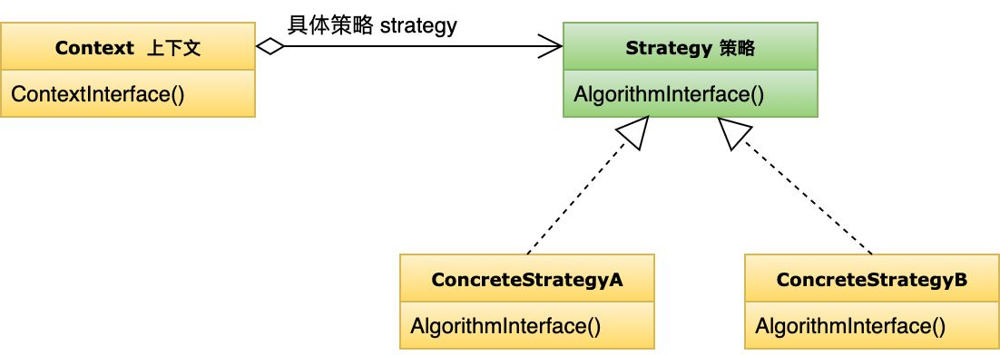
> 
> ````js
>/*策略类*/
> const strategies = {
>    "A": function(money) {
>         return money * 4
>     },
>     "B" : function(money) {
>         return money * 3
>     },
>     "C" : function(money) {
>         return money * 2
>     } 
> }
> 
> /*环境类*/
> const calculateBouns = function(level, money) {
>     return strategies[level](money)
> }
> 
> console.log(calculateBouns('A',10000)) // 40000
> ````
> 
> ### 【典例一】策略模式-校验表单
> 
> ```js
><html>
> <head>
>    <title>策略模式-校验表单</title>
>     <meta content="text/html; charset=utf-8" http-equiv="Content-Type">
> </head>
> <body>
> <form id = "registerForm" method="post" action="http://xxxx.com/api/register">
>     用户名：<input type="text" name="userName">
>     密码：<input type="text" name="password">
>     手机号码：<input type="text" name="phoneNumber">
>     <button type="submit">提交</button>
> </form>
> <script type="text/javascript">
>   /** 策略对象 */
>   const strategies = {
>     isNoEmpty: function (value, errorMsg) {
>       if (value === '') return errorMsg
>     },
>     isNoSpace: function (value, errorMsg) {
>       if (value.trim() === '') return errorMsg
>     },
>     minLength: function (value, length, errorMsg) {
>       if (value.length < length) return errorMsg
>     },
>     isMobile: function (value, errorMsg) {
>       if (!/^(13[0-9]|14[5|7]|15[0|1|2|3|5|6|7|8|9]|17[7]|18[0|1|2|3|5|6|7|8|9])\d{8}$/.test(value)) {
>         return errorMsg
>       }
>     }
>   }
> 
> 
>   /** 验证类 */
>   class Validator {
>     constructor() {
>       this.cache = []
>     }
> 
>     add(dom, rules) {
>       for (let i = 0, rule; rule = rules[i++];) {
>         const strategyArray = rule.strategy.split(':')
>         const errorMsg = rule.errorMsg
> 
>         this.cache.push(() => {
>           const strategy = strategyArray.shift()
>           strategyArray.unshift(dom.value)
>           strategyArray.push(errorMsg)
>           return strategies[strategy].apply(dom, strategyArray)
>         })
>       }
>     }
> 
>     start() {
>       const resultErrorArr = []
>       for (let i = 0, validatorFn; validatorFn = this.cache[i++];) {
>         const errorMsg = validatorFn()
>         if (errorMsg) {
>           resultErrorArr.push(errorMsg)
>         }
>       }
>       return resultErrorArr
>     }
>   }
> 
>   const registerForm = document.getElementById('registerForm')
>   const validatorFn = function () {
>     const validator = new Validator()
>     validator.add(registerForm.userName, [{
>       strategy: 'isNoEmpty',
>       errorMsg: '用户名不可为空'
>     }, {
>       strategy: 'isNoSpace',
>       errorMsg: '不允许以空白字符命名'
>     }, {
>       strategy: 'minLength:2',
>       errorMsg: '用户名长度不能小于2位'
>     }])
>     validator.add(registerForm.password, [{
>       strategy: 'minLength:6',
>       errorMsg: '密码长度不能小于6位'
>     }])
>     validator.add(registerForm.phoneNumber, [{
>       strategy: 'isMobile',
>       errorMsg: '请输入正确的手机号码格式'
>     }])
>     return validator.start()
>   }
> 
>   registerForm.onsubmit = function () {
>     const errorMsg = validatorFn()
>     console.log(errorMsg)
>     return false
>   }
> </script>
> </body>
> </html>
> ```
> 

### 【命令模式】加强合作

>```bash
>## 命令（Command）：加强合作
>命令模型是将请求包装为命令，使得在执行时可以与具体的执行逻辑解耦。
>在工作中，我们有时候不应该太关心一个事情是怎么完成的，当交给别人完成时，信任他们即可。比如项目负责人将前端的项目模块1分发给同事A，将项目模块2分发给同事B，并命令他们在指定时间内实现所负责的模块功能。就是在项目负责人的角度来看，不用事事亲为，但是这并不妨碍我们主动养成全局视角，了解每个细节。合作才能影响更多的事情。
>
>
>## 描述
>- 将一个请求封装成对象，从而让你使用不同的请求把客户端参数化，对请求排队或者记录请求日志，以及可提供命令的撤销和恢复功能。
>- 命令(事务)模式的原理：将请求以命令的形式包裹在对象中，并传给调用对象。调用对象寻找可以处理该命令的合适对象，并把该命令传给相应的对象，让改对象执行命令。
>- 命令模式用于：将请求封装成对象，将命令的发送者和接收者解耦。即将调用对象（用户界面、API和代理等）与实现操作的对象隔离开。
>- 命令模式的使用场景：将行为进行 “记录、撤销/重做、事务” 等处理，需要行为请求者与行为实现者解耦的时候（凡是两个对象间互动方式需要更高的模块化程度时都可以用到这种模式）
>
>
>## 命令模式与代理模式的区别
>- 在代理(委托)模式中，调用者是委托者，执行者是被委托者，委托者和被委托者接口定义时相同的；在命令模式中，调用者不关注执行者的接口定义是否和它一致。
>- 在调用时机上，代理模式的具体执行是只能在特定的调用者内部执行（接口相同）；命令模式的具体执行可以再任何调用者内部执行（接口不相同也可以）。
>
>
>## 优点
>- 对命令进行封装，使命令易于扩展和修改
>- 命令发出者和接受者解耦，是发出者不需要知道命令的具体执行过程即可执行
>- 降低对象之间的耦合度。
>- 新的命令可以很容易地加入到系统中。
>- 可以比较容易地设计一个组合命令。
>- 调用同一方法实现不同功能。
>
>## 缺点
>- 使用命令模式可能会导致某些系统有过多的具体命令类。
>```
>
>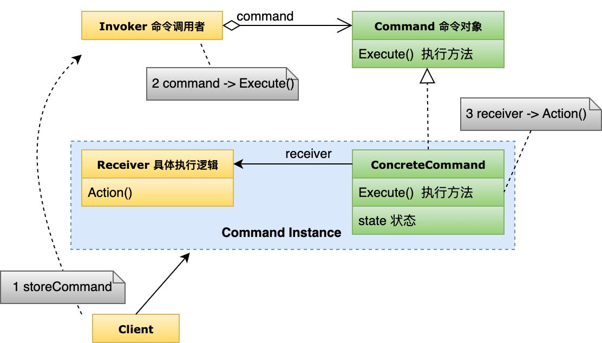
>
>```js
>/** 接收者类 */
>class Receiver1 {
>  action() {
>    console.log('接收者: 接收者1号执行请求')
>  }
>}
>class Receiver2 {
>  action() {
>    console.log('接收者2: 接收者2号执行请求')
>  }
>}
>
>
>/** 命令者
>  * 执行命令（execute ）时 ，便会执行各自命令接收者的action方法
> */
>class CreateCommand {
>  constructor(receiver) {
>    this.receiver = receiver
>  }
>
>  execute() {
>    console.log('命令者：发布命令任务')
>    this.receiver.action()
>  }
>}
>
>
>/** 调用者 */
>class Invoker {
>  constructor(command1, command2) {
>    this.command1 = command1
>    this.command2 = command2
>  }
>
>  invokerOrder1() {
>    console.log('调用者：触发任务1')
>    this.command1.execute()
>  }
>
>  invokerOrder2() {
>    console.log('调用者：触发任务2')
>    this.command2.execute()
>  }
>
>}
>
>/** 测试: 执行命令 */
>// 仓库
>const warehouse1 = new Receiver1()
>const warehouse2 = new Receiver2()
>// 订单
>const order1 = new CreateCommand(warehouse1)
>const order2 = new CreateCommand(warehouse2)
>// 客户
>const client = new Invoker(order1, order2)
>client.invokerOrder1()
>client.invokerOrder2()
>
>/* 
>  调用者：触发任务1
>  命令者：发布命令任务
>  接收者: 接收者1号执行请求
>  调用者：触发任务2
>  命令者：发布命令任务
>  接收者2: 接收者2号执行请求
>*/
>```

### 【状态模式】管理自己

>```bash
>## 状态（State）：管理自己
>状态模式是说在不同的状态下，有不同的处理行为。
>对工作中来说，我们可能有状态好的时候，有状态不好的时候，主观的处理的手段是调整状态。但是如果调整不过来，我们应该进行不同的操作。比如，脑子好的时候，想一些复杂问题；脑子嗡嗡的时候，做一些简单整理。
>
>
>## 描述
>- 允许一个对象在其内部状态改变时改变它的行为。当一个对象的内部状态发生改变时，会导致其行为的改变，对象看起来似乎修改了它的类。
>- 每个状态建立一个类，状态改变会产生不同行为。
>
>
>## 适用场景
>- 一个操作中含有大量的分支语句，而且这些分支语句依赖于该对象的状态，那么可以使用状态模式来将分支的处理分散到单独的状态类中。
>- 对象的行为随着状态的改变而改变，则可以考虑使用状态模式来把状态和行为分离，虽然分离了，但是状态和行为是对应的，再通过改变状态调用状态对应的行为。
>
>
>## 优点
>- 定义了状态与行为之间的关系，封装在一个类中，更直观清晰，增改方便。
>- 状态与状态间、行为与行为间彼此独立互不干扰。
>- 用对象代替字符串来记录当前状态，使得状态的切换更加一目了然
>- 结构相比之下清晰，避免了过多的 switch-case 或 if-else 语句的使用，避免了程序的复杂性，提高系统的可维护性。
>- 符合开闭原则，每个状态都是一个子类，增加了状态只需修改对应状态类即可。
>- 封装性良好，状态的切换在类的内部实现，外部的调用无需知道类内部如何实现状态和行为的变换。
>
>## 缺点
>- 引入多余的类，每个状态都有对应的类，导致系统中类的个数增加。
>- 逻辑分散
>```
>
>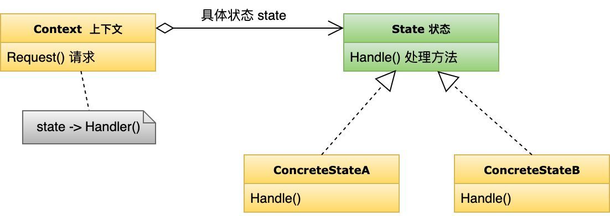
>
>```js
>/** 状态（弱光、强光、关灯） */
>class State {
>  constructor(state) {
>    this.state = state
>  }
>  handle(context) {
>    console.log(`State: ${this.state}`)
>    context.setState(this.state)
>  }
>}
>
>
>class Context {
>  constructor() {
>    this.state = null
>  }
>  getState() {
>    console.log(`Context: ${this.state}`)
>    return this.state
>  }
>  setState(state) { this.state = state }
>}
>
>/** 测试 */
>const context = new Context()
>const weak = new State('弱光')
>const strong = new State('强光')
>const off = new State('关闭灯光')
>
>weak.handle(context)
>context.getState()
>strong.handle(context)
>context.getState()
>off.handle(context)
>context.getState()
>```

### 【观察者模式】发布订阅

> ```bash
> ## 观察者（Observer）：主观能动性
> - 观察者模式类似通过注册、回调这样的协作设计，完成变化通知的协作机制。
> - 当观察对象发生变化时自动调用相关函数。
> 
> 
> ## 描述
> - 它定义了对象间的一种一对多的依赖关系，让多个观察者对象同时监听某一个主题对象，这个主题对象的状态发生变化时会通知所有的观察者对象，使它们能够自动更新自己。
> - 观察者又称发布订阅模式。定义对象间的一种一对多的依赖关系，当一个对象的状态发生改变时（发布），所有依赖于它的对象（订阅方）都得到通知并被自动更新。
> 
> 
> ## 适用场景
> - 当一个对象的改变需要同时改变其他对象，并且它不知道具体有多少对象需要改变时，就应该考虑使用观察者模式。
> - 触发 DOM 事件。
> - vue的响应式，在get时会进行依赖更新，当改变了对象的属性时，就会触发派发更新。
> 
> 
> ## 优点：解耦
> - 时间上的解耦：注册的订阅行为由消息的发布方来决定何时调用，订阅者不用持续关注，当消息发生时发布者会负责通知。
> - 对象上的解耦：发布方不用提前知道消息的接收方是谁，发布者只需要遍历处理所有订阅该消息类型的订阅者发送消息即可（迭代器模式），由此解耦了发布者和订阅者之间的联系，互不持有，都依赖于抽象，不再依赖于具体。
> 
> - 支持简单的广播通信，自动通知所有已经订阅过的对象
> - 目标对象与观察者之间的抽象耦合关系能单独扩展以及重用
> 
> ## 缺点
> - 增加消耗：创建结构和缓存订阅者两个过程需要消耗计算和内存资源，即使订阅后始终没有触发，订阅者也会始终存在于内存。
> - 增加复杂度：订阅者被缓存在一起，如果多个订阅者和发布者层层嵌套，那么程序将变得难以追踪和调试（如 Vue 调试时点开原型链时会看到 deps/subs/watchers）。
> - 过渡使用会导致对象与对象之间的联系弱化，会导致程序难以跟踪维护和理解。
> - 缺点主要在于理解成本、运行效率、资源消耗，特别是在多级 "发布-订阅" 时，情况会变得更复杂。
> ```
>
> 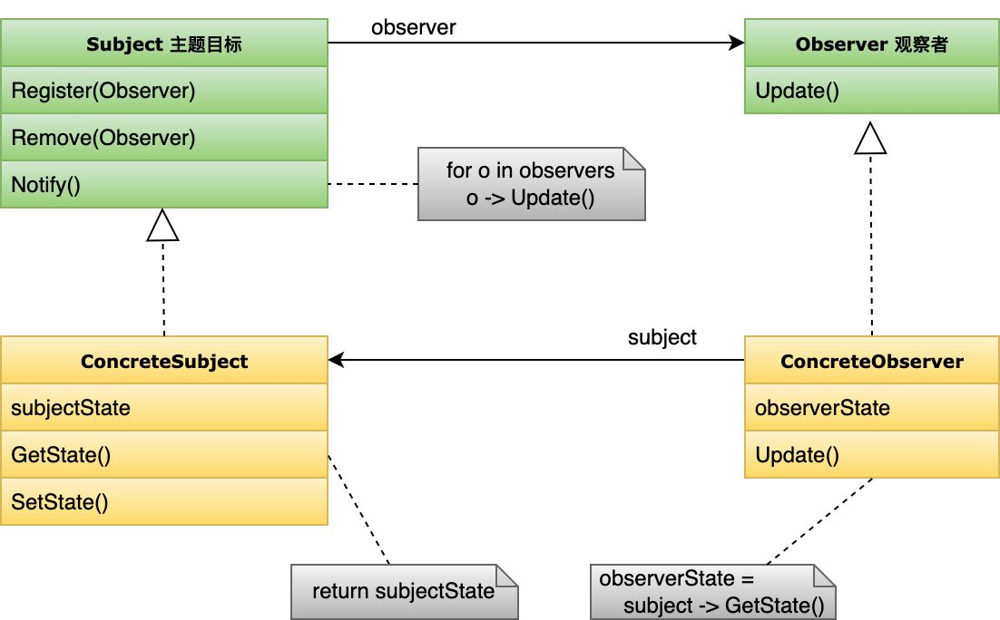
>
> #### 内部关联 - 在观察者内部添加主题对象的绑定，外部调用无需关心变量的变化关系，只需要更改内容即可察觉变化
>
> ```js
> /** 主题 保存状态，状态变化之后触发所有观察者对象 */
> class Subject {
>   constructor() {
>     this.state = null
>     this.observerList = []
>   }
> 
>   // 获取状态
>   getState() {
>     return this.state
>   }
> 
>   // 设置状态
>   setState(state) {
>     this.state = state
>     this.notifyAllObservers()
>   }
> 
>   /** 发布：通知所有观察者需要更新 */
>   notifyAllObservers() {
>     this.observerList.forEach(observer => {
>       observer.update()
>     })
>   }
> 
>   /** 订阅 */
>   subscribe(observer) {
>     const findIdx = this.observerList.indexOf(observer)
>     if (findIdx === -1) {
>       this.observerList.push(observer)
>     }
>     return this.observerList
>   }
> 
>   /** 取消订阅 */
>   unsubscribe(observer) {
>     const findIdx = this.observerList.indexOf(observer)
>     if (findIdx !== -1) {
>       this.observerList.splice(findIdx, 1)
>     }
>     console.log(`${observer.name} 退订`)
>     return this.observerList
>   }
> }
> 
> 
> /** 观察者 */
> class Observer {
>   constructor(name, subject, state = null) {
>     this.name = name
>     this.subject = subject
>     this.subject.subscribe(this)
>     this.state = state
>   }
> 
>   // 更新状态
>   update() {
>     const updateState = this.subject.getState()
>     this.state = updateState
>     console.log(`${this.name}: ${this.state}`)
>   }
> 
>   // 获取状态
>   get() {
>     console.log(`${this.name}: ${this.state}`)
>     return this.state
>   }
> }
> 
> 
> /** 测试 */
> const subject = new Subject()
> const observer1 = new Observer('observer1', subject)
> const observer2 = new Observer('observer2', subject)
> const observer3 = new Observer('observer3', subject, 'cilly')
> subject.setState('willy')
> subject.unsubscribe(observer3)  // observer3退订
> observer3.get()
> 
> /* observer1: willy
> observer2: willy
> observer3: willy
> observer3 退订
> observer3: willy */
> ```
>
> ### DOM 事件触发
>
> ```js
> document.body.addEventListener('click', (e) => {
>   console.log('Hello World !')
> })
> document.body.click()
> ```
>

### 【发布订阅模式 VS 观察者模式】

> ```bash
> ## 观察者模式 与 发布订阅模式的区别
> 出版者Publishers + 订阅者Subscribers = 观察者模式(Observer Pattern)
> 
> 1. 观察者模式
> 观察者模式，其实就是为了实现松耦合。
> 
> 2. 发布订阅模式
> 在发布订阅模式中，发布者并不会直接通知订阅者。即发布者和订阅者彼此互不相关，而是通过在消息队列中的 Broker 中转。
> 发布订阅模式里，发布者和订阅者，不是松耦合，而是完全解耦的。
> 
> 从表面上看：
>     - 观察者模式中只有两个角色：观察者 + 被观察者
>     - 发布订阅模式中有三个角色：发布者 + 经纪人Broker + 订阅者
> 
> 从使用原理上看：
>     - 观察者和被观察者是松耦合的关系。
>     - 发布者和订阅者是完全解耦的。
> 
> 从使用层面上看：
> 		- 观察者模式，多用于单个应用内部。
> 		- 发布订阅模式，更多是一种跨应用的模式(cross-application pattern)，如常用的消息中间件。
> ```
>
> 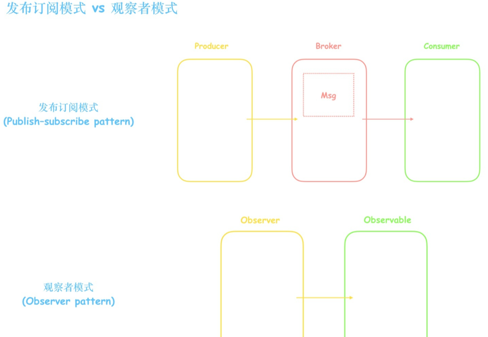
>
> ```js
> // 发布者
> function Publisher () {
>   this.listeners = []
> }
> Publisher.prototype.addListener = function (listener) {
>   this.listeners.push(listener)
> }
> Publisher.prototype.removeListener = function (listener) {
>   delete this.listeners[listener]
> },
>   Publisher.prototype.notify = function (obj) {
>   for(let i = 0; i < this.listeners.length; i++) {
>     const listener = this.listeners[i]
>     if (typeof listener !== 'undefined') {
>       listener.process(obj)
>     }
>   }
> }
> }
> 
> // 订阅者
> function Subscriber () {  }
> Subscriber.prototype.process = function (obj) {
>   console.log(obj)
> }
> 
> const publisher = new Publisher()
> publisher.addListener(new Subscriber())
> publisher.addListener(new Subscriber())
> publisher.notify({ name: 'willy', age: 24 }) // 发布一个对象到所有订阅者
> publisher.notify('this is string value') // 发布一个字符串到所有订阅者
> ```

### 【访问者模式】学会放手

>```bash
>## 访问者（Visitor）：学会放手
>访问者模式是说把对元素的访问操作交给访问者来操作，因为对访问者来说常常有不同的访问行为。
>在工作中，往往我们只能陈述事实，这个内容消化后，每个人都有自己的理解。代码协作也是一样，比如：页面到底长什么样，其实还是要交还给业务本身，我们应该专注于提供基础的能力。
>
>
>## 描述
>- 表示一个作用于某对象结构中的各元素的操作，它使你可以在不改变各元素的类的前提下定义作用于这些元素的新操作。
>- 访问者模式针对于对象结构中的元素，定义在不改变该对象的前提下访问其结构中元素的新方法。
>- 访问者模式由3部分组成：对象集合、集合元素、访问者。
>
>
>## 应用场景
>- 对象结构相对稳定，但其操作算法经常变化的程序。
>- 一个对象结构中的对象需要提供多种不同且不相关的操作，而且要避免让这些操作变化“污染”这些对象结构的类，也不希望在增加新操作时修改这些类。
>- 对象结构中对象的类很少改变，但经常需要在此对象结构上定义新的操作。
>
>
>## 优点
>- 符合"单一职责原则"。
>- 扩展性好：在不修改对象结构中元素的情况下，为对象结构中的元素添加新的功能。
>- 复用性好：通过访问者来定义整个对象结构通用的功能，从而提高复用程度。
>- 分离无关行为：通过访问者分离无关行为，把相关行为封装在一起，构成一个访问者。这样每一个访问者的功能都比较单一。
>
>## 缺点
>- 被访问的类的结构是固定的，如果被访问的类的结构会发生变化，则不适合访问者模式。
>- 对象结构变化很困难：在访问者模式中，每增加一个新的元素类，都要在每一个具体的访问类中增加响应的具体操作，这违背了 "开闭原则"。
>- 访问者模式依赖具体类，而没有抽象类，违反了 "依赖倒置原则"。
>- 具体元素对访问者公布细节，违反了"迪米特原则"。
>```
>
>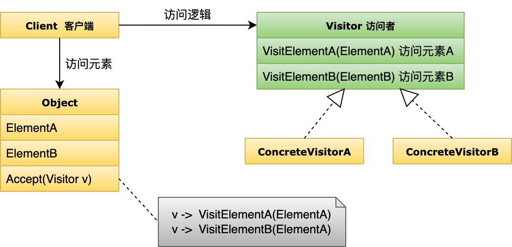
>
>```js
>/** 访问者 */
>class Visitor {
>  visitConcreteElement(ConcreteElement) {
>    ConcreteElement.operation()
>  }
>}
>
>/** 元素类 */
>class ConcreteElement {
>  operation() {
>    console.log('ConcreteElement.operation invoked')
>  }
>  accept(visitor) {
>    visitor.visitConcreteElement(this)
>  }
>}
>
>/** client */
>const visitor = new Visitor()
>const element = new ConcreteElement()
>visitor.visitConcreteElement(element) // ConcreteElement.operation invoked
>```
>
>#### 【典例一】学生购买电脑
>
>```js
>/** 电脑部件 - CPU */
>class CPU {
>  constructor() {
>    this.price = 10
>  }
>  getPrice() { return this.price }
>  accept(visitor) { visitor.visitCpu(this) }
>}
>
>/** 电脑部件 - 存储器 */
>class Memery {
>  constructor() {
>    this.price = 15
>  }
>  getPrice() { return this.price }
>  accept(visitor) { visitor.visitMemery(this) }
>}
>
>/** 电脑部件 - 主板 */
>class Board {
>  constructor() {
>    this.price = 20
>  }
>  getPrice() { return this.price }
>  accept(visitor) { visitor.visitBoard(this) }
>}
>
>/** 电脑（元素类）：将CPU、存储器、主板组装成电脑 */
>class Computer {
>  constructor() {
>    this.cpu = new CPU()
>    this.memery = new Memery()
>    this.board = new Board()
>  }
>  accept(visitor) {
>    this.cpu.accept(visitor)
>    this.memery.accept(visitor)
>    this.board.accept(visitor)
>  }
>}
>
>/** 访问者 */
>class StudentVisitor {
>  constructor() {
>    this.totalPrice = 0
>  }
>  visitCpu(cpu) {
>    this.totalPrice += cpu.getPrice() * 0.9
>  }
>  visitBoard(board) {
>    this.totalPrice += board.getPrice() * 0.8
>  }
>  visitMemery(memery) {
>    this.totalPrice += memery.getPrice() * .7
>  }
>}
>
>
>/** 测试代码：学生购买自己的电脑 */
>const student = new StudentVisitor()
>const computer = new Computer()
>computer.accept(student)
>console.log(student.totalPrice)	// 35.5
>```

### 【中介者模式】协调能力

>```bash
>## 中介者（Mediator）：协调能力
>中介模式是当多个类之间要协调时，往往引入中介者进行协调，减少大家的知识成本。
>这个我们常常需要一些PM、PMO这样的角色去管理项目，系统中也需要一些协调层去协调各个域。因此我们也注重培养协调事务、具备全局观的能力。
>
>
>## 描述
>- 对象和对象之间借助第三方中介者进行通信。
>- 用一个中介对象（中介类）来封装多个对象之间的复杂交互（对象与对象之间存在大量的关联关系）。中介者将对象与对象之间的紧密的耦合关系变得松散，从而可以独立地改变它们之间的交互。
>- 通过增加一个中介者对象，其他所有的相关对象都通过该中介者对象来通信，而不是相互引用，当其中的一个对象发生改变时，只需要通知中介者对象即可。通过中介者模式可以解除对象与对象之间的紧耦合关系。
>- 中介者模式使网状的多对多关系变成相对简单的一对多关系（类似观察者模式，但是单向的，由中介者统一管理）
>
>## 中介者模式的通用实现
>- Colleague：同事对象，只知道中介者而不知道其他同事对象，通过中介者来与其他对象通信。
>- Mediator：中介者，负责与各同事对象的通信。
>
>
>## 适用场景
>- 系统中对象之间存在比较复杂的引用关系，导致它们之间的依赖关系结构混乱而且难以复用该对象。
>- 想通过一个中间类来封装多个类中的行为，而又不想生成太多的子类。
>- 如果对象之间的复杂耦合确实导致调用和维护出现困难，而且这些耦合度随着项目的变化呈现指数增长曲线，那么可以考虑用中介者模式来重构代码。
>
>## 实例
>- 例如现实生活中，航线上的飞机只需要和机场的塔台通信就能确定航线和飞行状态，而不需要和所有飞机通信。同时塔台作为中介者，知道每架飞机的飞行状态，所以可以安排所有飞机的起降和航线安排。
>- 例如购物车需求，存在商品选择表单、颜色选择表单、购买数量表单等等，都会触发change事件，那么可以通过中介者来转发处理这些事件，实现各个事件间的解耦，仅仅维护中介者对象即可。
>
>
>## 优点
>- 使各对象之间耦合松散，降低了同事对象之间的相互依赖和耦合，可以独立地改变它们之间的交互。
>- 中介者和对象一对多的关系取代了对象之间的网状多对多的关系，符合"最少知识原则"，提高系统的灵活性，使得系统易于维护和扩展。
>- 中介者在同事对象间起到了控制和协调的作用，因此可以结合代理模式那样，进行同事对象间的访问控制、功能扩展。
>- 因为同事对象间不需要相互引用，因此也可以简化同事对象的设计和实现。
>
>## 缺点
>- 系统中会新增一个中介者对象，因为对象之间交互的复杂性，转移了中介者对象的复杂性，使得中介者对象经常是巨大的（中介者的逻辑过度集中化）。中介者对象自身往往就是一个难以维护的对象（特别是当同事对象过多时更为凸显这个问题）。
>- 当出现中介者可维护性变差的情况时，考虑是否在系统设计上不合理，从而简化系统设计，优化并重构，避免中介者出现职责过重的情况。
>```
>
>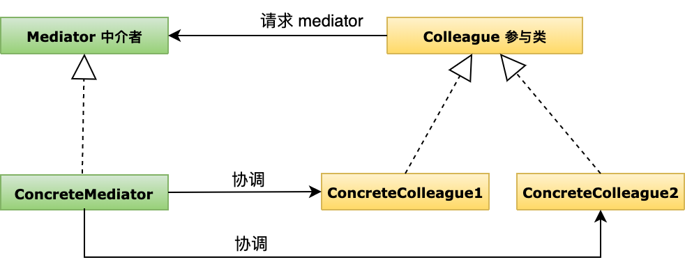
>
>```js
>/** 中介者类 */
>class Mediator {
>  constructor(a, b) {
>    this.a = a
>    this.b = b
>  }
>  setA() {
>    const number = this.b.number
>    this.a.setNumber(number * 10)
>  }
>  setB() {
>    const number = this.a.number
>    this.b.setNumber(number / 10)
>  }
>}
>
>class A {
>  constructor() {
>    this.number = 0
>  }
>  setNumber(num, mediator) {
>    this.number = num
>    if (mediator) {
>      mediator.setB()
>    }
>  }
>}
>
>class B {
>  constructor() {
>    this.number = 0
>  }
>  setNumber(num, mediator) {
>    this.number = num
>    if (mediator) {
>      mediator.setA()
>    }
>  }
>}
>
>const a = new A()
>const b = new B()
>const mediator = new Mediator(a, b)
>a.setNumber(10, mediator)
>console.log(a.number, b.number)	// 10 1
>b.setNumber(10, mediator)	// 100 10
>console.log(a.number, b.number)
>```
>
>#### 【典例】相亲
>
>- 首先我们考虑一个场景，男方和女方都有一定的条件，双方之间有要求，双方家长对对方孩子也有要求，如果达不到要求则不同意这门婚事。
>
>```js
>class Person {
>  // 个人信息
>  constructor(name, info, target) {
>    this.name = name
>    this.info = info // object，每一项为数字，比如身高，工资等
>    this.target = target // object，每一项为两个数字的数组，表示可接受的最低和最高值
>    this.enemyList = [] // 考虑列表
>  }
>
>  // 注册相亲对象及家长
>  registerEnemy(...enemy) {
>    this.enemyList.push(...enemy)
>  }
>
>  // 检查所有相亲对象及其家长的条件
>  checkAllPurpose() {
>    this.enemyList.forEach(enemy => enemy.info && this.checkPurpose(enemy))
>  }
>
>  // 检查对象是否满足自己的要求，并发信息
>  checkPurpose(enemy) {
>    // 对可枚举属性进行遍历操作，确认是否全部符合条件
>    const result = Object.keys(this.target).every(key => {
>      const [low, high] = this.target[key]
>      return low <= enemy.info[key] && enemy.info[key] <= high
>    })
>    // 通知对方
>    enemy.receiveResult(result, this, enemy)
>  }
>
>  // 接收到对方的信息
>  receiveResult(result, they, self) {
>    result
>      ? console.log(`${they.name}: 我觉得合适~ \t (我的要求 ${self.name} 已经满足~)`)
>      : console.log(`${they.name}: 你是个好人! \t (我的要求 ${self.name} 不能满足！)`)
>  }
>}
>
>
>// 男方
>const LiangXiaoShuai = new Person(
>  '梁小帅',
>  { age: 25, height: 174, salary: 6000 },
>  { age: [23, 27] },
>)
>// 男方家长
>const LiangXiaoShuaiParent = new Person(
>  '梁小帅家长',
>  null,
>  { height: [150, 175] },
>)
>// 女方
>const ZhouMeiLi = new Person(
>  '周美丽',
>  { age: 23, height: 160 },
>  { age: [20, 30] },
>)
>// 女方家长
>const ZhouMeiLiParent = new Person(
>  '周美丽家长',
>  null,
>  { salary: [10000, 20000] },
>)
>
>// 注册：每一个 person 实例都需要注册对方家庭成员的信息
>LiangXiaoShuai.registerEnemy(ZhouMeiLi, ZhouMeiLiParent)
>LiangXiaoShuaiParent.registerEnemy(ZhouMeiLi, ZhouMeiLiParent)
>ZhouMeiLi.registerEnemy(LiangXiaoShuai, LiangXiaoShuaiParent)
>ZhouMeiLiParent.registerEnemy(LiangXiaoShuai, LiangXiaoShuaiParent)
>
>// 检查对方是否符合要求，同样，每一个 person 实例都需要执行检查
>LiangXiaoShuai.checkAllPurpose()
>// 梁小帅: 我觉得合适~      (我的要求 周美丽 已经满足~)
>LiangXiaoShuaiParent.checkAllPurpose()
>// 梁小帅家长: 我觉得合适~          (我的要求 周美丽 已经满足~)
>ZhouMeiLi.checkAllPurpose()
>// 周美丽: 我觉得合适~      (我的要求 梁小帅 已经满足~)
>ZhouMeiLiParent.checkAllPurpose()
>// 周美丽家长: 你是个好人!          (我的要求 梁小帅 不能满足！)
>```
>
>- 引入媒人(中介者)，专门处理对象之间的耦合关系，所有对象之间相互不了解，只与媒人交互，如果引入新的相关方，也只需要通知媒人即可。
>- 除了媒人类(中介者)外，其他各个角色都是独立的，相互不知道对方的存在，对象间关系被解耦。我们甚至可以方便地添加新的对象，比如周美丽家同时还在考虑着willy。
>
>```js
>// 男方
>const LiangXiaoShuai = {
>  name: '梁小帅',
>  family: '梁小帅家',
>  gender: 'male',
>  info: { age: 25, height: 174, salary: 20000 },
>  target: { age: [23, 27] },
>}
>// 男方家长
>const LiangXiaoShuaiParent = {
>  name: '梁小帅家长',
>  family: '梁小帅家',
>  gender: 'male',
>  info: null,
>  target: { height: [150, 175] },
>}
>// 女方
>const ZhouMeiLi = {
>  name: '周美丽',
>  family: '周美丽家',
>  gender: 'female',
>  info: { age: 23, height: 160 },
>  target: { age: [20, 30] },
>}
>// 女方家长
>const ZhouMeiLiParent = {
>  name: '周美丽家长',
>  family: '周美丽家',
>  gender: 'female',
>  info: null,
>  target: { salary: [10000, 20000] },
>}
>
>/** 媒人（中介者类） */
>const MatchMaker = {
>  // 媒人的花名册
>  matchBook: {},
>
>  // 注册各方
>  registPersons(...personList) {
>    personList.forEach(person => {
>      // 将家长和孩子放到一起存入花名册
>      (this.matchBook[person.family] || (this.matchBook[person.family] = [])).push(person)
>    })
>  },
>
>  // 检查对方家庭的孩子对象是否满足要求
>  checkAllPurpose() {
>    Object.keys(this.matchBook)
>      // 遍历名册中所有家庭
>      .forEach((familyName, idx, matchList) => matchList
>        // 对于其中的一个家庭，过滤名册中其他的家庭
>        .filter(match => match !== familyName)
>        // 遍历该家庭中注册到名册上的所有成员
>        .forEach(enemyFamily => this.matchBook[enemyFamily]
>          .forEach(enemy => this.matchBook[familyName]
>            // 逐项比较自己的条件和他们的要求（同性别的排除）
>            .forEach(person =>
>              enemy.info
>              && person.gender !== enemy.gender
>              && this.checkPurpose(person, enemy)
>            )
>          )
>        )
>      )
>  },
>
>  // 检查对方是否满足自己的要求，并发信息
>  checkPurpose(person, enemy) {
>    // 对可枚举属性进行遍历操作，确认是否全部符合条件
>    const result = Object.keys(person.target).every(key => {
>      const [low, high] = person.target[key]
>      return low <= enemy.info[key] && enemy.info[key] <= high
>    })
>    // 通知对方
>    this.receiveResult(result, person, enemy)
>  },
>
>  // 接收到对方的信息
>  receiveResult(result, they, self) {
>    result
>      ? console.log(`${they.name}: 我觉得合适~ \t (我的要求 ${self.name} 已经满足~)`)
>      : console.log(`${they.name}: 你是个好人! \t (我的要求 ${self.name} 不能满足！)`)
>  },
>}
>
>/** 新增对象 */
>// 男方
>const Willy = {
>  name: 'willy',
>  family: '男方',
>  gender: 'male',
>  info: { age: 27, height: 172, salary: 6000 },
>  target: { age: [20, 27] },
>}
>// 男方家长
>const WillyParent = {
>  name: 'willy parent',
>  family: '男方',
>  gender: 'male',
>  info: null,
>  target: { height: [155, 175] },
>}
>
>/** 注册：只需注册一次 */
>MatchMaker.registPersons(
>  LiangXiaoShuai,
>  LiangXiaoShuaiParent,
>  ZhouMeiLi,
>  ZhouMeiLiParent,
>  Willy,
>  WillyParent
>)
>/** 检查对方是否符合要求，也只需要检查一次 */
>MatchMaker.checkAllPurpose()
>
>
>/* 梁小帅: 我觉得合适~      (我的要求 周美丽 已经满足~)
>梁小帅家长: 我觉得合适~          (我的要求 周美丽 已经满足~)
>周美丽: 我觉得合适~      (我的要求 梁小帅 已经满足~)
>周美丽家长: 我觉得合适~          (我的要求 梁小帅 已经满足~)
>周美丽: 我觉得合适~      (我的要求 willy 已经满足~)
>周美丽家长: 你是个好人!          (我的要求 willy 不能满足！)
>willy: 我觉得合适~       (我的要求 周美丽 已经满足~)
>willy parent: 我觉得合适~        (我的要求 周美丽 已经满足~) */
>```

### 【解释器模式】加强理解

>```bash
>## 解释器（Interpreter）：加强理解
>解释器模式是针对一套上下文，形成一套语言，可以通过解释表达式含义的方式完成对应的任务。
>这里来说，我们可以形成某个团体的领域语言，内部交流通过相关领域语言交流，可以增加交流效率。此外，其实不同层次都有不同层次的专业术语，有时候一个术语的解释是一个方面的顿悟，还是要多了解工作内容本身。
>
>
>## 描述
>给定一个语言，定义它的文法的一种表示，并定义一个解释器，这个解释器使用该标识来解释语言中的句子。
>```
>
>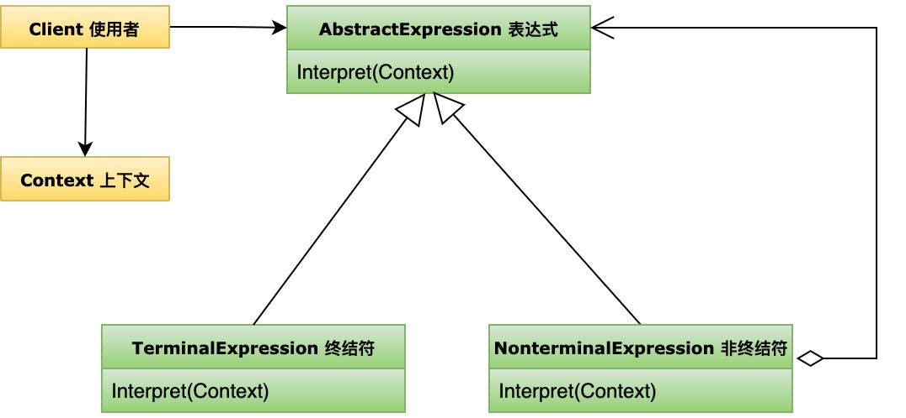
>
>```js
>class Context {
>  constructor() {
>    this._list = [] // 存放 终结符表达式
>    this._sum = 0 // 存放 非终结符表达式(运算结果)
>  }
>
>  get sum() {
>    return this._sum
>  }
>  set sum(newValue) {
>    this._sum = newValue
>  }
>
>  add(expression) {
>    this._list.push(expression)
>  }
>
>  get list() {
>    return [...this._list]
>  }
>}
>
>
>class PlusExpression {
>  interpret(context) {
>    if (!context instanceof Context) {
>      throw new Error('TypeError')
>    }
>    context.sum = ++context.sum
>  }
>}
>class MinusExpression {
>  interpret(context) {
>    if (!context instanceof Context) {
>      throw new Error('TypeError')
>    }
>    context.sum = --context.sum
>  }
>}
>
>
>/** 测试代码 */
>const context = new Context()
>
>// 依次添加：加法 | 加法 | 减法 表达式
>context.add(new PlusExpression())
>context.add(new PlusExpression())
>context.add(new MinusExpression())
>
>// 依次执行：加法 | 加法 | 减法 表达式
>context.list.forEach(expression => expression.interpret(context))
>console.log(context.sum)
>```
>

### 【迭代器模式】横向职责

>```bash
>## 迭代器（Iterator）：横向职责
>迭代器模式是将集合的访问功能独立出来，通过迭代的模式去访问。
>在工作中，我们一般给每个人独立职责，如一般会将需求管理、缺陷管理、资金安全的一些事情独立出来，一方面是这些功能块从主体来说是比较内聚的；另一方面是对工作职责的细分，发挥团队协作的效能。
>
>
>## 描述
>- 提供一种方法顺序地访问聚合对象内部的各个元素，而又无需暴露该对象内部的表示（对象内部结构未知）。
>- 使用者无需关心对象的内部构造，就可以按顺序访问其中的每个元素。
>
>
>## 应用场景
>- Array.prototype.forEach
>- ES6的 Iterator
>- 对于集合内部结果常常变化各异，不想暴露其内部结构，但又想让用户透明的访问其中的元素，可以使用迭代器模式
>
>
>## 特点
>- 访问一个聚合对象的内容而无需暴露它的内部表示
>- 为遍历不同的集合结构提供一个统一的接口，从而支持同样的算法在不同的集合结构上进行操作
>```
>
>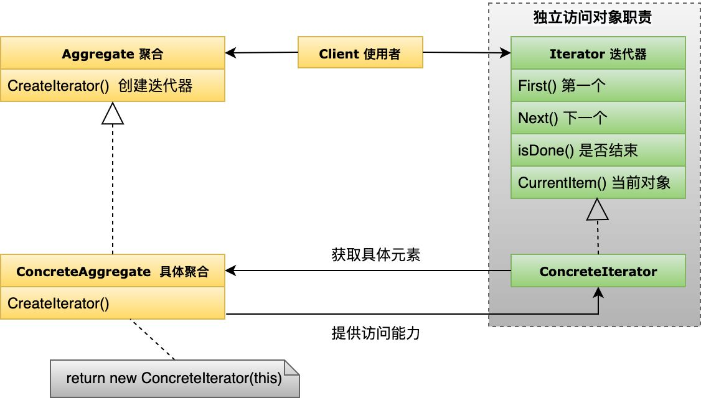
>
>```js
>/** 迭代器 */
>class Iterator {
>  constructor(list) {
>    this.list = list
>    this.currentIndex = 0
>  }
>
>  /** 是否还有下一个元素 */
>  hasNext() {
>    if (this.currentIndex >= this.list.length) {
>      return false
>    }
>    return true
>  }
>
>  /** 下一个元素 */
>  next() {
>    if (this.hasNext()) {
>      return this.list[this.currentIndex++]
>    }
>    return null
>  }
>}
>
>
>/** 测试 */
>const list = [1, 2, 3, 4, 5]
>const iterator = new Iterator(list)
>while(iterator.hasNext()) {
>  console.log(iterator.next())
>}
>```
>
>#### 【案例一】实现内部迭代器（自实现forEach）
>
>- 内部迭代器在调用时简单，使用者不用关心迭代器内部实现的细节，但这也是内部迭代器的缺点。比如要比较两数组是否相等，只能在其回调函数中做文章。
>
>```js
>/** 内部迭代器 */
>const myForEach = (arr, callback) => {
>  for (let i = 0, len = arr.length; i < len; i++) {
>    // 把索引下标和元素内容当做传递给 callback
>    callback(arr[i], i)
>  }
>}
>
>/* myForEach(['a', 'b', 'c'], (item, index) => {
>  console.log(`索引下标: ${index}, 元素内容: ${item}`)
>}) */
>
>/** 两数组比较 */
>const compare = (iterator1, iterator2) => {
>  myForEach(iterator1, (item, index) => {
>    if (iterator2[index] !== item) {
>      console.log('两数组不等')
>      return false
>    }
>  })
>
>  console.log('两数组相等')
>  return true
>}
>compare([1, 2, 3], [1, 2, 3])
>```
>
>#### 【案例二】实现外部迭代器
>
>- 相较于内部迭代器，外部迭代器将遍历的权利转移到外部，因此在调用时有更多的自由性，但缺点是调用方式较复杂。
>
>```js
>/** 外部迭代器 */
>class ExternalIterator {
>  constructor(list) {
>    this.list = list
>    this.currentIndex = 0
>  }
>
>  next() {
>    this.currentIndex = this.currentIndex + 1
>  }
>
>  done() {
>    return this.currentIndex >= this.list.length
>  }
>
>  value() {
>    return this.list[this.currentIndex]
>  }
>}
>
>const iterator1 = new ExternalIterator([1, 2, 3])
>const iterator2 = new ExternalIterator([3, 4, 5])
>
>/** 两数组比较 */
>const compare = (iterator1, iterator2) => {
>  while (!iterator1.done() && !iterator2.done()) {
>    if (iterator1.value() !== iterator2.value()) {
>      console.log('两数组不等')
>      return false
>    }
>
>    // 外部迭代器将遍历的权利转移到外部
>    iterator1.next()
>    iterator2.next()
>  }
>
>  console.log('两数组相等')
>  return true
>}
>compare(iterator1, iterator2)
>```

### 【备忘录模式】时间旅行

>```bash
>## 备忘录（Memento）：时间回溯
>备忘录模式是对操作的一些记录，已被可以恢复到之前的版本。
>在日常工作中，我们常常需要及时备份、及时保存、及时提交等操作，这样在程序崩溃的时候可以快速恢复到之前版本。但从抽象来说，一些比较长时费力的事情，我们应该分解来做，及时锁住部分收益。
>
>
>## 描述
>在不破坏对象的封装性的前提下，在对象之外捕获并保存该对象内部的状态，以便日后对象使用或者对象恢复到以前的某个状态。
>
>
>## 应用场景
>- 分页控件
>- 撤销控件（时间旅行）
>
>
>## 优点
>- 给用户提供一种可以恢复状态的机制，可以使用户能够比较方便地回到某个历史的状态
>
>## 缺点
>- 消耗资源。如果类的成员变量过多，势必会占用比较大的资源，而且每一次保存都会消耗一定的内存。
>```
>
>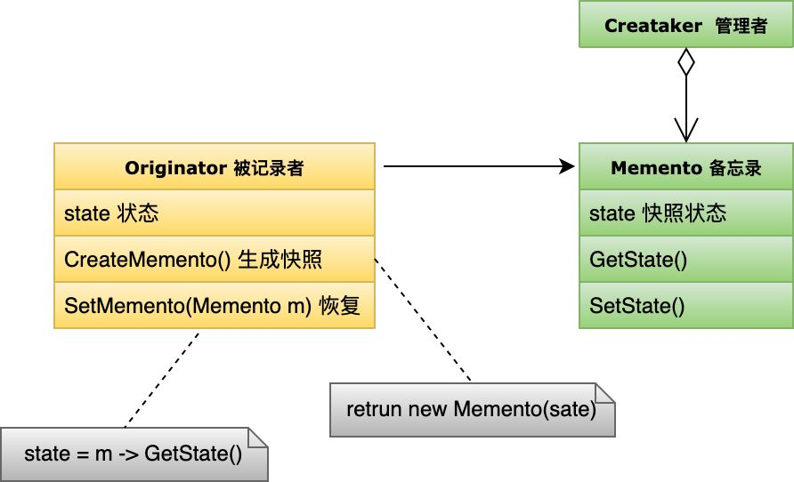
>
>```js
>/** 备忘类 */
>class Memento {
>  constructor(content) {
>    this.content = content
>  }
>
>  getContent() {
>    return this.content
>  }
>}
>
>
>/** 备忘列表 */
>class CareTaker {
>  constructor() {
>    this.mementoList = []
>  }
>
>  add(memento) {
>    this.mementoList.push(memento)
>  }
>
>  get(curIndex) {
>    return this.mementoList[curIndex]
>  }
>}
>
>
>/** 编辑器 */
>class Editor {
>  constructor() {
>    this.content = null
>  }
>
>  setContent(content) {
>    this.content = content
>  }
>
>  getContent() {
>    return this.content
>  }
>
>  saveContentToMemento() {
>    return new Memento(this.content)
>  }
>
>  getContentFromMemento(memento) {
>    this.content = memento.getContent()
>  }
>}
>
>
>/** 测试代码 */
>const editor = new Editor()
>const careTaker = new CareTaker()
>editor.setContent('1111')
>editor.setContent('2222')
>careTaker.add(editor.saveContentToMemento())
>editor.setContent('3333')
>careTaker.add(editor.saveContentToMemento())
>editor.setContent('4444')
>
>console.log(editor.getContent())  // 4444
>editor.getContentFromMemento(careTaker.get(1))
>console.log(editor.getContent())  // 3333
>
>editor.getContentFromMemento(careTaker.get(0))
>console.log(editor.getContent())  // 2222
>```

### 【职责链模式】能力与责任

>```bash
>## 职责链（Chain of Responsibility）：能力与责任
>职责链是说将请求让队列内的处理器一个个执行，直到找到可以执行的。
>这里对我们工作的启示是，我们常常抱怨我们得到的机会少，不能成为队列内优先可以处理的处理器，总是处理人家不想做的。但是换个角度看，首先责任链里面的处理器应该是正交的，大家应该各司其职。退一步来说，如果真的有重叠，那么你应该努力提升自己，成为能力强的，从而提高队列内的优先级。
>
>
>## 描述
>- 使多个对象都有机会处理请求，从而避免请求的发送者和接受者之间的耦合关系，将这些对象连成一条链，并沿着这条链传递该请求，知道有一个对象处理它为止。
>- 类似多米诺骨牌，通过请求第一个条件，会持续执行后续的条件，直到返回结果为止。
>- 项目中职责链模式能解耦 1 个请求对象和 n 个目标对象的关系（如对 if-else 语句的优化）。
>
>
>## JS 中的职责链模式痕迹
>- 作用域链：查找变量时，先从当前上下文的变量对象中查找，如果没有找到，就会从父级执行上下文的变量对象中查找，一直找到全局上下文的变量对象。
>- 原型链：当读取实例的属性时，如果找不到，就会查找当前对象关联的原型中的属性，如果还查不到，就去查找原型的原型，一致到最顶层 null 为止。
>- 事件冒泡：事件在 DOM 元素上触发后，会从最内层的元素开始发生，一直向外层传播，直到全局 document 对象。
>
>
>## 职责链模式的适用场景
>- 需要多个对象处理同一个请求，具体请求由哪个对象处理在运行时才确定。
>- 在不明确指定接收者的情况下，向多个对象中的其中一个提交请求的话，可以使用责任链模式。
>- 如果想要动态指定处理一个请求的对象集合，可以使用职责链模式。
>
>
>## 优点
>- 和命令模式类似，由于处理请求的职责节点可能是职责链上的任一节点，所以请求的发送者和接受者是解耦的。
>- 通过改变链内的节点或调整节点次序，允许动态地新增或修改责任链，增强了给对象指派职责的灵活性，符合 "开闭原则"。
>- 简化了对象，使得对象无需知道链的结构。
>- 增加新的请求处理类很方便。
>
>## 缺点
>- 不能保证某个请求一定会被链中的节点处理（有可能到最后一个节点还不能处理请求），这种情况可以在链尾增加一个保底的接受者节点来处理这种即将离开链尾的请求。
>- 使程序中增加了很多节点对象，可能再一次请求的过程中，大部分节点并没有起到实质性的作用。它们的作用仅仅是让请求传递下去，从性能方面考虑，要避免过长的职责链带来的性能损耗。
>- 调试不便，调用层次比较深，有可能会导致循环引用。
>```
>
>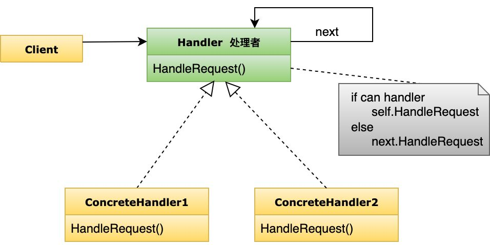
>
>```js
>/** 请假审批：需要组长审批、经理审批、总监审批 */
>class Action {
>  constructor(name) {
>    this.name = name
>    this.nextAction = null
>  }
>
>  setNextAction(action) {
>    this.nextAction = action
>  }
>
>  handle() {
>    console.log(`${this.name}审批`)
>    if (this.nextAction !== null) {
>      this.nextAction.handle()
>    }
>  }
>}
>
>/** 测试 */
>const leader1 = new Action('组长')
>const leader2 = new Action('经理')
>const leader3 = new Action('总监')
>leader1.setNextAction(leader2)
>leader2.setNextAction(leader3)
>leader1.handle()
>```
>
>#### 【典例一】优惠券
>
>- 场景: 某电商针对已付过定金的用户有优惠政策, 在正式购买后, 已经支付过 500 元定金的用户会收到 100 元的优惠券, 200 元定金的用户可以收到 50 元优惠券, 没有支付过定金的用户只能正常购买。
>
>```js
>/**
> * orderType: 表示订单类型, 1: 500 元定金用户；2: 200 元定金用户；3: 普通购买用户
> * pay: 表示用户是否已经支付定金, true: 已支付；false: 未支付
> * stock: 表示当前用于普通购买的手机库存数量, 已支付过定金的用户不受此限制
> */
>const order = (orderType, pay, stock) => {
>  if (orderType === 1) {
>    if (pay === true) {
>      console.log('500 元定金预购, 得到 100 元优惠券')
>    } else {
>      if (stock > 0) {
>        console.log('普通购买, 无优惠券')
>      } else {
>        console.log('库存不够, 无法购买')
>      }
>    }
>  } else if (orderType === 2) {
>    if (pay === true) {
>      console.log('200 元定金预购, 得到 50 元优惠券')
>    } else {
>      if (stock > 0) {
>        console.log('普通购买, 无优惠券')
>      } else {
>        console.log('库存不够, 无法购买')
>      }
>    }
>  } else if (orderType === 3) {
>    if (stock > 0) {
>      console.log('普通购买, 无优惠券')
>    } else {
>      console.log('库存不够, 无法购买')
>    }
>  }
>}
>order(3, true, 500) // 普通购买, 无优惠券
>
>
>/** 使用责任链模式改造 */
>const order500 = function (orderType, pay, stock) {
>  if (orderType === 1 && pay === true) {
>    console.log('500 元定金预购, 得到 100 元优惠券')
>  } else {
>    order200(orderType, pay, stock)
>  }
>}
>const order200 = function (orderType, pay, stock) {
>  if (orderType === 2 && pay === true) {
>    console.log('200 元定金预购, 得到 50 元优惠券')
>  } else {
>    orderCommon(orderType, pay, stock)
>  }
>}
>const orderCommon = function (orderType, pay, stock) {
>  if ((orderType === 3 || !pay) && stock > 0) {
>    console.log('普通购买, 无优惠券')
>  } else {
>    console.log('库存不够, 无法购买')
>  }
>}
>order500(3, true, 500) // 普通购买, 无优惠券
>
>
>/** 结合 AOP 对链路进行优化 */
>const orders500 = function (orderType, pay, stock) {
>  if (orderType === 1 && pay === true) {
>    console.log('500 元定金预购, 得到 100 元优惠券')
>  } else {
>    return 'nextSuccess'
>  }
>}
>const orders200 = function (orderType, pay, stock) {
>  if (orderType === 2 && pay === true) {
>    console.log('200 元定金预购, 得到 50 元优惠券')
>  } else {
>    return 'nextSuccess'
>  }
>}
>const ordersCommon = function (orderType, pay, stock) {
>  if ((orderType === 3 || !pay) && stock > 0) {
>    console.log('普通购买, 无优惠券')
>  } else {
>    console.log('库存不够, 无法购买')
>  }
>}
>// 链路代码
>Function.prototype.after = function (fn) {
>  const self = this
>  return function () {
>    const result = self.apply(self, arguments)
>    if (result === 'nextSuccess') {
>      return fn.apply(self, arguments) // 这里 return 别忘记了~
>    }
>  }
>}
>const orders = orders500.after(orders200).after(ordersCommon)
>orders(3, true, 500) // 普通购买, 无优惠券
>```

### 【模板方法模式】标准化能力

> ```bash
> ## 模板（Template）：标准化能力
> 模板方法模式是对一个执行过程进行抽象分解，通过骨架和扩展方法完成一个标准的主体逻辑和扩展。
> 在做一个系统平台时，一般是对过程进行标准化，对变化进行定义，形成一个平台逻辑和业务扩展，完成一个产品模板。只是这个模板是站点，还是扩展点，亦或者是其他的展示形式，这样标准化的能力也是需要长期训练的。
> 
> 
> ## 描述
> 在父类中定义一组操作算法骨架，而将一些实现步骤延迟到子类中，使得子类可以不改变父类的算法结构的同时，重新定义算法中的某些实现步骤。
> - 本质是抽象通用部分（骨架）和个性部分（在子类实现），即是将定义算法步骤骨架和具体实现分离。
> - 在继承的基础上，在父类中定义好执行的算法。
> 
> ## 模板方法模式的通用实现
> 模板方法模式是由两部分结构组成，第一部分是抽象父类，第二部分是具体实现的子类。
> 通常在抽象父类中封装了子类的算法框架，包括实现一些公共方法和封装子类中所有方法的执行顺序。
> 子类通过继承这个抽象类，也继承了整个算法结构，并且可以选择重写父类的方法。
> 
> - AbstractClass: 抽象父类，把一些共用方法提取出来，把可变的方法作为抽象类，最重要的是把算法骨架抽象出来为模板方法
> - TemplateMethod: 模板方法，固定了希望执行的算法骨架
> - ConcreteClass: 子类，实现抽象父类中定义的抽象方法，调用继承的模板方法时，将执行模板方法中定义的算法流程。
> 
> 
> ## 适用场景
> - 如果知道一个算法所需要的关键步骤，而且很明确这些步骤的执行顺序，但是具体的实现是位置的、灵活的，此时可以使用模板方法模式来将算法步骤的框架抽象出来。
> - 重要而复杂的算法，可以把核心算法逻辑设计为模板方法，周边相关细节功能由各个子类实现。
> - 模板方法模式可以被用来将子类组件将自己的方法挂钩到高层组件中，也就是钩子，子类组件中的方法交出控制权，高层组件在模板方法中决定何时回调子类组件中的方法，类似的用法场景还有 发布-订阅模式、回调函数。
> 
> 
> ## 优点
> - 封装了不变部分，扩展了可变部分，把算法中不变的部分封装到父类中直接实现，而可变的部分由子类继承后再具体实现。
> - 提取了公共代码部分，易于维护，因为公共的方法被提取到了父类，只需在父类中一次性修改这些公共方法即可。
> - 行为被父类的模板方法固定，子类实现只负责执行模板方法，具备可扩展性，符合开闭原则。
> 
> ## 缺点
> - 增加了系统复杂度，主要是增加了抽象类和类间的联系，需要做好文档工作。
> 
> 
> ## 模板方法模式与工厂模式的区别
> - 抽象工厂模式：提取的是实例的功能结构
> - 模板方法模式：提取的是算法的骨架结构
> 
> ## 模板方法模式与策略模式的区别
> - 模板方法模式：在子类定义时就已经确定了使用的算法
> - 策略模式：让我们在程序运行时动态地指定要使用的算法
> ```
>
> 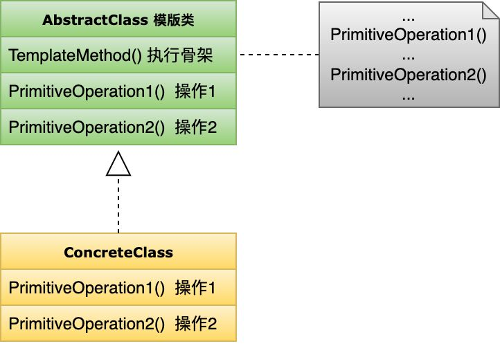
>
> ```js
> /** 
>  * 抽象父类 - 饮品制作类
>  * 咖啡制作过程为：烧开水 -> 冲泡咖啡 -> 倒入饮料杯 -> 加糖
>  * 泡茶制作过程为：烧开水 -> 浸泡茶叶 -> 倒入饮料杯 -> 加柠檬
>  */
> class Beverage {
>   constructor({ name, brewDrink, addCondiment }) {
>     this.name = name // 制作的饮品名称
>     this.brewDrink = brewDrink // 酝酿的饮品
>     this.addCondiment = addCondiment // 添加的调味品
>   }
> 
>   /** 共用方法: 烧开水 */
>   boilWater() {
>     console.log('共用：水已经煮沸')
>   }
> 
>   /** 共用方法: 倒入饮料杯中 */
>   pourCup() {
>     console.log('共用：倒进饮料杯中')
>   }
> 
>   /** 模板方法: 制作饮品的过程（核心是在父类上定义好执行算法） */
>   init() {
>     console.log("制作的饮品名称：", this.name)
>     this.boilWater()
>     this.brewDrink()
>     this.pourCup()
>     this.addCondiment()
>   }
> }
> 
> 
> /** 咖啡 */
> const coffee = new Beverage({
>   name: '咖啡',
>   /** 冲泡咖啡，覆盖抽象方法 */
>   brewDrink: function () { console.log('冲泡咖啡') },
>   /** 加调味品，覆盖抽象方法 */
>   addCondiment: function () { console.log('加糖') }
> })
> coffee.init()
> 
> /** 泡茶 */
> const tea = new Beverage({
>   name: '泡茶',
>   /** 浸泡茶叶，覆盖抽象方法 */
>   brewDrink: function () { console.log('浸泡茶叶') },
>   /** 加调味品，覆盖抽象方法 */
>   addCondiment: function () { console.log('加柠檬') }
> })
> tea.init()
> ```
>
