## 前端性能优化

## 前端性能演讲稿

> ```bash
> # 前端性能优化
> 对于前端应用而言，网络耗时、页面加载耗时、脚本的执行耗时、渲染耗时等情况会影响到呈现给用户正常页面的时长。
> 而渲染页面的系统（浏览器）CPU占用、内存占用、本地缓存占用等则可能会导致页面卡顿甚至卡死的现象发生。
> 因此我认为前端的性能优化可以分别从耗时（时间）和资源占用（空间）两大维度来解决。
> 
> 
> ## 1. 时间角度优化：减少耗时
> 在浏览器加载页面的过程中，通常会进行以下的步骤：
> 	1. 发起网络请求（通常是发起 HTTP 请求从服务端获取页面所需资源，如 HTML、CSS、JS、图片资源等）
> 	2. 浏览器解析 HTML 和渲染页面
> 	3. 在解析过程中遇到加载 JS 代码会暂停页面的渲染（包括解析到外部的资源，会发起 HTTP 请求获取并加载）
> 在浏览器首次加载和渲染完成之后，可能用户没法立即触发页面交互和操作。而是会根据业务代码加载过程，页面还会分别进入页面开始渲染、渲染完成、用户可交互等阶段。除此之外，页面交互过程中，还会根据业务逻辑进行逻辑运算、页面更新等情况。
> 我们可以根据这个过程，从四个方面进行耗时方面的优化：
> 	1. 网络请求优化
> 	2. 首屏加载优化
> 	3. 解析渲染过程优化
> 	4. 提升计算和逻辑运行的速度
> 	
> 	
> ### 1.1 网络请求优化
> 网络请求优化的目的在于减少网络资源的请求和加载的耗时。
> 	1. 请求链路优化：减少DNS查询、部署 CDN 节点、缓存等
> 	2. 减少请求数据的大小：代码的大小、图片资源等
> 
> 
> #### 1.1.1 请求链路的优化
> 1. 减少 DNS 查询
> 在加载资源之前，会先对资源的 url 域名进行解析，如果 DNS 没有缓存就会先进行查找 DNS，而在此期间，浏览器是无法下载其他任何内容资源的。
> 而由于 DNS 查找需要时间，而且它们通常都只缓存一定的时间，所以应该尽可能减少 DNS 查找次数。
> 而减少 DNS 查找次数最理想的方法是将所有内容资源都放在同一个域下，这样在整个网站请求资源时只需要进行一次 DNS 查找。
> 但由于 HTTP/1.1 中对每个域只有一定数量的并行度，因此会出现下载资源时的排队现象，这样就会降低性能。所以可在一个网站中使用 2 个到 4 个域来提供资源。
> 
> DNS 缓存时长的差异问题
> 		1. 缓存时间较长：有利于重复利用 DNS 缓存，提高速度。
> 		2. 缓存时间较短：有利于及时地检测到目标站点的 IP 地址更新，以进行正确的访问。
> 
> 
> 2. 部署 CDN 节点
> 内容分发网络 CDN 可以将请求重定向就近 CDN 节点上取得所需资源，并且 CDN 的服务器可以临时存储/缓存网页内容，并将缓存的内容发送给加载网页的用户。
> 由此可更快速地获取到资源的内容，可解决服务器带宽的限制、请求的延时和阻塞、节约服务器的成本开销等。
> 
> 
> 3. 使用缓存减少网络请求
>     1. 浏览器缓存：浏览器可以将已经请求过的资源（如图片、CSS、JavaScript文件）缓存到本地，下次访问同一页面时，可以直接从缓存中读取，而不必重新请求。可以通过设置HTTP响应头信息（如Cache-Control、Expires、Last-Modified等）来控制缓存的过期时间和缓存策略。
>     2. CDN缓存：CDN（内容分发网络）可以将静态资源（如图片、CSS、JavaScript文件）缓存到不同的节点中，当用户请求资源时，可以从最近的节点中获取，从而减少网络请求和延迟。可以通过设置CDN的缓存策略来控制缓存时间和缓存区域。
>     3. 服务端缓存：服务端可以将动态生成的页面或API响应缓存到内存或磁盘中，下次请求同一页面或API时，可以直接从缓存中读取，从而减少数据库查询和计算量。可以使用缓存中间件（如memcached、Redis）来实现服务端缓存。
> 需要注意的是，缓存虽然能提高网站的性能和响应速度，但也可能会导致缓存不一致和缓存更新问题，因此需要根据实际情况来设置缓存策略和缓存更新机制。
> 		4. http 缓存：http 缓存分为协商缓存和强缓存。
> 但强缓存是不走服务端，直接从客户端获取，如果内容更新可能无法及时性地获取到最新数据。
> 协商缓存是通过服务端进行一个缓存响应，然后再根据相应状态码来进行获取，可以有效性获取最新数据，但仍会发起请求到服务端。
> 
> 
> 4. 其他方面
> - 提升 http 协议版本来提升资源请求速度。
> - 合理地对多个请求进行合并，减少通信的次数：因为请求的发出和响应是存在时延，减少请求次数可以有效地减少这个时延，而且在 http 上并行的 http 请求是有个数限制。
> - 对请求进行域名拆分，提升并行请求的数量。
> 
> 
> 
> #### 1.1.2 减少请求的数据大小和次数
> 1. 使用 gzip 代码压缩，减小代码文件的体积。
> 2. 根据需求来使用适当的格式（缩略图、压缩图、原图）、尺寸和压缩率，减小图片大小。
> 3. 减小请求资源的体积，比如使用 Tree-shaking、代码分割、移除不使用的依赖项等。
> 4. 合并 CSS 和 JavaScript 文件，使用图片懒加载等方式来减少初始渲染的页面中的 HTTP 请求次数。
> 5. 缓存数据来减少重复请求相同数据的次数。
> 
> 
> 
> ### 1.2 首屏加载优化
> 首屏加载优化在于：
> 	1. 将页面内容尽快展示给用户，减少页面白屏时间。
> 	2. 将用户可操作的时间尽量提前，避免用户无法操作的卡顿体验。
> 所以我们要尽可能降低首屏所需要加载的代码量和执行耗时，可通过以下方式进行：
> 	1. 优化加载资源：
> 			- 缩小加载资源的体积
>           - 静态文件压缩/合并：css、js文件进行ugly化，并合并资源文件来减少 HTTP 请求数，提高加载速度。
>           - 采用更高压缩率的图片格式，如 Webp；使用图片懒加载，只加载屏幕范围内的图片，减少首屏加载的图片数量。
>           - 采用iconfont代替图片：字体库一旦加载即可缓存，而且可以任意修改颜色和大小，这样避免下载过多的icon图标问题。
>           - 打开gzip压缩：可以降低文件在网络传输过程中70%的体积。
> 			- 减少加载资源的数量
>       		- 使用路由懒加载：只加载当前路由所使用的JS文件，其他路由使用`prefetch`方式加载资源。
> 			- 提升加载速度
>           - 利用 CDN 加速静态资源，降低网络的延迟，提高加载速度。
>           - 采用Service Worker：缓存资源文件，减少重复请求。
>           - PWA方案：如果应用在上次加载过，可以高效的离线使用。
>           - 设置强缓存：除Html文件外，所有资源都设置强缓存。
>           - 图片按需加载不同尺寸大小：列表页加载小的中等清晰度的图片、详情页加载高清的图片
> 	2. 代码层面：
> 			- 拆分代码模块，只加载首屏所需要的模块，通过异步或懒加载的方式按需加载剩余资源/模块。
> 			- 使用客户端缓存，将资源和数据进行离线，让用户在下次访问页面的快速加载。	
> 			- 使用秒看技术，通过生成预览图片的方式提前将页面内容提供给用户。
> 			- 使用骨架屏进行预渲染，提高用户的体验感。
> 	3. 服务端渲染（SSR）：
> 			- 在服务端预先生成首屏的静态HTML内容，减少页面二次请求和渲染耗时。
> 			- 将关键 CSS 直接内联到 HTML 中，提高渲染速度。 
> 	4. 使用HTTP/2协议：
> 			- HTTP2自带多路复用功能，并且可以突破浏览器同源并发请求数量的限制。
>    				- 启用并行传输，通过多路复用，同时发送多个文件，减少网络延迟。
>        - 利用头部压缩，加快握手阶段，提高请求处理速度。
>    5. 其他
>    		- 前端的负载均衡：静态资源分发到多个域名中，在前端请求时根据不同算法来加载多个域名的静态资源
>    		- DNS预解析
>    		- js代码使用异步加载：避免JS的加载阻塞浏览器的渲染，或导致浏览器重新渲染
>    		- 避免DOM结构过于复杂、层级太深：这样可以节省浏览器解析时间
> 
> 
> ### 1.3 解析渲染过程优化
> 主要是减少用户的操作等待时间，以及提升页面交互和渲染的流畅度。
> 1. HTML/CSS 解析加载
>   - 避免使用嵌套过深的标签结构，尽量使用语义化的标签。
>   - 使用defer或async属性来延迟script脚本的加载和执行，避免阻塞页面渲染。
>   - 使用优化过的CSS选择器，避免使用通配符、后代选择器等复杂选择器，提高CSS选择器匹配速度。
> 	- 使用资源预加载，提升空闲时间的资源利用率。
> 	- 把 script 脚本选择性放 主内容后面引用，css 样式表放在 head 标签中预先加载。
> 2. DOM操作
>   - 使用虚拟DOM：在数据更新时，使用虚拟DOM比较新旧状态的差异，只更新需要更新的部分，而不是整个页面重新渲染。
>   - 使用虚拟滚动和分页等技术来减少 DOM 元素数量。
>   - 在修改元素样式时，尽量使用缓存查询结果、批量操作等方式，减少对DOM操作的频繁访问来避免重绘和重排。
> 3. 渲染
>   - 使用离屏渲染，在页面不可见的地方提前进行渲染（比如 Canvas 离屏渲染）
>   - 使用requestAnimationFrame来避免动画中不必要的计算和渲染。
>   - 通过合理使用浏览器 GPU 能力，提升浏览器渲染效率（如使用 CSS transfrom 代替 Canvas 缩放绘制）
> 
> 
> 
> ### 1.4 提升计算和逻辑运行的速度
> 计算/逻辑运算速度优化主要是大计算拆解、多路并行计算：
> - 通过将 JS 大任务进行拆解，结合异步任务的管理，避免出现长时间计算导致页面卡顿的情况。
> - 使用 Web Worker 来将大量计算任务（耗时且非关键逻辑的计算）拆解分离到另一个线程。
> - 使用缓存函数缓存计算结果，减少运算次数。
> - 使用事件委托来减少事件绑定次数。
> - 通过使用更优的算法或存储结果，提升计算效率，如 VSCode 使用红黑树优化文本缓冲区的计算。
> 
> 
> 
> ## 2. 空间角度优化：降低资源占用
> 1. 合理使用缓存，不滥用用户的缓存资源（如浏览器缓存、IndexDB），及时进行缓存清理。
> 2. 避免存在内存泄露，如尽量避免全局变量的使用、及时解除对象的引用等。
> 3. 避免复杂/异常的递归调用，导致调用栈的溢出。
> 4. 通过使用数据结构享元的方式，减少对象的创建，从而减少内存占用。
> 
> 
> ## 3. 工程化方面
> ### 3.1 Webpack 优化:
> 1. Tree Shaking: 移除无用代码。
> 2. Code Splitting: 将代码分割成更小的模块。
> 3. Lazy Loading: 只加载当前需要的模块。
> 4. 缩小构建目标：配置 babel-loader 的 include 和 exclude 属性，减少编译范围。
> 5. 使用 DllPlugin: 将公共库分离，加速构建。
> 6. Module Concatenation: 启用 Scope Hoisting，减少代码冗余。
> 7. 压缩代码: 使用 TerserWebpackPlugin 压缩 JS 和 CssNano 压缩 CSS。
> 8. 缓存: 在硬盘上存储构建的中间结果，用于多次构建。
> 9. 优化图片: 使用 image-webpack-loader 压缩、优化图片。
>  
>  
>  ### 3.2 Vite 优化:
>  1. 基于 ES modules: 利用浏览器原生的模块化支持。
>  2. 开发模式按需编译: 避免不必要的全量编译，提高开发效率。
>  3. Rollup 优化: Vite 使用了 Rollup 做打包，自带许多优化方案。
>  4. 动态导入(dynamic import): 适当使用动态导入实现代码分割和按需加载。
>  5. 缓存优化: Vite 会缓存已编译的模块，以提高后续构建速度。
>  6. CSS 脚本引入: 支持 CSS 模块和内联 CSS，减少额外请求。
>  
> 
> ## 4. 结合项目分析
> 因为目前在项目中主要是开发活动页，其组成成分一般是由活动主页、规则页、内容详情页三部分组成。而一个项目一般会配置多个入口文件来兼容多端，以及开发活动入口和相关插件。所以其优化部分主要在于优化开发时页面热更新速度、快速加载活动页、向上扩展语法等。
> 
> 1. 开发时热更新问题：
> 项目页面开发时热更新的速度一般是因为所需加载的内容资源过多所导致，所以可以通过配置的匹配入口 entry 中减少需要解析的入口文件识别来加速资源的加载。
> 如当活动项目很大时，而且在配置的匹配入口 entry 中如果设定太多需要解析的入口文件，容易导致识别到更新的地方很缓慢。
> 需要在开发时，只配置相应的入口文件。
> 
> 2. 一般引入活动页的加载速度缓慢是因为在刚刚打开活动页时加载许多非必要资源，因此我们可以控制一些资源的加载来优化。
> 		1. 设定非必要脚本的加载时机：非必要的第三方库可以在解析完成之后再进行引入，但需要注意有一些核心脚本是需要在 vue 解析中进行调用，所以必须要在 head 标签之中进行进入来提前加载解析，否则会容易导致页面在加载时出现错误，或者导致延迟/闪烁的现象。
> 		2. 减少this上绑定的冗余信息：在项目中很多公共的方法都绑在了vue的实例上下文 this 上，但这些方法有时候是非必要性的，我们可以通过按需引入的方式来进行相应调用。
> 		3. 组件的按需引入：有些三方库是比较庞大的，比如 echarts 等，所以可以通过按需引入的方式来导入相应的模块来使用
> 
> 3. 向上扩展语法
> 过滤器 Filter 的替代：可使用函数或计算属性来进行替代，能更容易处理某些值。并且在 vue3 中也是移除了 filter 的，这样可以更容易后续向上兼容。
> core-js 核心库的引入：因为目前开发仍是处在以 es6 为基准的情况下开发的，就存在 es6+ 的很多新特性不能去使用。也导致许多代码是比较长的，从而影响代码阅读性。比如获取深层对象的属性值、判定解析。
> 
> ```

## 代码洁癖

```bash
## 代码洁癖


### 查看 JavaScript 代码执行速度的方法
1. 使用 `console.time()` 和 `console.timeEnd()` 方法，这两个方法分别在代码开始和结束处打印时间戳，并计算两者时间差。
console.time('myCode');
// 待测代码
console.timeEnd('myCode');

2. 使用 performance.now() 方法，这个方法返回一个高精度时间戳，可以用来计算代码执行时间差。
const t0 = performance.now();
// 待测代码
const t1 = performance.now();
console.log(`代码执行时间：${t1 - t0} 毫秒`);

```


### 检测代码异味

```bash
### 检测代码异味（Code Smell），并在必要时对其进行处理
当你意识到某个地方出现问题，那就马上处理掉。但如果当前不容易修复，或者没有时间，那请至少添加一条注释（Fixme 或 Todo），附上对该问题的简要描述。
容易发现的代码异味问题：
	- 定义了很多参数的函数或方法
	- 难以理解的，返回 Boolean 值的逻辑
	- 单个文件中代码行数太多
	- 在语法上可能相同（但格式可能不同）的重复代码
	- 可能难以理解的函数或方法
	- 定义了大量函数或方法的类/组件
	- 单个函数或方法中的代码行数太多
	- 具有大量返回语法的函数或方法
	- 不完全相同，但代码结构类似的重复代码（如变量名可能不同）
注意：代码异味并不意味着代码需要修改，它只是告诉你可以想出更好的方式来实现相同的功能。

```


### 面向幸福设计

```bash
### 面向幸福设计
"Any fool can write code that a computer can understand. Good programmers write code that humans can understand." - Martin Fowler 
"任何傻瓜都能写出计算机能够理解的代码。优秀的程序员写出人能够理解的代码"

"The ratio of time spent reading versus writing is well over 10 to 1. We are constantly reading old code as part of the effort to write new code. So if you want to go fast, if you want to get done quickly, if you want your code to be easy to write, make it easy to read." ― Robert C. Martin (Not saying I agree with his political views) 
"花在阅读和写作上的时间比例远远超过 10: 1。作为编写新代码工作的一部分，我们不断地阅读旧代码。因此如果你想快速完成开发，让代码可维护性强，那就提高它的可读性。"


优化点：
  - 通过删除冗余的状态来减少状态管理的复杂性。

  - “传递香蕉，而不是拿着香蕉的大猩猩和整个丛林“（意思是组件要什么传什么，不要传大对象）。
    - 组件应该仅仅只了解和它运作相关的内容就足够了。应该尽可能地与其他组件产生协作，而不需要知道它们是什么或做什么。
    - 这样做的好处是，组件间的耦合会更松散，依赖程度会更低。低耦合更利于组件修改，替换和移除，而不会影响其他组件。

  - 让你的组件小而简单 —— 单一职责原则。
    - 一个组件应该有且只有一个职责。应该尽可能的简单且实用，只有完成其职责的责任。
    - 可以试着用一句话来描述这个组件。如果它只负责一个职责，描述起来会很简单。如果描述中出现了“和“或“或”，那么这个组件很大概率不是单一职责的。
    - 检查组件的 state，props 和 hooks，以及组件内部声明的变量和方法（不应该太多）。问问自己：是否这些内容必须组合到一起这个组件才能工作？如果有些不需要，可以考虑把它们抽离到其他地方，或者把这个大组件拆解成小组件。

  - 复制比错误的抽象要“便宜”的多（避免提早/不恰当的设计）。
  - 避免 prop 层层传递（又叫 prop 钻取，prop drilling）。Context 不是解决状态共享问题的银弹。
  - 将巨大的 useEffect 拆分成独立的小 useEffect。
  - 将逻辑提取出来都放到 hook 和工具函数中。
  - useCallback, useMemo 和 useEffect 依赖数组中的依赖项最好都是基本类型。
  - 不要在 useCallback, useMemo 和 useEffect 中放入太多的依赖项。
  - 为了简单起见，如果你的状态依赖其他状态和上次的值，考虑使用 useReducer，而不是使用很多个 useState。
  Context 不一定要放在整个 app 的全局。把 Context 放在组件树中尽可能低的位置。同样的道理，你的变量，注释和状态（和普通代码）也应该放在靠近他们被使用的地方。
```

### 项目优化方案的选择

```bash
## 项目优化方案的选择
从项目管理的角度来讲，我们的性能优化工作会拆解为以下部分内容：
	1. 确定优化的目标和预期。
	2. 确定技术方案。
	3. 项目排期和执行。
	4. 进行项目复盘。
	
	
### 1. 确定优化的目标和预期
性能优化的第一步，就是要确定优化的目标和预期。在给出具体的数据之前，我们首先需要对一些性能数据进行定义，常见包括：
	- 网络资源请求时间
	- Time To Start Render(TTSR)：浏览器开始渲染的时间
	- Dom Ready：页面解析完成的时间
	- Time To Interact(TTI))：页面可交互时间
	- Total Blocking Time (TBT)：总阻塞时间，代表页面处于不可交互状态的耗时
	- First Input Delay(FID)：从用户首次交互，到浏览器响应的时间
要选择合适有效的指标进行定义，比如由于前端框架的出现，Page Load 耗时（window.onload事件触发的时间）已经难以用来作为页面可见时间的关键点，因此可以使用框架提供的生命周期，或者是使用 Largest Contentful Paint (LCP，关键内容加载的时间点)更为合适。

对需要关注的性能数据进行定义完成后，可以对它们进行目标和预期的确定，一般来说有两种方式：
	- 对比原先数据优化一定比例，比如 TTI 耗时减少 30%。
	- 通过对竞品进行分析确定目标，比如比竞品耗时减少 20%。
在确定了目标和预期之后，我们便可以根据预期来确定优化的方向、技术方案。


### 2. 确定技术方案
根据确定的目标和预期，我们就可以选择合适的优化方案。

为什么不能将想到的全部技术方案都做一遍呢？显然这是不合理的。主要原因有两个：
	- 性价比。项目开发最看重的便是投入产出比，对于不同的项目来说，不同的技术优化方案需要投入人力不一样，很可能需要的投入较多但是优化效果可能不明显。
	- 不适用，比如有些业务并不具备差异化服务。
	
如预期目标是客户端内打开应用 TTI 耗时减少 30%，因此他可以选择的优化方案包括：
	1. 对首页数据进行分片/分屏加载。
	2. 首屏仅加载需要的资源，通过异步加载方式加载剩余资源。
	3. 使用服务端直出渲染。
	4. 使用 Tree-shaking 移除代码中无用的部分。
	5. 配合客户端进行资源预请求和预加载，比如使用预热 Web 容器。
	6. 配合客户端将资源和数据进行离线，可用于下一次页面的快速渲染。
其中，5-6 需要客户端进行支持，那么此时项目管理者可以根据对方可以投入人力进行配合，来确定这两个优化点是否在本次方案中。

为了达成目标，对合适的技术优化点进行罗列之后，需要对每个优化点进行简单的调研，确定它们的优化效果。比如针对对首页数据进行分屏加载，可以通过简单的模拟测试，对比完整数据的 TTI 耗时，与首屏数据的 TTI 耗时，预估该技术点的优化效果如何。
最后，根据每个优化点的优化效果，以及相应的工作量评估，以预期为目标，选择性价比最优的技术方案。
在技术方案确定后，则需要对工作内容进行排期，并按计划执行。优化完成后，还需要结合目标和预期，对优化效果进行复盘，同时还可以提出未来优化的规划。


### 3. 项目排期和执行
这个步骤主要是排期实现，耗时最多。一般来说，需要注意的有两点：
	1. 进行合理的分工排期。
	2. 对项目风险进行把控。

#### 进行合理的分工排期
进行工作量评估的过程可以分为三步：
	1. 确认技术方案，以及分工合作方式。
	2. 拆分具体功能模块，分别进行工作量评估，输出具体的排期时间表。
	3. 标注资源依赖情况和协作存在的风险，进行延期风险评估。
当我们确认好技术方案之后，可以针对实现细节拆分具体的功能模块，分别进行工作量的预估和分工排期。具体的分工排期在多人协作的时候是必不可少的，否则可能面临分工不明确、接口协议未对齐就匆忙开工、最终因为各种问题而返工这些问题。

进行工作量评估的时候，可以精确到半天的工作量预期。对独自开发的项目来说，同样可以通过拆解功能模块这个过程，来思考具体的实现方式，也能提前发现一些可能存在的问题，并相应地进行规避。

提供完整的工作量评估和排期计划表（精确到具体的日期），可以帮助我们有计划地推进项目。在开发过程中，我们可以及时更新计划的执行情况，团队的其他人也可以了解我们的工作情况。

工作量评估和排期计划表的另外一个重要作用，是通过时间线去严格约束我们的工作效率、及时发现问题，并在项目结束后可针对时间维度进行项目复盘。

#### 对项目风险进行把控
在项目开发过程中，我们经常会遇到这样的情况：
	- 因为方案设计考虑不周，部分工作需要返工，导致项目延期
	- 在项目进行过程中，常常会遇到依赖资源无法及时给到、依赖方因为种种原因无法按时支援等问题，导致项目无法按计划进行
	- 团队协作方式未对齐，开发过程中出现矛盾，反复的争执和调整协作方式导致项目延期
一个项目能按照预期计划进行，技术方案设计、分工和协作方式、依赖资源是否确定等，任何一各环节出现问题都可能导致整体的计划出现延误，这是我们不想出现的结果。
因此，我们需要主动把控各个环节的情况，及时推动和解决出现的一些多方协作的问题。


### 4. 进行项目复盘
当代码开发完成、发布上线之后对项目进行复盘，对于我们个人的成长也好，项目的优化和发展也好，都有很好的作用。

当然，也有一些人会把复盘当做背锅和甩锅，这是不对的。当我们在项目过程中，常常因为有 Deadline 而不断地赶节奏，大多数情况下都只能发现一个问题解决一个问题。而在项目结束之后，我们才可以跳出项目，做更加广视角下的回顾和思考。

有效的复盘，可以达到以下的效果：
	- 及时发现自己的问题并改进，避免掉进同一个坑。
	- 让团队成员知道每个人都在做什么，团队管理不混乱。
	- 整理沉淀和分享项目经验，让整个团队都得到成长。

把一件事做好是必须的，但将这件事分享出来，同样可以给团队带来更多的成长。
通过对项目进行复盘，除了可以让团队其他人和老板知道我们做了些什么，更重要的是，我们可以及时发现自身的一些问题并改进。

项目复盘最好可以结合数据来说话，性能优化的工作可以用具体的耗时和 CPU 资源占用这些指标来做总结，工具的开发可以用接入使用的用户数量来说明效果。甚至是普普通通的项目上线，也都可以使用对比排期和实际开发，复盘各个环节的耗时和质量。

```


### 如何做好性能优化

```bash
1. 代码优化
    算法和数据结构：使用高效的算法和合适的数据结构
    减少不必要的计算：减少冗余计算，可以使用缓存机制。
    并行处理：利用多线程、多进程或异步编程提高并行度。

2. 数据库优化
		索引：为查询频繁的字段创建适当的索引。
		查询优化: 优化SQL查询，避免全表扫描。
		缓存机制: 利用缓存（如Redis、Memcached）减轻数据库压力。
		数据库分片: 对大规模数据库进行分片处理。

3. 网络优化
		减少HTTP请求: 合并文件（CSS、JS）、使用图像精灵等。
		内容分发网络（CDN）: 使用CDN加速静态资源的分发。
		压缩: 启用Gzip或Brotli压缩传输内容。
		异步加载: 延迟加载非关键资源，使用异步和延迟加载技术。

4. 前端优化
		代码压缩和混淆: 压缩和混淆CSS、JavaScript。
		图片优化: 使用合适的图片格式和大小。
		浏览器缓存: 设置合适的缓存头，利用浏览器缓存机制。

5. 服务器和基础设施优化
		负载均衡: 使用负载均衡器分配请求，避免单点瓶颈。
		横向扩展: 增加服务器数量，提高系统的处理能力。
		垂直扩展: 升级服务器硬件，提高单台服务器的性能。
		容器化和微服务: 使用容器（如Docker）和微服务架构提高系统的可维护性和伸缩性。

6. 性能监控和分析
		监控工具: 使用性能监控工具（如New Relic、Prometheus、Grafana）实时监控系统性能。
		日志分析: 通过日志分析发现性能瓶颈和异常。

7. 内存和资源管理
		垃圾回收优化: 调整垃圾回收器的参数（如在Java中）。
		内存池: 使用内存池技术减少内存分配和回收的开销。
		资源管理: 确保及时释放不再使用的资源（文件句柄、网络连接等）。

8. 安全性能优化
		漏洞修复: 定期更新和修补已知的安全漏洞，防止性能受到攻击影响。
		流量分析: 使用防火墙和流量分析工具，防止DDoS攻击。
```


## 性能指标

> ```bash
> ## 2-5-8 原则
> 1. 当用户在 2s 内得到响应时，就会觉得系统的响应很快
> 2. 当用户在 2 到 5 秒之内得到响应时，就会觉得系统的响应速度还可以
> 3. 当用户在 5 到 8 秒之内得到响应时，就会觉得系统的响应速度很慢，但还可以结束
> 4. 当用户在超过 8 秒后仍然无法得到响应时，会认为系统糟透了，或认为系统已经失去响应，而选择离开这个 Web 站点，或发起第二次请求
> 
> 
> ## 核心 Web 性能指标
> Largest Contentful Paint (LCP) ：最大内容绘制，测量加载性能。良好的页面 LCP 应在页面首次开始加载后的 2.5s 内发生。
> First Input Delay (FID) ：首次输入延迟，测量交互性。良好的页面 FID 应为 100 ms 以内。
> Cumulative Layout Shift (CLS) ：累积布局偏移，测量视觉稳定性。良好的页面 CLS 应保持在 0.1 或更少以内，0.25 为可接受阈值。
> ```

### 性能指标调试工具

#### web-vitals库

> ```js
> const reportWebVitals = onPerfEntry => {
>   if (onPerfEntry && onPerfEntry instanceof Function) {
>     import('web-vitals')
>       .then(({ getCLS, getFID, getFCP, getLCP, getTTFB }) => {
>         getCLS(onPerfEntry)
>         getFID(onPerfEntry)
>         getFCP(onPerfEntry)
>         getLCP(onPerfEntry)
>         getTTFB(onPerfEntry)
>       })
>   }
> }
> export default reportWebVitals
> ```
>
> 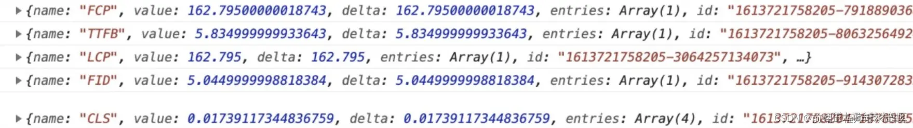

#### Performance API

> ```bash
> ## Performance API
> Performance API 是一个浏览器全局对象，提供了一组 API 用于编程式地获取程序在某些节点的性能数据。它包含一组高精度时间定义，以及配套的相关方法。
> 如果想自定义搜集性能数据指标做前端的性能监控系统，那么使用 performance.mark 以及 performance.measure 这两个API
> ```
>
> 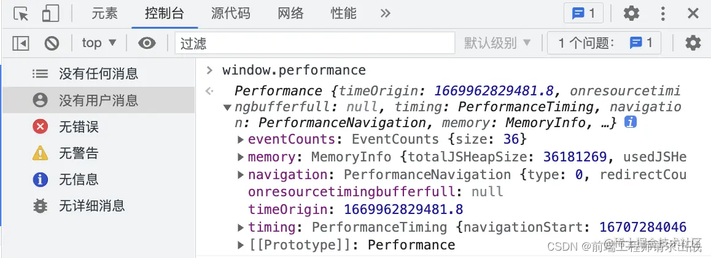

#### Google performance 面板

> ```bash
> ## Google Performance 面板
> 查看 FPS 图表：当在 FPS 上方看到红色条形时，表示帧速率下降得太低，以至于可能损害用户体验。通常，绿色条越高，FPS 越高
> 查看 CPU 图表：CPU 图表在 FPS 图表下方。CPU 图表的颜色对应于性能板的底部的 Summary 选项卡
> 查看 火焰图：火焰图直观地表示出了内部的 CPU 分析，横轴是时间，纵轴是调用指针，调用栈最顶端的函数在最下方。启用 JS 分析器后，火焰图会显示调用的每个 JavaScript 函数，可用于分析具体函数
> 查看 Buttom-up：此视图可以看到某些函数对性能影响最大，并能够检查这些函数的调用路径
> ```
>
> 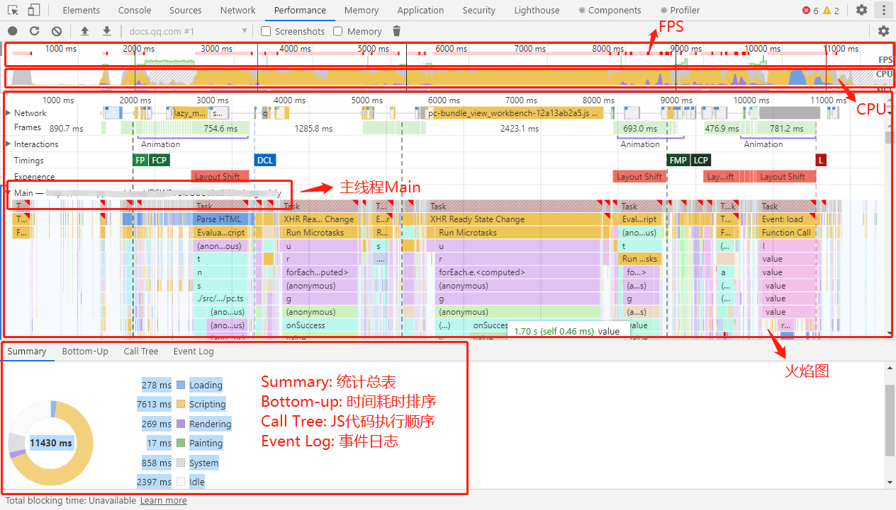
>
> 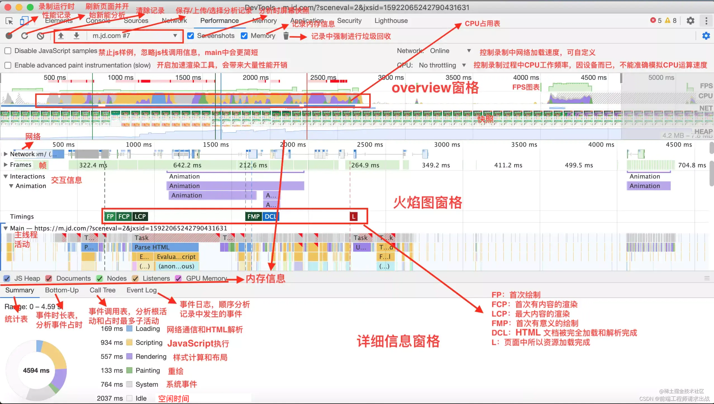

#### lighthouse

> 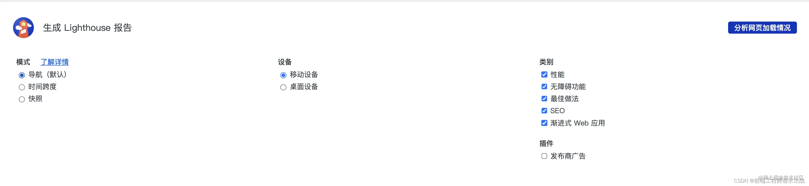
>
> 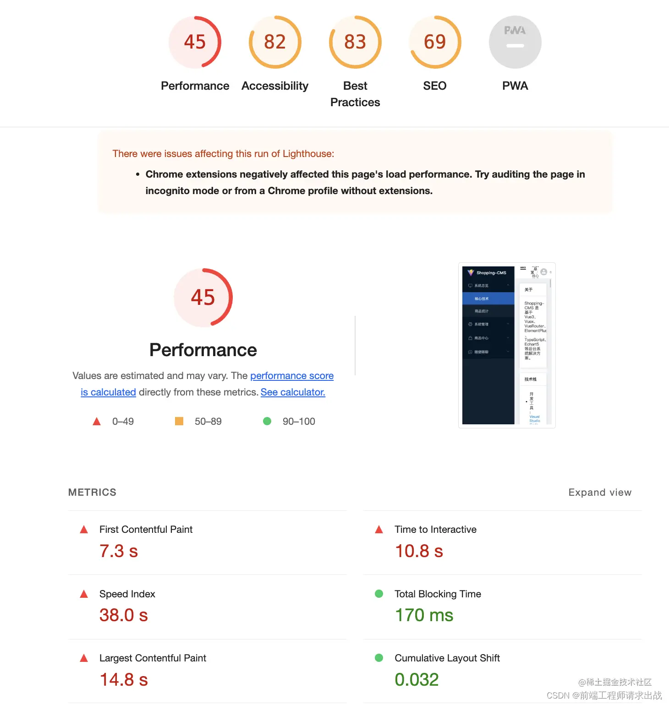

### 11 种性能指标

> 
> ```bash
> ## FP 白屏（First Paint Time）	
> 从页面开始加载到浏览器中检测到渲染（任何渲染）时被触发（例如背景改变，样式应用等）
> 
> ##  FCP 首屏（first contentful paint）
> 从页面开始加载到页面内容的任何部分呈现在屏幕上的时间。
> 关注的焦点是内容，这个度量可以知道用户什么时候收到有用的信息（文本，图像等）
> 
> ## FMP 首次主要内容绘制（First Meaningful Paint）
> 表示页面的“主要内容”，开始出现在屏幕上的时间点，这项指标因页面逻辑而异，因此上不存在任何规范。
> 只是记录了加载体验的最开始。如果页面显示的是启动图片或者 loading 动画，这个时刻对用用户而言没有意义
> 
> ## LCP（Largest Contentful Paint）	
> LCP 指标代表的是视窗最大可见图片或者文本块的渲染时间。 
> 可以帮助我们捕获更多的首次渲染之后的加载性能，但这项指标过于复杂，而且很难解释，也经常出错，没办法确定主要内容什么时候加载完
> 
> ## 长任务（Long Task）	
> 当一个任务执行时间超过 50ms 时消耗到的任务 
> 50ms 阈值是从 RAIL 模型总结出来的结论，这个是 google 研究用户感知得出的结论，类似用户的感知/耐心的阈值，超过这个阈值的任务，用户会感知到页面的卡顿
> 
> ## TTI （Time To Internative）	
> 从页面开始到它的主要子资源加载到能够快速地响应用户输入的时间。没有耗时长任务）
> 
> ## 首次输入延时 FID （first Input Delay）
> 从用户第一次与页面交互到浏览器实际能够开始处理事件的时间。（点击，输入，按键）
> 
> ## 总阻塞时间 TBT（total blocking time）	
> 衡量从 FCP 到 TTI 之间主线程被阻塞时长的总和。
> 
> ## DCL （DOMContentLoaded）	
> 当 HTML 文档被完全加载和解析完成之后，DOMContentLoaded 事件被触发，无需等待样式，图像和子框架的完成加载。
> 
> ## L（onLoaded）	
> 当依赖的资源，全部加载完毕之后才会触发
> 
> ## CLS(Cumulative Layout Shift)	
> 是所有布局偏移分数的汇总，凡是在页面完整生命周期内预料之外的布局偏移都包括。布局偏移发生在任意时间，当一个可见元素改变了它的位置，从一个渲染帧到下一个。
> ```

### LCP 最大内容渲染时间优化

> ```bash
> ## LCP 最大内容的渲染时间，测量加载速度
> 1. 引起延迟原因
>   1.1 服务器响应速度缓慢
>   - 说明：浏览器从服务器接收内容所需时间越长，在屏幕上渲染任何内容所需时间就越长。
>   - 对于响应较慢、使用平次较高的接口进行优化，主要是将变化较少的数据添加缓存、耗时较大的统计查询交由定时任务计算等。
>   - 升级 http 协议到 Http2.0 来提升响应速度，这部分提升主要来源于协议所带来的新特性：多路复用、桥头压缩等。
> 
>   1.2 资源加载速度缓慢
>   - 说明：对于大部分网站的最大元素都是图片、视频等资源，如果能加速加载这些图片，能有效改善 LCP。
>   - 在初始加载这些资源时，应该使用压缩后的资源；如图片使用压缩、降低图片分辨率等来降低资源大小，然后往后再加载原图。
>   - 调整图片的大小和压缩图片。应调整和优化上传到网站的每张图片（图片压缩插件、webp图片）。
> 
>   1.3 阻塞渲染的 JavaScript 和 CSS
>   - 说明：在浏览器渲染任何内容之前，需要解析html并生成dom树。html解析器会被任何同步脚本阻塞并暂停解析。
>   - 延迟加载未使用的 js 文件（使用script的异步加载、vue的组件路由懒加载、功能模块拆分多个较小的js文件）
>   - 最小化并压缩 js 文件
> 
>   1.4 客户端渲染
> 
> 2. 优化措施
> 首先需要改进服务器处理内容的方式和位置。使用 首字节时间(Time to First Byte) 来测量服务器响应时间，可通过如下方式改进
> - 提升网路、DNS和服务器响应时间
> - 使用内容交付网络 CDN
> - 优化图片大小
> - 减少 JavaScript 的阻塞并延迟加载 JavaScript
> - 应用缓存和最小化/压缩资源（压缩图片）
> - 优先使用缓存提供 Html 页面
> - 预加载和 DNS 与解析
> - 尽早建立第三方连接
> - 使用签名交换
> - 适配伺服（Adaptive Serving）
> ```

### FID 首次输入延迟优化

> ```bash
> ## FID 首次输入延迟，测量响应速度
> 1. 引起延迟延迟的原因（JavaScript 执行过长导致，可通过优化 JS 的解析、编译和执行降低）
> 1.1 数据获取会影响交互
>   - 级联的获取数据的水流图(包含js、数据的网络请求等)会导致交互延迟。目的是要减少对级联数据获取的依赖（减少请求数、级联子级懒加载）
>   - 较大的内联数据可以节省 Html 的解析时间，同时影响图像和交互两种指标。目的是减少客户端后续处理对数据的依赖
> 
> 1.2 第一方脚本执行引起交互延迟
>   - 服务端渲染看上去页面是出来了，但用户的交互还是受限于JS的执行时间，可考虑把更多逻辑代码放在服务端实现，或在构建时创建更多静态内容。
> 
> 1.3 第三方脚本执行引起交互延迟
> - 很多网站都包含第三方库的标签和统计代码，这些会导致网络阻塞，使得主线程长时间无法响应，延后了交互。查找必须加载的第三方代码（如不滚动到指定位置不展示广告）
> - 有时，第三方的脚本会抢先于本站脚本加载，例如加载优先级和带宽限制。尝试着优先加载你觉得可以给用户提供最有价值的东西。
> 
> 
> 2. 优化措施
> 2.1 拆分代码、分解长任务
>   - 长任务指的是用户会发现页面无响应的时期执行的JS代码。任何阻塞主线程 ≥ 50ms 的代码都是长任务。
>   - 长任务一般是JS体积过大的潜在因素（浏览器加载并执行了比页面初始化所需要的其他JS代码）
>   - 分解长任务为把较长执行的 JS 代码分解为多个相对较小的异步任务。
>   - 分解长任务可以降低用户输入延迟。
> 
> 
> 2.2 优化页面，做好交互准备
> 	- 造成 FID 和 TBT 分数低的原因大多数都是 JS 引起的。
> 
> 
> 2.3 使用 Web Worker
> 	- 主线程阻塞是导致输入延迟的主要因素之一。Web Worker 可让代码在后台进程中执行，把一些非 UI 操作放在 Web Worker 中执行可以减少主线程压力，改善 FID 指标。
> 	- 集成 Web Worker 的库（Comlink、Workway、Workerize）
> 
> 
> 2.4 减少 JavaScript 执行时间
> 2.4.1 延迟加载未使用的 js
>   - 把代码分成多个 chunk，按需加载 
>   	`import('module1.js').then(module => { /* Do something with the module */ })`
>   - 使用 async 或者 defer 延后加载非关键脚本，包含第三方脚本
>   
> 2.4.2 最小化无用的 polyfill
>   - 如果使用了一些JS高级语法，可能需要将这些代码转换成旧版浏览器支持的语法、或者引入polyfill来支持。这样可以保证支持JS模块的浏览器可以加载模块化的打包文件，不支持的浏览器可以加载转义后的打包文件。
>   - 如果是用babel转义，使用`@babel/preset-env`可以只包含你需要支持浏览器的polyfill。对于`babel 7.9`，可以开启 bugfixes 配置，进一步减少无用的 polyfill
>   - 使用 `module/nomodule` 的模式传输两份不同的 bundle（`@babel/preset-env`也支持，可以通过`target.esmodules`）
>     `<script type="module" src="modern.js"></script>`
>     `<script nomodule src="legacy.js"></script>`
> ```

### CLS 页面偏移数总和优化

> ```bash
> ## CLS 整个页面生命周期内发生的所有单次部件偏移分数的总和，测量视觉稳定性
> 1. 引起延迟原因
> 1.1 未指定尺寸的图像
>   - 在 ` 和 <video>` 标签上始终加上` width 和 height` 属性来防止布局偏移。
>   - 或使用 `css aspect-ratio boxes`来占据空间。这种方法可以确保在图片加载过程中，浏览器可以分配足够的空间。
> 
> 1.2 未指定尺寸的广告、嵌入元素、iframe
>   - 广告导致布局偏移的生命周期：广告容器插入到dom时、调整广告尺寸时、广告代码库加载时(导致容器尺寸改变)、广告内容填充容器时(广告尺寸大小不一致，导致容器尺寸变化)
>   - 广告优化措施：为广告位静态预留空间，避免在可视区域顶部附近放置广告。
>   - 嵌入元素、iframe优化措施：通过使用浏览器开发者工具对其进行检查来获取最终嵌入的高度；嵌入加载后，所包含的 iframe 将根据其内容调整到合适大小。
> 
> 
> 1.3 动态插入的内容
> - 提前预留好空间，避免产生布局偏移。
> - 在一个固定尺寸的容器中用新内容替换就内容，或者使用轮播，在过渡后删除旧内容。
> - 让用户主动加载新内容，这样他们就不会对偏移(如出现"加载更多"、"刷新"按钮)感到惊讶。建议在用户交互前预取内容，以便立即进行显示。（注意：在用户输入后 500ms 内发生的布局偏移不计入 CLS）
> - 无缝加载屏幕外的内容，并向用户叠加一个通知，说明内容已经可用(如显示一个"向上滚动"按钮)
> 
> 
> 1.4 自定义字体（引发 FOIT/FOUT）
> - 因为新字体渲染缘故，导致从不可见变可见（FOIT - 不可见文本闪烁）
> - fallback字体切换到新字体（FOUT - 无样式文本闪烁）
> - font-display 属性可以修改自定义字体的渲染表现（可选值：`auto、swap、block、fallback、optional`），但除了 `optional` 之外的属性都会引发 `re-layout`。
> - 针对关键字体使用 `<link rel=preload>`，提高优先级，让字体下载有更高概率赶在 FCP 之前，这样就能避免布局偏移。
> - `<link rel=preload>` 和 `font-display: optional` 结合使用。
> 
> 
> 1.5 在更新 DOM 之前等待网络响应的操作
> - 尽可能在网络请求时，给一个 loading 或者占位符提示，避免用户在这段时间内进行操作。
> 
> 
> 1.6 动画
> - 倾向于选择 transform 动画，而不是触发布局偏移的属性动画。
> 
> 
> 2. 优化措施
> - 图片的尺寸，以及其他嵌入元素的尺寸，最先就设定好，或者预留足够空间，这样可以有效避免布局偏移。
> - 利用图片宽高比的属性，可以在优化 CLS 的同时，做响应式布局。
> - 尽可能不要往已存在内容上方添加新内容。
> - web字体尽可能早的加载，避免产生 FOIT 和 FOUT
> - 与 UI 同时配合在交互上避免布局偏移
> ```


## 性能优化概要

> ```bash
> ## 页面加载
>   1. 预加载：先把js/css文件预加载好，加快页面渲染的速率
>   2. 懒加载(按需加载)及图片延迟加载
>   3. 避免404页面及favicon
>   4. 减少DNS查询：DNS缓存，将资源分布到恰当数量的主机
>   5. 离线缓存（HTTP、本地缓存）
>   6. 善用缓存，不重复加载相同的资源
>   7. CSS动画优化
>   8. 避免资源的重定向
>   9. 减少重绘重排
>      - 修改样式时，通过替换class来改变样式
>      - 对DOM执行操作时可将DOM元素脱离文档流，修改完后再带回文档。推荐使用隐藏元素（display:none）或文档碎片（DocumentFragement）
>   10. 使用事件委托来触发事件（委托父元素）
>   11. 垃圾回收（引用完的对象应设为null）
> 
> 
> ## 服务器
>     1. 静态资源使用CDN加速，多地缓存
>     2. 减少http请求
>     3. 使用服务器渲染
>        - 客户端渲染: 获取 HTML 文件，根据需要下载 JavaScript 文件，运行文件，生成 DOM，再渲染
>        - 服务端渲染：服务端返回 HTML 文件，客户端只需解析 HTML
>     4. 配置ETag
>       - ETag可让缓存更高效，节省带宽，如果内容没有改变，WEB服务器不需要发送完整的响应；如果内容发生改变，使用ETag有助于防止资源的同时更新相互覆盖。
>     5. Gzip压缩文件：减少文件的下载时间
> 
> 
> ## HTML
>     1. 避免 HTML 中书写 CSS 代码，因为这样难以维护
>     2. 使用 Viewport 加速页面的渲染
>     3. 使用语义化标签，减少 CSS 代码，增加可读性和 SEO。
>     4. 减少标签的使用，DOM 解析是一个大量遍历的过程，减少不必要的标签，能降低遍历的次数。
>     5. 避免 src、href 等的值为空，因为即使它们为空，浏览器也会发起 HTTP 请求。
>     6. 减少 DNS 查询的次数。
> 
> 
> ## CSS
>     1. CSS 外部引入 & 顶部引入
>     2. 使用 link 替代 @import 引入 CSS
>     3. 优化选择器路径，减少选择器层级查询
>         使用 `.c {}`，而不是 `.a .b .c {}`
>     4. 选择器合并，共同的属性内容提取出来，压缩空间和资源开销
>     5. 精准样式
>         使用 `padding-left: 10px`，而不是 `padding: 0 0 0 10px`
>     6. 避免 * 通配符
>         `.a .b * {}` 这样的选择器，根据从右到左的解析顺序在解析过程中遇到通配符 *{} 会遍历整个 DOM，性能大大损耗。
>     7. 使用 flex 布局替代 float
>         `float: left` 在渲染时计算量比较大，可以使用 flex 布局替代。
>     8. 为 0 值去单位，增加兼容性。
> 
> 
> ## JS
>     1. 外部 & 底部引入：
>         尽可能把 <script> 标签放在 body 之后，避免 JS 的执行阻塞 DOM 的渲染，最大程度保证页面尽快展示出来。
>     2. 尽可能合并 JS 代码：
>         提取公共方法、进行面向对象设计、对重复脚本进行封装。
>     3. CSS 能做的事情，尽量不使用 JS 来做：
>         因为 JS 的解析执行比较缓慢，还会阻塞，而 CSS 的效率更高。
>     4. 减少 DOM 的访问 & DOM 操作 & 减少 DOM 元素数量
>         减少对 DOM 的修改与访问，并预定好 CSS 样式，从而减少 reflow 或 repaint 的次数。
>     5. 减少创建 DOM
>         尽可能少地创建 DOM，而是在 HTML 和 CSS 中使用 display:none 来隐藏，按需显示。
>     6. 压缩文件大小，减少资源下载负担。
> 
> 
> ## 图片
>   - 优化图片：把通过`http`链接放取的图片转换为`base64`编码的图片信息
>   - 使用恰当的图片形式；不要在HTML中使用缩放图片；尽量通过矢量图(iconfont)或CSS3替代图片
>   - 使用 IntersectionObserver 和图片懒加载
>   - 渐进式图片加载(优化图片延迟加载效果，load.js)
> 
> 
> ## 搜索引擎优化
>   - 对网站的标题、关键字、描述精心设置
>   - 网站内容优化：内容与关键字的对应，增加关键字的密度
>   - 重要内容不要用`js`输出：爬虫不会执行js获取内容
>   - 少用`iframe`：搜索引擎不会抓取`iframe`中的内容
>   - `img`非装饰性图片必须加 `alt`
>   - 提高网站速度：网站速度是搜索引擎排序的一个重要指标
>   - 语义化的`HTML`代码
>   - 生成针对搜索引擎友好的网站地图（包含了所有网站链接的文件，这些链接是这个网站中重要的页面，作用是让更多页面能最大化被搜索蜘蛛发现并收录）
> ```
>


## 资源优化

### 使用 Brotli 进行纯文本压缩

> ```bash
> ## Brotli 进行纯文本压缩
> Brotli 有比 Gzip 和 Deflate 更高的压缩率，但是也需要更长的压缩时间，所以在请求时进行压缩并不是很好的办法。
> 但我们可以预先对静态文件进行压缩，然后直接提供给客户端，这样就避免 Brotli 压缩效率低的问题。
> 同时使用这个方式，我们可以使用压缩质量最高的等级去压缩文件，最大程度的去减小文件的体积。
> 
> 由于不是所有浏览器都支持 Brotli 算法，所以在服务器需要同时提供两种文件，一个是经过 Brotli 压缩的文件，一个是原始文件，在浏览器不支持 Brotli 的情况下，可以使用 Gzip 去压缩原始文件进行提供给客户端。
> 
> Brotli 可用于任何纯文本的内容，如 `HTML、CSS、SVG、JavaScript` 等。
> 
> 使用最高压缩比配置的 `Brotli + Gzip` 预压缩静态资源，并使用 Brotli 配置 3~5 级压缩比来快速压缩 HTML。确保服务器正确处理 Brotli 或 Gzip 的内容协商头。
> ```

### 字体优化

> ```bash
> # 字体优化
> ## 1. 字体大
> - 常见的字体类型有：`EOT、OTF、TTF、SVG、WOFF、WOFF2` 等。推荐 WOFF2，最小。缺点是存在浏览器兼容性问题。
> 
> 
> ## 2. 字体多
> - 按需加载、延迟加载：首屏不需要的，暂时先不要加载。
> 
> 
> ## 3. 字体闪动（预先加载字体文件）
> - 字体闪动是当你在页面中一段文字中使用了特定字体，但这时字体文件还没加载或加载完成，所以会先显示系统字体，直到你的字体加载完成，产生了变化。这个过程成为闪动或抖动。
> - 原因：通常字体文件是在 CSS 中使用的，浏览器先下载了 CSS 之后才知道有字体文件要下载，所以造成字体闪动现象。
> - 为了解决这个问题，需要告诉浏览器先下载字体文件（提高字体文件的优先级）
> - 解决：`<link rel="preload" href="font.woff2" as="font" type="font/woff2" crossorigin>`
> 	（注意：获取字体时必须加上`crossorigin`属性，就如使用 CORS 的匿名模式获取一样，即使字体与页面同域）
> 
> ```

### 图片优化

> ```bash
> ## 图片优化
> 1. 选择合适的图片格式：
> 	 针对不同的场景选择适当的图片格式。例如，使用WebP或AVIF格式替代JPEG和PNG，它们具有更高的压缩率和质量。
> 	 
> 2. 压缩图片：
>    - 使用图像压缩工具（如TinyPNG或ImageOptim）压缩图片，可以在保留可接受质量的同时减小文件大小。
>    - 对图片质量要求不高的场景可以考虑有损压缩，比如生成缩略图。
>    
> 3. 创建响应式图像：
>    使用`<picture>`标签或`srcset`属性，根据不同的设备和分辨率加载不同尺寸的图像，减小不必要的带宽消耗。
>    
> 4. 使用CSS Sprite或SVG Sprite技术：
>    将多个小图标或图片合并为一个大的图片文件，减少HTTP请求数。SVG Sprite适用于矢量图像，CSS Sprite适用于像素图像。
>    
> 5. 图片懒加载：
>    利用Intersection Observer API或其他技术实现图片懒加载，仅在图片出现在视口范围内时加载，减轻首次加载的网络负担。
>    
> 6. 使用CDN服务存储图片
>    - 利用内容分发网络（CDN）加速图片加载，通过就近分发资源，减少网络延迟。
>    - 有的 CDN 也提供图片尺寸的裁剪，根据不同的参数返回不同质量的图片，但一般会收费。
>    
> 7. 使用图片占位符：
>    使用低质量图片占位符（LQIP）或颜色占位符替换原始图片，在加载完成前为用户提供视觉提示。
>    
> 8. 开启浏览器缓存：
>    通过设置HTTP头的缓存策略，充分利用浏览器缓存，避免重复下载相同的图像资源。
> ```

#### 图片合并（雪碧图）

> ```bash
> ### 图片合并（雪碧图）
> - 矢量图(iconfont)或CSS3替代图片：大小颜色自由变换，按需使用。
> - base64存储图片（一般是对 4kb 以下的图片使用）：把通过`http`链接放取的图片转换为`base64`编码的图片信息
> - 雪碧图：体积小、减小请求数。
> 	- 缺点：
> 			- 丧失CSS部分灵活性；
> 			- 首屏如果不需要某个子图片，但这张大图却包含，则会造成资源浪费；
> 			- 变更后缓存收益递减，改动一个子图片，整个图片都要重新生成，则此次的浏览器缓存则会失效。
> ```

#### 缓存复用

> ```bash
> ### 缓存复用
> - 图片过大可使用缓存复用。强缓存、协商缓存及 `Service Worker` 对图片都是有效的。
> - 图片过多，可把图片放到不同的服务器请求，因为浏览器针对一模一样的资源(不仅是图片)，在同一时间只下载一个(http1.1之后是并行6个)，这也算是浏览器层面的防抖。
> - 因为浏览器缓存资源是有大小限制的(chrome为 50M)，若文件过大，可存储到 `indexedDB` 中。
> ```

#### 使用 webp 格式

> ```bash
> ### 使用 webp 格式
> - webp 图片与 png、jpg 相比，相同的视觉体验下 Webp 图像的尺寸缩小了大约 30%，且 webp 图像格式还支持有损压缩、无损压缩、透明和动画。
> - 因 webp 格式没有全面支持，所以需在使用图片时尽可能使用具有 `srcset、sizes 和 <picture>` 元素的响应式图像，并使用 jpeg 作为兜底来使用 webp格式。
> - 如使用 gif 图片，可把它转换 mp4 或 webM 。
> ```

#### 图片加载时机

> ```bash
> ### 图片加载时机（懒加载按需加载图片 & 延迟加载图片）
> 1. 按需加载：首屏不需要的资源和视窗之外的资源，尽可能不要加载（如在一个页面中有10000+张图片需要加载，这方面的资源浪费会更加明显）。
> 
> 
> 2. 延迟加载：
> 	- 图片的按需加载也可以算是延迟加载。如针对在 CSS 中的图片，如果没有用到这个 class，则不会进行加载该图片，此时可通过改变 class 来达到延迟的目的。将图片的真实地址隐藏在 `alt-src` 属性中，在合适的时候再讲它设置到 src 中。如果一开始显示是缩略图，再到后面替换成真实的图片，也是一样的逻辑。
> - 哲学总结：缓存就像经验的积累，而延迟则是以静制动、以慢打快的无上角色。
> 
> 
> 3. 不同设备展示不同的图片
>       // 其中srcset指定图片的地址和对应的图片质量。sizes用来设置图片的尺寸零界点。
>       // 例子中的sizes就是指默认显示128px, 如果视区宽度大于360px, 则显示340px。
>                   srcset = "image-128.png 128w, image-256.png 256w, image-512.png 512w"
>            sizes = "(max-width: 360px) 340px, 128px" 
>       />
> ```

#### 图片的压缩

> ```bash
> ### 压缩图片方面
> 1. 使用第三方工具：
> 	 可以使用如 TinyPNG、ImageOptim 等第三方工具来自动压缩图片并减小图片的大小，提高页面加载速度。
> 2. 使用Canvas：
> 	 可以将图片加载到Canvas中，然后调用Canvas的toDataURL()方法将Canvas转换为DataURL格式的图片数据，从而实现图片压缩。
> 3. 使用DataURL：
> 	 可以将图片转换为DataURL格式，再通过Base64编码来压缩图片。转换后的DataURL格式的图片数据可以直接在HTML中使用，减少HTTP请求，提高页面加载速度。
> 4. 使用CSS：
> 	 通过CSS中的background-size属性来设置图片的大小，从而达到压缩图片的效果。
> 			background-size 属性设置的图片大小并不能直接压缩图片，而是通过调整显示尺寸来实现减小图片的显示大小。
> 				- 压缩图片的尺寸：将图片的宽度和高度都设置为原来的一半，就可以将图片的尺寸减小为原来的四分之一。
> 				- 减小图片的文件大小：通过压缩图片的尺寸，可以减小图片的文件大小，从而提高页面加载速度。因为图片的文件大小是与其尺寸成正比的，压缩图片的尺寸可以减小其文件大小，从而减少向服务器请求数据的时间，提高页面加载速度。
> 				- 注意：background-size属性设置图片的大小只是一种前端优化方式，不能真正地压缩图片的体积。如果需要减小图片的体积，可以使用第三方工具或者在后端进行图片压缩。
> ```

## 构建优化

### 关注dom节点

> ```bash
> ## 优化 dom 节点数量
> - 页面是基于 DOM 树的构建和 CSS 树的结合构成的 Render 树。
> - 页面遍历循环次数Z：DOM节点的数量M * CSS节点的数量N
> - 优化方案：尽量让 dom 的子节点层级降低，否则会导致递归次数呈现指数增长。
> ```
>
> ```js
> /** 计算页面中的 node 节点数量 */
> function countNodes(node) {
>   let count = 1
>   // 判断是否存在子节点
>   if (node.hasChildNodes()) {
>     // 获取子节点
>     const cnodes = node.childNodes
>     // 对子节点进行递归统计
>     for (let i = 0, len = cnodes.length; i < len; i++) {
>       count += countNodes(cnodes.item(i))
>     }
>   }
>   return count
> }
> 
> // 统计 body 的节点数量
> countNodes(document.body)
> ```

### JS/CSS资源位置

> ```bash
> ## JS、CSS资源位置
> - JavaScript 在 body 标签底部引入或书写，CSS 在 header 标签里面引入或书写。
> - 注意：移动端用于计算 rem 的 js文件需要放在 header 头部，避免页面二次布局。
> ```

### 构建体积

> ```bash
> # 构建体积
> ## 1. 小包替打包，手写替小包
> - 有些第三方包功能很强大齐全，但我们在项目中只用到包中的一个小功能而已，将这么大而全的包引入项目中有点得不偿失，可选择找能实现同样功能的小包或者手写进行替换。
>     - 如 dayjs 替换 momentjs，因为 momentjs 不做 Brotli 也接近 100kb
>     - 如页面用到 Promise，没必要将整个 `babel-polyfill` 打进去，只需安装 `es6-promise`
>     - 如使用一个防抖函数没必要引入 lodash
> 
> 
> ## 2. 资源混淆压缩（减少资源大小）
> - 资源混淆压缩：减少资源大小；降低代码可读性达到一定的安全作用。
> 
> 
> ## 3. 延迟加载第三方包
> - 延迟加载第三方包可减少首屏加载渲染的压力。
> 	- 缺点：若是在用到时才去加载第三方包，就存在第三方包加载过长导致用户觉得卡顿的情况，但可对资源做 `preload 和 prefetch` 来解决和这个问题。
> 	- 可减少首屏加载的资源，但整体页面需要加载的资源没有减少，只是做分段处理，优化效果显著。
> 	- 对于不再屏幕中的内容，且依赖第三方 CDN 包的功能，有或者用户手动触发某个功能依赖第三方 CDN 包(一般页面渲染过程不需使用)，可以延迟加载这个 CDN 包，没必要在 html 中直接引入，使用动态 script 插入使用。
> 	
> 
> ## 4. 对资源做 preload 和 prefetch
> - 对要用到的资源提前加载好，等要请求时直接使用加载好的资源去执行，这个优化点对优化首屏加载效果不太又好，但对后续的操作体验比较好。
> - preload 提前加载当前页面需要用到的资源(不执行)，prefetch 提前加载下一个要用到的资源(不执行)。
> - 为了提升用户体验，我们将被我们延迟加载的第三方包使用 preload 进行预加载，这样用户交互时，直接执行已经提前加载好的资源即可。
> - 对前后端分离的项目使用路由懒加载，此时加上 prefetch 提前加载下一个页面的资源，可以让用户无感切换页面，不会出现页面延迟出现的效果（vue3 + webpack 的 @vue/preload-webpack-plugin插件）
>       <link href="js/demo.js" rel=prefetch>
>       <link href="css/demo.css" rel=preload as=style>
>       <link href="js/demo.js" rel=preload as=script>
>       
> 
> ## 组件库按需加载
> - 主要是针对前后端分离的前端应用，优化方向是减少资源大小
> -  除了让多个系统最高效地复用静态资源缓存，会考虑对第三方包使用 CDN 而非 npm 安装，但是具体得多系统衡量（单个系统的优化并不明显）
> ```

### JS代码优化

```bash
## JS 代码优化
- 使用 `tree-shaking、scope hoisting 和 code-splitting`
- 识别并删除未使用的CSS/JS
- 将 JavaScript 抽离到 Web Worker
- 将频繁的执行功能抽离到 WebAssembly（面向Web的二进制格式）
-  模块化 ES module
- 懒加载（对JS库进行异步加载、路由懒加载）
```

#### 使用 `tree-shaking、scope hoisting 和 code-splitting`

> ```bash
> ### 使用 `tree-shaking、scope hoisting 和 code-splitting`
> 1. tree-shaking
> tree-shaking 是一种清理构建包无用依赖的方法，它让构建结果只包含生产中实际使用的代码，并消除 Webpack 中未使用的引入。借助 Webpack 和 Rollup，我们还可以实现 scope hoisting，这两个人工具都可以检测到 mport 链可以在哪个位置终止并转换为一个内联函数，而不破坏代码。借助 Webpack，还可以使用 JSON Tree Shaking。
> 
> 2. code-spliting
> code-spliting 是 Webpack 的另一个功能，可以把代码拆分为按需加载的 chunk。并不是所有 JavaScript 都必须立即下载、解析和编译。一旦在代码中定义了分割点， Webpack 就可以处理依赖关系和输出文件。它可以让浏览器保持较小的初始下载量，并在应用程序请求时按需请求代码。
> 
> 3. preload-webpack-plugin
> 考虑使用 preload-webpack-plugin，这个插件可以根据你代码的分隔方式，让浏览器使用 或 对分隔代码 chunk 进行预加载。Webpack 内联指令还可以对 preload/prefetch 进行一些控制（但是要足以优先级问题）
> ```

#### 识别并删除未使用的CSS/JS

> ```bash
> ### 识别并删除未使用的CSS/JS
> Chrome 中的 CSS 和 JavaScript 代码覆盖率工具(Coverage)可以让我们了解哪些代码已执行或应用，哪些未执行。我们可以启动一个覆盖率检查，然后查看覆盖率结果。一旦检测到未使用的代码，找出哪些模块并使用 `import()` 延迟加载。然后重复代码覆盖率检查确认现在初始化加载代码有变少。可使用 Puppeteer 来收集代码覆盖率，Puppeteer 还能在每次构建时监视未使用的 CSS。此外，purgecss、UnCSS 和 Helium 可让你从 CSS 中删除未使用的样式。
> ```

#### 将 JavaScript 抽离到 Web Worker

> ```bash
> ### 将 JavaScript 抽离到 Web Worker
> 为了缩短交互时间耗时，最好将有繁重计算的 JavaScript 抽离到 Web Worker 中或通过 Service Worker 进行缓存。因为 DOM 操作是与 JavaScript 一起运行在主线程上。使用 Web Worker 可以将这些昂贵的操作转移到后台其他线程上运行。可以通过 Web Worker 预先加载和存储一些数据，以便后续在需要时使用它。可使用 Comlink 来简化与 Web Worker 之间的通信。
> ```

#### 将频繁的执行功能抽离到 WebAssembly

> ```bash
> ### 将频繁的执行功能抽离到 WebAssembly（面向Web的二进制格式）
> 可以将繁重的计算任务抽离到 WebAssembly(WASM) 执行，它是一种二进制指令格式，被设计为一种高级语言(如C、C++、Rust) 编译的可移植对象。
> 而且大多数浏览器都已支持 WebAssembly，并且随着 JavaScript 和 WASM 之间的函数调用变得越来越快，这个方式会变得越来越可行。
> WebAssembly 的目的并不是替代 JavaScript，而是可以在你发现 CPU 占用过高时作为 JavaScript 的补充。
> JavaScript 更适合大多数 Web 应用程序，而 WebAssembly 最适用于计算密集型 Web 应用程序（如 Web 游戏）。
> ```

####  模块化 ES module

> ```bash
> ### 模块化 ES module
> 我们指向通过网络发送必要的 JavaScript，但这意味着对这些资源的交付要更加专注和细致。
> `module/nomodule` 的思想是编译并提供两个单独的 JavaScript 包。而常规构建的构建方式是：一个包含 Babel 转换和 polyfills，仅提供给需要它们的旧版浏览器；另一个包(相同功能)不包含 Babel 转换和 polyfills。
> `CommonJs、AMD`这些模块加载系统的共同点是它们允许你执行导入导出操作。
> `JS module`（或称为 ES module）是一个主要的新特性。可能够认识`type=module`语法的浏览器会忽略具有`nomodule`属性的`script`。即我们可使用一些脚本服务于支持`module`语法的浏览器，同时提供一个`nomodule`的脚本用于那些不支持`module`语法的浏览器作为补救。
> ```

#### 懒加载

> ```bash
> ### 对JS库进行异步加载
> - 在 NodeJs、Chrome 运行时和 Electron 中使用的 V8 进行优化时（Opera不支持脚本延迟），可使用脚本流来处理整体脚本。
> - 脚本流优化了 JavaScript 文件的解析。在Chrome41版本后，Chrome会在下载开始后立即在单独的线程上解析异步和延迟脚本。这意味着解析可以在下载完成后的几毫秒内完成，并使页面加载速度提高最高 10%，这对于大型脚本和慢速网络连接特别有效。
> - 下载开始后，脚本流允许 async 或 defer script 在单独的后台线程上进行解析，可以有效缩短页面加载时间，而且在 header 中使用 script defer，可以使浏览器更早发现资源，然后在后台线程解析它。
> 
> 
> ### 合理利用路由懒加载
> - 资源合并一般针对不经常修改的第三方包，对于业务 JS 代码一般不做合并。
> - 路由懒加载是将页面的JS代码拆分成一个一个的 chunk 包，只有加载页面的时候再去加载 JS 资源。
> - 对于用户经常访问的页面，不建议使用路由懒加载，因为用户肯定需要将页面的 chunk js 加载下来才可以访问页面，路由懒加载会导致先加载资源清单 manifest 文件，再去加载页面的 chunk 包，这样就形成了一个资源的串行请求，本来可以一次加载下来却非得拆分成2次而且还是串行的不是并行的。
> - 注意：一个页面的 chunk 包其实不会很大，将它合进主 chunk 里也不会带来明显的请求耗时加大，反而请求次数多了带来的网络延迟消耗比较明显。
> ```

### 前端页面渲染方案

> ```bash
> ## 前端页面渲染方案
> - 使用'客户端渲染'还是'服务端渲染'，这都由'应用程序'的性能来决定。
> - 对于客户而言，`First Paint、First Meaningful Paint 和 TTI`这几个指标会直接影响用户体验。
> - 最好的方法是设置某种渐进式引导：使用'服务端渲染'来快速获取第一个有意义的图形（'FCP'），同事包括一些'最小体积'的必须的 'JavaScript'，尽量让可交互时间（'TTI'）紧挨第一个有意义的图形的绘制。如果 'JavaScript' 执行在 'FCP' 之后太晚，浏览器会在解析、编译和执行后来执行的 'JavaScript' 时锁定主线程，从而削弱了网站或应用程序的交互性。
> - 为了避免这种情况，我们务必将函数的执行分解为单独的'异步任务'，并尽可能使用'requestldleCallback'。使用'Webpack'的动态'import()'支持，延迟加载部分UI，避免在用户真正需要它们之前因为加载、解析和编译造成的成本消耗。
> - 进入可交互状态后，我们可以按需或在时间允许的情况下启动应用程序的非必须部分。
> 
> 
> ## 选择方案
> 1. 对 SEO 要求不高，同时对操作需求比较多的项目（如后台管理系统），建议使用 CSR。因为只有在执行完 bundle 之后页面才能交互，单纯能看到元素却不能交互，意义就不大，而且 SSR 会带来额外的开发和维护成本。
> 2. 如果页面无数据，或者纯净页面，建议使用 SSG。因为这是一种'预览打包'的方式构建页面，也不会增加服务器负担。
> 3. 对 SEO 有比较大需求同时页面数据请求多的情况，建议使用 SSR。
> ```
>
> 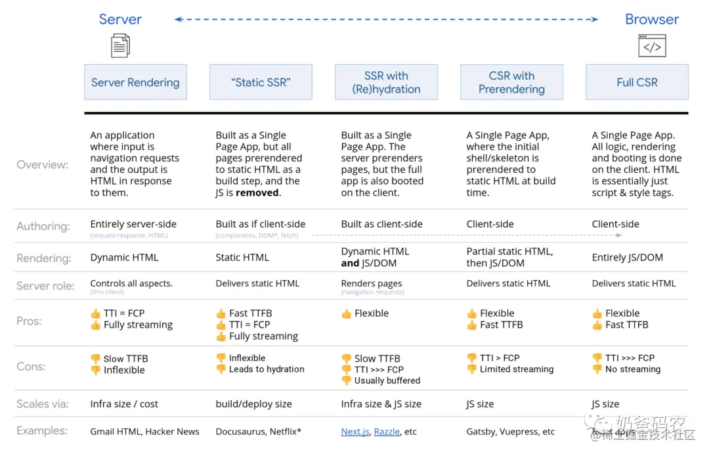

#### CSR

> ```bash
> ## CSR（Client Side Rendering）客户端渲染
> 浏览器渲染是所有的 '页面渲染、逻辑处理、页面路由、接口请求' 均是在浏览器中发生（目前主流框架都是这种渲染方式）。
> 浏览器渲染的好处是实现前后端架构分离，利于前后端职责分离，并且能够首次渲染迅速，有效减少白屏时间。同时，'CSR'可以通过在打包编译阶段进行'预渲染'或'骨架屏'生成，可以进一步提升'首次渲染'的用户体验。
> 但是由于和服务端会有多次交互（获取静态资源、获取数据），同时依赖浏览器进行渲染，在移动设备尤其是低配设备上，'首屏时间和完全可交互时间'是比较长的。
> ```
> 
> 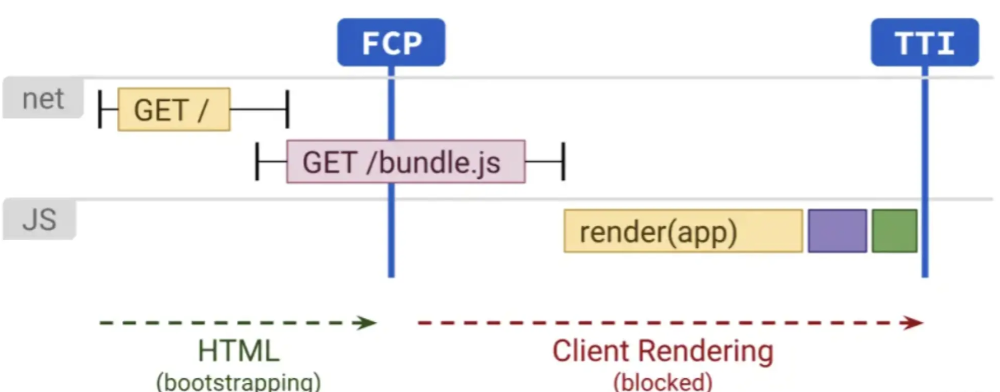

#### SSR

> ```bash
> ## SSR（Server Side Rendering）服务端渲染
> 服务端渲染是在服务端完成页面的渲染，在服务端完成'页面模板、数据填充、页面渲染'，然后将'完成的HTML内容'返回给浏览器。
> 由于所有的渲染工作都在服务端完成，因此网站的'首屏时间和TTI'都会表现比较好。
> 但是渲染需要在服务端完成，并不能很好进行前后端职责分离，而且白屏时间也会比较长，同时对于服务端的'负载要求'也会比较高。
> ```
> 
> 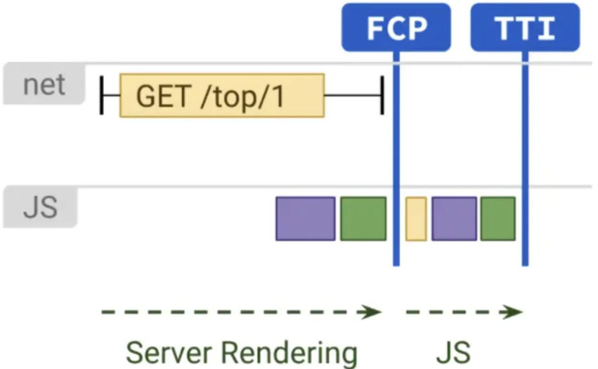

#### SSR+CSR混合

> ```bash
> ## 基于 Hydration 的 SSR 和 CSR 融合
> SSR 和 CSR 均有各自的优点和缺点，因此提出了 '前后端渲染同构' 的方案来整合 'SSR和CSR' 。
> 整个页面的加载和刷新是通过服务端渲染来实现，在渲染生成的HTML中内嵌 'JavaScript和数据内容'。通过这样的实现可达到与 SSR 相同的首屏时间，并且基于 hybration，可以生成前端的 '虚拟DOM'，避免前端触发二次渲染。
> 
> 注意：下图的 bundle.js 仍然是全量的 CSR 代码，这些代码执行完毕页面才真正交互。因此这种模式下，FP(First Paint)虽然有所提升，但TTI(Time To Interactive)可能会变慢，因为在客户端二次渲染完成之前，页面无法响应用户输入（被 JS 代码的执行阻塞了）对于二次渲染造成交互无法响应的问题，可能优化方向是增量渲染（例如 React Fiber），以及渐进式渲染/部分渲染。
> 
> 
> 
> ## SSG（Static Site Generation）
> SSG 也就是静态站点生成，为了减缓服务器压力，我们可以在构建时生成静态页面，
> 注意：Next.js 生成的静态页面与普通的静态页面是不一样的，也是拥有 SPA 的能力，切换页面用户不会感受到整个页面在刷新。
> 
> 
>## 客户端预渲染
> 客户端预渲染与服务端预渲染相似，但不是在服务器上动态渲染页面，而是在构建时就将应用程序渲染为静态 HTML。
>在构建过程中使用 renderToStaticMarkup 方法而不是 renderToString 方法，生成一个没有 data-reactid 之类属性的静态页面，这个页面的主 JS 和后续可能会用到的路由会做预加载。
> 即是当初打包时页面是怎么样，那么预渲染就是什么样。等到 JS 下载并完成执行，如果页面上有数据更新，那么页面会再次渲染。这时会造成一种数据延迟的错觉。
> 结果是 TTFB（第一字节到达时间） 和 FCP 时间变少，并且缩短了 TTI 和 FCP 之间的间隔。如果预期内容会发生很大变化，那么就无法使用该方法。另外，必须提前知道所有 URL 才能生成所有页面。
> 
> 
> ## 三方同构渲染
>如果可以使用 Service Worker，三方同构渲染也可能派上用场。
> 三方同构渲染是指利用流式服务器渲染初始页面，等 Service Worker 加载后，接管 HTML 的渲染工作。这样可以让缓存的组件和模板保持最新，还可以启用像单页应用一样的导航用以在同一会话中预渲染新视图。当可以在服务器、客户端页面和 Service Worker 之间共享相同模板和路由代码时，此方法最有效。
>三注意：方同构渲染，在三个位置使用相同的代码渲染：在服务器上，在 浏览器的DOM 中或在 service worker 中。
> ```
>
> 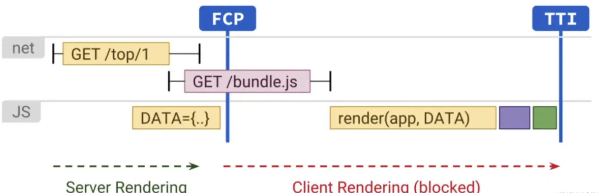

#### Serverless SSR

> ```bash
> ## Serverless SSR
> 前端使用SSR进行渲染同构有一个非常明显的缺点：服务资源消耗和运维。通常情况下，同构SSR会采用Node服务，需要固定的服务器资源，并且服务器的运维对于前端同学也提出了很高的要求。
> 随着Serverless技术的出现，这些问题似乎得到了很好的解决。Serverless基于触发器调用云端部署的函数，然后调用后端服务。
> 对于前端同学而言，仅仅只需要实现云端函数的实现，对于服务器的运维管理完全不用关心，同时服务器会实现自动弹性伸缩，有效节省了机器资源。
> SSR在性能收益上是完胜CSR，配合Serverless，SSR的开发成本仅仅比CSR有略微的提高，因此，从收益成本来看，Serverless SSR已经有了较大的优势，可能会成为未来的趋势。
> 当然，Serverless并不是万能的，服务器的冷启动目前依旧还是一个非常大的问题。
> ```
> 
> 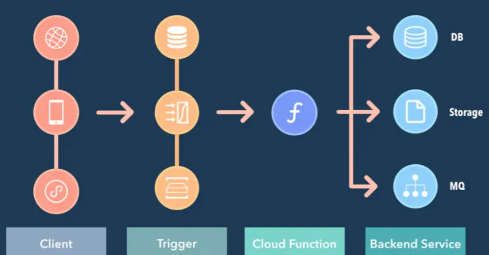

#### NSR

> ```bash
> ## NSR（Native Side Rendering）
> UC浏览器在新闻feed流页面加载中采用了NSR（Native Side Rendering），首先在列表页中加载离线页面模板，通过Ajax预加载页面数据，通过Native渲染生成Html数据并且缓存在客户端。
> 
> NSR本质是分布式SSR，将服务器的渲染工作放在了一个个独立的移动设备中，实现了页面的预加载，同时又不会增加额外的服务器压力。
> ```
>
> 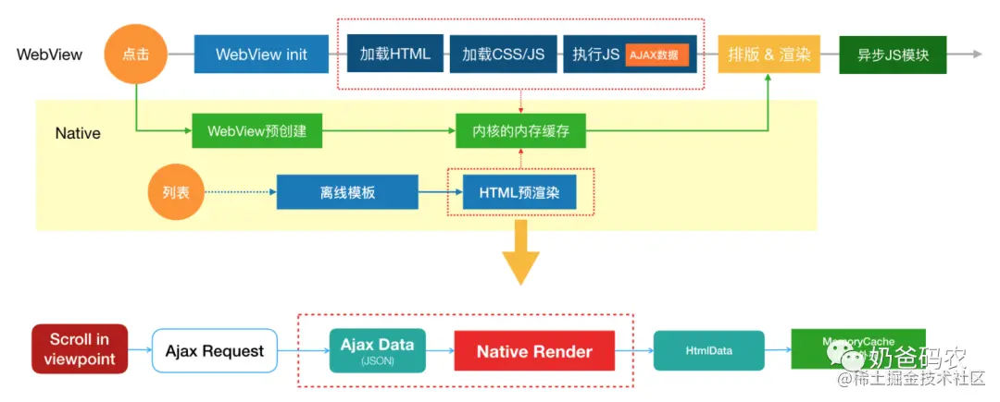
>
> 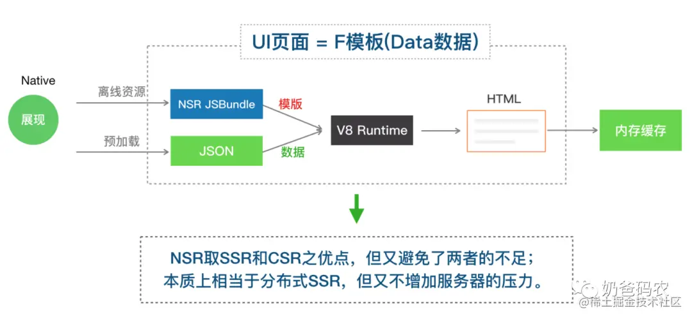

#### ESR

> ```bash
> ## ESR（ Edge Side Rendering）
> ESR - Edge Side Rendering，方案的核心思想是，借助边缘计算的能力，将静态内容与动态内容以流式的方式，先后返回给用户。cdn 节点相比于 server，距离用户更近，有着更短的网络延时。在 cdn 节点上，将可缓存的页面静态部分，先快速返回给用户，同时在 cdn 节点上发起动态部分内容请求，并将动态内容在静态部分的响应流后，继续返回给用户。
> 
> 在网速越慢的情况下，通过 cdn 流式渲染的最终主要元素出来的时间比原始 SSR 的方式出来得越早。这与实际推论也符合，因为网络越慢，静态资源加载时间越慢，对应的浏览器提前加载静态资源带来的效果也越明显。另外，不管在什么网络情况下，cdn 流式渲染方式的白屏时间要短很多。
> ```
>
> 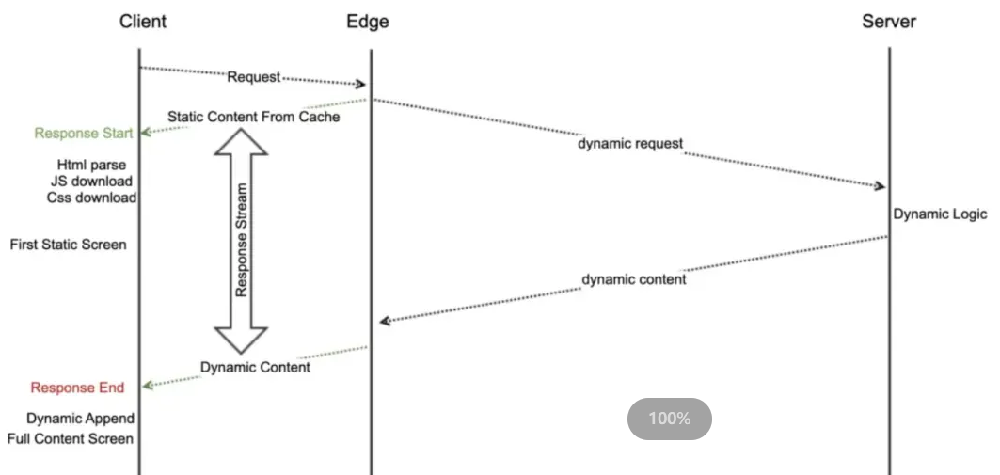

## 网络优化

### 降低请求包 & 缓存 & 响应加速

> ```bash
> ## CDN 加载资源
> - CDN（Content Delivery Network）是指内容分发网络，由于 CDN 是为加快网络访问速度而被优化的网络覆盖层，所以会被称为网络加速器。
> - CDN 最适合部署静态资源，最大限度地减少了互联网因为地域、运营商的差异而带来的网络损耗。
> - 使用 CDN 可以不用考虑高并发、负载均衡方面的问题。
> 
> 
> ## 减小请求头大小
> 减小请求头的大小常见的情况是 Cookie。如主站(www.test.com)中存储了很多的 Cookie，我们的 CDN 域名（cn.test.com）与我们主域一样，此时我们去请求时会附带上 `.test.com` 域下的 Cookie。而这些 Cookie 对于 CDN 毫无用处，还会增大我们请求的包大小，所以我们可以将 CDN 域名与主域区分开。例如淘宝（www.taobao.com）的 CDN 域名为 （img.alicdn.com）。
> 
> 
> ## 启用 OCSP stapling
> 在服务器上启用 OCSP stapling 功能，可实现由全站加速预先缓存在线证书验证结果并下发给客户端，无需浏览器直接向 CA 站点查询证书状态，从而减少用户验证时间。
> ```

### HTTP缓存

> ```bash
> ## HTTP 缓存
> - HTTP缓存主要是为了防止用户重复请求相同资源而产生的解决方案。
> - HTTP缓存分强制缓存和协商缓存，两者都是通过 HTTP 响应头控制缓存。
> ```
>
> #### 强缓存
>
> ```bash
> ### 强制缓存
> - 再次请求时无需向服务器发送请求。
> - 服务器通过设置 http 中响应头的 Expires 和 cache-control 字段告诉浏览器换存的有效期。
> - 缺点：这种方法会有一个固定时间，所带来的问题是如果服务器数据进行了更新，但是还没有到强缓存的过期时间，则数据无法更新。
> 
> 
> ## Response Headers 的 Expires 字段
> - `Expires`：这个响应头具有严格的格式要求，其值固定格式为绝对时间。
> - 注意： Expires 是属于 HTTP 1.0，现在默认浏览器均默认使用 HTTP 1.1
> - 范例：`Expires: Mon, 25 Oct 2021 20:11:12 GMT`
> 
> 
> ## Response Headers 的 Cache-Control 字段
> - `Cache-Control`：具有强大的缓存控制能力，值为相对时间，如果与Expires同时设置的话，其优先级高于Expires。
>     - `max-age`：设置失效时间，客户端在这个有效期内，如果又请求该资源，就直接读取缓存。
>     - `no-cache`：不使用本地缓存。需要使用缓存协商。先与服务器确认返回的响应是否被更改，如果之前的响应中存在 ETag，那么请求时会与服务端验证，如果资源未被更改，则从缓存中取数据。
>     - `no-store`：直接禁止浏览器缓存数据，每次用户请求该资源，都会向服务器发送一个请求。
>     - `public`：可以被所有的用户缓存，包括终端用户和 CDN 等中间代理服务器。
>     - `private`：只能被终端用户的浏览器缓存，不允许 CDN 等中继缓存服务器对其缓存。
> 
> 
> 
> ### 强制缓存流程图
>                client         server
> GET /a.ab389z.js ------->
>                       <------- 200 OK
> (再也不会发请求)
> ```
>
> #### 协商缓存
>
> ```bash
> ### 协商缓存
> - 协商缓存就是通过服务器来判断缓存是否可用。当同一个接口再次请求时，需要向服务器校验新鲜度，如果资源更新了，返回 304，从浏览器获取资源
> 
> 
> ## 请求头的 Last-Modify 搭配 响应头的 If-Modify-Since
> 浏览器第一次请求一个资源时，服务器返回的 header 中会加上 Last-Modify，Last-modify 是该资源的最后修改时间；
> 当浏览器再次请求该资源时，request 的请求头中会包含 If-Modify-Since，该值服务端 header 中返回的 Last-Modify。
> 服务器收到 If-Modify-Since 后，根据资源的最后修改时间判断是否命中缓存。
> 
> 
> ## 请求头的 Etag 搭配 响应头的 If-None-Match
> web服务器响应请求时，会在 header 中加一个 Etag 用来告诉浏览器当前资源在服务器的唯一标识（生成规则由服务器决定）。
> 当再次向 web 服务器请求时带上头 If-None-Match（Etag的值）。web服务器收到请求后将 If-None-Match 的与 Etag 两者的值进行比对，决定是否命中协商缓存
> 
> 
> ## ETag 和 Last-Modified 的区别
> 1. Etag 要优于 Last-Modified
> - Last-Modified 的时间单位是秒，如果某个文件在1秒内改变了多次，那么它们的 Last-Modified 其实并没有体现出来修改。
> - Etag每次都会改变确保了精度。
> 
> 2.在性能上，Etag 要逊于 Last-Modified
> - Last-Modified 只需要记录时间。
> - Etag 需要服务器通过算法来计算出一个 hash 值。
> 
> 3.在优先级上，服务器校验优先考虑 Etag
> 如果服务器收到的请求没有 Etag 值，则将 If-Modified-Since 和被请求文件的最后修改时间做比对，一致则命中协商缓存，返回 304。不一致则返回新的 Last-modified 和文件并返回 200。
> 
> 
> 
> ### 协商缓存流程图
>            client         server
> GET /a.js   ----------->
>                    <----------- 200 OK
> GET /a.js   ----------->
>                    <----------- 304 Not Modified
> ```

### Service Worker

> ```bash
> ## ServiceWorker
> - 现代浏览器除了 强缓存 和 协商缓存 外，还额外提供了一些 API 来控制缓存。
> - 常见的浏览器的存储有 Cookie、LocalStorage、SessionStorage，浏览器的数据库 IndexedDB，直接用它们可以实现对缓存的部分控制，但是你没办法拦截网络的加载，比如页面都还没加载，你的代码都还没开始工作，导致无法拦截这个JS或图片使其不再加载。
> - 而 ServiceWorker（简称sw），就是应运而生的一个高级缓存控制器。简单来说它就是浏览器提供的代理。网页的所有网络请求，都经过它进行'中转'。
> - ServiceWorker 是基于 `Web Worker` 的，可以访问 `cache` 和 `indexedDB`
> - ServiceWorker 是基于 `HTTPS` 的，因为 `Service Worker` 中涉及到请求拦截，所以它必须使用 `HTTPS` 协议来保障安全。如果是本地调试，`localhost` 也是可以的。
> - 一般来说，ServiceWorker 可以有效提升用户的 '弱网体验'，常用于移动端网页。
> - 显著的缺陷是使用上简单，但是维护艰难，一般需要 框架 或 第三方库 来管理。
> 
> 注意：如果只是做测试，ServiceWorker 开启后最好到 `Application` 里把它注销掉，否则说不定会影响你的开发（如果你注册的端口号和网页刚好与现在所测试的端口一致）
> 
>
> 详情参考 => 计算机网络/计算机网络.md => 中的浏览器缓存篇
>```
> 

### HTTP 协议优化

#### `HTTP/1.0`

> ```bash
> ## HTTP/1.0
> 浏览器与服务器只保持短暂的连接，浏览器的每次请求都需要与服务器建立一个 TCP 连接（TCP连接新建的成本很高，因为需要客户端和服务器三次握手），服务器完成请求处理后立即断开 TCP 连接，服务器不跟踪每个客户也不记录过去的请求。
> ```

#### `HTTP/1.1`

> ```bash
> ## HTTP/1.1
> 1. 管道化（Pipelining）
> 提出管道化方案解决连接延迟，服务端可设置 Keep-Alive 来让连接延迟关闭时间，但因为浏览器自身的 Max-Connection 最大连接限制，同一个域名下的请求连接限制（同域下谷歌浏览器是一次限制最多6个连接），只能通过多开域名来实现，这也是静态资源选择放到 CDN 上或其他域名下来提高资源加载速度。管道化方案需要前后端支持，但绝大部分 HTTP 代理器对管道化的支持并不友好。
> 
> 2. 管道化只支持 GET/HEAD
> 管道化只支持 GET/HEAD 方式传送数据，不支持 POST 等其它方式传输。
> 
> 3. 头部信息冗余
> HTTP 是误装填的，客户端/服务端只能通过 HEAD 的数据维护获取状态信息，这会造成每次连接请求时都会携带大量冗余的头部信息，头部信息包括 Cookie 信息等。
> 
> 4. 超文本协议
> HTTP/1.x 是超文本协议传输。超文本协议传输，发送请求时会找出数据的开头和结尾帧的位置，并去除多余空格，选择最优方式传输。如果使用 HTTPS，那么还会对数据进行加密处理，一定程度上会造成传输速度上的损耗。
> 
> 5. 队头阻塞
> 管道化通过延迟连接关闭的方案，虽然可同时发起对服务端的多个请求，但服务端的 response 依旧遵循 FIFO（先进先出）规则依次返回。在高并发延迟的场景下阻塞会更明显。
> 如客户端发送 1、2、3、4 四个请求，如果 1 没有返回给客户端，那么 2、3、4 也不会返回，这就是所谓的队头阻塞。
> ```

#### `HTTP/2.0`

> ```bash
> ## HTTP/2.0
> 1. 多路复用
> 一个域只要一个 TCP 连接，实现真正的并发请求，降低延时，提高了带宽的利用率。
> 
> 2. 头部压缩
> 客户端/服务端进行渐进更新维护，才用 HPACK 压缩，节省了报文头占用流量
> 	2.1 相同的头部信息不会通过请求发送，沿用之前请求携带的头部信息。
> 	2.2 新增/修改的头部信息会被加入到 HEAD 中，两端渐进更新。
> 
> 3. 请求优先级
> 每个流都有自己的优先级别，客户端可指定优先级，并可以做流量控制。
> 
> 4. 服务端推送
> 例如我们加载 index.html，我们可能还需要 `index.js、index.css` 等文件。传统的请求只有当拿到 index.html，解析 html 中对 `index.js、index.css` 的引用才会再请求资源加载，但是通过服务端数据，可以提前将资源推送给客户端，这样客户端要用到的时候直接调用即可，不用再发送请求。
> 
> 5. 二进制协议
> 采用二进制协议，而非像 `HTTP/1.X` 采用超文本协议的文本格式。客户(服务)端发送(接收)数据时，会将数据打散乱序发送，接收数据时，接收端再通过 `streamID` 标识来将数据合并。
> 二进制协议解析起来更高效，'线上'更紧凑，更重要的是错误更少。
> 
> 
> ### 注意
> HTTP2 相对于 HTTP1.1 并不全是优点：因为 HTTP2 将多个HTTP 流放在同一个 TCP 连接中，遵循同一个流量状态控制。只要第一个 HTTP 流遇到阻塞，则后面的 HTTP 流就没办法发出去，这就是'行头阻塞'。
> ```

#### `HTTP/3.0`

> ```bash
> ## HTTP/3.0
> HTTP/3.0 采用 `QUIC` 协议，基于 UDP 协议，避免了 TCP 协议的一些缺点，采用 TLS1.3 将 HTTPS 所需的 RTT 降至最少为 0。
> 
> 
> ## HTTP/3.0 在结合 HTTPS 下跟 HTTP/2.0 的对比
> - HTTP/2.0下：
> 		'HTTPS通信时间总和 = TCP连接时间 + TLS连接时间 + HTTP交互时间 = 1.5RTT + 1.5RTT + 1RTT = 4RTT'
> - HTTP/3.0下：
> 		- 首次链接时，QUIC 采用 TLS1.3，需要 1RTT，一次 HTTP 数据请求，共 2RTT。
> 		- 重连时直接使用 Session ID，不需要再次进行 TLS 验证，所以只需要 1RTT。
> 
> 
> ## QUIC 协议的优势
> 1. 选择 UDP 作为底层传输层协议
> 在 TCP 之上建立新的传输机制，将继承 TCP 的上述所有缺点。因此，UDP 是一个明智的选择。此外，QUIC 是在用户层构建的，所以不需要每次协议升级时进行内核修改。
> 
> 2. 流复用和流控制
> QUIC 引入了连接上的多路流复用概念。QUIC 通过设计实现单独的、针对每个流的流控制，解决了整个连接的行头阻塞问题。
> 
> 3. 灵活的拥塞控制机制
> TCP 的拥塞控制是刚性的。该协议每次检测到拥塞时，都会将拥塞窗口大小减少一半。相比之下，QUIC 的拥塞控制设计得更加灵活，可以更有效地利用可用的网络带宽，从而获得更好的吞吐量。
> 
> 4. 更好的错误处理能力
> QUIC 使用增强的丢失恢复机制和转发纠错功能，以更好地处理错误数据包，该功能对于那些只能通过缓慢的无线网络访问互联网的用户来说是福音，因为这些网络用户在传输过程中经常出现高错误率。
> 
> 5. 更快的握手
> QUIC 使用相同的 TLS 模块进行安全连接。但与 TCP 不同的是，QUIC 的握手机制经过优化，避免了每次两个已知对等者之间的建立通信时的冗余协议交换。
> 
> 
> 
> ## TCP 协议的不足
> 1. TCP 可能会间歇性地挂起数据传输
> 如果一个序列号比较低的数据段还没有接收到，即使其他序列号较高的段已经接收到，TCP 的接收机滑动窗口也不会继续处理。这将导致 TCP 流瞬间挂起，在更糟糕的情况下，即使所有的段中有一个没有收到，也会导致关闭连接。这个问题被称为 TCP 流的行头阻塞（HoL）。
> 
> 2. TCP 不支持流级复用
> 虽然 TCP 确实允许在应用层之间建立多个逻辑连接，但它不允许在一个 TCP 流中复用数据包。使用 `HTTP/2.0` 时，浏览器只能与服务器打开一个 TCP 连接，并使用同一个连接来请求多个对象，如 `CSS、JavaScript` 等文件，在接收这些对象的同时，TCP 会将所有对象序列化在同一个流中。因此它不知道 TCP 段的对象级分区。
> 
> 3. TCP 会产生冗余通信
> TCP 连接握手会有冗余的消息交换序列，即使是与已知主机建立的连接也是如此。
> ```
>
> **TCP与QUIC的对比**
>
> 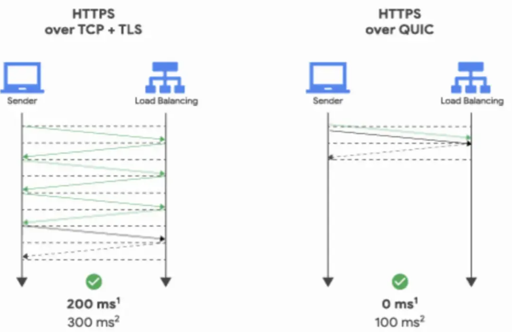
>
> **TCP间歇性挂起数据传输示例图**
>
> 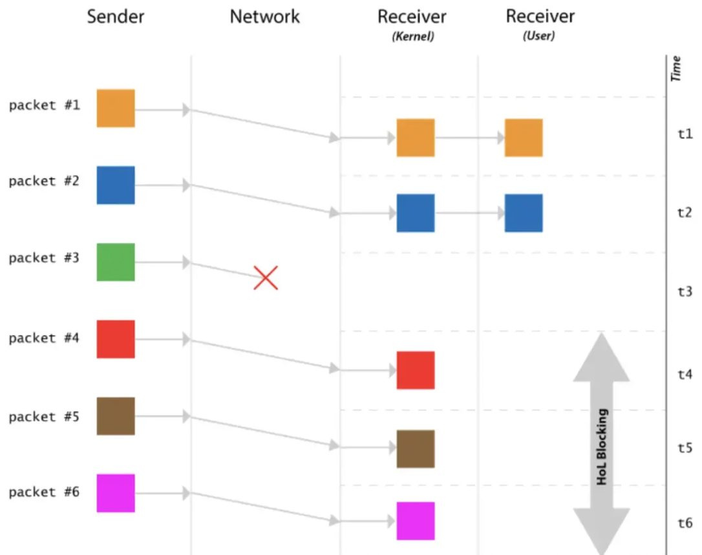
>
> **TCP产生冗余通信示意图**
>
> 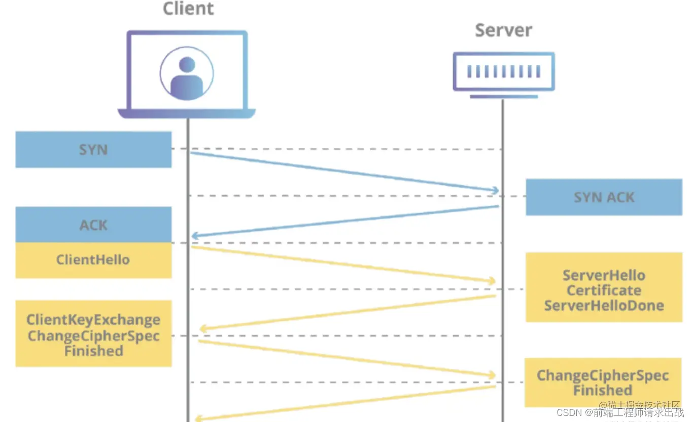

#### `HTTP2 + HTTPS`的反优化策略

> ```bash
> ## `HTTP2 + HTTPS` 下产生的反优化策略
> 1. 减少请求数
> HTTP/1.1 因为存在'队头阻塞'，所以通常采用合并资源、捆绑文件(雪碧图等)等方式来减少请求数。
> 但在 HTTP/2.0 中我们更需要注重网站的缓存调优，传输轻量、细粒度的资源，方便独立缓存和并行传输。
> 
> 2. 多域名存储
> HTTP/1.1 因为浏览器有最大连接数限制，所以我们会将资源分发到不同的域名下存放以此来增大最大连接数。
> 但在 HTTP/2.0 中一个域只有一个连接，所以我们不需要去分多个域名存储，多域名存储甚至会造成额外的 TLS 消耗。
> ```

## 加载流程优化

> ```bash
> ## 加载流程优化
> 页面加载的过程其实跟浏览器页面渲染过程几乎一致：
>     1. 网络请求，服务端返回 HTML 内容。
>     2. 浏览器一边解析 HTML，一边进行页面渲染。
>     3. 解析到外部资源，会先发起 HTTP 请求获取，加载 JavaScript 代码时会暂停页面渲染。
>     4. 根据业务代码加载过程，会分别进入页面开始渲染、渲染完成、用户可交互等阶段。
>     5. 交互过程中，会根据业务逻辑进行逻辑运算、页面更新。
> 而针对这些步骤可以进行的优化有：资源获取、资源加载、页面可见、页面可交互。
> ```

### 资源获取

> ```bash
> ### 资源获取
> 资源获取主要可围绕两个角度做优化：资源大小、资源缓存。
> 
> 
> #### 1. 资源大小
> 一般前端在打包时都会对资源大小进行优化，资源类型包括 HTML、JavaScript、CSS、图片等。
> 优化方向包括：
> 1. 合理对资源进行分包：
> 首次渲染时只保留当前页面渲染需要的资源，将可异步加载、延迟加载的资源拆离。通常我们会在代码编译打包时做处理，比如使用 Webpack 将代码拆到不同的 bundle 包中。
> 
> 2. 移除不需要的代码
> 在项目中通常会引入一些第三方库，同时我们也会实现很多的工具方法，但是实际上并不是全部有关的代码都是最终需要执行的代码，所以我们可在打包时移除不需要的代码，现在基本大多数的打包工具都提供了类似的能力，比如 Tree-shaking。
> 除此之外，如果项目比较大，使用和依赖多个不同的仓库，如果在不同代码仓库下都依赖了同样的 npm 包，那么我们可能会遇到打包时引入多次同样的 npm 包的情况。一般来说，我们在管理依赖包时，可使用 peerDependency 来进行管理，避免多次安装依赖、以及版本不一致导致的多次打包和安装等情况。
> 
> 3. 资源压缩和合并
> 代码压缩通常在打包阶段进行的，包括 JS 和 CSS 等代码，在一些情况下也可以使用图片合并（雪碧图）。通过开启压缩后的代码可能比较难定位，可以配合 Source Mapping 来进行问题定位。
> 除了打包时的压缩，在页面加载时也可以启用 HTTP 的 gzip 压缩，可以减少资源 HTTP 请求耗时。
> 
> 
> 
> ### 2. 资源缓存
> 资源缓存的优化，更多时候是跟资源获取的链路相关的，包括：
> - 减少 DNS 查询时间，比如使用 DNS 预解析，通过在页面头部添加<link rel="dns-prefetch" href="//example.com">标签，可以告诉浏览器预解析指定的域名，从而加速域名的解析和页面的加载速度。（注意：前端代码本身无法设置DNS缓存，因为DNS缓存是操作系统和浏览器等底层系统的功能）
> - 合理使用 CDN 资源，有效地减少网络请求耗时。
> - 对请求资源进行缓存，包括但不限于使用浏览器缓存、HTTP 缓存、后台缓存，比如 Service Worker、PWA 等技术。
> 
> 观察资源获取的链路，除了从大小和缓存的角度以外，还可以做更多的优化。
> - 使用 HTTP/2、HTTP/3，提升资源请求速度。
> - 对请求进行优化，比如对多个请求进行合并，减少通信次数。
> - 对请求进行域名拆分，提升并发请求数量。
> ```

### 资源加载

> ```bash
> ## 资源加载
> 资源加载中，一般可有以下角度进行优化：
>   - 加载流程拆分
>   - 资源懒加载
>   - 资源预加载
>   
> 
> ### 1. 加载流程拆分
> 页面的加载过程，常常氛围两个阶段：页面可见、页面可交互。
> 在上述的资源获取中对资源做拆分，在页面启动加载时仅加载需要的资源，拆分的过程可以结合上述的两个阶段来做处理。
> 
> 1) 页面可见
> 页面可见可以分为部分可见以及内容完全可见。
> - 对于部分可见，一般来说可以做 loading 的展示，让用户知道页面正在加载中，而非无响应。
> - 对于内容完全可见，则是用户可视区域内的内容完全渲染完毕。除此之外，当前可视范围以外的内容，则可以拆离出首屏的分包，通过预加载或懒加载的方式进行异步加载。
> 
> 
> 2) 页面可交互
> 页面可交互可以分为部分可交互以及完全可交互。
> 一般来说，组件的样式渲染仅需要 HTML 和 CSS 加载完成即可，而组件的功能则可能需要加载具体的功能代码。对于复杂或是依赖资源较多的功能，加载的耗时可能相对较长。在这样的情况下，我们可以选择将该部分的资源做异步加载。
> 在初始的内容加载完毕之后，剩下的资源需要延迟加载（懒加载和预加载）。对于页面功能完全可交互，同样依赖于分包资源延迟加载。加载流程的优化，不管是页面可见，还是页面可交互，都离不开延迟加载。
> ```

### 资源延迟加载

> ```bash
> ## 资源延迟加载
> - 资源延迟加载可分为：懒加载、预加载。
> 
> 
> ### 1.资源懒加载
> 懒加载又称按需加载，才需要用到时才会进行加载。通过将非必要功能进行懒加载的方式，可以有效地减少页面的初始加载速度，提升页面加载性能。
> 常见场景如某些组件在渲染时不具备完整的功能，当用户点击时才进行对应逻辑的获取和加载。遇到点击时未加载完成的情况下，可以通过适当的方式提示用户功能正在加载中。
> 资源加载通常也是跟资源分包一起进行的，大多数框架（如 Vue、React、Angular）都提供了懒加载的能力。
> 
> 
> 
> ### 2. 资源预加载
> 资源预加载又称闲时加载，在页面空间时对一些用户可能会用到的资源做提前加载，以加快后续渲染或者操作的时间。
> 资源预加载和资源懒加载都比较相似，都会通过将资源拆离的方式做成异步延迟的方式加载。两者的区别在于：
>   - 懒加载的功能置灰在需要时才进行加载，因为一些功能用户可能不会使用到，比如帮助中心、反馈功能等。
>   - 预加载的功能则是在不阻塞核心功能的时候，尽可能利用空闲的资源提前加载，这部分的功能则是用户很可能会使用到，比如获取下一屏页面的内容数据。
> ```

### 长耗时任务的拆离

> ```bash
> ## 长耗时任务的拆离
> 如果我们的应用中会有耗时较长的计算任务，比如拉取回来的数据需要计算处理后才能渲染，那么我们可以对这些耗时较长的任务做任务拆分。
> 假设我们在加载某个特别大的文件，则可以考虑分别对该文件的内容获取、数据转换做任务拆分，比如分片获取该文件的内容，根据分片的内容做渲染的计算，计算过程如果耗时较长，也可以做异步任务的拆分，甚至可以结合 Web Worker 和 WebAssembly 等技术做更多的优化。
> ```

### 读写分离

> ```bash
> ## 读写分离
> 对于交互复杂、需要加载的资源较多的情况下，如果用户的权限只是可读，那么对于编辑相关的功能可以做资源拆离，对于有权限的用户才进行编辑能力的加载。
> 
> 读写分离其实属于资源拆分的一种具体场景，我们可以结合业务的具体场景做具体的功能拆分，比如管理员权限相关的管理功能，也是类似的优化场景。
> ```

## 渲染优化

```bash
## 渲染优化
首屏加载优化的核心在于：将页面内容尽快展示给用户，减少页面白屏时间。
首屏渲染包括了首屏内容的加载和渲染两个过程。

```

### 首屏内容加载

```bash
## 首屏内容加载
对于首屏加载过程，可以通过以下方式进行优化：
  - 使用骨架屏进行预渲染。
  - 对页面进行分片/分屏加载，将页面可见/可交互时间提前。
  - 优化资源加载的顺序和粒度，仅加载需要的资源，通过异步加载方式加载剩余资源。
  - 使用差异化服务(即根据不同的环境来按需加载)，比如读写分离，对于不同场景按需加载所需要的模块。
  - 使用服务端直接渲染，减少页面二次请求和渲染的耗时。
  - 使用秒看技术，通过预览的方式（比如图片）提前将页面内容提供给用户。
  - 配合客户端进行资源预请求和预加载，比如使用预热 Web 容器。
  - 配合客户端将资源和数据进行离线，可用于下一次页面的快速渲染。

实际上，对于首屏内容的优化，前端开发在项目中更常用的是骨架屏、数据分片/分屏加载、SSR DOM 直出渲染这几种，因为这几个优化点相对来说方向明确、效果明确、实现相对简单。如果是想要对项目做差异化服务、做资源的拆分和优化，则可能随着项目的复杂度增加，方案难度提升、实现成本也增长。

```

### 首屏内容渲染

```bash
## 首屏内容渲染
首屏内容渲染的过程，更多是指浏览器渲染 HTML 的过程（即是浏览器渲染页面的优化过程）：
- 将 CSS 放在 `<head>` 里，可用来避免浏览器渲染的重复计算。
- 将 JavaScript 脚本放在 `<body>` 的最后面，避免资源阻塞页面渲染。
- 减少 DOM 数量，减少浏览器渲染过程中的计算耗时。
- 通过合理使用浏览器 GPU 合成，提升浏览器渲染效率。

```

### 用户操作

```bash
## 用户操作
页面内容的更新，一般有两种情况：
	1. 用户自身操作（点击、输入、拖拽等）的页面响应。
	2. 实时内容的变更（比如聊天室的消息提醒、弹幕等）。

如果是用户自身的操作，则需要及时地更新页面内容，让用户感受到操作生效。该过程应该是优先级最高的，一般需要同步进行，因为如果有别的任务在执行而导致主线程阻塞，就容易造成页面卡顿的体验。

至于实时内容的变更，优先级更多会比用户操作稍微低一些，也基本上都是异步进行。还可以考虑对变更内容做合并、批量更新，也可以考虑定时拉取最新内容更新的方式。


### 事件委托
对于用户交互频繁的场景，还得注意事件的绑定。
如果在列表数量内容较大时，对成千上万个节点进行事件监听，也是不小的性能消耗。使用事件委托的方式将事件绑定在父元素上，可以大量减少浏览器对元素的监听。
注意：如果直接在 document.body 上进行事件委托，可能会带来额外的问题。由于浏览器在进行页面渲染时会有合成的步骤，合成的过程现将页面分成不同合成层，而用户与浏览器进行交互时需要接受事件。
如果在 document.body 上被绑定事件，这时候整个页面都会被标记。即使页面不关心某些部分的用户交互，合成器线程也必须与主线程进行通信，并在每次事件发生时进行等待。此时可以使用 `pasive: true` 选项来解决。
```

### 页面渲染

```bash
## 页面渲染
在页面内容更新时，一般可以考虑以下优点；
- 减少/合并 DOM 操作，减少页面更新的内容范围，减少浏览器渲染过程中的计算耗时。
- 对于页面动画，可以使用 CSS transition 来减少 DOM 属性的修改。
- 使用资源预加载，在空闲时间提前将用户可能需要用到的资源进行获取并加载（如下一个的内容）。


### DOM 操作合并
通常使用虚拟 DOM 来优化 DOM 操作的合并和减少。虚拟 DOM 本身通过使用 JavaScript 对象模拟 DOM 元素，并在页面需要更新时对更新的部分做 DOM Diff，尽可能地减少内容的更新频率和范围。

### 页面滚动渲染
页面滚动场景，可能会出现性能问题的地方常常是长列表/页面的渲染。
由于页面内容过多，页面的 DOM 元素数量也很多，容易造成页面渲染的卡顿。在这样的情况下可以考虑仅渲染可见区域的部分，比如页面内容超出滚动范围之外就可以进行销毁，将页面的 DOM 数量保持在一定范围内。

```

## 卡顿优化

```bash
## 卡顿优化
对于大多数的渲染场景，我们都可以使用浏览器的 Performance 来录制和分析性能问题，Performance 适用于针对某个具体、可复现的问题做分析。
卡顿问题同样也是，我们可以在火焰图中看到一些长耗时的任务，然后再逐个分析具体的耗时问题出现在哪里，逐一解决。

大多数的卡顿场景，都是由于页面渲染掉帧导致的。因此针对页面的更新渲染，不管是 DOM 渲染还是 Canvas 渲染，需要注意将帧率保持在 50~60 FPS 的范围内，这样用户的体验会流程很多。
```

### 赋值和取值

```bash
### 赋值和取值
在大多数情况下，变量的取值和赋值方式对项目的影响不大。但在一些复杂的计算场景下，比如深层次的遍历中，就会产生计算耗时而产生的性能问题。
	- 尽量将不需要执行的逻辑前置，提前判断做 return。
	- 减少 window 对象或是深层次对象上的取值，可以将其保存为临时变量使用。
	- 减少不必要的遍历，如 Array.filter 这种语法也是一次遍历。
	- 对复杂数据结构的数据查询，可以考虑优化数据结构。

一些简单的问题，在重复上百万次的计算后都会被无限放大。即使从 window 对象上获取某个值，然后做计算生成 DOM 这样的操作，如果将它放在多层便利的最里层去做同样会造成性能问题（遍历导致）。

```

### 优化计算性能/内存

```bash
### 优化计算性能/内存
一般计算性能都需要依赖于使用更好的算法和数据结构。
如在 VSCode 1.21 全新的文本缓冲区的实现，其引入了红黑树数据结构替代了原有的线性阵列，优化了内存避免了内存爆炸，同时也优化了查询的时间复杂度。
除了计算耗时过长，如果出现内存占用过多的情况下，同样会造成浏览器频繁的 GC。如果你有仔细观察 Performance，便会发现浏览器的 GC 本身也需要不小的耗时。所以我们还需要时常关注内存情况考虑：
  - 使用享元的方式来优化数据存储，减少内存占用。
  - 及时地清理不用的资源，比如定时器。
  - 避免内存泄露等问题。

```

### 大任务拆解

```bash
### 大任务拆解
对于一些计算耗时较长的任务，可以考虑将任务做拆解，分成一个个的小任务，做异步执行。
比如，考虑将任务执行耗时控制在 50 ms 左右。每执行完一个任务，如果耗时超过 50 ms，将剩余任务设为异步，放到下一次执行，给到页面响应用户操作和更新渲染的时间。

React 框架有使用虚拟 DOM 虽然解决了页面被频繁更新和渲染带来的性能问题，但传统虚拟 DOM 依然有以下性能瓶颈：
  - 在单个组件内部依然需要遍历该组件的整个虚拟 DOM 树。
  - 在一些组件整个模版内只有少量动态节点的情况下，这些遍历都是性能的浪费。
  - 递归遍历和更新逻辑容易导致 UI 渲染被阻塞，用户体验下降。
对此，React 中还设计了协调器（Reconciler）与渲染器（Renderer）来优化页面的渲染性能。而在 React16 中，还新增了调度器（Scheduler）。
调度器能够把可中断的任务切片处理，能够调整优先级，重置并复用任务。调度器会根据任务的优先级去分配各自的过期时间，在过期时间之前按照优先级执行任务，可以在不影响用户体验的情况下去进行计算和更新。通过这样的方式，React 可在浏览器空闲的时候进行调度并执行任务。
这便是将大任务做拆解方案中，很好的一个例子。
```

### 其他计算优化

```bash
## 其他计算优化
1. 使用 Web Worker
对于一些耗时较长、相对独立的计算任务可以使用 Web Worker 来进行计算。
当然，由于这些计算任务已经不在主线程了，那么通信的耗时、数据的同步、Worker 兼容性等问题也需要考虑，做好兜底和兼容方案，保证核心能力的使用。

2. 使用 WebAssembly
WebAssembly 的运行性能接近原生，因此在许多计算耗时的场景上会被使用来优化，比如文件上传、文件/视频内容识别等等。

3. 使用 AOT 技术。
使用 AOT 技术，通过将计算过程提前，减少计算等待时长。
如在 Angular 框架中，提供了预编译（AOT）能力，无须等待应用首次编译，以及通过预编译的方式移除不需要的库代码、减少体积，还可以提早检测模板错误。

```

### 卡顿的监控和定位 

```bash
### Performance
定位一个页面的运行是否有卡顿，最简单又直接的方式是录制 Performance。Performance 会把耗时长的任务直接标记为红色，我们可以根据这些任务，查找和分析具体产生耗时的脚本是哪些，然后去做优化。
但是，Performance 仅对开发者来说比较方便，在真实用户的使用场景里，未必有条件能提供 Performance 的录制。更多的时候，我们只能粗略地监控用户的卡顿情况，发现这样的场景，并尝试去解决。


## requestAnimationFrame
一般来说我们监控卡顿，可以考虑使用window.requestAnimationFrame方法。该方法会在绘制下一帧绘制前被调用，这意味着当前的同步计算任务即将结束。
因为卡顿大多数是因为长耗时的计算任务导致的。那么就可以考虑在某个函数执行之前记下时间戳，而在window.requestAnimationFrame 的时候再取其中的时间差，判断当前函数的执行耗时是否合理。
当然，该方案并不是完全准确，因为我们常常会在一个函数中间调用另外一个函数，还可能会同步抛出事件通知，执行其他的计算任务。
不过，考虑到真实的线上用户里无法直接使用 Performance，这也算是一个能做卡顿监控的方案。我们可以配合日志、其他不同的监控和上报等，来做更多的问题定位。

```

## 容器性能优化

```bash
## 容器优化
容器，基本上都是指 Web 页面的宿主，比如浏览器、APP 客户端、小程序，它们提供了 WebView 环境来运行 Web 应用。

由于 Web 应用本身只运行在 WebView 中，而 WebView 的能力又依赖于宿主容器，因此 Web 应用本身很多能力都比较局限。如果宿主容器能配合一起做一些优化，效果要远胜于我们自身做的很多优化效果。
从性能优化的角度来说，宿主容器主要能提供的能力包括：
	- 加速页面打开。
	- 加速页面切换。

容器的作用不只是加速页面打开速度，由于结合了原生 APP 的能力，我们甚至可以给 WebView 提供完整的离线加载能力。比如在网络离线的情况下，通过提前将资源下载并缓存，用户依然可以正常访问 APP 里的页面。
```

### 加速页面打开

```bash
## 加速页面打开
即使前端本身优化到极致，对于资源获取、请求数据等这些耗时占比较大的部分还是存在问题的。但如果容器能提供类似的能力，我们就可以将这部分的耗时做优化了，如：
	- 提前下载并缓存 Web 相关资源，页面打开时直接获取缓存，比如 HTML、JavaScript、CSS。
	- 提前获取和缓存页面渲染相关的请求资源，页面请求时直接返回，或是直接从缓存中获取。
	- 提前启动 WebView 页面，并加载基础资源。


### 资源准备（缓存 Web 相关资源）
我们可以在客户端打开某个 WebView 页面之前，提前将该页面资源下载下来，由此加快 WebView 页面加载的速度。
由于资源请求本身也会消耗一定的资源，一般来说会在比较明确使用的场景下才会使用。即用户很可能会点进去该 WebView 页面，基于这样的前提来做资源准备（比如列表进入详情页、底部Tab进入的页面等）。
这些提前下载并临时缓存的资源，可以包括：
	- 页面加载资源，包括 HTML、CSS、JavaScript 等。
	- 首屏页面内容的请求数据，比如分片数据的首片数据等。
资源预下载的实现比较简单，但需要注意的是下载后的资源管理问题，在使用完毕或是不需要的情况下需要及时的清理，如果过多的缓存会占用用户机器的资源。
其实除了依赖客户端，前端本身也有相关的技术方案，如使用 PWA 提前请求和缓存页面需要的资源。


### 预加载
在需要的资源已经准备好的前提下，容器还可以提供预加载的能力，包括：
		- 容器预热：提前准备好的 webView 资源。
		- 资源加载：将已下载的 Web 资源进行加载，比如基础的 HTML/CSS/JavaScript 等资源。

```

### 加速页面切换

```bash
## 加速页面切换

### 容器预热
当预备的 WebView 层被打开后，一个新的 WebView 层同样会被提前准备好。这样当用户跳转到新页面时，就可以快速地渲染页面。这个过程也可理解为容器的前置预热。
但多准备一个 WebView 本身也是对客户端的一种资源消耗，所以还可以考虑使用容器切换。


### 容器切换
容器切换方案指当页面切换时复用同一个 WebView 资源，可理解为前端单应用的方式在 APP 中叫做资源切换。
由于需要复用同一个 WebView，因此该方案对资源的管理要求较高，包括：
	- 对页面应用的生命周期管理完善，自顶向下实现初始化、更新和销毁的能力。
	- 页面切换时，需要及时清理原有逻辑和资源，比如定时器、页面遗留的 UI 和事件监听等。
	- 资源占用、内存泄露等问题会随着 WebView 复用次数而积累。
要达到不同页面和前端应用之间的资源复用，要求比直接准备一个新的 WebView 容器要高得多。即使是不同的页面也需要有统一的生命周期管理，约定好页面的一些销毁行为，并能执行到每个模块和组件中。

但如果项目架构和设计做得好，效果要远胜于容器预热，因为在进行页面切换时，很多资源可以直接复用，比如：
	- 免去获取和加载如通用的框架库这些资源的耗时，如 Vue/React 等前端框架、Ant 等组件库。
	- 公共库的复用。
	- 模块复用，通用的模块比如顶部栏、底部栏、菜单栏等功能，可以在页面切换时选择性保留，直接省略这部分模块的加载和页面渲染。

不用单页面的原因：客户端打开的场景，也就是说 WebView 页面的退出，大多数情况下是会先回到 APP 原生页面中。当用户进入到另外一个 WebView 页面时，才会重新打开 WebView，此时才考虑是用新预热的 WebView，还是直接复用刚才的 WebView。


### 客户端直出渲染
在有容器提供资源的基础上，还可以在 WebView 页面关闭前，对当前页面做截屏或是 HTML 保存处理。
在下一次用户进入到相同的页面中时，可以先使用上一次浏览的图片或是页面片段先预览，当页面加载完成后，再将预览部分移除。这种预加载（预览）的方案，由于是客户端提供的直出渲染能力，因此也被称为客户端直出渲染。
当然，相对于在页面关闭前保存，其实也可以直接实现直出渲染的能力，这样不管是否已经打开过某个页面，都可以通过容器预热时提前计算出直出渲染的内容，当页面打开时直接进行渲染。
但这种方案有一个比较麻烦的地方：当缓存的页面内容发生变化时，需要及时更新直出渲染的内容。
因此，即使用户并不在页面内，也需要定期去获取最新的资源，并生成直出渲染的内容。当需要预渲染的页面多了，维护这些页面的实时性也需要消耗不少的资源，因此更适用于维护成本较低的页面。

```

## SSR优化

```bash
## SSR 优化
### SSR 渲染方案
一般页面加载会分为以下几个步骤：
	1. 请求域名，服务器返回 HTML 资源。
	2. 浏览器加载 HTML 片段，识别到有 CSS/JavaScript 资源时，获取资源并加载。
	3. 现在大多数前端页面都是单页面应用，使用了一些前端框架来渲染页面，因此还会有以下的流程：
		3.1 加载并初始化前端框架、路由库。
		3.2 根据当前页面路由配置，命中对应的页面组件并进行渲染。
		3.3 页面组件如果有依赖的资源，则发起请求获取数据后，再进行渲染。
此时用户才完整地可见到当前页面的内容，并进行操作。可见，页面启动时的加载流程比较长，对应的耗时也都无法避免。

使用 SSR 服务端渲染，可以在第 1 步中直接返回当前页面的内容，浏览器可以直接进行渲染，再加载剩余的其他资源，因此优化效果是十分明显的。除了性能上的优化，SSR 还可以带来更好的 SEO 效果，因为搜索引擎爬虫抓取工具可以直接查看完全渲染的页面。

SSR 技术方案的实现的思想是：浏览器请求服务端时，服务端根据页面路由和页面内容生成对应的 HTML 内容，将拼接好的 HTML 在浏览器首次获取 HTML 的时候直接返回，浏览器可以直接渲染页面。


### SSR 利弊
一个完整的 SSR 方案除了代码实现的部分以外，还需要考虑：
	- 代码构建/部署：代码发布流程中，如何确保 SSR 部分代码的有效性，即不会因为非 SSR 部分代码的变更导致 SSR 服务异常。
	- 是否使用 Serverless：是否使用 Serverless 来部署 SSR 服务。
	- 是否使用缓存：是否可以将 SSR 部分或是最终生成的 HTML 结果进行缓存，节约服务端计算和拼接成本。
我们在选择一个技术方案的时候，不能只看它能带来什么收益，同时还需要评估一并带来的风险以及弊端。

SSR 的优点：
	- 实现更快的内容到达时间 (time-to-content)。
	- 更好的 SEO。
	
SSR 的缺点：
	- 服务端资源消耗
	- 方案需要开发成本和维护成本
	- 可能会影响页面最终的完全可交互时间。
对于最后一点，有时候也会被我们忽略。因为 SSR 在最开始就提供了首屏完整的 HTML 内容，用户可见时间极大地提前了，我们常常会忘了关注页面所有功能加载完成、页面可交互的时间点。显然，由于浏览器需要在首屏时渲染完整的 HTML 内容，该过程也是需要一定的耗时的，所以后面的其他步骤完成的时间点都会有所延迟。如果首屏 HTML 内容很多/复杂的情况下，这种情况会更明显。

```

### 框架自带 SSR 渲染

```bash
### 框架自带 SSR 渲染
由于前端框架本身就负责动态拼接和渲染 HTML 的工作，因此实现 SSR 有天然的便利性。

如 Vue 提供了 vue-server-renderer (opens new window)服务端能力。当服务端收到请求时，生成 Vue 实例并依赖vue-server-renderer的能力，将 Vue 实例生成最终的 HTML 内容。该例子中，服务端直接使用现有资源就可以完成直出 HTML 的拼接。

但是在更多的前端应用场景下，通常还需要服务端动态获取其他的数据，才能完整地拼接出首屏需要的内容。一般来说，我们可以在服务端接到浏览器请求时，同时获取对应的数据，使用这些数据完成 HTML 拼接后再返回给浏览器。

在 Vue SSR 能力中，可以依赖createApp的能力，引入Vuex提前获取对应的数据并更新到 Store 中（参考数据预取和状态 (opens new window)），然后在服务端收到请求时，创建完整的 Vue 应用的能力。

```

```js
const createApp = require("/path/to/built-server-bundle.js");

// 服务端收到请求时，生成 HTML 内容并返回
server.get("*", (req, res) => {
  const context = { url: req.url };

  createApp(context).then((app) => {
    // 使用 vue-server-renderer 将 Vue 实例生成最终的 HTML 内容
    renderer.renderToString(app, (err, html) => {
      if (err) {
        if (err.code === 404) {
          res.status(404).end("Page not found");
        } else {
          res.status(500).end("Internal Server Error");
        }
      } else {
        res.end(html);
      }
    });
  });
});

server.listen(8080);
```

### 同构渲染

```bash
### 同构 SSR 渲染
Vue 提供了 SSR 的能力，这意味着我们可以使用 Vue 来完成客户端和服务端渲染，因此大部分的代码都可以复用。对于这种一份代码可分别在服务器和客户端上运行，我们成为“同构”。
对比自行实现 SSR 渲染，依赖开源框架提供的同构能力，一套代码可以分别实现 CSR 和 SSR，可大大节省维护成本。

使用 Vue 框架实现同构时，不管是路由能力，还是组件渲染的能力，要保持同一套代码能分别运行在浏览器和服务端环境（Node.js）中，对于代码的编写则有一定的要求，比如 DOM 操作、window/document 对象等都需要谨慎。

除此之外，服务端的入口逻辑显然会和客户端有差异，比如资源的获取方式、依赖的公共资源有所不一样等等。因此，在打包构建时会区分出两端的入口文件，并对通用逻辑做整合打包。

```

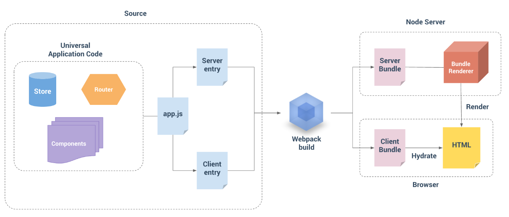

### 非同构渲染

```bash
### 非同构 SSR 渲染
如果项目并没有强依赖前端框架，或是项目过于复杂，此时可能要实现同构需要的成本比较大（抽离通用模块、移除环境依赖代码等）。考虑到项目的确需要 SSR 来加速页面可见，此时我们可以针对首屏渲染内容，自行实现 SSR 渲染。

SSR 核心思想是根据不同的路由，提供对于的页面首屏拼接的能力。由于不强依赖于同构，因此可以直接使用其他语言或是 ejs 来实现首屏 HTML 内容的拼接。

显然，非同构的方案实现 SSR 的成本，比同构的方案成本要高不少，并且还存在代码一致性、可维护性等一系列问题。因此，即使首屏直出的内容无法使用框架同构，大多数情况下，我们也会考虑尽量复用现有的代码，抽离核心的通用代码，并提供 SSR 服务代码编译打包的能力。

如假设我们的页面完全由 Canvas 进行渲染，显然 Canvas 是无法直出的。但正因为 Canvas 渲染前，需要加载的代码、计算渲染内容等各种流程过长，耗时较多，想要实现 SSR 渲染则可能只能考虑，针对首屏内容做一套 DOM/SVG 渲染用于 SSR。

基于这样的情况下，我们需要尽量复用计算部分的能力，抽离出通用的 Canvas/DOM/SVG 渲染接口，以尽可能实现对接口编程而不是对实现编程。

```

## 代码相关优化

### CSS优化

> ```bash
> ## CSS 方面优化
> 1. 合并和压缩 CSS 文件：将多个 CSS 文件合并，并将样式表压缩，可以减少文件大小和体积，从而加快加载速度。
> 2. 避免使用 '@import'：使用 '@import' 导入 CSS 文件会增加页面加载时间，最好将所有样式表合并到一个文件中。
> 3. 减少选择器的复杂性：过于复杂的选择器会增加 CSS 解析和渲染的时间。
> 4. 避免使用昂贵的属性：某些属性比其他属性更昂贵，例如 box-shadow、border-radius 等。尽可能避免使用这些属性，或者使用时设置合适的值，以减少渲染时间。
> 5. 避免使用 CSS 表达式：CSS 表达式具有高计算成本，会导致页面变慢。尽可能使用 JavaScript 来达到相同的效果。
> 7. 避免使用 !important：在 CSS 中使用 !important 关键字会覆盖其他样式，增加了样式的复杂性和维护难度。
> 8. 使用缩写属性：使用 CSS 缩写属性可以减小样式表的大小，从而提高加载速度。
> 9. 避免使用 inline-style：使用 inline-style 会增加 HTML 文件的大小，不利于样式的维护。
> 10. 使用 CSS3 动画：使用 CSS3 动画可以减少 JavaScript 的使用，从而提高页面性能。
> ```

#### CSS加载渲染的过程

> ```bash
> ### CSS 加载渲染的过程
> CSS加载和渲染过程包括以下步骤：
>     1. 浏览器解析HTML文件，创建DOM树（Document Object Model）。
>     2. 当浏览器遇到link和style标签时，它会下载CSS文件并解析它们，创建CSSOM（CSS Object Model）。
>     3. 浏览器将DOM树和CSSOM合并为一个渲染树（Render Tree），该树包含了所有需要渲染的元素及其样式信息。
>     4. 浏览器根据渲染树计算每个元素的位置和大小，生成布局（Layout）。
>     5. 浏览器将布局绘制到屏幕上，生成图像（Painting）。
> 整个过程是逐步完成的，每个步骤都会影响到下一个步骤。如果CSS文件很大或存在网络延迟，下载和解析CSS的时间会增加，从而延迟整个渲染过程。
> ```

#### @import 为什么会比link 增加加载时间

> ```bash
> ### @import 为什么会比link 增加加载时间
> 使用 @import 导入样式表会比使用 link 标签加载样式表慢，因为 @import 是在页面加载完毕后才开始加载，而 link 标签是在页面加载过程中同时加载的。
> 
> 当浏览器遇到 link 标签时，它会立即开始下载样式表，这样在页面渲染时就可以立即应用样式。而当浏览器遇到 @import 语句时，它会暂停页面渲染，并在加载完毕后再应用样式，从而增加了页面加载时间。
> 
> 此外，@import 语句还有一个缺点，就是无法并行加载多个样式表。如果在样式表中使用了多个 @import 语句，浏览器只能一次加载一个样式表，无法同时加载多个样式表，从而影响了页面的加载速度。
> 
> 因此，在实际开发中，应该尽量使用 link 标签来加载样式表，而避免使用 @import 语句。如果必须使用 @import 语句，可以将它们放在样式表的开头，以便尽早加载样式表，从而减少页面的加载时间。
> ```

#### 避免使用昂贵的属性

> ```bash
> ### box-sizing、border-raduis 属性昂贵的原因
> box-shadow 和 border-radius 这些属性是比较昂贵的属性，因为它们的计算成本比较高，会影响页面的渲染性能。
>     1. box-shadow 属性会在元素周围创建一个阴影效果，而阴影的绘制需要计算多个参数，如阴影的颜色、大小、偏移量等。如果阴影的大小非常大，或者元素的数量非常多，就会导致页面的渲染速度变慢。
>     2. border-radius 属性会将元素的角落变成圆角，这需要计算较多的参数，如圆角的大小、位置、边框的宽度等。如果元素的数量非常多，或者圆角的大小非常大，就会导致页面的渲染速度变慢。
> 因此，在使用 box-shadow 和 border-radius 属性时，应该尽可能减小它们的计算成本。例如，可以通过减小阴影的大小、使用简单的圆角形状、合并多个元素等方式来优化页面的渲染性能。另外，还可以使用 CSS3 的 transform 属性来实现一些效果，因为 transform 的计算成本比较低，可以提高页面的渲染速度。
> 
> 
> 
> ### transfrom 计算成本低的原因
> transform 属性相对于其他 CSS 属性来说计算成本较低，因为它不会触发文档流的重新布局和重新绘制。
> 当修改元素的位置、大小、旋转角度等属性时，浏览器需要重新计算元素的布局和绘制，这个过程称为文档流的重排和重绘。而 transform 属性只会修改元素的视觉呈现，而不会影响文档流的布局，因此不会触发文档流的重排和重绘，从而减少了计算成本。
> 此外，transform 属性还可以利用 GPU 加速，从而进一步提高性能。现代浏览器会自动检测哪些元素需要使用 GPU 加速，并将这些元素放到单独的图层中进行绘制，从而提高页面的渲染速度。
> 因此，在实现一些动画效果时，可以尽可能地使用 transform 属性，以减少页面的渲染成本，提高性能和用户体验。
> 注意：使用 transfrom: translate() 可能会导致元素模糊化。
> 
> 
> 
> ### transfrom 提升图层
> 使用 transform 属性可以提升元素的层级，从而将元素移动到单独的图层中进行渲染，从而提高页面的渲染性能。
> 在使用 transform 属性时，浏览器会将元素放到单独的图层中进行渲染。这些图层可以使用 GPU 加速，从而提高页面的渲染速度。GPU 加速可以将图层的渲染工作交给 GPU 来完成，从而减轻了 CPU 的负担，提高了页面的渲染性能。
> 可以使用以下方式来触发元素的单独图层：
> 	1. 使用 transform 属性：使用 translate、rotate、scale 等 transform 属性可以触发元素的单独图层。
> 	2. 使用 opacity 属性：将元素的透明度设置为小于 1 的值，也可以触发元素的单独图层。
> 	3. 使用 will-change 属性：will-change 属性可以告诉浏览器哪些属性将要被修改，以便浏览器提前为这些属性创建单独的图层。
> 需要注意的是，创建过多的图层也会对性能产生负面影响。因此，在使用 transform 属性时，应该尽可能地将元素合并到单独的图层中，以减少图层的数量，从而提高页面的渲染性能。
> ```

### JavaScript优化

> ```bash
> ### JS使用方面
> - 使用事件委托来减少事件处理程序的数量（操作数量）
> - 减少全局变量和使用const/let关键字声明变量（查找变量速度、命名冲突、内存泄露）
> - 避免使用eval()和Function()构造函数（安全性）
> - 使用原生方法和数据类型，避免使用过多的库和插件（加载耗时）
> - 使用异步代码和延迟加载来提高网页的响应速度
> - 避免使用循环或递归来处理大量数据（内存泄露、时间复杂度）
> ```

#### 循环的优化

> ```bash
> ## 循环遍历的优化
> 1. 遍历方法的速度对比：
> `for缓存(10.866) <= for倒叙(11.230) <= for(10.866)(11.988) < forEach(400.245) <= for of(320.921) < for in(2930.118)`
> 
> 
> 2. `for...in...、Object.keys()、Object.getOwnPropertyNames`的区别
> - for...in：会遍历对象自身属性以及原型属性，包括 enumerable 为 false 的不可枚举属性。
> - Object.keys()：可得到自身可枚举属性，但得不到原型链上的属性。
> - Object.getOwnPropertyNames()：可得到自身所有的属性（包括不可枚举），但得不到原型链上的属性和 Symbols 属性。
> 
> 
> 3. 遍历的使用推荐
> - 能用for缓存的方法循环就用for循坏，性能最高，但写起来繁杂。
> - 不追求极致性能的情况下，建议使用forEach方法，渐变优雅，且可没有中间变量，没有成堆的分号。
> - 不考虑兼容性情况下，推荐使用for of方法。这是最简洁、最直接的遍历数组元素的语法，该方法避开了for-in;循环的所有缺陷。与forEach()不同的是，它可以正确响应break、continue和return语句。
> - 能避免 for in 循环尽量避免，因为过于耗费性能和遍历所耗费的时间，数组循环不推荐使用。
> ```

#### 条件判断的优化

> - 优先使用权：查找表 > switch-case语句 > if-else语句
> - 当数据量很大时，查找表的效率通常要比`if-else`语句和`swtich-case`语句高，查找表能用数字和字符串作为索引，而如果是字符串的情况下，最好用对象来代替数组。当然查找表的使用是有局限性的，每个`case`对应的结果只能是一个取值而不能是一系列的操作
>
> 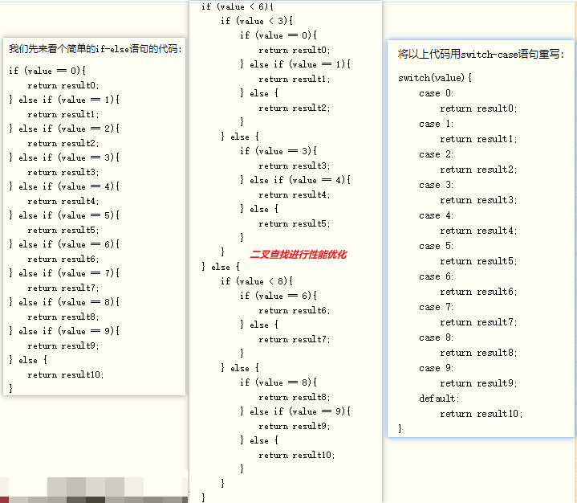
>
> ```js
> // 查找表
> let results = [result0, result1, result2, result3, result4, result5, result6, result7,
>   result8, result9, result10];
> return results[value];
> ```

#### 作用域与全局变量

> ```bash
> ### 过多的全局变量容易导致的问题（命名冲突、内存泄漏、查找变量每次都会从自身作用域查找到全局作用域、代码维护性艰难）
>   1. 命名冲突：全局变量容易引起命名冲突，如果不小心定义了一个与其他变量相同的全局变量，可能会覆盖或干扰原有的变量。
>   2. 内存泄漏：全局变量会一直存在于内存中，直到页面被关闭。因此，如果定义了过多的全局变量，可能会导致内存泄漏，从而影响页面的性能和响应速度。
>   3. 代码可维护性：全局变量让代码难以维护和扩展，因为变量的作用域和使用范围不明确，容易导致代码的混乱和不稳定。
>   4. 性能问题：全局变量需要在所有的作用域中进行查找，因此会影响代码的性能和执行速度，特别是在大型应用程序中。
> 因此，尽量避免使用过多的全局变量，可以通过使用模块化编程和使用函数封装代码来避免这些问题。
> 
> 
> 
> ### 作用域的优化
> - 在使用全局变量(window/document/自定义全局变量等)，在局部作用域中访问全局变量需要一层一层遍历整个作用域链直至顶级作用域，而局部变量的访问效率会更高，因此在局部作用域中高频率使用一些全局对象时可将其导入到局部作用域中。
> - 尽量少用with，因为with会增加其中执行代码的作用域链的长度。
> ```
>
> ```js
> //假设有多个img标签的内容，循环中引用了多次document全局变量
> function updateUI() {
>   let imgs = document.getElementsByTagName("img")
>   for (let i = 0; len = imgs.length; i < len; ++i) {
>     imgs[i].title = document.title + " image “ + i  
>   }
> 
>   let msg = document.getElementById("msg");
>   msg.innerHTML = "Update";
> }
> 
> //改善点
> function updateUI() {
>   let doc = document
>   let imgs = doc.getElementsByTagName("img")
>   for (let i = 0; len = imgs.length; i < len; ++i) {
>     imgs[i].title = doc.title + " image “ + i  
>   }
> 
>   let msg = doc.getElementById("msg");
>   msg.innerHTML = "Update";
> }
> ```
>
> ```js
> //原有复杂度为O(n)
> for (let i = 0; i < values.length; ++i) {
>   process(values[i]);
> }
> 
> //更改后复杂度为O(1)
> for (let i = values.length - 1; i >= 0; --i) {
>   process(values[i])
> }
> ```
>

#### eval() 和 Function 构造函数造成的影响

> ```bash
> ### eval() 和 Function 构造函数造成的影响
> 使用eval()和Function()构造函数会对代码的安全性和可维护性产生影响。
> 使用eval()函数会将字符串作为 JavaScript 代码执行，这可能会导致代码注入攻击，因为它允许执行任意的 JavaScript 代码，包括恶意代码。因此，应该避免在生产环境中使用eval()函数。
> 使用Function()构造函数可以动态地创建函数，但同样存在安全风险。如果函数体是从外部输入的字符串，那么它也可能包含恶意代码。因此，应该谨慎使用Function()构造函数，确保输入的代码是可信的。
> 此外，使用eval()和Function()构造函数可能会使代码难以维护，因为它们使代码的行为不可预测。这可能会导致代码的可读性和可维护性受到影响。
> ```

### 数据优化

#### 【长列表优化】虚拟列表

```bash
## 【长列表优化】虚拟列表
- 应用场景：后台一次性发送上千条或更多数据给前台。
- 场景模拟：用户发起一个请求，后台发送了 10w 条数据。
- 使用虚拟列表之前：前台需要生成 10w 个 dom 节点来渲染页面。
- 使用虚拟列表之后：前台只需要生成少量 dom 节点（dom 节点数量取决于前端试图需要展示的数量），就可以实现对这 10w 条数据的视图渲染。
- 总结：虚拟列表就是固定 dom 数量，通过修改 dom 节点的内容而达到不重新增加（或删除）dom 节点来实现列表的更新。


### 需要知道的
1. 一行的高度
2. 屏幕范围内能显示的行数
3. 列表在页面中距离页面顶部的位置
4. 滚动条高度

假设满屏能容纳10条数据，需要加载的数据时一个数组 listdata，只需要裁剪数据范围 listdata.slice(0,10)。
随着滚动条向下，将'滚动条高度/一行的高度'可以计算出当前行数。
而要模拟滚动条高度就要在页面挂载时就手动设置页面高度'一行高度 * listdata.length'
最后需要保持列表一直保持在当前位置上，手动设置列表容器 padding-top 等于'当前滚动条高度'


### 实现原理
1. 监听页面滚动，获取滚动的高度 scrolltop。
2. 根据 scrolltop 可以知道当前应该展示哪一段数据(即获取要展示数据的 index)
3. 根据当前展示的数据在长列表中的 index，对列表进行偏移。
```


##### 定长虚拟列表

> ````vue
> <!--
> * @ Author: willysliang
> * @ Create Time: 2023-02-22 13:52:15
> * @ Modified by: willysliang
> * @ Modified time: 2023-02-22 14:28:55
> * @ Description: VirtualList 虚拟列表
> -->
> 
> <script setup lang="ts">
>   import { computed, onMounted, reactive, ref } from 'vue'
> 
>   const props = withDefaults(
>     defineProps<{
>       listdata: any[]
>       itemSize: number
>     }>(),
>     {
>       listdata: () => [],
>       itemSize: 200,
>     },
>   )
> 
>   interface IState {
>     /** 可视区域高度 */
>     screenHeight: number
>     /** 偏移量 */
>     startOffset: number
>     /** 起始索引 */
>     start: number
>     /** 结束索引 */
>     end: null | number
>   }
>   const state = reactive<IState>({
>     screenHeight: 0,
>     startOffset: 0,
>     start: 0,
>     end: null,
>   })
> 
>   /** 列表总高度 */
>   const listHeight = computed(() => props.listdata.length * props.itemSize)
>   /** 可显示的列表项数 */
>   const visibleCount = computed(() =>
>                                 Math.ceil(state.screenHeight / props.itemSize),
>                                )
>   /** 偏移量对应的 style */
>   const getTransform = computed(() => `translate3d(0, ${state.startOffset}px, 0)`)
>   /** 获取真实显示列表数据 */
>   const visibleData = computed(() =>
>                                props.listdata.slice(
>     state.start,
>     Math.min(state.end as number, props.listdata.length),
>   ),
>                               )
> 
>   const listRef = ref<HTMLDivElement>()
>   onMounted(() => {
>     state.screenHeight = listRef.value?.clientHeight || 0
>     state.start = 0
>     state.end = state.start + visibleCount.value
>   })
> 
>   const scrollEvent = () => {
>     // 当前滚动位置
>     const scrollTop = listRef.value?.scrollTop || 0
>     // 此时的开始索引
>     state.start = Math.floor(scrollTop / props.itemSize)
>     // 此时的结束索引
>     state.end = state.start + visibleCount.value
>     // 此时的偏移量
>     state.startOffset = scrollTop - (scrollTop % props.itemSize)
>   }
> </script>
> 
> <template>
>   <div ref="listRef" class="infinite-list-container" @scroll="scrollEvent">
>     <div
>          class="infinite-list-phantom"
>          :style="{ height: listHeight + 'px' }"
>          ></div>
>     <div class="infinite-list" :style="{ transform: getTransform }">
>       <div
>            v-for="item in visibleData"
>            ref="items"
>            :key="item.id"
>            class="infinite-list-item"
>            :style="{ height: itemSize + 'px', lineHeight: itemSize + 'px' }"
>            >
>         {{ item.name }}
>     </div>
>     </div>
>   </div>
> </template>
> 
> <style scoped>
>   .infinite-list-container {
>     min-height: 30rem;
>     width: 100%;
>     height: 100%;
>     overflow: auto;
>     position: relative;
>     -webkit-overflow-scrolling: touch;
>   }
> 
>   .infinite-list-phantom {
>     position: absolute;
>     left: 0;
>     top: 0;
>     right: 0;
>     z-index: -1;
>   }
> 
>   .infinite-list {
>     left: 0;
>     right: 0;
>     top: 0;
>     position: absolute;
>     text-align: center;
>   }
> 
>   .infinite-list-item {
>     padding: 1rem;
>     color: #555;
>     box-sizing: border-box;
>     border-bottom: 1px solid #999;
>   }
> </style>
> ````

##### 不定长虚拟列表

> ```vue
> <template>
>   <VirtualList :listData="data" :estimatedItemSize="100" v-slot="{ item }">
>     <div class="infinite-list-item">
>       <span style="color: red">{{ item.id }}</span>{{ item.value }}
>     </div>
>   </VirtualList>
> </template>
> 
> <script setup>
> import { ref } from "vue";
> import VirtualList from "./VirtualList.vue";
> const data = ref([]);
> for (let i = 1; i <= 100000; i++) {
>   data.value.push({
>     id: i,
>     value: "字符内容".repeat(Math.random() * 100),
>   });
> }
> </script>
> 
> <style scoped>
> .infinite-list-item {
>   padding: 5px;
>   color: #555;
>   box-sizing: border-box;
>   border-bottom: 1px solid #999;
> }
> </style>
> 
> ```
>
> ```vue
> <template>
>   <div
>         ref="list"
>         :style="{ height }"
>         class="infinite-list-container"
>         @scroll="scrollEvent($event)"
>      >
>      <div ref="phantom" class="infinite-list-phantom"></div>
>      <div ref="content" class="infinite-list">
>        <div
>             class="infinite-list-item"
>             ref="items"
>             :id="item._index"
>             :key="item._index"
>             v-for="item in visibleData"
>             >
>          <slot :item="item.item"></slot>
>      </div>
>      </div>
>     </div>
> </template>
> 
> <script>
>   export default {
>       name: "VirtualList",
>       props: {
>          //所有列表数据
>          listData: {
>            type: Array,
>            default: () => [],
>          },
>          //预估高度
>          estimatedItemSize: {
>            type: Number,
>            required: true,
>          },
>          //缓冲区比例
>          bufferScale: {
>            type: Number,
>            default: 1,
>          },
>          //容器高度 100px or 50vh
>          height: {
>            type: String,
>            default: "1000px",
>          },
>       },
>       computed: {
>          _listData() {
>            return this.listData.map((item, index) => {
>              return {
>                _index: `_${index}`,
>                item,
>              };
>            });
>          },
>          visibleCount() {
>            return Math.ceil(this.screenHeight / this.estimatedItemSize);
>          },
>          aboveCount() {
>            return Math.min(this.start, this.bufferScale * this.visibleCount);
>          },
>          belowCount() {
>            return Math.min(
>              this.listData.length - this.end,
>              this.bufferScale * this.visibleCount
>            );
>          },
>          visibleData() {
>            let start = this.start - this.aboveCount;
>            let end = this.end + this.belowCount;
>            return this._listData.slice(start, end);
>          },
>       },
>       created() {
>          this.initPositions();
>          window.vm = this;
>       },
>       mounted() {
>          this.screenHeight = this.$el.clientHeight;
>          this.start = 0;
>          this.end = this.start + this.visibleCount;
>       },
>       updated() {
>          this.$nextTick(function () {
>            if (!this.$refs.items || !this.$refs.items.length) {
>              return;
>            }
>            //获取真实元素大小，修改对应的尺寸缓存
>            this.updateItemsSize();
>            //更新列表总高度
>            let height = this.positions[this.positions.length - 1].bottom;
>            this.$refs.phantom.style.height = height + "px";
>            //更新真实偏移量
>            this.setStartOffset();
>          });
>       },
>       data() {
>          return {
>            //可视区域高度
>            screenHeight: 0,
>            //起始索引
>            start: 0,
>            //结束索引
>            end: 0,
>          };
>       },
>       methods: {
>          initPositions() {
>            this.positions = this.listData.map((d, index) => ({
>              index,
>              height: this.estimatedItemSize,
>              top: index * this.estimatedItemSize,
>              bottom: (index + 1) * this.estimatedItemSize,
>            }));
>          },
>          //获取列表起始索引
>          getStartIndex(scrollTop = 0) {
>            //二分法查找
>            return this.binarySearch(this.positions, scrollTop);
>          },
>          binarySearch(list, value) {
>            let start = 0;
>            let end = list.length - 1;
>            let tempIndex = null;
> 
>            while (start <= end) {
>              let midIndex = parseInt((start + end) / 2);
>              let midValue = list[midIndex].bottom;
>              if (midValue === value) {
>                return midIndex + 1;
>              } else if (midValue < value) {
>                start = midIndex + 1;
>              } else if (midValue > value) {
>                if (tempIndex === null || tempIndex > midIndex) {
>                  tempIndex = midIndex;
>                }
>                end = end - 1;
>              }
>            }
>            return tempIndex;
>          },
>          //获取列表项的当前尺寸
>          updateItemsSize() {
>            let nodes = this.$refs.items;
>            nodes.forEach((node) => {
>              let rect = node.getBoundingClientRect();
>              let height = rect.height;
>              let index = +node.id.slice(1);
>              let oldHeight = this.positions[index].height;
>              let dValue = oldHeight - height;
>              //存在差值
>              if (dValue) {
>                this.positions[index].bottom = this.positions[index].bottom - dValue;
>                this.positions[index].height = height;
>                for (let k = index + 1; k < this.positions.length; k++) {
>                  this.positions[k].top = this.positions[k - 1].bottom;
>                  this.positions[k].bottom = this.positions[k].bottom - dValue;
>                }
>              }
>            });
>          },
>          //获取当前的偏移量
>          setStartOffset() {
>            let startOffset;
>            if (this.start >= 1) {
>              let size =
>                  this.positions[this.start].top -
>                  (this.positions[this.start - this.aboveCount]
>                   ? this.positions[this.start - this.aboveCount].top
>                   : 0);
>              startOffset = this.positions[this.start - 1].bottom - size;
>            } else {
>              startOffset = 0;
>            }
>            this.$refs.content.style.transform = `translate3d(0,${startOffset}px,0)`;
>          },
>          //滚动事件
>          scrollEvent() {
>            //当前滚动位置
>            let scrollTop = this.$refs.list.scrollTop;
>            // let startBottom = this.positions[this.start - ]
>            //此时的开始索引
>            this.start = this.getStartIndex(scrollTop);
>            //此时的结束索引
>            this.end = this.start + this.visibleCount;
>            //此时的偏移量
>            this.setStartOffset();
>          },
>       },
>   };
> </script>
> 
> <style scoped>
>   .infinite-list-container {
>       overflow: auto;
>       position: relative;
>       -webkit-overflow-scrolling: touch;
>   }
> 
>   .infinite-list-phantom {
>       position: absolute;
>       left: 0;
>       top: 0;
>       right: 0;
>       z-index: -1;
>   }
> 
>   .infinite-list {
>       left: 0;
>       right: 0;
>       top: 0;
>       position: absolute;
>   }
> 
>   .infinite-list-item {
>       padding: 5px;
>       color: #555;
>       box-sizing: border-box;
>       border-bottom: 1px solid #999;
>       /* height:200px; */
>   }
> </style>
> ```
> 

### Vue 优化

```bash
1. 恰当使用 vue 指令
    - v-if 和 v-show 区分使用场景
    - computed 和 watch 区分使用场景
    - v-for 遍历必须为 item 添加合理的 key 值，且避免同时使用 v-if

2. 更加理解 vue 的生命周期
    - 绑定事件及时销毁
    - 不要造成内部泄露，使用过后的全局变量在组件销毁后重新设置为 null。

3. 资源懒加载 & 按需引入 & 缓存
    - 图片资源懒加载
    - 路由懒加载
    - 路由组件使用 keep-alive
    - 第三方插件按需引入
    - 代码模块化

4. 服务端渲染 SSR or 预渲染

5. 长列表优化
		- 冻结响应式数据
		- 减少页面渲染的数据
		- 延时加载 & 异步加载 & 动态虚拟列表
```

```bash
### 1. v-if 和 v-show 区分使用场景
- v-if 是真正的条件渲染，因为它会确保在切换过程中条件块的事件监听器和子组件适当地被销毁和重建；也是惰性的；
  如果在初始渲染时条件为假，则说明也不做；直到条件第一次变为真时，才会开始渲染条件块。
- v-show 是不管初始条件是什么，元素总是会被渲染，并且只是简单基于 CSS 的 display 属性进行切换。
- 所以 v-if 适用于在运行时很少改变条件，不需要频繁切换条件的场景；v-show 则适用于需要非常频繁切换条件的场景。


### 2. computed 和 watch 区分使用场景
- computed：是'计算'属性，依赖其它属性值，并且 computed 的值有缓存，只有它依赖的属性值发生改变，下一次获取 computed 的值才会重新计算 computed 的值。
- watch 更多的是'观察'的作用，类似于某些数据的监听回调，每当监听的数据变化时都会执行回调进行后续操作。
- 适用场景：
    - 当我们需要进行数值计算，并且依赖于其它数据时，应该使用 computed，因为可以利用 computed 的缓存特性，避免每次获取值时，都要重新计算。
    - 当我们需要在数据变化时执行异步或开销较大的操作时，应该使用 watch，使用 watch 选项允许我们执行异步操作（访问一个API），限制我们执行该操作的频率，并在我们得到最终结果前，设置中间状态，这些都是计算属性无法做到的。


### 3. v-for 遍历必须为 item 添加 key，且避免同时使用 v-if
1. v-for 遍历必须为 item 添加 key
   在 v-for 进行数据遍历渲染时，为每一项都设置唯一的 key 值，为了让 Vue 内部核心代码能更快地找到该条数据，当旧值和新值对比时，可以更快的定位到 diff。

2. v-for 遍历避免同时使用 v-if
   在 vue2 中 v-for 比 v-if 优先级更高；在 vue3 中 v-if 比 v-for 的优先级更高。
   可以套用 template 标签进行判断或循环，或在必要情况下替换成 computed 属性。


### 4. 长列表性能优化
vue2 通过 Object.defineProperty() 对数据进行劫持，vue3 通过 Proxy() 对数据进行代理来实现视图响应数据的变化。
然而有时候我们的组件就是纯粹的数据展示，不会有任何改变，我们就不需要 Vue 来劫持我们的数据，在大量数据展示的情况下，这能够很明显的减少组件初始化的时间。
在 vue2 中可通过 `Object.freeze()` 方法来冻结一个对象，对象一旦被冻结就不能再被修改。
      export default {
        data: () => ({ user: {} }),
        async created () {
          const users = await axios.get('/api/users')
          this.users = Object.freeze(users)
        }
      }


### 5. 绑定事件及时销毁
Vue 组件销毁时，会自动清理它与其它实例的连接，解绑它的全部指令及事件监听器，但是仅限于组件本身的事件。
如果在 js 内使用 addEventListener 等方式是不会自动销毁的，我们需要在组件销毁时手动移除这些事件的监听，以免造成内存泄露。
		create () { addEventListener('click', this.click, false) },
		beforeDestory () { removeListener('click', this.click, false) },


### 6. 路由懒加载 & 缓存路由组件
路由组件使用 keep-alive：keep-alive 是 vue 提供的一个比较抽象的组件，用来对组件进行缓存，从而节省性能。
路由懒加载：当首屏渲染时，能加快渲染速度。


### 7. 按需引入
- 减少图片的使用
   对于网页来首，图片会占用很大一部分体积，所以，优化图片的操作可以有效的来加快加载速度。
- 模块/组件按需引入
   使用第三方库可以通过按需引入的方式加载，避免引入不需要使用的部分，无端增加项目体积。
- 代码模块化
	把复用的组件封装，在需要用到时引用，而不是重复写代码，每一个组件都要明确含义，复用性越高越好，可配置型越强越好。包括 css 也可通过 less/sass 的自定义 css 变量来减少重复代码。


### 8. 服务端渲染 SSR or 预渲染
服务端渲染是指 Vue 在客户端将标签渲染成的整个 html 片段的工作在服务端完成，服务端形成的 html 片段直接返回给客户端这个过程就叫做服务端渲染。
（1）服务端渲染的优点：
更好的 SEO： 因为 SPA 页面的内容是通过 Ajax 获取，而搜索引擎爬取工具并不会等待 Ajax 异步完成后再抓取页面内容，所以在 SPA 中是抓取不到页面通过 Ajax 获取到的内容；而 SSR 是直接由服务端返回已经渲染好的页面（数据已经包含在页面中），所以搜索引擎爬取工具可以抓取渲染好的页面；
更快的内容到达时间（首屏加载更快）： SPA 会等待所有 Vue 编译后的 js 文件都下载完成后，才开始进行页面的渲染，文件下载等需要一定的时间等，所以首屏渲染需要一定的时间；SSR 直接由服务端渲染好页面直接返回显示，无需等待下载 js 文件及再去渲染等，所以 SSR 有更快的内容到达时间；

（2）服务端渲染的缺点：
更多的开发条件限制： 例如服务端渲染只支持 beforCreate 和 created 两个钩子函数，这会导致一些外部扩展库需要特殊处理，才能在服务端渲染应用程序中运行；并且与可以部署在任何静态文件服务器上的完全静态单页面应用程序 SPA 不同，服务端渲染应用程序，需要处于 Node.js server 运行环境；
更多的服务器负载：在 Node.js 中渲染完整的应用程序，显然会比仅仅提供静态文件的 server 更加大量占用CPU 资源，因此如果你预料在高流量环境下使用，请准备相应的服务器负载，并明智地采用缓存策略。
```


### 工程化优化

#### webpack 优化

```bash
1. Tree Shaking: 移除无用代码。
2. Code Splitting: 将代码分割成更小的模块。
3. Lazy Loading: 只加载当前需要的模块。
4. 缩小构建目标：配置 babel-loader 的 include 和 exclude 属性，减少编译范围。
5. 使用 DllPlugin: 将公共库分离，加速构建。
6. Module Concatenation: 启用 Scope Hoisting，减少代码冗余。
7. 压缩代码: 使用 TerserWebpackPlugin 压缩 JS 和 CssNano 压缩 CSS。
8. 缓存: 在硬盘上存储构建的中间结果，用于多次构建。
9. 优化图片: 使用 image-webpack-loader 压缩、优化图片。
```

#### vite 优化

```bash
1. 基于 ES modules: 利用浏览器原生的模块化支持。
2. 开发模式按需编译: 避免不必要的全量编译，提高开发效率。
3. Rollup 优化: Vite 使用了 Rollup 做打包，自带许多优化方案。
4. 动态导入(dynamic import): 适当使用动态导入实现代码分割和按需加载。
5. 缓存优化: Vite 会缓存已编译的模块，以提高后续构建速度。
6. CSS 脚本引入: 支持 CSS 模块和内联 CSS，减少额外请求。
```

#### 打包优化

```bash
### 1. wepack/vite 使用 gzip 压缩打包后的代码
把 'productionSourceMap' 设置为 false，不然最终打包过后会生成一些 map 文件，如果不关掉，生成环境是可以通过 map 去查看源码的，并且可以开启 'gizp' 压缩代码，使打包过后体积变小。


### 2. 使用 CDN 加载外部资源
比如 vue-router、axios 等 vue 的周边插件，在 webpackage.config.js 中的 externals 里面设置一些不必要打包的外部引用模块，然后在入口文件 index.html 通过 CDN 的方式引入需要的插件。
 ``` webpackage.config.js
 module.export = {
   externals: {
     vue: 'Vue',
     'vue-router': 'VueRouter',
     axios: 'axios',
   },
 }
```

