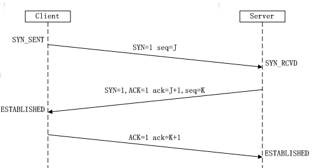

## 待复习

```bash
## 在前端开发中，什么样的代码会导致性能很低？
1. 不恰当的使用递归
2. 过多地渲染页面可视区域之外的DOM节点内容
3. 大数据量的计算
4. 多层嵌套循环的数据
5. 不恰当地导入未需要引用的模块或库，或导致页面加载缓慢
6. 过度地进行Http请求，而因http2之前，请求最大并发数量为6，从而导致请求阻塞


## 碰到一个棘手的问题，您这边通常采取什么样的思路排查问题？
首先分析问题的性质，以及可能在哪个环节会导致这样的问题发生；
然后推理可能的解决方案；
然后再实际去试探排查问题真实所在；
最后再相应的解决问题。
```

> ```bash
>  1. 如何用JS判断一个对象是空对象？
>  3. window和document对象的区别？
>  4. 如何看到组件化，如何做好组件规范？
> 
> 
> vuex 的 mutation 是检测数据的变化，
> 
> 1px 解决
> 1. css3 transform 的 scale 设置为 0.5
> 2. box-shadow: 提取一半高度
> 
> HTTP1.1的方法有哪些，怎么区分简单请求和复杂请求
> 实现 75%圆环
> JS实现Set类型的交集、补集、并集、差集
> ES6定义变量的方法：let、const、import、class
> var a = 'a' var b = 2   a*b = NaN；a + b = a2；a - b = NaN；
> 
> 
> 
> 2. 有什么影响 SEO 的，哪些标签影响 SEO 的搜索（只要影响到搜索引擎的，都需要编写，vue可以忽略）
> 网站TDK：title元素、description元素、keywords元素
> SEO 提高浏览器搜索排名的，影响SEO排名的标签有如下：
>   - meta
>   - h1：页面唯一只能有一个 h1，用的时候要慎重
>   - a标签的title属性、核心影响 href， href 必须要写，不然会降低 SEO 排名
>   - image标签的alt（替换属性），一般功能是假如图片链接错了会出代替图片显示，崩溃需要添加 onError事件，公司项目是不允许图片崩溃的
>   - 核心影响的是 （有且仅有一个）tdk：title,
>   - 富文本编辑器（wangEditor）：
> 
> SEO怎么实现的，比如SSR这种
> 
> 5. keepalive 的生命周期
> 有些路由不想缓存怎么办，有些路由不想缓存在怎么办
> 
> 6. 性能优化
> vue相关的：路由懒加载（加上layzy）、keepalive、虚拟滚动、触底更新、预加载
> 
> 
> 7. 一次https包含几次请求，分别是怎么样的
> 发送两次，把公钥作为传递的，私钥作为本地验证的
> - 公钥发送一次
> - 被公钥加密的一次的大密文，然后前端解密
> 
> 
> 9. webpack 跨域的Proxy反向代理的底层原理实现	
> 
> 12. AMD/CMD、UMD、COMMONJS
> 
> 16. vite 由什么实现组成的
> 20. 深拷贝递归是深度优先还是广度优先
> 广度优先的
> 体验感：innerHTML/vsDom /document
> vue能明确知道更新哪个组件，React不知要更新哪个组件
> 
> 时间切片：react人机交互，不希望用户体验卡顿，但是又不希望程序停止
> 
> 
> 
> # 若是包装简历，会问算法，我们要记忆流程、记忆算法图解、记忆核心原理
> # 大厂考的是如何把问题图形化、如何把问题抽象化
> 1. 冒泡是一个什么过程，有东西往上冒 或者 有东西往下沉
> 
> 
> 2. 怎么看待在公司中跟同事相处
> HR核心是想试探你的性格，如果你放在团队中，你是一个什么人？
> 我一定是团结同事、虚心请教（不搞事，友好相处、不挑事）
> 要不卑不亢，做好自己，不要显得太柔弱，不然就算面试都不好过
> 
> 
> 3. 领导分配的活给你比较重，比其他人比较轻
> HR想问什么，不要暴露情绪、不要暴露需求、不要暴露短板
> 要说，这是我的责任，我应该这么做，如果有一天我做不满了，我会跟领导说，我会完成我本职工作
> 我不会跟别人攀比，工作多少都是我的责任
> 如果我压力非常大，我会跟领导说，我的工作跟别人无关（突出这方面）
> 
> 1. 问你在工作上有遇到什么问题呀
> 一般没遇到什么问题，
> 
> 1. 你对我们公司有了解吗
> HR想让你夸他们公司，看你能不能做合格的舔狗
> 
> 4. 如何学习
> 去掘金学基础、看github哪些最近比较火（最好看有文档的）
> 
> 5. 职业规划
> HR想问的是：你是一个什么样的人，你是想在我这养老、镀金还是创造价值
> 努力学习，跟公司一起成长，跟公司发现业务价值
> HR想要问你什么时候在公司离职
> ```
>
> ````js
>js的精度问题：是怎么通过toFixed()来进行计算，因为是四舍五入，是否会缺失精度。
> 如果通过*100然后再除以100，是否可以达到这样的效果
> 
> 数组拉伸：通过把数组转换为字符串，然后消去'['和']'符号。
> 
> 
> 移除prototype上的属性问题
> function Foo(){ };
> Foo.prototype.log = function(text){
> console.log(text)
> };
> var foo = Foo ? new Foo() : {}
> foo.log('before delete');	
> 	//Foo.prototype = { } 这句执行完毕以后，log方法依然会存在与foo对象上，并且可以调用
> delete Foo.prototype.log; //这句可以正常删除log方法
> foo.log('after delete');
> 
> 我曾思考过使用 People.prototype绑定事件并去触发来执行，取消绑定时则delete该方法，但是会比较繁琐，并且会导致People类中可能会
> 
> 
> 1. websocket
> 3. rem与em与px
> 6. 首页白屏优化
> 11. 怎么同时执行多个Async
> 14. ES6模块化与Commonjs区别
> 22. Vue组件如何插入高度自定义信息
> 23. 怎么判断数据类型
> 26. 项目难点
> 27. git master分支
> 28. 怎么与后端联调
> 
> 大数据量，怎么实现分页，怎么接收数据
> 通过虚拟DOM来完成
> 
> 请求的方式：合并请求，通过多数组的方式获取
> 多数据渲染：轮询，每隔多少秒进行请求（可能也会造成卡顿）、数据懒加载、
> 
> 模糊搜索卡顿
> 1. 查找使用二分法
> 2. 页面渲染的懒加载
> 3. 页面虚拟列表
> 
> 1. 处理数据方面
> 2. 渲染数据方面
> 
> 
> const test = async () => {
> 	const res1 = await $http('/test1')
> 	const res2 = await $http('/test2')
> }
> ````

## 面试总结

> ```js
> 1. 你是怎么学习新知识的？
> 如果有人已经在我们前面走过弯路摸索过，而我们就应该沿着他们摸索出来的道路上前行，而不是多花许多无谓的时间琢磨。
> 直到前面无人探索时或自己有了一定的基础知识后，自己摸索就会相对比较好。
> 这也是我为什么喜欢先看视频学习，因为别人会总结出一些学习的经验，会让我们更容易理解以及避免这些错误。
> 然后可以再看看官网，因为官网是叙述了此框架的知识，是总结，我们可以在其中发现我们在视频中遗漏的知识点。
> 
> 
> 2. 如果在开发过程中遇到问题，你应该怎么解决？
> 可以通过百度去解决问题，先设想能否绕开这个难题，行不通则可引进新技术，行不通则花时间琢磨解决，再行不通就跟别人讨论、研究、请教问题解决方案
>   首先我们先看看这个问题我们能否解决，如果条件允许，我们可以规避、绕开这些问题
>   或者引进新的技术来解决问题
>   如果实在不行，可以跟别人探讨问题的解决方案
> 
> ```

## 混杂

```js
http请求：http请求头

协商缓存，DNS缓存

伪类选择器的先后顺序
a:link,     a:visited,	a:hover,	a:active

两个div重叠
	BFC可以解决外边距重叠。
	产生BFC的元素：
根元素；
float不为none
overflow不为visible
position不为static和relative
disaplay为inline-block/flex/inline-flex/table-cell/table-caption 


vue2的数据双向绑定原理
1. 通过监听器Observer：劫持并监听对象所有属性，利用Object.definedProperty()对属性加上setter和getter方法
2. 通过解析器Compile：解析Vue模板指令，将模板的变量替换为数据，然后渲染页面视图，并对每个指令节点绑定更新函数，添加监听数据的订阅者，当数据有变动，就会调动更新函数进行数据更新
3. 订阅者Watcher：是监听器和解析器之间通信的桥梁，主要是订阅监听器中的属性值变化，当发生变化，就会触发解析器中对应的更新函数
4. 订阅器Dep：订阅器采用 发布-订阅 模式，用来收集订阅者，对监听器和解析器进行统一管理。

v-show与v-if的区别 ？ 
   v-show：初始渲染高，等同display:none，适用于频繁切换的；
   v-if：按条件渲染，每次都删除或创建元素，适用于运行时很少改变条件的
computed与watch的区别?
   computed：依赖其他属性值，并且computed有缓存，只有依赖值发生改变，下一次获取才会改变； 会产生一个新的属性值
   watch：监听其他数据的变化，并且监听的值必须存在data中，不支持缓存，每当数据变化后回调执行

组件间的通信
   1. props / $emit 适用父子组件通信
   2. ref 与 $parent / $children 适用于父子组件通信
   3. 事件总线 适用于父子、隔代、兄弟组件通信
   4. $attrs / $listeners 适用于隔代组件通信
   5. provide / inject 适用于隔代组件通信
   6. Vuex 适用于父子、隔代、兄弟组件通信


全局变量实现的方式
1. vuex
2. 通过module.exports：可在一个js文件中定义变量，然后通过module.exports暴露出去，最后通过入口文件全局挂载到Vue.protype中；通过this来进行引用
3. 通过export default：可在一个js文件中定义变量，然后通过export default暴露出去，最后通过入口文件全局挂载到Vue.protype中；通过this来进行引用

vue的key值使用场景
1. v-for：key是虚拟DOM对象的表示。在数据发生变化时，新旧虚拟DOM会根据diff算法对比，若kye值找到，就判断数据是否相同；key值不同，则创建一个
   所以一般不用索引下标来当做key值，因为Key值很容易相同，但是内容不同
2. 动态路由中添加key，管理可复用元素：Vue会尽可能高效的渲染元素，通常会复用已有元素，但此时会带来一些不好的副作用，所以通过key来辨识他们不一样
 主要作用是为了高效的更新虚拟DOM，以便它能跟踪每个节点的身份，从而重用和重新排序现有元素
```

## HTML & CSS

```bash
## html 标签语义化
HTML5的语义化指：合理正确的使用语义化的标签来创建页面结构。
语义化的标签：h1~h5、p、strong、em、button、header、nav、article、aside、section、footer 等。
语义化的作用：
  - HTML标签语义化让页面的内容结构化，在没有 css 样式情况下，页面整体也会呈现出很好的结构效果。
  - 有利于浏览器、搜索引擎解析优化，搜索引擎爬虫会根据不同的标签来赋予不同的权重。
  - 方便其他设备解析（如盲人阅读器），根据语义渲染页面。
  - 有利于开发和维护
  - 提升用户体验，比如title、alt。
  

## iframe 的缺点
1. iframe 会阻塞主页面加载。
		 window 的 onload 事件需要在所有 iframe 加载完毕后(包含里面的元素)才会触发。
2. iframe 和主页面共享连接池
		http只能同时发送6个请求，但因为主页面和其中的 iframe 是共享这些连接的，若iframe 上请求过多就会阻塞主页面资源的加载。
优化方案：可通过在主页面上的重要的元素加载完毕后，在动态设置 iframe 的 src 属性上所绑定的链接来优化。


## HTML 混乱模式
- 网站设置 `<!DOCTYPE html>` 是为了防止浏览器在渲染文档时，使用一个不符合规范的渲染模式。
- 在严格模式下，浏览器根据 W3C 标准进行解析并渲染，而在混杂模式下浏览器会用自己的渲染方式解析并渲染。
- 混杂模式的存在是为了在没有 W3C 标准时间段写的旧网页可以顺利地加载出来。


## CSS选择器优先级
- !important > 行内样式 > ID选择器 > 类选择器/伪类选择器/属性选择器 > 元素选择器/伪元素选择器 > 通配符选择器/关系选择器 > 继承样式 > 默认样式
- 当样式中包含多种选择器时，需要将多种选择器的优先级相加然后再进行比较。
- 但注意，选择器的优先级计算不会超过它的最大数量级，如果选择器的优先级一样，前面定义的样式会被后面的样式覆盖
- 伪类的顺序：`:link  、 :visited 、 :hover 、 :active`


## 浮动 float
    - 浮动的作用：当父元素不给高度时，内部元素如果不浮动则不会撑开；而浮动时，父元素会变成一条线。
    - 使用clear清除浮动的原理：元素盒子的变不能和前面的浮动元素相邻，对元素设置 clear 属性时为了避免浮动元素对该元素的影响，而不是直接清除掉浮动。
    - `clear:both`：本质是闭合浮动，即是让父盒子闭合出口和入口，不让子盒子出来。
### 清除浮动的方式
    1. 额外标签法：在最后一个浮动标签后新加一个标签并设置属性`clear：both;`
    		 clear:both 的本质是闭合浮动，让父盒子闭合出口和入口，不让子盒子出来
    2. 父元素添加overflow属性（`overflow:hidden/auto`）
    			通过触发BFC方式，实现清除浮动
    3. 在父元素中使用after伪元素清除浮动，在:after中添加设置模式为块元素，并通过`clear:both`清除浮动
    4. 在父元素中使用before和after双伪元素清除浮动，设置模式为table元素，并在after中清除浮动
    			为了兼容ie浏览器，需要给父元素添加属性 `*zoom: 1`
注意：即使清除浮动，当超出父元素的内容还是会溢出，所以建议在父元素中定义`overflow:hidden/auto`；且在定义浮动后，若子盒子宽度超出父盒子宽度，超出部分的子盒子会换行显示（是超出部分的整个子盒子，而不是子盒子的内容）
    


## 定位 position
1. 静态定位：元素的标准流显示方式，没有定位，会忽略`left、right、top、bottom、z-index`属性
2. 固定定位：以浏览器的可视窗口为参照点定位，会脱离文档流，元素不占位
3. 相对定位：相对于自身位置进行定位，元素仍然占据原来的位置
4. 绝对定位：相对于离自己最近，且定义了非静态定位的父元素的位置进行定位，若全部父元素没有定位属性，则相对于 body 标签左上角进行定位，会脱离文档流，不占据位置
5. 粘性定位：以浏览器的可视窗口为参照点移动元素，且元素会占据原先位置，必须添加 `left、right、top、bottom、z-index` 其中一个属性才有效。
- 可通过z-index来进行定位元素的上下层级调整（静态定位不能设置）


### 哪些情况下会使 z-index 的行为发生变化
正常情况下，元素的层叠规则遵循 “值越大位置越靠前，谁在后谁靠上”。
但在一些特殊情况下，层叠规则会有些不同。有如下情况：
   * 元素为flex布局元素（父元素display：flex|inline-flex），同时z-index不为auto
   * 元素的opacity值不是1
   * 元素的transform不是none
   * 元素mix-blend-mode知不是normal
   * 元素的filter值不是none
   * 元素的isolation值是isolate
   * 元素的will-change属性值为上面2~6的任意一个（如will-change:opacity will-change:transform等）
   * 元素的-webkit-overflow-scrolling设为touch


## 盒子模型 box-sizing
- 盒模型的本质是盒子，封装周内的HTML元素。
- CSS的盒模型分为标准盒模型和怪异盒模型。
- 盒模型大小 = 内容、内边距、边框、外边距（注意：怪异盒模型的内容包括border跟padding）
- box-sizing的值：inherit(继承父元素的box-sizing的值)、content-box(标准盒模型)、border-box(怪异盒模型)

- 标准盒模型的 content 为 width 和 height
- 怪异盒模型的 content 为 width 和 height、border、padding

- 标准盒模型的宽度 = width + 左右margin + 左右padding + 左右border
- 怪异盒模型的宽度 = width + 左右margin	（width 已经包含 padding 和 border）


## 水平垂直居中
1. 父元素设置弹性布局或网格布局：`display:flex/grid;justify-content:center;align-items:center;`
2. 父元素设置flex或grid布局+margin:auto：`display:flex/gird;margin:auto;`
3. 子元素通过margin和transform配合：`margin:50% auto;transform:translateY(-50%);`
4. 使用table-cell：父元素设置`display:table-cell;vertical-align:middle;text-align:center;`，子元素设置`display:inline-block;`
5. 设置定位和transform：父元素设置相对定位，子元素设置`position:absolute;left:50%;right:50%; transform: translate(-50%, -50%)`
6. 设置定位和margin:auto：`position:absolute; left:50%; top:50%; margin:auto;`
7. 设置定位和负margin：`width:100px;height:100px; position:absolute; left:50%; top: 50%; margin-left:-50px; margin-right: -50px;`
8. 文本水平居中和行高占满容器(只适用纯文字类)：`'width:100px;height:100px; text-align:center; line-height:100px;`
9. 使用伪元素，在父级最后增加一个空的文本元素，将文本元素的行高设置成父元素content的高度，当这个父元素的空的文本元素与其直接子元素的font-size一样高时，由于基线对齐，实现了垂直居中`.father{width: 50px;height: 50px;text-align: center;} .father::after{content:"";line-height:50px;} .son{display:inline-block;}`


## 隐藏元素的方法：display:none、visibility:hidden、opacity:0 的区别
  1. `opacity:0`：将元素透明度变为0，但依然占据空间且可交互，重建图层性能较高。
  2. `visibility:hidden`：元素不可见，占据空间且不会导致页面结构发生变动，不会交互，会引起重绘。
  3. `display:none`： 元素从文档流中消失，在文档布局中不再分配空间，且不可交互；再显示原来这里不存在的结构会引起重排，性能开销较大。
  4. `overflow:hidden`：只隐藏元素溢出的部分，占据空间且不可交互。
  5. `z-index:-9999`：将层级放到底部，这样会被其它元素覆盖，占据空间，不一定能交互（没有被覆盖部分能交互）
  6. `transform:scale(0,0)`：平面变换，将元素缩放为0，占据空间且不可交互。
  
  

## 用css实现三角符号
/*记忆口诀：盒子宽高均为零，三面边框皆透明。 */
div:after{
    position: absolute;
    width: 0;
    height: 0;
    content: "";
    border: 100px solid transparent;
    border-top: 100px solid #ff0;
}
```

### 对h5的理解

> - 新标签可读性高，有助于开发
> - 提供了更多的媒体标签（audio、video）
> - 很好的替代了flash
>
> #### HTML5新特性
>
> - 绘画canvas
> - 用于媒介回放的video和audio元素
> - 本地离线存储localstorage长期存储数据，浏览器关闭后数据不丢失
> - sessionstorage的数据在浏览器关闭后自动删除
> - 语义化更好的内容元素，比如`article、footer、header、nav、section`
> - 表单控件`calendar、date、time、email、url、search`
> - 地图和拖放
> - 新的技术webworker、websocket、Geolocation
>
> #### 处理兼容
>
> - IE8/IE7/IE6支持通过document.createElement方法产生的标签，可以利用这一特性让这些浏览器支持HTML5新标签，浏览器支持新标签后，还需添加标签默认的样式
> - 还可用成熟的框架，比如html5shim
>
> ```html
> <!-- [if lt IE 9]>
> 	<script src="http://html5shim.googlecode.come/svn/trunk/html5.js"></script>
> <![endif]-->
> ```

### script标签defer和async的区别

> 1. 没有defer和async，浏览器会立即加载并执行指定的脚本，“立即”是指在渲染该script标签之下的文档元素之前，就是说不等待后续载入的文档元素，读到加载并立即执行
> 2. 有async，加载和渲染后续文档元素的过程将和js脚本文件的加载与执行并行进行（异步）
> 3. 有defer，加载后续文档元素的过程将和js脚本文件的加载并行进行（异步），但js脚本文件的执行要在所有元素解析完成后，`DOMContentLoaded`事件触发之前完成
>    4. 从实用角度来说，把所有脚本都丢到`</body>`之前是最佳实践，因为对于旧浏览器来说这是唯一的优化选择，此法可保证非脚本的其他一切元素能够以最快的速度得到加载和解析
>
> 
>
> - defer和async在网络读取(下载)都是异步的（相较于HTML解析）
> - defer是按照加载顺序执行脚本
> - async是乱序执行的，脚本的加载完会立刻执行
> - async对于应用脚本用处不大，因为它不考虑依赖；对于不依赖任何脚本或不被任何脚本依赖的脚本非常适合，如`Google Analytics`
> - 即操作DOM的脚本不要使用`async或defer`

### 页面导入样式时，使用link和@import的区别

> 1. link是XHTML标签，除了加载CSS外，还能用于定义RSS，定义rel链接属性等作用；而@import是CSS提供，只能用于加载CSS
> 2. link引用CSS时，在页面载入时同时加载，@import需要页面网页完全载入以后加载
> 3. link是XHTML标签，无兼容性问题；@import是在CSS2.1提出，低版本(IE5及以下)的浏览器不支持
> 4. link支持使用JavaScript控制DOM去改变样式；而@import不支持

### CSS加载会造成阻塞吗？

> - css加载不会阻塞DOM的解析
> - css加载会阻塞DOM的渲染
> - CSS加载会阻塞js的执行

### 样式的继承

> 并不是所有的样式都会被子元素所继承，如：背景相关的、边框相关的、定位相关的样式都不会被子元素所继承。
>
> 可以继承的有：字体系列的属性、文本系列的属性、元素的可见性、表格布局属性、列表属性、页面样式属性

### 取消行内元素间的间隙

> - 行内元素产生间隙的原因：存在“回车键”、空格、“tab”时就会出现间隙
>
> 1. 将元素写成一行，中间不换行(代码不美观)
> 2. 给父元素设置font-size:0(其他字符尺寸也被设为0，需要额外重新设定其他字符尺寸，且在Safari浏览器依然会出现空白间隔)
> 3. 为元素设置负margin值，但是会根据父元素定义的font-size大小而变化
> 4. 设置浮动，需要给父元素设置宽高(有些容器是不能设置浮动，如左右切换的焦点图等)
> 5. 给父元素设置word-space或letter-space值为负数(这也设置了`<li>`内的字符间隔，因此需要将`<li>`内的字符间隔设为默认letter-spacing:normal)

### 文本溢出

> ````js
> // 单行溢出显示省略号
> display: block;
> white-space:nowrap;	// 文本不换行，只显示一行文字
> overflow:hidden;	// 超出内容框的隐藏
> text-overflow:ellipsis;	// 用省略号显示超出的部分
> 
> // 两行超出隐藏
> overflow: hidden;	// 超出的隐藏显示
> text-overflow:ellipsis;	// 省略号显示溢出部分
> display:-webkit-box;	// 弹性伸缩盒子模型显示
> -webkit-line-clamp:2;	// 限制在一个块元素显示的文本行数
> -webkit-box-orient:vertical;	// 设置或检索伸缩盒对象的子元素的排列顺序
> word-wrap: break-word;	//换行（若不设置会不换行，从而导致只显示一行）
> line-height: 30rpx;
> height: 60rpx;	// 一般来说，应设定高度=行高*显示的行数,防止超出的文字露出
> ````

### flex布局

> **flex**属性是`flex-grow、flex-shrink、flex-basis`三个属性的缩写
>
> **flex-grow**：定义项目的的放大比例；
>
> - ​    默认为0，即 即使存在剩余空间，也不会放大；
> - ​    所有项目的flex-grow为1：等分剩余空间（自动放大占位）；
> - ​    flex-grow为n的项目，占据的空间（放大的比例）是flex-grow为1的n倍。
>
> **flex-shrink**：定义项目的缩小比例；
>
> - ​     默认为1，即 如果空间不足，该项目将缩小；
> - ​     所有项目的flex-shrink为1：当空间不足时，缩小的比例相同；
> - ​     flex-shrink为0：空间不足时，该项目不会缩小；
> - ​     flex-shrink为n的项目，空间不足时缩小的比例是flex-shrink为1的n倍。
>
> **flex-basis**： 定义在分配多余空间之前，项目占据的主轴空间（main size），浏览器根据此属性计算主轴是否有多余空间，
>
> - ​     默认值为auto，即 项目原本大小；
> - ​     设置后项目将占据固定空间。  
>
>  所以flex属性的默认值为：0 1 auto （不放大会缩小）
>
>   **flex为none**：0 0 auto  （不放大也不缩小）
>
>   **flex为auto**：1 1 auto  （放大且缩小）
>
>   **flex为一个非负数字n**：该数字为flex-grow的值，
>
>   **flex：n**；=  flex-grow：n；
>
> ​          			 flex-shrink：1；
>
> ​          			 flex-basis：0%；
>
>   **flex为两个非负数字n1**，**n2**： 分别为flex-grow和flex-shrink的值，
>
>   **flex：n1 n2**; = flex-grow：n1；
>
> ​              				flex-shrink：n2；
>
> ​              				flex-basis：0%；
>
>   **flex为一个长度或百分比L**：视为flex-basis的值，
>
>   **flex: L**; =  flex-grow：1；
>
> ​          		  flex-shrink：1；
>
> ​          		  flex-basis：L；
>
>   **flex为一个非负数字n和一个长度或百分比L**：分别为flex-grow和flex-basis的值，
>
>   **flex：n L**；= flex-grow：n；
>
> ​            flex-shrink：1；
>
> ​            flex-basis：L;
>
>   可以发现，flex-grow和flex-shrink在flex属性中不规定值则为1，flex-basis为0%。
>
>  flex：1即为flex-grow：1，经常用作自适应布局，将父容器的display：flex，侧边栏大小固定后，将内容区flex：1，内容区则会自动放大占满剩余空间。

### BFC

> **BFC（Block formatting contexts）：块级格式上下文**
>
> - 块级元素才会产生BFC，且BFC仍属于文档中的普通流，是一个独立隔离的渲染区域，不影响区域与外部
>
> - **产生BFC的元素**(脱离文档流)
>
>   1. 根元素
>   2. float属性不为none；
>   3. position不为static和relative；
>   4. overflow不为visible；
>   5. display为inline-block, flex, inline-flex，table-cell, table-caption
>
> - **BFC的特点**
>
>   1）内部的Box会在垂直方向，一个接一个地放置。
>   2）Box垂直方向的距离由margin决定。属于同一个BFC的两个相邻Box的margin会发生重叠
>   3）每个元素的margin box的左边， 与包含块border box的左边相接触(对于从左往右的格式化，否则相反)。即使存在浮动也是如此。
>   4）BFC的区域不会与float box重叠。
>   5）**BFC就是页面上的一个隔离的独立容器，容器里面的子元素不会影响到外面的元素。反之也如此。**
>   6）计算BFC的高度时，浮动元素也参与计算
>
> - **BFC作用**
>
>   - **解决外边距重叠问题**：由于BFC是一个独立的区域，内部的元素和外部的元素互不影响，将两个元素变为两个BFC，就解决了margin重叠的问题。
>
> - **解决高度塌陷的问题（清除浮动影响）**：在对子元素设置浮动后，父元素会发生高度塌陷，也就是父元素的高度变为0。解决这个问题，只需要把父元素变成一个BFC。常用的办法是给父元素设置`overflow:hidden`。
>
>   - **创建自适应两栏布局**：可以用来创建自适应两栏布局：左边的宽度固定，右边的宽度自适应（利用浮动导致内容坍塌，然后让中间的设置margin:auto）
>
> ```css
> 关于div外边距重叠的发生条件
> 情况一：两个div垂直边界相邻，margin会等于二者中margin较大的值
>               解决方案 1.position：absolute
>                       2.float：left
> 
> 情况二：子元素在父元素内，子元素的margin-top会与父元素的margin-top重叠，值等于二者中较大的，如果只有子元素设置了margin-top，则显示为父元素的margin-top
>               解决方案 1.给父元素设置border（给子元素设置边框没有用）
>                       2.给父元素设置padding值
>                       3.给父元素或子元素添加float：left
>                       4.给父元素或子元素添加position：absolute
>                       5.给父元素添加overflow：hidden
>                       6.给子元素添加display：inline-block
> 
> 情况三：一个空白元素自身的margin-top和margin-bottom会重叠，值为而这种较大的
>              解决方案 1.设置透明border
> ```

### display、float、position的关系

> （1）首先判断display属性是否为none，如果为none，则position和float属性的值不影响元素最后的表现。
>
> （2）然后判断position的值是否为absolute或者fixed，如果是，则float属性失效，并且display的值应该被设置为table或者block，具体转换需要看初始转换值。
>
> （3）如果position的值不为absolute或者fixed，则判断float属性的值是否为none，如果不是，则display的值则按上面的规则转换。注意，如果position的值为relative并且float属性的值存在，则relative相对于浮动后的最终位置定位。
>
> （4）如果float的值为none，则判断元素是否为根元素，如果是根元素则display属性按照上面的规则转换，如果不是，则保持指定的display属性值不变。
>
> 可以看作是一个类似优先级的机制，"position:absolute"和"position:fixed"优先级最高，有它存在的时候，浮动不起作用，'display'的值也需要调整；其次，元素的'float'特性的值不是"none"的时候或者它是根元素的时候，调整'display'的值；最后，非根元素，并且非浮动元素，并且非绝对定位的元素，'display'特性值同设置值

### inline、inline-block、block的区别

> - 行内元素一般是内容的容器（适合显示具体内容），而块级元素一般是其他容器的容器（适合做布局）
> - **块级元素**`block`：独占一行，对宽高属性生效；如果不给宽度，块级元素默认为浏览器的宽度100%宽
> - **行内元素**`inline`：可以多标签存在一行，对宽高属性值不生效，完全靠内容撑开宽高
> - **行内块元素**`inline-block`：可设置长宽，可让padding和margin生效，又可和其他行内元素并排
> - 行内元素：`a、b、strong、span、img、label、button、input、select、textarea`（其中img和input为行内块元素）
> - 块级元素：`header、form、ul、ol、table、article、div、hr、aside、figure、canvas、video、audio、footer`
>
> **行内元素与块元素的转换**
>
> - **float**：当把行内元素设置浮动后，该行内元素的display属性会被赋予block属性，且拥有浮动特性。行内元素去除了之间的莫名空白
> - **position:** 当为行内元素进行定位时，position:absolute与position:fixed都会使得原先的行内元素变为块级元素
> - **display:`inline/inline-block/block`**
>
> **特性**
>
> - text-align属性对块级元素起作用，对行内元素不起作用
> - 块级元素独自占一行且宽度默认会占满父元素宽度，行内元素不会独占一行，相邻行内元素可以排在同一行
> - 块级元素可以设置weith和height，行内元素设置width和height无效，而且块级元素即使设置宽度也还是独占一行。


### css模块化

> 
>
> - 就是通过每个页面根节点唯一类名，然后加上CSS后代选择器的方式来实现私有样式，这种方式是最简单，基本上和模块化不搭边，他只适合在比较小的前端中使用。
> - Vue中scoped方案，通过给每个模块生成一个唯一的属性值，然后将该属性添加到每个dom节点上，然后配合CSS的属性选择器来时实现私有样式，这种方式只能解决样式私有化的问题，但是也架不住被其他样式文件干扰
> - 开启css-loader的modules，使用CSS Modules方案，它不仅能实现样式的私有化，还能有效的避免被其他样式文件干扰，只是他需要借助webpack进行进行编译，写法上也有点不一样。

### 实现三列布局

> **实现左右两侧宽度固定，中间自适应**：BFC块级布局，flex布局，table布局,css计算宽度布局
>
> - 绝对定位+中间版块不给宽度
> - 两侧浮动+中间自动撑开（使用calc动态计算宽度，设置对应宽度margin）
> - flex，左右设置flex-basis，中间设置flex-grow
>
> **calc计算**
>
> ```css
> <div class= "main">
>     <div class="left"></div>
>     <div class="right"></div>
>     <div class="center"></div>
> </div>
> <style>
>     .main{
>         width:100%;height:400px;border:1px solid red;
>     }
>     .left{
>         width:100px;height:100%;background:gray;
>         float:left;
>     }
>     .center{
>         width:calc(100% - 100px);
>         height: 100%;
>         background: red;
>     } 
>     .right{
>         height:400px;background:green;
>         float:right;
>         width:100px;
>     }
> </style>
> ```
>
> **float布局**
>
> ```css
> .left{
>     float: left;
>     width: 300px;
>     height: 100px;
>     background: #631D9F;
> }
> .right{
>     float: right;
>     width: 300px;
>     height: 100px;
>     background: red;
> }
> .center{
>     margin-left: 300px;
>     margin-right: 300px;
>     background-color: #4990E2;
> }
> .main::after{
>     content:'';
>     display: block;
>     clear: both;
> }
> ```
>
> **position布局**
>
> ```css
> .left{
>     position: absolute;
>     left: 0;
>     width: 300px;
>     background-color: red;
> }
> .center{
>     position: absolute;
>     left: 300px;
>     right: 300px;
>     background-color: blue;
> }
> .right{
>     position: absolute;
>     right: 0;
>     width: 300px;
>     background-color: #3A2CAC;
> }
> ```
>
> **flex布局**
>
> > - 注意：当子元素的宽度大于父元素的宽度时，左右两边的子盒子会平分父元素宽度显示，中间的内容不显示
> >
> > ```css
> > .main {
> >   width: 300px;
> >   height: 200px;
> >   display: flex;
> > }
> > .left {
> >   width: 400px;
> >   height: 100px;
> >   background-color: red;
> > }
> > .center {
> >   height: 100px;
> >   background-color: blue;
> >   flex: 1;
> > }
> > .right {
> >   height: 100px;
> >   background-color: green;
> >   width: 400px;
> > }
> > ```
>
> **table布局**
>
> ````css
> .main{
>     width: 100%;
>     display: table;
> }
> .left,.center,.right{
>     display: table-cell;
> }
> .left{
>     width: 300px;
>     background-color: red;
> }
> .center{
>     background-color: blue;
> }
> .right{
>     width: 300px;
>     background-color: red;
> }
> ````
>
> **grid布局**
>
> ```css
> .div{
>     width: 100%;
>     display: grid;
>     grid-template-rows: 100px;
>     grid-template-columns: 300px auto 300px;
> }
> ```

## JS & ES6+

```bash
## 数据类型
- 基本数据类型：number、boolean、string、null、undefined、symbol、bigInt。
- 复杂数据类型：object（包含function、Array、Date、RegExp、特殊的基本包装类型(String、Number、Boolean) 以及单体内置对象(Global、Math)等）


## 数据类型判断
1. `typeof`：主要用于基础数据类型的判定，其中数组、对象、null都会被判断为object，但function还是会判断出为function类型。
2. `instanceof`：只能正确判定引用数据类型，而不能判断基本数据类型。
				其内部运行机制是判断一个对象在其原型链中依次向下查询栏能否找到该类型的原型(构造函数的prototype属性)
3. `constructor`：一是判断数据的类型，二是对象实例通过 `constrcutor` 对象访问它的构造函数。
				需要注意，如果创建一个对象来改变它的原型，`constructor`就不能用来判断数据类型
4. `Object.prototype.toString.call()`：使用 Object 对象的原型方法 toString 来判断数据类型
封装方法获取所有类型：`const getType = (obj) => Object.prototype.toString.call(obj).slice(8, -1)`


## 判断数组的类型
- 通过Object.prototype.toString.call()：`Object.prototype.toString.call(obj).slice(8,-1) === 'Array'`
- 通过constructor判断：`obj.constructor === Array`
- 通过instanceof做判断：`obj instanceof Array`
- 通过ES6的Array.isArray()判断：`Array.isArrray(obj)`
- 通过原型链判断：`obj.__proto__ === Array.prototype`
- 通过Array.prototype.isPrototypeOf：`Array.prototype.isPrototypeOf(obj)`


## null 和 undefined 的区别
- null 和 undefined 的共同点：都是基本类型，数据保存在栈中，且在 if 判断语句中值都为 false。
- null 表示变量声明未赋值，null 表示空对象。
- null 主要作用：
		1. 解除对象引用，便于垃圾回收。
		2. 作为对象原型链的终点。
		3. 作为函数参数表示该函数的参数是正常或意料之中的值空缺。
		4. null转换为数值为`0`。
- undefined 主要作用：
		1. 判断变量是否声明。
		2. 函数调用应提供的参数没有提供，该参数值为undefined。
		3. 对象中没有赋值的属性的属性值为undefined。
		4. 函数默认返回值为undefined。
		5. undefined转换为数值为`NaN`。
		
		

## 垃圾回收机制
标记清除法：当变量进入执行环境时，被标记为 "进入环境"，当变量离开执行环境时，会被标记为 "离开环境"，垃圾回收器会销毁那些带标记的值并回收它们所占用的内存空间。
引用计数法：当前内存内占用一次，计数累加一次，移除占用就减1，减到0时，浏览器就会回收它。


## 闭包
- 闭包是指有权访问另一个函数作用域中变量的函数(常见的是在函数内部创建函数调用该函数的)
- 闭包用途：在函数外部能访问到函数内部的变量，函数执行完后变量对象继续保存在内存中，不会被回收掉。
- 闭包的缺点：不会自动销毁，所以可能会导致内存泄漏，因此可以在使用完成后将变量对象定义为null，使得js垃圾回收机制回收该变量。
- 闭包的应用场景：函数柯里化、立即执行函数、防抖节流

## this 指向
1. 普通函数、定时器函数、立即执行函数的 this 指向 window。
2. 以对象方法调用时 this 指向对象本身。
3. 构造函数的 this 指向实例对象。
4. 绑定事件函数的 this 指向函数的调用者。
5. 还可通过 call、bind、apply 改变 this 的指向，但它们区别是传参方式或执行时间会有所不同。


## call/apply/bind
- 基于 Function.prototype 上的 apply/call/bind 调用模式，这三个方法都可以显示的指定调用函数的 this 指向。
- apply()：立即调用函数，接收参数必须是数组(伪数组)，返回undefined
- call()：立即调用函数，接收参数列表，返回undefined
- bind()：不会立即调用，传入一个对象，返回一个 this 绑定了传入对象的新函数，这个函数的 this 指向除了使用 new 时会被改变，其它情况下都不会改变。


## Promise
- Promise是异步编程的一种解决方案，是一个对象，可以获取异步操作的消息，改善了回调地狱问题。
- Promise有等待、满足和拒绝状态，且状态不可变
- promise.any：只要一个成功就返回成功，如果所有的都是失败，则失败；如果any接收的是一个非promise数组，则返回成功
- promise.race：看第一个执行完成的promise，且状态跟第一个执行完成的状态一致；一般用作超时处理
- promise.all：所有执行成功才会返回成功，否则返回失败
- async/await：其实是generator的语法糖，能优化then链，看似是同步，实则异步；await等待async函数的返回值，若等到的结果为一个Promise，则会阻塞后面的代码，等着Promise对象resolve，然后得到resolve的值作为await表达式的运算结果。
```


### DOM节点增删改查

> **查找节点**：`getElementById()、getElementsByClassName()、getElementsByTagName()、querySelector()、querySelectorAll()`
>
> **创建节点**：`createElement()`
>
> **插入节点：**
>
> - `appendChild()`：子节点末尾添加
> - `insertBefore()`：同级指定位置添加，但需要知道父节点
>
> **替换节点**：`replaceChild(newChild, oldChild)`：第一个为要插入的结点，第二个为要替换的结点
>
> **移除节点**：`removeChild()`
>
> ```js
> document.createElement('div');
> 
> const element = document.createElement('div');
> document.body.appendChild(element);
> 
> const newNode = document.createElement('div');
> document.body.insertBefore(newNode);
> 
> const newNode=document.createElement('span');
> const oldNode=document.querySelector('#root');
> document.body.replaceChild(newNode,oldNode);
> 
> const element=document.querySeletor('#root');
> document.body.removeChild(element);
> ```
>
> **综合案例**
>
> ```html
> <!DOCTYPE html>
> <html lang="en">
>   <head>
>     <meta charset="utf-8" />
>     <title>DOM CRUD</title>
>     <style></style>
>   </head>
>   <body>
>     <div id="root"></div>
>     <script>
>       /**
>        * 查找节点
>        * @param {*} name
>        * name: id,class,tagname
>        * 调用示例 findNode('#root')或者findNode('div')
>        */
>       const findNode = function (name) {
>         return document.querySelector(name);
>       };
>       /**
>        * 创建一个节点
>        * @param {*} tagName, attrObj
>        * name: 标签名
>        * attrObj: 属性名
>        * 调用示例: createNode('div'), createNode('div',{id:'first',innerHTML:'helloworld'})
>        */
>       const createNode = function (tagName, attrObj) {
>         let node = document.createElement(tagName);
>         for (let key in attrObj) {
>           node[key] = attrObj[key];
>         }
>         return node;
>       };
>       /**
>        * 插入一个节点
>        * @param {*} parentNode,newNode
>        * parentNode: 要插入的父节点
>        * newNode: 要插入的节点
>        * 调用示例: insertNode(root,node2)
>        */
>       const insertNode = function (parentNode, newNode) {
>         // appendChild
>         // insertBefore
>         parentNode.appendChild(newNode);
>       };
>       /**
>        * 替换一个节点
>        * @param {*} parentNode,newNode,oldNode
>        * parentNode: 要替换节点的父节点
>        * newNode: 替换后的节点
>        * oldNode: 替换前的节点
>        * 调用示例: replaceNode(root,node1,node2);
>        * 注意：第二个参数和第三个参数不可调换位置
>        */
>       const replaceNode = function (parentNode, newNode, oldNode) {
>         parentNode.replaceChild(newNode, oldNode);
>       };
>       /**
>        * 移除一个节点
>        * @param {*} sourceNode,targetNode
>        * sourceNode: 要移除节点的父节点
>        * targetNode: 需要被移除的节点
>        * 调用示例: removeNode(root,node1);
>        */
>       const removeNode = function (sourceNode, targetNode) {
>         sourceNode.removeChild(targetNode);
>       };
>       /**
>        * 渲染一段dom
>        * @param {*} node htmlStr
>        * node: 需要插入的父节点
>        * htmlStr: dom字符串
>        * 调用示例: renderDom(findNode('#root'),'<div id="myDiv">myDiv</div>');
>        */
>       const renderDom = function (node, htmlStr) {
>         node.innerHTML = htmlStr;
>       };
> 
>       //测试
>       const root = findNode("#root");
>       const node1 = createNode("div", { id: "n1", innerHTML: "节点1" });
>       const node2 = createNode("div", { id: "n2", innerHTML: "节点2" });
>       const node3 = createNode("div", { id: "n3", innerHTML: "节点3" });
>       const node4 = createNode("div", { id: "n4", innerHTML: "节点4" });
> 
>       const htmlStr = `<div id="myDiv">mydiv</div>`;
> 
>       //  insertNode(root,node1);
>       //  insertNode(root,node2);
>       //  insertNode(root,node3);
> 
>       // replaceNode(root,node4,node1);
> 
>       // removeNode(root,node1)
> 
>       renderDom(findNode("#root"), htmlStr);
>     </script>
>   </body>
> </html>
> ```

### 冒泡事件

> - **不支持冒泡的事件：**focus、blur、mouseenter、mouseleave、load、unload、resize
> - **支持冒泡的事件：**scroll、click
> - addEventListener的第三个参数默认为false，在冒泡执行；true为在捕获时执行（即可理解为是否在捕获时执行）

### 事件

> - 事件捕获：是从document到触发事件的那个节点，即自上而下的去触发事件
>
> - 事件冒泡：IE提出的事件流，和事件捕获相反，即事件开始时由**最具体的元素接收，然后逐级向上传播到较为不具体的节点，是由下而上的去触发事件**
>
> - **事件委托：事件委托是利用事件冒泡，只指定一个事件处理程序来管理某一类型的所有事件。**
>
> - **为什么要用事件委托？**
>
>   1.在JavaScript中添加到页面上的事件处理程序的个数直接关系到页面的整体运行性能。为什么呢？因为，每个事件处理函数都是对象，对象会占用内存，内存中的对象越多，性能就越差。此外，必须事先指定所有的事件处理程序而导致的DOM访问次数，会延迟整个页面的交互就绪时间。
>
>   2.对有很多个数据的表格以及很长的列表逐个添加事件，简直就是噩梦。所以事件委托，能极大地提高页面的运行性能，减少开发人员的工作量。

### 类型转换/判断

>```js
>// ""、[]、0的数据类型转换
>!!String("")	// true
>!!Number("")	// true
>!!Boolean("")	// false
>
>!!String([])	// false
>!!Number([])	// false
>!!Boolean([])	// true
>
>!!String(0)		// true
>!!Number(0)		// false
>!!Boolean(0)	// false
>注意：[] 转为字符串时是 "", 转为数字是 0, 转为布尔值是 true
>
>
>[] == ![]	// true
>![] == "" // true
>[] == 0	// true
>[] == []	// false
>[] == {}	// false
>([]) ? true : false	// true
>{} == false	//  false
>[] == false // true
>
>undefined == undefined	//true
>undefined == null	// true
>null == null	// true
>NaN == null		// false
>Infinity + 1 === Infinity // true
>
>// 先比较 第一位字符串，如果为true，则继续比较第二位
>"abc" > "b"	// false
>"abc" > "aad"	// true
>Number('a') == Number('a')	// false
>[1,2] == 1,2	// true
>
>// 需要一个小数点作为隔开
>3.toString();	// 解析成 (3.)toString() 报错
>3..toString();	// 解析成 (3.).toString() "3"
>3...toString();	// 解析成 (3.)..toString() 报错
>(3).toString()	// "3"
>
>
>Function instanceof Object	// true
>Object instanceof Function	// true
>
>
>const set = new Set([0,2,2,0,false, 5,9,{},[],{},NaN,NaN])
>console.log(set.size)  // 9
>```

### 模块化

> ### CMD与AMD
>
> > - CMD依赖就近，SeaJS遵循CMD规范为通用模块规范
> > - AMD依赖前置，RequireJS遵循AMD规范为异步模块规范
> >
> > ```js
> > // CMD Common Moudle Definition
> > define(function(require, exports, module) {
> >   var a = require("./a")
> >   a.doSomething()
> >   var b = require("./b")
> >   b.doSomething()
> > })
> > 
> > // AMD Asyncchronous Module Definition
> > define(["./a", "./b"].function(a, b) {
> > 	a.doSomething()
> > 	b.doSomething()
> > })
> > ```

### 数据类型

> ### **数据存储位置**
>
> - 原始数据类型直接存储在栈（stack）中的简单数据段，占据空间小、大小固定，属于被频繁使用数据，所以放入栈中存储
> - 引用数据类型存储在堆（heap）中的对象，占据空间大、大小不固定。如果存储在栈中，将会影响程序运行的性能；引用数据类型在栈中存储了指针，该指针指向堆中该实体的起始地址。当解释器寻找引用值时，会首先检索其在栈中的地址，取得地址后从堆中获得实体。
>
> 堆和栈的概念存在于数据结构和操作系统内存中，在数据结构中：
>
> - 在数据结构中，栈中数据的存取方式为先进后出。
> - 堆是一个优先队列，是按优先级来进行排序的，优先级可以按照大小来规定。
>
> 在操作系统中，内存被分为栈区和堆区：
>
> - 栈区内存由编译器自动分配释放，存放函数的参数值，局部变量的值等。其操作方式类似于数据结构中的栈。
> - 堆区内存一般由开发着分配释放，若开发者不释放，程序结束时可能由垃圾回收机制回收。
>

### 计算问题

> ### **为什么0.1+0.2 !== 0.3，如果让他们相等？**
>
> - 因为计算机是通过二进制的方式存储数据，Number类型相加的实现遵循IEEE 754标准，使用64位固定长度来表示，也就是标准的double双精度浮点数。在二进制科学表示法中，双精度浮点数的小数部分最多只能保留52位，再加上前面的1，其实就是保留53位有效数字，剩余的需要舍去，遵从“0舍1入”的原则
> - 可通过Math.toFixed()函数对结果四舍五入，`(0.1 + 0.2).toFixed(2)`
>
> ### **== 和 === 的区别**
>
> - **==**如果两边变量的类型不同，会类型转换后再比较；**===**会直接判断，如果类型不同，则直接返回false
>   - 首先会判断两者类型是否相同，相同则比较两者的大小；
>   - 若类型不同，就会进行类型转换；
>   - 会先判断是否在对比 `null` 和 `undefined`，是的话就会返回 `true`
>   - 判断两者类型是否为 `string` 和 `number`，是的话就会将字符串转换为 `number`
>   - 判断其中一方是否为 `boolean`，是的话就会把 `boolean` 转为 `number` 再进行判断
>   - 判断其中一方是否为 `object` 且另一方为 `string`、`number` 或者 `symbol`，是的话就会把 `object` 转为原始类型再进行判断
>
> ### **数字类型转换**
>
> - Undefined 类型的值转换为 NaN。
> - Null 类型的值转换为 0。
> - Boolean 类型的值，true 转换为 1，false 转换为 0。
> - String 类型的值转换如同使用 Number() 函数进行转换，如果包含非数字值则转换为 NaN，空字符串为 0。
> - Symbol 类型的值不能转换为数字，会报错。
> - 对象（包括数组）会首先被转换为相应的基本类型值，如果返回的是非数字的基本类型值，则再遵循以上规则将其强制转换为数字
> - 假值的布尔类型的转换结果为false，假值有：`空格、undefined、null、false、+0、-0、NaN、""`
>
> ### **转换规则**
>
> - 当拿不到真实数据时，就会调用`valueOf()`和`toString()`方法
> - 为了将值转换为相应的基本类型值，抽象操作 ToPrimitive 会首先（通过内部操作 DefaultValue）检查该值是否有valueOf()方法。如果有并且返回基本类型值，就使用该值进行强制类型转换。如果没有就使用 toString() 的返回值（如果存在）来进行强制类型转换。
> - 如果 valueOf() 和 toString() 均不返回基本类型值，会产生 TypeError 错误
>
> ### **|| 和 && 操作符的返回值**
>
> - || 和 && 首先会对第一个操作数执行条件判断，如果其不是布尔值就先强制转换为布尔类型，然后再执行条件判断
> - 对于 || 来说，如果条件判断结果为 true 就返回第一个操作数的值，如果为 false 就返回第二个操作数的值。
> - && 则相反，如果条件判断结果为 true 就返回第二个操作数的值，如果为 false 就返回第一个操作数的
> - 注意：|| 和 && 返回它们其中一个操作数的值，而非条件判断的结果
>
> ### **隐式类型转换**
>
> 1. 当`type`为`number`时规则如下：
>    - 调用`obj`的`valueOf`方法，如果为原始值，则返回，否则下一步；
>    - 调用`obj`的`toString`方法，后续同上；
>    - 抛出`TypeError` 异常。
> 2. 当`type`为`string`时规则如下：
>    - 调用`obj`的`toString`方法，如果为原始值，则返回，否则下一步；
>    - 调用`obj`的`valueOf`方法，后续同上；
>    - 抛出`TypeError` 异常。
> 3. 两者的主要区别在于调用`toString`和`valueOf`的先后顺序。默认情况下：
>    - 如果对象为 Date 对象，则`type`默认为`string`；
>    - 其他情况下，`type`默认为`number`：`var objToNumber = value => Number(value.valueOf().toString())`
>
> - **`+`操作符**：的两边有至少一个`string`类型变量时，两边的变量都会被隐式转换为字符串；其他情况下两边的变量都会被转换为数字
> - **`-`、`*`、`\`操作符**：会转换为数字类型
>
> #### 操作符优先级
>
> > 算数操作符 > 比较操作符 > 布尔(逻辑)操作符 > “=”赋值运算符
> >
> > 逻辑与`&&`优先级高于逻辑或`||`

### **深浅拷贝**

> - 引用赋值是地址的赋值，将对象指针赋值给一个变量，将此变量指向对象
> - 浅拷贝只会将对象的各个属性进行依次复制，并不会进行递归复制；而JS存储对象都是存地址的，所以会导致共用同一内存地址
> - 深拷贝不仅复制对象的各个属性，同时也将原对象各个属性所包含的子对象也递归地复制到新对象上（不共用内存地址）
> - 浅拷贝实现
>   - Object.assign()
>   - 扩展运算符
>   - for…in遍历赋值
>   - Array.from()，只适用于类数组对象并返回新数组
>   - Array.prototype.concat()，合并多个数组并返回新数组
>   - Array.prototype.slice()，截取并返回新数组
> - 深拷贝实现
>   - JSON.parse()和JSON.stringify()：但能处理的只能被JSON直接表示的数据结构（Number、String、Boolean、Array、扁平对象），会忽略Undefined、symbol、不能序列化函数、不能解决循环引用的对象
>   - 浅拷贝+递归：当遇到子对象是引用对象时，采用递归层层复制

### ES6新特性

> ### **var、let和const的区别**
>
> - var会变量提升和重复声明，let和const不会
> - let和const存在暂时性死区和块级作用域，var没有（暂存性死区：声明前变量不可用）
> - const必须设置初始值，var和let可以不用(此时值默认为undefined)
> - 通过Object.definePrototype限制属性不可修改或冻结对象，可**使得通过const定义的对象里面的数据不能修改**
> - 声明变量方法有六种：`var、function、let、const、import、class`
>
> ### var(函数和变量提升)
>
> - 通过var定义的声明会提升到作用域的最顶部
> - 同一个变量只会声明一次，其他的会被忽略或覆盖
> - 函数声明的优先级高于变量声明的优先级，并且函数声明和函数定义的部分一起被声明
>
> ```js
> console.log(a); 	// 输出 ƒ a() { var a = 2;}
> var a=1; 
> var a = function(){ var a = 3; }; 
> function a(){ var a = 2; }
> console.log(a);		// 输出 ƒ () { var a = 3; }
> ```
>
> > ```js
> > console.log(a);
> > console.log(a());
> > var a = function () {
> >   console.log('a');
> > }
> > function a () {
> >   console.log('function');
> > }
> > console.log(a);
> > console.log(a());
> > 
> > // 编译后
> > function a () {                      // 函数提升在最前面
> >   console.log('function');
> > }
> > var a                                // 变量提升跟在后面
> > console.log(a);                      // 打印 a () { console.log('function')}
> > a();                    						// 打印 function
> > a = function () {                    // 变量赋值
> >   console.log('a');          
> > }
> > console.log(a);                      // a () { console.log('a')}
> > a();                    						//  打印 a
> > ```

### 箭头函数

> - 箭头函数不会创建自己的this，所以没有自己的this；它会捕获自己在**定义时**（不是调用时）所处的外层执行环境（作用域链的上一层）的this并继承，且该this用不会改变
> - 注意：定义对象的大括号`{}`是无法形成一个单独的执行环境的，它依旧是处于全局执行环境中，所以在对象中的箭头函数的this仍然是指向window
> - call、bind、apply无法改变箭头函数this的指向；因为call、bind、apply方法是动态修改函数执行时this的指向，但由于箭头函数的this定义时就已确定且永远不，所以无法修改，但此操作不会报错
> - 箭头函数不能作为构造函数使用，即不能通过new的方式来创建箭头函数；因为箭头函数this是继承外城执行环境的，且this指向永远不会随在哪调用、被谁调用而改变，所以箭头函数不能作为构造函数使用，或者说构造函数不能定义成箭头函数，否则用new调用时会报错
> - 箭头函数自身没有arguments，所以在箭头函数中访问的arguments实际是外层函数的arguments值；可以使用rest参数(剩余参数)代替arguments对象，来访问箭头函数的参数列表
> - 箭头函数不能用作Generator函数，不能使用yeild关键字
> - 箭头函数位于构造函数内部，它定义生效时是在构造函数执行时；此时箭头函数所在的运行环境肯定是实例对象，所以this总是指向实例对象

### 构造函数

> ```bash
> ## 构造函数
> - 构造函数是通过 new 关键字来生成对象实例，生成对象实例的过程也是通过构造函数给实例绑定this的过程，而箭头函数没有自己的this。
> - 创建对象过程，new首先会创建一个空对象，并将这个空对象的`___propto__`指向构造函数的prototype，从而继承原型上的方法。
> - 注意：箭头函数没有prototype。因此不能使用箭头函数作为构造函数，也就不能通过new操作符来调用箭头函数。
> 
> 
> ## ## 构造函数的new做了什么（new 实例化生成一个对象的过程）
> 1. JS内部首先会生成一个对象。
> 2. 再将构造函数的原型链赋给实例对象 obj。
> 3. 使用 call 改变构造函数 this 指向，指向到实例对象 obj。
> 4. 将初始化完毕的新对象地址保存到等号左边的变量中。
> ```

### 类数组转换为数组

> - 通过 call 调用数组的 slice 方法来实现转换：`Array.prototype.slice.call(arrayLike)`
> - 通过 call 调用数组的 splice 方法来实现转换：`Array.prototype.splice.call(arrayLike, 0)`
> - 通过 apply 调用数组的 concat 方法来实现转换：`Array.prototype.concat.apply([], arrayLike)`
> - 通过 Array.from 方法来实现转换：`Array.from(arrayLike)`

### 迭代数组方法

> - **forEach()**：不改变原数组，没有返回值（不可通过break和return中断循环）
> - **map()**：当数组中元素是值类型时不改变原数组，当数组是引用类型则可以改变原数组。通过return返回调用函数处理后的新数组，可链式调用(但是可以在回调函数执行时改变原数组)
> - **filter()**：过滤数组，返回包含符合条件的元素的数组，可链式调用
> - **for..of**：遍历具有迭代器对象的属性，返回的是数组元素、对象的属性值，不能遍历普通obj对象，将异步循环变成同步循环
> - **every()、some()**：some()只要有一个符合条件便返回ture，而every()需要每条数据都符合条件才返回true，否则返回false
> - **find()、findIndex()**：find()返回的是第一个符合条件的值，findIndex()返回的是第一个返回条件的值的索引值
> - **reduce()、reduceRight()**：reduce()对数组正序操作，reduceRight()对数组逆序操作，默认从数组第二个值开始，可以通过在后面定义初始条件以此从第一个值开始

### for in和for of的区别

> ```bash
> ## for…in（ES3）和 for…of（ES6）
> - `for...in`遍历获取的是对象的键名(索引)，`for...of`遍历获取的是对象的键值
>   - `for…in` 遍历数组时获取的是索引值且有可能不按照实际数组内部顺序遍历，还会遍历原型链上可枚举的属性。
>   - `for...of` 只遍历数组内的元素，而不包括数组的原型属性method和索引name
>   
>   
> - 遍历对象键名通常使用 `for...in`，可在循环内部使用 `hasOwnProperty` 判断某属性是否是该对象的实例属性来控制是否遍历原型。还可通过ES5的`Object.keys(obj)`获取对象的实例属性组成的数组(不包括原型方法和属性)
> - `for...of` 可遍历 '数组、类数组对象，字符串、Set、Map 以及 Generator 对象' 等拥有迭代器对象的集合。因对象不存在迭代器对象所以无法遍历，若想迭代一个对象的属性，可用 `for..in` 或内建 `Object.keys()` 方法转化为数组再进行遍历，或添加一个迭代器到对象中。
> - `Reflect.ownKeys(obj)`遍历对象：返回一个数组,包含对象自身的所有属性,不管属性名是Symbol或字符串,也不管是否可枚举。
> - `Object.getOwnPropertyNames(obj)`遍历对象：返回一个数组,包含对象自身的所有属性(不含Symbol属性,但是包括不可枚举属性). 
> ```

### 原型与原型链

> - 通过new出来的实例对象的`__proto__ `等于对象的prototype，`实例对象.__proto__ = 实例对象.constructor.prototype`
> - 使用后`hasOwnProperty()`方法来判断属性是否属于原型链的属性
> - `__proto__`属性的作用：当对象查找一个属性时，如果没有在自身找到，则会通过`__proto__`属性逐级向上查找自身的原型，直到找到 Object.prototype 原型为 null 时查找停止，再往上找就相当于在null上取值，会报错。这种通过`__proto__`属性逐级向上查找原型链称为原型链
> - prototype属性的作用：让该函数所实例化的对象们都可以找到公用的属性和方法，即`f1.__proto__ === Foo.prototype`
> - constructor属性的含义：指向该对象的构造函数，所有函数（此时看成对象）最终的构造函数都指向Function
> - 原型继承：一个对象可以使用另一个对象的属性或者方法称为继承。具体是通过将这个对象的原型设置为另外一个对象，这样根据原型链的规则，如果查找一个对象属性且在自身不存在时，就会查找另外一个对象，相当于一个对象可以使用另外一个对象的属性和方法了

### 垃圾回收

> ```bash
> ## 浏览器垃圾回收机制
> 1. 项目中如果存在大量不被释放的内存（堆、栈、上下文），页面性能会变得很慢。
> 		当某些代码操作不被合理释放，就会造成内存泄露。
> 		我们尽可能减少使用闭包，因为它会消耗内存。
> 
> 2. 浏览器垃圾回收机制/内存回收机制：
> 浏览器的Javascript具有自动垃圾回收机制(GC:Garbage Collecation)，垃圾收集器会定期（周期性）找出那些不在继续使用的变量，然后释放其内存。
> 
> 3. 垃圾回收的方法
> - 标记清除法：当变量进入执行环境时，被标记为 "进入环境"，当变量离开执行环境时，会被标记为 "离开环境"，垃圾回收器会销毁那些带标记的值并回收它们所占用的内存空间。
> - 引用计数法：当前内存内占用一次，计数累加一次，移除占用就减1，减到0时，浏览器就会回收它。
> 
> 4. 优化手段：内存优化；手动释放：取消内存的占用即可。
> - 对数组进行优化：在清空一个数组时，最简单的方法是给其赋值 `[]`，但是与此同时会创建一个新的空对象；可以将数组的长度设置为0，以此来达到清空数组的目的。
> - 对 Object 进行优化：对象尽量复用，对于不再使用的对象，将其设置为 null，垃圾回收机制会自动回收该变量。
> - 对函数进行优化：在循环中的函数表达式，如果可以复用，尽量放在函数外部。
> 
> 5. 内存泄露
> 在 JS 中，常见的内存泄露主要有 4 中，意外创建的全局变量、闭包、已删除DOM的DOM元素的引用、未及时清除的定时器。
> ```

### 手写函数

> ### 手写防抖/节流函数
>
> ```js
> /**
>  * @fn 需要设置防抖的函数
>  * @wait 等待的时间
> */
> function debounce(fn, wait = 500) {
>   let timer;
>   return function (...arg) {
>     if (timer) clearTimeout(timer);
>     timer = setTimeout(() => {
>       fn.apply(this, arg);
>     }, wait)
>   }
> }
> 
> function throttle(fn, wait = 500) {
>   let timer = null;
>   return function (...arg) {
>     if (!timer) {
>       timer = setTimeout(() => {
>         fn.apply(this, arg);
>         timer = null;
>       }, wait)
>     }
>   }
> }
> 
> throttle(() => { console.log("a") })()
> debounce(() => { console.log("a") })()
> ```
>
> ### 手写Promise
>
> ```js
> class MyPromise {
>   constructor(fn) {
>     this.resolvedCallbacks = [];
>     this.rejectedCallbacks = [];
>     this.state = 'PENDING';
>     this.value = '';
>     fn(this.resolve.bind(this), this.reject.bind(this));
>   }
> 
>   resolve(value) {
>     if (this.state === 'PENDING') {
>       this.state = 'RESOLVED';
>       this.value = value;
>       this.resolvedCallbacks.map(cb => cb(value));
>     }
>   }
> 
>   reject(value) {
>     if (this.state === 'PENDING') {
>       this.state = 'REJECTED';
>       this.value = value;
>       this.rejectedCallbacks.map(cb => cb(value));
>     }
>   }
> 
>   then(onFulfilled, onRejected) {
>     if (this.state === 'PENDING') {
>       this.resolvedCallbacks.push(onFulfilled);
>       this.rejectedCallbacks.push(onRejected);
>     }
>     if (this.state === 'RESOLVED') {
>       onFulfilled(this.value);
>     }
>     if (this.state === 'REJECTED') {
>       onRejected(this.value);
>     }
>   }
> }
> ```
>
> ### 手写Promise.all
>
> ```js
> /***
>  * 手写Promise.all
>  *
>  * 编写思维：
>  * Promise.all返回的肯定是一个promise对象，所以使用 return new Promise((resolve, reject) => {})
>  * 遍历传入的参数，用Promise.resolve()将参数“包一层”，使其变成一个Promise对象
>  * 通过计数器resolve出去，每个内部promise对象决议后将计数器加一，并判断加以后的大小是否与传入的数量相等；
>  * 如果相等则调用resolve()，如果任何一个promise对象失败，则调用reject()方法
>  *
>  * 注意：
>  * Promise.all()接收的参数时一个可遍历的参数，所以未必是一个数组，可通过Array.from()转化
>  * 使用for...of进行遍历，因为凡是可遍历的变量应该都是部署了iterator方法，使用for...of遍历最安全
>  */
> 
> Promise.all = function (iterator) {
>   let count = 0, //用于计数，当等于len时就resolve
>     len = iterator.length,
>     res = []; //用于存放结果
>   return new Promise((resolve, reject) => {
>     for (let i in iterator) {
>       Promise.resolve(iterator[i]) //先转化为Promise对象
>         .then(data => {
>           res[i] = data;
>           if (++count === len) {
>             resolve(res);
>           }
>         }).catch(e => {
>           reject(e);
>         });
>     }
>   });
> };
> const promise1 = Promise.resolve(3);
> const promise2 = new Promise((resolve, reject) => {
>   setTimeout(resolve, 100, "foo");
> });
> const promise3 = 42;
> 
> Promise.all([promise1, promise2, promise3])
>   .then(values => {
>     console.log(values);
>   });
> ```
>
> ### 手写Promise.race
>
> ```js
> /* 谁先决议那么就返回谁，所以将all的计数器和逻辑判断全部去除掉就可以了 */
> Promise.race = function (iterators) {
>   return new Promise((resolve, reject) => {
>     for (const p of iterators) {
>       Promise.resolve(p)
>         .then(res => {
>           resolve(res)
>         }).catch(e => {
>           reject(e)
>         })
>     }
>   })
> }
> 
> const promise1 = new Promise((resolve, reject) => {
>   setTimeout(resolve, 500, 'one');
> });
> const promise2 = new Promise((resolve, reject) => {
>   setTimeout(resolve, 100, 'two');
> });
> 
> Promise.race([promise1, promise2]).then(value => {
>   console.log(value); // Both resolve, but promise2 is faster
> });
> ```
>
> ### 手写Proxy响应式改变数据
>
> - 之所以 Vue3.0 要使用 `Proxy` 替换原本的 API 原因在于 `Proxy` 无需一层层递归为每个属性添加代理，一次即可完成以上操作，性能上更好，并且原本的实现有一些数据更新不能监听到，但是 `Proxy` 可以完美监听到任何方式的数据改变，唯一缺陷就是浏览器的兼容性不好
>
> ```js
> const onWatch = (obj, setBind, getLogger) => {
>  const handler = {
>     get(target, property, receiver) {
>       getLogger(target, property)
>       return Reflect.get(target, property, receiver)
>     },
>     set(target, property, value, receiver) {
>       setBind(value, property)
>       return Reflect.set(target, property, value)
>     }
>   }
>   return new Proxy(obj, handler)
> }
> 
> const obj = { a: 1 }
> const p = onWatch(
>   obj,
>   (val, property) => {
>     console.log(`监听到属性${property}改变为${val}`)
>   },
>   (target, property) => {
>     console.log(`'${property}' = ${target[property]}`)
>   }
> )
> p.a = 2 // 监听到属性a改变
> p.a // 'a' = 2
> ```

### callback，Promise，async &await三者区别

> - callback 经过深层次的嵌套，会产生回调地狱，需手动检查err参数
> - promise 通过链式调用，直接在 then 中返回一个 promise 来进行成功之后的回调函数，用 catch 来做错误处理
> - async/await 则直接将其变成了同步的写法，既可以用.catch又可以用try-catch捕捉，简洁，可读性强
> - **注意：try…catch只能捕获同步函数的异常，不可以捕获promise异常**
>
> ****
>
> - async/await是基于Promise实现的，是Generater的语法糖，将异步强行转换为同步处理，它返回的是一个Promise对象
> - async用于申明一个function是异步的，而await可认为是async await的简写，等待一个异步方法执行完成
> - async/await相对于Promise来说写法更加简洁
> - Promise的出现解决了传统的回调函数导致的回调地狱问题，但它的语法导致了它向纵向发展行成了一个回调链，遇到复杂的业务场景，这样的语法会不美观。而async await代码看起来会简洁些，使得异步代码看起来像同步代码，await的本质是可以提供等同“同步效果”的等待异步返回能力的语法糖
> - async await与promise一样是非阻塞的

### new生成一个对象的过程

> ```css
> var obj = new Base();    
> 所做过程 ==>: var obj = {}; obj.__proto__ = Base.prototype; Base.call(obj); 
> 
> 1. 创建一个空对象
> 3. 将构造函数的原型链赋给obj	
> 4. 使用call改变构造函数this指向，指向obj对象
> 5. 将初始化完毕的新对象地址，保存到等号左边的变量中
> 	- 注意：在构造函数中是不用写return语句的，因为它会默认返回新创建的对象。
>         但是如果在构造函数中写了return语句而且return的是一个对象，那么函数就会覆盖掉新创建的对象，而返回此对象；
>         如果return的是基本类型如字符串、数字、布尔值等，那么函数会忽略掉return语句，还是返回新创建的对象。
> ```

> ### 跨域解决方法
>
> ```js
> 1、 通过jsonp跨域
> 2、 document.domain + iframe 跨域
> 3、 location.hash + iframe
> 4、 window.name + iframe 跨域
> 5、 postMessage跨域
> 6、 跨域资源共享（CORS）
> 7、 nginx代理跨域
> 8、 nodejs中间件代理跨域
> 9、 WebSocket协议跨域
> ```

### 浏览器哪些地方用到异步

> JS是一门脚本语言，他的执行顺序是自上到下的，浏览器只有一个javascript引擎，所以浏览器同时只能执行一个任务，那么异步操作的实现原理是什么呢？
> 浏览器的javascript引擎是单线程的，但浏览器本身是多线程的，浏览器包含**javascript引擎线程、界面渲染线程、浏览器事件触发线程、Http请求线程**
> 所以触发异步操作时，会有单独的线程去做操作，javascript引擎线程不会受到阻塞，依然继续解析js代码。
> **浏览器用到异步的地方是：promise的回调函数、定时器和计时器的回调函数、process.nextTick**

### 浏览器事件循环

> 1. 首先**执行同步代码**(宏任务：`script、setTimeout、setInterval、setImmediate、I/O、UI rendering`)
> 2. 当执行完所有同步代码后，执行栈为空，查询是否有异步代码需要执行
> 3. **执行所有微任务**(`process.nextTick、promise、MutationObserver`)
> 4. 当执行完所有微任务后，如有必要，会渲染页面
> 5. 然后开始下一轮`Event Loop`，**执行宏任务的异步代码**，即`setTimeout、setInterval`中的回调函数
>
> ```js
> 第一次事件循环中，JavaScript 引擎会把整个 script 代码当成一个宏任务执行，
> 执行完成之后，再检测本次循环中是否存在微任务，存在的话就依次从微任务的任务队列中读取执行完所有的微任务，
> 再读取宏任务的任务队列中的任务执行，再执行所有的微任务，如此循环。
> JS 的执行顺序就是每次事件循环中的宏任务-微任务。
> 
> 宏任务（macro-task）包括：script(整体代码), setTimeout, setInterval, setImmediate, I/O, UI rendering。
> 微任务（micro-task）包括：process.nextTick, Promises, Object.observe, MutationObserver。
> 
> 第一次时间循环，整段script代码作为宏任务进入主线程
> 遇到setTimeout，就会等到了指定的时间后将回调函数放入宏任务的任务队列中
> 遇到Promise，将then函数放入微任务的任务队列中
> 整个事件循环完成后，会去检测微任务的任务队列中是否存在任务，存在就执行
> 接着再到宏任务的任务队列中按顺序取出一个宏任务到栈中让主程序执行，那么此次循环中的宏任务就是setTimeout注册的回调函数，执行完这个回调函数，发现在这次循环中并不存在微任务，则准备进行下一次事件循环
> 检测到宏任务队列中已经没有要执行的任务，则结束事件循环
> ```

### setTimeout的运行机制

>在现有浏览器环境中，Javascript执行引擎是单线程的，主线程的语句和方法会阻塞定时任务的运行，在Javascript执行引擎之外，存在一个任务队列，当在代码中调用setTimeout()方法时，注册的延时方法会挂到浏览器内核其他模块处理，当延时方法到达触发条件，即到达设置的延时时间时，该模块再将要执行的方法添加至该模块的任务队列中。这一过程与执行引擎主线程独立，执行引擎在主线程方法执行完毕，到达空闲状态时，才会从该模块的任务队列中顺序提取任务来执行，这期间的时间，可能大于注册任务时设置的延时时间；
>浏览器在空闲状态下，会不断的尝试从模块的任务队列中提取任务，这称为事件循环模型；

### 浏览器渲染原理

> - 渲染流程：`解析html以构建DOM树/CSS RULE TREE -> 构建render树 -> 布局render树 -> 绘制render树`
>
> ```js
> 解析过程：
>   1. DOM Tree：浏览器会将HTML解析成一个DOM树
>   2. CSS rule tree：将CSS解析成树形的数据结构
>   3. Render Tree: 根据DOM树和CSSOM来构造Render Tree
>   	 此时浏览器已经能知道网页中有哪些节点、各个节点的CSS定义以及他们的从属关系；
> 		 但并不知道节点的位置，需要依靠接下来的layout
>   4. layout：计算出每个节点在屏幕中的位置(宽高、颜色等)
>   5. 绘制(painting)：即遍历render树，并使用UI后端层绘制每个节点到页面上
> ```

## http

> ```bash
> ## . XML 与 html 的区别
> 1. xml 是可扩展标记语言，类似 html，但与html不同的是，xml标签没有被预定义，需要自行定义标签。
> 2. xml 被设计用来传输和存储数据，其焦点是数据内容；
> 	xml 不是 html 的替代，html 被设计用来显示数据，其焦点是数据外观；
> 3. xml 具有自我描述性。
> 
> 
> 
> ## . http 请求跨域问题
> - 跨域：是指浏览器不能执行其他网站的脚本，它是由浏览器的同源策略造成的。
> - 同源策略：只要 '协议、域名、端口' 其中一个不同都会被当作不同的域，该策略是浏览器为了降低浏览器收到XSS、CSFR等攻击的安全机制，确保一个应用中的资源只能被本应用的资源访问。
> - 同源的限制行为：
>       Cookie、LocalStorage 和 IndexDB 无法读取；
>       DOM与JS对象无法获取；
>       AJAX请求不能有效发送。
> - 跨域原理：通过各种方式避免浏览器的安全限制。
> - 实现跨域的方法
>     1. window.domain + iframe：父子域都设立同一域名
>     2. window.name + iframe：iframe跨域+同一窗口共享window.name
>     3. window.hash + iframe：iframe跨域+hash携带参数
>     4. webpack配置的跨域：开发环境下使用 webpack 的 proxy
>     5. JSONP：利用 script 可跨域调用脚本的特性
>     6. CORS 跨域共享，配置响应头 Access-Control-Allow-Origin
>     7. nginx 反向代理
>     8. postMessage：窗口/页面通信
>     9. websocket协议跨域
> 
> 
> ## . http 和 https 的区别
> - http 传输的数据都是明文(未加密)，网景公司设置了 ssl 协议来对 http 协议传输的数据进行加密处理，简单来说 https 协议是由 http 和 ssl 协议构建的可进行加密传输和身份认证的网络协议，比 http 协议的安全性更高。
> - https 协议需要 ca 证书，费用较高
> - http 是超文本传输协议，信息是明文传输，https 则是具有安全性的 ssl 加密传输协议
> - http 协议的端口为80，https 的端口为443
> - http 的链接是无状态的；https 协议是由 ssl+http 协议构建的可进行加密传输、身份认证的网络协议，比 http 协议安全
> 
> 
> ## . get 和 post 的区别
> - GET 和 POST 请求都是基于 TCP 连接的，但 get 是从指定的资源请求数据，post 是向指定的资源提交要被处理的数据。
>     1. '浏览器页面回退'：GET 请求在浏览器回退是无害的，POST 请求则需要再次提交请求的表单信息。
>     2. '历史记录'：GET 请求参数可保留在浏览器历史记录中，其 URL 地址也可被收藏，而POST无法保存。
>     3. '数据缓存'：GET 请求会被浏览器主动缓存，而 POST 请求需要手动设置才行。
>     4. '编码类型'：GET 请求只能进行 url 编码，而 POST 支持多种编码方式。
>     5. '数据长度限制'：因为 URL 地址最大长度为 2048 个字符(长度受限)，所以 GET 请求在 URL 中传递的参数是有长度限制的；而 post 请求的参数信息存放在请求体，所以没有长度限制，也允许二进制数据。
>     6. '数据类型限制'：GET 请求的参数数据类型只接受 ASCII 字符，而 POST 请求的参数数据类型则没有限制。
>     7. '可见/安全性'：因为 GET 请求的参数通过 URL 传递，POST 请求的参数存放在请求体中，导致 GET 相对于 POST 更不安全，所以不建议使用 get 来传递敏感信息。
> 
> 
> ## . http 状态码
>     - 200：请求成功
>     - 202：接受请求但无内容返回
>     - 301：永久移动
>     - 302：临时移动
>     - 304：未修改
>     - 400：错误请求，一般为参数错误
>     - 401：用户未授权，需要身份认证
>     - 403：禁止访问，一般为用户权限不足
>     - 404：为找到该网页
>     - 500：服务器响应错误
> 
> 
> ### . http缓存
>   - http缓存是在第一次获取资源后，根据返回的HTTP 响应头信息来告诉如何缓存资源。
>   - http缓存主要是为解决用户重复请求相同资源。
>   - 强缓存是直接从缓存中获取资源不经过服务器，状态码是200（设置缓存有效时间，超出有效时间则发送请求到服务器来获取资源）
>   - 协商缓存是由服务器来确定缓存志愿是否可用，存在缓存时返回状态码为304且不带响应体的报文，新资源则返回状态码为200且响应体为请求数据的报文。
> - 强缓存和协商缓存的区别
>     1. 强制缓存发生在浏览器端，协商缓存发生在服务器端。
>     2. 强制缓存在浏览器强制刷新的情况下不会生效，而协商缓存则不受影响。
>     3. 强制缓存返回的报文状态码为 200，协商缓存返回的报文状态码为 304。
> 
> 
> 
> ## . http1.0、http1.1、http2.0、http3
>     http 协议是应用层协议，都是建立在传输层之上的。传输层上不只有 TCP 协议，还有 UDP 协议。
>     http1.0 ~ http2.0 都是基于 TCP 协议的，因此都会有 TCP 带来的硬伤和局限性；
>     而 http3.0 则是建立在 UDP 基础之上的，所以其余 http2.0 之间有质的不同。
> 
>     - http1.0 exprires last-modified 连接无法复用
>     - http1.1 etag cache-control 支持长连接（connection） 支持文件断点续传
>     - http2.0 多路复用 首部压缩 server push 传输速度更快了
> 
>     1. http1.0
>       - 仅支持保持短暂的TCP链接
>       - 不追踪ip
> 
>     2. http1.1
>       - 支持长连接
>       -	纯文本报头
>       -	增加了更多的请求头和响应头
>       -	连接数过多 容易队首阻塞 且串行传输
> 
>     3. http2.0
>         -	多路复用，并行请求
>         -	二进制报头，分帧层（headers帧层和data帧层）
>         -	对报头使用二进制格式编码化压缩，降低开销
>         -	服务器主动推送，减少请求延迟
>         -	默认使用加密 增加伪头字段
> 
>     4. http3.0
>         - 连接迁移
>         - 无队头阻塞
>         - 自定义的拥塞控制
>         - 前向安全和前向纠错
> 
> 
> 
> ## . cookie、sessionStorage、localStorage 的区别
> 相同点：都存储在客户端
> 不同点：
>   1. 存放的数据大小：
>       - cookie 数据大小不能超过 4KB；
>       - sessionStorage和localStorage 存储的数据大小可以达到 5MB+。
>   2. 数据的生命周期
>       - cookie：若不设置过期时间，则视为会话，关闭浏览器后丢失；
>       					若设置时间，则在设置的过期时间之前一直有效，即使窗口或浏览器关闭。
>       - localStorage永久存储，浏览器关闭后如果不主动删除数据都不会丢失掉；
>       - sessionStorage 数据在当前浏览器窗口关闭后自动删除。
>   3. 与服务器通信
>       - cookie 的数据会携带在 http 头中自动传递到服务器；但如果使用 cookie 保存过多数据会带来性能问题。
>       - sessionStorage和localStorage 数据只能保存在本地。
> 	4. 易用性
> 			- cookie 需要自己封装，源生的 cookie 接口不友好。
> 			- sessionStorage和localStorage 源生接口可接受，也可再次封装对 Object和Array有更好的支持。
> 
> 
> 
> ## AJAX、Fetch 和 axios 的区别
>     1. AJAX
>         - AJAX 的核心是 XMLHttpRequest 对象，全称为异步的js与xml（Async JavaScript And XML）。
>         - AJAX 的优点是可实现页面局部刷新，进行异步网络	请求。
>         - 拥有打开AJAX请求、设置http请求头、发送ajax请求的方法；还有响应请求 onreadystatechange 的回调事件、以及响应返回的状态。
>         - AJAX 基于原生的 XHR 开发，如果多个请求之间如果有先后关系的话，就会出现回调地狱问题。
> 
>     2. Fetch
>         - Fetch 是基于 Promise 设计的。Fetch 的代码结构比 AJAX 简单，参数类似 JQuery ajax。但是 Fetch 不是 ajax 的进一步封装（没有使用 XMLHttpRequest 对象），而是原生 js。
>         - 语法简洁，更加语义化。
>         - 脱离 XHR，是 ES 语法规范里的新视线方式。
>         - Fetch 只对网络请求报错，对 400、500 状态码都当做成功的请求。
>         - Fetch 默认不会带 cookie，需要添加配置项。
> 
>     3. axios
>         - axios 即提供了并发的封装，也没有 fetch 的各种问题，而且包体积小，是目前主流使用的请求方式。
> 
> ```
>

### 从输入URL到页面展示的过程

> 1. 首先在浏览器中输入URL
> 2. **DNS查询（查找缓存）**
>    1. 浏览器首先搜索浏览器自身缓存的DNS记录（浏览器会记录DNS一段时间，因此是第一个地方解析DNS请求）
>    2. 如果浏览器缓存中没有找到需要的记录或记录已过期，则搜索hosts文件和操作系统缓存
>    3. 如果在hosts文件和操作系统缓存中没有需要的记录或记录已过期，则向域名解析服务器发送解析请求
>    4. 如果域名解析服务器也没有该域名的记录，则开始递归+迭代解析
>    5. 获取域名对应的IP后，一步步向上返回，直到返回给浏览器
> 3. **发起TCP三次握手建立TCP连接**
>    1. 解析出IP地址后，根据IP地址和默认80端口，和服务器建立TCP连接
>    2. 第一次握手：建立连接时，客户端向服务端发送请求报文
>    3. 第二次握手：服务器收到报文后，如果同意连接，则向客户端发送确认报文
>    4. 第三次握手：客户端收到服务器的确认后，再次向服务器给出确认报文，完成连接
> 4. **浏览器向web服务器发起http请求**
>    - 浏览器发起读取文件的HTTP请求，，该请求报文作为TCP三次握手的第三次数据发送给服务器
>    - 请求行：指定http请求的方法、url、http协议版本等
>    - 请求头：描述浏览器的相关信息，如语言、编码等
>    - 请求正文：当发送POST、PUT请求时，通常需要向服务器传递数据，这些数据就储存在请求正文中
> 5. **服务器处理HTTP请求，并返回响应报文**(状态码、响应头、响应正文)
>    - 服务器响应请求并返回结果：服务器对浏览器请求做出响应，并把对应的html文件发送给浏览器
>    - 响应头：包含了响应的相关信息，如日期等
>    - 响应正文：服务器返回给浏览器的文本信息，通常html、js、css和图片等就包含在里面
> 6. **浏览器解析HTML内容，进行页面渲染**
>    - 客户端（浏览器）接受到http服务器发送过来的响应报文，并开始解析html文档并渲染页面。
>    - 浏览器接收到数据包后的解析流程为：构建DOM树、构建CSS规则树、构建render树、进行页面布局、遍历render树绘制页面元素
>      - 构建DOM树：词法分析然后解析成DOM树（dom tree），是由dom元素及属性节点组成，树的根是document对象
>      - 构建CSS规则树：生成CSS规则树（CSS Rule Tree）
>      - 构建render树：Web浏览器将DOM和CSSOM结合，并构建出渲染树（render tree）
>      - 布局（Layout）：计算出每个节点在屏幕中的位置
>      - 绘制（Painting）：即遍历render树，并使用UI后端层绘制每个节点。
> 7. **发起TCP四次挥手关闭TCP连接**
>    1. 客户端发送数据并关闭数据传送通道
>    2. 服务端接发回确认收到数据
>    3. 服务端发送完数据并关闭数据传送通道
>    4. 客户端发回确认收到数据
>
> #### 重绘和回流(重排)  
>
> > 1. `重排/回流（Reflow）`：当`DOM`的变化影响了元素的几何信息，浏览器需要重新计算元素的几何属性，将其安放在界面中的正确位置，这个过程叫做重排。表现为重新生成布局，重新排列元素。如浏览器页面初始化、添加/删除可见的DOM元素、元素位置、尺寸、内容改变、窗口尺寸改变
> > 2. `重绘(Repaint)`: 当一个元素的外观发生改变，但没有改变布局,重新把元素外观绘制出来的过程叫重绘。表现为某些元素的外观被改变；如不影响页面布局的操作：css改动、改变某个元素的背景色、文字颜色、边框颜色
> > 3. **注意：『重排』必将引起『重绘』，『重绘』不一定会引起『重排』**
> >
> > 单单改变元素的外观，肯定不会引起网页重新生成布局，但当浏览器完成重排之后，将会重新绘制受到此次重排影响的部分
> >
> > 重排和重绘代价是高昂的，它们会破坏用户体验，并且让UI展示非常迟缓，而相比之下重排的性能影响更大，在两者无法避免的情况下，一般我们宁可选择代价更小的重绘。
> >
> > #### 如何触发回流和重绘？
> >
> > 任何改变用来构建渲染树的信息都会导致一次回流或重绘：
> >
> > - 添加、删除、更新DOM节点
> > - 通过display: none隐藏一个DOM节点-触发回流和重绘
> > - 通过visibility: hidden隐藏一个DOM节点-只触发重绘，因为没有几何变化
> > - 移动或者给页面中的DOM节点添加动画
> > - 添加一个样式表，调整样式属性
> > - 用户行为，例如调整窗口大小，改变字号，或者滚动。
> >
> > #### 如何避免回流和重绘？
> >
> > 不在布局信息改变时做 DOM 查询、提前定义class类定义要修改的dom属性。对于重排的元素使其脱离文档流再改变
> >
> > - `集中改变样式`，不要一条一条地修改 DOM 的样式。
> >
> > - 不要把 DOM 结点的属性值放在循环里当成循环里的变量。
> >
> > - 尽可能在 DOM 树的最末端改变 class。
> >
> > - 避免设置多层内联样式
> >
> > - 为动画的 HTML 元件使用 `fixed` 或 `absoult` 的 `position`，那么修改他们的 CSS 是不会 reflow 的。
> >
> > - 不使用 table 布局。因为可能很小的一个小改动会造成整个 table 的重新布局。
> >
> > - 尽量只修改`position：absolute`或`fixed`元素，对其他元素影响不大
> >
> > - 动画开始`GPU`加速，`translate`使用`3D`变化
> >
> > - 提升为合成层
> >
> >   将元素提升为合成层有以下优点：
> >
> >   - 合成层的位图，会交由 GPU 合成，比 CPU 处理要快
> >   - 当需要 repaint 时，只需要 repaint 本身，不会影响到其他的层
> >   - 对于 transform 和 opacity 效果，不会触发 layout 和 paint

### DNS

> - DNS(Domain Name System)域名系统，即根据服务器根据域名的层级来查找IP地址。
>
> - `主机名.次级域名.顶级域名.根域名`
>
> - 解析过程
>
>   - 从"根域名服务器"查到"顶级域名服务器"的NS记录和A记录（IP地址）
>
>   2. 从"顶级域名服务器"查到"次级域名服务器"的NS记录和A记录（IP地址）
>   3. 从"次级域名服务器"查出"主机名"的IP地址

### TCP和UDP的区别

> - TCP是面向连接，UDP是面向无连接的（即发送数据前不需要简历连接）
> - TCP提供可靠的服务；通过TCP连接传送的数据，无差错，不丢失，不重复，且按需到达；UDP尽最大努力交付，即不保证可靠交付；因TCP可靠、面向连接且不会丢失数据，因此不适合大数据量的交换。
> - TCP是面向字节流，UDP面向报文，并且网络出现拥塞不会使得发送速率降低（因此会出现丢包，所以常用于实时的应用，如IP电话和视屏会议等）
> - TCP只能1对1，UDP支持1对1和1对多
> - TCP的首部较大为20字节，而UDP只有8字节
> - TCP是面向连接的可靠传输，而UDP是不可靠的
> - **TCP是可靠传输的原因**：数据报校验, 失序数据重排序, 丢弃重复数据,应答机制,超时重发,流量控制等

### TCP三次握手

> - 客户端和服务端都需要各自收发，因此需要三次握手（C 发起请求连接S 确认，也发起连接C）
>
> ****
>
> - 第一次握手：客户端通知服务端想建立TCP连接，服务端接收到客户端的请求建立报文就表示第一次握手结束。
>   第二次握手：服务端通知客户端同意连接TCP连接，同时确认自己(服务端)也想跟客户端建立连接。
>   第三次握手：客户端通知服务端，自己接收到服务端发送的同步报文和确认报文，TCP连接建立完成。
>
> - 第一次握手：服务端只可以确认自己可以接受客户端发送的报文段
>   第二次握手：客户端可以确认服务端收到了自己发送的报文段，并且可以确认自己可以接受服务端发送的报文段。
>   第三次握手：服务端可以确认客户端收到了自己发送的报文段。
>
> 

### TCP四次挥手

> 由于TCP连接是全双工的，因此每个方向都必须单独进行关闭。这原则是当一方完成它的数据发送任务后就能发送一个FIN来终止这个方向的连接。收到一个 FIN则意味着这一方向上没有数据流动，一个TCP连接在收到一个FIN后仍能发送数据。首先进行关闭的一方将执行主动关闭，而另一方执行被动关闭。
>
> - 第一次挥手：由浏览器 => 服务器，表示通知服务器请求报文发送完毕，可以关闭服务器到客户的数据传送
> - 第二次挥手：由服务器 => 浏览器，表示服务器确认请求报文已经接收完成，同意浏览器关闭请求
> - 第三次挥手：由服务器 => 浏览器，表示服务器的响应报文已经发送完毕，通知浏览器关闭连接
> - 第四次挥手：由浏览器 => 服务器，表示响应报文接收完毕，浏览器同意关闭连接
>
> ****
>
> 1. 客户端发送一个FIN，用来关闭客户到服务器的数据传送
> 2. 服务器收到这个FIN，它发回一个ACK，确认序号为收到的序号加1。和SYN一样，一个FIN将占用一个序号。
> 3. 服务器关闭客户端的连接，发送一个FIN给客户端。
> 4. 客户端发回ACK报文确认，并将确认序号设置为收到序号加1。
>
> ****
>
> 1. `客户端进程发出连接释放报文`，并且停止发送数据。释放数据报文首部，FIN=1，其序列号为seq=u（等于前面已经传送过来的数据的最后一个字节的序号加1），此时，`客户端进入FIN-WAIT-1（终止等待1）状态`。 TCP规定，FIN报文段即使不携带数据，也要消耗一个序号。
> 2. `服务器收到连接释放报文，发出确认报文`，ACK=1，ack=u+1，并且带上自己的序列号seq=v，此时，`服务端就进入了CLOSE-WAIT（关闭等待）状态`。TCP服务器通知高层的应用进程，客户端向服务器的方向就释放了，这时候处于半关闭状态，即客户端已经没有数据要发送了，但是服务器若发送数据，客户端依然要接受。这个状态还要持续一段时间，也就是整个CLOSE-WAIT状态持续的时间。
> 3. 客户端收到服务器的确认请求后，此时，`客户端就进入FIN-WAIT-2（终止等待2）状态`，等待服务器发送连接释放报文（在这之前还需要接受服务器发送的最后的数据）。
> 4. `服务器将最后的数据发送完毕后，就向客户端发送连接释放报文`，FIN=1，ack=u+1，由于在半关闭状态，服务器很可能又发送了一些数据，假定此时的序列号为seq=w，此时，`服务器就进入了LAST-ACK（最后确认）状态`，等待客户端的确认。
> 5. `客户端收到服务器的连接释放报文后，必须发出确认`，ACK=1，ack=w+1，而自己的序列号是seq=u+1，此时，`客户端就进入了TIME-WAIT（时间等待）状态`。注意此时TCP连接还没有释放，必须经过2∗∗MSL（最长报文段寿命）的时间后，`当客户端撤销相应的TCB后，才进入CLOSED状态`。
> 6. 服务器只要收到了客户端发出的确认，`立即进入CLOSED状态`。同样，撤销TCB后，就结束了这次的TCP连接。可以看到，`服务器结束TCP连接的时间要比客户端早一些`。
>
> 


```bash
1. 为什么开启TCP链接需要三次握手，而关闭TCP连接需要四次
当建立连接时服务端收到客户端的SYN连接请求报文后，可以直接发送SYN+ACK报文。其中ACK报文是用来应答的，SYN报文是用来同步的。
但是关闭连接时，当服务端收到FIN报文时，很可能并不会立即关闭连接，所以只能先回复一个ACK报文，告诉客户端，“你发的FIN报文我收到了”。只有等到我服务端所有的报文都发送完了，我才能发送FIN报文，因此不能一起发送。故需要四次挥手。


2. 为什么客户端发送ACK之后不直接关闭，而是要等一阵子才关闭？
客户端收到服务端的连接释放报文段后，对此发出确认报文段（ACK=1，seq=u+1，ack=w+1），客户端进入TIME_WAIT（时间等待）状态。此时TCP未释放掉，需要经过时间等待计时器设置的时间2MSL（最大报文生存时间）后，客户端才进入CLOSED状态。
如果不等待，客户端直接跑路，当服务端还有很多数据包要给客户端发，且还在路上的时候，若客户端的端口此时刚好被新的应用占用，那么就接收到了无用数据包，造成数据包混乱。


3. 为什么TIME_WAIT状态需要经过2MSL（最大报文生存时间）才能返回到CLOSE状态？
理论上，四个报文都发送完毕，就可以直接进入CLOSE状态了，但是可能网络是不可靠的，有可能最后一个ACK丢失。所以TIME_WAIT状态就是用来重发可能丢失的ACK报文。Server如果没有收到ACK，将不断重复发送FIN片段。所以Client不能立即关闭，它必须确认Server接收到了该ACK。
Client会在发送出ACK之后进入到TIME_WAIT状态。Client会设置一个计时器，等待2MSL的时间。如果在该时间内再次收到FIN，那么Client会重发ACK并再次等待2MSL。
所谓的2MSL是两倍的 MSL(Maximum Segment Lifetime)。
MSL指一个片段在网络中最大的存活时间，2MSL就是一个发送和一个回复所需的最大时间。如果直到2MSL，Client都没有再次收到FIN，那么Client推断ACK已经被成功接收，则结束TCP连接。
2MSL,即：1 个 MSL 确保四次挥手中主动关闭方最后的 ACK 报文最终能达到对端； 1 个 MSL 确保如果对端没有收到 ACK 重传的FIN 报文可以到达。
```


### FTP协议

>- FTP允许用户以文件操作的方式(如文件的增、删、改、查、传送等)与另一主机相互通信。然而，用户并不真正登录到自己想要存取的计算机上面而成为完全用户，可用FTP程序访问远程资源，实现用户往返传输文件、目录管理以及访问电子邮件等，即是双方计算机可能配有不同的操作系统和文件存储方式。
>- FTP是应用层的一个文件传输协议，使用了两个并行的TCP来传输文件，一个是**控制连接(21端口)**，一个是**数据连接(20端口)** 
> 在介绍FTP的工作原理时候，通常会讲到两个信道(控制信道、数据信道)和两种模式(主动模式、被动模式)
>- **控制信道和数据信道**：
>- 控制信道是创建会话的必要条件,通常传输控制信息，如口令，用户标识，存放、获取文件等命令
>- 数据信道则是临时创立的，它通常被用来传输文件。当发送完文件之后数据连接会自动关闭
>- **主动模式(服务器主动发起请求)**：
>- 控制信道：客户端(端口随机) -----> 服务器21端口
>- 数据信道：客户端(端口随机) <----- 服务器20端口
>- 在主动模式下，客户端向服务器的FTP端口21发起连接请求，服务器接收连接后，创建一条命令链路。当需要传输数据时，客户端在链路上用PORT命令告诉服务器:"我打开了X端口，需要你连接我"。接着服务器从20端口向客户端的X端口发起连接请求，之后双方可以利用数据通道来传输数据
>- **被动模式(服务器被动响应请求):**
>- 控制信道：客户端(端口随机) -----> 服务器21端口
>- 数据信道：客户端(端口随机) <----- 服务器随机端口
>- 被动模式下控制信道的传输方式和主动一致，但是在需要数据传输的时候，服务器在控制信道上用PASV的命令告诉客户端，我开启了XX端口，你过来连接我，之后服务器被动等待客户端连接它的XX端口，创建连接后开始传输数据
>- 在创建连接的过程中，有很多FTP独有的命令。例如在被动模式下的控制信道，经过三次握手后，客户端会向服务器发送PASV命令，意为：你是否支持被动模式，服务器如果支持则会返回227:a,b,c,d,e,f。其中a,b,c,d为IP地址。端口为e*256+f，到了第二信道，双方的通信端口都是随机的，这样较为安全。
>- 当有防火墙的时候，需要转换IP端口，防火墙做了什么？

1

## 性能优化

> ```bash
> ## 性能优化
> 
> 
> ### CDN 内容分发网络
> 1. CDN 解决常见的网络请求问题如下：
> 		- 带宽限制。一个服务器由于带宽限制，所后才能守网络的并发请求量和连接数有限。
> 		- 延时和拥塞。从客户端发起请求到服务端返回数据，中间经理很长很复杂的网络环境，且容易出现请求延迟或拥塞。
> 		- 网络运营商跨域问题。网络请求跨运营商，可能会导致网络延迟。
> 		- 客户端的网络限流。
> 
> 2. 相对于传统的网络
> 相对于传统的网络，追加了一个智能调度DNS服务器。它可以根据一定的算法和策略（如静态拓扑、容量等），将最适合的CDN节点IP地址回应给LocalDns。
> 
> 3. CDN 相关技术
> - 负载均衡技术
>     CDN 中分为服务器负载均衡和服务器全局负载均衡。
>     负载均衡目的是让性能更差的服务器不会称为整体系统的瓶颈，同时也要让性能好的服务器的资源得到充分利用。
> - 动态分发与复制技术
> 		通常一个网络请求要经过重重的路由转发和处理才能到达最后的服务器去请求到资源。
> 		而动态分发与复制技术是将大部分静态资源分发复制到各地的加速节点上，以便缩短客户端与目标资源的路径。
> - 缓存技术
>     一般可通过Web缓存服务来改善请求的响应时间，如代理缓存服务、透明代理缓存服务、使用重定向服务的透明代理缓存服务等。
>     通过Web缓存服务，用户访问网页时可以将广域网的流量降至最低，并提高用户的访问速度。
>       对于公司内联网用户来说，这意味着将内容在本地缓存，而无须通过专用的广域网来检索网页。
>       对于Internet用户来说，这意味着将内容存储在他们的ISP的缓存器中，而无须通过Internet来检索网页。
>     CDN的核心作用正是提高网络的访问速度。
> ```

## VUE

> ```bash
> ## vue2 数据双向绑定原理
> 1. 监听器Observer：劫持并监听所有属性，对数据对象遍历(包括子属性对象的属性)，利用 `Object.definedProperty()` 对属性加上 setter 和 getter 方法，当对象值增加或获取，就会触发。
> 2. 解析器Compile：解析 Vue 指令模板，将模板的变量替换为数据，然后初始渲染页面视图，并对每个指令节点绑定更新函数，添加监听数据的订阅者，当数据有变动，就会调动更新函数进行数据更新。
> 3. 订阅者Watcher：是监听器和解析器之间通信的桥梁，主要是订阅监听器中的属性值变化，当发生变化，就会触发解析器中对应的更新函数。
> 4. 订阅器Dep：订阅器采用 发布-订阅 模式，用来收集订阅者，对监听器进行统一管理。
> 
> 
> ### Vue2 的 Object.definedProperty 为什么不支持数组的响应式变化？
> Object.definedProperty 虽然可以实现这样的效果，但是 vue2 为了优化性能而不实现这样的功能。
> 因为如果不断地监听数组变化（可能数组存在深层次数据），就会消耗很多不必要的性能，所以在 vue2 中不做这样的实现。
> 而 vue3 可以监听到是因为 vue3 是通过 proxy 代理数据（当数据变动都会触发该proxy对象），而 vue2 是劫持数据。
> 
> 
> ## watch 和 computed 的区别
> - computed 计算属性是用来声明式地描述一个值依赖了其它的值，当所依赖的值或者变量发生改变时，计算属性也会随之变化。
> - watch 监听的是已有变量（在 data 中定义的变量），当该变量变化时，会触发 watch 中的方法。
> 
> - computed 会根据已有变量产生一个新的响应式变量。
> - watch 是监听已有变量的变化触发相应操作。
> 注意：既能用computed 实现又可以用watch 监听来实现的功能，推荐用computed， 重点在于computed 的缓存功能。
> 
> 
> ```

### vue2 跟 vue3 的区别

```bash
1. 性能提升
	- 响应式系统底层实现优化：Vue3 使用 Proxy 替代 Object.defineProperty 实现响应式，并且使用了静态提升技术来提高渲染性能。
			- Vue2 使用 ES5 的 defineProperty 来进行数据的劫持。
					- 性能差的原因是需要递归的对所有的属性进行拦截，重写 getter 函数和 setter 函数。而且它还监听不到属性的删除和新增。
					- 还有很多情况下是监听不到的，因为 defineProperty 只能劫持已有的属性，对于新增属性和删除属性是拦截不到的，必须额外通过 $set、 $delete 这些 API 来手动触发页面的更新，无疑也是给开发者增加负担。
					- Vue2 中，数组不采用 defineProperty 来进行劫持 (因为对所有索引进行劫持会造成性能浪费)，需要对数组单独进行处理。同时无法监控到数组的长度的变化，同样也是需要使用 $set 来处理。
				-  Vue3 使用 ES6 的 proxy 代理的方式重写了响应式系统。
					- 因为 proxy 可以对整个对象进行监听，所以不需要深度遍历。 
					- 它不需要对所有属性重写 getter 和 setter，还能监听到属性的删除和新增，而且还兼容了对数组的处理，在内部实现上进行了大量的优化，使得渲染速度更快，内存占用更少
			
	- Diff 算法重写：新增了最长递归子序列的算法，来计算出最小的修改偏移量。还增加了静态标记。
			- Vue3 模板编译优化，采用 PatchFlags 优化动态节点，采用 BlockTree 进行靶向更新等
			- 希望将递归遍历树的方式，改成扁平化的方式，比如说只比较两棵树可能会发生变化的部分， 所以 Vue 3 对模板编译进行优化。
			- 编译优化：重写了虚拟 DOM，提升了渲染速度。diff 时静态节点会被直接跳过
			- PatchFlags 记录静态节点，BlockTree 记录动态节点


2. 编码方式和设计理念改变
	- Vue2 使用的是 Options 选项式API，Vue3 引入 Composition 组合式API，可以将同一逻辑功能的代码组织在同一个地方，而不是分散到各个 API中，提高了代码可读性和可维护性。
	- Vue3 更注重模块上的拆分，采用函数式编程，使得 Vue3 支持更好的 Tree Shaking，精确地实现按需引入，减少打包体积。而 vue2 的很多方法都是直接挂载到实例上，导致没有使用的也会被打包。


3. 对 TypeScript 的支持更加友好
	- 提供了完整的类型定义
	
	
4. 新增了更多特性
	- 片段Teleport（允许组件在任何位置渲染）、Suspense（用于异步组件的加载状态管理）等
	- Vue3 的自定义渲染API 允许开发者在细粒度上控制组件渲染行为。
	- Vue3 允许组件没有根节点，多个根节点会被默认包裹在一个 fragment 虚拟标签中，这有助于减少内存消耗。而 Vue2 中必须要有根标签。
```


### vue生命周期

```bash
## Vue2 的生命周期
  1. beforeCreate：
      在实例初始化后，数据观测(data observer) 和 event/watcher 事件配置之前被调用。
      在当前阶段，data、methods、computed、watch 上的数据和方法都不能被访问。
  2. create：
      实例已经创建完成后被调用。
      此时实例已经完成数据观测(data observer)、属性和方法的运算、event/watcher 事件回调。
      此时没有 `$el`(还未进入浏览器 render 阶段)，但可通过 vm.$nextTick 来访问 DOM。
  3. beforeMount：
      在挂载开始之前被调用。
      此时已经完成模板的编译(相关的 render 函数首次被调用)，但是还没挂载到页面中。
  4. mounted：
      在挂载完成后被触发。
      此时真实 DOM 挂载完毕，数据完成双向绑定，可以访问到 DOM 节点。

  5. beforeUpdate：
      数据更新时调用，发生在虚拟 DOM 重新渲染和打补丁(patch) 之前。
      可以在这个钩子中进一步地更改状态，这不会触发附加的重新渲染过程。
  6. updated：
      发生在更新完成之后，当前阶段组件 DOM 已完成更新。
      注意1：要避免在此期间更改数据，因为这可能会导致无限循环的更新。
      注意2：该钩子在服务端渲染期间不被调用。

  7. beforeDestroy：
      实例销毁之前被调用。此时实例仍然可用。
      适合移除事件、定时器等，避免可能引起的内存泄露问题。
  8. destroyed：
      Vue实例(组件)销毁之后调用。
      调用后，vue实例(组件)的所有东西都会解除绑定，所有的事件监听器都会被移除，所有的子实例也会被销毁。
      该钩子在服务端渲染期间不被调用。

	9. activated：路由设置keep-alive时，该路由组件被激活时调用。
	10. deactivated：路由设置keep-alive时，该路由组件被销毁时调用。
```

### vue-router有几种模式

> ````bash
> ## vue-Router 作用
> - 用于与服务器交互，通过不同的路径请求不同的资源，其中包含如下三种路由类型
>     Hash:      使用URL的hash值来作为路由。支持所有浏览器。
>     History:   以来HTML5 History API 和服务器配置。参考官网中HTML5 History模式
>     Abstract： 支持所有javascript运行模式。如果发现没有浏览器的API，路由会自动强制进入这个模式。
> 
> 
> ## hash模式（window.location.hash）
> - location.hash的值实际就是url中`#`字符后面的字符串，它的特点在于hash 虽然出现 URL 中，但不会被包含在 HTTP 请求中，对后端完全没有影响，因此改变 hash 不会重新加载页面
> - URL中的hash值只是客户端的一种状态，是由前端路由处理，即当服务器端发出请求时hash值不包括在http请求中，所以改变Hash值时不会刷新页面，也不会向服务器发送请求
> -  每一次改变 hash（window.location.hash）都会在浏览器的访问历史中增加一个记录，因此我们通过浏览器的回退、前进按钮可以控制hash的切换，就可以来实现前端路由“更新视图但不重新请求页面”的功能了
> - 可通过a标签并设置href属性，当用户点击标签后，URL的hash值会发生改变，或者使用JavaScript来对location.hash进行赋值，改变URL的hash值
> - 可使用hashchange事件来监听hash值的变化，从而对页面进行跳转（渲染）
> 		`window.addEventListener("hashchange", funcRef, false);`
> 
> 
> ## history模式（HTML5的history模式）
> - 整个地址重新加载，可以保存历史记录，方便前进后退
> - 使用html5和http服务端配置，没有后台配置的话，页面刷新会出现404页面
> - 可以使用popstate事件来监听URL的变化，从而对页面进行跳转（渲染）
> - 主要是利用history.pushState()和history.replaceState()两个API来操作实现URL/页面路由的跳转变化，担保这两个API不会触发popstate事件，此时我们需要手动触发页面跳转（渲染）
> - 这两个方法应用于浏览器的历史记录站，在当前已有的 back、forward、go 的基础之上，它们提供了对历史记录进行修改的功能。这两个方法有个共同的特点：当调用他们修改浏览器历史记录栈后，虽然当前 URL改变了，但浏览器不会刷新页面，这就为单页应用前端路由“更新视图但不重新请求页面”提供了基础
> ````

### vue路由组件复用导致路由参数失效问题

> 问题：虽然路由参数已发生改变，但是vue-router会以为仍然是上一次访问的组件内容，由于之前已经渲染过该组件，所以会直接复用之前的组件，并且不会执行组件中的任何操作包括mounted之类的生命周期函数
>
> 1.使用`watch`侦听器来监听路由的变化情况，根据路由参数的变化来响应相应的数据，
>
> ```js
> watch: {
>      "$route": {
>        handle(n) {
>          // n为路由
>          this.getData(this.$route.params.xxx)
>        },
>        deep: true // 深度监听
>      }
> }
> ```
>
> 2.用`:key`来阻止复用
>
> ```js
> <router-view :key="$route.fullPath" />
> ```

### vuex

> ````js
> 有state、mutation、action、getter、module函数，具有数据响应式、刷新页面数据会销毁
> 
> 每一个Vuex应用的核心就是store(仓库),store基本上就是一个容器，它包含着你的应用中大部分的状态 (state)。
> const store = new Vuex.Store({
>     state, // 共同维护的一个状态，state里面可以是很多个全局状态
>     getters, // 获取数据并渲染
>     actions, // 数据的异步操作
>     mutations // 处理数据的唯一途径，state的改变或赋值只能在这里
> })
> 
> 注意：mutations必须是同步函数，因为异步方法不知道什么时候状态会改变，就无法追踪了（若使用异步，需要使用actions）
> export default {
>     	// type(事件类型)： 其值为setResturantName
>     	// payload：官方给它还取了一个高大上的名字：载荷，其实就是一个保存要传递参数的容器
> 	setResturantName: (state, payload) => { state.resturantName = payload.resturantName; }
> }
> 不能直接调用this.$store.mutations.setResturantName('KFC')，
> 必须使用如下方式调用：this.$store.commit(type,payload);
> // 1、把载荷和type分开提交
> store.commit('setResturantName',{ resturantName:'KFC' })
> // 2、载荷和type写到一起
> store.commit({ type: 'setResturantName', resturantName: 'KFC' })
> 
> actions:
> 同步模式，即上述所说的单线程模式，一次只能执行一个任务，函数调用后需等到函数执行结束，
> 			返回执行的结果，才能进行下一个任务。如果这个任务执行的时间较长，就会导致「线程阻塞」
> 异步模式，即与同步模式相反，可以一起执行多个任务，函数调用后不会立即返回执行的结果，
> 			如果任务A需要等待，可先执行任务B，等到任务A结果返回后再继续回调。
> ````

### VUEX与本地存储

> - vuex存储在内存，localstorage(本地存储)则以文件的方式永久存储在本地；sessionstorage(会话存储)临时保存在缓存中。
> - localStorage和sessionStorage只能存储字符串类型，对于复杂的对象可以使用ECMAScript提供的JSON对象的stringify和parse来处理
> - vuex用于组件之间的传值，localstorage，sessionstorage则主要用于不同页面之间的传值。
> - 永久性：当刷新页面（这里的刷新页面指的是 --> F5刷新,属于清除内存了）时vuex存储的值会丢失，sessionstorage页面关闭后就清除掉，localstorage不会清除
> - vuex会响应式处理数据，本地存储不会响应式

## react

### 对react的理解

> react起源于Facebook，react是一个用于构建用户界面的js库
>
> - 声明式设计：react采用范式声明，开发者只需声明显示内容，react就会自动完成
> - 高效：react通过对DOM的模拟（即虚拟DOM）最大限度减少与dom的交互
> - 灵活：react可和已知的库或框架很好配合
> - 组件：通过react构建组件，让代码更容易复用，能很好应用在大型项目开发中，把页面功能拆分成小模块，每个小模块即是组件
> - 单项数据流：react是单向数据流，数据通过props从父节点传递到子节点，如果父级的某个props改变，react会重新渲染所有的子节点

### vue和react的区别

> **相同点**
>
> - 都支持服务器渲染
> - 都有虚拟dom、组件化开发、通过props参数进行父子组件数据传递
> - 都实现webcomponent规范
> - 都是数据驱动视图
> - 都有状态管理，react有redux，vue有vuex
> - 都支持native的方案，react有react native，vue有weex
>
> **不同点**
>
> - react严格上只针对mvc的view层，vue是mvvm模式
> - 虚拟dom不一样，vue会跟踪每一个组件的依赖关系，不需要重新渲染整个dom组件树；react当应用的状态被改变时，全部组件都会重新渲染，所以react中用`shouldComponentUpdate`钩子函数来控制
> - 组件写法不同，react是jsx+inline style，即把html和css都写进js；vue则是html、css、js在同一个文件
> - 数据绑定一样，vue实现数据双向绑定，react数据流动是单项的
> - 在react中state需要用setstate方法进行更新状态；在vue中state对象不是必须的，数据由data属性在vue对象中管理

### 虚拟dom与diff算法

> - 虚拟DOM及虚拟节点，是通过js的object对象模拟DOM中的节点，然后通过特定的渲染方法将其渲染成真实的DOM节点。频繁的操作DOM，或大量造成页面的重绘和回流
> - DIFF算法：把树形结构按照层级分解，只比较同级元素，给列表结构的每个单元添加唯一的key值，可以方便比较，防止不必要的重新赋值渲染
>
> #### 为什么虚拟DOM会提高性能？
>
> - 因为虚拟DOM相当于在js和真实DOM中间加入一个缓存，利用DOM diff算法避免了没有必要的DOM操作，从而提高性能
>
> #### 调用setState之后发生了什么？
>
> - react在调用setstate后，react会将传入的参数对象和组件当前的状态合并，触发调和过程，在调和过程中，react会根据新的状态构建react元素树重新渲染整个UI界面，在得到元素树后，react会自动计算新老节点的差异，根据差异对界面进行最小化重新渲染

### react的生命周期函数

> - componentWillMount：组件渲染前调用
> - componentDidMount：在第一次渲染后调用
> - componentWillReceiveProps：在组件接收到一个新的props时调用
> - shouldComponentUpdate：判断组件是否更新html
> - componentWillUpdate：组件即将更新html时调用
> - componentDidUpdate：在组件完成更新后立即调用
> - componentWillUnmount：在组件移除前调用
>
> #### shouldCoponentUpdate是做什么的？
>
> 该钩子函数是为了解决：在更新数据时用setState修改整个数据，数据改变后，遍历时所有内容都要被重新渲染，若数据量庞大则会严重影响性能
>
> 1. 使用`shouldComponentUpdate`在渲染前进行判断组件是否更新，更新了再渲染
> 2. 使用`purecomponent(纯组件)`省去虚拟DOM生成和对比的过程，在类组件中使用
> 3. 使用`react.memo()`，类似于纯组件，在无状态组件中使用
>
> #### 在react组件的何处发起ajax请求？
>
> 在react组件中，应在componentDidMount钩子函数中发起网络请求。这个方法会在组件第一次挂载(被添加到DOM)时执行，在组件的生命周期中仅会执行一次。更重要的是，你不能保证在组件挂载之前ajax请求已经完成，如果是这样，即以为着将尝试在一个未挂载的组件上调用setState，这将不起作用。在componentDidMount中发起网络请求将保证这一个组件可以更新

### 组件的状态state和属性props间的区别

> props是一个从外部传进组件的参数，主要作用是父组件向子组件传递数据，但props对于使用它的组件来说是只读的，一旦赋值则不能修改，只能通过外部组件主动传入新的props来重新渲染子组件
>
> state 一个组件的显示形态可以由数据状态和外部参数决定，外部参数是props，数据状态就是state。在组件初始化时，用`this.state`给组件设定一个初始的state，在第一次渲染时就会用这个数据来渲染组件，state不同于props是state可修改数据，通过`this.setState()`方法来修改state

### 调用super(props)的目的是什么

> super()调用父类的构造方法，有super组件才有自己的this，在组件全局中都可使用this，如果只是constructor而不执行super，之后的this都是错误的，super继承父组件的this

### react组件间的数据传递

> - 正向传值用props
> - 逆向传值用函数传值，通过事件调用函数传递
> - 同级传值用pubsub-js
> - 用`pubsub.publish(事件名, 数据)`来抛出数据
> - 用`pubsub.subscribe(监听的事件, ()=>{})`接收数据
> - 跨组件传递数据使用context：要使用context进行跨组件传值就需要使用createContext()方法，此方法有两个对象，provider是生产者，Consumer是消费者

### 事件处理-修改this指向

> 1. 通过bind方法进行原地绑定，从而改变this的指向
> 2. 通过创建箭头函数
> 3. 在constructor中提前对事件进行绑定（即通过在构造函数中对事件绑定，但会替换掉原来的事件名称，且给其事件的this会改变，因为调用时是在类中调用）
> 4. 将事件调用的写法改成箭头函数的形式，因为箭头函数没有自身的this，调用的this会是上层作用域的this
