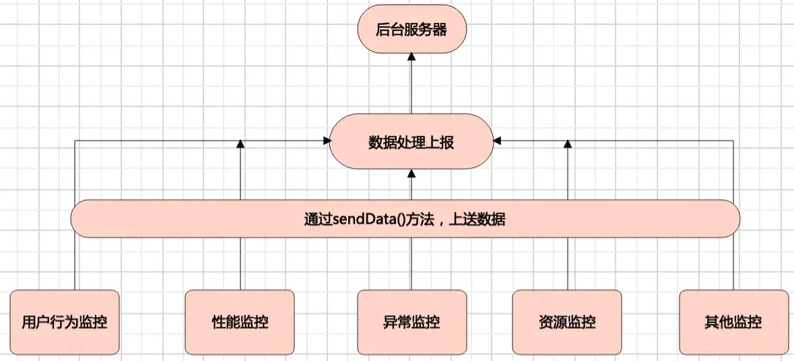

## 项目集

## 前端代码规范

> ```bash
> # 前端代码规范
> ## 1. 引用组件顺序
>     - 先引用外部组件库, 再引用当前组件块级组件, 然后是 common 里的公共函数库最后是 css 样式
>     import * as React from 'react'
>     import { Dropdown, Menu, Icon } from 'antd'
>     import Header from './Header'
>     import toast from 'common/toast'
>     import './index.less'
> 
> 
> ## 2. 数组、对象
>     对象属性名不需要加引号；
>     对象以缩进的形式书写，不要写在一行；
>     数组最后不要有逗号。
>     对象最后要有逗号
> 
> 
> ## 3. 命名规范
>     类名: 大驼峰式风格，字母和数字，例如：AbcTest。禁止汉字、特殊符号，禁止非大驼峰式风格。
>     函数名: 小驼峰式风格，字母和数字，例如：abcTest。禁止汉字、特殊符号，禁止非小驼峰式风格，例如snake_case等。
>     变量名: 同函数名。
>     常量: 全大写风格，大写字母、数字和下划线，单词之间以下划线分隔，例如：ABC_TEST。禁止汉字、特殊符号、小写字母。
>     使用 onXxx 形式作为 props 中用于回调的属性名称。
>         interface IProps {
>           onClose?: () => void;
>           onOk?: (item: Record<string, any>) => void;
>         }
>     组件内的事件函数使用 handle 开头尾，handleCheckBtn。
>     使用 withXxx 形式的词作为高阶组件的名称。
>     接口命名前面带上 I 表示 interface：interface IProps {}
> 
> 
> ## 4. interface声明顺序
>     日常用到比较多的是四种，只读参数放第一位，必选参数第二位，可选参数次之，不确定参数放最后
>         interface iProps {
>           readonly x: number;
>           readonly y: number;
>           name: string;
>           age: number;
>           height?: number;
>           [propName: string]: any;
>         }
> 
> 
> ## 5. ts好用的相关工具泛型
>     - Record<string,any> 用这个来声明对象结构的类型
>     - Partial 作用是将传入的属性变为可选项
>     - Readonly 作用是将传入的属性变为变成只读
>     - Required 的作用是将传入的属性变为必选项
> 		- keyof 提取键名
>         interface iPeople { name: string; age: number }
>         type T = keyof iPeople // -> "name" | "age"
>      - in
>          type Keys = "a" | "b"
>          type Obj =  { [p in Keys]: any } // -> { a: any, b: any }
> 
> 
> ## 6. 其他规范
>     不要使用 var 声明变量
>     不会被修改的变量使用 const 声明
>     去除声明但未被引用的代码
>     禁止在代码里使用 debug
>     不允许有空的代码块
> 
> 
> ## 7. 数据格式转换
>     - 把字符串转整型可以使用+号
>         let maxPrice = +form.maxPrice.value
>         let maxPrice = Number(form.maxPrice.value)
>     - 转成 boolean 值用!!
>         let mobile = !!ua.match(/iPhone|iPad|Android|iPod|Windows Phone/)
> 
> 
> ## 8. 组件嵌套过深
> 		组件一般不要超过三层,最多四层,层级过深可能会导致数据传递过深，在做一些颗粒度比较细的操作时，处理起来较为繁琐，可以使用 redux 等状态管理工具替代。
> 
> ## 9. 同时开发，数据请求 api 目录 git 冲突目录方案
>     在 api 目录下新建一个目录，目录对应一级 tab,这个目录内放置一个 index.js ，最后把二级 tab 组件所使用的 api 请求都在这个 index.js 内引入。
> 
> 
> ## 10. 业务代码里面的异步请求需要 try catch
>     - ajax 请求，使用 try catch，错误提示后端返回,并且做一些失败后的状态操作例如进入列表页，我们需要一个 loading 状态，然后去请求数据,可是失败之后，也需要把 loading 状态去掉,把 loading 隐藏的代码就写在 finally 里面
>         getStudentList = async () => {
>           try {
>             this.setState({
>               loading: true,
>               isEmpty: false,
>             })
>             await getStudentList({})
>           } catch (e) {
>             // TODO
>             console.log(e)
>           } finally {
>             //  失败之后的一些兜底操作
>             this.setState({
>               loading: false,
>               isEmpty: true,
>             })
>           }
>         }
> 
> 
> ## 11. setState有三种用法
>       // 对象
>       this.setState({ a: 300 })
>       // 函数，一般是用于在setState之前做一些操作
>       this.setState(
>         () => {
>           // TODO
>           console.log('')
>           return {
>             a: 300
>           }
>         }
>       )
>       // 第二个参数，一般是用于在setState之后做一些操作
>       this.setState({
>         a:300
>       }, () => {
>         // TODO
>       })
> 
> 
> ## 12. setState可能是同步的
>     setState 在react里的合成事件和钩子函数中是“异步”的。
>     setState 在原生事件和 setTimeout 中是同步的。
> 
> 
> ## 13. 在 componentWillUnmount 里面去除副作用的函数
>     清除 EventListener
>     中止数据请求
>     清除定时器
> 
> 
> ## 14. 防止 xss 攻击
>     input，textarea 等标签，不要直接把 html 文本直接渲染在页面上,使用 xssb 等过滤之后再输出到标签上
>         import { html2text } from 'xss';
>         render(){
>           <div
>             dangerouslySetInnerHTML={{
>               __html: html2text(htmlContent)
>             }}
>           />
>         }
> 
> 
> ## 15. 如果需要优化 react 性能（一般用不到）
>     - 如果组件的 state 和 props 都是简单类型，可以继承 PureComponent 而不是 Component
>         import { PureComponent } from 'react';
>         class Message extends PureComponent {
>           render() {
>             return <span>{this.state.message}</span>;
>           }
>         }
>     - 重写 shouldComponentUpdate 方法,在 shouldComponentUpdate 里面根据 state,props 是否有改变来判断是否需要重新渲染.如果组件继承了 PureComponent 就没必要再重写 shouldComponentUpdate 方法
>         import { isReactPropsEqual, isReactStateEqual } from '@fe/common/lib/equal';
>         shouldComponentUpdate(nextProps:IProps, nextState:IState) {
>             if (isReactStateEqual(nextState,this.state) && isReactPropsEqual(nextProps,this.props)) {
>                 return false;
>             }
>             return true;
>         }
> 
> 
> ## 16. Event 事件对象类型
>     ClipboardEvent<T = Element> 剪贴板事件对象
>     DragEvent<T = Element> 拖拽事件对象
>     ChangeEvent<T = Element> Change 事件对象
>     KeyboardEvent<T = Element> 键盘事件对象
>     MouseEvent<T = Element> 鼠标事件对象
>     TouchEvent<T = Element> 触摸事件对象
>     WheelEvent<T = Element> 滚轮事件对象
>     AnimationEvent<T = Element> 动画事件对象
>     TransitionEvent<T = Element> 过渡事件对象
>         import { MouseEvent } from 'react'
>         interface IProps {
>           onClick(event: MouseEvent<HTMLDivElement>): void
>         }
> 
> 
> 
> ## 17. 使用私有属性取代state状态
>     - 对于一些不需要控制ui的状态属性，我们可以直接绑到this上， 即私有属性，没有必要弄到this.state上，不然会触发渲染机制，造成性能浪费 例如请求翻页数据的时候,我们都会有个变量。
>         // bad
>         state: IState = {
>           pageNo:1,
>           pageSize:10
>         }
>         // good 
>         queryParams:Record<string,any> = {
>           pageNo:1,
>           pageSize:10
>         }
> 
> 
> ## 18. 代码细粒度的思考
> 我们在写组件或者函数的的时候，工具函数和业务逻辑抽离，表单校验和业务抽离、事件函数和业务抽离，ajax和业务抽离。
> 例如有些页面是通过location.href跳转的，我们有些业务逻辑等都是放到didmountMount,但是后期改需求，可能要用react-router进行跳转，可能要改的逻辑就会很多了，所以函数抽离出来，需求更新就少改一点代码。
> 如果还不确定如何划分函数的细粒度，我有个建议。使用过两次以上的代码，要抽离组件或者函数，两次的可以不用
> 
> 
> ## 19. a标签安全问题
> 使用a标签打开一个新窗口过程中的安全问题。新页面中可以使用window.opener来控制原始页面。如果新老页面同域，那么在新页面中可以任意操作原始页面。如果是不同域，新页面中依然可以通过window.opener.location，访问到原始页面的location对象
> 在带有target="_blank"的a标签中，加上rel="noopener"属性。如果使用window.open的方式打开页面，将opener对象置为空。
>     var newWindow = window.open()
>     newWindow.opener = null
> 
> 
> ## 20. 使用 void 0 替代undefined
>     clearSessioin = () => {
>       req.session.userName = undefined
>       req.session.userName = void 0
>     }
> 
> 
> ## 21. 前端不要操作cookie
> 在做一些前后端鉴权的时候，后端应该开启domain,secure,httponly严格模式，禁止前端操作cookie，防止csrf攻击。
> 
> 
> ## 22. 不要使用renderXXX,要使用函数式组件
> 发现团队一些小伙伴为了减少render函数里面的代码量，会把一些元素拆分到函数里面。
> 		// bad
> 		const renderHeader = () => {
>       return (<div />)
>     }
>     // good
>     function RenderBody(props) =  {
>       return (<div />)
>     }
>     class Component extends React.Component<iProps, iState>{  
>       render () {
>         return(
>           <>
>             renderHeader()
>             <RenderBody />
>           </>
>         )
>       }
>     }
> 
> 
> ## 23. if else 等判断太多了，后期难以维护
>   if else 嵌套深看起来也不会太难受，难受的是，项目迭代久之后，自己都忘记曾经写过这些代码，而且类型多或者不确定有什么类型，是否后期还会加的情况下，改起来就非常复杂了，而且很容易踩坑和背锅。
>   用配置取代if嵌套，大概就是抽离一个config.ts出来，里面放一些配置。
>   例如你的业务代码里面，会根据不同url参数，代码会执行不同的逻辑.
>         /info?type=wechat&uid=123456&
>         const qsObj = qs(window.location.url)
>         const urlType = qsObj.type
>         // bad 
>         if (urlType === 'wechat') {
>             doSomeThing()
>         } else if () {
>             doSomeThing()
>         } else if () {
>             doSomeThing()
>         } else if () {
>             doSomeThing()
>         }
> 
>         // good  config.ts
>         const urlTypeConfig: Record<string, typeItem> = {
>           'wechat': { // key 就是对应的type
>             name: 'wechat', 
>             show: ['header', 'footer', 'wechat'] // 展示什么，可能是异步的
>             pession: ['admin'], // 权限是什么，可能是异步的
>           },
>           'zhifubao': { // key 就是对应的type
>             name: 'zhifubao', 
>             show: ['header', 'footer', 'zhifubao'] // 展示什么，可能是异步的
>             pession: ['admin'], // 权限是什么，可能是异步的
>           },
>         }
> 
>         // 业务逻辑
>         const qsObj = qs(window.location.url)
>         const urlType = qsObj.type
>         Object.keys(urlTypeConfig).forEach(item => {
>           if(urlType === item.type) {
>             doSomeThing(item.show)
>           }
>         })
> 
> 
> 
> ## 其他
> - input 输入框使用 trim()：`let searchContent = form.search.value.trim()`
> - 对于常用的属性进行缓存：`const { app } = this.props`
> - 使用 location 跳转前需要先转义：`window.location.href = redirectUrl + encodeURIComponent('?a=10&b=20')`
> - 在 React 中你不能通过返回 false 来阻止默认行为。必须明确调用 preventDefault 
> - for-in 中一定要有 hasOwnProperty 的判断（即禁止直接读取原型对象的属性）
> - 在组件中获取真实 dom：`this.inputRef = React.createRef()`
> 
> 
> ## 代码检查插件
> 我们可以使用构建工具继承 husky eslint tslint lint-stage prettier来规范代码。
>     eslint-config-prettier
>     eslint-plugin-prettier
>     eslint-plugin-react
>     tslint-react
>     tslint-plugin-prettier
>     tslint-config-prettier
>     团队开发工作流
> ```

### CSS架构之BEM设计模式

> ```bash
> ## CSS架构之 BEM 设计模式
> ### 为什么需要CSS架构？
> 在日常开发项目CSS，需要组件化时，组件内部的class样式类管理就非常的杂乱。 大部分公司的命名规则还是只有大小驼峰、使用英文等这些基础的命名规则。但经常会自己都忘了自己命名的css是啥，使用设计模式就能很好的解决该问题。
> CSS架构也能让html与css 更好的解耦，能更好的抽取样式中可复用的部分，使你的html代码更具语义，也符合了HTML5中想让日常开发更具有语义化的理念。了解这些设计模式无疑会使css代码更具模块化，块样式不依赖于页面上的其他元素，因此也较好的避免了遇到级联问题。多人协作的时候，也能高效避免命名重复问题。
> 
> 
> ### BEM
> BEM 全称 BlockElementModifier，是一个命名规定。通过 Block、Element、Modifier 来描述页面，通过 `_` 与 `--` 连接，BEM 主要是为了解决多人协作的CSS样式命名问题。
> BEM 可以获得更多的描述和更加清晰的结构，从其名字可以知道某个标记的含义。通过查看 HTML 代码中的 class 属性，就能知道元素之间的关联。
> 
> - B 代表模块：
>     - Block(块)，独立实体块，有独立的意义，每个页面都可以看做是多个 Block 组成。
>     - 没有前缀，多个单词用 `-` 连接，是对一个组件名抽象。
>     - `block {}`，block 代表了更高级别的抽象或组件。
>     
> - E 代表元素：
> 		- Element(元素)，block的一部分，没有独立意义，是组件下的一个元素，多个元素形成一个组件。
> 		- 元素在模块之后，可以有多个层级，以 `__` 连接。element 也不是死板的，是根据具体的需求演变的，中间也可以使用 `-` 来演变。
> 		- `block__element {}`，代表 `.block` 的后代，用于形成一个完整的 `.block` 的整体。
> 		
> - M 代表修饰符：
> 		- Modifier(修饰符)，block或element上的标记，是描述Block或Element的属性或状态，同一个Block或Element可以有多个Modifier。
> 		- 某元素、或者某模块特别的状态，必须有一个状态名和状态值，使用 `--` 链接。
> 		- 主要针对的是 Block 本身，是对于Block做修饰。例如有：颜色、大小、用途。
> 		- `block--modifirer {}`，代表 `.block` 的不同状态或不同版本。
> 
> - 注意：
> 		- 使用两个连字符和下划线而不是一个是为了让你自己的块可以用单个连字符来界定。如：
> 				- `sub-block__element {}`
> 				- `sub-block--modifier {}`
> 
> 
> ### 传统的命名规范 & BEM命名方法
> 传统的命名规范：该写法从 DOM 结构和类命名上可以了解每个元素的意义，但无法明确其真实的层级关系。在 css 定义时，也必须依靠层级选择器来限定约束作用域，以避免跨组件的样式污染。
> BEM 命名方法：通过 BEM 命名方式，模块层级关系简单清晰，而且 css 书写上也不必作过多的层级选择。
> 
> 
> 
> ### 使用 BEM 的好处
> - 使html代码更具语义
> - 使css代码更具模块化
> - 多人协作的时候，也能高效避免命名重复问题
> - 更加的规范规模化
> - 减轻CSS命名烦恼
> 
> 
> ### 什么时候使用
> 使用 BEM 的诀窍是，你要知道什么时候哪些东西是应该写成 BEM 格式的。并不是每个地方都应该使用 BEM 命名方式。当需要明确关联性的模块关系时，应当使用 BEM 格式。比如只是一条公共的单独的样式，就没有使用 BEM 格式的意义。
> 		.hide {
>         display: none !important;
>     }
> 
> 
> ### 搭配CSS预处理器进行使用
> BEM 的一个槽点是，命名方式长而难看，书写不雅。相比 BEM 格式带来的便利来说，我们应客观看待。而且，一般来说会使用通过 LESS/SASS 等预处理器语言来编写 CSS，利用其语言特性书写起来要简单很多。
> 
> 
> ### 在流行框架的组件中使用 BEM 格式
> 在当前流行的 Vue.js / React / Angular 等前端框架中，都有 CSS 组件级作用域的编译实现，其基本原理均为利用 CSS 属性选择器特性，为不同的组件生成不同的属性选择器。
> 当你选择了这种局部作用域的写法时，在较小的组件中，BEM 格式可能显得没那么重要。但对于公共的、全局性的模块样式定义，还是推荐使用 BEM 格式。
> 另外，对于对外发布的公共组件来说，一般为了风格的可定制性，都不会使用这种局部作用域方式来定义组件样式。此时使用 BEM 格式也会大显其彩。
> 
> 
> ### 注意要点
> 避免 .block__el1__el2 的格式
> 在深层次嵌套的 DOM 结构下，应避免过长的样式名称定义。
> ```
>
> #### 模块Block
>
> ```html
>  //一个普通列表的a标签
>  <li><a class='li-a'>...</a></li>
>  
>  //一个在导航栏的a标签
>  <li><a class='nav-li-a'></a></li>
>  
>  //一个被选中的在导航栏的a标签
>  <li><a class='nav-li-a is-active'></a></li>
>  
>  //一个在头部的图片
>  <header>
>     
>  </header>
> ```
>
> #### 元素Element
>
> ```html
> <li class="nav--main__item  js-nav--main__item"><a>...</a></li>
> <li class="nav--main__item  js-nav--main__item"><a>...</a></li>
> <li class="nav--main__item  js-nav--main__item"><a>...</a></li>
> 
> //几个普通列表的a标签
> <li>
>   <a class='li-a__item'>...</a>
>   <a class='li-a__item'>...</a>
>   <a class='li-a__item'>...</a>
> </li>
> 
> //几个在导航栏的a标签
> <li>
>   <a class='nav-li-a__item'></a>
>   <a class='nav-li-a__item'></a>
>   <a class='nav-li-a__item'></a>
> </li>
> 
> ```
>
> #### 修饰Modifier
>
> ```html
>  //一个用作logo的图片
>  <header>
>     
>  </header>
> 
> ```
>
> ```html
> <!-- 传统的命名规范 -->
> <div class="article">
>   <div class="body">
>     <button class="button-primary"></button>
>     <button class="button-success"></button>
>   </div>
> </div>
> 
> ```
>
> ### sass中使用
>
> ```scss
>.article {
>   max-width: 1200px;
> 
>   &__body {
>     padding: 20px;
>   }
> 
>   &__button {
>     padding: 5px 8px;
> 
>     &--primary {background: blue;}
>     &--success {background: green;}
>   }
> }
> ```

## 公用配置

> ```bash
> ## 常用文件夹目录
> | —— docs 文档目录
> | —— src 项目目录
> |		| —— assets 资源目录
> |		|		|	—— images 图片目录
> |		|		|	—— videos 音频目录
> |		| —— components 组件目录
> |		| —— pages 页面组件
> |		| —— stores 状态管理工具相关文件
> |		| —— models typescript类或接口
> |		| —— utils/styles 全局样式主题等
> 
> 
> ## 删除无用文件和内容
> pulic/mainifest.json 是用来做 PWA 的，不搞 PWA 可以删除
> 修改 public/index.html 中的首页标题
> App.scss 中的内容可以全部删除
> src/logo.svg 可以删除
> 删除 App.tsx 的无用代码
> cra 生成的默认 README.md 中的内容也全删除，加入自己的项目描述。
> 
> ```
>
> 

#### Storybook 

> ```bash
> Story 存储一个 UI 组件的渲染状态，你可以给一个组件写多个 story 来描述组件不同的状态。比如按钮组件 （Button）
> 
> 
> ## 安装
> npx sb init
> pnpm run storybook
> ```


## 懒人记账 lazy-bookkeeping

### 参考

> ```bash
> ## 懒人记账简单版
> https://juejin.cn/post/7169044991175000077?share_token=1faf3236-0f38-4498-bc71-584657184678
> https://github.com/dingsheng1214/ds-cash-frontend.git
> https://github.com/dingsheng1214/ds-cash-backend.git
> 
> 
> ## 项目初期引用技术构思
> 1. react 框架主体
> 2. ts 数据类型检测
> 3. mockjs 模拟数据
> 4. mobx 全局数据
> 5. fetch 数据请求
> 6. webpack 框架构建打包工具
> 7. G2 数据可视化
> ```
>

### 项目初始化

> ```bash
> ## 全局安装脚手架
> $ cnpm i -g create-react-app
> 
> ## 创建项目
> $ pnpm create vite lazy-bookkeeping -- --template react-ts
> 
> 
> ## 配置 typescript
> $ pnpm i typescript @types/node @types/react @types/react-dom @types/jest -D -w
> 
> 
> ## 配置 scss 
> $ pnpm i sass-loader node-sass -w -S
> 
> ## 添加 nvmrc
> $ node -v > .nvmrc
> 
> 
> ## eslint & prettier
> $ pnpm i eslint @typescript-eslint/parser @typescript-eslint/eslint-plugin -D  -w
> $ pnpm i eslint-plugin-react eslint-plugin-react-hooks eslint-plugin-import -D  -w
> $ pnpm i prettier eslint-config-prettier eslint-plugin-prettier -w -D
> 
> 
> ## eslint 自动校验
> $ pnpm i vite-plugin-eslint vite-plugin-checker -D -w
> 	在vite.config.ts中配置
>       import eslintPlugin from 'vite-plugin-eslint'
>       import checker from 'vite-plugin-checker'
>       export default defineConfig({
>           plugins: [
>             eslintPlugin({
>               cache: false, // 禁用 eslint 缓存
>             }),
>             /* eslint自动校检 */
>             checker({
>               eslint: {
>                 lintCommand: 'eslint "./src/**/*.{ts,jsx,tsx,js}"',
>               },
>             }),
>           ],
>       })
> 
> 
> ## stylelint
> $ pnpm install -D -w stylelint stylelint-config-standard stylelint-config-standard-scss 
> $ pnpm install -D -w postcss postcss-scss postcss-html
> $ pnpm i -D -w  stylelint-config-rational-order stylelint-config-prettier stylelint-order stylelint-declaration-block-no-ignored-properties
> $ pnpm install -D -w stylelint-config-standard-vue stylelint-config-prettier-scss
> 	在 .stylelintrc.cjs 中配置
>       {
>           "extends": [
>             "stylelint-config-standard",
>             "stylelint-config-rational-order",
>             "stylelint-config-prettier"
>           ],
>           "plugins": ["stylelint-order", "stylelint-declaration-block-no-ignored-properties"],
>           "rules": {
>               "comment-empty-line-before": null,
>               "function-name-case": ["lower"],
>               "no-invalid-double-slash-comments": null,
>               "no-descending-specificity": null,
>               "declaration-empty-line-before": null
>           },
>             "ignoreFiles": []
>       }
> 
> 
> ## husky
> $ pnpm i husky lint-staged -D -w
> 	在 package.json 中配置
>     "lint-staged": {
>       "packages/**/*.{js,jsx,ts,tsx,json,css,scss,md}": [
>           "prettier --single-quote --write",
>           "git add"
>       ],
>       "packages/**/*.css": "stylelint",
>       "packages/**/*.scss": "stylelint --syntax=scss"
>     },
> 
> 
> ## commitlint
> $ cnpm i -g commitizen
> $ pnpm i -D -w @commitlint/cli @commitlint/config-conventional
> 
> 
> ## mockjs
> pnpm i mockjs -w
> pnpm i vite-plugin-mock -D -w
> pnpm i cross-env -D -w
> ```
>

## 音乐播放器 music-player

### 开发目录

> ```bash
> | —— hooks 工具函数
> |		| —— useTime 本地时间函数
> |		| —— useOnline 系统网络状态检测函数
> |		| —— useBattery 检测设备电池电量函数
> |		| —— useI18n 多语言函数
> |		| —— event 事件相关hooks
> |		|		|	—— useEventListener 间断性事件监听函数
> 
> | —— config 配置
> |		| —— constant 通用的常量配置
> |		| —— plugins 全局构建配置
> 
> | —— views
> |		| —— system 系统相关页
> 
> |		| —— artist 歌手详情
> |		| —— playlist 歌曲详情列表
> |		| —— mv mv详情
> |		| —— video 视频详情
> |		| —— dj 电台详情
> 
> |		| —— discover 推荐模块
> 
> |		| —— musicHall 音乐馆模块
> |		|		|	—— picked 精选
> |		|		|	—— category 分类歌单
> 
> |		| —— oneselfMusic 个人音乐模块
> |		|		|	—— oneselfLoveMusic 个人喜欢
> |		|		|	—— localMusic 本地歌曲
> |		|		|	—— downloadMusic 下载歌曲
> |		|		|	—— recentlyMusic 最近播放
> 
> |		| —— demo 案例模块
> |		|		|	—— Excel excel表格导入导出模块
> |		|		|	—— Zip 压缩包Zip生成 & 下载导出
> |		|		|	—— CopyText 复制文本
> |		|		|	—— Qrcode 生成二维码
> |		|		|	—— Cropper 图片裁剪
> |		|		|	—— Dragger 拖拽组件
> |		|		|	—— Editor 富文本编辑器
> |		|		|	—— Barrage 视频 & 弹幕
> |		|		|	—— Dashboard 仪表盘（echart）
> |		|		|	—— Lottery 抽奖
> |		|		|	—— LazyLoading 懒加载
> |		|		|	—— Communication 组件通信
> |		|		|	—— CssEffects css特效
> |		|		|		|	—— Lantern 灯笼动画
> |		|		|		|	—— HeartSwitch 心形开关
> |		|		|	—— ParticleAnimation 粒子动画
> |		|		|		|	—— ParticlePicture 图片粒子化
> |		|		|		|	—— ParticleCountdown 粒子动画倒计时
> ```

### 开发进度

> ```bash
> # 开发参考
> ## 网易云开源后端 API 接口
> https://github.com/Binaryify/NeteaseCloudMusicApi
> https://binaryify.github.io/NeteaseCloudMusicApi/#/
> 
> ## 前端源码参考
> https://juejin.cn/post/7074062428249522207
> https://github.com/SmallRuralDog/vue3-music.git
> 
> 
> # 开发进度
> ## 尚未完成
> - 底部下载等功能的实现
> - 登录功能实现
> - 专辑评论发表，嵌套子评论内容，热门评论，专辑分页
> - 歌单页面头部数据调整
> - 视频页
> - 个人模块
> - 打包后 http 请求问题，需要配置多后端请求（vite代理为何打包后不行）
> - 详情页图片懒加载
> - 工作台 & 大屏看板
> - 动态路由
> - 视频控制器
> 	- 记录播放时间，刷新页面可进入上次播放的时间
> - 视频弹幕实现
> - 转盘抽奖
> 
> 
> ## 项目优化
> - 整合 vite 构建文件
> - defineOptions()自定义组件name属性（unplugin-vue-define-options）
> - 自动化部署 & 自动化打包发布
> - 单元测试
> - 提交规范
> 
> 
> # 已完成
> ## 项目优化
> - 整合 main 入口配置文件 √
> 
> ## 页面布局 - 头部
> - 锁屏功能 √
> - 国际多语言 vue-i18n@next √
> - 屏幕缩放功能 √
> - 主题配置 √
> - 头部搜索框点击跳转相应歌曲页面 √
> - 登录功能：二维码扫码登录 √
> 
> ## 统合功能
> - 评论查看功能 √
> - 加载更多功能 √
> 
> ## 推荐
> - 轮播图 √
> - 推荐歌单 √
> - 推荐新音乐 √
> - 推荐MV √
> 
> ## 音乐馆
> - 分类歌单 √
> - 精选（独家放送 & 推荐电台） √
> - 排行榜（官方榜 & 特色榜） √
> 
> 
> ## 经验总结
> - 使用 Pinia 是为了让数据持久化，即使页面销毁，只要该站点不刷新，就不需要重新请求数据，减少了请求负担
> ```

### 开发问题

#### vue使用CSS插件scss时代码报红

> ```bash
> ## 问题描述
> vue使用CSS插件scss时代码报红，样式引用没问题，但样式代码报红
> （虽运行没有问题，但报红会影响阅读体验）
> 
> ## 解决方案
> 1.打开 vscode 左上角的文件 -> 首选项 -> 设置 
> 2.进入setting.json文件修改
> 3.修改setting.json文件
> 	- 把文件中的"files.associations"中的"*.vue"的值改成"vue"保存即可
> ```
>
> #### 错误报红
>
> 
>
> #### 解决方案
>
> 
>
> 2.进入setting.json文件修改
> 打开设置以后如下图所示，我们只需要点击右上角的这个小图标就可以进入setting.json文件
>
> 
>
> 3.修改setting.json文件
> 把文件中的"files.associations"中的"*.vue"的值改成"vue"保存即可
>
> #### 解决结果
>
> 如图所示，可以看到样式代码不会爆红了，问题解决
>
> 

### 0. 项目初始化

> ```bash
> ## 使用pnpm做包管理
> npm i -g pnpm
> 
> ## 创建项目（注意vite项目要求node版本需14.8+）
> pnpm create vite music-player --template vue-ts
> ```

### 1.集成配置

> 1. **为保证 node 的使用**
>
> ```sh
> pnpm i @types/node --save-dev
> ```
>
> 2. **修改 `vite.config.js`**
>
> ```js
> import { defineConfig } from 'vite';
> import vue from '@vitejs/plugin-vue';
> import * as path from 'path';
> 
> export default defineConfig({
>     resolve: {
>         //设置别名
>         alias: {
>             '@': path.resolve(__dirname, 'src')
>         }
>     },
>     plugins: [vue()],
>     server: {
>         port: 8080, //启动端口
>         hmr: {
>             host: '127.0.0.1',
>             port: 8080
>         },
>         // 设置 https 代理
>         proxy: {
>             '/api': {
>                 target: 'your https address',
>                 changeOrigin: true,
>                 rewrite: (path) => path.replace(/^\/api/, '')
>             }
>         }
>     }
> });
> ```

### 2.集成 eslint

>#### 安装
>
>```bash
>pnpm i eslint eslint-plugin-vue --save-dev
>npx eslint --init
>```
>
>#### 命令行初始化eslint文件
>
>```bash
># 选择 帮我们找到不规范的语法，并且强制应用代码规范
>? How would you like to use ESLint? …
>To check syntax only
>To check syntax and find problems
>❯ To check syntax, find problems, and enforce code style
>
>
># 选择 (import/export)代码规范（ES6 代码规范）
>? What type of modules does your project use? …
>❯ JavaScript modules (import/export)
>CommonJS (require/exports)
>None of these
>
>
># 选择 项目中使用的前端框架
>? Which framework does your project use? …
>React
>❯ Vue.js
>None of these
>
>
># 是否验证 ts 代码规范
>? Does your project use TypeScript? › No / Yes
>√ Yes
>	 No
>
>
># 代码的运行环境是 浏览器/node
>? Where does your code run? …  (Press <space> to select, <a> to toggle all, <i> to invert selection)
>✔ Browser
>✔ Node
>
>
># 选择一个流行的代码规范
>? How would you like to define a style for your project? …
>❯ Use a popular style guide
>Answer questions about your style
>Inspect your JavaScript file(s)
>
>
># 选择 Standard 代码规范
>? Which style guide do you want to follow? …
>Airbnb: https://github.com/airbnb/javascript
>❯ Standard: https://github.com/standard/standard
>Google: https://github.com/google/eslint-config-google
>XO: https://github.com/xojs/eslint-config-xo
>
>
># ESLint配置文件 代码的保存格式
>? What format do you want your config file to be in? …
>❯ JavaScript
>YAML
>JSON
>
>
># 是否同意开始安装
>? Would you like to install them now with npm? › No / Yes
>√ Yes
>	 No
>...
>Successfully created .eslintrc.js file
>```
>
>#### 创建配置文件： `.eslintrc.cjs`
>
>```js
>// "off" or 0 - 关闭这个规则校验
>// "warn" or 1 - 开启这个规则校验，但只是提醒，不会退出
>// "error" or 2 - 开启这个规则校验，并退出
>
>module.exports = {
>    root: true,
>    env: {
>        browser: true,
>        es2021: true,
>        node: true,
>        es6: true,
>    },
>    parserOptions: {
>        ecmaVersion: 'latest',
>        sourceType: 'module',
>    },
>    extends: [
>        'eslint:recommended',
>        'plugin:vue/vue3-recommended',
>        'prettier',
>        // 'plugin:vue/recommended',
>        // 'plugin:prettier/recommended',
>        'plugin:vue/vue3-essential',
>        '@vue/standard',
>        '@vue/typescript/recommended',
>    ],
>    overrides: [],
>    plugins: ['vue'],
>    globals: {
>        document: false,
>        navigator: false,
>        window: false,
>    },
>    rules: {
>        'eslint-disable-next-line': 0,
>        'eslint-disable': 0,
>        'no-console': process.env.NODE_ENV === 'production' ? 'warn' : 'off',
>        'no-debugger': process.env.NODE_ENV === 'production' ? 'warn' : 'off',
>        'vue/multi-word-component-names': 'off',
>        'comma-dangle': ['off', 'always'],
>        quotes: 'off',
>        semi: 'off',
>    },
>}
>```
>
>#### 创建忽略文件：`.eslintignore`
>
>```.eslintignore
>node_modules/
>dist/
>index.html
>```
>
>#### 命令行式运行：修改 `package.json`
>
>```json
>{
>  ...
>  "scripts": {
>    ...
>    "eslint:comment": "使用 ESLint 检查并自动修复 src 目录下所有扩展名为 .js 和 .vue 的文件",
>    "eslint": "eslint --ext .js,.vue --ignore-path .gitignore --fix src",
>  }
>  ...
>}
>```
>
>#### 开启实时校验
>
>```bash
>## 原因：
>eslint默认是通过执行命令校验，也就是 npm run lint才检验，开发和构建验证是在 浏览器渲染时候校验并抛出异常
>
>## 安装：
>npm install vite-plugin-eslint --save-dev 
>
>
>## 编辑vite.config.ts文件
>import eslintPlugin from 'vite-plugin-eslint'
>
>	plugins: [
>		...
> 		eslintPlugin({
> 			cache: false // 禁用 eslint 缓存
>		})
>	]
>```
>
>

### 3.集成 prettier

>#### 安装
>
>```shell
>pnpm i prettier eslint-config-prettier eslint-plugin-prettier --save-dev
>```
>
>#### 创建配置文件： `prettier.config.cjs` 或 `.prettierrc.cjs`
>
>```js
>module.exports = {
>  // 一行最多 80 字符
>  printWidth: 80,
>  // 使用 2 个空格缩进
>  tabWidth: 2,
>  // 不使用 tab 缩进，而使用空格
>  useTabs: false,
>  // 行尾需要有分号
>  semi: true,
>  // 使用单引号代替双引号
>  singleQuote: true,
>  // 对象的 key 仅在必要时用引号
>  quoteProps: 'as-needed',
>  // jsx 不使用单引号，而使用双引号
>  jsxSingleQuote: false,
>  // 末尾使用逗号
>  trailingComma: 'all',
>  // 大括号内的首尾需要空格 { foo: bar }
>  bracketSpacing: true,
>  // jsx 标签的反尖括号需要换行
>  jsxBracketSameLine: false,
>  // 箭头函数，只有一个参数的时候，也需要括号
>  arrowParens: 'always',
>  // 每个文件格式化的范围是文件的全部内容
>  rangeStart: 0,
>  rangeEnd: Infinity,
>  // 不需要写文件开头的 @prettier
>  requirePragma: false,
>  // 不需要自动在文件开头插入 @prettier
>  insertPragma: false,
>  // 使用默认的折行标准
>  proseWrap: 'preserve',
>  // 根据显示样式决定 html 要不要折行
>  htmlWhitespaceSensitivity: 'css',
>  // 换行符使用 lf
>  endOfLine: 'auto'
>}
>```
>
>#### 修改 `.eslintrc.js` 配置
>
>```js
>module.exports = {
>  ...
>  extends: [
>    'eslint:recommended',
>    'plugin:vue/vue3-recommended',
>    'prettier',
>    'plugin:prettier/recommended'
>  ],
>  ...
>};
>```
>
>#### 命令行式运行：修改 `package.json`
>
>```json
>{
>  ...
>  "scripts": {
>    ...
>       "prettier:comment": "自动格式化当前目录下的所有文件",
>       "prettier": "prettier --write"
>     }
>  ...
>}
>```

### 4.集成 pinia

>Pinia 读音：['piːnə]，是 Vue 官方团队推荐代替`Vuex`的一款轻量级状态管理库。
>
>**Pinia 有如下特点：**
>
>- 完整的 typescript 的支持；
>- 足够轻量，压缩后的体积只有1.6kb;
>- 去除 mutations，只有 state，getters，actions（这是我最喜欢的一个特点）；
>- actions 支持同步和异步；
>- 没有模块嵌套，只有 store 的概念，store 之间可以自由使用，更好的代码分割；
>- 无需手动添加 store，store 一旦创建便会自动添加；
>
>#### 安装
>
>```shell
>pnpm i pinia --save
>```
>
>#### 使用
>
>1. 新建 src/store 目录并在其下面创建 index.js，导出 store
>
>```js
>import { createPinia } from 'pinia'
>
>const store = createPinia()
>
>export default store
>```
>
>#### 在 main.js 中引入并使用
>
>```js
>import { createApp } from 'vue'
>import App from './App.vue'
>import store from './store'
>
>// 创建vue实例
>const app = createApp(App)
>
>// 挂载pinia
>app.use(store)
>
>// 挂载实例
>app.mount('#app');
>```
>
>#### **定义State**： 在 src/store 下面创建一个 user.js
>
>```js
>import { defineStore } from 'pinia'
>
>export const useUserStore = defineStore({
>   id: 'user', // id必填，且需要唯一
>   state: () => {
>     return {
>       name: '张三'
>     }
>   },
>   actions: {
>     updateName(name) {
>       this.name = name
>     }
>   }
>})
>```
>
>#### 获取State： 在 src/components/usePinia.vue 中使用
>
>```js
><template>
> <div>{{ userStore.name }}</div>
></template>
>
><script setup>
>import { useUserStore } from '@/store/user'
>
>const userStore = useUserStore()
></script>
>```
>
>#### 修改State：
>
>```js
>// 1. 直接修改 state （不建议）
>userStore.name = '李四'
>
>// 2. 通过 actions 去修改
><script setup>
>import { useUserStore } from '@/store/user'
>
>const userStore = useUserStore()
>userStore.updateName('李四')
></script>
>```

### 5.集成 vue-router4

>#### 安装
>
>```shell
>pnpm i vue-router --save
>```
>
>#### 使用
>
>新建 src/router 目录并在其下面创建 index.js，导出 router
>
>```js
>import { createRouter, createWebHistory } from 'vue-router';
>
>const routes = [
>  {
>    path: '/login',
>    name: 'Login',
>    meta: {
>         title: '登录',
>         keepAlive: true,
>         requireAuth: false
>    },
>    component: () => import('@/pages/login.vue')
>  },
>  {
>     path: '/',
>     name: 'Index',
>     meta: {
>           title: '首页',
>           keepAlive: true,
>           requireAuth: true
>     },
>     component: () => import('@/pages/index.vue')
>  }
>]
>
>const router = createRouter({
>  history: createWebHistory(),
>  routes
>});
>export default router;
>```
>
>在 main.js 中引入并使用
>
>```js
>import { createApp } from 'vue'
>import App from './App.vue'
>import store from './store'
>import router from '@/router';
>
>// 创建vue实例
>const app = createApp(App);
>
>app.use(router);
>
>// 挂载实例
>app.mount('#app');
>```
>
>修改 App.vue
>
>```vue
><template>
>	<RouterView/>
></template>
>```

### 6. 集成 vueuse

>- VueUse 是一个基于 Composition API 的实用函数集合。
>- useMouse 只是 vueuse 的一个最基本的函数库，更多函数官方文档：[链接](https://link.juejin.cn?target=https%3A%2F%2Fvueuse.org%2F)
>- 安装：`pnpm i @vueuse/core`
>
>#### 使用
>
>1. 创建一个新的 src/pages/vueUse.vue 页面来做一个简单的 demo
>
>```vue
><template>
><h1>测试 vueUse 的鼠标坐标</h1>
><h3>Mouse: {{ x }} x {{ y }}</h3>
></template>
>
> <script>
>   import { defineComponent } from 'vue';
>  import { useMouse } from '@vueuse/core';
>
>  export default defineComponent({
>    name: 'VueUse',
>    setup() {
>      const { x, y } = useMouse();
>
>       return {
>         x,
>         y,
>      };
>     },
>   });
> </script>
> ```
> 

### 7. CSS 的集成

>#### 方案一：原生 css variable 新特性
>
>- 原生支持，不需要第三方插件，具体使用文档可 [查看](https%3A%2F%2Fdeveloper.mozilla.org%2Fzh-CN%2Fdocs%2FWeb%2FCSS%2Fvar)
>- 注：还可以增加 PostCSS 配置，(任何受 [postcss-load-config](https%3A%2F%2Fgithub.com%2Fpostcss%2Fpostcss-load-config) 支持的格式，例如 postcss.config.js )，它将会自动应用于所有已导入的 CSS。
>
>```css
>:root {
>  --main-bg-color: pink;
>}
>
>body {
>  background-color: var(--main-bg-color);
>}
>```
>
>### 方案二：scss或less
>
>安装
>
>```shell
># .scss and .sass
>pnpm add -D sass
>
># .less
>pnpm add -D less
>```

### 8. 集成 axios

>`axios` 是一个基于 promise 的 HTTP 库，可以用在浏览器和 node.js 中。
>
>#### 安装
>
>```shell
>pnpm i axios
>```
>
>#### 使用
>
>```js
>/** src/utils/axios.js */
>import axios from 'axios';
>
>const service = axios.create({
>  baseURL: 'http://127.0.0.1:7777/',
>  timeout: 120000 // request timeout
>});
>
>// 请求拦截器
>service.interceptors.request.use(
>  (config) => {
>    // do something
>    return config;
>  },
>  (error) => {
>    Promise.reject(error);
>  }
>);
>
>// 响应拦截器
>service.interceptors.response.use(
>  async (response) => {
>    // do something
>     return response.data
>   },
>  (error) => {
>    // do something
>     return Promise.reject(error);
>   }
>);
>
>export default service;
>```
>
>```vue
><!-- 在相应的页面中调用 -->
><script lang="ts">
>  import request from '@/utils/axios';
>  const requestRes = async () => {
>    let result = await request({
>      url: '/api/xxx',
>      method: 'get'
>    });
>  }
></script>
>```
>
>### 封装请求参数和响应数据的所有 api (可选项)
>
>```js
>/** src/api/index.js */
>import * as login from './module/login';
>import * as index from './module/index';
>
>export default Object.assign({}, login, index);
>```
>
>新建 src/api/module/login.js 和 src/api/module/index.js
>
>```js
>import request from '@/utils/axios';
>
>/**
>* 登录
>*/
>export const login = (username, password) => {
>  return request({
>    url: '/api/auth/login',
>    method: 'post',
>     data: {
>       username,
>       password
>     }
>   });
> };
> ```
> 
>在 src/pages/request.vue 页面中使用
>
>```vue
><script setup lang="ts">
>  import API from '@/api';
>
>  const requestRes = async () => {
>    let result = await API.login('zhangsan', '123456');
>  }
></script>
> ```

### 9. css 的 UI 样式库

>**注意：UI 库一般需要按需引入（下面以 element-plus 为例）**
>
>#### 安装 `vite-plugin-style-import`
>
>```sh
>pnpm i vite-plugin-style-import --save-dev
>```
>
>#### 修改 vite.config.js
>
>```js
>...
>import styleImport from 'vite-plugin-style-import'
>
>
>export default defineConfig({
>  ...
>  plugins: [
>       vue(),
>       styleImport({
>           libs: [
>             {
>               libraryName: 'element-plus',
>               esModule: true,
>               resolveStyle: (name) => {
>                 return `element-plus/lib/theme-chalk/${name}.css`;
>               },
>               ensureStyleFile: true // 忽略文件是否存在, 导入不存在的CSS文件时防止错误。
>             }
>           ]
>       })
>  ],
>  ...
>})
>```

### 10. 使用 commitizen 规范git提交

>为了使团队多人协作更加的规范，所以需要每次在 git 提交的时候，做一次硬性规范提交，规范 git 的提交信息
>
>### 安装 commitizen (交互式提交 + 自定义提示文案 + Commit规范)
>
>#### 安装
>
>```bash
>pnpm install -D commitizen cz-conventional-changelog @commitlint/config-conventional @commitlint/cli commitlint-config-cz cz-customizable
>```
>
>#### 配置 `package.json`
>
>```json
>{
>  ...
>  "scripts": {
>    "commit:comment": "引导设置规范化的提交信息",
>    "commit":"git-cz",
>  },
>
>  "config": {
>    "commitizen": {
>      "path": "./node_modules/cz-customizable"
>    }
>  },
>  ...
>}
>```
>
>#### 新增配置 `commitlint.config.cjs`
>
>```js
>module.exports ={
>  extends: ['@commitlint/config-conventional', 'cz'],
>  rules: {
>    'type-enum': [
>      2,
>      'always',
>      [
>        'feature', // 新功能（feature）
>        'bug', // 此项特别针对bug号，用于向测试反馈bug列表的bug修改情况
>        'fix', // 修补bug
>        'ui', // 更新 ui
>        'docs', // 文档（documentation）
>        'style', // 格式（不影响代码运行的变动）
>        'perf', // 性能优化
>        'release', // 发布
>        'deploy', // 部署
>        'refactor', // 重构（即不是新增功能，也不是修改bug的代码变动）
>        'test', // 增加测试
>        'chore', // 构建过程或辅助工具的变动
>        'revert', // feat(pencil): add ‘graphiteWidth’ option (撤销之前的commit)
>        'merge', // 合并分支， 例如： merge（前端页面）： feature-xxxx修改线程地址
>        'build', // 打包
>      ],
>    ],
>    // <type> 格式 小写
>    'type-case': [2, 'always', 'lower-case'],
>    // <type> 不能为空
>    'type-empty': [2, 'never'],
>    // <scope> 范围不能为空
>    'scope-empty': [2, 'never'],
>    // <scope> 范围格式
>    'scope-case': [0],
>    // <subject> 主要 message 不能为空
>    'subject-empty': [2, 'never'],
>    // <subject> 以什么为结束标志，禁用
>    'subject-full-stop': [0, 'never'],
>    // <subject> 格式，禁用
>    'subject-case': [0, 'never'],
>    // <body> 以空行开头
>    'body-leading-blank': [1, 'always'],
>    'header-max-length': [0, 'always', 72],
>  },
>};
>```
>
>#### 自定义提示则添加 `.cz-config.js`
>
>```js
>module.exports = {
>  types: [{
>    value: 'feature',
>    name: 'feature:  增加新功能'
>  },
>          {
>            value: 'bug',
>            name: 'bug:      测试反馈bug列表中的bug号'
>          },
>          {
>            value: 'fix',
>            name: 'fix:      修复bug'
>          },
>          {
>            value: 'ui',
>            name: 'ui:       更新UI'
>          },
>          {
>            value: 'docs',
>            name: 'docs:     文档变更'
>          },
>          {
>            value: 'style',
>            name: 'style:    代码格式(不影响代码运行的变动)'
>          },
>          {
>            value: 'perf',
>            name: 'perf:     性能优化'
>          },
>          {
>            value: 'refactor',
>            name: 'refactor: 重构(既不是增加feature，也不是修复bug)'
>          },
>          {
>            value: 'release',
>            name: 'release:  发布'
>          },
>          {
>            value: 'deploy',
>            name: 'deploy:   部署'
>          },
>          {
>            value: 'test',
>            name: 'test:     增加测试'
>          },
>          {
>            value: 'chore',
>            name: 'chore:    构建过程或辅助工具的变动(更改配置文件)'
>          },
>          {
>            value: 'revert',
>            name: 'revert:   回退'
>          },
>          {
>            value: 'build',
>            name: 'build:    打包'
>          }
>         ],
>  // override the messages, defaults are as follows
>  messages: {
>    type: '请选择提交类型:',
>    customScope: '请输入您修改的范围(可选):',
>    subject: '请简要描述提交 message (必填):',
>    body: '请输入详细描述(可选，待优化去除，跳过即可):',
>    footer: '请输入要关闭的issue(待优化去除，跳过即可):',
>    confirmCommit: '确认使用以上信息提交？(y/n/e/h)'
>  },
>  allowCustomScopes: true,
>  skipQuestions: ['body', 'footer'],
>  subjectLimit: 72
>};
>```
>
>#### 交互界面测试
>
>
>

### 11. 安装 husky

>- 到目前只是规范了 git 的提交信息，我们对提交前代码的检查还没有做到位，例如 ESLint、Prettier，而 husky 可以规范提交。
>
>1. 安装
>
>```shell
># 1.安装
>pnpm i husky lint-staged -D
>
># 2.生成 .husky 的文件夹
>npx husky install
>
># 3.添加 hooks，会在 .husky 目录下生成一个 pre-commit 脚本文件
>npx husky add .husky/pre-commit "npx --no-install lint-staged"
>
># 4.添加 commit-msg
>npx husky add .husky/commit-msg 'npx --no-install commitlint --edit "$1"'
>
># 5. 使用 `git commit -m "message"` 就会看到 hook 生效了。
>```
>
>2. 添加配置 `package.json`
>
>```json
>{
>  ...
>  "lint-staged": {
>    "*.{js,ts}": [
>      "npm run eslint",
>      "npm run prettier"
>    ]
>  }
>  ...
>}
>```

### 12. 集成 stylelint

> ```bash
> pnpm install -D stylelint stylelint-config-standard stylelint-config-standard-scss 
> pnpm install -D postcss postcss-scss postcss-html
> pnpm install -D stylelint-config-standard-vue stylelint-config-prettier-scss
> ```
>
> #### 自定义配置格式化 `.stylelintrc.json`
>
> ```json
> {
>   "extends": [
>       "stylelint-config-standard",
>       "stylelint-config-prettier"
>   ],
>   "rules": {
>       "function-no-unknown": null,
>       "selector-class-pattern": null,
>       "selector-pseudo-class-no-unknown": [
>          true,
>          {
>            "ignorePseudoClasses": [
>              "global"
>            ]
>          }
>       ],
>       "selector-pseudo-element-no-unknown": [
>          true,
>          {
>            "ignorePseudoElements": [
>              "v-deep"
>            ]
>          }
>       ],
>       "at-rule-no-unknown": [
>          true,
>          {
>            "ignoreAtRules": [
>              "tailwind",
>              "apply",
>              "variants",
>              "responsive",
>              "screen",
>              "function",
>              "if",
>              "each",
>              "include",
>              "mixin"
>            ]
>          }
>       ],
>       "no-empty-source": null,
>       "string-quotes": null,
>       "named-grid-areas-no-invalid": null,
>       "unicode-bom": "never",
>       "no-descending-specificity": null,
>       "font-family-no-missing-generic-family-keyword": null,
>       "declaration-colon-space-after": "always-single-line",
>       "declaration-colon-space-before": "never",
>       "rule-empty-line-before": [
>          "always",
>          {
>            "ignore": [
>              "after-comment",
>              "first-nested"
>            ]
>          }
>       ],
>       "unit-no-unknown": [
>          true,
>          {
>            "ignoreUnits": [
>              "rpx"
>            ]
>          }
>       ],
>       "indentation": "tab",
>       "declaration-empty-line-before": "never",
>       "block-closing-brace-empty-line-before": "never",
>       "max-empty-lines": 1,
>       "block-no-empty": true,
>       "no-invalid-double-slash-comments": true
>   },
>   "overrides": [
>       {
>          "files": [
>            "*.vue",
>            "**/*.vue"
>          ],
>          "customSyntax": "postcss-html",
>          "extends": [
>            "stylelint-config-standard-scss",
>            "stylelint-config-prettier-scss"
>          ]
>       },
>       {
>          "files": [
>            "*.scss",
>            "**/*.scss"
>          ],
>          "customSyntax": "postcss-scss",
>          "extends": [
>            "stylelint-config-standard-scss",
>            "stylelint-config-prettier-scss"
>          ]
>       }
>   ]
> }
> ```
>
> #### 配置vscode自动格式化css
>
> 配置项配置好之后。需要修改编辑器来支持保存代码自动格式化css/scss文件。 我这里用的是vscode编辑器。关键配置项"source.fixAll.stylelint":true
>
> ```json
> ···
> "editor.codeActionsOnSave": {
>    "source.fixAll.eslint": true,
>    "source.fixAll.stylelint":true 
> }
> ···
> ```

### 13. vite配置 `vite.config.ts`

> vite不会检测本地eslint和ts报错。需要安装插件或者自己写插件来实现此功能。
>
> 我在项目里面用到了vite-plugin-checker这个插件做检查
>
> ```shell
> pnpm add vite-plugin-checker -D
> ```
>
> #### vite.config.ts
>
> ```ts
> import checker from 'vite-plugin-checker'
> 
> export default defineConfig({
> 	plugins: [
> 		···
> 		checker({
> 			vueTsc: true,
> 			eslint: {
> 				lintCommand: 'eslint "./src/**/*.{ts,vue}"'
> 			}
> 		}),
>        ···
>      ]
> )}
> ```
>
> #### vite 配置别名
>
> > 注意这里不能使用require的方式导入path
>
> ```ts
> import { join } from 'path'
> export default defineConfig({
>     ···
> 		resolve: {
> 		    alias: [
>           {
>             find: '@',
>             replacement: join(__dirname, 'src')
>           }
> 		    ]
> 	  }
>     ···
> )}
> ```
>
> #### css预处理器导入
>
> > additionalData这里对应自己项目内的预处理器文件位置、注意单双引号和封号的位置
>
> ```ts
> import { join } from 'path'
> export default defineConfig({
> 	css: {
> 		preprocessorOptions: {
> 			scss: {
> 				additionalData: '@import "src/styles/var.scss";'
> 			}
> 		}
> 	}
> )}
> ```

### 14. 配置 tailwindcss

> ```bash
> ## 安装依赖
> pnpm i -D tailwindcss@latest postcss@latest autoprefixer@latest
> 
> ## 生成配置文件
> npx tailwindcss init
> 
> 在一个css文件中导入如下包，并引入到 main.ts中
> @import "tailwindcss/base";
> @import "tailwindcss/components";
> @import "tailwindcss/utilities";
> ```
>
> #### tailwind.config.cjs
>
> ```cjs
> /** @type {import('tailwindcss').Config} */
> module.exports = {
>   content: [
>      './index.html',
>      './src/**/*.{vue,js,ts,jsx,tsx}',
>   ],
>   // darkMode: false, // or 'media' or 'class'
>   theme: {
>   },
>   plugins: [],
> }
> ```

### 15.  集成 mockjs

> ````shell
> pnpm i  mockjs vite-plugin-mock rollup
> pnpm i cross-env -D
> ````
>
> #### `package.json`配置script > dev
>
> ```json
> "dev": "cross-env NODE_ENV=development vite"
> ```
>
> #### vite.config.ts
>
> ```js
> import { viteMockServe } from 'vite-plugin-mock'
> 
> plugins: [vue(),viteMockServe({mockPath: './mock'})],
> 
> supportTs: true, // 是否用了ts，可以根据自己选择`true` or `false`
> ```
>
> #### 在与`node_modules`同级目录建立mock目录
>
> 目录下建立mock文件 `user.ts`
>
> ```js
> import { MockMethod } from 'vite-plugin-mock'
> export default [
>  {
>      url: '/api/getUser',
>      method: 'get',
>      response: () => {
>          console.log('body>>>>>>>>')
>          return {
>              code: 0,
>              message: 'ok',
>              data: ['aa', 'bb']
>          }
>      }
>  }
> ] as MockMethod[]
> ```
>
> #### 代码请求
>
> ```js
> axios.get('/api/getUser').then(res => {
>      console.log(res)
> })
> ```

### 16.  配置国际化插件 vue-i18n

> ```bash
> ## 安装
> pnpm i vue-i18n@next
> 
> ## 创建语言文件和目录结构
> 1. 在 src 下创建 locales 目录
> 2. 在 locales 下创建语言配置文件：zh-cn.ts 和 en.ts
> 3. 在 locales 下创建 index.ts 文件
> 4. 在 main.ts 入口创建实例并挂载到app上
> ```
>
> ### 在locales文件夹下配置中英文模板
>
> ```ts
> /** locales/zh-cn.ts */
> export default {
>   common:{
>     more:'查看更多'
>   },
>   menus:{
>     '/':'首页',
>     Home:'首页',
>     home:'首页',
>     About:'关于',
>     about:'关于',
>   },
> }
> ```
>
> ```ts
> /** locales/en-us.ts */
> export default {
>   common:{
>     more:'More'
>   },
>   menus:{
>     '/':'home',
>     Home:'Home',
>     home:'home',
>     About:'About',
>     about:'about',
>     },
> }
> ```
>
> ```ts
> /** locales/index.ts */
> import { createI18n } from 'vue-i18n'
> 
> // element-plus 中的语言配置
> import elementEnLocale from 'element-plus/lib/locale/lang/en'
> import elementZhLocale from 'element-plus/lib/locale/lang/zh-cn'
> 
> // 自己的语言配置
> import enLocale from './en'
> import zhLocale from './zh-cn'
> 
> // 语言配置整合
> const messages = {
>   en:{
>     ...enLocale,
>     ...elementEnLocale
>   },
>   'zh-cn':{
>     ...zhLocale,
>     elementZhLocale
>   }
> }
> 
> // 创建 i18n
> const i18n = createI18n({
>   legacy: false,
>   globalInjection:true,  // 全局模式，可以直接使用 $t
>   locale: 'zh-cn',
>   messages: messages
> })
> 
> export default i18n
> ```
>
> ### main.ts  在入口文件中创建i18n实例并挂载
>
> ```ts
> /** main.ts */
> import { createApp } from 'vue'
> import App from './App.vue'
> 
> import i18n from './locales/index'
> 
> const app = createApp(App)
> 
> async function setupApp() {
>   app.use(i18n)
>   app.mount('#app')
> }
> 
> setupApp()
> ```
>
> ### 中英文切换demo
>
> ```vue
> <template>
>   <div @click="changeLanguage">
> 		<span :class="{'active':state.curLanguage === 'en'}">EN</span>
>     <span :class="{'active':state.curLanguage === 'zh-cn'}">CN</span>
> 	</div>
> </template>
> 
> <script setup lang='ts'>
> import { reactive } from 'vue'
> import { useI18n } from 'vue-i18n'
> 
> const { locale } = useI18n()
> 
> const state = reactive({
>   curLanguage: 'zh-cn',
> })
> 
> const changeLanguage = () => {
>   state.curLanguage = state.curLanguage === 'zh-cn' ? 'en' : 'zh-cn'
>   locale.value = state.curLanguage
> }
> </script>
> ```
>
> ### 在vue中使用
>
> ```vue
> // 配置了全局
> <div>{{$t('menu.home')}}</div>
> 
> 
> // 未配置全局
> <div>{{t('menu.home')}}</div>
> 
> <script lang="ts" setup>
> // 需要引入 t
> import { useI18n } from 'vue-i18n'
> const { t } = useI18n()
> </script>
> ```
>
> ### 在ts中使用
>
> ```vue
> <script lang="ts" setup>
> import i18n from '@/locales/index'
> 
> const t = i18n.global.t
> const menuHome = { name: t('menus.home') }
> </script>
> ```

### 17. setup 中声明组件名

> ````bash
> ## 安装
> pnpm i unplugin-vue-define-options -D
> pnpm i unplugin-vue-macros -D
> 
> 
> ## 在vite.config.ts中配置
> import DefineOptions from 'unplugin-vue-define-options/vite'
> import Vue from '@vitejs/plugin-vue'
> export default defineConfig({
> 	plugins: [Vue(), DefineOptions()],
> })
> 
> 
> ## 在tsconfig.json中添加一个配置
> {
>     "compilerOptions": {
>      	"types": ["unplugin-vue-define-options/macros-global"]
>     }
> }
> 
> 
> ## vue中使用
> <script setup lang="ts">
>   defineOptions({
>     name: 'App'
>   })
> </script>
> ````
>
> **第二种方法**：新增加一个script标签，在这个标签中写入name属性
>
> ```vue
> <template>
> <button>demo</button>
> </template>
> 
> <script lang="ts">
> export default {
> 	name: "TButton",
> };
> </script>
> 
> <script lang="ts" setup>
> </script>
> ```
>
> **第三种方法**：使用defineComponent
>
> ```vue
> <template>
> <div> </div>
> </template>
> 
> <script lang="ts">
> import { defineComponent } from 'vue';
> 
> export default defineComponent({
> 	name: 'TButton',
> });
> </script>
> ```

### 18. 日期时间格式化插件  dayjs

> ```bash
> ## 插件安装
> pnpm i dayjs -S
> ```

### 19. 打包解析插件

> ```bash
> ## 问题（打包时因使用 await 而无法继续打包问题）
> 不引入该插件，会导致显示如下错误而导致无法进行打包：
> `ssets/main.3ecd3ccb.js:89046:16: ERROR: Top-level await is not available in the configured target environment ("es2020" + 2 overrides)`
> 
> ## 错误原因
> 「ECMAScript」提案 Top-level await 由 Myles Borins 提出，它可以让你在模块的最高层中使用 await 操作符。在这之前，你只能通过在 async 函数或 async generators 中使用 await 操作符。Top-level await 是个新特性，打包不支持此特性。
> 
> 
> ## 解决方案
> 1. 引入 vite-plugin-top-level-await 插件
> 		pnpm i vite-plugin-top-level-await -D
> 
> 2. 在vite.config.js配置此插件
>     import topLevelAwait from 'vite-plugin-top-level-await'
>     export default defineConfig({
>       plugins: [
>         topLevelAwait({
>           // The export name of top-level await promise for each chunk module
>           promiseExportName: '__tla',
>           // The function to generate import names of top-level await promise in each chunk module
>           promiseImportName: i => `__tla_${i}`
>         })
>       ]
>     });
> ```

### 20. Excel表格插件xlsx

> ```bash
> ## Excel插件安装
> 	pnpm i -S xlsx file-saver
> 
> ## 后期参考 excel.js
> https://github.com/exceljs/exceljs/blob/HEAD/README_zh.md#%E7%9B%AE%E5%BD%95
> 
> 
> ## 导出excel的逻辑：
> excel整个表格专业名词是workbook，里面每张表格是sheet
> 页面引入xlsx的库，https://unpkg.com/xlsx/dist/xlsx.core.min.js
> 把数据生成sheet，var sheet = XLSX.utils.json_to_sheet(jsonData)，json_to_sheet是将由对象组成的数组转化成sheet，当然还有 aoa_to_sheet将一个二维数组转成sheet 和 table_to_sheet将table的dom直接转成sheet
> 创建虚拟的workbook，var wb = XLSX.utils.book_new()
> 把sheet添加到workbook里，XLSX.utils.book_append_sheet(wb, sheet, "这里是sheetName");
> 把workbook转成blob，var blob = workbook2blob(wb)，这里workbook2blob需要手动写啦，下面会贴代码
> 利用a标签和createObjectURL实现下载功能，openDownloadDialog(blob, 'excel的标题.xlsx');
> ```
>
> ```ts
> import * as XLSX from 'xlsx'
> 
> function workbook2blob (workbook) {
>     const wbout = XLSX.write(workbook, {
>        // 要生成的文件类型
>        bookType: 'xlsx',
>        // 是否生成Shared String Table，官方解释是，如果开启生成速度会下降，但在低版本IOS设备上有更好的兼容性
>        bookSST: false,
>        type: 'binary',
>     })
>     // 将字符串转ArrayBuffer
>     function s2ab (s) {
>        const buf = new ArrayBuffer(s.length)
>        const view = new Uint8Array(buf)
>        for (let i = 0; i !== s.length; ++i) view[i] = s.charCodeAt(i) & 0xff
>        return buf
>     }
>     const blob = new Blob([s2ab(wbout)], {
>        type: 'application/octet-stream',
>     })
>     return blob
> }
> 
> // 将blob对象创建bloburl，然后用a标签实现弹出下载框
> function openDownloadDialog (blob, fileName) {
>     if (typeof blob === 'object' && blob instanceof Blob) {
>        blob = URL.createObjectURL(blob) // 创建blob地址
>     }
>     const aLink = document.createElement('a')
>     aLink.href = blob
>     // HTML5新增的属性，指定保存文件名，可以不要后缀，注意，有时候 file:///模式下不会生效
>     aLink.download = fileName || ''
>     let event
>     if (window.MouseEvent) event = new MouseEvent('click')
>     //   移动端
>     else {
>        event = document.createEvent('MouseEvents')
>        event.initMouseEvent(
>          'click',
>          true,
>          false,
>          window,
>          0,
>          0,
>          0,
>          0,
>          0,
>          false,
>          false,
>          false,
>          false,
>          0,
>          null,
>        )
>     }
>     aLink.dispatchEvent(event)
> }
> 
> // 用的例子
> const sheet1data = [
>     { department: '行政部', count: 2 },
>     { department: '前端部', count: 2 },
> ]
> const sheet2data = [
>     { name: '张三', do: '整理文件' },
>     { name: '李四', do: '打印' },
> ]
> const sheet3data = [
>     { name: '张大人', do: 'vue' },
>     { name: '李大人', do: 'react' },
> ]
> const sheet1 = XLSX.utils.json_to_sheet(sheet1data)
> const sheet2 = XLSX.utils.json_to_sheet(sheet2data)
> const sheet3 = XLSX.utils.json_to_sheet(sheet3data)
> 
> /* create a new blank workbook */
> const wb = XLSX.utils.book_new()
> XLSX.utils.book_append_sheet(wb, sheet1, '部门统计')
> XLSX.utils.book_append_sheet(wb, sheet2, '行政部')
> XLSX.utils.book_append_sheet(wb, sheet3, '前端部')
> const workbookBlob = workbook2blob(wb)
> openDownloadDialog(workbookBlob, `部门统计.xlsx`)
> ```

### 21.富文本编辑器 wangeditor

> ```bash
> ## 安装依赖包
> pnpm i -S @wangeditor/editor @wangeditor/editor-for-vue@next
> 
> ## 官网
> https://www.wangeditor.com/v5/getting-started.html
> ```
>
> #### 封装组件
>
> ```vue
> <script lang="ts" setup>
>   import '@wangeditor/editor/dist/css/style.css' // 引入 css
>   import { Editor, Toolbar } from '@wangeditor/editor-for-vue'
>   import { onBeforeUnmount, computed, shallowRef } from 'vue'
> 
>   const props = defineProps<{
>     /** 内容 HTML  */
>     modelValue: string
>   }>()
>   const emits = defineEmits(['update:modelValue'])
>   const valueHtml = computed({
>     get: () => (props.modelValue === '' ? '<p>hello</p>' : props.modelValue),
>     set: (newVal) => emits('update:modelValue', newVal),
>   })
> 
>   type InsertFnType = (url: string, poster: string) => void
>   const editorConfig = {
>     placeholder: '请输出内容...', // 配置默认提醒
>     MENU_CONF: {
>        /** 代码高亮 */
>        codeSelectLang: {
>            codeLangs: [
>              { text: 'CSS', value: 'css' },
>              { text: 'HTML', value: 'html' },
>              { text: 'XML', value: 'xml' },
>            ],
>        },
> 
>        /** 上传图片 */
>        uploadImage: {
>            // 小于该值就插入 base64 格局（而不上传），默认为 0
>            base64LimitSize: 10 * 1024 * 1024, // 10MB
>            maxFileSize: 1 * 1024 * 1024, // 单个文件的最大体积限度，默认为 2M
>            maxNumberOfFiles: 5, // 最多可上传几个文件，默认为 100
>            allowedFileTypes: ['image/*'], // 抉择文件时的类型限度，默认为 ['image/*'] 。如不想限度，则设置为 []
>        },
> 
>        /** 上传视频 */
>        uploadVideo: {
>            async customUpload (file: File, insertFn: InsertFnType) {
>              try {
>                const reader = new FileReader()
>                reader.onload = (event) => {
>                  insertFn(String(event?.target?.result), file.name)
>                           }
>                           reader.readAsDataURL(file)
>                } catch {
>                  insertFn('', file.name)
>                }
>              },
>          },
>       },
>     }
> 
>     // 编辑器实例，必须用 shallowRef
>     const editorRef = shallowRef()
> 
>     // 组件销毁时，也及时销毁编辑器
>     onBeforeUnmount(() => {
>       const editor = editorRef.value
>       if (editor == null) return
>       editor.destroy()
>     })
> 
>   /** 创立富文本编辑器 */
>   const handleCreated = (editor) => {
>     editorRef.value = editor
>   }
> </script>
> 
> <template>
>   <div style="border: 1px solid #ccc">
>      <Toolbar
>          style="border-bottom: 1px solid #ccc"
>          :editor="editorRef"
>          mode="default"
>      />
>      <Editor
>          v-model="valueHtml"
>          mode="default"
>          style="height: 20rem; overflow-y: hidden"
>          :default-config="editorConfig"
>          @on-created="handleCreated"
>      />
>   </div>
> </template>
> ```

### 22. 压缩文件 jszip

> ```bash
> ## 安装依赖包
> pnpm i -S jszip jszip-utils
> ```

#### 解压文件

> #### AJAX request
>
> ```js
> new JSZip.external.Promise((resolve, reject) => {
>   JSZipUtils.getBinaryContent('path/to/content.zip', (err, data) => {
>      if (err) {
>          reject(err);
>      } else {
>          resolve(data);
>      }
>   });
> }).then((data) => {
>   return JSZip.loadAsync(data);
> }).catch(err => throw(err))
> ```
>
> #### 本地文件
>
> 首先所用的浏览器需要支持 FileReader API，那么你就可以通过 FileReader API 来读取本地文件
>
> ```js
> <input type="file" id="file" name="file" multiple
> onchange={(evt)=>{
>    const files = evt.target.files;
>    for (let i = 0; i < files.length; i++) {
>        JSZip.loadAsync(files[i]).then(zip => {
>          // 读取成功，zip为压缩文件内容对象
>          doSomethingWithSuccess(zip);
>        }, function (e) {
>          // 可能由于文件类型不匹配等原因读取失败
>          doSomethingWithError(e);
>        });
>    }
> }}
> />
> ```
>
> #### 读取出来的内容解析
>
> ```js
> JSZip.loadAsync(data).then(function (zip) {
>  // 文本格式的文件
>   zip.file("content.txt").async("string").then((content)=>{...});
>  // png jpg pdf 
>  zip.file("content.txt").async('uint8array').then((content)=>{...});
> }).then(function (text) {
>   console.log(text);
> });
> ```

#### 压缩文件

> 由于只有javascript，这部分不能在旧浏览器中工作，包括IE < 10。对于其他浏览器，可以采用下面的方法生成压缩文件并存储在本地，由于浏览器无法直接读写本地文件，所以通过浏览器下载的方式存储至本地。
>
> 适用于firefox, chrome, opera >= 15和IE >= 10(但不是在兼容性视图)。在较新的浏览器中最简单的方法是使用saveAs或polyfill，参见[FileSaver.js](https://link.juejin.cn?target=https%3A%2F%2Fgithub.com%2Feligrey%2FFileSaver.js)。 FileSaver 的适用范围：
>
> > 如果你需要保存比blob的大小限制更大的文件，或者没有足够的RAM，那么可以看看更高级的[StreamSaver.js](https://link.juejin.cn?target=https%3A%2F%2Fgithub.com%2Fjimmywarting%2FStreamSaver.js)，它可以使用新的流API将数据直接异步保存到硬盘驱动器。这将支持进度，取消，并知道何时完成。
>
> > FileSaver.js保存文件在客户端，很适合web应用程序在客户端生成文件,但是如果文件来自服务器，我们建议您先尝试使用附加附件响应头,因为它有更多的跨浏览器相容性。
>
> ```js
> import { saveAs } from 'file-saver';
> import JSZip from 'jszip'
> 
> let zip = new JSZip();
> zip.file("Hello.txt", "Hello world\n");
> 
> // 1) generate the zip file		2) trigger the download
> zip.generateAsync({type:"blob"}).then(blob => { 
>   saveAs(blob, "hello.zip");                   
> }).catch(err => {
>   throw(err)
> })
> ```
>
> #### Data URL
>
> 在IE中不工作，对长度有限制。
>
> ```js
> import JSZip from 'jszip'
> 
> let zip = new JSZip();
> zip.file("Hello.txt", "Hello world\n");
> // 1) generate the zip file		2) trigger the download
> zip.generateAsync({type:"base64"}).then(base64 => { 
>   window.location = "data:application/zip;base64," + base64;               
> }).catch(err => {
>   throw(err)
> })
> ```
>
> #### Downloadify
>
> [Downloadify](https://link.juejin.cn?target=https%3A%2F%2Fgithub.com%2Fdcneiner%2Fdownloadify)使用一个小的Flash SWF(SWF 文件是使用Flash软件生成的常见文件，会用于PPT插入等操作)来下载文件到用户的电脑，文件的文件名你可以选择。Doug Neiner添加了dataType选项，允许您通过zip文件进行下载。
>
> > swf仅供在线使用。从文件路径(即文件://)进行测试将不起作用，因为它将违反安全沙箱。
>
> ```js
> import JSZip from 'jszip'
> 
> let zip = new JSZip();
> zip.file("Hello.txt", "Hello world\n");
> zip.generateAsync({type:"base64"}).then(base64 => { 
>   Downloadify.create('downloadify',{
>     data: function(){
>       return base64;
>     },
>     dataType: 'base64'
>   });      
> }).catch(err => {
>   throw(err)
> })
> ```

#### 创建压缩包

> ### 读取文件并添加至zip文件中
>
> ```js
> // read a file and add it to a zip
> fs.readFile("picture.png", function(err, data) {
>    if (err) throw err;
>    var zip = new JSZip();
>    zip.file("picture.png", data);
> });
> 
> // or
> var contentPromise = new JSZip.external.Promise(function (resolve, reject) {
>    fs.readFile("picture.png", function(err, data) {
>        if (err) {
>          reject(e);
>        } else {
>          resolve(data);
>        }
>    });
> });
> zip.file("picture.png", contentPromise);
> 
> // read a file as a stream and add it to a zip
> var stream = fs.createReadStream("picture.png");
> zip.file("picture.png", stream);
> ```
>
> ### 将zip内容制成压缩包
>
> JSZip can generate Buffers so you can do the following :
>
> ```js
> var fs = require("fs");
> var JSZip = require("jszip");
> 
> var zip = new JSZip();
> // zip.file("file", content);
> // ... and other manipulations
> 
> zip
>   .generateNodeStream({type:'nodebuffer',streamFiles:true})
>   .pipe(fs.createWriteStream('out.zip'))
>   .on('finish', function () {
>   // JSZip generates a readable stream with a "end" event,
>   // but is piped here in a writable stream which emits a "finish" event.
>   console.log("out.zip written.");
> });
> ```
>
> ```js
> var fs = require("fs");
> var JSZip = require("jszip");
> 
> var zip = new JSZip();
> // zip.file("file", content);
> // ... and other manipulations
> 
> const zipContent = await zip.generateAsync({
>      //设置压缩格式，开始打包
>      type: 'nodebuffer', //nodejs用
>      compression: 'STORE', //压缩算法
>  });
> fs.writeFileSync(targetPath, zipContent);
> ```

#### demo

> ```vue
> <!--
>  * @ Author: willysliang
>  * @ Create Time: 2022-11-17 10:05:58
>  * @ Modified by: willysliang
>  * @ Modified time: 2022-11-18 17:59:09
>  * @ Description: 压缩文件下载组件
>  -->
> 
> <script lang="ts" setup>
> import { ref } from 'vue'
> import { ElMessage, ElNotification } from 'element-plus'
> import JSZip from 'jszip'
> import JSZipUtils from 'jszip-utils'
> import { saveAs } from 'file-saver'
> 
> type TableItemType = {
>   fileName: string
>   fileUrl: string
>   uploadTime: string
>   uploadUser: string
> }
> const tableData = ref<TableItemType[]>([
>   {
>     fileName: 'ava1.png',
>     fileUrl:
>       'https://cube.elemecdn.com/0/88/03b0d39583f48206768a7534e55bcpng.png',
>     uploadTime: '2021-07-02',
>     uploadUser: 'MrZip',
>   },
>   {
>     fileName: 'package.zip',
>     fileUrl: './test/package.zip',
>     uploadTime: '2021-07-01',
>     uploadUser: 'MrZip',
>   },
>   {
>     fileName: 'jszip.js',
>     fileUrl: './test/jszip.js',
>     uploadTime: '2021-07-02',
>     uploadUser: 'MrZip',
>   },
>   {
>     fileName: 'style.css',
>     fileUrl: './test/style.css',
>     uploadTime: '2021-07-03',
>     uploadUser: 'MrCss',
>   },
> ])
> 
> const downloadSelectZip = ref<JSZip>(new JSZip())
> const multipleSelection = ref<TableItemType[]>([] as TableItemType[])
> 
> /** 文件路径转化为数据流 */
> const urlToPromise = (url: string) =>
>   new Promise((resolve) => {
>     try {
>       JSZipUtils.getBinaryContent(url, (err: any, data: unknown) => {
>         if (err) {
>           resolve('')
>         } else {
>           resolve(data)
>         }
>       })
>     } catch {
>       resolve('')
>     }
>   })
> 
> /***
>  * @description 下载压缩文件
>  */
> const handleDownloadSelectFile = async () => {
>   if (multipleSelection.value.length < 1) {
>     ElMessage.warning('请先选择需要下载的文件')
>     return undefined
>   }
> 
>   try {
>     /** 循环把文件路径转化为数据流 */
>     for (let i = 0; i < multipleSelection.value.length; i++) {
>       const tempUrl = await urlToPromise(multipleSelection.value[i].fileUrl)
>       console.log(tempUrl)
>       downloadSelectZip.value.file(
>         multipleSelection.value[i].fileName,
>         tempUrl as ArrayBuffer | string,
>       )
>     }
> 
>     /** 计算下载文件进度 */
>     const blob = await downloadSelectZip.value.generateAsync(
>       { type: 'blob' },
>       (metadata) => {
>         percentage.value = metadata.percent
>       },
>     )
> 
>     /** 下载文件 */
>     saveAs(blob, 'example.zip')
>   } catch (err) {
>     ElNotification.error('下载压缩文件失败')
>   }
> }
> 
> /** 文件下载进度控制 */
> const percentage = ref<number>(0)
> const handleSelectionChange = (val: any) => {
>   if (percentage.value > 0) {
>     percentage.value = 0
>   }
>   multipleSelection.value = val
> }
> </script>
> 
> <template>
>   <!-- 下载压缩已上传文件的zip场景 -->
>   <el-row>
>     <el-col :offset="1" :span="22">
>       <el-card>
>         <el-row :gutter="10" class="mb-2">
>           <el-col :span="6" :offset="18">
>             <el-button type="success" plain @click="handleDownloadSelectFile">
>               下载 Zip (FileSaver API)
>               <el-tooltip
>                 effect="dark"
>                 :content="$t('demo.zip.zipDownloadTip')"
>                 placement="top-start"
>               >
>                 <el-icon><QuestionFilled /></el-icon>
>               </el-tooltip>
>             </el-button>
>           </el-col>
>         </el-row>
> 
>         <el-divider content-position="left">
>           下载压缩已上传文件的zip场景
>         </el-divider>
> 
>         <el-progress
>           :text-inside="true"
>           :stroke-width="15"
>           :percentage="percentage"
>           status="success"
>         />
> 
>         <el-table
>           :data="tableData"
>           tooltip-effect="dark"
>           style="width: 100%"
>           @selection-change="handleSelectionChange"
>         >
>           <el-table-column type="selection" width="55" />
>           <el-table-column prop="fileName" label="文件名称" />
>           <el-table-column prop="uploadTime" label="上传时间" />
>           <el-table-column
>             prop="uploadUser"
>             label="上传人"
>             show-overflow-tooltip
>           />
>         </el-table>
>       </el-card>
>     </el-col>
>   </el-row>
> </template>
> ```

### 23. 页面引导插件  driver.js

> ```bash
> ## 插件的 GitHub 地址
> https://github.com/kamranahmedse/driver.js
> https://kamranahmed.info/driver.js/#single-element-no-popover
> 
> ## 插件导入
> pnpm i -S driver.js
> ```
>
> ### 插件调用示例
>
> ```vue
> <script setup lang="ts">
>   import { ref } from 'vue'
>   import Driver from 'driver.js'
>   import 'driver.js/dist/driver.min.css'
> 
>   const steps: Array<Driver.Step> = [
>     {
>        element: '.header',
>        popover: {
>            title: 'Header',
>            description: '头部控制栏',
>            position: 'bottom',
>        },
>     },
>     {
>        element: '.menus',
>        popover: {
>            title: 'Menu',
>            description: '菜单选择',
>            position: 'right',
>        },
>     },
>     {
>        element: '.mains',
>        popover: {
>            title: 'Main',
>            description: '主内容区域',
>            position: 'left',
>        },
>     },
>     {
>        element: '.footer',
>        popover: {
>            title: 'Footer',
>            description: '底部音乐播放控制器',
>            position: 'top',
>        },
>     },
>   ]
> 
>   const driver = ref(
>     new Driver({
>        // className: 'scoped-class', // className to wrap driver.js popover
>        animate: true, // Animate while changing highlighted element
>        doneBtnText: '完成', // Text on the final button
>        closeBtnText: '关闭', // Text on the close button for this step
>        nextBtnText: '下一步', // Next button text for this step
>        prevBtnText: '上一步', // Previous button text for this step
>        keyboardControl: true, // Allow controlling through keyboard (escape to close, arrow keys to move)
>     }),
>   )
>   const handleShowGuide = () => {
>     driver.value.defineSteps(steps)
>     driver.value.start()
>   }
> </script>
> 
> <template>
> <el-tooltip placement="bottom">
>  <template #content>
>    <el-link
>      href="https://kamranahmed.info/driver.js/#single-element-no-popover"
>      type="success"
>      target="_blank"
>    >
>      driver.js
>    </el-link>
>  </template>
>  <el-button @click="handleShowGuide">展开引导</el-button>
> </el-tooltip>
> </template>
> ```

### 24. 图片裁剪插件  cropperjs

> ```bash
> ## 插件安装
> pnpm i -S cropperjs
> ```
>
> #### 文档说明
>
> ```bash
> ## 配置对象 （注意：第一个值为默认值）https://github.com/fengyuanchen/cropperjs/blob/main/README.md
> - viewMode 视图控制 0 | 1 | 2 | 3
>     0 无限制
>     1 限制裁剪框不能超出图片的范围
>     2 限制裁剪框不能超出图片的范围 且图片填充模式为 cover 最长边填充
>     3 限制裁剪框不能超出图片的范围 且图片填充模式为 contain 最短边填充
> - dragMode 拖拽图片模式 'crop' | 'move' | 'none'
>     crop 形成新的裁剪框
>     move 图片可移动
>     none 什么也没有
> - initialAspectRatio 裁剪框宽高比的初始值 0~1~n 默认与图片宽高比相同(只有在aspectRatio没有设置的情况下可用)
> - aspectRatio 设置裁剪框为固定的宽高比
> - data 之前存储的裁剪后的数据 在初始化时会自动设置 只有在autoCrop设置为true时可用
> - preview 预览 设置一个区域容器预览裁剪后的结果 
> 		Element, Array (elements), NodeList or String (selector)
> - responsive 在窗口尺寸调整后 进行响应式的重渲染 默认true
> - restore 在窗口尺寸调整后 恢复被裁剪的区域 默认true
> - checkCrossOrigin 检查图片是否跨域 默认true 如果是 会在被复制的图片元素上加上属性crossOrigin 并且在src上加上一个时间戳 避免重加载图片时因为浏览器缓存而加载错误
> - checkOrientation 检查图片的方向信息（仅JPEG图片有）默认true 在旋转图片时会对图片方向值做一些处理 以解决IOS设备上的一些问题
> - modal 是否显示图片和裁剪框之间的黑色蒙版 默认true
> - guides 是否显示裁剪框的虚线 默认true
> - center 是否显示裁剪框中间的 ‘+’ 指示器 默认true
> - highlight 是否显示裁剪框上面的白色蒙版 （很淡）默认true
> - background 是否在容器内显示网格状的背景 默认true
> - autoCrop 允许初始化时自动的裁剪图片 配合 data 使用 默认true
> - autoCropArea 设置裁剪区域占图片的大小 值为 0-1 默认 0.8 表示 80%的区域
> - movable 是否可以移动图片 默认true
> - rotatable 是否可以旋转图片 默认true
> - scalable 是否可以缩放图片（可以改变长宽） 默认true
> - zoomable 是否可以缩放图片（改变焦距） 默认true
> - zoomOnTouch 是否可以通过拖拽触摸缩放图片 默认true
> - zoomOnWheel 是否可以通过鼠标滚轮缩放图片 默认true
> - wheelZoomRatio 设置鼠标滚轮缩放的灵敏度 默认 0.1
> - cropBoxMovable 是否可以拖拽裁剪框 默认true
> - cropBoxResizable 是否可以改变裁剪框的尺寸 默认true
> - toggleDragModeOnDblclick 是否可以通过双击切换拖拽图片模式（move和crop）默认true 当拖拽图片模式为none时不可切换 该设置必须浏览器支持双击事件
> - minContainerWidth（200）、minContainerHeight（100）、minCanvasWidth（0）、minCanvasHeight（0）、minCropBoxWidth（0）、minCropBoxHeight（0） 容器、图片、裁剪框的 最小宽高 括号内为默认值 注意 裁剪框的最小高宽是相对与页面而言的 并非相对图片
> 
> 
> ## 方法：（注意：如果方法没有被设置返回任何值，那么它会返回一个cropper的实例 因此多个方法可以使用链式写法）
> crop() 手动显示裁剪框
> reset() 重置图片和裁剪框为初始状态
> replace(url[, hasSameSize]) 替换图片路径并且重建裁剪框
> url 新路径
> hasSameSize 默认值false 设置为true表示新老图片尺寸一样 只需要更换路径无需重建裁剪框
> enable() 解冻 裁剪框
> disable() 冻结 裁剪框
> destroy() 摧毁裁剪框并且移除cropper实例
> move(offsetX[, offsetY]) 移动图片指定距离 一个参数代表横纵向移动距离一样
> moveTo(x[, y]) 移动图片到一个指定的点 一个参数代表横纵向移动距离一样
> zoom(ratio) 缩放 ratio大于零是放大 小于零缩小
> zoomTo(ratio[, pivot]) 缩放并设置中心点的位置
> rotate(degree) 旋转 类似css
> rotateTo(degree) 旋转到绝对角度
> scale(scaleX[, scaleY])、scaleX(scaleX)、scaleY(scaleY) 缩放 一个参数代表横纵向缩放值一样
> getData([rounded]) 返回裁剪区域基于原图片!原尺寸!的位置和尺寸 rounded默认为false 表示是否显示四舍五入后的数据 有了这些数据可以直接在原图上进行裁剪显示
> setData(data) 改变裁剪区域基于原图的位置和尺寸 仅当viewMode 不为0时有效
> getContainerData()、getImageData()、getCanvasData()、setCanvasData(data)、getCropBoxData()、setCropBoxData(data) 容器、图片容器（画布）、图片、裁剪区域相对容器的数据设置和获取
> getCroppedCanvas([options]) 得到被裁剪图片的一个canvas对象 options设置这个canvas的一些数据
> width、height、minWidth、minHeight、maxWidth、maxHeight、fillColor、imageSmoothingEnabled（图片是否是光滑的 默认true）、imageSmoothingQuality（图片的质量 默认low 还有medium、high）
> setAspectRatio(aspectRatio) 改变裁剪区域的宽高比
> setDragMode([mode]) 设置拖拽图片模式
> 
> 
> ## 事件
> ready 渲染前（图片已经被加载、cropper实例已经准备完毕）的准备工作事件
> cropstart、cropmove、cropend、crop 开始画裁剪框（或画布）、画裁剪框（或画布）的中途、裁剪框（或画布）画完、进行裁剪事件 event.detail.originalEvent、event.detail.action
> 当autoCrop为true crop事件会在ready之前触发
> zoom 裁剪框缩放事件
> ```
>
> ```vue
> <script setup lang="ts">
> import { onMounted, ref } from 'vue'
> import 'cropperjs/dist/cropper.css'
> import Cropper from 'cropperjs'
> import { avactor } from '@/assets/images'
> import { ElMessage } from 'element-plus'
> import IconPark from '@comp/common/IconPark.vue'
> import {
>   AddPicture,
>   Save,
>   Refresh,
>   FriendsCircle,
>   ZoomIn,
>   ZoomOut,
>   Redo,
>   Undo,
>   AutoHeightOne,
>   AutoWidthOne,
> } from '@icon-park/vue-next'
> 
> const image = ref()
> const imageSrc = ref<any>(avactor)
> const cropper = ref<Cropper>()
> 
> /** 挂载 Cropper 实例 */
> onMounted(() => {
>   cropper.value = new Cropper(image.value, {
>     viewMode: 0,
>     dragMode: 'move',
>     background: true,
>     preview: '.preview',
>     autoCropArea: 1,
>     checkOrientation: true,
>     zoomOnWheel: true,
>     center: true,
>   })
> })
> 
> /** 打开文件 */
> const fileRef = ref()
> const openFile = () => {
>   fileRef.value.dispatchEvent(new MouseEvent('click'))
> }
> const chooseImage = (): boolean => {
>   const inputFile = fileRef.value.files[0]
>   if (inputFile) {
>     if (!/(gif|png|jpg|jpeg)$/i.test(inputFile.type)) {
>       ElMessage.warning('上传头像图片只能是gif|png|jpg|jpeg 格式!')
>       return false
>     }
>     const reader = new FileReader()
>     reader.readAsDataURL(inputFile)
>     reader.onload = (ev: ProgressEvent<FileReader>) => {
>       imageSrc.value = ev?.target?.result ?? ''
>       cropper.value?.replace(String(ev?.target?.result || ''))
>     }
>     return true
>   }
>   return false
> }
> 
> /** 保存 */
> const handleSave = () => {
>   const dataURLtoBlob = (dataurl: string) => {
>     const arr = dataurl.split(',')
>     const mime = arr[0]?.match(/:(.*?);/)?.[1]
>     const bstr = window.atob(arr[1])
>     let n = bstr.length
>     const u8arr = new Uint8Array(n)
>     while (n--) {
>       u8arr[n] = bstr.charCodeAt(n)
>     }
>     return new Blob([u8arr], { type: mime })
>   }
> 
>   const downloadFile = (url: string, name = 'defaultFileName') => {
>     const a = document.createElement('a')
>     a.setAttribute('href', url)
>     a.setAttribute('download', name)
>     a.setAttribute('target', '_blank')
>     const clickEvent = document.createEvent('MouseEvents')
>     clickEvent.initEvent('click', true, true)
>     a.dispatchEvent(clickEvent)
>   }
> 
>   const downloadFileByBase64 = (base64: string, name: string | undefined) => {
>     const myBlob = dataURLtoBlob(base64)
>     const myUrl = URL.createObjectURL(myBlob)
>     downloadFile(myUrl, name)
>   }
> 
>   const getCutImg = (): string => {
>     return (
>       cropper.value
>         ?.getCroppedCanvas({
>           imageSmoothingQuality: 'high', // 图片质量
>         })
>         .toDataURL() || ''
>     ) // 设置图片格式
>   }
> 
>   downloadFileByBase64(getCutImg(), 'cropImg')
> }
> 
> /** 处理后的图片 */
> // const cropImg = ref()
> const cropShotImg = ref()
> 
> /** 重做 */
> const handleReset = () => {
>   cropper.value?.reset()
> }
> 
> /** 快照 */
> const handleShot = () => {
>   cropShotImg.value = cropper.value
>     ?.getCroppedCanvas({
>       imageSmoothingQuality: 'high',
>     })
>     .toDataURL('image/jpeg')
> }
> 
> /** 缩小/放大 */
> const handleZoom = (percent: number) => {
>   cropper.value?.zoom(percent)
> }
> 
> /** 旋转 */
> const handleRotate = (deg: number) => {
>   cropper.value?.rotate(deg)
> }
> 
> /** 翻转 */
> const flipY = ref()
> const flipX = ref()
> const handleFlip = (axis: 'X' | 'Y') => {
>   const dom = axis === 'Y' ? flipY.value : flipX.value
>   let scale = dom.getAttribute('data-scale')
>   scale = scale ? -scale : -1
>   if (axis === 'Y') {
>     cropper.value?.scaleY(scale)
>   } else {
>     cropper.value?.scaleX(scale)
>   }
>   dom.setAttribute('data-scale', scale)
>   cropper.value?.rotate(180)
> }
> </script>
> 
> <template>
>   <div class="crop-image w-full h-full">
>     <!-- 操作栏 -->
>     <div class="inline-block bg-gray-500 box-border p-1 rounded-t-md">
>       <div class="flex flex-row items-center">
>         <el-tooltip content="打开" placement="top" effect="dark">
>           <div class="operator cursor-pointer" @click="openFile">
>             <IconPark :icon="AddPicture" size="18" :stroke-width="4" />
>             <input
>               ref="fileRef"
>               style="display: none"
>               type="file"
>               accept="image/*"
>               @change="chooseImage"
>             />
>           </div>
>         </el-tooltip>
>         <el-tooltip content="保存" placement="top" effect="dark">
>           <IconPark
>             :icon="Save"
>             size="18"
>             :stroke-width="4"
>             class="operator cursor-pointer"
>             @click="handleSave"
>           />
>         </el-tooltip>
>         <el-tooltip content="重做" placement="top" effect="dark">
>           <IconPark
>             :icon="Refresh"
>             size="18"
>             :stroke-width="4"
>             class="operator cursor-pointer"
>             @click="handleReset"
>           />
>         </el-tooltip>
>         <el-tooltip content="快照" placement="top" effect="dark">
>           <IconPark
>             :icon="FriendsCircle"
>             size="18"
>             :stroke-width="4"
>             class="operator cursor-pointer"
>             @click="handleShot"
>           />
>         </el-tooltip>
>         <el-tooltip content="缩小" placement="top" effect="dark">
>           <IconPark
>             :icon="ZoomOut"
>             size="18"
>             :stroke-width="4"
>             class="operator cursor-pointer"
>             @click="handleZoom(-0.2)"
>           />
>         </el-tooltip>
>         <el-tooltip content="放大" placement="top" effect="dark">
>           <IconPark
>             :icon="ZoomIn"
>             size="18"
>             :stroke-width="4"
>             class="operator cursor-pointer"
>             @click="handleZoom(0.2)"
>           />
>         </el-tooltip>
>         <el-tooltip content="正向旋转+90" placement="top" effect="light">
>           <IconPark
>             :icon="Redo"
>             size="18"
>             :stroke-width="4"
>             class="operator cursor-pointer"
>             @click="handleRotate(90)"
>           />
>         </el-tooltip>
>         <el-tooltip content="反向旋转-90" placement="top" effect="light">
>           <IconPark
>             :icon="Undo"
>             size="18"
>             :stroke-width="4"
>             class="operator cursor-pointer"
>             @click="handleRotate(-90)"
>           />
>         </el-tooltip>
>         <el-tooltip content="上下翻转" placement="top" effect="light">
>           <div
>             ref="flipY"
>             class="operator cursor-pointer"
>             @click="handleFlip('Y')"
>           >
>             <IconPark :icon="AutoHeightOne" size="18" :stroke-width="4" />
>           </div>
>         </el-tooltip>
>         <el-tooltip content="左右翻转" placement="top" effect="light">
>           <div
>             ref="flipX"
>             class="operator cursor-pointer"
>             @click="handleFlip('X')"
>           >
>             <IconPark :icon="AutoWidthOne" size="18" :stroke-width="4" />
>           </div>
>         </el-tooltip>
>       </div>
>     </div>
> 
>     <div class="w-full flex flex-row items-center justify-between">
>       <!-- 裁剪区域 -->
>       <div class="w-8/12 h-96 border border-dashed border-gray-400">
>                    ref="image"
>           :src="imageSrc"
>           alt=""
>           class="w-full h-full block max-w-full"
>         />
>       </div>
> 
>       <div class="flex-1">
>         <div class="h-56 w-full flex flex-col justify-around items-center">
>           <div class="text-lg font-bold">预览</div>
>           <div class="preview"></div>
>         </div>
> 
>         <div class="h-56 w-full flex flex-col justify-around items-center">
>           <div class="text-lg font-bold mt-3">快照</div>
>                        v-if="cropShotImg"
>             :src="cropShotImg"
>             alt="快照"
>             style="height: calc(20rem * (9 / 16))"
>             class="w-4/5 overflow-hidden object-scale-down border-2 border-solid border-gray-500"
>           />
>           <div v-else style="height: calc(20rem * (9 / 16)); margin: auto;" class="w-4/5 border-2 border-solid border-gray-500"></div>
>         </div>
>       </div>
>     </div>
>   </div>
> </template>
> 
> <style lang="scss">
> .crop-image {
> 	width: 100%;
> 	height: 100%;
> 	background-image: linear-gradient(
> 		90deg,
> 		rgb(50 0 0 / 5%) 3%,
> 		rgb(0 0 0 / 0%) 3%
> 	),
> 		linear-gradient(360deg, rgb(50 0 0 / 5%) 3%, rgb(0 0 0 / 0%) 3%);
> 	background-size: 20px 20px;
> 	background-repeat: repeat;
> 	background-position: center center;
> 
> 	.preview {
> 		width: 100%;
> 		height: calc(20rem * (9 / 16));
> 		overflow: hidden;
> 	}
> 
> 	.operator {
> 		@apply cursor-pointer transition-colors duration-300;
> 		@apply hover:bg-gray-300 hover:text-gray-100;
> 		@apply flex flex-row items-center justify-center;
> 		@apply box-border p-2;
> 		@apply rounded;
> 		@apply text-gray-200;
> 	}
> }
> </style>
> ```

### 25.拖拽组件 vuedraggable

> ```bash
> ## sortablejs 官网（基于DOM操作的，对vue的数据响应式支持需要额外定义）
> http://www.sortablejs.com/options.html
> github.com/SortableJS/Sortable.git
> 
> ## 插件安装（无法友善的改变数据，不推荐使用该插件）
> pnpm i -S sortablejs
> 
> 
> ## vue-draggable 官网（基于sortablejs 开发的）
> https://www.itxst.com/vue-draggable-next/tutorial.html
> 
> ## 插件安装
> pnpm i -S vuedraggable@next
> 
> ## bug（已修复）
> bug问题：当子列为空时，无法移入该行
> bug修复：添加一个空的div，并设置为可移动的class类
>  <!-- 解决子任务为空时，其他列无法移入该列 -->
>  <div class="task-item"></div>
> ```
>
> ### 界面参考
>
> 
>
> ### 界面功能实现
>
> ```vue
> <!--
>  * @ Author: willysliang
>  * @ Create Time: 2022-11-25 11:07:23
>  * @ Modified by: willysliang
>  * @ Modified time: 2022-12-01 11:27:21
>  * @ Description: 拖拽组件
>  -->
> 
> <script setup lang="ts">
> import { reactive, ref } from 'vue'
> import draggable from 'vuedraggable'
> import IconPark from '@comp/common/IconPark.vue'
> import { Bug } from '@icon-park/vue-next'
> 
> const tasklist = ref([
>   {
>     title: '待处理',
>     list: [
>       {
>         taskName: '任务一',
>         avatar:
>           'https://cube.elemecdn.com/0/88/03b0d39583f48206768a7534e55bcpng.png',
>         level: '中',
>         desc: '作为超级管理员和权限管理员，可以读取所有用户信息，测试用例，界面设计',
>       },
>       {
>         taskName: '任务二',
>         avatar:
>           'https://cube.elemecdn.com/0/88/03b0d39583f48206768a7534e55bcpng.png',
>         level: '中',
>         desc: '作息，测试用例，界面设计',
>       },
>     ],
>   },
>   {
>     title: '设计中',
>     list: [
>       {
>         taskName: '任务三',
>         avatar:
>           'https://cube.elemecdn.com/0/88/03b0d39583f48206768a7534e55bcpng.png',
>         level: '中',
>         desc: '户信息，测试用例，界面设计',
>       },
>       {
>         taskName: '任务四',
>         avatar:
>           'https://cube.elemecdn.com/0/88/03b0d39583f48206768a7534e55bcpng.png',
>         level: '中',
>         desc: '任务四描述',
>       },
>     ],
>   },
> ])
> 
> const group = reactive({
>   name: 'task',
>   put: true,
>   pull: true,
> })
> </script>
> 
> <template>
>   <div class="board w-full h-full bg-white flex flex-row">
>     <!-- 任务列表 -->
>     <div
>       v-for="(task, index) in tasklist"
>       :key="index"
>       class="task w-44 h-full mr-2 bg-gray-200 box-border py-2 flex flex-col"
>     >
>       <div class="mx-2 mb-4">
>         <span class="font-bold">{{ task.title }}</span>
>         <span class="font-bold ml-1">({{ task.list?.length }})</span>
>       </div>
> 
>       <!-- 子任务列表 -->
>       <div class="flex-1">
>         <!-- 解决子任务为空时，其他列无法移入该列 -->
>         <div class="task-item"></div>
>         <draggable
>           :list="task.list"
>           :item-key="(key) => key"
>           handle=".task-item"
>           filter=".forbid"
>           :force-fallback="true"
>           animation="300"
>           :group="group"
>           :fallback-class="true"
>           :fallback-on-body="true"
>           :touch-start-threshold="50"
>           :fallback-tolerance="50"
>           :sort="false"
>         >
>           <template #item="{ element }">
>             <div
>               class="task-item w-full h-28 my-2 box-border p-2 border border-solid border-gray-400 bg-white cursor-move"
>             >
>               <!-- 子任务头部信息 -->
>               <div class="h-7 flex flex-row items-center justify-between">
>                 <div class="flex flex-row items-center">
>                   <IconPark
>                     :icon="Bug"
>                     size="14"
>                     :stroke-width="4"
>                     class="cursor-pointer mr-1 box-border p-1 bg-green-500 text-white"
>                   />
>                   <span>{{ element.taskName }}</span>
>                 </div>
>                                    :src="element.avatar"
>                   alt="头像"
>                   class="h-full rounded-full"
>                 />
>               </div>
> 
>               <!-- 子任务状态 -->
>               <div class="my-2">
>                 <span class="bg-yellow-500 text-white box-border p-1">
>                   {{ task.title }}
>                 </span>
>                 <span class="bg-blue-100 text-blue-500 mx-2 box-border p-1">
>                   {{ element.level }}
>                 </span>
>               </div>
> 
>               <!-- 子任务描述 -->
>               <div class="task-desc leading-4 mt-3">
>                 {{ element.desc }}
>               </div>
>             </div>
>           </template>
>         </draggable>
>       </div>
>     </div>
>   </div>
> </template>
> 
> <style lang="scss">
> .board {
> 	background-color: #fff;
> 
> 	.task {
> 		min-height: 35rem;
> 
> 		.task-desc {
> 			overflow: hidden; // 超出的隐藏显示
> 			text-overflow: ellipsis; // 省略号显示溢出部分
> 			display: flex;
> 			line-clamp: 2;
> 			-webkit-line-clamp: 2; // 限制在一个块元素显示的文本行数
> 			-webkit-box-orient: vertical; // 设置或检索伸缩盒对象的子元素的排列顺序
> 			word-wrap: break-word;
> 			line-height: 1rem;
> 			height: 2rem;
> 		}
> 	}
> }
> </style>
> ```

### 26.日历组件

> ```bash
> 
> ```

### 27. 二维码生成插件 qrcode

> ```bash
> ## 插件安装
> pnpm i -S @types/qrcode qrcode
> ```
>
> ### 封装组件
>
> ```vue
> <!--
> * @ Author: willysliang
> * @ Create Time: 2022-11-23 11:56:21
> * @ Modified by: willysliang
> * @ Modified time: 2022-11-23 13:48:17
> * @ Description: 生成二维码组件
> * @ Install: pnpm i -S @types/qrcode qrcode
> -->
> 
> <script setup lang="ts">
>   import QRCode from 'qrcode'
>   import { ref, onMounted, watch } from 'vue'
>   import { ElNotification } from 'element-plus'
> 
>   const props = defineProps({
>     // 二维码存储内容
>     qrUrl: {
>       type: String,
>       default: 'Hello World',
>     },
>     // canvas width
>     width: {
>       type: Number,
>       default: 150,
>     },
>     // canvas height
>     height: {
>       type: Number,
>       default: 150,
>     },
>     // 二维码尺寸（正方形 长宽相同）
>     qrSize: {
>       type: Number,
>       default: 150,
>     },
>     // 二维码底部文字
>     qrText: {
>       type: String,
>       default: 'Hello World',
>     },
>     // 底部说明文字字号
>     qrTextSize: {
>       type: Number,
>       default: 12,
>     },
>   })
> 
>   const canvas = ref<HTMLCanvasElement>()
>   const emits = defineEmits(['getUrl'])
> 
>   /**
>  * @description 生成二维码
>  * @argument qrUrl        二维码内容
>  * @argument qrSize       二维码大小
>  * @argument qrText       二维码中间显示文字
>  * @argument qrTextSize   二维码中间显示文字大小(默认16px)
>  */
>   const handleQrcode = async () => {
>     const dom = canvas.value as HTMLCanvasElement
>     const qrCodeOption: QRCode.QRCodeToDataURLOptions = {
>       errorCorrectionLevel: 'H',
>       width: props.qrSize,
>       version: 7,
>       type: 'image/jpeg',
>     }
>     QRCode.toDataURL(props.qrUrl, qrCodeOption)
>       .then((url: string) => {
>       const ctx = dom.getContext('2d') as CanvasRenderingContext2D
>       const image = new Image()
>       image.setAttribute('crossOrigin', 'anonymous')
>       image.src = url
>       emits('getUrl', url)
>       image.onload = () => {
>         ctx.drawImage(
>           image,
>           (props.width - props.qrSize) / 2,
>           0,
>           props.qrSize,
>           props.qrSize,
>         )
>         if (props.qrText) {
>           // 设置字体
>           ctx.font = `bold ${props.qrTextSize}px Arial`
>           const tw = ctx.measureText(props.qrText).width // 文字真实宽度
>           const ftop = props.qrSize - props.qrTextSize // 根据字体大小计算文字top
>           const fleft = (props.width - tw) / 2 // 根据字体大小计算文字left
>           ctx.fillStyle = '#fff'
>           ctx.textBaseline = 'top' // 设置绘制文本时的文本基线。
>           ctx.fillStyle = 'green'
>           ctx.fillText(props.qrText, fleft, ftop)
>         }
>       }
>     })
>       .catch((err: Error) => {
>       ElNotification.error(JSON.stringify(err))
>     })
>   }
> 
>   /** 因为 canvas 需要挂载到页面上，必须在让 canvas 生成到 dom 上才可以操作 */
>   onMounted(handleQrcode)
>   watch([() => props.qrUrl, () => props.qrText], handleQrcode)
> 
>   /**
>  * @description 二维码下载/保存
>  */
>   const saveQrcode = () => {
>     const dom = canvas.value as HTMLCanvasElement
>     const a = document.createElement('a')
>     // 将二维码面板处理为图片
>     a.href = dom.toDataURL('image/png', 0.5)
>     a.download = props.qrUrl + '.png'
>     a.click()
>   }
>   defineExpose({ saveQrcode })
> </script>
> 
> <template>
> <canvas ref="canvas" :width="width" :height="height"></canvas>
> </template>
> ```
>
> ### 组件调用
>
> ```vue
> <script setup lang="ts">
> import { Qrcode } from './index'
> import { reactive, ref } from 'vue'
> 
> const userInfo = reactive({
>   url: 'willysliang@qq.com',
>   username: 'willysliang',
> })
> 
> const img = ref('')
> const getUrl = (val) => {
>   img.value = val
> }
> 
> const qrcode = ref()
> const downPic = () => {
>   qrcode.value.saveQrcode()
> }
> 
> const qrcodes = ref([])
> const qrcodeList = reactive([
>   { id: 1, label: '山卡拉OK' },
>   { id: 2, label: '伍六七' },
>   { id: 3, label: '梅小姐' },
>   { id: 4, label: '鸡大保' },
>   { id: 5, label: '小飞鸡' },
> ])
> const downloadAll = () => {
>   qrcodes.value.forEach((item: any) => {
>     item.saveQrcode()
>   })
> }
> </script>
> 
> <template>
>   <el-card>
>     <el-input v-model="userInfo.url">
>       <template #prepend>更新二维码图片</template>
>       <template #append>
>         <el-button @click="downPic">保存二维码图片</el-button>
>       </template>
>     </el-input>
>     <Qrcode
>       ref="qrcode"
>       :qr-url="userInfo.url"
>       :qr-text="userInfo.username"
>       @get-url="getUrl"
>     />
>   </el-card>
> 
>   <el-card class="mt-2">
>     <el-button @click="downloadAll">保存所有二维码图片</el-button>
>     <div class="flex flex-row items-center flex-wrap">
>       <Qrcode
>         v-for="item in qrcodeList"
>         ref="qrcodes"
>         :key="item.id"
>         :qr-url="item.label"
>         :qr-text="item.label"
>       />
>     </div>
>   </el-card>
> </template>
> ```

### 28. 仪表盘

> ```bash
> ## 官网
> https://echarts.apache.org/zh/option.html#yAxis
> 
> ## 安装
> pnpm i -S echarts
> ```
>
> ### echarts封装
>
> ```ts
> /** lib.ts */
> /**
>  * @ Author: willysliang
>  * @ Create Time: 2022-12-05 14:18:15
>  * @ Modified by: willysliang
>  * @ Modified time: 2022-12-05 14:19:20
>  * @ Description: echarts 库包
>  */
> 
> import * as echarts from 'echarts/core'
> 
> import {
>   BarChart,
>   LineChart,
>   PieChart,
>   MapChart,
>   PictorialBarChart,
>   RadarChart,
>   ScatterChart,
> } from 'echarts/charts'
> 
> import {
>   TitleComponent,
>   TooltipComponent,
>   GridComponent,
>   PolarComponent,
>   AriaComponent,
>   ParallelComponent,
>   LegendComponent,
>   RadarComponent,
>   ToolboxComponent,
>   DataZoomComponent,
>   VisualMapComponent,
>   TimelineComponent,
>   CalendarComponent,
>   GraphicComponent,
> } from 'echarts/components'
> 
> echarts.use([
>   LegendComponent,
>   TitleComponent,
>   TooltipComponent,
>   GridComponent,
>   PolarComponent,
>   AriaComponent,
>   ParallelComponent,
>   BarChart,
>   LineChart,
>   PieChart,
>   MapChart,
>   RadarChart,
>   PictorialBarChart,
>   RadarComponent,
>   ToolboxComponent,
>   DataZoomComponent,
>   VisualMapComponent,
>   TimelineComponent,
>   CalendarComponent,
>   GraphicComponent,
>   ScatterChart,
> ])
> 
> export default echarts
> ```
>
> ```ts
> /** useChart.ts */
> /**
>  * @ Author: willysliang
>  * @ Create Time: 2022-12-05 14:18:00
>  * @ Modified by: willysliang
>  * @ Modified time: 2022-12-05 14:53:46
>  * @ Description: echarts hooks
>  */
> 
> import { nextTick, onMounted, onUnmounted, Ref, unref } from 'vue'
> import type { EChartsOption } from 'echarts'
> import echarts from './lib'
> import { SVGRenderer, CanvasRenderer } from 'echarts/renderers'
> 
> /** 渲染类型 */
> export enum RenderType {
>   SVGRenderer = 'SVGRenderer',
>   CanvasRenderer = 'SVGRenderer',
> }
> /** 主题类型 */
> export enum ThemeType {
>   Light = 'light',
>   Dark = 'dark',
>   Default = 'default',
> }
> 
> export default function useChart (
> elRef: Ref<HTMLDivElement>,
>  autoChartSize = false,
>  animation = false,
>  render: RenderType = RenderType.SVGRenderer,
>  theme: ThemeType = ThemeType.Default,
> ) {
>   // 渲染模式
>   echarts.use(render === RenderType.SVGRenderer ? SVGRenderer : CanvasRenderer)
>   // echart实例
>   let chartInstance: echarts.ECharts | null = null
> 
>   // 初始化echart
>   const initCharts = () => {
>     const el = unref(elRef)
>     if (!el || !unref(el)) {
>       return
>     }
>     chartInstance = echarts.init(el, theme)
>   }
> 
>   // 更新/设置配置
>   const setOption = (option: EChartsOption) => {
>     nextTick(() => {
>       if (!chartInstance) {
>         initCharts()
>         if (!chartInstance) return
>       }
> 
>       chartInstance.setOption(option)
>       hideLoading()
>     })
>   }
> 
>   // 获取echart实例
>   function getInstance (): echarts.ECharts | null {
>     if (!chartInstance) {
>       initCharts()
>     }
>     return chartInstance
>   }
> 
>   // 更新大小
>   function resize () {
>     chartInstance?.resize()
>   }
> 
>   // 监听元素大小
>   function watchEl () {
>     // 给元素添加过渡
>     if (animation) {
>       elRef.value.style.transition = 'width 1s, height 1s'
>     }
>     const resizeObserver = new ResizeObserver(() => resize())
>     resizeObserver.observe(elRef.value)
>   }
> 
>   // 显示加载状
>   function showLoading () {
>     if (!chartInstance) {
>       initCharts()
>     }
>     chartInstance?.showLoading()
>   }
>   // 显示加载状
>   function hideLoading () {
>     if (!chartInstance) {
>       initCharts()
>     }
>     chartInstance?.hideLoading()
>   }
> 
>   onMounted(() => {
>     window.addEventListener('resize', resize)
>     if (autoChartSize) watchEl()
>   })
> 
>   onUnmounted(() => {
>     window.removeEventListener('resize', resize)
>   })
> 
>   return {
>     setOption,
>     getInstance,
>     showLoading,
>     hideLoading,
>   }
> }
> ```
>
> ```vue
> <!--
>  * @ Author: willysliang
>  * @ Create Time: 2022-12-05 11:56:49
>  * @ Modified by: willysliang
>  * @ Modified time: 2022-12-05 14:59:22
>  * @ Description: 仪表盘 Dashboard
>  -->
> 
> <template>
>   <div ref="chartEl" :style="{ width: `300px`, height: `300px` }"></div>
> </template>
> 
> <script setup lang="ts">
> import { onMounted, Ref, ref, computed, nextTick } from 'vue'
> import type { EChartsOption } from 'echarts'
> import useChart, { RenderType, ThemeType } from './useEcharts/useEcharts'
> 
> const option = computed<EChartsOption>(() => ({
>   tooltip: {
>     trigger: 'item',
>   },
>   legend: {
>     top: '2%',
>     left: 'center',
>   },
>   series: [
>     {
>       name: 'Access From',
>       type: 'pie',
>       radius: ['40%', '70%'],
>       avoidLabelOverlap: false,
>       itemStyle: {
>         borderRadius: 10,
>         borderColor: '#fff',
>         borderWidth: 2,
>       },
>       label: {
>         show: false,
>         position: 'center',
>       },
>       emphasis: {
>         label: {
>           show: true,
>           fontSize: '20',
>           fontWeight: 'bold',
>         },
>       },
>       labelLine: {
>         show: false,
>       },
>       data: [
>         { value: 1048, name: 'Search Engine' },
>         { value: 735, name: 'Direct' },
>         { value: 484, name: 'Union Ads' },
>         { value: 300, name: 'Video Ads' },
>       ],
>     },
>   ],
> }))
> 
> const chartEl = ref<HTMLDivElement | null>(null)
> 
> const { setOption, showLoading } = useChart(
>   chartEl as Ref<HTMLDivElement>,
>   true,
>   true,
>   RenderType.CanvasRenderer,
>   ThemeType.Light,
> )
> 
> onMounted(() => {
>   nextTick(() => {
>     // 显示loading
>     showLoading()
>     // 渲染图表
>     setOption(option.value)
>   })
> })
> </script>
> ```

### 29. 弹幕插件

> ```bash
> ## DPlayer 插件官网
> https://dplayer.diygod.dev/zh/guide.html#special-thanks
> https://github.com/DIYgod/DPlayer.git
> 
> ## 参考
> https://juejin.cn/post/6844903761182195725#heading-0
> ```

### 30. 视频播放插件 vue3-video-play

> ```bash
> ## 插件官网
> https://codelife.cc/vue3-video-play/guide/install.html
> https://github.com/xdlumia/vue3-video-play.git
> 
> ## 插件安装
> pnpm i -S vue3-video-play
> ```
>
> ### 组件示例
>
> ```vue
> <!--
>  * @ Author: willysliang
>  * @ Create Time: 2022-12-02 15:34:44
>  * @ Modified by: willysliang
>  * @ Modified time: 2022-12-02 15:35:06
>  * @ Description: 视频播放插件
>  -->
> 
> <script lang="ts" setup>
> import { reactive } from 'vue'
> import VideoPlay from 'vue3-video-play' // 引入组件
> import 'vue3-video-play/dist/style.css' // 引入css
> import { demoVideo, demoJpg } from '@/assets/images'
> 
> const options = reactive({
>   width: '80%', // 播放器高度
>   height: '70%', // 播放器高度
>   color: '#409eff', // 主题色
>   title: '仙剑奇侠传三', // 视频名称
>   type: 'video/mp4',
>   src: demoVideo, // 视频源
>   muted: false, // 静音
>   webFullScreen: false,
>   speedRate: ['2.0', '1.25', '1.5', '1.0', '0.75', '0.5'], // 播放倍速
>   autoPlay: false, // 自动播放
>   loop: false, // 循环播放
>   mirror: false, // 镜像画面
>   ligthOff: false, // 关灯模式
>   volume: 0.5, // 默认音量大小
>   control: true, // 是否显示控制
>   controlBtns: [
>     'audioTrack',
>     'quality',
>     'speedRate',
>     'volume',
>     'setting',
>     'pip',
>     'pageFullScreen',
>     'fullScreen',
>   ], // 显示所有按钮,
>   playsinline: true,
>   preload: 'auto',
> })
> </script>
> 
> <template>
>   <VideoPlay v-bind="options" :poster="demoJpg" />
> </template>
> ```

### 31. 抽奖组件

> ```bash
> ## 抽奖的逻辑
> 1. 设定至少需要转动多少次再进入抽奖环节
> 2. 在转动次数达标后，进行 http 请求获取该用户该次抽奖中奖编号
> 3. 根据中奖编号，控制转动到该编号位置就停止旋转
> 
> ## 逻辑判定
> 1. 如果当前转动次数达到要求 && 目前转到的位置是中奖位置，则聚焦到中奖所在 item，并停止轮盘转动
> 2. 继续转动轮盘
>   - 如果还没到达基本转动次数，则需要加快转动速度
>   - 如果在转动次数达标后，进行 http 请求获取该用户该次抽奖中奖编号（因为后端请求耗时，此时还需增加转动次数来让请求成功）
> 	- 
> ```
>
> ```vue
> <!--
>  * @ Author: willysliang
>  * @ Create Time: 2022-12-07 10:58:11
>  * @ Modified by: willysliang
>  * @ Modified time: 2022-12-07 18:02:16
>  * @ Description: CellLottery 九宫格抽奖
>  -->
> 
> <script setup lang="ts">
> import { computed, reactive, ref } from 'vue'
> import { demoLotteryItem1, demoLotteryItem2 } from '@/assets/images'
> import { useEventListener } from '@/hooks/event/useEventListener'
> 
> const lotterylist = reactive([
>   { id: 1, pic: demoLotteryItem1, title: '谢谢参与' },
>   { id: 2, pic: demoLotteryItem2, title: '美女一个' },
>   { id: 3, pic: demoLotteryItem1, title: '宝马一辆' },
>   { id: 4, pic: demoLotteryItem2, title: '单车一辆' },
>   { id: 5, pic: demoLotteryItem1, title: '鸡蛋一蓝' },
>   { id: 6, pic: demoLotteryItem2, title: '500红包' },
>   { id: 7, pic: demoLotteryItem1, title: '靓号一个' },
>   { id: 8, pic: demoLotteryItem2, title: '鲜花一蓝' },
> ])
> 
> /** 添加中心的开始抽奖按钮 */
> const startBtn = {
>   id: 0,
>   title: '开始按钮',
>   pic: 'https://img2.baidu.com/it/u=1497996119,382735686&fm=253',
> }
> 
> interface IPrize {
>   /** 当前转到到的位置 & 起点位置 */
>   currentIndex: number
>   /** 总共有多少个位置 */
>   count: number
>   /** 每次转动轮盘的定时器 */
>   // eslint-disable-next-line no-undef
>   timer: NodeJS.Timeout | null
>   /** 初始转动速度 */
>   speed: number
>   /** 已跑次数 */
>   currentRunCount: number
>   /** 转动基本次数：即至少需要转动多少次再进入抽奖环节 */
>   totalRunCount: number
>   /** 中奖位置 */
>   prizeIndex: number
>   /** 是否触发转动 */
>   unClick: boolean
>   /** 是否显示中奖弹窗 */
>   isShowToast: boolean
> }
> const prizeState = reactive<IPrize>({
>   currentIndex: -1,
>   count: 8,
>   timer: null,
>   speed: 200,
>   currentRunCount: 0,
>   totalRunCount: 50,
>   prizeIndex: -1,
>   unClick: true,
>   isShowToast: false,
> })
> 
> /** 每次转动 */
> const onRoll = () => {
>   prizeState.currentIndex += 1
>   if (prizeState.currentIndex > prizeState.count - 1) {
>     prizeState.currentIndex = 0
>   }
> }
> 
> /** 开始转动 */
> const startRoll = () => {
>   prizeState.currentRunCount += 1
>   onRoll()
> 
>   /** 如果当前转动次数达到要求 && 目前转到的位置是中奖位置 */
>   if (
>     prizeState.currentRunCount > prizeState.totalRunCount + 10 &&
>     prizeState.prizeIndex === prizeState.currentIndex
>   ) {
>     prizeState.timer && clearTimeout(prizeState.timer)
>     const params = {
>       timer: null,
>       speed: 200,
>       timeNum: 0,
>       totalRunCount: 50,
>       prizeIndex: -1,
>       isClick: true,
>     }
>     Object.assign(prizeState, params)
>     setTimeout(() => {
>       prizeState.isShowToast = true
>     }, 500)
>   } else {
>     if (prizeState.currentRunCount < prizeState.totalRunCount) {
>       /** 如果还没到达基本转动次数，则会加快转动速度 */
>       prizeState.speed -= 10
>     } else if (prizeState.currentRunCount === prizeState.totalRunCount) {
>       /** 随机获得一个中奖位置 */
>       prizeState.prizeIndex = Math.floor(
>         Math.random() * (prizeState.count - 1) + 0,
>       )
>     } else if (
>       prizeState.currentRunCount > prizeState.totalRunCount + 10 &&
>       ((prizeState.prizeIndex === 0 && prizeState.currentIndex === 7) ||
>         prizeState.prizeIndex === prizeState.currentIndex + 1)
>     ) {
>       prizeState.speed += 100
>     } else {
>       prizeState.speed += 20
>     }
> 
>     /** 防止速度切换过慢 */
>     if (prizeState.speed < 40) {
>       prizeState.speed = 40
>     }
> 
>     /** 因为还没打到抽奖的转动次数，需要继续转动一圈 */
>     prizeState.timer = setTimeout(startRoll, prizeState.speed)
>   }
> }
> 
> /** 开始抽奖 */
> const startLottery = () => {
>   if (prizeState.unClick) startRoll()
> }
> 
> /** 根据屏幕抽奖div的宽度来计算水平方向的点点 */
> const lotteryRef = ref()
> const dotLen = ref<number>(20)
> const dotArr = computed(() => new Array(dotLen.value).fill(''))
> const getLotteryWidth = () => {
>   dotLen.value = Math.floor(
>     Number.parseInt(lotteryRef.value?.offsetWidth || 500) / 32,
>   )
> }
> /** 监听抽奖div的宽度 */
> useEventListener({
>   el: window,
>   name: 'resize',
>   listener: () => {
>     getLotteryWidth()
>   },
>   isDebounce: true,
>   wait: 50,
>   autoRemove: true,
> })
> </script>
> 
> <template>
>   <el-row>
>     <el-col :offset="1" :span="22">
>       <el-card>
>         <template #header>
>           <span class="text-base">九宫格抽奖 Lottery</span>
>         </template>
> 
>         <!-- 抽奖容器 -->
>         <div class="cell-lottery-container">
>           <!-- 四边点点 -->
>           <div class="dots-container dots-left">
>             <div v-for="(item, index) in 13" :key="index" class="dot"></div>
>           </div>
>           <div class="dots-container dots-right">
>             <div v-for="(item, index) in 13" :key="index" class="dot"></div>
>           </div>
>           <div class="dots-container dots-top">
>             <div v-for="(item, index) in dotArr" :key="index" class="dot"></div>
>           </div>
>           <div class="dots-container dots-bottom">
>             <div v-for="(item, index) in dotArr" :key="index" class="dot"></div>
>           </div>
> 
>           <!-- 抽奖主体 -->
>           <div ref="lotteryRef" class="cell-lottery">
>             <div
>               class="cell-lottery-item w-full h-32 relative cursor-pointer border border-solid border-gray-500"
>               @click="startLottery"
>             >
>                                :src="startBtn.pic"
>                 alt="抽奖图"
>                 class="h-5/6 absolute left-1/2 top-1/2 transform -translate-x-1/2 -translate-y-1/2"
>               />
>               <span
>                 v-if="false"
>                 class="absolute left-1/2 transform -translate-x-1/2 bottom-1"
>               >
>                 {{ startBtn.title }}
>               </span>
>             </div>
>             <div
>               v-for="(lotteryItem, index) in lotterylist.slice(0, 8)"
>               :key="index"
>               class="cell-lottery-item w-full h-32 relative cursor-pointer border border-solid border-gray-500"
>               :class="{
>                 'cell-lottery-item-active': index === prizeState.currentIndex,
>               }"
>             >
>                                :src="lotteryItem.pic"
>                 alt="抽奖图"
>                 class="h-5/6 absolute left-1/2 top-1/2 transform -translate-x-1/2 -translate-y-1/2"
>               />
>               <span
>                 class="absolute left-1/2 transform -translate-x-1/2 bottom-1"
>               >
>                 {{ lotteryItem.title }}
>               </span>
>             </div>
>           </div>
>         </div>
>       </el-card>
>     </el-col>
>   </el-row>
> </template>
> 
> <style lang="scss">
> /* 主容器 */
> .cell-lottery-container {
> 	@apply box-border p-6 relative overflow-hidden;
> 	border-radius: 1rem;
> 	background-color: #9ad3ff;
> 	box-shadow: 0.28rem 0.6rem 0.1rem #9ad3ff91;
> }
> 
> @keyframes twinkleOdd {
> 	0% {
> 		background-color: #fff;
> 	}
> 
> 	50% {
> 		background-color: #e2f2d3;
> 	}
> 
> 	100% {
> 		background-color: #fff;
> 	}
> }
> 
> @keyframes twinkleEven {
> 	0% {
> 		background-color: #e2f2d3;
> 	}
> 
> 	50% {
> 		background-color: #fff;
> 	}
> 
> 	100% {
> 		background-color: #e2f2d3;
> 	}
> }
> 
> .dots-container {
> 	@apply flex items-center justify-around;
> 	@apply absolute;
> 
> 	.dot {
> 		@apply w-4 h-4 rounded-full;
> 
> 		&:nth-child(odd) {
> 			animation: twinkleOdd 0.5s infinite linear;
> 		}
> 
> 		&:nth-child(even) {
> 			animation: twinkleEven 0.5s infinite linear;
> 			animation-delay: 0.3s;
> 		}
> 	}
> }
> 
> .dots-left {
> 	@apply flex-col left-0 top-0 bottom-0;
> 	@apply w-6 py-4;
> }
> 
> .dots-right {
> 	@apply flex-col right-0 top-0 bottom-0;
> 	@apply w-6 py-4;
> }
> 
> .dots-top {
> 	@apply flex-row left-0 right-0 top-0;
> 	@apply h-6 px-3;
> }
> 
> .dots-bottom {
> 	@apply flex-row left-0 right-0 bottom-0;
> 	@apply h-6 px-3;
> }
> 
> /* 抽奖主体 */
> .cell-lottery {
> 	@apply w-full h-full;
> 	@apply box-border p-4;
> 	background-color: #61a2fc;
> 	border-radius: 1rem;
> 	display: grid;
> 	grid-auto-flow: row dense;
> 	grid-template-columns: repeat(3, 1fr);
> 	grid-template-rows: repeat(3, 1fr);
> 	grid-row-gap: 1rem;
> 	grid-column-gap: 1rem;
> 
> 	&-item-active {
> 		background-color: #ff3a59 !important;
> 		box-shadow: 0.28rem 0.6rem 0.1rem #ff3a577b !important;
> 	}
> 
> 	&-item {
> 		border-radius: 1rem;
> 		background-color: #fff;
> 		box-shadow: 0.28rem 0.6rem 0.1rem #9ad3ff;
> 		border: none;
> 	}
> 
> 	// 开始按钮居于网格中间
> 	&-item:first-child {
> 		grid-column-start: 2;
> 		grid-column-end: 2;
> 		grid-row-start: 2;
> 		grid-row-end: 2;
> 	}
> 
> 	// 4 放在第二行第三列
> 	&-item:nth-child(5) {
> 		grid-column-start: 3;
> 		grid-column-end: 3;
> 		grid-row-end: 3;
> 	}
> 
> 	// 5 放在第三行第三列
> 	&-item:nth-child(6) {
> 		grid-column-start: 3;
> 		grid-column-end: 3;
> 		grid-row-end: 4;
> 	}
> 
> 	// 6 放在第三行第二列
> 	&-item:nth-child(7) {
> 		grid-column-start: 2;
> 		grid-column-end: 2;
> 		grid-row-end: 4;
> 	}
> 
> 	// 7 放在第三行第一列
> 	&-item:nth-child(8) {
> 		grid-column-start: 1;
> 		grid-column-end: 1;
> 		grid-row-end: 4;
> 	}
> }
> </style>
> ```
>
> ```ts
> /**
>  * @ Author: willysliang
>  * @ Create Time: 2022-12-05 17:22:53
>  * @ Modified by: willysliang
>  * @ Modified time: 2022-12-07 13:19:18
>  * @ Description: useEventListener 间断性事件监听
>  * @Tip 节流会缓存上次的函数来执行，所以如果要使用保存数据的功能，需要使用防抖
>  */
> 
> import { ref, unref, watch } from 'vue'
> import type { Ref } from 'vue'
> import { useDebounceFn, useThrottleFn } from '@vueuse/core'
> 
> /** 参数类型限制 */
> export interface IUseEventParams {
>   el?: Element | Ref<Element | undefined> | Window | any
>   name: string
>   /** 所监听的事件 */
>   listener: EventListener
>   /** 事件的参数 */
>   options?: boolean | AddEventListenerOptions
>   /** 自动删除 */
>   autoRemove?: boolean
>   /** 是否设置为防抖 */
>   isDebounce?: boolean
>   /** 函数等待执行时间 */
>   wait?: number
> }
> 
> /** 间断性事件监听 hooks */
> export function useEventListener ({
>   el = window,
>   name,
>   listener,
>   options = false,
>   autoRemove = true,
>   isDebounce = true,
>   wait = 500,
> }: IUseEventParams): { removeEvent: () => void } {
>   /** 事件所属节点 */
>   const element = ref<Element>(el)
> 
>   /** 是否已添加事件 */
>   const isAddRef = ref(false)
> 
>   /** 防抖节流 */
>   const handler = isDebounce
>     ? useDebounceFn(listener, wait)
>     : useThrottleFn(listener, wait)
> 
>   /** 事件立即执行 */
>   const realHandler = wait ? handler : listener
> 
>   /** 添加事件 */
>   const addEventListener = (e: Element) =>
>     e.addEventListener(name, realHandler, options)
> 
>   /** 移除事件 */
>   const removeEventListener = (e: Element) => {
>     isAddRef.value = true
>     e.removeEventListener(name, realHandler, options)
>   }
> 
>   /** 移除事件监听 */
>   const removeWatch = watch(
>     element,
>     (v, _ov, cleanUp) => {
>       if (v) {
>         !unref(isAddRef) && addEventListener(v)
> 
>         // 如果为立即执行，则移除该事件
>         cleanUp(() => {
>           autoRemove && removeEventListener(v)
>         })
>       }
>     },
>     { immediate: true },
>   )
> 
>   /** 移除事件 */
>   const remove = () => {
>     removeEventListener(element.value)
>     removeWatch()
>   }
> 
>   return { removeEvent: remove }
> }
> 
> /* // 执行案例
> import { useEventListener } from 'useEventListener'
> import { onBeforeUnmount } from 'vue'
> 
> const getA = (a) => {
>   console.log(a)
> }
> const resizeFn = (params) => {
>   console.log('resizeFn', params)
> }
> const listenerResize = useEventListener({
>   el: window,
>   name: 'resize',
>   listener: () => {
>     getA('a')
>     resizeFn('b')
>   },
>   options: {
>     once: false,
>   },
>   autoRemove: false,
> })
> 
> onBeforeUnmount(() => {
>   listenerResize.removeEvent()
> }) */
> 
> ```

### 32. 内容懒加载组件

> ```bash
> ## IntersectionObserver API
> IntersectionObserver API 是异步的，不随着目标元素的滚动同步触发。 即只有线程空闲下来，才会执行观察器。这意味着，这个观察器的优先级非常低，只在其他任务执行完，浏览器有了空闲才会执行。
> 
> 
> ## IntersectionObserverEntry对象提供目标元素的信息，一共有六个属性。
> time：可见性发生变化的时间，是一个高精度时间戳，单位为毫秒
> target：被观察的目标元素，是一个 DOM 节点对象
> rootBounds：根元素的矩形区域的信息，getBoundingClientRect()方法的返回值，如果没有根元素（即直接相对于视口滚动），则返回null
> boundingClientRect：目标元素的矩形区域的信息
> intersectionRect：目标元素与视口（或根元素）的交叉区域的信息
> intersectionRatio：目标元素的可见比例，即intersectionRect占boundingClientRect的比例，完全可见时为1，完全不可见时小于等于0
> 
> ## options 
> root: null, // 指定与目标元素相交的根元素，默认null为视口
> threshold: [] // [0, 0.5, 1] 当目标元素和根元素相交的面积占目标元素面积的百分比到达或跨过某些指定的临界值时就会触发回调函数
> Magin：‘’ // "100px 0" 与margin类型写法，指定与跟元素相交时的延时加载
> 
> 
> ## 实例方法
> - observe()
> 	- 观察某个目标元素，一个观察者实例可以观察任意多个目标元素。
> 	- 注意：这不是事件，没有冒泡。所以不能只调用一次 observe 方法就能观察一个页面里的所有 img 元素
> - unobserve()
> 	- 取消对某个目标元素的观察，延迟加载通常都是一次性的，observe 的回调里应该直接调用 unobserve() 那个元素.
> - disconnect()
> 	- 取消观察所有已观察的目标元素
> - takeRecords()
>     在浏览器内部，当一个观察者实例在某一时刻观察到了若干个相交动作时，它不会立即执行回调，它会调用 window.requestIdleCallback() （目前只有 Chrome 支持）来异步的执行我们指定的回调函数，而且还规定了**大的延迟时间是 100 毫秒，相当于浏览器会执行：
>     requestIdleCallback(() => {
>       if (entries.length > 0) {
>         callback(entries, observer)
>       }
>     }, {
>       timeout: 100
>     })
> ```
>
> ```vue
> <!--
>  * @ Author: willysliang
>  * @ Create Time: 2022-12-09 15:26:12
>  * @ Modified by: willysliang
>  * @ Modified time: 2022-12-09 15:31:13
>  * @ Description: 图片滚动底部懒加载
>  -->
> 
> <script setup lang="ts">
> import { onMounted, ref } from 'vue'
> import { systemNotfound } from '@/assets/images'
> 
> const imgRef = ref([])
> const imgUrl = ref([
>   'https://img2.baidu.com/it/u=617579813,2960860841&fm=253&fmt=auto&app=120&f=JPEG?w=1280&h=800',
>   'https://img2.baidu.com/it/u=1003272215,1878948666&fm=253&fmt=auto&app=120&f=JPEG?w=1280&h=800',
>   'https://img1.baidu.com/it/u=2995157981,91041597&fm=253&fmt=auto&app=138&f=JPEG?w=500&h=750',
>   'https://img2.baidu.com/it/u=1395980100,2999837177&fm=253&fmt=auto&app=120&f=JPEG?w=1200&h=675',
>   'https://img0.baidu.com/it/u=925843206,3288141497&fm=253&fmt=auto&app=138&f=JPEG?w=500&h=769',
>   'https://img1.baidu.com/it/u=1300668939,1504410366&fm=253&fmt=auto&app=120&f=JPEG?w=500&h=858',
>   'https://img0.baidu.com/it/u=4008146120,512111027&fm=253&fmt=auto&app=138&f=JPEG?w=889&h=500',
>   'https://img1.baidu.com/it/u=3622442929,3246643478&fm=253&fmt=auto&app=138&f=JPEG?w=889&h=500',
>   'http://t13.baidu.com/it/u=230088816,2918366315&fm=224&app=112&f=JPEG?w=250&h=500',
>   'https://img2.baidu.com/it/u=3038223445,2416689412&fm=253&fmt=auto&app=120&f=JPEG?w=1280&h=800',
> ])
> 
> onMounted(() => {
>   const options = {
>     root: null,
>     // 这里是一个数组可以指定多个比例类似[0.25, 0.5, 0.75, 1]
>     threshold: [0], // 交会处
>     rootMargin: '0px', // 对视口进行收缩和扩张
>   }
>   const lazyIntersection = new IntersectionObserver((entires) => {
>     // entires为监听的节点数组对象
>     entires.forEach((item: any) => {
>       // isIntersecting是当前监听元素交叉区域是否在可视区域指定的阈值内返回的是一个布尔值
>       if (item.isIntersecting) {
>         item.target.src = item.target?.getAttribute('data-src')
>         // 这里资源加载后就停止进行观察
>         lazyIntersection.unobserve(item.target)
>       }
>     })
>   }, options)
> 
>   /** observe用来观察指定的DOM节点 */
>   imgRef.value.forEach((item) => {
>     lazyIntersection.observe(item)
>   })
> })
> </script>
> 
> <template>
>        v-for="(item, index) in imgUrl"
>     :key="index"
>     ref="imgRef"
>     :src="systemNotfound"
>     :data-src="imgUrl[index]"
>     class="h-96"
>   />
> </template>
> ```

### 33. 页面水印(防君子不防小人)

> ```bash
> ## 页面水印
> - 页面水印包含 图片的水印 和 普通dom的水印，并通过 MutationObserver 来防止页面生成的水印通过 F12 删除掉。
> - 该实现主要是通过新生成一个 DOM 元素，并挂载到需要水印的父元素下（即跟需要挂载水印的dom元素节点为兄弟节点）
> - 注意一：该实现的缺陷是需要用一个 div 包裹需要水印的节点，并设置定位为父相子绝；因为水印是根据生成一个新的兄弟节点（次操作是为了覆盖到需要水印的元素上）
> - 注意二：该父元素的子节点只能有一个（因为水印元素设置了 left、top、right、bottom 为 0，为父元素的最大值）
> 
> ## 说明
> - 该实现是防君子不防小人，主要是给页面添加个水印
> - 真正的图片水印还是需要后端生成才返回
> ```
>
> ### 生成水印的类
>
> ```ts
> /**
>  * @ Author: willysliang
>  * @ Create Time: 2023-01-12 14:00:21
>  * @ Modified by: willysliang
>  * @ Modified time: 2023-01-12 14:06:19
>  * @ Description: useWaterMark 生成水印的类
>  */
> /** 描绘水印类 */
> class WaterMark {
>   /** 水印文字 */
>   waterTexts: any[]
>   /** 需要添加水印的 dom 集合 */
>   needAddWaterElements: any
>   /** 保存添加水印的 dom */
>   saveWaterMarkElement: any[]
> 
>   constructor (
>     waterTexts = ['默认水印文字', '2023-01-12'],
>     needAddWaterElements: Element[] = [],
>   ) {
>     this.waterTexts = waterTexts
>     this.needAddWaterElements = needAddWaterElements
>     this.saveWaterMarkElement = []
>   }
> 
>   /** 添加水印 */
>   startWaterMark () {
>     if (this.needAddWaterElements.length > 0) {
>       this.saveWaterMarkElement.push(...this.needAddWaterElements)
>     } else {
>       this.saveWaterMarkElement = Array.from(
>         document.getElementsByTagName('img'),
>       )
>     }
> 
>     this.saveWaterMarkElement.forEach((el) => {
>       this.startWaterMarkToElement(el)
>     })
>   }
> 
>   /** 添加水印到 dom 对象 */
>   async startWaterMarkToElement (el: Element) {
>     if (el instanceof HTMLImageElement) {
>       // 图片，需加载完成进行操作
>       if (!el.complete) {
>         await new Promise((resolve) => {
>           el.onload = resolve
>         })
>       }
>     }
> 
>     // 给加载完成的图片 or 普通 dom 添加水印
>     this.addWaterMarkToNormalEle(el)
>   }
> 
>   /** 给加载完成的图片 or 普通 dom 添加水印 */
>   addWaterMarkToNormalEle (el) {
>     const canvas = document.createElement('canvas')
>     canvas.width = el.width ? el.width : el.clientWidth
>     canvas.height = el.height ? el.height : el.clientHeight
>     const ctx = canvas.getContext('2d') as CanvasRenderingContext2D
>     const maxSize = Math.max(canvas.height, canvas.width)
>     const fontSize = maxSize / 25
>     ctx.font = fontSize + 'px "微软雅黑"'
>     ctx.fillStyle = 'rgba(195, 195, 195, 1)'
>     ctx.textAlign = 'left'
>     ctx.textBaseline = 'top'
>     ctx.save()
> 
>     const angle = -Math.PI / 10.0
>     // 进行平移，计算平移的参数
>     const translateX = canvas.height * Math.tan(Math.abs(angle))
>     const translateY = (canvas.width - translateX) * Math.tan(Math.abs(angle))
>     ctx.translate(-translateX / 2.0, translateY / 2.0)
>     ctx.rotate(angle)
> 
>     // 起始坐标
>     let x = 0
>     let y = 0
>     // 一组文字之间的间隔
>     const sepY = fontSize / 2.0
>     while (y < canvas.height) {
>       // 当前行的 y 值
>       let rowCurrentMaxY = 0
>       while (x < canvas.width) {
>         let totleMaxX = 0
>         let currentY = 0
>         // 绘制水印
>         this.waterTexts.forEach((text, index) => {
>           currentY += index * (sepY + fontSize)
>           const rect = this.drawWater(ctx, text, x, y + currentY)
>           const currentMaxX = rect.x + rect.width
>           totleMaxX = currentMaxX > totleMaxX ? currentMaxX : totleMaxX
>           rowCurrentMaxY = currentY
>         })
>         x = totleMaxX + 20
>       }
>       // 重置 x, y 值
>       x = 0
>       y += rowCurrentMaxY + (sepY + fontSize + canvas.height / 5)
>     }
>     ctx.restore()
>     // 添加canvas
>     this.addCanvas(canvas, el)
>   }
> 
>   /** 绘制水印 */
>   drawWater (ctx, text, x, y) {
>     // 绘制文字
>     ctx.fillText(text, x, y)
>     // 计算尺度
>     const textRect = ctx.measureText(text)
>     const width = textRect.width
>     const height = textRect.height
>     return { x, y, width, height }
>   }
> 
>   /** 添加canvas到当前标签的父标签上 */
>   addCanvas (canvas, el) {
>     // 设置canvas的样式
>     // overfolow: hidden: position: absolute; top: 0; left: 0; bottom: 0; right: 0;
>     canvas.className = 'absolute overflow-hidden inset-0'
>     // 添加水印到父标签
>     el.parentNode.appendChild(canvas)
>   }
> }
> 
> export { WaterMark }
> ```
>
> ### 防止生成的水印被删除
>
> ```ts
> /**
>  * @ Author: willysliang
>  * @ Create Time: 2023-01-12 14:09:49
>  * @ Modified by: willysliang
>  * @ Modified time: 2023-01-12 14:14:02
>  * @ Description: useMutationObserver 检查页面的水印是否被删除
>  */
> 
> import { onMounted } from 'vue'
> 
> /** 检查页面的水印是否被删除 */
> export const useMutationObserver = () => {
>   // eslint-disable-next-line @typescript-eslint/no-unused-vars
>   const DOMHandler: MutationCallback = (mutationList, observer) => {
>     mutationList.forEach((mutation) => {
>       const { target, nextSibling, removedNodes } = mutation
>       // 如果列表不为空，说明触发操作的动作是删除
>       if (mutation.removedNodes.length) {
>         if (nextSibling) {
>           // 如果存在下一个相邻子节点执行插入
>           // console.log('恢复被删除的节点')
>           target.insertBefore(removedNodes[0], nextSibling)
>         } else {
>           // 直接添加到 target 的末尾
>           target.appendChild(removedNodes[0])
>         }
>       }
>     })
>   }
> 
>   onMounted(() => {
>     const observer = new MutationObserver(DOMHandler)
>     const node = document.body
>     observer.observe(node, { attributes: true, childList: true, subtree: true })
>   })
> }
> ```
>
> ```vue
> <!--
>  * @ Author: willysliang
>  * @ Create Time: 2023-01-12 13:58:13
>  * @ Modified by: willysliang
>  * @ Modified time: 2023-01-12 14:14:40
>  * @ Description: WaterMark 页面水印（防删除）
>  -->
> <script setup lang="ts">
> import { onMounted, ref } from 'vue'
> import { WaterMark } from './useWaterMark'
> import { useMutationObserver } from './useMutationObserver'
> 
> const div1Ref = ref()
> const div2Ref = ref()
> /** 生成图片水印 & 普通dom水印 */
> onMounted(() => {
>   const waterMark1 = new WaterMark()
>   waterMark1.startWaterMark()
> 
>   const waterMark2 = new WaterMark(
>     ['willysliang', '1998-09-22'],
>     [div1Ref.value, div2Ref.value],
>   )
>   waterMark2.startWaterMark()
> })
> 
> /**
>  * 恢复被删除的节点
>  * 注意：需要在生成水印之后使用
>  */
> useMutationObserver()
> </script>
> 
> <template>
>   <div style="width: 100%; height: 20rem; position: relative">
>            style="width: 20rem; height: 20rem; position: absolute"
>       src="@/assets/images/avactor.jpg"
>     />
>   </div>
>   <div style="width: 100%; height: 20rem; position: relative">
>     <div
>       ref="div1Ref"
>       style="
> 				width: 100%;
> 				height: 100%;
> 				position: absolute;
> 				background-color: rgb(134 239 172);
>       "
>     >
>       这是第一段文字<br />这是第二段文字
>     </div>
>   </div>
>   <div style="width: 100%; height: 20rem; position: relative">
>     <div
>       ref="div2Ref"
>       style="
> 				width: 100%;
> 				height: 100%;
> 				position: absolute;
> 				background-color: rgb(0 239 172);
>       "
>     >
>       这是第三段文字<br />这是第四段文字
>     </div>
>   </div>
> </template>
> ```

### 34. 大文件断点续传

> ```bash
> ## 大文件断点续传
> 大文件断点续传主要是将文件切成多个小块，并在客户端记录已上传的小块的信息，然后将小块上传到服务器进行合并，最后完成上传。如果上传失败，只需要重新上传未上传的小块即可。
> 大文件断点续传的实现一般包括以下步骤：
> 1. 将大文件分割成多个小块：将大文件切成多个小块，每个小块的大小一般为固定大小或根据实际情况动态调整。
> 2. 记录已上传的小块：在客户端记录已上传的小块的信息，包括已上传的小块的编号和大小等信息，以便于在上传失败后能够恢复上传。
> 3. 上传小块：客户端将每个小块上传到服务器，上传时需要携带已上传的小块的信息，例如已上传的小块的编号和大小等信息，以便于服务器能够识别已上传的小块。
> 4. 服务器合并小块：服务器接收到上传的小块后，将小块合并成完整的大文件。如果有重复上传的小块，可以将它们舍弃或直接覆盖。
> 5. 完成上传：上传完成后，客户端向服务器发送上传完成的请求，服务器返回上传成功的信息。
> 
> 
> 
> ### 如果整个大文件上传，如果太久没有成功上传会导致什么后果？
> 1. 服务器限制上传大小
> 2. 设置请求上传时，有上传请求的等待时间，而没有响应请求，则会报错
> 3. 缓解了文件上传时网络不好，而需要重新上传的问题（提高用户体验感、减少上传的内容的长度）
> 4. 缺点：会发送多个请求，还需要校验文件是否上传成功
> 
> 
> 
> ### 大文件切片上传的优点：（提高上传速度、减少上传失败概率、减小服务器压力、实现断点续传和优化用户体验等）
> 1. 减小上传失败的概率：上传大文件时，网络波动或其他因素可能导致上传失败，而将大文件切片上传可以降低上传失败的概率。
> 2. 提高上传速度：将大文件切片上传可以并发上传多个小块，大大提高上传速度。
> 3. 减小服务器压力：将大文件切片上传可以将上传的压力分散到多个小块上，减小服务器的压力。
> 4. 断点续传：如果上传中途出现问题，只需要重新上传出现问题的小块，而不需要重新上传整个大文件，这样可以节省时间和带宽。
> 5. 优化用户体验：上传大文件时，将大文件切片上传可以让用户感觉上传速度更快，提升用户的体验感。
> 
> 
> 
> ### 合并切片的文件块的诀窍
> 1. 在客户端合并：当所有小块上传完成后，客户端将所有小块下载下来，然后通过 JavaScript 进行合并，最终上传完整的文件到服务器。这种方式需要占用大量的客户端内存和带宽资源，不适合处理大文件。
> 2. 在服务端合并：当所有小块上传完成后，服务器将所有小块合并成完整的文件，然后将完整的文件存储到服务器硬盘上。这种方式需要占用服务器的 CPU 和硬盘资源，但可以避免客户端的内存和带宽资源问题，适用于处理大文件。
> 
> 
> 
> ### 大文件切片上传后，如何衔接数据上传
> 大文件切片上传后的衔接数据上传过程一般在客户端上传完所有小块后，通过服务器将所有小块合并成完整的文件，最终完成上传。
> 1. 客户端上传每个小块：客户端将每个小块上传到服务器。
> 2. 服务器接收并保存小块：服务器接收并保存每个小块，将其存储到指定的位置。
> 3. 客户端上传完所有小块：当客户端上传完所有小块后，向服务器发送合并请求。
> 4. 服务器合并小块：服务器接收到合并请求后，将保存的小块合并成完整的文件，并将文件存储到指定的位置。
> 5. 客户端完成上传：上传完成后，客户端向服务器发送上传完成的请求，服务器返回上传成功的信息。
> ```

### 35.  查看项目依赖

> ````bash
> ## 查看项目依赖
> rollup-plugin-visualizer是一个打包体积分析插件，对应webpack中的webpack-bundle-analyzer。配置好后运行构建命令会生成一个stats.html。
> 
> 
> ### 安装
> $ pnpm i rollup-plugin-visualizer -D
> 
> 
> 
> ### 调用（vite.config.ts）
> import { visualizer } from 'rollup-plugin-visualizer'
> 
> plugins: [
>     visualizer({open: true})
> ]
> 
> $ npm run build // 打包结束后会出现下图
> 
> ````
>


## 前端监控

> ```bash
> ## 前端监控 monitor
> 
> ### 埋点方案
> 1. 代码手动埋点：在业务代码中，在需要埋点的节点手动调用埋点方法，传入埋点上报需要的参数
> 		- 优点：简单直接，数据干净整洁无需后期的清洗；由于是耦合在业务代码中的，数据可以真实反映当时的交互场景。
> 		- 缺点：开发工作量大、整个生产过程需要运营、产品、前端都要接入；一旦发生bug，需要hotfix紧急恢复
> 
> 2. 可视化埋点：通过可视化的配置工具配置需要埋点的节点，在前端自动解析配置并上报埋点数据，从而实现可视化“无痕埋点”
> 		- 实现：用户每次点击事件中，触发事件的dom元素都会有个唯一确定的`XPath`字符串。前端的埋点sdk需要将这个`xpath`字符串到真正的业务模块的影视发送到服务器
> 		- 优点：数据量准确，后期数据分析成本低
> 		- 缺点：前期的唯一识别、定位都需要额外开发；可视化平台的开发也需要很高的成本
> 
> 3. 无痕埋点：它并不是真正的不需要埋点，而是前端自动采集全部事件并上报埋点数据，在后端数据计算时过滤筛选出合适的数据进行统计分析
> 		- 实现：是无差别的记录用户在前端的所有行为。可以正确的获取PV、UV、IP、Action等基础信息。
> 		- 优点：前端开发的工作量很小；数据是全量的，所以后期数据分析师可以拿到各种各样的数据用以分析。
> 		- 缺点：数据清洗的成本很大；数据量大，导致对数据分析能力的要求也很大。
> 
> 
> 
> ### 前端监控分类
> 1. 用户行为监控：用于收集用户在网站或应用中的操作信息，例如点击、滚动、输入等。
> 2. 性能监控：用于收集页面加载和渲染的相关性能指标，例如页面加载时间、白屏时间等。
> 3. 异常监控：用于捕获并上报前端代码运行过程中出现的异常和错误。
> 4. 资源监控：用于监控页面中各种资源（例如图片、脚本、样式表等）的加载情况，以及它们对页面性能的影响。
> 5. 其他监控：例如:
> 		- 数据上报模块(uploader) : 处理上报数据，
> 		- 控制台打印模块(logger) : 控制台打印上报记录，
> 		- 插件模块(plugin) : 可外接其他监控模块。
> 
> 
> 
> ### 用img.src上送埋点数据，并且使用了gif格式进行上报
> 使用 img 标签进行网页埋点的原因：
> 1. 兼容性好： 标签在所有浏览器中都能够正常工作，无需考虑浏览器兼容性问题。
> 2. 简单易用：使用  标签进行埋点非常简单，只需设置 src 属性即可。无需编写复杂的 JavaScript 代码。
> 3. 不影响页面布局和用户体验：由于服务器返回的是一个 1x1 像素的透明 GIF 图像，所以它不会影响页面布局和用户体验。
> 4. 不会被浏览器拦截：一些浏览器可能会拦截 JavaScript 发送的跨域请求，但不会拦截  标签发送的请求。这意味着使用  标签进行埋点更可靠。
> 综上所述，使用  标签进行网页埋点是一种简单、可靠且不影响用户体验的方法。
> 
> 
> 使用 gif 格式进行上报的原因：
> 1. 文件大小小：一个 1x1 像素的透明 GIF 图像非常小，只有几十个字节。这意味着它不会占用太多带宽，可以快速传输。
> 2. 兼容性好：GIF 格式在所有浏览器中都能够正常显示，无需考虑浏览器兼容性问题。
> 3. 易于生成：生成一个 1x1 像素的透明 GIF 图像非常简单，可以使用预先定义的字符串来实现。无需使用复杂的图像处理库。
> 
> ```
>
> 

### 前端埋点 Tracker

> ```bash
> 埋点就是 数据采集-数据处理-数据分析和挖掘，如用户停留时间，用户哪个按钮点的多，等
> 技术架构使用ts + rollup
> 使用ts主要是在编译过程中发现问题，减少生产代码的错误，
> 使用rollup 应为 rollup打包干净，而webpack非常臃肿，可读性差，所以rollup非常适合开发SDK和一些框架，webpack 适合开发一些项目
> 
> 
> # 目录结构设计
> |--- roullup.config.js
> |--- tsconfig.json
> |--- package.json
> |--- src
> 		|--- core：核心代码
> 		|--- utils：工具函数
> 		|--- type：声明文件
> 
> 
> # 安装依赖
> npm install rollup -D
> npm install rollup-plugin-dts -D
> npm install rollup-plugin-typescript2 -D
> npm install typescript -D
> ```

### 配置`rollup.config.js`

> ```js
> import ts from 'rollup-plugin-typescript2'
> import path from 'path'
> import dts from 'rollup-plugin-dts'
> 
> export default [{
>      input: "./src/core/index.ts",	//入口文件
>      output: [
>        //打包esModule
>        {
>          file: path.resolve(__dirname, './dist/index.esm.js'),
>          format: "es"
>        },
>        //打包common js
>        {
>          file: path.resolve(__dirname, './dist/index.cjs.js'),
>          format: "cjs"
>        },
>        //打包 AMD CMD UMD
>        {
>          input: "./src/core/index.ts",
>          file: path.resolve(__dirname, './dist/index.js'),
>          format: "umd",
>          name: "tracker"
>        }
>      ],
>      //配置ts
>      plugins: [
>        ts(),
>      ]
> }, {
>      //打包声明文件
>      input: "./src/core/index.ts",
>      output:{
>        file: path.resolve(__dirname, './dist/index.d.ts'),
>        format: "es",
>      },
>      plugins: [dts()]
> }] 
> ```

### src/type 定义类型

> ```ts
> /**
>  * @requestUrl 接口地址
>  * @historyTracker history上报
>  * @hashTracker hash上报
>  * @domTracker 携带Tracker-key 点击事件上报
>  * @sdkVersionsdk 版本
>  * @extra 透传字段
>  * @jsError js和 promise 报错异常上报
>  */
> export interface DefaultOptons {
>     uuid: string | undefined,
>     requestUrl: string | undefined,
>     historyTracker: boolean,
>     hashTracker: boolean,
>     domTracker: boolean,
>     sdkVersion: string | number,
>     extra: Record<string, any> | undefined,
>     jsError:boolean
> }
> 
> //必传参数 requestUrl
> export interface Options extends Partial<DefaultOptons> {
>     requestUrl: string,
> }
> 
> //版本
> export enum TrackerConfig {
>     version = '1.0.0'
> }
> //上报必传参数
> export type reportTrackerData = {
>     [key: string]: any,
>     event: string,
>     targetKey: string
> }
> ```

### src/core 核心功能

> ```bash
> PV：页面访问量，即PageView，用户每次对网站的访问均被记录
> 	- 主要监听了 history 和 hash
> 
> history API  go back  forward pushState  replaceState  
>   - history 无法通过 popstate 监听 pushState replaceState  只能重写其函数 在utils/pv
>   - hash 使用 hashchange 监听
> 
> UV(独立访客，用来记录用户身份，防止一台机器多次记录)：即Unique Visitor，访问您网站的一台电脑客户端为一个访客
> 		- 用户唯一表示 可以在登录之后通过接口返回的 id 进行设置值 提供了 setUserId
> 		- 也可以使用 canvas 指纹追踪技术
> 
> 
> 为什么要使用这个去上报，这个上报的机制跟 XMLHttrequest 对比：
> 	- navigator.sendBeacon 即使页面关闭了也会完成请求 
> 	- 而 XMLHTTPRequest 不一定
> 
> DOM事件监听上报
> 	- 主要是给需要监听的元素添加一个属性 用来区分是否需要监听 target-key
> 
> js报错上报 
> error事件、promise报错、unhandledrejection
> ```
>
> ```ts
> /* src/core/index.ts */
> import { DefaultOptons, Options, TrackerConfig, reportTrackerData } from "../types/core";
> import { createHistoryEvnent } from "../utils/pv";
> 
> const MouseEventList: string[] = ['click', 'dblclick', 'contextmenu', 'mousedown', 'mouseup', 'mouseenter', 'mouseout', 'mouseover']	// 优化 DOM 的上报
> 
> export default class Tracker {
>   public data: Options;
>   private version: string | undefined;
> 
>   public constructor(options: Options) {
>     this.data = Object.assign(this.initDef(), options)
>     this.installInnerTrack()
>   }
> 
>   /* 初始化 */
>   private initDef(): DefaultOptons {
>     this.version = TrackerConfig.version;
>     /* 重写 window.history 方法 */
>     window.history['pushState'] = createHistoryEvnent("pushState")
>     window.history['replaceState'] = createHistoryEvnent('replaceState')
> 
>     return <DefaultOptons>{
>       sdkVersion: this.version,
>       historyTracker: false,
>       hashTracker: false,
>       domTracker: false,
>       jsError: false
>     }
>   }
> 
> 
>   public setUserId<T extends DefaultOptons['uuid']>(uuid: T) {
>     this.data.uuid = uuid;
>   }
>   public setExtra<T extends DefaultOptons['extra']>(extra: T) {
>     this.data.extra = extra
>   }
>   public sendTracker<T extends reportTrackerData>(data: T) {
>     this.reportTracker(data)
>   }
> 
>   /* 遍历注入 window 自定义事件 */
>   private captureEvents<T>(MouseEventList: string[], targetKey: string, data?: T) {
>     MouseEventList.forEach(event => {
>       window.addEventListener(event, () => {
>         this.reportTracker({ event, targetKey, data })
>       })
>     })
>   }
> 
>   /* 自定义事件初始化函数 */
>   private installInnerTrack() {
>     if (this.data.historyTracker) {
>       this.captureEvents(['pushState', 'replaceState', 'popstate'], 'history-pv')
>     }
>     if (this.data.hashTracker) {
>       this.captureEvents(['hashchange'], 'hash-pv')
>     }
>     if (this.data.domTracker) {
>       this.targetKeyReport()
>     }
>     if (this.data.jsError) {
>       this.jsError()
>     }
>   }
>   
>   //dom 点击上报
>   private targetKeyReport() {
>     MouseEventList.forEach(event => {
>       window.addEventListener(event, (e) => {
>         const target = e.target as HTMLElement
>         const targetValue = target.getAttribute('target-key')
>         if (targetValue) {
>           this.sendTracker({
>             targetKey: targetValue,
>             event
>           })
>         }
>       })
>     })
>   }
> 
>   /* js错误上报 */
>   private jsError() {
>     this.errorEvent()
>     this.promiseReject()
>   }
>   //捕获js报错
>   private errorEvent() {
>     window.addEventListener('error', (e) => {
>       this.sendTracker({
>         targetKey: 'message',
>         event: 'error',
>         message: e.message
>       })
>     })
>   }
>   //捕获promise 错误
>   private promiseReject() {
>     window.addEventListener('unhandledrejection', (event) => {
>       event.promise.catch(error => {
>         this.sendTracker({
>           targetKey: "reject",
>           event: "promise",
>           message: error
>         })
>       })
>     })
>   }
>   
>   //上报
>   private reportTracker<T>(data: T) {
>     const params = Object.assign(this.data, data, { time: new Date().getTime() })
>     let headers = {
>       type: 'application/x-www-form-urlencoded'
>     };
>     let blob = new Blob([JSON.stringify(params)], headers);
>     navigator.sendBeacon(this.data.requestUrl, blob)
>   }
> }
> ```

### 工具函数 src/utils/pv

> ```ts
> /* src/utils/pv/index.ts */
> /***
> 	* Event 创建自定义事件
> 	* dispatchEvent 派发事件
> 	* addEventListener 监听事件
> 	* removeEventListener 删除事件
> 	* ===> 等同于 发布订阅模式
> 	*/
> export const createHistoryEvnent = <T extends keyof History>(type: T): () => any => {
>   const origin = history[type];
>   return function (this: any) {
>     const res = origin.apply(this, arguments)
>     // 通过 type 来创建自定义事件
>     const e = new Event(type)
>     window.dispatchEvent(e)
>     return res;
>   }
> }
> ```

### 设置package json 

> ```json
> {
>     "name": "willy-tracker",
>     "version": "1.0.5",
>     "description": "",
>     "main": "dist/index.cjs.js",
>     "module": "dist/index.esm.js",
>     "browser":"dist/index.js",
>     "scripts": {
>        "test": "echo \"Error: no test specified\" && exit 1",
>        "build": "rollup -c"
>     },
>     "keywords": ["前端", "埋点", "tracker"],
>     "author": "",
>     "files": ["dist"],
>     "license": "ISC",
>     "devDependencies": {
>        "rollup": "^2.76.0",
>        "rollup-plugin-dts": "^4.2.2",
>        "rollup-plugin-typescript2": "^0.32.1",
>        "typescript": "^4.7.4"
>     }
> }
> ```

### 发布npm

> ```bash
> 注意:一定要使用npm 的源，不能使用淘宝镜像，否则会报403错误
> 
> 1.npm adduser
> 用户名 密码 邮箱 邮箱验证码
> 
> 2. npm login  
> 输入刚才的 用户名 密码 邮箱 验证码
> 
> 3.npm publish 发布
> 发布的时候403 有可能是名字重复注意一下
> 
> npm 官网查看
> willy-tracker - npm
> ```

### 打包后的html文件调用

> ````html
> <body>
>   <script src="./dist/index.js"></script>
> 
>   <button target-key="btn">添加target-key的按钮</button>
>   <button>无添加target-key的按钮</button>
>   
>   <script>
>     new tracker({
>       requestUrl: "http://localhost:9000/tracker",
>       historyTracker: true,	// 开启监听页面的前进与回退的触发
>       domTracker: true,	// 开启监听 dom事件触发上报
>       jsError: true, // 开启监听js错误上报
>     })
>   </script>
> </body>
> ````

### 后台接口代码

> ```js
> const express = require('express')
> const cros = require('cors')
> const app = express()
> app.use(cros())
> app.use(express.urlemcoded({ extended: false }))
> 
> app.post('/tracker', (req, res) => {
>     console.log(req.body);
>     res.send(200)
> })
> 
> app.listen(9000, () => { console.log("success 9000"); })
> ```

## 核心 Core

### 获取当前的git分支名

```bash
### 36. 获取当前的git分支名
1. 安装插件
$ pnpm i child_process -D

2. 在 Vite 的配置文件中引入 child_process 模块

```

### postcss

> ```bash
> ## postcss
> 1. 安装
> $ pnpm i -S postcss-pxtorem amfe-flexible autoprefixer
> 
> 
> 2. main.ts 中引用
> import 'amfe-flexible'
> 
> 
> 3. vite.config.ts 中配置
> 
> ```
>
> #### vite.config.ts 配置
>
> ```ts
> import { defineConfig } from 'vite'
> import autoprefixer from 'autoprefixer'
> import postCssPxToRem from 'postcss-pxtorem'
> 
> export default defineConfig(({ mode }) => {
>   css: {
>     postcss: {
>         plugins: [
>           autoprefixer({
>             overrideBrowserslist: [
>               'Android 4.1',
>               'iOS 7.1',
>               'Chrome > 31',
>               'ff > 31',
>               'ie >= 8',
>             ],
>           }),
>           postCssPxToRem({
>             // 自适应，px>rem转换
>             rootValue: 75, // 75表示750设计稿，37.5表示375设计稿
>             propList: ['*'], // 需要转换的属性，这里选择全部都进行转换
>             selectorBlackList: ['.willy'], // 过滤掉 willy- 开头的 class，不进行rem转换
>             exclude: '/node_modules', // 忽略包文件转换rem
>           }),
>         ],
>       },
>    },
> })
> ```
>

### md文档展示

> ```bash
> ## md 文档展示
> 1. 文档
> [v-md-editor](https://ckang1229.gitee.io/vue-markdown-editor/zh/)
> 
> 2. 安装相关依赖
> pnpm i @kangc/v-md-editor highlight.js prismjs
> 
> ```
>
> ```vue
> <script setup lang="ts">
> import { useReadPathFiles } from '@/hooks/useReadPathFiles'
> import { reactive, ref } from 'vue'
> 
> import VMdEditor from '@kangc/v-md-editor'
> import '@kangc/v-md-editor/lib/style/base-editor.css'
> // import githubTheme from '@kangc/v-md-editor/lib/theme/github.js'
> // import '@kangc/v-md-editor/lib/theme/style/github.css'
> import vuepressTheme from '@kangc/v-md-editor/lib/theme/vuepress.js'
> import '@kangc/v-md-editor/lib/theme/style/vuepress.css'
> 
> // highlightjs
> // import Hljs from 'highlight.js'
> import Prism from 'prismjs'
> 
> VMdEditor.use(vuepressTheme, {
>   // Hljs,
>   Prism,
>   codeHighlightExtensionMap: {
>     vue: 'html',
>   },
> })
> 
> const { fileMap } = useReadPathFiles()
> 
> // eslint-disable-next-line @typescript-eslint/no-non-null-assertion
> const tempFilePath = fileMap['前端基础']!.children!.Nodejs!.filePath as string
> console.log(fileMap, tempFilePath)
> const markdown = ref('')
> 
> const VMdEditorConfig = reactive({
>   text: markdown.value,
>   // 模式。可选值：edit(纯编辑模式) editable(编辑与预览模式) preview(纯预览模式)
>   mode: 'editable',
>   height: '90vh',
>   // 编辑和预览时制表符的长度
>   'tab-size': 4,
>   // 目录导航是否在右侧
>   'toc-nav-position-right': true,
>   // 是否默认显示目录导航
>   'default-show-toc': true,
>   // 编辑器加载完是否自动聚焦
>   autofocus: true,
>   // 是否默认开启全屏
>   'default-fullscreen': false,
>   // 目录导航生成时包含的标题。默认包含 2 级、3 级标题。
>   'include-level': [1, 2, 3, 4, 5],
>   // 左侧工具栏，默认：undo redo clear | h bold italic strikethrough quote | ul ol table hr | link image code | save
>   'left-toolbar': '',
>   // 右侧工具栏，preview toc sync-scroll fullscreen
>   'right-toolbar': 'toc sync-scroll fullscreen',
> })
> 
> fetch(tempFilePath)
>   .then(async (res) => await res.text())
>   .then((data) => {
>     markdown.value = data
>   })
>   .catch((err) => {
>     console.log(err)
>   })
> </script>
> 
> <template>
>   <div class="ui-md">
>     <VMdEditor v-model="markdown" v-bind="VMdEditorConfig" />
>   </div>
> </template>
> 
> <style lang="scss">
> @import '@/styles/funs.scss';
> 
> .ui-md {
>   font-size: p2r(12);
>   width: 100%;
>   overflow-x: hidden;
>   overflow-y: hidden;
> }
> 
> .v-md-editor__editor-wrapper {
>   width: 0;
>   flex: 0;
> }
> 
> pre {
>   @include scrollbar();
>   &::-webkit-scrollbar {
>     height: p2r(8);
>   }
> 
>   /*定义滚动条轨道（凹槽）样式*/
>   ::-webkit-scrollbar-track {
>     height: p2r(8);
>   }
> 
>   /*定义滑块 样式*/
>   &::-webkit-scrollbar-thumb {
>     width: p2r(10);
>     height: p2r(8);
>   }
> }
> </style>
> ```
>
> ```ts
> /**
>  * @ Author: willy
>  * @ Create Time: 2023-11-03 11:20:57
>  * @ Modifier by: willy
>  * @ Modifier time: 2023-11-06 20:39:07
>  * @ Description: 读取设定目录的所有文件
>  */
> 
> import { reactive } from 'vue'
> 
> /** 单个文件的类型 */
> interface IFileNode {
>   filePath?: string
>   fileName?: string
>   children?: Record<string, IFileNode>
> }
> 
> /** 文件地图类型 */
> type IFileMap = Record<string, IFileNode>
> 
> /**
>  * 读取设定目录下的所有文件
>  * @returns {IFileMap} 文件列表（树形菜单）
>  */
> export const useReadPathFiles = () => {
>   /** 获取设定目录的所有文件 */
>   const modules = import.meta.glob('/blog/**/*.md')
> 
>   /** 文件地图（属性菜单） */
>   let fileMap: IFileMap = {}
> 
>   for (const path in modules) {
>     /** 文件路径 */
>     const filePath = path.slice(6, -3)
> 
>     /** 文件路径拆分开 */
>     const dir: string[] = filePath.split('/')
> 
>     /** 初始化，从根节点开始遍历树形菜单 */
>     let node = fileMap
> 
>     /** 根据文件路径组成树形菜单对象 */
>     dir.forEach((curPath, index) => {
>       /** 是否为目录 */
>       const isDir = dir[index + 1] !== undefined
> 
>       /** 判断当前节点有没有子节点，否则创建对象来存储 */
>       if (node[curPath] === undefined) {
>         node[curPath] = {}
>       }
>       /** 判断当前节点的子节点有无节点，否则创建对象来存储 */
>       if (node[curPath].children === undefined) {
>         node[curPath].children = {}
>       }
> 
>       /**
>        * 1. 如果为目录，则取其子节点作为索引来继续进行
>        * 2. 如果为文件，则进行赋值存储
>        */
>       if (isDir) {
>         node = node[curPath].children as IFileMap
>       } else {
>         node[curPath] = {
>           filePath: path,
>           fileName: curPath,
>         }
>       }
>     })
>   }
> 
>   fileMap = reactive(fileMap)
> 
>   return {
>     fileMap,
>     modules,
>   }
> }
> 
> ```

## 可视化拖拽编辑器 visualEditor

> ```bash
> ## 可视化拖拽编辑器 visualEditor
> 1. 安装依赖库：$ npm install react react-dom react-dnd react-dnd-html5-backend
> 
> 
> ### 创建基本组件
> - DragSourceComponent（拖拽源组件）
> - DropTargetComponent（放置目标组件）
> - DraggableItem（可拖拽的项目）
> 
> 
> 
> ### 使用 React DnD 库实现拖拽功能
> - DragSource：用于将组件变为可拖拽源组件。
> - DropTarget：用于将组件变为可接收拖拽目标组件。
> 
> 
> ### 实现编辑器逻辑
> 组件需要处理以下事件：
>     - 拖拽开始（onDragStart）
>     - 拖拽结束（onDragEnd）
>     - 拖拽进入区域（onDragEnter）
>     - 拖拽离开区域（onDragLeave）
>     - 拖拽在区域上移动（onDragOver）
>     - 松开鼠标放置项目（onDrop）
>  拖拽结束后，将项目的位置存储在状态管理工具（如：Redux或React Context）中，以便跟踪每个项目的位置。
> 
> 
> ### 流程图插件库
> - react-flow：https://reactflow.dev/docs/api/edges/edge-utils/
> - G6：https://g6.antv.antgroup.com/manual/middle/graph
> - xflow：https://xflow.antv.vision/en-US/docs/tutorial/intro/getting-started
> 
> - react-flow参考：https://juejin.cn/post/7080794712113692686
> 
> 
> ### 任务清单
> -  去除 React.StrictMode；（主要是 React Hooks 有影响，产生其奇怪的 BUG， 比如的 useMemo的第二个参数不管是那个一个值变化都要重新执行该函数的第一个回调函数，因为返回了新的对象，没有起到优化作用，还有 useState 等多个函数）
> -  主页面结构：左侧菜单栏可选组件列表、中间容器画布、右侧编辑组件定义的属性；
> -  从菜单栏拖拽组件到容器；
> -  组件（Block）在容器的选中状态；
> -  容器内组件可移动位置；
> -  命令队列及对应的快捷键；
> -  容器内的组件单选、多选、全选；
> 
> 
>   操作栏按钮：
>   -  撤销、重做 **重难点**；
>   -  置顶、置底；
>   -  删除、清空；
>   -  预览、关闭编辑模式；
>   -  导入、导出；
> 
> -  右键菜单；
> -  拖拽粘性贴边；
> -  组件可以拖动调整高度和宽度（height，width）；
> -  组件可以设置预定好的属性（props）；
> -  组件绑定值（model）；
> -  设置组件标识（soltName），根据这个标识，定义某个组件的行为（函数触发）和插槽的实现（自定义视图）;
> 
> -  
>   完善可选组件列表:
>   -  输入框：双向绑定值，调整宽度；
>   -  按钮：类型、文字、大小尺寸、拖拽调整宽高；
>   -  图片：自定义图片地址、拖拽调整图片宽高
>   -  下拉框：预定义选项值、双向绑定字段；
> ```
>
> #### 代码示例
>
> ```jsx
> import React from 'react';
> import { DndProvider } from 'react-dnd';
> import { HTML5Backend } from 'react-dnd-html5-backend';
> import DragSourceComponent from './components/DragSourceComponent';
> import DropTargetComponent from './components/DropTargetComponent';
> 
> const App = () => {
>   return (
>     <DndProvider backend={HTML5Backend}>
>       <div className="app">
>         <DragSourceComponent />
>         <DropTargetComponent />
>       </div>
>     </DndProvider>
>   );
> };
> 
> export default App;
> ```