## JAVA

## 注意

java大小写敏感，即区分大小写

## 配置/运行

### 安装环境搭配

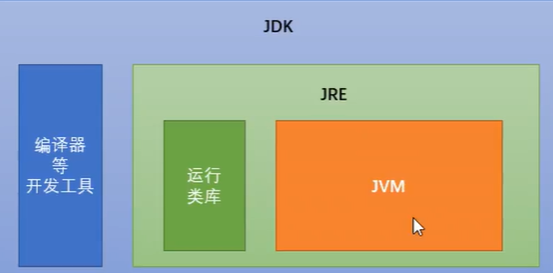

#### idea快捷键

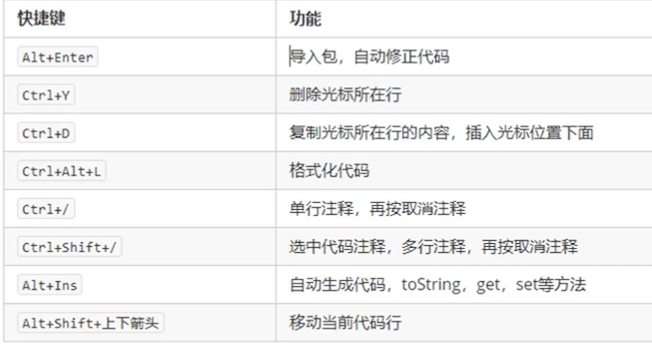

```java
/*快捷生成for循环方式 
5.fori
生出如下代码==> */
for (int i = 0; i < 5; i++) {}
```

**自动生成getter/setter和构造方法：**code->generate；快捷方式：alt+Insert

快捷生成输出代码：sout

快捷生成主方法：psvm

##  语法

### 方法

1、方法定义

方法是若干语句的功能集合。

方法（工厂），参数（原料->进入方法的数据），返回值（产出物->从方法中出来的数据）

蒙牛工厂->原料:奶牛、饲料、水	产出物:奶制品

钢铁工厂->原料:铁矿石、煤炭	产出物:钢铁建材

定义方法格式：修饰符 返回值类型 方法名称(参数类型  参数，...){方法体     return 返回值；}

修饰符-->（public、static）

2、方法调用

- 单独调用：方法名称（参数）
- 打印调用：System.out.println(方法名称（参数）);
- 赋值调用：返回值类型 变量名 = 方法名称（参数）;

注意：返回值类型为void的方法只能单独调用，不能进行打印或赋值调用

```java
/*
public static void 方法名称(){
    方法体;
}
调用格式：方法名称();
注意：
1、方法定义的先后顺序无要求
2、方法定义必须是挨着的，不能再方法内部定义另外一个方法
3、方法定义后，自身不会执行；如果希望执行，则需要对方法进行调用
*/

public static void main(String[] args){
    System.out.println(abc(2,5));	//调用abc方法
}
//定义的abc方法
public static int abc(){
    System.out.println("新定义的方法");
    int result = a + b;
    return result;
}
```

**方法重载**

重载是方法不变，参数的个数、参数类型、参数的多类型顺序不同

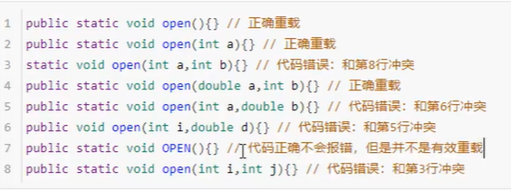

**静态方法与非静态方法的区别：**

1、静态方法隶属于类，既可通过对象来调用，亦可通过类名来调用；

  非静态方法则只可以通过对象来调用。

2、static的Method and attribute 只能是对类而言，
  而non-static 的，是对于对象而言的。

3、两者在系统分配内存的时候也是不同的：
  前者是用栈分配内存，速度快，是在类第一次载入的时候初始化。
  后者是用堆分配内存，速度慢些，是在对象初始化的时候，伴随着初始化的。

4、所谓静态变量或方法, 就是以static修饰的变量或方法, 如static int count;它的意义是让系统分配一个静态空间给这个变量count, 那么包含这个变量的类的全部实例就会共用这个变量, 任何一个改变了count都会对其余的实例产生影响, 它是在文件编绎时就被初始化的, 比一切其它non-static 变量都要早;而non-static 变量就是每一个类实例都有自己的count, 任何实例的改变都不会 影响到其它的实例的count(也就是分配了各自的空间), 它们是第一次使用的时 候才被初始化的;  static 和non-static 的方法的区别也是差不多的, 只是一点要注注意的就是 static 成员(变量或方法), 只能调用static 成员, 而不能调用non-static成员。 

### 数组

- 数组时一种引用数据类型
- 数组当中的多个数据类型必须统一
- 数组长度在程序运行期间不可改变
- 初始化（动态初始化-指定长度、静态初始化-指定内容）
- 确定数组内容用静态初始化，不确定用动态初始化

```java
//动态初始化，指定长度
//数据类型[] 数组名称 = new 数据类型[数组长度]
double[] arrayA = new double[10];

//静态初始化,指定内容
//数据类型[] 数组名称 = new 数据类型[]{元素1,元素2,元素3,...,元素n}
double[] arrayB = new double[]{1,2,3,4};	//长度是4
String[] arrayC = new String[]{"hello","hi"};	//长度是2

//省略格式
double[] arrayB ={1,2,3,4};

//数组的输出
System.out.println(arrayB);	//输出数组的首地址
System.out.println(arrayB[0]);	//输出数组第一位数：1
//数组的长度
int len = arrayB.length;


//通过数组存储多个返回值
public static void main(String[] args){
    int[] result = calculate(10,20,30);
    System.out.println("总和："+result[0]);
    System.out.println("平均数："+result[1]);
}
public static calculate(int a,int b,int c{
    int sum = a + b + c;
    int avg = sum / 3;
    int[] array = {sum, avg };
    return array;	//返回一个数组
}
```

**空指针异常NullPointerException**

数组必须进行new初始化才能使用其中元素，如果只赋了一个null值，没有进行new创建，则发生空指针异常 NullPointerException

原因：没new初始化-->解决：new初始化

### JAVA的内存划分

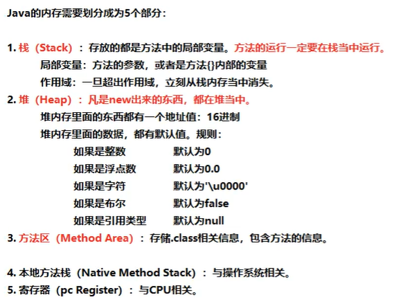

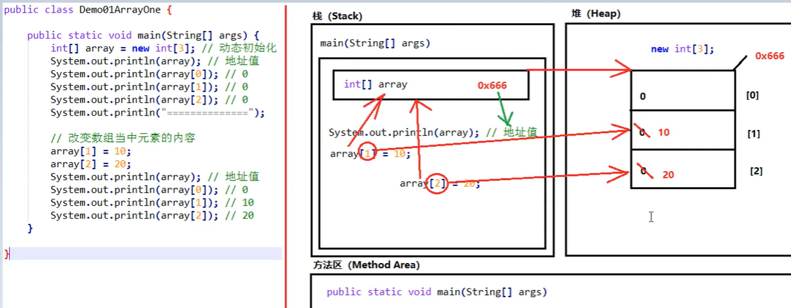

#### 面向对象思想

面向过程：（强调步骤）当需要实现一个功能时，每一个步骤都需要详细处理

面向对象：（强调对象）当需要实现一个功能时，不关心具体的步骤，而是找一个JDK中的类来帮忙实现

```java
import java.util.Arrays;
public class test{
    public static void mian(String[] args){
        int[] array = {1,2,3,4,5,6,7,8,9,0};
        //要求打印格式为1,2,3,4,5,6,7,8,9,0

         //面对过程
        for(int i=0;i<array.length;i++){
            System.out.println(array[i]);

        //面对对象
        //找一个JDK提供的Arrays类
        System.out.println(Arrays.toString(array));
    }
}
```

**类与对象的区别**

1、类是对某一类事物的描述，是抽象的；对象是一类事物的实例，是具体的。

类是对象的模板，对象是类的实体。

 对象是一个实实在在的个体，是类的一个实例。

  比如：“人”是一个类，而“教师”则是“人”的一个实例。

2、对象是函数、变量的集合体；

  而类是一组函数和变量的集合体，

  即类是一组具有相同属性的对象集合体。

3、UML的类图和对象图之间的区别是：

  类图中类名首字母大写，对象图中的对象名首字母小写。

  对象名下有一条下划线，而类名没有。 

4、类的数据值是共享的，一个实例能访问它所属类的类数据值；

  而实例数据属于单个对象，除共享了所在类中的数据外，

  不同对象还会有不同的数据值。

5、先有类，才有类的实例——对象。

应用在当你在创建某个类的实例（对象）之前，这个类必须被定义。

6、实例方法和类方法的区别在于：

实例方法属于单个对象，类方法属于类。

```java
/*成员变量（属性）:
    String name;	//姓名
	int age;	//年龄
成员方法（行为）:
	public void eat(){}
*/
public class Student{
    //成员变量
    String name;//姓名
    int age;//年龄
    
    //成员方法
    public void eat(String food){System.out.println("吃："+food);}
}
```

**导包**

```java
/*
1、导包
import 包名称.类名称;
import cn.gdufe.edu.cn.student;对于和当前类属于同一个包的情况，可以省略导包语句不写
（即不在同一个页面内，需要导包）
2、创建格式：
类名称 对象名 = new 类名称();
Student stu = new Student();
3、使用
使用成员变量：对象名.成员变量名
使用成员方法：对象名.成员方法名(参数)
*/
public static void main(String[] args){
    Student stu = new Student();
    System.out.println(stu.name);//null
    System.out.println(stu.name);//0
    stu.name = "Kobe";
    System.out.println(stu.name);//Kobe
    System.out.println(stu.eat("水果"));//吃：水果
}
```

**使用对象类型做方法的返回值**

```java
public static void main(String[] args){
    Student stu2 = getStudent();
    System.out.println(stu2.name);	//June
    System.out.println(stu2.age);	//17
}
public static Student getStudent(){
    Student stu1 = new Student();
    stu1.name = "June";
    stu1.age = 17;
    return stu1;
}
```

**匿名对象**

匿名对象就是只有右边的对象，没有左边的名字和赋值运算符

匿名对象只能使用一次，下一次再使用会再次创建新的对象

 ```java
public static void mian(String[] args){
    Student stu1 = new Student();
    stu1.name = "ABC";
    
    new Student().name = "Kobe";
}
 ```

**成员变量和局部变量的区别**

局部变量：在方法内部，只有方法能用；没有默认值；位于栈内存

成员变量：直接写在类中；整个类都可以用；有默认起始值；位于堆内存

```java
public class test{
    String name;	//成员变量
    public void methodA(){
        int num = 20;	//局部变量
        System.out.println(num);
        System.out.println(name);
    }
}
```

面对对象三大特征：封装、继承、多态

**封装性**

将一些细节信息隐藏起来，对于外界不可见

**继承**

被继承的类叫超类（superclass )，继承超类的类叫子类（subclass ）。

继承是多态的前提；继承主要解决的问题：共性抽取

  子类是超类的一个专门用途的版本，它继承了超类定义的所有实例变量和方法，并且为它自己增添了独特的元素。

  在继承关系当中，一个子类能够从它的超类当中继承所有的东西，子类能够吸收现有类的数据和方法。

  通过继承，子类不仅仅展示了其超类的行为和特征，而且还展示了特定于自身的行为和特征。

```java
/*
public class 父亲名称{}
public class 子类名称 extends 父亲名称{}
*/
```

- 变量访问

  直接通过子类对象访问成员变量：

  ​		等号左边是谁，就优先用谁，没有则向上找。

  间接通过子类对象访问成员变量：

  ​		该方法属于谁，就优先用谁，没有则向上找。

- 变量调用

  局部变量：变量名

  本类变量：this.变量名

  父类变量：super.变量名

**重写**

重写(Override)：方法名称一样，参数列表一样
重载(Overload)：方法名称一样，参数列表不一样

```java
/*
方法覆盖重写的注意事项：
    1、必须保证父子类之间的方法名称与参数列表相同
    2、@Override:写在方法前，检测是否有效正确覆盖重写（可不写，但要保证正确）
    3、子类方法的返回值必须小于等于父类方法的返回值
    4、Object类是所有类的公共最高父类（祖宗类）,java.lang.String就是Object的子类
    5、子类方法的权限必须大于等于父类方法的权限修饰符
        public > protected > (default) > private
        dafault不是关键字，而是什么不写，留空
*/
```

**四种权限修饰符**

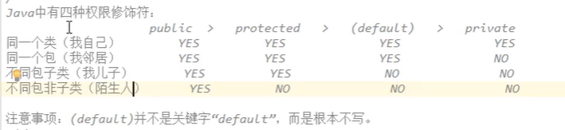

**private关键字**

问题描述：定义数据变量时，无法阻止不合理的数值被设置进来；

解决方案：用private关键字将需要保护的成员变量进行修饰

一旦使用了private进行修饰，本类中可以随意访问，但是，超出本类之外就不能访问

**final关键字**

final关键字代表最终、不可改变的。

不能使用final关键字修饰父类。

可用来修饰类、方法、局部变量、成员变量

**this**

解决重名调用问题

this.成员变量名-->访问成员变量

如果该方法内存在相同的变量名，会先调用方法内的变量，如果想调用成员变量，则需要this来调用

**getter/setter**

自动生成getter/setter和构造方法：code->generate；快捷方式：alt+Insert

**构造方法**

 构造方法是专门用来创建对象的方法，当我们通过New关键字来创建对象时，就是在调用构造方法

```java
/*
格式：public ；类名称(参数类型 参数名){方法体}
注意：构造方法名称必须和所在类名一致；不能写返回值类型，包括void；不能return
*/
public class Student{
    public Student(){
        System.out.println("这是构造方法");
    }
}
```

**静态static关键字**

一旦使用static关键字，则此内容属于类；所以凡是本类的对象，都共享同一份。

如果没有static关键字，必须首先创建对象，然后通过对象调用；

如果有static关键字，则不需创建对象，直接通过类名称来使用它。

无论是成员变量还是成员方法，如果有static，都推荐使用类名称来进行调用：

静态变量：类名称.静态变量

静态方法：类名称.静态方法()

注意：

静态不能访问非静态。原因：因为在内存中是先有静态内容，后有非静态内容。

静态方法中不能用this。原因：this代表当前对象，通过谁调用的方法，谁就是当前对象

```java
public class Demo1{
    public static void main(String[] args){
        MyClass.MethodStatic();
    }
}
public class MyClass{
    public static MethodStatic(){
        System.out.println("这是静态方法	");
    }
}
```

**静态代码块**

当第一次用到本类时，静态代码块执行唯一的一次。

静态代码块典型用途：用来一次性对静态成员变量赋值。

```java
public class 类名称{
	staic {
		//静态代码块
	}
}
```

**方法、函数、消息、变量、属性之间的关系**

1、方法就是对象的行为，即函数；

2、消息也是调用某个对象的函数，即方法。  

3、变量就是对象的状态，即属性。

### API文档

**Scanner**：输入

```java
//System.in代表从键盘输入
Scanner sc = new Scanner(System.in);
//获取键盘输入的int数字
int num = sc.nextInt();
//获取键盘输入的String字符串
int str = sc.next();
```

**Random**：随机数

**Person**：数组

**ArrayList**：集合

数组的长度可以发生改变，但是ArrayList集合的长度是可以改变的

ArrayList，有一个`<E>`代表泛型

泛型：装在集合当中的所有元素（统一数据类型，泛型只能是引用类型，不能是基本类型）

ArrayList打印出来的是内容，不是地址；如果内容为空，则输出[]

```java
/*
常用方法：
public boolean add(E e);向集合添加元素，参数类型和泛型一直
public E get(int,index);从集合获取元素，参数是索引编号，返回值是对应位置的元素
public E remove(int index);从集合中删除元素，参数时索引编号，返回值是被删掉的元素
public int size(); 获取集合的长度，返回值为元素个数
（返回值代表是否执行成功）
*/
```

```java
//从JDK1.7+开始，右侧<>内部可以不写内容，但<>本身需要写
ArrayList<String> list = new ArrayList<String>();
//向集合添加数据
list.add("Kobe");
list.add("June");
System.out.println(list);	//[Kobe,June]
```

#### 数组

程序中所有的双引号字符串，都是String类的对象。

```java
public static void main(String[] args){
    //使用空参构造
    String str1 = new String();//str1是空的字符串
    
    //根据字符数组创建
    char[] arr = {'A','B','C'};
    String str2 = new String(arr);//str2为ABC
    
    //根据字节数组创建字符串
    byte[] arr2 = {97,98,99};
    String str3 = new String(arr2);//str3为abc
    
    //直接创建
    String str = "hello";
}
```

**内容比较 equals()与equalsIgnoreCase()**

```java
//区分大小写 equals()
String str1 = "Hello";
String str2 = "hello";
System.out.println(str1.equals(str2));	//false
Sysytem.out.println("Hello".equals(str1));	//true

//不区分大小写equalsIgnoreCase()
System.out.println(str1.equalsIgnoreCase(str2));	//true
```

**索引查找**

```java
String str1 = "Hello";
String str2 = "World";
//拼接字符串
String str3 = str1.concat(str2);	//HelloWorld

//获取指定索引位置的单个字符
char ch = "Hello".chatAt(1);	//e

//查找参数字符串在本来字符串当中出现的第一次索引位置（-1代表没有）
str1.indexOf("llo");	//2	
```

**字符串转换**

```java 
public static void mian(String[] args){
    String str1 = "HelloWorld";
    //字符串截取	substring
    String str2 = str1.subsring(5);	//World
    
    //字符串替换	replace()
    String str3 = str1.replace("l","*");	//He**oW*rld
    
    //分割字符串	splice
    String str4 = "aaa,bbb,ccc";
    String[] array1 = str1.splice(",");	
}
```

**将int[]数组转变为字符串格式**：String intStr = Arrays.toString(intArray);

**数组重新排序**：Arrays.sort(数组);	//默认字母/从小到大排序

**String-->数组**：toCharArray

#### Math

java.util.Math类是数学相关的工具类，完成数学运算相关操作。

```java
//绝对值 
System.out.println(Math.abs(-3.14));	//3.14

//向上取整
System.out.println(Math.ceil(3.14));	//4

//向下取整
System.out.println(Math.floor(3.14));	//3

//四舍五入
System.out.println(Math.round(3.14));	//3

//圆周率PI
System.out.println(Math.PI);
```

#### 日期类Data、日历类DataFormat

#### 系统类System

```java
//测试程序的效率System.currentTimeMillis()
System.out.println(System.currentTimeMillis());	//获取当前时间毫秒值（可用来计算运行程序所需要的时间、或者当做文件名来使用-因为不会使文件名重复）

//复制数组（覆盖）System.arraycopy(int[],src,int srcIndex,int[] dest,int destIndex,int count);
int[] arr1 = {1,2,3,4,5,6,7,8,9};
int[] arr2 = {9,8,7,6,5,4,3,2,1};
System.arraycopy(arr1,0,arr2,0,4);	//把arr1数组的前4个数字复制到arr2数组中
System.out.println(arr2);	  //1,2,3,4,5,4,3,2,1
```

#### String类与StringBuilder类

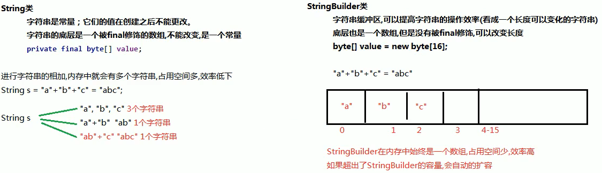

```java
/*StringBuilder常用方法
public StringBuilder append(...);	//添加任意类型数据的字符串形式，并返回当前对象本身
public String toString();	//将当前StringBuilder对象转换为String对象
*/

/*1.构造方法*/
StringBilder();	//创建一个空的字符串
StringBuilder(String s);	//根据传入的内容创建一个字符串缓冲区

/*2.成员方法*/
StringBuilder append(Object obj);	//添加内容
StringBuilder reverse();	//反转内容
String toString();	//将缓冲区内容转为字符串
```

````java
StringBuilder sb = new StringBuilder();
sb.append("hello,").append("world~");	//hello,world~
sb.reverse();	//将数组内容翻转
````

### 抽象类

抽象方法：就是加上abstract关键字，然后去掉大括号，直接分号结束。
抽象类：抽象方法所在的类（需要在class前面加abstract），必须是抽象类才行。

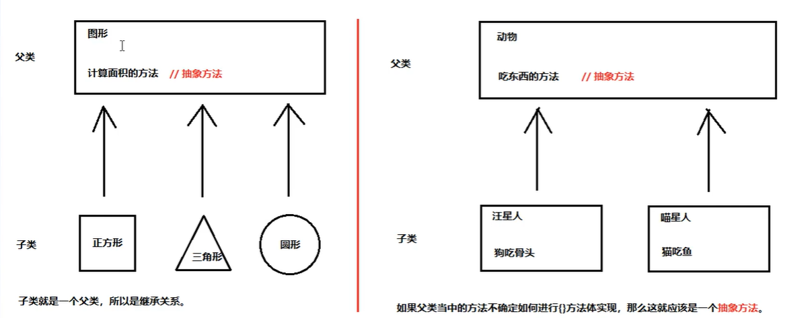

注意事项： 
1、抽象类不能创建对象，如果创建了，编译无法通过而报错，只能创建其非抽象子类对象。
  理解：假设创建了抽象类的对象，调用抽象的方法，而抽象方法没有具体的方法体，没有意义
2、抽象类中，可以构造方法，是供子类创建对象时，初始化父类成员使用的。
    理解：子类的构造方法中，有默认的super()，需要访问父类构造方法
3、抽象类中，不一定包含抽象方法，但是有抽象方法的类必定是抽象类。
    理解：未包含抽象方法的抽象类，目的是不想让调用者创建该类对象，通常用于某些特殊的类结构设计。
4、抽象类的子类，必须重写抽象父类中所有的抽象方法，否则，编译无法通过而报错。除非子类也是抽象类。
    理解：假设不重写所有抽象方法，则类中可能包含抽象方法。那么创建对象后，调用抽象的方法，没有意义。

```java
/*
如何使用抽象类和抽象方法：
1、不能直接创建new抽象类对象
2、必须用一个子类来继承抽象父类
3、子类必须覆盖重写抽象父类当中所有的抽象方法
	覆盖重写的实现-->子类去掉抽象方法的abstract关键字，然后补上大括号
4、创建子类对象进行使用。

public abstract class Animal{
    public abstract void eat();	//抽象方法，具备不确定性
    public void normalMethod(){}	//普通成员方法
}
*/
//Fu.class
public abstract class Fu{
    public Fu(){
        System.out.println("抽象父类的构造方法执行！");
    }
    public abstract void eat();
}

//Zi.class
public class Zi extends Fu{
    public void Zi(){
        System.out.println("抽象子类的构造方法执行！");
    }
    @Override
    public void eat(){
        System.out.println("吃饭饭");
    }
}

//DemoMain.class
public class DemoMain{
    piblic static void main(String[] args){
        Zi zi = new Zi();
        zi.eat();
    }
}
```

### 接口

接口是一种公共规范标准。只要符合标准，就可以通用。

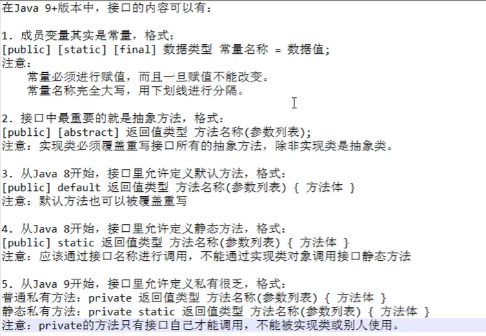

```java
/*
接口不能直接使用，必须用一个“实现类”来实现接口
接口的实现类必须覆盖重写(实现)接口中所有的抽象方法（如果少写，本身必须是抽象类）
public class 实现类名称 implements 接口名称{}
可以在接口中写的内容：
1、抽象方法
接口中中抽象方法的两个关键字public abstract可以省略，方法三要素也可随意定义
2、java8的默认方法-->作用：可以实现接口拼接
默认方法会被通过接口实现类直接调用(调用接口)
3、接口的常量
public static final 数据类型 常量名称 = 数据值;	//不可改变,可省略public static final
注意：不能通过接口实现类的对象来调用接口的静态方法（可通过接口名称.静态方法名(参数)来调用）
*/
public interface MyIntercaceDafault{
    //抽象方法
    void methodsAbs();	//可省略public abstract
}

public class MyInterfaceDafaultA implements MyIntercaceDafault{
    public void methodsAbs(){
        System.out.println("实现了抽象方法");
    }
}
```

### 多态

**多态**：extends继承或者implements实现，是多态性的前提。

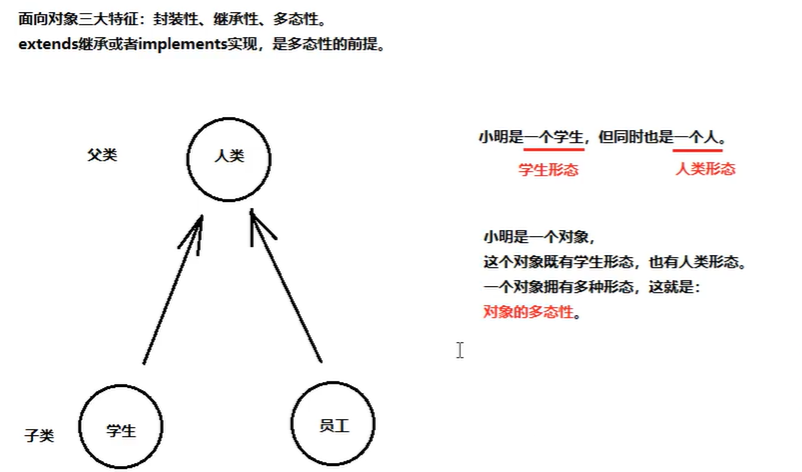

多态性：父类引用子类对象。

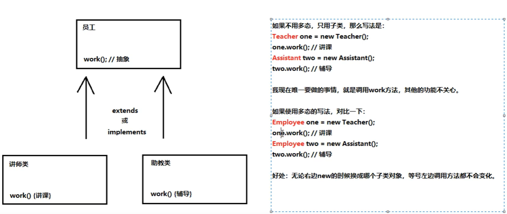

向上转型与向上转型

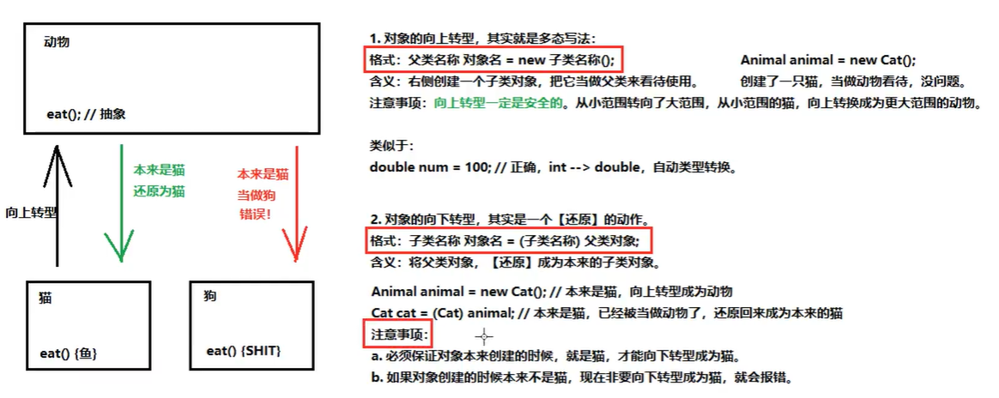

检测向下转型时是否转换正确：instanceof()来判断

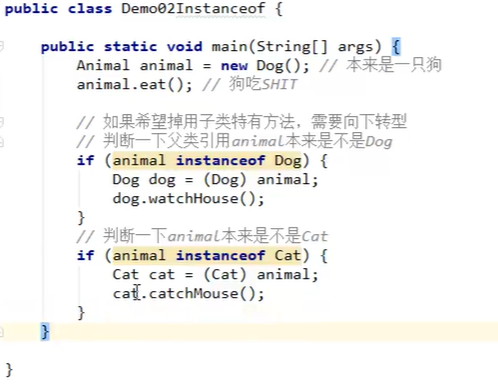

### 内部类

成员内部类与局部内部类（包含匿名内部类）

**成员内部类**

内用外，随意访问；外用内，需要内部类对象。

直接调用：外部类名.内部类名 对象名 = new 外部类名().new 内部类名();

间接调用：在外部类方法中，使用内部类，然后main中只是调用外部类的方法

```java
public class Body { //外部类
    public class Heart{ //成员内部类
        //内部类的方法
        public void beat(){
            System.out.println("内部类：心脏");
            System.out.println("我叫" + name);
        }
    }
    //外部类的成员变量
    private String name;
    //外部类的方法
    public void methodBody(){
        System.out.println("外部类的方法");
        new Heart().beat();	//匿名内部类
    }
    public String getName() {
        return name;
    }
    public void setName(String name) {
        this.name = name;
    }
}

//main
public class InnerClass {
    public static void main(String[] args) {
        Body body = new Body(); //外部类的对象
        //通过外部类的对象，调用外部类的方法，里面简介在使用内部类Heart
        body.methodBody();
        System.out.println("========");
        //外部类名.内部类名 对象名 = new 外部类名().new 内部类名();
        Body.Heart heart = new Body().new Heart();
        heart.beat();
    }
}
```

**局部内部类**：定义在一个方法内部的类（只有当前方法能使用它）。

局部内部类如果希望访问所在方法的局部变量，那么变量必须是【有效的final关键字的】

从java8+开始，只要变量事实不变，那么final关键字可以省略

```java
public class Outer{
    public void methodOuter(){
        class Inner{
            int num = 10;
            public void methodInner(){ System.out.println(num); }
        }
		Inner inner = new Inner();	//只能在当前方法调用
    	inner.methodInner();
    }
}
```

**匿名内部类**

如果接口的实现类（或父类的子类），只石永红唯一一次。那么这种情况下可以省略该类的定义，而改为使用【匿名内部类】

```java
/*
接口名 对象名 = new 接口名(){//覆盖重写所有抽象方法};
在{}里面的才是匿名内部类的内容，且{}后需要加;结束
在创建对象时，只能使用一次


@Override
        public void method(){
            System.out.println("匿名内部类实现的方法！");
        }
*/
//MyInterface.java
public interface MyInterface{
    void method();	//抽象方法
}

//MyInterfaceImpl.java
public class MyInterfaceImpl implements MyInterface{
    @Override
    public void method(){
        System.out.println("实现类覆盖重写了方法！");
    }
}

//Main.java
public static void main(String[] args){
    MyInterface obj = new MyInterface(){
       	//重写了两次（即调用两次）
        @Override
        public void method1(){
            System.out.println("匿名内部类实现的方法！");
        }
		@Override
        public void method2(){
            System.out.println("匿名内部类实现的方法！");
        }
    };	//需要一个;结束
    obj.method1();
    obj.method2();
}
```

**类作为成员变量类型**：案例4

**接口作为成员变量类型**：案例5

**接口作为方法的参数或返回值**

### Object类

--->可以通过alt+insert键生成equals() and hashCode()与toString()

**重写toString()方法**：打印对象的信息

重写前：打印的是包名类名@地址值；重写后：打印的是对象中的属性值

```java
//直接打印toString会是一个地址，需要重写Object类的toString方法
//存在一个Person类，里面定义了name和age变量
@Override
public String toString(){
    return "Person{"+"name=" +name +"}";
}
```

**重写equals()方法**：比较两个对象的

重写前：比较的是对象的地址值；重写后：比较的是对象中的属性值

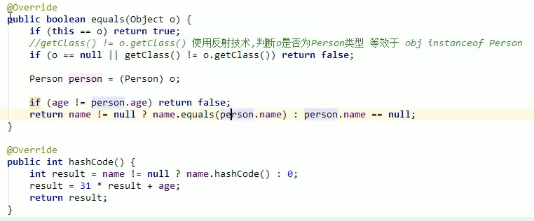

```java
/*equals()方法默认比较的是两个对象的地址值，所以需要重写，比较两个对象的属性
问题：隐藏着一个多态
多态弊端：无法使用子类特有的内容（属性、方法）
解决：向下转型（强转）
*/
//存在一个Person类，里面定义了name和age变量
@Override
public boolean equals(Object obj){
    //判断传递参数是否跟自身比较
    if(obj == this){ return true; }
    
    //判断传递的参数obj是否是null,直接返回false，提高效率
    if(obj == null){ return false; }
    
    //判断是否是Person类型在转换，防止类型转换异常classCastException
    if(obj instanceof Person){
        Person p = (Person)obj;
        boolean b = this.name.equals(p.name) && this.age == p.age;
        return b;
    }
    return false;
    
    //return (this == obj);
```

### 包装类

包装类定义：使用一个类把基本数据类型的数据包装起来，在包装类中可定义方法来操作基本类型的数据

int->Integer		char->Character		（其余数据类型都是首字母大写）

```java
/*
装箱：把基本类型的数据包装到包装类中（基本类型的数据->包装类）
1、构造方法：
	Integer(int value)构造一个新分配的Integer对象，它表示指定的int值。
	Integer(String s)构造一个新分配的Integer对象，它表示String参数所指示的int值。
	(传递的字符串必须是基本类型的字符串，否则会抛出异常		如："100"值正确，“a”异常)
2、静态方法:
	static Integer valueOf(int i) 返回一个表示指定的int值的Integer实例
	static Integer valueOf(String s)返回保存指定的String的值的Integer对象
	
拆箱：在包装类中去除基本类型的数据（包装类->基本类型的数据）
1、成员方法：
	int intValue() 以int类型返回该Integer的值
*/
public static void main(String[] args){
    //构造方法
    Integer in1 = new Integer(1);	//1
    Integer in2 = new Integer("1")	//1
    
    //静态方法
    Integer in3 = Integer.valueOf(1);	//1
    //Integer in4 = Integer.valueOf("a");	//NumberFormatException数字格式化异常
    Integer in5 = Integer.valueOf("1");	//1
    
    //拆箱
    int i = in1.intValue();
    
    //自动装箱与拆箱	（JDK1.5之后出现的新特性）
	Integer in = 1;		//等同 Integer in = new Integer(1);
	in = in + 2;	//等同 new Integer(in.intValue() + 2) = 3;
}
```

```java
//ArratList集合无法直接存储整数，可以存储Integer包装类
ArrayList<Integer> list = new ArrayList<>();
list.add(1);	//自动装箱 list.add(new Integer(1));
int a = list.get(0);	//自动拆箱 list.get(0).intValue();
```

#### 类型转换

- 基本类型-->字符串

  1. 基本类型数据的值+""	（最简单的方式）
  2. 使用包装类中的静态方法 static String toString(int i) 返回一个表示指定整数的 String 对象。
  3. 使用 String 类中的静态方法 static StringvalueOf(int i) 返回 int 参数的字符串表示形式。

- 字符串-->基本类型

  使用包装类的静态方法 parseXX("字符串")

  ​	Integer类：static int parseInt(String s)

  ​	Double类：static double parseDouble(String s)

```java
//基本类型-->字符串
String s1 = 100 + "";
String s2 = Integer.toString(100);
String s3 = String.valueOf(100);

//字符串-->基本类型
int i1 = Integer.parseInt("100");
//int i2 = Integer.parseInt("a");	//数字格式化异常
```

### Collection集合

- 集合与数组区别
  - 数组长度是固定的，集合的长度是可变的；
  - 数组中存储的是同一类型的元素，可以存储基本数据类型值。集合存储的是对象，而且对象的类型可以不一致。
  - 在开发中一般当对象多时，使用集合存储。
- 集合按照存储结构分两大类：
  - 单列集合 java.util.Collection
  - 双列集合 java.util.Map

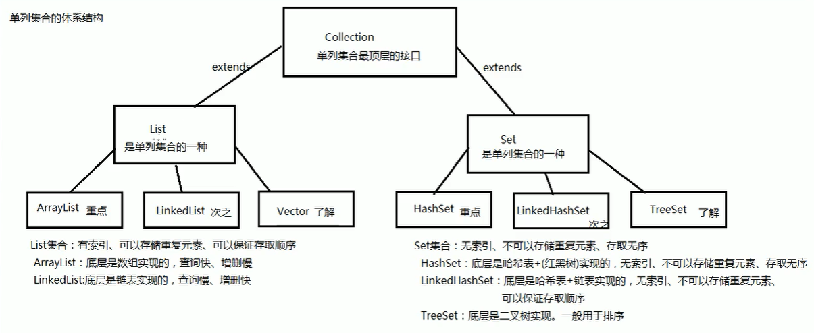

```java
/*
	boolean add(E e);		//向集合添加元素
	boolean remove(E e);	//删除集合中的某个元素
	void clear();			//清空集合所有的元素
	boolean isEmpty();		//判断集合是否为空
	boolean contains(E e);	//判断集合中是否包含某个元素
	int size();				//获取集合的长度
	Object[] toArray();		//将集合转成一个数组
*/
public static void main(String[] args){
    Collection<String> coll = new ArrayList<>();
    coll.add("hello");
    coll.add("world");
    boolean result = coll.remove("hello");
    //cool.clear();
    boolean result2 = coll.contains("java");	//false
    Object[] arr = coll.toArray();	//转换成数组
}
```

### Iterator迭代器

- java.util.Iterator。Collection接口与Map接口主要用于存储元素，而Iterator主要用于迭代访问（即遍历）Collection中的元素，因此Iterator对象也被称为迭代器。
- 迭代：即Collection集合元素的通用获取方式。在取元素之前要判断集合中有没有元素，如果有，就把这个元素取出来，继续再判断，如果还有救再取出来。一直把集合中的所有元素全部取出——这种取出方式称为迭代。

```
/* Iterator接口常用方法：
	public E next():返回迭代的下个元素
	public boolean hasNext()：如果仍有元素可以迭代，则返回true
*/

```


##  案例

#### **1、生成6个1~33的随机整数，添加到集合，并遍历集合**

```java
//生成6个1~33的随机整数，添加到集合，并遍历集合
public class Demo{
    public static void main(String[] args){
        ArrayList<Integer> list = new ArrayList();
        Random r = new Random();
        for(int i=0;i<6;i++){
            int num = r.nextInt(33)+1;
            list.add(num);
        }
    }
}
```

#### **2、群主发红包，成员收红包**

```User.class
public class User {
    private String name;    //姓名
    private int money;  //余额（用户所拥有的钱）

    public User() {
    }

    public User(String name, int money) {
        this.name = name;
        this.money = money;
    }

    //展示用户有多少钱
    public void show(){
        System.out.println("我叫："+ name + ".我有多少钱：" + money);
    }

    public String getName() {
        return name;
    }

    public void setName(String name) {
        this.name = name;
    }

    public int getMoney() {
        return money;
    }

    public void setMoney(int money) {
        this.money = money;
    }
}
```

```Manafer.class
import java.util.ArrayList;
//群主的类 Manager.class
public class Manager extends User {
    public Manager(){

    }

    public Manager(String name, int money) {
        super(name, money);
    }

    public ArrayList<Integer> send(int totalMoney, int count){
        //需要一个集合存储若干个红包的金额
        ArrayList<Integer> redList = new ArrayList<>();

        //需要看群主有多少钱
        int leftMoney = super.getMoney();   //群主当前的余额
        if(totalMoney > leftMoney){
            System.out.println("余额不足");
            return redList; //返回空集合
        }
        //扣钱（重新设置余额）
        super.setMoney(leftMoney - totalMoney);

        //发红包要平均拆分count份
        int avg = totalMoney / count;
        int mod = totalMoney % count; //余额(甩下的零头)

        //除不开的零头，包在最后一个红包内
        //下面把红包逐一让如集合中
        for (int i = 0; i < count - 1; i++) {
            redList.add(avg);
        }

        //最后一个红包
        int last = avg + mod;
        redList.add(last);

        return redList;
    }

}
```

```Member.class
import java.util.ArrayList;
import java.util.Random;

public class Member extends User {
    public Member() {
    }

    public Member(String name, int money) {
        super(name, money);
    }

    public void receive(ArrayList<Integer> list){
        //从多个红包中随机抽取一个给自己
        //随机获取一个集合当中的索引编号
        int index = new Random().nextInt(list.size());
        //根据索引从集合中删除，并且得到被删除的红包给自己
        int delta = list.remove(index);
        //当前成员本来有多少钱
        int money = super.getMoney();
        //加法，并且重新设置回去
        super.setMoney(money + delta);
    }
}
```

```MainRedPacket.class
import java.util.ArrayList;

public class MainRedPacket {
    public static void main(String[] args) {
        Manager manager = new Manager("群主",100);
        Member one = new Member("成员A",9);
        Member two = new Member("成员B",10);
        Member three = new Member("成员C",11);

        manager.show();
        one.show();
        two.show();
        three.show();
        System.out.println("==============");

        ArrayList<Integer> redList = manager.send(20,3);
        one.receive(redList);
        two.receive(redList);
        three.receive(redList);

        manager.show(); //100-20=80
        //6,6,8随机分给三人
        one.show();
        two.show();
        three.show();
    }
}
```

#### **3、接口多态的案例（笔记本电脑）**

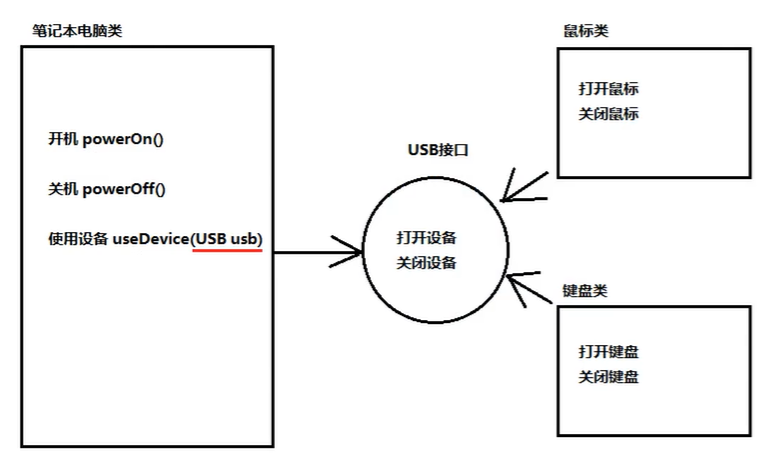

```USB.java
public interface USB {
    public abstract void open();    //打开设备

    public abstract void close();   //关闭设备
}
```

```Computer.java
public class Computer {
    public void powerOn(){
        System.out.println("笔记本开机");
    }
    public void powerOff(){
        System.out.println("笔记本关机");
    }

    //使用USB设备
    public void useDevice(USB usb){
        usb.open(); //打开设备
        if(usb instanceof Mouse){
            Mouse mouse = (Mouse) usb;  //向下转型
            mouse.click();
        }else if(usb instanceof Keyboard){
            Keyboard keyboard = (Keyboard) usb; //向下转型
            keyboard.type();
        }
        usb.close();    //关闭设备
    }
}
```

```Mouse.java
//鼠标是一个USB设备
public class Mouse implements USB {
    @Override
    public void open(){ System.out.println("打开鼠标"); }

    @Override
    public void close() { System.out.println("关闭鼠标"); }

    public void click(){
        System.out.println("鼠标点击");
    }
}
```

```Keyboard.java
//键盘是一个USB设备
public class Keyboard implements USB {
    @Override
    public void open() { System.out.println("打开键盘"); }

    @Override
    public void close() { System.out.println("关闭键盘"); }

    public void type(){
        System.out.println("鼠标输入");
    }
}
```

```Main.java
public class DemoMain {
    public static void main(String[] args) {
        //创建一个笔记本电脑
        Computer computer = new Computer();
        computer.powerOn();

        //准备一个鼠标
        USB usbMouse = new Mouse();
        computer.useDevice(usbMouse);

        //准备一个键盘
        USB usbKeyboard = new Keyboard();
        computer.useDevice(usbKeyboard);
    }
}
```

#### 4、类作为成员变量类型

```Hero.java
public class Hero {//英雄类
    private String name;    //英雄名字
    private int age;    //年龄
    private Weapon weapon;  //武器

    public Hero() {
    }

    public Hero(String name, int age, Weapon weapon) {
        this.name = name;
        this.age = age;
        this.weapon = weapon;
    }

    public void attack(){
        System.out.println("年龄为"+age+"的"+name+"用"+weapon.getCode()+"攻击敌方");
    }

    public String getName() {
        return name;
    }

    public void setName(String name) {
        this.name = name;
    }

    public int getAge() {
        return age;
    }

    public void setAge(int age) {
        this.age = age;
    }

    public Weapon getWeapon() {
        return weapon;
    }

    public void setWeapon(Weapon weapon) {
        this.weapon = weapon;
    }
}
```

```Weapon.java
public class Weapon {//武器类
    private String code;    //武器的代号

    public Weapon() {
    }

    public Weapon(String code) {
        this.code = code;
    }

    public String getCode() {
        return code;
    }

    public void setCode(String code) {
        this.code = code;
    }
}
```

```Main.java
public class DemoMain {
    public static void main(String[] args) {
        //创建一个英雄角色
        Hero hero = new Hero();
        //为英雄起名并设置年龄
        hero.setName("盖伦");
        hero.setAge(19);

        //创建一个武器对象
        Weapon weapon = new Weapon("多兰剑");
        //为英雄配备武器
        hero.setWeapon(weapon);
        hero.attack();
    }
}
```

#### 5、接口作为成员变量类型

```Hero.java
public class Hero {
    private String name;    //英雄名称
    private Skill skill;    //英雄技能

    public Hero() {
    }
    public Hero(String name, Skill skill) {
        this.name = name;
        this.skill = skill;
    }

    //英雄攻击别人
    public void attack(){
        System.out.println("我叫"+ name +", 开始释放技能");
        skill.use();    //调用接口中的抽象方法
        System.out.println("释放技能完成。");
    }

    public String getName() {
        return name;
    }

    public void setName(String name) {
        this.name = name;
    }

    public Skill getSkill() {
        return skill;
    }

    public void setSkill(Skill skill) {
        this.skill = skill;
    }
}
```

```Skill.java
public interface Skill {
    void use(); //释放技能的抽象方法
}
```

```SkillImpl.java
public class SkillImpl implements Skill {
    @Override
    public void use() {
        System.out.println("Biu~Biu~Biu~");
    }
}
```

```Main.java
public class DemoGame {
    public static void main(String[] args) {
        Hero hero = new Hero();
        hero.setName("艾希");

        //设置英雄技能
        //hero.setSkill(new SkillImpl());
        //还可改成匿名内部类
        /*Skill skill = new Skill() {
            @Override
            public void use() {
                System.out.println("Pia~Pia~Pia~");
            }
        };
        hero.setSkill(skill);*/
        //还可进一步简化，同时使用匿名内部类和匿名对象
        hero.setSkill(new Skill() {
            @Override
            public void use() {
                System.out.println("Piu~Piu~Piu~");
            }
        });

        hero.attack();
    }
}
```


## Lambda 表达式