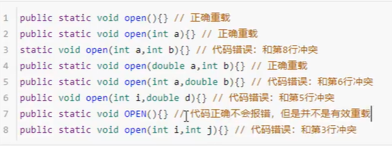
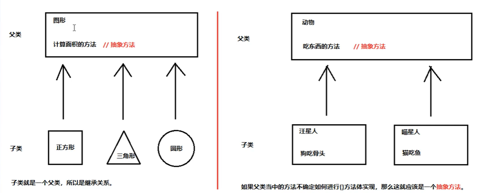
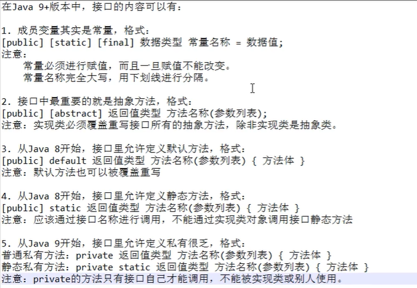
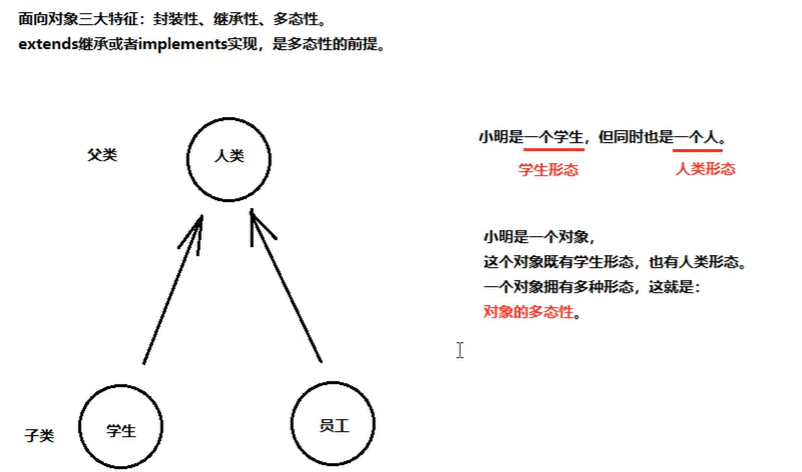
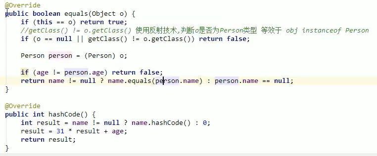

## JAVA

## 基础

### JDK

```bash
JVM（Java Virtual Machine），Java虚拟机
JRE（Java Runtime Environment），Java运行环境，包含了JVM和Java的核心类库（Java API）
JDK（Java Development Kit）称为Java开发工具，包含了JRE和开发工具
```


### java编译

```bash
javac 是 Java 编译器的命令行工具，用于将 Java 源代码文件(.java)编译成 Java 字节码文件(.class)。
Java 字节码文件可以在虚拟机(JVM)上运行。

注意：执行 .class 文件时，不需要加 .class 后缀


$ javac HelloWorld.java # 根据 HelloWorld.java 文件编译成 HelloWorld.class 文件
$ java HelloWorld	# 执行 HelloWorld.class 文件
```


### 基础语法

```bash
- 注释：单行注释、多行注释、文档注释
- 关键字：被Java赋予特定含义的单词（class、static）
- 字面量：数据在程序中的书写格式（666、"mySoul"）

变量：临时存储数据的容器
	- 变量必须先定义后使用。变量定义时，系统依据定义的类型给变量开辟对应大小的存储单元来存放数据。
	- 格式：数据类型 变量名 = 数据值;（变量需要有变量类型、变量名和分号结束）
	- 例：int a = 16; duoble b = 10.1;

数据类型：
	- 基本数据类型：byte、short、int、long、float、double、char、boolean
	- 引用数据类型：字符串、数组、类、及接口
	- 区别：
			基本数据类型存储在栈中，引用数据类型存储在堆中
			基本数据类型的变量之间是相互独立的，而引用数据类型的变量之间可能共享同一个对象

标识符：用来命名变量、方法、类、接口等程序元素的名称
	- 注意：
			1. 必须由数字、字母、下划线_、美元符号$ 组成
			2. 不能由数字开头
			3. 不能是关键字
			4. 区分大小写
	- 阿里巴巴命名规范
			尽量不要用拼音。但是一些国际通用的拼音可视为英文单词
			平时在给变量名、方法名、类名起名字时，不要使用下划线或美元符号

权限修饰符：是 Java 的一种关键字，用于控制类、方法、变量的访问权限
	- 权限范围：private < 默认/空着不写 < protected < public
			- public：公共的，所有地方都可以访问。
			- protected：本类、本包、其他包中的子类都可以访问。
			- 默认（没有修饰符）：本类、本包可以访问。
			- private：私有的，当前类可以访问。
	- 编写代码推荐使用：
			- 成员变量使用private，隐藏细节
			- 构造方法使用public，方便创建对象
			- 成员方法使用public，方便调用方法

包：一种用于组织和管理 Java 类的机制
	- 命名规范：路径名.路径名.xxx.xxx （如：com.willy.oa）
	- 导包：不是在 java.lang 包下，都需要导包。因为 Java 开发环境默认为 lang 包
	- 包名一般是域名的倒写。如 www.willy.com 的包名可定义为 com.willy.技术名称
	- 什么时候需要导包？
			1. 在使用Java中提供的非核心包(java.lang)中的类时
			2. 使用自己写的其他包中的类时
	- 什么时候不需要导包？
			1. 在使用Java核心包（java.lang）中的类时
			2. 在使用自己写的同一个包中的类时
```

#### 注释

```java
// 这是单行注释文字

/*
这是多行注释文字
这是多行注释文字
这是多行注释文字
*/

/**
这是文档注释文字
这是文档注释文字
这是文档注释文字
*/
```

#### 关键字

```bash
修饰符关键字：public、protected、private、static、final、abstract
访问控制关键字：public、protected、private、default（默认）
类、接口和包关键字：、class、interface、enum、package、import、extends、implements
方法关键字：void、return、this、super
流程控制关键字：if、else、switch、case、default、while、do、for、break、continue、return
异常处理关键字：try、catch、finally、throw、throws
逻辑关键字：true、false、null
其他关键字：new、instanceof、synchronized、transient、volatile、assert
```

#### 字面量

```bash
整数字面量：表示整数值，可以使用十进制、八进制（以0开头）和十六进制（以0x或0X开头）表示法。例如：42, 012, 0xFF。
浮点数字面量：表示浮点数值，包括普通的浮点数和科学计数法表示。例如：3.14, 2.0e-5。
字符字面量：表示单个字符，使用单引号括起来。例如：'A', '1', '@'。
字符串字面量：表示一个字符串，使用双引号括起来。例如："Hello, World!", "Java"。
布尔字面量：表示布尔值，只有两个取值：true 和 false。
null 字面量：表示空引用，用于表示对象引用不指向任何有效的对象。
转义序列：一些特殊的字符序列，以反斜线 \ 开头，用于表示无法直接输入的字符，如换行符 \n、制表符 \t 等。
数组字面量：用花括号 {} 表示，用于初始化数组。例如：{1, 2, 3}。
枚举常量：枚举类型的常量值，表示枚举中的特定选项。
字符编码字面量：表示字符的Unicode编码，以 \u 开头，后面跟着四个十六进制数字。例如：\u0041 表示字符 ‘A’
```

```java
public class Demo {
    public static void main(String[] args) {
        System.out.println(10); // 输出一个整数
        System.out.println(5.5); // 输出一个小数
        System.out.println('a'); // 输出一个字符
        System.out.println(true); // 输出boolean值true
        System.out.println("欢迎来到黑马程序员"); // 输出字符串
    }
}
```

#### 变量

```java
public class VariableDemo2{
	public static void main(String[] args){
		//1.变量名不允许重复
		//int a = 10;
		//int a = 20;
		//System.out.println(a);

		//2.一条语句可以定义多个变量
		//int a = 10, b = 20, c = 20,d = 20;
		//System.out.println(a);//?
		//System.out.println(b);//?


		//3.变量在使用之前必须要赋值
		int a = 30;
		System.out.println(a);
	}
}
```

#### 数据类型

```bash
Java 数据类型是用来定义变量或表达式可以存储的数据类型的分类

#### 基本数据类型：
整数类型（Integer Types）：
		byte：8位，范围为 -128 到 127
		short：16位，范围为 -32,768 到 32,767
		int：32位，范围为 -2^31 到 2^31 - 1
		long：64位，范围为 -2^63 到 2^63 - 1
浮点类型（Floating-Point Types）：
		float：32位，用于表示单精度浮点数
		double：64位，用于表示双精度浮点数
字符类型（Character Type）：char：16位，用于存储一个 Unicode 字符
布尔类型（Boolean Type）：boolean：用于表示布尔值，只有两个取值：true 和 false

注意：
- byte类型的取值范围： -128 ~ 127
- int类型的大概取值范围： -21亿多 ~ 21亿多
- 整数类型和小数类型的取值范围大小关系：double > float > long > int > short > byte


#### 引用数据类型
类（Class）：用来创建对象的模板。它定义了对象的属性（成员变量）和方法（成员方法）。通过实例化类，可以创建类的对象，并使用对象调用类的方法。
接口（Interface）：定义了一组方法的规范，但没有实际的方法体。类可以实现一个或多个接口，从而获得接口定义的方法，并在类中实现这些方法。
数组（Array）：数组是一种用于存储相同类型元素的数据结构。它可以是一维数组或多维数组，用于在内存中连续存储多个元素。
枚举（Enum）：枚举是一种特殊的类，用于表示一组预定义的常量。枚举常常用于表示一组相关的值。
字符串（String）：字符串是一种引用数据类型，但它具有特殊的性质，可以像基本数据类型一样进行操作。字符串实际上是一个字符序列，它有许多方法用于处理字符串操作。
自定义引用类型：除了上述内置的引用数据类型，还可以创建自定义的类和接口，以及它们的实例，从而构建更复杂的数据结构和功能


#### 基本数据类型和引用数据类型的区别
基本数据类型：按值传递，在Java虚拟机栈中分配内存空间，并直接存储值本身。当基本数据类型的变量被赋值时，实际上是将该变量中的值复制到另一个变量中，这两个变量之间没有任何关联。
引用数据类型：按引用传递，在Java虚拟机堆中分配内存空间，存储的是对象的引用（内存地址）。当引用数据类型的变量被赋值时，实际上是将该变量中的引用复制到另一个变量中，这两个变量指向同一个对象。
```

```java
public class VariableDemo3{
    public static void main(String[] args){
        //1.定义byte类型的变量
        //数据类型 变量名 = 数据值;
        byte a = 10;
        System.out.println(a);

        //2.定义short类型的变量
        short b = 20;
        System.out.println(b);

        //3.定义int类型的变量
        int c = 30;
        System.out.println(c);

        //4.定义long类型的变量
        long d = 123456789123456789L;
        System.out.println(d);

        //5.定义float类型的变量
        float e = 10.1F;
        System.out.println(e);

        //6.定义double类型的变量
        double f = 20.3;
        System.out.println(f);

        //7.定义char类型的变量
        char g = 'a';
        System.out.println(g);

        //8.定义boolean类型的变量
        boolean h = true;
        System.out.println(h);
    }
}
```

```java
// 使用引用数据类型创建一个对象
String message = new String("Hello, World!");

// 创建一个数组
int[] numbers = new int[5];

// 使用自定义类创建对象
class Person {
    String name;
    int age;
}
Person person = new Person();
person.name = "Alice";
person.age = 30;

// 枚举类型
enum Day {
    MONDAY, TUESDAY, WEDNESDAY, THURSDAY, FRIDAY, SATURDAY, SUNDAY
}
Day today = Day.WEDNESDAY;
```

#### 数据内存划分


#### 类型转换

```bash
1. 自动类型转换
	- 类型相容
	- 目标类型 > 源类型
	- double num1 = 1.2; int num2 = 2; double result = num1 + num2;

2. 强制类型转换
	- (类型名) 表达式
	- double a = 5.2; int b = (int) a;

注意：如果想让整数相除转换为浮点数，则需要让除数或者被除数转换为浮点数才行

3. 保留小数位数
	- String.format("%.2f", num); // 保留两位小数
	- System.out.printf("保留两位小数：%.2f%n", num); // 输出的时候才进行保留两位小数
```

```java
public class Main {
    public static void main(String[] args) {
        // 已知某班有男同学20位，女同学15位，20位男生平均分是87分，15位女生的平均分是85，问全体同学平均分是多少分?
        int total = 20 * 87 + 15 * 85; // 总分
        int num = 20 + 15; // 总人数

        // 平均分（因为总分和总人数都是整数，而为了相除获取浮点数则需要让分子或分母为浮点数才行，所以需要 * 1.0）
        double avg = total * 1.0 / num;
        // double avg = total / (num * 1.0);

        String result = String.format("%.2f", avg);
        System.out.println("平均分为：" + result);

        System.out.printf("平均分为：%.2f%n", avg);
    }
}
```


#### 接收输入Scanner

```bash
如果想接收用户从键盘上输入的内容，在 Java 中可以使用 Scanner（扫描仪）


Scanner input = new Scanner(System.in); // 实例化一个scanner对象

int num = input.nextInt(); // 获取输入的整数（如果输入其他类型则会报错）
String str = input.next(); // 接收输入的字符串
String ch = input.next().charAt(1); // 接收输入的第二个字符
```

```java
import java.util.Scanner;

public class Main {
    public static void main(String[] args) {
        Scanner input = new Scanner(System.in);
        int num = input.nextInt();
        System.out.println("您输入的数字为" + num);
    }
}
```

```java
import java.util.Scanner;

// 输入一个小写字母，输出其对应的大写字母。例如输入q时，会输出Q。
public class Main {
    public static void main(String[] args) {
        Scanner input = new Scanner(System.in);
        char ch = input.next().charAt(0); // 下标为0代表第一个字符
        char bigCh = (char)(ch - 32);
        System.out.println(bigCh);
    }
}
```


#### 程序的三大结构

```bash
- 顺序结构：程序只能从第一行开始执行，中间不能跳过某一行代码去执行后续代码。
- 选择结构：让代码有选择地执行，可让某一行或多行代码在条件不符合时不执行。
- 循环结构：让某一行或多行代码可以重复执行多次。


#### 选择结构
1. 关系运算符
		关系表达式的值是一个逻辑值(true | false)。条件成立为真，条件不成立为假。
2. if 选择结构
3. if-else 选择结构
4. 多重 if 选择结构
5. 嵌套 if 选择结构
6. switch 选择结构


#### 循环结构
1. for循环：for(循环变量赋初值; 循环条件; 循环变量增值) { 循环语句; }
2. break和continue
3. while 循环结构
4. do-while 循环结构
```


```java
import java.util.Scanner;

public class ControlStructureDemo {
    public static void main(String[] args) {
        Scanner scanner = new Scanner(System.in);

        System.out.println("=== Java 控制结构综合演示 ===");
        System.out.println("请输入一个数字 (1-3 测试选择结构，4-7 测试循环结构)：");

        int choice = scanner.nextInt();

        switch (choice) {
            case 1: demoRelationOperators();  // 关系运算符
                break;
            case 2: demoIfStructures();       // if 选择结构
                break;
            case 3: demoSwitchStructure();    // switch 选择结构
                break;
            case 4: demoForLoop();            // for 循环
                break;
            case 5: demoWhileLoop();          // while 循环
                break;
            case 6: demoDoWhileLoop();        // do-while 循环
                break;
            case 7: demoBreakContinue();      // break 和 continue
                break;
            default: System.out.println("输入错误，程序结束。");
        }

        scanner.close();
    }

    // 1. 关系运算符演示
    public static void demoRelationOperators() {
        System.out.println("\n=== 1. 关系运算符演示 ===");

        int a = 10, b = 20, c = 10;

        System.out.println("a = " + a + ", b = " + b + ", c = " + c);
        System.out.println("a == b: " + (a == b));  // false
        System.out.println("a != b: " + (a != b));  // true
        System.out.println("a > b: " + (a > b));    // false
        System.out.println("a < b: " + (a < b));    // true
        System.out.println("a >= c: " + (a >= c));  // true
        System.out.println("b <= c: " + (b <= c));  // false

        // 关系表达式的值是 boolean 类型
        boolean result1 = a == c;  // true
        boolean result2 = b > c;   // true
        System.out.println("a == c 的结果: " + result1);
        System.out.println("b > c 的结果: " + result2);
    }

    // 2. if 选择结构演示
    public static void demoIfStructures() {
        System.out.println("\n=== 2. if 选择结构演示 ===");

        Scanner scanner = new Scanner(System.in);

        System.out.println("请输入你的年龄: ");
        int age = scanner.nextInt();

        // 2.1 简单 if 结构
        System.out.println("\n--- 简单 if 结构 ---");
        if (age >= 18) {
            System.out.println("你已经成年了！");
        }

        // 2.2 嵌套 & 多重 if 结构
        System.out.println("\n--- 嵌套 if 结构 ---");
        System.out.println("请输入你的性别 (1:男, 2:女): ");
        int gender = scanner.nextInt();

        if (age >= 18) {
            if (gender == 1) {
                System.out.println("你是成年男性。");
            } else if (gender == 2) {
                System.out.println("你是成年女性。");
            } else {
                System.out.println("性别输入错误。");
            }
        } else {
            System.out.println("你还没有成年。");
        }

        scanner.close();
    }

    // 3. switch 选择结构演示
    public static void demoSwitchStructure() {
        System.out.println("\n=== 3. switch 选择结构演示 ===");

        Scanner scanner = new Scanner(System.in);

        System.out.println("请输入星期几 (1-7): ");
        int day = scanner.nextInt();

        // switch 基本用法
        System.out.print("今天是: ");
        switch (day) {
            case 1:
                System.out.println("星期一");
                break;
            case 2:
                System.out.println("星期二");
                break;
            case 3:
                System.out.println("星期三");
                break;
            case 4:
                System.out.println("星期四");
                break;
            case 5:
                System.out.println("星期五");
                break;
            case 6:
            case 7:
                System.out.println("周末");
                break;
            default:
                System.out.println("输入错误，请输入 1-7 的数字");
        }

        // Java 12+ 新的 switch 表达式（语法糖）
        System.out.println("\n--- switch 表达式 (Java 12+) ---");
        String dayType = switch (day) {
            case 1, 2, 3, 4, 5 -> "工作日";
            case 6, 7 -> "休息日";
            default -> "无效";
        };
        System.out.println("今天类型: " + dayType);

        scanner.close();
    }

    // 4. for 循环演示
    public static void demoForLoop() {
        System.out.println("\n=== 4. for 循环演示 ===");

        // 4.1 基本 for 循环
        System.out.println("--- 基本 for 循环 (1-5) ---");
        for (int i = 1; i <= 5; i++) {
            System.out.println("i = " + i);
        }

        // 4.2 倒序循环
        System.out.println("\n--- 倒序循环 (5-1) ---");
        for (int i = 5; i >= 1; i--) {
            System.out.println("i = " + i);
        }

        // 4.3 步长为 2
        System.out.println("\n--- 步长为 2 (1-10 的奇数) ---");
        for (int i = 1; i <= 10; i += 2) {
            System.out.print(i + " ");
        }
        System.out.println();

        // 4.4 嵌套 for 循环 (乘法表)
        System.out.println("\n--- 嵌套 for 循环 (九九乘法表前3行) ---");
        for (int i = 1; i <= 3; i++) {
            for (int j = 1; j <= i; j++) {
                System.out.print(j + "×" + i + "=" + (i * j) + "\t");
            }
            System.out.println();
        }

        // 4.5 增强 for 循环 (for-each)
        System.out.println("\n--- 增强 for 循环 (遍历数组) ---");
        int[] numbers = {10, 20, 30, 40, 50};
        for (int num : numbers) {
            System.out.print(num + " ");
        }
        System.out.println();

        // 4.6 无限循环 (需要 break 退出)
        System.out.println("\n--- 无限 for 循环 (打印5次后退出) ---");
        int count = 0;
        for (;;) {  // 相当于 while(true)
            System.out.println("这是第 " + (++count) + " 次循环");
            if (count >= 5) {
                break;
            }
        }
    }

    // 5. while 循环演示
    public static void demoWhileLoop() {
        System.out.println("\n=== 5. while 循环演示 ===");

        // 5.1 基本 while 循环：计算 1-100 的和
        System.out.println("\n--- 计算 1-100 的和 ---");
        int sum = 0;
        int num = 1;
        while (num <= 100) {
            sum += num;
            num++;
        }
        System.out.println("1-100 的和是: " + sum);

        // 5.3 输入验证
        System.out.println("\n--- 输入验证 (必须输入正数) ---");
        Scanner scanner = new Scanner(System.in);
        int input = 0;

        while (input <= 0) {
            System.out.print("请输入一个正整数: ");
            input = scanner.nextInt();
            if (input <= 0) {
                System.out.println("输入错误，请重新输入！");
            }
        }
        System.out.println("你输入的是: " + input);

        // 5.4 无限循环
        System.out.println("\n--- 无限 while 循环 (打印3次后退出) ---");
        int counter = 0;
        while (true) {
            System.out.println("循环次数: " + (++counter));
            if (counter >= 3) {
                System.out.println("达到3次，退出循环");
                break;
            }
        }
        scanner.close();
    }

    // 6. do-while 循环演示
    public static void demoDoWhileLoop() {
        System.out.println("\n=== 6. do-while 循环演示 ===");

        // 6.1 基本 do-while
        System.out.println("--- 基本 do-while 循环 ---");
        int i = 1;
        do {
            System.out.println("i = " + i);
            i++;
        } while (i <= 5);

        // 6.2 至少执行一次的特点
        System.out.println("\n--- 验证 do-while 至少执行一次 ---");
        int j = 10;
        do {
            System.out.println("j = " + j);  // 即使条件不满足，也会执行一次
            j++;
        } while (j < 5);
    }

    // 7. break 和 continue 演示
    public static void demoBreakContinue() {
        System.out.println("\n=== 7. break 和 continue 演示 ===");

        // 7.1 break 语句
        System.out.println("--- break 语句演示 ---");
        System.out.println("在 1-10 中查找第一个能被3整除的数:");
        for (int i = 1; i <= 10; i++) {
            if (i % 3 == 0) {
                System.out.println("找到第一个能被3整除的数: " + i);
                break;  // 找到后立即退出循环
            }
            System.out.println("检查: " + i);
        }

        // 7.2 continue 语句
        System.out.println("\n--- continue 语句演示 ---");
        System.out.println("打印 1-10 中的奇数:");
        for (int i = 1; i <= 10; i++) {
            if (i % 2 == 0) {
                continue;  // 跳过偶数
            }
            System.out.print(i + " ");
        }
        System.out.println();

        // 7.3 break 在 while 循环中
        System.out.println("\n--- break 在 while 循环中 ---");
        int num = 0;
        while (num < 10) {
            num++;
            if (num == 5) {
                System.out.println("遇到5，提前结束循环");
                break;
            }
            System.out.println("当前值: " + num);
        }

        // 7.4 continue 在 while 循环中
        System.out.println("\n--- continue 在 while 循环中 ---");
        int count = 0;
        while (count < 10) {
            count++;
            if (count % 3 == 0) {
                continue;  // 跳过3的倍数
            }
            System.out.print(count + " ");
        }
        System.out.println();

        // 7.5 带标签的 break (跳出多层循环)
        System.out.println("\n--- 带标签的 break ---");
        outerLoop:  // 标签
        for (int i = 1; i <= 3; i++) {
            for (int j = 1; j <= 3; j++) {
                if (i == 2 && j == 2) {
                    System.out.println("i=" + i + ", j=" + j + " 时跳出外层循环");
                    break outerLoop;  // 直接跳出外层循环
                }
                System.out.println("i=" + i + ", j=" + j);
            }
        }

        // 7.6 带标签的 continue
        System.out.println("\n--- 带标签的 continue ---");
        outerLoop2:
        for (int i = 1; i <= 3; i++) {
            for (int j = 1; j <= 3; j++) {
                if (i == 2 && j == 2) {
                    System.out.println("跳过 i=2 时的剩余循环");
                    continue outerLoop2;  // 继续外层循环的下一次迭代
                }
                System.out.println("i=" + i + ", j=" + j);
            }
        }

        // 7.7 break 在 switch 中
        System.out.println("\n--- break 在 switch 中的使用 ---");
        int option = 2;
        switch (option) {
            case 1:
                System.out.println("选项1");
                break;  // 防止case穿透
            case 2:
                System.out.println("选项2");
                // 这里没有break，会发生case穿透
            case 3:
                System.out.println("选项3");
                break;
            default:
                System.out.println("默认选项");
        }
    }
}
```

#### 数组

```bash
数组是一组相同类型的变量，它们往往是为了表示同一批对象的统一属性。如一个班级的所有同学成绩、全球所有国家的人口数等。


数组的特性
  - 数组是一种引用数据类型
  - 数组当中的多个数据类型必须统一
  - 数组长度在程序运行期间不可改变
  - 初始化（动态初始化-指定长度、静态初始化-指定内容）
  - 确定数组内容用静态初始化，不确定用动态初始化

学习顺序
	1. 数组的定义和使用
	2. 数组求最值：遍历逐个查找对比
	3. 数组插入：先确认位置，然后先把插入所在位置及之后的元素后移，然后再插入元素
	4. 删除元素：先确认位置，然后把删除所在位置及之后的元素前移（会覆盖）
	5. 顺序查找
	6. 二分法查找
			关注左右边界
			循环条件：left <= right
			计算中间位置：(left + right) / 2
			动态调整左右边界
			如100个数字最多查找7次，因为2的7次方 > 100
	7. 冒泡排序算法


#### 空指针异常NullPointerException
数组必须进行new初始化才能使用其中元素，如果只赋一个null值，没有进行new创建，则发生空指针异常 NullPointerException
原因：没new初始化	-->	解决：new初始化
```

```java
//动态初始化，指定长度
//数据类型[] 数组名称 = new 数据类型[数组长度]
double[] arrayA = new double[10];

//静态初始化,指定内容
//数据类型[] 数组名称 = new 数据类型[]{元素1,元素2,元素3,...,元素n}
double[] arrayB = new double[]{1,2,3,4};	//长度是4
String[] arrayC = new String[]{"hello","hi"};	//长度是2

//省略格式
double[] arrayB ={1,2,3,4};

//数组的输出
System.out.println(arrayB);	//输出数组的首地址
System.out.println(arrayB[0]);	//输出数组第一位数：1
//数组的长度
int len = arrayB.length;


//通过数组存储多个返回值
public static void main(String[] args){
    int[] result = calculate(10,20,30);
    System.out.println("总和："+result[0]);
    System.out.println("平均数："+result[1]);
}
public static calculate(int a,int b,int c){
    int sum = a + b + c;
    int avg = sum / 3;
    int[] array = {sum, avg };
    return array;	//返回一个数组
}
```

##### 数组插入

```java
import java.util.Scanner;

public class ArrayInsert {
    // 在一个升序排序的成绩数组中，增加一个学生的成绩，并保证数组元素保持升序排列
    public static void main(String[] args) {
        int[] nums = new int[5];
        nums[0] = 78;
        nums[1] = 85;
        nums[2] = 95;
        nums[3] = 98;

        Scanner input = new Scanner(System.in);
        int scope = input.nextInt(); // 保存插入的分数

        // 1.先查找出插入成绩的位置
        int index = nums.length - 1;
        for (int i = 0; i < nums.length; i++) {
            if (scope < nums[i]) {
                index = i;
                break;
            }
        }

        // 2.把要插入成绩位置及其之后的元素都往后移
        for (int i = nums.length - 1; i > index; i--) {
            nums[i] = nums[i - 1];
        }

        // 3.插入成绩
        nums[index] = scope;

        // 打印最新结果
        for (int i = 0; i <= nums.length - 1; i++) {
            System.out.printf(nums[i] + "\t");
        }
    }
}
```

##### 二分法查找

```java
import java.util.Scanner;

public class BinarySearch {
    // 二分法查找：猜想一个 1~100 之间的数，根据猜测的数字提示“猜大了”、“猜小了”、“猜对了”。使用二分法模拟猜数字过程
    public static void main(String[] args) {
        System.out.println("请输入一个数字，范围是：(1~100之间，包含1和100)");
        Scanner input = new Scanner(System.in);
        int num = input.nextInt();

        int left = 1;
        int right = 100;
        while(left <= right) {
            int middle = (left + right) / 2;

            // 已经查找到
            if (middle == num) {
                System.out.println(middle + ",猜对了");
                break;
            }

            // 边界右移
            if (middle < num) {
                left = middle + 1;
                System.out.println(middle + ",猜小了");
            }

            // 边界左移
            if (middle > num) {
                right = middle - 1;
                System.out.println(middle + ",猜大了");
            }

        }
    }
}
```


### 面向对象

```bash
1. 方法定义
方法是若干语句的功能集合。
定义方法格式：修饰符 返回值类型 方法名称(参数类型  参数，...){方法体     return 返回值；}

修饰符-->（public、static）


2. 方法调用
- 单独调用：方法名称（参数）
- 打印调用：System.out.println(方法名称（参数）);
- 赋值调用：返回值类型 变量名 = 方法名称（参数）;

注意：返回值类型为void的方法只能单独调用，不能进行打印或赋值调用
```

```java
/*
public static void 方法名称(){
    方法体;
}
调用格式：方法名称();
注意：
1、方法定义的先后顺序无要求
2、方法定义必须是挨着的，不能再方法内部定义另外一个方法
3、方法定义后，自身不会执行；如果希望执行，则需要对方法进行调用
*/

public static void main(String[] args){
    System.out.println(abc(2,5));	//调用abc方法
}

//定义的abc方法
public static int abc() {
    System.out.println("新定义的方法");
    int result = a + b;
    return result;
}
```

#### 方法重载

重载是方法不变，参数的个数、参数类型、参数的多类型顺序不同



**静态方法与非静态方法的区别：**

1、静态方法隶属于类，既可通过对象来调用，亦可通过类名来调用；

  非静态方法则只可以通过对象来调用。

2、static的Method and attribute 只能是对类而言，
  而non-static 的，是对于对象而言的。

3、两者在系统分配内存的时候也是不同的：
  前者是用栈分配内存，速度快，是在类第一次载入的时候初始化。
  后者是用堆分配内存，速度慢些，是在对象初始化的时候，伴随着初始化的。

4、所谓静态变量或方法, 就是以static修饰的变量或方法, 如static int count;它的意义是让系统分配一个静态空间给这个变量count, 那么包含这个变量的类的全部实例就会共用这个变量, 任何一个改变了count都会对其余的实例产生影响, 它是在文件编绎时就被初始化的, 比一切其它non-static 变量都要早;而non-static 变量就是每一个类实例都有自己的count, 任何实例的改变都不会 影响到其它的实例的count(也就是分配了各自的空间), 它们是第一次使用的时 候才被初始化的;  static 和non-static 的方法的区别也是差不多的, 只是一点要注注意的就是 static 成员(变量或方法), 只能调用static 成员, 而不能调用non-static成员。


#### 面向对象思想

```bash
面向过程：（强调步骤）当需要实现一个功能时，每一个步骤都需要详细处理
面向对象：（强调对象）当需要实现一个功能时，不关心具体的步骤，而是找一个JDK中的类来帮忙实现
```

```java
import java.util.Arrays;
public class Test {
    public static void mian(String[] args) {
        int[] array = {1,2,3,4,5,6,7,8,9,0};
        //要求打印格式为1,2,3,4,5,6,7,8,9,0

         //面对过程
        for(int i=0;i<array.length;i++){
            System.out.println(array[i]);

        //面对对象
        //找一个JDK提供的Arrays类
        System.out.println(Arrays.toString(array));
    }
}
```

#### 类与对象的区别

```bash
1. 类是对某一类事物的描述，是抽象的；对象是一类事物的实例，是具体的。
	- 类是对象的模板，对象是类的实体。
	- 对象是一个实在的个体，是类的一个实例。
	- 比如：“人”是一个类，而“教师”则是“人”的一个实例。

2. 对象是函数、变量的集合体；而类是一组函数和变量的集合体。
  - 即类是一组具有相同属性的对象集合体。

3. UML的类图和对象图之间的区别是：
	- 类图中类名首字母大写，对象图中的对象名首字母小写。
  - 对象名下有一条下划线，而类名没有。

4. 类的数据值是共享的，一个实例能访问它所属类的类数据值；
  - 而实例数据属于单个对象，除共享了所在类中的数据外，
  - 不同对象还会有不同的数据值。

5. 先有类，才有类的实例——对象。
	- 应用在创建某个类的实例（对象）之前，这个类必须被定义。

6. 实例方法和类方法的区别在于：实例方法属于单个对象，类方法属于类。
```

```java
public class Student {
    //成员变量（属性）:
    String name; // 姓名
    int age; // 年龄

    //成员方法（行为）:
    public void eat(String food) {
      	System.out.println("吃：" + food);
    }
}
```

**导包**

```java
/*
1、导包
import 包名称.类名称;
import cn.gdufe.edu.cn.student;对于和当前类属于同一个包的情况，可以省略导包语句不写
（即不在同一个页面内，需要导包）

2、创建格式：
类名称 对象名 = new 类名称();
Student stu = new Student();

3、使用
使用成员变量：对象名.成员变量名
使用成员方法：对象名.成员方法名(参数)
*/
public static void main(String[] args){
    Student stu = new Student();
    System.out.println(stu.name);//null
    System.out.println(stu.name);//0
    stu.name = "Kobe";
    System.out.println(stu.name);//Kobe
    System.out.println(stu.eat("水果"));//吃：水果
}
```

**使用对象类型做方法的返回值**

```java
public static void main(String[] args){
    Student stu2 = getStudent();
    System.out.println(stu2.name);	//June
    System.out.println(stu2.age);	//17
}
public static Student getStudent(){
    Student stu1 = new Student();
    stu1.name = "June";
    stu1.age = 17;
    return stu1;
}
```

**匿名对象**

匿名对象就是只有右边的对象，没有左边的名字和赋值运算符

匿名对象只能使用一次，下一次再使用会再次创建新的对象

 ```java
public static void mian(String[] args){
    Student stu1 = new Student();
    stu1.name = "ABC";

    new Student().name = "Kobe";
}
 ```

**成员变量和局部变量的区别**

局部变量：在方法内部，只有方法能用；没有默认值；位于栈内存

成员变量：直接写在类中；整个类都可以用；有默认起始值；位于堆内存

```java
public class test{
    String name;	//成员变量
    public void methodA(){
        int num = 20;	//局部变量
        System.out.println(num);
        System.out.println(name);
    }
}
```

面对对象三大特征：封装、继承、多态

**封装性**

将一些细节信息隐藏起来，对于外界不可见

**继承**

被继承的类叫超类（superclass )，继承超类的类叫子类（subclass ）。

继承是多态的前提；继承主要解决的问题：共性抽取

  子类是超类的一个专门用途的版本，它继承了超类定义的所有实例变量和方法，并且为它自己增添了独特的元素。

  在继承关系当中，一个子类能够从它的超类当中继承所有的东西，子类能够吸收现有类的数据和方法。

  通过继承，子类不仅仅展示了其超类的行为和特征，而且还展示了特定于自身的行为和特征。

```java
/*
public class 父亲名称{}
public class 子类名称 extends 父亲名称{}
*/
```

- 变量访问

  直接通过子类对象访问成员变量：

  ​		等号左边是谁，就优先用谁，没有则向上找。

  间接通过子类对象访问成员变量：

  ​		该方法属于谁，就优先用谁，没有则向上找。

- 变量调用

  局部变量：变量名

  本类变量：this.变量名

  父类变量：super.变量名

**重写**

重写(Override)：方法名称一样，参数列表一样
重载(Overload)：方法名称一样，参数列表不一样

```java
/*
方法覆盖重写的注意事项：
    1、必须保证父子类之间的方法名称与参数列表相同
    2、@Override:写在方法前，检测是否有效正确覆盖重写（可不写，但要保证正确）
    3、子类方法的返回值必须小于等于父类方法的返回值
    4、Object类是所有类的公共最高父类（祖宗类）,java.lang.String就是Object的子类
    5、子类方法的权限必须大于等于父类方法的权限修饰符
        public > protected > (default) > private
        dafault不是关键字，而是什么不写，留空
*/
```

**四种权限修饰符**


**private关键字**

问题描述：定义数据变量时，无法阻止不合理的数值被设置进来；

解决方案：用private关键字将需要保护的成员变量进行修饰

一旦使用了private进行修饰，本类中可以随意访问，但是，超出本类之外就不能访问

**final关键字**

final关键字代表最终、不可改变的。

不能使用final关键字修饰父类。

可用来修饰类、方法、局部变量、成员变量

**this**

解决重名调用问题

this.成员变量名-->访问成员变量

如果该方法内存在相同的变量名，会先调用方法内的变量，如果想调用成员变量，则需要this来调用

**getter/setter**

自动生成getter/setter和构造方法：code->generate；快捷方式：alt+Insert

**构造方法**

 构造方法是专门用来创建对象的方法，当我们通过New关键字来创建对象时，就是在调用构造方法

```java
/*
格式：public ；类名称(参数类型 参数名){方法体}
注意：构造方法名称必须和所在类名一致；不能写返回值类型，包括void；不能return
*/
public class Student{
    public Student(){
        System.out.println("这是构造方法");
    }
}
```

**静态static关键字**

一旦使用static关键字，则此内容属于类；所以凡是本类的对象，都共享同一份。

如果没有static关键字，必须首先创建对象，然后通过对象调用；

如果有static关键字，则不需创建对象，直接通过类名称来使用它。

无论是成员变量还是成员方法，如果有static，都推荐使用类名称来进行调用：

静态变量：类名称.静态变量

静态方法：类名称.静态方法()

注意：

静态不能访问非静态。原因：因为在内存中是先有静态内容，后有非静态内容。

静态方法中不能用this。原因：this代表当前对象，通过谁调用的方法，谁就是当前对象

```java
public class Demo1{
    public static void main(String[] args){
        MyClass.MethodStatic();
    }
}
public class MyClass{
    public static MethodStatic(){
        System.out.println("这是静态方法	");
    }
}
```

**静态代码块**

当第一次用到本类时，静态代码块执行唯一的一次。

静态代码块典型用途：用来一次性对静态成员变量赋值。

```java
public class 类名称{
	staic {
		//静态代码块
	}
}
```

**方法、函数、消息、变量、属性之间的关系**

1、方法就是对象的行为，即函数；

2、消息也是调用某个对象的函数，即方法。

3、变量就是对象的状态，即属性。

### API文档

**Scanner**：输入

```java
//System.in代表从键盘输入
Scanner sc = new Scanner(System.in);
//获取键盘输入的int数字
int num = sc.nextInt();
//获取键盘输入的String字符串
int str = sc.next();
```

**Random**：随机数

**Person**：数组

**ArrayList**：集合

数组的长度可以发生改变，但是ArrayList集合的长度是可以改变的

ArrayList，有一个`<E>`代表泛型

泛型：装在集合当中的所有元素（统一数据类型，泛型只能是引用类型，不能是基本类型）

ArrayList打印出来的是内容，不是地址；如果内容为空，则输出[]

```java
/*
常用方法：
public boolean add(E e);向集合添加元素，参数类型和泛型一直
public E get(int,index);从集合获取元素，参数是索引编号，返回值是对应位置的元素
public E remove(int index);从集合中删除元素，参数时索引编号，返回值是被删掉的元素
public int size(); 获取集合的长度，返回值为元素个数
（返回值代表是否执行成功）
*/
```

```java
//从JDK1.7+开始，右侧<>内部可以不写内容，但<>本身需要写
ArrayList<String> list = new ArrayList<String>();
//向集合添加数据
list.add("Kobe");
list.add("June");
System.out.println(list);	//[Kobe,June]
```

#### 字符串

程序中所有的双引号字符串，都是String类的对象。

```java
public static void main(String[] args){
    //使用空参构造
    String str1 = new String();//str1是空的字符串

    //根据字符数组创建
    char[] arr = {'A','B','C'};
    String str2 = new String(arr);//str2为ABC

    //根据字节数组创建字符串
    byte[] arr2 = {97,98,99};
    String str3 = new String(arr2);//str3为abc

    //直接创建
    String str = "hello";
}
```

**内容比较 equals()与equalsIgnoreCase()**

```java
//区分大小写 equals()
String str1 = "Hello";
String str2 = "hello";
System.out.println(str1.equals(str2));	//false
Sysytem.out.println("Hello".equals(str1));	//true

//不区分大小写equalsIgnoreCase()
System.out.println(str1.equalsIgnoreCase(str2));	//true
```

**索引查找**

```java
String str1 = "Hello";
String str2 = "World";
//拼接字符串
String str3 = str1.concat(str2);	//HelloWorld

//获取指定索引位置的单个字符
char ch = "Hello".chatAt(1);	//e

//查找参数字符串在本来字符串当中出现的第一次索引位置（-1代表没有）
str1.indexOf("llo");	//2
```

**字符串转换**

```java
public static void mian(String[] args){
    String str1 = "HelloWorld";
    //字符串截取	substring
    String str2 = str1.subsring(5);	//World

    //字符串替换	replace()
    String str3 = str1.replace("l","*");	//He**oW*rld

    //分割字符串	splice
    String str4 = "aaa,bbb,ccc";
    String[] array1 = str1.splice(",");
}
```

**将int[]数组转变为字符串格式**：String intStr = Arrays.toString(intArray);

**数组重新排序**：Arrays.sort(数组);	//默认字母/从小到大排序

**String-->数组**：toCharArray

#### Math

java.util.Math类是数学相关的工具类，完成数学运算相关操作。

```java
//绝对值
System.out.println(Math.abs(-3.14));	//3.14

//向上取整
System.out.println(Math.ceil(3.14));	//4

//向下取整
System.out.println(Math.floor(3.14));	//3

//四舍五入
System.out.println(Math.round(3.14));	//3

//圆周率PI
System.out.println(Math.PI);
```

#### 日期类Data、日历类DataFormat

#### 系统类System

```java
//测试程序的效率System.currentTimeMillis()
System.out.println(System.currentTimeMillis());	//获取当前时间毫秒值（可用来计算运行程序所需要的时间、或者当做文件名来使用-因为不会使文件名重复）

//复制数组（覆盖）System.arraycopy(int[],src,int srcIndex,int[] dest,int destIndex,int count);
int[] arr1 = {1,2,3,4,5,6,7,8,9};
int[] arr2 = {9,8,7,6,5,4,3,2,1};
System.arraycopy(arr1,0,arr2,0,4);	//把arr1数组的前4个数字复制到arr2数组中
System.out.println(arr2);	  //1,2,3,4,5,4,3,2,1
```

#### String类与StringBuilder类


```java
/*StringBuilder常用方法
public StringBuilder append(...);	//添加任意类型数据的字符串形式，并返回当前对象本身
public String toString();	//将当前StringBuilder对象转换为String对象
*/

/*1.构造方法*/
StringBilder();	//创建一个空的字符串
StringBuilder(String s);	//根据传入的内容创建一个字符串缓冲区

/*2.成员方法*/
StringBuilder append(Object obj);	//添加内容
StringBuilder reverse();	//反转内容
String toString();	//将缓冲区内容转为字符串
```

````java
StringBuilder sb = new StringBuilder();
sb.append("hello,").append("world~");	//hello,world~
sb.reverse();	//将数组内容翻转
````

### 抽象类

抽象方法：就是加上abstract关键字，然后去掉大括号，直接分号结束。
抽象类：抽象方法所在的类（需要在class前面加abstract），必须是抽象类才行。



注意事项：
1、抽象类不能创建对象，如果创建了，编译无法通过而报错，只能创建其非抽象子类对象。
  理解：假设创建了抽象类的对象，调用抽象的方法，而抽象方法没有具体的方法体，没有意义
2、抽象类中，可以构造方法，是供子类创建对象时，初始化父类成员使用的。
    理解：子类的构造方法中，有默认的super()，需要访问父类构造方法
3、抽象类中，不一定包含抽象方法，但是有抽象方法的类必定是抽象类。
    理解：未包含抽象方法的抽象类，目的是不想让调用者创建该类对象，通常用于某些特殊的类结构设计。
4、抽象类的子类，必须重写抽象父类中所有的抽象方法，否则，编译无法通过而报错。除非子类也是抽象类。
    理解：假设不重写所有抽象方法，则类中可能包含抽象方法。那么创建对象后，调用抽象的方法，没有意义。

```java
/*
如何使用抽象类和抽象方法：
1、不能直接创建new抽象类对象
2、必须用一个子类来继承抽象父类
3、子类必须覆盖重写抽象父类当中所有的抽象方法
	覆盖重写的实现-->子类去掉抽象方法的abstract关键字，然后补上大括号
4、创建子类对象进行使用。

public abstract class Animal{
    public abstract void eat();	//抽象方法，具备不确定性
    public void normalMethod(){}	//普通成员方法
}
*/
//Fu.class
public abstract class Fu{
    public Fu(){
        System.out.println("抽象父类的构造方法执行！");
    }
    public abstract void eat();
}

//Zi.class
public class Zi extends Fu{
    public void Zi(){
        System.out.println("抽象子类的构造方法执行！");
    }
    @Override
    public void eat(){
        System.out.println("吃饭饭");
    }
}

//DemoMain.class
public class DemoMain{
    piblic static void main(String[] args){
        Zi zi = new Zi();
        zi.eat();
    }
}
```

### 接口

接口是一种公共规范标准。只要符合标准，就可以通用。



```java
/*
接口不能直接使用，必须用一个“实现类”来实现接口
接口的实现类必须覆盖重写(实现)接口中所有的抽象方法（如果少写，本身必须是抽象类）
public class 实现类名称 implements 接口名称{}
可以在接口中写的内容：
1、抽象方法
接口中中抽象方法的两个关键字public abstract可以省略，方法三要素也可随意定义
2、java8的默认方法-->作用：可以实现接口拼接
默认方法会被通过接口实现类直接调用(调用接口)
3、接口的常量
public static final 数据类型 常量名称 = 数据值;	//不可改变,可省略public static final
注意：不能通过接口实现类的对象来调用接口的静态方法（可通过接口名称.静态方法名(参数)来调用）
*/
public interface MyIntercaceDafault{
    //抽象方法
    void methodsAbs();	//可省略public abstract
}

public class MyInterfaceDafaultA implements MyIntercaceDafault{
    public void methodsAbs(){
        System.out.println("实现了抽象方法");
    }
}
```

### 多态

**多态**：extends继承或者implements实现，是多态性的前提。



多态性：父类引用子类对象。


向上转型与向上转型


检测向下转型时是否转换正确：instanceof()来判断


### 内部类

成员内部类与局部内部类（包含匿名内部类）

**成员内部类**

内用外，随意访问；外用内，需要内部类对象。

直接调用：外部类名.内部类名 对象名 = new 外部类名().new 内部类名();

间接调用：在外部类方法中，使用内部类，然后main中只是调用外部类的方法

```java
public class Body { //外部类
    public class Heart{ //成员内部类
        //内部类的方法
        public void beat(){
            System.out.println("内部类：心脏");
            System.out.println("我叫" + name);
        }
    }
    //外部类的成员变量
    private String name;
    //外部类的方法
    public void methodBody(){
        System.out.println("外部类的方法");
        new Heart().beat();	//匿名内部类
    }
    public String getName() {
        return name;
    }
    public void setName(String name) {
        this.name = name;
    }
}

//main
public class InnerClass {
    public static void main(String[] args) {
        Body body = new Body(); //外部类的对象
        //通过外部类的对象，调用外部类的方法，里面简介在使用内部类Heart
        body.methodBody();
        System.out.println("========");
        //外部类名.内部类名 对象名 = new 外部类名().new 内部类名();
        Body.Heart heart = new Body().new Heart();
        heart.beat();
    }
}
```

**局部内部类**：定义在一个方法内部的类（只有当前方法能使用它）。

局部内部类如果希望访问所在方法的局部变量，那么变量必须是【有效的final关键字的】

从java8+开始，只要变量事实不变，那么final关键字可以省略

```java
public class Outer{
    public void methodOuter(){
        class Inner{
            int num = 10;
            public void methodInner(){ System.out.println(num); }
        }
		Inner inner = new Inner();	//只能在当前方法调用
    	inner.methodInner();
    }
}
```

**匿名内部类**

如果接口的实现类（或父类的子类），只石永红唯一一次。那么这种情况下可以省略该类的定义，而改为使用【匿名内部类】

```java
/*
接口名 对象名 = new 接口名(){//覆盖重写所有抽象方法};
在{}里面的才是匿名内部类的内容，且{}后需要加;结束
在创建对象时，只能使用一次


@Override
        public void method(){
            System.out.println("匿名内部类实现的方法！");
        }
*/
//MyInterface.java
public interface MyInterface{
    void method();	//抽象方法
}

//MyInterfaceImpl.java
public class MyInterfaceImpl implements MyInterface{
    @Override
    public void method(){
        System.out.println("实现类覆盖重写了方法！");
    }
}

//Main.java
public static void main(String[] args){
    MyInterface obj = new MyInterface(){
       	//重写了两次（即调用两次）
        @Override
        public void method1(){
            System.out.println("匿名内部类实现的方法！");
        }
		@Override
        public void method2(){
            System.out.println("匿名内部类实现的方法！");
        }
    };	//需要一个;结束
    obj.method1();
    obj.method2();
}
```

**类作为成员变量类型**：案例4

**接口作为成员变量类型**：案例5

**接口作为方法的参数或返回值**

### Object类

--->可以通过alt+insert键生成equals() and hashCode()与toString()

**重写toString()方法**：打印对象的信息

重写前：打印的是包名类名@地址值；重写后：打印的是对象中的属性值

```java
//直接打印toString会是一个地址，需要重写Object类的toString方法
//存在一个Person类，里面定义了name和age变量
@Override
public String toString(){
    return "Person{"+"name=" +name +"}";
}
```

**重写equals()方法**：比较两个对象的

重写前：比较的是对象的地址值；重写后：比较的是对象中的属性值



```java
/*equals()方法默认比较的是两个对象的地址值，所以需要重写，比较两个对象的属性
问题：隐藏着一个多态
多态弊端：无法使用子类特有的内容（属性、方法）
解决：向下转型（强转）
*/
//存在一个Person类，里面定义了name和age变量
@Override
public boolean equals(Object obj){
    //判断传递参数是否跟自身比较
    if(obj == this){ return true; }

    //判断传递的参数obj是否是null,直接返回false，提高效率
    if(obj == null){ return false; }

    //判断是否是Person类型在转换，防止类型转换异常classCastException
    if(obj instanceof Person){
        Person p = (Person)obj;
        boolean b = this.name.equals(p.name) && this.age == p.age;
        return b;
    }
    return false;

    //return (this == obj);
```

### 包装类

包装类定义：使用一个类把基本数据类型的数据包装起来，在包装类中可定义方法来操作基本类型的数据

int->Integer		char->Character		（其余数据类型都是首字母大写）

```java
/*
装箱：把基本类型的数据包装到包装类中（基本类型的数据->包装类）
1、构造方法：
	Integer(int value)构造一个新分配的Integer对象，它表示指定的int值。
	Integer(String s)构造一个新分配的Integer对象，它表示String参数所指示的int值。
	(传递的字符串必须是基本类型的字符串，否则会抛出异常		如："100"值正确，“a”异常)
2、静态方法:
	static Integer valueOf(int i) 返回一个表示指定的int值的Integer实例
	static Integer valueOf(String s)返回保存指定的String的值的Integer对象

拆箱：在包装类中去除基本类型的数据（包装类->基本类型的数据）
1、成员方法：
	int intValue() 以int类型返回该Integer的值
*/
public static void main(String[] args){
    //构造方法
    Integer in1 = new Integer(1);	//1
    Integer in2 = new Integer("1")	//1

    //静态方法
    Integer in3 = Integer.valueOf(1);	//1
    //Integer in4 = Integer.valueOf("a");	//NumberFormatException数字格式化异常
    Integer in5 = Integer.valueOf("1");	//1

    //拆箱
    int i = in1.intValue();

    //自动装箱与拆箱	（JDK1.5之后出现的新特性）
	Integer in = 1;		//等同 Integer in = new Integer(1);
	in = in + 2;	//等同 new Integer(in.intValue() + 2) = 3;
}
```

```java
//ArratList集合无法直接存储整数，可以存储Integer包装类
ArrayList<Integer> list = new ArrayList<>();
list.add(1);	//自动装箱 list.add(new Integer(1));
int a = list.get(0);	//自动拆箱 list.get(0).intValue();
```

#### 类型转换

- 基本类型-->字符串

  1. 基本类型数据的值+""	（最简单的方式）
  2. 使用包装类中的静态方法 static String toString(int i) 返回一个表示指定整数的 String 对象。
  3. 使用 String 类中的静态方法 static StringvalueOf(int i) 返回 int 参数的字符串表示形式。

- 字符串-->基本类型

  使用包装类的静态方法 parseXX("字符串")

  ​	Integer类：static int parseInt(String s)

  ​	Double类：static double parseDouble(String s)

```java
//基本类型-->字符串
String s1 = 100 + "";
String s2 = Integer.toString(100);
String s3 = String.valueOf(100);

//字符串-->基本类型
int i1 = Integer.parseInt("100");
//int i2 = Integer.parseInt("a");	//数字格式化异常
```

### Collection集合

- 集合与数组区别
  - 数组长度是固定的，集合的长度是可变的；
  - 数组中存储的是同一类型的元素，可以存储基本数据类型值。集合存储的是对象，而且对象的类型可以不一致。
  - 在开发中一般当对象多时，使用集合存储。
- 集合按照存储结构分两大类：
  - 单列集合 java.util.Collection
  - 双列集合 java.util.Map


```java
/*
	boolean add(E e);		//向集合添加元素
	boolean remove(E e);	//删除集合中的某个元素
	void clear();			//清空集合所有的元素
	boolean isEmpty();		//判断集合是否为空
	boolean contains(E e);	//判断集合中是否包含某个元素
	int size();				//获取集合的长度
	Object[] toArray();		//将集合转成一个数组
*/
public static void main(String[] args){
    Collection<String> coll = new ArrayList<>();
    coll.add("hello");
    coll.add("world");
    boolean result = coll.remove("hello");
    //cool.clear();
    boolean result2 = coll.contains("java");	//false
    Object[] arr = coll.toArray();	//转换成数组
}
```

### Iterator迭代器

- java.util.Iterator。Collection接口与Map接口主要用于存储元素，而Iterator主要用于迭代访问（即遍历）Collection中的元素，因此Iterator对象也被称为迭代器。
- 迭代：即Collection集合元素的通用获取方式。在取元素之前要判断集合中有没有元素，如果有，就把这个元素取出来，继续再判断，如果还有救再取出来。一直把集合中的所有元素全部取出——这种取出方式称为迭代。

```
/* Iterator接口常用方法：
	public E next():返回迭代的下个元素
	public boolean hasNext()：如果仍有元素可以迭代，则返回true
*/

```


##  案例

#### **1、生成6个1~33的随机整数，添加到集合，并遍历集合**

```java
//生成6个1~33的随机整数，添加到集合，并遍历集合
public class Demo{
    public static void main(String[] args){
        ArrayList<Integer> list = new ArrayList();
        Random r = new Random();
        for(int i=0;i<6;i++){
            int num = r.nextInt(33)+1;
            list.add(num);
        }
    }
}
```

#### **2、群主发红包，成员收红包**

```User.class
public class User {
    private String name;    //姓名
    private int money;  //余额（用户所拥有的钱）

    public User() {
    }

    public User(String name, int money) {
        this.name = name;
        this.money = money;
    }

    //展示用户有多少钱
    public void show(){
        System.out.println("我叫："+ name + ".我有多少钱：" + money);
    }

    public String getName() {
        return name;
    }

    public void setName(String name) {
        this.name = name;
    }

    public int getMoney() {
        return money;
    }

    public void setMoney(int money) {
        this.money = money;
    }
}
```

```Manafer.class
import java.util.ArrayList;
//群主的类 Manager.class
public class Manager extends User {
    public Manager(){

    }

    public Manager(String name, int money) {
        super(name, money);
    }

    public ArrayList<Integer> send(int totalMoney, int count){
        //需要一个集合存储若干个红包的金额
        ArrayList<Integer> redList = new ArrayList<>();

        //需要看群主有多少钱
        int leftMoney = super.getMoney();   //群主当前的余额
        if(totalMoney > leftMoney){
            System.out.println("余额不足");
            return redList; //返回空集合
        }
        //扣钱（重新设置余额）
        super.setMoney(leftMoney - totalMoney);

        //发红包要平均拆分count份
        int avg = totalMoney / count;
        int mod = totalMoney % count; //余额(甩下的零头)

        //除不开的零头，包在最后一个红包内
        //下面把红包逐一让如集合中
        for (int i = 0; i < count - 1; i++) {
            redList.add(avg);
        }

        //最后一个红包
        int last = avg + mod;
        redList.add(last);

        return redList;
    }

}
```

```Member.class
import java.util.ArrayList;
import java.util.Random;

public class Member extends User {
    public Member() {
    }

    public Member(String name, int money) {
        super(name, money);
    }

    public void receive(ArrayList<Integer> list){
        //从多个红包中随机抽取一个给自己
        //随机获取一个集合当中的索引编号
        int index = new Random().nextInt(list.size());
        //根据索引从集合中删除，并且得到被删除的红包给自己
        int delta = list.remove(index);
        //当前成员本来有多少钱
        int money = super.getMoney();
        //加法，并且重新设置回去
        super.setMoney(money + delta);
    }
}
```

```MainRedPacket.class
import java.util.ArrayList;

public class MainRedPacket {
    public static void main(String[] args) {
        Manager manager = new Manager("群主",100);
        Member one = new Member("成员A",9);
        Member two = new Member("成员B",10);
        Member three = new Member("成员C",11);

        manager.show();
        one.show();
        two.show();
        three.show();
        System.out.println("==============");

        ArrayList<Integer> redList = manager.send(20,3);
        one.receive(redList);
        two.receive(redList);
        three.receive(redList);

        manager.show(); //100-20=80
        //6,6,8随机分给三人
        one.show();
        two.show();
        three.show();
    }
}
```

#### **3、接口多态的案例（笔记本电脑）**


```USB.java
public interface USB {
    public abstract void open();    //打开设备

    public abstract void close();   //关闭设备
}
```

```Computer.java
public class Computer {
    public void powerOn(){
        System.out.println("笔记本开机");
    }
    public void powerOff(){
        System.out.println("笔记本关机");
    }

    //使用USB设备
    public void useDevice(USB usb){
        usb.open(); //打开设备
        if(usb instanceof Mouse){
            Mouse mouse = (Mouse) usb;  //向下转型
            mouse.click();
        }else if(usb instanceof Keyboard){
            Keyboard keyboard = (Keyboard) usb; //向下转型
            keyboard.type();
        }
        usb.close();    //关闭设备
    }
}
```

```Mouse.java
//鼠标是一个USB设备
public class Mouse implements USB {
    @Override
    public void open(){ System.out.println("打开鼠标"); }

    @Override
    public void close() { System.out.println("关闭鼠标"); }

    public void click(){
        System.out.println("鼠标点击");
    }
}
```

```Keyboard.java
//键盘是一个USB设备
public class Keyboard implements USB {
    @Override
    public void open() { System.out.println("打开键盘"); }

    @Override
    public void close() { System.out.println("关闭键盘"); }

    public void type(){
        System.out.println("鼠标输入");
    }
}
```

```Main.java
public class DemoMain {
    public static void main(String[] args) {
        //创建一个笔记本电脑
        Computer computer = new Computer();
        computer.powerOn();

        //准备一个鼠标
        USB usbMouse = new Mouse();
        computer.useDevice(usbMouse);

        //准备一个键盘
        USB usbKeyboard = new Keyboard();
        computer.useDevice(usbKeyboard);
    }
}
```

#### 4、类作为成员变量类型

```Hero.java
public class Hero {//英雄类
    private String name;    //英雄名字
    private int age;    //年龄
    private Weapon weapon;  //武器

    public Hero() {
    }

    public Hero(String name, int age, Weapon weapon) {
        this.name = name;
        this.age = age;
        this.weapon = weapon;
    }

    public void attack(){
        System.out.println("年龄为"+age+"的"+name+"用"+weapon.getCode()+"攻击敌方");
    }

    public String getName() {
        return name;
    }

    public void setName(String name) {
        this.name = name;
    }

    public int getAge() {
        return age;
    }

    public void setAge(int age) {
        this.age = age;
    }

    public Weapon getWeapon() {
        return weapon;
    }

    public void setWeapon(Weapon weapon) {
        this.weapon = weapon;
    }
}
```

```Weapon.java
public class Weapon {//武器类
    private String code;    //武器的代号

    public Weapon() {
    }

    public Weapon(String code) {
        this.code = code;
    }

    public String getCode() {
        return code;
    }

    public void setCode(String code) {
        this.code = code;
    }
}
```

```Main.java
public class DemoMain {
    public static void main(String[] args) {
        //创建一个英雄角色
        Hero hero = new Hero();
        //为英雄起名并设置年龄
        hero.setName("盖伦");
        hero.setAge(19);

        //创建一个武器对象
        Weapon weapon = new Weapon("多兰剑");
        //为英雄配备武器
        hero.setWeapon(weapon);
        hero.attack();
    }
}
```

#### 5、接口作为成员变量类型

```Hero.java
public class Hero {
    private String name;    //英雄名称
    private Skill skill;    //英雄技能

    public Hero() {
    }
    public Hero(String name, Skill skill) {
        this.name = name;
        this.skill = skill;
    }

    //英雄攻击别人
    public void attack(){
        System.out.println("我叫"+ name +", 开始释放技能");
        skill.use();    //调用接口中的抽象方法
        System.out.println("释放技能完成。");
    }

    public String getName() {
        return name;
    }

    public void setName(String name) {
        this.name = name;
    }

    public Skill getSkill() {
        return skill;
    }

    public void setSkill(Skill skill) {
        this.skill = skill;
    }
}
```

```Skill.java
public interface Skill {
    void use(); //释放技能的抽象方法
}
```

```SkillImpl.java
public class SkillImpl implements Skill {
    @Override
    public void use() {
        System.out.println("Biu~Biu~Biu~");
    }
}
```

```Main.java
public class DemoGame {
    public static void main(String[] args) {
        Hero hero = new Hero();
        hero.setName("艾希");

        //设置英雄技能
        //hero.setSkill(new SkillImpl());
        //还可改成匿名内部类
        /*Skill skill = new Skill() {
            @Override
            public void use() {
                System.out.println("Pia~Pia~Pia~");
            }
        };
        hero.setSkill(skill);*/
        //还可进一步简化，同时使用匿名内部类和匿名对象
        hero.setSkill(new Skill() {
            @Override
            public void use() {
                System.out.println("Piu~Piu~Piu~");
            }
        });

        hero.attack();
    }
}
```


## Lambda 表达式
