## JAVA

## 基础语法

```bash
- 注释：单行注释、多行注释、文档注释
- 关键字：被Java赋予特定含义的单词（class、static）
- 字面量：数据在程序中的书写格式（666、"mySoul"）

变量：临时存储数据的容器
	- 变量必须先定义后使用。变量定义时，系统依据定义的类型给变量开辟对应大小的存储单元来存放数据。
	- 格式：数据类型 变量名 = 数据值;（变量需要有变量类型、变量名和分号结束）
	- 例：int a = 16; duoble b = 10.1;

数据类型：
	- 基本数据类型：byte、short、int、long、float、double、char、boolean
	- 引用数据类型：字符串、数组、类、及接口
	- 区别：
			基本数据类型存储在栈中，引用数据类型存储在堆中
			基本数据类型的变量之间是相互独立的，而引用数据类型的变量之间可能共享同一个对象

标识符：用来命名变量、方法、类、接口等程序元素的名称
	- 注意：
			1. 必须由数字、字母、下划线_、美元符号$ 组成
			2. 不能由数字开头
			3. 不能是关键字
			4. 区分大小写
	- 阿里巴巴命名规范
			尽量不要用拼音。但是一些国际通用的拼音可视为英文单词
			平时在给变量名、方法名、类名起名字时，不要使用下划线或美元符号

权限修饰符：是 Java 的一种关键字，用于控制类、方法、变量的访问权限
	- 权限范围：private < 默认/空着不写 < protected < public
			- public：公共的，所有地方都可以访问。
			- protected：本类、本包、其他包中的子类都可以访问。
			- 默认（没有修饰符）：本类、本包可以访问。
			- private：私有的，当前类可以访问。
	- 编写代码推荐使用：
			- 成员变量使用private，隐藏细节
			- 构造方法使用public，方便创建对象
			- 成员方法使用public，方便调用方法

包：一种用于组织和管理 Java 类的机制
	- 命名规范：路径名.路径名.xxx.xxx （如：com.willy.oa）
	- 导包：不是在 java.lang 包下，都需要导包。因为 Java 开发环境默认为 lang 包
	- 包名一般是域名的倒写。如 www.willy.com 的包名可定义为 com.willy.技术名称
	- 什么时候需要导包？
			1. 在使用Java中提供的非核心包(java.lang)中的类时
			2. 使用自己写的其他包中的类时
	- 什么时候不需要导包？
			1. 在使用Java核心包（java.lang）中的类时
			2. 在使用自己写的同一个包中的类时
```

### java编译

```bash
javac 是 Java 编译器的命令行工具，用于将 Java 源代码文件(.java)编译成 Java 字节码文件(.class)。
Java 字节码文件可以在虚拟机(JVM)上运行。

注意：执行 .class 文件时，不需要加 .class 后缀


$ javac HelloWorld.java # 根据 HelloWorld.java 文件编译成 HelloWorld.class 文件
$ java HelloWorld	# 执行 HelloWorld.class 文件


JVM（Java Virtual Machine），Java虚拟机
JRE（Java Runtime Environment），Java运行环境，包含了JVM和Java的核心类库（Java API）
JDK（Java Development Kit）称为Java开发工具，包含了JRE和开发工具
```

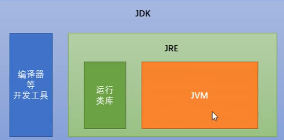

### idea快捷键

```bash
模板补全：输入缩写后按 Tab键可快速生成代码。
  psvm + Tab：生成 main方法 。
  sout + Tab：生成 System.out.println();。
  fori + Tab：生成 for循环 。
  Ctrl+J：查看所有可用的动态模板 。

后缀补全：
  表达式.fori：生成遍历循环。
  表达式.null：生成空值检查 if (expression == null)。
  new MyClass().var：自动生成变量声明 MyClass obj = new MyClass();


重构生成
  Alt + Insert：生成代码，快速生成 Getter/Setter、构造函数、toString()等方法 。
  Shift + F6：安全重命名，重命名变量、方法、类等，并自动更新所有引用 。
  Ctrl + Alt + M：提取方法，将选中的代码块提取成一个独立的方法 。
  Ctrl + Alt + V：提取变量，将表达式结果提取为一个新变量 。
  Ctrl + Alt + T：包裹代码，用 if、try-catch、for等环绕选中的代码

调试：
  Shift + F10：运行当前程序
  Shift + F9：以调试模式运行 。
  F8：步过，逐行执行，不进入方法内部 。
  F7：步入，进入当前行所调用的方法内部 。
  Shift + F8：步出，从当前方法跳出到调用处 。
  F9：恢复程序，继续运行直到下一个断点 。
  Alt + F8：在调试时，选中变量或表达式，按此快捷键可计算其值
```


#### JavaBean 类快速生成

```bash
JavaBean 是一个遵循特定写法的Java类，它具备特点：
	- 这个Java类必须具有一个无参的构造函数
	- 属性必须私有化。
	- 私有化的属性必须通过public类型的方法暴露给其它程序，并且方法的命名也必须遵守一定的命名规范。


- ptg插件，直接生成标准 javaBean
创建类，定义好成员变量后，通过 `右键 -> Ptg to JavaBean` 来生成 get/post 方法
```


````java
public class Animal {
    private String name;
    private int num;


  	//------------------类的构造方法--------------------------------------
    public Animal() {
    }

    public Animal(String name, int num) {
        this.name = name;
        this.num = num;
    }

  	//------------------类对外提供的用于访问私有属性的public方法-----------------------------------
    /**
     * 获取
     * @return name
     */
    public String getName() {
        return name;
    }

    /**
     * 设置
     * @param name
     */
    public void setName(String name) {
        this.name = name;
    }

    /**
     * 获取
     * @return num
     */
    public int getNum() {
        return num;
    }

    /**
     * 设置
     * @param num
     */
    public void setNum(int num) {
        this.num = num;
    }

    public String toString() {
        return "Animal{name = " + name + ", num = " + num + "}";
    }
}
````


### 注释

```java
// 这是单行注释文字

/*
这是多行注释文字
这是多行注释文字
这是多行注释文字
*/

/**
这是文档注释文字
这是文档注释文字
这是文档注释文字
*/
```


### 关键字

```bash
修饰符关键字：public、protected、private、static、final、abstract
访问控制关键字：public、protected、private、default（默认）
类、接口和包关键字：、class、interface、enum、package、import、extends、implements
方法关键字：void、return、this、super
流程控制关键字：if、else、switch、case、default、while、do、for、break、continue、return
异常处理关键字：try、catch、finally、throw、throws
逻辑关键字：true、false、null
其他关键字：new、instanceof、synchronized、transient、volatile、assert
```

### 字面量

```bash
整数字面量：表示整数值，可以使用十进制、八进制（以0开头）和十六进制（以0x或0X开头）表示法。例如：42, 012, 0xFF。
浮点数字面量：表示浮点数值，包括普通的浮点数和科学计数法表示。例如：3.14, 2.0e-5。
字符字面量：表示单个字符，使用单引号括起来。例如：'A', '1', '@'。
字符串字面量：表示一个字符串，使用双引号括起来。例如："Hello, World!", "Java"。
布尔字面量：表示布尔值，只有两个取值：true 和 false。
null 字面量：表示空引用，用于表示对象引用不指向任何有效的对象。
转义序列：一些特殊的字符序列，以反斜线 \ 开头，用于表示无法直接输入的字符，如换行符 \n、制表符 \t 等。
数组字面量：用花括号 {} 表示，用于初始化数组。例如：{1, 2, 3}。
枚举常量：枚举类型的常量值，表示枚举中的特定选项。
字符编码字面量：表示字符的Unicode编码，以 \u 开头，后面跟着四个十六进制数字。例如：\u0041 表示字符 ‘A’
```


### 变量

```java
public class VariableDemo2{
	public static void main(String[] args){
		//1.变量名不允许重复
		//int a = 10;
		//int a = 20;
		//System.out.println(a);

		//2.一条语句可以定义多个变量
		//int a = 10, b = 20, c = 20,d = 20;
		//System.out.println(a);//?
		//System.out.println(b);//?

		//3.变量在使用之前必须要赋值
		int a = 30;
		System.out.println(a);
	}
}
```

### 数据类型

```bash
Java 数据类型是用来定义变量或表达式可以存储的数据类型的分类

#### 基本数据类型：
整数类型：
		byte：8位，范围为 -128 到 127
		short：16位，范围为 -32,768 到 32,767
		int：32位，范围为 -2^31 到 2^31 - 1
		long：64位，范围为 -2^63 到 2^63 - 1
浮点类型：
		float：32位，用于表示单精度浮点数
		double：64位，用于表示双精度浮点数
字符类型：char：16位，用于存储一个 Unicode 字符
布尔类型：boolean：用于表示布尔值，只有两个取值：true 和 false

注意：
- byte类型的取值范围： -128 ~ 127
- int类型的大概取值范围： -21亿多 ~ 21亿多
- 整数类型和小数类型的取值范围大小关系：double > float > long > int > short > byte


#### 引用数据类型
类（Class）：用来创建对象的模板。它定义了对象的属性（成员变量）和方法（成员方法）。通过实例化类，可以创建类的对象，并使用对象调用类的方法。
接口（Interface）：定义了一组方法的规范，但没有实际的方法体。类可以实现一个或多个接口，从而获得接口定义的方法，并在类中实现这些方法。
数组（Array）：数组是一种用于存储相同类型元素的数据结构。它可以是一维数组或多维数组，用于在内存中连续存储多个元素。
枚举（Enum）：枚举是一种特殊的类，用于表示一组预定义的常量。枚举常常用于表示一组相关的值。
字符串（String）：字符串是一种引用数据类型，但它具有特殊的性质，可以像基本数据类型一样进行操作。字符串实际上是一个字符序列，它有许多方法用于处理字符串操作。
自定义引用类型：除了上述内置的引用数据类型，还可以创建自定义的类和接口，以及它们的实例，从而构建更复杂的数据结构和功能


#### 基本数据类型和引用数据类型的区别
基本数据类型：按值传递，在Java虚拟机栈中分配内存空间，并直接存储值本身。当基本数据类型的变量被赋值时，实际上是将该变量中的值复制到另一个变量中，这两个变量之间没有任何关联。
引用数据类型：按引用传递，在Java虚拟机堆中分配内存空间，存储的是对象的引用（内存地址）。当引用数据类型的变量被赋值时，实际上是将该变量中的引用复制到另一个变量中，这两个变量指向同一个对象。
```

```java
public class VariableDemo3{
    public static void main(String[] args){
        //1.定义byte类型的变量
        //数据类型 变量名 = 数据值;
        byte a = 10;
        System.out.println(a);

        //2.定义short类型的变量
        short b = 20;
        System.out.println(b);

        //3.定义int类型的变量
        int c = 30;
        System.out.println(c);

        //4.定义long类型的变量
        long d = 123456789123456789L;
        System.out.println(d);

        //5.定义float类型的变量
        float e = 10.1F;
        System.out.println(e);

        //6.定义double类型的变量
        double f = 20.3;
        System.out.println(f);

        //7.定义char类型的变量
        char g = 'a';
        System.out.println(g);

        //8.定义boolean类型的变量
        boolean h = true;
        System.out.println(h);
    }
}
```

```java
// 使用引用数据类型创建一个对象
String message = new String("Hello, World!");

// 创建一个数组
int[] numbers = new int[5];

// 使用自定义类创建对象
class Person {
    String name;
    int age;
}
Person person = new Person();
person.name = "Alice";
person.age = 30;

// 枚举类型
enum Day {
    MONDAY, TUESDAY, WEDNESDAY, THURSDAY, FRIDAY, SATURDAY, SUNDAY
}
Day today = Day.WEDNESDAY;
```

### 数据内存划分

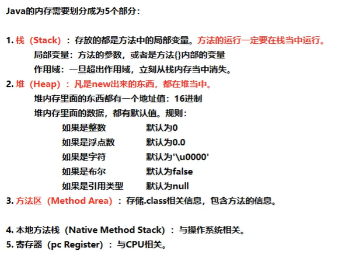

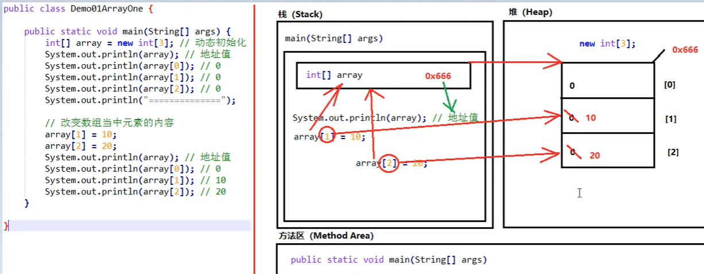


### 类型转换

```bash
1. 自动类型转换
	- 类型相容
	- 目标类型 > 源类型
	- double num1 = 1.2; int num2 = 2; double result = num1 + num2;

2. 强制类型转换
	- (类型名) 表达式
	- double a = 5.2; int b = (int) a;

注意：如果想让整数相除转换为浮点数，则需要让除数或者被除数转换为浮点数才行

3. 保留小数位数
	- String.format("%.2f", num); // 保留两位小数
	- System.out.printf("保留两位小数：%.2f%n", num); // 输出的时候才进行保留两位小数
```

```java
public class Main {
    public static void main(String[] args) {
        // 已知某班有男同学20位，女同学15位，20位男生平均分是87分，15位女生的平均分是85，问全体同学平均分是多少分?
        int total = 20 * 87 + 15 * 85; // 总分
        int num = 20 + 15; // 总人数

        // 平均分（因为总分和总人数都是整数，而为了相除获取浮点数则需要让分子或分母为浮点数才行，所以需要 * 1.0）
        double avg = total * 1.0 / num;
        // double avg = total / (num * 1.0);

        String result = String.format("%.2f", avg);
        System.out.println("平均分为：" + result);

        System.out.printf("平均分为：%.2f%n", avg);
    }
}
```


### 包装类

```bash
包装类定义：使用一个类把基本数据类型的数据包装起来，在包装类中可定义方法来操作基本类型的数据

int->Integer		char->Character		（其余数据类型都是首字母大写（byte、short、long、float、double、boolean））

装箱：把基本类型的数据包装到包装类中（基本类型的数据->包装类）
		0、基本类型转成包装类(直接赋值，自动转换)
				Interger num=2;	Double num2=1.5;
    1、构造方法：
      	Integer(int value) 构造一个新分配的Integer对象，它表示指定的int值。
      	Integer(String s) 构造一个新分配的Integer对象，它表示String参数所指示的int值。
      			(传递的字符串必须是字符串化的数值，否则会抛出异常		如："100"值正确，“a”异常)
    2、静态方法:
      	static Integer valueOf(int i) 返回一个表示指定的int值的Integer实例
      	static Integer valueOf(String s) 返回保存指定的String的值的Integer对象
拆箱：在包装类中去除基本类型的数据（包装类->基本类型的数据）
    1、成员方法（XXXValue()系列方法）：如`intValue()`以int类型返回该Integer的值
```

```java
public static void main(String[] args){
    //构造方法
    Integer in1 = new Integer(1);	//1
    Integer in2 = new Integer("1")	//1

    //静态方法（手动装箱）
    Integer in3 = Integer.valueOf(1);	//1
    //Integer in4 = Integer.valueOf("a");	//NumberFormatException数字格式化异常
    Integer in5 = Integer.valueOf("1");	//1

    //拆箱（手动拆箱）
    int i = in1.intValue();

    //自动装箱与拆箱
    Integer in = 1;		//等同 Integer in = new Integer(1);
    in = in + 2;	//等同 new Integer(in.intValue() + 2) = 3;


  	//ArratList集合无法直接存储整数，可以存储Integer包装类
    ArrayList<Integer> list = new ArrayList<Integer>();
    list.add(1);	//自动装箱 list.add(new Integer(1));
    int a = list.get(0);	//自动拆箱 list.get(0).intValue();
}
```

#### 类型转换

- 基本类型-->字符串

  1. 基本类型数据的值+""	（最简单的方式）
  2. 使用包装类中的静态方法 static String toString(int i) 返回一个表示指定整数的 String 对象。
  3. 使用 String 类中的静态方法 static StringvalueOf(int i) 返回 int 参数的字符串表示形式。

- 字符串-->基本类型

  使用包装类的静态方法 parseXX("字符串")

  ​	Integer类：static int parseInt(String s)

  ​	Double类：static double parseDouble(String s)

```java
//基本类型-->字符串
String s1 = 100 + "";
String s2 = Integer.toString(100);
String s3 = String.valueOf(100);

//字符串-->基本类型
int i1 = Integer.parseInt("100");
//int i2 = Integer.parseInt("a");	//数字格式化异常
```


### 导入包

```bash
为了使用不在同一包中的类，需要在 Java 程序中使用 import 关键字导入这个类：`import 包名.类名;`

导入包注意：
- 一个类同时引用两个来自不同包的同名类：
		- 必须先通过完整类名来区分
- package 和 import 的顺序是固定的
		- package 必须位于第一行
		- 只允许有一个 package 语句
		- 其次是 import
		- 接着是类的声明


快捷键：Eclipse/IntelliJ IDEA：Ctrl+Shift+O 优化导入

陷阱：
	- 导入子包不能访问父包：`import java.*;`不能导入java下的所有子包
	- 默认包：没有声明 package 的类不能被导入
	- 循环依赖：类A导入类B，类B又导入类A
```

```java
// 1. 标准库包
import java.io.*;
import java.util.*;

// 2. 第三方库
import org.springframework.*;
import com.google.common.*;

// 3. 项目内部包
import com.mycompany.myproject.*;

// 静态导入单独分组
import static java.lang.Math.PI;
import static org.junit.Assert.*;

// 错误示例 - 冲突
// import java.util.Date;
// import java.sql.Date;

// 解决方案1：只导入一个，另一个用全限定名
import java.util.Date;

public class Test {
    public void method1() {
        Date utilDate = new Date();
        java.sql.Date sqlDate = new java.sql.Date(utilDate.getTime());
    }

  	// 解决方案2：都不导入，全用全限定名
  	public void method2() {
        java.util.Date utilDate = new java.util.Date();
        java.sql.Date sqlDate = new java.sql.Date(utilDate.getTime());
    }
}
```


### 接收输入Scanner

```bash
如果想接收用户从键盘上输入的内容，在 Java 中可以使用 Scanner（扫描仪）


Scanner input = new Scanner(System.in); // 实例化一个scanner对象

int num = input.nextInt(); // 获取输入的整数（如果输入其他类型则会报错）
String str = input.next(); // 接收输入的字符串
String ch = input.next().charAt(1); // 接收输入的第二个字符
```

```java
import java.util.Scanner;

public class Main {
    public static void main(String[] args) {
        Scanner input = new Scanner(System.in);
        int num = input.nextInt();
        System.out.println("您输入的数字为" + num);
    }
}
```

```java
import java.util.Scanner;

// 输入一个小写字母，输出其对应的大写字母。例如输入q时，会输出Q。
public class Main {
    public static void main(String[] args) {
        Scanner input = new Scanner(System.in);
        char ch = input.next().charAt(0); // 下标为0代表第一个字符
        char bigCh = (char)(ch - 32);
        System.out.println(bigCh);
    }
}
```


### 程序的三大结构

```bash
- 顺序结构：程序只能从第一行开始执行，中间不能跳过某一行代码去执行后续代码。
- 选择结构：让代码有选择地执行，可让某一行或多行代码在条件不符合时不执行。
- 循环结构：让某一行或多行代码可以重复执行多次。


#### 选择结构
1. 关系运算符
		关系表达式的值是一个逻辑值(true | false)。条件成立为真，条件不成立为假。
2. if 选择结构
3. if-else 选择结构
4. 多重 if 选择结构
5. 嵌套 if 选择结构
6. switch 选择结构


#### 循环结构
1. for循环：for(循环变量赋初值; 循环条件; 循环变量增值) { 循环语句; }
2. break和continue
3. while 循环结构
4. do-while 循环结构

注意：switch 中省略 break 会触发「case 穿透」，程序从匹配的 case 开始依次执行后续所有 case 代码，直到遇到 break 或 switch 结束。
```

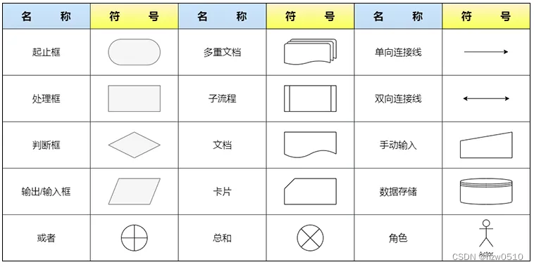

```java
import java.util.Scanner;

public class ControlStructureDemo {
    public static void main(String[] args) {
        Scanner scanner = new Scanner(System.in);

        System.out.println("=== Java 控制结构综合演示 ===");
        System.out.println("请输入一个数字 (1-3 测试选择结构，4-7 测试循环结构)：");

        int choice = scanner.nextInt();

        switch (choice) {
            case 1: demoRelationOperators();  // 关系运算符
                break;
            case 2: demoIfStructures();       // if 选择结构
                break;
            case 3: demoSwitchStructure();    // switch 选择结构
                break;
            case 4: demoForLoop();            // for 循环
                break;
            case 5: demoWhileLoop();          // while 循环
                break;
            case 6: demoDoWhileLoop();        // do-while 循环
                break;
            case 7: demoBreakContinue();      // break 和 continue
                break;
            default: System.out.println("输入错误，程序结束。");
        }

        scanner.close();
    }

    // 1. 关系运算符演示
    public static void demoRelationOperators() {
        System.out.println("\n=== 1. 关系运算符演示 ===");

        int a = 10, b = 20, c = 10;

        System.out.println("a = " + a + ", b = " + b + ", c = " + c);
        System.out.println("a == b: " + (a == b));  // false
        System.out.println("a != b: " + (a != b));  // true
        System.out.println("a > b: " + (a > b));    // false
        System.out.println("a < b: " + (a < b));    // true
        System.out.println("a >= c: " + (a >= c));  // true
        System.out.println("b <= c: " + (b <= c));  // false

        // 关系表达式的值是 boolean 类型
        boolean result1 = a == c;  // true
        boolean result2 = b > c;   // true
        System.out.println("a == c 的结果: " + result1);
        System.out.println("b > c 的结果: " + result2);
    }

    // 2. if 选择结构演示
    public static void demoIfStructures() {
        System.out.println("\n=== 2. if 选择结构演示 ===");

        Scanner scanner = new Scanner(System.in);

        System.out.println("请输入你的年龄: ");
        int age = scanner.nextInt();

        // 2.1 简单 if 结构
        System.out.println("\n--- 简单 if 结构 ---");
        if (age >= 18) {
            System.out.println("你已经成年了！");
        }

        // 2.2 嵌套 & 多重 if 结构
        System.out.println("\n--- 嵌套 if 结构 ---");
        System.out.println("请输入你的性别 (1:男, 2:女): ");
        int gender = scanner.nextInt();

        if (age >= 18) {
            if (gender == 1) {
                System.out.println("你是成年男性。");
            } else if (gender == 2) {
                System.out.println("你是成年女性。");
            } else {
                System.out.println("性别输入错误。");
            }
        } else {
            System.out.println("你还没有成年。");
        }

        scanner.close();
    }

    // 3. switch 选择结构演示
    public static void demoSwitchStructure() {
        System.out.println("\n=== 3. switch 选择结构演示 ===");
      	int num = 2;
        switch (num) {
            case 1:
                System.out.println("执行case 1");
                break;
            case 2:
                System.out.println("执行case 2");
                break;
            case 3:
                System.out.println("执行case 3");
                break;
            default:
                System.out.println("执行default");
        }

				// 无 break产生的异常
      	switch (num) {
            case 1:
                System.out.println("执行case 1");
                // 无break
            case 2:
                System.out.println("执行case 2");
                // 这里没有break，会发生case穿透
            case 3:
                System.out.println("执行case 3");
                break; // 直到这里才跳出，中断循环执行
            default:
                System.out.println("执行default");
        }

        // Java 12+ 新的 switch 表达式（语法糖）
        System.out.println("\n--- switch 表达式 (Java 12+) ---");
      	int day = 2;
        String dayType = switch (day) {
            case 1, 2, 3, 4, 5 -> "工作日";
            case 6, 7 -> "休息日";
            default -> "无效";
        };
        System.out.println("今天类型: " + dayType);

        scanner.close();
    }

    // 4. for 循环演示
    public static void demoForLoop() {
        System.out.println("\n=== 4. for 循环演示 ===");

        // 4.1 基本 for 循环
        System.out.println("--- 基本 for 循环 (1-10的奇数) ---");
        for (int i = 1; i <= 10; i += 2) {
            System.out.print(i + " ");
        }
        System.out.println();

        // 4.4 嵌套 for 循环 (乘法表)
        System.out.println("\n--- 嵌套 for 循环 (九九乘法表前3行) ---");
        for (int i = 1; i <= 3; i++) {
            for (int j = 1; j <= i; j++) {
                System.out.print(j + "×" + i + "=" + (i * j) + "\t");
            }
            System.out.println();
        }

        // 4.5 增强 for 循环 (for-each)
        System.out.println("\n--- 增强 for 循环 (遍历数组) ---");
        int[] numbers = {10, 20, 30, 40, 50};
        for (int num : numbers) {
            System.out.print(num + " ");
        }
        System.out.println();

        // 4.6 无限循环 (需要 break 退出)
        System.out.println("\n--- 无限 for 循环 (打印5次后退出) ---");
        int count = 0;
        for (;;) {  // 相当于 while(true)
            System.out.println("这是第 " + (++count) + " 次循环");
            if (count >= 5) {
                break;
            }
        }
    }

    // 5. while 循环演示
    public static void demoWhileLoop() {
        System.out.println("\n=== 5. while 循环演示 ===");

        // 5.1 基本 while 循环：计算 1-100 的和
        System.out.println("\n--- 计算 1-100 的和 ---");
        int sum = 0;
        int num = 1;
        while (num <= 100) {
            sum += num;
            num++;
        }
        System.out.println("1-100 的和是: " + sum);

        // 5.3 输入验证
        System.out.println("\n--- 输入验证 (必须输入正数) ---");
        Scanner scanner = new Scanner(System.in);
        int input = 0;

        while (input <= 0) {
            System.out.print("请输入一个正整数: ");
            input = scanner.nextInt();
            if (input <= 0) {
                System.out.println("输入错误，请重新输入！");
            }
        }
        System.out.println("你输入的是: " + input);

        // 5.4 无限循环
        System.out.println("\n--- 无限 while 循环 (打印3次后退出) ---");
        int counter = 0;
        while (true) {
            System.out.println("循环次数: " + (++counter));
            if (counter >= 3) {
                System.out.println("达到3次，退出循环");
                break;
            }
        }
        scanner.close();
    }

    // 6. do-while 循环演示
    public static void demoDoWhileLoop() {
        System.out.println("\n=== 6. do-while 循环演示 ===");
        // 至少执行一次的特点
        int j = 10;
        do {
            System.out.println("j = " + j);  // 即使条件不满足，也会执行一次
            j++;
        } while (j < 5);
    }

    // 7. 带标签的 break 和 continue 演示
    public static void demoBreakContinue() {
        // 7.5 带标签的 break (跳出多层循环)
        System.out.println("\n--- 带标签的 break ---");
        outerLoop:  // 标签
        for (int i = 1; i <= 3; i++) {
            for (int j = 1; j <= 3; j++) {
                if (i == 2 && j == 2) {
                    System.out.println("i=" + i + ", j=" + j + " 时跳出外层循环");
                    break outerLoop;  // 直接跳出外层循环
                }
                System.out.println("i=" + i + ", j=" + j);
            }
        }

        // 7.6 带标签的 continue
        System.out.println("\n--- 带标签的 continue ---");
        outerLoop2:
        for (int i = 1; i <= 3; i++) {
            for (int j = 1; j <= 3; j++) {
                if (i == 2 && j == 2) {
                    System.out.println("跳过 i=2 时的剩余循环");
                    continue outerLoop2;  // 继续外层循环的下一次迭代
                }
                System.out.println("i=" + i + ", j=" + j);
            }
        }
    }
}
```


### 异常处理

```bash
处理异常的关键字：try、catch、finally、throw、throws
  - try：执行可能产生异常的代码
  - catch：捕获异常
  - finally：表示在最后，无论是否发生异常，代码都会执行
  - throws：声明方法可能要抛出的各种异常
  - throw：手动抛出异常

异常的方法（Exception）
	- void printStackTrace()：输出异常的堆栈信息
	- String getMessage()：返回异常信息描述字符串，是 printStackTrace() 输出信息的一部分

多路异常捕获
	- 排列 catch 语句的顺序：先子类后父类
	- 发生异常时按顺序逐个匹配
	- 只执行第一个与异常类型匹配的 catch 语句


	  try {
      // 代码段 1
      // 可能产生异常的代码段 2
    } catch (异常类型 ex) {
      // 对异常进行处理的代码段 3
      System.out.println(ex.getMessage());
      ex.printStackTrace();
    } finally {
      // 最后执行的代码段 4
    }
```

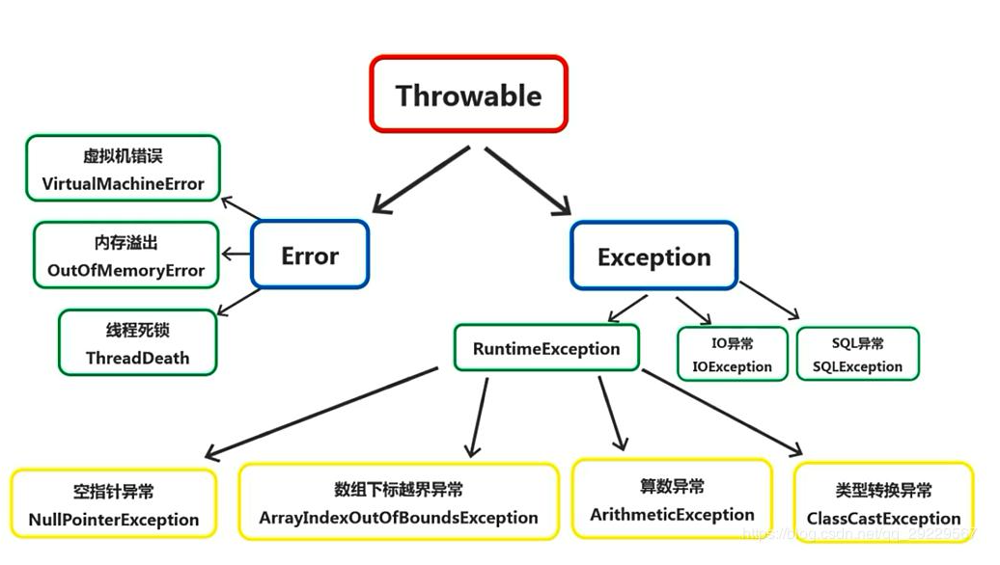

```java
Scanner input = new Scanner(System.in);
int result = 0;

// 多路异常捕获
try {
    System.out.println("请输入被除数");
    int num1 = input.nextInt();
    System.out.println("请输入除数");
    int num2 = input.nextInt();
    result = num1 / num2;
    System.out.println(result);
} catch (InputMismatchException ex) { // 捕获类型错误
  	System.err.println("被除数和除数必须是整数");
} catch (ArithmeticException ex) {// 捕获算数异常
  	System.err.println("除数不能为0");
} catch (Exception ex) { // 捕获其他异常
		System.err.println("其他异常");
} finally {
		System.out.println("程序结束");
}
```

#### 自定义异常

```java
public class CustomException extends Exception {
    public CustomException(String msg) {
        super(msg);
    }
}

public class Test {
    public static void main(String[] args) {
        try {
            throw new CustomException("自定义错误");
        } catch (CustomException e) {
            System.out.println(e.getMessage()); // 自定义错误
        }
    }
}
```


### 字符串

```bash
程序中所有的双引号字符串，都是String类的对象


- 将int[]数组转变为字符串格式：String intStr = Arrays.toString(intArray);
- String-->数组：toCharArray
- 数组重新排序：Arrays.sort(数组);	//默认字母/从小到大排序
```

```java
//使用空参构造
String str1 = new String();//str1是空的字符串

//根据字符数组创建
char[] arr = {'A','B','C'};
String str2 = new String(arr);//str2为ABC

//根据字节数组创建字符串
byte[] arr2 = {97,98,99};
String str3 = new String(arr2);//str3为abc

//直接创建
String str = "hello";
```

#### 内容比较 equals与equalsIgnoreCase

```java
//区分大小写 equals()
String str1 = "Hello";
String str2 = "hello";
System.out.println(str1.equals(str2));	//false
Sysytem.out.println("Hello".equals(str1));	//true

//不区分大小写equalsIgnoreCase()
System.out.println(str1.equalsIgnoreCase(str2));	//true
```

#### 索引查找

```java
String str1 = "Hello";
String str2 = "World";
//拼接字符串
String str3 = str1.concat(str2);	//HelloWorld

//获取指定索引位置的单个字符
char ch = "Hello".chatAt(1);	//e

//查找参数字符串在本来字符串当中出现的第一次索引位置（-1代表没有）
str1.indexOf("llo");	//2
```

#### 字符串转换

```java
String str1 = "HelloWorld";
//字符串截取	substring
String str2 = str1.subsring(5);	//World

//字符串替换	replace()
String str3 = str1.replace("l","*");	//He**oW*rld

//分割字符串	splice
String str4 = "aaa,bbb,ccc";
String[] array1 = str1.splice(",");
```


#### String类与StringBuilder类

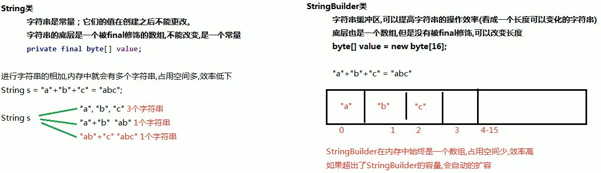

```java
/*StringBuilder常用方法
public StringBuilder append(...);	//添加任意类型数据的字符串形式，并返回当前对象本身
public String toString();	//将当前StringBuilder对象转换为String对象
*/

/*1.构造方法*/
StringBilder();	//创建一个空的字符串
StringBuilder(String s);	//根据传入的内容创建一个字符串缓冲区

/*2.成员方法*/
StringBuilder append(Object obj);	//添加内容
StringBuilder reverse();	//反转内容
String toString();	//将缓冲区内容转为字符串
```

````java
StringBuilder sb = new StringBuilder();
sb.append("hello,").append("world~");	//hello,world~
sb.reverse();	//将数组内容翻转
````


### 数组 Arrays

```bash
数组是一组相同类型的变量，它们往往是为了表示同一批对象的统一属性。

数组的特性
  - 数组是一种引用数据类型
  - 数组当中的多个数据类型必须统一
  - 数组长度在程序运行期间不可改变
  - 初始化（动态初始化-指定长度、静态初始化-指定内容）
  - 确定数组内容用静态初始化，不确定用动态初始化

学习顺序
	1. 数组的定义和使用
	2. 数组求最值：遍历逐个查找对比
	3. 数组插入：先确认位置，然后先把插入所在位置及之后的元素后移，然后再插入元素
	4. 删除元素：先确认位置，然后把删除所在位置及之后的元素前移（会覆盖）
	5. 顺序查找
	6. 二分法查找
			关注左右边界
			循环条件：left <= right
			计算中间位置：(left + right) / 2
			动态调整左右边界
			如100个数字最多查找7次，因为2的7次方 > 100
	7. 冒泡排序算法


#### 空指针异常NullPointerException
数组必须进行new初始化才能使用其中元素，如果只赋一个null值，没有进行new创建，则发生空指针异常 NullPointerException
原因：没new初始化	-->	解决：new初始化
```

```java
//动态初始化，指定长度
//数据类型[] 数组名称 = new 数据类型[数组长度]
double[] arrayA = new double[10];

//静态初始化,指定内容
//数据类型[] 数组名称 = new 数据类型[]{元素1,元素2,元素3,...,元素n}
double[] arrayB = new double[]{1,2,3,4};	//长度是4
String[] arrayC = new String[]{"hello","hi"};	//长度是2

//省略格式
double[] arrayB ={1,2,3,4};

//数组的输出
System.out.println(arrayB);	//输出数组的首地址
System.out.println(arrayB[0]);	//输出数组第一位数：1
//数组的长度
int len = arrayB.length;
```

#### 数组插入

```java
import java.util.Scanner;

public class ArrayInsert {
    // 在一个升序排序的成绩数组中，增加一个学生的成绩，并保证数组元素保持升序排列
    public static void main(String[] args) {
        int[] nums = new int[5];
        nums[0] = 78;
        nums[1] = 85;
        nums[2] = 95;
        nums[3] = 98;

        Scanner input = new Scanner(System.in);
        int scope = input.nextInt(); // 保存插入的分数

        // 1.先查找出插入成绩的位置
        int index = nums.length - 1;
        for (int i = 0; i < nums.length; i++) {
            if (scope < nums[i]) {
                index = i;
                break;
            }
        }

        // 2.把要插入成绩位置及其之后的元素都往后移
        for (int i = nums.length - 1; i > index; i--) {
            nums[i] = nums[i - 1];
        }

        // 3.插入成绩
        nums[index] = scope;

        // 打印最新结果
        for (int i = 0; i <= nums.length - 1; i++) {
            System.out.printf(nums[i] + "\t");
        }
    }
}
```

#### 二分法查找

```java
import java.util.Scanner;

public class BinarySearch {
    // 二分法查找：猜想一个 1~100 之间的数，根据猜测的数字提示“猜大了”、“猜小了”、“猜对了”。使用二分法模拟猜数字过程
    public static void main(String[] args) {
        System.out.println("请输入一个数字，范围是：(1~100之间，包含1和100)");
        Scanner input = new Scanner(System.in);
        int num = input.nextInt();

        int left = 1;
        int right = 100;
        while(left <= right) {
            int middle = (left + right) / 2;

            // 已经查找到
            if (middle == num) {
                System.out.println(middle + ",猜对了");
                break;
            }

            // 边界右移
            if (middle < num) {
                left = middle + 1;
                System.out.println(middle + ",猜小了");
            }

            // 边界左移
            if (middle > num) {
                right = middle - 1;
                System.out.println(middle + ",猜大了");
            }

        }
    }
}
```


## 常用API

### 系统 System

```java
// System.currentTimeMillis() 获取当前时间毫秒值（可用来计算运行程序所需要时间、或用作文件命名-防止文件重名）
long start = System.currentTimeMillis();
// ...中间执行的代码(计算该段代码的执行时间)
long end = System.currentTimeMillis();
System.out.println(end - start);	// xx毫秒


// 终止当前运行的虚拟机
System.exit(0); // 当前虚拟机是正常停止
System.exit(1); // 非0：当前虚拟机异常停止


// 拷贝数组：System.arraycopy(数据源数组, 起始索引, 目标数组, 起始索引, 拷贝个数);
int[] arr1 = {1,2,3,4,5,6,7,8,9};
int[] arr2 = {9,8,7,6,5,4,3,2,1};
System.arraycopy(arr1, 0, arr2, 0, 4);	//把arr1数组的前4个数字复制到arr2数组中
System.out.println(arr2);	  //1,2,3,4,5,4,3,2,1
```

### 运行 Runtime

```bash
常用方法：
  - 当前系统的运行环境对象：public static Runtime getRuntime()
  - 停止虚拟机：public void exit(int status)
  - 获取CPU的线程数：public int availableProcessors()
  - JVM能从系统中获取总内存大小(单位byte)：public long maxMemory()
  - JVM已经从系统中获取总内存大小(单位byte)：public long totalMemory()
  - JVM剩余内存大小(单位byte)：public long freeMemory()
  - 运行cmd命令：public Process exec(String command)
```

```java
import java.io.IOException;

public class Test {
    public static void main(String[] args) {
        // 获取当前运行环境对象
        Runtime r1 = Runtime.getRuntime();
        Runtime r2 = Runtime.getRuntime();
        System.out.println(r1 == r2); // true

        // 获取CPU的线程数
        System.out.println(r1.availableProcessors()); // 24
        System.out.println(Runtime.getRuntime().maxMemory() / 1024 / 1024);
        System.out.println(Runtime.getRuntime().totalMemory() / 1024 / 1024);
        System.out.println(Runtime.getRuntime().freeMemory() / 1024 / 1024);

        /**
         * 运行cmd命令
         *  shutdown：关机（加上下述参数才能执行）
         *      -s：默认在1分子后执行
         *      -s -t 指定秒：指定关机时间
         *      -a：取消关机操作
         *      -r：关机并重启
         */
        try {
            Runtime.getRuntime().exec("shutdown -s -t 36000");
        } catch (IOException e) {
            throw new RuntimeException(e);
        }

        // 停止虚拟机
        Runtime.getRuntime().exit(0);
    }
}
```


### 高精度数值 BigDecimal

```bash
BigDecimal 作用：
	- 解决小数运算精度丢失问题（浮点数直接运算会出现精度误差）
	- 表示较大的小数（int和long数值范围有限，BigDecimal无数值范围限制(仅受JVM内存限制)）
	- 灵活控制小数位数与舍入规则（针对金额格式化(保留2位小数)、四舍五入）


初始化 BigDecimal
  1. 构造方法：精准初始化，无精度丢失
  		传入参数格式推荐为正数或字符串，如果传入浮点数可能会出现结果偏差(因此可把浮点数转化为字符串传入)
      		BigDecimal num1 = new BigDecimal("0.1");
  2. 静态工厂方法：
  		底层自动将 double 转为字符串后再调用new BigDecimal，规避精度问题（小数常用）
      		BigDecimal num2 = BigDecimal.valueOf(0.2);
  注意：
    - 如果表示的数，没超double的取值范围，建议使用 valuleOf。
    - 如果表示的数，超出double的取值范围，建议使用 new BigDecimal。
    - 如果使用valueof，且传递的是 0~10之间的整数，包含0和10，方法会返回已经创建好的对象，不会重新 new。
    		BigDecimal.valueOf(10) == BigDecimal.valueOf(10); // true
    		BigDecimal.valueOf(10.0) == BigDecimal.valueOf(10.0); // false


加减乘除运算
  - 加法：add
      BigDecimal sum = num1.add(num2);
  - 减法：subtract
      BigDecimal diff = num1.subtract(num2);	// num1-num2
  - 乘法：multiply
      BigDecimal product = num1.multiply(num2);	// num1 * num2
  - 除法：divide(除数)。若除不尽会抛出 ArithmeticException，不推荐直接使用
      BigDecimal quotient = num1.divide(num2);
  - 安全除法：divide(除数, 保留小数位数, 舍入规则)
      BigDecimal quotient = num1.divide(num2, 2, RoundingMode.HALF_UP);


舍入规则
	- 四舍五入：RoundingMode.HALF_UP
  - 五舍六入：RoundingMode.HALF_DOWN
  - 向上取整：RoundingMode.UP
  - 向下取整：RoundingMode.DOWN
  - 向零取整：RoundingMode.TOWARD_ZERO
```

```java
// 正确初始化
BigDecimal a = BigDecimal.valueOf(0.1);
BigDecimal b = new BigDecimal("0.2");
BigDecimal num = new BigDecimal("123.456");

/**
 * 加减乘除运算
 */
// 加法
BigDecimal sum = a.add(b); // 0.1 + 0.2 = 0.3

// 减法
BigDecimal diff = a.subtract(b); // 0.1 - 0.2 = -0.1

// 乘法
BigDecimal product = a.multiply(b); // 0.1 * 0.2 = 0.02

// 安全除法（保留2位小数，四舍五入）
BigDecimal quotient = new BigDecimal("10").divide(new BigDecimal("3"), 2, RoundingMode.HALF_UP);
System.out.println("10 / 3 = " + quotient); // 10 / 3 = 3.33


/**
 * 设置小数位数
 */
// 保留2位小数，四舍五入
BigDecimal num2 = num.setScale(2, RoundingMode.HALF_UP); // 123.45
int scale = num2.scale(); // 获取小数位数，输出 2


/**
 * 比较大小 compareTo
 *  返回值 0：两个数值相等；
 *  返回值 >0：当前对象大于参数对象；
 *  返回值 <0：当前对象小于参数对象
 */
if (a.compareTo(b) < 0) {
    System.out.println(a + " 小于 " + b);
} else if (a.compareTo(b) == 0) {
    System.out.println(a + " 等于 " + b);
} else {
    System.out.println(a + " 大于 " + b); // 0.1 小于 0.2
}


/**
 * 类型转换
 */
// 1. BigDecimal → 字符串
String str = num.toString(); // 输出 "123.456"

// 2. BigDecimal → int（需确保数值在int范围内，否则抛异常）
int intVal = num.intValue(); // 输出 123（小数部分直接舍去）

// 3. BigDecimal → long（同理，需在long范围内）
long longVal = num.longValue(); // 输出 123

// 4. BigDecimal → double（可能丢失精度，仅在非高精度场景使用）
double doubleVal = num.doubleValue(); // 输出 123.456

// 5. 字符串/基本类型 → BigDecimal（参考初始化部分）
BigDecimal fromStr = new BigDecimal("123.456");
BigDecimal fromLong = BigDecimal.valueOf(123L);


/**
 * 常用方法
 */
// 1. 获取绝对值
BigDecimal negativeNum = new BigDecimal("-123.456");
BigDecimal absNum = negativeNum.abs(); // 输出 123.456

// 2. 获取最大值/最小值
BigDecimal maxNum = a.max(b); // 输出 0.2
BigDecimal minNum = a.min(b); // 输出 0.1

// 3. 取反（正负转换）
BigDecimal negNum = a.negate(); // 输出 -0.1

// 4. 判断是否为零
boolean isZero = a.equals(BigDecimal.ZERO); // false
```

#### BigDecimal 底层存储方式

```bash
BigDecimal 会先把传入的值转换成字符串，然后将每个字符转化成 ASCII 中所对应的数字，并存储到一个数组中。

例如：BigDecimal bd = new BigDecimal("0.226");
			内部转化顺序：'0.226' -> ['0', '.', '2', '2', '6']  -> [48, 46, 50, 50, 54]
```

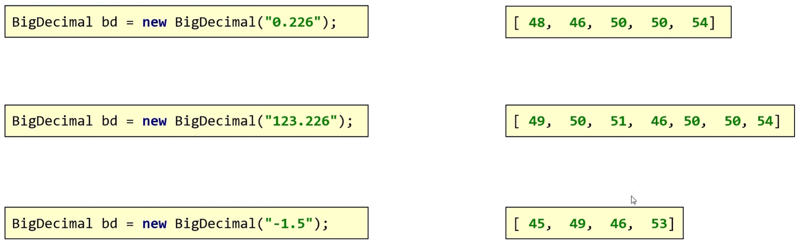


### 枚举类型

```bash
枚举指由一组固定的常量组成的类型，当某种类型只能取固定范围内的值时，可以定义为枚举类型。

[访问修饰符] enum 枚举名称 {
	值1, 值2, ...
}
```

```java
public class Test {
    public enum WeekDay {
        MONDAY, TUESDAY, WEDNESDAY, THURSDAY, FRIDAY, SATURDAY, SUNDAY
    }

    public static void main(String[] args) {
        System.out.println(WeekDay.MONDAY); // MONDAY
    }
}
```


### 时间 Date

```bash
格林尼治时间(Greenwich Mean Time) 简称 GMT。
目前时间标准时间（UTC） 已经替换为：原子钟。
中国标准时间：世界标准时间 + 8小时


Calendar 代表系统当前时间的日历对象，可以单独修改、获取时间中的年、月、日。
注意：Calendar 是一个抽象类，不能直接创建对象。


JDK8增加的时间类（不提供变更时间的类）
  Date类
      - ZoneId：时区
      - Instant：时间戳
      - ZoneDateTime：带时区的时间
  日期格式化类-SimpleDateFormat
      - DateTimeFormatter：用于时间的格式化和解析
  - 日历类 Calendar
      - LocalDate：年、月、日
      - LocalTime：时、分、秒
      - LocalDateTime：年、月、日、时、分、秒
  - 工具类
      - Duration：时间间隔（秒、纳秒）
      - Period：时间间隔（年、月、日）
      - ChronoUnit：时间间隔（所有单位）
```

```java
import java.text.ParseException;
import java.text.SimpleDateFormat;
import java.util.Date;
import java.util.Calendar;

public class Test {
    public static void main(String[] args) throws ParseException {
        // 时间格式化
        SimpleDateFormat sdf = new SimpleDateFormat("yyyy年MM月dd日 HH:mm:ss EE");
        Date d = new Date(0L);
        String str = sdf.format(d);
        System.out.println(str); // 1970年01月01日 08:00:00 周四

        // 字符串转时间
        SimpleDateFormat sdf2 = new SimpleDateFormat("yyyy-MM-dd");
        Date d2 = sdf2.parse("2025-12-30");
        System.out.println(d2); // Tue Dec 30 00:00:00 CST 2025

        // 日期提取
        Calendar c = Calendar.getInstance(); // 把时间中的纪元、年、月、日、时、分、秒等放入一个数组
        Date day = new Date();
        c.setTime(day);

        c.set(Calendar.YEAR, 2025);
        c.set(Calendar.MONTH, 12 - 1); // 设置为12月份(月份需减一，如果不设置-1且超出12月份，则会对年份转换)
        c.set(Calendar.DAY_OF_MONTH, 31);

        int year = c.get(Calendar.YEAR);
        int month = c.get(Calendar.MONTH) + 1;
        int date = c.get(Calendar.DAY_OF_MONTH);
        int week = c.get(Calendar.DAY_OF_WEEK);
        String[] weekList = {"周日", "周一", "周二", "周三", "周四", "周五", "周六"};
        System.out.println(year + "-" + month + "-" + date + " " + weekList[week - 1]); // 2025-12-31 周三
    }
}

```


### 数组 Arrays

```bash
- 数组拼接成字符串：static String toString(数组)

- 二分法查找元素：static int binarySearch(数组, 查找的元素)
		注意：如果查找的数在数组中不存在，则返回值是 `- arrLength - 1`；否则返回数组下标

- 拷贝数组：static int[] copyOf(原数组, 新数组长度)
			如果新数组长度小于老数组长度，会部分拷贝；
			如果新数组长度大于老数组长度，会补上默认初始值

- 指定范围内拷贝数组：static int[] copyOfRange(原数组, 起始索引, 结束索引)
			包左不包右：包含起始索引下标的数据，不包含结束索引的数据

- 填充数组：static void fill(数组, 元素)

- 使用快速排序进行升序排列：static void sort(数组)

- 按指定规则排序：static void sort(数组, 排序规则)
		第二个参数是一个接口，在调用方法时需传递这个接口的实现类对象作为排序规则。
		这个实现的底层原理：插入排序 + 二分查找方式进行排序
			1. 默认把0索引的数据当作有序序列，1索引到最后的数据都是无序序列；
			2. 逐个遍历无序序列得到每个元素(假设为A元素)，把这些元素逐个在有序序列中根据二分查找进行插入数据。
			3. 把A元素使用二分查找跟插入点的元素进行比较（比较规则为 compare方法的方法体）
					3-1. 如果方法返回值是负数，拿A继续跟二分的左边数据进行比较
					3-2. 如果方法返回值是正数，拿A继续跟二分的右边元素进行比较
					3-3. 如果方法返回值是0，也拿A跟二分的后边元素进行比较
					直到能确定A的最终位置为止。
		compare(o1,o2)的参数：
			o1：表示在无序序列中，遍历得到的每一个元素
			o2：有序序列中的元素
```

````java
import java.util.Arrays;
import java.util.Comparator;

public class Test {
    public static void main(String[] args) {
        int[] arr = {1, 2, 3, 4, 5, 6, 7, 8, 9, 10};
        System.out.println(Arrays.binarySearch(arr, 10)); // 9
        System.out.println(Arrays.binarySearch(arr, 20)); // -11

        int[] newArr1 = Arrays.copyOf(arr, 2); // [1, 2]
        int[] newArr2 = Arrays.copyOf(arr, 12); // [1, 2, 3, 4, 5, 6, 7, 8, 9, 10, 0, 0]
        System.out.println(Arrays.toString(newArr1));
        System.out.println(Arrays.toString(newArr2));

        int[] newArr3 = Arrays.copyOfRange(arr, 0, 9); // [1, 2, 3, 4, 5, 6, 7, 8, 9]
        System.out.println(Arrays.toString(newArr3));

        // 自定义排序
        Integer[] array = {2, 3, 6, 7, 5, 1, 4, 9, 8};
        Arrays.sort(array, new Comparator<Integer>() {
            @Override
            public int compare(Integer o1, Integer o2) {
                return o2 - o1;
            }
        });
        System.out.println(Arrays.toString(array)); // [9, 8, 7, 6, 5, 4, 3, 2, 1]
    }
}
````


### Lambda表达式

```bash
函数式编程（Functional programming）是一种思想特点，忽略面对对象的复杂语法，强调做什么，而不是谁去做。
Lambda 表达式是 JDK8 开始的一种新语法形式，是函数式思想的体现。

函数式接口：有且仅有一个抽象方法的接口叫函数式接口，接口上方可加 `@FunctionalInterface` 注解。

作用：
	- 用来简化匿名内部类的书写
	- 只能简化函数式接口的匿名内部类的写法


语法：`() -> { 方法体 }`
		- `()`：对应方法的形参
		- `->`：固定格式
		- `{}`：对应方法的方法体

lambda 的省略规则：
	1. 参数类型可省略不写
	2. 如果只有一个参数，参数类型可省略，同时 `()` 也可省略
	3. 如果 lambda 表达式的方法提只有一行，大括号、分号、return 可以同时省略不写
```

```java
import java.util.Arrays;
import java.util.Comparator;

public class Test {
    public static void main(String[] args) {
        Integer[] array = {2, 3, 6, 7, 5, 1, 4, 9, 8};

        // 函数式接口的匿名内部类实现
        Arrays.sort(array, new Comparator<Integer>() {
            @Override
            public int compare(Integer o1, Integer o2) {
                return o2 - o1;
            }
        });

        // lambda 写法
        Arrays.sort(array, (o1, o2) -> {
            return o2 - o1;
        });

        // lambda 简写
        Arrays.sort(array, (o1, o2) -> o2 - o1);
    }
}
```


## 面向对象

```bash
1. 方法定义
方法是若干语句的功能集合。
定义方法格式：`修饰符 返回值类型 方法名称(参数类型  参数，...){方法体     return 返回值；}`

修饰符-->（public、static）


2. 方法调用
- 单独调用：方法名称（参数）
- 打印调用：System.out.println(方法名称（参数）);
- 赋值调用：返回值类型 变量名 = 方法名称（参数）;

注意：返回值类型为void的方法只能单独调用，不能进行打印或赋值调用
```

```java
/*
public static void 方法名称(){
    方法体;
}
调用格式：方法名称();
注意：
1、方法定义的先后顺序无要求
2、方法定义必须是挨着的，不能再方法内部定义另外一个方法
3、方法定义后，自身不会执行；如果希望执行，则需要对方法进行调用
*/

public static void main(String[] args){
    System.out.println(abc(2,5));	//调用abc方法
}

//定义的abc方法
public static int abc() {
    System.out.println("新定义的方法");
    int result = a + b;
    return result;
}
```


### 面向对象思想

```bash
面向过程：（强调步骤）当需要实现一个功能时，每一个步骤都需要详细处理
面向对象：（强调对象）当需要实现一个功能时，不关心具体的步骤，而是找一个JDK中的类来帮忙实现
```

```java
import java.util.Arrays;
public class Test {
    public static void mian(String[] args) {
        int[] array = {1,2,3,4,5,6,7,8,9,0};
        //要求打印格式为1,2,3,4,5,6,7,8,9,0

         //面对过程
        for(int i=0;i<array.length;i++){
            System.out.println(array[i]);

        //面对对象
        //找一个JDK提供的Arrays类
        System.out.println(Arrays.toString(array));
    }
}
```

### 类与对象的区别

```bash
1. 类是对某一类事物的描述，是抽象的；对象是一类事物的实例，是具体的。
	- 类是对象的模板(抽象化)，对象是类的实体(实例化)。

2. 对象是函数、变量的集合体；而类是一组函数和变量的集合体。
  - 即类是一组具有相同属性的对象集合体。

3. UML的类图和对象图之间的区别是：
	- 类图中类名首字母大写，对象图中的对象名首字母小写。
  - 对象名下有一条下划线，而类名没有。

4. 类的数据值是共享的，一个实例能访问它所属类的类数据值；

5. 先有类，才有类的实例——对象。
	- 应用在创建某个类的实例（对象）之前，这个类必须被定义。

6. 实例方法和类方法的区别在于：实例方法属于单个对象，类方法属于类。
```

```java
public class Student {
    //成员变量（属性）:
    String name; // 姓名
    int age; // 年龄

    //成员方法（行为）:
    public void eat(String food) {
      	System.out.println("吃：" + food);
    }
}
```

### 类图

```bash
1.0 定义
类图是面向对象系统建模中最常用和最重要的图，是定义其它图的基础。类图主要是用来显示系统中的类、接口以及它们之间的静态结构和关系的一种静态模型。
这里要注意四个关键字：类、接口、静态结构、关系


1.1 表示一个类
第一行，表示类的名字，如 Person；
第二行，表示类的属性，如 name:string = ""，格式为属性名：类型 = 默认值，其中可以不包含默认值；
第三行，表示类的方法，如 sayHello(name)，格式为方法名（参数列表）：返回值，其中可以不含参数，无返回值。
注意，+表示属性是公开(public)、-表示私有(private)、`#`表示保护(protect)，static静态方法


1.2 表示一个接口
第一行，明确写上<<接口>>的标识，然后换行写下接口名；
第二行，表示接口需要实现的类方法。


1.3 类的其他表达
简单类、多例类、活动类等，这些在类图中并不常用，一般如何一个类只有方法没有属性，则第二行空着即可。


2.0 关系
表示类的关系总共有6种，这6种又可以分为3类。
第一类，泛化。表达了is a的关系模型，当A以某种形式是一个B时，就是这种关系，包含了有2种关系：继承、实现。
第二类，关联。表达了has a的关系模型，当A拥有一个B时，就是这种关系，包含了有3种关系：聚合、组合、关联。
第三类，依赖。表达了use a的关系模型，当A使用了一个B时，就是这种关系，包含了1种关系：依赖。

2.1 继承关系（鸟类继承自动物类）
继承使用一个实线+空心三角箭头，从子类指向父类即表示一个继承

2.2 实现关系（大雁实现了飞翔接口）
实现使用一个虚线+空心三角箭头，从实例指向接口即表示一个实现。
泛化关系（继承、实现都是空心三角箭头，指向实体是实线、指向虚有的接口则是虚线）

2.3 聚合关系（大雁聚集在一起形成了雁群，但是离开雁群的大雁依然可以存在）
聚合使用一个实线+空心菱形箭头，从整体指向局部即表示一个聚合。
注意，聚合关系只是将一些对象聚集在一起，但他们的关联是弱关联，局部对象可以脱离整体对象而单独存在

2.4 组合关系（翅膀是组成鸟的局部，翅膀不能脱离一个整体（鸟）而单独存活）
组合使用一个实线+实心菱形箭头，从整体指向局部即表示一个组合。
组合又叫合成，是由局部合起来才成为一个整体，他们密不可分，是强关联关系，局部脱离了整体就不存在

2.5 关联关系（气候的变更影响了企鹅的生存，合适的气候能让企鹅生存。但企鹅不是气候的实例，企鹅不能使用一个气候）
当一个关系明显是has a的拥有关系，但不是聚合也不是组合那样来描述整体与局部时，就应该考虑使用关联关系来描述，事实上，前两者都是（更加准确的）关联关系，关联使用一个实线箭头，从拥有者指向被拥有者。
所有的关联关系都是实线箭头，只是聚合（弱）用了一个空心菱形，而组合（强）用了一个实心菱形。这里的关联是可以双向的，关联关系的一个实例。

2.6 依赖关系（动物，有一个新陈代谢的功能，要工作则必须有空气和水，因此构成了他们之间的依赖关系）
依赖关系不同于关联关系，使用一个虚线箭头，从使用者指向被使用者。
这里要注意“使用”的概念，表达了一个物体需要通过另一个物体来完成工作，但他们之间没有包含的关系
但在企鹅与气候的关系中，企鹅的生存方式依赖于气候的变化，但他们不是依赖关系，因为企鹅不需要气候作为参数进行某项工作，如果企鹅有一个功能是迁徙，需要传入一个气候，此时就是依赖关系。


快捷记忆：继承实现用三角，二者皆实是实线。关联关系实箭头，依赖关系虚箭头。聚合组合有菱形，强弱判断实空心。
```

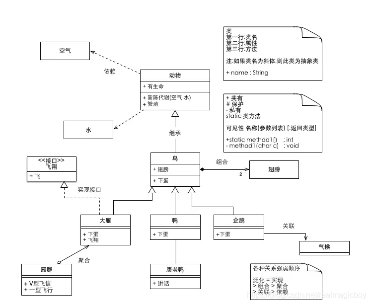


### 类的基础

#### 权限修饰符

```bash
private关键字
问题描述：定义数据变量时，无法阻止不合理的数值被设置进来；
解决方案：用private关键字将需要保护的成员变量进行修饰
一旦使用了private进行修饰，本类中可以随意访问，但是，超出本类之外就不能访问
```

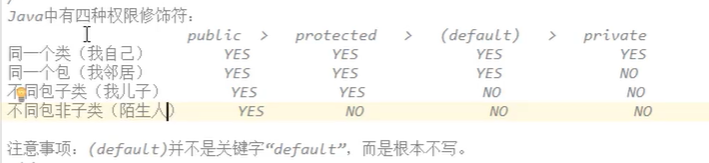


#### 静态static关键字

```bash
一旦使用static关键字，则此内容属于类；所以凡是本类的对象，都共享同一份。
如果没有static关键字，必须首先创建对象，然后通过对象调用；
如果有static关键字，则不需创建对象，直接通过类名称来使用它。
无论是成员变量还是成员方法，如果有static，都推荐使用类名称来进行调用：

静态变量：类名称.静态变量
静态方法：类名称.静态方法()

注意：
静态不能访问非静态。原因：因为在内存中是先有静态内容，后有非静态内容。
静态方法中不能用this。原因：this代表当前对象，通过谁调用的方法，谁就是当前对象


#### 静态成员跟非静态成员的区别
1、静态方法属于类，既可通过对象来调用，亦可通过类名来调用；
  	非静态方法只能通过对象来调用。
2、静态方法和属性只对类而言，而非静态是对于对象而言的。
3、在系统分配内存时不同：
  	静态成员是用栈分配内存，速度快，是在类第一次载入时初始化。
  	非静态成员是用堆分配内存，速度慢些，是在对象初始化时初始化。
```

```java
public class Demo1{
    public static void main(String[] args){
        MyClass.MethodStatic();
    }
}

public class MyClass{
    public static MethodStatic(){
        System.out.println("这是静态方法");
    }
}
```


#### 成员变量和局部变量的区别

```bash
- 局部变量：在方法内部，只有方法能用；没有默认值；位于栈内存
- 成员变量：直接写在类中；整个类都可以用；有默认起始值；位于堆内存
```

```java
public class Test{
    String name;	//成员变量

    public void methodA(){
        int num = 20;	//局部变量
        System.out.println(num);
        System.out.println(name);
    }
}
```


#### 静态代码块

```bash
当第一次用到本类时，静态代码块执行唯一的一次。如果有多个静态块，按顺序加载。
用途：用与对一次性对静态成员变量赋值。

    public class 类名称{
      staic {
        //静态代码块
      }
    }
```

```java
public class StaticTest {
    static int num = 10;

    static {
        num += 10;
        System.out.println(num);
    }

    static {
        num += 20;
        System.out.println(num);
    }
}

public class Test {
    public static void main(String[] args) {
        StaticTest st1 = new StaticTest(); // 20 40
        StaticTest st2 = new StaticTest(); // 不再执行static
        System.out.println(StaticTest.num); // 40
    }
}
```


#### this

```bash
解决参数名称和成员名称重名调用问题
this.成员变量名-->访问成员变量
如果该方法内存在相同的变量名，会先调用方法内的变量，如果想调用成员变量，则需要this来调用
```


#### 方法重载

重载是方法不变，参数的个数、参数类型、参数的多类型顺序不同

```java
public static void open(){} // 正确重载
public static void open(int a){} // 正确重载
static void open(int a,int b){} // 代码错误:和第8行冲突
public static void open(double a,int b){} // 正确重载
public static void open(int a,double b){} // 代码错误:和第6行冲突
public void open(int i,double d){} // 代码错误:和第5行冲突
public static void OPEN(){} // 代码正确不会报错，但是并不是有效重载
public static void open(int i,int j){} // 代码错误:和第3行冲突
```


#### 构造方法

```bash
构造方法是专门用来创建对象的方法，当通过New关键字来创建对象时，就是在调用构造方法。


自定义构造方法
	- 格式：public 类名称(参数类型 参数名){方法体}
	- 构造方法名称必须和所在类名一致
	- 没有返回值。不能写返回值类型，包括void；不能return
	- 一旦自定义构造方法，系统将不再提供默认的构造方法
	- 构造方法也可以进行重载
```

```java
public class Student {
    String name;
    int age;

    // 自定义构造方法
    public Student() {
        System.out.println("这是构造方法");
    }

  	// 重载构造方法
    public Student(String name, int age) {
        this.name = name;
        this.age = age;
        System.out.println(this.name + ',' + this.age);
    }
}

public class Test {
    public static void main(String[] args) {
        new Student("小明", 22);
    }
}
```


#### 匿名对象

匿名对象就是只有右边的对象，没有左边的名字和赋值运算符

匿名对象只能使用一次，下一次再使用会再次创建新的对象

 ```java
public static void mian(String[] args){
    Student stu1 = new Student();
    stu1.name = "ABC";

    new Student().name = "Kobe";
}
 ```


#### final关键字

```bash
finnal 可用来修饰类、方法、局部变量、成员变量
  - 使用 finnal 修饰的类不能有子类
  - 使用 finnal 修饰的方法不能被重写
  - 使用 finnal 修饰的变量会变成常量
```


### 特征-封装

```bash
封装：将类的某些信息隐藏在类内部，不允许外部程序直接访问，而是通过该类提供的方法来实现对隐藏信息的操作和访问。
	- 隐藏类的实现细节
	- 只能通过规定方法访问数据

封装的过程
	- 将属性的可见性设为 private
	- 创建共有的 getter 和 setter 方法
	- 在 getter 和 setter 方法中加入判断语句
```

```java
public class Student {
    private int age;

    public int getAge() {
        return age;
    }

    public void setAge(int age) {
        if (age < 0) age = 0;
        else this.age = age;
    }
}

public class Test {
    public static void main(String[] args) {
        Student stu = new Student();
        stu.setAge(20);
        System.out.println(stu.getAge()); // 2
    }
}
```


### 特征-继承

```bash
被继承的类叫超类（superclass)，继承超类的类叫子类（subclass）
子类是超类的一个专门用途的版本，它继承了超类定义的所有实例变量和方法，并且还展示了特定于自身的行为和特征。
继承是多态的前提；继承主要解决问题：共性抽取。

    public class 父亲名称{}
    public class 子类名称 extends 父亲名称{}


注意：
  - Java 中类只支持单继承，不支持多继承（一个类只能有一个直接父类）
  - 子类不能继承父类的如下内容：
      - private 成员
      - 子类与父类不在同包，使用默认访问修饰符的成员
      - 构造方法

初始化的顺序过程：
	1. 父类属性
	2. 父类构造
	3. 子类属性
	4. 子类构造

变量访问
  - 直接通过子类对象访问成员变量：等号左边是谁，就优先用谁，没有则向上找。
  - 间接通过子类对象访问成员变量：该方法属于谁，就优先用谁，没有则向上找。

变量调用
    - 局部变量：变量名
    - 本类变量：this.变量名
    - 父类变量：super.变量名
```

#### 方法重写

```bash
- 重写(Override)：方法名称一样，参数列表一样
- 重载(Overload)：方法名称一样，参数列表不一样

方法覆盖重写规则：
    1、父子类之间的方法名称与参数列表相同
    2、@Override:写在方法前，检测是否有效正确覆盖重写（可不写，但要保证正确）
    3、子类方法的返回值相同或者是父类返回值的子类
    4、Object类是所有类的公共最高父类（祖宗类），java.lang.String就是Object的子类
    5、子类方法的权限必须>=父类方法的权限修饰符（比父类严格）
        public > protected > 默认不写 > private
```

#### super

```bash
在 java 中使用 super 访问父类成员
	- super 不能访问父类私有成员
	- super 调用构造方法时，只能是第一句
```


### Object类

```bash
Object 类是所有类的父类，任何类默认都继承自 Object 类。

判断是否为null：Object.isNull()
判断是否不为null：Object.nonNull()

注意：对两个对象使用 equals() 判断，需要先做非空判断。
Object.equals(s1, s2)判断两个对象是否相同：
	1. 先判断 s1 是否为 null，如果为 null，直接返回 false
	2. 如果 s1 不为 null，则利用 s1 再次调用 equals 方法
	3. 如果 s1 为 Student（创建对象实例）类型，所以最终会调用 Student 中的 equals 方法。
	如果不重写则会比较地址值；如果重写就比较属性值


常被子类重写的方法：
	- toString()：返回当前对象本身的有关信息，按字符串对象返回
	- equals()：比较两个对象是否是同一个对象，是则返回 true
				注意：equals 隐藏一个多态，多态弊端是无法使用子类特有的内容(属性、方法)，所以需要向下转型(强转)

---> 可通过 alt+insert 键生成 equals()、hashCode()、toString()
```

```java
@Override
public String toString() { // 打印属性值
    return "Person{name=" + name + "}";
}

@Override
public int hashCode() {
    int result = name != null ? name.hashCode() : 0;
    result = 31 * result + age;
    return result;
}

@Override
public boolean equals(Object obj) { // 认为属性相同即为同一对象
    //判断传递参数是否跟自身比较
    if (obj == this) { return true; }

    //判断传递的参数obj是否是null,直接返回false，提高效率
    if (obj == null) { return false; }

    //判断是否是Person类型在转换，防止类型转换异常classCastException
    if (obj instanceof Person) {
        Person p = (Person) obj;
        boolean b = this.name.equals(p.name) && this.age == p.age;
        return b;
    }

    return false;
}
```

#### 对象克隆

```bash
对象浅克隆的实现：
	1. 重写 Object 的 clone 方法
	2. 让 javabean 类实现 Cloneable 接口
	3. 创建原对象并调用 clone()

需要实现Cloneable的缘由：
	如果一个接口里面没有抽象方法，表示当前接口是一个标记性接口。
	Cloneable 表示一旦实现，则当前类的对象就可以被克隆；如果没有实现，当前类的对象就不能克隆


对象深克隆实现：
0. 通过深度遍历数组/对象来重新赋值
1. 三方工具 Gson：gson.fromJson(gson.toJson(u1), User.class);
2. 序列化/反序列化
```

```java
import java.util.Arrays;
import java.util.StringJoiner;

public class User implements Cloneable {
    private String username;
    private String[] hobby;

    public User(String username, String[] hobby) {
        this.username = username;
        this.hobby = hobby;
    }

    public String toString() {
        return "User{" +
                "username='" + username + '\'' +
                ", hobby=" + Arrays.toString(hobby) +
                '}' + arrToString();
    }

    public String arrToString() {
        StringJoiner sj = new StringJoiner("，", "[", "]");
        for (int i = 0; i < hobby.length; i++) {
            sj.add(hobby[i] + "");
        }
        return sj.toString();
    }

    @Override
    protected Object clone() throws CloneNotSupportedException {
        // 调用父类的clone方法
        return super.clone();
    }
}

public class Test {
    public static void main(String[] args) throws CloneNotSupportedException {
        String[] data = {"打篮球", "跳舞"};
        User u1 = new User("小明", data);

        // 克隆对象
        User u2 = (User) u1.clone();
        System.out.println(u1); // User{username='小明', hobby=[打篮球, 跳舞]}[打篮球，跳舞]
        System.out.println(u2); // User{username='小明', hobby=[打篮球, 跳舞]}[打篮球，跳舞]
    }
}
```


### 抽象类

```bash
Java 中抽象类和抽象方法使用 abstract 修饰
		- 抽象方法没有方法体
		- 抽象方法必须在抽象类中
		- 抽象方法必须在子类中被实现，除非子类是抽象类
		- 抽象类中可以又非抽象方法


1. 抽象类不能创建对象，如果创建，则会编译无法通过而报错
  	假设创建了抽象类的对象，调用抽象的方法，而抽象方法没有具体的方法体，没有意义
2. 抽象类中，可以自定义构造方法，提供子类创建对象时初始化父类成员使用。
   	子类的构造方法中，有默认的super()，需要访问父类构造方法
3. 抽象类中，不一定包含抽象方法
    未包含抽象方法的抽象类，目的是不想让调用者创建该类对象，通常用于某些特殊的类结构设计
4. 抽象类的子类，必须重写抽象父类中所有的抽象方法，除非子类也是抽象类。
    假设不重写所有抽象方法，则类中可能包含抽象方法。那么创建对象后，调用抽象的方法，没有意义


如何使用抽象类和抽象方法：
1、不能直接创建new抽象类对象
2、必须用一个子类来继承抽象父类
3、子类必须覆盖重写抽象父类当中所有的抽象方法
	覆盖重写的实现-->子类去掉抽象方法的abstract关键字，然后补上大括号
4、创建子类对象进行使用


public abstract class Animal {
    public abstract void eat();	//抽象方法，具备不确定性
    public void normalMethod(){}	//普通成员方法
}
```

```java
public abstract class Fu{
    public Fu(){
        System.out.println("抽象父类的构造方法执行！");
    }
    public abstract void eat();
}

public class Zi extends Fu{
    public void Zi(){
        System.out.println("抽象子类的构造方法执行！");
    }
    @Override
    public void eat(){
        System.out.println("吃饭饭");
    }
}

public class DemoMain{
    piblic static void main(String[] args){
        Zi zi = new Zi();
        zi.eat();
    }
}
```


### 特征-多态

```bash
extends继承或者implements实现，是多态性的前提。

多态的定义：同一种操作，由于条件不同，产生的结果也不同。
多态的代码理解：同一个引用类型，使用不同的实例而执行不同操作，如使用父类变量指向子类对象。

父类和子类的互转：
	1. 父类转子类（向下转型）
			父类声明 father = new 子类();
			子类声明 son = (子类声明)father;
	2. 子类转父类（自动转换）
	3. instanceof类型检测：`对象 instanceof 类`

父类作为参数实现多态：
父类作为返回值实现多态：
```

父类引用子类对象

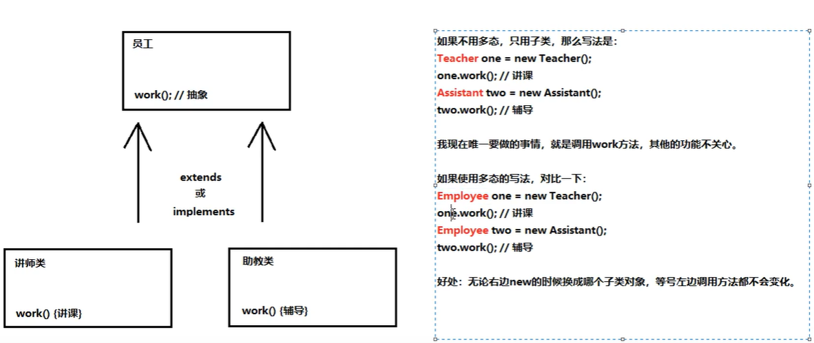

向上转型与向上转型

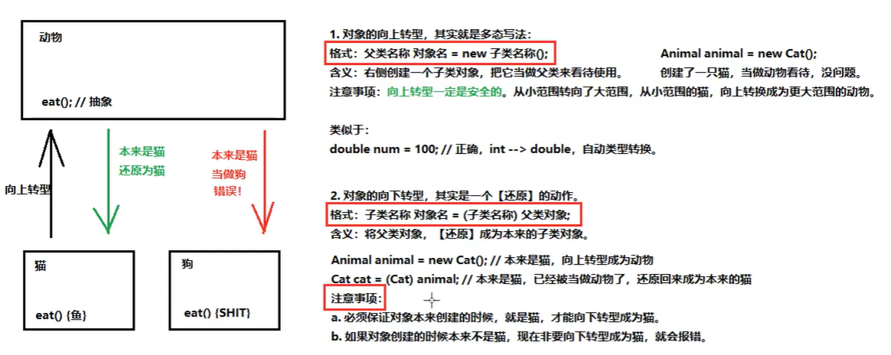

检测向下转型时是否转换正确：instanceof()来判断

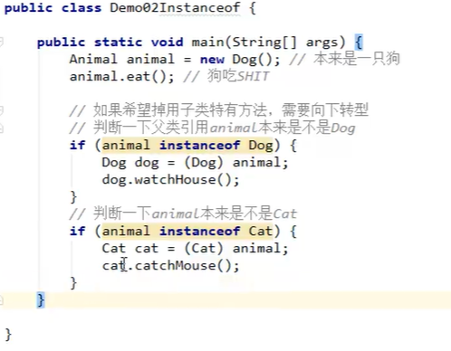

#### 接口多态案例-笔记本电脑

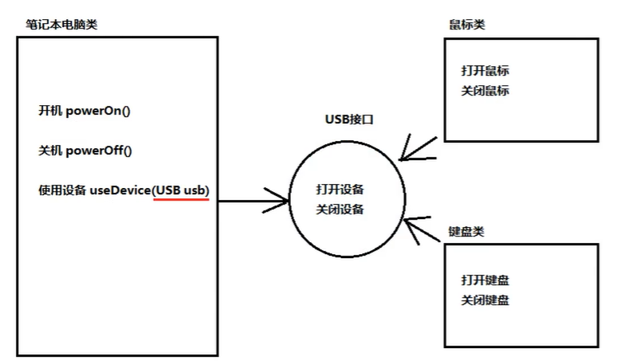

```java
public interface USB {
    public abstract void open();    //打开设备

    public abstract void close();   //关闭设备
}
```

```java
public class Computer {
    public void powerOn(){
        System.out.println("笔记本开机");
    }
    public void powerOff(){
        System.out.println("笔记本关机");
    }

    //使用USB设备
    public void useDevice(USB usb){
        usb.open(); //打开设备
        if(usb instanceof Mouse){
            Mouse mouse = (Mouse) usb;  //向下转型
            mouse.click();
        }else if(usb instanceof Keyboard){
            Keyboard keyboard = (Keyboard) usb; //向下转型
            keyboard.type();
        }
        usb.close();    //关闭设备
    }
}
```

```java
//鼠标是一个USB设备
public class Mouse implements USB {
    @Override
    public void open(){ System.out.println("打开鼠标"); }

    @Override
    public void close() { System.out.println("关闭鼠标"); }

    public void click(){
        System.out.println("鼠标点击");
    }
}
```

```java
//键盘是一个USB设备
public class Keyboard implements USB {
    @Override
    public void open() { System.out.println("打开键盘"); }

    @Override
    public void close() { System.out.println("关闭键盘"); }

    public void type(){
        System.out.println("鼠标输入");
    }
}
```

```java
public class DemoMain {
    public static void main(String[] args) {
        //创建一个笔记本电脑
        Computer computer = new Computer();
        computer.powerOn();

        //准备一个鼠标
        USB usbMouse = new Mouse();
        computer.useDevice(usbMouse);

        //准备一个键盘
        USB usbKeyboard = new Keyboard();
        computer.useDevice(usbKeyboard);
    }
}
```


### 接口 interface

```bash
1. 接口的常量
		格式: [public] [static] [final] 数据类型 常量名称 =数据值; // 不可改变,可省略public static final
		常量必须进行赋值，而且一旦赋值不能改变，常量名称完全大写，用下划线进行分隔。
2. 接口的抽象方法
		格式: [public] [abstract] 返回值类型 方法名称(参数列表);
		抽象方法的两个关键字public abstract可以省略
		实现类必须覆盖重写接口所有的抽象方法，除非实现类是抽象类
3. 接口的默认方法
		格式: [public] default 返回值类型 方法名称(参数列表) { 方法体 }
		默认方法也可以被覆盖重写
		作用：可以实现接口拼接
4. 接口的静态方法
		格式: [public] static 返回值类型 方法名称(参数列表) { 方法体 }
		应该通过接口名称进行调用，不能通过实现类对象调用接口静态方法
		不能通过接口实现类的对象来调用接口的静态方法（可通过 接口名称.静态方法名(参数) 来调用）
5. 接口的私有化
		普通私有方法: private 返回值类型 方法名称(参数列表) { 方法体 }
		静态私有方法: private static 返回值类型 方法名称(参数列表) { 方法体 }
		private的方法只有接口自己才能调用，不能被实现类或别人使用。


接口不能直接使用，必须用一个“实现类”来实现接口
接口的实现类必须覆盖重写(实现)接口中所有的抽象方法，除非实现类是抽象类
public class 实现类名称 implements 接口名称{}


#### 接口和抽象类的区别
接口：
		- 接口不可以被实例化
		- 实现类必须实现接口的所有方法
		- 一个类可以实现多个接口
		- 接口中变量都是静态变量
		- 接口应用场景是 has-a
抽象类：
		- 抽象类不可以被实例化
		- 抽象类中可以有普通方法
		- 抽象类可以有构造方法
		- 抽象类中可以有实例成员变量
		- 符合 is-a 关系的使用抽象类
一个类只能继承一个直接的父类，但可以实现多个接口。
接口的抽象程度比抽象类高，因为接口中所有方法都是抽象类。
```

```java
public interface MyIntercaceDafault {
    //抽象方法
    void methodsAbs();	//可省略public abstract
}

public class MyInterfaceDafaultA implements MyIntercaceDafault{
    public void methodsAbs(){
        System.out.println("实现了抽象方法");
    }
}
```


### 内部类

成员内部类与局部内部类（包含匿名内部类）

#### 成员内部类

内用外，随意访问；外用内，需要内部类对象。

直接调用：外部类名.内部类名 对象名 = new 外部类名().new 内部类名();

间接调用：在外部类方法中，使用内部类，然后main中只是调用外部类的方法

```java
public class Body { //外部类
    public class Heart{ //成员内部类
        //内部类的方法
        public void beat(){
            System.out.println("内部类：心脏");
            System.out.println("我叫" + name);
        }
    }
    //外部类的成员变量
    private String name;
    //外部类的方法
    public void methodBody(){
        System.out.println("外部类的方法");
        new Heart().beat();	//匿名内部类
    }
    public String getName() {
        return name;
    }
    public void setName(String name) {
        this.name = name;
    }
}

//main
public class InnerClass {
    public static void main(String[] args) {
        Body body = new Body(); //外部类的对象
        //通过外部类的对象，调用外部类的方法，里面简介在使用内部类Heart
        body.methodBody();
        System.out.println("========");
        //外部类名.内部类名 对象名 = new 外部类名().new 内部类名();
        Body.Heart heart = new Body().new Heart();
        heart.beat();
    }
}
```

#### 局部内部类

**局部内部类**：定义在一个方法内部的类（只有当前方法能使用它）。

局部内部类如果希望访问所在方法的局部变量，那么变量必须是【有效的final关键字的】

从java8+开始，只要变量事实不变，那么final关键字可以省略

```java
public class Outer{
    public void methodOuter(){
        class Inner{
            int num = 10;
            public void methodInner(){ System.out.println(num); }
        }
		Inner inner = new Inner();	//只能在当前方法调用
    	inner.methodInner();
    }
}
```

#### 匿名内部类

如果接口的实现类（或父类的子类），只使用唯一一次。那么这种情况下可以省略该类的定义，而改为使用【匿名内部类】

```java
/*
接口名 对象名 = new 接口名(){//覆盖重写所有抽象方法};
在{}里面的才是匿名内部类的内容，且{}后需要加;结束
在创建对象时，只能使用一次

@Override
public void method(){
	System.out.println("匿名内部类实现的方法！");
}
*/
public interface MyInterface{
    void method();	//抽象方法
}

public class MyInterfaceImpl implements MyInterface{
    @Override
    public void method(){
        System.out.println("实现类覆盖重写了方法！");
    }
}

//Main.java
public static void main(String[] args){
    MyInterface obj = new MyInterface(){
        //重写了两次（即调用两次）
        @Override
        public void method1(){
          	System.out.println("匿名内部类实现的方法！");
        }

        @Override
        public void method2(){
          	System.out.println("匿名内部类实现的方法！");
        }
    };

    obj.method1();
    obj.method2();
}
```


### 反射

```bash
定义：在程序运行时(非编译时)获取类的信息、对象信息，并且可动态操作类的构造器、成员变量、成员方法，还可打破类的封装访问私有成员。
本质：Java 类加载完成后，会在 JVM 堆内存中生成对应的 Class 类对象(属于 java.lang.Class 的实例)，这个 Class 对象包含该类的所有完整信息(类名、父类、接口、构造器、字段、方法等)。反射的本质是通过操作这个 Class 对象，间接获取和操作目标类/对象的成员。

获取 Class 对象的方式：
	- `类名.class`：编译时已知目标类
	- `对象.getClass()`：已拥有目标类对象
	- `Class.forName("全类名")`：与逆行时动态获取


适用场景
	- 框架开发（Spring、MyBatis等）：需要动态加载、实例化类，实现配置化和解耦
	- 工具类开发（BeanUtils、Json 序列化）：需要动态操作对象的字段和方法
	- 动态代理、插件化开发：需要在运行时动态扩展类的功能

不适用场景
	- 普通业务开发：优先直接调用类的成员，避免反射带来的性能开销和代码复杂度
	- 高并发、高性能要求（如秒杀系统、高频交易系统）：反射的性能开销可能成为系统瓶颈
	- 对安全性要求极高（如金融系统）：反射打破封装可能带来恶意访问风险


API
	T newInstance(Object... initargs)：创建类的实例，传入构造器所需参数
	void setAccessible(boolean flag)：设置是否跳过访问权限检查，true表示跳过(可访问私有构造器)
	Object get(Object obj)：获取指定对象的该字段值
	void set(Object obj, Object value)：设置指定对象的该字段值
	Object invoke(Object obj, Object... args)：调用指定对象的该方法，传入方法所需参数，返回方法的返回
```

```java
// 方式 1：类名.class（编译时已知，最优）
Class<User> clazz1 = User.class;
System.out.println("方式 1：" + clazz1.getName());

// 方式 2：对象.getClass()（已拥有实例对象）
User user = new User();
Class<?> clazz2 = user.getClass();
System.out.println("方式 2：" + clazz2.getName());

// 方式 3：Class.forName()（运行时动态获取，需全限定名）
Class<?> clazz3 = Class.forName("com.example.reflect.User");
System.out.println("方式 3：" + clazz3.getName());

// 验证 3 种方式获取的 Class 对象是否为同一个（JVM 唯一）
System.out.println("clazz1 == clazz2：" + (clazz1 == clazz2));
System.out.println("clazz1 == clazz3：" + (clazz1 == clazz3));
```

```java
// 1. 获取 Class 对象并创建实例
Class<User> userClass = User.class;
// User user = userClass.getConstructor().newInstance();
User user = userClass.getConstructor(String.class, int.class).newInstance("钱七", 28);

/* 通过反射操作成员变量 */
// 场景 1：操作公共字段（若有），此处以私有字段 name 为例
Field nameField = userClass.getDeclaredField("name");
nameField.setAccessible(true); // 跳过访问检查，访问私有字段

// 设置字段值
nameField.set(user, "赵六");
System.out.println("设置私有字段 name 后：" + user.getName());

// 获取字段值
Object nameValue = nameField.get(user);
System.out.println("获取私有字段 name 值：" + nameValue);


/* 通过反射操作成员方法 */
// 场景 1：调用公共方法 getName()（无参，有返回值）
Method getNameMethod = userClass.getMethod("getName");
Object nameResult = getNameMethod.invoke(user); // 无参方法，传入空数组或不传入参数
System.out.println("调用公共方法 getName() 返回值：" + nameResult);

// 场景 2：调用公共方法 setName()（有参，无返回值）
Method setNameMethod = userClass.getMethod("setName", String.class);
setNameMethod.invoke(user, "孙八"); // 传入方法所需参数
System.out.println("调用 setName() 后，getName() 返回值：" + user.getName());

// 场景 3：调用私有方法 sayHello()（无参，无返回值）
Method sayHelloMethod = userClass.getDeclaredMethod("sayHello");
sayHelloMethod.setAccessible(true); // 跳过访问检查，调用私有方法
sayHelloMethod.invoke(user);
```


### 动态代理

```java
import java.lang.reflect.InvocationHandler;
import java.lang.reflect.Method;
import java.lang.reflect.Proxy;

/**
 * 测试类：生成明星代理并调用
 */
public class ProxyDemo {
    public static void main(String[] args) {
        // 1. 创建目标类实例（大明星：周杰伦）
        BigStar bigStar = new BigStar("周杰伦");

        // 2. 生成动态代理对象（经纪人）
        Star starProxy = (Star) Proxy.newProxyInstance(
                ProxyDemo.class.getClassLoader(), // 参数1：类加载器（加载代理类字节码）
                new Class[]{Star.class},          // 参数2：代理类要实现的接口（和目标类一致）
                new InvocationHandler() {         // 参数3：方法调用处理器（增强逻辑）
                    @Override
                    public Object invoke(Object proxy, Method method, Object[] args) throws Throwable {
                        // 🔍 增强逻辑：根据方法名添加前置操作
                        if ("sing".equals(method.getName())) {
                            System.out.println("准备话筒，收钱 200 万！");
                        } else if ("dance".equals(method.getName())) {
                            System.out.println("准备场地，收钱 150 万！");
                        }

                        // 🎯 核心：调用目标类的真实方法（明星唱歌/跳舞）
                        Object result = method.invoke(bigStar, args);

                        return result;
                    }
                }
        );

        // 3. 调用代理对象的方法（触发增强逻辑 + 目标方法）
        System.out.println("===== 调用唱歌方法 =====");
        String singResult = starProxy.sing("晴天");
        System.out.println(singResult);

        System.out.println("\n===== 调用跳舞方法 =====");
        starProxy.dance();
    }
}


/**
 * 目标接口：明星的演出服务规范
 */
public interface Star {
    // 唱歌
    String sing(String songName);
    // 跳舞
    void dance();
}

/**
 * 目标类：大明星（真正执行业务逻辑的类）
 */
public class BigStar implements Star {
    private String name;

    public BigStar(String name) {
        this.name = name;
    }

    @Override
    public String sing(String songName) {
        System.out.println(name + " 正在演唱：《" + songName + "》");
        return "演唱结束，掌声雷动！";
    }

    @Override
    public void dance() {
        System.out.println(name + " 正在跳劲爆舞蹈！");
    }
}
```


### 注解

```bash
注解(Annotation) 是一种特殊的标记接口，本身不直接执行任何逻辑，仅用于为程序元素(类、方法、字段、参数等)附加额外的元数据(描述数据的数据)作传递，需通过注解解析器(编译器、JVM或自定义代码)发挥作用。
本质：所有注解最终会被编译为继承 java.lang.annotation.Annotation 接口的特殊接口，其成员方法对应注解的属性


作用：
	- 解耦：将配置信息与业务代码分离，无需手动编写繁琐配置（如 Spring 注解替代 XML 配置）
	- 自动化：通过解析注解实现自动化处理（如 MyBatis 注解自动生成 SQL、JUnit 注解自动执行测试方法）
	- 编译检查：提供编译期语法校验，提前规避错误（如 @Override 校验方法重写的正确性）
	- 简化代码：减少重复模板代码


JDK 中常见注解：
	@Override：方法重写
	@Deprecated：修饰的方法已过时
	@SuppressWarnings("all")：压制警告

元注解：
	@Target：指定注解可修饰的类型，默认可修饰所有程序元素
			TYPE、METHOD、FIELD、PARAMETER、CONSTRUCTOR、LOCAL_VARIABLE、ANNOTATION_TYPE
	@Retention：定义注解的保留周期
			- SOURCE：源码注解，仅存在源码中，编译后被丢弃(不进入字节码)
			- CLASS：编译时注解，保留到编译后的字节码文件中，JVM加载类时丢弃
			- RUNTIME：运行时注解，保留到字节码文件，且JVM加载类后仍存在于内存中
	@Document：指定注解是否会被 javadoc 工具提取到API文档
	@Inherited：指定注解是否具有继承性


自定义注解格式：
    public @interface 注解名称 {
      public 属性类型 属性名() default 默认值;
    }
    public @interface Anno {
      String show() default "show...";
      String show2() default "B";
    }

自定义注解 @MyAnnotation 反编译后等价于
    public interface MyAnnotation extends java.lang.annotation.Annotation {
        String value();
        int age() default 18;
    }
```

```java
import java.lang.annotation.*;

/**
 * 自定义标记注解：标记核心业务类
 */
// 元注解1：仅可修饰类/接口/枚举
@Target(ElementType.TYPE)
// 元注解2：保留到运行时，可通过反射解析
@Retention(RetentionPolicy.RUNTIME)
// 元注解3：生成 javadoc 文档时包含该注解
@Documented
public @interface MyMarker {
    // 无任何属性，标记注解
}
```

```java
import java.lang.annotation.*;

/**
 * 自定义数据注解：记录用户操作日志
 */
// 元注解1：仅可修饰方法
@Target(ElementType.METHOD)
// 元注解2：保留到运行时，可通过反射解析
@Retention(RetentionPolicy.RUNTIME)
// 元注解3：生成 javadoc 文档时包含该注解
@Documented
public @interface UserLog {
    // 注解属性1：操作模块（无默认值，使用时必须赋值）
    String module();

    // 注解属性2：操作描述（有默认值，使用时可省略）
    String desc() default "无详细描述";

    // 注解属性3：操作类型（枚举类型，有默认值）
    OperationType type() default OperationType.QUERY;

    // 内部枚举：操作类型
    enum OperationType {
        QUERY, // 查询
        ADD,   // 新增
        UPDATE, // 修改
        DELETE  // 删除
    }
}
```

```java
/**
 * 注解使用示例：用户服务类
 */
// 使用标记注解 @MyMarker，标记该类为核心业务类
@MyMarker
public class UserService {
    // 使用数据注解 @UserLog，指定模块和描述，类型默认 QUERY
    @UserLog(module = "用户管理", desc = "根据用户ID查询用户信息")
    public String queryUserById(Integer userId) {
        return "用户ID：" + userId + "，用户名：张三";
    }

    // 使用数据注解 @UserLog，指定所有属性（覆盖默认值）
    @UserLog(module = "用户管理", desc = "新增用户信息", type = UserLog.OperationType.ADD)
    public void addUser(String userName) {
        System.out.println("新增用户成功：" + userName);
    }
}
```

```java
import java.lang.reflect.Method;

/**
 * 注解解析器：反射解析运行时注解
 */
public class AnnotationParser {
    public static void main(String[] args) throws Exception {
        // 1. 获取目标类的 Class 对象
        Class<UserService> userServiceClass = UserService.class;

        // 2. 解析类上的 @MyMarker 注解
        parseClassAnnotation(userServiceClass);

        // 3. 解析方法上的 @UserLog 注解
        parseMethodAnnotation(userServiceClass);
    }

    /**
     * 解析类上的注解
     */
    private static void parseClassAnnotation(Class<UserService> clazz) {
        System.out.println("===== 解析类上的注解 =====");
        // 判断类是否被 @MyMarker 注解修饰
        if (clazz.isAnnotationPresent(MyMarker.class)) {
            // 获取 @MyMarker 注解实例
            MyMarker myMarker = clazz.getAnnotation(MyMarker.class);
            System.out.println("该类是核心业务类，注解信息：" + myMarker.annotationType().getName());
        } else {
            System.out.println("该类不是核心业务类");
        }
    }

    /**
     * 解析方法上的注解
     */
    private static void parseMethodAnnotation(Class<UserService> clazz) throws Exception {
        System.out.println("\n===== 解析方法上的注解 =====");
        // 获取类中所有的方法
        Method[] methods = clazz.getDeclaredMethods();
        for (Method method : methods) {
            // 判断方法是否被 @UserLog 注解修饰
            if (method.isAnnotationPresent(UserLog.class)) {
                // 获取 @UserLog 注解实例
                UserLog userLog = method.getAnnotation(UserLog.class);

                // 提取注解属性信息
                String module = userLog.module();
                String desc = userLog.desc();
                UserLog.OperationType type = userLog.type();

                // 模拟日志记录逻辑（注解的核心作用：传递元数据，驱动业务逻辑）
                System.out.println("  操作模块：" + module);
                System.out.println("  操作描述：" + desc);
                System.out.println("  操作类型：" + type);
                System.out.println("  执行方法：" + method.getName());
            }
        }
    }
}
```


## 集合

```bash
数据结构
	- 栈：先进后出
	- 队列：先进先出
	- 数组：内存连续区域，查询快，增删慢
	- 链表：元素是游离的，查询慢，首尾操作极快


集合与数组区别
  - 数组长度是固定的，集合的长度是可变的；
  - 数组中存储的是同一类型的元素，可以存储基本数据类型值。集合存储的是对象，而且对象的类型可以不一致。
  - 在开发中一般当对象多时，使用集合存储。


- ArrayList 实现长度可变的数组，在内存中分配连续的空间。遍历元素和随机访问元素的效率比较高。
- LinkedList 采用链表存储方式。插入、删除元素时效率比较高。


集合按照存储结构分两大类：
  - 单列集合 java.util.Collection
  - 双列集合 java.util.Map
```


### 单列集合 Collection

```bash
Collection：接口存储一组不唯一、无序的对象
    |—— List（ArrayList、LinkedList）：接口存储一组不唯一、有序、有索引的对象
    |—— Set（HashSet）：接口存储一组唯一、无序、无索引的对象
    		|—— HashSet：无序、唯一、无索引
    		|—— LinkedHashSet：有序、不重复、无索引
    		|—— TreeSet：可排序、不重复、无索引
    		因为无索引，所以不能使用普通 for 循环遍历，也不能通过索引来获取元素


常用方法：
  添加元素：boolean add(E e)
  删除数据：boolean remove(E e)
  删除指定位置的元素：E remove(int index)
  获取固定位置的元素：E get(int,index)
  判断是否存在指定元素：boolean contains(E e)
  获取集合的长度：int size()
  清空集合所有的元素：void clear()
  判断集合是否为空：boolean isEmpty()

  批量添加元素：boolean addAll(Collection<T> c, T... elements)
  打乱List集合顺序：void shuffle(List<?> list)
  填充集合：int fill(List<T> list, T obj)
  获取最大/最小值：void max/min(Collection<T> coll)
  交换集合中指定位置的元素：void swap(List<?> list, int i, int j)
```

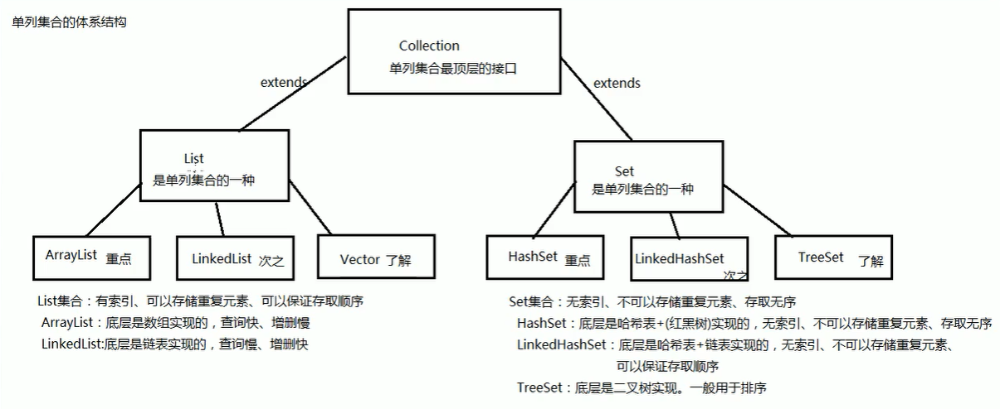


#### 有序数组 ArrayList

```bash
数组 Array 的长度不可变，但 ArrayList 集合的长度是可变的]
ArrayList打印出来的是内容，不是地址；如果内容为空，则输出[]


常用方法：
  插入数据：boolean add(int index, E e)
  将集合转成一个数组：E[] toArray()


#### ArrayList底层源码
1. 利用空参创建的集合，在底层创建一个默认长度为0的数组
2. 添加第一个元素时，底层会创建一个新长度为0的数组
3. 存满时，会扩容1.5倍
4. 如果一次添加多个元素，1.5倍还放不下，则新创建数组的长度以实际为准
```

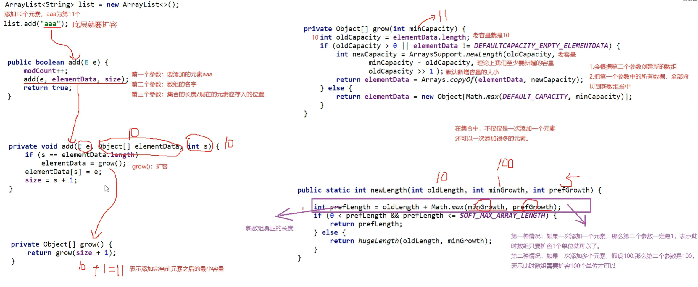

```java
//从JDK1.7+开始，右侧<>内部可以不写内容，但<>本身需要写
ArrayList<String> list = new ArrayList<String>();

//向集合添加数据
list.add("Kobe");
list.add("June");
list.add("hello");

boolean result = list.remove("hello");
System.out.println(result); // true
boolean result2 = list.contains("java");
System.out.println(result2); // false

System.out.println(list);    //[Kobe,June]

// 将list的数据全部添加到新定义的list中
ArrayList<String> newList = new ArrayList<>();
newList.addAll(list);
System.out.println(newList);    //[Kobe,June]

// 清除数组
list.clear();
System.out.println(list); // []


// 生成6个1~33的随机整数，添加到集合，并遍历集合
ArrayList<Integer> list2 = new ArrayList();
Random r = new Random();
for (int i = 0; i < 6; i++) {
    int num = r.nextInt(33) + 1;
    list2.add(num);
}
System.out.println(list2);
```


#### 链表 LinkedList

```bash
LinkedList 底层结构式双链表，查询慢，增删快，如果操作首尾元素速度更快。

LinkedList 提供对头部和尾部元素进行添加和删除操作的方法。
	添加首部元素：void addFirst(E e)
	添加末尾元素：void addLast(E e)
	获取头部元素：E Object.getFirst()
	获取末尾元素：E Object.getLast()
	删除并返回第一个元素：E removeFirst()
	删除并返回最后一个元素：E removeLast()
```

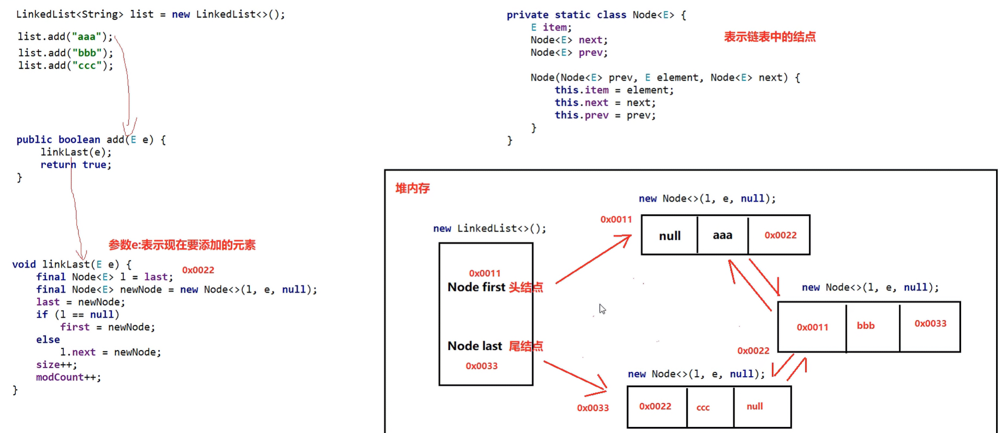

```java
import java.util.LinkedList;

public class Test {
    class Book {
        private String name;
        private int price;

        public Book(String name, int price) {
            this.name = name;
            this.price = price;
        }
    }

    public static void main(String[] args) {
        Test test = new Test();
        Book b1 = test.new Book("我的阿泰勒", 60);
        Book b2 = test.new Book("平凡的认识", 50);
        Book b3 = test.new Book("你是我的四月天", 70);

        LinkedList<Book> list = new LinkedList<Book>();
        list.add(b1);
        list.addFirst(b2);
        list.addLast(b3);

        Book first = list.getFirst();
        System.out.println(first); // Book{name='平凡的认识', price=50}

        Book last = list.getLast();
        System.out.println(last); // Book{name='你是我的四月天', price=70}

        list.removeFirst();
        list.removeLast();

        for(Book b: list) {
            System.out.println(b); // Book{name='我的阿泰勒', price=60}
        }
    }
}
```


#### 无序去重 HashSet

```bash
Set 接口存储一组唯一、无序、无索引的对象。
Set 存放对象的引用。

遍历：
	- 迭代器遍历
	- 增强 for 循环
	- lambda 表达式


#### HashSet 底层原理：采取哈希表存储数据
  哈希表是一种增删改查数据性能都较好的结构
      - JDK8前：数组 + 链表
      - JDK8后：数组 + 链表 + 红黑树
  哈希值：
      - 根据 hashCode 方法算出来的 int 类型的整数
      - 该方法定义在 Object 类中，所有对象都可调用，默认使用地址值进行计算
      - 一般情况下，会重写 hashCode 方法，利用对象内部的属性值计算哈希值
  对象的哈希值特点：
  		- 如果没有重写 hashCode 方法，不同对象计算出的哈希值不同
  		- 如果重写 hashCode 方法，不同对象只要属性值相同，计算的哈希值也一样
  		- 小部分情况下，不同属性值或不同地址值计算出的哈希值可能一样（哈希碰撞）


#### HashSet 添加元素底层原理：
	1. 创建一个默认长度16，默认加载因子为 0.75 的数组，数组名为 table
			- 底层依赖 HashMap 实现，HashMap 初始时 table 数组为 null(懒加载)，首次添加元素时才会真正创建长度 16 的数组
			- 扩容触发条件：元素数量(size) ≥ 容量x加载因子，扩容后容量为原来的2倍(保证2的整数幂)
						如：16×0.75=12，当 元素数≥12 时触发扩容，扩容后容量为 32（2倍）
			- 加载因子0.75是内存与效率的平衡：如果0.5则扩容浪费内存，若结束扩容，效率低；1 则冲突率高、效率低；所以采取0.75，若存的长度等于 0.75就扩容
	2. 根据元素的哈希值跟数组的长度计算出应存入的数组索引位置
			- 调用hashCode方法获取原始哈希值；
			- 计算索引：`int index = (数组长度 - 1) & 哈希值;`
			- 索引位置计算的位运算替代模运算的前提：数组长度必须为2的整数幂，否则会导致索引的范围可能不完全覆盖整个哈希表；并且在数组扩容时，是扩容为原来的2倍，以确保数组长度一定满足2的整数幂
	3. 判断当前位置是否为 null，如果是 null 直接存入
	4. 如果位置不为 null，表示有元素(哈希冲突)，则调用 equals 方法比较属性值
			- 先比较哈希值：若当前元素哈希值 ≠ 已有节点哈希值  ➡ 哈希冲突但元素不同；
			- 若哈希值相同，调用 equals 方法比较元素属性值。
	5. 如果比较属性值一致(元素重复)，则不存；如果不一样，则存入数组，形成链表
			- JDK8前：新元素存入数组(头插法)，老元素挂在新元素 next 上，形成链表；
			- JDK8后：新元素直接挂在老元素下面(链表尾部➡尾插法)；
			- 注意：在JDK8+，当 链表长度≥8 且 数组容量≥64 时，链表自动转为红黑树；若数组容量＜64，先扩容再继续链表存储


#### 问题
1. HashSet 为什么存和取的顺序不一样？
		存数据是根据 元素的哈希值和数组长度 来计算出存储的位置进行存入的，以及其中可能还存在链表
		取数据是根据数组的下标索引进行按顺序取的
		➡ 无序是因为 hash 值导致
2. HashSet 为什么没有索引？
		因为多个元素可能在同一个数组索引下标存储的链表中，多个元素共用同一个索引不合适
3. HashSet 利用什么机制保证数据去重？
		如果集合存储的是自定义对象，必须要重写 hashCode 和 equals 方法
      - 重写 hashCode：根据属性值去计算哈希值
      - 重写 equals：需要在比较时使用对象的内部属性值比较
```

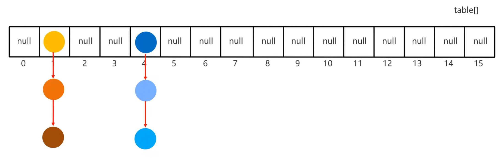

```java
import java.util.HashSet;
import java.util.Objects;

public class Test {
    class Book {
        private String name;
        private int price;

        public Book(String name, int price) {
            this.name = name;
            this.price = price;
        }

        @Override
        public boolean equals(Object o) {
            if (o == null || getClass() != o.getClass()) return false;
            Book book = (Book) o;
            return price == book.price && Objects.equals(name, book.name);
        }

        @Override
        public int hashCode() {
            return Objects.hash(name, price);
        }
    }

    public static void main(String[] args) {
        Test test = new Test();
        Book b1 = test.new Book("我的阿泰勒", 60);

        HashSet<Book> set = new HashSet<Book>();
        Book b2 = b1;
        set.add(b1);
        set.add(b2);
        System.out.println(set.size()); // 1

        HashSet<Book> set2 = new HashSet<>();
        set2.add(b1);
        System.out.println(set.hashCode()); // 603463375
        System.out.println(set2.hashCode()); // 603463375
    }
}
```


#### 插入有序+去重 LinkedHashSet

```bash
LinkedHashSet 继承自 HashSet，底层同样依赖 HashMap，但额外通过「双向链表」维护元素的插入顺序。
	- 复用 HashSet 的 add() 逻辑，通过「自定义 HashMap 的节点类型」实现顺序维护
	- 使用双向链表记录插入顺序，


LinkedHashSet 集合
	- 有序、不重复、无索引
	- 底层基于哈希表，使用双链表记录添加顺序（在遍历时可以通过链表来按顺序获取）
如果要数据去重：
	- 默认使用 HashSet
	- 如果要求去重且存取有序，才使用 LinkedHashSet（因为比 HashSet 额外增加双链表，效率比 HashSet 相对低）
```

```java
// 1. HashSet：无序（输出顺序≠插入顺序）
Set<String> hashSet = new HashSet<>();
hashSet.add("A");
hashSet.add("B");
hashSet.add("C");
System.out.println("HashSet: " + hashSet); // 可能输出 [A, C, B]

// 2. LinkedHashSet：有序（输出顺序=插入顺序）
Set<String> linkedHashSet = new LinkedHashSet<>();
linkedHashSet.add("A");
linkedHashSet.add("B");
linkedHashSet.add("C");
System.out.println("LinkedHashSet: " + linkedHashSet); // 必输出 [A, B, C]
```


#### 排序+去重 TreeSet

```bash
特性：
	- 有序：元素会按指定规则排序，而非插入顺序（默认升序）
	- 唯一：依赖元素的 自然排序compareTo() 或 自定义排序Comparator 判断是否重复
	- 底层依赖红黑树，增删查效率为 O（log n）
	- 不允许 null：自然排序时元素为 null 会抛 NullPointerException（自定义排序可处理，但不推荐）

使用场景：
	1. 有序去重
	2. 范围查询：利用 subSet()、headSet()、tailSet() 快速获取指定范围元素

注意：
	- TreeSet 不依赖 equals() 和 hashCode()，是通过 compareTo() 或 Comparator.compare() 是否返回 0 来判断重复
	- 自定义排序时，规则需和 equals() 保持一致（否则违反 Set 语义）
	- 对于数值类型(Integer、Double)默认按从小到大排序，字符和字符串按字符在ASCII码中的数字升序。

性能对比：
	- 插入/删除：TreeSet O(log n) > HashSet O(1)
	- 有序遍历：TreeSet 更高效（无需额外排序）
	- 需有序用 TreeSet，需插入顺序选 LinkedHashSet，仅需去重选 HashSet
```

```java
// 1. 创建 TreeSet（默认自然排序：整数升序）
TreeSet<Integer> numSet = new TreeSet<>();

// 2. 添加元素（自动去重+排序）
numSet.add(5);
numSet.add(2);
numSet.add(9);
numSet.add(4);
numSet.add(6);
numSet.add(2); // 重复元素，不会存入

// 3. 遍历（输出：[2, 4, 5, 6, 9]，已排序）
System.out.println("自然排序结果：" + numSet);

// 4. 常用方法（TreeSet 特有，利用有序性）
System.out.println("第一个元素：" + numSet.first()); // 2
System.out.println("最后一个元素：" + numSet.last()); // 9
System.out.println("小于5的最大元素：" + numSet.lower(5)); // 4
System.out.println("大于5的最小元素：" + numSet.higher(5)); // 6
System.out.println("删除并返回第一个元素：" + numSet.pollFirst()); // 2
System.out.println("删除后集合：" + numSet); // [4, 5, 6, 9]
```

##### 自定义类（实现 Comparable）

```java
import java.util.TreeSet;

// 自定义类：学生（按年龄升序排序）
class Student implements Comparable<Student> {
    private String name;
    private int age;

    public Student(String name, int age) {
        this.name = name;
        this.age = age;
    }

    // 核心：重写 compareTo 定义排序规则
    @Override
    public int compareTo(Student o) {
        // 规则：按年龄升序；年龄相同则按姓名字典序
        if (this.age != o.age) {
            return this.age - o.age; // 升序（负数：当前对象小；正数：当前对象大；0：重复）
        }
        return this.name.compareTo(o.name);
    }

    // 重写 toString 方便打印
    @Override
    public String toString() {
        return "Student{name='" + name + "', age=" + age + "}";
    }
}

public class TreeSetCustomClass {
    public static void main(String[] args) {
        TreeSet<Student> studentSet = new TreeSet<>();
        studentSet.add(new Student("张三", 20));
        studentSet.add(new Student("李四", 18));
        studentSet.add(new Student("王五", 20)); // 年龄相同，按姓名排序
        studentSet.add(new Student("李四", 18)); // 重复元素（age+name 都相同），不存入

        // 输出：[Student{name='李四', age=18}, Student{name='王五', age=20}, Student{name='张三', age=20}]
        System.out.println("自定义类排序结果：" + studentSet);
    }
}
```

##### 自定义排序（使用 Comparator 接口）

```java
import java.util.Comparator;
import java.util.TreeSet;

public class TreeSetComparator {
    public static void main(String[] args) {
        // 1. 创建 TreeSet 时传入 Comparator（Lambda 简化）
        TreeSet<Integer> descNumSet = new TreeSet<>(Comparator.reverseOrder()); // 降序
        // 或手动写 Lambda：(a, b) -> b - a

        // 2. 添加元素
        descNumSet.add(5);
        descNumSet.add(2);
        descNumSet.add(8);

        // 输出：[8, 5, 2]（降序）
        System.out.println("自定义排序结果：" + descNumSet);

        // 扩展：自定义类的多规则排序（按学生年龄降序，年龄相同按姓名降序）
        TreeSet<Student> studentDescSet = new TreeSet<>((s1, s2) -> {
            if (s1.getAge() != s2.getAge()) {
                return s2.getAge() - s1.getAge(); // 年龄降序
            }
            return s2.getName().compareTo(s1.getName()); // 姓名降序
        });
        studentDescSet.add(new Student("张三", 20));
        studentDescSet.add(new Student("李四", 18));
        studentDescSet.add(new Student("王五", 20));
        // 输出：[Student{name='张三', age=20}, Student{name='王五', age=20}, Student{name='李四', age=18}]
        System.out.println("学生降序排序：" + studentDescSet);
    }
}

// 注意：Student 类需添加 getAge()、getName() 方法
class Student {
    private String name;
    private int age;

    public Student(String name, int age) {
        this.name = name;
        this.age = age;
    }

    public int getAge() { return age; }
    public String getName() { return name; }

    @Override
    public String toString() {
        return "Student{name='" + name + "', age=" + age + "}";
    }
}
```


### 双列集合 Map

```bash
Map：接口存储一组键值对象，提供key到value的映射，键值对对象 又称 Entry对象
    |—— HashMap：无序(按哈希值存储)
    |—— LinkedHashMap：有序(插入顺序)
    |—— TreeMap：有序(自定义排序)
    |—— ConcurrentHashMap：无序、多线程首选

特性：
	- 键：唯一（通过 hashCode() + equals() 或 compareTo() 保证）
	- 值：可重复、可为 null

注意：
	- HashMap/LinkedHashMap：Key/Value 都可 null；
	- TreeMap：Key 不可 null（会抛 NPE），Value 可 null；
	- Hashtable/ConcurrentHashMap：Key/Value 都不可 null

常用方法：
	- 添加/覆盖元素：V put(K key, V value)
	- 根据键删除键值对元素：V remove(Object key)
	- 判断集合是否包含指定键：boolean containsKey(Object key)
	- 判断集合是否包含指定值：boolean containsValue(Object value)
	- 判断集合是否为空：boolean isEmpty()
	- 获取键值对数量：int size()
  - 移除所有键值对：void clear()

	- 获取所有键的集合：Set<K> keySet()
	- 获取所有值的集合：Collection<V> values()
	- 获取所有键值对的集合：Set<Map.Entry<K,V>> entrySet()
```


#### HashMap

```java
HashMap<String, String> map = new HashMap<>();
map.put("CBC", "测试");
map.put("CBC", "中国建设银行"); // 将覆盖
map.put("ABC", "中国农业银行");
map.put("ICBC", "中国工商银行");

String value = map.get("CBC");
System.out.println(value);

System.out.println(map.keySet()); // 获取键的集合
System.out.println(map.values()); // 获取值的集合
System.out.println(map); // 获取键+值集合
System.out.println(map.size()); // 获取长度
boolean result = map.containsKey("ICBC");
System.out.println(result ? "存在" : "不存在");
```


#### HashMap 源码

```bash
#### hashMap 存储流程（put(K key, V value)）
计算哈希值 -> 定位数组索引 -> 处理哈希冲突 -> 插入数据 -> 扩容判断

1. 计算键的哈希值：hash()
HashMap 并非使用 key.hashCode() 的返回值，而是对其进行二次哈希处理，以减少哈希冲突，让哈希值的分布更均匀
注：key 为 null 时，固定存入数组索引 0 的位置，且只能由一个 null 键（后续存入会覆盖原值）

2. 定位数组索引(确认哈希桶)
通过哈希值计算出键值对应在数组中的索引位置，保证索引值在数组长度范围内(不会越界)：`int index = (n - 1) & hash;`
用 `(n - 1) & hash` 而非 `hash % n` 的原因：当n是2的幂次时，`(n - 1) & hash` 和 `hash % n` 结果等价，但位运算的执行效率远高于取模运算。

3. 处理哈希冲突，插入数据
遍历对应索引位置的链表/红黑树，根据 key 是否存在执行 覆盖/新增 操作：
	- 若该索引位置为 null（无哈希冲突），直接创建新 Node 节点，存入该索引位置（作为链表头节点）
	- 若该索引不为 null（存在哈希冲突），分三种情况：
			- 头节点的 key 与待插入的 key 相等（hash相同且 key.equals() 为 true），新值覆盖就值；
			- 头节点是红黑树节点TreeNode，调用红黑树的插入方法putTreeVal()，插入新节点并维持红黑树平衡；
			- 头节点是链表节点Node，遍历链表：
					- 遍历过程找到 key 相等的节点，覆盖旧值；
					- 遍历到链表末尾仍未找到，创建新节点插入链表尾部(尾插法)；
					- 插入后判断链表长度是否 ≥ 8，若是则触发 链表转红黑树 的逻辑；

4. 扩容判断：resize()
插入数据后，判断当前元素个数是否超出「负载因子 × 数组容量」，若是则执行扩容操作，将数组长度翻倍。


#### hashMap 查询流程（get(Object key)）
计算哈希值 → 定位数组索引 → 遍历链表 / 红黑树 → 返回结果

1. 若 HashMap 为空（数组为 null 或长度为 0），直接返回 null；
2. 计算 key 的哈希值，通过 (n-1) & hash 定位数组索引；
3. 遍历对应索引位置的链表 / 红黑树：
	- 若头节点的 key 与查询 key 相等，直接返回头节点的 value；
	- 若头节点是红黑树节点，调用红黑树的查询方法getTreeNode()，返回匹配的 value；
	- 若头节点是链表节点，遍历链表找到 key 相等的节点，返回 value；
	- 遍历结束未找到匹配的 key，返回 null。
```

```bash
Node<K,V>[] table：哈希表结构中数组的名字
DEFAULT_INITIAL_CAPACITY：数组默认长度16
DEFAULT_LOAD_FACTOR：默认加载因子0.75

HashMap 中每一个对象包含的内容：
  1. 链表中的键值对对象
      int hash：键的哈希值
      final K key：键
      V value：值
      Node<K,V> next：下一个节点的地址值

  2. 红黑树中的键值对对象
      int hash：键的哈希值
      final K key：键
      V value：值
      TreeNode<K,V> parent：父节点的地址值
      TreeNode<K,V> left：左子节点的地址值
      TreeNode<K,V> right：右子节点的地址值
      boolean red：节点的颜色

添加元素时硬考虑三种情况：
	1. 数组位置为 null
	2. 数组位置不为 null，键重复，元素覆盖
  3. 数组位置不为 null，键不重复，挂在下面形成链表或红黑树
```

```java
// 获取被覆盖元素的值
public v put(K key, V value) {
  return putVal(hash(key), key, value, false, true);
}

// 利用键计算对应的哈希值
static final int hash(Object key) {
  int h;
  return (key == null) ? 0 : (h = key.hashCode()) ^ (h >>>> 16);
}

final V putVal(int hash, K key, V value, boolean onlyIfAbsent, boolean evict) {
  Node<K, V>[] tab; // 局部变量，记录哈希表中数组的地址值
  Node<K, V>[] p; // 临时变量，记录键值对对象的地址值

  int n; // 数组长度
  int i; // 索引

  tab = table; // 把哈希表中数组的地址值赋值给局部变量
  if (tab == null || (n = tab.length) == 0) {
    // 1.如果当时是第一次添加数据，底层会创建一个默认长度为 16，加载因子为 0.75 的数组
    // 2.如果不是第一次添加数据，会看数组中元素是否达到扩容条件
    // 如果达到扩容条件，底层会把数组扩容为原先的两倍，并把数据全部转移到新的哈希表中
    tab = resize();
    n = tab.length;
  }

  // 使用数组长度与键的哈希值进行计算，计算出当前键值对对象，在数组中应存入的位置
  // n 为数组长度（必须是 2 的幂次，这是 HashMap 的核心设计）
  // 当n是2的幂次时，(n-1) & hash 与 hash % n 结果等价，但位运算的执行效率远高于取模运算，这是 HashMap 的性能优化点。
  i = (n - 1) & hash;

  p = tab[i];

  if (p == null) {
    // 底层常见一个键值对对象直接存放到数组中
    tab[i] = newNode(hash, key, value, null);
  } else {
    Node<K, V> e;
    K k;
    if (p.hash == hash && (k = p.key) == key || (key != null && key.equals(k))) {
      e = p;
    } else if (p instanceof TreeNode) {
      // 红黑树节点：表示挂载的是链表
      for (int binCount = 0; ; ++binCount) {
        if ((e = p.next) === null) {
          // 创建新节点
          p.next = newNode(hash, key, value, null);
          // 链表长度判断是否超出8 + 数组长度≥64，则转化链表为红黑树
          if (binCount >= TREEIFY_THRESHOLD - 1)
            treeIfyBin(tab, hash);
          break;
        }
        if (e.hash == hash && (k = e.key) == key || (key != null && key.equals(k)))
          break;
        p = e;
      }
    }

    if (e != null) {
      V oldValue = e.value;
      if (!onlyIfAbsent || oldValue == null) {
        e.value = value;
      }
      afterNodeAccess(e);
      return oldValue;
    }
  }

  ++modCount;
  // threshold = 数组长度 * 0.75。哈希表的扩容时机
  if (++size > threshold) {
    resize();
  }
  afterNodeInsertion(evict);

  // 当前没有覆盖任何元素
  return null;
}
```


### Iterator迭代器

```bash
Iterator迭代器：java.util.Iterator
Collection 与 Map 用于存储元素，而 Iterator 用于迭代访问（遍历）Collection中的元素，因此 Iterator 对象也被称为迭代器。
迭代：即 Collection 集合元素的通用获取方式。在取元素之前要判断集合中有没有元素，如果有，就把这个元素取出来，继续再判断，如果还有就再取出来，直到把集合中的所有元素全部取出为止——这种取出方式称为迭代。

如何使用 Iterator
	- 获取迭代器对象，Collection 接口的 iterator 方法
	- hasNext()：判断是否仍有元素可以迭代
	- next()：返回下一个迭代的元素

注意：
		因为创建集合的迭代器后，集合每次调用 add 或 remove 方法都会被统计变化次数。
		所以为了避免并发修改一次，在使用迭代器或增强 for 遍历集合过程中，不要使用集合的方法去添加或修改元素。
```

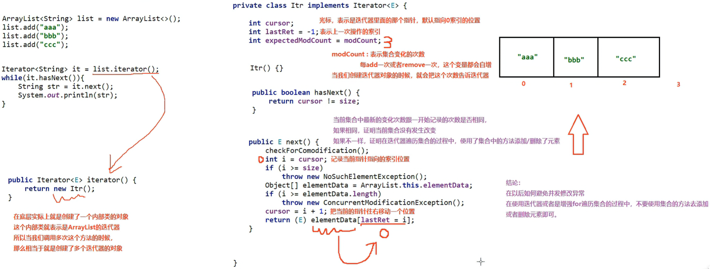

```java
import java.util.HashMap;
import java.util.Iterator;

public class Test {
    public static void main(String[] args) {
        HashMap<String, String> map = new HashMap<String, String>();
        map.put("CBC", "中国建设银行");
        map.put("ABC", "中国农业银行");
        map.put("ICBC", "中国工商银行");

        Iterator iterator = map.keySet().iterator();
        while (iterator.hasNext()) {
            String key = (String) iterator.next();
            String value = map.get(key);
            System.out.println(key + "=" + value);
        }
    }
}
```


### 集合遍历

```bash
1. 迭代器遍历

2. 增强式for遍历：底层为迭代器，为了简化迭代器书写
    所有的单列集合和数组才能使用增强式for遍历。
    修改增强for中定义的变量，不会改变集合中原本的数据。
    语法：`for(元素数据类型 变量名: 数组或集合) { }`

3. lambda表达式遍历：
		语法：default void forEach(Consumer<? super T> action)


- Collection：普通for循环 > 迭代器 ≈ forEach  > Stream（非必要不使用）；
- Map：entrySet() > forEach > keySet()+get() > values()
```

#### 列表的遍历

````bash
1. 普通for循环
2. 增强for
3. lambda表达式forEach
4. 迭代器
5. 列表迭代器
6. 转换成数组
````

```java
ArrayList<String> list = new ArrayList<String>();
list.add("Kobe");
list.add("June");
list.add("hello");

// 普通for循环
for (int i = 0; i < list.size(); i++) {
    System.out.print(list.get(i) + '\t'); // Kobe June
}
System.out.println();


// 增强for
for (String s : list) {
    System.out.printf(s + '\t'); // Kobe June
}
System.out.println();


// lambda表达式
list.forEach(item -> System.out.printf(item + '\t'));
System.out.println();


// 迭代器
Iterator<String> it = list.iterator();
while (it.hasNext()) {
    System.out.printf(it.next() + '\t');
}
System.out.println();


// 列表迭代器
ListIterator<String> listIt = list.listIterator();
while (listIt.hasNext()) {
    System.out.printf(listIt.next() + '\t');
}
System.out.println();


// 转换数组
Object[] arr = list.toArray();    //转换成数组
for (Object str : arr) {
    System.out.println(str);
}
```

#### Map遍历

```bash
1. keySet() + get()：仅需Key 时适用；先遍历 Key，再通过 Key 查 Value；效率低(二次查询)
2. entrySet()：需同时操作 Key和Value 时适用；直接遍历键值对；效率高(一次遍历)
3. forEach：简单遍历 Key+Value 时适用；Lambda 直接接收 Key+Value；效率高(简洁)
4. values()：只需处理 Value 时适用；仅遍历 Value；效率中等
```

```java
import java.util.HashMap;
import java.util.Iterator;
import java.util.Map;

public class Test {
    public static void main(String[] args) {
        HashMap<String, Integer> map = new HashMap<>();
        map.put("张三", 90);
        map.put("李四", 85);
        map.put("王五", 95);

        // ========== Map 遍历 ==========
        // 方式1：keySet() + get()（效率低，不推荐）
        for (String name : map.keySet()) {
            Integer score = map.get(name);
            System.out.println(name + "：" + score);
        }

        // 方式3：forEach + Lambda（简洁）
        map.forEach((name, score) -> System.out.println(name + "：" + score));

        // 方式4：values()（仅遍历 Value）
        for (Integer score : map.values()) {
            System.out.println("分数：" + score);
        }

        // 方式2：entrySet()（推荐，效率最高）
        for (Map.Entry<String, Integer> entry : map.entrySet()) {
            System.out.println(entry.getKey() + "：" + entry.getValue());
        }

        // 方式2扩展：entrySet() + 迭代器（支持安全删除）
        Iterator<Map.Entry<String, Integer>> entryIterator = map.entrySet().iterator();
        while (entryIterator.hasNext()) {
            Map.Entry<String, Integer> entry = entryIterator.next();
            if (entry.getValue() < 90) {
                entryIterator.remove(); // 安全删除分数<90的元素
            } else {
                System.out.println(entry.getKey() + "：" + entry.getValue());
            }
        }
        System.out.println("删除后 Map：" + map); // {张三=90, 王五=95}

        // 方式2扩展：entrySet() + forEach
        map.entrySet().stream().forEach(entry -> {
            System.out.println(entry.getKey() + "=" + entry.getValue());
        });
    }
}
```


### 泛型

```bash
泛型：是JDK5引入的特性，可以在编译阶段约束操作的数据类型，并进行检查
泛型的格式：`<数据类型>`
作用与注意：统一数据类型，泛型只能是引用数据类型，不能是基本数据类型
		- 因为传入基本数据类型，也需要转化为 Object（基本数据类型不支持多态）
		- 指定泛型的具体类型后，传递数据时，可以传入该类类型或者其子类类型
		- 如果不写泛型，类型默认是 Object

泛型不具备继承型，但数据具备继承性

泛型方法：在定义方法时不确定类型的值
		修饰符 <类型> 返回值类型 方法名(类型 变量名) {}
		public static<T> void show(T t) {}

泛型接口：
		修饰符 interface 接口名<类型> {}
		public interface List<E> {}

泛型通配符：
    `?` 表示不确定的类型，它可以进行类型的限定
    `? extends E`：表示可以传递E或者E所有的子类型
    `? super E`：表示可传递E或者E所有的父类型
    public static void method(ArrayList<? extends E> list) {}
		public static void method(ArrayList<? super E> list) {}

泛型的使用场景：
		- 定义类、方法、接口时，如果类型不确定，可以定义泛型
		- 如果类型不确定，但能知道是哪个继承体系，就可以使用泛型的通配符
```


## IO流

```bash
- File 类访问文件和目录
- 字节流的使用
- 字符流的使用
- 缓冲流的使用
- 读写二进制文件
- 序列化和反序列化


IO流
  - 输入流 (Input Stream)：从外部读取数据到程序中
  - 输出流 (Output Stream)：从程序输出数据到外部
  - 流的特点：数据像水流一样连续传输


核心概念
	- 数据源/数据目的地：File、内存、网络、控制台、设备
	- 数据传输单位
			- 字节流：处理所有类型数据（文本、图片、音视频）
			- 字符流：专门处理文本数据
	- 流的角色
			- 节点流：直接链接数据源/目的地
			- 处理流（包装流）：对节点流进行包装、提供增强功能


字节流：FileInputStream读取文件，FileOutputStream写入文件
字符流：FileReader读取文件，FileWriter写入文件
缓冲流：BufferedReader读取文本文件，BufferedWriter写入文本文件
读写二进制文件：DataInputStream与FileInputStream结合读取二进制文件，DataOutputStream与FileOutputStream结合写二进制文件
序列化：对象写入到特定流中
		- 序列化可以保存对象的全景图
		- 实现Serializable接口
反序列化：从特定的流中获取数据重新还原成对象
```

### IO流层次

```bash
#### 字节流继承体系
Object
├── InputStream（抽象类）
│   ├── FileInputStream        // 文件字节输入流
│   ├── ByteArrayInputStream   // 字节数组输入流
│   ├── FilterInputStream      // 过滤字节输入流
│   │   ├── BufferedInputStream    // 缓冲字节输入流
│   │   ├── DataInputStream        // 数据输入流
│   │   └── ObjectInputStream      // 对象输入流
│   └── 其他...
└── OutputStream（抽象类）
    ├── FileOutputStream       // 文件字节输出流
    ├── ByteArrayOutputStream  // 字节数组输出流
    ├── FilterOutputStream     // 过滤字节输出流
    │   ├── BufferedOutputStream   // 缓冲字节输出流
    │   ├── DataOutputStream       // 数据输出流
    │   ├── PrintStream            // 打印输出流
    │   └── ObjectOutputStream     // 对象输出流
    └── 其他...


字符流继承体系
Object
├── Reader（抽象类）
│   ├── InputStreamReader      // 字节流转字符流
│   │   └── FileReader         // 文件字符输入流
│   ├── BufferedReader         // 缓冲字符输入流
│   ├── StringReader           // 字符串输入流
│   └── 其他...
└── Writer（抽象类）
    ├── OutputStreamWriter     // 字符流转字节流
    │   └── FileWriter         // 文件字符输出流
    ├── BufferedWriter         // 缓冲字符输出流
    ├── PrintWriter            // 打印字符输出流
    ├── StringWriter           // 字符串输出流
    └── 其他...
```

### File类 - 访问文件

```bash
File类：java.io.File
    判断文件或目录是否存在：boolean exists()
    判断是否是文件：boolean isFile()
    判断是否是目录：boolean isDirectory()
    获取文件的相对路径：String getPath()
    获取文件的绝对路径：String getAbsolutePath()
    获取文件/目录名称：String getName()
    删除此对象指定的文件/目录：boolean delete()
    创建名称的空文件，不创建文件夹：boolean createNewFile()
    获取文件大小(单位为字节)：long  length()
```

```java
import java.io.File;
import java.io.IOException;

public class Test {
    public static void main(String[] args) {
        File file = new File("D:\\项目\\JavaTest\\src\\1.txt");

        if (file.exists()) { // 判断文件是否存在
            if (file.isFile()) { // 如果是文件
                System.out.println("名称:" + file.getName());
                System.out.println("相对路径:" + file.getPath());
                System.out.println("绝对路径:" + file.getAbsolutePath());
                System.out.println("文件大小:" + file.length() + "字节");
            } else if (file.isDirectory()) { // 如果是目录
                System.out.println("此文件是目录");
            }
        } else { // 此文件不存在
            System.out.println("此文件不存在");
            try {
                file.createNewFile();
                System.out.println("文件已创建！");
            } catch (IOException e) {
                e.printStackTrace();
            }
        }
    }
}
```


### 字节流 - FileInputStream

```java
import java.io.FileInputStream;
import java.io.FileNotFoundException;
import java.io.FileOutputStream;
import java.io.IOException;

public class Test {
    public static void main(String[] args) {
        FileInputStream fis = null;
        FileOutputStream fos = null;

        try {
            fis = new FileInputStream("D:\\项目\\JavaTest\\src\\1.txt");
            fos = new FileOutputStream("D:\\项目\\JavaTest\\src\\2.txt", true); // // true表示追加，false表示覆盖

            byte[] buffer = new byte[1024];  // 1KB缓冲区
            while(fis.available() != 0) {
                int read = fis.read(buffer);
                fos.write(buffer, 0, read);  // 写入实际读取的字节数

                String str = new String(buffer, 0, read);
                System.out.println(str);
            }
            fos.write("\nNew log entry\n".getBytes());
        } catch (FileNotFoundException e) {
            System.out.println("文件不存在");
        } catch (IOException e) {
            System.out.println("文件不存在");
        } finally {
            try {
                fis.close();
            } catch (IOException e) {
                e.printStackTrace();
            }
        }
    }
}
```


### 字符流 - FileReader

```java
import java.io.*;

public class Test {
    public static void main(String[] args) {
        try (FileReader fr = new FileReader("D:\\项目\\JavaTest\\src\\1.txt");
             FileWriter fw = new FileWriter("D:\\项目\\JavaTest\\src\\2.txt")) {

            char[] buffer = new char[1024];
            int len;
            while ((len = fr.read(buffer)) != -1) {
                fw.write(buffer, 0, len);
            }
        } catch (IOException e) {
            e.printStackTrace();
        }
    }
}
```

### 缓冲流 - BufferedReader

```java
import java.io.*;

public class Test {
    public static void main(String[] args) {
        // 按行读取（需要BufferedReader包装）
        try (BufferedReader br = new BufferedReader(new FileReader("D:\\项目\\JavaTest\\src\\1.txt"));
             BufferedWriter bw = new BufferedWriter(new FileWriter("D:\\项目\\JavaTest\\src\\2.txt"))) {

            String line;
            while ((line = br.readLine()) != null) {
                bw.write(line);
                bw.newLine();  // 写入换行符
            }
        } catch (IOException e) {
            e.printStackTrace();
        }

        // 带编码的读写
        try (BufferedReader br = new BufferedReader(
                new InputStreamReader(
                        new FileInputStream("D:\\项目\\JavaTest\\src\\1.txt"), "GB2312"));
             BufferedWriter bw = new BufferedWriter(
                     new OutputStreamWriter(
                             new FileOutputStream("D:\\项目\\JavaTest\\src\\2.txt"), "UTF-8"))) {

            String line;
            while ((line = br.readLine()) != null) {
                bw.write(line);
                bw.newLine();
            }
        } catch (IOException e) {
            e.printStackTrace();
        }
    }
}
```

### 序列化

```java
import java.io.*;
import java.util.Date;

// 必须实现 Serializable 接口
class Student implements Serializable {
    // 序列化版本号，防止序列化兼容性问题
    private static final long serialVersionUID = 1L;

    private String name;
    private int age;
    private transient String password;  // transient 修饰的字段不会被序列化

    public Student(String name, int age, String password) {
        this.name = name;
        this.age = age;
        this.password = password;
    }
}

public class ObjectStreamExample {
    public static void main(String[] args) {
        // 序列化对象
        try (ObjectOutputStream oos = new ObjectOutputStream(
                new FileOutputStream("student.dat"))) {
            Student student = new Student("张三", 20, "123456");
            oos.writeObject(student);
            oos.writeObject(new Date());  // 序列化其他对象
        } catch (IOException e) {
            e.printStackTrace();
        }

        // 反序列化对象
        try (ObjectInputStream ois = new ObjectInputStream(
                new FileInputStream("student.dat"))) {
            Student student = (Student) ois.readObject();
            Date date = (Date) ois.readObject();

            System.out.println(student);  // password 为 null
            System.out.println(date);
        } catch (IOException | ClassNotFoundException e) {
            e.printStackTrace();
        }

        // 序列化多个对象到集合
        try (ObjectOutputStream oos = new ObjectOutputStream(
                new FileOutputStream("students.dat"))) {
            List<Student> students = Arrays.asList(
                new Student("张三", 20, "111"),
                new Student("李四", 22, "222"),
                new Student("王五", 21, "333")
            );

            oos.writeObject(students);
        } catch (IOException e) {
            e.printStackTrace();
        }
    }
}
```


## 多线程 & JUC

```bash
理解线程生命周期：新建、就绪、运行、阻塞、死亡
掌握同步机制：synchronized、Lock、volatile、原子类
熟悉并发工具：CountDownLatch、CyclicBarrier、Semaphore、Exchanger
善用线程池：合理配置参数，避免资源耗尽
了解并发集合：ConcurrentHashMap、CopyOnWriteArrayList等
掌握CompletableFuture：异步编程的强大工具
理解JMM：内存模型、happens-before原则
遵循最佳实践：避免死锁、减少锁竞争、使用不可变对象等
学会调试监控：线程转储、性能监控、死锁检测


线程和进程的区别？
什么是线程安全？如何保证线程安全？
synchronized和Lock的区别？
wait()和sleep()的区别？
什么是死锁？如何避免死锁？
volatile关键字的作用？
ThreadLocal的原理和内存泄漏问题？
线程池的核心参数有哪些？
线程池的拒绝策略有哪些？
CAS的原理和ABA问题？
ConcurrentHashMap的实现原理？
如何实现生产者-消费者模式？


性能调优
减少锁的粒度：尽量使用细粒度锁。
减少锁的持有时间：只在必要的时候加锁。
使用读写锁：读多写少的场景使用ReadWriteLock。
使用无锁数据结构：如AtomicXXX类。
合理设置线程池参数：根据任务类型和系统资源设置。
避免创建过多线程：使用线程池复用线程。
使用异步编程：如CompletableFuture。
监控线程状态：使用JConsole、VisualVM等工具。
```

### 多线程概念

```bash
- 进程(Process)：程序的一次执行过程，是系统运行程序进行资源分配和调度的基本单位。每个进程都有自己的独立内存空间。
- 线程(Thread)：进程中执行运算的最小单位，可完成一个独立的顺序控制流程。一个进程可以包含多个线程。线程共享进程的内存空间。

- 并发：同一时间段内，多个任务交替执行。
- 并行：同一时刻，多个任务同时执行（需要多核CPU）


#### 多线程
多线程：一个进程中同时运行多个线程。多线程是多个线程交替占用CPU资源，并非真正的并行运行。
多线程的优点
		- 提高程序响应速度（GUI应用）
		- 提高多核CPU利用率
		- 改善程序结构，将复杂任务分解为多个进程独立运行
多线程的缺点
		- 线程间共享数据可能导致数据不一致
		- 线程的创建和销毁需要开销
		- 过多的线程会消耗大量系统资源，可能导致系统崩溃


#### JAVA 中的线程
主线程：
	main() 所在的线程称为主线程。
	主线程是产生其他子线程的线程。
	主线程必须最后完成执行，因为它需要执行各种关闭操作。
创建线程：
	- 继承 java.lang.Thread 类（继承Thread类，重写run方法，创建线程对象调用start()启动线程）-适用单继承
	- 实现 java.lang.Runnable 接口（实现Runnable接口，实现run方法，创建线程对象调用start()启动线程）-避免单继承局限性
线程的同步：
	- 多个线程操作同一共享资源时，将引发数据不安全问题
	- 解决方法：使用同步方法，用 synchronized 修饰方法，为当前的线程声明一个锁，让代码块变为同步执行
      - Vector：线程安全，效率低，适用多线程并发共享资源
      - ArrayList：线程不安全，效率高，适用单线程
      - Hashtable：线程安全，效率低，适用多线程并发共享资源
      - HashMap：线程不安全，效率高，适用单线程
```

#### 线程的生命周期

```bash
线程的六种状态（Thread.State）
    NEW：新建
    RUNNABLE：可运行（包括就绪和运行中）
    BLOCKED：阻塞（等待监视器锁）
    WAITING：等待（无限期等待，直到被唤醒）
    TIMED_WAITING：超时等待（有限时间的等待）
    TERMINATED：终止


状态转换
	- NEW --start()--> RUNNABLE
	- RUNNABLE --获取CPU时间片--> 运行
	- 运行 --yield()/时间片用完--> 就绪
	- 运行 --sleep()/wait()/join()/IO等待--> TIMED_WAITING/WAITING
	- 运行 --等待获取锁--> BLOCKED
	- 运行 --run()结束/异常退出--> TERMINATED
```

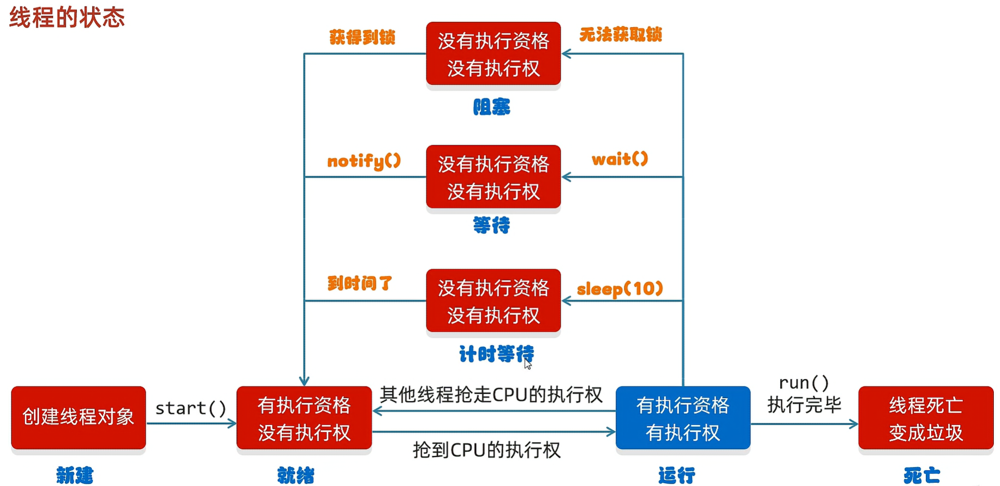

#### 线程常用的方法

```bash
如果不用 setName() 设置线程名字，则会由默认的线程名（以序号为值）

sleep() 因为是静态方法，所以可以使用 类名.sleep() 来调用（Thread.sleep()）
		sleep 方法会让线程睡眠，睡眠时间完毕，不会立马执行下面的代码，因为仍然需要等待CPU的执行权

线程的默认优先级一样，setPriority() 设置优先级越高，抢到CPU的概率越大，但是其他线程仍然可能优先执行完毕

setDaemon(true) 设置为守护线程后，在其他的非守护线程执行完毕后，守护线程会陆续结束
		守护线程是逐渐结束，仍然会执行，但不一定能全部执行完毕
		例如：聊天窗口是线程1，传送文件是线程2，如果聊天窗口关闭，传送文件就没必要存在，因此可把线程2设置为守护线程

yield() 出让线程只是尽可能出让线程，但是该线程仍然可能在中间穿插执行

join() 插入线程，比如在 main方法中对线程进行插入，则先执行插入的线程，再执行 main 下面的代码
```

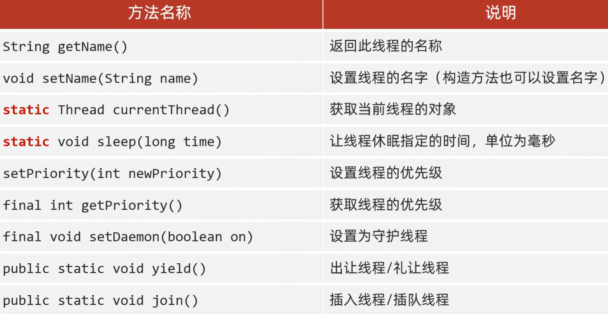

### 线程的创建方式

#### 继承Thread类

```java
public class MyThread implements Runnable {
    @Override
    public void run() {
        // 线程执行体
        for (int i = 0; i < 5; i++) {
            System.out.println(Thread.currentThread().getName() + ": " + i);
        }
    }

    public static void main(String[] args) {
        MyThread t1 = new MyThread();
        MyThread t2 = new MyThread();
        t1.start(); // 启动线程
        t2.start();
    }
}

/*
Thread-1: 0
Thread-1: 1
Thread-0: 0
Thread-1: 2
Thread-1: 3
Thread-0: 1
Thread-0: 2
Thread-1: 4
Thread-0: 3
Thread-0: 4
*/
```

#### 实现Runnable接口

```java
public class MyRunnable implements Runnable {
    @Override
    public void run() {
        for (int i = 0; i < 5; i++) {
            System.out.println(Thread.currentThread().getName() + ": " + i);
        }
    }

    public static void main(String[] args) {
        MyRunnable mr = new MyRunnable();
        Thread t1 = new Thread(mr, "线程1");
        Thread t2 = new Thread(mr, "线程2");
        t1.start();
        t2.start();

      	// 获取活动线程数
        System.out.println("活动线程数: " + Thread.activeCount());
        // 获取所有活动线程
        Thread[] threads = new Thread[Thread.activeCount()];
        Thread.enumerate(threads);
        for (Thread t : threads) {
            if (t != null) {
                System.out.println("活动线程: " + t.getName());
            }
        }
    }
}
```

#### 实现Callable接口（有返回值）

```java
import java.util.concurrent.Callable;
import java.util.concurrent.FutureTask;

public class MyCallable implements Callable<Integer> {
    @Override
    public Integer call() throws Exception {
        int sum = 0;
        for (int i = 1; i <= 5; i++) {
            sum += i;
            System.out.println(Thread.currentThread().getName() + ": " + i);
        }
        return sum;
    }

    public static void main(String[] args) throws Exception {
        MyCallable mc = new MyCallable();
        FutureTask<Integer> ft = new FutureTask<>(mc);
        Thread t = new Thread(ft, "Callable线程");
        t.start();
        System.out.println("线程返回值: " + ft.get()); // 线程返回值: 15
    }
}
```

#### 使用线程池

```java
import java.util.concurrent.ExecutorService;
import java.util.concurrent.Executors;

public class ThreadPoolDemo {
    public static void main(String[] args) {
        // 创建固定大小的线程池
        ExecutorService executor = Executors.newFixedThreadPool(3);

        // 提交任务
        for (int i = 0; i < 5; i++) {
            executor.execute(() -> {
                System.out.println(Thread.currentThread().getName() + " 执行任务");
            });
        }

        // 关闭线程池
        executor.shutdown();
    }
}
```


### 线程的同步与锁

#### 同步 synchronized

```bash
同步代码块：把操作共享数据的代码锁起来
	- 锁默认打开，由一个进程进去，锁自动关闭
	- 里面的代码全部执行完毕，线程出来，锁自动打开
	- 注意：锁一般是创建一个 Object 变量来设定，且要保证唯一（单例模式）锁不唯一，那就不能保证同步的稳定性

      synchronized (锁) {
        操作共享数据的代码
      }
```

```java
// 同步方法
public synchronized void method() {
    // 同步代码
}

// 同步代码块
public void method() {
    synchronized (this) { // 同步锁对象
        // 同步代码
    }
}

// 同步静态方法（锁的是类对象）
public static synchronized void staticMethod() {
    // 同步代码
}
```


#### 锁 Lock

```java
import java.util.concurrent.locks.Lock;
import java.util.concurrent.locks.ReentrantLock;

public class LockDemo {
    private final Lock lock = new ReentrantLock();

    public void method() {
        lock.lock(); // 获取锁
        try {
            // 同步代码
        } finally {
            lock.unlock(); // 释放锁
        }
    }
}
```


#### 死锁

```bash
锁的本质是，当其他线程运行到上锁的代码时，若发现锁没有解开，就会让出cpu执行权。

本质上是锁的理解问题。锁并不能保证锁内的代码块在一个cpu时间片内完成
```

```java
public class DeadLockDemo {
    private static Object lockA = new Object();
    private static Object lockB = new Object();

    public static void main(String[] args) {
        new Thread(() -> {
            synchronized (lockA) {
                System.out.println("线程1持有lockA");
                try { Thread.sleep(100); } catch (InterruptedException e) {} // 代码执行到这里就卡死，无法往下执行
                synchronized (lockB) {
                    System.out.println("线程1持有lockB");
                }
            }
        }).start();

        new Thread(() -> {
            synchronized (lockB) {
                System.out.println("线程2持有lockB");
                try { Thread.sleep(100); } catch (InterruptedException e) {} // 代码执行到这里就卡死，无法往下执行
                synchronized (lockA) {
                    System.out.println("线程2持有lockA");
                }
            }
        }).start();
    }
}
```


### 【典例】售卖电影票

```java
public class Test {
    public static void main(String[] args) {
        /*
         * 需求：某电影院某个电影共有100张票，分别在三个窗口售卖
         * */

        // 创建线程对象
        MyThread t1 = new MyThread();
        MyThread t2 = new MyThread();
        MyThread t3 = new MyThread();

        // 线程命名
        t1.setName("窗口1");
        t2.setName("窗口2");
        t3.setName("窗口3");

        // 开启线程
        t1.start();
        t2.start();
        t3.start();

        System.out.println("==================");
        MyRunnable mr = new MyRunnable();
        Thread t11 = new Thread(mr, "窗口11");
        Thread t22 = new Thread(mr, "窗口22");
        Thread t33 = new Thread(mr, "窗口33");
        t11.start();
        t22.start();
        t33.start();
    }
}
```

##### 使用继承 + synchronized

```java
public class MyThread extends Thread {
    // 使用 static 表示这个类的所有的对象，都共享 ticket 数据
    static int ticket = 0; // 售卖的电影票 0~100张

    // 锁对象，一定要是唯一的
    static Object obj = new Object();

    @Override
    public void run() {
        while (true) {
            synchronized (obj) { // 锁要在循环里面，不然必然是第一个进来的线程把while执行完再出去
                if (ticket < 100) {
                    try {
                        Thread.sleep(50);
                    } catch (InterruptedException e) {
                        e.printStackTrace();
                    }

                    ticket++;
                    System.out.println(getName() + "正在售卖第" + ticket + "张票");
                } else {
                    break;
                }
            }
        }
    }
}
```

##### 使用抽象类 + synchronized

```java
public class MyRunnable implements Runnable {
    // 不用写成 static，因为只会创建一次；如果定义了 static 则会让变量一直占用内存
    int ticket = 0;

    @Override
    public void run() {
        while (true) {
            synchronized (MyRunnable.class) {
                if (ticket == 100) {
                    break;
                } else {
                    try {
                        Thread.sleep(50);
                    } catch (InterruptedException e) {
                        e.printStackTrace();
                    }

                    ticket++;
                    System.out.println(Thread.currentThread().getName() + "在卖第" + ticket + "张票");
                }
            }
        }
    }
}
```

##### 使用继承类 + Lock

```java
import java.util.concurrent.locks.Lock;
import java.util.concurrent.locks.ReentrantLock;

public class MyThread extends Thread {
    // 使用 static 表示这个类的所有的对象，都共享 ticket 数据
    static int ticket = 0;

    // 需要使用 static 共享锁
    static Lock lock = new ReentrantLock();


    @Override
    public void run() {
        while (true) {
            lock.lock();
            try {
                if (ticket < 100) {
                    ticket++;
                    System.out.println(getName() + "正在售卖第" + ticket + "张票");
                } else {
                    break;
                }
            } catch (Exception e) {
                e.printStackTrace();
            } finally {
                lock.unlock(); // 必须在 finally，否则报错或者 break 无法解锁
            }
        }
    }
}
```


### 生产者-消费者模式(等待唤醒机制)

```bash
使用 生产者-消费者模式（等待唤醒机制）实现线程轮流交替效果
	- 当缓冲区满时，生产者等待，直到缓冲区有空位
	- 当缓冲区空时，消费者等待，直到缓冲区有数据

生产者：产生数据的线程
消费者：处理数据的线程
共享缓冲区：生产者和消费者之间的数据存储区域
核心问题：解决生产者和消费者的同步和互斥问题


涉及的方法
  - void wait()：当前线程等待，直到被其他线程唤醒
  - void notify()：随机唤醒单个线程
  - void notifyAll()：唤醒所有线程
```

```java
/* 共享缓冲区：控制生产者和消费者的执行 */
public class Desk {
    public static int foodFlag = 0; // 是否有面条 1:是 0:否
    public static int count = 10; // 可以吃的上限
    public static Object lock = new Object(); // 锁对象
}


// 生产者
public class Cook extends Thread {
    @Override
    public void run() {
        /**
         * 判断桌子上是否有食物
         * 如果有，就等待
         * 如果没有，就制作食物，制作完成后修改食物状态
         */
        while (true) {
            synchronized (Desk.lock) {
                if (Desk.count == 0) {
                    break;
                } else if (Desk.foodFlag == 1) {
                    try {
                        Desk.lock.wait();
                    } catch (InterruptedException e) {
                        e.printStackTrace();
                    }
                } else {
                    System.out.println("正在制作食物");
                    Desk.foodFlag = 1;
                    Desk.lock.notifyAll();
                }
            }
        }
    }
}


// 消费者
public class Foodie extends Thread {
    @Override
    public void run() {
        /**
         * 如果没有面条，就等待
         * 如有有面条，就吃(就餐)
         * 吃完之后，把吃的上限-1，并通知厨师(生产者)继续做
         * 修改桌子状态(等吃)
         */
        while (true) {
            synchronized (Desk.lock) {
                if (Desk.count == 0) {
                    break;
                } else if (Desk.foodFlag == 0) {
                    try {
                        Desk.lock.wait();
                    } catch (InterruptedException e) {
                        e.printStackTrace();
                    }
                } else {
                    Desk.count--;
                    System.out.println("正在就餐，还能再吃" + Desk.count + "碗");
                    Desk.lock.notifyAll();
                    Desk.foodFlag = 0;
                }
            }
        }
    }
}


// 主线程
public class ThreadDemo {
    public static void main(String[] args) {
        Cook c = new Cook();
        Foodie f = new Foodie();

        c.setName("厨师");
        f.setName("食客");

        c.start();
        f.start();
    }
}
```

##### 阻塞队列（JUC）

阻塞队列内部方法用锁实现，是安全线程

但如果在队列方法外操作，则不在锁的范围内，所以进行日志输出则有问题

```java
import java.util.concurrent.ArrayBlockingQueue;

public class ThreadDemo {
    // 生产者
    public class Cook extends Thread {
        ArrayBlockingQueue<String> queue;

        public Cook(ArrayBlockingQueue<String> queue) {
            this.queue = queue;
        }

        @Override
        public void run() {
            while (true) {
                // 不断把面条放入阻塞队列
                try {
                    queue.put("面条"); // 内部实现了锁
                    System.out.println("厨师放入一碗面条"); // 这个不在阻塞队列的锁中，所以打印不会卡着
                } catch (InterruptedException e) {
                    e.printStackTrace();
                }
            }
        }
    }

    // 消费者
    public class Foodie extends Thread {
        ArrayBlockingQueue<String> queue;

        public Foodie(ArrayBlockingQueue<String> queue) {
            this.queue = queue;
        }

        @Override
        public void run() {
            while (true) {
                // 不断从阻塞队列中取出面条
                try {
                    String food = queue.take(); // 内部实现了锁
                    System.out.println(food); // 这个不在阻塞队列的锁中，所以打印不会卡着
                } catch (InterruptedException e) {
                    e.printStackTrace();
                }
            }
        }
    }

    // 主线程
    public static void main(String[] args) {
        // 利用阻塞队列 实现 生产者和消费者（等待唤醒）

        // 1. 创建阻塞队列的对象
        ArrayBlockingQueue<String> queue = new ArrayBlockingQueue<>(1);

        ThreadDemo t = new ThreadDemo();
        // 创建实例传递阻塞队列（共用队列）
        Cook c = t.new Cook(queue);
        Foodie f = t.new Foodie(queue);
        c.start();
        f.start();
    }
}
```


### 线程池

```bash
线程池初始化创建时是空的，在提交任务时，池子会创建新的线程对象，任务执行完毕，线程归还给池子，下回再次提交任务时，不需要再创建新的线程，直接复用已有线程即可。
如果提交任务时，池子没有空闲线程，也无法创建新的线程，任务就会排队等待。
```

```bash
// 固定大小线程池
ExecutorService fixedPool = Executors.newFixedThreadPool(3);

// 单线程线程池
ExecutorService singlePool = Executors.newSingleThreadExecutor();

// 可缓存线程池
ExecutorService cachedPool = Executors.newCachedThreadPool();

// 定时任务线程池
ScheduledExecutorService scheduledPool = Executors.newScheduledThreadPool(3);

// 定时执行
scheduledPool.schedule(() -> {
    System.out.println("延迟3秒执行");
}, 3, TimeUnit.SECONDS);

// 定期执行
scheduledPool.scheduleAtFixedRate(() -> {
    System.out.println("延迟1秒后，每2秒执行一次");
}, 1, 2, TimeUnit.SECONDS);

// 提交线程任务
fixedPool.submit(new MyRunnable());
```

```java
import java.util.concurrent.*;

public class ThreadPoolExecutorDemo {
    public static void main(String[] args) {
        // 创建线程池
        ThreadPoolExecutor executor = new ThreadPoolExecutor(
            2, // 核心线程数
            5, // 最大线程数
            60, // 空闲线程存活时间
            TimeUnit.SECONDS, // 时间单位
            new ArrayBlockingQueue<>(10), // 工作队列
            Executors.defaultThreadFactory(), // 线程工厂
            new ThreadPoolExecutor.AbortPolicy() // 拒绝策略
        );

        // 提交任务
        for (int i = 0; i < 15; i++) {
            final int taskId = i;
            executor.execute(() -> {
                System.out.println(Thread.currentThread().getName() +
                    " 执行任务 " + taskId);
                try {
                    Thread.sleep(1000);
                } catch (InterruptedException e) {
                    e.printStackTrace();
                }
            });
        }

        // 关闭线程池
        executor.shutdown();
    }
}
```


## Socket

```bash
Socket = IP地址 + 端口号
客户端Socket：主动连接服务器
	需要提供服务端的IP和端口号，通过 Socket 对象的 getInputStream 和 getOutputStream 获取到输入输出流，然后获取和发送数据。
服务器ServerSocket：监听端口，接受连接
	通过 ServerSocket 的 accept() 创建，一旦被客户端连接，服务端就会创建一个用于通信的 Socket 等待用户发送数据。

java.net.Socket - 客户端Socket
java.net.ServerSocket - 服务器Socket
java.net.InetAddress - IP地址处理
java.net.URL/URLConnection - 高层网络API


在Java I/O中，为了减少I/O操作的次数，OutputStream（包括其子类）通常会将数据先存储在缓冲区中，当缓冲区满或者流关闭时才会自动将数据发送出去。
os.flush() 的作用：强制将缓冲区中的数据发送出去，即使缓冲区还没有满
	1. 强制将缓冲区中的数据写入目标
	2. 确保数据被实际发送/写入
	3. 清空输出缓冲区


对象类型数据的发送和接收
要发送的类型必须实现 Serializable 接口。
在发送端组合出一个对象数据，然后转序列化，通过 ObjectOutputStream 发送对象数据
在接收端通过 ObjectInputStream 反序列化出一个对象，然后拆解出对象的各个属性
```

```java
import java.io.Serializable;

public class UserInfo implements Serializable {
    private String uname;
    private String upwa;

    public String getUname() {
        return uname;
    }

    public String getUpwa() {
        return upwa;
    }

    public void setUname(String uname) {
        this.uname = uname;
    }

    public void setUpwa(String upwa) {
        this.upwa = upwa;
    }
}
```

```java
import java.io.*;
import java.net.ServerSocket;
import java.net.Socket;

// 服务器端启动
public class Server {
    public static void main(String[] args) {
        ServerSocket serverSocket = null;
        Socket socket = null;
        InputStream is = null;
        OutputStream os = null;
        ObjectInputStream ois = null;

        try {
            serverSocket = new ServerSocket(50000);
            // 创建负责通信的Socket
            socket = serverSocket.accept();

            // 输入流对象，获取数据
            is = socket.getInputStream();
            // 输出流对象，用于发送数据
            os = socket.getOutputStream();

          	// 对象类型的数据接收
            ois = new ObjectInputStream(is);
            try {
                UserInfo info = (UserInfo) ois.readObject();
                System.out.println("接收到的消息：" + info.getUname() + "\t" + info.getUpwa());
            } catch (ClassNotFoundException e) {
                e.printStackTrace();
            }
            socket.shutdownInput();

          	// 字符串类型的数据发送
            String msg = "这是服务器返回的消息";
            os.write(msg.getBytes());
            System.out.println("已发送响应给客户端");
        } catch (Exception e) {
            e.printStackTrace();
        } finally {
            try {
                if (ois != null) ois.close();
                if (is != null) is.close();
                if (os != null) os.close();
                if (socket != null) socket.close();
                if (serverSocket != null) serverSocket.close();
            } catch (IOException e) {
                e.printStackTrace();
            }
        }
    }
}
```

```java
import java.io.*;
import java.net.Socket;
import java.util.Scanner;

// 客户端启动
public class Client {
    public static void main(String[] args) {
        Socket socket = null;
        InputStream is = null;
        OutputStream os = null;
        ObjectOutputStream oos = null;
        BufferedReader br = null;

        Scanner input = new Scanner(System.in);
        System.out.println("请输入内容");

        try {
            socket = new Socket("localhost", 50000);
            is = socket.getInputStream();
            os = socket.getOutputStream();
            oos = new ObjectOutputStream(os);

          	// 对象类型的数据发送
            String uname = input.next();
            String upwd = input.next();
            UserInfo info = new UserInfo();
            info.setUname(uname);
            info.setUpwa(upwd);
            oos.writeObject(info);
            socket.shutdownOutput();

          	// 字符串类型的数据接收
            br = new BufferedReader(new InputStreamReader(is));
            String msg = "";
            while ((msg = br.readLine()) != null) {
                System.out.println("服务器的响应：" + socket.getLocalPort() + msg);
            }
        } catch (Exception e) {
            e.printStackTrace();
        } finally {
            try {
                oos.close();
                os.close();
                is.close();
                socket.close();
            } catch (IOException e) {
                e.printStackTrace();
            }
        }
    }
}
```


### 响应多个客户端

```bash
#### 一个服务器，多个客户端
通过在服务端开启线程的方式，来服务多个客户端。每个客户端发起连接，服务端就开启一个线程为它服务。


while (true) {
    socket = serverSocket.accept();
    MyThread t1 = new MyThread(socket);
    t1.start();
}
```

```java
import java.io.IOException;
import java.io.InputStream;
import java.io.ObjectInputStream;
import java.io.OutputStream;
import java.net.Socket;

public class MyThread extends Thread {
    Socket socket = null;

    public MyThread(Socket socket) {
        this.socket = socket;
    }

    public void run() {
        InputStream is = null;
        OutputStream os = null;
        ObjectInputStream ois = null;
        UserInfo info = null;

        try {
            is = socket.getInputStream();
            os = socket.getOutputStream();
            ois = new ObjectInputStream(is);
            try {
                info = (UserInfo) ois.readObject();
                System.out.println("接收到的消息：" + info.getUname() + "\t" + info.getUpwa());
            } catch (ClassNotFoundException e) {
                e.printStackTrace();
            }
            socket.shutdownInput();

            String msg = "这是服务器返回的消息";
            os.write(msg.getBytes());
            System.out.println("已发送响应给客户端");
        } catch (IOException e) {
            e.printStackTrace();
        } finally {
            try {
                if (ois != null) ois.close();
                if (is != null) is.close();
                if (os != null) os.close();
                if (socket != null) socket.close();
            } catch (IOException e) {
                e.printStackTrace();
            }
        }
    }
}
```

```java
import java.io.*;
import java.net.ServerSocket;
import java.net.Socket;

// 服务器端启动
public class Server {
    public static void main(String[] args) {
        ServerSocket serverSocket = null;
        Socket socket = null;

        try {
            serverSocket = new ServerSocket(50000);
            while (true) {
                socket = serverSocket.accept();
                MyThread t1 = new MyThread(socket);
                t1.start();
            }
        } catch (Exception e) {
            e.printStackTrace();
        }
    }
}
```


### 基于 UDP 的 Socket

```bash
基于 UDP 协议的 Socket 网络编程步骤：
    1、利用 DatagramPacket 对象封装数据报
    2、利用 DatagramSocket 发送数据报
    3、利用 DatagramSocket 接收数据报
    4、利用 DatagramPacket 处理数据报

UDP 支持三种核心通信模式：
	1. 单播(Unicast)
	2. 广播(Broadcast)
	3. 组播(Multicast)

单播
	- 一对一通信，发送端向唯一的接收端发送数据
	- 单台主机的合法 IP（如 127.0.0.1、192.168.1.100），无限制(局域网/广域网均可)
	- 精准投递、仅目标主机接收、开销小
广播
	- 一对所有通信，发送端向同一网络所有主机发送数据
	- 有限广播(255.255.255.255)；直接广播(如192.168.1.255(网段广播地址))；仅同一局域网(广域网禁止广播，路由器会丢弃广播包)
	- 无需知道目标主机IP，所有主机均可接收、开销大
组播
	- 一对一组通信，发送端向指定「组播组」发送数据，仅加入该组的主机可接收
	- 组播地址：D类IP地址(224.0.0.0 ~ 239.255.255.255)；局域网/广域网(需路由器支持IGMP协议)
	- 兼顾单播和广播的优点、仅组内主机接收、开销适中

注意：广播需开启 setBroadcast(true)，组播需使用 MulticastSocket 并调用 socket.joinGroup() 加入组播组
三种通信模式区别是数据传输范围不同
```

#### 单播

```bash
发送端将数据报发送到唯一的目标主机 IP + 端口，仅该主机的对应端口能接收数据。

适用场景：
  - 客户端与服务端的点对点通信（如单个设备的指令查询、简单数据上报）
  - 广域网中的 UDP 通信（如跨地域的游戏客户端与服务器心跳包）
  - 对数据投递精准度有要求
```

```java
// 单播发送端（与之前的 UDP 发送端一致，目标 IP 为单台主机）
public class UdpUnicastSender {
    public static void main(String[] args) {
        try (DatagramSocket socket = new DatagramSocket()) {
            String sendData = "UDP 单播数据";
            byte[] sendBytes = sendData.getBytes(StandardCharsets.UTF_8);
            // 目标 IP：单台主机（本地回环地址 127.0.0.1）
            InetAddress targetIp = InetAddress.getByName("127.0.0.1");
            DatagramPacket packet = new DatagramPacket(sendBytes, sendBytes.length, targetIp, 8888);
            socket.send(packet);
            System.out.println("单播发送成功：" + sendData);
        } catch (Exception e) {
            e.printStackTrace();
        }
    }
}


// 单播接收端（绑定固定端口，仅该端口接收单播数据）
public class UdpUnicastReceiver {
    public static void main(String[] args) {
        try (DatagramSocket socket = new DatagramSocket(8888)) {
            byte[] buf = new byte[1024];
            DatagramPacket packet = new DatagramPacket(buf, buf.length);
            System.out.println("单播接收端已启动，等待接收数据...");
            socket.receive(packet);
            String receiveData = new String(packet.getData(), 0, packet.getLength(), StandardCharsets.UTF_8);
            System.out.println("收到单播数据：" + receiveData);
        } catch (Exception e) {
            e.printStackTrace();
        }
    }
}
```

#### 广播

```bash
发送端向「广播地址」发送数据报，同一局域网内的所有主机都会收到该数据报，只有绑定了对应端口的主机能解析处理，其余主机直接丢弃。

关键广播地址：
	- 有限广播地址：255.255.255.255（仅在当前局域网内广播，路由器不会转发，最常用）
	- 直接广播地址：对应网段的广播地址（如 192.168.1.0 网段的广播地址是 192.168.1.255，仅向该网段内所有主机广播）

适用场景
	- 局域网设备发现（如打印机、摄像头的局域网自动识别）
	- 局域网内的通知推送（如会议室广播、校园网内的公告）
	- 小型局域网内的批量数据同步（无需维护目标主机列表）

前提说明
	- 运行多个接收端（同一局域网内的不同主机，或同一主机的不同端口）；
	- 先启动接收端，再启动发送端，所有接收端都会收到广播数据。
```

```java
import java.net.DatagramPacket;
import java.net.DatagramSocket;
import java.net.InetAddress;
import java.nio.charset.StandardCharsets;

/**
 * UDP 广播发送端
 */
public class UdpBroadcastSender {
    public static void main(String[] args) {
        int broadcastPort = 9999; // 广播端口（需与接收端端口一致）
        String sendData = "UDP 广播数据：欢迎加入局域网通信！"; // 广播数据
        String broadcastIp = "255.255.255.255"; // 广播地址（有限广播：255.255.255.255）

        try (DatagramSocket socket = new DatagramSocket()) {
            // 关键：设置 DatagramSocket 允许发送广播包（默认可能关闭）
            socket.setBroadcast(true);

            // 4. 封装广播数据报
            byte[] sendBytes = sendData.getBytes(StandardCharsets.UTF_8);
            InetAddress broadcastInetAddress = InetAddress.getByName(broadcastIp);
            DatagramPacket packet = new DatagramPacket(
                    sendBytes,
                    sendBytes.length,
                    broadcastInetAddress,
                    broadcastPort
            );

            // 5. 发送广播数据
            socket.send(packet);
            System.out.println("广播数据已发送：" + sendData);
            System.out.println("广播地址：" + broadcastIp + "，广播端口：" + broadcastPort);
        } catch (Exception e) {
            e.printStackTrace();
        }
    }
}


/**
 * UDP 广播接收端
 */
public class UdpBroadcastReceiver {
    public static void main(String[] args) {
        int broadcastPort = 9999; // 1. 绑定广播端口（必须与发送端的广播端口一致）
        byte[] buf = new byte[1024]; // 2. 数据缓冲区

        try (DatagramSocket socket = new DatagramSocket(broadcastPort)) {
            System.out.println("广播接收端已启动，绑定端口：" + broadcastPort + "，等待接收广播...");

            // 3. 封装接收数据报
            DatagramPacket packet = new DatagramPacket(buf, buf.length);

            // 4. 阻塞接收广播数据
            socket.receive(packet);

            // 5. 解析数据
            String receiveData = new String(
                    packet.getData(),
                    0,
                    packet.getLength(),
                    StandardCharsets.UTF_8
            );
            String senderIp = packet.getAddress().getHostAddress();
            int senderPort = packet.getPort();

            // 6. 打印结果
            System.out.println("收到广播数据：" + receiveData);
            System.out.println("发送端 IP：" + senderIp + "，发送端端口：" + senderPort);
        } catch (Exception e) {
            e.printStackTrace();
        }
    }
}
```

#### 组播

```bash
介于单播和广播之间的通信模式，发送端向「组播地址」发送数据报，只有主动加入该组播组的主机才能接收数据，未加入的主机无法感知该数据报


关键信息
  - 组播地址：D 类 IP 地址，范围 224.0.0.0 ~ 239.255.255.255
      - 保留地址：224.0.0.0 ~ 224.0.0.255（用于本地局域网，路由器不转发，如224.0.0.1表示局域网内所有主机，224.0.0.2表示局域网内所有路由器）
      - 可用组播地址：224.0.1.0 ~ 239.255.255.255（支持跨网段，需路由器开启 IGMP 协议(互联网组管理协议)）
  - Java 提供 MulticastSocket 类(继承自 DatagramSocket)，专门用于组播通信，支持「加入组播组」「离开组播组」操作


适用场景
  - 实时音视频推送（如直播、视频会议，仅订阅用户接收数据）
  - 批量数据分发（如股票行情、天气数据，仅关注该数据的主机接收）
  - 跨网段的组内通信（如企业分部之间的批量数据同步，需路由器支持 IGMP）
```

```java
import java.net.DatagramPacket;
import java.net.InetAddress;
import java.net.MulticastSocket;
import java.nio.charset.StandardCharsets;

/**
 * UDP 组播发送端
 */
public class UdpMulticastSender {
    public static void main(String[] args) {
        // 1. 组播配置：组播地址、组播端口
        String multicastIp = "224.0.0.100"; // 局域网可用组播地址
        int multicastPort = 7777;
        // 2. 组播数据
        String sendData = "UDP 组播数据：仅组内成员可见！";

        // 3. MulticastSocket 无需绑定固定端口（自动分配随机端口）
        try (MulticastSocket socket = new MulticastSocket()) {
            // 4. 封装组播数据报
            byte[] sendBytes = sendData.getBytes(StandardCharsets.UTF_8);
            InetAddress multicastInetAddress = InetAddress.getByName(multicastIp);
            DatagramPacket packet = new DatagramPacket(
                    sendBytes,
                    sendBytes.length,
                    multicastInetAddress,
                    multicastPort
            );

            // 5. 发送组播数据（无需额外配置，直接发送到组播地址）
            socket.send(packet);
            System.out.println("组播数据已发送：" + sendData);
            System.out.println("组播地址：" + multicastIp + "，组播端口：" + multicastPort);
        } catch (Exception e) {
            e.printStackTrace();
        }
    }
}


/**
 * UDP 组播接收端
 */
public class UdpMulticastReceiver {
    public static void main(String[] args) {
        // 1. 组播配置：组播地址、组播端口
        String multicastIp = "224.0.0.100";
        int multicastPort = 7777;
        // 2. 数据缓冲区
        byte[] buf = new byte[1024];

        // 3. 绑定组播端口（必须与发送端的组播端口一致）
        try (MulticastSocket socket = new MulticastSocket(multicastPort)) {
            // 关键：加入组播组（才能接收该组的组播数据）
            InetAddress multicastInetAddress = InetAddress.getByName(multicastIp);
            socket.joinGroup(multicastInetAddress);

            System.out.println("组播接收端已启动，加入组播组：" + multicastIp + "，绑定端口：" + multicastPort);
            System.out.println("等待接收组播数据...");

            // 4. 封装接收数据报
            DatagramPacket packet = new DatagramPacket(buf, buf.length);

            // 5. 阻塞接收组播数据
            socket.receive(packet);

            // 6. 解析数据
            String receiveData = new String(
                    packet.getData(),
                    0,
                    packet.getLength(),
                    StandardCharsets.UTF_8
            );
            String senderIp = packet.getAddress().getHostAddress();
            int senderPort = packet.getPort();

            // 7. 打印结果
            System.out.println("收到组播数据：" + receiveData);
            System.out.println("发送端 IP：" + senderIp + "，发送端端口：" + senderPort);

            // 可选：离开组播组（不再接收该组数据）
            socket.leaveGroup(multicastInetAddress);
        } catch (Exception e) {
            e.printStackTrace();
        }
    }
}
```


## 框架入门

### XML

```bash
XML（Extensible markup Language）可扩展标记语言
- 特点：与操作系统和开发语言无关
- 作用：数据交互、网站的配置文件
- 标签语法：`<元素名 属性名="属性值">元素内容</元素名>`

XML文档是由一系列标签组成。
	- 一个元素可以有多个属性值
	- 属性值必须双引号包裹
	- 必须有结束标签
	- 标签大小写敏感
	- 标签必须正确嵌套
	- 特殊字符需适用CDATA节点（`<`用`&lt;`、`>`用`&gt;`、`"`用`&quot;`、`'`用`&apos;`、`&`用`&amp;`）


#### XML的解析
Java中XML的四种解析方式：DOM、SAX、JDOM、DOM4J
DOM：将整个XML文档加载到内存，形成一棵DOM树，然后对树进行遍历和操作。适用于需要频繁操作文档的场景，但内存消耗大
SAX：基于事件驱动的解析方式，逐行读取XML文档，触发事件。适用于大型文档，内存消耗小，但只能顺序读取，不能随机访问
JDOM：第三方开源库，使用Java集合类，简化了XML的解析过程。但已不活跃，被DOM4J取代
DOM4J：第三方开源库，性能优异，功能强大，支持XPath。是许多开发者的首选

DOM：基于XML文档树结构的解析，解析XML文档的步骤：
	1. 创建解析器工厂对象 DocumentBuilderFactory
	2. 创建解析器对象 DocumentBuilder
	3. 通过 parse 方法获取 Document 对象
	4. 进行解析操作

DOM4J是 dom4j.org 出品的一个开源 XML 解析包。
  1、创建读取器SAXReader
  2、获取文档对象Document
  3、获取根节点
  4、进行解析操作
```

```java
import javax.xml.transform.*;
import javax.xml.transform.dom.DOMSource;
import javax.xml.transform.stream.StreamResult;
import javax.xml.parsers.*;
import org.w3c.dom.*;
import java.io.File;

public class XMLParser {
  	// 解析DOM读取内容
    public void parseXMLWithDOM(String filePath) throws Exception {
        // 1. 创建DocumentBuilderFactory
        DocumentBuilderFactory factory = DocumentBuilderFactory.newInstance();

        // 安全设置，防止XXE攻击
        factory.setFeature("http://apache.org/xml/features/disallow-doctype-decl", true);
        factory.setFeature("http://xml.org/sax/features/external-general-entities", false);
        factory.setFeature("http://xml.org/sax/features/external-parameter-entities", false);
        factory.setFeature("http://apache.org/xml/features/nonvalidating/load-external-dtd", false);
        factory.setXIncludeAware(false);
        factory.setExpandEntityReferences(false);

        // 2. 创建DocumentBuilder
        DocumentBuilder builder = factory.newDocumentBuilder();

        // 3. 解析XML文件
        Document document = builder.parse(new File(filePath));

        // 4. 标准化文档
        document.getDocumentElement().normalize();

        // 5. 获取根元素
        Element root = document.getDocumentElement();
        System.out.println("根元素: " + root.getNodeName());

        // 6. 遍历节点
        NodeList nodeList = root.getElementsByTagName("book");
        for (int i = 0; i < nodeList.getLength(); i++) {
            Node node = nodeList.item(i);
            if (node.getNodeType() == Node.ELEMENT_NODE) {
                Element element = (Element) node;
                System.out.println("书名: " + element.getElementsByTagName("title")
                        .item(0).getTextContent());
            }
        }
    }

  	// 用 dom 创建 xml
    public void domCreateXML() throws Exception {
        DocumentBuilderFactory factory = DocumentBuilderFactory.newInstance();
        DocumentBuilder builder = factory.newDocumentBuilder();
        Document document = builder.newDocument();

        // 创建根元素
        Element root = document.createElement("bookstore");
        document.appendChild(root);

        // 创建子元素
        Element book = document.createElement("book");
        book.setAttribute("category", "COOKING");
        root.appendChild(book);

        Element title = document.createElement("title");
        title.setTextContent("Everyday Italian");
        book.appendChild(title);

        // 写入文件
        TransformerFactory tf = TransformerFactory.newInstance();
        Transformer transformer = tf.newTransformer();
        transformer.setOutputProperty(OutputKeys.INDENT, "yes");

        DOMSource source = new DOMSource(document);
        StreamResult result = new StreamResult(new File("src/output.xml"));
        transformer.transform(source, result);
    }

    public static void main(String[] args) throws Exception {
        XMLParser parser = new XMLParser();
        try {
            // 使用相对路径，或者从命令行参数获取路径
            String filePath = "src/books.xml";
            parser.parseXMLWithDOM(filePath);

            parser.domCreateXML();
        } catch (Exception e) {
            e.printStackTrace();
        }
    }
}
```


### Maven

```bash
坐标
	- Maven 中的坐标是资源(jar)的唯一标识，通过该坐标可以唯一定位资源位置。
	- 使用坐标来定义项目或引用项目中需要的依赖。
	- 坐标主要组成：
			- groupId：项目隶属组织名称(通常是域名反写，如 com.willy)
			- artifactId：项目名称(通常是模块名称，如 order-service、goods-service)
			- version：项目版本号
						- SNAPSHOT：快照版本，功能不稳定、尚在开发中
						- RELEASE：发行版本，功能趋于稳定、当前更新停止

依赖配置
	- 依赖配置信息搜索地址：https://mvnrepository.com/
	1. 在 pom.xml 中编写 <dependencies> 标签
	2. 在 <dependencies> 标签中使用 <dependency> 引入坐标
	3. 定义坐标 groupId、artifactId、version
	4. 点击刷新按钮，引入最新加入的坐标(一般更改后没有引入最新的，依赖项会出现红色下划线)


maven 有三套相互独立的生命周期：
	- clean：清理工作
	- default：核心工作，如编译、测试、打包、安装、部署等
	- site：生成报告、发布站点等
	注意：在同一套生命周期中，当运行后面的阶段时，前面的阶段也会执行。

	- clean(清理)、compile(编译)、test(测试)、package(打包)、install(安装)
```

```xml
<dependencies>
    <!-- Source: https://mvnrepository.com/artifact/org.springframework/spring-context -->
    <dependency>
        <groupId>org.springframework</groupId>
        <artifactId>spring-context</artifactId>
        <version>6.1.4</version>
        <scope>compile</scope>

        <!-- 排除依赖 -->
        <exclusions>
            <exclusion>
                <groupId>io.micrometer</groupId>
                <artifactId>micrometer-observation</artifactId>
            </exclusion>
        </exclusions>
    </dependency>

    <!-- junit依赖-->
    <dependency>
        <groupId>org.junit.jupiter</groupId>
        <artifactId>junit-jupiter</artifactId>
        <version>5.9.1</version>
        <scope>test</scope>
    </dependency>
</dependencies>
```

#### 依赖没下载成功问题

```bash
由于网络原因，依赖没有下载完整导致在 maven 仓库中生成 xxx.lastUpdate 文件，该文件不删除，不会再重新下载。
解决方案：
	1. 根据 maven 依赖的坐标，找到仓库中对应的 xxx.lastUpdate 文件删除，再重新加载项目依赖
	2. 通过命令 `$ del /s *.lastUpdate` 批量递归删除指令目录下的 xxx.lastUpdate 文件，再重新加载项目依赖
```


### 单元测试 Junit

```bash
- Junit 单元测试：测试类中方法的正确性

Junit 单元测试的优点：
	- 测试代码与应用程序代码分开，便于维护
  - 可以自动生成测试报告(通过:绿色、失败:红色)
  - 一个测试方法执行失败，不会影响其他测试方法
  - 通过断言检测方法结果是否与预期一致，从而判断

Junit 单元测试命名规范：
	- 类：XxxxTest
  - 方法：public void testXxx() {}


依赖范围：依赖的jar包，默认情况下可在任何地方使用，可通过 `<scope><scope>`设置其作用范围
	- 主程序范围有效(main文件夹范围内)
	- 测试程序范围有效(test文件夹范围内)
	- 是否参与打包运行(package指令范围内)

      scope值	主程序	测试程序	打包(运行)	范例
      compile		Y			Y				Y					log4j
      test			-			Y				-					junit
      provided	Y			Y				-					servlet-api
      runtime		-			Y				Y					jdbc驱动
```


## Reids


## SSM

```bash
Spring
Spring MVC
Mybatis
Sping Cloud

java guide———— github项目
```


## Spring Boot

```bash
静态资源存放位置：resources/static

@Response注解的作用：
		- 将 controller 方法的返回值直接写入 HTTP 响应体
		- 如果是对象或集合，会先转为 json 再响应
		- @RestController = @Controller + @ResponseBody

三层架构：dao数据访问 -> service逻辑处理 -> controller处理请求
	- controller：控制层，接收前端发送请求，对请求做处理，并响应数据
	- service：业务逻辑层，处理具体的业务逻辑
	- dao：数据访问层(Data Access Object)(持久层)，负责数据访问操作-增删改查

```

#### 分层耦合 IOC/DI

```bash
- 控制反转(IOC - Inversion Of Control) 对象的创建控制权由程序自身转移到外部(容器)，这种思想称为控制反转。
- 依赖注入(DI - Dependency Injection) 容器为应用程序提供运行时所依赖的资源，称为依赖注入。
- Bean对象：IOC容器中创建、管理的对象，称为 Bean。

实现分层解耦思路：
	- 将项目中的类转移给 IOC 容器管理：@Component
	- 应用程序运行时需要什么对象，直接依赖容器为其提供（从IOC容器中找到对应的bean并依赖注入）：@Autowired


#### IOC
把某个对象交给 IOC 容器管理：
	- @Component：声明bean的基础注解，不属于以下三类时用此注解
	- @Controller：标注在控制层类上，衍生注解
	- @Service：标注在业务层类上，衍生注解
	- @Repository：标注在数据访问层类上(与mybatis整合)，衍生注解

注意：声明 bean 的注解想生效，需要被组件扫描注解 @ComponentScan 扫描，该注解虽然没有显示配置，但实际已包含在启动类声明注解 @SpringBootApplication 中，默认扫描范围是启动类所在包及其子包（所以启动类需要在根目录下）


#### DI
依赖注入的注解
	- @Autowired 注解默认是按照类型进行注入，所以如果存在多个相同类型的 bean 将会报错
	- 如果同类型的 bean 存在多个：
			- @Primary
			- @Autowired + @Qualifier
			- @Resource

@Resource 与 @Autowired 区别
	- @Autowired 是 Spring 提供的注解，@Resource 是 JavaEE 规范提供
	- @Autowired 默认按类型注入，@Resource 默认按名称注入
```

```java
private final UserService userService = new UserServiceImpl(); // 紧耦合

/**
 * 方式1：属性注入
 * 优点：代码简洁
 * 缺点：隐藏类之间的依赖关系、可能破坏类的封装性
 */
@Autowired // 应用程序运行时，会自动查询该类型的 bean 对象，并赋值给该成员变量
private UserService userService;

/**
 * 方式2：构造方法注入
 * 优点：明确类的依赖关系，提高代码安全性
 * 缺点：代码繁杂，如果构造参数过多，可能导致构造函数臃肿
 * 注意：如果只有一个构造方法，则 @Autowired 可省略
 */
private final UserService userService;
@Autowired // 如果当前类中只有一个构造方法，则 @Autowired 可省略
public UserController(UserService userService) {
    this.userService = userService;
}

/**
 * 方式3：setter 注入
 * 优点：保持类的封装性
 * 缺点：需要额外设置 setter 方法
 */
private UserService userService;
@Autowired
public void setUserService(UserService userService) {
    this.userService = userService;
}
```

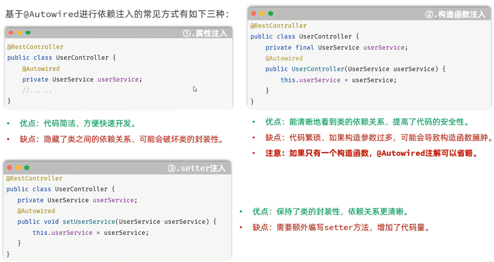

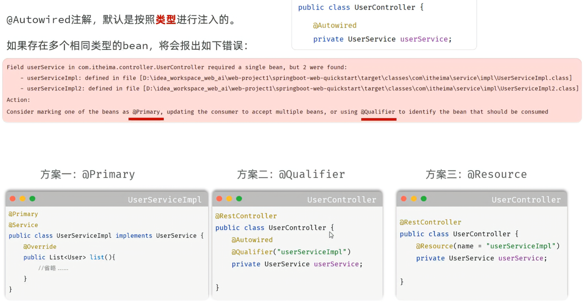


## 数据库存储

```bash
NoSQL与SQ
CAP定理
RDBMS
MongoDB语法
指令
监控与GUI
MongoDb驱动
Mongoose应用
数据库创建
集合增删改查
文档增删改查
数据库查询
高级查询操作
通道查询
多条件查询
反向筛选
索引处理
aggregate聚合管道
validation验证
population联表
middleware中间件处理
查询ERROR类二次封装
```

