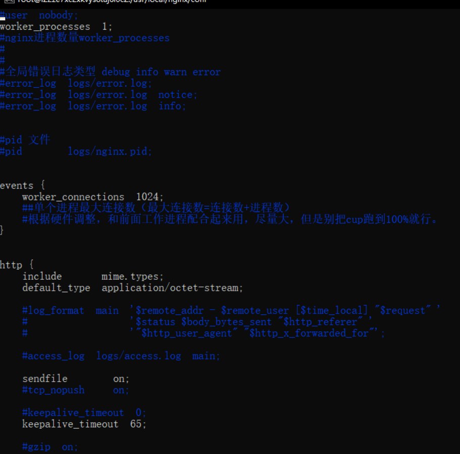

## Bash

#### bash 常用快捷键

```bash
### Bash 常用快捷键
- `Ctrl+C` 终止命令
- `Ctrl+Z` 暂停命令
- `Ctrl+A` 将光标移动行首
- `Ctrl+E` 将光标移动到行尾
- `Ctrl+F` 向前移动一个字符
- `Ctrl+B` 向后移动一个字符
- `Ctrl+U` 从光标处删除到行首
- `Ctrl+K` 从光标处删除到行尾
- `Ctrl+W` 从光标处删除到单词的开头
- `Ctrl+D` 删除光标下的字符
- `Ctrl+H` 删除光标前的字符
- `Ctrl+T` 将光标下的字符与上一个交换
- `Ctrl+L` 清屏，相当于 `clear` 命令
- `Ctrl+Y` 粘贴 `Ctrl+U` 或 `Ctrl+K` 剪切的内容
- `Ctrl+R` 在历史命令中搜索，按下 `Ctrl+R` 组合键之后，就会出现搜索界面，只要输入搜索内容，就会从历史命令中搜索
```


#### windows命令下载文件

```bash
### windows 命令下载文件
- 在打开的poershell窗口中，依次输入如下命令：
    `$client = new-object System.Net.WebClient` （回车）
- `$client.DownloadFile('网络文件链接地址','保存到本地后的路径+文件名')` （回车）
```

```cmd
start powershell
$client = new-object System.Net.WebClient
$client.DownloadFile('http://test.com/xxx.html','D:\index.html')
```


## Linux

### **下载文件**

> ```shell
> # wget -c http下载，不需要翻墙
> wget -c http://test.com/zip/test.zip
>
> #让档案自动存储到指令的目录下，需要-P参数
> wget -P 目录 网址
> ```

### 移动命令mv

> - mv(选项)(参数)  剪切，或在同目录下移动重命名
> - 如果目标文件是文件夹，则源文件直接移动到该文件夹内，名字还是源文件的名字。
> - .如果目标文件是文件，则源文件移动的同时也会更改名字
> - 如果源文件为多个，则目标必须是目录，并且统一移动到目录下
>
> ```shell
> #-b：当目标文件存在时，先进行备份在覆盖
> mv -b a/aa b/		#ls b -->aa aa~ bb
>
> #-f：当目标文件存在时，强制覆盖
> mv -f a/aa b/	#ls b -->aa bb
>
> -i：默认选项，当目标文件存在时，提示是否覆盖
> -t：先指定目标，在制定源
> -v：显示过程
> ```

### 删除文件：rm

> ```shell
> rm -f filename
> ```

### 目录文件

> ```shell
> pwd						#查看所在的路径
> dir						#查看目录下的文件
> ls						# 查看当前的目录的文件
> cd 目录名			# 切换目录
> cat filename	 #查看文件内容
> ```

### 集

> ```bash
> #复制文件
> cp 被复制文件 拷贝到所在路径
>
>
> clear			#清屏
> ```

## Nginx

### Nginx概述

> ```bash
> # Nginx 概述
> Nginx (engine x) 是一个高性能的HTTP和反向代理web服务器，同时也提供了IMAP/POP3/SMTP服务。
> Nginx是由伊戈尔·赛索耶夫为俄罗斯访问量第二的Rambler.ru站点（俄文：Рамблер）开发的，第一个公开版本0.1.0发布于2004年10月4日。2011年6月1日，nginx 1.0.4发布。
>
> 高并发/大流量：需要面对高并发用户，大流量访问。
> Nginx 是一个安装非常的简单、配置文件非常简洁（还能够支持perl语法）、Bug非常少的服务。
> Nginx 启动特别容易，并且几乎可以做到7*24不间断运行，即使运行数个月也不需要重新启动。你还能够不间断服务的情况下进行软件版本的升级。
> Nginx代码完全用C语言从头写成。官方数据测试表明能够支持高达 50,000 个并发连接数的响应。
>
>
> # 负载均衡（upstream）
> 1. 轮询
> 轮询方式是Nginx负载默认的方式，即所有请求都按照时间顺序分配到不同的服务上，如果服务Down掉，可以自动剔除
>
> 2. 权重
> 指定每个服务的权重比例，weight和访问比率成正比，通常用于后端服务机器性能不统一，将性能好的分配权重高来发挥服务器最大性能
>
>
> # 动静分离
> 在Web开发中，通常来说，动态资源其实就是指那些后台资源，而静态资源就是指HTML，JavaScript，CSS，img等文件。
> 一般来说，都需要将动态资源和静态资源分开，将静态资源部署在Nginx上，当一个请求来的时候，如果是静态资源的请求，就直接到nginx配置的静态资源目录下面获取资源，如果是动态资源的请求，nginx利用反向代理的原理，把请求转发给后台应用去处理，从而实现动静分离。
> 在使用前后端分离之后，可以很大程度的提升静态资源的访问速度，同时在开过程中也可以让前后端开发并行可以有效的提高开发时间，也可以有些的减少联调时间
> ```
>
> #### 正向代理
>
> - nginx不仅可以做反向代理，还能用作正向代理来进行上网等功能。
> - 如果把局域网外的Internet想象成一个巨大的资源库，则局域网中的客户端要访问Internet，则需要通过代理服务器来访问，这种代理服务就称为正向代理（即是：通过正向代理进行上网功能）
>
> 
>
> #### 反向代理
>
>-  **反向代理**实际运行方式是代理服务器接受网络上的连接请求。它将请求转发给内部网络上的服务器，并将从服务器上得到的结果返回给网络上请求连接的客户端，此时代理服务器对外就表现为一个服务器。
>
>

### 安装Nginx

> ```bash
> # 安装 Nginx
> 1. 安装gcc
> 安装 nginx 需要先将官网下载的源码进行编译，编译依赖 gcc 环境，如果没有 gcc 环境，则需要安装：
> yum install gcc-c++
>
>
> 2. PCRE pcre-devel 安装
> PCRE(Perl Compatible Regular Expressions) 是一个Perl库，包括 perl 兼容的正则表达式库。nginx 的 http 模块使用 pcre 来解析正则表达式，所以需要在 linux 上安装 pcre 库，pcre-devel 是使用 pcre 开发的一个二次开发库。nginx也需要此库。命令：
> yum install -y pcre pcre-devel
>
>
> 3、zlib 安装
> zlib 库提供了很多种压缩和解压缩的方式， nginx 使用 zlib 对 http 包的内容进行 gzip ，所以需要在 Centos 上安装 zlib 库。
> yum install -y zlib zlib-devel
>
>
> 4、OpenSSL 安装
> OpenSSL 是一个强大的安全套接字层密码库，囊括主要的密码算法、常用的密钥和证书封装管理功能及 SSL 协议，并提供丰富的应用程序供测试或其它目的使用。
> nginx 不仅支持 http 协议，还支持 https（即在ssl协议上传输http），所以需要在 Centos 安装 OpenSSL 库。
> yum install -y openssl openssl-devel
>
>
> 5.下载Nginx
> wget https://nginx.org/download/nginx-1.19.9.tar.gz
>
>
> 6.解压nginx
> tar -zxvf nginx-1.19.9.tar.gz
> cd nginx-1.19.9
>
>
> 7.执行nginx-configure文件
> ./configure
>
>
> 8.make命令编译
> 执行完后会有一个MakeFile文件夹。make 是一个命令工具，它解释 Makefile 中的指令（应该说是规则）。在 Makefile文件中描述了整个工程所有文件的编译顺序、编译规则
> make
> make install
>
>
> 9.查询nginx 安装目录
> whereis nginx
>
>
> 10.进入安装目录执行nginx；前往安装目录找到sbin 执行nginx
> cd /user/local/nginx
> ls
> cd sbin
> ./nginx
> ```
>
> #### yum install 404解决方案
>
> ```bash
> 1、进入配置文件内，删除所有的.repo文件（也可以备份）
>
> #进入配置文件夹
> cd /etc/yum.repos.d/
> #删除旧的配置文件
> rm *.repo
> #输入“y”回车确认
> ls确保该目录下的.repo文件已完全删除
> 下载可以用的.repo文件
>
> wget -O /etc/yum.repos.d/CentOS-Base.repo https://mirrors.aliyun.com/repo/Centos-vault-8.5.2111.repo
> 如果你没有安装wget，也可以用下面命令：
>
> curl -o /etc/yum.repos.d/CentOS-Base.repo https://mirrors.aliyun.com/repo/Centos-vault-8.5.2111.repo
> 运行 yum makecache 生成缓存
> yum makecache
>
>
> Linux 防火墙
> 1、firewalld的基本使用
> 启动： systemctl start firewalld
> 查看状态： systemctl status firewalld
> 停止：systemctl stop firewalld
> 禁用：systemctl disable firewalld
>
> 2.systemctl是CentOS7的服务管理工具中主要的工具，它融合之前service和chkconfig的功能于一体。
> 启动一个服务：systemctl start firewalld.service
> 关闭一个服务：systemctl stop firewalld.service
> 重启一个服务：systemctl restart firewalld.service
> 显示一个服务的状态：systemctl status firewalld.service
> 在开机时启用一个服务：systemctl enable firewalld.service
> 在开机时禁用一个服务：systemctl disable firewalld.service
> 查看服务是否开机启动：systemctl is-enabled firewalld.service
> 查看已启动的服务列表：systemctl list-unit-files|grep enabled
> 查看启动失败的服务列表：systemctl --failed
>
> 3.配置firewalld-cmd
> 查看版本： firewall-cmd --version
> 查看帮助： firewall-cmd --help
> 显示状态： firewall-cmd --state
> 查看所有打开的端口： firewall-cmd --zone=public --list-ports
> 更新防火墙规则： firewall-cmd --reload
> 查看区域信息:  firewall-cmd --get-active-zones
> 查看指定接口所属区域： firewall-cmd --get-zone-of-interface=eth0
> 拒绝所有包：firewall-cmd --panic-on
> 取消拒绝状态： firewall-cmd --panic-off
> 查看是否拒绝： firewall-cmd --query-panic
>
>
> 那怎么开启一个端口呢
> 添加
> firewall-cmd --zone=public --add-port=80/tcp --permanent    （--permanent永久生效，没有此参数重启后失效）
>
> 重新载入
> firewall-cmd --reload
>
> 查看
> firewall-cmd --zone= public --query-port=80/tcp
>
> 删除
> firewall-cmd --zone= public --remove-port=80/tcp --permanent
> ```

### Nginx常用命令

> ```bash
> # 配置nginx环境变量
> whereis nginx 找到nginx 安装目录
> 前往跟目录 找到etc文件夹
> vim profile 打开配置文件
> 添加环境变量（前半段node忽略）
> export PATH=$PATH:/node-v14.19.1-linux-x64/bin:/usr/local/nginx/sbin
>
> # Nginx常用命令介绍
> 1.查看nginx版本号
> nginx -v
> nginx -V
>
> 2.启动nginx
> 	直接执行 nginx 即可
>
> 3.停止nginx
> nginx -s stop
> Stop 是立即停止
>
> nginx -s quit
> Quit 是一个优雅的关闭方式，Nginx在退出前完成已经接受的请求处理
>
>
> 4.重载nginx配置文件
> 	nginx -s reload
>
>
> 5查看nginx进程
> 	ps -ef | grep nginx
> 	ps -ef
> 		输出标准格式的linux进程命令
> grep nginx
>  grep命令 是查找， 是一种强大的文本搜索工具 我们这儿是查找nginx
> ```

Nginx配置文件

> ```bash
> # 如何查找nginx配置文件
> nginx -t
>  nginx -t 检查配置文件是否有语法错误
>
>
> # 打开配置文件
> vim nginx.conf
>
> Nginx的主配置文件是nginx.conf，这个配置文件一共由三部分组成，分别为全局块、events块和http块。
> 在http块中，又包含http全局块、多个server块。
> 每个server块中，可以包含server全局块和多个location块。在同一配置块中嵌套的配置块，各个之间不存在次序关系
>
>
> 1.全局块
> 全局块是默认配置文件从开始到events块之间的一部分内容，主要设置一些影响Nginx服务器整体运行的配置指令，因此，这些指令的作用域是Nginx服务器全局。
>   - user [user] [group]  指定可以运行nginx服务的用户和用户组，只能在全局块配置 user指令在Windows上不生效，如果你制定具体用户和用户组会报警告
>   - worker_processes nginx进程数量worker_processes 比如设置为2 nginx将会开启一个master进程和2两个worker进程
>   - pid  logs/nginx.pid 存放pid文件
>   - error_log  logs/error.log;  全局错误日志类型 debug info warn error 存放地址
>
> 2.events块
> events块涉及的指令主要影响Nginx服务器与用户的网络连接。常用到的设置包括是否开启对多worker process下的网络连接进行序列化，是否允许同时接收多个网络连接，选取哪种事件驱动模型处理连接请求，每个worker process可以同时支持的最大连接数等
>   - accept_mutex 默认开启-开启之后nginx 的多个worker将会以串行的方式来处理，只会有一个worker将会被唤起，其他的worker继续睡眠，如果不开启将会造成惊群效应多个worker全部唤起不过只有一个Worker能获取新连接，其它的Worker会重新进入休眠状态
>   - worker_connections 单个进程最大连接数（最大连接数=连接数+进程数）
>
> 3.http块
> http块是Nginx服务器配置中的重要部分，代理、缓存和日志定义等绝大多数的功能和第三方模块的配置都可以放在这个模块中。
>   - include指令，用于引入其他的配置文件
>   - default_type 如果Web程序没设置，Nginx也没对应文件的扩展名，就用Nginx 里默认的 default_type定义的处理方式。default_type application/octet-stream; #nginx默认文件类型
>   - log_format指令，用于定义日志格式，此指令只能在http块中进行配置
>   - sendfile 简单来说就是启用sendfile()系统调用来替换read()和write()调用，减少系统上下文切换从而提高性能，当 nginx 是静态文件服务器时，能极大提高nginx的性能表现
>   - keepalive_timeout HTTP 有一个 KeepAlive 模式，它告诉 webserver 在处理完一个请求后保持这个 TCP 连接的打开状态。若接收到来自客户端的其它请求，服务端会利用这个未被关闭的连接，而不需要再建立一个连接。
>   - gzip 开启Gzip压缩功能， 可以使网站的css、js 、xml、html 文件在传输时进行压缩，提高访问速度, 进而优化Nginx性能
>
> 4.server块
> 每一个http块都可以包含多个server块，而每个server块就相当于一台虚拟主机，它内部可有多台主机联合提供服务，一起对外提供在逻辑上关系密切的一组服务
> listen指令的配置非常灵活，可以单独制定ip，单独指定端口或者同时指定ip和端口
>   - listen 127.0.0.1:8000;  #只监听来自127.0.0.1这个IP，请求8000端口的请求
>   - listen 127.0.0.1; #只监听来自127.0.0.1这个IP，请求80端口的请求（不指定端口，默认80）
>   - listen 9999; #监听来自所有IP，请求9999端口的请求
>   - listen *:9999; #和上面效果一样
>   - listen localhost:8000; #和第一种效果一致
>
>   - server_name nginx 允许一个虚拟主机有一个或多个名字，也可以使用通配符"*"来设置虚拟主机的名字  支持 ip 域名 通配符 正则等
>   - server_name  localhost;
>
>
> 5.location块
> 每个server块中可以包含多个location块。在整个Nginx配置文档中起着重要的作用，而且Nginx服务器在许多功能上的灵活性往往在location指令的配置中体现出来
>
> location 指令可以分为以下 3 类：
>   前缀字符串匹配
>   正则表达式匹配
>   用于内部跳转的命名location
>   前缀字符串匹配
>   精确匹配 =
>   前缀匹配 ^~（立刻停止后续的正则搜索）
>   按文件中顺序的正则匹配 ~或~*
>   匹配不带任何修饰的前缀匹配。
>   location root
>   root 指定目录的上级目录，并且该上级目录要含有locatoin指定名称的同名目录。
>
>   location /img/ {
>     root /var/www/image;
>   }
> 若按照这种配置的话，则访问/img/目录下的文件时，nginx会去/var/www/./image/img/目录下找文件
> ```
>
> ```shell
> #===================全局块开始======================
> #user  nobody;
> #工作进程数，一般配置成和cpu数量一致
> worker_processes  1;
>
> #全局错误日志及pid文件存放位置
> error_log  logs/error.log;
> #error_log  logs/error.log  notice;
> #error_log  logs/error.log  info;
>
> #nginx 启动master进程pid号
> #pid        logs/nginx.pid;
>
> #=================全局块结束============================
>
>
> #==============events块开始======================
> events {
> #标识单个worker进程的最大并发数
>     worker_connections  1024;
> }
>
> #============events块结束============================
>
>
> #============http块开始（nginx服务器中配置最频繁的部分，配置虚拟主机，监听端口，请求转发等等）==========================
> http {
>     #引入 mime 类型定义文件
>     include       mime.types;
>     default_type  application/octet-stream;
>
>    #设置日志生成格式
>     #log_format  main  '$remote_addr - $remote_user [$time_local] "$request" '
>     #                  '$status $body_bytes_sent "$http_referer" '
>     #                  '"$http_user_agent" "$http_x_forwarded_for"';
>
>     #access_log  logs/access.log  main;
>
>     sendfile        on;
>     #tcp_nopush     on;
>
>
>   #连接的超时时间
>     #keepalive_timeout  0;
>     keepalive_timeout  65;
>
>    #解开注释就是开启gzip压缩
>     #gzip  on;
>
>     #此处配置多台tomcat服务器(名称不能有下划线：webServer）
>     upstream webServer{
>         server 127.0.0.1:8081;
>         server 127.0.0.1:8082;
>      }
>
> 	#此处配置多台tomcat服务器(名称不能有下划线：webs2Server）
>     #upstream webs2Server{
>       #server 192.168.30.19:8083;
>       #server 192.168.32.12:8085;
>     #}
>
>     server {
>         listen       80; # 定义当前这个server监听的端口
>         server_name  localhost; # 定义使用localhost访问
>
>         #charset koi8-r;
>
>         #access_log  logs/host.access.log  main;
>
>         #默认请求地址，如果请求是：192.168.10.80:80/  那么会进入这个里面的tomcat反向代理地址
>         #一个location里面只能有一个proxy_pass
>         location / {
>         #此处可以配置Tomcat反向代理地址比如：
>         #此处可以引用上面upstream 的多台tomcat；也可以单独配置一台
>         proxy_pass http://127.0.0.1:8081/; #配置单台
>         #proxy_pass http://webServer/; #引用上面的多台
>         #引用上面的多台配置
>            # root   html; #默认的网站根目录的位置
>             #index  index.html index.htm; #网站的欢迎页,起始页
>         }
>
>
>         #表示如果请求是：192.168.10.80:80/web 那么会进入这个里面的tomcat反向代理地址
>         location /web {
>         #此处引用上面的配置的多台tomcat
>         #proxy_pass http://127.0.0.1:8082/;
>         #proxy_pass http://web2Server/; #引用上面的多台Tomcat配置
>         }
>
>         #error_page  404              /404.html;
>
>         # redirect server error pages to the static page /50x.html
>         #
>
>         #错误提示页面
>         error_page   500 502 503 504  /50x.html;
>         location = /50x.html {
>             root   html;
>         }
>
>         # proxy the PHP scripts to Apache listening on 127.0.0.1:80
>         #
>         #location ~ \.php$ {
>         #    proxy_pass   http://127.0.0.1;
>         #}
>
>         # pass the PHP scripts to FastCGI server listening on 127.0.0.1:9000
>         #
>         #location ~ \.php$ {
>         #    root           html;
>         #    fastcgi_pass   127.0.0.1:9000;
>         #    fastcgi_index  index.php;
>         #    fastcgi_param  SCRIPT_FILENAME  /scripts$fastcgi_script_name;
>         #    include        fastcgi_params;
>         #}
>
>         # deny access to .htaccess files, if Apache's document root
>         # concurs with nginx's one
>         #
>         #location ~ /\.ht {
>         #    deny  all;
>         #}
>     }
>
>
>     # another virtual host using mix of IP-, name-, and port-based configuration
>     #
>     #server {
>     #    listen       8000;
>     #    listen       somename:8080;
>     #    server_name  somename  alias  another.alias;
>
>     #    location / {
>     #        root   html;
>     #        index  index.html index.htm;
>     #    }
>     #}
>
>
>     # HTTPS server
>     #
>     #server {
>     #    listen       443 ssl;
>     #    server_name  localhost;
>
>     #    ssl_certificate      cert.pem;
>     #    ssl_certificate_key  cert.key;
>
>     #    ssl_session_cache    shared:SSL:1m;
>     #    ssl_session_timeout  5m;
>
>     #    ssl_ciphers  HIGH:!aNULL:!MD5;
>     #    ssl_prefer_server_ciphers  on;
>
>     #    location / {
>     #        root   html;
>     #        index  index.html index.htm;
>     #    }
>     #}
>
> }
> ```
>
> 

### Nginx反向代理

> ````bash
> # 下载 Nginx 代理项目
> http://nginx.org/
>
> 可在cmd 中输入命令启动端口服务：nginx
>
>
> # 反向代理中常用命令：
> proxy_pass    # 该指令用来设置被代理服务器地址，可以是主机名称、IP地址加端口号形式
> proxy_set_header	#
>
>
>
> # 案例代理到百度
> location / {
> root   html;
> index  index.html index.htm;
> proxy_pass http://www.baidu.com;
> }
>
>
> # 案例：nginx 反向代理解决跨域
> ## 前端代码
>  a.onclick = () => {
>    let xhr = new XMLHttpRequest()
>    xhr.open('GET','/api/portal/list')
>    xhr.onreadystatechange = () => {
>      if(xhr.readyState == 4 &&  xhr.status == 200){
>        console.log(xhr.responseText);
>      }
>    }
>    xhr.send(null)
>  }
>
> ## express 服务器代码
>  const express = require('express')
>  const app = express()
>  app.get('/portal/list', (req, res) => {
>      res.json({ code: 200, message: "message信息" })
>  })
>  app.listen(9000,() => { console.log('success'); })
>
> ## nginx 配置代码
>  location /api/ {
>    proxy_pass http://localhost:9000/;
>  }
>
>
> # proxy_set_header
> 该指令可以更改Nginx服务器接收到的客户端请求的请求头信息，然后将新的请求头发送给代理的服务器
> proxy_set_header X-Real-IP $remote_addr;
> proxy_set_header X-Real-Port $remote_port;
> proxy_set_header X-Forwarded-For $proxy_add_x_forwarded_for;
> 三个header分别表示：
>  X-Real-IP 客户端或上一级代理ip
>  X-Real-Port 客户端或上一级端口
>  X-Forwarded-For 包含了客户端和各级代理ip的完整ip链路
> 			其中X-Real-IP是必需的，后两项选填。
> 			当只存在一级nginx代理的时候X-Real-IP和X-Forwarded-For是一致的，
> 			而当存在多级代理的时候，X-Forwarded-For 就变成了如下形式
> 	$remote_addr是前一节点的IP，并不一定是用户的真实IP。
> ````

### nginx配置路由跳转404 问题

> ```bash
> # Vue histroy 模式 跳转路由404 问题
> 问题原因：服务器是根据页面路由，去按路径寻找资源的。我们打包好的web站点只有一个html页面，不存在其他资源目录下的html，服务器找不到对应页面所以才报404。
> 解决方案： try_files $uri $uri/ /index.html;
> 	如果给出的file都没有匹配到，则重新请求最后一个参数给定的uri，就是新的location匹配
>
>
> # 常见的变量：
> $uri 当前请求的 URI，但不含“？”后的参数
> $args 当前请求的参数，即“？”后的宇符串
> $arg_xxx 当前请求里的某个参数，“arg ”后是参数的名字
> $http_xxx 当前请求里的 xxx 头部对应的值
> $sent_http_xxx 返回给客户端的响应头部对应的值
> $remote_addr 客户端IP 地址。
> $http_cookie 获取cookie值
> $cookie_xxx 当前请求的cookie xxx对应的值
> $request_uri 浏览器发起的不作任何修改的请求的url中的path 如在www.baidu.com/p1/file?d=111, 其值为/p1/file?d=111
> $uri 指当前的请求URI，不包括任何参数，反映任何内部重定向或index模块所做的修改
> $request_method 请求方法
> ```

