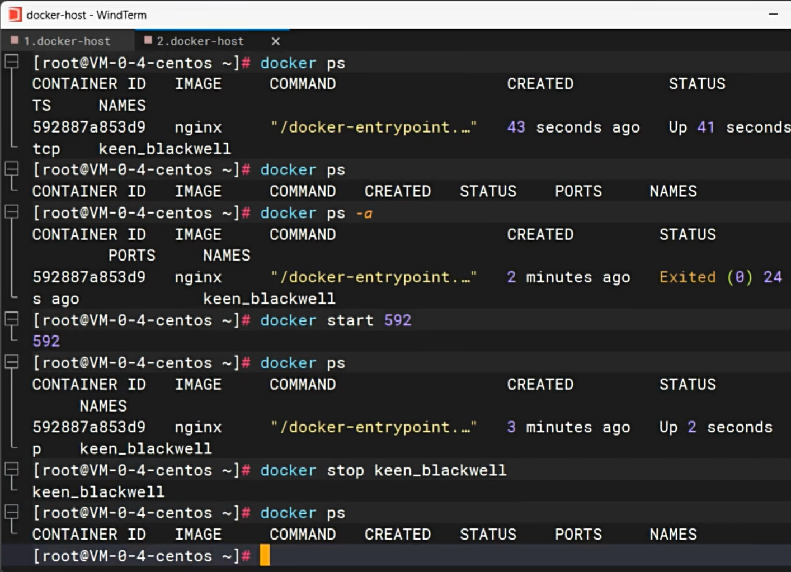
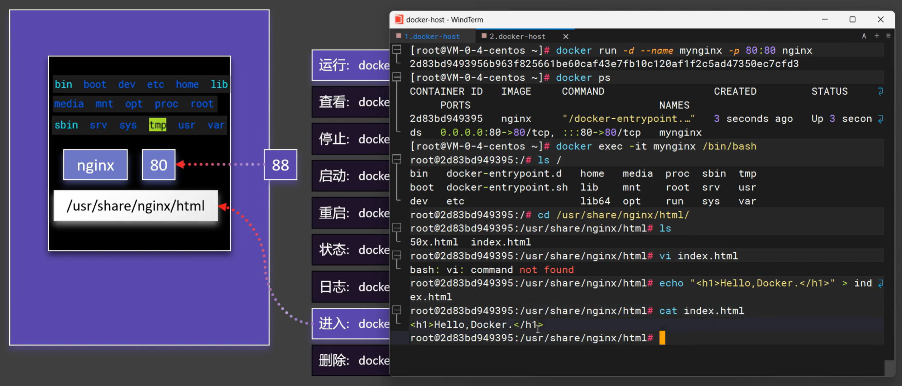

## Bash

#### bash 常用快捷键

```bash
### Bash 常用快捷键
- `Ctrl+C` 终止命令
- `Ctrl+Z` 暂停命令
- `Ctrl+A` 将光标移动行首
- `Ctrl+E` 将光标移动到行尾
- `Ctrl+F` 向前移动一个字符
- `Ctrl+B` 向后移动一个字符
- `Ctrl+U` 从光标处删除到行首
- `Ctrl+K` 从光标处删除到行尾
- `Ctrl+W` 从光标处删除到单词的开头
- `Ctrl+D` 删除光标下的字符
- `Ctrl+H` 删除光标前的字符
- `Ctrl+T` 将光标下的字符与上一个交换
- `Ctrl+L` 清屏，相当于 `clear` 命令
- `Ctrl+Y` 粘贴 `Ctrl+U` 或 `Ctrl+K` 剪切的内容
- `Ctrl+R` 在历史命令中搜索，按下 `Ctrl+R` 组合键之后，就会出现搜索界面，只要输入搜索内容，就会从历史命令中搜索
```


#### windows命令下载文件

```bash
### windows 命令下载文件
- 在打开的poershell窗口中，依次输入如下命令：
    `$client = new-object System.Net.WebClient` （回车）
- `$client.DownloadFile('网络文件链接地址','保存到本地后的路径+文件名')` （回车）
```

```cmd
start powershell
$client = new-object System.Net.WebClient
$client.DownloadFile('http://test.com/xxx.html','D:\index.html')
```


## Linux

### **下载文件**

> ```shell
> # wget -c http下载，不需要翻墙
> wget -c http://test.com/zip/test.zip
>
> #让档案自动存储到指令的目录下，需要-P参数
> wget -P 目录 网址
> ```

### 移动命令mv

> - mv(选项)(参数)  剪切，或在同目录下移动重命名
> - 如果目标文件是文件夹，则源文件直接移动到该文件夹内，名字还是源文件的名字。
> - .如果目标文件是文件，则源文件移动的同时也会更改名字
> - 如果源文件为多个，则目标必须是目录，并且统一移动到目录下
>
> ```shell
> #-b：当目标文件存在时，先进行备份在覆盖
> mv -b a/aa b/		#ls b -->aa aa~ bb
>
> #-f：当目标文件存在时，强制覆盖
> mv -f a/aa b/	#ls b -->aa bb
>
> -i：默认选项，当目标文件存在时，提示是否覆盖
> -t：先指定目标，在制定源
> -v：显示过程
> ```

### 删除文件：rm

> ```shell
> rm -f filename
> ```

### 目录文件

> ```shell
> pwd						#查看所在的路径
> dir						#查看目录下的文件
> ls						# 查看当前的目录的文件
> cd 目录名			# 切换目录
> cat filename	 #查看文件内容
> ```

### 集

> ```bash
> #复制文件
> cp 被复制文件 拷贝到所在路径
>
>
> clear			#清屏
> ```

## Nginx

### Nginx概述

> ```bash
> # Nginx 概述
> Nginx (engine x) 是一个高性能的 HTTP 和反向代理 web 服务器，同时也提供了 IMAP/POP3/SMTP 服务。
> 
>
> 高并发/大流量：需要面对高并发用户，大流量访问。
> Nginx 是一个安装非常的简单、配置文件非常简洁（还能够支持perl语法）、Bug非常少的服务。
> Nginx 启动特别容易，并且几乎可以做到7*24不间断运行，即使运行数个月也不需要重新启动。你还能够不间断服务的情况下进行软件版本的升级。
> Nginx代码完全用C语言从头写成。官方数据测试表明能够支持高达 50,000 个并发连接数的响应。
>
>
> # 负载均衡（upstream）
> 1. 轮询
> 轮询方式是Nginx负载默认的方式，即所有请求都按照时间顺序分配到不同的服务上，如果服务Down掉，可以自动剔除
>
> 2. 权重
> 指定每个服务的权重比例，weight和访问比率成正比，通常用于后端服务机器性能不统一，将性能好的分配权重高来发挥服务器最大性能
>
>
> # 动静分离
> 在Web开发中，通常来说，动态资源其实就是指那些后台资源，而静态资源就是指HTML，JavaScript，CSS，img等文件。
> 一般来说，都需要将动态资源和静态资源分开，将静态资源部署在Nginx上，当一个请求来的时候，如果是静态资源的请求，就直接到nginx配置的静态资源目录下面获取资源，如果是动态资源的请求，nginx利用反向代理的原理，把请求转发给后台应用去处理，从而实现动静分离。
> 在使用前后端分离之后，可以很大程度的提升静态资源的访问速度，同时在开过程中也可以让前后端开发并行可以有效的提高开发时间，也可以有些的减少联调时间
> ```
>
> #### 正向代理
>
> - nginx不仅可以做反向代理，还能用作正向代理来进行上网等功能。
> - 如果把局域网外的Internet想象成一个巨大的资源库，则局域网中的客户端要访问Internet，则需要通过代理服务器来访问，这种代理服务就称为正向代理（即是：通过正向代理进行上网功能）
>
> 
>
> #### 反向代理
>
>-  **反向代理**实际运行方式是代理服务器接受网络上的连接请求。它将请求转发给内部网络上的服务器，并将从服务器上得到的结果返回给网络上请求连接的客户端，此时代理服务器对外就表现为一个服务器。
>
>

### 安装Nginx

> ```bash
> # 安装 Nginx
> 1. 安装gcc
> 安装 nginx 需要先将官网下载的源码进行编译，编译依赖 gcc 环境，如果没有 gcc 环境，则需要安装：
> yum install gcc-c++
>
>
> 2. PCRE pcre-devel 安装
> PCRE(Perl Compatible Regular Expressions) 是一个Perl库，包括 perl 兼容的正则表达式库。nginx 的 http 模块使用 pcre 来解析正则表达式，所以需要在 linux 上安装 pcre 库，pcre-devel 是使用 pcre 开发的一个二次开发库。nginx也需要此库。命令：
> yum install -y pcre pcre-devel
>
>
> 3、zlib 安装
> zlib 库提供了很多种压缩和解压缩的方式， nginx 使用 zlib 对 http 包的内容进行 gzip ，所以需要在 Centos 上安装 zlib 库。
> yum install -y zlib zlib-devel
>
>
> 4、OpenSSL 安装
> OpenSSL 是一个强大的安全套接字层密码库，囊括主要的密码算法、常用的密钥和证书封装管理功能及 SSL 协议，并提供丰富的应用程序供测试或其它目的使用。
> nginx 不仅支持 http 协议，还支持 https（即在ssl协议上传输http），所以需要在 Centos 安装 OpenSSL 库。
> yum install -y openssl openssl-devel
>
>
> 5.下载Nginx
> wget https://nginx.org/download/nginx-1.19.9.tar.gz
>
>
> 6.解压nginx
> tar -zxvf nginx-1.19.9.tar.gz
> cd nginx-1.19.9
>
>
> 7.执行nginx-configure文件
> ./configure
>
>
> 8.make命令编译
> 执行完后会有一个MakeFile文件夹。make 是一个命令工具，它解释 Makefile 中的指令（应该说是规则）。在 Makefile文件中描述了整个工程所有文件的编译顺序、编译规则
> make
> make install
>
>
> 9.查询nginx 安装目录
> whereis nginx
>
>
> 10.进入安装目录执行nginx；前往安装目录找到sbin 执行nginx
> cd /user/local/nginx
> ls
> cd sbin
> ./nginx
> ```
>
> #### yum install 404解决方案
>
> ```bash
> 1、进入配置文件内，删除所有的.repo文件（也可以备份）
>
> #进入配置文件夹
> cd /etc/yum.repos.d/
> #删除旧的配置文件
> rm *.repo
> #输入“y”回车确认
> ls确保该目录下的.repo文件已完全删除
> 下载可以用的.repo文件
>
> wget -O /etc/yum.repos.d/CentOS-Base.repo https://mirrors.aliyun.com/repo/Centos-vault-8.5.2111.repo
> 如果你没有安装wget，也可以用下面命令：
>
> curl -o /etc/yum.repos.d/CentOS-Base.repo https://mirrors.aliyun.com/repo/Centos-vault-8.5.2111.repo
> 运行 yum makecache 生成缓存
> yum makecache
>
>
> Linux 防火墙
> 1、firewalld的基本使用
> 启动： systemctl start firewalld
> 查看状态： systemctl status firewalld
> 停止：systemctl stop firewalld
> 禁用：systemctl disable firewalld
>
> 2.systemctl是CentOS7的服务管理工具中主要的工具，它融合之前service和chkconfig的功能于一体。
> 启动一个服务：systemctl start firewalld.service
> 关闭一个服务：systemctl stop firewalld.service
> 重启一个服务：systemctl restart firewalld.service
> 显示一个服务的状态：systemctl status firewalld.service
> 在开机时启用一个服务：systemctl enable firewalld.service
> 在开机时禁用一个服务：systemctl disable firewalld.service
> 查看服务是否开机启动：systemctl is-enabled firewalld.service
> 查看已启动的服务列表：systemctl list-unit-files|grep enabled
> 查看启动失败的服务列表：systemctl --failed
>
> 3.配置firewalld-cmd
> 查看版本： firewall-cmd --version
> 查看帮助： firewall-cmd --help
> 显示状态： firewall-cmd --state
> 查看所有打开的端口： firewall-cmd --zone=public --list-ports
> 更新防火墙规则： firewall-cmd --reload
> 查看区域信息:  firewall-cmd --get-active-zones
> 查看指定接口所属区域： firewall-cmd --get-zone-of-interface=eth0
> 拒绝所有包：firewall-cmd --panic-on
> 取消拒绝状态： firewall-cmd --panic-off
> 查看是否拒绝： firewall-cmd --query-panic
>
>
> 那怎么开启一个端口呢
> 添加
> firewall-cmd --zone=public --add-port=80/tcp --permanent    （--permanent永久生效，没有此参数重启后失效）
>
> 重新载入
> firewall-cmd --reload
>
> 查看
> firewall-cmd --zone= public --query-port=80/tcp
>
> 删除
> firewall-cmd --zone= public --remove-port=80/tcp --permanent
> ```

### Nginx常用命令

> ```bash
> # 配置nginx环境变量
> whereis nginx 找到nginx 安装目录
> 前往跟目录 找到etc文件夹
> vim profile 打开配置文件
> 添加环境变量（前半段node忽略）
> export PATH=$PATH:/node-v14.19.1-linux-x64/bin:/usr/local/nginx/sbin
>
> # Nginx常用命令介绍
> 1.查看nginx版本号
> nginx -v
> nginx -V
>
> 2.启动nginx
> 	直接执行 nginx 即可
>
> 3.停止nginx
> nginx -s stop
> Stop 是立即停止
>
> nginx -s quit
> Quit 是一个优雅的关闭方式，Nginx在退出前完成已经接受的请求处理
>
>
> 4.重载nginx配置文件
> 	nginx -s reload
>
>
> 5查看nginx进程
> 	ps -ef | grep nginx
> 	ps -ef
> 		输出标准格式的linux进程命令
> grep nginx
>  grep命令 是查找， 是一种强大的文本搜索工具 我们这儿是查找nginx
> ```

Nginx配置文件

> ```bash
> # 如何查找nginx配置文件
> nginx -t
>  nginx -t 检查配置文件是否有语法错误
>
>
> # 打开配置文件
> vim nginx.conf
>
> Nginx的主配置文件是nginx.conf，这个配置文件一共由三部分组成，分别为全局块、events块和http块。
> 在http块中，又包含http全局块、多个server块。
> 每个server块中，可以包含server全局块和多个location块。在同一配置块中嵌套的配置块，各个之间不存在次序关系
>
>
> 1.全局块
> 全局块是默认配置文件从开始到events块之间的一部分内容，主要设置一些影响Nginx服务器整体运行的配置指令，因此，这些指令的作用域是Nginx服务器全局。
>   - user [user] [group]  指定可以运行nginx服务的用户和用户组，只能在全局块配置 user指令在Windows上不生效，如果你制定具体用户和用户组会报警告
>   - worker_processes nginx进程数量worker_processes 比如设置为2 nginx将会开启一个master进程和2两个worker进程
>   - pid  logs/nginx.pid 存放pid文件
>   - error_log  logs/error.log;  全局错误日志类型 debug info warn error 存放地址
>
> 2.events块
> events块涉及的指令主要影响Nginx服务器与用户的网络连接。常用到的设置包括是否开启对多worker process下的网络连接进行序列化，是否允许同时接收多个网络连接，选取哪种事件驱动模型处理连接请求，每个worker process可以同时支持的最大连接数等
>   - accept_mutex 默认开启-开启之后nginx 的多个worker将会以串行的方式来处理，只会有一个worker将会被唤起，其他的worker继续睡眠，如果不开启将会造成惊群效应多个worker全部唤起不过只有一个Worker能获取新连接，其它的Worker会重新进入休眠状态
>   - worker_connections 单个进程最大连接数（最大连接数=连接数+进程数）
>
> 3.http块
> http块是Nginx服务器配置中的重要部分，代理、缓存和日志定义等绝大多数的功能和第三方模块的配置都可以放在这个模块中。
>   - include指令，用于引入其他的配置文件
>   - default_type 如果Web程序没设置，Nginx也没对应文件的扩展名，就用Nginx 里默认的 default_type定义的处理方式。default_type application/octet-stream; #nginx默认文件类型
>   - log_format指令，用于定义日志格式，此指令只能在http块中进行配置
>   - sendfile 简单来说就是启用sendfile()系统调用来替换read()和write()调用，减少系统上下文切换从而提高性能，当 nginx 是静态文件服务器时，能极大提高nginx的性能表现
>   - keepalive_timeout HTTP 有一个 KeepAlive 模式，它告诉 webserver 在处理完一个请求后保持这个 TCP 连接的打开状态。若接收到来自客户端的其它请求，服务端会利用这个未被关闭的连接，而不需要再建立一个连接。
>   - gzip 开启Gzip压缩功能， 可以使网站的css、js 、xml、html 文件在传输时进行压缩，提高访问速度, 进而优化Nginx性能
>
> 4.server块
> 每一个http块都可以包含多个server块，而每个server块就相当于一台虚拟主机，它内部可有多台主机联合提供服务，一起对外提供在逻辑上关系密切的一组服务
> listen指令的配置非常灵活，可以单独制定ip，单独指定端口或者同时指定ip和端口
>   - listen 127.0.0.1:8000;  #只监听来自127.0.0.1这个IP，请求8000端口的请求
>   - listen 127.0.0.1; #只监听来自127.0.0.1这个IP，请求80端口的请求（不指定端口，默认80）
>   - listen 9999; #监听来自所有IP，请求9999端口的请求
>   - listen *:9999; #和上面效果一样
>   - listen localhost:8000; #和第一种效果一致
>
>   - server_name nginx 允许一个虚拟主机有一个或多个名字，也可以使用通配符"*"来设置虚拟主机的名字  支持 ip 域名 通配符 正则等
>   - server_name  localhost;
>
>
> 5.location块
> 每个server块中可以包含多个location块。在整个Nginx配置文档中起着重要的作用，而且Nginx服务器在许多功能上的灵活性往往在location指令的配置中体现出来
>
> location 指令可以分为以下 3 类：
>   前缀字符串匹配
>   正则表达式匹配
>   用于内部跳转的命名location
>   前缀字符串匹配
>   精确匹配 =
>   前缀匹配 ^~（立刻停止后续的正则搜索）
>   按文件中顺序的正则匹配 ~或~*
>   匹配不带任何修饰的前缀匹配。
>   location root
>   root 指定目录的上级目录，并且该上级目录要含有locatoin指定名称的同名目录。
>
>   location /img/ {
>     root /var/www/image;
>   }
> 若按照这种配置的话，则访问/img/目录下的文件时，nginx会去/var/www/./image/img/目录下找文件
> ```
>
> ```shell
> #===================全局块开始======================
> #user  nobody;
> #工作进程数，一般配置成和cpu数量一致
> worker_processes  1;
>
> #全局错误日志及pid文件存放位置
> error_log  logs/error.log;
> #error_log  logs/error.log  notice;
> #error_log  logs/error.log  info;
>
> #nginx 启动master进程pid号
> #pid        logs/nginx.pid;
>
> #=================全局块结束============================
>
>
> #==============events块开始======================
> events {
> #标识单个worker进程的最大并发数
>     worker_connections  1024;
> }
>
> #============events块结束============================
>
>
> #============http块开始（nginx服务器中配置最频繁的部分，配置虚拟主机，监听端口，请求转发等等）==========================
> http {
>     #引入 mime 类型定义文件
>     include       mime.types;
>     default_type  application/octet-stream;
>
>    #设置日志生成格式
>     #log_format  main  '$remote_addr - $remote_user [$time_local] "$request" '
>     #                  '$status $body_bytes_sent "$http_referer" '
>     #                  '"$http_user_agent" "$http_x_forwarded_for"';
>
>     #access_log  logs/access.log  main;
>
>     sendfile        on;
>     #tcp_nopush     on;
>
>
>   #连接的超时时间
>     #keepalive_timeout  0;
>     keepalive_timeout  65;
>
>    #解开注释就是开启gzip压缩
>     #gzip  on;
>
>     #此处配置多台tomcat服务器(名称不能有下划线：webServer）
>     upstream webServer{
>         server 127.0.0.1:8081;
>         server 127.0.0.1:8082;
>      }
>
> 	#此处配置多台tomcat服务器(名称不能有下划线：webs2Server）
>     #upstream webs2Server{
>       #server 192.168.30.19:8083;
>       #server 192.168.32.12:8085;
>     #}
>
>     server {
>         listen       80; # 定义当前这个server监听的端口
>         server_name  localhost; # 定义使用localhost访问
>
>         #charset koi8-r;
>
>         #access_log  logs/host.access.log  main;
>
>         #默认请求地址，如果请求是：192.168.10.80:80/  那么会进入这个里面的tomcat反向代理地址
>         #一个location里面只能有一个proxy_pass
>         location / {
>         #此处可以配置Tomcat反向代理地址比如：
>         #此处可以引用上面upstream 的多台tomcat；也可以单独配置一台
>         proxy_pass http://127.0.0.1:8081/; #配置单台
>         #proxy_pass http://webServer/; #引用上面的多台
>         #引用上面的多台配置
>            # root   html; #默认的网站根目录的位置
>             #index  index.html index.htm; #网站的欢迎页,起始页
>         }
>
>
>         #表示如果请求是：192.168.10.80:80/web 那么会进入这个里面的tomcat反向代理地址
>         location /web {
>         #此处引用上面的配置的多台tomcat
>         #proxy_pass http://127.0.0.1:8082/;
>         #proxy_pass http://web2Server/; #引用上面的多台Tomcat配置
>         }
>
>         #error_page  404              /404.html;
>
>         # redirect server error pages to the static page /50x.html
>         #
>
>         #错误提示页面
>         error_page   500 502 503 504  /50x.html;
>         location = /50x.html {
>             root   html;
>         }
>
>         # proxy the PHP scripts to Apache listening on 127.0.0.1:80
>         #
>         #location ~ \.php$ {
>         #    proxy_pass   http://127.0.0.1;
>         #}
>
>         # pass the PHP scripts to FastCGI server listening on 127.0.0.1:9000
>         #
>         #location ~ \.php$ {
>         #    root           html;
>         #    fastcgi_pass   127.0.0.1:9000;
>         #    fastcgi_index  index.php;
>         #    fastcgi_param  SCRIPT_FILENAME  /scripts$fastcgi_script_name;
>         #    include        fastcgi_params;
>         #}
>
>         # deny access to .htaccess files, if Apache's document root
>         # concurs with nginx's one
>         #
>         #location ~ /\.ht {
>         #    deny  all;
>         #}
>     }
>
>
>     # another virtual host using mix of IP-, name-, and port-based configuration
>     #
>     #server {
>     #    listen       8000;
>     #    listen       somename:8080;
>     #    server_name  somename  alias  another.alias;
>
>     #    location / {
>     #        root   html;
>     #        index  index.html index.htm;
>     #    }
>     #}
>
>
>     # HTTPS server
>     #
>     #server {
>     #    listen       443 ssl;
>     #    server_name  localhost;
>
>     #    ssl_certificate      cert.pem;
>     #    ssl_certificate_key  cert.key;
>
>     #    ssl_session_cache    shared:SSL:1m;
>     #    ssl_session_timeout  5m;
>
>     #    ssl_ciphers  HIGH:!aNULL:!MD5;
>     #    ssl_prefer_server_ciphers  on;
>
>     #    location / {
>     #        root   html;
>     #        index  index.html index.htm;
>     #    }
>     #}
>
> }
> ```
>
> 

### Nginx反向代理

> ````bash
> # 下载 Nginx 代理项目
> http://nginx.org/
>
> 可在cmd 中输入命令启动端口服务：nginx
>
>
> # 反向代理中常用命令：
> proxy_pass    # 该指令用来设置被代理服务器地址，可以是主机名称、IP地址加端口号形式
> proxy_set_header	#
>
>
>
> # 案例代理到百度
> location / {
> root   html;
> index  index.html index.htm;
> proxy_pass http://www.baidu.com;
> }
>
>
> # 案例：nginx 反向代理解决跨域
> ## 前端代码
>  a.onclick = () => {
>    let xhr = new XMLHttpRequest()
>    xhr.open('GET','/api/portal/list')
>    xhr.onreadystatechange = () => {
>      if(xhr.readyState == 4 &&  xhr.status == 200){
>        console.log(xhr.responseText);
>      }
>    }
>    xhr.send(null)
>  }
>
> ## express 服务器代码
>  const express = require('express')
>  const app = express()
>  app.get('/portal/list', (req, res) => {
>      res.json({ code: 200, message: "message信息" })
>  })
>  app.listen(9000,() => { console.log('success'); })
>
> ## nginx 配置代码
>  location /api/ {
>    proxy_pass http://localhost:9000/;
>  }
>
>
> # proxy_set_header
> 该指令可以更改Nginx服务器接收到的客户端请求的请求头信息，然后将新的请求头发送给代理的服务器
> proxy_set_header X-Real-IP $remote_addr;
> proxy_set_header X-Real-Port $remote_port;
> proxy_set_header X-Forwarded-For $proxy_add_x_forwarded_for;
> 三个header分别表示：
>  X-Real-IP 客户端或上一级代理ip
>  X-Real-Port 客户端或上一级端口
>  X-Forwarded-For 包含了客户端和各级代理ip的完整ip链路
> 			其中X-Real-IP是必需的，后两项选填。
> 			当只存在一级nginx代理的时候X-Real-IP和X-Forwarded-For是一致的，
> 			而当存在多级代理的时候，X-Forwarded-For 就变成了如下形式
> 	$remote_addr是前一节点的IP，并不一定是用户的真实IP。
> ````

### nginx配置路由跳转404 问题

> ```bash
> # Vue histroy 模式 跳转路由404 问题
> 问题原因：服务器是根据页面路由，去按路径寻找资源的。我们打包好的web站点只有一个html页面，不存在其他资源目录下的html，服务器找不到对应页面所以才报404。
> 解决方案： try_files $uri $uri/ /index.html;
> 	如果给出的file都没有匹配到，则重新请求最后一个参数给定的uri，就是新的location匹配
>
>
> # 常见的变量：
> $uri 当前请求的 URI，但不含“？”后的参数
> $args 当前请求的参数，即“？”后的宇符串
> $arg_xxx 当前请求里的某个参数，“arg ”后是参数的名字
> $http_xxx 当前请求里的 xxx 头部对应的值
> $sent_http_xxx 返回给客户端的响应头部对应的值
> $remote_addr 客户端IP 地址。
> $http_cookie 获取cookie值
> $cookie_xxx 当前请求的cookie xxx对应的值
> $request_uri 浏览器发起的不作任何修改的请求的url中的path 如在www.baidu.com/p1/file?d=111, 其值为/p1/file?d=111
> $uri 指当前的请求URI，不包括任何参数，反映任何内部重定向或index模块所做的修改
> $request_method 请求方法
> ```


### 地址匹配 location

location 用于定义URL匹配规则，以决定哪些请求会被转发到哪个配置区块进行处理。
它通常与 root 指令配合使用来指定处理这些请求的文件目录。
location 的作用是匹配请求的URI，并不改变该URI。


#### Nginx 静态文件中 root 和 alias 指令

1. root 指令
   root 指令用来指定服务器上的一个目录作为请求的根目录，当触发请求时 Nginx 会将请求的 URL 直接附加到这个根目录后面，从而找到对应的文件。

2. alias 指令
   alias 指令用来修改匹配到的location路径，实际上改变了请求资源的文件路径。
   不同于 root，alias 会替换掉 location 匹配到的部分路径。

3. root 和 alias 区别在于指定路径的处理方式。

  - root: location 部分会附加到 root 部分的路径上，最终形成路径为 `root + location`
  - alias: location 部分将被替换为 alias 部分的路径，最终路径为 `alias`

```nginx
server {
  listen 80;
  server_name www.willy.com;

  # 用 root 指令处理主页
  location / {
    root /var/www/html;
    index index.html;
  }

  # 用 root 指令处理静态文件
  location /static/ {
    root /var/www/;
  }

  # 用 alias 指令处理图片目录
  location /images/ {
    alias /var/www/images/;
  }
}

# 说明
## 1. 主页处理：当访问 `http://www.willy.com/` 时，Nginx 会匹配到第一个 location 块。由于配置 `root /var/www/html;`，Nginx 会在 `/var/www/html/` 目录下查找 `index.html` 文件来响应这个请求。
## 2. 静态文件: 当访问 `http://www.willy.com/static/example.png` 会在 `/var/www/` 位置寻找 `example.png` 文件。
## 3. 图片处理：当访问 `http://www.willy.com/image/logo.png` 时，Nginx 匹配到第二个 location 块。通过配置 `alias /var/www/images/;`，Nginx 会在 `/var/www/images/` 目录下查找 `logo.png` 图片文件 (`/images/URI` 被替换成了文件系统上的路径 `/var/www/images/`)
```


### 重定向 rewrite

rewrite 模块负责静态重写，它允许使用正则表达式改变 URI，并根据变量来重定向以及选择配置。
语法: `rewrite patten replace flag`

  - patten 是正则表达式，与 patten 匹配的 URL 都会被改写成 replace，
  - flag 可选，有如下标志:
    - `last` — 完成 rewrite，然后搜索相应的 URI 和位置。
    - `break` — 中止 `rewrite`，不再匹配后面的规则
    - `redirect` — 返回 code 为 302 的临时重定向
    - `permanent` — 返回 code 为 301 的永久重定向
      注意:
  - 当使用 rewrite 时，务必注意不要创建循环重定向，这会导致浏览器显示错误。
  - 在配置重定向时，需考虑 SEO (搜索引擎优化) 影响，特别是 301 重定向的使用。

```bash
1. 临时重定向 (302)
server {
  listen 80;
  server_name example.com;

  location /oldpage {
    return 302 /newpage;
  }
}


2. 永久重定向 (301)
server {
  listen 80;
  server_name example.com;

  location /oldpage {
    return 301 /newpage;
  }
}


3. 强制使用 Https
server {
  listen 80;
  server_name example.com;

  location /oldpage {
    return 302 https://example.com$request_uri;
  }
}


4. 非 www 到 www
server {
  listen 80;
  server_name example.com;

  location /oldpage {
    return 302 https://www.example.com$request_uri;
  }
}


5. www 到非 www
server {
  listen 80;
  server_name www.example.com;

  location /oldpage {
    return 302 https://example.com$request_uri;
  }
}


6. 使用 rewrite 重定向
server {
  listen 80;
  server_name example.com;
  rewrite ^/oldpage$ /newpage permanent;
}
```


#### 配置旧域名重定向到新域名

```bash
1. 将旧域名重定向到新域名上:
server {
  listen 443 ssl;
  server_name old.com;
  rewrite .* https://new.com;
}


2. 跳转到新域名上时要保留路径
server {
  listen 443 ssl;
  server_name old.domain.com;
  rewrite ^/(.*)$ https://new.domain.com/$1;
}

3. 如果域名不是 `www.new.domain.com`，旧统一跳转到 `https://www.new.domain.com`
server {
  listen 443 ssl;
  server_name old.domain.com new.domain.com example.com www.example.com;
  if ($host != 'www.new.domain.com') {
    rewrite ^/(.*)$ https://new.domain.com/$1 permanent;
  }
}


4. rewrite 与 location 配合实现图片文件跳转 CDN:
server {
  location ~ .*\.(gif|jpg|jpeg|png|bmp|swf)$ {
    expires 30d;
    rewrite ^/uploadfile\/(.*)$ https://cdn.new.domain.com/uploadfile/$1;
  }
}
```


## Docker

```bash
参考文献：
1. 入门概念：https://zhuanlan.zhihu.com/p/187505981
2. 官网API文档：https://docs.docker.com/reference/cli/docker/


docker 常用场景
- 部署Web应用: Nginx、NodeJS、Python Flask 等
- 数据库容器化: MySQL、Redis、MongoDB
- 微服务架构: 通过 Docker Compose 编排多个服务

常见问题
- 权限问题：Linux 需要 sudo 或将用户加入 docker 组。
- 端口冲突：检查宿主机端口是否被占用。
- 镜像加速：国内可使用阿里云或中科大镜像源。

```


### 概念

#### 虚拟机 VS 容器

正常的操作系统运行是需要占用很多资源的，假设一台机器有16G内存，需要部署三个应用，则虚拟机技术划分：


在这台机器上开启三个虚拟机，每个虚拟机上部署一个应用，其中VM1占用2G内存，VM2占用1G内存，VM3占用4G内存。

虚拟机本身总共就占据7G内存，因而没法划分更多虚拟机内存来部署其他应用程序，可我们需求本身是部署应用程序而不是操作系统。

容器技术则可以避免我们把内存浪费在“冗余”的操作系统上，并且可以优化了操作系统的启动和加载时间问题。

容器英译为 container（集装箱），语义为：集装箱(容器)之间相互隔离，可长期反复利用，快速装载和卸载，规格标准。

在软件开发中的隔离是指应用程序在运行时相互独立互不干扰：

- 虚拟机技术：通过将应用程序部署在不同的虚拟机中，从而实现隔离（但每个虚拟机本身会占用多余内存）
- 容器技术：只隔离应用程序运行时环境，但容器之间可以共享同一个操作系统，这里的运行时环境指程序运行依赖的各种库以及配置。

容器轻量级且占用资源更少：

- 空间：与操作系统的运行内存占用相比，容器只需数M空间，因此在同样规格的硬件上大量部署容器，这是虚拟机所不能比拟的；
- 时间：操作系统需要数分钟的启动时间，容器几乎瞬时启动，容器技术为打包服务栈提供了一种更加高效的方式。


#### Docker概述

```bash
docker 是 Go 语言实现的开源项目，可让我们方便创建和使用容器。
docker 将程序以及程序所有的依赖都打包到 docker container，这样你的程序在任何环境下都有一致的行为表现。

docker 可屏蔽运行环境差异：这里程序运行的依赖就是容器(集装箱)，容器所处的操作系统环境(载体：货船/港口)，程序的表现只和容器(集装箱)有关，和容器在哪个操作系统(货船/港口)无关。
docker 可快速部署：容器的启动速度非常快速，只要确保一个容器中的程序正确运行，就能确定无论在生产环境部署多少都能正确运行。


### 如何使用 docker？
docker 中存在的概念：
	- 容器（Container）：轻量化的独立运行环境，包含应用及其依赖。运行起来的进程
	- 镜像（Image）：容器的静态模板，通过镜像创建容器。dockerfile执行后的编译结果，可执行程序
	- dockerfile：定义镜像构建步骤的配置文件，是image镜像的源代码
	- 仓库（Registry）：存储镜像的地方（如 Docker Hub）

1. 先在 dockerfile 中设定配置项：指定需要哪些程序、什么样的依赖；
2. 然后把 dockerfile 交给编译器进行编译（`docker build`命令），生成的可执行程序就是 image；
3. 最后运行这个 image（`docker run`命令），image 运行起来就是 container。


### docker 如何工作？
Docker 基于 CS（Client-Server）架构模式来工作。 Docker 的架构体系中包含了 Docker 客户端（Docker Client）与 Docker 守护进程（Docker Daemon）这两个核心组件。
docker client 负责处理用户输入的各种命令，如`docker build`、`docker run`，而真正工作的是 docker demon。
注意：docker client 和 docker daemon 可运行在同一台机器上。

0. dockerfile
这是一个用于定义如何构建 Docker 镜像的文本文件，其中包含了基础镜像、安装软件包、配置环境等诸多构建镜像所需的指令。


1. docker build
当编写完 dockerfile 交给 docker 编译时使用这个命令，client 在接收到请求后转发给 docker daemon，接着 docker demon 根据 dockerfile （依据 dockerfile 逐步完成如获取基础镜像、安装指定软件包、进行环境配置等）创建可执行程序 的镜像 image。


2. docker run
使用 docker run 后，docker daemon 接收到该命令后（依据命令中指定的镜像名称或标识等信息）找到具体的 image，然后加载到内存开始执行，image 执行起来就成为一个 container。


3. docker pull
Docker Registry 可用来存放各种 image，公共的可以供任何人下载 image 的仓库就是 Docker Hub。
Docker Hub 是 docker 官方应用商店，可通过 `docker pull imageName` 命令来下载别人编写好并共享出来的 image，这样就无需自己从头编写 dockerfile 了。
`docker pull` 命令是用户通过 docker client 发送命令，docker daemon 接收到命令后向 docker registry 发送 image 下载请求，下载后存放在本地，这样就可以使用 image 了。


### docker 底层实现
docker 基于 Linux 内核提供以下功能实现：
1. NameSpace
Linux 中的 PID、IPC、网络等资源是全局的，而 NameSpace 机制是一种资源隔离方案，在该机制下这些资源不再是全局，而是属于某个特定的 NameSpace，各个 NameSpace 下的资源互不干扰，就使得每个 NameSpace 看上去就像一个独立的操作系统一样。

2. Control groups
虽然 NameSpace 技术可以实现资源隔离，但进程还是可以不受控地访问系统资源，比如 CPU、内存、磁盘、网络等，为了控制容器中进行对资源的访问，Docker 采用 control groups 技术(cgroup)，有了 cpgroup 就可以控制容器中进程对系统资源的消耗，比如可以限制某个容器使用内存的上限、可以在哪些 CPU 上运行等。
```


#### 安装

```bash
# 移除旧版本docker
sudo yum remove docker \
	docker-client \
	docker-client-latest \
	docker-common \
	docker-latest \
	docker-latest-logrotate \
	docker-logrotate \
	docker-engine


# 配置docker yum源。
sudo yum install -y yum-utils
sudo yum-config-manager \
--add-repo \
http://mirrors.aliyun.com/docker-ce/linux/centos/docker-ce.repo


# 安装 最新 docker
sudo yum install -y docker-ce docker-ce-cli containerd,io docker-buildx-plugin docker-comp


# 启动 docker
systemctl enable docker --now


# 配置国内镜像源加速，然后重启 docker
sudo mkdir -p /etc/docker
sudo tee /etc/docker/daemon.json <<-'EOF"
{
	"registry-mirrors": ["https://mirror.ccs.tencentyun.com"]
}
EOF
sudo systemctl daemon-reload
sudo systemctl restart docker
```


### 镜像操作

```bash
1. 拉取镜像（从仓库下载）
$ docker pull ubuntu:20.04

2. 查看本地镜像
$ docker images

3. 删除镜像
$ docker rmi <镜像ID>


镜像集合官网：https://hub.docker.com
```


#### 用 Dockerfile 构建镜像

1. 创建 `Dockerfile`：

   ```dockerfile
   # 基础镜像
   FROM ubuntu:20.04
   # 安装依赖
   RUN apt-get update && apt-get install -y python3
   # 复制文件到镜像
   COPY app.py /app/
   # 设置工作目录
   WORKDIR /app
   # 启动命令
   CMD ["python3", "app.py"]
   ```

2. 构建镜像：

   ```bash
   docker build -t my-python-app .
   ```

3. 运行容器：

   ```bash
   docker run my-python-app
   ```


#### 分享镜像


### 容器操作

```bash
1. 启动新容器
$ docker run -it --name my_container ubuntu:20.04 /bin/bash
	- `-it`：交互式终端
	- `--name`： 指定容器名称
	
2. 查看运行中的容器
$ docker ps

3. 查看所有容器（包括已停止的）
$ docker ps -a

4. 启动/停止容器
$ docker start <容器ID>
$ docker stop <容器ID>

5. 进入运行中的容器
$ docker exec -it <容器ID> /bin/bash

6. 删除容器
$ docker rm <容器ID>
```




```bash
1. 容器运行模式：前台/后台运行
		- `-d` 或 `--detach`：以守护进程模式运行容器，即容器在后台运行。
		- `-it`：分配交互式终端（组合使用 `-i`保持标准输入打开、`-t`分配一个伪终端，用于交互式运行容器，例如进入容器的命令行）


2. 资源限制
- CPU：
		- `--cpus=<value>`: 限制容器使用的 CPU 核心数（如 `--cpus=1.5`）
    - `--cpu-shares=<value>`: 设置 CPU 权重（默认 1024，相对比例）
- 内存：
		- `-m` 或 `--memory=<value>`: 限制内存（如 `-m 512m`）
		- `--memory-swap=<value>`: 内存 + Swap 的总限制


5. 环境变量设置: `-e KEY=VALUE` 或 `--env-file=<file>`
		- 为容器设置环境变量或从文件读取
		- `docker run -e MYSQL_ROOT_PASSWORD=123456 -d mysql`


6. 容器命名与标识
`--name=<name>`: 为容器指定唯一名称。
`--hostname=<name>`: 设置容器内部的主机名。

7 用户与权限
`-u` 或 `--user=<user[:group]>`: 指定运行用户（如 `-u 1000:1000`）。
`--cap-add/--cap-drop`: 添加或删除 Linux 权能（增强安全性）。

8 命令覆盖
[COMMAND]: 覆盖镜像中的 CMD 指令。
`--entrypoint="<command>"`: 覆盖镜像的 ENTRYPOINT。

9 自动重启策略
`--restart=<policy>`:
	no（默认）: 不重启。
	on-failure[:max-retries]: 非零退出时重启。
	always: 总是重启。
	unless-stopped: 除非手动停止。

10 健康检查
`--health-cmd=<command>`: 定义健康检查命令。
`--health-interval=<duration>`: 检查间隔（如 5s）。

11 日志管理
`--log-driver=<driver>`: 指定日志驱动（如 json-file、syslog）。
`--log-opt=<option>`: 日志选项（如 --log-opt max-size=10m）。

12 安全设置
`--read-only`: 容器文件系统只读（需配合 --tmpfs 使用可写临时目录）。
`--security-opt=<options>`: 配置 SELinux 或 AppArmor。

13 其他实用选项
`--rm`: 容器退出后自动删除（不可与 --restart 共用）。
`--expose=<port>`: 暴露容器端口（不映射到主机）。
`-e "VAR=value"`: 设置环境变量。
```

```bash
docker run --name my-mysql \
  -e MYSQL_ROOT_PASSWORD=root \
  -p 3306:3306 \
  -v /host/mysql-data:/var/lib/mysql \
  -d mysql:8.0
```

- --name my-mysql：为容器指定名称为 my-mysql。
- -e MYSQL_ROOT_PASSWORD=root：设置 MySQL 的 root 用户密码为 root。
- -p 3306:3306：将容器的 3306 端口映射到宿主机的 3306 端口。
- -v /host/mysql-data:/var/lib/mysql：将宿主机的 /host/mysql-data 目录挂载到容器的 /var/lib/mysql 目录，用于持久化存储 MySQL 数据。
- -d：以守护进程模式运行容器。
- mysql:8.0：使用 MySQL 8.0 版本的镜像。


#### 网络配置

##### 端口映射

```bash
每一个正常启动的容器都是独立的容器（都拥有自己的文件系统），是在内部容器中启动的，所以需要使用容器映射


端口映射：`-p` 或 `--publish`
- 将容器内部的端口映射到宿主机的端口。
- 格式: `docker run -p [宿主机 IP 地址:]宿主机端口:容器端口 [其他选项] 镜像名 [容器内执行的命令]`
- 如 `docker run -p 8080:80 -d nginx` 将容器的 80 端口映射到宿主机的 8080 端口


注意：
1. 端口冲突：宿主机端口和容器端口不能重复使用
宿主机上用于映射的端口必须是空闲的，否则会导致端口映射失败，容器无法正常启动。在映射端口前，要确保所选的宿主机端口未被其他服务占用。

2. 安全性：
端口映射会将容器内的服务暴露到宿主机网络中，因此需要谨慎选择要映射的端口，避免将敏感服务端口直接暴露给外部网络。可以结合防火墙等安全措施来增强安全性。
```




##### 网络模式

```bash
指定网络模式: `--network=<mode>`（mode 有 bridge、host、none 或自定义网络）


### 自定义网络
优势：
	- 容器间通信便利：在自定义网络中，容器可以通过容器名直接进行通信，无需知道对方 IP 地址
	- 网络隔离：不同的自定义网络相互隔离，增强了容器的安全性和独立性
	- 灵活配置：可根据需求自定义网络的参数，如子网、网关等。
```

```bash
# 创建 bridge 类型的自定义网络（`--driver bridge` 指定网络驱动为 bridge）
$ docker network create --driver bridge my-custom-network


# 查看网络列表
$ docker network ls


# 查看自定义网络的详细信息（输出结果包含网络的各种配置信息，如子网、网关）
$ docker network inspect my-custom-network


# 运行容器并指定网络（启动名为 container1 和 container2 的Nginx容器，并将它们连接到 my-custom-network 网络中）
$ docker run -d --name container1 --network my-custom-network nginx
$ docker run -d --name container2 --network my-custom-network nginx


# 容器间通信（测试连通性）
$ docker exec -it container1 ping container2


# 删除自定义网络
$ docker network rm my-custom-network
```


#### 数据存储

```bash
挂载卷
- `-v` 或 `--volume`: 将宿主机的目录或文件挂载到容器内部，实现数据的持久化和共享。格式为 `宿主机路径:容器路径`（如 `docker run -v /host/data:/container/data -d ubuntu`）
- `-mount type=bind|volume|tmpfs`: 更灵活的挂载方式


挂载临时内存文件系统：`tmpfs=/path`
```

##### 目录挂载（Bind Mount）

```bash
## 查看所有容器
docker ps -aq


## 批量删除所有容器（强制删除，因为可能存在有些容器还在运行中）
docker rm -f $(docker ps -aq)


删除原来的容器后，用相同的命令创建新的容器数据会存在丢失。
    容器只要一启动，相当于启动自己的空间和文件系统。
    容器一旦销毁，它的文件系统里所有的内容都会被销毁。
    因而会产生数据丢失问题
目录挂载是将外部容器挂载到内部容器。
		启动一个目录挂载，相当于插U盘，电脑一插上就会显示U盘里的内容，U盘移除则内容也会丢失。
```

```bash
# 将主机的 /host/data 挂载到容器的 /container/data
docker run -v /host/data:/container/data my_image

# 或使用 --mount 语法（更明确的参数）
docker run --mount type=bind,source=/host/data,target=/container/data my_image
```


外部修改容器，内部可以发生变化


##### 卷映射（Volume Mount）

```bash
1. 挂载本地目录到容器：
$ docker run -v /宿主机路径:/容器路径 ubuntu

2. 创建匿名卷：
$ docker run -v /容器路径 ubuntu


### 查看 ngconf 所在位置
docker volume ls
docker volume inspect ngconf
```

```bash
# 使用自动创建的匿名卷（匿名卷随容器删除）
docker run -v /container/data my_image

# 使用具名卷（推荐生产环境）
docker volume create my_volume
docker run -v my_volume:/container/data my_image

# 或使用 --mount 语法
docker run --mount type=volume,source=my_volume,target=/container/data my_image
```


##### 目录挂载跟卷映射的区别

| **特性**         | **目录挂载（Bind Mount）**                               | **卷映射（Volume Mount）**                                   |
| :--------------- | :------------------------------------------------------- | :----------------------------------------------------------- |
| **定义**         | 将主机上的**具体目录或文件**直接挂载到容器中。           | 使用 Docker **管理的存储卷**挂载到容器中。                   |
| **数据存储位置** | 主机的**任意路径**（如 `/home/user/data`）。             | Docker 管理的存储区域（默认在 `/var/lib/docker/volumes/`）。 |
| **生命周期**     | 与主机目录绑定，**依赖主机文件系统**。                   | **独立于容器**，由 Docker 管理，可手动或自动清理。           |
| **创建方式**     | 直接指定主机路径（无需预先创建）。                       | 需先通过 `docker volume create` 创建，或由 Docker 自动生成。 |
| **适用性**       | 灵活直接，适合开发调试或需与主机深度交互（挂载配置文件） | 安全可控，适合生产环境或需 Docker 托管数据（卷存储数据）     |

```bash
1. 数据管理
目录挂载
	- 直接绑定主机目录，容器内的修改会实时反映到主机目录，反之亦然。
	- 适用场景：开发调试时挂载代码目录（如将本地的 /app/src 挂载到容器的 /user/src/app），方便实时同步修改。
	- 风险：若容器意外修改或删除主机目录内容，可能导致主机数据损坏。
卷映射
	- Docker托管存储：数据存储在 Docker 的专用区域，与主机文件系统隔离。
	- 适用场景：生产环境数据持久化（如数据库文件、日志），跨容器共享数据。
	- 安全优势：通过 Docker 控制权限，避免直接操作主机敏感目录。


2. 权限与所有权
目录挂载
	- 容器内进程的权限与主机目录的权限直接关联。
	- 若容器用户与主机用户权限不匹配，可能导致读写失败（需通过 -u 指定用户或调整主机目录权限）。
卷映射
	- Docker自动处理卷的权限，默认以容器内用户权限访问。
	- 可通过 docker volume create 时指定驱动选项（如 --opt o=uid=1000）定制权限。


3. 性能
目录挂载
	- 直接依赖主机文件系统性能（如磁盘 I/O）。
	- 在 macOS/Windows 的 Docker Desktop 中，由于虚拟化层，性能可能较差。
卷映射
	- 部分存储驱动（如 overlay2）对卷有优化，性能更高。
	- 在跨平台环境中表现更稳定。


4 备份与迁移
目录挂载
	- 直接备份主机目录即可，但需注意路径依赖（迁移时需确保主机路径一致）。
卷映射
	- 迁移时只需复制卷数据，与主机路径无关。
	- 支持通过 docker volume 命令备份（如 docker run --rm -v volume_name:/data -v $(pwd):/backup alpine tar cvf /backup/volume.tar /data）。


5. 注意事项
- 目录挂载的路径必须存在，否则 Docker 会将其视为目录并自动创建（可能会导致权限问题）
- 卷映射的匿名卷会在容器删除时遗留，需定期清理（docker volume prune）
- 在 Kubernetes 等编排工具中，通常使用 PersistentVolume(PV) 和 PersistentVolumeClaim(PVC) 替代 Docker 卷
```

| **场景**               | **推荐方式**     | **理由**                                                     |
| :--------------------- | :--------------- | :----------------------------------------------------------- |
| **开发环境代码热更新** | 目录挂载         | 实时同步代码修改，无需重建镜像。                             |
| **生产环境数据库存储** | 卷映射           | 数据独立管理，避免主机路径依赖，支持备份和迁移。             |
| **跨容器共享数据**     | 卷映射           | 多个容器可挂载同一卷，实现数据共享（如 Nginx 与 App 共享静态资源）。 |
| **敏感配置文件**       | 目录挂载（只读） | 挂载主机配置文件到容器（如 `-v /etc/config:/app/config:ro`），防止误修改。 |


### Docker Compose（多容器编排）

1. 安装 Docker Compose：

   ```bash
   # Linux
   sudo curl -L "https://github.com/docker/compose/releases/download/v2.20.0/docker-compose-$(uname -s)-$(uname -m)" -o /usr/local/bin/docker-compose
   sudo chmod +x /usr/local/bin/docker-compose
   ```

2. 编写 `docker-compose.yml`：

   ```yaml
   version: '3'
   services:
     web:
       image: nginx
       ports:
         - "80:80"
     db:
       image: mysql
       environment:
         MYSQL_ROOT_PASSWORD: 123456
   ```

3. 启动服务：

   ```bash
   docker-compose up -d
   ```


## 结语

```bash

16.网络-Redis主从集群
17.最佳实践
18.Docker Compose-安装wordpress
19.Docker Compose-语法
20.Docker Compose-其他
21.Dockerfile-制作镜像
22.Dockerfile-镜像分层机制
23.超酷 --键启动所有中间件
24.超酷-访问测试全部通过
25.销毁实例
26.结束语
```

