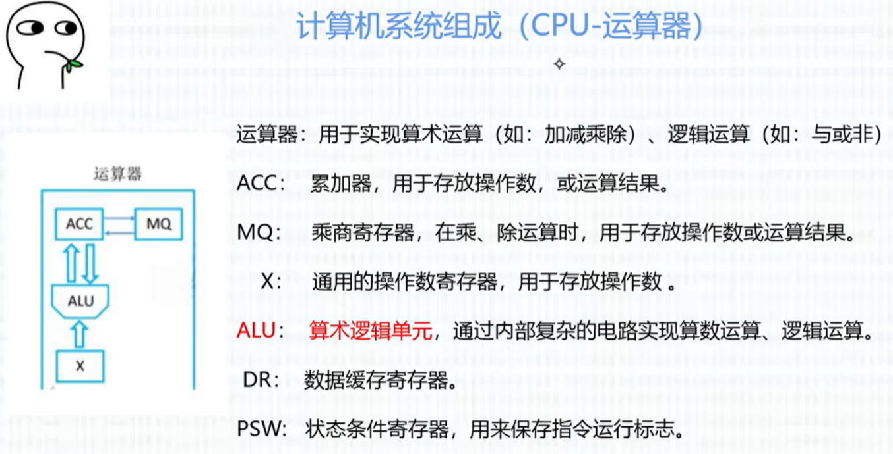
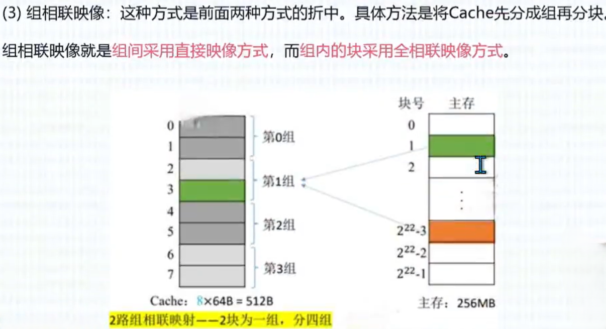
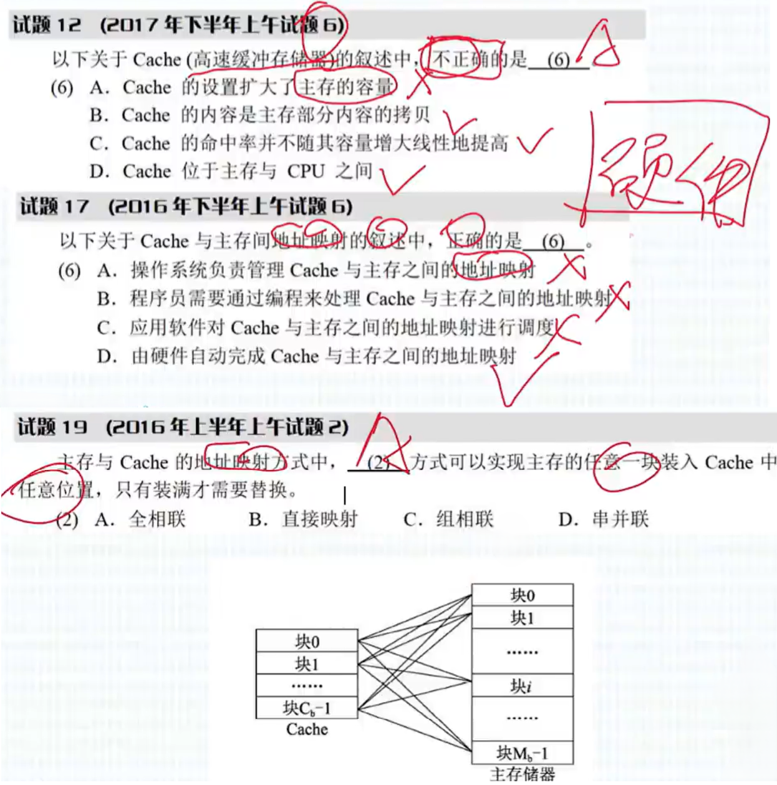

## 软考

```bash
一、计算机基础知识
计算机系统组成与体系结构：包括硬件组成、指令系统、存储体系等。
操作系统知识：进程管理、存储管理、文件管理、设备管理等。
数据库基础知识：数据库模型、关系数据库、SQL 语言等。
计算机网络知识：网络体系结构、网络协议、网络安全等。

二、程序设计语言与数据结构
程序设计语言：C、C++、Java 等语言的语法、语义、面向对象特性等。
数据结构：线性表、栈、队列、树、图等常见数据结构及其算法。

三、软件工程
软件工程基础知识：软件生命周期、软件开发方法、软件项目管理等。
系统分析与设计：需求分析、系统设计原则与方法。
软件测试：测试方法、测试用例设计、测试管理。

四、数据库设计
数据库设计过程：需求分析、概念结构设计、逻辑结构设计、物理结构设计。
数据库应用开发：SQL 语言编程、存储过程与触发器、数据库连接技术等。

五、网络与信息安全
网络基础知识：网络拓扑结构、网络设备、网络协议等。
信息安全技术：加密技术、数字签名、访问控制等。
网络安全管理：网络安全策略、网络安全评估等。
```


## 计算机系统基础

#### 数据表示

```bash
机器数
	- 无符号数：无符号数表示正数，在机器数中没有符号位
	- 有符号数：若机器字节长 n+1 位，有符号整数的表示范围：-(2^n - 1) ≤ x ≤ 2^n - 1 （关于原点对称）
```

##### 原码/反码/补码/移码

````bash
- 原码：用数值部分标识真值的绝对值，符号位 “0/1” 对应 “正/负”。
- 反码：正数的反码与原码相同，负数的反码是其绝对值按位取反。
- 补码：正数的补码与其原码和反码相同，负数的补码等于其反码的末位数加1。
- 移码：补码的基础上将符号位取反。
````

```shell
[+45]原 = 0 0101101		[-45]原 = 1 0101101
[+45]反 = 0 0101101		[-45]反 = 1 1010010
[+45]补 = 0 0101101		[-45]补 = 1 1010011
[+45]移 = 1 0101101		[-45]移 = 0 1010011

[+0]原 = 0 0000000			[-0]原 = 1 0000000
[+0]反 = 0 0000000			[-0]反 = 1 1111111
[+0]补 = 0 0000000			[-0]补 = 0 0000000
[+0]移 = 1 0000000			[-0]移 = 1 0000000
```


##### 定点数/浮点数

```bash
定点数：小数点的位置固定不变的数。小数点的位置通常有两种约定方式：
		- 定点整数（纯整数，小数点在最低有效数值位之后）
		- 定点小数（纯小数，小数点在最高有效数值位之前）

浮点数：小数点位置不固定的数，它能表示更大范围的数。
	浮点数通常表示成：阶符 + 码阶 + 数符 + 尾数
    - N = M.R^E （M为尾数，R为基数，E为阶码）
    - 阶码：决定浮点数所能表示的数值范围，位数越多范围越大
    - 尾数：决定浮点数所表示的浮点精度，位数越多精度越高
		- 一般尾数用补码表示，阶码用移码
		- 对阶时，小数向大数看齐（对阶是通过较小的数的尾数右移实现的）
```


##### 校验码

```bash
数据交换难免出错，为确保数据在传送过程中正确无误：
	- 提高硬件电路的可靠性
	- 提高代码的校验能力

校验码：用来检测传送的数据是否出错。
码距：指一个编码系统中任意两个合法编码之间至少有多少个二进制位不同。


#### 校验码
奇偶校验码：
基本思想：通过在编码中增加一位校验位来使编码中1的个数为奇数(奇校验)或者为偶数(偶校验)，从而使码距变为2。对于奇校验，它可以检测代码中奇数位出错的编码，但不能发现偶数位出错的情况，即当合法编码中奇数位发生了错误，也就是编码中的1变成0或0变成1,则该编码中1的个数的奇偶性就发生了变化，从而可以发现错误。

循环冗余校验码(CRC)：
广泛应用于数据通信领域和磁介质存储系统中。它利用生成多项式为k个数据位产生r个校验位来进行编码，其编码长度为k+r。


海明码：
海明码的构成方法：在数据位之间特定的位置上插入 k 个校验位，通过扩大码距来实现检错和纠错。
设数据位是 n 位，校验位是 k 位，则 n 和 k 必须满足以下关系：2^k - 1 ≥ n + k

例：已知数据信息为 16 位，最少应附加 5 位校验位，才能实现海明码纠错。
```


## 计算机体系结构

#### 计算机系统组成

```bash
冯·诺伊曼计算机的特点：
	1. 计算机由五大部件组成：输入设备、存储器、运算器、控制器、输出设备
	2. 指令和数据以同等地位存于存储器，可按地址寻访
	3. 指令和数据用二进制表示
	4. 指令由操作码和地址码组成
	5. 存储程序
	6. 以运算器为中心

输入设备：将信息转换为机器能识别的形式
输出设备：将结果转换为人们熟知的形式
主存储器：存放数据和程序
运算器：算术运算、逻辑运算
控制器：指挥各部件、使程序得以运行

输入/输出设备与存储器之间的数据传送通过运算器完成
```





#### Flynn分类法

```bash
在 Flynn 分类法中，多指令单数据流（MISD）被证明不可能，至少不实际。
```


#### 指令系统

```bash
指令
指令（机器指令）：是指示计算机执行某种操作的命令，是计算机运行的最小功能单位。
一台计算机的所有指令的集合构成该机的指令系统，又称指令集。


指令格式
一条指令就是机器语言的一个语句，它是一组有意义的二进制代码。
一条指令通常包括操作码字段和地址码字段两部分。
  - 操作码(OP)：指明操作的类型（用户想要做什么？停机中断、求反求补、加减乘除）
  - 地址码(A)：主要指明操作数及运算结果存放的地址（对谁操作）


寻找指令中操作数有效地址的方式称为寻址方式。有七种寻址方式：
  1. 立即寻址：操作数作为指令的一部分直接写在指令中，这种操作数称为立即数。
  2. 寄存器寻址：指令所要的操作数已存储在某寄存器中，或把目标操作数存入寄存器。
  3. 直接寻址：指令所要的操作数存放在内存中，在指令与出这报作有效地址。
  4. 寄存器间接寻址：操作数在存储器中，操作数的有效地址用S1、DI、BX和BP四个寄存器之一来指定。
	5. 寄存器相对寻址：操作数在存储器中，其有效地址是一个基址寄存器或变址寄存器中的内容和指令中的8位/16位偏移量之和。
	6. 基址加变址寻址方式：操作数在存储器中，其有效地址是一个基址寄存器和一个变址寄存器的内容之和。
	7. 相对基址加变址寻址：操作数在存储器中，其有效地址是一个基址寄存器的值、个变址寄存器的值和指令中的8位/16位偏移量之和。

注意：考试出题大概 =》 给出一个描述，然后问这个是什么寻址方式？
```


|    **特性**    |      **CISC** (x86架构：Intel/AMD)      |              **RISC** (ARM/RISC-V/Apple M系列)               |
| :------------: | :-------------------------------------: | :----------------------------------------------------------: |
| **指令集规模** |        庞大（数百条），指令复杂         |            精简（约100条核心指令），指令简单统一             |
|  **指令长度**  |         **可变长**（解码复杂）          |                  **固定长**（通常32/64位）                   |
|  **执行周期**  |      多周期（复杂指令需数十周期）       |                **单周期**（理想流水线条件下）                |
| **寄存器设计** | 通用寄存器少（传统x86仅8个），功能专用  |           通用寄存器多（ARM含16个，RISC-V达32个）            |
|  **内存访问**  | 指令可直接操作内存（如 `ADD [AX], BX`） | **纯载入-存储架构**（例： `LDR R1, [R2]`→`ADD R3, R1, R4`→`STR R3, [R5]`) |
|  **控制方式**  |      微码（Microcode）转换复杂指令      |                  硬连线控制（高效电路直译）                  |
| **流水线支持** |       困难（指令变长、周期不定）        |                  天然适配（指令规整易并行）                  |
|  **代码密度**  |         **高**（单指令功能强）          |               **低**（需多条指令实现同一任务）               |
|  **功耗效率**  |            传统设计功耗较高             |               **先天优势**（移动/嵌入式主导）                |
| **编译器角色** |        负担小（硬件处理复杂性）         |            **关键优化**（需高效调度指令和寄存器）            |


##### 流水线计算

```bash
流水线计算
  流水线周期为执行时间最长的一段
  流水线计算公式：t = 1条指令执行时间 +(指令条数-1)*流水线周期

流水线的吞吐率(Though Put rate, TP)：是指在单位时间内流水线所完成的任务数量或输出的结果数量。
	流水线吞吐率公式：TP = 指令条数 / 流水线执行时间

流水线加速比：完成同样一批任务，不适用流水线所用时间与使用流水线所用的时间之比。
	流水线加速比公式：S = 不使用流水线执行时间 / 使用流水线执行时间


例：若指令流水线把一条指令分为取指、分析和执行三部分，且三部分的时间分别是取指2ns，分析2ns，执行1ns。
	那么，流水线周期是多少？100条指令全部执行完毕需要的时间是多少？
			流水线周期为 2ns；
			全部执行完毕所需时间：t = (2ns + 2ns + 1ns) + (100 - 1) * 2ns = 5ns + 198ns = 203ns
			流水线吞吐率：TP = 100条 / 203ns
			流水线加速比：S = ((2ns + 2ns + 1ns) * 100) / 203ns = 500 / 203
```


#### 输入输出技术

```bash
#### 输入输出技术（CPU与外设之间的数据传送方式）
1. 直接程序控制方式
直接程序控制方式是指在完成数据的输入/输出中，整个输入/输出过程是 '在CPU执行程序的控制下完成的'。这种方式还可以分为以下两种:
	(1) 无条件传送方式: 无条件地与CPU交换数据。
	(2) 程序查询方式: 先通过CPU查询外设状态，准备好之后再与CPU交换数据。

2. 中断方式
中断方式利用中断机制，使I/O系统在与外设交换数据时，'CPU无须等待，也不必查询I/O状态'，即可以抽身出来处理其他任务，因此提高了系统效率。

3. 直接存储器存取方式
直接存储器存取(Direct Memory Access，DMA)方式是在存储器与I/O设备间直接传送数据，即在内存与I/O设备之间传送一个数据块的过程中，'不需要CPU的任何干涉'，是一种完全'由DMA硬件完成' I/O 操作的方式。

4.输入/输出处理机
输入/输出处理机(IOP)是一个专用处理机，用于完成主机的输入/输出操作。IOP '根据主机的I/O命令'，完成对外设数据的输入/输出。


问题：
计算机系统中常用的输入/输出控制方式有无条件传送、中断、程序查询和 DMA 方式等。当采用 __(3)__ 方式时，不需要 CPU 执行程序指令来传送数据。
(3) 	A.中断			B.程序查询			C.无条件传送			D.DMA
```


#### 存储系统

##### 层次结构


##### 存储系统分类

```bash
1. 按位置分类，可分为内存和外存
  - 内存(主存): 用来存储当前运行所需要的程序和数据，速度快，容量小。
  - 外存(辅存): 用来存储当前不参与运行的数据，容量大但速度慢。


2. 按材料分类，可分为磁存储器、半导体存储器和光存储器
	- 磁存储器: 用磁性介质做成，如磁、磁泡、磁盘、磁带等。
	- 半导体存储器: 根据所用元件可分为双极型和MOS型两类；根据是否需要刷新可分为静态和动态两类。
	- 光存储器: 由光学、电学和机械部件等组成，如光盘存储器。


3. 按工作方式，可分为读/写存储器和只读存储器。
	- 读/写存储器(RAM): 既能读取数据也能存入数据的存储器。
	- 只读存储器(ROM): 工作过程中仅能读取的存储器。


4. 根据数据的写入方式，又可细分为 ROM、PROM、EPROM 和 EEPROM 等类型
  - 固定只读存储器(ROM)：这种存储器是在厂家生产时就写好数据的，其内容只能读出，不能改变。一般用于'存放系统程序BIOS'和用于'微程序控制'。
  - 可编程的只读存储器(PROM)：其中的内容可以由'用户一次性地写入'，写入后'不能再修改'。
  - 可擦除可编程的只读存储器(EPROM)：其中的内容既可以读出，也可以由用户写入，写入后还可以修改，'紫外线照射擦除信息'。
  - 电擦除可编程的只读存储器(EEPROM)：与EPROM相似，EEPROM中的内容既可以读出，也可以进行改写，'电擦除'的方法进行数据的改写。
  - 闪速存储器(Flash Memory)：简称闪存，闪存的特性介于EPROM和EEPROM之间，类似于EEPROM，也可使用电信号进行信息的擦除操作。整块闪存可以在数秒内删除，'速度远快于EPROM'。
```


##### 高速缓存Cache








##### 主存


##### 虚拟存储器

```bash
虚拟存储器是由主存、辅存、存储管理单元，及操作系统中的存储管理软件组成的存储系统。程序员使用该存储系统时，可以使用的内存空间可远远大于主存的物理空间，但实际上并不存在那么大的主存，故称其为虚拟存储器。
虚拟存储器使存储系统既'具有相当于外存的容量'又'具有接近于主存的访问速度'。
```


##### 磁盘存储器


#### 总线系统


#### 磁盘阵列技术


#### 计算机可靠性


## 数据结构与算法

```bash
1. 数据：
数据是信息的载体，是描述客观事物属性的数、字符及所有能输入到计算机中并被计算机程序识别和处理的符号的集合。
数据是计算机程序加工的原料。


2. 数据结构：
数据结构是相互之间存在一种或多种特定关系的数据元素的集合。
数据结构的三要素：
	- 物理结构（存储结构）
	- 数据的运算
	- 逻辑结构


2-1. 逻辑结构：
  - 集合：各个元素同属一个集合，别无其他关系。
  - 线性结构：数据元素之间是一对一的关系。除了第一个元素，所有元素都有唯一前驱；除了最后一个元素，所有元素都有唯一后继。
  - 树形结构：数据元素之间是一对多的关系。
  - 图状结构（网状结构）：数据元素之间是多对多的关系。


2-2. 物理结构（存储结构）：
	- 顺序存储：把逻辑上相邻的元素存储在物理位置上也相邻的存储单元中。
	- 链式存储：逻辑上相邻的元素在物理位置上可以不相邻，通过指针链接起来的结点来存储数据元素。
	- 索引存储：在存储元素信息的同时，还建立附加的索引表。
	- 散列存储：根据元素的关键字直接计算出该元素的存储地址，又称哈希（Hash）存储。


3. 算法效率的度量
	- 时间复杂度：时间开销与问题规模 n 之间的关系
	- 空间复杂度：空间开销（内存开销）与问题规模 n 之间的关系


3-1. 空间复杂度
一个程序的空间复杂度是指运行完一个程序所需内存的大小。利用程序的空间复杂度，可以对程序的运行所需要的内存多少有个预先估计。
一个程序执行时除了需要存储空间和存储本身所使用的指令、常数、变量和输入数据外，还需要一些对数据进行操作的工作单元和存储一些为现实计算所需信息的辅助空间。
```


### 线性表

```bash
线性表包含：
	- 逻辑结构
	- 插入/删除操作
	- 存储（物理）结构
			- 顺序表（顺序存储）
			- 链表（链式存储）
					- 双向链表
					- 循环链表
					- 静态链表


数据元素之间是一对一的关系。除了第一个元素，所有元素都有唯一前驱；除了最后一个元素，所有元素都有唯一后继。


插入/删除操作
- 顺序存储：插入元素前要移动元素以挪出空的存储单元，然后再插入元素。删除元素时同样需要移动元素，以填充被删除元素的存储单元。
- 链式存储：通过转换要修改节点的指向


栈(Stack)是只允许在一端进行插入或删除操作的线性表。

```


### 数组/串


### 稀疏矩阵


### 树和二叉树


根据前序/中序/后序的遍历序列，再把二叉树中空余的叶子节点的左指针和右指针分别指向它的前一个节点和后一个节点，从而得到线索二叉树。


### 图


