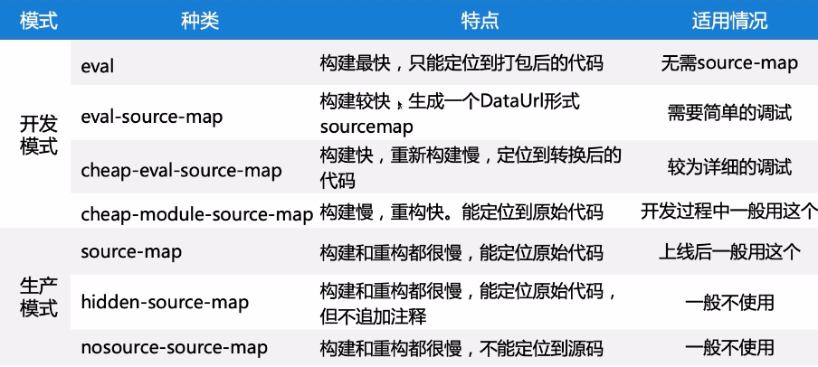

## Webpack

> ```bash
> ## 本地安装webpack
> npm install webpack -save-dev
>
>
> # 核心概念
> ## Entry 和 Output
> webpack的解析入口，项目的打包出口所在
>
>
> # webpack打包：
> `webpack 被解析的文件路径 -o 存放打包文件所在的目录`
> webpack .\src\main.js .\dist\bundle.js	 #把main.js文件打包生成bundle.js文件
>
>
> ## 全局 webpack 作用
> - 通过 npm i webpack -g 安装的 webpack 为全局 weback
> - 全局 webpack 是必须安装的，我们在命令行直接执行 webpack 指令时，使用的是全局 webpack 去完成的
>
> ## 局部 webpack 作用
> - 局部 webpack 是指安装在项目文件夹下 node_modules 的 webpack
> - 全局的 webpack 有且只有一个，但实际情况下，不同项目的 webpack 版本可能完全不同。当我们项目需求的 webpack 版本和我们全局的 webpack 不一致时，就需要安装局部 webpack
>
>
> ## 编译 TypeScript 流程
> 1. 安装 typescript 和 ts-loader：npm i typescript ts-loader --save-dev
> 2. 在 webpack.config.js 配置文件中中写入 ts-loader 编译规则
> 3. 编写 tsconfig.json：类似于 .babelrc、ts-loader 的额外配置
>
>
> ## 观察应用变化 --watch
> - `$ npm webpack --watch`
>
>
> ## 从bundle中排除某个导入：externals
> Webpack externals 告诉 Webpack 从 bundle 中排除某个导入。`external` 通常用于排除将通过 CDN 加载的导入。
> ```

> 
>
> #### 安装webpack（需先安装nodejs）
>
> ```js
> //main.js
> //使用commonjs模块化规范
> const {add,mul} = require('./mathUtils.js')
>
> console.log(add(20,39));
> console.log(mul(10,20));
>
> //使用ES6模块化规范
> import {name,age,height} from './info'
> console.log(name);
> console.log(age);
> console.log(height);
>
> //info.js
> export const name = 'Kobe';
> export const age = 14;
> export const height = 12.2;
>
> //mathUtils.js
> function add(num1,num2){
>      return num1 + num2
> }
> function mul(num1,num2){
>      return num1 * num2
> }
> module.exports = {
>      add,
>      mul
> }
> ```
>
> **config.js和package.json的配置**
>
> ```bash
> #初始化定义，然后生成package.json文件
> npm init
> ```
>
> ```js
> //config.js配置
> const path = require('path')	//导入模块
> module.exports = {
>     entry: './src/main.js',	//入口
>     output: {	//出口
>        path: path.resolve(__dirname, 'dist'),	//resolve()对括号里面的路径进行拼接，__dirname是当前项目根路径
>        filename: 'bundle.js'
>     }
> }
> ```
>

## loader

> ```bash
> ## loader
> 使用 webpack 可以在 JavaScript 代码中使用 `import` 或 `require` 语句，不仅可以包括其他 JavaScript，还包括任何类型的文件，例如 CSS。
> Webpack 旨在处理我们所有的依赖关系，而不仅仅是 JavaScript，而 loader 是实现此目的的一种方式。
>
>
> ### 常用的 loader
> - css-loader、style-loader等css处理loader
> - url-loader、image-loader等图片字体文件等资源处理loader
> - less-loader、sass-loader、babel-loader等编译loader
>
> 1. babel-preset
>   `npm i babel-loader @bable/core @babel/preset-env --save-dev`
>   - Babel-preset 是存储 JavaScript 不同标准的插件，通过使用正确的 presets 告诉 babel 按照哪个规范编译
>       - Target 是 preset的核心配置，告诉 preset 编译的具体目标
>       - Target 可以以 browsers(通常情况下会用)、node的版本、特定的浏览器为目标
>
> 2. ES6 方法的编译
>   `npm i babel-polyfill --save-dev`
>   `npm i babel-plugin-transform-runtime babel-runtime --save-dev`
> 	- babel-polyfill 会生成一个全局对象
> 	- babel-transform-runtime 会生成一个局部对象
>
> 3. 引入解析 css 文件
> - `npm i style-loader css-loader --save`
> - css-loader：让 css 可以被 js 正确的引入
> - style-loader：让 css 被引入后可以被正确的以一个 style 标签插入页面
> - 注意：两者顺序很重要，要先引入 css-loader 处理，再由 style-loader 处理
>
> ### style-loader 核心配置
> - insertAt：style 标签插入在哪一块区域
> - insertInto：插入指定的dom
> - singleton：是否合并为一个 style 标签
> - transform：在浏览器环境下，插入 style 到页面前，用 js 对 css 进行操作
>
>
> ### css-loader 核心配置
> - minimize：是否压缩 css
> - module：是否使用 css 模块化
> - alias：css 中的全局别名
> ```

> ### loader
>
> ```bash
> #vscode安装loader配置（此为固定版本安装）
> npm install --save-dev css-loader@2.0.2 css
> npm install --save-dev style-loader@0.23.1 style
> npm install --save-dev less-loader@4.1.0 less@3.9.0
> npm install url-loader@1.1.2 --save-dev		#引用图片时调用
> npm install file-loader@3.0.1 --save-dev	#当图片大于所定义的大小时，需要引用
> npm install -save-dev babel-loader@7 @babel/core @babel/preset-es2015	#ES6转化为ES5
> npm install vue --save
> npm install --save-dev vue-loader@13.0. vue-template-compiler@2.5.21
> ```
>
> ```js
> // webpack.config.js
> //引入loader
> //css-loader只负责将CSS文件进行加载，style-loader负责将样式添加到DOM中
> //使用多个loader时，use的引用是由右向左的
> module.exports = {
>   entry: './src/main.js',
>   output: {
>     path: path.resolve(__dirname, 'dist'),
>     filename: 'bundle.js',
>     publicPath: 'dist/'     //自动在前面拼接
>   },
>   module: {
>     rules: [
>       {
>         test: /\.js$/,
>         use: [
>           loader: 'babel-loader',
>           options: {
>           	presets: [
>           		['@babel/peset-env', {
>           			targets: {
>           				browsers: ['>1%', 'last 2 versions'], // 编译成大于1%浏览器支持的语言，即编译为es5
>           				node: 10,
>         					chrome: '59',
>       					}
>           		}]
>         		]
>           }
>         ],
>       },
>       {
>         test: /\.tsx?%/,
>         use: 'ts-loader'
>       },
>       {
>         test: /\.css$/i,
>         use: ["style-loader", "css-loader"]
>       },
>       {
>         test: /\.less$/,
>         use: [
>           {
>             loader: "style-loader",
>             options: {
>               insertInto: '#mydiv',
>               singleton: true,
>               transform: './transform.js',
>             }
>           },
>           {
>             loader: "css-loader",
>           },
>           {
>             loader: "less-loader",
>             options: {
>               lessOptions: {
>                 strictMath: true
>               }
>             }
>           }
>         ]
>       },
>       {
>         test: /\.(png|jpg|gif)$/i,
>         use: [
>           {
>             loader: 'url-loader',
>             options: {
>               //当加载的图片小于limit时，会将图片编译成base64字符串形式
>               //当加载图片大于limit时，需要使用filte-loader模块进行加载，加载的图片会存入dist目录下
>               limit: 8192,
>               name: 'img/[name].[hash:8].[ext]'
>             }
>           }
>         ]
>       },
>       {
>         test: /\.vue$/,
>         loader:'vue-loader'
>       }
>     ],
>   },
>   resolve: {//vue环境的配置
>     alias: {//alias(别名--起别的名字)
>       'vue$': 'vue/dist/vue.esm.js'
>     }
>   };
> }
> ```
>
> ```json
> // tsconfig.json
> {
>   "compilerOptions": {
>     "module": "commonjs",
>     "target": "es5"
>   },
>   "exclude": ["./node_modules"],
> }
> ```
>
> **图片文件处理--修改文件名称**
>
> 
>

## plugin插件

> ```bash
> ## plugin
> - commonsChunkPlugin、uglifyjsWebpackPlugin、PurifyCSS等优化文件体积的插件
> - HtmlWebpackPlugin、HotModuleReplacementPlugin等额外功能的插件
>
>
> ## plugin作用：
> - plugin是插件，通常是对于某个现有的架构进行扩展。
> - webpack中的插件，即是对webpack现有功能扩展，如打包优化，文件压缩
>
>
> ## loader和plugin的区别
> - loader主要用于转换某些类型的模块，是转换器
> - plugin是插件，是扩展器
>
>
> ### **HtmlWebPlugin插件作用：**
> - 自动生成一个index.html文件（可指定模块生成）
> - 将打包的js文件，自动通过script标签插入到body中
>
> ### **UglifyJsPlugin插件作用：**
> - 丑化js代码，在打包js代码时，会把注释等删掉
> ```

> ### Plugin插件
>
> ```cmd
> #打包html的plugin
> npm install html-webpack-plugin@3.2.0 --save-dev
> #js压缩的plugin（uglifyjs--即丑化js）
> npm install uglifyjs-webpack-plugin@1.1.1 --save -dev
> ```
>
> ```js
> // webpack.config.js
> const path = repuire('path')
> const webpack = require('webpack')
> const HtmlWebpackPlugin = require('html-webpack-plugin')
> const UglifyJsPlugin = require('uglifyjs-webpack-plugin')
> module.exports = {
>     plugins: [
>        new webpack.BannerPlugin('最终版权归willy所有'),
>        new HtmlWebpackPlugin({
>          template: 'index.html'	//默认搜寻当前路径下的index.html作为模板生成文件
>        }),
>        new UglifyJsPlugin()
>     ]
> }
> ```
>
> **webpack配置文件的抽离--merge插件**
>
> 因为有些配置最后打包才使用到，如：js代码的丑化（uglifyjs插件），因此需要分离配置文件，方便维护使用
>
> ```vscode-cmd
> npm install webpack-merge@4.1.5 --save-dev
> ```
>
> 在package.json中修改build和dev的文件
>
> ```package.json
> "build": "webpack --config ./build/prod.config.js",
> "dev": "webpack-dev-server --open --config ./build/dev.config.js
> ```
>
> 新建build文件，把webpack.config.js文件分离成base.config.js、dev.config.js、prod.config.js
>
> 通过调用base.config.js文件来运行
>
> ```js
> // dev.config.js、prod.config.js
> const UglifyJsPlugin = require('uglifyjs-webpack-plugin')
> const webpackMerge = require('webpack-merge')
> const baseConfig = require('./base.config')
> module.exports = webpackMerge(baseConfig,{
>     plugins: [
>       new UglifyJsPlugin()
>     ]
> })
> ```
>

## webpack-dev-server

> ```bash
> ## Webpack-dev-server 提供的常用额外功能
>   - 路径重定向
>   - 接口代理
>   - 浏览器中显示编译问题
>   - 热更新
>
>
> ## 本地服务器安装
> cnpm i webpack-dev-server --save-dev
>
>
> ## 属性说明
> - 本地服务器基于nodejs搭建，内部使用express框架，实现我们想要让浏览器刷新显示我们修改后的结果
> - deserver属性选项
>   - contentBase：为哪一个文件夹提供本地服务，默认为根文件夹，一般写./dist
>   - port：代理端口号,默认8080端口
>   - proxy：代理请求
>   - inline：服务的开启模式，可使得页面实时刷新
>   - historyApiFallback：路径重定向，在SPA页面中依赖HTML5的history模式
>   - open 参数表示直接打开浏览器
>   - hot：热更新
>   - lazy：懒编译
>   - overlay：错误遮罩
> ```

### 搭建本地服务器配置

> ```js
> // webpack.config.js
> module.exports = {
>   devServer: {
>   	contentBase: './dist',
>   	inline: true,
> 		port: 8080,
>     overlay: true,
>
>     // 路径重定向,控制 html5的history模式的显示
>     historyApiFallback: {
>       rewrites: [
>         from: /^\/([ -~]+)/,
>         to: (context) => './' + context.match[1] + '.html'
>       ]
>     },
>
>   	// 接口代理
>   	proxy: {
>       '^/api': {
>         target: 'http://localhost:3000', // 请求重定向
>         changeOrigin: true,
>         pathRewrite: { '^api': '/' },
>         headers: {}
>       }
>     },
>
>     // 热更新
>     hot: true,
>     hotOnly: true,
>   }
> }
> ```
>
> ```json
> // package.json
> {
>   "script": {
>     "dev": "webpack-dev-server"
>   }
> }
> ```
>

## Webpack打包

> ```bash
> ## webpack 打包
> - Webpack 依赖于 Node 的环境与文件操作系统
> - Webpack 的打包过程就是利用 Node 去读取文件，然后进行一些字符串处理后，再利用 Node 去写入文件
>
>
> ## Webpack 打包流程
> 1. 读取配置文件
> 2. 注册内部插件与配置插件
> 3. loader 编译
> 4. 组织模块
> 5. 生成最终文件导出
>
>
> ## 打包结果分析
> (function(modules) {
> 	function __webpack_require__(moduleId){};
> 	return __webpack.require(
> 		__webpack_require__.s = './app.js'
> 	)
> })({
> 	"./app.js": (function(){}),
> 	"module1.js": (function(){}),
> 	"module2.js": (function(){}),
> })
> ```

### loader编译

> ```bash
> ## loader 编译
> - Loader 是一个方法，接收一个字符串，方法内部处理完后再返回字符串
>
> module.exports = function(source) {
> 	return source
> }
> ```
>
> #### 案例
>
> ```js
> /* webpack.config.js */
> module.exports = {
>   entry: './src/main.js',
>   output: {
>    path: path.resolve(__dirname, 'dist'),
>    filename: 'bundle.js',
>   },
>   module: {
>    rules: [
>      {
>        test: '/\.willy$/',
>        use: './willy-loader' // 自定义 loader 文件
>      }
>    ],
>   },
> }
> ```
>
> ```js
> /* willy-loader/index.js */
> module.exports = function (resource) {
>   const result = resource.replace('log', 'console.log')
>   // this.callback(err, result, sourcemap) // callback可以使用捕获错误并返回
>   return result
> }
> ```
>
> ```willy
> /* src/test.willy  注意：需要在 main.js 入口文件中引入 */
> log('console log willy')
> ```

### webpack打包速度优化

> 1. 使用`webpack-bundle-analyzer`对项目进行模块分析生成report，查看report后看看哪些模块体积过大，然后针对性优化，比如我项目中引用了常用的UI库element-ui和v-charts等
>
>    ```js
>    externals: {
>        'element-ui': 'Element',
>        'v-charts': 'VCharts'
>    }
>    ```
>
> 2. 配置webpack的externals ，防止将某些import的包(package)打包到 bundle 中，而是在运行时(runtime)再去从外部获取这些扩展依赖。
>    所以，可以将体积大的库分离出来：
>
> 3. 然后在main.js中移除相关库的import
>
> 4. 在index.html模板文件中，添加相关库的cdn引用(如`<script src="https://unpkg.com/element-ui@2.10.0/lib/index.js"></script>`)

## source-map

> ```bash
> ## source-map
> - 为方便调试，需要知道打包后的代码对应于原文件的位置
> - 如果代码有一处错误，无 source-map 只能追踪到错误发生在打包后文件的哪个位置，但是打包后的文件不方便阅读
> - 而 source-map 就可以查看错误发生在原模块哪个位置
> ```
>
> 

### Dev-server

> ```bash
> ## Dev-server
> - Dev-server 利用 express 和一个中间件 webpack-dev-middleware 来开启服务，然后开启的 server 会执行打包出来的代码
> ```
>
> ```js
> /* dev.js */
> const express = require('express')
> const webpackDevMid = require('webpack-dev-middleware')
> const webpackHotMid = require('webpack-hot-middleware')
> const webpack = require('webpack')
> const config = require('./webpack.config.js')
> const compiler = webpack(config)
>
> const app = express()
>
> // 开启自定义配置的本地服务器
> app.use(webpackDevMid(compiler, {}))
>
> // 开启热更新（需要遍历入口文件，开启更改）
> Object.keys(config.entry).forEach((name) => {
>   config.entry[name] = ['webpack-hot-middle/client?noInfo=true&reload=true'].concat(config.entry[name])
> })
> app.use(webpackHotMid(compiler, {
>   overlayStyles: true
> }))
> app.listen(2007)
> ```
>

## Webpack 减少构建时间

> ```bash
> ## Webpack 减少构建时间
> - Webpack 构建项目的速度很大程度上取决于项目的复杂度和电脑配置。确保项目在有足够的磁盘空间和良好的处理器情况下运行。
> - webpack 的 [Build Performance](https://webpack.docschina.org/guides/build-performance/) 章节提供了一些提高构建/编译性能的方法。
>
>
> ### 1. 保持最新的 Webpack、Node 和包管理器
> 使用最新的 webpack 版本（新优化），并且与 Node 版本同步，重点是 `npm/yarn/pnpm` 包管理器，较新的版本创建更高效的模块树并提高解析速度。
>
>
> ### 2. 优化 Loader 的文件搜索范围
> 通过使用 `include` 和 `exclude` 字段，仅将 loader 应用在实际需要将其转换的模块。
> 另外，将 Babel 编译过的文件缓存起来，下次只需要编译更改过的文件即可，这样可以大幅度加快打包时间。
>     module.exports = {
>       module: {
>         rules: [
>           {
>             test: /\.js$/,
>             loader: 'babel-loader?cacheDirectory=true',
>             include: path.resolve(__dirname, 'src'),
>             exclude: /node_modules/
>           }
>         ]
>       }
>     }
>
>
>
> ### 3.  别名 — `resolve.alias`
>     const path = require('path')
>     const resolve = (dir) => path.join(__dirname, dir)
>     module.exports = {
>       resolve: {
>         alias: { '@': resolve('src') }
>       }
>     }
>
>
>
> ### 4. 解析
> 减少以下方法条目数量，因为他们会增加文件系统调用的次数(层级不要过深)
> - `resolve.modules` 告诉 webpack 解析模块时应该搜索的目录。
> - `resolve.extensions` 尝试按顺序解析这些后缀名。如果有多个文件有相同的名字，但后缀名不同，webpack 会解析列在数组首位的后缀的文件 并跳过其余的后缀。
> - `resolve.mainFiles` 解析目录时要使用的文件名。
> - `resolve.descriptionFiles` 用于描述的 JSON 文件。
> - 如果不使用 symlinks（例如 `npm link` 或 `yarn link`），可以设置：
> 		`resolve: { symlinks: false }`
> - 如果你使用自定义 resolve plugin 规则，并且没有指定 context 上下文，可以设置：
> 		`resolve: { cacheWithContext: false }`
>
>
> ### 5. 减少项目体积
> 减少编译结果的整体大小，以提高构建性能。尽量保持 chunk 体积小
> - 使用数量更少/体积更小的 library（例如：`moment -> day.js`、`lodash -> lodash/es`）。
> - 在多页面应用程序中使用 SplitChunksPlugin，并开启 `async` 模式。
> - 移除未引用代码 — 涉及到了 Tree Shaking。
> - 只编译你当前正在开发的那些代码（缓存）。
>
>
>
> ## 6. 最小化 entry chunk
> 确保在生成 entry chunk 时，尽量减少其体积以提高性能。将 `optimization.runtimeChunk` 设置为 `true` 或 `'multiple'`，会为每个入口添加一个只含有 runtime 的额外 chunk。所以它的生成代价较低。
>     module.exports = {
>       // ...
>       optimization: {
>         runtimeChunk: true
>       }
>     }
>
>
>
> ## 7. 解析构建资源
> webpack 提供了 `thread-loader` 允许我们可以将耗时的 loader 放置在独立的线程下运行(`happypack` 插件已经未维护好几年，使用 `thread-loader` 替换)。
>     module.exports = {
>       module: {
>         rules: [
>           {
>             test: /\.js$/,
>             include: path.resolve('src'),
>             use: [
>               'thread-loader', // 注意，这里需要放置在第一位
>               // 后面放置耗时的 loader （例如 babel-loader）
>             ]
>           }
>         ]
>       }
>     }
>
> ```

## 从bundle中排除某个导入

> ```bash
> ## 从bundle中排除某个导入: externals
> Webpack externals 告诉 Webpack 从 bundle 中排除某个导入。`external` 通常用于排除将通过 CDN 加载的导入。
>
> 如 `webpack.config.js` 将 `vue` 添加为 `externals`，这意味着 Webpack 不会捆绑 Vue。相反，当 `component.js` 调用 `require('vue')` 时，Webpack 将返回 `global.Vue`。
>
> `externals` 的另一个用例是需要在 Node.js 中使用 polyfill 的浏览器 API，比如 `FormData`。而 `FormData` 又是一个浏览器 API，所以在编译上述代码时不需要捆绑。因此，您可以将 `form-data` 添加到 `externals`：
> ```
>
> ```js
> module.exports = {
>     entry: {
>       component: `${__dirname}/component.js`
>     },
>     output: {
>        path: `${__dirname}/dist`,
>        filename: '[name].min.js'
>     },
>     target: 'web',
>     externals: {
>        // 去掉 require('vue')，返回 global.Vue
>        vue: 'Vue',
>        // 去掉 require('form-data')，返回 global.FormData
>        'form-data': 'FormData'
>     }
> }
> ```

## Webpack

## Webpack说明

### 为什么需要打包工具

> ```bash
> ### 为什么需要打包工具？
> 开发时，我们会使用框架（React、Vue）、ES6模块化语法、Less/Sass 等 CSS 预处理语言等语法进行开发，这样的代码要想在浏览器运行必须经过编译成浏览器能识别的 JS、CSS 语法才能运行。
> 打包工具能够对上述的高级语法编译成浏览器能识别的语法，而且打包还能压缩代码、做兼容性处理、提升代码性能等。
> ```
>

### 对 Webpack 的理解

> ```bash
> ## 说说对 Webpack 的理解
> webpack 是一个静态模块的打包工具。它会在内部从一个或多个入口点构建一个依赖图，然后将项目中所需的每一个模块组合成一个或多个 bundles 进行输出，它们均为静态资源。输出的文件已经编译好了，可以在浏览器运行。 webpack 具有打包压缩、编译兼容、能力扩展等功能。其最初的目标是实现前端项目的模块化，也就是如何更高效地管理和维护项目中的每一个资源。
>
>
> ### 概述
> - Webpack 是一种用于编译 JavaScript 模块的工具，也称为模块捆绑器（一个现代的js应用的静态模块化打包工具）。
> - 常用 webpack 处理项目所编写的 js 代码，并且 webpack 会自动处理 js 之间相关的依赖。
>
>
> ### Webpack 作用
> - 捆绑资源。
> - 将 ES6+ 语法转译为 ES5代码，允许使用最新的 JavaScript 功能，而不必担心浏览器的支持限制。
> - 将 typescript 转成 ES5 代码，将 CoffeeScript 转换为 JavaScript，将 scss/less 转成 css等。
> - 将 .jsx、.vue 文件转成 js 文件等。
> - 可将内联图像转换为 Data URL。
> - 允许您对 CSS 文件使用 require()。
> - 可以运行开发 Web 服务器。
> - 可以处理热模块替换，监视更改并重新运行任务。
> - 可以将输出文件拆分为多个文件，以避免在第一个页面命中时加载巨大的 js 文件。
> - 可以执行 Tree Shaking（摇树）。
> ```
>

### Webpack 解析流程

> ```bash
> ## Webpack 的解析流程
> Webpack 的运行流程是一个串行的过程，从启动到结束会依次执行以下流程：
>     1. 初始化参数：从配置文件和 Shell 语句中读取与合并参数，得出最终的参数。
>     2. 开始编译：用上一步得到的参数初始化 Compilier 对象，加载所有配置的插件，执行对象的 run 方法开始执行编译。
>     3. 确定入口：根据配置中的 entry 找出所有的入口文件。
>     4. 编译模块：从入口文件出发，调出所有配置的 Loader 对模块进行翻译，再找出该模块依赖的模块，再递归本步骤直到所有入口依赖的文件都经过了本步骤的处理。
>     5. 完成模块编译：在经过第 4 步使用 Loader 翻译完所有模块后，得到了每个模块被翻译后的最终内容以及它们之间的依赖关系。
>     6. 输出资源：根据入口和模块之间的依赖关系，组装成一个个包含多个模块的 Chunk，再把每个 Chunk 转换成一个单独的文件加入到输出列表，这步是可以修改输出内容的最后机会。
>     7. 输出完成：在确定好输出内容后，根据配置确定输出的路径和文件，把文件内容写入到文件系统。
> 在以上过程中，Webpack 会在特定的时间点广播出特定的事件，插件在监听到感兴趣的事件后会执行特定的逻辑，并且插件可以调用 Webpack 提供的 API 改变 Webpack 的运行结果。
>
>
> ### 简单描述
> 1. 初始化：启动构建，读取与合并配置参数，加载 Plugin，实例化 Compiler
> 2. 编译：从 Entry 出发，针对每个 Module 串行调用对应的 Loader 去翻译文件的内容，再找到该 Module 依赖的 Module，递归地进行编译处理
> 3. 输出：将编译后的 Module 组合成 Chunk，将 Chunk 转换成文件，输出到文件系统中
> ```

## 解析器 Loader

> ```bash
> ## 解析器 Loader
>
> ```
>

### Loader 与 Plugin 的区别？

> ```bash
> ### Loader 与 Plugin 的区别？
> 1. 性质上的区别：
> - 'Loader' 本质就是一个函数，在该函数中对接收到的内容进行转换，返回转换后的结果。因为 Webpack 只认识 JavaScript，所以 Loader 就成了翻译官，对其他类型的资源进行转译的预处理工作。
>
> - 'Plugin' 就是插件，基于事件流框架 'Tapable'，插件可以扩展 Webpack 的功能，在 Webpack 运行的生命周期中会广播出许多事件，Plugin 可以监听这些事件，在合适的时机通过 Webpack 提供的 API 改变输出结果。
>
>
> 2. 配置上的区别：
>     - Loader 在 `module.rules` 中配置，作为模块的解析规则，类型为数组，每一项都是一个 Object，内部包含了 test（类型文件）、loader、options（参数） 等属性。
>     - Plugin 在 `module.plugins` 中单独配置，类型为数组，每一项是一个 Plugin 的实例，参数都通过构造函数传入。
> ```
