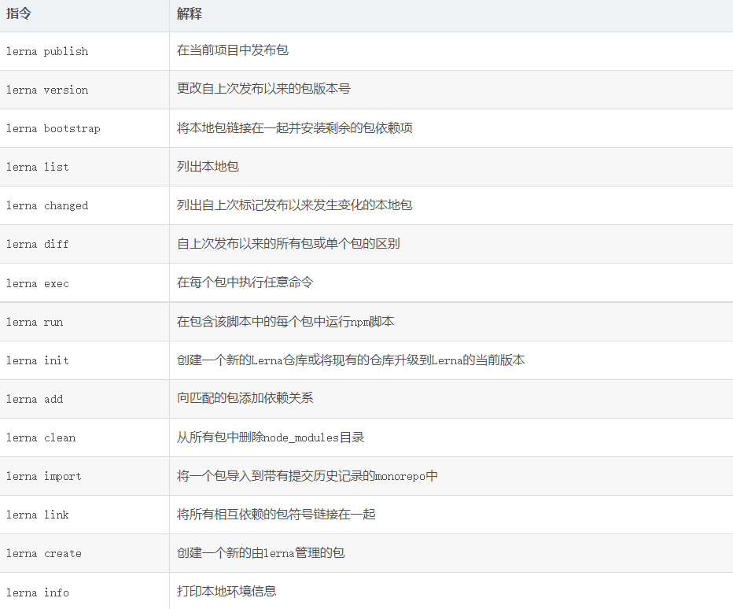

## pnpm

### pnpm 优势

1. 节省磁盘资源
    使用 npm 时，依赖每次被不同的项目使用，都会重复安装一次。而在使用 pnpm 时，依赖会被存储在内容可寻址的存储中，所以：
    如果在不同的项目中使用了同样的包：
      - 在使用npm/yarn时，这个包会被安装多次，也就是说磁盘中会多次写入这块相同的内容，占用空间。
      - 而pnpm会将所有的文件存储在磁盘上的某个位置，在包被安装时，包里的文件会通过hardlink(硬链接)到这个位置，也就是说，在不同的项目复用同一个包时，pnpm只会安装一次，并且多次复用。实现了跨项目对同一版本包的共享。
      对于包的不同版本，pnpm会将不同版本间有差异的文件添加至磁盘仓库中，使用pnpm update时也只会更新差异文件，极大程度上复用了之前版本的代码，不会因为部分文件的差异改变整个包的内容。
      因此，pnpm在磁盘上节省了大量空间，这与项目和依赖项的数量成正比，并且安装速度要快

2. 更快的安装速度
    pnpm 分为三个阶段来执行安装：
    1. 依赖解析。仓库中没有的依赖都被识别并获取到仓库。
    2. 目录结构计算。node_modules 目录结构时根据依赖计算出来的。
    3. 链接依赖项。所有以前安装过的依赖项都会直接从仓库中获取并链接到 node_modules 中。

3. 非扁平的 node_modules 目录
    包时从全局 store 硬连接到虚拟 store（虚拟 store 指 node_modules/.pnpm）


### pnpm 跟 npm、yarn 的对比

在 npm1、npm2 中，node_modules 目录结构是依赖嵌套的， 如果依赖包过多，会造成大量重复的包被安装。
在 npm3 和 yarn 使用扁平化依赖来解决依赖嵌套重复安装问题，如果找到相同版本的包会直接复用。但扁平化依赖带来的问题有幽灵依赖。

幽灵依赖：
  如项目中使用包A，A可能依赖B、C两个包，使用 npm3/yarn 安装依赖包A时，A、B、C 三个包都会被安装到 node_modules 目录中，但 package.json 中只存在依赖A，而 NodeJs 的 require() 函数能够在依赖目录直接找到 B、C 三个包并调用它们的方法。
  在项目中，可能会直接使用 B、C 这些幽灵依赖，如果项目迭代 A 不再被使用，使用幽灵依赖将会因为无法找到依赖而报错。

pnpm 使用软硬链接的方式，解决了幽灵依赖的问题。


### pnpm 修改node_modules中的内容

  - [官方文档](https://pnpm.io/zh/next/cli/patch)
  1. 修改源文件后，输入 `$ pnpm patch <pkg_name>` ，会生成一个临时的目录
  2. 进入这个临时目录，这里面的文件就是要修改的包的文件，在这里进行修改源文件内容
  3. 修改完成，输入 `$ pnpm patch-commit <temp_dir>`，`temp_dir` 是指第一步生成的临时目录地址
  4. 项目根目录会生成一个 patchs 文件夹
  5. pnpm 会自动向 `package.json` 中生成如下的指令： `"pnpm": { "patchedDependencies"" { "pkg_name@pkg_version": "patches/pkg_name@pkg_version.patch" }" }`


## monorepo 介绍

```bash
monorepo 是一种将多个项目代码(package 软件包)存储在同一个仓库中进行管理的软件开发策略（mono 意为单一，repo 意为 仓库）。
与之相对的是另一种流行的代码管理方式 MultiRepo，即每个项目对应一个单独的仓库来分散管理。


1. monorepo 优点
- 易于代码复用：所有项目代码集中于单一仓库，易于抽离出共用的业务组件或工具，并通过 TypeScript，Lerna 或其他工具进行代码内引用；
- 易于依赖管理：项目之间的引用路径内化于单一仓库，当某个项目的代码修改后，易于追踪其影响的是其他哪些项目。通过工具，易于版本依赖管理和版本号自动升级；并且所有的项目都是使用最新的代码，不会产生其它项目版本更新不及时的情况；
- 易于代码重构：代码重构难在不确定对某个项目的修改是否对于其他项目是破坏性的。而 monorepo 使得能够明确知道代码的影响范围，并且能够对被影响的项目可以进行统一的测试，利于不断优化代码；


2. monorepo 缺点
- 不易于项目粒度的权限管理；
- 额外的学习成本：monorepo 使得增加理清各个代码仓库之间的相互逻辑的成本；
- 需要工具链和自动构建工具的支持：项目若很庞大且没有工具链的支持，那么 git 管理、安装依赖、构建、部署会很麻烦和耗时。比如可以基于 Lerna、Yarn Workspaces 等工具更加自动化的处理依赖包之间的构建和发布。


3. 利用 tomono 基于已有的项目转化为 monorepo 项目
    lerna import 命令用来将已有的包导入到 monorepo 仓库，并且还会保留该仓库的所有 commit 信息，但是该命令仅支持导入本地项目，并且不支持远程仓库、以及导入项目的分支和标签。
    所以可以使用 tomono 导入远程仓库：
    首先下载 tomono 在用户根目录（~），然后创建一个包含所有需要导入 repo 地址的文本文件 repos.txt：
        //格式为： Git仓库地址 子项目名称 迁移后的路径
        git@github.com/backend.git @mono/backend packages/backend
        git@github.com/frontend.git @mono/frontend packages/frontend
        git@github.com/mobile.git @mono/mobile packages/mobile

    再执行 shell 命令即可导入：
        cat repos.txt | ~/tomono/tomono.sh

    除了上述的基于 Lerna 负责发布和版本控制，而使用 Yarn Workspaces 来管理多个应用程序之间的依赖的偏底层 monorepo 方案。也有一些集成的 Monorepo 方案，比如 nx 、rushstack，提供从初始化、开发、构建、测试到部署的全流程能力，有一套比较完整的 Monorepo 基础设施，适合直接拿来进行业务项目的开发。
    而且基于 lerna 进行构建的 monorepo 项目，如果构建多个应用程序依赖，耗时很长，可以探索诸如 TurboRepo 的方案解决。
```


### Monorepo落地

> ### 1. 锁定环境：volta or nvm
>
> ```bash
> ## 1. 锁定环境：volta or nvm
> 除了使用 Docker 和显式的在文档中声明 node 和 npm（yarn）的版本之外，我们需要一个锁定环境的强力工具。相比使用 nvm，volta 支持当项目 CLI 工具与全局不兼容时，自动切换为项目指定的版本。
> Volta 是用 Rust 构建的 JavaScript 工具管理器，它可以让我们轻松地在项目中锁定 node，npm（yarn） 的版本。只需在安装完 Volta 后，在项目的根目录中执行 volta pin 命令，那么无论您当前使用的 node 或 npm（yarn）版本是什么，volta 都会自动切换为您指定的版本。
> volta pin node@12.20
> volta pin yarn@1.19
>
> 在package.json中配置如下：
>     {
>     	...,
>       "volta": {
>         "node": "12.20.2",
>         "yarn": "1.19.2"
>       },
>       ...
>     }
>
> ```
>
> ### 2. 利用 workspace 特性复用 package
>
> ```bash
> ## 2. 利用 workspace 特性复用 package
>   workspace 特性使得：
>     - 避免重复安装包，减少了磁盘空间的占用，并降低了构建时间；
>     - 内部代码可以彼此相互引用；
>
>     1. 调整目录结构，将相互关联的项目放置在同一个目录，推荐命名为 packages；请注意对子项目的命名统一以 @<repo_name>/ 开头，这是一种社区最佳实践，更容易让其他开发者了解整个应用的架构和在项目中找到所需的子项目。
>
>     2. 在项目根目录里的 package.json 文件中，设置 workspaces 属性，属性值为之前创建的目录（packages）；
>       比如在 babel在中：
>       	 "workspaces": [
>             "codemods/*",
>             "eslint/*",
>             "packages/*",
>             "test/esm",
>             "test/runtime-integration/*",
>             "benchmark"
>           ],
>
> 		3. 为了避免我们误操作将仓库发布，在 package.json 文件中，设置 private 属性为 true。然后，在项目根目录中执行 npm install 或 yarn install 后，项目根目录中生成由所有子项目共用的 npm 包和我们自己的子项目共同构成的 node_modules 目录，正因如此，才使得可以像引入一般的 npm 模块一样彼此相互引用。
> ```
>
> ### 3. 统一 ESlint / Typescript / babel 配置
>
> ```bash
> ## 3. 统一 ESlint / Typescript / babel 配置
> 可以在 项目根目录设置通用的 tsconfig.base.json / .eslintrc / .babelrc 配置，然后在子项目的对应配置文件中声明继承 extend 属性即可：
>       // babel
>       {
>         "extends": "../../.babelrc"
>       }
>
>       // eslint
>       {
>         "extends": "../../.eslintrc",
>         "parserOptions": {
>           "project": "tsconfig.json"
>         }
>       }
>
>       // typescript
>       {
>         "extends": "../../tsconfig.base.json",
>         "compilerOptions": {
>           "composite": true, // 用于帮助 TypeScript 快速确定引用工程的输出文件位置
>           "outDir": "dist",
>           "rootDir": "src"
>         },
>         "include": ["src"]
>       }
> ```
>
> ### 4. 统一脚本 script 配置
>
> ```bash
> ## 4. 统一脚本 script 配置
> 每个子项目的 package.json 文件中的 scripts 属性都大同小异，我们可以使用 scripty 管理脚本命令提高复用性。
> 简单来说，scripty 允许将脚本命令定义在文件中，并在 package.json 文件中直接通过文件名来引用。这使我们可以实现如下目的：
> 1. 子项目间复用脚本命令；
> 2. 像写代码一样编写脚本命令，无论它有多复杂，而在调用时，像调用函数一样调用；
> 3. 同时可将脚本分为两类 package类（包级别脚本）与 workspace类（全局脚本），分别放在两个文件夹内：如此既可以在项目根目录执行全局脚本，也可以针对单个项目执行特定的脚本。
>
>
> 子项目的 package.json 文件中的 scripts 属性简化为：
>     {
>       ...
>       "scripts": {
>         "test": "scripty",
>         "lint": "scripty",
>         "build": "scripty",
>       },
>       "scripty": {
>         "path": "../../scripts/packages" // 这里执行了 scripty 的路径
>       },
>     }
> ```
>
> ### 5. 利用 lerna 统一包管理
>
> ```bash
> ## 5. 利用 lerna 统一包管理
> lerna 可以帮助解决 monorepo 因为多个子项目放在一个代码仓库，并且子项目之间又相互依赖时带来的两个棘手问题：
> 问题一：在多个子目录执行相同的命令时需要手动进入各个目录，并执行命令；
> 问题二：子项目更新后只能手动追踪依赖该项目的其他子项目，并升级其版本。
>
> 首先，在项目根目录使用 npx lerna init 初始化，根目录会生成一个 lerna.json 文件，稍作改动：
>     {
>       "packages": ["packages/*"],
>       "npmClient": "yarn", // 显式声明包客户端为 yarn
>       "version": "independent",  // 将每个子项目的版本号看作是相互独立的
>       "useWorkspaces": true, // 开启 workspaces 特性：子项目引用和通用包提升
>     }
>
>
> 当某个子项目代码更新后，运行 lerna publish 时，Lerna 将监听到代码变化的子项目并以交互式 CLI 方式让开发者决定需要升级的版本号，关联的子项目版本号不会自动升级，反之，当我们填入固定的版本号时，则任一子项目的代码变动，都会导致所有子项目的版本号基于当前指定的版本号升级
>
>
> ### Lerna 常用的 CLI 命令
> - lerna bootstrap：等同于 lerna link + yarn install，用于创建符合链接并安装依赖包；
> - lerna run：会像执行一个 for 循环一样，在所有子项目中执行 npm script 脚本，并且，它会非常智能的识别依赖关系，并从根依赖开始执行命令；
> - lerna exec：像 lerna run 一样，会按照依赖顺序执行命令，不同的是，它可以执行任何命令，例如 shell 脚本；
> - lerna publish：发布代码有变动的 package，因此首先需要在使用 Lerna 前使用 git commit 命令提交代码，好让 Lerna 有一个 baseline；
> - lerna add：将本地或远程的包作为依赖添加至当前的 monorepo 仓库中，该命令让 Lerna 可以识别并追踪包之间的依赖关系，因此非常重要；比如# 向 @mono/project2 和 @mono/project3 中添加 @mono/project1
>
>
> ### lerna 常用的参数
> --concurrency <number>：参数可以使 Lerna 利用计算机上的多个核心，并发运行，从而提升构建速度；
> --scope '@mono/{pkg1,pkg2}'：--scope 参数可以指定 Lerna 命令的运行环境，通过使用该参数，Lerna 将不再是一把梭的在所有仓库中执行命令，而是可以精准地在我们所指定的仓库中执行命令，并且还支持示例中的模版语法；
> --stream：该参数可使我们查看 Lerna 运行时的命令执行信息
>
>
> 结合 verdanccio 在本地创建 npm 代理仓库，先发布体验和验证，全局安装 npm install --global verdaccio，在项目根目录创建 .npmrc 文件，并在文件中将 npm 仓库地址改写为本地代理地址 registry="http://localhost:4873/"，执行 shell 命令 verdaccio 后，访问  localhost:4837即可，这样，每当执行 lerna publish 时，子项目所构建成的 package 将会先发布在本地 npm 仓库中，只有执行 lerna bootstrap 时，verdaccio 才发布到远程 npm。
> ```
>
> ### 6.  commitlint：约束 commit  信息
>
> ```bash
> ## 6.  commitlint：约束 commit  信息
> commitlint 可以帮助我们检查提交的 commit 信息，它强制约束我们的 commit 信息必须在开头附加指定类型，用于标示本次提交的大致意图，支持的类型关键字有：
>     feat：表示添加一个新特性；
>     chore：表示做了一些与特性和修复无关的改动；
>     fix：表示修复了一个 bug；
>     refactor：表示本次提交是因为重构了代码；
>     style：表示代码美化或格式化；
>
>
> ### 使用 commitlint 进行检查
> 因为 monorepo 仓库可能被不同的开发者提交不同子项目的代码，规范化的 commit 信息在故障排查或版本回滚时是很有必要的。
> 可以通过下面的命令安装 commitlint 以及周边依赖，其中 husky 使得能在提交 commit 信息时自动运行 commitlint 进行检查：
>  npm i -D @commitlint/cli @commitlint/config-conventional @commitlint/config-lerna-scopes commitlint husky lerna-changelog
>
> 项目根目录下的 package.json 文件中 husky 配置为：
>     {
>       ...
>       "husky": {
>         'hooks': {
>           "commit-msg": "commitlint -E HUSKY_GIT_PARAMS"
>         }
>       },
>       ...
>     }
>
>
> 在项目根目录中增加 commitlint.config.js 文件使得 commitlint 能感知到子项目名称，并设置文件内容为：
>     module.exports = {
>       extends: [
>         "@commitlint/config-conventional",
>         "@commitlint/config-lerna-scopes",
>       ],
>     };
>
>
> 除此之外，commitlint 还支持显示指定本次提交所对应的子项目名称。比如，针对名为@mono/project1 的子项目提交的 commit 信息可以写为：
> git commit -m "feat(project1): add a attractive button" # 可以省略 @mono 的项目前缀
> ```

### lerna

> 

### pnpm 构建monorepo

> ```bash
> ## 1. 初始化仓库
> $ mkdir test-pnpm-monorepo
> $ cd test-pnpm-monorepo
> $ pnpm init     # 生成 package.json 文件
>
>
> ## 2. 在根目录下添加 pnpm-workspace.yaml 文件，内容如下：
>     packages:
>       - 'packages/**'
>
>
> ## 3. 新建子项目
> $ mkdir packages && mkdir packages/app && mkdir packages/lib 	# 新建 app 和 lib 两个 package
> $ cd packages/app && pnpm init && cd ...  # 初始化 app package
> $ cd packages/lib && pnpm init && cd ...  # 初始化 lib package
>
>
> ## 4. 统一子项目命名空间
> 修改一下 packages/app/package.json 和 packages/lib/package.json 中的 name
> 			// packages/app
>       {
>         "name": "@test/app",
>         ...
>       }
>
>       // packages/lib
>       {
>         "name": "@test/lib",
>         ...
>       }
>
>
> ## 5. 依赖的安装
> （1）全局依赖
> 		$ pnpm i typescript -D -w    # `-w` 参数
>
>     会在最外层 package.json 生成如下信息：
>         {
>           "name": "test-pnpm-monorepo",
>           ...
>           "devDependencies": {
>             "typescript": "^4.5.4"
>           }
>         }
>
> （2）特定 package 增加外部依赖
>     $ pnpm i debug --filter @test/lib    # `--filter` 为制定 package 添加依赖
>
>     会在 packages/lib/package.json 生成如下信息：
>         {
>           "name": "@test/lib",
>           ...
>           "dependencies": {
>             "debug": "^4.3.3"
>           }
>         }
>
> （3）内部依赖
>     $ pnpm i @test/lib --filter @test/app    # 指定命令空间 @test/lib，指定为 @test/app 添加依赖
>
>     会在 packages/app/package.json 生成如下信息：
>         {
>           "name": "@test/app",
>           ...
>           "dependencies": {
>             "@test/lib": "workspace:^1.0.0"
>           }
>         }
>
>
> ## 6. 最终的目录结构
> test-pnpm-monorepo
> ├── README.md
> ├── package.json
> ├── packages
> |  ├── app
> |  |  ├── package.json
> |  |  └── pnpm-lock.yaml
> |  └── lib
> |     ├── p	ackage.json
> |     └── pnpm-lock.yaml
> ├── pnpm-lock.yaml
> └── pnpm-workspace.yaml
> ```
