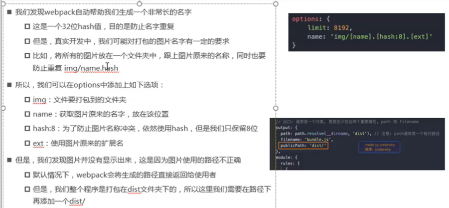
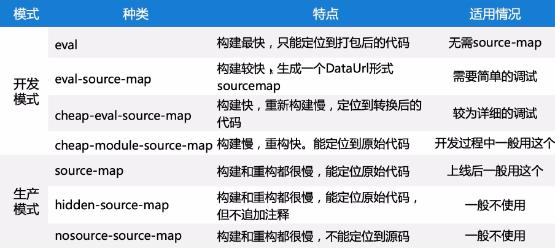

## 构建工具

JavaScript 构建工具改变并塑造了我们构建在 Web 上运行的项目的方式。构建工具是任何开发工作流的一个组成部分，它们包括（但不限于）Task Runner（任务运行器）、Transpiler、模块打包器、Linter、包管理器和开发服务器。

这些工具帮助开发人员高效地构建，并使开发过程变得更加简单（尽管配置它们可能会变得复杂）。

流行的构建工具例如：

- [Vite](https://vitejs.dev/) — 是一种新型前端构建工具，能够显著提升前端开发体验。
- [Webpack](https://webpack.js.org/) — 现代 JavaScript 应用程序的静态模块打包器。它的主要目的是捆绑 JavaScript 文件以在浏览器中使用，但它也能够转换、捆绑或打包几乎任何资源。
- [Parcel](https://parceljs.org/) — 一个 Web 应用程序捆绑器，以其开发人员体验而著称。它利用多核处理提供了极快的性能，并且需要零配置。
- [Rollup](https://rollupjs.org/) — 用于 JavaScript 的模块打包器，它将小段代码编译成更大更复杂的东西，例如库或应用程序。
- [Gulp](https://gulpjs.com/) — 自动化和增强工作流程的工具包
- [Grunt](https://gruntjs.com/) — 基于任务的 JavaScript 工程命令行构建工具。

```bash
grunt/gulp 的核心是 Task
可以配置一系列的 task，并自定义 task 要处理的事务（如ES6，ts转化，图片压缩，scss编译成css），之后 grunt/gulp 来依次自动化执行这些开发任务。


什么时候使用 grunt/gulp？
- 工程化模块依赖简单（如没有用到模块化等概念）
- 只需要进行简单的合并/压缩
- 如果是整个项目使用模块化管理，则使用 webpack。


### grunt/gulp 和 webpack 的区别
- grunt/gulp 更加强调流程的自动化，模块化不是它的核心。
- webpack 更加强调模块化开发管理，而文件压缩合并，预处理等功能是它附带的功能。

构建方式：
- Webpack：以模块为单位进行打包，支持各种模块化规范，能够将不同类型的文件视作模块，通过各种加载器进行处理和转换，并最终打包成静态资源文件。
- Gulp：基于流的自动化构建工具，采用代码优先原则，通过编写和组合任务来进行构建，能够实时监控文件变化并自动执行任务。
- Grunt：基于配置的自动化构建工具，通过编写和组合任务，使用配置文件来指定任务的执行顺序和参数。

配置方式：
- Webpack：通过编写配置文件（webpack.config.js）来配置打包规则、加载器和插件等。
- Gulp：通过编写任务函数和配置文件（gulpfile.js）来定义和组合任务。
- Grunt：通过编写任务函数和配置文件（Gruntfile.js）来定义和组合任务。

功能特点：
Webpack：主要用于模块打包和资源管理，支持代码拆分和按需加载，可以优化页面加载速度。
Gulp：主要用于任务执行和自动化构建，支持实时监控文件变化，并能够实现开发过程中的实时预览和调试。
Grunt：主要用于任务执行和自动化构建，支持多任务并行执行，可以同时执行多个任务提高构建效率。

如果项目需要进行模块化打包和资源管理，可以选择Webpack；如果需要灵活的任务编写和自动化构建，可以选择Gulp；如果对配置和任务编写要求较低，可以选择Grunt。
```


## Webpack

> ```bash
> ### 本地安装webpack
> npm install webpack -save-dev
> 
> 
> ### Entry 和 Output
> webpack的解析入口，项目的打包出口所在
> 
> 
> ### webpack打包：
> `webpack 被解析的文件路径 -o 存放打包文件所在的目录`
> webpack .\src\main.js .\dist\bundle.js	 #把main.js文件打包生成bundle.js文件
> 
> 
> 
> ### 编译 TypeScript 流程
> 1. 安装 typescript 和 ts-loader：npm i typescript ts-loader --save-dev
> 2. 在 webpack.config.js 配置文件中中写入 ts-loader 编译规则
> 3. 编写 tsconfig.json：类似于 .babelrc、ts-loader 的额外配置
> 
> 
> ### 观察应用变化 --watch
> - `$ npm webpack --watch`
> ```
>
> #### 安装webpack（需先安装nodejs）
>
> ```js
> //main.js
> //使用commonjs模块化规范
> const {add,mul} = require('./mathUtils.js')
> 
> console.log(add(20,39));
> console.log(mul(10,20));
> 
> //使用ES6模块化规范
> import {name,age,height} from './info'
> console.log(name);
> console.log(age);
> console.log(height);
> 
> //info.js
> export const name = 'Kobe';
> export const age = 14;
> export const height = 12.2;
> 
> //mathUtils.js
> function add(num1,num2){ return num1 + num2 }
> function mul(num1,num2){ return num1 * num2 }
> module.exports = { add, mul }
> ```
>
> **config.js和package.json的配置**
>
> ```bash
> #初始化定义，然后生成package.json文件
> npm init
> ```
>
> ```js
> //config.js配置
> const path = require('path')	//导入模块
> module.exports = {
>   entry: './src/main.js',	//入口
>   output: {	//出口
>     path: path.resolve(__dirname, 'dist'),	//resolve()对括号里面的路径进行拼接，__dirname是当前项目根路径
>     filename: 'bundle.js'
>   }
> }
> ```

### 原理

#### 为什么需要打包工具

```bash
### 为什么需要打包工具？
开发时，我们会使用框架（React、Vue）、ES6模块化语法、Less/Sass 等 CSS 预处理语言等语法进行开发，这样的代码要想在浏览器运行必须经过编译成浏览器能识别的 JS、CSS 语法才能运行。
打包工具能够对上述的高级语法编译成浏览器能识别的语法，而且打包还能压缩代码、做兼容性处理、提升代码性能等。
```


#### 对 Webpack 的理解

```bash
webpack 是一个静态模块的打包工具， 具有打包压缩、编译兼容、能力扩展等功能。其最初的目标是实现前端项目的模块化，也就是如何更高效地管理和维护项目中的每一个资源。
它会在内部从一个或多个入口点构建一个依赖图，然后将项目中所需的每一个模块组合成一个或多个 bundles 进行输出（均为静态资源）。输出的文件已经编译好了，可以在浏览器运行。


### 概述
- Webpack 是一种用于编译 JavaScript 模块的工具，也称为模块捆绑器（一个现代的js应用的静态模块化打包工具）。
- 常用 webpack 处理项目所编写的 js 代码，并且 webpack 会自动处理 js 之间相关的依赖。


### Webpack 作用
- 捆绑资源。
- 将 ES6+ 语法转译为 ES5代码，允许使用最新的 JavaScript 功能，而不必担心浏览器的支持限制。
- 将 typescript 转成 ES5 代码，将 CoffeeScript 转换为 JavaScript，将 scss/less 转成 css等。
- 将 .jsx、.vue 文件转成 js 文件等。
- 可将内联图像转换为 Data URL。
- 允许您对 CSS 文件使用 require()。
- 可以运行开发 Web 服务器。
- 可以处理热模块替换，监视更改并重新运行任务。
- 可以将输出文件拆分为多个文件，以避免在第一个页面命中时加载巨大的 js 文件。
- 可以执行 Tree Shaking（摇树）。
```


#### Webpack 解析流程

````bash
Webpack 的运行流程是一个串行的过程，从启动到结束会依次执行以下流程：
    1. 初始化参数：从配置文件和 Shell 语句中读取与合并参数，得出最终的参数。
    2. 开始编译：用上一步得到的参数初始化 Compilier 对象，加载所有配置的插件，执行对象的 run 方法开始执行编译。
    3. 确定入口：根据配置中的 entry 找出所有的入口文件。
    4. 编译模块：从入口文件出发，调出所有配置的 Loader 对模块进行翻译，再找出该模块依赖的模块，再递归本步骤直到所有入口依赖的文件都经过了本步骤的处理。
    5. 完成模块编译：在经过第 4 步使用 Loader 翻译完所有模块后，得到了每个模块被翻译后的最终内容以及它们之间的依赖关系。
    6. 输出资源：根据入口和模块之间的依赖关系，组装成一个个包含多个模块的 Chunk，再把每个 Chunk 转换成一个单独的文件加入到输出列表，这步是可以修改输出内容的最后机会。
    7. 输出完成：在确定好输出内容后，根据配置确定输出的路径和文件，把文件内容写入到文件系统。
在以上过程中，Webpack 会在特定的时间点广播出特定的事件，插件在监听到感兴趣的事件后会执行特定的逻辑，并且插件可以调用 Webpack 提供的 API 改变 Webpack 的运行结果。


### webpack 解析流程（简化版）
1. 初始化：启动构建，读取与合并配置参数，加载 Plugin，实例化 Compiler
2. 编译：从 Entry 出发，针对每个 Module 串行调用对应的 Loader 去翻译文件的内容，再找到该 Module 依赖的 Module，递归地进行编译处理
3. 输出：将编译后的 Module 组合成 Chunk，将 Chunk 转换成文件，输出到文件系统中


### npm run dev 时 webpack 做了什么事情？
1. 先执行 build/dev-server.js 文件
2. 检查 node 和 npm 的版本、引入相关插件和配置
3. webpack 对源码进行编译打包并返回 compiler 对象
4. 创建 express 服务器
5. 配置 开发中间件(webpack-dev-middleware) 和 热重载中间件(webpack-hot-middleware)
6. 挂在代理服务和中间件
7. 配置静态资源
8. 启动服务器并监听特定端口(8080) —— 创建的express服务器进行监听
9. 自动打开浏览器并打开特定网址(localhost:8080) —— express通过 open 方法进行打开
````


#### scss 文件在 webpack 中的编译打包过程是怎么样的？

1. 加载 scss：sass-loader 在 js 文件中根据模块化规则找到 scss 文件。
2. 编译 scss：sass 编译器将 scss 编译为 css。
3. css-loader 解析：根据 css-loader 对 css 文件进行加载并解析其中的 `@import` 和 `url()`。
4.  style-loader 工作：将 css 样式插入到 html 文件中。


### 解析器 loader

```bash
## 解析器 loader
使用 webpack 可以在 JavaScript 代码中使用 `import` 或 `require` 语句，不仅可以包括其他 JavaScript，还包括任何类型的文件，例如 CSS。
Webpack 旨在处理我们所有的依赖关系，而不仅仅是 JavaScript，而 loader 是实现此目的的一种方式。


### 常用的 loader
- css-loader、style-loader等css处理loader
- url-loader、image-loader等图片字体文件等资源处理loader
- less-loader、sass-loader、babel-loader等编译loader

1. babel-preset
  `npm i babel-loader @bable/core @babel/preset-env --save-dev`
  - Babel-preset 是存储 JavaScript 不同标准的插件，通过使用正确的 presets 告诉 babel 按照哪个规范编译
      - Target 是 preset的核心配置，告诉 preset 编译的具体目标
      - Target 可以以 browsers(通常情况下会用)、node的版本、特定的浏览器为目标

2. ES6 方法的编译
  `npm i babel-polyfill --save-dev`
  `npm i babel-plugin-transform-runtime babel-runtime --save-dev`
	- babel-polyfill 会生成一个全局对象
	- babel-transform-runtime 会生成一个局部对象

3. 引入解析 css 文件
- `npm i style-loader css-loader --save`
- css-loader：让 css 可以被 js 正确的引入
- style-loader：让 css 被引入后可以被正确的以一个 style 标签插入页面
- 注意：两者顺序很重要，要先引入 css-loader 处理，再由 style-loader 处理


### style-loader 核心配置
- insertAt：style 标签插入在哪一块区域
- insertInto：插入指定的dom
- singleton：是否合并为一个 style 标签
- transform：在浏览器环境下，插入 style 到页面前，用 js 对 css 进行操作


### css-loader 核心配置
- minimize：是否压缩 css
- module：是否使用 css 模块化
- alias：css 中的全局别名
```


#### loader案例

> ```bash
>#vscode安装loader配置（此为固定版本安装）
> npm install --save-dev css-loader@2.0.2 css
> npm install --save-dev style-loader@0.23.1 style
> npm install --save-dev less-loader@4.1.0 less@3.9.0
> npm install url-loader@1.1.2 --save-dev		#引用图片时调用
> npm install file-loader@3.0.1 --save-dev	#当图片大于所定义的大小时，需要引用
> npm install -save-dev babel-loader@7 @babel/core @babel/preset-es2015	#ES6转化为ES5
> npm install vue --save
> npm install --save-dev vue-loader@13.0. vue-template-compiler@2.5.21
> ```
> 
> ```js
>// webpack.config.js
> //引入loader
> //css-loader只负责将CSS文件进行加载，style-loader负责将样式添加到DOM中
> //使用多个loader时，use的引用是由右向左的
> module.exports = {
> entry: './src/main.js',
> output: {
> path: path.resolve(__dirname, 'dist'),
> filename: 'bundle.js',
>  publicPath: 'dist/'     //自动在前面拼接
>  },
>  module: {
> rules: [
> {
>    test: /\.js$/,
>      use: [
>        loader: 'babel-loader',
>        options: {
>        	presets: [
>        		['@babel/peset-env', {
>        			targets: {
>        				browsers: ['>1%', 'last 2 versions'], // 编译成大于1%浏览器支持的语言，即编译为es5
>        				node: 10,
>      					chrome: '59',
>    					}
>        		}]
>      		]
>        }
>      ],
>    },
>    {
>      test: /\.tsx?%/,
>      use: 'ts-loader'
>    },
>    {
>      test: /\.css$/i,
>      use: ["style-loader", "css-loader"]
>    },
>    {
>      test: /\.less$/,
>      use: [
>        {
>          loader: "style-loader",
>          options: {
>            insertInto: '#mydiv',
>            singleton: true,
>            transform: './transform.js',
>          }
>        },
>        {
>          loader: "css-loader",
>        },
>        {
>          loader: "less-loader",
>          options: {
>            lessOptions: {
>              strictMath: true
>            }
>          }
>        }
>      ]
>    },
>    {
>      test: /\.(png|jpg|gif)$/i,
>      use: [
>        {
>          loader: 'url-loader',
>          options: {
>            //当加载的图片小于limit时，会将图片编译成base64字符串形式
>            //当加载图片大于limit时，需要使用filte-loader模块进行加载，加载的图片会存入dist目录下
>            limit: 8192,
>            name: 'img/[name].[hash:8].[ext]'
>          }
>        }
>      ]
>    },
>    {
>      test: /\.vue$/,
>      loader:'vue-loader'
>    }
>    ],
>    },
>  resolve: {//vue环境的配置
> alias: {//alias(别名--起别的名字)
> 'vue$': 'vue/dist/vue.esm.js'
>  }
>    };
>  }
> ```
> 
> ```json
>// tsconfig.json
> {
>   "compilerOptions": {
>      "module": "commonjs",
>        "target": "es5"
>      },
>      "exclude": ["./node_modules"],
>   }
>   ```
> 
> **图片文件处理--修改文件名称**
>
> 


### 插件 plugin

```bash
## 插件 plugin
- webpack中的 plugin 是对webpack现有功能扩展，如打包优化，文件压缩。


### 常用插件
- 优化文件体积的插件：commonsChunkPlugin、uglifyjsWebpackPlugin、PurifyCSS等
- 额外功能的插件：HtmlWebpackPlugin、HotModuleReplacementPlugin等

- HtmlWebPlugin插件作用：
    - 自动生成一个index.html文件（可指定模块生成）
    - 将打包的js文件，自动通过script标签插入到body中

- UglifyJsPlugin插件作用：
		- 丑化js代码，在打包js代码时，会把注释等删掉
```


#### Loader 与 Plugin 的区别？

```bash
- loader主要用于转换某些类型的模块，是转换器
- plugin是插件，是扩展器


1. 性质上的区别：
- 'Loader' 本质就是一个函数，在该函数中对接收到的内容进行转换，返回转换后的结果。因为 Webpack 只认识 JavaScript，所以 Loader 需要对其他类型的资源进行转译的预处理工作。

- 'Plugin' 就是插件，基于事件流框架 'Tapable'，插件可以扩展 Webpack 的功能，在 Webpack 运行的生命周期中会广播出许多事件，Plugin 可以监听这些事件，在合适的时机通过 Webpack 提供的 API 改变输出结果。


2. 配置上的区别：
    - Loader 在 `module.rules` 中配置，作为模块的解析规则，类型为数组，每一项都是一个 Object，内部包含了 test（类型文件）、loader、options（参数） 等属性。
    - Plugin 在 `module.plugins` 中单独配置，类型为数组，每一项是一个 Plugin 的实例，参数都通过构造函数传入。
```


#### 插件案例

> ```cmd
> #打包html的plugin
> npm install html-webpack-plugin@3.2.0 --save-dev
> #js压缩的plugin（uglifyjs--即丑化js）
> npm install uglifyjs-webpack-plugin@1.1.1 --save -dev
> ```
>
> ```js
> // webpack.config.js
> const path = repuire('path')
> const webpack = require('webpack')
> const HtmlWebpackPlugin = require('html-webpack-plugin')
> const UglifyJsPlugin = require('uglifyjs-webpack-plugin')
>
> module.exports = {
>  plugins: [
>     new webpack.BannerPlugin('最终版权归willy所有'),
>     new HtmlWebpackPlugin({
>       template: 'index.html'	//默认搜寻当前路径下的index.html作为模板生成文件
>     }),
>     new UglifyJsPlugin()
>  ]
> }
> ```
>
> **webpack配置文件的抽离--merge插件**
>
> 因为有些配置最后打包才使用到，如：js代码的丑化（uglifyjs插件），因此需要分离配置文件，方便维护使用
>
> ```vscode-cmd
> npm install webpack-merge@4.1.5 --save-dev
> ```
>
> 在package.json中修改build和dev的文件
>
> ```package.json
> "build": "webpack --config ./build/prod.config.js",
> "dev": "webpack-dev-server --open --config ./build/dev.config.js
> ```
>
> 新建build文件，把webpack.config.js文件分离成base.config.js、dev.config.js、prod.config.js
>
> 通过调用base.config.js文件来运行
>
> ```js
> // dev.config.js、prod.config.js
> const UglifyJsPlugin = require('uglifyjs-webpack-plugin')
> const webpackMerge = require('webpack-merge')
> const baseConfig = require('./base.config')
> module.exports = webpackMerge(baseConfig, {
>    plugins: [new UglifyJsPlugin()]
>    })
>  ```

### 本地服务器 webpack-dev-server

> ```bash
> ## Webpack-dev-server 提供的常用额外功能
>   - 路径重定向
>   - 接口代理
>   - 浏览器中显示编译问题
>   - 热更新
>
>
> ## 本地服务器安装
> cnpm i webpack-dev-server --save-dev
>
>
> ## 属性说明
> - 本地服务器基于nodejs搭建，内部使用express框架，实现我们想要让浏览器刷新显示我们修改后的结果
> - deserver属性选项
>   - contentBase：为哪一个文件夹提供本地服务，默认为根文件夹，一般写./dist
>   - port：代理端口号,默认8080端口
>   - proxy：代理请求
>   - inline：服务的开启模式，可使得页面实时刷新
>   - historyApiFallback：路径重定向，在SPA页面中依赖HTML5的history模式
>   - open 参数表示直接打开浏览器
>   - hot：热更新
>   - lazy：懒编译
>   - overlay：错误遮罩
> ```

#### 搭建本地服务器配置

> ```js
> // webpack.config.js
> module.exports = {
>   	devServer: {
>        contentBase: './dist',
>        inline: true,
>        port: 8080,
>        overlay: true,
>
>        // 路径重定向,控制 html5的history模式的显示
>        historyApiFallback: {
>          rewrites: [
>            from: /^\/([ -~]+)/,
>            to: (context) => './' + context.match[1] + '.html'
>        ],
> 	},
>
>     // 接口代理
>     proxy: {
>        '^/api': {
>          target: 'http://localhost:3000', // 请求重定向
>            changeOrigin: true,
>              pathRewrite: { '^api': '/' },
>                headers: {},
>        },
>     },
>
>       // 热更新
>       hot: true,
>       hotOnly: true,
>   }
> }
> ```
>
> ```json
> // package.json
> {
> "script": {
>  "dev": "webpack-dev-server"
> }
> }
> ```

### 打包 output

> ```bash
> ## webpack 打包
> - Webpack 依赖于 Node 的环境与文件操作系统
> - Webpack 的打包过程就是利用 Node 去读取文件，然后进行一些字符串处理后，再利用 Node 去写入文件
>
>
> ### Webpack 打包流程
> 1. 读取配置文件
> 2. 注册内部插件与配置插件
> 3. loader 编译
> 4. 组织模块
> 5. 生成最终文件导出
>
>
> ### 打包结果分析
> (function(modules) {
> 	function __webpack_require__(moduleId){};
> 	return __webpack.require(
> 		__webpack_require__.s = './app.js'
> 	)
> })({
> 	"./app.js": (function(){}),
> 	"module1.js": (function(){}),
> 	"module2.js": (function(){}),
> })
> ```

#### loader编译

> ```bash
> ## loader 编译
> - Loader 是一个方法，接收一个字符串，方法内部处理完后再返回字符串
>
> module.exports = function(source) {
> 	return source
> }
> ```
>
> #### 案例
>
> ```js
> /* webpack.config.js */
> module.exports = {
>   entry: './src/main.js',
>   output: {
>    path: path.resolve(__dirname, 'dist'),
>    filename: 'bundle.js',
>   },
>   module: {
>    rules: [
>      {
>        test: '/\.willy$/',
>        use: './willy-loader' // 自定义 loader 文件
>      }
>    ],
>   },
> }
> ```
>
> ```js
> /* willy-loader/index.js */
> module.exports = function (resource) {
>   const result = resource.replace('log', 'console.log')
>   // this.callback(err, result, sourcemap) // callback可以使用捕获错误并返回
>   return result
> }
> ```
>
> ```willy
> /* src/test.willy  注意：需要在 main.js 入口文件中引入 */
> log('console log willy')
> ```

#### webpack打包速度优化

> 1. 使用`webpack-bundle-analyzer`对项目进行模块分析生成report，查看report后看看哪些模块体积过大，然后针对性优化，比如我项目中引用了常用的UI库element-ui和v-charts等
>
>     ```js
>     externals: {
>         'element-ui': 'Element',
>         'v-charts': 'VCharts'
>     }
>     ```
>
> 2. 配置webpack的externals ，防止将某些import的包(package)打包到 bundle 中，而是在运行时(runtime)再去从外部获取这些扩展依赖。
>     所以，可以将体积大的库分离出来：
>
> 3. 然后在main.js中移除相关库的import
>
> 4. 在index.html模板文件中，添加相关库的xcdn引用(如`<script src="https://unpkg.com/element-ui@2.10.0/lib/index.js"></script>`)

### 调试

#### source-map

```bash
### source-map
sourceMap是一项将编译、打包、压缩后的代码映射回源代码的技术，由于打包压缩后的代码并没有阅读性可言，一旦在开发中报错或者遇到问题，直接在混淆代码中 debug 会带来非常糟糕的体验， sourceMap 可以帮助我们快速定位到源代码的位置，提高我们的开发效率。

sourceMap 是一种源码的映射，所以会有一份映射的文件来标记混淆代码里对应的源码的位置，通常这份映射文件以 '.map' 结尾。
```



`.map` 文件的数据结构大致如下：

```json
{
  "version" : 3,                          // Source Map版本
  "file": "out.js",                       // 输出文件（可选）
  "sourceRoot": "",                       // 源文件根目录（可选）
  "sources": ["foo.js", "bar.js"],        // 源文件列表
  "sourcesContent": [null, null],         // 源内容列表（可选，和源文件列表顺序一致）
  "names": ["src", "maps", "are", "fun"], // mappings使用的符号名称列表
  "mappings": "A,AAAB;;ABCDE;"            // 带有编码映射数据的字符串
}

```

有了这份映射文件，我们只需要在压缩代码的最末端加上这句注释，即可让 sourceMap 生效：

```ruby
//# sourceURL=/path/to/file.js.map
```

有了这段注释后，浏览器就会通过`sourceURL`去获取这份映射文件，通过解释器解析后，实现源码和混淆代码之间的映射。因此 sourceMap 其实也是一项需要浏览器支持的技术。


#### Dev-server

> ```bash
> ## Dev-server
> - Dev-server 利用 express 和一个中间件 webpack-dev-middleware 来开启服务，然后开启的 server 会执行打包出来的代码
> ```
>
> ```js
> /* dev.js */
> const express = require('express')
> const webpackDevMid = require('webpack-dev-middleware')
> const webpackHotMid = require('webpack-hot-middleware')
> const webpack = require('webpack')
> const config = require('./webpack.config.js')
> const compiler = webpack(config)
>
> const app = express()
>
> // 开启自定义配置的本地服务器
> app.use(webpackDevMid(compiler, {}))
>
> // 开启热更新（需要遍历入口文件，开启更改）
> Object.keys(config.entry).forEach((name) => {
>   config.entry[name] = ['webpack-hot-middle/client?noInfo=true&reload=true'].concat(config.entry[name])
> })
> app.use(webpackHotMid(compiler, {
>   overlayStyles: true
> }))
> app.listen(2007)
> ```

### 优化

#### 减少构建时间

> ```bash
> ## Webpack 减少构建时间
> - Webpack 构建项目的速度很大程度上取决于项目的复杂度和电脑配置。确保项目在有足够的磁盘空间和良好的处理器情况下运行。
> - webpack 的 [Build Performance](https://webpack.docschina.org/guides/build-performance/) 章节提供了一些提高构建/编译性能的方法。
>
>
> ### 1. 保持最新的 Webpack、Node 和包管理器
> 使用最新的 webpack 版本（新优化），并且与 Node 版本同步，重点是 `npm/yarn/pnpm` 包管理器，较新的版本创建更高效的模块树并提高解析速度。
>
>
> ### 2. 优化 Loader 的文件搜索范围
> 通过使用 `include` 和 `exclude` 字段，仅将 loader 应用在实际需要将其转换的模块。
> 另外，将 Babel 编译过的文件缓存起来，下次只需要编译更改过的文件即可，这样可以大幅度加快打包时间。
>     module.exports = {
>       module: {
>         rules: [
>           {
>             test: /\.js$/,
>             loader: 'babel-loader?cacheDirectory=true',
>             include: path.resolve(__dirname, 'src'),
>             exclude: /node_modules/
>           }
>         ]
>       }
>     }
>
>
>
> ### 3.  别名 — `resolve.alias`
>     const path = require('path')
>     const resolve = (dir) => path.join(__dirname, dir)
>     module.exports = {
>       resolve: {
>         alias: { '@': resolve('src') }
>       }
>     }
>
>
>
> ### 4. 解析
> 减少以下方法条目数量，因为他们会增加文件系统调用的次数(层级不要过深)
> - `resolve.modules` 告诉 webpack 解析模块时应该搜索的目录。
> - `resolve.extensions` 尝试按顺序解析这些后缀名。如果有多个文件有相同的名字，但后缀名不同，webpack 会解析列在数组首位的后缀的文件 并跳过其余的后缀。
> - `resolve.mainFiles` 解析目录时要使用的文件名。
> - `resolve.descriptionFiles` 用于描述的 JSON 文件。
> - 如果不使用 symlinks（例如 `npm link` 或 `yarn link`），可以设置：
> 		`resolve: { symlinks: false }`
> - 如果你使用自定义 resolve plugin 规则，并且没有指定 context 上下文，可以设置：
> 		`resolve: { cacheWithContext: false }`
>
>
> ### 5. 减少项目体积
> 减少编译结果的整体大小，以提高构建性能。尽量保持 chunk 体积小
> - 使用数量更少/体积更小的 library（例如：`moment -> day.js`、`lodash -> lodash/es`）。
> - 在多页面应用程序中使用 SplitChunksPlugin，并开启 `async` 模式。
> - 移除未引用代码 — 涉及到了 Tree Shaking。
> - 只编译你当前正在开发的那些代码（缓存）。
>
>
>
> ## 6. 最小化 entry chunk
> 确保在生成 entry chunk 时，尽量减少其体积以提高性能。将 `optimization.runtimeChunk` 设置为 `true` 或 `'multiple'`，会为每个入口添加一个只含有 runtime 的额外 chunk。所以它的生成代价较低。
>     module.exports = {
>       // ...
>       optimization: {
>         runtimeChunk: true
>       }
>     }
>
>
>
> ## 7. 解析构建资源
> webpack 提供了 `thread-loader` 允许我们可以将耗时的 loader 放置在独立的线程下运行(`happypack` 插件已经未维护好几年，使用 `thread-loader` 替换)。
>     module.exports = {
>       module: {
>         rules: [
>           {
>             test: /\.js$/,
>             include: path.resolve('src'),
>             use: [
>               'thread-loader', // 注意，这里需要放置在第一位
>               // 后面放置耗时的 loader （例如 babel-loader）
>             ]
>           }
>         ]
>       }
>     }
>
> ```

#### 从bundle中排除某个导入

> ```bash
> ## 从bundle中排除某个导入: externals
> Webpack externals 告诉 Webpack 从 bundle 中排除某个导入。`external` 通常用于排除将通过 CDN 加载的导入。
>
> 如 `webpack.config.js` 将 `vue` 添加为 `externals`，这意味着 Webpack 不会捆绑 Vue。相反，当 `component.js` 调用 `require('vue')` 时，Webpack 将返回 `global.Vue`。
>
> `externals` 的另一个用例是需要在 Node.js 中使用 polyfill 的浏览器 API，比如 `FormData`。而 `FormData` 又是一个浏览器 API，所以在编译上述代码时不需要捆绑。因此，您可以将 `form-data` 添加到 `externals`：
> ```
>
> ```js
> module.exports = {
>      entry: {
>        component: `${__dirname}/component.js`
>      },
>      output: {
>        path: `${__dirname}/dist`,
>        filename: '[name].min.js'
>      },
>      target: 'web',
>      externals: {
>        // 去掉 require('vue')，返回 global.Vue
>        vue: 'Vue',
>        // 去掉 require('form-data')，返回 global.FormData
>        'form-data': 'FormData'
>      }
> }
> ```


## Vite

```bash
在浏览器支持 ES 模块之前，JavaScript 并没有提供原生机制让开发者以模块化的方式进行开发。
打包的概念：使用工具抓取、处理并将我们的源码模块串联成可以在浏览器中运行的文件，如webpack、Rollup 和 Parcel 等工具。
由于浏览器原生开始支持 ES 模块，Vite 利用 ES 模块化来解决 Webpack 构建速度慢，HMR(热更新)迟钝等问题。


#### 如何指定 vite 插件 的执行顺序？
可以使用 enforce 修饰符来强制插件的位置:
	- pre：在 Vite 核心插件之前调用该插件
	- 默认：在 Vite 核心插件之后调用该插件
	- post：在 Vite 构建插件之后调用该插件


#### vite 插件 常见的 hook
Vite 会在生命周期的不同阶段中去调用不同的插件以达到不同的目的.
	- config： 可用于修改 vite config，用户可以通过这个 hook 修改 config；例如 vite-aliases 这个插件可以帮助我们自动生成别名。它利用的就是这个钩子。
	- configResolved： 在解析 Vite 配置后调用，用于获取解析完毕的 config，在这个 hook 中不建议修改 config。
	- configureServer： 用于给 dev server 添加自定义 middleware；例如 vite-plugin-mock 插件就是在这个生命周期调用的
	- configurePreviewServer：与 configureServer 相同但是作为预览服务器。vite preview插件就是利用这个钩子。
	- transformIndexHtml：注入变量，用来转换 HTML 的内容。vite-plugin-html 插件就是利用这个钩子在html里注入变量。
	- handleHotUpdate：执行自定义 HMR 更新处理


#### Vite实现支持 commonjs 写法
纯业务代码，一般建议采用 ESM 写法。如果引入的三方组件或者三方库采用了 CJS 写法，vite 在预构建的时候就会将 CJS 模块转化为 ESM 模块。
如果非要在业务代码中采用 CJS 模块，可以自定义一个 vite 插件，定义 load hook，在 hook 内部识别是 CJS 模块还是 ESM 模块。如果是 CJS 模块，利用 esbuild 的 transfrom 功能，将 CJS 模块转化为 ESM 模块。
```


#### webpack 和 vite 的区别

```bash
#### 开发模式下，vite 比 webpack 的冷启动、热启动、热更新都会快的原因
一、使用 webpack 时，从 yarn start 命令启动，到最后页面展示，需要经历的过程：
    1. 以 entry 配置项为起点，做一个全量的打包，并生成一个入口文件 index.html 文件；
    2. 启动一个 node 服务；
    3. 打开浏览器，去访问入 index.html，然后去加载已经打包好的 js、css 文件；
在整个工作过程中，最重要的就是第一步中的全量打包，中间涉及到构建 module graph (涉及到大量度文件操作、文件内容解析、文件内容转换)、chunk 构建，这个需要消耗大量的时间。尽管在二次启动、热更新过程中，在构建 module graph 中可以充分利用缓存，但随着项目的规模越来越大，整个开发体验也越来越差。


二、使用 vite 时， 从 vite 命令启动，到最后的页面展示，需要经历的过程：
	1. 使用 esbuild 预构建依赖，提前将项目的第三方依赖格式化为 ESM 模块；
	2. 启动一个 node 服务；
	3. 打开浏览器，去访问 index.html；
	4. 基于浏览器已经支持原生的 ESM 模块, 逐步去加载入口文件以及入口文件的依赖模块。浏览器发起请求以后，dev server 端会通过 middlewares 对请求做拦截，然后对源文件做 resolve、load、transform、parse 操作，然后再将转换以后的内容发送给浏览器。
	在第四步中，vite 需要逐步去加载入口文件以及入口文件的依赖模块，但在实际应用中，这个过程中涉及的模块的数量级并不大，需要的时间也较短。而且在分析模块的依赖关系时， vite 采用的是 esbuild，esbuild 使用 Go 编写，比以 JavaScript 编写的打包器预构建依赖快 10-100 倍（webpack 就是采用 js ）


三、综上所述，开发模式下 vite 比 wekpack 快的原因
  1. vite 不需要做全量的打包，这是比 webpack 要快的最主要原因；
  2. vite 在解析模块依赖关系时，利用了 esbuild，更快（esbuild 使用 Go 编写，并且比以 JavaScript 编写的打包器预构建依赖快 10-100 倍）；
  3. 按需加载；模块之间的依赖关系的解析由浏览器实现。Vite 只需要在浏览器请求源码时进行转换并按需提供源码。根据情景动态导入代码，即只在当前屏幕上实际使用时才会被处理。
  4. 充分利用缓存；Vite 利用 HTTP 头来加速整个页面的重新加载（再次让浏览器为我们做更多事情）：源码模块的请求会根据 304 Not Modified 进行协商缓存，而依赖模块请求则会通过 Cache-Control: max-age=31536000,immutable 进行强缓存，因此一旦被缓存它们将不需要再次请求。


#### vite 跟 webpack 的优缺点
优点：
  1. 更快的冷启动：Vite 借助了浏览器对 ESM 规范的支持，采取了与 Webpack 完全不同的 unbundle 机制
  2. 更快的热更新：Vite 采用 unbundle 机制，所以 dev server 在监听到文件发生变化后，只需要通过 ws 连接通知浏览器去重新加载变化的文件，剩下的工作就交给浏览器去做了。


缺点：
  1. 开发环境下首屏加载变慢：由于 unbundle 机制，Vite 首屏期间需要额外做其它工作。不过首屏性能差只发生在 dev server 启动以后第一次加载页面时发生。之后再 reload 页面时，首屏性能会好很多。原因是 dev server 通过 HTTP 的协商缓存来将之前已经完成转换的内容缓存起来
  2. 开发环境下懒加载变慢：跟首屏加载变慢的原因一样。Vite 在懒加载方面的性能也比 Webpack 差。由于 unbundle 机制，动态加载的文件，需要做 resolve、load、transform、parse 操作，并且还有大量的 http 请求，导致懒加载性能也受到影响。
  3. webpack支持的更广。由于 Vite 基于ES Module，所以代码中不可以使用CommonJs；webpack更多的关注兼容性, 而Vite 关注浏览器端的开发体验。Vite目前生态还不如 Webpack。


注意：
	- 当需要打包到生产环境时，Vite使用传统的rollup进行打包，所以，vite的优势是体现在开发阶段，缺点也只是在开发阶段存在。
```


#### 指定 vite 插件 的执行顺序

```js
import { defineConfig } from 'vite';
import pluginA from 'vite-plugin-a';
import pluginB from 'vite-plugin-b';
import pluginC from 'vite-plugin-c';

export default defineConfig({
  plugins: [
    // pluginA 在 Vite 核心插件之前执行
    { ...pluginA(), enforce: 'pre' },

    // pluginB 在默认阶段执行
    pluginB(),

    // pluginC 在 Vite 核心插件之后执行
    { ...pluginC(), enforce: 'post' }
  ]
});
```


#### Tree Shaking

```bash
Tree-Shaking 是一种基于 ES Module 规范的 Dead Code Elimination 技术，它会在运行过程中静态分析模块之间的导入导出，确定 ESM 模块中哪些导出值未曾其它模块使用，并将其删除，以此实现打包产物的优化。


### 在 webpack 中启动 Tree Shaking
在 Webpack 中，启动 Tree Shaking 功能必须同时满足三个条件：
- 使用 ESM 规范编写模块代码
- 配置 optimization.usedExports 为 true，启动标记功能
- 启动代码优化功能，可以通过如下方式实现：
		- 配置 mode = production
		- 配置 optimization.minimize = true
		- 提供 optimization.minimizer 数组


### 实现原理
Webpack 中，Tree-shaking 的实现一是先「标记」出模块导出值中哪些没有被用过，二是使用 Terser 删掉这些没被用到的导出语句。标记过程大致可划分为三个步骤：
	- Make 阶段，收集模块导出变量并记录到模块依赖关系图 ModuleGraph 变量中
	- Seal 阶段，遍历 ModuleGraph 标记模块导出变量有没有被使用
	- 生成产物时，若变量没有被其它模块使用则删除对应的导出语句
	- （即是标记的效果就是删除没有被其他模块使用的导出语句）
```


#### vite项目修改依赖不更新，清除依赖缓存

```bash
### vite 报错问题展述
11:23:46 [vite] error while updating dependencies:
Error: ENOENT: no such file or directory, rename 'F:\项目\portfolio\packages\music-player\node_modules\.vite\deps_temp' -> 'F:\项目\portfolio\packages\music-player\node_modules\.vite\deps'
11:23:46 [vite] error while updating dependencies:
Error: ENOENT: no such file or directory, rename 'F:\项目\portfolio\packages\music-player\node_modules\.vite\deps_temp' -> 'F:\项目\portfolio\packages\music-player\node_modules\.vite\deps' (x2)


### github 的 vite 问题提出
https://github.com/vitejs/vite/issues/10839


### vite项目修改依赖不更新，清除依赖缓存的解决方案（个人尝试无法解决）
有些时候我们会直接修改依赖文件，但修改后没有更新，大多数情况下就是被缓存了

解决方法
1、手动删除node_modules/.vite
		Vite 会将预构建的依赖缓存到 node_modules/.vite;然后手动删除即可

2、强制vite重新构建依赖
		用 --force 命令行选项启动开发服务器
  “scripts”: {
  “dev”: “vite --force”
  },

vite的缓存只会在以下情况发生时重新构建
    - package.json 中的 dependencies 列表
    - 包管理器的 lockfile，例如 package-lock.json, yarn.lock，或者 pnpm-lock.yaml
    - 可能在 vite.config.js 相关字段中配置过的


### 个人解决
复制另一个项目中成功构建的 node_modules/.vite 文件夹过阿里
```


## Grunt/Gulp

```bash
### Gulp
Gulp 的主要特点包括代码的简洁性、易于使用、高度可配置、强大的插件系统、流式处理等。

Gulp 与 Grunt 区别
	- Gulp 使用代码而不是配置，通常更简洁；Gulp 利用 Node.js 流进行文件处理，
	- Grunt 使用临时文件；Gulp 的插件生态系统更为活跃。

Gulp 与 Webpack 的区别是什么？
Gulp 主要用于自动化构建和任务运行，而 Webpack 是一个模块打包器，专注于应用打包和模块管理。

Gulp 任务是如何工作的？
Gulp 任务是异步的，可以定义单个任务或任务序列。任务可以依赖其他任务，并且可以实时重新运行。

如何创建自定义 Gulp 任务？
在 gulpfile.js 中，使用 gulp.task() 方法定义任务，可以指定任务名称、依赖任务和执行函数。

Gulp 插件是如何工作的？
Gulp 插件可以扩展 Gulp 的功能，通过 gulp.src() 读取文件，通过 .pipe() 方法传递给插件处理，最后通过 gulp.dest() 输出处理后的文件。

如何为 Gulp 任务添加多个插件？
可以在 .pipe() 方法链中连续使用多个插件，每个插件都会处理前一个插件的输出。

Gulp 如何处理错误？
Gulp 插件可以监听 error 事件并处理错误，或者使用 gulp-plumber 插件来避免错误导致的任务中断。

Gulp 支持哪些类型的插件？
Gulp 支持多种类型的插件，包括文件处理插件、文件转换插件、服务器插件等。

如何实现 Gulp 的实时预览功能？
可以使用 gulp-connect 或 browser-sync 等插件实现 Gulp 的实时预览功能。


Gulp 的 watch 任务是如何实现的？
使用 gulp.watch() 方法监听文件系统的变化，当文件变化时自动执行定义的任务。

如何优化 Gulp 的性能？
可以通过减少不必要的文件操作、使用高效的插件、并行处理任务等方式优化 Gulp 的性能。

Gulp 支持哪些源码管理工具？
Gulp 可以与 Git 等源码管理工具结合使用，通过 Gulp 插件来管理版本控制的流程。

如何为 Gulp 编写复杂的任务逻辑？
可以使用 gulp.series() 来按顺序执行多个任务，或者使用 gulp.parallel() 来并行执行任务。

Gulp 的任务队列是如何工作的？
Gulp 的任务队列会按照定义的顺序执行任务，任务完成后会调用下一个任务。

Gulp 的 gulp.src() 和 gulp.dest() 方法有什么作用？
gulp.src() 用于指定 Gulp 需要处理的文件路径，gulp.dest() 用于指定处理后的文件输出路径。

Gulp 的配置文件是如何使用的？
可以在项目中创建一个 JSON 或 JavaScript 配置文件，然后在 gulpfile.js 中引入并使用这些配置。
```

```js
const grup = require('gulp')
const babel = require('gulp-babel')

// 将 src下的js文件转换成es5语法，并构建输出到dist文件中
gulp.task('js', () => {
  gulp.src('src/*.js')
  	.pipe(babel({ presets: ['es2015'] }))
  	.pipe(gulp.dest('dist'))
})
```


## Babel 原理

```bash
https://juejin.cn/post/6844903956905197576
https://juejin.cn/post/6844903961820921869
```

